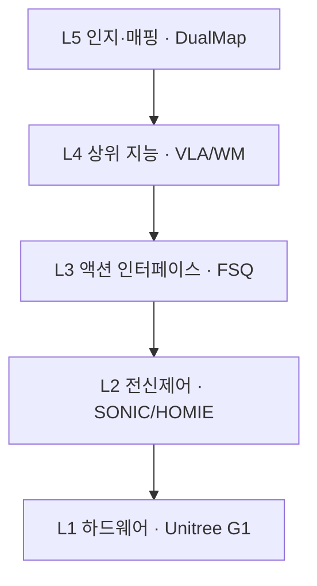

# lesson.md 골격 템플릿

> **섹션 순서는 고정입니다.** SSOT는 `docs/course-plan.md`의 §3.7(구조), §3.8(용어), §3.9(이해 사다리), §3.10(문장부호), §3.2(시각자료), §4(분량).
> 분량은 **본문 산문 문자**로 맞춥니다. Tier A는 12,000~18,000, B는 10,000~15,000, C는 9,000~13,000입니다. 초안은 중앙을 노리세요. 윤문이 산문을 2~5% 늘립니다. **A4 장수는 지표가 아닙니다.**
> 넘치는 유도와 계보 세부는 같은 폴더의 `deep-dive.md`로 빼고 본문에서 링크합니다.

---

````markdown
---
module: [W1-M3]
week: [1]
order: [3]
title: "[제목]"
slug: [topic-slug]
tier: [A|B|C]
priority: [P0|P1|P2]
prereq: [W1-M1]
tags: [tag1, tag2]
est_reading_min: [35]
updated: [YYYY-MM-DD]
sources_checked: [YYYY-MM-DD]
---

# [제목]

<!-- 한 줄 요약: 미정의 용어 0개. 이 문서에서 가장 평이한 문장이어야 합니다. -->
<!-- 나쁜 예: "5계층 스택과 지연 예산 부등식으로 action chunking의 대역폭 분리를 본다" (미정의 용어 4개) -->
<!-- 좋은 예: "로봇에 지능을 넣는 일이 왜 층으로 나뉘는지, 그 층 사이에 무엇이 오가는지를 봅니다" -->
> **한 줄 요약**: [평이한 한국어 한 문장]

---

## 0. 이 모듈 지도

**오늘의 질문.** 다 읽고 나면 이 셋에 답할 수 있습니다.

1. [질문 1]
2. [질문 2]
3. [질문 3]

| 절 | 무엇을 | 끝나면 할 수 있는 것 | 읽는 시간 |
|---|---|---|---|
| §1 | [배경] | [ ] | [3분] |
| §2 | [소주제] | [ ] | [7분] |
| §3 | [소주제] | [ ] | [8분] |
| §4 | 회사 스택 연결 | [ ] | [5분] |

<!-- 모듈 지도. 이 절들이 서로 어떻게 이어지는지. 「한 장 정리」에 같은 그림을 다시 씁니다 -->


**선수 지식**

| 알아야 할 것 | 어디서 채우나 | 몰라도 되는 것 |
|---|---|---|
| [ ] | [앞 모듈 링크 or 문서 내 §N] | [이 문서에서 설명함] |

<!-- prereq와 이 표가 사실과 일치해야 합니다. "없음(첫 모듈)"이라 써놓고 제어 배경을 가정하면 거짓입니다 -->

**소요**: 이론 _h / 실습 _h

> 📌 **여기까지 정리**
> - [1줄]
> - [1줄]
> - [1줄]

---

## 1. 왜 이걸 배우나

<!-- 용어를 최소로 쓰고 서사로. 어떤 문제가 있었고 왜 이 개념이 나왔는가 -->
<!-- 갭 영역이면 "처음 보는 것"임을 전제로, 강점 영역이면 "아는 것을 로봇 맥락으로 재해석"임을 명시 -->
<!-- 회사 스택의 어느 지점과 닿는지 여기서 예고만 (상세는 뒤 절에서) -->

[본문]

> 📌 **여기까지 정리**
> - [1줄]
> - [1줄]
> - [1줄]

---

## 2. [소주제]

<!-- 절 시작 용어표. 이 절에서 "처음" 나올 용어만. notes/glossary.md와 같은 형식이라 그대로 롤업됩니다 -->
| 용어 | 한 줄 정의 | 제어·LLM 비유 |
|---|---|---|
| **[용어]** | [정의] | [비유] |

<!-- 본문 순서: 개념, 직관, 수식, 그림. 형식이 서사보다 먼저 오면 안 됩니다 -->
<!-- 약어는 최초 1회 전개: MPC(Model Predictive Control, 모델 예측 제어) -->
<!-- 첫 등장은 **굵게**, 두 번째부터는 평문 -->

[개념을 말로 먼저]

[직관. 왜 그래야 하는가]

$$
[수식]
$$

- **직관**: [식이 말하는 것을 한 문장으로]
- **제어 대응**: [제어 개념 대응. 앵커로 쓰는 개념은 여기서 한 줄 재진술]

<!-- ASCII 블록도. 텐서 shape와 차원이 필요한 곳만. 입출력과 차원을 반드시 명시 -->
```
[입력: x  (B, T, D)]
        │
        ▼
   [ 블록 이름 ]
        │
        ▼
[출력: y  (B, T, D')]
```

> 📌 **여기까지 정리**
> - [1줄]
> - [1줄]
> - [1줄]

---

## 3. [소주제]

<!-- §2와 같은 3부 구조: 용어표, 본문, 정리 박스 -->

---

## 4. 회사 스택 연결 ★

<!-- 필수 섹션. 없으면 미완성입니다 -->


| 계층 | 이 모듈이 닿는 지점 | 확인 필요 여부 |
|---|---|---|
| L[N] | [ ] | [팀 확인 필요 / 공개 자료로 확인됨] |

<!-- 회사 내부 구현은 추측 금지 (course-plan §3.6). 모르면 "팀 확인 필요"로 두고 아래 「팀에 물어볼 것」에 적립 -->

---

## 5. 흔한 오해

<!-- 3가지 이상. 논증이 필요하므로 표가 아니라 소제목과 산문으로 씁니다 -->
<!-- 표 셀에 250자짜리 논증을 넣지 마세요. W1-M1이 그렇게 실패했습니다 -->

### 오해 1. "[오해 문장]"

[교정. 왜 틀렸고 실제로는 어떤가]

### 오해 2. "[오해 문장]"

[교정]

### 오해 3. "[오해 문장]"

[교정]

---

## 6. 한 장 정리

<!-- 필수 섹션. 이 절만 읽어도 모듈이 복기돼야 합니다 -->

| 절 | 핵심 한 줄 |
|---|---|
| §1 | [ ] |
| §2 | [ ] |
| §3 | [ ] |

<!-- §0의 모듈 지도를 그대로 재게시 -->


**이제 할 수 있게 된 것**

- [ ]
- [ ]
- [ ]

---

## 7. 셀프 체크 퀴즈

1. [문항]
2. [문항]
   <!-- ... 10문항 -->

<details>
<summary>정답 보기</summary>

1. [답]
2. [답]

</details>

---

## 8. 팀에 물어볼 것

<!-- notes/questions-for-team.md에도 복사 -->
1. [질문]
2. [질문]

---

## 9. 실습으로 가기

- [`practice/`](practice/): [무엇을 하는지]
- [`labs/`](labs/): [무엇을 하는지]

<!-- GPU가 필요해 집필 시점에 검증 못 했으면 배지 (course-plan §3.5) -->

---

## 10. 출처

- [제목](URL). arXiv:[ID], 확인 [YYYY-MM-DD]

---

## 더 깊이

<!-- deep-dive.md가 있을 때만 -->
- [`deep-dive.md`](deep-dive.md): [수식 전체 유도, 계보 연대기, 트레이드오프 심층]

---

**이전 토픽** ← [[제목]](../[NN-slug]/lesson.md)
**다음 토픽** → [[제목]](../[NN-slug]/lesson.md)
````

---

## 작성 시 반드시

**구조** (§3.7)

- 필수 섹션이라 삭제할 수 없는 것: `0. 이 모듈 지도`, `회사 스택 연결 ★`, `한 장 정리`, `셀프 체크 퀴즈`, `출처`
- 나머지는 주제에 따라 생략 가능하지만 **순서는 바꾸지 않습니다**
- 대절(H2)마다 **용어표(신규 용어가 있으면)와 `📌` 정리 박스**. `📌`만 이어 읽어도 줄거리가 잡혀야 합니다

**용어** (§3.8)

- 처음 쓰는 용어는 절 시작 표에 올리고 본문 첫 등장을 **굵게**
- **약어는 최초 1회 전개.** 전개 없이 끝나는 약어가 하나도 없어야 합니다
- **역참조 금지.** 정의보다 먼저 쓰면 그 자리에 한 줄 gloss나 `(→ §N)` 링크를 답니다
- **한 줄 요약과 §0에는 미정의 용어를 쓰지 않습니다**
- **표 셀에서 용어를 처음 소개하지 않습니다.** 셀에는 gloss 자리가 없습니다

**문장부호** (§3.10)

- **산문에 줄표(—)와 가운뎃점(·)을 쓰지 않습니다.** 한국어 문서에서 "기계가 썼다"는 인상을 가장 먼저 만드는 부호입니다
- 부연은 쉼표나 괄호로, 또는 문장을 나눕니다. 정의는 서술어를 줍니다(`X는 이런 것입니다`)
- **헤딩 부제는 한 구절로 합칩니다.** `## 1. 배경 — 왜 배우나`가 아니라 `## 1. 왜 이걸 배우나`
- 나열은 쉼표로, 두 항 대비는 `와/과`로. 콜론 부제(`X: Y`)도 대안이 아닙니다
- 예외는 표 셀, 코드블록, Mermaid 노드 라벨, frontmatter, 수식, 파일 경로, 외부 문헌 제목의 원문 인용입니다

**시각자료** (§3.2)

- **5종 이상**: ① 모듈 지도 ② 계보와 지형 ③ 아키텍처 ④ 회사 스택 연결 ⑤ 비교표
- **Mermaid는 흐름과 계보와 타이밍에**, **ASCII는 차원 표기가 필요한 블록도에**
- **표는 축이 2개 이상인 진짜 비교만.** 나열과 순차와 근거는 불릿, 논증은 산문과 소제목
- **표 10행 상한, 셀 120자 상한. 표 블록 수는 불릿 블록 수 이하**

**난이도** (§3.9)

- 제어와 ML은 기초 생략 가능. 단 **앵커로 쓰는 개념은 그 자리에서 한 줄 재진술**
- **LLM 응용 실무(Agent, RAG)는 있으나 생성모델 내부 기제(BPE, autoregressive, codebook, ELBO)는 갭입니다.** 가정하지 마세요
- 로봇 시뮬과 VLA와 WBC와 SLAM은 기초부터
- **설명 회피 문장 금지.** "제어 배경이면 설명이 필요 없을 겁니다" 같은 문장은 독자를 돕지 않습니다. 생략할 거면 링크를 주세요

**기타**

- 퀴즈 정답은 반드시 `<details>` 안에 (GitHub와 정적 사이트 모두 동작)
- 링크는 상대경로, 이미지는 `../../img/{module-id}-{slug}.png`
- 집필 후 **`bash scripts/lint-lesson.sh <파일>`** 로 위 항목을 기계 검사
