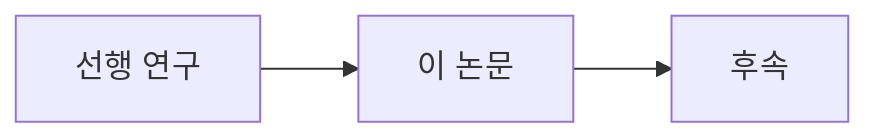
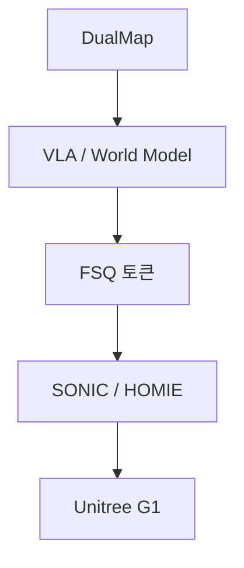

# lesson.md 골격 템플릿

> `pai-agent`가 이 골격을 채웁니다. 대괄호는 채울 자리, `<!-- -->` 주석은 작성 지침입니다.
> 섹션 순서는 고정입니다. 분량은 Tier(A 8~10장 / B 5~7장 / C 3~4장)에 맞춥니다.

---

```markdown
---
module: [W1-M3]
week: [1]
order: [3]
title: "[Diffusion 계보: DDPM → DiT]"
slug: [diffusion-ddpm-dit]
tier: [C]
priority: [P0]
prereq: [[W1-M1]]
tags: [[generative, diffusion, dit]]
est_reading_min: [25]
updated: [YYYY-MM-DD]
sources_checked: [YYYY-MM-DD]
---

# [제목]

> **한 줄 요약**: [이 모듈이 무엇을 다루는지 한 문장]

## 학습 목표

<!-- 3개 이상. "무엇을 할 수 있게 되는가"로 씁니다. -->
- [ ] [목표 1]
- [ ] [목표 2]
- [ ] [목표 3]

**완료 기준**: [무엇을 할 수 있으면 이 모듈을 끝낸 것인가 — 한 줄, 검증 가능하게]

**선수 지식**: [앞 모듈 링크] · **소요**: 이론 _h / 실습 _h

---

## 1. 왜 이것을 배우는가

<!-- 갭 영역이면 "처음 보는 것"임을 전제로, 강점 영역이면 "아는 것을 로봇 맥락으로 재해석"임을 명시 -->
<!-- 회사 스택의 어느 지점과 닿는지 여기서 한 번 예고 -->

## 2. 개념

<!-- 제어·LLM 비유를 적극 사용. 예: 보상 설계 ≈ 비용함수 설계 -->

### 2.1 [소주제]

### 2.2 [소주제]

## 3. 핵심 수식

<!-- 최소 유도 + 직관. 유도는 꼭 필요한 것만 1회 -->

$$
[수식]
$$

- **직관**: [이 수식이 말하는 바를 한 문단으로]
- **제어 대응**: [상태공간·최적제어 개념 중 무엇에 해당하는가]

## 4. 아키텍처

<!-- ASCII 블록도 — 입출력과 차원을 반드시 명시 -->

```
입력 x [B, T, D]
   │
   ▼
┌──────────────┐
│  [모듈명]     │  파라미터: [수]
└──────────────┘
   │  [B, T, D']
   ▼
출력 [설명]
```

<!-- 흐름·계보는 Mermaid -->



## 5. 회사 스택 연결 ★

<!-- 이 섹션이 없으면 미완성. L1~L5 중 어디에 닿는지, 어떤 인터페이스로 연결되는지 -->



| 계층 | 이 모듈이 닿는 지점 | 확인 필요 여부 |
|---|---|---|
| [L_] | [설명] | [팀 확인 필요 / 확정] |

<!-- 내부 구현을 모르면 추측하지 말고 "팀 확인 필요"로 표시 + notes/questions-for-team.md에 적립 -->

## 6. 비교표

<!-- 계보·트레이드오프·스펙 비교. lesson마다 최소 1개 -->

| 항목 | [A] | [B] | 시사점 |
|---|---|---|---|

## 7. 흔한 오해 3가지

| 오해 | 교정 |
|---|---|
| [오해 1] | [교정] |
| [오해 2] | [교정] |
| [오해 3] | [교정] |

## 8. 실습으로 가기

- 실습 코드: [`practice/`](practice/) — [무엇을 만드는지 한 줄]
- 랩 가이드: [`labs/`](labs/) — [단계 수, 예상 소요]

<!-- GPU가 필요하면 배지 -->
> ⚠️ **미검증(GPU 필요)** — 집필 시점에 실행 검증되지 않았습니다.
> 예상 소요: [인스턴스] 기준 약 [_]분. 실행 후 결과를 `docs/progress.md`에 기록하고 이 배지를 제거하세요.

## 9. 셀프 체크 퀴즈

<!-- 10문항. 백지 답변이 가능한 수준으로 -->

1. [문항]
2. …
10. [문항]

<details>
<summary>정답 보기</summary>

1. [답]
2. …
10. [답]

</details>

## 10. 출처

<!-- arXiv ID, GitHub URL, 공식 문서. 웹으로 확인한 것은 날짜 표기 -->

- [논문명] — arXiv:[ID]
- [리포명] — github.com/[org/repo] (확인: YYYY-MM-DD)

## 팀에 물어볼 것

<!-- notes/questions-for-team.md에도 복사 -->
- [질문 1]

---

**다음 토픽** → [[다음 모듈 제목]](../[NN-slug]/lesson.md)
```

---

## 채울 때 주의

- **시각자료 4종 이상**: 계보·지형 / 아키텍처 / 회사 스택 연결 / 비교표
- **Mermaid는 흐름·계보·타이밍**, **ASCII는 차원 표기가 필요한 블록도**
- 퀴즈 정답은 반드시 `<details>` 안에 (GitHub·정적 사이트 모두 동작)
- 링크는 상대경로, 이미지는 `../../img/{module-id}-{slug}.png`
- 섹션이 불필요하면 삭제해도 되지만 **학습 목표 · 회사 스택 연결 · 퀴즈 · 출처는 필수**
