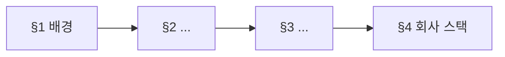
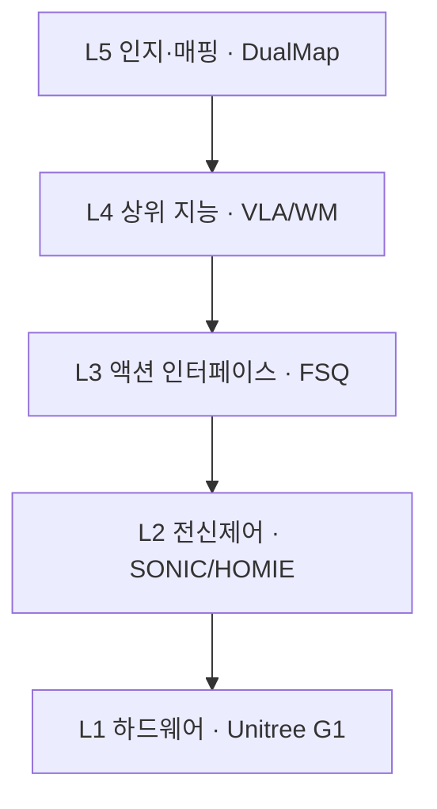
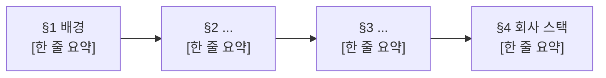

# lesson.md 골격 템플릿

> **섹션 순서는 고정입니다.** SSOT는 `docs/course-plan.md`의 §2.1(3층 문서), §3.1(frontmatter), §3.2(시각자료), §3.7(문서 구조), §3.8(용어 도입), §3.9(학습자 전제와 비유), §3.10(문장부호), §3.11(독자를 데려가는 장치), §4(분량)입니다.
> **한 모듈의 읽을거리는 세 층입니다.** 읽는 순서는 `eli5.md` → `lesson.md` → `deep-dive.md`이고 **이 템플릿은 가운데 층**입니다. `eli5.md` 골격은 [`eli5-template.md`](eli5-template.md)에 있고, `deep-dive.md`는 본문에서 덜어낸 심화를 받습니다(있을 때만).
> 분량은 **본문 산문 문자**로 맞춥니다. ⚠️ **밴드 숫자는 이 템플릿에 적지 않습니다.** 정본은 `scripts/lint-lesson.sh`와 `docs/course-plan.md` §4 두 곳뿐이고, 집필이 끝나면 `bash scripts/lint-lesson.sh <파일>`로 확인합니다. 밴드 숫자를 여러 문서에 복사해둔 것이 3중 불일치를 **세 번** 재발시켰고(§9.11, §9.19, 2026-08-30 상향 누락), 이 줄 자신이 그 경고를 적어두고도 같은 짓을 하고 있었습니다. 2026-09-01에 숫자를 지웠습니다.
> **이 밴드는 잠정입니다.** 2026-09-01에 한 번 올렸고, 7개 모듈이 전부 2차 규약으로 재작성된 뒤 실측으로 확정합니다. 초안은 중앙을 노리세요. 윤문이 산문을 2~5% 늘립니다. **A4 장수는 지표가 아닙니다.** **Tier C는 2026-09-01에 폐지됐고 `tier:`에 넣을 값은 A와 B뿐입니다.**
> 넘치는 유도와 계보 세부는 같은 폴더의 `deep-dive.md`로 빼고 본문에서 링크합니다.

---

````markdown
---
module: [W1-M3]
week: [1]
order: [3]
title: "[제목]"
slug: [topic-slug]
tier: [A|B]
priority: [P0|P1|P2]
prereq: [W1-M1]
tags: [tag1, tag2]
est_reading_min: [35]   # 초독 시간입니다. 산문과 표와 그림과 수식과 퀴즈 풀이를 전부 포함합니다(§4).
                        # §0의 「소요」와 반드시 정합해야 합니다. 회귀식 값을 여기 쓰지 마세요
updated: [YYYY-MM-DD]
sources_checked: [YYYY-MM-DD]
---

# [제목]

<!-- 한 줄 요약: 미정의 용어 0개. 이 문서에서 가장 평이한 문장이어야 합니다. -->
<!-- 나쁜 예: "5계층 스택과 지연 예산 부등식으로 action chunking의 대역폭 분리를 본다" (미정의 용어 4개) -->
<!-- 좋은 예: "로봇에 지능을 넣는 일이 왜 층으로 나뉘는지, 그 층 사이에 무엇이 오가는지를 봅니다" -->
> **한 줄 요약**: [평이한 한국어 한 문장]

<!-- eli5로 가는 되돌이 링크. §2.1이 정한 읽는 순서를 본문 쪽에서도 안내합니다 -->
> 처음 보는 주제라면 [eli5.md](eli5.md)를 먼저 읽으세요. 그림으로 감을 잡고 오면 이 문서가 훨씬 잘 읽힙니다.

---

## 0. 이 모듈 지도

<!-- ★H2 다음 첫 요소는 반드시 산문입니다(§3.7). §0도 예외가 아니고, 목차 표나 Mermaid가
     먼저 오면 lint FAIL입니다. 이 모듈이 무엇을 다루고 왜 이 순서인지를 말하는 자리입니다 -->

[도입 산문 2~3문장]

**오늘의 질문.** 다 읽고 나면 이 셋에 답할 수 있습니다.

1. [질문 1]
2. [질문 2]
3. [질문 3]

<!-- 목차 표. 절별 「읽는 시간」의 합이 frontmatter est_reading_min과 맞아야 합니다.
     회귀식을 절마다 쓰지 마세요. 상수항 19.5분이 절 수만큼 더해져 합이 부풀어 오릅니다 -->
| 절 | 무엇을 | 끝나면 할 수 있는 것 | 읽는 시간 |
|---|---|---|---|
| §1 | [배경] | [ ] | [3분] |
| §2 | [소주제] | [ ] | [7분] |
| §3 | [소주제] | [ ] | [8분] |
| §4 | 회사 스택 연결 | [ ] | [5분] |

<!-- 모듈 지도. 이 절들이 서로 어떻게 이어지는지. 「한 장 정리」에서 라벨을 더해 다시 씁니다 -->


<!-- 「읽는 법」 캡션. 모든 그림에 필수입니다(§3.2). 어디를 먼저 보고 무엇을 따라가라고 지시합니다 -->
**읽는 법.** [1~3문장]

**선수 지식**

| 알아야 할 것 | 어디서 채우나 | 몰라도 되는 것 |
|---|---|---|
| [ ] | [앞 모듈 링크 or 문서 내 §N] | [이 문서에서 설명함] |

<!-- 안다고 가정할 수 있는 것은 ML/DL 기본과 LLM 기본과 Agent/RAG 실무 셋뿐입니다(§3.9).
     제어공학은 「알아야 할 것」이 아니라 이 문서가 처음부터 가르칠 대상이고,
     prereq에는 앞 모듈에서 실제로 배운 것만 올립니다 -->

**소요**: 이론 _h / 실습 _h

<!-- ★「소요」의 이론 시간이 frontmatter est_reading_min과 정합해야 합니다. W1-M1은 4.6배 어긋나 있었습니다(§4) -->

> 📌 **여기까지 정리**
> - [1줄]
> - [1줄]
> - [1줄]

---

## 1. 왜 이걸 배우나

<!-- ★도입 산문이 첫 요소입니다. 용어를 최소로 쓰고 서사로. 어떤 문제가 있었고 왜 이 개념이 나왔는가 -->
<!-- 모든 영역을 처음부터 설명합니다. 영역별 차등(구 「이해 사다리」)은 폐기됐고(§3.9),
     "제어 배경이면 아실 겁니다" 류의 설명 회피 문장은 FAIL입니다 -->
<!-- 회사 스택의 어느 지점과 닿는지 여기서 예고만 합니다 (상세는 §4에서) -->

[도입 산문 3~5문장]

[본문]

| 용어 | 이 절에서 나온 뜻 |
|---|---|
| **[용어]** | [이 절에서 쓴 뜻 한 줄] |

> 📌 **여기까지 정리**
> - [1줄]
> - [1줄]
> - [1줄]

---

## 2. [소주제]

<!-- ★절은 4부 구조입니다(§3.7). 도입 산문, 본문, 절 끝 되짚기 표, 📌 정리 박스.
     폐지된 3부 구조(절 시작 용어표, 본문, 📌)로 되돌아가지 마세요 -->

<!-- ① 도입 산문 3~5문장. ★필수이고 표와 그림과 코드펜스보다 먼저 옵니다.
     H2 다음 첫 비어있지 않은 줄이 표나 코드펜스나 Mermaid면 lint FAIL입니다.
     1) 앞 절에서 무엇을 봤는지 2) 그래서 무엇이 아직 안 풀렸는지
     3) 이 절에서 무엇에 답할지, 각각 한 문장씩 -->

[도입 산문 3~5문장]

### 2.1 [소주제]

<!-- ② 본문. 순서는 개념, 그림, 예시와 숫자, 수식과 손계산, 비유 박스입니다(§3.7).
     형식이 서사보다 먼저 오면 독자는 자기가 무엇을 보는지 모르는 채로 그림을 마주칩니다 -->

<!-- ②-1 개념을 쉬운 말로. 새 용어는 첫 등장 자리에서 2~3문장 산문으로 풀어 씁니다.
     무엇인지, 왜 필요한지, 어떤 일을 하는지. 정의보다 먼저 쓰면 역참조이고 FAIL입니다(§3.8).
     첫 등장은 **굵게**, 두 번째부터는 평문. 약어는 최초 1회 전개하고 그 뒤로도
     첫 세 번은 한국어를 병기합니다. 예: MPC(Model Predictive Control, 모델 예측 제어) -->

[개념을 말로 먼저. 정의를 그 자리에서 2~3문장으로]

<!-- ②-2 그림. Mermaid는 흐름과 계보와 타이밍에, ASCII는 차원 표기가 필요한 블록도에,
     SVG는 공간 배치가 의미를 나르는 개념 그림에 (diagram-design 스킬로 만들어 img/에 저장).
     ★ASCII는 한 블록 20줄 상한이고 넘으면 조각냅니다. ★한글 폭 정렬이 필요한 그림은 만들지 마세요.
     ★라벨과 필드명에서 용어를 처음 소개하지 않습니다. 본문에서 이미 정의한 것만 씁니다(§3.8) -->
```
[입력: x  (B, T, D)]
        │
        ▼
   [ 블록 이름 ]
        │
        ▼
[출력: y  (B, T, D')]
```

**읽는 법.** [1~3문장. 어디를 먼저 보고 무엇을 비교할지]

<!-- ②-3 구체 예시와 숫자 -->
[예시]

<!-- ②-4 수식과 손계산. ★수식만 두고 넘어가지 않습니다(§3.11).
     모든 기호를 그 자리에서 정의하고, 기호가 셋을 넘으면 수식 옆에 기호표를 답니다 -->

$$
[수식]
$$

- **직관**: [식이 말하는 것을 한 문장으로]
- **기호**: [기호 하나하나가 무엇을 가리키는지]

<!-- 워크드 예제. 계산이 나오는 절마다 최소 1개입니다. 결과만 제시하고 계산을 practice/*.py로
     외주하지 마세요. 실습 코드는 검산용이지 최초 이해용이 아닙니다(W1-M1 실측 0개).
     아래는 §3.11의 형식 예시(청크 길이 계산)이고 자리 표시이므로 모듈 내용으로 채웁니다 -->

**숫자를 넣어봅니다.** [전제할 값을 문장으로. 보기: 하위 제어가 50 Hz, 상위가 5 Hz, 추론에 100 ms, 통신에 20 ms가 든다고 합시다]

1. [1단계. 보기: 재계획 주기는 상위 주파수의 역수이므로 1 / 5 = 0.2초, 즉 200 ms입니다]
2. [2단계. 보기: 다음 청크가 올 때까지 버틸 시간은 200 + 100 + 20 = 320 ms입니다]
3. [3단계. 보기: 하위가 50 Hz이므로 320 ms 동안 0.320 × 50 = 16개를 소비합니다]
4. [결론. 보기: 그래서 청크는 최소 16개짜리여야 합니다]

<!-- ②-5 비유 박스. 선택이고 ★절당 최대 1개입니다(§3.9). 본문은 비유 없이 완결돼야 합니다.
     비유를 전부 지웠을 때 이해에 구멍이 생기면 그것은 설명이 아니라 비유에 기댄 것입니다.
     ★박스 안에서도 앵커 개념을 한 문단으로 재설명합니다. "그 관행"처럼 지시어로 넘어가지 않습니다 -->

<details>
<summary>💡 [앵커 개념]을 아신다면 (몰라도 됩니다)</summary>

[앵커 개념이 무엇인지 한 문단으로 처음부터 재설명]

[그래서 앞에서 본 것과 어떻게 같은 구조인지]
</details>

<!-- 헷갈림 박스. 선택이고 오해가 생기기 쉬운 바로 그 자리에 답니다(§3.11).
     「흔한 오해」는 문서 끝에 몰려 있어 정작 헷갈리는 자리에서 도움이 되지 않습니다 -->

> ⚠️ **여기서 많이 헷갈립니다**
> [흔히 이렇게 생각하기 쉽습니다]
> [그런데 실제로는 이렇습니다]

<!-- ③ 되짚기 표. ★절 끝이고 이 절에서 처음 나온 용어만 올립니다. ★2열입니다.
     `제어·LLM 비유` 열을 두면 FAIL이고(§3.9), ★절 시작 용어표는 폐지됐으므로
     이 표를 절 머리로 옮기지 마세요(§3.8). 이 표가 notes/glossary.md 롤업의 소스입니다 -->

| 용어 | 이 절에서 나온 뜻 |
|---|---|
| **[용어]** | [이 절에서 쓴 뜻 한 줄] |

<!-- ④ 정리 박스. 대절마다 답니다. 이 박스만 이어 읽어도 줄거리가 잡혀야 하고, 문체는 합니다체입니다 -->

> 📌 **여기까지 정리**
> - [1줄]
> - [1줄]
> - [1줄]

---

## 3. [소주제]

<!-- §2와 같은 4부 구조입니다. 도입 산문 3~5문장, 본문(개념, 그림, 예시와 숫자, 수식과 손계산, 비유 박스), 되짚기 표 2열, 📌 정리 박스 -->

---

## 4. 회사 스택 연결 ★

<!-- 필수 섹션이고 없으면 미완성입니다. ★도입 산문이 첫 요소이며, H2 다음 첫 요소가 Mermaid면 lint FAIL입니다 -->

[도입 산문 3~5문장. 이 모듈이 스택의 어느 층에 어떻게 걸리는지]

<!-- Mermaid 노드 라벨의 가운뎃점은 §3.10 예외(노드 라벨)라 그대로 둡니다.
     다만 ★라벨에서 용어를 처음 소개하지 않습니다. 본문에서 이미 정의한 것만 씁니다(§3.8) -->


**읽는 법.** [1~3문장. 어느 층을 먼저 보고 이 모듈이 어디에 꽂히는지]

| 계층 | 이 모듈이 닿는 지점 | 확인 필요 여부 |
|---|---|---|
| L[N] | [ ] | [팀 확인 필요 / 공개 자료로 확인됨] |

<!-- 회사 내부 구현은 추측 금지(§3.6). 모르면 「팀 확인 필요」로 두고 「팀에 물어볼 것」에 적립 -->

> 📌 **여기까지 정리**
> - [1줄]
> - [1줄]
> - [1줄]

---

## 흔한 오해

<!-- ★도입 산문이 첫 요소입니다. 3가지 이상이고, 논증이 필요하므로 표가 아니라 소제목과 산문으로 씁니다.
     표 셀에 250자짜리 논증을 넣지 마세요. W1-M1이 그렇게 실패했습니다 -->

[도입 산문 3~5문장]

### 오해 1. "[오해 문장]"

[교정. 왜 틀렸고 실제로는 어떤가]

### 오해 2. "[오해 문장]"

[교정]

### 오해 3. "[오해 문장]"

[교정]

---

## 한 장 정리

<!-- 필수 섹션이고 이 절만 읽어도 모듈이 복기돼야 합니다. ★도입 산문이 첫 요소입니다 -->

[도입 산문 2~3문장]

<!-- 절별 요약 표. ★합니다체로 씁니다. 음슴체가 섞이면 한 문서에서 두 목소리가 납니다(§3.11) -->
| 절 | 핵심 한 줄 |
|---|---|
| §1 | [ ] |
| §2 | [ ] |
| §3 | [ ] |

<!-- §0의 모듈 지도 재게시. ★§0과 완전 동일 복제 금지입니다(§3.2).
     진행 표시나 절별 한 줄 요약 라벨을 더해 다른 정보를 주게 합니다 -->


**읽는 법.** [1~3문장. §0의 지도에서 무엇이 더해졌는지]

<!-- 자기 설명 프롬프트 1개(§3.11). 덮고 말해보게 하는 능동 회상 장치이고 다시 읽는 것보다 오래 남습니다 -->

**덮고 말해보세요.** [이 그림을 보지 않고 무엇을 순서대로 말해보라는 지시 한두 문장]. 막히는 곳이 있으면 그 절로 돌아가면 됩니다.

**이제 할 수 있게 된 것**

- [ ]
- [ ]
- [ ]

---

## 셀프 체크 퀴즈

<!-- ★도입 산문이 첫 요소입니다. ★3단 난이도이고(§3.11) 10문항을 전부 서술형 고난도로 내지 않습니다.
     문항은 평서형 질문으로 씁니다. `계산하라`가 아니라 `계산해보세요` -->

[도입 산문 2~3문장]

**기억 확인** (한 줄로 답이 나오는 것. 용어와 숫자와 순서)

1. [문항]
2. [문항]
3. [문항]
4. [문항]

**적용** (배운 것을 새 상황에 넣어보는 것)

5. [문항]
6. [문항]
7. [문항]
8. [문항]

**종합** (여러 절을 엮어 논증하는 것)

9. [문항]
10. [문항]

<details>
<summary>정답 보기</summary>

1. [답]
2. [답]

</details>

---

## 팀에 물어볼 것

<!-- notes/questions-for-team.md에도 복사 -->
1. [질문]
2. [질문]

---

## 실습으로 가기

- [`practice/`](practice/): [무엇을 하는지]
- [`labs/`](labs/): [무엇을 하는지]

<!-- GPU가 필요해 집필 시점에 검증 못 했으면 배지 (course-plan §3.5) -->

---

## 출처

- [제목](URL). arXiv:[ID], 확인 [YYYY-MM-DD]

---

## 더 깊이

<!-- deep-dive.md가 있을 때만 -->
- [`deep-dive.md`](deep-dive.md): [수식 전체 유도, 계보 연대기, 트레이드오프 심층]

---

**이전 토픽** ← [[제목]](../[NN-slug]/lesson.md)
**다음 토픽** → [[제목]](../[NN-slug]/lesson.md)
````

---

## 작성 시 반드시

**구조** (§3.7)

- 필수 섹션이라 삭제할 수 없는 것은 `0. 이 모듈 지도`, `회사 스택 연결 ★`, `한 장 정리`, `셀프 체크 퀴즈`, `출처`입니다. 나머지는 주제에 따라 생략 가능하지만 **순서는 바꾸지 않습니다**
- **절은 4부 구조입니다.** 도입 산문 3~5문장, 본문, 절 끝 되짚기 표, `📌` 정리 박스. 폐지된 3부 구조(절 시작 용어표, 본문, `📌`)로 되돌아가지 마세요
- **H2 다음 첫 비어있지 않은 줄이 표나 코드펜스나 Mermaid면 FAIL입니다.** §0과 「회사 스택 연결」과 「한 장 정리」와 퀴즈도 예외가 아닙니다
- 절 안의 순서는 **개념, 그림, 예시와 숫자, 수식과 손계산, 비유 박스**입니다. 형식이 서사보다 먼저 오지 않게 합니다
- **번호는 §0부터 「회사 스택 연결」까지만 붙입니다.** 「흔한 오해」 이후의 부록성 절에는 번호를 붙이지 않습니다. `scripts/lint-lesson.sh`가 **번호로 본문 절과 부록 절을 가르고**, 번호 붙은 절마다 `📌` 박스를 요구하기 때문입니다
- `📌` 박스는 번호 붙은 본문 대절마다 답니다. **이 박스만 이어 읽어도 줄거리가 잡혀야** 합니다. 되짚기 표는 그 절에서 처음 나온 용어가 있을 때 답니다

**학습자 전제** (§3.9)

- **안다고 가정하는 것은 셋뿐입니다.** ML/DL 기본(학습, 손실, 신경망, 과적합), LLM 기본(프롬프트, 토큰이라는 말, 파인튜닝), Agent와 RAG 응용 실무
- **그 밖은 전부 모른다고 가정합니다.** 제어공학 전반, 생성모델 내부 기제, 로봇 전 영역, 그리고 이 모듈이 다루는 개념 자체
- **제어는 앵커가 아니라 가르쳐야 할 대상입니다.** 캐스케이드 제어, 대역폭 분리, MPC의 예측 지평, PD 서보를 쓰려면 한 문단을 들여 처음부터 설명합니다
- **영역별 차등이 없습니다.** 어떤 영역만 압축하고 어떤 영역만 기초부터 쓰는 배분(구 「이해 사다리」)은 폐기됐습니다
- **"이미 아신다" 류와 설명 회피 문장 금지.** `이미 아실`, `익숙하실`, `아실 겁니다`, "제어 배경이면 설명이 필요 없을 겁니다"를 쓰지 않습니다. 생략할 거면 **대신 링크를 주세요**
- `prereq`와 「선수 지식」이 이 전제와 일치해야 합니다. **앞 모듈에서 배운 것만 `prereq`에 올립니다**

**비유는 보조입니다** (§3.9)

- **본문은 비유 없이 완결돼야 합니다.** 문서에서 비유를 전부 지웠을 때 이해에 구멍이 생기면 그것은 설명이 아니라 비유에 기댄 것입니다
- 비유는 본문 설명이 끝난 뒤 `<details>` 박스로 답니다. **절당 최대 1개**이고, 여러 개가 필요하면 그 절의 본문 설명이 부족하다는 뜻입니다
- **박스 안에서도 앵커 개념을 한 문단으로 재설명합니다.** "그 관행"처럼 지시어로 넘어가지 않습니다
- **되짚기 표에 `제어·LLM 비유` 열을 두면 FAIL입니다.** 이 열이 비유를 문서 골격으로 승격시켰고, W1-M1 실측으로 비유 지점 50개 중 36개가 이 열이었습니다

**용어** (§3.8)

- **첫 등장 자리에서 2~3문장 산문으로 풀어 씁니다.** 무엇인지, 왜 필요한지, 어떤 일을 하는지를 말합니다. 한 줄 정의는 **절 끝 되짚기 표**에만 둡니다
- **되짚기 표는 `| 용어 | 이 절에서 나온 뜻 |` 2열입니다.** 이 표가 `notes/glossary.md` 롤업의 소스입니다
- **역참조 금지 (FAIL로 승격).** 정의보다 먼저 쓰지 않습니다. 한 줄 gloss나 `(→ §N)` 링크로 때우는 것은 이제 허용되지 않고, 정의를 그 자리로 옮기거나 사용을 미룹니다
- **약어는 최초 1회 전개.** 전개 없이 끝나는 약어가 하나도 없어야 하고, **전개 이후에도 첫 세 번은 한국어를 병기**합니다
- **다이어그램 라벨과 ASCII 블록도 필드명에서 용어를 처음 소개하지 않습니다.** 그림에는 본문에서 이미 정의한 용어만 씁니다
- **표 셀에서 용어를 처음 소개하지 않습니다.** 셀에는 풀어 쓸 자리가 없습니다. **한 줄 요약과 §0에도 미정의 용어를 쓰지 않습니다**
- 본문 첫 등장은 **굵게**, 두 번째부터는 평문

**독자를 데려가는 장치** (§3.11)

- **워크드 예제는 필수입니다.** 수식이나 계산이 나오는 절마다 최소 1개, 실제 숫자를 대입해 손으로 따라가는 예제입니다. 계산을 `practice/*.py`로 외주하지 마세요. 실습 코드는 **검산용**이지 최초 이해용이 아닙니다
- **모든 기호는 그 자리에서 정의합니다.** 기호가 셋을 넘으면 수식 옆에 기호표를 답니다
- **「여기서 많이 헷갈립니다」 박스**를 오해가 생기기 쉬운 바로 그 자리에 답니다. 「흔한 오해」는 문서 끝이라 정작 헷갈리는 자리에서 도움이 되지 않습니다
- **퀴즈는 3단 난이도.** 기억 확인 1~4번, 적용 5~8번, 종합 9~10번이고 문항은 **평서형 질문**으로 씁니다
- **문체를 통일합니다.** 본문과 `📌` 박스와 「한 장 정리」 표와 퀴즈를 **전부 합니다체**로. W1-M1은 한 문서 안에서 세 목소리가 났습니다
- **자기 설명 프롬프트 1개**를 「한 장 정리」에 둡니다

**문장부호** (§3.10)

- **산문에 줄표(—)와 가운뎃점(·)을 쓰지 않습니다.** 한국어 문서에서 "기계가 썼다"는 인상을 가장 먼저 만드는 부호입니다
- 부연은 쉼표나 괄호로, 또는 문장을 나눕니다. 정의는 서술어를 줍니다(`X는 이런 것입니다`)
- **헤딩 부제는 한 구절로 합칩니다.** `## 1. 배경 — 왜 배우나`가 아니라 `## 1. 왜 이걸 배우나`
- 나열은 쉼표로, 두 항 대비는 `와/과`로. 콜론 부제(`X: Y`)도 대안이 아닙니다
- 예외는 표 셀, 코드블록, Mermaid 노드 라벨, frontmatter, 수식, 파일 경로, 외부 문헌 제목의 원문 인용입니다

**시각자료** (§3.2)

- **5종 이상**: ① 모듈 지도 ② 계보와 지형 ③ 아키텍처 ④ 회사 스택 연결 ⑤ 비교표
- **Mermaid는 흐름과 계보와 타이밍에**, **ASCII는 차원 표기가 필요한 블록도에**, **SVG는 공간 배치가 의미를 나르는 개념 설명 그림에** 씁니다. 계층 스택과 타이밍과 피라미드가 SVG의 대표 사례이고, SVG는 `diagram-design` 스킬로 만들어 `img/{module-id}-{slug}.svg`에 두고 본문에서 `../../../img/`로 참조합니다
- **모든 그림에 「읽는 법」 캡션 1~3문장.** 어디를 먼저 보고 무엇을 비교하라고 지시하는 문장입니다
- **ASCII 블록도는 한 블록 20줄 상한.** 넘으면 조각내 산문 사이에 배치합니다
- **한글 폭 정렬이 필요한 ASCII 그림은 만들지 않습니다.** 한글은 전각이고 박스 문자는 뷰어마다 폭이 달라 테두리가 어긋납니다. SVG나 Mermaid로 옮기세요
- **Mermaid `gantt`를 타이밍 다이어그램으로 쓰지 않습니다.** 프로젝트 일정용이라 색과 축이 의도대로 나오지 않습니다. 타이밍은 `sequenceDiagram`이나 SVG를 씁니다
- **「한 장 정리」의 모듈 지도 재게시는 §0과 완전 동일 복제를 금지합니다.** 진행 표시나 절별 한 줄 요약 라벨을 더해 다른 정보를 주게 하세요
- **표는 축이 2개 이상인 진짜 비교만.** 나열과 순차와 근거는 불릿, 논증은 산문과 소제목입니다. **표 10행 상한, 셀 120자 상한, 표 블록 수는 불릿 블록 수 이하**

**기타**

- 퀴즈 정답은 반드시 `<details>` 안에 (GitHub와 정적 사이트 모두 동작)
- 링크는 상대경로, 이미지는 `../../../img/{module-id}-{slug}.svg`. `est_reading_min`은 초독 시간이고 §0의 「소요」와 정합해야 합니다
- 집필 후 **`bash scripts/lint-lesson.sh <파일>`** 로 위 항목을 기계 검사
