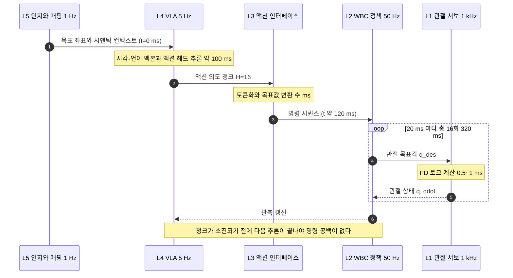

# W1-M1 심화 (유도, 연대기, 검증 메모)

> 이 문서는 [lesson.md](lesson.md)에서 덜어낸 심화 내용입니다. 본문을 먼저 읽으세요.

본문에는 결과와 직관과 그림과 회사 스택 연결만 남기고, 유도 과정과 논증의 뒷받침, 계보의 연대기 세부, 1차 출처 검증 메모를 여기로 옮겼습니다. 내용은 삭제하지 않았습니다. 읽는 순서만 바뀌었습니다.

본문 절을 참조할 때는 **번호와 제목을 함께** 적었습니다. 본문이 개정되며 번호가 밀려도 제목으로 찾아갈 수 있게 하려는 장치입니다.

| § | 무엇이 있나 | 본문에서 오는 곳 |
|---|---|---|
| §1 | 대역폭 분리 규칙의 유래와 모델 기반 제어가 무너지는 네 자리 | lesson §1.1 「하나로 만들면 왜 안 되는가」, §3.3 「계층을 만드는 대역폭 분리」 |
| §2 | 승부처가 L3라는 주장의 네 근거 전개와 세 반론 | lesson §3.4 「승부처는 왜 L3인가」 |
| §3 | 지연 예산 유도 전문, 민감도, 공백 대응, 한 사이클 타이밍 | lesson §4.1 「최소 청크 길이를 정하는 부등식」, §4.2 「도착했을 때 이미 만료된 앞부분과 명령 공백」, §4.3 「청크를 길게 잡는 대가」 |
| §4 | 계보 연대기에서 무엇이 실제로 바뀌었나 | lesson §6.1 「계보 다이어그램」 |
| §5 | 분리형과 통합형의 일곱 축 비교 | lesson §7.3 「분리형인가 통합형인가」 |
| §6 | 1차 출처가 없는 여섯 항목과 신뢰도 각주 | lesson §6.2 「조직별 베팅 계층」, 「출처」 |
| §7 | 「왜 지금인가」 세 동인의 근거 세부 | lesson §2.2 「지금이어야 하는 세 가지 동인」 |
| §8 | 계층별 입출력 상세와 좌표계로서의 이 모듈 | lesson §1.3 「이 모듈은 좌표계다」, §3.1 「명령 하나가 맨 위에서 맨 아래까지 내려간다」 |
| §9 | 본문 오해의 상세와 번외 오해 | lesson 「흔한 오해」 |
| §10 | 오해 4 「데이터만 더 모으면 된다」 | lesson 「흔한 오해」 |
| §12 | 회사 내비게이션 스택의 실제 구성과 세 가지 한계 | lesson §7.1 「배치도」, §7.4 「내비게이션 경로와 조작 경로는 갈라진다」 |
| §11 | 셀프 체크 퀴즈 서술형 풀이 | lesson 「셀프 체크 퀴즈」 |

---

## 1. 대역폭 분리 규칙의 유래와 모델 기반 제어가 무너지는 네 자리

본문 §1.1 「하나로 만들면 왜 안 되는가」와 §3.3 「계층을 만드는 대역폭 분리」가 결론만 말한 두 가지를 여기서 폅니다. 안쪽 루프를 바깥의 다섯에서 열 배로 돌리라는 경험칙이 어디서 왔는지, 그리고 수식으로 적는 방식이 정확히 어디서 무너져 학습이 그 자리를 넘겨받았는지입니다.

### 1.1 다섯에서 열 배라는 숫자의 출처

두 겹 루프를 쓰는 기계 제어에서 안쪽 루프의 대역폭을 바깥의 다섯에서 열 배로 잡는 것은 오래된 관행입니다. 이유는 간섭입니다.

바깥 루프가 목표값을 바꿨는데 안쪽 루프가 아직 이전 목표값을 따라가는 중이라고 해봅시다. 바깥은 그 미완의 응답을 보고 다시 판단합니다. 안쪽이 아직 도착하지 않았다는 사실을 바깥은 알지 못하고, 자기가 낸 명령이 부족했다고 읽어 더 밀어붙입니다. 안쪽은 그 새 목표를 따라가느라 원래 응답을 마치지 못하고, 두 루프가 서로를 자기가 없애야 할 외란으로 인식하며 진동합니다. 이득이 크면 진동이 커지며 발산합니다.

다섯 배를 넘기면 바깥이 한 번 판단하는 사이에 안쪽이 최소 다섯 번 돌아 목표값에 이미 도착해 있습니다. 바깥이 보는 것이 완결된 응답이 되고 간섭이 사라집니다. 열 배를 권하는 것은 여유분입니다. 실제 시스템에는 지연과 잡음이 있어 명목 다섯 배가 실효로는 그보다 적기 때문입니다.

Physical AI 스택은 같은 규칙을 세 번 겹쳐 적용한 결과입니다.

$$
\omega_{L1} \gg \omega_{L2} \gg \omega_{L4} \gg \omega_{L5}
$$

$\omega$는 각 층이 1초에 도는 횟수이고 아래첨자는 층 번호이며, $\gg$는 한 자릿수 이상 크다는 뜻입니다. 본문 §3.3 「계층을 만드는 대역폭 분리」의 표가 이 부등식이 실제로 성립하는지를 층 경계마다 확인한 것이고, 맨 위 경계에서 성립하지 않는다는 것이 그 절의 결론이었습니다.

### 1.2 분리비를 어떻게 계산했나

각 계층의 대표 주파수는 공개된 주파수 범위의 **상한과 하한의 기하평균**으로 잡았습니다. 기하평균은 두 값을 곱한 뒤 제곱근을 씌운 값입니다. 주파수가 1에서 10처럼 자릿수 단위로 움직이는 양이라 산술평균은 큰 쪽에 끌려갑니다. 1과 10의 산술평균은 5.5로 10에 가깝지만 기하평균은 3.16이고, 로그 축 위에서 정확히 가운데입니다.

- 대표 비율은 빠른 쪽 대표를 느린 쪽 대표로 나눈 값입니다
- 최선은 빠른 쪽 **상한**을 느린 쪽 **하한**으로 나눈 값입니다
- 최악은 빠른 쪽 **하한**을 느린 쪽 **상한**으로 나눈 값입니다

최악 열이 중요한 이유가 있습니다. 대표 비율만 보면 세 경계가 전부 규칙을 만족하는 것처럼 보이지만, 실제 시스템은 범위 안 어느 한 점이지 대표값이 아닙니다. L4와 L5 경계의 최악값 0.20배는 아래층이 위층보다 다섯 배 느린 조합이 범위 안에 실재한다는 뜻이고, 그 조합에서 규칙은 성립할 수 없습니다.

계산은 [`practice/01_stack_frequency_budget.py`](practice/01_stack_frequency_budget.py)의 `separation_ratios()`에서 재현할 수 있습니다.

### 1.3 규칙을 어기는 두 방향

- **위쪽을 너무 빠르게 만들려는 경우.** 30억 파라미터 상위 모델을 1초에 천 번 돌린다고 해봅시다. 한 번의 순전파에 100밀리초가 걸리는 모델을 1밀리초마다 호출할 방법은 없습니다. 물리가 아니라 연산이 막습니다
- **아래쪽을 너무 느리게 만드는 경우.** 균형 회복 반사를 1초에 다섯 번으로 하면 로봇은 넘어집니다. 발이 미끄러지기 시작해서 자세가 무너지기까지 걸리는 시간이 200밀리초보다 짧기 때문입니다

기계 제어와 갈리는 지점이 여기입니다. 두 겹 루프에서 다섯에서 열 배 규칙은 설계자가 고른 값이고 원하면 다르게 잡을 수도 있습니다. Physical AI 스택에서는 그렇지 않습니다. 모델 크기가 위쪽의 주파수 상한을 정하고 물리가 아래쪽의 주파수 하한을 정합니다. 두 값이 멀리 벌어져 있어 그 사이에 계층이 끼어들 자리가 생깁니다.

### 1.4 모델 기반 제어가 무너지는 네 자리의 「왜」

본문 §1.1 「하나로 만들면 왜 안 되는가」는 MPC(Model Predictive Control, 모델 예측 제어)가 접촉, 마찰, 변형체, 시각 넷에서 늘 무너졌다고 적고 목록만 남겼습니다. 각각이 왜 어려운지가 여기 있습니다. MPC는 앞으로 몇 스텝의 명령을 통째로 최적화로 풀어 맨 앞 하나만 실행하고 다음 순간 다시 푸는 방식이고, 전제는 움직임을 수식으로 적을 수 있어야 한다는 것입니다.

**접촉.** 발이 바닥에 닿는 순간 시스템을 지배하는 식 자체가 바뀝니다. 닿기 전 다리는 자유롭게 흔들리는 물체이고, 닿은 뒤에는 바닥이 밀어 올리는 힘이 새로 생깁니다. 매끄럽게 이어지는 하나의 함수가 아니라 순간적으로 갈아 끼워지는 두 개의 식이라 미분이 정의되지 않는 지점이 생깁니다. 최적화는 대체로 미분을 따라 내려가며 답을 찾으므로 이 불연속이 그대로 걸림돌이 됩니다. 더 나쁜 것은 몇 밀리초 뒤에 닿을지가 그 자체로 예측 대상이라는 점입니다. 예측 지평 안에서 접촉 순서가 달라지면 풀던 문제가 다른 문제로 바뀝니다.

**마찰.** 발이 미끄러지느냐 붙어 있느냐는 접촉면의 상태에 달렸는데 이 값을 로봇이 잴 방법이 사실상 없습니다. 같은 바닥이라도 먼지와 습기와 표면 마모에 따라 달라집니다. 게다가 붙어 있을 때와 미끄러질 때의 계수가 다른 값이라, 미끄러지기 시작하는 순간 값이 툭 떨어지며 여기서도 불연속이 생깁니다. 수식에 상수로 적어 넣은 값이 실제와 조금만 달라도 발은 예상보다 일찍 미끄러집니다.

**변형체.** 강체는 상태를 위치와 자세 몇 개의 숫자로 적을 수 있습니다. 천이나 케이블은 그렇지 않습니다. 형태가 계속 바뀌므로 정확히 적으려면 사실상 무한한 자유도가 필요하고, 유한한 개수의 마디로 근사하면 그 개수가 늘어날수록 한 스텝을 푸는 비용이 커집니다. 밀리초 단위 마감 안에 최적화를 끝내야 하는 MPC와는 맞지 않습니다.

**시각.** 앞의 셋과 성격이 다릅니다. 앞의 셋은 적기 어려운 물리였지만 이것은 애초에 물리 문제가 아닙니다. 카메라 픽셀 배열에서 「이것은 컵이고 저기가 손잡이다」로 가는 경로를 방정식으로 적는 방법이 없습니다. 이 자리는 처음부터 학습의 몫이었습니다.

정리하면 대체가 균일하지 않습니다. 앞의 셋은 원리적으로 적을 수는 있지만 값을 모르거나 계산 비용을 감당할 수 없는 것이고, 마지막 하나는 적는 방법 자체가 없는 것입니다. Physical AI가 「학습으로 대체한다」고 말할 때 실제로는 성격이 다른 두 종류의 대체를 함께 부르고 있습니다.

---

## 2. 승부처가 L3라는 주장의 네 근거 전개

본문 §3.4 「승부처는 왜 L3인가」에 네 근거를 한 줄씩 적었습니다. 각각의 뒷받침이 여기 있습니다.

### 2.1 교체 가능성

인터페이스가 고정되면 상위와 하위를 독립적으로 갈아끼울 수 있습니다.

기계 제어에서 오래 쓰던 이득입니다. 상위 계획기가 관절 목표각이라는 규약만 지키면, 하위 서보의 내부 방식을 바꿔도 상위는 손댈 필요가 없습니다. 반대로 상위 계획기를 통째로 다른 것으로 바꿔도 하위는 같은 규약을 계속 받습니다. 두 쪽이 주고받는 값의 **모양과 뜻**만 합의되어 있으면 나머지는 각자의 사정입니다.

로봇 학습에서 이 이득이 훨씬 큽니다. L2 정책 하나를 학습하는 데 SONIC은 21,000 그래픽카드 시간을 썼습니다. 상위 모델을 바꿀 때마다 이것을 다시 해야 한다면 실험 자체가 성립하지 않습니다. 인터페이스가 고정돼 있으면 L4만 갈아끼우고 L2는 그대로 씁니다.

### 2.2 표현 정합

상위 모델이 자기회귀 트랜스포머라면 이산 토큰이 자연스럽습니다. 자기회귀는 앞의 것들을 보고 다음 하나의 확률을 예측하는 방식을 말합니다.

언어 모델이 텍스트를 토큰으로 다루는 이유를 생각해보면 됩니다. 자기회귀 모델은 유한한 후보 목록 위의 확률분포를 예측하도록 설계돼 있습니다. 출력단을 연속값 회귀로 바꿔 달 수도 있지만, 그러면 정답이 여럿인 상황을 표현하기 어려워집니다. 회귀는 하나의 값을 내놓으므로 여러 정답이 있으면 그 평균으로 수렴합니다.

액션도 같습니다. 컵을 잡는 방법이 왼쪽으로 돌기와 오른쪽으로 돌기 둘 다일 때 연속값 회귀는 그 평균을 뱉습니다. 평균은 컵에 정면으로 부딪치는 자세일 수 있습니다. 유한한 후보 위의 확률분포는 두 봉우리를 그대로 유지하고, 그중 하나를 뽑으면 됩니다.

SONIC이 universal token space를 내세우는 것도 이 맥락입니다. 상위 모델과 VR 텔레옵과 게임패드 계획기처럼 성격이 전혀 다른 입력들을 하나의 하위 정책에 물릴 수 있는 이유가 공통 토큰 공간입니다.

### 2.3 주파수 접합

L4가 1초에 1에서 10회, L2가 50에서 500회 도는 사이의 격차를 무엇이 메우느냐는 문제입니다.

본문 §3.3 「계층을 만드는 대역폭 분리」의 표에서 L2와 L4의 대표 비율이 50배였습니다. L4가 한 번 판단하는 동안 L2가 50번 돈다는 뜻입니다. L4가 액션 하나만 뱉으면 나머지 49번은 무엇을 쓸까요. 이 문제를 떠맡는 것이 L3이고, 시간 정렬이 L3의 담당 업무로 적힌 이유입니다. §3이 그 정렬을 숫자로 푼 것입니다.

### 2.4 관측 가능성

경계에 이산 신호가 있으면 디버깅이 됩니다.

한 덩어리 모델이 잘못된 행동을 했을 때는 원인을 찾을 자리가 마땅치 않습니다. 중간 표현이 연속 latent면 사람이 읽을 수 없습니다. latent는 사람이 읽는 물리량이 아니라 모델이 내부에서 쓰려고 만든 숫자 벡터라, 각 축이 무엇을 뜻하는지 정해져 있지 않습니다. 토큰 번호면 다릅니다. 로그로 찍어볼 수 있고, 어떤 번호가 어떤 동작에 대응하는지 사후에 모아 볼 수 있으며, 「37번 토큰이 나올 때마다 넘어진다」 같은 문장을 쓸 수 있게 됩니다.

### 2.5 반대 논거 셋

분리형이 공짜는 아닙니다. 본문이 한 문장으로 줄인 세 대가를 폅니다.

- **양자화 오차.** 연속 액션을 유한한 코드북에 넣으려면 가장 가까운 후보로 반올림해야 하고 그만큼 정보가 깎입니다. 코드북이 작을수록 심합니다. 목표각을 0.1도 단위로 적던 것을 1도 단위로만 적을 수 있게 되는 셈이라, 미세 조정이 필요한 작업에서 이 오차가 그대로 성능 차이가 됩니다
- **표현력 손실.** 반올림 오차와는 다른 문제입니다. 코드북에 아예 없는 동작은 표현할 수 없습니다. 코드북은 학습 데이터에서 만들어지므로 데이터 분포 밖의 동작은 가장 비슷한 다른 동작으로 대체되고, 그 대체가 필요한 동작과 전혀 다를 수 있습니다
- **공동 최적화 불가.** 인터페이스가 고정되면 상위와 하위를 함께 최적화할 수 없습니다. 상위는 주어진 토큰 규약 안에서 최선을 찾고 하위는 주어진 토큰을 잘 따르려 하는데, 각자 최적이어도 합쳐서 최적이라는 보장이 없습니다. 규약 자체가 나쁘게 잡혀 있으면 양쪽 다 그것을 고칠 수 없습니다

어느 쪽이 맞는지는 업계 합의가 없습니다. π 계열은 L4에 올인해 인터페이스 자체를 최소화하는 쪽이고, 회사 스택은 L3를 명시적으로 두는 쪽입니다. §5에서 이 대립을 Gemini Robotics 2와 대조합니다.

정직하게 덧붙이면 회사 FSQ 모델의 실제 구조는 확인되지 않았습니다. 위 논증은 「이산 액션 토큰 인터페이스 일반」에 대한 것입니다. 회사가 실제로 어떤 레벨과 차원을 쓰는지, 토큰이 목표 자세인지 모션 레퍼런스인지 latent인지는 전부 미확인입니다.

---

## 3. 지연 예산 부등식의 유도 전문과 민감도

### 3.1 유도

L4가 주기 $T_{\text{replan}} = 1/f_4$로 재계획하고, 한 번의 추론에 $\tau_{\text{infer}}$가 걸리며, 통신 지연이 $\tau_{\text{comm}}$입니다. L2는 $f_2$회로 돌면서 청크에서 액션을 하나씩 꺼내 씁니다. $H_{\text{chunk}}$는 청크 하나에 담긴 스텝 수입니다.

다음 청크가 도착하기 전에 현재 청크가 소진되면 로봇은 명령 공백에 빠집니다. 이 공백을 막으려면 청크가 커버해야 할 시간이 재계획 주기와 지연의 합보다 길어야 합니다.

$$
\frac{H_{\text{chunk}}}{f_2} \;\ge\; T_{\text{replan}} + \tau_{\text{infer}} + \tau_{\text{comm}}
\quad\Longleftrightarrow\quad
H_{\text{chunk}} \;\ge\; f_2\bigl(T_{\text{replan}} + \tau_{\text{infer}} + \tau_{\text{comm}}\bigr)
$$

좌변은 청크 하나가 버텨주는 시간입니다. $H_{\text{chunk}}$개의 액션을 1초에 $f_2$개씩 소비하니 $H_{\text{chunk}}/f_2$초가 걸립니다. 우변은 다음 청크가 도착할 때까지 기다려야 하는 시간입니다. 양변에 $f_2$를 곱하면 오른쪽 꼴이 되고, 이것이 본문 §4.1 「최소 청크 길이를 정하는 부등식」에 실린 형태입니다.

### 3.2 왜 앞부분이 버려지는가

처음 보면 놓치기 쉬운 메커니즘이 하나 숨어 있습니다.

L4는 시각 $t_k$에 관측을 찍어 재계획을 겁니다. 그 청크의 액션들은 관측 시각 $t_k$를 기준으로 시간 인덱싱되어 있습니다. 청크의 $i$번째 액션은 「$t_k + i/f_2$ 시점에 실행할 것」이라는 뜻입니다. ACT와 Diffusion Policy가 이렇게 동작합니다.

청크가 실제로 L2에 도착하는 시각은 $t_k + \tau_{\text{infer}} + \tau_{\text{comm}}$입니다. 도착했을 때는 이미 앞부분이 지나간 시각용입니다.

$$
\text{버려지는 앞부분} = \lceil f_2 \cdot (\tau_{\text{infer}} + \tau_{\text{comm}}) \rceil
$$

$\lceil \; \rceil$은 천장 함수이고 스텝을 쪼갤 수 없어 올림합니다. 기본 시나리오에 넣으면 $\lceil 50 \times 0.12 \rceil = 6$스텝이 버려집니다. 16개를 예측했는데 쓸 수 있는 것은 10개뿐입니다. 이것이 부등식에 $\tau$가 들어가는 진짜 이유입니다.

### 3.3 어느 항이 결과를 좌우하나

| $f_2$ | $f_4$ | $\tau_{\text{infer}}$ | $\tau_{\text{comm}}$ | $T_{\text{replan}}$ | 합계 | 필요 $H_{\text{chunk}}$ |
|---|---|---|---|---|---|---|
| 50 | 5 | 100 ms | 20 ms | 200 ms | 320 ms | 16 |
| 50 | 5 | 200 ms | 20 ms | 200 ms | 420 ms | 21 |
| 50 | 2 | 100 ms | 20 ms | 500 ms | 620 ms | 31 |
| 50 | 10 | 100 ms | 20 ms | 100 ms | 220 ms | 11 |
| 100 | 5 | 100 ms | 20 ms | 200 ms | 320 ms | 32 |
| 200 | 5 | 100 ms | 20 ms | 200 ms | 320 ms | 64 |
| 100 | 4 | 150 ms | 10 ms | 250 ms | 410 ms | 41 |

주파수 두 열의 단위는 1초에 도는 횟수입니다. 마지막 행이 본문 퀴즈 5번의 조건이고 답이 41스텝입니다.

- **$f_2$는 선형으로 곱해집니다.** 하위 제어를 1초에 50회에서 200회로 올리면 필요한 청크 길이도 16에서 64로 네 배가 됩니다. 커버해야 할 시간은 그대로인데 그 시간을 더 잘게 쪼개 소비하기 때문입니다
- **$f_4$는 역수로 들어옵니다.** 상위를 1초에 5회에서 10회로 올리면 $T_{\text{replan}}$이 절반이 되어 청크가 짧아도 됩니다. 다만 상위를 빠르게 만드는 것은 대개 모델을 작게 만드는 것과 같은 말이라 공짜가 아닙니다
- **$\tau_{\text{infer}}$는 더하기로만 들어와 영향이 그만큼 작습니다.** 100밀리초를 200밀리초로 두 배 늘려도 16에서 21로 그칩니다. $T_{\text{replan}}$이 이미 200밀리초를 차지하고 있어서입니다

실무로 옮기면 결론이 하나 나옵니다. 청크 길이를 줄이고 싶으면 추론을 빠르게 만드는 것보다 재계획 주기를 손대는 편이 효과가 큽니다.

### 3.4 공백이 생기면 실제로 무슨 일이 일어나나

본문 §4.2 「도착했을 때 이미 만료된 앞부분과 명령 공백」이 「마지막 값을 붙들거나 멈추거나 지어내는 셋뿐」이라고 줄인 것을 폅니다. L2는 매 스텝 반드시 무언가를 L1에 내려보내야 합니다. 내려보낼 것이 없다는 선택지는 없으므로 셋 중 하나를 고르게 됩니다.

**마지막 명령 홀드.** 직전에 받은 목표각을 그대로 유지합니다. 구현이 가장 쉽고 가장 흔합니다. 짧은 공백은 버팁니다. 문제는 이동 중일 때입니다. 걷는 도중에 목표 관절각이 한 값에 얼어붙으면 몸통은 관성으로 계속 나아가는데 다리는 그 자리에 멈춰 있어 자세가 무너집니다. 정지 상태에서는 무해하고 이동 중에는 위험하다는 것이 이 방식의 성격입니다.

**안전 정지.** 미리 정한 안전 자세로 전환합니다. 넘어질 위험은 가장 낮습니다. 대신 작업이 중단되고, 공백이 주기마다 반복되면 로봇은 나아가려다 멈추기를 반복합니다. 본문 §4.2 「도착했을 때 이미 만료된 앞부분과 명령 공백」의 계산에서 청크를 15로 잡았을 때 공백은 매 재계획 주기마다 20밀리초씩 생겼습니다. 1초에 다섯 번 안전 정지에 들어가는 로봇은 아무 일도 하지 못합니다.

**외삽.** 이전 청크의 추세를 연장해 다음 값을 지어냅니다. 짧은 공백에서는 가장 부드럽습니다. 다만 외삽은 지금까지의 변화가 계속된다는 가정이고, 그 가정은 시간이 갈수록 빠르게 나빠집니다. 관절각을 직선으로 연장하면 몇십 밀리초 뒤에는 물리적으로 불가능한 각도를 명령하게 됩니다.

**본문에서 옮겨 온 계산.** 본문 §4.2 「도착했을 때 이미 만료된 앞부분과 명령 공백」은 공백률 9.6퍼센트라는 값만 남기고 과정을 여기로 넘겼습니다. 청크를 16 대신 15로 잡으면 앞의 6스텝이 만료되므로 쓸 수 있는 것은 $15 - 6 = 9$스텝인데, 한 재계획 주기 200밀리초를 채우려면 10스텝이 필요하므로 20밀리초가 빕니다. 2초를 돌려 부팅 구간을 빼면 94스텝 중 9스텝이 비어 **9.6퍼센트**가 됩니다.

어느 쪽도 좋은 선택지가 아닙니다. 부등식을 만족시키는 것이 설계의 최소 요건인 이유입니다.

### 3.5 청크 길이별 공백률과 반응 지연

본문 §4.3 「청크를 길게 잡는 대가」의 트레이드오프를 수치로 편 것입니다. 조건은 $f_2 = 50$, $f_4 = 5$, 지연 합 120밀리초입니다.

| $H_{\text{chunk}}$ | 구간 | 명령 공백률 | 최악 반응 지연 |
|---|---|---|---|
| 8 | 부족 | 78.7% | 160 ms |
| 16 | 최소이자 권장 | 0.0% | 320 ms |
| 32 | 여유 | 0.0% | 640 ms |
| 64 | 과다 | 0.0% | 1,280 ms |

공백률은 하위 제어기가 도는 전체 스텝 가운데 쓸 명령이 없는 스텝의 비율이고, 최악 반응 지연은 청크를 막 시작한 직후에 상황이 바뀌었을 때 그것을 반영하기까지 걸리는 최대 시간, 즉 $H_{\text{chunk}}/f_2$입니다.

$H=16$과 $H=64$는 공백률이 똑같이 0퍼센트입니다. 왼쪽 두 열만 보면 길게 잡는 것이 손해가 없어 보이지만, 오른쪽 열을 보면 64로 잡을 경우 사람이 로봇 앞에 갑자기 나타났을 때 반응까지 최대 1.28초가 걸립니다. 사람이 한 걸음 반을 걷는 시간입니다.

$H=8$의 78.7퍼센트는 계산해 볼 만합니다. 앞의 6스텝이 만료되므로 쓸 수 있는 것은 2스텝, 즉 40밀리초분입니다. 한 재계획 주기 200밀리초 중 40밀리초만 채워지므로 나머지 160밀리초가 빕니다. 부팅 구간을 제외한 정상 구간에서 이 비율이 약 78.7퍼센트로 수렴합니다.

이 선택은 MPC에서 예측 지평을 정하는 문제와 같은 구조입니다. 지평이 길수록 계획은 매끄러워지지만 먼 미래일수록 지금의 모델이 맞다는 가정에 더 크게 기대게 됩니다.

**본문에서 옮겨 온 서술.** MPC도 매 스텝 여러 개를 풀어 앞의 일부만 쓰고 나머지는 버린 뒤 다시 푸는데 이 방식이 **receding horizon**입니다. 로봇 정책에서 이 방식을 널리 알린 것이 **ACT(Action Chunking with Transformers, 트랜스포머 기반 액션 청킹)**이고, ACT 기본값과 본문 §3.2 「입출력과 주파수를 한 장에」의 200밀리초 문턱이 어떤 관계인지가 W2-M1의 논점입니다.

### 3.6 한 사이클의 타이밍

본문에서 덜어낸 시퀀스 다이어그램입니다. 위의 계산이 시간 축 위에서 어떻게 배치되는지를 한 장으로 봅니다.

**읽는 법.** 세로선 다섯 개가 계층이고 왼쪽에서 오른쪽으로 갈수록 빨라집니다. 위에서 아래가 시간의 흐름입니다. 3번 화살표가 나가는 시각과 5번 화살표가 도착하는 시각의 차이 120밀리초가 §3.2에서 앞의 6스텝을 버리게 만든 그 시간입니다. 아래쪽 반복 상자 안에서 L1과 L2가 20밀리초마다 주고받는 동안 L4는 아무것도 하지 않는 것처럼 보이지만, 실제로는 그 사이에 다음 청크를 만들고 있어야 합니다. 맨 아래 주석이 그 조건입니다.

---

## 4. 계보 연대기에서 무엇이 실제로 바뀌었나

본문 §6.1 「계보 다이어그램」의 그림은 누가 누구를 이었는지만 보여주고, 쟁점을 세 시기로 한 줄에 압축했습니다. 각 단계에서 무엇이 문제였고 무엇으로 풀었는지를 논문 단위로 따라가야 지도가 쓸모 있어집니다.

시기를 먼저 나눠 두면 아래가 읽기 쉽습니다.

- **2023년에서 2024년, 웹 지식 전이.** RT-2의 「백본에 액션 토큰을 붙인다」와 OpenVLA의 오픈소스 재현이 이 시기입니다
- **2024년에서 2025년, 액션 표현.** π0의 Flow Matching 헤드와 π0-FAST의 DCT 토큰화가 이 시기이고, **액션 토크나이저가 독립된 연구 주제**가 됐습니다. 회사가 쓰는 FSQ도 이 흐름 위에 있습니다
- **2025년에서 2026년, 계층 경계와 라벨 없는 데이터.** GR00T는 계층을 모델 안에 넣고, Gemini Robotics 2는 전신 제어까지 흡수하며, π0.7은 실패 데이터까지 쓰겠다고 합니다

### 4.0 앞으로 만날 이름 셋

본문 §1.2 「언어 모델에서 본 전개가 반복되는 중이다」가 이름만 달아 두고 여기로 넘긴 셋입니다. 출력단 쪽에는 확산 모델을 트랜스포머로 구현한 **DiT(Diffusion Transformer, 확산 트랜스포머)**와 노이즈에서 데이터로 가는 길을 회귀로 배우는 **Flow Matching**이 있고, 토크나이저 쪽에는 신호를 주파수 성분으로 바꿔 압축하는 **DCT(Discrete Cosine Transform, 이산 코사인 변환)**가 있습니다. 각각 W1-M3, W1-M4, W2-M4에서 본격적으로 다룹니다.

### 4.1 웹 지식을 어떻게 로봇으로 옮기는가 (RT-2, 2023)

그전까지 로봇 정책은 로봇 데이터로만 학습했으니 로봇 데이터에 없는 개념은 알 수 없었습니다. RT-2(arXiv:2307.15818)의 답은 단순했습니다. 사전학습된 시각-언어 모델을 가져와 출력 어휘에 액션 토큰을 끼워 넣는 것입니다. 모델이 이미 아는 「바나나」라는 개념이 로봇 행동으로 전이됩니다. VLA라는 범주 자체가 여기서 생겼습니다.

### 4.2 이 레시피를 누구나 쓸 수 있는가 (OpenVLA, 2024-06)

RT-2는 가중치가 공개되지 않았습니다. 그 빈자리를 OpenVLA(arXiv:2406.09246)가 채웠습니다. 7B 오픈소스로 같은 레시피를 재현하며 연구 커뮤니티의 기준선이 됐습니다.

### 4.3 액션 헤드를 어떻게 만드는가 (π0, 2024-10)

RT-2 계열은 액션을 이산 토큰으로 뱉었고, 이산화는 정밀도를 깎습니다. §2.5의 양자화 오차가 바로 이 문제입니다. π0(arXiv:2410.24164)는 시각-언어 백본은 그대로 두되 액션 헤드를 Flow Matching 전문가로 바꿨습니다. 연속 액션을 고주파로 뽑을 수 있게 되면서 조작 정밀도가 올라갔습니다. Flow Matching 자체는 W1-M4에서 직접 다룹니다.

### 4.4 그러면 토큰화는 버리는가 (π0-FAST, 2025)

아니라고 답했습니다. 자기회귀 학습의 이점이 여전히 크기 때문입니다. π0-FAST는 액션 시퀀스를 DCT(Discrete Cosine Transform, 이산 코사인 변환)로 바꿔 토큰화합니다. DCT는 신호를 여러 주파수 성분의 합으로 다시 쓰는 변환이고, 로봇 액션처럼 부드럽게 이어지는 신호는 낮은 주파수 몇 개에 정보가 몰립니다. 그 몇 개만 남기면 같은 정보를 훨씬 적은 토큰으로 담을 수 있습니다. 액션 토크나이저 설계가 독립된 연구 주제가 된 시점이고, 회사가 FSQ를 쓰는 것도 이 흐름 위에 있습니다.

### 4.5 데이터를 어떻게 더 쓰는가 (π0.5에서 π0.7까지, 2025~2026)

- π0.5는 open-world 계층 추론입니다
- π\*0.6은 VLA에서 「RL Token」을 뽑아 온라인 강화학습으로 개선했습니다 (2025-11-17 공개)
- π0.7은 diverse context conditioning입니다. 수행 품질 메타데이터와 서브골 이미지를 학습 조건으로 주입합니다 (arXiv:2604.15483, 2026-04-16, 공저자 87명)

특히 π0.7은 본문 §5 「데이터 피라미드」와 바로 이어집니다. 준최적 데이터와 실패 데이터까지 버리지 않고 쓰겠다는 것이니까요.

### 4.6 계층을 모델 안에 넣는다 (GR00T N1에서 N1.6까지, 2025~2026)

GR00T N1(arXiv:2503.14734)은 System1과 System2 구조로 빠른 반응과 느린 추론을 한 모델 안에 뒀습니다. N1.6은 SigLip2(비전)와 T5(언어) 백본에 flow matching과 world-modeling objective를 함께 학습시킵니다. 본문 §5.2 「라벨 없는 상단을 끌어내리는 세 갈래」의 세 갈래 중 월드모델 노선을 상위 모델 안으로 흡수하려는 시도로 읽을 수 있습니다.

HF `nvidia/GR00T-N1.6-3B`로 공개돼 있고 N1.5 대비 MLP connector가 개선됐으나 학습 데이터 규모는 비공개입니다.

### 4.7 경계를 어디까지 내릴 것인가 (Gemini Robotics 2, 2026-07-31)

이전 세대는 상체 조작 중심이었습니다. Gemini Robotics 2는 보행, 웅크리기, 굽히기까지 포함한 전신 제어로 확장했습니다. 상위 모델이 L2 영역을 흡수하는 방향입니다. Apptronik 휴머노이드 데모를 함께 공개했습니다.

### 4.8 요약

초기 3년의 주제가 「웹 지식을 어떻게 옮기는가」였다면, 지금의 주제는 **「계층 경계를 어디에 둘 것인가」**와 **「라벨 없는 데이터를 어떻게 쓰는가」**로 옮겨갔습니다.

---

## 5. 분리형과 통합형을 비추는 Gemini Robotics 2라는 거울

본문 §7.3 「분리형인가 통합형인가」가 「업계 합의는 없습니다」로 줄인 대립을 축별로 폅니다. 2026-07-31 공개된 Gemini Robotics 2가 회사 구도와 직접 비교 대상인 이유는 방향이 정반대이기 때문입니다.

회사 스택은 L4와 L2를 명시적으로 분리하고 L3로 잇습니다. Gemini Robotics 2는 상위 모델이 전신 제어까지 흡수하는 방향으로 보입니다. 내부 구조는 공개되지 않아 단정할 수 없다는 점을 먼저 적어 둡니다.

| 축 | 분리형 (회사 구도) | 통합형 (Gemini Robotics 2 방향) |
|---|---|---|
| 하위 정책 교체 | 인터페이스만 지키면 자유 | 전체 재학습 |
| 인터페이스 복잡도 | 단순합니다. 토큰 규약 하나 | 없습니다. 내부 표현으로 처리 |
| 디버깅 | 경계에서 신호를 관측 가능 | 중간 표현이 불투명 |
| 표현력 | 코드북 범위로 제한 | 제한 없음 |
| 양자화 오차 | 발생 | 없음 |
| 공동 최적화 | 불가 | 가능 |
| 학습 비용 | 계층별 분할. L2 재사용 가능 | 통짜 학습. SONIC 급이면 21,000 그래픽카드 시간 규모 |

§2.1에서 §2.4까지의 네 근거가 왼쪽 열을 지지하고, §2.5의 세 반대 논거가 오른쪽 열을 지지합니다. 표를 세로로 읽으면 어느 한쪽이 모든 축에서 이기지 않는다는 것이 보입니다. 위 세 축은 분리형이, 아래 세 축은 통합형이 가져갑니다. 맨 아래 학습 비용은 조직 사정에 달렸습니다. 그래서 이 물음에 업계 합의가 없는 것이고, W2-M5에서 이 논증을 설계 수준으로 다시 펼칩니다.

한 가지는 분명합니다. 통합형이라 해도 L1의 고주파 서보 루프는 그대로 따로 돕니다. 계층을 둘 것이냐는 이미 논쟁 대상에서 내려왔고, 남은 물음은 경계선을 어디에 긋느냐입니다.

---

## 6. 1차 출처가 없는 여섯 항목

본문 「출처」가 「여섯 항목은 수치를 비웠거나 교차확인으로만 채웠다」고 적은 그 여섯입니다. 이 절이 본문 「출처」의 신뢰도 각주 자리를 겸합니다. 기준일은 전부 2026-08-01입니다.

| # | 항목 | 무엇이 미확인인가 | 어떻게 처리했나 |
|---|---|---|---|
| 1 | Figure, Tesla Optimus, 1X | 생산 대수, 자율 운영 시간, 손 자유도, 선주문 수량 | 정성 서술만 남기고 본문 표에서 제외 |
| 2 | GR00T N1.6, Cosmos 3 | 공개일 (CES 2026, 1월 추정)과 릴리스 시점 | 연도만 적고 날짜는 비움 |
| 3 | GEAR-SONIC HF 체크포인트 | 실제 다운로드 가능 여부 | 링크만 적고 가용성 단정 안 함 |
| 4 | AgiBot World 2026 | 데이터 시간 규모 | 궤적 수만 인용 |
| 5 | Unitree G1 자유도 (23, 29, 43) | 1차 출처 확인 실패 | 3자 사이트 교차확인값으로 표기 |
| 6 | 본문 §3.2 「입출력과 주파수를 한 장에」의 기호표 「회사 실제값」 열과 §7.1 「배치도」 | 조작 경로의 회사 내부 구현 | 전부 「팀 확인 필요」로 남김. **2026-08-29에 내비 경로만 사내 문서로 채워졌습니다**(§12) |

5번의 사정을 덧붙입니다. `support.unitree.com`이 자바스크립트로 내용을 그리는 페이지라, 집필 시점에 HTML만 받아서는 값을 읽을 수 없었습니다. robotsguide와 robostore 두 곳에서 같은 값이 나와 교차확인값으로 적었지만 1차 출처는 아닙니다.

1번의 세 회사에 대해 확인된 만큼만 적으면 이렇습니다.

- **Figure.** 자체 하드웨어에 자체 상위 모델을 얹는 수직 통합
- **Tesla Optimus.** 대량 생산을 전제한 수직 통합 노선. V3는 2026년 7월 기준 아직 공개 시연 전
- **1X.** 가정용(NEO) 포지셔닝에 텔레옵 폴백을 전제한 배포 전략

수치는 언론 보도로 돌아다니지만 1차 출처가 확인되지 않아 의도적으로 넣지 않았습니다. **지도에 빈칸으로 남겨두는 편이 틀린 숫자를 적어두는 것보다 낫습니다.**

본문 §6.2 「조직별 베팅 계층」 표에서 줄인 조직 세부도 여기 남깁니다.

- **Shanghai AI Lab과 InternRobotics.** InternVLA N1은 듀얼 시스템 VLN으로 바퀴형과 사족과 휴머노이드의 zero-shot을 지원하고, 150미터를 넘는 장기 계획과 1초에 30회를 넘는 실시간 결정을 내겁니다
- **AgiBot.** 100퍼센트 실환경이고 AGIBOT G2 플랫폼의 free-form 수집입니다 (arXiv:2503.06669, IROS 2025 Best Paper Finalist이자 IEEE TRO 2026)
- **Google DeepMind.** Gemini Robotics 2와 함께 On-Device 2를 동시 공개했습니다. 수 시간 데이터로 새 임바디먼트에 적응한다는 것이 요지입니다
- **NVIDIA.** Isaac Sim 5.0 GA는 SIGGRAPH 2025 공개이고, Isaac Lab 2.2는 휴머노이드 정책 평가와 GR00T N1 벤치마킹 중심입니다
- **본문 §6.2에서 옮겨 온 두 항목.** GR00T N1.6은 `nvidia/GR00T-N1.6-3B`로 공개됐고 학습 데이터 규모는 비공개입니다. π0.7은 공저자가 87명입니다

---

## 7. 「왜 지금인가」 세 동인의 근거 세부

본문 §2.2 「지금이어야 하는 세 가지 동인」에 세 동인을 한 줄씩 적었습니다. 근거가 되는 사실이 여기 있습니다.

### 7.1 파운데이션 모델의 성숙 (2023년부터)

시각-언어 모델을 처음부터 만들 필요가 없어졌습니다. RT-2(arXiv:2307.15818)가 「사전학습된 시각-언어 모델에 액션 토큰 출력을 붙이면 웹 지식이 로봇으로 전이된다」를 보인 이후 이 레시피가 표준이 됐습니다.

- GR00T N1.6은 SigLip2(비전)와 T5(언어) 백본입니다
- π0(arXiv:2410.24164)은 시각-언어 백본에 Flow Matching 액션 전문가를 붙인 구조입니다

실무로 옮기면 결론이 하나 나옵니다. **로봇 팀이 만들 것은 액션 헤드와 데이터이고, 백본은 가져다 씁니다.**

### 7.2 대규모 병렬 시뮬 (2021년부터)

「Learning to Walk in Minutes」(arXiv:2109.11978)가 수천 개의 환경을 그래픽카드에서 동시에 굴려 보행 정책을 수십 분에 학습시키는 레시피를 확립했습니다. 물리 시뮬레이션을 한 번에 하나씩 돌리는 대신 같은 계산을 수천 벌 병렬로 돌리는 것이고, 그래픽카드가 잘하는 일이 정확히 그것입니다.

그 끝에 SONIC이 있습니다. 700시간 모캡, 즉 1억 프레임이 넘는 데이터를 42M 파라미터 정책에 21,000 그래픽카드 시간 부어 범용 전신 제어 정책을 만들었습니다(arXiv:2511.07820). 이 숫자는 패러다임 전환을 뜻합니다. **데이터를 수집하던 시대가 데이터를 생산하는 시대로 넘어갔습니다.**

### 7.3 저가 휴머노이드 하드웨어 (2024년부터)

Unitree G1이 13,500달러에서 27,000달러 구간에 들어오며 2026년 기준 유일한 2만 달러 이하 상용 이족 휴머노이드가 됐습니다.

가격은 곧 데이터 규모 문제입니다. 연구실 한 곳이 로봇 열 대를 살 수 있으면 데이터 수집 규모가 자릿수 단위로 바뀝니다. 한 대로 순차 수집하던 것을 열 대로 병렬 수집하면 본문 §5.1 「피라미드와 실측 규모」에서 본 피라미드의 텔레옵 층이 그만큼 두꺼워집니다.

Unitree는 2025년 휴머노이드 5,500대 이상을 출하해 테슬라를 앞섰고 매출 16.9억 위안을 기록했으며, 2026년 8월 현재 STAR Market 상장 절차를 진행 중입니다. 08-10 청약 개시 예정입니다.

### 7.4 보조 동인인 데이터 인프라의 공유화

Open X-Embodiment(arXiv:2310.08864)가 21개 기관과 22종 로봇의 데이터를 하나의 포맷으로 통합해 「ImageNet 모멘트」의 전제를 갖췄고, AgiBot World가 단일 플랫폼 100만 궤적을 공개하며 규모의 하한선을 올렸습니다.

---

## 8. 계층 상세와 좌표계로서의 이 모듈

### 8.1 서사에서 압축한 계층별 입출력

본문 §3.1 「명령 하나가 맨 위에서 맨 아래까지 내려간다」는 명령 하나가 내려가는 경로를 따라갑니다. 각 계층에서 압축한 세부가 여기 있습니다.

- **L5.** 이 계층이 open-vocabulary여야 하는 이유는 학습 때 본 적 없는 「빨간 컵」 같은 표현도 처리해야 하기 때문입니다. 고정된 클래스 목록으로 분류하는 방식으로는 불가능합니다. 단어와 이미지를 같은 공간의 벡터로 바꿔 이 성질을 얻습니다. **실제로는 이 계층이 한 덩어리가 아니라 기하와 의미로 갈려 있습니다**(§12.1). 기하 쪽은 점군 지도와 위치만 만들고 물체의 종류를 모르며, 의미 쪽이 그 위에 이름을 붙입니다
- **L4.** 입력은 카메라 이미지 `[B,V,3,H,W]`, 언어 지시 토큰 `[B,L]`, 로봇 상태 `[B,D_state]`입니다. 출력 청크가 `[B,H_chunk,D_action]`이니 $H_{\text{chunk}}=16$이고 G1이 29 자유도면 16 곱하기 29 행렬 하나가 나옵니다
- **L3.** 주파수가 없는 유일한 계층입니다. 정해진 주기로 돌지 않고 L4가 무언가를 뱉을 때마다 한 번 도는 **이벤트 구동** 계층입니다. FSQ를 쓰면 `D_z` 차원 각각을 `L_i` 레벨로 반올림해 이산 토큰을 만들고, 코드북 크기는 $\prod L_i$가 됩니다
- **L2.** 관측 이력 스택 `[T_hist, D_state]`을 쌓는 이유는 속도와 가속도 정보가 단일 프레임에 없기 때문입니다. 신경망 순전파 한 번에 균형과 접촉과 모션 트래킹이 전부 걸립니다
- **L1.** 학습이 전혀 없습니다. 순수한 비례 미분 서보이고, 스택 맨 아래가 여전히 고전 제어라는 사실이 요점입니다

### 8.2 이 모듈이 좌표계인 이유

본문 §1.3 「이 모듈은 좌표계다」가 가리키는 회수 지점 표입니다. W1-M1은 그 자체로 완결되는 지식이 아닙니다. 앞으로 3주 반 동안 읽을 논문 20여 편과 실습 전부가 이 지도의 어느 좌표에 찍히는지를 여기서 정해둡니다.

좌표계 없이 논문을 읽으면 「Diffusion Policy와 SONIC 중 뭐가 상위 개념인가」 같은 질문에 매번 다시 헤맵니다. 둘 사이엔 상하 관계가 없습니다. 서로 다른 계층에 살 뿐이고, 그 사실은 5계층 그림이 머리에 있어야 즉시 보입니다.

| 이 모듈에서 세우는 것 | 어디서 회수되는가 |
|---|---|
| 5계층 스택과 각 계층의 주파수 | 이후 모든 모듈. 「이건 몇 층 이야기인가」로 시작 |
| 지연 예산 부등식과 action chunking | W2-M1(청크 길이 설계), W4-M4(배포 지연 측정) |
| 승부처가 L3라는 문제의식 | W1-M5(FSQ 구현), W2-M5(분리형과 통합형 논증) |
| 데이터 피라미드와 라벨 부재 | W2-M2, W2-M5(latent action), W4-M1과 M2(월드모델) |
| 회사 스택 배치도 | W4-M5 캡스톤. 팀에게 검증받는 것이 과제 |

마지막 줄이 중요합니다. 이 모듈에서 그리는 회사 배치도는 **가설**입니다. 캡스톤에서 그 가설을 검증하고 고치는 것까지가 4주 과정의 마지막 단계입니다.

---

## 9. 본문 오해의 상세와 번외 오해

본문 「흔한 오해」가 세 항목을 각각 한 문단으로 줄였습니다. 그중 오해 3이 가장 많이 압축됐고, 다루지 않은 번외 하나도 여기 붙입니다.

### 9.1 시뮬과 실기가 갈라지는 다섯 자리

본문 오해 3은 「모터 반응, 신호 지연, 접촉 계산, 센서 잡음, 상태 추정 다섯 곳」이라고만 적었습니다. 시뮬레이터에서 잘 걷던 정책이 실기에서 넘어지는 현상을 **sim2real 갭**이라 부르는데, 그 갭이 어디서 오는지가 이 다섯입니다.

**모터 반응.** 시뮬레이터는 대개 명령한 토크가 즉시 그대로 난다고 가정합니다. 실제 모터는 그렇지 않습니다. 전류가 오르는 데 시간이 걸리고, 감속기에는 이가 맞물리는 틈과 미세한 탄성이 있으며, 낼 수 있는 토크에 상한이 있고 온도가 오르면 그 상한이 내려갑니다. 시뮬에서 배운 정책은 「지금 즉시 이만큼」 같은 명령을 아무렇지 않게 쓰지만 실기에서는 그 힘이 조금 늦게, 그것도 조금 덜 납니다.

**신호 지연.** 시뮬에서는 관측을 읽고 정책을 돌리고 명령을 쓰는 일이 같은 스텝 안에서 끝납니다. 실기에서는 센서 읽기와 통신 버스 전송과 정책 추론과 명령 전달이 각각 시간을 먹습니다. 정책이 보는 상태는 이미 조금 과거의 것이고, 정책이 낸 명령은 조금 미래에 도착합니다. §3의 지연 예산과 같은 종류의 문제이고, 피드백 루프에서 지연은 곧 진동의 원인입니다. 늦게 도착한 보정은 이미 지나간 오차를 고치려 들기 때문입니다.

**접촉 계산.** §1.4에서 본 접촉의 어려움이 시뮬레이터 안에서는 다른 모습으로 나타납니다. 시뮬레이터는 발이 바닥을 파고들지 않게 하려고 저마다 다른 근사를 씁니다. 어떤 것은 살짝 파고들도록 두고 그 깊이에 비례하는 힘을 되돌려 주고, 어떤 것은 파고들지 않는다는 조건을 매 스텝 풀어냅니다. 근사가 다르면 같은 정책이 다른 발 디딤을 만듭니다. 학습 시뮬레이터에서 통했던 미세한 발끝 사용이 다른 엔진에서 사라지는 일이 여기서 옵니다.

**센서 잡음.** 시뮬 관측은 기본값이 정확한 참값입니다. 실기의 관절 엔코더에는 분해능 한계가 있고, IMU(Inertial Measurement Unit, 관성 측정 장치)는 몸통 진동을 함께 읽으며 시간이 지나면 값이 서서히 흘러갑니다. 참값으로만 학습한 정책은 잡음이 섞이는 순간 학습 때 본 적 없는 입력을 받는 셈이 됩니다.

**상태 추정.** 실기에서는 애초에 로봇이 자기 몸통의 위치와 속도를 직접 잴 수 없습니다. 여러 센서를 섞어 추정하는 별도의 모듈이 그 값을 만들어 내는데, 이 추정에는 지연과 오차가 따르고 발이 미끄러지는 상황처럼 전제가 깨질 때 특히 나빠집니다. 시뮬에서는 이 값이 공짜로 주어집니다.

앞의 셋은 물리가 다른 것이고 뒤의 둘은 정보가 다른 것입니다. 대응 방법이 갈리므로 구분해 두면 유용합니다.

### 9.2 도메인 랜더마이제이션이 왜 통하나

가장 널리 쓰이는 대응이 **도메인 랜더마이제이션**입니다. 학습 중에 시뮬레이터의 설정을 에피소드마다 흔들어 놓는 기법입니다. 바닥 마찰을 매번 다른 값으로 뽑고, 링크 질량과 관절 마찰과 통신 지연 같은 값도 미리 정한 범위 안에서 무작위로 바꿔 가며 학습시킵니다.

왜 통할까요. 정책이 하나의 세계에 최적화되지 못하게 만들기 때문입니다. 마찰이 매번 달라지면 특정 마찰값을 전제한 발 디딤은 평균적으로 손해라 학습 과정에서 살아남지 못합니다. 남는 것은 어떤 값이 와도 무난한 전략입니다. 실기는 그 흔들어 둔 범위 안의 한 점이라고 보는 것이고, 그래서 범위를 정하는 일이 이 기법의 거의 전부입니다. 좁게 잡으면 실기가 범위 밖으로 나가 학습이 무용해지고, 넓게 잡으면 어떤 값에서도 어중간한 정책이 나옵니다.

💡 제어를 아신다면 (몰라도 됩니다)

강인제어는 시스템의 성질을 하나의 정확한 값으로 알 수 없다고 전제하고, 대신 그 값이 들어 있을 법한 범위를 정해 그 범위 안 어느 값이 오더라도 안정성이 유지되도록 제어기를 설계하는 접근입니다. 그 범위를 불확실성 집합이라 부릅니다. 위 문단에서 마찰과 질량을 흔드는 범위가 그것과 같은 역할을 하고, 범위를 좁게 잡으면 보장이 깨지고 넓게 잡으면 성능이 보수적으로 나온다는 트레이드오프도 같습니다.

### 9.3 sim2sim 검증을 한 번 거치는 이유

학습에 쓴 시뮬레이터에서 곧바로 실기로 가지 않고 다른 엔진에서 한 번 돌려 보는 것이 **sim2sim 검증**입니다. 두 엔진은 접촉 근사가 다르므로, 학습 엔진의 특정 근사에 기대어 얻은 성능은 여기서 무너집니다. 기체를 부술 위험 없이 그것을 미리 잡아내는 것이 목적입니다. 이 과정을 W3-M5에서 직접 해봅니다.

### 9.4 번외 오해 「Physical AI는 곧 휴머노이드다」

휴머노이드는 인간 환경과 인간 데이터에 잘 맞는다는 이유로 주목받는 **하나의 폼팩터**일 뿐입니다. Open X-Embodiment에 묶인 22종 로봇 대부분은 팔이거나 바퀴 위에 팔을 얹은 형태입니다.

다만 회사 스택이 Unitree G1 기준이므로, 이 4주 과정은 휴머노이드 중심으로 읽어도 무방합니다.

---

## 10. 오해 4 「데이터만 더 모으면 된다」

본문에서 제목째 덜어낸 항목입니다. 반쯤 맞는 말이라 그냥 넘기면 논문을 잘못 읽게 되므로 여기 남겨 둡니다.

맞는 부분부터 봅니다. 데이터가 성능을 좌우한다는 것은 사실이고, 로봇 데이터가 언어 데이터보다 압도적으로 적다는 것도 사실입니다. 여기까지는 맞습니다.

틀리는 지점은 「모으면」입니다. 본문 §5 「데이터 피라미드」가 보여준 것은 데이터가 없는 상황이 아니라 **데이터는 넘치는데 그중 쓸 수 있는 형태가 드문 상황**이었습니다. 피라미드 상단인 웹 영상과 사람 영상은 양이 비교가 안 되게 많지만 액션 라벨 $a_t$가 없습니다. 어떤 장면에서 어떤 명령을 줬는지가 영상에는 기록되지 않기 때문입니다. 하단인 텔레옵과 실기 강화학습은 라벨이 정확하지만 사람이 로봇을 직접 조종해야 얻어지므로 비쌉니다.

그래서 「더 모은다」가 가리키는 대상에 따라 말의 뜻이 달라집니다. 상단을 더 모으는 것은 쉽지만 라벨 문제가 그대로 남고, 하단을 더 모으는 것은 라벨 문제를 풀지만 비용이 선형으로 늘어납니다. 어느 쪽도 규모의 문제를 자릿수 단위로 해결하지 못합니다.

AgiBot World Beta의 100만 궤적조차 이 벽을 넘지 못합니다. 단일 플랫폼에서 모은 데이터라 다른 로봇으로 옮기는 것은 별개의 문제로 남습니다. 관절 배치와 링크 길이가 다르면 같은 관절각 명령이 전혀 다른 동작이 되기 때문입니다.

**풀리지 않은 것은 데이터의 양이 아니라 라벨 없는 데이터를 쓰는 법입니다.** 본문 §5.2 「라벨 없는 상단을 끌어내리는 세 갈래」의 IDM과 latent action과 월드모델이 전부 이 물음의 답안입니다. 각각 W2-M2 주변, W2-M5, W4-M1과 M2에서 다룹니다.

---

## 11. 셀프 체크 퀴즈 서술형 풀이

본문의 정답 키를 문장으로 편 것입니다. 계산 문항은 중간 과정을 전부 적었습니다.

### 기억 확인

**1. 5계층의 이름과 대표 주파수.** 위에서부터 L5 인지와 매핑이 1초에 0.5회에서 5회, L4 상위 지능이 1회에서 10회, L3 액션 인터페이스는 주파수가 없고 L4 호출당 한 번 도는 이벤트 구동, L2 전신 제어가 50회에서 500회, L1 관절 서보가 1,000회에서 2,000회입니다. L3에 주파수가 없다는 점이 이 목록에서 가장 자주 틀리는 자리입니다. 정해진 주기가 아니라 위층이 무언가를 내놓을 때만 돌기 때문입니다.

**2. 데이터 피라미드 네 층.** 위에서부터 ① 웹 비디오는 수십억 클립인데 액션 라벨이 없습니다 ② 사람 영상과 모캡은 수백에서 수천 시간이고 골격 라벨까지만 있습니다 ③ 텔레옵은 1만에서 100만 궤적이고 액션 라벨이 정확합니다 ④ 실기 강화학습은 양이 가장 적지만 보상까지 붙어 있습니다. 위로 갈수록 양이 많고 라벨이 없으며 몸 형태에 무관하고, 아래로 갈수록 양이 적고 라벨이 정확하며 특정 몸에 종속됩니다.

**3. 액션 라벨.** 어떤 장면에서 어떤 명령을 줬는가 하는 값입니다. 관측 $o_t$와 짝이 되는 $a_t$이고, 정책을 지도학습으로 훈련하려면 이 짝이 있어야 합니다. 인터넷에 없는 이유는 영상이 결과만 기록하기 때문입니다. 사람이 컵을 집는 영상에는 컵이 움직인 궤적은 남지만 어깨와 팔꿈치에 어떤 힘을 얼마나 줬는지는 남지 않습니다.

**4. PD 서보의 두 항.** 비례 항은 목표와 현재의 차이에 비례하는 힘을 만들어 목표 쪽으로 밉니다. 미분 항은 각속도에 비례하는 힘을 반대 방향으로 만들어 브레이크 역할을 합니다. 비례 항만 있으면 목표를 지나쳐 반대편으로 넘어갔다가 다시 돌아오기를 반복하며 흔들립니다. 미분 항이 그 흔들림을 잡아 줍니다.

### 적용

**5. 최소 청크 길이.** $f_2 = 100$, $f_4 = 4$, $\tau_{\text{infer}} = 150$밀리초, $\tau_{\text{comm}} = 10$밀리초입니다.

- 재계획 주기는 상위 주파수의 역수이므로 $1 \div 4 = 0.25$초입니다
- 버텨야 할 시간의 합은 $0.25 + 0.15 + 0.01 = 0.41$초입니다
- L2가 1초에 100회 도니 $0.41 \times 100 = 41$개를 씁니다
- 따라서 최소 $H_{\text{chunk}} = 41$스텝입니다

§3.3 민감도 표의 마지막 행이 이 조건이고 값이 일치합니다.

**6. 버려지는 앞부분.** 같은 조건에서 지연의 합만 씁니다.

- $\tau_{\text{infer}} + \tau_{\text{comm}} = 150 + 10 = 160$밀리초, 즉 0.16초입니다
- $\lceil 100 \times 0.16 \rceil = 16$스텝입니다

이유는 청크 안의 액션들이 **관측 시각 기준**으로 매겨져 있다는 데 있습니다. L4는 시각 $t_k$의 관측을 보고 계획했으므로 $i$번째 액션은 $t_k + i/f_2$에 실행하라는 뜻인데, 청크가 실제로 도착하는 시각은 $t_k + 0.16$초입니다. 그 사이 시각용으로 만들어진 앞부분은 이미 지나간 것이 되어 폐기됩니다. 검산해 보면 쓸 수 있는 것은 $41 - 16 = 25$스텝이고, 100회로 소비하면 0.25초로 정확히 한 재계획 주기를 채웁니다. 부등식이 등호로 맞아떨어지는 값이었다는 뜻입니다.

**7. 다섯 배 규칙.** L2가 1초에 200회, L4가 8회이므로 $200 \div 8 = 25$배입니다. 다섯 배는 물론 열 배 여유분까지 넉넉히 만족합니다. 두 루프가 서로를 외란으로 인식할 위험은 이 조합에서는 없습니다.

**8. 청크를 64로 늘렸을 때.** 공백률은 0퍼센트로 $H=16$과 같습니다. 최소 요건인 16을 이미 넘겼으므로 더 늘려도 공백은 생기지 않기 때문입니다. 달라지는 것은 최악 반응 지연이고 $64 \div 50 = 1.28$초입니다. 청크를 막 시작한 직후에 사람이 앞에 나타나면 그 사실이 반영되기까지 1.28초가 걸립니다. 공백률만 보고 길게 잡으면 안 되는 이유가 이것입니다.

### 종합

**9. 네 근거와 각각의 대가.** 짝을 지어 보면 이렇습니다.

- **교체 가능성**은 인터페이스가 고정돼야 상위와 하위를 독립적으로 갈아끼울 수 있다는 것입니다. 대가는 **공동 최적화 불가**입니다. 고정된 규약 안에서 각자 최선을 찾을 뿐 규약 자체를 함께 고칠 수 없습니다
- **표현 정합**은 자기회귀 모델이 유한한 후보 위의 분포를 다루도록 설계돼 있어 정답이 여럿인 상황을 뭉개지 않는다는 것입니다. 대가는 **양자화 오차**입니다. 연속값을 가장 가까운 후보로 반올림하면 그만큼 정밀도가 깎입니다
- **주파수 접합**은 L4와 L2 사이 50배 격차를 청킹으로 메운다는 것입니다. 대가는 **반응 지연**입니다. 청크를 실행하는 동안에는 새 관측을 반영할 수 없습니다
- **관측 가능성**은 경계의 토큰 번호를 로그로 찍어 디버깅할 수 있다는 것입니다. 대가는 **표현력 손실**입니다. 코드북에 없는 동작은 아예 낼 수 없습니다

회사 스택에서 이 자리를 맡는 것이 FSQ 기반 계층 모델입니다. 다만 실제 구조는 미확인이라 위 논증은 이산 액션 토큰 인터페이스 일반에 대한 것입니다.

**10. 회사 도구 여덟의 배치와 모르는 것 다섯.** 배치는 L5 기하가 FAST-LIO2, L5 의미가 FSR-VLN과 DualMap(셋 다 W4-M3), L4가 GR00T N1.x VLA와 월드모델(W2-M3과 M4, W4-M1과 M2), L3이 FSQ 기반 계층 모델(W1-M5와 W2-M5), L2가 GEAR-SONIC(W3-M4)과 HOMIE(W3-M3), L1이 Unitree G1(W1-M2와 W3-M5)입니다. 그리고 내비게이션 경로에는 이 세로줄을 타지 않는 Nav2(W4-M3과 W4-M4)가 따로 있습니다.

모르는 것 다섯은 이렇습니다. 첫째, L4에 GR00T를 쓴다는 것까지는 확인됐으나 버전과 파인튜닝 여부를 모릅니다. 둘째, L3과 L2의 접점이 어떤 형태인지 모릅니다. FSQ 토큰이 목표 자세인지 모션 레퍼런스인지 latent인지에 따라 설계가 완전히 달라집니다.

셋째, Nav2의 속도 명령이 전신 제어의 어느 입력 자리로 들어가는지 모릅니다. 넷째, FSR-VLN이 도입되면 DualMap이 어떻게 되는지 모릅니다. 다섯째, 시맨틱 매핑이 위로 무엇을 넘기는지 모릅니다. 본문 §3.1 「명령 하나가 맨 위에서 맨 아래까지 내려간다」의 좌표 `[3]` 표기는 추정입니다.

**내비게이션 경로는 2026-08-29 사내 문서로 확인됐고 조작 경로는 여전히 가설입니다**(§12). 다섯을 질문으로 뽑아 팀에 확인하고 그림을 고치는 것까지가 캡스톤 과제입니다.

---

## 12. 회사 내비게이션 스택의 실제 구성과 세 가지 한계

본문 §7.1 「배치도」와 §7.4 「내비게이션 경로와 조작 경로는 갈라진다」가 결론만 적고 넘긴 것들입니다. 출처는 사내 「GenP Navigation 모듈 진행 현황」(2026-08-29)이고, 논문 쪽 사실만 공개 자료로 보강했습니다. **사내 문서에 없는 것은 추측하지 않고 §12.6 끝에 질문으로 남겼습니다.**

### 12.1 세 모듈이 각각 무엇을 하나

**FAST-LIO2 (arXiv:2107.06829, IEEE T-RO 38:2053-2073, 2022).** 라이다와 관성 센서를 묶어 위치를 추정하면서 동시에 지도를 만드는 방식입니다. 이 방법이 빠른 까닭은 둘입니다. 첫째, 들어온 점에서 특징을 뽑는 단계를 건너뜁니다. 모서리나 평면을 찾지 않고 **원시 점을 지도에 곧바로 맞춰 붙입니다.** 특징을 뽑으면 계산은 줄지만 특징이 될 만한 것이 적은 환경에서 약해집니다. FAST-LIO2는 그 단계를 아예 없앴습니다. 둘째, 지도를 **ikd-Tree**라는 자료구조로 들고 있어 점을 넣고 빼는 일이 증분으로 처리됩니다. 매번 전체를 다시 만들지 않아도 됩니다. 회사 파이프라인에서 이 모듈이 내놓는 것은 셋입니다. 3D 점군 맵(pcd 포맷), 현재 위치 추정, 전처리된 라이다입니다.

**Nav2 (arXiv:2003.00368 「The Marathon 2」, IROS 2020).** ROS 2 위에서 도는 내비게이션 스택입니다. 구조가 특이한데, 무엇을 할지 정하는 부분이 **행동 트리**로 분리돼 있습니다. 「목표까지 경로를 뽑아라, 실패하면 제자리에서 회전해 보고 그래도 안 되면 후진하라」 같은 절차가 코드가 아니라 트리로 적혀 있어 갈아 끼울 수 있습니다. 그 아래에 서버 셋이 붙습니다. 경로를 뽑는 planner, 지금 이 순간의 속도를 만드는 controller, 막혔을 때 빠져나오는 recovery입니다. 세 서버가 **costmap 2D**를 함께 씁니다. 지도를 정사각 칸으로 잘라 칸마다 얼마나 위험한지 점수를 매긴 격자입니다. 회사 설정은 전역 경로 2 Hz, 지역 경로 20 Hz이고, 이 두 값이 본문 §3.3 「계층을 만드는 대역폭 분리」 표의 마지막 행입니다.

**FSR-VLN (arXiv:2509.13733, Horizon Robotics).** 자연어 질의를 좌표로 바꾸는 쪽입니다. 두 부분으로 나뉩니다. **HMSG(Hierarchical Multi-modal Scene Graph, 계층 멀티모달 장면그래프)**는 환경을 네 단계 계층으로 정리해 둔 지도입니다. 거친 층에서 후보를 좁힌 다음 세밀한 층으로 내려가는데, 논문이 밝힌 검색 경로는 방에서 시점으로, 다시 물체로 이어집니다. **네 번째 층이 무엇인지는 공개 자료에서 확인하지 못했습니다.** 그 위에서 도는 것이 **fast-to-slow 추론**입니다. 먼저 값싼 매칭으로 방과 시점과 물체 후보를 고릅니다. 그 답이 미덥지 않을 때만 시각-언어 모델을 불러 정밀화합니다. 논문이 보고한 이득이 여기 있습니다. 검색 성공률에서 최고 성능을 내면서 응답 시간을 시각-언어 모델 기반 방식 대비 **82퍼센트 줄였습니다.**

### 12.2 3차원에서 2차원으로 내려가며 무엇을 잃나

Nav2는 costmap 2D 위에서 돕니다. FAST-LIO2가 만든 3차원 점군을 2차원 격자로 눌러서 넣습니다. 이 변환은 단순합니다. **같은 (x, y) 위에 있는 점들을 하나의 칸으로 합치고 높이 정보를 버립니다.**

버리는 것이 무엇인지가 문제입니다. 2차원 격자에서 한 칸은 「지나갈 수 있다」와 「막혔다」 둘 중 하나입니다. 실제 공간에는 그 사이가 있습니다. 20센티미터 턱은 넘을 수 있고 60센티미터 벽은 못 넘는데, 눌러 놓으면 둘 다 그냥 막힌 칸입니다. 책상 아래처럼 위는 막혔지만 아래로는 지나갈 수 있는 곳도 표현할 방법이 없습니다.

**계단이 이 문제의 대표 사례입니다.** 계단을 2차원으로 누르면 연속된 막힌 칸이 되어 경로 계획이 아예 시작되지 않습니다. 휴머노이드가 다리로 계단을 오를 수 있어도 지도가 그 가능성을 담지 못하니 명령이 나오지 않습니다. **하드웨어의 한계가 아니라 표현의 한계입니다.**

본문 §3.1 「명령 하나가 맨 위에서 맨 아래까지 내려간다」에서 「정보는 줄고 구체성은 늡니다」라고 했습니다. 이것이 그 문장의 실물입니다. 계층을 내려가며 정보를 버리는 것은 설계상 정상입니다. 다만 **무엇을 버렸는지 기록해 두지 않으면 나중에 그 정보가 필요한 태스크가 왜 안 되는지 설명하지 못합니다.**

### 12.3 hull 기반 self-filtering과 object filtering의 두 한계

로봇이 물건을 들고 걸을 때 문제가 하나 생깁니다. 손에 든 물건이 센서에 잡히면 **로봇 앞을 막고 있는 장애물로 읽힙니다.** 자기 손에 든 것 때문에 로봇이 멈춰 서는 셈입니다.

회사 파이프라인은 `carry_on` 모드에서 이것을 처리합니다. end-effector로 잡은 물체를 감싸는 **hull**, 곧 껍데기 형상을 만들어 그 안쪽을 로봇 몸의 일부로 취급하게 합니다. 몸이라고 표시된 영역은 장애물 판정에서 빠지므로 로봇은 자기가 든 물건을 무서워하지 않게 됩니다. self-filtering이 로봇 자신을, object filtering이 든 물체를 담당합니다.

여기에 두 가지 한계가 있습니다.

**hull을 뎁스 정보만으로 만듭니다.** 뎁스 카메라는 빛을 쏘고 돌아오는 것을 재는데, 투명한 물체는 빛이 통과하고 검은 물체는 빛을 흡수합니다. 유리병이나 검은 상자를 들면 카메라에 아무것도 잡히지 않거나 엉뚱한 거리가 잡혀 hull을 제대로 만들지 못합니다. 그러면 든 물건이 다시 장애물로 읽히거나, 반대로 실제 물체 범위보다 작은 hull이 나와 물건 일부가 필터에서 빠집니다.

**hull은 실제 물체보다 큽니다.** 껍데기는 물체를 감싸야 하므로 형상을 넉넉하게 잡습니다. 그 hull이 로봇 몸의 일부로 취급되므로 경로를 뽑을 때 **부풀려진 몸**을 기준으로 통과 여부를 따집니다. 실제로는 지나갈 수 있는 좁은 틈을 지나갈 수 없다고 판정합니다. 안전을 위해 크게 잡을수록 통과 못 하는 공간이 늘어나는 맞바꿈입니다.

### 12.4 운반 중인 물체 아래가 보이지 않는 문제

세 번째 한계는 앞의 둘과 성격이 다릅니다. 필터가 잘못된 것이 아니라 **애초에 보이지 않는 것**입니다.

로봇이 두 손으로 물건을 들고 걸으면 그 물건이 뎁스 카메라와 바닥 사이를 가로막습니다. 물건 바로 아래와 그 너머 바닥이 센서의 그림자에 들어갑니다. 거기에 낮은 장애물이 있어도 지도에 올라오지 않고, 로봇은 빈 공간이라고 믿고 발을 내딛습니다.

이것이 세 문제 중 가장 다루기 어렵습니다. §12.3의 두 한계는 hull 생성 방식을 고쳐 줄일 수 있지만, 이쪽은 **정보가 센서에 도달하지 않은 상태**입니다. 없는 정보를 필터링으로 만들어 낼 수는 없습니다. 원리적으로는 센서를 더 두거나, 가려지기 전에 본 것을 기억해 두거나, 가려진 영역을 「모르는 곳」으로 명시해 보수적으로 다루는 방향이 있습니다. **회사가 어느 쪽을 택할지는 확인되지 않았습니다.**

### 12.5 논문과 회사 파이프라인이 다른 지점

FSR-VLN 논문을 읽을 때 구분할 것이 하나 있습니다.

논문은 HMSG를 만들 때 **FAST-LIVO2**를 썼습니다. 라이다와 관성 센서에 **카메라까지** 묶은 방식입니다. 회사 파이프라인은 라이다와 관성 센서만 묶은 **FAST-LIO2**를 씁니다. 이름이 한 글자 차이라 섞기 쉬운데 다른 방법입니다. 논문 수치를 회사 구성에 그대로 옮겨 기대하면 안 됩니다.

**같은 것도 있습니다.** 논문이 실환경 데이터를 모은 구성이 Unitree G1에 Intel RealSense D455 뎁스 카메라와 Livox Mid-360 라이다입니다. **우리 하드웨어와 같은 조합입니다.** 하드웨어가 같으니 논문의 데이터 수집 절차와 전처리를 상당 부분 그대로 참고할 수 있습니다. W4-M3에서 이 리포를 볼 때 유리한 조건입니다.

### 12.6 DualMap과 FSR-VLN은 같은 자리를 놓고 무엇이 다른가

둘 다 L5 의미 자리를 놓고 검토되고 있고, 둘 다 open-vocabulary 시맨틱 매핑입니다. 공개 자료에서 확인되는 차이는 **무엇을 어렵게 보느냐**입니다.

| 축 | FSR-VLN (arXiv:2509.13733) | DualMap (arXiv:2506.01950) |
|---|---|---|
| 내세우는 문제 | 긴 거리 질의에서 성공률이 낮고 응답이 느리다 | 환경이 계속 바뀌는데 지도가 못 따라간다 |
| 지도 구조 | 4단 계층 장면그래프, 방에서 시점을 거쳐 물체로 | 관측한 물체를 그대로 담은 지도와 그것을 간추린 지도의 두 겹 |
| 핵심 장치 | 빠른 매칭 뒤 실패했을 때만 시각-언어 모델 호출 | 온라인 갱신으로 변화를 흡수 |
| 보고한 이득 | 응답 시간 82퍼센트 감소 | 동적 환경에서의 질의 성공 |
| 회사 상태 | 구현 중 | 검토 중 |

표를 세로로 읽으면 겨루는 축이 다릅니다. 한쪽은 **속도와 긴 거리**를, 다른 쪽은 **변화하는 환경**을 겨냥합니다. 어느 쪽이 우리 태스크에 맞는지는 우리가 어느 문제를 더 자주 만나느냐에 달렸고, 그 판단에 필요한 정보는 공개 자료에 없습니다.

**확인되지 않은 것을 여기 남깁니다.** 미확인이 다섯입니다.

- 두 방법 중 무엇을 택할지
- 병행 평가인지
- FSR-VLN 도입 일정이 어떻게 되는지
- Nav2가 어떤 controller 플러그인을 쓰는지
- hull을 만드는 알고리즘이 무엇인지

질문은 `notes/questions-for-team.md`의 M1-7부터 M1-11까지로 적립돼 있습니다.

### 12.7 액션 차원을 결정하는 G1 구성

본문 §7.2 「계층과 회사 스택과 학습 모듈」에서 결론만 보여준 표를 여기서 풀어 봅니다. 위쪽 세 계층은 맨 아래 하드웨어 위에 얹혀 있습니다. 관절이 몇 개냐에 따라 L2 출력 벡터의 길이가 정해지고 그 길이가 L3 코드북까지 올라갑니다.

| 구성 | DoF | 구성 상세 | 메모 |
|---|---|---|---|
| G1 기본형 | 23 | 다리 6×2 + 팔 5×2 + 허리 1 | 전신 제어 액션 벡터의 하한 |
| G1 EDU Plus (U2) | 29 | 팔과 허리 자유도 추가 | |
| G1 EDU Ultimate | 최대 43 | 다관절 핸드와 추가 허리와 손목 | Dex3 핸드 포함 구성 |

페이로드는 3 kg이고 가격대는 \$13,500에서 27,000 사이입니다. **23이냐 29냐 43이냐에 따라 L2 출력 차원과 L3 코드북이 함께 바뀝니다.** DoF 수치는 3자 사이트(robotsguide, robostore) 교차확인값이고 1차 출처는 아니니(§6의 5번 항목) **팀 보유 기체의 실제 구성으로 대체하세요.**

---

**본문으로 돌아가기** → [lesson.md](lesson.md)
