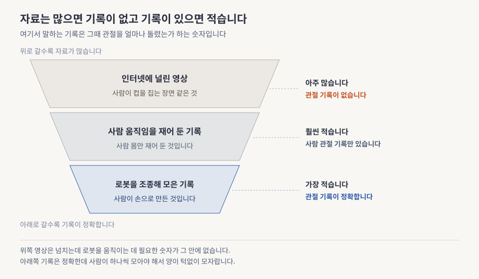
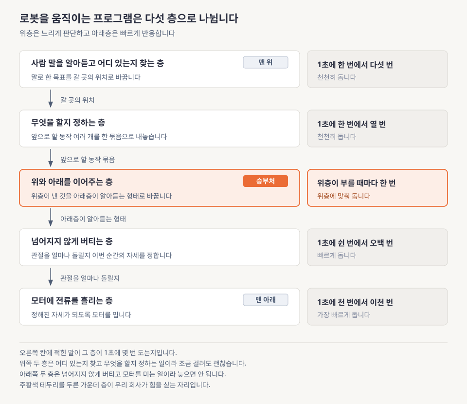
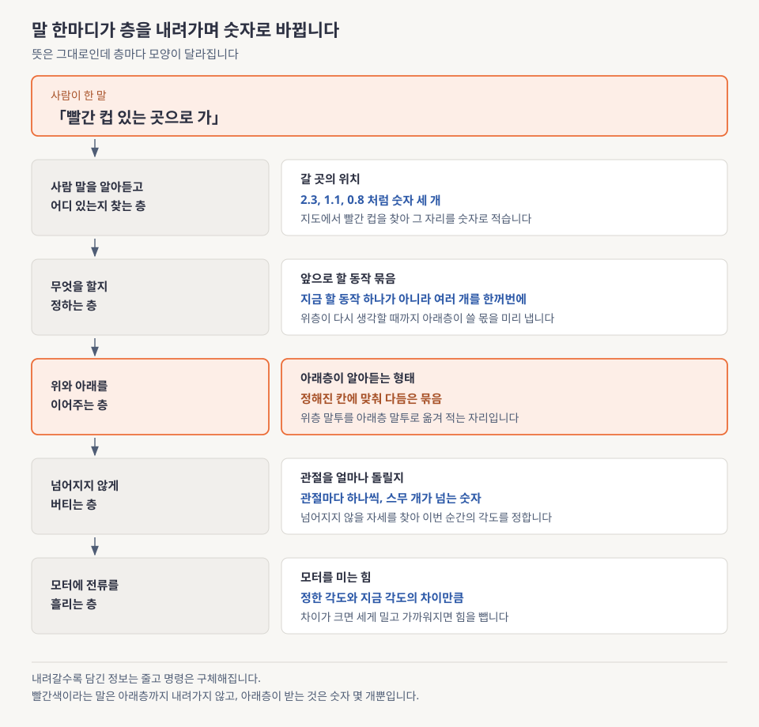
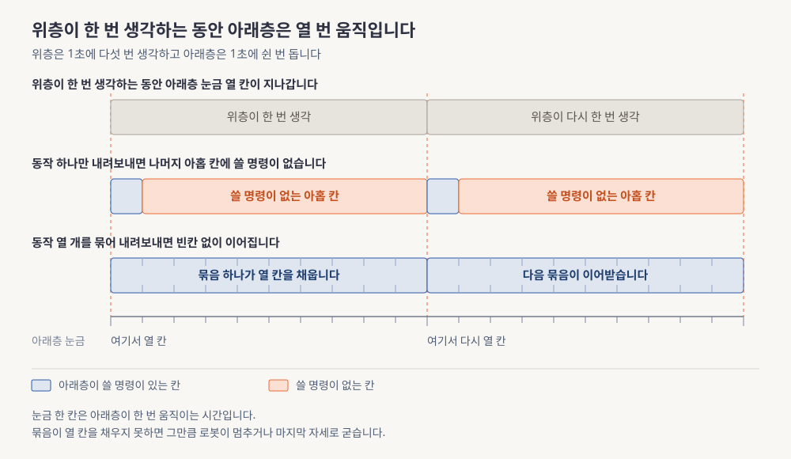

> 본문은 [lesson.md](lesson.md)입니다. 이 문서를 먼저 읽으세요.

# Physical AI 개요와 산업 지형 쉽게 먼저

> **한 문장으로**: 로봇을 움직이는 프로그램이 왜 한 덩어리가 아니라 여러 층으로 나뉘어 있는지를 그림으로 먼저 봅니다.

---

## 이 모듈이 답하는 질문 하나

로봇에게 "빨간 컵 있는 곳으로 가"라고 말하면 그 안에서는 여러 프로그램이 동시에 돌아갑니다. 하나로 합치면 만들기도 고치기도 쉬울 텐데, 로봇을 만드는 회사들은 굳이 나눠서 만듭니다. 이 모듈은 그 이유 하나만 붙잡습니다.

> 로봇 하나를 움직이는 데 왜 이렇게 많은 프로그램이 필요할까요?

다 읽고 나면 "위쪽은 느리고 똑똑하게, 아래쪽은 빠르고 단순하게 돌려야 하기 때문"이라는 답을 자기 말로 풀어낼 수 있습니다. 그렇게 나눠도 아직 풀리지 않은 문제가 무엇인지 하나 알게 됩니다.

---

## 어떤 문제가 있었나

언어 모델이 놀랍게 잘 되자 사람들은 같은 방법을 로봇에 붙여봤습니다. 카메라 영상과 사람의 말을 넣으면 팔다리를 어떻게 움직일지 곧바로 뱉는 큰 모델 하나를 만드는 것입니다. 시연 영상에서는 그럴듯했습니다. 그런데 진짜 로봇에 얹자 두 가지가 발목을 잡았습니다.

첫째, 몸은 기다려주지 않습니다. 사람은 답이 2초 늦게 나와도 참아주지만, 걷다가 발이 미끄러진 로봇은 0.2초 안에 자세를 되잡지 못하면 넘어집니다. 큰 모델은 한 번 생각하는 데 0.1초 넘게 씁니다. 1초에 열 번쯤 생각하는 모델에게 1초에 수백 번 필요한 균형 잡기를 맡길 수는 없습니다.

둘째, 배울 자료가 반쪽입니다. 인터넷에는 사람이 컵을 집는 영상이 넘칩니다. 그런데 그 영상 어디에도 그때 어깨 관절을 몇 도 돌렸는지가 적혀 있지 않습니다. 로봇을 실제로 움직이려면 필요한 것이 바로 그 숫자입니다.

**읽는 법.** 왼쪽 세 칸의 폭을 먼저 보고 그다음 오른쪽에 붙은 두 줄을 함께 읽으세요. 위 칸일수록 폭이 넓어 자료가 많고 아래 칸일수록 좁아 적습니다. 그런데 "그때 관절을 얼마나 돌렸는가"라는 기록은 반대로 아래 칸에서만 정확합니다. 가운데 칸은 사람 몸만 재어 둔 것이라 로봇에 그대로 쓸 수 없습니다.

두 문제는 성격이 다릅니다. 속도 문제는 답이 나와 있고 이 모듈의 절반이 그 답을 다룹니다. 자료 문제는 지금도 풀리는 중이라 4주 동안 여러 번 다시 만납니다. 정확히는 [lesson.md](lesson.md) §5 「데이터 피라미드」에서 각 층의 실제 규모를 숫자로 봅니다.

---

## 그래서 무엇을 하나

속도 문제부터 봅니다. 답은 의외로 단순합니다. 하나로 안 되면 나눕니다. 느리게 생각해야 하는 일과 빠르게 반응해야 하는 일을 서로 다른 프로그램으로 떼어놓고, 위쪽이 아래쪽에게 목표만 건네줍니다.

**읽는 법.** 왼쪽 상자 다섯 개를 위에서 아래로 읽고 그다음 오른쪽 칸에 적힌 횟수를 다시 위에서 아래로 따라가세요. 맨 위가 사람 말을 알아듣는 층이고 맨 아래가 모터에 전류를 흘리는 층입니다. 오른쪽 횟수가 아래로 갈수록 커지는 것만 확인하면 충분합니다.

위쪽 두 층은 1초에 한 번에서 열 번쯤 생각합니다. 무엇이 어디 있는지 찾고 무엇을 할지 정하는 일이라 조금 걸려도 괜찮습니다. 아래쪽 두 층은 1초에 쉰 번에서 수천 번을 돕니다. 넘어지지 않게 버티고 모터에 전류를 흘리는 일이라 늦으면 안 됩니다. 그리고 그 사이에 위와 아래를 이어주는 층이 하나 더 있습니다. 정확히는 [lesson.md](lesson.md) §3 「스택 5계층」에서 층마다 무엇을 받아 무엇을 내보내는지 봅니다.

**읽는 법.** 맨 위 "빨간 컵 있는 곳으로 가"에서 출발해 화살표를 따라 내려가면서 오른쪽 칸이 어떻게 바뀌는지만 보세요. 말이 갈 곳의 위치가 되고 위치가 앞으로 할 동작 묶음이 되고, 묶음이 아래층 형태로 다듬어지고 그것이 관절 각도가 되고, 마지막에 모터를 미는 힘이 됩니다.

내려갈 때마다 두 가지가 함께 일어납니다. 정보는 줄고 구체성은 늡니다. "빨간 컵"이라는 말에는 색과 사물 이름이 담겨 있지만 아래층은 그것을 모릅니다. 아래층이 받는 것은 숫자 몇 개뿐이고 그것으로 충분합니다. 위층이 아래층의 사정을 몰라도 되고 아래층이 위층의 의도를 몰라도 되는 덕분에, 한쪽만 통째로 갈아끼우는 일이 가능해집니다.

**읽는 법.** 맨 위 띠가 위층이 한 번 생각하는 동안이고, 그 아래 두 줄을 서로 견주면 됩니다. 가운데 줄은 동작을 하나만 내려보냈을 때라 주황색 빈칸 아홉 개가 남고, 아래 줄은 열 개를 묶어 내려보냈을 때라 빈칸이 없습니다.

위층이 1초에 다섯 번 생각하고 아래층이 1초에 쉰 번 돈다면, 위층이 한 번 답을 줄 때마다 아래층은 열 번 움직여야 합니다. 나머지 아홉 번에 쓸 명령이 없으면 로봇은 그 사이 멈추거나 마지막 자세로 굳어버립니다. 그래서 위층은 지금 할 동작 하나가 아니라 앞으로 할 동작 여러 개를 한 묶음으로 미리 내놓습니다. 여기서는 "열 개쯤"이라고 대충 말했지만 실제로는 통신에 걸리는 시간까지 더해 셉니다. 정확히는 [lesson.md](lesson.md) §4 「지연 예산과 action chunking」에서 숫자를 대입해 최소 몇 개인지 손으로 구합니다.

세 그림이 하나를 말합니다. 층을 나눈 것은 설계 취향이 아니라 속도 차이가 강제한 결과입니다. 그리고 나누는 순간 새 숙제가 생깁니다. 층과 층 사이에 무엇을 흘려보낼지 정해야 합니다. 우리 회사가 힘을 싣는 지점이 정확히 거기입니다.

---

## 오늘 만날 개념 5개

본문에서 수십 번 마주칠 말들입니다. 지금 외울 필요는 없고 한 번 만나두면 본문에서 처음 보는 말이 아니게 됩니다. 다섯 개 모두 제대로 배우는 자리를 아래에 적어뒀습니다.

**1. 몸을 가진 인공지능 (Physical AI)**

인터넷 자료로 학습한 지능을 물리 법칙이 지배하는 몸에 넣는 문제 전체를 가리키는 말입니다. 화면 안에서만 답하던 모델이 넘어지고 부서지는 세계로 나온 상황이라고 보면 됩니다. 이 모듈이 그 세계의 지도를 그립니다.

→ 제대로 배우는 곳은 [lesson.md](lesson.md) §2 「Physical AI란 무엇인가」입니다.

**2. 층으로 나눈 지능**

로봇을 움직이는 프로그램을 다섯 덩어리로 쪼개 위아래로 쌓은 구조입니다. 위는 느리게 판단하고 아래는 빠르게 반응하며, 위가 아래에게 목표를 한 방향으로 건넵니다. 이 문서의 그림 세 장이 전부 이 구조를 다른 각도에서 보여준 것입니다.

→ 제대로 배우는 곳은 [lesson.md](lesson.md) §3 「스택 5계층」입니다.

**3. 앞으로 할 동작을 미리 여러 개 내놓기**

위층이 한 번 생각할 때 지금 할 동작 하나가 아니라 앞으로 할 동작 여럿을 묶어서 내려보내는 방식입니다. 위층이 다음 판단을 끝낼 때까지 아래층이 쓸 명령이 떨어지지 않게 하려는 것입니다. 묶음이 짧으면 명령이 비고 길면 반응이 굼떠져서, 길이를 정하는 일 자체가 설계 문제가 됩니다.

→ 제대로 배우는 곳은 [lesson.md](lesson.md) §4 「지연 예산과 action chunking」입니다.

**4. 그때 얼마나 움직였는가 하는 기록**

영상 속 어느 순간에 로봇이나 사람이 각 관절을 얼마나 돌렸는지를 적어둔 숫자입니다. 이것이 있어야 "이 장면에서는 이렇게 움직여라"를 학습시킬 수 있는데, 인터넷 영상에는 이 숫자가 없습니다. 그래서 사람이 로봇을 직접 조종해가며 만들거나, 없는 채로 배우는 우회로를 찾습니다.

→ 제대로 배우는 곳은 [lesson.md](lesson.md) §5 「데이터 피라미드」입니다.

**5. 층과 층을 잇는 규격**

위층이 내려보낸 것을 아래층이 알아들을 형태로 바꿔주는 중간 약속입니다. 이 약속이 고정돼 있으면 위층만 새것으로 갈거나 아래층만 다른 로봇용으로 바꿀 수 있습니다. 우리 회사가 여기에 힘을 싣고 있고, 4주 과정에서 직접 만들어보는 것도 이 부분입니다.

→ 제대로 배우는 곳은 [lesson.md](lesson.md) §7 「회사 스택 연결」입니다.

---

## 이제 lesson.md로

여기까지는 그림으로 감을 잡는 자리였습니다. 본문은 같은 이야기를 다시 하지 않고, 그림에서 "대충 이쯤"이라고 넘어간 자리를 숫자와 이름으로 채웁니다.

- **숫자와 계산**: 앞으로 할 동작을 몇 개나 미리 내놓아야 하는지 실제 값을 넣어 손으로 구합니다. 위층과 아래층의 속도 차이가 몇 배인지도 직접 셉니다
- **회사 스택 연결**: 우리 회사가 쓰는 여덟 가지 도구가 어느 층에 앉는지를 §7 「회사 스택 연결」에서 배치도로 봅니다. 아래로 내려가는 길이 하나가 아니라는 것과, 아직 확인되지 않은 칸이 어디인지도 나옵니다
- **직접 돌려보는 것**: [`practice/`](practice/)에서 속도 예산과 명령이 비는 구간을 코드로 계산해보고, [`labs/`](labs/)에서 이 지도를 자기 손으로 다시 그립니다

본문까지 읽고 더 파고 싶으면 [deep-dive.md](deep-dive.md)에 수식 유도와 계보 세부와 출처 검증 메모가 있습니다.

읽는 순서는 `eli5.md`, `lesson.md`, `deep-dive.md`입니다. 이제 [lesson.md](lesson.md)로 갑니다.
