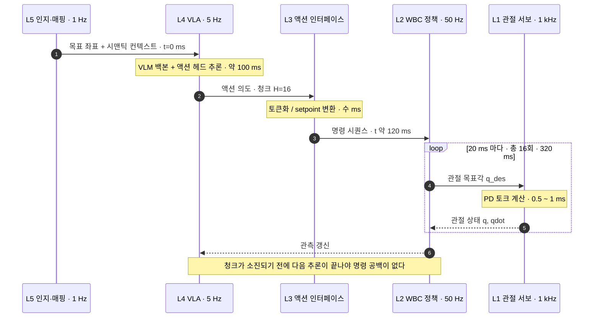
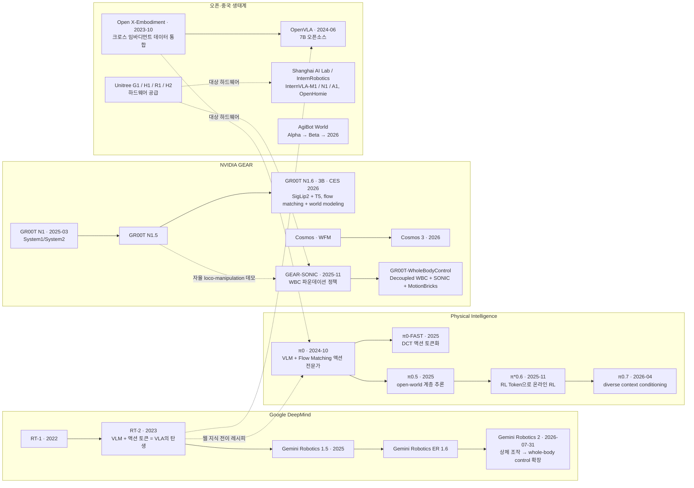
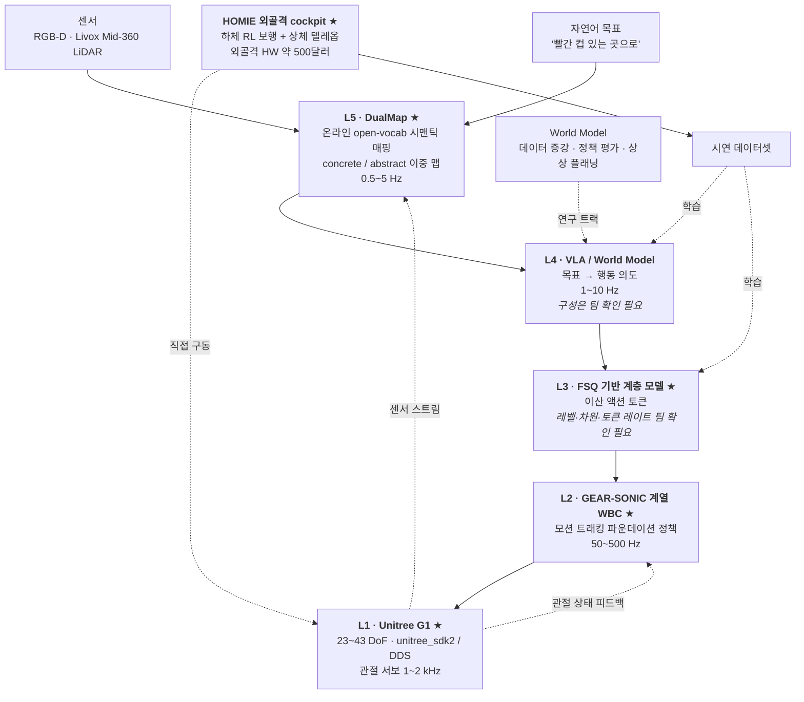

```mermaid
gantt
    title 청크 커버리지 · f2=50 Hz, f4=5 Hz(T_replan=200ms), tau=120ms
    dateFormat x
    axisFormat %Lms

    section 청크 0 해부 (H=16)
    도착 시 이미 만료 · 6스텝 폐기 :crit, 0, 120
    실제로 쓰는 구간 · 10스텝     :done, 120, 320

    section H=16 · 충분
    청크 0 사용 구간 :done, 120, 320
    청크 1 사용 구간 :done, 320, 520

    section H=15 · 1스텝 부족
    청크 0 사용 구간 :done, 120, 300
    공백 1스텝 (20ms) :crit, 300, 320
    청크 1 사용 구간 :done, 320, 500

    section H=8 · 절반
    청크 0 사용 구간 :done, 120, 160
    공백 8스텝 (160ms) :crit, 160, 320
    청크 1 사용 구간 :done, 320, 360
```

# Physical AI 개요와 산업 지형

> **한 줄 요약**: Physical AI를 5계층 스택(L1 하드웨어 ~ L5 인지·매핑)으로 분해하고 각 계층의 동작 주파수·인터페이스·주요 플레이어·데이터 공급원을 지도로 그린 뒤, 회사 스택(G1 / HOMIE / SONIC / FSQ / DualMap)이 그 지도 어디에 앉는지 확정한다. 계층이 왜 생기는지를 대역폭 분리로 논증하고 그 경계를 잇는 action chunking을 지연 예산 부등식으로 계산한다.

## 학습 목표

- [ ] Physical AI를 정의하고 왜 하필 지금인가를 3대 동인(파운데이션 모델 성숙 · 대규모 GPU 병렬 시뮬 · 저가 휴머노이드 하드웨어)으로 설명할 수 있다.
- [ ] 스택 5계층 각각의 입력 · 출력 · 동작 주파수를 말할 수 있고 하나의 언어 명령이 L5에서 L1까지 내려가며 어떤 자료형으로 바뀌는지 추적할 수 있다.
- [ ] 계층이 존재하는 이유를 계층적 제어(cascade control)의 **대역폭 분리**로 설명하고 실제 분리비를 계산해 어느 경계에서 그 논리가 성립하고 어디서 깨지는지 구분할 수 있다.
- [ ] 승부처가 L3라는 주장을 네 가지 근거(교체 가능성 · 표현 정합 · 주파수 접합 · 관측 가능성)로 논증하고 그 반대 논거도 말할 수 있다.
- [ ] 지연 예산 부등식으로 최소 청크 길이를 계산하고 청크가 부족할 때 생기는 명령 공백이 왜 생기는지(도착 시점에 이미 만료된 앞부분) 설명할 수 있다.
- [ ] 데이터 피라미드 4층의 양-품질 트레이드오프를 설명하고 액션 라벨 없는 데이터를 쓰기 위한 세 접근(latent action · IDM · world model)의 차이를 말할 수 있다.
- [ ] 주요 플레이어의 계보를 그리고 각자가 스택의 어느 계층에 베팅했는지, 그 베팅이 최근 어떻게 이동하는지 구분할 수 있다.
- [ ] 회사 스택 5요소를 5계층에 배치하고 각 요소를 4주 중 어느 모듈에서 다루는지 매핑할 수 있다.

**완료 기준**: 백지에 5계층 스택을 그려 각 계층의 입출력·주파수를 채우고 그 위에 DualMap / VLA / FSQ / SONIC·HOMIE / G1의 위치를 표시한 다음, 이 그림에서 내가 모르는 것을 팀 확인 질문 3개 이상으로 뽑아낼 수 있다.

**선수 지식**: 없음(첫 모듈) · **소요**: 이론 3h / 실습 2h

---

## 1. 왜 이것을 배우는가

### 1.1 당신은 이미 이 구조를 알고 있다

Physical AI 스택은 계층적 제어(supervisory / cascade control)의 재발견입니다.

캐스케이드 제어를 떠올려 보세요. 바깥 루프가 목표 온도를 정해 안쪽 루프에 setpoint로 넘깁니다. 안쪽 루프는 밸브를 빠르게 여닫아 그 setpoint를 추종합니다. 두 루프는 주파수가 다르고 하는 일도 다릅니다. 바깥은 느리고 판단합니다. 안쪽은 빠르고 반사적입니다.

Physical AI 스택도 똑같습니다. L4 상위 지능은 궤적 생성기이자 상위 플래너이고 L2 전신제어는 서보 루프이며 L3는 그 둘 사이 setpoint 인터페이스입니다. 달라진 것은 outer loop 하나뿐입니다. 미분방정식이던 자리에 30억 파라미터 트랜스포머가 들어앉았습니다.

이 분야가 실제로 새로 가져온 것은 따로 있습니다. 지금까지 로봇 제어는 모델 기반으로 갔습니다. 동역학 식을 세우고 MPC를 얹었죠. 그 한계는 늘 같은 곳에 있었습니다. 모델링이 안 되는 영역입니다. 접촉, 마찰, 변형체, 그리고 시각.

Physical AI는 그 영역만 학습으로 대체합니다. 잘 되던 고주파 서보 루프는 그대로 둡니다. 남는 것은 하이브리드 계층 구조입니다. 순수한 end-to-end는 아닙니다. 이 모듈에서 그리는 지도가 그 하이브리드의 설계도입니다.

### 1.2 LLM에서 본 전개가 반복되는 중이다

두 번째로 유리한 프레이밍은 LLM 쪽입니다.

LLM은 백본 사전학습 → 태스크 어댑터 → 토크나이저 설계 → 데이터 스케일링 순으로 전개됐습니다. 로봇에서는 이 순서가 거의 1:1로 대응합니다.

| LLM에서 일어난 일 | 로봇에서 대응하는 것 | 이 4주에서 다루는 곳 |
|---|---|---|
| 사전학습된 언어 백본 | VLM 백본(SigLip2 · T5 등) | W2-M3 |
| 태스크별 어댑터·헤드 | 액션 헤드(DiT · Flow Matching) | W1-M3, W1-M4, W2-M4 |
| BPE 같은 토크나이저 설계 | 액션 토크나이저(FSQ · DCT) | **W1-M5(구현), W2-M5(논증)** |
| 인터넷 규모 코퍼스 | 크로스 임바디먼트 데이터셋(OXE 등) | W2-M2 |

FSQ를 "액션의 BPE"라 부르는 비유는 문자 그대로 통합니다. 수사로 느슨하게 갖다 붙인 말이 아닙니다. 연속 신호를 유한한 코드북 인덱스로 바꿔 상위 자기회귀 모델이 다룰 수 있게 만든다는 점에서 하는 일이 같습니다.

### 1.3 이 모듈은 좌표계다

W1-M1은 그 자체로 완결되는 지식이 아닙니다. 앞으로 3주 반 동안 읽을 논문 20여 편과 실습 전부가 이 지도의 어느 좌표에 찍히는지를 여기서 정해둡니다.

좌표계 없이 논문을 읽으면 "Diffusion Policy와 SONIC 중 뭐가 상위 개념인가" 같은 질문에 매번 다시 헤맵니다. 둘 사이엔 상하 관계가 없습니다. 서로 다른 계층에 살 뿐입니다. 그 사실은 5계층 그림이 머리에 있어야 즉시 보입니다.

| 이 모듈에서 세우는 것 | 어디서 회수되는가 |
|---|---|
| 5계층 스택과 각 계층의 주파수 | 이후 모든 모듈. 새 논문을 만날 때마다 "이건 몇 층 이야기인가"로 시작 |
| 지연 예산 부등식과 action chunking | W2-M1(ACT의 청크 길이 설계), W4-M4(실제 배포 지연 측정) |
| 승부처가 L3라는 문제의식 | W1-M5(FSQ 직접 구현), W2-M5(분리형 vs 통합형 설계 논증) |
| 데이터 피라미드와 라벨 부재 문제 | W2-M2(LeRobot 데이터셋), W2-M5(latent action), W4-M1/M2(world model) |
| 회사 스택 배치도 | W4-M5 캡스톤. 이 다이어그램을 팀에게 검증받는 것이 과제 |

표 마지막 줄을 보세요. 이 모듈에서 그리는 회사 배치도는 가설입니다. 캡스톤에서 그 가설을 검증하고 고치는 것까지가 4주 과정의 마지막 단계입니다.

---

## 2. Physical AI란 무엇인가

### 2.1 정의와 LLM과의 세 가지 차이

> Physical AI = 인터넷 규모 데이터로 학습한 지능을, 물리 법칙과 실시간 제약이 있는 몸에 넣는 문제.

| 축 | LLM | Physical AI |
|---|---|---|
| 실패 비용 | 토큰 하나 틀리면 재생성 | 관절 명령 하나 틀리면 로봇이 넘어짐(하드웨어 손상) |
| 시간 제약 | 사용자가 기다려줌(초 단위) | 물리가 기다려주지 않음(ms 단위 데드라인) |
| 데이터 | 인터넷에 이미 존재 | **액션 라벨이 인터넷에 없음** — 직접 만들어야 함 |

첫 두 축은 공학으로 다루기 어렵지만 다루는 법은 알려져 있습니다. 실패 비용은 안전 계층과 시뮬레이션으로, 시간 제약은 계층 분리와 청킹으로 흡수합니다. 이 모듈의 §3과 §4가 각각 그 이야기입니다.

세 번째가 진짜 병목입니다. 나머지 둘과 달리 아직 정립된 해법이 없습니다. §5 데이터 피라미드가 그 주제이고 W2-M5와 W4-M1/M2가 거기에 대한 답안 두 가지입니다.

### 2.2 Embodied AI와 Physical AI — 용어 정리

두 용어를 섞어 쓰는 문헌이 많습니다.

Embodied AI는 "몸을 가진 지능"이라는 학술 용어로 오래 쓰였습니다. Physical AI는 NVIDIA가 밀면서 산업 용어로 굳은 표현입니다.

실무에서는 거의 같은 뜻이되 뉘앙스가 조금 다릅니다. Embodied AI가 "지능이 몸을 가진다"는 인지과학 쪽 명제에 가깝다면, Physical AI 쪽은 파운데이션 모델과 시뮬 인프라를 포함한 스택 전체를 가리킵니다. 산업 쪽 함의가 그만큼 강합니다. 이 문서는 후자 쪽 용법을 씁니다. 스택 전체를 그리는 것이 목적이니까요.

### 2.3 왜 지금인가 — 3대 동인

첫 번째 동인은 파운데이션 모델의 성숙입니다(2023~). VLM을 처음부터 만들 필요가 없어졌습니다. RT-2(2307.15818)가 "사전학습된 VLM에 액션 토큰 출력을 붙이면 웹 지식이 로봇으로 전이된다"를 보인 이후 이 레시피가 표준이 됐습니다. GR00T N1.6은 SigLip2(비전) + T5(언어) 백본, π0(2410.24164)는 VLM 백본 + Flow Matching 액션 전문가를 씁니다.

실무로 옮기면 결론이 하나 나옵니다. 로봇 팀이 만들 것은 액션 헤드와 데이터입니다. 백본은 가져다 쓰면 됩니다.

두 번째는 대규모 GPU 병렬 시뮬입니다(2021~). "Learning to Walk in Minutes"(2109.11978)가 수천 환경을 GPU에서 동시에 굴려 보행 정책을 수십 분에 학습시키는 레시피를 확립했습니다.

그 끝에 SONIC이 있습니다. 700시간 모캡(1억+ 프레임)을 42M 파라미터 정책에 21,000 GPU-hours 부어 범용 WBC를 만들었습니다(arXiv:2511.07820). 이 숫자는 패러다임 전환을 뜻합니다. 데이터를 수집하던 시대가 데이터를 생산하는 시대로 넘어갔습니다.

세 번째는 저가 휴머노이드 하드웨어입니다(2024~). Unitree G1이 $13,500~27,000 구간에 들어오며 2026년 기준 유일한 2만 달러 이하 상용 이족 휴머노이드가 됐습니다.

가격은 곧 데이터 규모 문제입니다. 연구실 한 곳이 로봇 열 대를 살 수 있으면 데이터 수집 규모가 자릿수 단위로 바뀝니다. 한 대로 순차 수집하던 것을 열 대로 병렬 수집하면 §5 피라미드의 ③층이 그만큼 두꺼워집니다. Unitree는 2025년 휴머노이드 5,500대 이상을 출하(테슬라보다 많음), 매출 16.9억 위안을 기록했고 2026년 8월 현재 STAR Market 상장 절차를 진행 중입니다.

여기에 보조 동인 4, 데이터 인프라의 공유화가 붙습니다. Open X-Embodiment(2310.08864)가 21개 기관·22종 로봇 데이터를 하나의 포맷으로 통합해 "ImageNet 모멘트"의 전제를 갖췄고 AgiBot World가 단일 플랫폼 100만 궤적을 공개하며 규모의 하한선을 올렸습니다.

---

## 3. 스택 5계층

### 3.1 블록도 — 입출력과 주파수

아래 블록도가 이 모듈의 중심에 있습니다. 화살표를 따라 위에서 아래로 내려갈수록 빨라지고 멍청해집니다.

```
════════════════════════════════════════════════════════════════════════════
[L5] 인지·매핑                                          동작: 0.5 ~ 5 Hz
  in : RGB-D [H,W,4] · LiDAR 포인트클라우드 [N,3] · 자연어 목표 (텍스트)
  out: 시맨틱 맵(객체+라벨+포즈) · 목표 3D 좌표 [3] · 질의 결과
  담당: SLAM/오도메트리, open-vocab 시맨틱 매핑, 언어 grounding
  회사: ★ DualMap                                        → W4-M3
════════════════════════════════════════════════════════════════════════════
                    │ 목표 좌표 + 시맨틱 컨텍스트
                    ▼
[L4] 상위 지능 (VLA / 월드모델 / 플래너)                동작: 1 ~ 10 Hz
  in : 이미지 [B,V,3,H,W] (V=카메라 수) · 언어 지시 토큰 [B,L]
       · 로봇 상태(proprioception) [B,D_state]
  out: 액션 청크 [B,H_chunk,D_action]   ← H_chunk = 예측 지평 (보통 8~50)
  담당: 목표 → 행동 의도. VLM 백본 + 액션 헤드(DiT/Flow Matching)
  회사: VLA / World Model (구성 팀 확인 필요)             → W2, W4-M1/M2
════════════════════════════════════════════════════════════════════════════
                    │ ★ 승부처 ★
                    ▼
[L3] 액션 인터페이스                                    동작: L4 호출당 1회
  in : 상위 모델의 액션 의도 [B,H_chunk,D_action] (연속) 또는 latent [B,D_z]
  out: 이산 토큰 시퀀스 [B,H_chunk,D_tok] 또는 연속 setpoint
       FSQ: D_z 차원 각각을 L_i 레벨로 반올림 → 코드북 크기 = ∏ L_i
  담당: 표현 변환 + 시간 정렬(chunking) + 상·하위 디커플링
  회사: ★ FSQ 기반 계층 모델 (레벨·차원 팀 확인 필요)     → W1-M5, W2-M5
════════════════════════════════════════════════════════════════════════════
                    │ 목표 자세 / 모션 레퍼런스 / twist 명령
                    ▼
[L2] 전신 제어 WBC                                      동작: 50 ~ 500 Hz
  in : 상위 명령(토큰/레퍼런스 모션) [D_cmd]
       · 관측 이력 스택 [T_hist, D_obs] (관절각·각속도·IMU·이전 액션)
  out: 관절 목표각 q_des [23~43] (또는 토크 [23~43])
  담당: RL 정책 1회 forward. 균형·접촉·모션 트래킹
  회사: ★ GEAR-SONIC (WBC 파운데이션 정책) / ★ HOMIE (하체 RL + 상체 텔레옵)
                                                        → W3-M2/M3/M4
════════════════════════════════════════════════════════════════════════════
                    │ q_des [23~43] @ 50~500 Hz
                    ▼
[L1] 하드웨어 / 미들웨어                                동작: 1 ~ 2 kHz
  in : q_des [23~43]
  out: 관절 토크 τ = Kp(q_des − q) − Kd·q̇   ← 온보드 PD 서보
  담당: 모터 드라이버, 상태 추정, DDS/SDK 통신, 안전 정지
  회사: ★ Unitree G1 (23~43 DoF) + unitree_sdk2 / DDS      → W1-M2, W3-M5
════════════════════════════════════════════════════════════════════════════
      [병렬] 데이터 수집: 텔레옵 · 모캡 · 휴먼 비디오 → 학습 데이터
      회사: ★ HOMIE 외골격 cockpit                      → W3-M3
════════════════════════════════════════════════════════════════════════════
```

블록도의 기호는 논문마다 이름이 달라 헷갈립니다. 이 문서에서는 아래 이름으로 고정해 씁니다.

| 기호 | 뜻 | 논문 통상 범위 | 회사 실제값 |
|---|---|---|---|
| `H_chunk` | 액션 청크 길이. L4가 한 번에 예측하는 미래 스텝 수 | 8~50 | 팀 확인 필요 |
| `D_action` | 액션 벡터 차원. 보통 구동 관절 수 | G1이면 23~43 | 팀 확인 필요 |
| `D_state` | proprioception 차원. 관절각·각속도·IMU 등 | 로봇·설계마다 다름 | 팀 확인 필요 |
| `D_z` | L3 입력 latent 차원. FSQ에서 양자화되는 축의 개수 | FSQ 논문 기준 3~8 | 팀 확인 필요 |
| `D_tok` | L3 출력 토큰 차원(또는 토큰 개수) | 설계 의존 | 팀 확인 필요 |
| `D_cmd` | L2가 받는 명령 차원. 목표 자세 · 모션 레퍼런스 · twist 등 | 형태 자체가 설계 선택 | 팀 확인 필요 |
| `T_hist` | L2 관측 이력 스택 길이 | 보통 3~10 | 팀 확인 필요 |
| `V` | 카메라 대수 | 1~4 | 팀 확인 필요 |

> 오른쪽 열이 전부 "팀 확인 필요"인 것이 이 모듈의 정직한 출발점입니다. 논문에서 흔히 보는 범위를 적었을 뿐이며 회사 실제 값은 확인되지 않았습니다(§9 참조). 이 표를 채우는 것이 온보딩의 목표 중 하나입니다.

### 3.2 계층별로 읽기 — 하나의 명령이 L5에서 L1까지

계층을 하나씩 뜯어보는 대신 명령 하나가 위에서 아래로 내려가는 경로를 끝까지 따라가겠습니다. 각 경계에서 자료형이 어떻게 바뀌는지가 요점입니다.

사람이 로봇에게 말합니다. "빨간 컵 있는 곳으로 가."

**L5 인지·매핑 (0.5~5 Hz).** 입력은 센서 스트림(RGB-D 이미지와 LiDAR 포인트클라우드)과 방금 들어온 자연어 문장입니다.

L5가 하는 일은 언어를 좌표로 바꾸는 것입니다. 미리 만들어둔 시맨틱 맵에서 "빨간 컵"에 해당하는 객체를 질의해 그 객체의 3D 포즈를 꺼냅니다. 출력은 `[2.3, 1.1, 0.8]` 같은 좌표 세 개와 약간의 시맨틱 컨텍스트입니다.

이 계층이 open-vocabulary여야 하는 이유가 여기서 나옵니다. 학습 때 본 적 없는 "빨간 컵"이라는 표현도 처리해야 하니까요. DualMap이 정확히 이 일을 합니다.

**L4 상위 지능 (1~10 Hz).** 입력이 늘어납니다. 카메라 이미지 `[B,V,3,H,W]`, 언어 지시 토큰 `[B,L]`, 그리고 로봇 자신의 상태 `[B,D_state]`. L5가 넘긴 좌표는 여기에 조건으로 붙습니다.

출력은 액션 청크입니다. 크기가 `[B,H_chunk,D_action]`이니 `H_chunk=16`이고 G1 29 DoF면 16×29 행렬 하나가 나옵니다. 앞으로 16스텝 동안 각 관절이 어디로 가야 하는지를 한꺼번에 예측합니다.

열여섯 개를 한꺼번에 뱉는 이유는 이 계층이 느리기 때문입니다. §4에서 부등식으로 계산합니다.

**L3 액션 인터페이스**(L4 호출당 1회)는 주파수가 없는 유일한 계층입니다. 정해진 주기로 돌지 않고 L4가 뭔가를 뱉을 때마다 한 번 도는 이벤트 구동 계층입니다.

여기서 하는 일은 표현 변환입니다. L4가 내놓은 연속값 `[B,H_chunk,D_action]`(또는 latent `[B,D_z]`)을 L2가 먹을 수 있는 형태로 바꿉니다. FSQ를 쓰면 `D_z` 차원 각각을 `L_i` 레벨로 반올림해 이산 토큰으로 만듭니다. 코드북 크기는 `∏ L_i`가 됩니다.

**L2 전신 제어 WBC (50~500 Hz).** 입력은 상위 명령 `[D_cmd]`와 관측 이력 스택 `[T_hist, D_obs]`입니다. 이력을 쌓는 이유는 속도·가속도 정보가 단일 프레임에 없기 때문입니다.

출력은 관절 목표각 `q_des [23~43]`. 이 계층은 신경망 forward 한 번이 전부입니다. 그 한 번에 균형·접촉·모션 트래킹이 전부 걸립니다. 로봇이 넘어지느냐 마느냐가 여기서 갈립니다.

L2가 50~500 Hz로 도는데 L4는 1~10 Hz로 돕니다. 최대 500배 차이입니다. 이 간극을 무엇으로 메우는가가 §4의 주제입니다.

마지막 **L1 하드웨어·미들웨어**(1~2 kHz)에는 학습이 전혀 없습니다. 순수한 PD 서보입니다.

$$
\tau = K_p(q_{\text{des}} - q) - K_d \dot q
$$

제어 배경이면 이 식은 설명이 필요 없을 겁니다. 요점은 스택 맨 아래가 여전히 고전 제어라는 것입니다. 아무리 상위가 트랜스포머여도 모터를 실제로 돌리는 것은 이 비례-미분 항입니다.

자료형은 경계마다 이렇게 바뀝니다.

| 경계 | 넘어가는 것 | 자료형 변화 |
|---|---|---|
| L5 → L4 | 목표 좌표 + 컨텍스트 | 텍스트·픽셀 → 좌표 `[3]` |
| L4 → L3 | 액션 의도 | 좌표·픽셀 → 연속 청크 `[H_chunk, D_action]` |
| L3 → L2 | 명령 | 연속 → 이산 토큰 또는 setpoint `[D_cmd]` |
| L2 → L1 | 관절 목표각 | 명령 → 실수 벡터 `q_des [23~43]` |
| L1 → 모터 | 토크 | 목표각 → 토크 `τ [23~43]` |

각 경계에서 정보가 줄어들고 구체성이 늘어납니다. "빨간 컵 있는 곳으로"라는 문장이 다섯 번의 변환을 거쳐 스물아홉 개 관절 토크가 됩니다.

### 3.3 왜 계층인가 — 대역폭 분리

제어 배경이면 이 부분은 이름만 바뀐 것입니다.

캐스케이드 제어에서 inner loop 대역폭을 outer의 5~10배로 잡는 관행이 있습니다. 두 루프의 대역폭이 가까우면 서로의 동특성에 간섭하기 때문입니다. outer가 setpoint를 바꿨는데 inner가 아직 이전 setpoint를 추종하는 중이면, outer는 그 미완의 응답을 보고 다시 판단합니다. 두 루프가 서로를 외란으로 인식하며 진동하거나 최악의 경우 발산합니다.

Physical AI 스택은 같은 규칙을 세 번 적용한 결과입니다.

$$
\omega_{L1} \gg \omega_{L2} \gg \omega_{L4} \gg \omega_{L5}
$$

이 부등식이 실제로 얼마나 성립하는지는 계산해봐야 압니다. 각 계층의 대표 주파수를 상·하한의 기하평균으로 잡고 비율을 냈습니다.

| 경계 | 빠른 쪽 대표 | 느린 쪽 대표 | 대표 비율 | 최선 | 최악 | 5배 규칙 |
|---|---|---|---|---|---|---|
| L1 / L2 | 1,414.2 Hz | 158.11 Hz | ×8.9 | ×40.0 | ×2.00 | 만족 |
| L2 / L4 | 158.11 Hz | 3.16 Hz | ×50.0 | ×500.0 | ×5.00 | 만족 |
| L4 / L5 | 3.16 Hz | 1.58 Hz | ×2.0 | ×20.0 | **×0.20** | **불만족** |

> 대표값은 상·하한의 기하평균(로그 스케일 중앙값)입니다. 최선 = 빠른쪽 상한 / 느린쪽 하한, 최악 = 빠른쪽 하한 / 느린쪽 상한. 계산은 [`practice/01_stack_frequency_budget.py`](practice/01_stack_frequency_budget.py)의 `separation_ratios()`에서 재현할 수 있습니다.

마지막 행을 보세요. L4 / L5 경계에서는 대역폭 분리 논리가 성립하지 않습니다. 대표 비율이 ×2.0에 불과하고 최악의 경우 ×0.20으로 순서가 아예 역전됩니다. L5가 5 Hz로 돌고 L4가 1 Hz로 도는 조합이 가능하기 때문입니다.

L4와 L5는 둘 다 느린 계층입니다. 두 계층을 가른 기준은 기능입니다. 인지(무엇이 어디 있는가)와 행동 의도(무엇을 할 것인가)는 하는 일이 서로 다릅니다. 대역폭은 여기서 아무 역할도 하지 않습니다. 계층 분리에는 두 종류의 논리가 섞여 있습니다. 위쪽 경계는 기능 분리, 아래쪽 두 경계는 대역폭 분리입니다.

L1/L2와 L2/L4는 규칙을 넉넉히 만족합니다. 여기서는 계층 분리를 물리가 뒷받침합니다.

규칙을 어기는 방향은 둘입니다.

첫째, 위쪽을 너무 빠르게 만들려는 경우. 3B 파라미터 VLA를 1 kHz로 돌린다고 해봅시다. 한 번 forward에 100 ms 걸리는 모델을 1 ms마다 호출할 방법은 없습니다. 물리가 허락하지 않습니다.

둘째, 아래쪽을 너무 느리게 만드는 경우. 균형 회복 반사를 5 Hz로 하면 로봇은 넘어집니다. 발이 미끄러지기 시작해서 자세가 무너지기까지 걸리는 시간이 200 ms보다 짧기 때문입니다.

제어와의 차이가 여기서 갈립니다. 캐스케이드 제어에서 5~10배 규칙은 설계자가 고른 것입니다. 원하면 다르게 잡을 수도 있죠. Physical AI 스택에서는 그렇지 않습니다. 연산 예산이 강제한 결과입니다. 모델 크기가 주파수 상한을 정하고 물리가 주파수 하한을 정합니다. 그 사이에 계층이 끼어들 자리가 생깁니다.

### 3.4 승부처는 왜 L3인가

블록도에서 L3 옆에 ★ 승부처 ★를 붙여뒀습니다.

L4와 L2를 각각 잘 만드는 것보다, 둘을 잇는 인터페이스를 어떻게 설계하느냐가 시스템 성능과 교체 가능성을 결정한다는 것이 이 절의 주장입니다.

교체 가능성이 첫 번째 근거입니다. 인터페이스가 고정되면 상위와 하위를 독립적으로 갈아끼울 수 있습니다.

제어에서 이미 아는 이야기입니다. 상위 플래너가 관절 목표각이라는 setpoint 규약만 지키면, 하위 서보를 PID에서 임피던스 제어로 바꿔도 상위는 손댈 필요가 없습니다. 반대도 마찬가지고요.

로봇 학습에서 이 이득이 훨씬 큽니다. L2 정책 하나 학습하는 데 SONIC은 21,000 GPU-hours를 썼습니다. 상위 모델을 바꿀 때마다 이걸 다시 해야 한다면 실험 자체가 불가능합니다. 인터페이스가 고정돼 있으면 L4만 갈아끼우고 L2는 그대로 씁니다.

둘째는 표현 정합입니다. 상위 모델이 자기회귀 트랜스포머라면 이산 토큰이 자연스럽습니다.

LLM이 텍스트를 BPE 토큰으로 다루는 이유를 생각해보세요. 자기회귀 모델은 이산 심볼 위의 분포를 예측하도록 설계돼 있습니다. 연속값 회귀를 붙일 수도 있지만 그러면 다중 모드 분포(같은 상황에서 여러 정답이 있는 경우)를 표현하기 어려워집니다.

액션도 똑같습니다. 컵을 잡는 방법이 여러 가지일 때, 연속값 회귀는 그 평균을 뱉습니다. 평균은 어느 쪽으로도 잡지 못하는 자세일 수 있습니다. 이산 토큰 위의 분포는 여러 모드를 그대로 유지합니다.

SONIC이 "universal token space"를 내세우는 것도 이 맥락입니다. VLA·VR 텔레옵·게임패드 플래너처럼 성격이 전혀 다른 상위 입력들을 하나의 하위 정책에 물릴 수 있는 이유가 공통 토큰 공간입니다.

주파수 접합도 근거가 됩니다. L4(1~10 Hz)와 L2(50~500 Hz) 사이 최대 500배 격차를 무엇이 메우느냐는 문제입니다.

§3.3의 표에서 L2/L4 대표 비율이 ×50이었습니다. L4가 한 번 판단하는 동안 L2가 50번 돈다는 뜻입니다. L4가 액션 하나만 뱉으면 나머지 49번은 뭘 할까요.

이 문제를 떠맡는 것이 L3입니다. 시간 정렬(chunking)이 L3의 담당 업무로 적힌 이유입니다. §4가 이 계산을 다룹니다.

마지막은 관측 가능성입니다. 경계에 이산 신호가 있으면 디버깅이 됩니다.

end-to-end 모델이 잘못된 행동을 했을 때는 원인을 찾을 자리가 마땅치 않습니다. 중간 표현이 연속 latent면 사람이 읽을 수 없습니다. 토큰 인덱스면 로그로 찍어볼 수 있고 특정 토큰이 어떤 동작에 대응하는지 사후 분석할 수 있습니다.

분리형이 공짜는 아닙니다. 반대 논거는 셋입니다.

- 양자화 오차. 연속 액션을 유한 코드북에 넣으면 정보가 손실됩니다. 코드북이 작을수록 심합니다.
- 표현력 손실. 코드북에 없는 동작은 표현할 수 없습니다. 학습 데이터 분포 밖의 미세 조정이 필요한 태스크에서 불리합니다.
- end-to-end 최적화 불가. 인터페이스가 고정되면 상·하위를 함께 최적화할 수 없습니다. 각자 최적이어도 합쳐서 최적이라는 보장이 없습니다.

어느 쪽이 맞는지는 업계 합의가 없습니다. π 계열은 L4에 올인해 인터페이스 자체를 최소화하는 쪽이고 회사 스택은 L3를 명시적으로 두는 쪽입니다. §7.4에서 이 대립을 Gemini Robotics 2와 대조해 다시 봅니다.

정직하게 덧붙이면 회사 FSQ 모델의 실제 구조는 확인되지 않았습니다. 위 논증은 "이산 액션 토큰 인터페이스 일반"에 대한 것입니다. 회사가 실제로 어떤 레벨·차원을 쓰는지, 토큰이 목표 자세인지 모션 레퍼런스인지 latent인지는 전부 미확인입니다(§9).

---

## 4. 지연 예산과 action chunking

계층이 생기면 반드시 따라오는 것이 경계에서의 지연입니다. 이 모듈에서 손으로 계산해야 할 유일한 식이 여기 있습니다.

### 4.1 부등식 유도

L4가 주기 $T_{\text{replan}} = 1/f_4$로 재계획하고 한 번의 추론에 $\tau_{\text{infer}}$가 걸리며 통신 지연이 $\tau_{\text{comm}}$입니다. L2는 $f_2$ Hz로 돌면서 청크에서 액션을 하나씩 꺼내 씁니다.

다음 청크가 도착하기 전에 현재 청크가 소진되면 로봇은 명령 공백에 빠집니다. 이 공백을 막으려면 청크가 커버해야 할 시간이 재계획 주기와 지연의 합보다 길어야 합니다.

$$
\frac{H_{\text{chunk}}}{f_2} \;\ge\; T_{\text{replan}} + \tau_{\text{infer}} + \tau_{\text{comm}}
\quad\Longleftrightarrow\quad
H_{\text{chunk}} \;\ge\; f_2\bigl(T_{\text{replan}} + \tau_{\text{infer}} + \tau_{\text{comm}}\bigr)
$$

좌변은 청크 하나가 버텨주는 시간입니다. $H_{\text{chunk}}$개의 액션을 $f_2$ Hz로 소비하니 $H_{\text{chunk}}/f_2$초가 걸리죠. 우변은 다음 청크가 도착할 때까지 기다려야 하는 시간입니다.

청크는 상위 모델의 느림을 감추는 버퍼입니다. 상위가 느릴수록, 하위가 빠를수록 버퍼가 커야 합니다.

### 4.2 수치 예와 민감도

기본 시나리오부터. $f_2 = 50$ Hz, $f_4 = 5$ Hz($T_{\text{replan}} = 200$ ms), $\tau_{\text{infer}} = 100$ ms, $\tau_{\text{comm}} = 20$ ms를 넣으면 $H_{\text{chunk}} \ge 50 \times 0.32 = 16$ 스텝입니다.

ACT와 Diffusion Policy가 쓰는 청크 길이가 대략 이 스케일인 것은 우연이 아닙니다.

파라미터를 흔들어보면 어느 항이 결과를 좌우하는지 보입니다.

| $f_2$ | $f_4$ | $\tau_{\text{infer}}$ | $\tau_{\text{comm}}$ | $T_{\text{replan}}$ | 합계 | 필요 $H_{\text{chunk}}$ | 커버 시간 |
|---|---|---|---|---|---|---|---|
| 50 Hz | 5 Hz | 100 ms | 20 ms | 200 ms | 320 ms | 16 | 320 ms |
| 50 Hz | 5 Hz | 200 ms | 20 ms | 200 ms | 420 ms | 21 | 420 ms |
| 50 Hz | 2 Hz | 100 ms | 20 ms | 500 ms | 620 ms | 31 | 620 ms |
| 50 Hz | 10 Hz | 100 ms | 20 ms | 100 ms | 220 ms | 11 | 220 ms |
| 100 Hz | 5 Hz | 100 ms | 20 ms | 200 ms | 320 ms | 32 | 320 ms |
| 200 Hz | 5 Hz | 100 ms | 20 ms | 200 ms | 320 ms | 64 | 320 ms |
| 100 Hz | 4 Hz | 150 ms | 10 ms | 250 ms | 410 ms | 41 | 410 ms |

$f_2$는 $H_{\text{chunk}}$에 선형으로 곱해집니다. 하위 제어를 50 Hz에서 200 Hz로 올리면 필요한 청크 길이도 16에서 64로 네 배가 됩니다. 커버해야 할 시간은 그대로인데 그 시간을 더 잘게 쪼개 소비하니까요.

$f_4$는 역수로 들어옵니다. 상위를 5 Hz에서 10 Hz로 올리면 $T_{\text{replan}}$이 절반이 되어 청크가 짧아도 됩니다. 상위를 빠르게 만드는 것은 대개 모델을 작게 만드는 것과 같은 말이라 공짜가 아닙니다.

$\tau_{\text{infer}}$는 더하기로만 들어와 영향이 그만큼 작습니다. 100 ms를 200 ms로 두 배 늘려도 16 → 21에 그칩니다. $T_{\text{replan}}$이 이미 200 ms를 차지하고 있어서입니다.

### 4.3 명령 공백이 실제로 무엇인가

명령 공백에 빠진다는 말을 구체적으로 뜯어봐야 합니다. 처음 보면 놓치기 쉬운 메커니즘이 하나 숨어 있습니다.

L4는 시각 $t_k$에 관측을 찍어 재계획을 겁니다. 그 청크의 액션들은 관측 시각 $t_k$를 기준으로 시간 인덱싱되어 있습니다. 청크의 $i$번째 액션은 "$t_k + i/f_2$ 시점에 실행할 것"이라는 뜻이죠. ACT와 Diffusion Policy가 이렇게 동작합니다.

청크가 실제로 L2에 도착하는 시각은 $t_k + \tau_{\text{infer}} + \tau_{\text{comm}}$입니다. 도착했을 때는 이미 앞부분이 지나간 시각용입니다.

$$
\text{버려지는 앞부분} = \lceil f_2 \cdot (\tau_{\text{infer}} + \tau_{\text{comm}}) \rceil
$$

기본 시나리오에 넣으면 $\lceil 50 \times 0.12 \rceil = 6$ 스텝이 버려집니다. 16개를 예측했는데 쓸 수 있는 것은 10개뿐입니다. 이것이 부등식에 $\tau$가 들어가는 진짜 이유입니다.

타임라인으로 그리면 이렇습니다. 시각은 ms, 파란 막대가 실제로 쓰이는 구간, 빨간 막대가 손실(도착 전 만료 또는 다음 청크를 기다리는 공백)입니다.



공백률 수치는 [`practice/01_stack_frequency_budget.py`](practice/01_stack_frequency_budget.py)의 `simulate_command_gap()`에서 재현됩니다. $H=15$일 때 9.6%가 나옵니다. 부등식을 딱 한 스텝 어겼는데 열 번에 한 번씩 명령이 빕니다.

공백이 생기면 로봇에서 실제로 무슨 일이 일어날까요. 구현에 따라 세 갈래입니다.

| 대응 | 동작 | 결과 |
|---|---|---|
| 마지막 명령 홀드 | 직전 $q_{\text{des}}$를 그대로 유지 | 가장 흔한 구현. 짧은 공백은 버티지만 이동 중이면 자세가 굳어 넘어질 수 있음 |
| 안전 정지 | 미리 정한 안전 자세로 전환 | 안전하지만 태스크가 중단됨. 공백이 잦으면 로봇이 계속 멈춤 |
| 외삽 | 이전 청크의 추세로 연장 | 짧은 공백에 부드럽지만 오래 끌면 발산 |

어느 쪽이든 좋은 선택지가 아닙니다. 부등식을 만족시키는 것이 설계의 최소 요건인 이유입니다.

### 4.4 MPC 대응과 트레이드오프

Action chunking은 MPC의 예측 지평 $N$과 정확히 같은 역할을 합니다.

MPC도 매 스텝 $N$개의 미래 입력을 풀어놓고 앞의 몇 개만 쓰고 버립니다(receding horizon). Action chunking은 그 receding horizon을 최적화로 푸는 대신 신경망으로 회귀한 것입니다. 구조가 같으니 트레이드오프도 같습니다.

$H_{\text{chunk}}$가 길수록 지연에는 강해집니다. 대신 청크 실행 중에는 새 관측을 반영하지 못합니다. 최악 반응 지연이 $H_{\text{chunk}}/f_2$까지 늘어납니다.

| $H_{\text{chunk}}$ | 구간 | 명령 공백률 | 최악 반응 지연 |
|---|---|---|---|
| 8 | 부족 | 78.7% | 160 ms |
| 16 | 최소(권장) | 0.0% | 320 ms |
| 32 | 여유 | 0.0% | 640 ms |
| 64 | 과다 | 0.0% | 1,280 ms |

$H=16$과 $H=64$는 공백률이 똑같이 0%입니다. 표만 보면 길게 잡는 것이 손해가 없어 보이죠. 오른쪽 열을 보세요. 64로 잡으면 사람이 로봇 앞에 갑자기 나타났을 때 반응까지 최대 1.28초가 걸립니다.

MPC에서 지평을 늘리면 계산이 늘고 모델 오차가 누적되는 것과 같은 구조입니다. 지평이 길수록 먼 미래를 예측합니다. 그 예측은 현재 모델이 맞다는 가정 위에 서 있습니다. → W2-M1(ACT)에서 이 트레이드오프를 실제 하이퍼파라미터로 다시 만납니다.

### 4.5 한 사이클의 타이밍



---

## 5. 데이터 피라미드

### 5.1 피라미드와 실측 규모

```
                 ▲ 양(量) 많음 / 액션 라벨 없음 / 임바디먼트 무관
        ┌────────────────────────────────┐
        │  ① 웹 비디오 (YouTube 등)        │  ~수십억 클립, 액션 라벨 0
        ├────────────────────────────────┤
        │  ② 휴먼 비디오 · 모캡           │  수백~수천 시간, 인간 골격 라벨
        ├──────────────────────────────┤
        │  ③ 텔레옵 시연 (로봇 실기)     │  10⁴~10⁶ 궤적, 액션 라벨 정확
        ├────────────────────────────┤
        │  ④ 실기 RL / 온라인 상호작용 │  가장 적음, 보상까지 있음
        └────────────────────────────┘
                 ▼ 양 적음 / 액션 라벨 정확 / 임바디먼트 종속
```

| 계층 | 대표 데이터셋 | 규모 | 임바디먼트 | 출처 |
|---|---|---|---|---|
| ③ 텔레옵 (크로스 임바디먼트) | Open X-Embodiment | 100만+ 실기 궤적, 60개 데이터셋 통합, 527 스킬 / 160,266 태스크 | 22종 로봇, 21개 기관 / 34개 연구실 | arXiv:2310.08864 |
| ③ 텔레옵 (단일 플랫폼) | AgiBot World Alpha | 92,214 궤적 (~8.5T 토큰) | AgiBot 로봇 100대, 1:1 재현 실환경 100+곳 | arXiv:2503.06669 |
| ③ 텔레옵 (단일 플랫폼) | AgiBot World Beta | **1,003,672 궤적** (~43.8T 토큰) | 동일 | arXiv:2503.06669 |
| ② 모캡 (WBC 학습) | SONIC 학습 데이터 | 700시간 = **1억+ 프레임** | 휴먼 모캡 → 휴머노이드 리타게팅 | arXiv:2511.07820 |

위로 갈수록 데이터는 넘치는데 $a_t$(액션)가 없고, 아래로 갈수록 $a_t$는 정확한데 데이터가 말랐습니다.

자릿수 차이는 감각으로 잡아두는 편이 좋습니다. 웹 비디오가 수십억 클립인데 최대 규모 텔레옵 데이터셋인 AgiBot World Beta가 100만 궤적입니다. 세 자릿수 이상 차이납니다. 그 100만조차 단일 플랫폼이라 다른 로봇으로 그대로 옮겨갈 수 없습니다.

이 분야에서 나오는 방법론 대부분이 라벨 없는 상단을 어떻게 하단으로 끌어내릴 것인가에 쏟아지는 이유입니다.

### 5.2 라벨 없는 상단을 끌어내리는 세 갈래

목표는 같지만 푸는 방식이 다릅니다.

| 접근 | 핵심 아이디어 | 필요한 라벨 데이터 | 한계 | 다루는 모듈 |
|---|---|---|---|---|
| **IDM** (Inverse Dynamics Model) | 연속한 두 관측에서 액션을 역추정한다. $\hat a_t = f_{\text{IDM}}(o_t, o_{t+1})$ | 소량. IDM 학습에만 필요 | 같은 관측 전이를 만드는 액션이 여럿이면 부정확해진다. 임바디먼트가 바뀌면 다시 학습해야 한다 | W2-M2 주변 |
| **Latent action** | 진짜 액션 자리에 대리 액션 $z_t = E(o_t, o_{t+1})$을 넣어 학습하고 하류에서는 $z \to a$ 디코더만 맞춤 | 매우 소량. 디코더 학습분만 | $z$가 물리로 해석된다는 보장이 없어 해석이 어렵다 | **W2-M5** |
| **World model** | $p(o_{t+1:t+H} \mid o_t, a)$를 학습해 데이터를 생성하거나 정책을 평가 | 액션 라벨 있는 데이터가 어느 정도 필요 | 학습·추론 비용이 크고 롤아웃이 길어지면 오차가 누적된다 | **W4-M1 / W4-M2** |

IDM이 가장 이해하기 쉽습니다. "이 프레임에서 저 프레임으로 갔다면 무슨 행동을 했을 것이다"를 역으로 추정하는 것이죠. 제어에서 역동역학(inverse dynamics)을 푸는 것과 발상이 같습니다. 문제는 역문제가 대개 그렇듯 해가 유일하지 않다는 것입니다. 팔이 A에서 B로 갔다는 관측만으로는 어떤 경로로 갔는지 알 수 없습니다.

Latent action은 문제를 우회합니다. 진짜 액션을 복원하려 애쓰지 않고 관측 전이를 설명하는 어떤 잠재 코드를 학습합니다. 그 코드가 실제로 무슨 물리량인지는 신경 쓰지 않습니다. 나중에 소량의 실기 데이터로 "이 코드는 실제로 이 액션이었다"는 대응만 맞춰주면 됩니다. LAPA와 Genie 계열이 이 노선입니다.

World model은 아예 방향을 바꿉니다. 라벨 없는 데이터에서 액션을 뽑아내려 하지 않습니다. 환경 자체를 모델링해 데이터를 생성합니다. 제어에서 플랜트 모델을 세우는 것과 같은 발상이고 RSSM 계열은 사실상 학습된 상태공간 모델입니다. 정책 평가와 상상 기반 플래닝에도 쓸 수 있어 용도가 넓습니다.

### 5.3 그래서 W2-M5와 W4-M1/M2가 존재한다

W2-M5(latent action)와 W4-M1/M2(world model)는 둘 다 이 피라미드 문제에 대한 답안입니다. 새 주제처럼 보여도 뿌리는 하나입니다. 그 사실을 모르고 각각을 별개 논문으로 읽으면 "왜 이걸 배우지"라는 의문이 계속 따라붙습니다.

W1-M5의 FSQ도 여기에 연결됩니다. Latent action을 이산화하려면 양자화기가 필요한데 FSQ가 바로 그 양자화기입니다. §3.4에서 L3 인터페이스로 본 FSQ가 여기서는 데이터 문제의 도구로 다시 등장합니다. 같은 기술이 두 문제를 동시에 건드리는 것이 이 분야의 특징입니다.

---

## 6. 주요 플레이어 계보

### 6.1 계보 다이어그램



### 6.2 무엇이 실제로 바뀌었나

계보 그림은 누가 누구를 이었는지만 보여줍니다. 각 단계에서 무엇이 문제였고 무엇으로 풀었는지를 따라가야 지도가 쓸모 있어집니다.

웹 지식을 어떻게 로봇으로 옮기는가. RT-2(2023)가 답한 질문이 이것입니다. 그전까지 로봇 정책은 로봇 데이터로만 학습했으니 로봇 데이터에 없는 개념은 알 수 없었죠. RT-2의 답은 단순했습니다. 사전학습된 VLM을 가져와 출력 어휘에 액션 토큰을 끼워 넣는 것. VLM이 이미 아는 "바나나"라는 개념이 로봇 행동으로 전이됩니다. VLA라는 범주 자체가 여기서 생겼습니다.

다음 물음은 이 레시피를 누구나 쓸 수 있느냐였습니다. RT-2는 가중치가 공개되지 않았습니다. 그 빈자리를 2024-06의 OpenVLA가 채웠습니다. OpenVLA(2406.09246)는 7B 오픈소스로 같은 레시피를 재현하며 연구 커뮤니티의 기준선이 됐습니다.

**π0 (2024-10).** 이번 물음은 액션 헤드를 어떻게 만드느냐였습니다. RT-2 계열은 액션을 이산 토큰으로 뱉었고 이산화는 정밀도를 깎습니다. π0(2410.24164)는 VLM 백본은 그대로 두되 액션 헤드를 Flow Matching 전문가로 바꿨습니다. 연속 액션을 고주파로 뽑을 수 있게 되면서 조작 정밀도가 올라갔습니다. → W1-M4에서 Flow Matching을 직접 다룹니다.

그러면 토큰화는 버리는가. π0-FAST(2025)는 아니라고 답했습니다. 자기회귀 학습의 이점(§3.4 둘째 근거)이 여전히 크거든요. π0-FAST는 액션 시퀀스를 DCT로 변환해 토큰화합니다. 주파수 영역에서 압축하면 같은 정보를 더 적은 토큰으로 담을 수 있습니다. 액션 토크나이저 설계가 독립된 연구 주제가 된 시점입니다. 회사가 FSQ를 쓰는 것도 이 흐름 위에 있습니다.

π0.5 → π\*0.6 → π0.7 (2025~2026)의 관심사는 데이터를 어떻게 더 쓰느냐입니다. π0.5는 open-world 계층 추론, π\*0.6은 VLA에서 "RL Token"을 뽑아 온라인 RL로 개선, π0.7은 diverse context conditioning으로 수행 품질 메타데이터와 서브골 이미지를 학습 조건으로 주입합니다. 특히 π0.7은 §5와 바로 이어집니다. 준최적 데이터와 실패 데이터까지 버리지 않고 쓰겠다는 것이니까요.

계층을 모델 안에 넣는 방향도 있습니다. GR00T N1 → N1.6 (2025~2026)이 그 궤적입니다. GR00T N1(2503.14734)은 System1/System2 구조로 빠른 반응과 느린 추론을 한 모델 안에 뒀습니다. N1.6은 SigLip2 + T5 백본에 flow matching과 world-modeling objective를 함께 학습시킵니다. §5.2의 세 갈래 중 world model 노선을 VLA 안으로 흡수하려는 시도로 읽을 수 있습니다.

마지막 물음은 경계를 어디까지 내릴 것이냐입니다. 이전 세대는 상체 조작 중심이었습니다. Gemini Robotics 2 (2026-07-31)는 보행·웅크리기·굽히기까지 포함한 whole-body control로 확장했습니다. 상위 모델이 L2 영역을 흡수하는 방향입니다. §7.4에서 이 대립을 회사 구도와 대조합니다.

초기 3년의 주제가 "웹 지식을 어떻게 옮기는가"였다면 지금의 주제는 "계층 경계를 어디에 둘 것인가"와 "라벨 없는 데이터를 어떻게 쓰는가"로 옮겨갔습니다.

### 6.3 조직별 베팅 계층

| 조직 | 계보 · 2026-08 최신 | 주 베팅 계층 | 핵심 차별점 |
|---|---|---|---|
| **Physical Intelligence** | π0 → π0.5 → π\*0.6 → **π0.7** (arXiv:2604.15483, 2026-04-16) | L4 단일 베팅 | 액션 헤드와 토크나이저 설계에 집중. π0.7의 diverse context conditioning으로 준최적·실패 데이터까지 활용 |
| **NVIDIA GEAR** | GR00T N1 → N1.5 → **N1.6** (3B, CES 2026) | L4 + L2 + 시뮬 인프라 | 전 계층 수직 통합. flow matching과 world-modeling objective 공동 학습 |
| **NVIDIA** | Cosmos → **Cosmos 3** (2026) | 데이터 · 월드모델 | 월드 생성 + 비전 추론 + 액션 시뮬 통합. 오픈 Cosmos WFM 누적 300만+ 다운로드 |
| **NVIDIA** | **Isaac Sim 5.0 GA**(SIGGRAPH 2025) / **Isaac Lab 3.0 얼리 액세스** | 시뮬 인프라 | Isaac Lab 2.2는 휴머노이드 정책 평가·GR00T N1 벤치마킹 중심 |
| **Google DeepMind** | RT-2 → Gemini Robotics 1.5 → ER 1.6 → **Gemini Robotics 2** (2026-07-31) | L4 → L2로 하향 확장 | whole-body control로 확장. On-Device 2 동시 공개(수 시간 데이터로 새 임바디먼트 적응) |
| **Shanghai AI Lab / InternRobotics** | InternVLA-M1 / N1 / A1 (2025~2026) | L4 + L5 + L2 | N1은 듀얼 시스템 VLN — wheeled/quadruped/humanoid zero-shot, >150m 장기 계획 + >30Hz 실시간 결정. **OpenHomie도 이 조직 산하** |
| **Unitree** | G1 / H1 / R1 / H2 | L1 하드웨어 | 2025년 휴머노이드 **5,500대+ 출하 — 테슬라보다 많음**, 매출 16.9억 위안. 2026-08 STAR Market 상장 절차 진행 중(08-10 청약 개시 예정) |
| **AgiBot** | AgiBot World Alpha/Beta → 2026 | 데이터 | 100% 실환경, AGIBOT G2 플랫폼 free-form 수집. arXiv:2503.06669, IROS 2025 Best Paper Finalist & IEEE TRO 2026 |

> 세부 사항 몇 가지: GR00T N1.6은 HF `nvidia/GR00T-N1.6-3B`로 공개돼 있고 N1.5 대비 MLP connector가 개선됐으나 학습 데이터 규모는 비공개입니다. π\*0.6은 2025-11-17 공개, π0.7은 공저자 87명입니다. Gemini Robotics 2는 Apptronik 휴머노이드 데모를 함께 공개했습니다.

**한 줄 요약**: π 계열은 L4에 올인, NVIDIA는 L2·L4·시뮬 인프라 전부, DeepMind는 L4에서 시작해 L2로 내려오는 중, 중국 생태계는 하드웨어와 데이터에서 규모로 밀고 있습니다.

### 6.4 1차 출처가 없는 것들

Figure / Tesla / 1X는 정량 수치를 1차 출처로 확인하지 못해 정성 서술만 합니다.

Figure는 자체 하드웨어에 자체 VLA를 얹는 수직 통합, Tesla Optimus는 대량 생산을 전제한 수직 통합 노선이나 V3는 2026년 7월 기준 아직 공개 시연 전, 1X는 가정용(NEO) 포지셔닝에 텔레옵 폴백을 전제한 배포 전략입니다.

생산 대수, 자율 운영 시간, 손 DoF, 선주문 수량 같은 수치는 언론 보도로는 돌아다니지만 1차 출처가 확인되지 않아 의도적으로 넣지 않았습니다. 지도에 빈칸으로 남겨두는 편이 틀린 숫자를 적어두는 것보다 낫습니다.

---

## 7. 회사 스택 연결 ★

### 7.1 배치도



> ⚠️ 이 배치도는 마스터플랜 §2.3의 "추정 파이프라인"에 근거합니다. 팀이 검증한 실제 구성이 아닙니다. W4-M5 캡스톤 과제 중 하나가 이 다이어그램을 팀원에게 검증받고 수정하는 것입니다. 특히 L4의 정체(자체 VLA인지 GR00T 파인튜닝인지), L3↔L2 접점의 실제 형태, DualMap 출력이 L4로 어떤 형태로 들어가는지는 **전부 확인하지 못했습니다.**

### 7.2 계층 × 회사 스택 × 학습 모듈 매핑

| 계층 | 회사 스택 요소 | 정체 · 이 lesson이 닿는 지점 | 깊게 다루는 모듈 | 확인 상태 |
|---|---|---|---|---|
| L5 | **DualMap** ★ | 온라인 open-vocabulary 시맨틱 매핑을 맡고 동적 환경에 대응한다(arXiv:2506.01950, RA-L 2025). 스택 최상단에서 언어 목표를 좌표로 바꾼다 | W4-M3 | 논문·코드 = 확정 / **회사 적용 형태 팀 확인 필요** |
| L4 | VLA / World Model | 목표를 행동 의도로 바꾼다. 계보 지도에서는 π0 / GR00T / Gemini Robotics 진영과 견줄 자리 | W2-M3/M4, W4-M1/M2 | **팀 확인 필요** (자체 개발? 파인튜닝? 미정?) |
| L3 | **FSQ 기반 계층 모델** ★ | 이산 액션 토큰화를 맡는다(FSQ 원논문 arXiv:2309.15505). §3.4의 네 근거가 이 선택을 시스템 차원에서 뒷받침한다 | W1-M5(구현), W2-M5(설계 논증) | 알고리즘 = 확정 / **회사 모델 구조·레벨 팀 확인 필요** |
| L2 | **GEAR-SONIC** ★ | WBC 모션 트래킹 파운데이션 정책. 42M / 700h 모캡 / 21k GPU-hours(arXiv:2511.07820). 여기서 말하는 universal token space가 곧 L3 인터페이스다 | W3-M4 | 논문·코드 = 확정 / **가중치 사용인지 재학습인지 팀 확인 필요** |
| L2 + 데이터 | **HOMIE** ★ | 하체 RL에 상체 외골격 cockpit 텔레옵을 붙였다(arXiv:2502.13013). 데이터 피라미드 ③층을 직접 채우는 경로다 | W3-M3 | 논문·코드 = 확정 / **CC-BY-NC-SA 4.0 상업 이용 승인 여부 팀 확인 필요** |
| L1 | **Unitree G1** ★ | 23~43 DoF 휴머노이드. 이 구성이 액션 벡터 차원의 하한을 정한다 | W1-M2(모델 로드), W3-M5(배포 경로) | 스펙 = 확정 / **보유 구성(23/29/43) 팀 확인 필요** |

### 7.3 G1 구성 — 액션 차원이 여기서 결정된다

| 구성 | DoF | 구성 상세 | 메모 |
|---|---|---|---|
| G1 기본형 | 23 | 다리 6×2 + 팔 5×2 + 허리 1 | WBC 액션 벡터의 하한 |
| G1 EDU Plus (U2) | 29 | 팔·허리 자유도 추가 | |
| G1 EDU Ultimate | 최대 43 | 다관절 핸드 + 추가 허리·손목 | Dex3 핸드 포함 구성 |

페이로드 3 kg, 가격대 $13,500~27,000. 2026년 기준 유일한 2만 달러 이하 상용 이족 휴머노이드입니다.

이 표가 §3.1 기호표의 `D_action`을 정합니다. 23이냐 29냐 43이냐에 따라 L2 정책의 출력 차원이 바뀌고 그러면 L3 코드북 설계도 바뀝니다. 스택 맨 아래 하드웨어 선택이 위쪽 세 계층의 설계를 제약하는 구조입니다.

> 📎 DoF 수치는 3자 사이트(robotsguide, robostore) 교차확인값입니다. `support.unitree.com`은 JS 렌더링이라 집필 시점에 HTML만으로는 확인이 되지 않았습니다. **팀 보유 기체의 실제 구성으로 반드시 대체하세요.**

### 7.4 분리형 vs 통합형 — Gemini Robotics 2와의 거울

2026-07-31 공개된 Gemini Robotics 2는 이전 세대의 상체 조작 중심에서 whole-body control로 확장했습니다. 회사 구도와 직접 비교 대상인 이유는 방향이 정반대이기 때문입니다.

회사 스택은 L4(VLA)와 L2(WBC)를 명시적으로 분리하고 L3(FSQ 토큰)로 잇습니다. Gemini Robotics 2는 상위 모델이 전신 제어까지 흡수하는 방향으로 보입니다(내부 구조는 미공개).

| 축 | 분리형 (회사 구도) | 통합형 (Gemini Robotics 2 방향) |
|---|---|---|
| 하위 정책 교체 | 인터페이스만 지키면 자유 | 전체 재학습 |
| 인터페이스 복잡도 | 단순 — 토큰 규약 하나 | 없음(내부 표현) |
| 디버깅 | 경계에서 신호를 관측 가능 | 중간 표현이 불투명 |
| 표현력 | 코드북 범위로 제한 | 제한 없음 |
| 양자화 오차 | 발생 | 없음 |
| 공동 최적화 | 불가 — 각자 최적이 전체 최적을 보장 안 함 | 가능 |
| 학습 비용 | 계층별 분할. L2 재사용 가능 | 통짜 학습. SONIC 급이면 21k GPU-hours 규모 |

§3.4의 네 근거가 왼쪽 열을, 세 반대 논거가 오른쪽 열을 지지합니다. 이 물음에 대한 업계 합의는 아직 없습니다. W2-M5에서 이 논증을 설계 수준으로 다시 펼칩니다.

한 가지는 분명합니다. 통합형이라 해도 L1의 고주파 서보 루프는 그대로 따로 돕니다. 계층을 둘 것이냐는 이미 논쟁 대상에서 내려왔고 남은 물음은 경계선을 어디에 긋느냐입니다.

---

## 8. 흔한 오해 4가지

| 오해 | 교정 |
|---|---|
| **"VLA 하나면 끝난다 / end-to-end가 계층 구조를 대체한다"** | 계층은 주파수·지연 예산이 물리적으로 강제한 결과입니다. 설계자의 취향이 끼어들 자리가 없습니다. 3B 모델을 1 kHz로 forward할 방법은 없고 균형 회복 반사를 5 Hz로 할 수도 없습니다(§4의 부등식). Gemini Robotics 2처럼 상위 모델이 WBC까지 흡수하는 흐름에서도 고주파 서보 루프는 여전히 따로 돕니다. 달라지는 것은 경계선의 위치뿐입니다. 계층 자체는 어느 설계에서도 사라지지 않습니다. |
| **"계층 경계는 전부 대역폭 분리로 설명된다"** | §3.3의 실측이 반박합니다. L1/L2는 ×8.9, L2/L4는 ×50으로 캐스케이드 경험칙을 넉넉히 만족하지만 L4/L5는 대표 비율이 ×2.0이고 최악에서는 ×0.20으로 역전합니다. 위쪽 경계를 가른 것은 기능(인지 vs 행동 의도)입니다. 대역폭 논리는 여기까지 올라오지 못합니다. 계층 분리에 두 종류의 논리가 섞여 있다는 것을 알아야 새 아키텍처를 볼 때 "이 경계는 왜 있는가"를 제대로 물을 수 있습니다. |
| **"시뮬에서 되면 실기에서 된다"** | sim2real 갭은 다섯 요인(액추에이터 동특성, 지연, 접촉 모델, 센서 노이즈, 상태 추정)에서 옵니다. 업계가 sim2sim 검증 문화(학습 시뮬 → 다른 시뮬에서 재검증 → 실기)를 쓰는 이유입니다. 플랜트 모델 하나로 튜닝한 제어기가 실기에서 발산하는 것과 같은 이야기이고 도메인 랜더마이제이션은 강인제어의 불확실성 집합을 데이터로 구현한 장치입니다. → W3-M5 |
| **"데이터만 더 모으면 된다"** | 피라미드 상단(웹·휴먼 비디오)은 양이 비교가 안 되게 많지만 액션 라벨 $a_t$가 없고 하단(텔레옵·실기 RL)은 라벨이 정확하지만 비쌉니다. AgiBot World Beta의 100만 궤적조차 단일 플랫폼이라 다른 로봇으로의 전이는 별개 문제입니다. latent action·IDM·world model 계열이 존재하는 이유가 이것입니다. 데이터 자체는 이미 넘칩니다. 정작 풀리지 않은 것은 라벨 없는 데이터를 쓰는 법입니다. → W2-M5, W4-M1/M2 |

**번외**: "Physical AI = 휴머노이드"도 흔한 오해입니다. 휴머노이드는 인간 환경·인간 데이터와의 호환성 때문에 주목받는 하나의 폼팩터일 뿐, OXE의 22종 로봇 대부분은 팔·모바일 매니퓰레이터입니다. 회사 스택이 G1 기준이니 이 4주는 휴머노이드 중심으로 읽어도 무방합니다.

---

## 9. 팀에 물어볼 것

> `notes/questions-for-team.md`의 W1 섹션에 복사할 것. P0 질문 1~5와 중복되지 않는 새 질문입니다.

1. **OpenHomie는 CC-BY-NC-SA 4.0(상업 이용 제한)인데, 우리는 별도 라이선스·상업 이용 승인을 받았는가? 아니면 논문만 참고한 자체 재구현인가?** — 이 답에 따라 W3-M3에서 코드를 읽는 방식(그대로 쓸 수 있는가 vs 구조만 배우는가)이 달라집니다. **법무 리스크가 걸린 질문이라 우선순위 최상.**
2. **GEAR-SONIC은 코드가 Apache 2.0, 가중치가 NVIDIA Open Model License입니다. 우리는 공개 가중치를 파인튜닝하는 형태인가, SONIC 방식의 자체 학습인가?** — 21,000 GPU-hours 규모라 자체 학습이면 인프라 쪽도 같이 물어야 합니다.
3. **우리 G1은 어떤 구성인가** — 23 DoF 기본형 / 29 DoF EDU Plus / 43 DoF EDU Ultimate? Dex3 핸드가 있는가? — §3.1 기호표의 `D_action`과 텔레옵 매핑이 여기서 결정됩니다.
4. **L5 → L4 인터페이스의 실제 형태는? DualMap이 3D 좌표를 넘기는가, 시맨틱 맵 질의 API인가, 아니면 언어 목표를 그대로 넘기는가?** — §3.2에서 좌표 `[3]`으로 가정하고 설명했지만 이건 추정입니다.
5. **L4 상위 지능은 자체 VLA인가, GR00T N1.x 파인튜닝인가, 아직 미정인가?** — §7.4의 분리형 노선과 Gemini Robotics 2식 통합형 노선 중 어느 쪽을 지향하는지도 함께.
6. **L4 추론은 G1 온보드에서 도는가, 외부 워크스테이션인가?** — §4의 주파수 예산을 실제 수치로 채우려면 $\tau_{\text{infer}}$와 $\tau_{\text{comm}}$의 실측이 필요합니다(W4-M4에서 다시 필요).
7. **§3.1 기호표의 오른쪽 열을 채워줄 수 있는가** — `H_chunk`, `D_action`, `D_z`, `D_tok`, `D_cmd`, `T_hist`, `V`. 이 일곱 개 숫자가 우리 스택의 실제 형상입니다. 한 번에 다 모르더라도 아는 것부터.

---

## 10. 실습으로 가기

이 모듈은 GPU가 필요 없습니다. CPU 인스턴스 또는 로컬에서 전부 돌아갑니다.

- 실습 코드: [`practice/`](practice/)
  - `01_stack_frequency_budget.py` — §3.3의 대역폭 분리비와 §4의 부등식을 코드로. $f_2$, $f_4$, $\tau_{\text{infer}}$를 바꿔가며 필요한 $H_{\text{chunk}}$를 계산하고 청크 길이가 부족할 때 생기는 명령 공백을 타임라인 플롯으로 저장합니다. §3.3 표와 §4.2·§4.4 표의 수치가 전부 여기서 나옵니다.
  - `02_data_pyramid_plot.py` — 데이터 피라미드와 5계층 스택 다이어그램을 png로 렌더합니다(문서용 그림 소스).
  - `03_player_landscape.py` — §6의 플레이어 지도를 CSV로 관리하고 비교표·차트로 렌더합니다. 새 모델이 나올 때마다 CSV만 갱신하면 됩니다.
  - `my_stack_template.excalidraw` — 이 모듈의 산출물입니다. 본인 언어로 그린 스택 다이어그램을 직접 채워 넣는 편집 가능 스켈레톤입니다.
- 랩 가이드: [`labs/`](labs/) — 5단계, 약 2시간. 마지막 단계가 GEAR-SONIC 프로젝트 페이지 데모 영상을 보고 "회사가 지향하는 최종 그림"을 자기 말로 한 문단 쓰기입니다.

> 📌 이 모듈의 진짜 산출물은 당신이 직접 그린 스택 다이어그램 1장 + '우리 회사 스택이 이 지도 어디에 있는가' 메모입니다. 코드가 아닙니다. 템플릿을 그대로 베끼지 말고 모르는 칸은 물음표로 남겨두세요. 그 물음표가 팀 질문 리스트가 됩니다.

---

## 11. 셀프 체크 퀴즈

1. Physical AI와 LLM의 결정적 차이 3가지를 말하고 그중 이 분야의 진짜 병목이 무엇인지 설명하라.
2. 스택 5계층의 이름과 각 계층의 대표 동작 주파수를 위에서 아래로 말하라. "빨간 컵 있는 곳으로"라는 명령이 각 경계에서 어떤 자료형으로 바뀌는지도 함께.
3. 계층 구조가 생기는 이유를 제어공학 용어로 설명하라. inner/outer loop 대역폭 비율 규칙과의 관계는? 그리고 **이 규칙이 성립하지 않는 경계는 어디이며 그 경계는 무엇으로 갈라진 것인가?**
4. 승부처가 L3라는 주장의 근거 네 가지를 말하고, 그 각각에 대한 반대 논거도 하나씩 대라. 회사 스택에서 L3에 해당하는 것은 무엇인가?
5. $f_2 = 100$ Hz, $f_4 = 4$ Hz, $\tau_{\text{infer}} = 150$ ms, $\tau_{\text{comm}} = 10$ ms일 때 최소 청크 길이 $H_{\text{chunk}}$는?
6. 청크가 도착했을 때 **앞부분 몇 개가 왜 버려지는가?** $f_2 = 50$ Hz, $\tau_{\text{infer}} + \tau_{\text{comm}} = 120$ ms일 때 버려지는 스텝 수를 계산하라.
7. Action chunking을 MPC 용어로 번역하라. 청크를 길게 잡을 때의 대가는 무엇인가?
8. 데이터 피라미드 4층을 위에서 아래로 나열하고 각 층에서 무엇이 많고 무엇이 없는지 말하라.
9. 액션 라벨 없는 데이터를 활용하는 세 가지 접근(IDM · latent action · world model)의 차이를 한 줄씩 설명하고, 각각의 한계도 하나씩 대라.
10. 회사 스택 5요소(DualMap / VLA / FSQ / SONIC·HOMIE / G1)를 계층에 배치하고 각각을 4주 중 어느 모듈에서 다루는지 말하라. 그리고 이 배치도에서 **당신이 아직 모르는 것** 3가지를 지목하라.

<details>
<summary>정답 보기</summary>

1. ① 실패 비용 — 토큰은 재생성하면 되지만 관절 명령 오류는 로봇을 넘어뜨림 ② 시간 제약 — 물리는 기다려주지 않음(ms 데드라인) ③ 데이터 — 액션 라벨이 인터넷에 없음. **진짜 병목은 ③**이다. 앞의 둘은 계층 분리와 청킹이라는 알려진 해법이 있지만 ③은 정립된 해법이 없어 데이터 피라미드 문제로 이어진다.

2. L5 인지·매핑 0.5~5 Hz → L4 상위 지능(VLA/월드모델) 1~10 Hz → L3 액션 인터페이스(L4 호출당 1회, 이벤트 구동) → L2 전신제어 WBC 50~500 Hz → L1 하드웨어/관절 서보 1~2 kHz. 자료형: 텍스트·픽셀 → 목표 좌표 `[3]` → 연속 액션 청크 `[H_chunk, D_action]` → 이산 토큰 또는 setpoint `[D_cmd]` → 관절 목표각 `q_des [23~43]` → 토크 `τ [23~43]`.

3. 캐스케이드/supervisory control의 대역폭 분리다. inner loop 대역폭을 outer의 5~10배로 잡아 두 루프의 동특성 간섭(서로를 외란으로 인식해 진동·발산)을 막는 규칙이다. 여기서는 설계로 고른 것이 아니라 연산 예산이 강제했다는 점이 다르다(3B 모델을 kHz로 못 돌린다). **성립하지 않는 경계는 L4/L5**. 대표 비율 ×2.0, 최악 ×0.20으로 역전한다. 이 경계는 대역폭이 아니라 기능(인지 vs 행동 의도)으로 갈린 것이다.

4. 근거: ① 교체 가능성 — 인터페이스가 고정되면 상·하위를 독립 교체(반대: 공동 최적화 불가) ② 표현 정합 — AR 모델은 이산 심볼 분포에 맞고 다중 모드를 유지(반대: 양자화 오차) ③ 주파수 접합 — L2/L4 사이 ×50 격차를 chunking으로 메움(반대: 청크 실행 중 반응성 저하) ④ 관측 가능성 — 토큰 인덱스는 로그로 찍어 디버깅 가능(반대: 코드북 밖 동작은 표현 불가 = 표현력 손실). 회사에서는 FSQ 기반 계층 모델이 L3다.

5. $H \ge f_2(T_{\text{replan}} + \tau_{\text{infer}} + \tau_{\text{comm}}) = 100 \times (0.25 + 0.15 + 0.01) = 100 \times 0.41 = 41$ 스텝.

6. 청크의 액션들은 관측 시각 $t_k$ 기준으로 시간 인덱싱되어 있다. 청크가 실제 도착하는 시각은 $t_k + \tau_{\text{infer}} + \tau_{\text{comm}}$이다. 그 사이에 지나간 시각용 액션은 쓸 수 없어 폐기된다. 버려지는 개수 $= \lceil f_2(\tau_{\text{infer}} + \tau_{\text{comm}}) \rceil = \lceil 50 \times 0.12 \rceil = 6$ 스텝. 이것이 부등식에 $\tau$가 들어가는 이유다.

7. receding horizon 제어의 예측 지평 $N$이다. 매 스텝 미래 $N$개 입력을 만들어 앞의 일부만 쓰고 버리는 구조가 동일하다(최적화로 풀지 않고 신경망 회귀로 얻는다는 점만 다름). 대가는 반응성이다. 청크 실행 중에는 새 관측을 반영하지 못하므로 최악 반응 지연이 $H_{\text{chunk}}/f_2$까지 늘어난다. $H=64$, $f_2=50$이면 1.28초다.

8. ① 웹 비디오(수십억 클립, 액션 라벨 0) ② 휴먼 비디오·모캡(수백~수천 시간, 인간 골격 라벨) ③ 텔레옵 시연($10^4$~$10^6$ 궤적, 액션 라벨 정확) ④ 실기 RL/온라인 상호작용(가장 적음, 보상까지 있음). 위로 갈수록 양은 많고 액션 라벨이 없으며 임바디먼트에 무관하고, 아래로 갈수록 양은 적고 라벨은 정확하며 임바디먼트에 종속된다.

9. IDM — 소량의 라벨 데이터로 $\hat a_t = f(o_t, o_{t+1})$을 학습해 라벨 없는 비디오에 액션을 역추정으로 붙인다. 한계: 같은 관측 전이를 만드는 액션이 여럿이면 해가 유일하지 않다. Latent action — 진짜 액션 자리에 대리 액션 $z_t = E(o_t, o_{t+1})$을 넣어 학습하고 소량 실기 데이터로 $z \to a$ 디코더만 맞춘다. 한계: $z$가 물리로 해석된다는 보장이 없어 해석이 어렵다. World model — $p(o_{t+1:t+H}\mid o_t, a)$를 학습해 데이터를 생성하거나 정책을 평가·상상 플래닝에 쓴다. 한계: 학습·추론 비용이 크고 롤아웃이 길어지면 오차가 누적된다.

10. L5=DualMap(W4-M3) / L4=VLA·World Model(W2-M3, W2-M4, W4-M1, W4-M2) / L3=FSQ 기반 계층 모델(W1-M5 구현, W2-M5 설계 논증) / L2=GEAR-SONIC(W3-M4)·HOMIE(W3-M3) / L1=Unitree G1(W1-M2 모델 로드, W3-M5 배포 경로). **모르는 것 예시**: ① L4의 정체(자체 VLA인가 GR00T 파인튜닝인가) ② L3 FSQ의 실제 레벨·차원·토큰 레이트 ③ L3↔L2 접점의 실제 형태(SONIC 정책의 실제 입력) ④ DualMap 출력이 L4로 들어가는 형태 ⑤ 보유 G1의 DoF 구성 ⑥ §3.1 기호표 오른쪽 열 전체.

</details>

---

## 12. 출처

**논문 (arXiv)**

- 「A Tutorial on World Models and Physical AI」 — arXiv:2606.12783. **1인 저자(Il-Seok Oh) 튜토리얼**이므로 커뮤니티 합의가 아니라 한 저자의 정리로 읽을 것. 명시적 world model(rollout 기반 추론·계획) vs 암묵적 world model 구분이 유용. (확인: 2026-08-01)
- SONIC: Supersizing Motion Tracking for Natural Humanoid Whole-Body Control — arXiv:2511.07820 (v3, 2026-05-21 개정). 42M 파라미터 / 700시간 모캡 = 1억+ 프레임 / 21,000 GPU-hours. (확인: 2026-08-01)
- HOMIE: Humanoid Loco-Manipulation with Isomorphic Exoskeleton Cockpit — arXiv:2502.13013, Shanghai AI Lab (Jiangmiao Pang). 대상 HW = Unitree G1 + Dex3 hands, 외골격 하드웨어 약 $500. **라이선스 CC-BY-NC-SA 4.0 — 상업적 이용 제한.** (확인: 2026-08-01)
- DualMap: Online Open-Vocabulary Semantic Mapping for Natural Language Navigation in Dynamic Changing Scenes — arXiv:2506.01950, IEEE RA-L 2025 Vol.10 Iss.12. 1저자 Jiajun Jiang (HKUST-GZ). 2025-08 코드 공개. (확인: 2026-08-01)
- Finite Scalar Quantization: VQ-VAE Made Simple — arXiv:2309.15505, Mentzer·Minnen·Agustsson·Tschannen (Google Research), 2023-09.
- Open X-Embodiment — arXiv:2310.08864
- AgiBot World — arXiv:2503.06669 (IROS 2025 Best Paper Finalist, IEEE TRO 2026)
- π0 — arXiv:2410.24164 / π0.7 — arXiv:2604.15483 (2026-04-16)
- RT-2 — arXiv:2307.15818 / OpenVLA — arXiv:2406.09246 / GR00T N1 — arXiv:2503.14734
- Learning to Walk in Minutes — arXiv:2109.11978

**리포·프로젝트 페이지** (전부 확인: 2026-08-01)

- GEAR-SONIC 프로젝트 페이지 — `nvlabs.github.io/GEAR-SONIC/`
- GR00T-WholeBodyControl 문서 페이지 — `nvlabs.github.io/GR00T-WholeBodyControl/` (**정본**). 현재 3개 프로젝트 통합 플랫폼: ① Decoupled WBC(GR00T N1.5/N1.6에 실사용) ② GEAR-SONIC ③ MotionBricks(latent generative motion model, 2026-04-27 프리뷰). **코드 Apache 2.0 / 가중치 NVIDIA Open Model License.** 2026-05-07 G1 end-to-end VLA 워크플로, 2026-06-16 저지연 텔레옵 체크포인트 추가.
- OpenHomie — `github.com/InternRobotics/OpenHomie`
- DualMap — `github.com/Eku127/DualMap`
- keon/awesome-physical-ai — 371 stars. **색인용으로만 사용, 통독 금지.**

**신뢰도 각주** (전부 2026-08-01 기준)

- 📎 **G1 DoF 수치**(23 / 29 / 43) — 3자 사이트(robotsguide, robostore) 교차확인값. `support.unitree.com`은 JS 렌더링이라 HTML만으로는 확인 실패.
- 📎 **GR00T N1.6 공개일**(CES 2026, 1월 추정)과 **Cosmos 3 릴리스 시점** — 정확한 날짜 미확인. **GEAR-SONIC HF 체크포인트의 실제 다운로드 가능 여부**도 미확인.
- 📎 Figure / Tesla / 1X의 생산 대수·자율 운영 시간·손 DoF·선주문 수량, AgiBot World 2026의 시간 규모 — 1차 출처가 확인되지 않아 **의도적으로 수치를 넣지 않았습니다.**
- 📎 §3.1 기호표의 "회사 실제값" 열, §7.1 배치도 — 전부 미확인 추정입니다.

---

**다음 토픽** → [시뮬레이터 부트캠프 + 클라우드 실습 환경 구축](../02-simulator-bootcamp/lesson.md)
