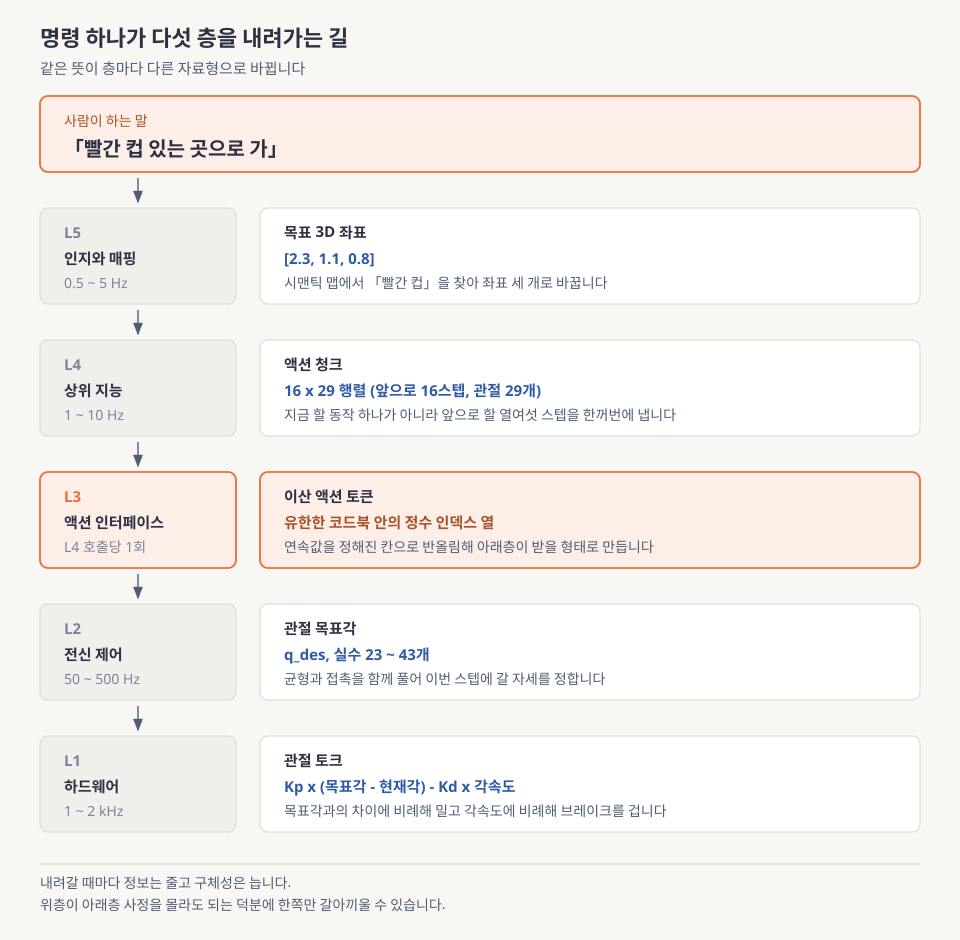
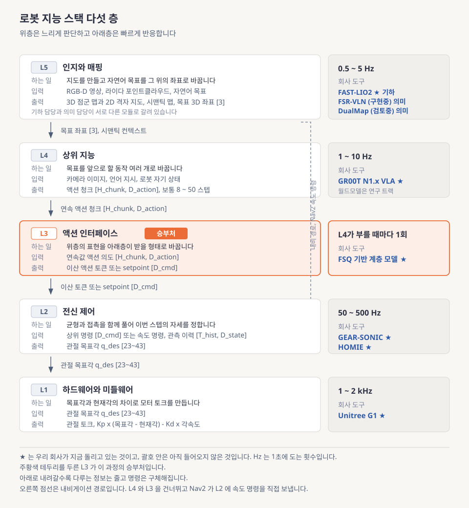
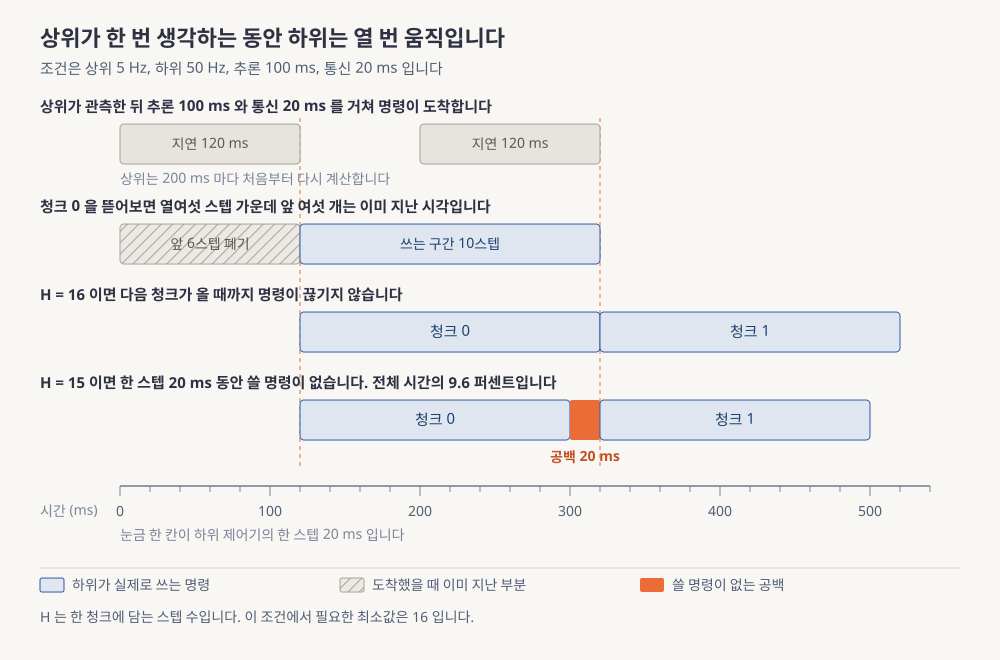
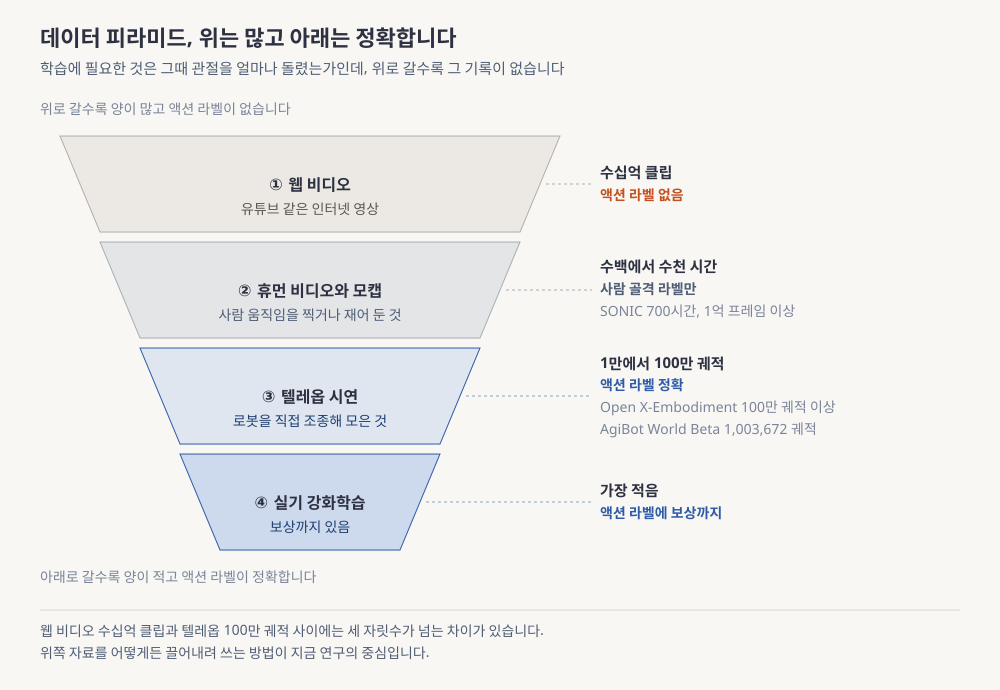
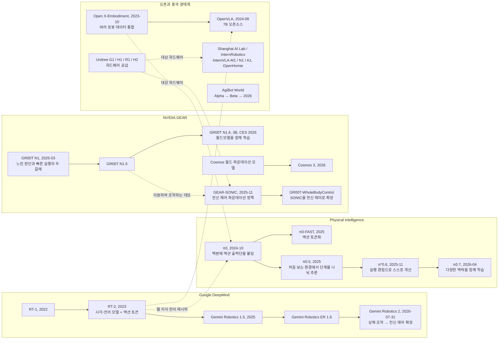
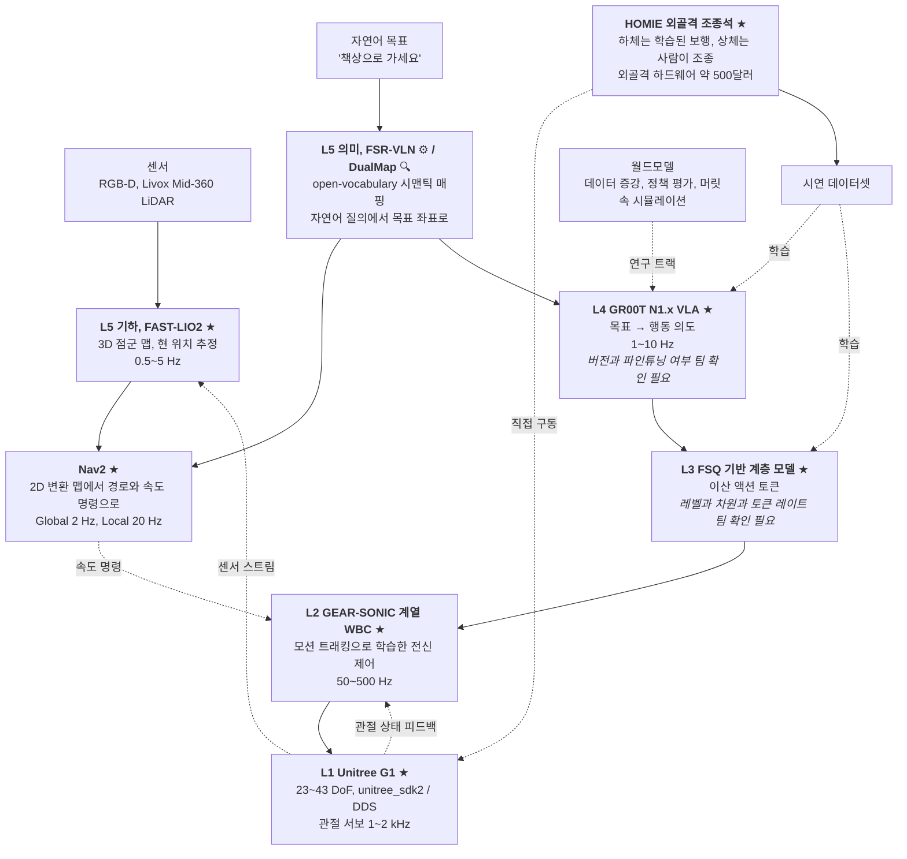
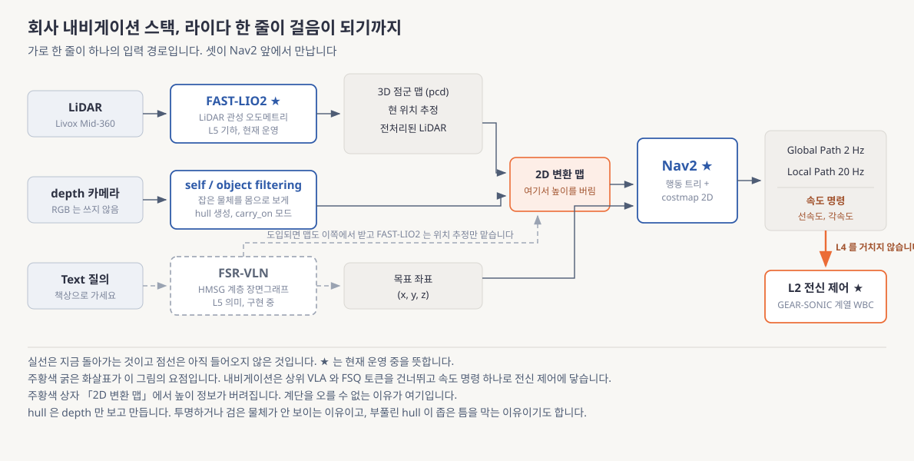

# Physical AI 개요와 산업 지형

> **한 줄 요약**: 로봇에 지능을 넣는 일이 왜 여러 층으로 나뉘는지, 각 층이 어떤 속도로 무엇을 주고받는지, 우리 회사가 쓰는 도구들이 그 층 어디에 앉는지를 지도 한 장으로 그립니다.

> 처음 보는 주제라면 [eli5.md](eli5.md)를 먼저 읽으세요. 그림으로 감을 잡고 오면 이 문서가 훨씬 잘 읽힙니다.

---

## 0. 이 모듈 지도

이 모듈은 새 기술을 배우는 자리가 아니라 4주 동안 만날 논문과 회사 도구를 어디에 찍을지 정하는 좌표계를 세우는 자리입니다. 기계를 움직여 온 오래된 방식을 배우고, 로봇이 무엇을 바꿨는지를 얹고, 회사 도구를 올려놓는 순서입니다.

**오늘의 질문.** 다 읽고 나면 이 셋에 답할 수 있습니다.

- 로봇을 움직이는 지능은 왜 큰 모델 하나가 아니라 여러 층으로 쪼개질까요?
- 층 사이에는 무엇이 오가고 위층이 느려서 생기는 빈 시간은 무엇으로 메울까요?
- 우리 회사가 쓰는 다섯 도구는 그 층 구조의 어디에 앉을까요?

| 절 | 무엇을 | 끝나면 할 수 있는 것 | 읽는 시간 |
|---|---|---|---|
| §1 | 층으로 나누는 오래된 방식 | 피드백 루프와 두 겹 루프 구조를 자기 말로 설명하기 | 13분 |
| §2 | Physical AI란 무엇인가 | 정의와 지금이어야 하는 이유 세 가지를 말하기 | 11분 |
| §3 | 스택 5계층 | 명령 하나가 위에서 아래로 내려가는 경로 추적하기 | 25분 |
| §4 | 지연 예산과 action chunking | 최소 청크 길이를 손으로 계산하기 | 19분 |
| §5 | 데이터 피라미드 | 액션 라벨이 없는 문제와 세 우회로 구분하기 | 13분 |
| §6 | 주요 플레이어 계보 | 조직별로 어느 층에 베팅했는지 지목하기 | 10분 |
| §7 | 회사 스택 연결 ★ | 회사 도구 여덟을 배치하고 두 경로를 가르기 | 16분 |
| 마무리 | 흔한 오해, 한 장 정리, 퀴즈 | 배운 것을 덮고 다시 말해보기 | 17분 |

**읽는 법.** 화살표는 읽는 순서가 아니라 논리가 기대는 방향입니다. §3에서 갈라지는 지점을 보세요. 왼쪽 §4는 속도, 오른쪽 §5는 데이터를 맡고 둘이 §7에서 만납니다.

**선수 지식**

| 영역 | 이 문서가 가정하는 것 | 어디서 채우나 |
|---|---|---|
| 머신러닝과 딥러닝 | 학습, 손실, 신경망, 과적합을 안다고 봅니다 | 이 과정의 출발선입니다 |
| 언어 모델 | 프롬프트, 토큰이라는 말, 파인튜닝을 안다고 봅니다 | 이 과정의 출발선입니다 |
| 제어공학, 로봇, 생성모델 내부 | 아무것도 가정하지 않습니다 | 필요한 자리마다 이 문서가 처음부터 설명합니다 |

**완료 기준**: 백지에 5계층을 그려 입출력과 주파수를 채우고 회사 도구를 얹은 뒤 팀 질문 3개를 뽑습니다

**소요**: 이론 120분 / 실습 2h

> 📌 **여기까지 정리**
> - 이 모듈은 지식이 아니라 **좌표계**입니다
> - 세 질문에 §3, §4, §7이 답합니다
> - 산출물은 **직접 그린 스택 다이어그램 한 장**입니다

---

## 1. 왜 이걸 배우나

로봇을 움직이는 프로그램은 왜 한 덩어리가 아닐까요. 로봇 이전에 기계를 움직여 온 방식을 먼저 봐야 합니다. 지금 로봇 스택이 그것을 물려받았기 때문입니다. 이 절은 그 방식을 처음부터 설명한 뒤, 언어 모델이 지나온 순서가 로봇에서 어떻게 반복되는지를 봅니다.

### 1.1 하나로 만들면 왜 안 되는가

기계를 원하는 대로 움직이는 기본 방법은 **피드백 루프**입니다. 지금 상태를 재고, 원하는 값과 비교하고, 차이를 줄이는 명령을 내기를 쉬지 않고 반복합니다. 팔꿈치의 목표가 30도인데 재보니 28도라면 2도만큼 밀고 1밀리초 뒤에 28.5도면 1.5도만큼 밉니다. 1초에 천 번 돌면 관절은 멈춘 것처럼 30도를 지킵니다. 30도처럼 루프가 따라가야 할 목표값이 **setpoint**이고 1초에 몇 바퀴 도느냐가 그 루프의 속도입니다.

그 30도는 누가 정할까요. 컵을 집으려면 영상에서 컵을 찾고 팔이 지날 길을 짜야 하는데, 이 판단은 훨씬 무거워 1초에 천 번 할 수 없습니다. 그래서 판단하는 쪽과 따라가는 쪽을 다른 루프로 떼어놓습니다. 느린 바깥 루프가 목표값을 정해 빠른 안쪽 루프에 넘기고 안쪽은 그 값만 보고 달리는 두 겹 구조가 **캐스케이드 제어**입니다. 안쪽을 바깥의 다섯에서 열 배로 돌리라는 경험칙이 붙어 다닙니다. 그래야 바깥이 목표값을 바꾼 순간 안쪽이 이미 따라잡은 상태가 되기 때문입니다. 왜 그 배수인지는 §3.3에서 확인합니다.

로봇 스택도 이 모양이고 **달라진 것은 바깥 루프의 내용물뿐입니다.** 물리 법칙을 적은 수식이 있던 자리에 지금은 수십억 파라미터 신경망이 앉아 있습니다. 그 수식 자리의 대표 격인 **MPC(Model Predictive Control, 모델 예측 제어)**는 앞으로 몇 스텝의 명령을 통째로 계산해 맨 앞 하나만 실행하고 다음 순간에 다시 풉니다. 한 번에 내다보는 스텝 수가 **예측 지평**입니다. 전제는 움직임을 수식으로 적을 수 있어야 한다는 것인데 다음 넷에서 늘 무너졌습니다.

- 발이 바닥에 닿는 순간의 접촉
- 미끄러짐을 만드는 마찰
- 형태가 변하는 천이나 케이블
- 영상이 무엇을 뜻하는지 읽는 일

Physical AI는 이 넷을 학습으로 대체하고 고속 루프는 그대로 둡니다. 남는 것은 신경망 하나가 전부를 처리하는 구조가 아니라 학습과 고전 제어가 층으로 섞인 구조이고 이 모듈이 그 설계도입니다.

💡 제어를 아신다면 (몰라도 됩니다)

캐스케이드 제어는 느린 바깥 루프가 setpoint를 정해 빠른 안쪽 루프에 넘기고 안쪽을 다섯에서 열 배로 돌려 간섭을 막는 구조입니다. 이 문서의 5계층이 그것을 여러 겹으로 늘린 것입니다.

> ⚠️ **여기서 많이 헷갈립니다**
> 층을 나눈 것이 옛 방식의 잔재라서 모델이 커지면 사라질 것처럼 보입니다.
> 그런데 층을 만든 것은 기술 수준이 아니라 시간입니다. 1초에 천 번 돌 일과 한 번에 0.1초 걸리는 일을 같은 루프에 넣을 수는 없습니다. 모델이 커지면 경계선이 옮겨질 뿐 경계는 남습니다.

### 1.2 언어 모델에서 본 전개가 반복되는 중이다

언어 모델은 백본 사전학습, 어댑터, 입력을 잘게 자르는 방식, 데이터 순으로 전개됐습니다. 그중 세 번째가 이 4주의 중심이라 미리 짚습니다.

**토크나이저**는 길이가 제각각인 연속 신호를 유한한 기호 목록의 번호로 바꿔주는 장치입니다. 글에 쓰는 대표적인 방식이 **BPE(Byte Pair Encoding, 바이트 쌍 부호화)**인데, 문자에서 출발해 자주 붙어 나오는 문자 쌍을 정해진 횟수만큼 병합하면 그 조각 목록이 어휘 사전이 되고 문장은 사전 번호의 정수 열이 됩니다.

이 변환이 왜 중요한지가 요점입니다. 모델이 다음에 올 것을 예측하려면 후보가 유한해야 확률을 매길 수 있습니다. 지금까지 나온 기호를 조건으로 다음 기호의 확률분포를 예측하기를 반복하는 방식을 **자기회귀**라고 하고 그때 쓰는 유한한 후보 목록을 **코드북**이라고 부릅니다.

로봇에서 같은 문제가 생깁니다. 관절을 얼마나 돌릴지는 연속적인 실수라 후보가 무한합니다. 그래서 연속 액션을 유한한 코드북 번호로 바꾸는 장치가 필요하고 그중 하나가 회사가 쓰는 **FSQ(Finite Scalar Quantization, 유한 스칼라 양자화)**입니다.

| 언어 모델에서 일어난 일 | 로봇에서 대응하는 것 | 이 4주에서 다루는 곳 |
|---|---|---|
| 사전학습된 언어 백본 | 시각과 언어를 함께 다루는 백본 | W2-M3 |
| 태스크별 어댑터와 헤드 | 액션만 담당하는 출력단 | W1-M3, W1-M4, W2-M4 |
| BPE 같은 토크나이저 설계 | 연속 액션을 번호로 바꾸는 장치 | **W1-M5(구현), W2-M5(논증)** |
| 인터넷 규모 코퍼스 | 여러 로봇의 데이터를 통합한 데이터셋 | W2-M2 |

출력단과 토크나이저 쪽에서 앞으로 만날 이름 셋은 [deep-dive.md](deep-dive.md) §4 「계보 연대기에서 무엇이 실제로 바뀌었나」에 있습니다.

### 1.3 이 모듈은 좌표계다

세우는 것은 다섯입니다.

- 5계층과 각 층의 주파수
- 지연 예산 부등식
- 승부처가 왜 L3인가라는 논증
- 데이터 피라미드
- 회사 스택 배치도

회수 지점은 [deep-dive.md](deep-dive.md) §8.2에 있습니다. 마지막이 중요한데, 배치도는 사실이 아니라 **가설**이고 검증이 4주 과정의 뼈대입니다.

| 용어 | 이 절에서 나온 뜻 |
|---|---|
| **피드백 루프** | 지금 상태를 재고 목표와 비교해 차이를 줄이는 명령을 내는 일을 반복하는 것 |
| **setpoint** | 루프가 따라가야 할 목표값. 위 루프가 정해 아래 루프에 넘깁니다 |
| **캐스케이드 제어** | 느린 바깥 루프가 목표값을 정해 빠른 안쪽 루프에 넘기는 두 겹 구조 |
| **MPC** | 앞으로 몇 스텝의 명령을 매번 통째로 계산해 앞부분만 실행하는 모델 기반 제어 |
| **예측 지평** | MPC가 한 번에 내다보는 미래 스텝 수 |

| 용어 | 이 절에서 나온 뜻 |
|---|---|
| **토크나이저** | 연속이고 길이가 제각각인 신호를 유한한 기호 목록의 번호로 바꾸는 장치 |
| **BPE** | 자주 붙어 나오는 문자 쌍을 반복해 병합하며 어휘 사전을 만드는 토크나이저 |
| **자기회귀** | 지금까지 나온 기호를 조건으로 다음 기호의 확률분포를 예측하는 방식 |
| **코드북** | 양자화 결과로 쓸 수 있는 유한한 후보 목록. 크기가 표현력의 상한입니다 |
| **FSQ** | 값의 각 축을 정해둔 몇 단계로 반올림해 코드북 번호를 만드는 방식 |

> 📌 **여기까지 정리**
> - 로봇 스택은 두 겹 루프를 물려받았고 바깥 루프의 내용물만 신경망으로 바뀌었습니다
> - 언어 모델은 백본, 어댑터, 토크나이저, 데이터 순으로 갔고 로봇도 같은 순서입니다
> - FSQ가 그 토크나이저 자리이고 W1-M5에서 직접 만듭니다

---

## 2. Physical AI란 무엇인가

§1에서 층 구조가 어디서 왔는지 봤지만 왜 지금 화두가 됐는지는 아직 설명하지 않았습니다. 이 절은 Physical AI가 무엇을 가리키는지 정의하고, 언어 모델과 무엇이 다른지 셋으로 가르고, 하필 지금인 이유를 짚습니다.

### 2.1 정의와 언어 모델과의 세 가지 차이

> Physical AI는 인터넷 규모의 데이터로 학습한 지능을 물리 법칙과 실시간 제약이 있는 몸에 넣는 문제를 가리킵니다.

학계에서는 몸을 가진 지능이라는 뜻의 Embodied AI를 더 오래 써왔고 가리키는 대상은 거의 같습니다.

| 축 | 언어 모델 | Physical AI |
|---|---|---|
| 실패 비용 | 토큰 하나가 틀리면 다시 생성하면 됩니다 | 관절 명령 하나가 틀리면 로봇이 넘어지고 하드웨어가 상합니다 |
| 시간 제약 | 사용자가 초 단위로 기다려 줍니다 | 물리가 기다려 주지 않습니다. 밀리초 단위 마감입니다 |
| 데이터 | 인터넷에 이미 있습니다 | **정답에 해당하는 값이 인터넷에 없습니다** |

앞의 두 축은 다루는 법이 알려져 있습니다.

- 실패 비용은 안전 계층과 시뮬 사전 검증으로 줄입니다
- 시간 제약은 §3과 §4의 계층 분리와 묶음 처리로 해결합니다

세 번째가 진짜 병목입니다. 지도학습을 하려면 입력과 정답이 짝지어져야 합니다. 로봇에서 그 정답은 어떤 장면에서 어떤 명령을 줬는가 하는 값이고 이것이 **액션 라벨**입니다. 사람이 컵을 집는 영상은 인터넷에 넘치지만 그 순간 어깨 관절이 몇 도 돌아갔는지는 어디에도 없습니다. §5가 이 문제만 다룹니다.

### 2.2 지금이어야 하는 세 가지 동인

층 구조 자체는 오래됐는데 지금 판이 움직이는 이유는 셋입니다.

- **큰 모델을 사서 쓸 수 있게 됐습니다 (2023년부터).** 이미지와 텍스트를 함께 입력받아 언어로 답하는 모델이 **시각-언어 모델**이고 여기에 액션 출력을 붙이는 것이 표준이 됐습니다
- **시뮬레이션이 데이터 공장이 됐습니다 (2021년부터).** 가상 환경 수천 개를 그래픽카드에서 동시에 굴리는 방식이 자리를 잡았습니다
- **로봇이 싸졌습니다 (2024년부터).** Unitree G1이 \$13,500에서 27,000 사이 가격대에 들어왔습니다
- **(보조) 여러 로봇의 데이터가 한 포맷으로 묶였습니다.**

근거는 [deep-dive.md](deep-dive.md) §7에 있습니다.

| 용어 | 이 절에서 나온 뜻 |
|---|---|
| **Physical AI** | 인터넷 규모 데이터로 학습한 지능을 물리 법칙과 실시간 제약이 있는 몸에 넣는 문제 |
| **Embodied AI** | 몸을 가진 지능을 가리키는 학술 용어. 가리키는 대상이 거의 같습니다 |
| **시각-언어 모델** | 이미지와 텍스트를 함께 입력받아 언어로 답하는 모델 |
| **액션 라벨** | 어떤 장면에서 어떤 명령을 줬는가 하는 값. 지도학습의 정답에 해당합니다 |

> 📌 **여기까지 정리**
> - 차이는 셋인데 앞의 둘은 해법이 있고 **세 번째인 액션 라벨만 미해결**입니다
> - 지금인 이유는 백본을 살 수 있고 시뮬로 데이터를 만들 수 있고 로봇이 싸졌기 때문입니다
> - 세 동인이 §6, §5, §7에서 다시 나옵니다

---

## 3. 스택 5계층

§1에서 두 겹 루프 구조를 봤고 §2에서 그것이 왜 중요한지 봤습니다. 그런데 층이 몇 개이고 무엇을 주고받는지는 아직 말하지 않았습니다. 이 절이 그 지도이고 명령 하나를 따라 내려가며 속도 차이를 확인하고 왜 가운데 층이 승부처인지 논증합니다.

### 3.1 명령 하나가 맨 위에서 맨 아래까지 내려간다

층을 위에서부터 L5, L4, L3, L2, L1로 부릅니다. 숫자가 클수록 위이고 느립니다. 사람이 이렇게 말했다고 합시다. "빨간 컵 있는 곳으로 가."

**L5는 인지와 매핑을 맡고 1초에 0.5회에서 5회 돕니다.** 만들어 둔 지도에서 "빨간 컵"을 찾아 `[2.3, 1.1, 0.8]` 같은 좌표를 꺼냅니다. 학습 때 본 적 없는 단어로도 대상을 찾는 성질이 **open-vocabulary**이고 단어와 이미지를 같은 공간의 벡터로 바꿔 얻습니다.

**L4는 상위 지능이고 1초에 1회에서 10회 돕니다.** 카메라 이미지와 언어 지시, 그리고 관절각과 각속도와 몸통 기울기처럼 로봇이 자기 몸에서 읽는 값을 받습니다. 이 내부 감각이 **proprioception**입니다. 내놓는 것은 앞으로 여러 스텝의 동작을 묶은 행렬이고 이 묶음이 **액션 청크**입니다. 16스텝을 예측하고 구동 관절이 29개면 16행 29열 행렬인데, 독립적으로 움직일 수 있는 축의 개수인 **DoF(Degrees of Freedom, 자유도)**가 그 열 수를 정합니다. 이런 계열이 **VLA(Vision-Language-Action, 시각-언어-행동)** 모델입니다.

**L3은 액션 인터페이스이고 정해진 주파수가 없습니다.** L4가 결과를 낼 때마다 한 번 돌며 연속적인 실수 값을 아래층이 받을 형태로 옮깁니다. FSQ를 쓴다면 각 축을 반올림해 코드북 번호를 만듭니다. L4가 압축해 내놓은 이 중간 표현이 **latent**인데, 사람이 읽는 물리량이 아니라 모델이 내부에서 쓰려고 만든 숫자 벡터입니다.

**L2는 전신 제어를 맡고 1초에 50회에서 500회 돕니다.** 팔과 다리와 허리를 함께 풀어 균형을 유지한 채 목표 자세를 만드는 일이 **WBC(Whole-Body Control, 전신 제어)**입니다. 요즘은 학습된 신경망 하나이고 그 한 번의 통과에 균형과 접촉과 동작 추종이 걸립니다. **로봇이 넘어지느냐가 여기서 갈립니다.**

**L1은 하드웨어와 미들웨어이고 1초에 1,000회에서 2,000회 돕니다.** 학습이 없고 §1.1의 피드백 루프가 가장 단순한 형태로 들어 있는 것이 **PD 서보**입니다. P는 비례, D는 미분입니다. 관절 상태와 명령이 오가는 통신은 **DDS(Data Distribution Service)**라는 실시간 규격 위에서 돕니다.

$$
\tau = K_p(q_{\text{des}} - q) - K_d \dot q
$$

**숫자를 넣어봅니다.** $\tau$는 토크, $q$는 지금 각도, $q_{\text{des}}$는 목표 각도, $\dot q$는 각속도, $K_p$와 $K_d$는 사람이 정하는 세기 값입니다. 목표 30도, 현재 28도, 각속도 초당 5도, $K_p = 100$, $K_d = 2$로 둡니다.

- 첫 항은 차이에 비례해 미는 힘이라 $100 \times (30 - 28) = 200$입니다
- 둘째 항은 속도에 비례한 브레이크라 $2 \times 5 = 10$입니다
- 합치면 $190$이고 멀수록 세게 밀고 빠르게 다가갈수록 미리 감속합니다

$K_d$가 없으면 관절은 목표를 지나쳐 갔다가 되돌아오며 떨립니다. **상위가 커져도 모터를 돌리는 것은 이 두 항입니다.**

**읽는 법.** 맨 위 사람의 말에서 화살표를 따라 내려가며 가운데 칸의 자료형만 이어 읽으세요. 좌표, 액션 청크, 이산 토큰, 관절 목표각, 토크가 다섯 층의 출력입니다.

| 경계 | 넘어가는 것 | 자료형 변화 |
|---|---|---|
| L5 → L4 | 목표 좌표와 주변 맥락 | 텍스트와 픽셀에서 좌표 `[3]`으로 |
| L4 → L3 | 액션 의도 | 좌표와 픽셀에서 연속 청크 `[H_chunk, D_action]`으로 |
| L3 → L2 | 명령 | 연속값에서 이산 토큰이나 목표값 `[D_cmd]`으로 |
| L2 → L1 | 관절 목표각 | 명령에서 실수 벡터 `q_des [23~43]`으로 |
| L1 → 모터 | 토크 | 목표각에서 토크 `τ [23~43]`으로 |

다섯 경계에서 같은 일이 반복됩니다. **정보는 줄고 구체성은 늡니다.** 맨 위의 "빨간 컵"에는 색과 이름과 의도가 담겨 있지만 아래가 받는 것은 숫자 몇 개뿐이고 서로의 사정을 몰라도 되니 한쪽만 갈아끼울 수 있습니다. 다만 이 표는 **한 갈래만 따라간 것**이고 §7.4에서 다른 갈래를 봅니다.

### 3.2 입출력과 주파수를 한 장에

층을 하나씩 따라갔으니 전부를 한 화면에 놓습니다. 아래로 갈수록 빨라지고 단순해집니다. 그림 오른쪽 열에는 회사 도구 이름과 월드모델이라는 말이 미리 얹혀 있는데 지금은 이름만 눈에 익혀 두세요. 도구가 각각 무엇인지는 §7 「회사 스택 연결」에서, 월드모델은 §5.2 「라벨 없는 상단을 끌어내리는 세 갈래」에서 풉니다.

**읽는 법.** 각 층 상자의 숫자가 1초에 도는 횟수입니다. 위에서 아래로 숫자가 커지는 것을 확인한 뒤, 상자 사이 화살표가 위 표의 자료형과 같은지 대조해 보세요. 주황색 테두리의 L3이 §3.4에서 논증할 승부처입니다.

대괄호 표기는 데이터의 모양이고 이름이 논문마다 달라 아래로 고정합니다.

| 기호 | 뜻 | 논문 통상 범위 | 회사 실제값 |
|---|---|---|---|
| `H_chunk` | 액션 청크 길이. L4가 한 번에 예측하는 미래 스텝 수 | 8~50 | 팀 확인 필요 |
| `D_action` | 액션 벡터 차원. 보통 구동 관절 수 | G1이면 23~43 | 팀 확인 필요 |
| `D_state` | proprioception 차원 | 로봇과 설계마다 다릅니다 | 팀 확인 필요 |
| `D_z` | L3 입력 latent 차원. FSQ에서 양자화되는 축의 개수 | 3~8 | 팀 확인 필요 |
| `D_tok` | L3 출력 토큰 차원 또는 토큰 개수 | 설계에 따라 다릅니다 | 팀 확인 필요 |
| `D_cmd` | L2가 받는 명령 차원 | 형태 자체가 설계 선택입니다 | 팀 확인 필요 |
| `T_hist` | L2가 참고하는 과거 관측 스택 길이 | 3~10 | 팀 확인 필요 |
| `V` | 카메라 대수 | 1~4 | 팀 확인 필요 |

오른쪽 열이 전부 팀 확인 필요라는 데서 출발하고 **이 열을 채우는 것이 온보딩의 목표입니다.** 주파수 하나는 물리가 정합니다. 발이 미끄러지면 자세가 무너지기까지 **200밀리초** 남짓이라 L2가 그보다 느리면 손쓸 시간이 없고 이 문턱은 §4에서 다시 씁니다. 다만 내비게이션 경로의 Nav2만은 전역 2 Hz와 지역 20 Hz라는 실제 설정값이 있고 §3.3에서 바로 씁니다.

### 3.3 계층을 만드는 대역폭 분리

§1.1의 경험칙을 다시 봅니다. 두 루프가 비슷한 속도로 돌면 서로의 움직임을 자기가 고쳐야 할 오차로 착각합니다. 바깥이 목표를 올리면 안쪽이 따라 올리는데, 끝나기 전에 바깥이 또 올리면서 두 루프가 서로를 밀며 진동합니다. 이 현상이 **동특성 간섭**이고 막으려고 속도를 한 자릿수 이상 벌리는 것이 **대역폭 분리**입니다. 대역폭은 그 루프가 따라잡을 수 있는 변화의 빠르기이고 실무에서는 1초에 도는 횟수로 셉니다.

$$
\omega_{L1} \gg \omega_{L2} \gg \omega_{L4} \gg \omega_{L5}
$$

**숫자를 넣어봅니다.** $\omega$는 각 층이 1초에 도는 횟수이고 아래첨자는 층 번호입니다. 배수를 다루므로 범위의 양 끝을 곱해 제곱근을 씌운 기하평균을 대표값으로 씁니다.

- L2는 50에서 500 사이이므로 $\sqrt{50 \times 500} = \sqrt{25{,}000} = 158.11$입니다
- L4는 1에서 10 사이이므로 $\sqrt{1 \times 10} = 3.16$입니다
- 둘의 비는 $158.11 \div 3.16 = 50.0$배이고 다섯 배 규칙을 열 배로 넘겨 만족합니다
- L1은 $1{,}414.2$이고 L5는 $\sqrt{0.5 \times 5} = 1.58$입니다

| 경계 | 빠른 쪽 대표 | 느린 쪽 대표 | 대표 비율 | 최선 | 최악 | 다섯 배 규칙 |
|---|---|---|---|---|---|---|
| L1 / L2 | 1,414.2 | 158.11 | 8.9배 | 40.0배 | 2.00배 | 만족 |
| L2 / L4 | 158.11 | 3.16 | 50.0배 | 500.0배 | 5.00배 | 만족 |
| L4 / L5 | 3.16 | 1.58 | 2.0배 | 20.0배 | **0.20배** | **불만족** |
| Nav2 지역 / 전역 (**회사 실측**) | 20 | 2 | **10.0배** | 범위 없음 | 범위 없음 | 만족 |

세 번째 행을 보세요. L4와 L5 사이에서는 이 논리가 성립하지 않습니다. 최악의 경우 아래층이 위층보다 느립니다. 0.20배가 그 역전입니다. 위쪽을 가른 것은 속도가 아니라 역할입니다. **계층 분리에는 두 종류의 논리가 섞여 있습니다.** 맨 아래 행만 성격이 다릅니다. 앞의 셋은 논문 범위에서 뽑은 대표값이지만 Nav2의 두 값은 우리 파이프라인에 실제로 박혀 있는 설정값이라 범위가 없습니다. 회사는 이미 다섯 배 규칙을 지키고 있고 그것을 보여주는 값이 10.0배입니다. 계산은 [`practice/01_stack_frequency_budget.py`](practice/01_stack_frequency_budget.py)로 재현합니다.

### 3.4 승부처는 왜 L3인가

그림에서 L3에만 테두리를 둘러둔 이유입니다. L4와 L2를 각각 잘 만드는 것보다 둘을 잇는 **인터페이스가 성능과 교체 가능성을 결정합니다.** 근거는 넷입니다.

- **교체 가능성.** L2 학습에 21,000 그래픽카드 시간이 들어, 인터페이스가 고정돼야 상위만 갈아끼울 수 있습니다
- **표현 정합.** 연속값을 회귀로 맞히면 정답이 여럿인 상황, 곧 **다중 모드**를 뭉갭니다. 왼쪽으로 돌든 오른쪽으로 돌든 되는 자리에서 평균을 내면 컵에 정면으로 부딪칩니다
- **주파수 접합.** L4가 한 번 판단할 때 L2는 50번 돌고 나머지 49번을 채우는 것이 L3의 몫입니다
- **관측 가능성.** 토큰 번호는 로그로 찍히지만 연속 latent는 읽히지 않습니다

공짜는 아닙니다. 반올림하면 정보가 깎이고, 코드북에 없는 동작은 낼 수 없으며, 위아래 각각의 최적이 전체 최적을 보장하지 않습니다. 전개는 [deep-dive.md](deep-dive.md) §2.5입니다. **회사 FSQ의 구조는 아직 확인하지 못했습니다.**

| 용어 | 이 절에서 나온 뜻 |
|---|---|
| **open-vocabulary** | 학습 때 본 적 없는 단어로도 대상을 질의할 수 있는 성질 |
| **proprioception** | 로봇이 자기 몸에서 직접 읽는 상태. 관절각, 각속도, 기울기 값 |
| **액션 청크** | 앞으로 여러 스텝 동안 할 동작을 한 번에 묶어 내놓은 행렬 |
| **DoF** | 독립적으로 움직일 수 있는 축의 개수. 액션 벡터의 길이를 정합니다 |
| **VLA** | 이미지와 언어 지시를 받아 액션을 내놓는 모델 계열 |
| **WBC** | 팔과 다리와 허리를 함께 풀어 균형을 유지하며 목표 자세를 만드는 제어 |
| **PD 서보** | 목표와의 차이에 비례해 밀고 속도에 비례해 감속하는 가장 단순한 피드백 루프 |
| **DDS** | 로봇 내부 노드들이 관절 상태와 명령을 주고받는 실시간 통신 규격 |

| 용어 | 이 절에서 나온 뜻 |
|---|---|
| **latent** | 사람이 읽는 물리량이 아니라 모델이 내부에서 쓰려고 만든 숫자 벡터 |
| **대역폭** | 그 루프가 따라잡을 수 있는 변화의 빠르기. 1초에 도는 횟수로 대신 셉니다 |
| **동특성 간섭** | 속도가 비슷한 두 루프가 서로의 움직임에 끌려다니며 진동하는 현상 |
| **대역폭 분리** | 간섭을 막으려고 두 루프의 속도를 한 자릿수 이상 벌리는 설계 원칙 |
| **다중 모드** | 정답이 하나가 아니라 여럿인 상황. 평균을 내면 어느 쪽도 아닌 값이 나옵니다 |

> 📌 **여기까지 정리**
> - 명령은 좌표, 청크, 토큰, 관절각, 토크로 다섯 번 바뀌며 내려갑니다
> - 아래 두 경계는 속도가 가르고(8.9배, 50배) **위는 역할이 가릅니다**(2.0배)
> - L3이 승부처인 근거는 교체 가능성, 표현 정합, 주파수 접합, 관측 가능성 넷입니다

---

## 4. 지연 예산과 action chunking

§3.3에서 L2가 L4보다 50배 빠르다는 것을 확인했는데 뒤집으면 문제입니다. L4가 한 번 판단할 때 L2는 50번 돌아야 하고 그 49번에 쓸 명령이 없으면 로봇은 멈추거나 굳습니다. 그 빈 시간을 무엇으로 메우고 묶음은 얼마나 길게 잡아야 할까요.

### 4.1 최소 청크 길이를 정하는 부등식

§3.1에서 L4가 앞으로 할 여러 스텝을 한 묶음으로 내놓는다고 했고 이 방식이 **action chunking**입니다. 청크 길이는 계산으로 정해집니다. L4가 다음 판단을 마칠 때까지 L2가 쓸 것이 있어야 하기 때문입니다.

$$
H_{\text{chunk}} \;\ge\; f_2\bigl(T_{\text{replan}} + \tau_{\text{infer}} + \tau_{\text{comm}}\bigr)
$$

**숫자를 넣어봅니다.** $H_{\text{chunk}}$는 묶음의 스텝 수, $f_2$는 L2 주파수, $T_{\text{replan}}$은 재판단 주기, $\tau_{\text{infer}}$는 추론 시간, $\tau_{\text{comm}}$은 전달 시간입니다. L2가 50회, L4가 5회 돌고 추론에 100밀리초, 통신에 20밀리초가 든다고 합시다.

- 재계획 주기는 L4 주파수의 역수이므로 $1 \div 5 = 0.2$초, 즉 200밀리초입니다
- 다음 묶음이 도착할 때까지 버텨야 할 시간은 $200 + 100 + 20 = 320$밀리초입니다
- L2가 1초에 50회 도니 320밀리초 동안 $0.320 \times 50 = 16$개를 씁니다
- 그래서 청크는 최소 16개짜리여야 합니다

논문들의 청크 길이가 대체로 이 규모인 것은 같은 계산을 했기 때문입니다. 유도와 민감도 분석은 [deep-dive.md](deep-dive.md) §3에 있습니다.

### 4.2 도착했을 때 이미 만료된 앞부분과 명령 공백

왜 추론 시간과 통신 시간이 더해질까요. 청크 안의 액션은 관측 시각 기준인데 도착은 그보다 뒤라, 그사이에 쓰려고 만든 앞부분은 이미 지나간 것이 됩니다.

$$
\text{버려지는 앞부분} = \lceil f_2 \cdot (\tau_{\text{infer}} + \tau_{\text{comm}}) \rceil
$$

**숫자를 넣어봅니다.** 바깥의 $\lceil \; \rceil$은 천장 함수이고 스텝을 쪼갤 수 없어서 올림합니다. 조건은 앞과 같습니다.

- 지연의 합은 $100 + 20 = 120$밀리초, 즉 0.12초입니다
- $50 \times 0.12 = 6.0$이므로 앞의 6스텝이 버려집니다
- 16개를 예측했는데 **실제로 쓸 수 있는 것은 10개뿐입니다**
- 그 10개가 정확히 한 재계획 주기 200밀리초를 채웁니다

여기서 **명령 공백**을 정의합니다. 다음 청크가 오기 전에 지금 청크가 떨어져 L2가 쓸 명령이 없는 구간이고 **공백률**은 전체 스텝 중 그런 스텝의 비율입니다. 16 대신 15로 잡으면 쓸 수 있는 것이 $15 - 6 = 9$스텝인데 한 주기에 필요한 것은 10스텝이라 20밀리초가 빕니다. 2초를 돌려 부팅 구간을 빼면 94스텝 중 9스텝이 비어 **9.6퍼센트**입니다. 명령이 비면 마지막 값을 붙들거나 멈추거나 지어내는 셋뿐입니다([deep-dive.md](deep-dive.md) §3.4).

**읽는 법.** 위에서 두 번째 띠가 청크 하나를 뜯어본 것이고 앞의 6칸이 폐기됩니다. 아래 두 띠는 $H=16$과 $H=15$인데 아래쪽에만 20밀리초짜리 빈칸이 주기마다 생깁니다.

> ⚠️ **여기서 많이 헷갈립니다**
> 부등식을 아슬아슬하게 어겼으니 성능도 아슬아슬하게 나빠질 것 같습니다.
> 공백은 조금씩 나빠지는 값이 아니라 주기마다 반복해 터집니다. 한 스텝 덜 잡았을 뿐인데 1초에 다섯 번씩 명령이 끊깁니다.

### 4.3 청크를 길게 잡는 대가

그러면 넉넉하게 64개쯤 잡으면 되지 않을까요. 공백률은 $H=16$과 똑같이 0퍼센트입니다. 다만 청크를 실행하는 동안에는 새 관측을 반영할 수 없습니다.

**숫자를 넣어봅니다.** 최악의 경우 반응이 얼마나 늦는지는 청크 길이를 L2 주파수로 나눈 값입니다.

- $H = 64$, $f_2 = 50$이면 $64 \div 50 = 1.28$초라, 청크를 막 시작한 직후에 상황이 바뀌면 그동안 모릅니다
- $H = 16$이면 $16 \div 50 = 0.32$초이고 §3.2의 200밀리초 문턱과 같은 자릿수입니다
- $H = 8$이면 쓸 수 있는 것이 $8 - 6 = 2$스텝뿐이라 공백률이 78.7퍼센트가 됩니다

이 선택은 §1.1의 예측 지평 고르기와 같은 문제이고 앞의 일부만 쓰고 나머지는 버린 뒤 다시 푸는 이 방식이 **receding horizon**입니다. 멀리 볼수록 계획은 매끄러워지지만 지금 아는 것이 계속 맞는다는 가정 위에 서 있습니다. 널리 알린 것이 **ACT(Action Chunking with Transformers, 트랜스포머 기반 액션 청킹)**이고 W2-M1의 논점입니다. 청크 길이별 표는 [deep-dive.md](deep-dive.md) §3.5입니다.

| 용어 | 이 절에서 나온 뜻 |
|---|---|
| **action chunking** | 상위 모델이 한 번의 추론으로 미래 여러 스텝의 액션을 한꺼번에 내놓는 것 |
| **receding horizon** | 매 스텝 여러 개를 풀어 앞의 일부만 쓰고 나머지는 버린 뒤 다시 푸는 방식 |
| **지연 예산** | 추론과 통신에 쓸 수 있는 시간의 총량과 그것이 요구하는 최소 청크 길이 |
| **명령 공백** | 다음 청크가 오기 전에 현재 청크가 떨어져 하위 제어기가 쓸 명령이 없는 구간 |
| **공백률** | 하위 제어기가 도는 전체 스텝 가운데 쓸 명령이 없는 스텝의 비율 |
| **ACT** | 여러 스텝을 한 번에 예측하는 방식을 널리 알린 초기 연구 |

> 📌 **여기까지 정리**
> - 최소 청크 길이는 하위 주파수에 재계획 주기와 지연을 더해 곱한 값이고 대표값이 16스텝입니다
> - 청크는 관측 시각 기준이라 **도착 시점에 앞의 6스텝이 만료**되고 쓸 것은 10개입니다
> - 길게 잡으면 공백은 사라지지만 반응 지연이 늘어납니다

---

## 5. 데이터 피라미드

§3과 §4가 다룬 속도 문제는 답이 있었습니다. 이제 §2.1에서 미뤄둔 세 번째 차이, 액션 라벨이 인터넷에 없다는 문제로 돌아갑니다. 먼저 그 부족이 얼마나 심한지를 숫자로 확인합니다. 연구가 어떻게 우회하는지는 그다음에 정리합니다.

### 5.1 피라미드와 실측 규모

로봇 학습에 쓸 데이터를 양과 정확도로 줄 세우면 피라미드가 됩니다. 위로 갈수록 양이 많고 액션 라벨이 없으며, 아래로 갈수록 양이 적고 라벨이 정확합니다. 데이터를 만든 로봇의 몸 형태, 곧 관절 배치와 링크 길이와 센서 구성을 통틀어 **임바디먼트**라고 부릅니다. 몸이 다르면 같은 명령이 다른 결과를 냅니다.

**읽는 법.** 네 층의 가로 폭이 데이터 양이고 오른쪽 문구가 라벨의 종류입니다. 위아래 폭 차이를 먼저 보고 문구가 내려가며 어떻게 정확해지는지 읽으세요.

| 계층 | 대표 데이터셋 | 규모 | 임바디먼트 | 출처 |
|---|---|---|---|---|
| ③ 텔레옵 (여러 로봇 통합) | Open X-Embodiment | 100만+ 궤적, 60개 데이터셋, 527 스킬 | 22종 로봇, 21개 기관 | arXiv:2310.08864 |
| ③ 텔레옵 (단일 플랫폼) | AgiBot World Alpha | 92,214 궤적 (약 8.5T 토큰) | AgiBot 로봇 100대 | arXiv:2503.06669 |
| ③ 텔레옵 (단일 플랫폼) | AgiBot World Beta | **1,003,672 궤적** (약 43.8T 토큰) | 동일 | arXiv:2503.06669 |
| ② 모캡 (전신 제어 학습) | SONIC 학습 데이터 | 700시간, **1억+ 프레임** | 휴먼 모캡을 휴머노이드로 옮김 | arXiv:2511.07820 |

**숫자를 넣어봅니다.** 위층과 아래층의 격차를 자릿수로 셉니다.

- 웹 비디오는 수십억 클립이니 $10^9$ 규모입니다
- 텔레옵 시연은 가장 큰 공개 데이터셋이 100만 궤적이니 $10^6$ 규모입니다
- 나누면 $10^3$, 즉 **세 자릿수 차이**입니다
- 그 100만조차 한 종류의 로봇에서 나와 다른 몸으로 옮겨 쓸 수 없습니다

서로 다른 로봇의 데이터를 한 포맷으로 묶어 함께 학습하려는 시도가 **크로스 임바디먼트**이고 Open X-Embodiment가 그 대표인데, 그래도 세 자릿수 격차는 메워지지 않습니다. 그래서 방법론 대부분이 라벨 없는 위쪽을 끌어내리는 데 쏟아집니다.

### 5.2 라벨 없는 상단을 끌어내리는 세 갈래

세 갈래가 있고 각각 다른 것을 포기합니다.

- **IDM(Inverse Dynamics Model, 역동역학 모델)**은 시각 $t$의 관측과 그다음 관측을 넣어 그 사이의 명령을 맞힙니다. 같은 결과를 만드는 움직임이 여럿이라 답이 하나로 정해지지 않습니다
- **latent action**은 두 관측을 설명하는 무언가를 모델이 알아서 만들게 두고 그것을 액션처럼 써서 대량 학습한 뒤, 소량의 진짜 데이터로 변환만 맞춥니다. §3.1의 latent가 액션 자리에 들어갑니다
- **월드모델**은 지금 상태와 명령에서 다음 관측을 예측하는 모델이라 데이터를 만들 수도 정책을 평가할 수도 있습니다

| 접근 | 필요한 라벨 | 한계 | 모듈 |
|---|---|---|---|
| **IDM** | 소량 | 답이 하나로 정해지지 않고 몸이 바뀌면 다시 학습해야 합니다 | W2-M2 주변 |
| **latent action** | 매우 소량 | 그 코드가 물리로 해석된다는 보장이 없습니다 | **W2-M5** |
| **월드모델** | 어느 정도 | 비용이 크고 길게 굴리면 오차가 쌓입니다 | **W4-M1/M2** |

latent action을 유한한 번호로 바꾸려면 양자화 장치가 필요한데 그것이 §1.2의 FSQ입니다. L3 인터페이스였던 것이 데이터 문제의 도구로 다시 나옵니다.

| 용어 | 이 절에서 나온 뜻 |
|---|---|
| **임바디먼트** | 데이터를 만든 로봇의 몸 형태. 관절 배치와 링크 길이와 센서 구성 |
| **크로스 임바디먼트** | 서로 다른 로봇의 데이터를 한 포맷으로 통합해 함께 학습하는 것 |
| **IDM** | 연속한 두 관측에서 그 사이의 액션을 역으로 추정하는 모델 |
| **latent action** | 진짜 액션 자리에 대리 코드를 넣어 학습하고 나중에 변환만 맞추는 접근 |
| **월드모델** | 지금 상태와 명령에서 다음 관측을 예측하도록 학습한 환경 모델 |

> 📌 **여기까지 정리**
> - 위쪽은 넘치는데 **액션 라벨이 없고** 아래쪽은 정확한데 세 자릿수 이상 적습니다
> - 우회로는 역추정과 대리 코드와 환경 모델링 셋이고 W2-M5와 W4-M1/M2가 **그 답안**입니다

---

## 6. 주요 플레이어 계보

여기까지 층 구조와 두 개의 병목을 봤습니다. 이제 지도 위에 사람들을 올려놓습니다. 같은 문제를 보고도 조직마다 다른 층에 걸었습니다. 누가 누구를 이었는지와 조직별 베팅을 정리합니다.

### 6.1 계보 다이어그램

**읽는 법.** 네 상자가 조직이고 안쪽 실선은 후속 연구, 가로지르는 점선은 조직 사이의 영향입니다. 왼쪽 위 RT-2에서 나가는 점선 두 개가 백본에 액션을 붙이는 방식이 퍼진 경로입니다.

쟁점은 웹 지식 전이에서 액션 표현으로, 다시 계층 경계의 위치로 옮겨 왔습니다. 가운데 시기에 **액션 토크나이저가 독립된 연구 주제가 됐고** FSQ도 그 흐름입니다. 연대기는 [deep-dive.md](deep-dive.md) §4에 있습니다.

### 6.2 조직별 베팅 계층

| 조직 | 계보와 2026-08 기준 최신 | 주 베팅 계층 | 핵심 차별점 |
|---|---|---|---|
| **Physical Intelligence** | π0 → π0.5 → π\*0.6 → **π0.7** (arXiv:2604.15483) | L4 단일 베팅 | 액션 출력단과 토크나이저 설계에 집중 |
| **NVIDIA GEAR** | GR00T N1 → N1.5 → **N1.6** (3B, CES 2026) | L4 + L2 + 시뮬 인프라 | 전 계층 수직 통합 |
| **NVIDIA** | Cosmos → **Cosmos 3** (2026) | 데이터와 월드모델 | 오픈 모델 누적 300만+ 다운로드 |
| **NVIDIA** | **Isaac Sim 5.0 GA** / **Isaac Lab 3.0 얼리 액세스** | 시뮬 인프라 | Isaac Lab 2.2는 휴머노이드 정책 평가 중심 |
| **Google DeepMind** | RT-2 → Gemini Robotics 1.5 → ER 1.6 → **2** (2026-07-31) | L4에서 L2로 하향 확장 | 전신 제어로 확장. On-Device 2 동시 공개 |
| **Shanghai AI Lab / InternRobotics** | InternVLA-M1 / N1 / A1 (2025~2026) | L4 + L5 + L2 | N1은 듀얼 시스템. **OpenHomie도 이 조직 산하** |
| **Unitree** | G1 / H1 / R1 / H2 | L1 하드웨어 | 2025년 5,500대+ 출하로 테슬라를 앞섰습니다 |
| **AgiBot** | AgiBot World Alpha/Beta → 2026 | 데이터 | 100퍼센트 실환경. IROS 2025 Best Paper Finalist |

- GR00T N1.6은 **학습 데이터 규모가 비공개**입니다
- Figure와 Tesla와 1X는 1차 출처를 확인하지 못해 뺐습니다([deep-dive.md](deep-dive.md) §6)

> 📌 **여기까지 정리**
> - π 계열은 L4에 올인하고 NVIDIA는 L2와 L4와 시뮬을 전부 하며 DeepMind는 L4에서 L2로 내려옵니다
> - 처음에는 웹 지식 전이가, 다음에는 액션 표현이 쟁점이었고 지금은 **계층 경계의 위치**입니다
> - 빈칸을 남기는 편이 틀린 숫자를 채우는 것보다 낫습니다

---

## 7. 회사 스택 연결 ★

지금까지 세운 5계층은 남의 논문에서 나온 일반론이었습니다. 이제 그 지도에 회사 도구 여덟을 올려놓겠습니다. 각각이 어느 층을 맡고 어느 모듈에서 다뤄지는지, 어디가 **확인하지 못한 칸**인지 표시합니다. 아래로 내려가는 길도 하나가 아닙니다.

### 7.1 배치도

배치도를 보기 전에 낯선 말 셋을 풀어 둡니다. **RGB-D**(Red Green Blue-Depth, 색과 깊이) 카메라는 색 영상에 더해 화소마다 거리까지 함께 잽니다. **라이다**(LiDAR, Light Detection and Ranging)는 레이저를 쏘아 사방이 얼마나 떨어져 있는지 훑어 점 덩어리로 돌려주는 장치입니다. 회사는 Livox Mid-360을 씁니다. **모션 트래킹**은 사람이 실제로 움직인 동작을 로봇이 관절 단위로 그대로 따라 하도록 학습시키는 일입니다.

**읽는 법.** 가운데 세로줄이 §3의 5계층입니다. 별표는 지금 돌리는 것, 톱니는 구현 중, 돋보기는 검토 중이고 기울임체는 확인하지 못한 칸을 가리킵니다. 왼쪽에서 갈라진 Nav2에서 L2로 내려가는 점선을 보세요. L4와 L3을 지나가지 않습니다.

도구 이름 셋도 풀어 둡니다.

**FAST-LIO2**는 라이다와 관성 센서를 함께 쓰는 프로그램입니다. 로봇이 지금 어디에 있는지와 주변이 어떻게 생겼는지를 동시에 알아냅니다. 라이다가 쏜 점을 특징으로 요약하는 단계 없이 지도에 곧바로 맞춰 붙이고 지도를 매번 다시 만드는 대신 새 점만 끼워 넣습니다. 내놓는 것은 점 수백만 개로 된 3차원 지도와 현재 위치인데 **거기에 무엇이 있는지는 모릅니다.** 벽인지 책상인지 구분되지 않은 점 덩어리입니다.

**FSR-VLN**이 그 모르는 부분을 맡습니다. "책상으로 가세요" 같은 말을 좌표로 바꿉니다. 방과 시점과 물체를 층으로 쌓아 정리해 두고 먼저 빠르게 후보를 고릅니다. 그 답이 미덥지 않을 때만 무거운 시각-언어 모델을 불러 확인합니다. 같은 자리를 놓고 겨루는 것이 DualMap입니다.

**Nav2**는 목적지를 받아 갈 길을 그리고 지금 어느 방향으로 얼마나 빨리 갈지를 정합니다. 지도를 격자로 잘라 칸마다 위험 점수를 매긴 뒤 점수가 낮은 칸을 잇습니다. 셋의 구조는 [deep-dive.md](deep-dive.md) §12.1입니다.

> ⚠️ 내비 경로는 사내 문서로 확인된 것이고 **조작 경로는 여전히 마스터플랜 §2.3의 추정**입니다.

확인하지 못한 것은 다섯입니다.

- **L4의 정체.** GR00T의 버전과 파인튜닝 여부
- **L3과 L2의 접점.** 토큰이 목표 자세인지, 동작 레퍼런스인지, latent인지
- **Nav2와 L2의 접점.** 속도 명령이 전신 제어의 어느 입력 자리로 들어가는지
- **FSR-VLN 도입 후 DualMap의 자리**와 **시맨틱 맵의 출력 형태**

### 7.2 계층과 회사 스택과 학습 모듈

| 계층 | 회사 스택 요소 | 이 lesson이 닿는 지점 | 깊게 다루는 모듈 | 확인 상태 |
|---|---|---|---|---|
| L5 기하 | **FAST-LIO2** ★ | 점군 지도와 현재 위치를 만듭니다(arXiv:2107.06829) | W4-M3 | 현재 운영 / **파라미터 팀 확인 필요** |
| L5 의미 | **FSR-VLN** ⚙ / **DualMap** 🔍 | 자연어 질의를 좌표로 바꿉니다(arXiv:2509.13733 / 2506.01950) | W4-M3 | 구현 중과 검토 중 / **선정과 일정 팀 확인 필요** |
| 내비 경로 | **Nav2** ★ | 2D 격자에서 경로와 속도 명령을 만듭니다(arXiv:2003.00368) | W4-M3, W4-M4 | 현재 운영 / **L2 접점 팀 확인 필요** |
| L4 | **GR00T N1.x VLA** ★ | 목표를 행동 의도로. §6 계보에서 견줄 자리(arXiv:2503.14734) | W2-M3/M4, W4-M1/M2 | 사용 중 / **버전과 파인튜닝 여부 팀 확인 필요** |
| L3 | **FSQ 기반 계층 모델** ★ | §3.4의 네 근거가 이 선택을 뒷받침합니다(arXiv:2309.15505) | W1-M5, W2-M5 | 알고리즘 확정 / **구조와 레벨 팀 확인 필요** |
| L2 | **GEAR-SONIC** ★ | 42M 파라미터, 700시간 모캡, 21k 그래픽카드 시간(arXiv:2511.07820) | W3-M4 | 논문과 코드 확정 / **재학습 여부 팀 확인 필요** |
| L2와 데이터 | **HOMIE** ★ | 피라미드 ③층을 직접 채우는 경로(arXiv:2502.13013) | W3-M3 | 논문과 코드 확정 / **상업 이용 승인 팀 확인 필요** |
| L1 | **Unitree G1** ★ | 이 구성이 액션 벡터 차원의 하한을 정합니다 | W1-M2, W3-M5 | 스펙 확정 / **보유 구성 팀 확인 필요** |

위쪽 계층은 맨 아래 하드웨어에 묶여 있습니다. G1은 기본형 23, EDU Plus 29, EDU Ultimate 최대 43으로 갈리고 **그 수가 L2 출력 차원과 L3 코드북을 함께 정합니다**([deep-dive.md](deep-dive.md) §12.7 「액션 차원을 결정하는 G1 구성」).

### 7.3 분리형인가 통합형인가

회사 스택은 L4와 L2를 분리해 L3으로 잇는 모양인데 2026-07-31에 나온 Gemini Robotics 2는 반대로 보입니다.

- **업계 합의는 없습니다.** 일곱 축 비교는 [deep-dive.md](deep-dive.md) §5, 설계 논증은 W2-M5입니다
- 통합형이라도 L1 서보 루프는 따로 돌고 남은 물음은 경계선의 위치입니다

### 7.4 내비게이션 경로와 조작 경로는 갈라진다

§7.1에서 Nav2가 L2로 내려보내던 점선을 아직 설명하지 않았습니다. 같은 전신 제어기에 명령이 서로 다른 두 곳에서 들어옵니다. 가운데 줄에 걸러내기 단계가 하나 끼어 있는 것도 함께 봐 두세요. 로봇이 물건을 들고 걸으면 그 물건이 카메라에 잡혀 앞을 막은 장애물로 읽히는데, 잡은 물체를 감싸는 껍데기 형상을 만들어 그 안쪽을 로봇 몸의 일부로 치면 이 오인이 사라집니다.

**읽는 법.** 가로 한 줄이 하나의 입력 경로이고 위에서부터 라이다, 뎁스 카메라, 텍스트 질의입니다. 셋이 Nav2 앞에서 만납니다. 주황색 굵은 화살표만 따라가면 이 절의 요점이 나옵니다.

| 축 | 내비게이션 경로 | 조작 경로 |
|---|---|---|
| 목표를 좌표로 | FSR-VLN 또는 DualMap | 같음 |
| 그다음 거치는 것 | Nav2 | L4 VLA 다음 L3 FSQ |
| L2에 넘기는 것 | 속도 명령, 선속도와 각속도 몇 개 | 액션 청크 `[H_chunk, D_action]` 또는 토큰 |
| 재계획 주기 | 전역 2 Hz, 지역 20 Hz | 1~10 Hz |
| 확인 상태 | 사내 문서로 확인 | 추정 |

**§3.1의 변환 표는 조작 경로만 따라갔습니다.** 걸어가는 쪽은 좌표 다음이 곧바로 속도입니다. 상위 모델을 거치지 않으니 §4의 지연 예산도 §3.4의 이산 토큰 논쟁도 걸리지 않습니다. 새 논문을 볼 때 어느 경로 이야기인지 먼저 묻는 편이 빠릅니다.

Nav2에 들어가기 전에 3차원 점군이 2차원 격자로 눌리는 것도 눈에 띕니다. §3.1에서 말한 「정보는 줄고 구체성은 늡니다」를 여기서 눈으로 봅니다. 높이를 버린 대가로 **계단은 오를 수 없습니다.** 알려진 한계 셋은 [deep-dive.md](deep-dive.md) §12 「회사 내비게이션 스택의 실제 구성과 세 가지 한계」입니다.

| 용어 | 이 절에서 나온 뜻 |
|---|---|
| **FAST-LIO2** | 라이다와 관성 센서로 3차원 점군 지도와 현재 위치를 동시에 만드는 방식 |
| **FSR-VLN** | 방과 시점과 물체를 층으로 정리해 두고, 빠른 매칭이 미덥지 않을 때만 시각-언어 모델을 부르는 시맨틱 매핑 |
| **DualMap** | 온라인 open-vocabulary 시맨틱 매핑. 자연어 목표로 이동합니다 |
| **Nav2** | 격자 지도에 위험 점수를 매겨 경로와 속도 명령을 만드는 내비게이션 스택 |
| **2차원 격자** | 지도를 정사각 칸으로 자르고 칸마다 비었는지 막혔는지만 적은 표현 |
| **라이다와 RGB-D** | 레이저로 거리를 훑는 장치와, 색과 함께 거리를 재는 카메라 |
| **GEAR-SONIC** | 모션 트래킹을 대규모로 키운 전신 제어 파운데이션 정책 |
| **HOMIE** | 하체는 학습 보행, 상체는 외골격 조종석 텔레옵으로 나눈 시스템 |

> 📌 **여기까지 정리**
> - L5가 기하(FAST-LIO2)와 의미(FSR-VLN, DualMap)로 갈리고 L4가 GR00T, L3이 FSQ입니다
> - **L2로 내려가는 길이 둘입니다.** 내비는 Nav2의 속도 명령, 조작은 VLA와 FSQ 토큰입니다
> - 내비 경로는 확인됐고 조작 경로는 여전히 **가설**이며 검증이 캡스톤 과제입니다

---

## 흔한 오해

떠오르는 반론들은 절반이 맞는 말이라 넘기면 논문을 잘못 읽게 됩니다. 셋을 골라 어디서부터 틀리는지 짚습니다([deep-dive.md](deep-dive.md) §9, §10).

### 오해 1. "상위 모델 하나면 끝난다"

계층은 취향이 아니라 **주파수와 지연 예산이 강제한 결과**입니다. 수십억 파라미터 모델을 1초에 천 번 돌릴 수 없고 균형 회복을 1초에 다섯 번으로 할 수도 없습니다. 상위 모델이 전신 제어를 흡수해도 달라지는 것은 경계선의 위치뿐입니다.

### 오해 2. "계층 경계는 전부 속도 차이로 설명된다"

§3.3의 실측을 보면 그렇지 않습니다. 아래는 8.9배와 50배로 벌어지지만 **L4와 L5 사이는 대표 2.0배이고 최악의 경우 0.20배로 역전합니다.** 위쪽을 가른 것은 인지와 행동 의도라는 역할의 차이이고 두 논리가 섞여 있음을 알아야 새 아키텍처에서 경계가 왜 거기 있는지 물을 수 있습니다.

### 오해 3. "시뮬에서 되면 실기에서 된다"

시뮬과 실기의 차이는 모터 반응, 신호 지연, 접촉 계산, 센서 잡음, 상태 추정 다섯 곳에서 옵니다. 그래서 다른 시뮬레이터를 한 번 거치는데 이것이 sim2sim 검증이고 W3-M5에서 해봅니다.

---

## 한 장 정리

여기까지가 전부입니다. 아래 표와 그림만으로 전체가 복기되는지 확인해 보세요.

| 절 | 핵심 한 줄 |
|---|---|
| §1 | 로봇 스택은 느린 바깥 루프와 빠른 안쪽 루프를 겹쳐 쓰는 오래된 구조를 물려받았습니다 |
| §2 | 병목은 실패 비용도 시간 제약도 아닌 **액션 라벨의 부재**입니다 |
| §3 | 명령은 다섯 번 변환되며 내려가고 계층 분리에는 속도와 역할 두 논리가 섞여 있습니다 |
| §4 | 최소 청크 길이는 하위 주파수에 재계획 주기와 지연을 더해 곱한 값이고 대표값이 16스텝입니다 |
| §5 | 위는 양이 많고 라벨이 없습니다. 우회로는 역추정과 대리 코드와 환경 모델 셋입니다 |
| §6 | 쟁점은 웹 지식 전이에서 액션 표현으로, 다시 **계층 경계의 위치**로 옮겨 왔습니다 |
| §7 | L2로 내려가는 길이 **둘**이고, 내비 경로는 확인됐으나 조작 경로는 아직 가설입니다 |

**읽는 법.** §0의 지도와 배치는 같고 두 번째 줄에 그 절의 결론이 숫자로 붙었습니다. 8.9배와 50배와 2.0배와 10.0배, 16스텝과 6스텝, 세 자릿수, 여덟 도구와 두 경로가 이 모듈이 남긴 값 전부입니다.

**덮고 말해보세요.** 이 그림을 보지 않고 5계층의 이름과 하는 일과 대표 주파수를 위에서 아래로 말해보세요. 그다음 "빨간 컵 있는 곳으로 가"가 각 경계에서 어떤 자료형이 되는지 이어 말해보세요. 막히면 §3.1입니다.

**이제 할 수 있게 된 것**

- 백지에 5계층을 그려 입출력과 주파수와 자료형 변환을 채웁니다
- 새 논문을 볼 때 몇 층, 어느 경로 이야기인지부터 묻습니다
- 지연 예산 부등식으로 최소 청크 길이를 계산합니다
- 회사 도구 여덟을 배치하고 **모르는 것**을 질문으로 뽑습니다

---

## 셀프 체크 퀴즈

앞의 넷은 한 줄로 답이 나오고, 가운데 넷은 새 숫자를 넣는 것, 마지막 둘은 여러 절을 엮는 것입니다.

**기억 확인** (한 줄로 답이 나오는 것)

1. 스택 5계층의 이름과 대표 주파수를 위에서 아래로 말해보세요.
2. 데이터 피라미드 네 층에서 각각 무엇이 많고 무엇이 없나요?
3. 액션 라벨이란 무엇이고 왜 인터넷에 없나요?
4. PD 서보의 두 항이 각각 하는 일은 무엇인가요?

**적용** (배운 것을 새 상황에 넣어보는 것)

5. $f_2 = 100$ Hz, $f_4 = 4$ Hz, $\tau_{\text{infer}} = 150$ ms, $\tau_{\text{comm}} = 10$ ms일 때 최소 $H_{\text{chunk}}$를 구해보세요.
6. 같은 조건에서 버려지는 앞부분이 몇 스텝인지 계산하고 이유를 덧붙여 보세요.
7. L2가 1초에 200회, L4가 8회라면 다섯 배 규칙을 만족하나요?
8. 청크 길이를 64로 늘리면 공백률과 최악 반응 지연이 어떻게 되나요?

**종합** (여러 절을 엮어 논증하는 것)

9. 승부처가 L3이라는 주장의 근거 넷과 각각의 대가를 짝지어 설명해보세요.
10. 회사 도구 다섯을 계층에 배치하고 어느 모듈에서 다루는지, 아직 모르는 것 셋은 무엇인지 말해보세요.

정답 보기

1. L5 0.5~5 Hz, L4 1~10 Hz, L3은 L4 호출당 1회, L2 50~500 Hz, L1 1~2 kHz입니다.

2. ① 웹 비디오는 수십억 클립인데 라벨이 없고 ② 휴먼 비디오와 모캡은 골격 라벨만 있으며 ③ 텔레옵은 1만에서 100만 궤적이고 라벨이 정확하고 ④ 실기 강화학습은 가장 적지만 보상까지 있습니다.

3. 어떤 장면에서 어떤 명령을 줬는가 하는 값인데, 영상에는 그것이 기록되지 않습니다.

4. 비례 항은 미는 힘을, 미분 항은 각속도에 비례한 브레이크를 만듭니다.

5. $100 \times (0.25 + 0.15 + 0.01) = 41$스텝입니다.

6. $100 \times 0.16 = 16$스텝입니다. 청크는 관측 시각 기준인데 도착은 그보다 뒤라 그 사이 시각용이 이미 지난 것이 됩니다.

7. $200 \div 8 = 25$배이므로 넉넉히 만족합니다.

8. 공백률은 0퍼센트로 $H=16$과 같고 최악 반응 지연은 $1.28$초입니다.

9. ① 교체 가능성에는 공동 최적화 불가 ② 표현 정합에는 양자화 오차 ③ 주파수 접합에는 반응 지연 ④ 관측 가능성에는 표현력 손실이 대가로 붙습니다.

10. L5는 기하가 FAST-LIO2, 의미가 FSR-VLN과 DualMap이고, L4가 GR00T, L3이 FSQ, L2가 GEAR-SONIC과 HOMIE, L1이 G1이며, 내비 경로에 Nav2가 따로 있습니다. 모르는 다섯은 §7.1에 적혀 있습니다.

> 서술형 풀이는 [deep-dive.md](deep-dive.md) §11에 있습니다.

---

## 팀에 물어볼 것

공개 자료로는 채울 수 없던 칸들이니 `notes/questions-for-team.md`에 복사해 두고 하나씩 지워 나가면 됩니다.

1. OpenHomie는 CC-BY-NC-SA 4.0이라 상업 이용이 제한되는데 별도 승인을 받았을까요? 법무 리스크라 가장 급합니다.
2. GEAR-SONIC은 공개 가중치에서 파인튜닝했나요, 자체 학습했나요?
3. 우리 G1은 23, 29, 43 중 어떤 구성이고 Dex3 핸드가 있을까요?
4. 시맨틱 매핑이 무엇을 넘길까요? §3.1의 `[3]`은 추정입니다.
5. GR00T는 어느 버전이고 파인튜닝일까요, 추론 전용일까요?
6. Nav2의 속도 명령이 WBC의 어느 입력 자리로 들어갈까요? §7.4의 두 경로가 만나는 지점입니다.
7. FSR-VLN 도입 후 DualMap은 어떻게 될까요?
8. L4 추론이 G1 온보드에서 도나요, 외부 워크스테이션에서 도나요?
9. §3.2 기호표의 오른쪽 열을 채워 줄 수 있을까요?

---

## 실습으로 가기

코드는 검산용이니 손계산을 먼저 따라간 다음 돌려보세요. 그래픽카드는 필요 없습니다.

- [`practice/01_stack_frequency_budget.py`](practice/01_stack_frequency_budget.py)는 §3.3과 §4를 재현합니다
- [`practice/02_data_pyramid_plot.py`](practice/02_data_pyramid_plot.py)는 피라미드와 5계층 그림을 저장합니다
- [`practice/03_player_landscape.py`](practice/03_player_landscape.py)는 §6 지도를 표와 차트로 그립니다
- [`practice/my_stack_template.excalidraw`](practice/my_stack_template.excalidraw)는 산출물의 뼈대이고 [`labs/`](labs/)는 다섯 단계로 약 2시간입니다

> 📌 진짜 산출물은 **직접 그린 스택 다이어그램 한 장**입니다.

---

## 출처

본문의 숫자가 기댄 1차 자료입니다.

**논문 (arXiv)**, 전부 확인 2026-08-01

- World Models & Physical AI 튜토리얼, arXiv:2606.12783. **1인 저자**
- SONIC, arXiv:2511.07820 (v3). 42M / 700시간 모캡 = 1억+ 프레임 / 21,000 GPU-hours
- HOMIE, arXiv:2502.13013. **CC-BY-NC-SA 4.0이라 상업적 이용 제한**
- DualMap, arXiv:2506.01950 / Open X-Embodiment, arXiv:2310.08864 / AgiBot World, arXiv:2503.06669
- FAST-LIO2, arXiv:2107.06829 / Nav2, arXiv:2003.00368 / FSR-VLN, arXiv:2509.13733. 확인 2026-08-29. **FSR-VLN 논문은 FAST-LIVO2로 맵을 만들었고 회사 파이프라인은 FAST-LIO2입니다**
- FSQ, arXiv:2309.15505. 부제의 VQ-VAE(Vector Quantized Variational Autoencoder)는 FSQ 이전의 양자화 방식입니다
- π0, arXiv:2410.24164 / π0.7, arXiv:2604.15483 / RT-2, arXiv:2307.15818 / OpenVLA, arXiv:2406.09246
- GR00T N1, arXiv:2503.14734 / Walk in Minutes, arXiv:2109.11978

**리포와 프로젝트 페이지** (전부 확인 2026-08-01)

- GEAR-SONIC, `nvlabs.github.io/GEAR-SONIC/` / GR00T-WholeBodyControl, `nvlabs.github.io/GR00T-WholeBodyControl/`
- OpenHomie, `github.com/InternRobotics/OpenHomie` / DualMap, `github.com/Eku127/DualMap`
- FAST-LIO2, `github.com/hku-mars/FAST_LIO` / FSR-VLN, `github.com/HorizonRobotics/HoloAgent` / Nav2, `docs.nav2.org`
- 회사 내비 스택의 구성과 주파수는 사내 「GenP Navigation 모듈 진행 현황」(2026-08-29)
- keon/awesome-physical-ai. **색인용으로만.**

검증 메모는 [deep-dive.md](deep-dive.md) §6에 있습니다. **빈칸이 틀린 숫자보다 낫습니다.**

---

## 더 깊이

- [`deep-dive.md`](deep-dive.md)에는 대역폭 분리의 유래(§1), L3 반론(§2), 지연 예산 유도(§3), 계보 연대기(§4), 분리형과 통합형(§5), 출처 검증(§6), 세 동인의 근거(§7), 계층별 입출력(§8), 오해와 퀴즈 풀이(§9~§11), **회사 내비 스택의 구성과 세 가지 한계(§12)**가 있습니다

---

**다음 토픽** → [시뮬레이터 부트캠프 + 클라우드 실습 환경 구축](../02-simulator-bootcamp/lesson.md)
