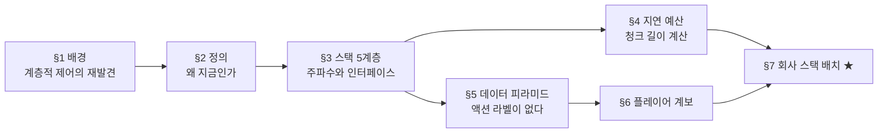
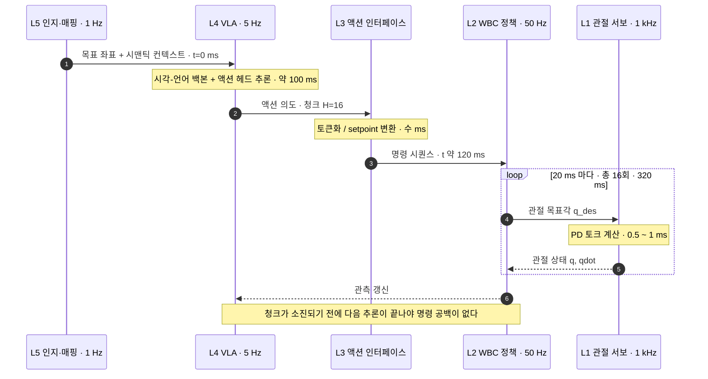
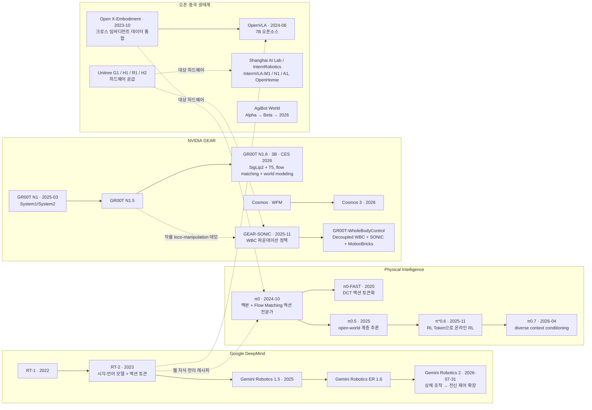
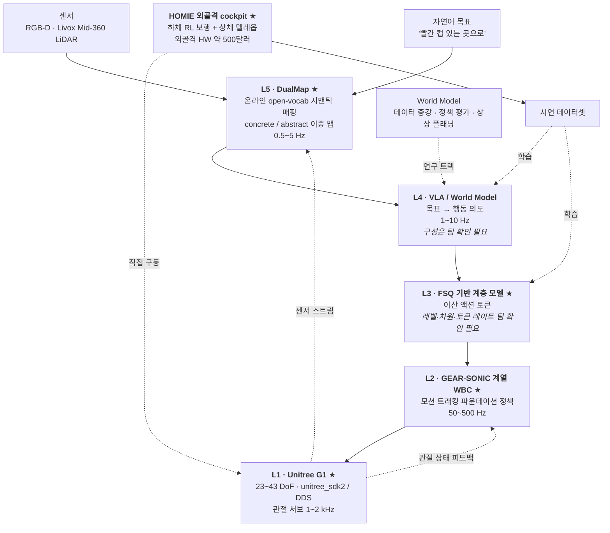

# Physical AI 개요와 산업 지형

> **한 줄 요약**: 로봇에 지능을 넣는 일이 왜 여러 층으로 나뉘는지, 각 층이 어떤 속도로 무엇을 주고받는지, 그리고 우리 회사가 쓰는 도구들이 그 층 어디에 앉는지를 지도 한 장으로 그립니다.

---

## 0. 이 모듈 지도

**오늘의 질문**입니다. 다 읽으면 셋에 답할 수 있습니다.

- 로봇을 움직이는 지능은 왜 큰 모델 하나가 아니라 여러 층으로 쪼개지는가?
- 층 사이에는 무엇이 오가고, 위층이 느려서 생기는 빈 시간은 무엇으로 메우는가?
- 우리 회사가 쓰는 다섯 도구는 그 층 구조의 어디에 앉는가?

| 절 | 무엇을 | 끝나면 할 수 있는 것 | 읽는 시간 |
|---|---|---|---|
| §1 | 이 구조를 이미 알고 있다 | 로봇 스택을 제어·언어모델 경험에 붙여 읽기 | 4분 |
| §2 | Physical AI란 무엇인가 | 정의와 "왜 지금인가"를 세 동인으로 설명 | 4분 |
| §3 | 스택 5계층 | 명령 하나가 위에서 아래로 내려가는 경로 추적 | 11분 |
| §4 | 지연 예산과 청크 | 최소 청크 길이를 손으로 계산 | 6분 |
| §5 | 데이터 피라미드 | 액션 라벨이 없는 문제와 세 우회로 구분 | 4분 |
| §6 | 주요 플레이어 계보 | 조직별로 어느 층에 베팅했는지 지목 | 4분 |
| §7 | 회사 스택 연결 ★ | 회사 도구 다섯을 5계층에 배치 | 5분 |



**선수 지식**

| 알아야 할 것 | 어디서 채우나 | 이 문서가 대신 설명하는 것 |
|---|---|---|
| 피드백 제어 루프와 대역폭 | 보유 배경으로 가정 | 캐스케이드 제어는 §1에서 한 줄 재진술 |
| 신경망 추론이 시간을 먹는다는 감각 | 보유 배경으로 가정 | 지연이 왜 청크를 요구하는지는 §4 |
| 언어모델의 토크나이저·자기회귀·코드북 | **가정하지 않음** | §1 용어표와 §1.2에서 정의부터 |
| 로봇 시뮬·전신 제어·시맨틱 매핑 | **가정하지 않음** | §3·§7에서 처음부터 |

빈 `prereq`는 **앞선 모듈이 없다**는 뜻이지 배경 지식이 불필요하다는 뜻이 아닙니다. 앵커로 쓰는 제어 개념은 그 자리에서 다시 진술합니다.

**완료 기준**: 백지에 5계층을 그려 입출력과 주파수를 채우고 회사 도구 다섯을 얹은 뒤, 모르는 것을 팀 질문 3개 이상으로 뽑는다.

**소요**: 이론 3h / 실습 2h

> 📌 **여기까지 정리**
> - 이 모듈은 지식이 아니라 **좌표계**다. 읽을 논문 20여 편이 이 지도에 찍힌다
> - 세 질문에 각각 §3, §4, §7이 답한다
> - 산출물은 **내가 직접 그린 스택 다이어그램 한 장**이다

---

## 1. 왜 이걸 배우나

| 용어 | 한 줄 정의 | 제어·LLM 비유 |
|---|---|---|
| **Physical AI** | 인터넷 규모 데이터로 학습한 지능을 물리 법칙·실시간 제약이 있는 몸에 넣는 문제 | 시뮬 인프라까지 포함한 스택 전체를 가리키는 산업 용어 |
| **계층적 제어** | 느린 바깥 루프가 목표를 정해 빠른 안쪽 루프에 넘기는 구조 | 캐스케이드 제어 — 안쪽을 바깥보다 5~10배 빠르게 돌리는 그 관행 |
| **MPC** | MPC(Model Predictive Control, 모델 예측 제어). 미래 구간을 매번 최적화해 앞부분만 적용 | §4의 action chunking이 정확히 이 자리에 대응한다 |
| **토크나이저** | 연속·가변 신호를 유한한 기호 목록의 인덱스로 바꾸는 장치 | 문자열을 어휘 사전 번호로 바꾸는 것 |
| **BPE** | BPE(Byte Pair Encoding). 자주 붙어 나오는 문자 쌍을 반복 병합해 어휘를 만드는 토크나이저 | 언어모델이 텍스트를 다루는 표준 입구 |
| **자기회귀** | 지금까지 나온 기호를 조건으로 다음 기호의 확률분포를 예측하는 방식 | 이산 심볼 위의 분포를 다루도록 설계된 모델 계열 |
| **코드북** | 양자화 결과로 쓸 수 있는 유한한 벡터·인덱스 목록 | 어휘 사전에 해당. 크기가 표현력의 상한 |

### 1.1 당신은 이미 이 구조를 알고 있다

Physical AI 스택은 **계층적 제어**(supervisory / cascade control)의 재발견입니다. 캐스케이드 제어에서 바깥 루프는 목표를 정해 안쪽에 setpoint로 넘기고, 바깥은 느리게 판단하며 안쪽은 빠르게 추종합니다.

로봇 스택도 똑같습니다. 상위 지능이 플래너, 전신 제어가 서보 루프, 그 사이가 setpoint 인터페이스입니다. **달라진 것은 바깥 루프뿐**이고, 미분방정식 자리에 30억 파라미터 트랜스포머가 들어앉았습니다.

동역학 식에 MPC를 얹는 모델 기반 노선의 한계는 늘 접촉, 마찰, 변형체, 시각처럼 **모델링이 안 되는 영역**이었습니다. Physical AI는 그 영역만 학습으로 대체하고 고주파 서보 루프는 그대로 둡니다. 남는 것은 end-to-end가 아니라 하이브리드 계층 구조이고 이 모듈이 그 설계도입니다.

### 1.2 언어모델에서 본 전개가 반복되는 중이다

언어모델은 백본 사전학습 → 어댑터 → **토크나이저** 설계 → 데이터 스케일링 순으로 전개됐고, 로봇에서 거의 1:1로 대응합니다.

| 언어모델에서 일어난 일 | 로봇에서 대응하는 것 | 이 4주에서 다루는 곳 |
|---|---|---|
| 사전학습된 언어 백본 | 시각-언어 백본(SigLip2 · T5 등) | W2-M3 |
| 태스크별 어댑터·헤드 | 액션 헤드(DiT · Flow Matching) | W1-M3, W1-M4, W2-M4 |
| BPE 같은 토크나이저 설계 | 액션 토크나이저(FSQ · DCT) | **W1-M5(구현), W2-M5(논증)** |
| 인터넷 규모 코퍼스 | 여러 로봇의 데이터를 통합한 데이터셋 | W2-M2 |

**BPE**부터 짚습니다. 문자 단위로 시작해 자주 붙어 나오는 문자 쌍을 정해진 횟수만큼 병합하면 그 조각 목록이 어휘 사전이 되고, 모든 문장은 그 사전의 인덱스 열이 됩니다. 요점은 **길이가 제각각인 연속 원신호를 유한한 정수 목록으로 바꾼다**는 것입니다. 그래야 **자기회귀** 모델이 다음 인덱스의 확률을 예측합니다.

FSQ를 "액션의 BPE"라 부르는 비유가 문자 그대로 통하는 이유입니다. 연속 관절 신호를 유한한 **코드북** 인덱스로 바꿔 상위 모델이 다룰 수 있게 만드는 것이 같고, W1-M5에서 직접 구현합니다.

### 1.3 이 모듈은 좌표계다

여기서 세우는 것은 5계층과 주파수, 지연 예산 부등식, 승부처 L3, 데이터 피라미드, 회사 스택 배치도이고, 회수 지점은 [deep-dive.md](deep-dive.md) §8.2에 표로 있습니다. 마지막 항목이 중요합니다. 배치도는 **가설**이고, 캡스톤 검증까지가 4주 과정입니다.

> 📌 **여기까지 정리**
> - 로봇 스택은 캐스케이드 제어의 재발견이고 바깥 루프만 트랜스포머로 바뀌었다
> - 백본 → 어댑터 → 토크나이저 → 데이터 순서가 반복되고 FSQ가 토크나이저 자리다
> - 이 모듈은 이후 4주를 찍을 **좌표계**다

---

## 2. Physical AI란 무엇인가

| 용어 | 한 줄 정의 | 제어·LLM 비유 |
|---|---|---|
| **Embodied AI** | "몸을 가진 지능"을 가리키는 학술 용어 | 인지과학 쪽 명제. Physical AI는 같은 것의 산업 용어판 |
| **파운데이션 모델** | 대규모 데이터로 미리 학습해 여러 하류 태스크에 재사용하는 큰 모델 | 백본을 사서 쓰고 헤드만 만드는 시대의 전제 |
| **시각-언어 모델** | 이미지와 텍스트를 함께 입력받아 언어로 답하는 모델 | VLA의 상반신. 액션 출력을 붙이면 로봇 정책이 된다 |
| **액션 라벨** | 관측과 짝지어진 "그때 무슨 명령을 줬는가" 값 $a_t$ | 지도학습의 정답 레이블. 인터넷에는 이것이 없다 |

### 2.1 정의와 언어모델과의 세 가지 차이

> Physical AI = 인터넷 규모 데이터로 학습한 지능을 물리 법칙과 실시간 제약이 있는 몸에 넣는 문제.

| 축 | 언어모델 | Physical AI |
|---|---|---|
| 실패 비용 | 토큰 하나 틀리면 재생성 | 관절 명령 하나 틀리면 로봇이 넘어짐(하드웨어 손상) |
| 시간 제약 | 사용자가 기다려줌(초 단위) | 물리가 기다려주지 않음(ms 단위 데드라인) |
| 데이터 | 인터넷에 이미 존재 | **액션 라벨이 인터넷에 없음** — 직접 만들어야 함 |

- **앞의 두 축은 다루는 법이 알려져 있습니다.** 실패 비용은 안전 계층과 시뮬로, 시간 제약은 계층 분리와 청킹으로(§3, §4)
- **세 번째가 진짜 병목입니다.** §5가 그 주제이고 W2-M5와 W4-M1/M2가 답안입니다

**Embodied AI**와 거의 같은 뜻이고, 이 문서는 스택 전체를 가리키는 쪽으로 씁니다.

### 2.2 지금이어야 하는 3대 동인

- **파운데이션 모델의 성숙 (2023~)**. RT-2(arXiv:2307.15818) 이후 "사전학습 **시각-언어 모델**에 액션 출력을 붙인다"가 표준. **만들 것은 액션 헤드와 데이터**
- **대규모 GPU 병렬 시뮬 (2021~)**. 수천 환경 동시 학습(arXiv:2109.11978)의 끝에 SONIC의 700시간 모캡과 21,000 GPU-hours(arXiv:2511.07820). **수집에서 생산으로**
- **저가 휴머노이드 (2024~)**. Unitree G1이 $13,500~27,000 구간에. 열 대로 병렬 수집하면 §5 ③층이 두꺼워집니다
- **(보조) 데이터 인프라 공유화**. Open X-Embodiment(arXiv:2310.08864)가 21개 기관과 22종 로봇을 한 포맷으로, AgiBot World가 100만 궤적으로

근거는 [deep-dive.md](deep-dive.md) §7.

> 📌 **여기까지 정리**
> - 차이는 셋인데 앞의 둘은 해법이 있고 **세 번째(액션 라벨)만 미해결**이다
> - 백본을 살 수 있고, 시뮬로 데이터를 만들 수 있고, 로봇이 싸졌기 때문이다
> - 세 동인이 각각 §6, §5, §7에서 다시 나온다

---

## 3. 스택 5계층

| 용어 | 한 줄 정의 | 제어·LLM 비유 |
|---|---|---|
| **WBC** | WBC(Whole-Body Control, 전신 제어). 팔·다리·허리를 함께 풀어 균형을 유지하며 목표 자세를 만든다 | 다관절 서보 루프. 신경망 forward 한 번이 한 스텝 |
| **VLA** | VLA(Vision-Language-Action, 시각-언어-행동) 모델. 이미지와 언어 지시를 받아 액션을 뱉는 정책 | 상위 플래너 자리. 백본은 시각-언어 모델, 출력만 액션 |
| **proprioception** | 로봇이 자기 몸에서 직접 읽는 상태 — 관절각·각속도·관성센서 값 | 상태 피드백 벡터 $x$. 외부 센서가 아니라 내부 센서 |
| **SLAM** | SLAM(Simultaneous Localization and Mapping, 동시 위치추정·지도작성) | 자기 위치와 지도를 동시에 추정하는 상태 추정 문제 |
| **open-vocabulary** | 학습 때 본 적 없는 단어로도 대상을 질의할 수 있는 성질 | 고정 클래스 분류가 아니라 임베딩 유사도로 찾는 방식 |
| **twist** | 선속도 3 + 각속도 3으로 몸통의 순간 운동을 표현한 6차원 벡터 | 이동 명령의 표준형. "앞으로 0.5 m/s, 좌회전 0.2 rad/s" |
| **DoF** | DoF(Degrees of Freedom, 자유도). 독립적으로 움직일 수 있는 축의 개수 | G1이면 구동 관절 수. 액션 벡터 차원의 하한을 정한다 |
| **DDS** | DDS(Data Distribution Service). 로봇 내부 노드들이 주고받는 실시간 통신 규격 | 발행-구독 방식의 실시간 메시지 버스 |

### 3.1 명령 하나가 L5에서 L1까지 내려간다

명령 하나가 아래로 내려가는 경로를 따라갑니다. **각 경계에서 자료형이 어떻게 바뀌는지**가 요점입니다. 사람이 말합니다. "빨간 컵 있는 곳으로 가."

**L5 인지와 매핑 (0.5~5 Hz)** 는 언어를 좌표로 바꿉니다. 시맨틱 맵에서 "빨간 컵"을 질의해 `[2.3, 1.1, 0.8]` 같은 좌표를 꺼냅니다. 본 적 없는 표현도 처리하므로 **open-vocabulary**여야 하고, DualMap 담당입니다.

**L4 상위 지능 (1~10 Hz)** 는 이미지, 언어 토큰, 로봇 상태(**proprioception**)를 받아 **액션 청크**를 뱉습니다. 청크 길이 16, G1이 29 **DoF**면 16×29 행렬 하나입니다. 한꺼번에 뱉는 이유는 느려서입니다(§4).

**L3 액션 인터페이스**는 주파수가 없는 유일한 계층으로, L4가 뱉을 때마다 도는 이벤트 구동 계층입니다. 하는 일은 **표현 변환**입니다. FSQ를 쓰면 latent의 각 차원을 레벨로 반올림해 이산 토큰을 만듭니다.

**L2 전신 제어 WBC (50~500 Hz)** 는 신경망 forward 한 번이 전부이고 그 한 번에 균형, 접촉, 모션 트래킹이 걸립니다. **로봇이 넘어지느냐가 여기서 갈립니다.** L2가 L4보다 최대 500배 빠르고, 그 간극을 메우는 것이 §4입니다.

**L1 하드웨어와 미들웨어 (1~2 kHz)** 에는 학습이 없습니다. 순수한 PD(Proportional-Derivative, 비례-미분) 서보입니다.

$$
\tau = K_p(q_{\text{des}} - q) - K_d \dot q
$$

- **직관**: 목표각과의 차이에 비례해 밀고 각속도에 비례해 브레이크를 겁니다. 스프링과 댐퍼를 전기로 흉내내는 것
- **제어 대응**: 상태 피드백. **맨 아래가 여전히 고전 제어**이고, 상위가 트랜스포머여도 모터를 돌리는 것은 이 비례-미분 항입니다

차원 세부는 [deep-dive.md](deep-dive.md) §8.1.

### 3.2 경계마다 자료형이 바뀐다

| 경계 | 넘어가는 것 | 자료형 변화 |
|---|---|---|
| L5 → L4 | 목표 좌표 + 컨텍스트 | 텍스트·픽셀 → 좌표 `[3]` |
| L4 → L3 | 액션 의도 | 좌표·픽셀 → 연속 청크 `[H_chunk, D_action]` |
| L3 → L2 | 명령 | 연속 → 이산 토큰 또는 setpoint `[D_cmd]` |
| L2 → L1 | 관절 목표각 | 명령 → 실수 벡터 `q_des [23~43]` |
| L1 → 모터 | 토크 | 목표각 → 토크 `τ [23~43]` |

각 경계에서 **정보가 줄고 구체성이 늡니다.**

### 3.3 입출력과 주파수를 담은 블록도

위 경로를 한 장으로 정리합니다. 아래로 갈수록 **빨라지고 멍청해집니다.**

```
════════════════════════════════════════════════════════════════════════════
[L5] 인지·매핑                                          동작: 0.5 ~ 5 Hz
  in : RGB-D [H,W,4] · LiDAR 포인트클라우드 [N,3] · 자연어 목표 (텍스트)
  out: 시맨틱 맵(객체+라벨+포즈) · 목표 3D 좌표 [3] · 질의 결과
  담당: SLAM/오도메트리, open-vocab 시맨틱 매핑, 언어 grounding
  회사: ★ DualMap                                        → W4-M3
════════════════════════════════════════════════════════════════════════════
                    │ 목표 좌표 + 시맨틱 컨텍스트
                    ▼
[L4] 상위 지능 (VLA / 월드모델 / 플래너)                동작: 1 ~ 10 Hz
  in : 이미지 [B,V,3,H,W] (V=카메라 수) · 언어 지시 토큰 [B,L]
       · 로봇 상태(proprioception) [B,D_state]
  out: 액션 청크 [B,H_chunk,D_action]   ← H_chunk = 예측 지평 (보통 8~50)
  담당: 목표 → 행동 의도. 시각-언어 백본 + 액션 헤드(DiT/Flow Matching)
  회사: VLA / World Model (구성 팀 확인 필요)             → W2, W4-M1/M2
════════════════════════════════════════════════════════════════════════════
                    │ ★ 승부처 ★
                    ▼
[L3] 액션 인터페이스                                    동작: L4 호출당 1회
  in : 상위 모델의 액션 의도 [B,H_chunk,D_action] (연속) 또는 latent [B,D_z]
  out: 이산 토큰 시퀀스 [B,H_chunk,D_tok] 또는 연속 setpoint
       FSQ: D_z 차원 각각을 L_i 레벨로 반올림 → 코드북 크기 = ∏ L_i
  담당: 표현 변환 + 시간 정렬(chunking) + 상·하위 디커플링
  회사: ★ FSQ 기반 계층 모델 (레벨·차원 팀 확인 필요)     → W1-M5, W2-M5
════════════════════════════════════════════════════════════════════════════
                    │ 목표 자세 / 모션 레퍼런스 / twist 명령
                    ▼
[L2] 전신 제어 WBC                                      동작: 50 ~ 500 Hz
  in : 상위 명령(토큰/레퍼런스 모션) [D_cmd]
       · 관측 이력 스택 [T_hist, D_obs] (관절각·각속도·IMU·이전 액션)
  out: 관절 목표각 q_des [23~43] (또는 토크 [23~43])
  담당: RL 정책 1회 forward. 균형·접촉·모션 트래킹
  회사: ★ GEAR-SONIC (WBC 파운데이션 정책) / ★ HOMIE (하체 RL + 상체 텔레옵)
                                                        → W3-M2/M3/M4
════════════════════════════════════════════════════════════════════════════
                    │ q_des [23~43] @ 50~500 Hz
                    ▼
[L1] 하드웨어 / 미들웨어                                동작: 1 ~ 2 kHz
  in : q_des [23~43]
  out: 관절 토크 τ = Kp(q_des − q) − Kd·q̇   ← 온보드 PD 서보
  담당: 모터 드라이버, 상태 추정, DDS/SDK 통신, 안전 정지
  회사: ★ Unitree G1 (23~43 DoF) + unitree_sdk2 / DDS      → W1-M2, W3-M5
════════════════════════════════════════════════════════════════════════════
      [병렬] 데이터 수집: 텔레옵 · 모캡 · 휴먼 비디오 → 학습 데이터
      회사: ★ HOMIE 외골격 cockpit                      → W3-M3
════════════════════════════════════════════════════════════════════════════
```

기호 이름은 논문마다 다릅니다. 이 문서는 아래로 고정합니다.

| 기호 | 뜻 | 논문 통상 범위 | 회사 실제값 |
|---|---|---|---|
| `H_chunk` | 액션 청크 길이. L4가 한 번에 예측하는 미래 스텝 수 | 8~50 | 팀 확인 필요 |
| `D_action` | 액션 벡터 차원. 보통 구동 관절 수 | G1이면 23~43 | 팀 확인 필요 |
| `D_state` | proprioception 차원 | 로봇·설계마다 다름 | 팀 확인 필요 |
| `D_z` | L3 입력 latent 차원. FSQ에서 양자화되는 축의 개수 | 3~8 | 팀 확인 필요 |
| `D_tok` | L3 출력 토큰 차원 또는 토큰 개수 | 설계 의존 | 팀 확인 필요 |
| `D_cmd` | L2가 받는 명령 차원. 목표 자세·모션 레퍼런스·twist 등 | 형태가 설계 선택 | 팀 확인 필요 |
| `T_hist` | L2 관측 이력 스택 길이 | 3~10 | 팀 확인 필요 |
| `V` | 카메라 대수 | 1~4 | 팀 확인 필요 |

오른쪽 열이 전부 "팀 확인 필요"인 것이 출발점입니다. **이 표를 채우는 것이 온보딩의 목표입니다.**

주파수 중에 하나는 물리가 정합니다. **L2를 50 Hz 아래로 내리면 로봇은 넘어집니다.** 발이 미끄러지기 시작해서 자세가 무너지기까지 걸리는 시간이 **200 ms** 남짓이라, 균형 회복 반사가 그보다 느리면 손쓸 시간이 없습니다. 이 **200 ms 문턱**은 뒤에서 계속 돌아옵니다. §4의 지연 예산이 최소 청크 길이를 정할 때 기준이 되고, W2-M1에서 ACT의 기본값이 이 문턱과 충돌하는지 따질 때 다시 씁니다.

### 3.4 계층을 만드는 대역폭 분리

**대역폭 분리**란 두 루프의 주파수를 한 자릿수 이상 벌려 동특성 간섭을 막는 원리로, 캐스케이드 제어에서 안쪽을 바깥의 5~10배로 잡는 그 관행입니다. (유래는 [deep-dive.md](deep-dive.md) §1)

$$
\omega_{L1} \gg \omega_{L2} \gg \omega_{L4} \gg \omega_{L5}
$$

대표값은 상한과 하한의 기하평균입니다.

| 경계 | 빠른 쪽 대표 | 느린 쪽 대표 | 대표 비율 | 최선 | 최악 | 5배 규칙 |
|---|---|---|---|---|---|---|
| L1 / L2 | 1,414.2 Hz | 158.11 Hz | ×8.9 | ×40.0 | ×2.00 | 만족 |
| L2 / L4 | 158.11 Hz | 3.16 Hz | ×50.0 | ×500.0 | ×5.00 | 만족 |
| L4 / L5 | 3.16 Hz | 1.58 Hz | ×2.0 | ×20.0 | **×0.20** | **불만족** |

마지막 행을 보세요. **L4 / L5 경계에서는 이 논리가 성립하지 않습니다.** L5가 5 Hz, L4가 1 Hz면 역전됩니다.

- **위쪽 경계는 기능 분리다.** L4와 L5는 둘 다 느립니다. 두 계층을 가른 것은 인지(무엇이 어디 있는가)와 행동 의도(무엇을 할 것인가)의 차이이지 대역폭이 아닙니다
- **아래쪽 두 경계는 대역폭 분리다.** L1/L2와 L2/L4는 규칙을 넉넉히 만족하며, 여기서는 계층 분리를 물리가 뒷받침합니다

계층 분리에 **두 종류의 논리가 섞여 있다**는 것이 결론입니다. 계산은 [`practice/01_stack_frequency_budget.py`](practice/01_stack_frequency_budget.py)에서 재현합니다.

### 3.5 승부처는 왜 L3인가

블록도에서 L3 옆에 ★ 승부처 ★를 붙여뒀습니다. **L4와 L2를 각각 잘 만드는 것보다 둘을 잇는 인터페이스가 성능과 교체 가능성을 결정한다**는 뜻입니다.

- **교체 가능성.** L2 학습에 21,000 GPU-hours가 드니, 인터페이스가 고정돼야 상위만 갈아끼웁니다
- **표현 정합.** 자기회귀 모델은 이산 심볼 분포에 맞고, 연속값 회귀는 다중 모드를 뭉갭니다
- **주파수 접합.** L4가 한 번 판단할 때 L2는 50번 돕니다. 나머지 49번을 L3가 떠맡습니다(§4)
- **관측 가능성.** 토큰 인덱스는 로그로 찍히지만 연속 latent는 못 읽습니다

대가는 셋입니다.

- **양자화 오차.** 유한 코드북의 정보 손실
- **표현력 손실.** 코드북 밖 동작 불가
- **최적화 불가.** 각자 최적이 전체 최적을 보장하지 않음

SONIC의 **universal token space**가 대표 사례입니다. 전개와 반론은 [deep-dive.md](deep-dive.md) §2. **회사 FSQ의 구조는 미확인입니다.**

> 📌 **여기까지 정리**
> - 명령은 텍스트 → 좌표 → 연속 청크 → 토큰 → 관절각 → 토크로 다섯 번 바뀐다
> - 계층 분리에는 두 논리가 있다. 아래 두 경계는 대역폭(×8.9, ×50), **위는 기능**(×2.0)
> - L3가 승부처인 근거는 교체 가능성, 표현 정합, 주파수 접합, 관측 가능성 넷이다

---

## 4. 지연 예산과 action chunking

| 용어 | 한 줄 정의 | 제어·LLM 비유 |
|---|---|---|
| **action chunking** | 상위 모델이 한 번의 추론으로 미래 여러 스텝의 액션을 한꺼번에 뱉는 것 | **MPC의 예측 지평 $N$** 과 같은 자리. 최적화 대신 신경망 회귀 |
| **receding horizon** | 매 스텝 $N$개의 미래 입력을 풀어 앞의 일부만 쓰고 나머지는 버리는 방식 | MPC의 기본 동작 방식 그 자체 |
| **지연 예산** | 상위 추론·통신에 쓸 수 있는 시간의 총량과 그것이 요구하는 최소 청크 길이 | 데드라인 스케줄링. 못 채우면 하위가 쓸 명령이 없다 |
| **명령 공백** | 다음 청크가 오기 전에 현재 청크가 소진돼 하위 제어기가 쓸 명령이 없는 구간 | 제어 입력이 끊긴 구간. 홀드하거나 멈추거나 외삽한다 |

### 4.1 경계 지연 부등식과 그 직관

L4가 주기 $T_{\text{replan}} = 1/f_4$로 재계획하고 추론에 $\tau_{\text{infer}}$, 통신에 $\tau_{\text{comm}}$이 걸립니다. L2는 $f_2$ Hz로 청크에서 액션을 꺼내 씁니다.

$$
H_{\text{chunk}} \;\ge\; f_2\bigl(T_{\text{replan}} + \tau_{\text{infer}} + \tau_{\text{comm}}\bigr)
$$

- **직관**: **청크는 상위 모델의 느림을 감추는 버퍼입니다.** 상위가 느릴수록, 하위가 빠를수록 버퍼가 커야 합니다
- **대표 수치**: $f_2 = 50$ Hz, $f_4 = 5$ Hz, $\tau_{\text{infer}} = 100$ ms, $\tau_{\text{comm}} = 20$ ms면 $H_{\text{chunk}} \ge 16$. ACT와 Diffusion Policy의 청크 길이가 이 스케일인 것은 우연이 아닙니다

유도와 민감도 표는 [deep-dive.md](deep-dive.md) §3.

### 4.2 도착했을 때 이미 만료된 앞부분과 명령 공백

청크의 액션은 **관측 시각 $t_k$ 기준 인덱싱**인데 도착은 $t_k + \tau_{\text{infer}} + \tau_{\text{comm}}$이라, **도착 시점에는 앞부분이 이미 만료입니다.**

$$
\text{버려지는 앞부분} = \lceil f_2 \cdot (\tau_{\text{infer}} + \tau_{\text{comm}}) \rceil
$$

$\lceil 50 \times 0.12 \rceil = 6$ 스텝이 버려집니다. **16개를 예측했는데 쓸 수 있는 것은 10개뿐**이고, 이것이 부등식에 $\tau$가 들어가는 이유입니다. 아래는 파란 막대가 사용, 빨간 막대가 손실입니다.

```mermaid
gantt
    title 청크 커버리지 · f2=50 Hz, f4=5 Hz(T_replan=200ms), tau=120ms
    dateFormat x
    axisFormat %Lms

    section 청크 0 해부 (H=16)
    도착 시 이미 만료 · 6스텝 폐기 :crit, 0, 120
    실제로 쓰는 구간 · 10스텝     :done, 120, 320

    section H=16 · 충분
    청크 0 사용 구간 :done, 120, 320
    청크 1 사용 구간 :done, 320, 520

    section H=15 · 1스텝 부족
    청크 0 사용 구간 :done, 120, 300
    공백 1스텝 (20ms) :crit, 300, 320
    청크 1 사용 구간 :done, 320, 500

    section H=8 · 절반
    청크 0 사용 구간 :done, 120, 160
    공백 8스텝 (160ms) :crit, 160, 320
    청크 1 사용 구간 :done, 320, 360
```



$H=15$면 공백률 9.6%. **한 스텝 어겼는데 열 번에 한 번씩 명령이 빕니다.** 대응은 홀드, 안전정지, 외삽 셋뿐이고 어느 쪽도 좋지 않습니다([deep-dive.md](deep-dive.md) §3.4).

### 4.3 청크를 길게 잡는 대가

Action chunking은 MPC의 예측 지평 $N$입니다. MPC도 매 스텝 $N$개를 풀어 앞의 몇 개만 쓰므로(**receding horizon**) 트레이드오프도 같습니다. $H=16$과 $H=64$는 공백률이 똑같이 0%지만 대가가 있습니다.

- **청크 실행 중에는 새 관측을 반영하지 못합니다.** $H=64$, $f_2=50$이면 반응까지 최대 1.28초. $H=8$은 반대로 공백률 78.7%
- **MPC 지평과 같습니다.** 먼 미래 예측은 현재 모델이 맞다는 가정 위에 있습니다

$H$별 공백률과 반응지연 표는 [deep-dive.md](deep-dive.md) §3.5. → W2-M1(ACT)에서 다시 만납니다.

### 4.4 한 사이클의 타이밍



> 📌 **여기까지 정리**
> - 최소 청크 길이는 $H \ge f_2(T_{\text{replan}} + \tau_{\text{infer}} + \tau_{\text{comm}})$, 대표값 16스텝
> - 청크는 관측 시각 기준이라 **도착 시점에 앞의 6스텝이 만료**된다. 16개 중 10개
> - 길게 잡으면 공백은 사라지지만 최악 반응 지연이 늘어난다. MPC 지평 선택과 같다

---

## 5. 데이터 피라미드

| 용어 | 한 줄 정의 | 제어·LLM 비유 |
|---|---|---|
| **임바디먼트** | 데이터를 만든 로봇의 몸 형태 — 관절 배치·링크 길이·센서 구성 | 플랜트가 다르면 같은 입력이 다른 출력을 낸다 |
| **크로스 임바디먼트** | 서로 다른 로봇의 데이터를 하나의 포맷으로 통합해 함께 학습하는 것 | 여러 플랜트의 데이터를 한 모델로 묶는 시도 |
| **IDM** | IDM(Inverse Dynamics Model, 역동역학 모델). 연속한 두 관측에서 액션을 역추정 | 제어의 역동역학 풀이. 역문제라 해가 유일하지 않다 |
| **latent action** | 진짜 액션 자리에 대리 코드 $z_t$를 넣어 학습하고 나중에 디코더만 맞추는 접근 | 물리 단위를 포기하고 관측 전이를 설명하는 무언가만 남기는 것 |
| **월드모델** | 관측의 미래를 예측하도록 학습한 환경 모델 | 플랜트 모델. RSSM(Recurrent State-Space Model) 계열은 학습된 상태공간 모델 |

### 5.1 피라미드와 실측 규모

```
                 ▲ 양(量) 많음 / 액션 라벨 없음 / 임바디먼트 무관
        ┌────────────────────────────────┐
        │  ① 웹 비디오 (YouTube 등)        │  ~수십억 클립, 액션 라벨 0
        ├────────────────────────────────┤
        │  ② 휴먼 비디오 · 모캡           │  수백~수천 시간, 인간 골격 라벨
        ├──────────────────────────────┤
        │  ③ 텔레옵 시연 (로봇 실기)     │  10⁴~10⁶ 궤적, 액션 라벨 정확
        ├────────────────────────────┤
        │  ④ 실기 RL / 온라인 상호작용 │  가장 적음, 보상까지 있음
        └────────────────────────────┘
                 ▼ 양 적음 / 액션 라벨 정확 / 임바디먼트 종속
```

| 계층 | 대표 데이터셋 | 규모 | 임바디먼트 | 출처 |
|---|---|---|---|---|
| ③ 텔레옵 (크로스 임바디먼트) | Open X-Embodiment | 100만+ 궤적, 60개 데이터셋, 527 스킬 | 22종 로봇, 21개 기관 | arXiv:2310.08864 |
| ③ 텔레옵 (단일 플랫폼) | AgiBot World Alpha | 92,214 궤적 (~8.5T 토큰) | AgiBot 로봇 100대 | arXiv:2503.06669 |
| ③ 텔레옵 (단일 플랫폼) | AgiBot World Beta | **1,003,672 궤적** (~43.8T 토큰) | 동일 | arXiv:2503.06669 |
| ② 모캡 (WBC 학습) | SONIC 학습 데이터 | 700시간 = **1억+ 프레임** | 휴먼 모캡 → 휴머노이드 리타게팅 | arXiv:2511.07820 |

- **위는 넘치는데 액션 라벨 $a_t$가 없고, 아래는 정확한데 말랐습니다.** 웹 비디오 수십억 클립 대 텔레옵 100만 궤적, 세 자릿수 차이
- **그 100만조차 단일 플랫폼**이라 옮겨갈 수 없습니다. 방법론 대부분이 라벨 없는 상단을 끌어내리는 데 쏟아지는 이유입니다

### 5.2 라벨 없는 상단을 끌어내리는 세 갈래

| 접근 | 핵심 아이디어 | 필요한 라벨 | 한계 | 모듈 |
|---|---|---|---|---|
| **IDM** | 두 관측에서 액션을 역추정. $\hat a_t = f(o_t, o_{t+1})$ | 소량 | 해가 유일하지 않고 임바디먼트가 바뀌면 재학습 | W2-M2 주변 |
| **latent action** | 대리 액션 $z_t = E(o_t, o_{t+1})$로 학습하고 $z \to a$ 디코더만 맞춤 | 매우 소량 | $z$가 물리로 해석된다는 보장이 없다(LAPA·Genie) | **W2-M5** |
| **월드모델** | $p(o_{t+1:t+H} \mid o_t, a)$를 학습해 데이터 생성·정책 평가 | 어느 정도 | 비용이 크고 롤아웃이 길면 오차 누적 | **W4-M1/M2** |

latent action을 이산화하려면 양자화기가 필요한데 FSQ가 그것입니다. §3.5에서 L3 인터페이스로 본 FSQ가 여기서는 데이터 문제의 도구로 나옵니다. **같은 기술이 두 문제를 건드리는 것이 이 분야의 특징입니다.**

> 📌 **여기까지 정리**
> - 위쪽은 넘치는데 **액션 라벨이 없고** 아래쪽은 정확한데 세 자릿수 이상 적다
> - 우회로는 셋이다. 역추정(IDM), 대리 코드(latent action), 환경 모델링(월드모델)
> - W2-M5와 W4-M1/M2는 **이 한 문제에 대한 두 답안**이다

---

## 6. 주요 플레이어 계보

| 용어 | 한 줄 정의 | 제어·LLM 비유 |
|---|---|---|
| **Flow Matching** | 노이즈에서 데이터로 가는 속도장을 회귀로 학습해 적은 스텝으로 샘플링하는 기법 | 확산 모델의 사촌. 적은 적분 스텝 = 실시간 제어 가능 |
| **액션 전문가** | 시각-언어 백본에 붙어 연속 액션만 담당하는 별도 헤드 | 백본은 공용, 출력단만 태스크 전용으로 갈아끼우는 구조 |
| **WFM** | WFM(World Foundation Model). 범용 비디오 기반 월드모델 | 특정 로봇용이 아니라 백본처럼 쓰도록 만든 환경 모델 |

### 6.1 계보 다이어그램



### 6.2 무엇이 쟁점이었나

계보 그림은 누가 누구를 이었는지만 보여줍니다. 쟁점은 세 줄입니다.

- **2023~2024, 웹 지식 전이.** RT-2의 "백본 + 액션 토큰", OpenVLA의 오픈소스 재현
- **2024~2025, 액션 표현.** π0의 Flow Matching 헤드, π0-FAST의 DCT 토큰화. **액션 토크나이저가 독립 연구 주제**가 됐고 회사의 FSQ도 이 흐름
- **2025~2026, 계층 경계와 라벨 없는 데이터.** GR00T는 계층을 모델 안에, Gemini Robotics 2는 전신 제어까지, π0.7은 실패 데이터까지

연대기는 [deep-dive.md](deep-dive.md) §4.

### 6.3 조직별 베팅 계층

| 조직 | 계보 · 2026-08 최신 | 주 베팅 계층 | 핵심 차별점 |
|---|---|---|---|
| **Physical Intelligence** | π0 → π0.5 → π\*0.6 → **π0.7** (arXiv:2604.15483) | L4 단일 베팅 | 액션 헤드와 토크나이저 설계에 집중 |
| **NVIDIA GEAR** | GR00T N1 → N1.5 → **N1.6** (3B, CES 2026) | L4 + L2 + 시뮬 인프라 | 전 계층 수직 통합 |
| **NVIDIA** | Cosmos → **Cosmos 3** (2026) | 데이터 · 월드모델 | 오픈 Cosmos WFM 누적 300만+ 다운로드 |
| **NVIDIA** | **Isaac Sim 5.0 GA** / **Isaac Lab 3.0 얼리 액세스** | 시뮬 인프라 | Isaac Lab 2.2는 휴머노이드 정책 평가 중심 |
| **Google DeepMind** | RT-2 → Gemini Robotics 1.5 → ER 1.6 → **2** (2026-07-31) | L4 → L2로 하향 확장 | 전신 제어로 확장. On-Device 2 동시 공개 |
| **Shanghai AI Lab / InternRobotics** | InternVLA-M1 / N1 / A1 (2025~2026) | L4 + L5 + L2 | N1은 듀얼 시스템. **OpenHomie도 이 조직 산하** |
| **Unitree** | G1 / H1 / R1 / H2 | L1 하드웨어 | 2025년 **5,500대+ 출하 — 테슬라보다 많음** |
| **AgiBot** | AgiBot World Alpha/Beta → 2026 | 데이터 | 100% 실환경. IROS 2025 Best Paper Finalist |

- GR00T N1.6은 HF `nvidia/GR00T-N1.6-3B`로 공개, **학습 데이터 규모 비공개**. π\*0.6은 2025-11-17, π0.7은 공저자 87명
- **Figure / Tesla / 1X는 1차 출처 미확인이라 표에서 뺐습니다.** 정성 서술은 [deep-dive.md](deep-dive.md) §6

> 📌 **여기까지 정리**
> - π 계열은 L4 올인, NVIDIA는 L2와 L4와 시뮬 전부, DeepMind는 L4에서 L2로, 중국은 규모로 민다
> - 쟁점은 "웹 지식 전이" → "액션 표현" → **"계층 경계의 위치"**로 옮겨왔다
> - **지도에 빈칸을 남기는 편이 틀린 숫자보다 낫다**

---

## 7. 회사 스택 연결 ★

| 용어 | 한 줄 정의 | 제어·LLM 비유 |
|---|---|---|
| **DualMap** | 온라인 open-vocabulary 시맨틱 매핑. 변하는 환경에서 자연어 목표로 내비게이션 | L5 담당. 언어를 좌표로 바꾸는 계층 |
| **FSQ** | FSQ(Finite Scalar Quantization). latent 각 차원을 정해진 레벨로 반올림해 토큰을 만든다 | **액션의 BPE.** 코드북 붕괴가 없는 VQ-VAE 개선판 |
| **GEAR-SONIC** | 모션 트래킹을 스케일업한 전신 제어 파운데이션 정책 | 하나의 하위 정책이 여러 상위 입력을 받는 구조 |
| **HOMIE** | 하체는 RL 보행, 상체는 외골격 cockpit 텔레옵으로 분리한 loco-manipulation 시스템 | L2이면서 동시에 **데이터 수집 장치** |
| **universal token space** | 성격이 다른 상위 입력들을 공통 토큰 표현으로 받아 단일 하위 정책에 물리는 설계 | 곧 L3 인터페이스 설계 문제 그 자체 |

### 7.1 배치도



> ⚠️ 이 배치도는 마스터플랜 §2.3의 "추정 파이프라인"에 근거하며 **팀이 검증한 구성이 아닙니다.** 검증과 수정이 W4-M5 과제입니다.

확인하지 못한 것을 먼저 적어둡니다.

- **L4의 정체.** 자체 VLA / 파인튜닝 / 미정
- **L3 ↔ L2 접점.** 토큰이 목표 자세 / 모션 레퍼런스 / latent
- **DualMap 출력 형태.** 좌표 / 질의 API / 언어 그대로

### 7.2 계층 × 회사 스택 × 학습 모듈

| 계층 | 회사 스택 요소 | 이 lesson이 닿는 지점 | 깊게 다루는 모듈 | 확인 상태 |
|---|---|---|---|---|
| L5 | **DualMap** ★ | 언어 목표를 좌표로 바꾼다(arXiv:2506.01950) | W4-M3 | 논문·코드 확정 / **적용 형태 팀 확인 필요** |
| L4 | VLA / World Model | 목표를 행동 의도로. §6 계보에서 견줄 자리 | W2-M3/M4, W4-M1/M2 | **팀 확인 필요** |
| L3 | **FSQ 기반 계층 모델** ★ | §3.5의 네 근거가 이 선택을 뒷받침(arXiv:2309.15505) | W1-M5, W2-M5 | 알고리즘 확정 / **구조·레벨 팀 확인 필요** |
| L2 | **GEAR-SONIC** ★ | 42M / 700h 모캡 / 21k GPU-hours(arXiv:2511.07820) | W3-M4 | 논문·코드 확정 / **재학습 여부 팀 확인 필요** |
| L2 + 데이터 | **HOMIE** ★ | 피라미드 ③층을 직접 채우는 경로(arXiv:2502.13013) | W3-M3 | 논문·코드 확정 / **상업 이용 승인 팀 확인 필요** |
| L1 | **Unitree G1** ★ | 이 구성이 액션 벡터 차원의 하한을 정한다 | W1-M2, W3-M5 | 스펙 확정 / **보유 구성 팀 확인 필요** |

### 7.3 액션 차원을 결정하는 G1 구성

| 구성 | DoF | 구성 상세 | 메모 |
|---|---|---|---|
| G1 기본형 | 23 | 다리 6×2 + 팔 5×2 + 허리 1 | WBC 액션 벡터의 하한 |
| G1 EDU Plus (U2) | 29 | 팔·허리 자유도 추가 | |
| G1 EDU Ultimate | 최대 43 | 다관절 핸드 + 추가 허리·손목 | Dex3 핸드 포함 구성 |

페이로드 3 kg, 가격대 $13,500~27,000. 이 표가 §3.3의 `D_action`을 정합니다. **23이냐 29냐 43이냐에 따라 L2 출력 차원과 L3 코드북이 바뀝니다.** 맨 아래 하드웨어가 위쪽 세 계층을 제약합니다.

> 📎 DoF 수치는 3자 사이트(robotsguide, robostore) 교차확인값입니다. **팀 보유 기체의 실제 구성으로 대체하세요.**

### 7.4 분리형인가 통합형인가

회사 스택은 L4와 L2를 분리해 L3로 잇고, Gemini Robotics 2(2026-07-31)는 반대 방향으로 보입니다(내부 구조 미공개).

- **업계 합의는 없습니다.** 일곱 축 비교는 [deep-dive.md](deep-dive.md) §5, 설계 논증은 W2-M5
- **통합형이라도 L1 서보 루프는 따로 돕니다.** 남은 물음은 경계선의 위치입니다

> 📌 **여기까지 정리**
> - 회사 도구 다섯은 L5=DualMap, L4=VLA/월드모델, L3=FSQ, L2=SONIC/HOMIE, L1=G1
> - **G1의 자유도가 액션 차원을 정하고 L3 코드북 설계까지 거슬러 올라간다**
> - 배치도는 사실이 아니라 **가설**이다. 검증이 캡스톤 과제다

---

## 흔한 오해

### 오해 1 "상위 모델 하나면 끝난다 / end-to-end가 계층 구조를 대체한다"

계층은 취향이 아니라 **주파수와 지연 예산이 강제한 결과**입니다. 30억 파라미터 모델을 1 kHz로 돌릴 수 없고 균형 회복 반사를 5 Hz로 할 수도 없습니다(§4). 상위 모델이 전신 제어를 흡수해도 서보 루프는 따로 돌고, **달라지는 것은 경계선의 위치뿐입니다.**

### 오해 2 "계층 경계는 전부 대역폭 분리로 설명된다"

§3.4의 실측이 반박합니다. L1/L2는 ×8.9, L2/L4는 ×50이지만 **L4/L5는 대표 ×2.0, 최악 ×0.20으로 역전**합니다. 위쪽을 가른 것은 인지와 행동 의도라는 기능 차이입니다. 두 논리가 섞여 있음을 알아야 새 아키텍처에서 "이 경계는 왜 있는가"를 묻게 됩니다.

### 오해 3 "시뮬에서 되면 실기에서 된다"

sim2real 갭은 다섯 요인에서 옵니다.

- 액추에이터 동특성
- 지연
- 접촉 모델
- 센서 노이즈
- 상태 추정

업계가 sim2sim 검증(학습 시뮬 → 다른 시뮬 → 실기)을 쓰는 이유입니다. 플랜트 모델 하나로 튜닝한 제어기가 실기에서 발산하는 것과 같고, 도메인 랜더마이제이션은 **강인제어의 불확실성 집합**입니다. → W3-M5


### 오해 4 "데이터만 더 모으면 된다"

**데이터는 넘치고, 풀리지 않은 것은 라벨 없는 데이터를 쓰는 법**입니다(§5). → W2-M5, W4-M1/M2

> 오해 4의 상세와 번외 "Physical AI = 휴머노이드"는 [deep-dive.md](deep-dive.md) §9와 §10.

---

## 한 장 정리

| 절 | 핵심 한 줄 |
|---|---|
| §1 | 로봇 스택은 캐스케이드 제어의 재발견이고, 바깥 루프만 트랜스포머로 바뀌었다 |
| §2 | 병목은 실패 비용도 시간 제약도 아닌 **액션 라벨의 부재**다 |
| §3 | 명령은 다섯 번 변환되며 내려가고, 계층 분리에는 대역폭과 기능 두 논리가 섞여 있다 |
| §4 | 최소 청크 길이는 $H \ge f_2(T_{\text{replan}} + \tau_{\text{infer}} + \tau_{\text{comm}})$, 대표값 16스텝 |
| §5 | 위는 양이 많고 라벨이 없다. 우회로는 IDM · latent action · 월드모델 셋 |
| §6 | 쟁점은 "웹 지식 전이" → "액션 표현" → **"계층 경계의 위치"**로 이동했다 |
| §7 | 회사 도구 다섯의 배치는 **가설**이고, 검증이 캡스톤 과제다 |


**이제 할 수 있게 된 것**

- 백지에 5계층을 그려 입출력, 주파수, 자료형 변환을 채운다
- 새 논문을 "이건 몇 층 이야기인가"로 읽기 시작한다
- 지연 예산 부등식으로 최소 청크 길이를 계산하고 길게 잡을 때의 대가를 말한다
- 회사 도구 다섯을 계층에 배치하고 **내가 모르는 것**을 질문으로 뽑는다

---

## 셀프 체크 퀴즈

1. Physical AI와 언어모델의 결정적 차이 3가지, 그중 진짜 병목은?
2. 스택 5계층의 이름과 대표 주파수를 위에서 아래로. "빨간 컵 있는 곳으로"가 각 경계에서 어떤 자료형으로 바뀌는지도 함께.
3. 계층 구조가 생기는 이유를 제어공학 용어로. 안쪽과 바깥 루프 대역폭 비율 규칙과의 관계는? **이 규칙이 성립하지 않는 경계는 어디이며 무엇으로 갈라진 것인가?**
4. 승부처가 L3라는 주장의 근거 넷과 각각의 반대 논거. 회사 스택에서 L3는 무엇인가?
5. $f_2 = 100$ Hz, $f_4 = 4$ Hz, $\tau_{\text{infer}} = 150$ ms, $\tau_{\text{comm}} = 10$ ms일 때 최소 $H_{\text{chunk}}$는?
6. 청크 도착 시 **앞부분 몇 개가 왜 버려지는가?** $f_2 = 50$ Hz, $\tau_{\text{infer}} + \tau_{\text{comm}} = 120$ ms에서 계산하라.
7. Action chunking을 MPC 용어로 번역하라. 길게 잡을 때의 대가는?
8. 데이터 피라미드 4층을 위에서 아래로. 각 층에서 무엇이 많고 무엇이 없는가?
9. IDM, latent action, 월드모델의 차이를 한 줄씩, 각각의 한계도 하나씩.
10. 회사 스택 5요소를 계층에 배치하고 어느 모듈에서 다루는지 말하라. 이 배치도에서 **아직 모르는 것** 3가지도.

<details>
<summary>정답 보기</summary>

1. ① 실패 비용 ② 시간 제약(ms 데드라인) ③ **액션 라벨 부재, 이것이 병목.** 앞의 둘은 계층 분리와 청킹이라는 해법이 있다.

2. L5 0.5~5 Hz → L4 1~10 Hz → L3(L4 호출당 1회) → L2 WBC 50~500 Hz → L1 서보 1~2 kHz. 자료형: 텍스트와 픽셀 → `[3]` → `[H_chunk, D_action]` → 토큰/setpoint `[D_cmd]` → `q_des [23~43]` → `τ [23~43]`.

3. 캐스케이드 제어의 대역폭 분리(안쪽을 바깥의 5~10배로 잡아 동특성 간섭을 방지). 다른 점은 연산 예산이 강제했다는 것. **성립하지 않는 경계는 L4/L5.** 대표 ×2.0, 최악 ×0.20으로 역전하며 기능(인지 대 행동 의도)으로 갈렸다.

4. ① 교체 가능성(반대: 공동 최적화 불가) ② 표현 정합(반대: 양자화 오차) ③ 주파수 접합, ×50을 chunking으로(반대: 반응성 저하) ④ 관측 가능성(반대: 표현력 손실). 회사에서는 FSQ가 L3.

5. $H \ge 100 \times (0.25 + 0.15 + 0.01) = 41$ 스텝.

6. 청크는 관측 시각 $t_k$ 기준 인덱싱인데 도착은 $t_k + \tau_{\text{infer}} + \tau_{\text{comm}}$이라 그 사이 시각용은 폐기. $\lceil 50 \times 0.12 \rceil = 6$ 스텝.

7. receding horizon의 예측 지평 $N$. 대가는 반응성이고 최악 지연은 $H_{\text{chunk}}/f_2$. $H=64$, $f_2=50$이면 1.28초.

8. ① 웹 비디오(수십억 클립, 라벨 0) ② 휴먼 비디오와 모캡(수백~수천 시간, 골격 라벨) ③ 텔레옵($10^4$~$10^6$ 궤적, 라벨 정확) ④ 실기 RL(가장 적음, 보상까지). 위로 갈수록 양이 많고 라벨이 없으며 임바디먼트 무관.

9. IDM $\hat a_t = f(o_t, o_{t+1})$(한계: 해가 유일하지 않음), latent action $z_t = E(o_t, o_{t+1})$(한계: 물리 해석 불가), 월드모델 $p(o_{t+1:t+H}\mid o_t, a)$(한계: 비용과 오차 누적).

10. L5=DualMap(W4-M3) / L4=VLA와 World Model(W2-M3/M4, W4-M1/M2) / L3=FSQ(W1-M5, W2-M5) / L2=GEAR-SONIC(W3-M4)과 HOMIE(W3-M3) / L1=G1(W1-M2, W3-M5). **모르는 것**: L4의 정체, FSQ 레벨/차원, L3↔L2 접점, DualMap 출력 형태, 보유 G1 자유도, §3.3 오른쪽 열.

> 풀이 근거를 문장으로 다시 보려면 [deep-dive.md](deep-dive.md) §11.

</details>

---

## 팀에 물어볼 것

> `notes/questions-for-team.md`의 W1 섹션에 복사할 것. P0 질문 1~5와 중복되지 않습니다.

1. **OpenHomie는 CC-BY-NC-SA 4.0(상업 이용 제한)인데, 별도 승인을 받았는가? 아니면 논문만 참고한 자체 재구현인가?** W3-M3에서 코드를 읽는 방식이 달라집니다. **법무 리스크라 우선순위 최상.**
2. **GEAR-SONIC은 코드 Apache 2.0, 가중치 NVIDIA Open Model License입니다. 공개 가중치 파인튜닝인가, 자체 학습인가?** 21,000 GPU-hours 규모라 자체 학습이면 인프라도.
3. **우리 G1은 어떤 구성인가?** 23 / 29 / 43 DoF 중 무엇이고 Dex3 핸드는 있는가? §3.3의 `D_action`이 결정됩니다.
4. **L5 → L4 인터페이스의 형태는? DualMap이 3D 좌표를 넘기는가, 질의 API인가, 언어 그대로인가?** §3.1의 좌표 `[3]`은 추정입니다.
5. **L4 상위 지능은 자체 VLA인가, 공개 모델 파인튜닝인가, 미정인가?** §7.4의 분리형과 통합형 중 어느 쪽을 지향하는지도.
6. **L4 추론은 G1 온보드인가, 외부 워크스테이션인가?** §4를 채우려면 $\tau_{\text{infer}}$와 $\tau_{\text{comm}}$ 실측이 필요합니다(W4-M4).
7. **§3.3 기호표의 오른쪽 열을 채워줄 수 있는가?** `H_chunk`, `D_action`, `D_z`, `D_tok`, `D_cmd`, `T_hist`, `V`가 우리 스택의 실제 형상입니다.

---

## 실습으로 가기

GPU 없이 CPU 인스턴스나 로컬에서 전부 돌아갑니다.

- [`practice/01_stack_frequency_budget.py`](practice/01_stack_frequency_budget.py) (§3.4 분리비와 §4 부등식, 공백 타임라인 플롯)
- [`practice/02_data_pyramid_plot.py`](practice/02_data_pyramid_plot.py) (피라미드와 5계층 다이어그램을 png로)
- [`practice/03_player_landscape.py`](practice/03_player_landscape.py) (§6 플레이어 지도를 CSV로 관리, 비교표와 차트로)
- [`practice/my_stack_template.excalidraw`](practice/my_stack_template.excalidraw) (산출물 스켈레톤). 본인 언어로 채웁니다
- [`labs/`](labs/) (5단계, 약 2시간). 마지막은 GEAR-SONIC 데모를 보고 회사가 지향하는 그림을 한 문단으로

> 📌 진짜 산출물은 **직접 그린 스택 다이어그램 1장 + '우리 스택이 어디에 있는가' 메모**입니다. 모르는 칸의 물음표가 곧 팀 질문 리스트입니다.

---

## 출처

**논문 (arXiv)**, 전부 확인 2026-08-01

- 「A Tutorial on World Models and Physical AI」, arXiv:2606.12783. **1인 저자(Il-Seok Oh) 튜토리얼.**
- SONIC: Supersizing Motion Tracking for Natural Humanoid Whole-Body Control, arXiv:2511.07820 (v3, 2026-05-21). 42M / 700시간 모캡 = 1억+ 프레임 / 21,000 GPU-hours
- HOMIE: Humanoid Loco-Manipulation with Isomorphic Exoskeleton Cockpit, arXiv:2502.13013, Shanghai AI Lab. G1 + Dex3 hands, 외골격 약 $500. **CC-BY-NC-SA 4.0이라 상업적 이용 제한**
- DualMap: Online Open-Vocabulary Semantic Mapping for Natural Language Navigation in Dynamic Changing Scenes, arXiv:2506.01950, IEEE RA-L 2025 Vol.10 Iss.12. Jiajun Jiang (HKUST-GZ), 2025-08 코드 공개
- Finite Scalar Quantization: VQ-VAE Made Simple, arXiv:2309.15505, Mentzer 외 (Google Research), 2023-09
- Open X-Embodiment, arXiv:2310.08864 / AgiBot World, arXiv:2503.06669 (IROS 2025 Best Paper Finalist, TRO 2026)
- π0, arXiv:2410.24164 / π0.7, arXiv:2604.15483 (2026-04-16)
- RT-2, arXiv:2307.15818 / OpenVLA, arXiv:2406.09246 / GR00T N1, arXiv:2503.14734 / Learning to Walk in Minutes, arXiv:2109.11978

**리포와 프로젝트 페이지** (전부 확인: 2026-08-01)

- GEAR-SONIC, `nvlabs.github.io/GEAR-SONIC/`
- GR00T-WholeBodyControl, `nvlabs.github.io/GR00T-WholeBodyControl/` (**정본**). ① Decoupled WBC(N1.5/N1.6 실사용) ② GEAR-SONIC ③ MotionBricks(2026-04-27 프리뷰). **코드 Apache 2.0 / 가중치 NVIDIA Open Model License.** 2026-05-07 G1 VLA 워크플로, 2026-06-16 저지연 텔레옵 체크포인트.
- OpenHomie, `github.com/InternRobotics/OpenHomie` / DualMap, `github.com/Eku127/DualMap`
- keon/awesome-physical-ai, 371 stars. **색인용으로만, 통독 금지.**

**신뢰도 각주** (2026-08-01). 수치를 비웠거나 교차확인으로만 채운 항목 여섯(G1 자유도, GR00T N1.6 공개일, Cosmos 3 릴리스, GEAR-SONIC 체크포인트, Figure/Tesla/1X 정량치, §3.3 오른쪽 열과 §7.1 배치도)의 전문은 **[deep-dive.md](deep-dive.md) §6**. **빈칸이 틀린 숫자보다 낫습니다.**

---

## 더 깊이

- [`deep-dive.md`](deep-dive.md)에는 대역폭 분리의 유래(§1), L3 네 근거의 전개와 반론(§2), 지연 예산 유도와 민감도(§3), 계보 연대기(§4), 분리형 대 통합형(§5), 1차 출처가 없는 것들(§6), 세 동인의 근거(§7), 계층별 입출력(§8), 번외 오해(§9)가 있습니다

---

**다음 토픽** → [시뮬레이터 부트캠프 + 클라우드 실습 환경 구축](../02-simulator-bootcamp/lesson.md)
