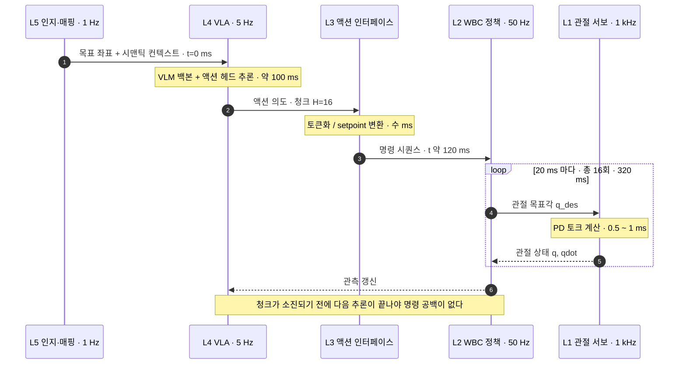
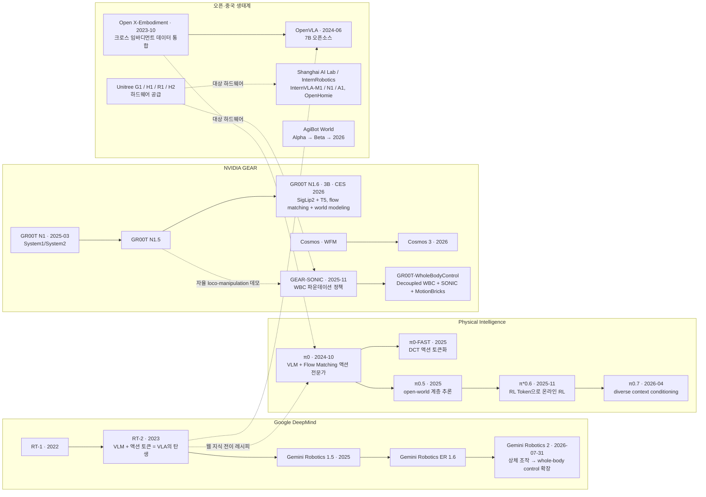
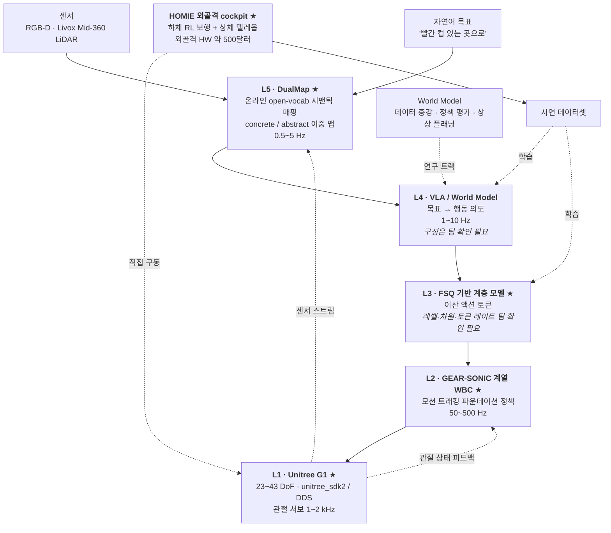

# Physical AI 개요와 산업 지형

> **한 줄 요약**: Physical AI를 5계층 스택(L1 하드웨어 ~ L5 인지·매핑)으로 분해하고, 각 계층의 동작 주파수·인터페이스·주요 플레이어·데이터 공급원을 지도로 그린 뒤, 회사 스택(G1 / HOMIE / SONIC / FSQ / DualMap)이 그 지도 어디에 앉는지 확정한다.

## 학습 목표

- [ ] Physical AI를 정의하고 "왜 하필 지금인가"를 3대 동인(파운데이션 모델 성숙 · 대규모 GPU 병렬 시뮬 · 저가 휴머노이드 하드웨어)으로 설명할 수 있다.
- [ ] 스택 5계층 각각의 **입력 · 출력 · 동작 주파수**를 말할 수 있고, 왜 계층이 존재하는지를 계층적 제어(cascade control)의 **대역폭 분리** 논리로 설명할 수 있다.
- [ ] 주요 플레이어의 계보(RT-2 → OpenVLA / π0 → π0.7 / GR00T N1 → N1.6 / Gemini Robotics → Robotics 2)를 그리고, 각자가 스택의 어느 계층에 베팅했는지 구분할 수 있다.
- [ ] 데이터 피라미드 4층의 **양-품질(액션 라벨) 트레이드오프**를 설명하고, 액션 라벨 없는 데이터를 쓰기 위한 접근(latent action · IDM · world model)이 왜 필요한지 말할 수 있다.
- [ ] 회사 스택 5요소를 5계층에 배치하고, 각 요소를 4주 중 어느 모듈에서 다루는지 매핑할 수 있다.

**완료 기준**: 백지에 5계층 스택을 그려 각 계층의 입출력·주파수를 채우고, 그 위에 DualMap / VLA / FSQ / SONIC·HOMIE / G1의 위치를 표시한 다음, "이 그림에서 내가 모르는 것"을 팀 확인 질문 3개 이상으로 뽑아낼 수 있다.

**선수 지식**: 없음(첫 모듈) · **소요**: 이론 3h / 실습 2h

---

## 1. 왜 이것을 배우는가

이 모듈은 **지도 제작**입니다. 앞으로 3주 반 동안 읽을 논문 20여 편과 실습 전부가 이 지도의 어느 좌표에 찍히는지를 여기서 정해둡니다. 좌표계 없이 논문을 읽으면 "Diffusion Policy와 SONIC 중 뭐가 상위 개념인가" 같은 질문에 매번 다시 헤매게 됩니다.

당신에게 유리한 프레이밍이 두 개 있습니다.

**첫째, LLM에서 일어난 일이 로봇에서 반복되는 중입니다.** 백본 사전학습 → 태스크 어댑터 → 토크나이저 설계 → 데이터 스케일링이라는 LLM의 전개가, 로봇에서는 VLM 백본 → 액션 헤드 → 액션 토크나이저 → 크로스 임바디먼트 데이터셋으로 거의 1:1 대응됩니다. **FSQ가 "액션의 BPE"** 라는 비유가 문자 그대로 통합니다.

**둘째, 스택 5계층은 계층적 제어(supervisory / cascade control)의 재발견입니다.** L4 상위 지능은 궤적 생성기·상위 플래너, L2 전신제어는 서보 루프, L3는 그 둘 사이 setpoint 인터페이스입니다. 제어에서 outer loop가 느리고 inner loop가 빠른 이유(대역폭 분리)가 그대로 작동하며, outer loop가 미분방정식이 아니라 30억 파라미터 트랜스포머라는 점만 다릅니다. 지금까지 로봇 제어는 모델 기반(동역학 식 + MPC)으로 갔고 한계는 늘 모델링 불가 영역 — 접촉·마찰·변형체·시각 — 이었습니다. Physical AI는 그 영역만 학습으로 대체하고 잘 되던 고주파 서보 루프는 그대로 둡니다. 그래서 **하이브리드 계층 구조**가 남습니다.

---

## 2. 개념

### 2.1 Physical AI란 무엇인가

> **Physical AI = 인터넷 규모 데이터로 학습한 지능을, 물리 법칙과 실시간 제약이 있는 몸에 넣는 문제.**

LLM과의 결정적 차이는 세 가지입니다.

| 축 | LLM | Physical AI |
|---|---|---|
| 실패 비용 | 토큰 하나 틀리면 재생성 | 관절 명령 하나 틀리면 로봇이 넘어짐(하드웨어 손상) |
| 시간 제약 | 사용자가 기다려줌(초 단위) | 물리가 기다려주지 않음(ms 단위 데드라인) |
| 데이터 | 인터넷에 이미 존재 | **액션 라벨이 인터넷에 없음** — 직접 만들어야 함 |

세 번째가 이 분야의 진짜 병목이고, §2.5 데이터 피라미드의 주제입니다.

용어 정리: **Embodied AI**는 "몸을 가진 지능"이라는 학술 용어, **Physical AI**는 NVIDIA가 밀면서 산업 용어로 굳은 표현입니다. 실무에서는 거의 같은 뜻이되 Physical AI 쪽이 파운데이션 모델·시뮬 인프라를 포함한 **스택 전체**를 가리키는 뉘앙스가 강합니다.

### 2.2 왜 지금인가 — 3대 동인

**동인 1. 파운데이션 모델의 성숙 (2023~)** — VLM을 처음부터 만들 필요가 없어졌습니다. RT-2(2307.15818)가 "사전학습된 VLM에 액션 토큰 출력을 붙이면 웹 지식이 로봇으로 전이된다"를 보인 이후 이 레시피가 표준이 됐습니다. GR00T N1.6은 SigLip2(비전) + T5(언어) 백본, π0(2410.24164)는 VLM 백본 + Flow Matching 액션 전문가를 씁니다. 즉 **로봇 팀이 만들 것은 백본이 아니라 액션 헤드와 데이터**입니다.

**동인 2. 대규모 GPU 병렬 시뮬 (2021~)** — "Learning to Walk in Minutes"(2109.11978)가 수천 환경을 GPU에서 동시에 굴려 보행 정책을 수십 분에 학습시키는 레시피를 확립했고, 그 끝에 SONIC이 있습니다: 700시간 모캡(1억+ 프레임)을 42M 파라미터 정책에 **21,000 GPU-hours** 부어 범용 WBC를 만들었습니다(arXiv:2511.07820). "데이터를 수집한다"에서 "데이터를 생산한다"로의 전환입니다.

**동인 3. 저가 휴머노이드 하드웨어 (2024~)** — Unitree G1이 **$13,500~27,000** 구간에 들어오며 2026년 기준 유일한 2만 달러 이하 상용 이족 휴머노이드가 됐습니다. 연구실 한 곳이 로봇 열 대를 살 수 있으면 데이터 수집 규모가 바뀝니다. Unitree는 2025년 휴머노이드 5,500대 이상을 출하(테슬라보다 많음), 매출 16.9억 위안을 기록했고 2026년 8월 현재 STAR Market 상장 절차를 진행 중입니다.

**보조 동인 4. 데이터 인프라의 공유화** — Open X-Embodiment(2310.08864)가 21개 기관·22종 로봇 데이터를 하나의 포맷으로 통합해 "ImageNet 모멘트"의 전제를 갖췄고, AgiBot World가 단일 플랫폼 100만 궤적을 공개하며 규모의 하한선을 올렸습니다.

### 2.3 스택 5계층 — 입출력과 주파수

이 블록도가 이 모듈의 중심입니다. 화살표를 따라 위에서 아래로 내려갈수록 **빨라지고 멍청해집니다.**

```
════════════════════════════════════════════════════════════════════════════
[L5] 인지·매핑                                          동작: 0.5 ~ 5 Hz
  in : RGB-D [H,W,4] · LiDAR 포인트클라우드 [N,3] · 자연어 목표 (텍스트)
  out: 시맨틱 맵(객체+라벨+포즈) · 목표 3D 좌표 [3] · 질의 결과
  담당: SLAM/오도메트리, open-vocab 시맨틱 매핑, 언어 grounding
  회사: ★ DualMap                                        → W4-M3
════════════════════════════════════════════════════════════════════════════
                    │ 목표 좌표 + 시맨틱 컨텍스트
                    ▼
[L4] 상위 지능 (VLA / 월드모델 / 플래너)                동작: 1 ~ 10 Hz
  in : 이미지 [B,V,3,H,W] (V=카메라 수) · 언어 지시 토큰 [B,L]
       · 로봇 상태(proprioception) [B,D_state]
  out: 액션 청크 [B,H_chunk,D_action]   ← H_chunk = 예측 지평 (보통 8~50)
  담당: 목표 → 행동 의도. VLM 백본 + 액션 헤드(DiT/Flow Matching)
  회사: VLA / World Model (구성 팀 확인 필요)             → W2, W4-M1/M2
════════════════════════════════════════════════════════════════════════════
                    │ ★ 승부처 ★
                    ▼
[L3] 액션 인터페이스                                    동작: L4 호출당 1회
  in : 상위 모델의 액션 의도 [B,H_chunk,D_action] (연속) 또는 latent [B,D_z]
  out: 이산 토큰 시퀀스 [B,H_chunk,D_tok] 또는 연속 setpoint
       FSQ: D_z 차원 각각을 L_i 레벨로 반올림 → 코드북 크기 = ∏ L_i
  담당: 표현 변환 + 시간 정렬(chunking) + 상·하위 디커플링
  회사: ★ FSQ 기반 계층 모델 (레벨·차원 팀 확인 필요)     → W1-M5, W2-M5
════════════════════════════════════════════════════════════════════════════
                    │ 목표 자세 / 모션 레퍼런스 / twist 명령
                    ▼
[L2] 전신 제어 WBC                                      동작: 50 ~ 500 Hz
  in : 상위 명령(토큰/레퍼런스 모션) [D_cmd]
       · 관측 이력 스택 [T_hist, D_obs] (관절각·각속도·IMU·이전 액션)
  out: 관절 목표각 q_des [23~43] (또는 토크 [23~43])
  담당: RL 정책 1회 forward. 균형·접촉·모션 트래킹
  회사: ★ GEAR-SONIC (WBC 파운데이션 정책) / ★ HOMIE (하체 RL + 상체 텔레옵)
                                                        → W3-M2/M3/M4
════════════════════════════════════════════════════════════════════════════
                    │ q_des [23~43] @ 50~500 Hz
                    ▼
[L1] 하드웨어 / 미들웨어                                동작: 1 ~ 2 kHz
  in : q_des [23~43]
  out: 관절 토크 τ = Kp(q_des − q) − Kd·q̇   ← 온보드 PD 서보
  담당: 모터 드라이버, 상태 추정, DDS/SDK 통신, 안전 정지
  회사: ★ Unitree G1 (23~43 DoF) + unitree_sdk2 / DDS      → W1-M2, W3-M5
════════════════════════════════════════════════════════════════════════════
      [병렬] 데이터 수집: 텔레옵 · 모캡 · 휴먼 비디오 → 학습 데이터
      회사: ★ HOMIE 외골격 cockpit                      → W3-M3
════════════════════════════════════════════════════════════════════════════
```

> 위 블록도의 차원 표기 중 `H_chunk`, `D_action`, `D_z`, `D_tok`, `D_cmd`의 **회사 실제 값은 확인되지 않았습니다.** 일반적 논문 범위를 적었을 뿐이며, 실제 값은 팀 확인 대상입니다(§'팀에 물어볼 것' 참조).

**핵심 통찰**: 상위는 느리고 똑똑하게, 하위는 빠르고 반사적으로. 그리고 **승부처는 L3입니다.** L4와 L2를 각각 잘 만드는 것보다, 둘을 잇는 인터페이스를 어떻게 설계하느냐가 시스템 성능과 교체 가능성을 결정합니다. 회사가 FSQ 이산 토큰을 쓰는 것도, SONIC이 "universal token space"로 VLA·VR 텔레옵·게임패드 플래너를 하나의 정책에 물리는 것도 전부 L3 설계 문제입니다.

### 2.4 왜 계층인가 — 대역폭 분리

제어 배경이면 이 부분은 **이름만 바뀐 것**입니다. 캐스케이드 제어에서 inner loop 대역폭을 outer의 5~10배로 잡는 이유는 두 루프가 서로의 동특성에 간섭하지 않게 하기 위해서고, Physical AI 스택은 같은 규칙을 네 번 적용한 결과입니다.

$$
\omega_{L1} \gg \omega_{L2} \gg \omega_{L4} \gg \omega_{L5}
$$

숫자로 보면 1~2 kHz ≫ 50~500 Hz ≫ 1~10 Hz ≫ 0.5~5 Hz — 각 경계에서 대략 한 자릿수 이상의 비율이 유지됩니다. 이건 설계 취향이 아니라 **연산 예산이 강제한 결과**입니다. 3B 파라미터 VLA를 1 kHz로 돌리는 것은 물리적으로 불가능하고, 반대로 균형 회복 반사를 5 Hz로 하면 로봇은 넘어집니다.

여기서 나오는 문제가 **"느린 상위가 빠른 하위를 어떻게 끊김 없이 먹여 살리는가"** 이고, 답이 action chunking입니다.

### 2.5 데이터 피라미드

```
                 ▲ 양(量) 많음 / 액션 라벨 없음 / 임바디먼트 무관
        ┌────────────────────────────────┐
        │  ① 웹 비디오 (YouTube 등)        │  ~수십억 클립, 액션 라벨 0
        ├────────────────────────────────┤
        │  ② 휴먼 비디오 · 모캡           │  수백~수천 시간, 인간 골격 라벨
        ├──────────────────────────────┤
        │  ③ 텔레옵 시연 (로봇 실기)     │  10⁴~10⁶ 궤적, 액션 라벨 정확
        ├────────────────────────────┤
        │  ④ 실기 RL / 온라인 상호작용 │  가장 적음, 보상까지 있음
        └────────────────────────────┘
                 ▼ 양 적음 / 액션 라벨 정확 / 임바디먼트 종속
```

| 계층 | 대표 데이터셋 | 규모 | 임바디먼트 | 출처 |
|---|---|---|---|---|
| ③ 텔레옵 (크로스 임바디먼트) | Open X-Embodiment | 100만+ 실기 궤적, 60개 데이터셋 통합, 527 스킬 / 160,266 태스크 | 22종 로봇, 21개 기관 / 34개 연구실 | arXiv:2310.08864 |
| ③ 텔레옵 (단일 플랫폼) | AgiBot World Alpha | 92,214 궤적 (~8.5T 토큰) | AgiBot 로봇 100대, 1:1 재현 실환경 100+곳 | arXiv:2503.06669 |
| ③ 텔레옵 (단일 플랫폼) | AgiBot World Beta | **1,003,672 궤적** (~43.8T 토큰) | 동일 | arXiv:2503.06669 |
| ② 모캡 (WBC 학습) | SONIC 학습 데이터 | 700시간 = **1억+ 프레임** | 휴먼 모캡 → 휴머노이드 리타게팅 | arXiv:2511.07820 |

**읽는 법**: 위로 갈수록 데이터는 넘치는데 $a_t$(액션)가 없고, 아래로 갈수록 $a_t$는 정확한데 데이터가 말랐습니다. 이 분야의 방법론적 창의성 대부분이 **"라벨 없는 상단을 어떻게 하단으로 끌어내릴 것인가"** 에 쏟아집니다.

- **IDM (Inverse Dynamics Model)**: 소량의 라벨 데이터로 $\hat a_t = f_{\text{IDM}}(o_t, o_{t+1})$을 학습해 라벨 없는 비디오에 액션을 역추정으로 붙입니다.
- **Latent action**: 진짜 액션 대신 **대리 액션** $z_t = E(o_t, o_{t+1})$을 학습하고, 하류에서 소량의 실기 데이터로 $z \to a$ 디코더만 맞춥니다(LAPA, Genie 계열). → **W2-M5 복선**
- **World model**: 아예 $p(o_{t+1:t+H} \mid o_t, a)$를 학습해 데이터를 생성하거나 정책을 평가합니다. → **W4-M1 / W4-M2 복선**

즉 W2-M5와 W4-M1/M2는 새 주제가 아니라 **이 피라미드 문제의 두 가지 답안**입니다.

---

## 3. 핵심 수식 — 지연 예산과 action chunking

계층이 생기면 반드시 따라오는 것이 **경계에서의 지연**입니다. 이 모듈에서 손으로 계산해야 할 유일한 식입니다.

L4가 주기 $T_{\text{replan}} = 1/f_4$로 재계획하고, 한 번의 추론에 $\tau_{\text{infer}}$가 걸리며, 통신 지연이 $\tau_{\text{comm}}$이라고 합시다. L2는 $f_2$ Hz로 돌면서 청크에서 액션을 하나씩 꺼내 씁니다. **다음 청크가 도착하기 전에 현재 청크가 소진되면 로봇은 명령 공백에 빠집니다.** 따라서 청크 길이 $H_{\text{chunk}}$는

$$
\frac{H_{\text{chunk}}}{f_2} \;\ge\; T_{\text{replan}} + \tau_{\text{infer}} + \tau_{\text{comm}}
\quad\Longleftrightarrow\quad
H_{\text{chunk}} \;\ge\; f_2\bigl(T_{\text{replan}} + \tau_{\text{infer}} + \tau_{\text{comm}}\bigr)
$$

- **직관**: 청크는 상위 모델의 느림을 감추는 **버퍼**입니다. 상위가 느릴수록, 하위가 빠를수록 청크는 길어야 합니다.
- **수치 예**: $f_2 = 50$ Hz, $f_4 = 5$ Hz($T_{\text{replan}} = 200$ ms), $\tau_{\text{infer}} = 100$ ms, $\tau_{\text{comm}} = 20$ ms → $H_{\text{chunk}} \ge 50 \times 0.32 = 16$ 스텝. ACT·Diffusion Policy가 쓰는 청크 길이가 대략 이 스케일인 것은 우연이 아닙니다.
- **제어 대응**: 이것은 **MPC의 예측 지평 $N$과 정확히 같은 역할**입니다. MPC도 매 스텝 $N$개의 미래 입력을 풀어놓고 앞의 몇 개만 쓰고 버립니다(receding horizon). Action chunking은 "최적화로 푸는 대신 신경망으로 회귀한 receding horizon"입니다.
- **트레이드오프**: $H_{\text{chunk}}$가 길수록 지연에는 강해지지만, 청크 실행 중에는 새 관측을 반영하지 못하므로 **반응성이 떨어집니다.** MPC에서 지평을 늘리면 계산이 늘고 모델 오차가 누적되는 것과 같은 구조의 트레이드오프입니다. → W2-M1(ACT)에서 다시 만납니다.

### 3.1 한 사이클의 타이밍



---

## 4. 아키텍처 — 주요 플레이어 계보



계보에서 읽어야 할 것은 **"누가 어느 계층에 베팅했는가"** 입니다.

| 조직 | 계보 | 2026-08 최신 | 시점 | 주 베팅 계층 | 특기 |
|---|---|---|---|---|---|
| NVIDIA | GR00T N1 → N1.5 → **N1.6** | Isaac GR00T N1.6 (3B) | CES 2026 (1월 추정, 날짜 미확정) | L4 + L2 + 시뮬 인프라 | SigLip2(비전)+T5(언어) 백본, flow matching과 world-modeling objective 공동 학습, N1.5 대비 MLP connector 개선. HF `nvidia/GR00T-N1.6-3B`. 학습 데이터 규모 비공개 |
| NVIDIA | Cosmos → **Cosmos 3** | Cosmos 3 | 2026 (정확 시점 미확정) | 데이터·월드모델 | 월드 생성 + 비전 추론 + 액션 시뮬 통합. 오픈 Cosmos WFM 누적 300만+ 다운로드 |
| NVIDIA | Isaac Sim / Isaac Lab | **Isaac Sim 5.0 GA**(SIGGRAPH 2025), **Isaac Lab 3.0 얼리 액세스** | 2025~2026 | 시뮬 인프라 | Isaac Lab 2.2는 휴머노이드 정책 평가·GR00T N1 벤치마킹 중심 |
| Physical Intelligence | π0 → π0.5 → π\*0.6 → **π0.7** | π0.7 (arXiv:2604.15483) | 2026-04-16 | L4 (VLA 단일 베팅) | π\*0.6(2025-11-17)은 VLA에서 "RL Token"을 뽑아 온라인 RL. π0.7은 **diverse context conditioning** — 수행 품질 메타데이터·서브골 이미지를 학습 조건으로 주입해 준최적·실패 데이터까지 활용. 공저자 87명 |
| Google DeepMind | RT-2 → Gemini Robotics 1.5 → ER 1.6 → **Gemini Robotics 2** | **Gemini Robotics 2** | **2026-07-31** | L4 → L2까지 확장 | 이전 세대의 상체 조작 중심에서 **whole-body control(보행·웅크리기·굽히기 + 조작)로 확장**. Gemini Robotics On-Device 2 동시 공개(수 시간 데이터로 새 임바디먼트 적응). Apptronik 휴머노이드 데모 |
| Shanghai AI Lab / InternRobotics | InternVLA-M1 / N1 / A1 | 3종 | 2025~2026 | L4 + L5 + L2 | N1은 듀얼 시스템 VLN — wheeled/quadruped/humanoid zero-shot, **>150m 장기 계획 + >30Hz 실시간 결정**. **OpenHomie도 이 조직 산하** |
| Unitree | G1 / H1 / R1 / H2 | — | **2026-08 STAR Market 상장 절차 진행 중**(08-10 청약 개시 예정) | L1 하드웨어 | 2025년 휴머노이드 **5,500대+ 출하 — 테슬라보다 많음**, 매출 16.9억 위안 |
| AgiBot | AgiBot World Alpha/Beta → 2026 | AgiBot World 2026 | 2026 | 데이터 | 100% 실환경, **AGIBOT G2** 플랫폼 free-form 수집. 원논문 arXiv:2503.06669, IROS 2025 Best Paper Finalist & IEEE TRO 2026 |

**Figure / Tesla / 1X**는 1차 출처로 확인된 정량 수치가 없어 정성 서술만 합니다. Figure는 자체 하드웨어 + 자체 VLA로 수직 통합, Tesla Optimus는 대량 생산 전제의 수직 통합 노선이나 **V3는 2026년 7월 기준 아직 공개 시연 전**, 1X는 가정용(NEO) 포지셔닝에 텔레옵 폴백을 전제한 배포 전략입니다. 생산 대수·자율 운영 시간 같은 수치는 확인되지 않아 넣지 않았습니다.

**한 줄 요약**: π 계열은 L4에 올인, NVIDIA는 L2·L4·시뮬 인프라 전부, DeepMind는 L4에서 시작해 L2로 내려오는 중, 중국 생태계는 하드웨어와 데이터에서 규모로 밀고 있습니다.

---

## 5. 회사 스택 연결 ★

### 5.1 배치도



> ⚠️ **이 배치도는 마스터플랜 §2.3의 "추정 파이프라인"에 근거합니다.** 팀이 검증한 실제 구성이 아닙니다. **W4-M5 캡스톤 과제 중 하나가 이 다이어그램을 팀원에게 검증받고 수정하는 것**입니다. 특히 L4의 정체(자체 VLA인지 GR00T 파인튜닝인지), L3↔L2 접점의 실제 형태, DualMap 출력이 L4로 어떤 형태로 들어가는지는 **전부 미확인**입니다.

### 5.2 계층 × 회사 스택 × 학습 모듈 매핑

| 계층 | 회사 스택 요소 | 정체 · 이 lesson이 닿는 지점 | 깊게 다루는 모듈 | 확인 상태 |
|---|---|---|---|---|
| L5 | **DualMap** ★ | 온라인 open-vocabulary 시맨틱 매핑, 동적 환경 대응(arXiv:2506.01950, RA-L 2025). 스택 최상단 = 언어 목표 → 좌표 | W4-M3 | 논문·코드 = 확정 / **회사 적용 형태 팀 확인 필요** |
| L4 | VLA / World Model | 목표 → 행동 의도. 계보 지도상 π0 / GR00T / Gemini Robotics 진영과 비교 | W2-M3/M4, W4-M1/M2 | **팀 확인 필요** (자체 개발? 파인튜닝? 미정?) |
| L3 | **FSQ 기반 계층 모델** ★ | 이산 액션 토큰화(FSQ 원논문 arXiv:2309.15505). "승부처는 L3" — 왜 이산 토큰인가의 시스템적 근거 | W1-M5(구현), W2-M5(설계 논증) | 알고리즘 = 확정 / **회사 모델 구조·레벨 팀 확인 필요** |
| L2 | **GEAR-SONIC** ★ | WBC 모션 트래킹 파운데이션 정책. 42M / 700h 모캡 / 21k GPU-hours(arXiv:2511.07820). universal token space가 곧 L3 인터페이스 | W3-M4 | 논문·코드 = 확정 / **가중치 사용인지 재학습인지 팀 확인 필요** |
| L2 + 데이터 | **HOMIE** ★ | 하체 RL + 상체 외골격 cockpit 텔레옵(arXiv:2502.13013). 데이터 피라미드 ③층을 직접 채우는 경로 | W3-M3 | 논문·코드 = 확정 / **CC-BY-NC-SA 4.0 상업 이용 승인 여부 팀 확인 필요** |
| L1 | **Unitree G1** ★ | 23~43 DoF 휴머노이드. 액션 벡터 차원의 하한을 결정 | W1-M2(모델 로드), W3-M5(배포 경로) | 스펙 = 확정 / **보유 구성(23/29/43) 팀 확인 필요** |

### 5.3 G1 구성 — 액션 차원이 여기서 결정된다

| 구성 | DoF | 구성 상세 | 메모 |
|---|---|---|---|
| G1 기본형 | **23** | 다리 6×2 + 팔 5×2 + 허리 1 | WBC 액션 벡터의 하한 |
| G1 EDU Plus (U2) | **29** | 팔·허리 자유도 추가 | |
| G1 EDU Ultimate | 최대 **43** | 다관절 핸드 + 추가 허리·손목 | Dex3 핸드 포함 구성 |

페이로드 3 kg, 가격대 **$13,500~27,000**. 2026년 기준 유일한 2만 달러 이하 상용 이족 휴머노이드입니다.

> 📎 DoF 수치는 3자 사이트(robotsguide, robostore) 교차확인값입니다. `support.unitree.com`은 JS 렌더링이라 집필 시점에 정적 확인이 실패했습니다. **팀 보유 기체의 실제 구성으로 반드시 대체하세요.**

### 5.4 Gemini Robotics 2와의 대조 — 우리 구도의 거울

2026-07-31 공개된 Gemini Robotics 2는 이전 세대의 상체 조작 중심에서 **whole-body control(보행·웅크리기·굽히기 + 조작)로 확장**했습니다. 회사 구도와 직접 비교 대상인 이유는, 회사 스택이 **L4(VLA)와 L2(WBC)를 명시적으로 분리하고 L3(FSQ 토큰)로 잇는** 반면 Gemini Robotics 2는 상위 모델이 전신 제어까지 흡수하는 방향으로 보이기 때문입니다(내부 구조는 미공개).

트레이드오프는 W2-M5에서 다시 논증합니다: 분리형은 하위 정책 교체 가능·인터페이스 단순·디버깅 용이가 장점, 양자화 오차·표현력 손실이 대가이고 통합형은 그 반대입니다. **어느 쪽이 맞는지는 아직 업계 합의가 없습니다.**

---

## 6. 흔한 오해 3가지

| 오해 | 교정 |
|---|---|
| **"VLA 하나면 끝난다 / end-to-end가 계층 구조를 대체한다"** | 계층은 설계 취향이 아니라 **주파수·지연 예산이 물리적으로 강제한 결과**입니다. 3B 모델을 1 kHz로 forward할 방법은 없고, 균형 회복 반사를 5 Hz로 할 수도 없습니다(§3의 부등식). Gemini Robotics 2처럼 상위 모델이 WBC까지 흡수하는 흐름에서도 고주파 서보 루프는 여전히 따로 돕니다. **바뀌는 것은 계층의 유무가 아니라 경계선의 위치입니다.** |
| **"시뮬에서 되면 실기에서 된다"** | sim2real 갭은 5개 요인(액추에이터 동특성, 지연, 접촉 모델, 센서 노이즈, 상태 추정)에서 옵니다. 그래서 업계는 **sim2sim 검증 문화**(학습 시뮬 → 다른 시뮬에서 재검증 → 실기)를 씁니다. 플랜트 모델 하나로 튜닝한 제어기가 실기에서 발산하는 것과 같은 이야기이고, 도메인 랜더마이제이션은 **강인제어의 불확실성 집합**을 데이터로 구현한 것입니다. → W3-M5 |
| **"데이터만 더 모으면 된다"** | 피라미드 상단(웹·휴먼 비디오)은 양이 압도적이지만 **액션 라벨 $a_t$가 없고**, 하단(텔레옵·실기 RL)은 라벨이 정확하지만 비쌉니다. AgiBot World Beta의 100만 궤적조차 **단일 플랫폼**이라 다른 로봇으로의 전이는 별개 문제입니다. latent action·IDM·world model 계열이 존재하는 이유가 이것 — "데이터 부족"이 아니라 **"라벨 없는 데이터를 쓰는 법"** 이 미해결입니다. → W2-M5, W4-M1/M2 |

**번외**: "Physical AI = 휴머노이드"도 흔한 오해입니다. 휴머노이드는 인간 환경·인간 데이터와의 호환성 때문에 주목받는 **하나의 폼팩터**일 뿐, OXE의 22종 로봇 대부분은 팔·모바일 매니퓰레이터입니다. 다만 회사 스택은 G1이 기준이므로 이 4주는 휴머노이드 중심으로 읽어도 무방합니다.

---

## 7. 실습으로 가기

이 모듈은 **GPU가 필요 없습니다.** CPU 인스턴스 또는 로컬에서 전부 돌아갑니다.

- 실습 코드: [`practice/`](practice/)
  - `01_stack_frequency_budget.py` — §3의 부등식을 코드로. $f_2$, $f_4$, $\tau_{\text{infer}}$를 바꿔가며 필요한 $H_{\text{chunk}}$를 계산하고, 청크 길이가 부족할 때 생기는 명령 공백을 타임라인 플롯으로 저장합니다.
  - `02_data_pyramid_plot.py` — 데이터 피라미드와 5계층 스택 다이어그램을 png로 렌더합니다(문서용 그림 소스).
  - `03_player_landscape.py` — §4의 플레이어 지도를 CSV로 관리하고 비교표·차트로 렌더합니다. 새 모델이 나올 때마다 CSV만 갱신하면 됩니다.
  - `my_stack_template.excalidraw` — **이 모듈의 산출물.** "본인 언어로 그린 스택 다이어그램"을 직접 채워 넣는 편집 가능 스켈레톤입니다.
- 랩 가이드: [`labs/`](labs/) — 5단계, 약 2시간. 마지막 단계가 GEAR-SONIC 프로젝트 페이지 데모 영상을 보고 "회사가 지향하는 최종 그림"을 자기 말로 한 문단 쓰기입니다.

> 📌 이 모듈의 진짜 산출물은 코드가 아니라 **당신이 직접 그린 스택 다이어그램 1장 + "우리 회사 스택이 이 지도 어디에 있는가" 메모**입니다. 템플릿을 그대로 베끼지 말고, 모르는 칸은 물음표로 남겨두세요. 그 물음표가 팀 질문 리스트가 됩니다.

---

## 8. 셀프 체크 퀴즈

1. Physical AI와 LLM의 결정적 차이 3가지를 말하고, 그중 이 분야의 진짜 병목이 무엇인지 설명하라.
2. 스택 5계층의 이름과 각 계층의 대표 동작 주파수를 위에서 아래로 말하라.
3. "승부처는 L3"라는 주장의 근거를 설명하라. 회사 스택에서 L3에 해당하는 것은 무엇인가?
4. 계층 구조가 생기는 이유를 제어공학 용어로 설명하라. inner/outer loop 대역폭 비율 규칙과의 관계는?
5. $f_2 = 100$ Hz, $f_4 = 4$ Hz, $\tau_{\text{infer}} = 150$ ms, $\tau_{\text{comm}} = 10$ ms일 때 최소 청크 길이 $H_{\text{chunk}}$는?
6. Action chunking을 MPC 용어로 번역하라. 청크를 길게 잡을 때의 대가는 무엇인가?
7. 데이터 피라미드 4층을 위에서 아래로 나열하고, 각 층에서 무엇이 많고 무엇이 없는지 말하라.
8. 액션 라벨 없는 데이터를 활용하는 세 가지 접근(IDM · latent action · world model)의 차이를 한 줄씩 설명하라.
9. π 계열, NVIDIA, Google DeepMind가 각각 스택의 어느 계층에 주로 베팅했는지 구분하라. Gemini Robotics 2의 2026-07-31 변화는 이 구도에서 무엇을 의미하는가?
10. 회사 스택 5요소(DualMap / VLA / FSQ / SONIC·HOMIE / G1)를 계층에 배치하고, 각각을 4주 중 어느 모듈에서 다루는지 말하라. 그리고 이 배치도에서 **당신이 아직 모르는 것** 3가지를 지목하라.

<details>
<summary>정답 보기</summary>

1. ① 실패 비용 — 토큰은 재생성하면 되지만 관절 명령 오류는 로봇을 넘어뜨림 ② 시간 제약 — 물리는 기다려주지 않음(ms 데드라인) ③ 데이터 — 액션 라벨이 인터넷에 없음. **진짜 병목은 ③**이고, 데이터 피라미드 문제로 이어진다.

2. L5 인지·매핑 0.5~5 Hz → L4 상위 지능(VLA/월드모델) 1~10 Hz → L3 액션 인터페이스(L4 호출당 1회) → L2 전신제어 WBC 50~500 Hz → L1 하드웨어/관절 서보 1~2 kHz.

3. L4와 L2를 각각 잘 만드는 것보다 둘의 접합 방식이 시스템 성능·교체 가능성·디버깅 용이성을 결정하기 때문. 이산 토큰 인터페이스면 하위 정책을 갈아끼울 수 있고 상위는 AR 모델과 궁합이 좋아진다. 회사에서는 **FSQ 기반 계층 모델**이 L3다.

4. 캐스케이드/supervisory control의 **대역폭 분리**. inner loop 대역폭을 outer의 5~10배로 잡아 두 루프의 동특성 간섭을 막는 규칙이 스택 경계마다 반복 적용된 것. 다만 여기서는 설계 선택이 아니라 **연산 예산이 강제한 결과**라는 점이 다르다(3B 모델을 kHz로 못 돌린다).

5. $H \ge f_2(T_{\text{replan}} + \tau_{\text{infer}} + \tau_{\text{comm}}) = 100 \times (0.25 + 0.15 + 0.01) = 100 \times 0.41 = 41$ 스텝.

6. **receding horizon 제어의 예측 지평 $N$**. 매 스텝 미래 $N$개 입력을 만들어 앞의 일부만 쓰고 버리는 구조가 동일하다(최적화로 풀지 않고 신경망 회귀로 얻는다는 점만 다름). 대가는 **반응성** — 청크 실행 중에는 새 관측을 반영하지 못하므로 외란·환경 변화에 늦게 대응한다.

7. ① 웹 비디오(수십억 클립, 액션 라벨 0) ② 휴먼 비디오·모캡(수백~수천 시간, 인간 골격 라벨) ③ 텔레옵 시연($10^4$~$10^6$ 궤적, 액션 라벨 정확) ④ 실기 RL/온라인 상호작용(가장 적음, 보상까지 있음). 위로 갈수록 양은 많고 액션 라벨이 없으며 임바디먼트에 무관하고, 아래로 갈수록 양은 적고 라벨은 정확하며 임바디먼트에 종속된다.

8. **IDM** — 소량의 라벨 데이터로 $\hat a_t = f(o_t, o_{t+1})$을 학습해 라벨 없는 비디오에 액션을 역추정으로 붙인다. **Latent action** — 진짜 액션 대신 대리 액션 $z_t = E(o_t, o_{t+1})$을 학습하고 소량 실기 데이터로 $z \to a$ 디코더만 맞춘다. **World model** — $p(o_{t+1:t+H}\mid o_t, a)$를 학습해 데이터를 생성하거나 정책을 평가·상상 플래닝에 쓴다.

9. π 계열(Physical Intelligence)은 L4 VLA 단일 베팅. NVIDIA는 L4(GR00T) + L2(GEAR-SONIC) + 시뮬 인프라(Isaac) + 데이터·월드모델(Cosmos)까지 전 계층. Google DeepMind는 L4에서 출발해 L2로 내려오는 중이며, **2026-07-31 Gemini Robotics 2가 상체 조작 중심에서 whole-body control로 확장한 것이 그 이동의 증거**다. 즉 "상위 모델이 계층 경계를 아래로 밀고 있다"는 흐름이며, 회사의 L4/L3/L2 분리 구도와 직접 비교 대상이 된다.

10. L5=DualMap(W4-M3) / L4=VLA·World Model(W2-M3, W2-M4, W4-M1, W4-M2) / L3=FSQ 기반 계층 모델(W1-M5 구현, W2-M5 설계 논증) / L2=GEAR-SONIC(W3-M4)·HOMIE(W3-M3) / L1=Unitree G1(W1-M2 모델 로드, W3-M5 배포 경로). **모르는 것 예시**: ① L4의 정체(자체 VLA인가 GR00T 파인튜닝인가) ② L3 FSQ의 실제 레벨·차원·토큰 레이트 ③ L3↔L2 접점의 실제 형태(SONIC 정책의 실제 입력) ④ DualMap 출력이 L4로 들어가는 형태 ⑤ 보유 G1의 DoF 구성.

</details>

---

## 9. 출처

**논문 (arXiv)**

- 「A Tutorial on World Models and Physical AI」 — arXiv:2606.12783. **1인 저자(Il-Seok Oh) 튜토리얼**이므로 커뮤니티 합의가 아니라 한 저자의 정리로 읽을 것. 명시적 world model(rollout 기반 추론·계획) vs 암묵적 world model 구분이 유용. (확인: 2026-08-01)
- SONIC: Supersizing Motion Tracking for Natural Humanoid Whole-Body Control — arXiv:2511.07820 (**v3, 2026-05-21 개정**). 42M 파라미터 / 700시간 모캡 = 1억+ 프레임 / 21,000 GPU-hours. (확인: 2026-08-01)
- HOMIE: Humanoid Loco-Manipulation with Isomorphic Exoskeleton Cockpit — arXiv:2502.13013, Shanghai AI Lab (Jiangmiao Pang). 대상 HW = Unitree G1 + Dex3 hands, 외골격 하드웨어 약 $500. **라이선스 CC-BY-NC-SA 4.0 — 상업적 이용 제한.** (확인: 2026-08-01)
- DualMap: Online Open-Vocabulary Semantic Mapping for Natural Language Navigation in Dynamic Changing Scenes — arXiv:2506.01950, **IEEE RA-L 2025 Vol.10 Iss.12**. 1저자 Jiajun Jiang (HKUST-GZ). 2025-08 코드 공개. (확인: 2026-08-01)
- Finite Scalar Quantization: VQ-VAE Made Simple — arXiv:2309.15505, Mentzer·Minnen·Agustsson·Tschannen (Google Research), 2023-09.
- Open X-Embodiment — arXiv:2310.08864
- AgiBot World — arXiv:2503.06669 (IROS 2025 Best Paper Finalist, IEEE TRO 2026)
- π0 — arXiv:2410.24164 / π0.7 — arXiv:2604.15483 (2026-04-16)
- RT-2 — arXiv:2307.15818 / OpenVLA — arXiv:2406.09246 / GR00T N1 — arXiv:2503.14734
- Learning to Walk in Minutes — arXiv:2109.11978

**리포·프로젝트 페이지** (전부 확인: 2026-08-01)

- GEAR-SONIC 프로젝트 페이지 — `nvlabs.github.io/GEAR-SONIC/`
- GR00T-WholeBodyControl 문서 페이지 — `nvlabs.github.io/GR00T-WholeBodyControl/` (**정본**). 현재 3개 프로젝트 통합 플랫폼: ① Decoupled WBC(GR00T N1.5/N1.6에 실사용) ② GEAR-SONIC ③ MotionBricks(latent generative motion model, 2026-04-27 프리뷰). **코드 Apache 2.0 / 가중치 NVIDIA Open Model License.** 2026-05-07 G1 end-to-end VLA 워크플로, 2026-06-16 저지연 텔레옵 체크포인트 추가.
- OpenHomie — `github.com/InternRobotics/OpenHomie`
- DualMap — `github.com/Eku127/DualMap`
- keon/awesome-physical-ai — 371 stars. **색인용으로만 사용, 통독 금지.**

**신뢰도 각주** (전부 2026-08-01 기준)

- 📎 **G1 DoF 수치**(23 / 29 / 43) — 3자 사이트(robotsguide, robostore) 교차확인값. `support.unitree.com`은 JS 렌더링이라 정적 확인 실패.
- 📎 **GR00T N1.6 공개일**(CES 2026, 1월 추정)과 **Cosmos 3 릴리스 시점** — 정확한 날짜 미확인. **GEAR-SONIC HF 체크포인트의 실제 다운로드 가능 여부**도 미확인.
- 📎 Figure / Tesla / 1X의 생산 대수·자율 운영 시간·손 DoF·선주문 수량, AgiBot World 2026의 시간 규모 — 1차 출처가 확인되지 않아 **의도적으로 수치를 넣지 않았습니다.**

---

## 팀에 물어볼 것

> `notes/questions-for-team.md`의 W1 섹션에 복사할 것. P0 질문 1~5와 중복되지 않는 새 질문입니다.

1. **OpenHomie는 CC-BY-NC-SA 4.0(상업 이용 제한)인데, 우리는 별도 라이선스·상업 이용 승인을 받았는가? 아니면 논문만 참고한 자체 재구현인가?** — 이 답에 따라 W3-M3에서 코드를 읽는 방식(그대로 쓸 수 있는가 vs 구조만 배우는가)이 달라집니다. **법무 리스크가 걸린 질문이라 우선순위 최상.**
2. **GEAR-SONIC은 코드가 Apache 2.0, 가중치가 NVIDIA Open Model License입니다. 우리는 공개 가중치를 파인튜닝하는 형태인가, SONIC 방식의 자체 학습인가?** — 21,000 GPU-hours 규모라 자체 학습이면 인프라 질문이 따라붙습니다.
3. **우리 G1은 어떤 구성인가 — 23 DoF 기본형 / 29 DoF EDU Plus / 43 DoF EDU Ultimate? Dex3 핸드가 있는가?** — WBC 액션 벡터 차원과 텔레옵 매핑이 여기서 결정됩니다.
4. **L5 → L4 인터페이스의 실제 형태는? DualMap이 3D 좌표를 넘기는가, 시맨틱 맵 질의 API인가, 아니면 언어 목표를 그대로 넘기는가?**
5. **L4 상위 지능은 자체 VLA인가, GR00T N1.x 파인튜닝인가, 아직 미정인가?** — Gemini Robotics 2처럼 상위 모델이 WBC까지 흡수하는 노선과 우리의 L4/L3/L2 분리 노선 중 어느 쪽을 지향하는지도 함께.
6. **L4 추론은 G1 온보드에서 도는가, 외부 워크스테이션인가?** — §3의 주파수 예산을 실제 수치로 채우려면 $\tau_{\text{infer}}$와 $\tau_{\text{comm}}$의 실측이 필요합니다(W4-M4에서 다시 필요).

---

**다음 토픽** → [시뮬레이터 부트캠프 + 클라우드 실습 환경 구축](../02-simulator-bootcamp/lesson.md)
