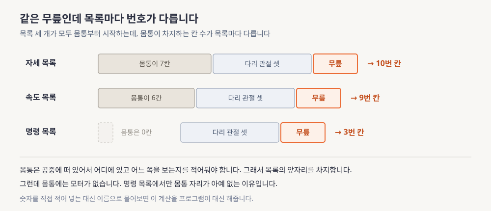

> 본문은 [lesson.md](lesson.md)입니다. 이 문서를 먼저 읽으세요.

# 시뮬레이터 부트캠프 쉽게 먼저

> **한 문장으로**: 컴퓨터 안에 만들어 놓은 가짜 로봇이 어떻게 진짜처럼 움직이는지 그리고 그 로봇을 내 손으로 처음 움직여 보려면 무엇을 알아야 하는지를 그림으로 봅니다.

---

## 이 모듈이 답하는 질문 하나

사람 모양 로봇을 걷게 만들려면 수없이 넘어뜨려 봐야 합니다. 그런데 진짜 로봇은 수천만 원짜리이고 한 번 크게 넘어지면 부품이 나갑니다. 그래서 사람들은 컴퓨터 안에 로봇과 바닥과 중력을 만들어 놓고 거기서 넘어뜨립니다. 이 모듈은 그 컴퓨터 안의 세계를 처음 열어보는 자리입니다.

> 컴퓨터 안에서 로봇을 움직인다는 것은 정확히 무슨 계산을 한다는 뜻일까요?

다 읽고 나면 그 안에서 도는 계산을 세 단계로 나눠 자기 말로 말할 수 있습니다. 그리고 왜 처음 해보는 사람이 물리가 아니라 엉뚱한 데서 하루를 날리는지도 알게 됩니다.

---

## 어떤 문제가 있었나

컴퓨터에게 로봇을 흉내 내라고 시키는 일 자체는 오래된 기술입니다. 공 하나를 던지면 어디에 떨어지는지 계산하는 것과 뿌리가 같습니다. 지금 어디에 있고 얼마나 빠른지를 알면 아주 짧은 시간 뒤에 어디에 있을지를 구할 수 있습니다. 그것을 계속 이어 붙이면 움직임이 됩니다.

그런데 사람 모양 로봇은 공 하나가 아닙니다. 서른 개쯤 되는 덩어리가 관절로 줄줄이 이어져 있습니다. 무릎을 굽히면 발끝만 움직이는 것이 아니라 몸 전체의 균형이 흔들립니다. 그래서 "이 덩어리가 얼마나 무거운가"라는 것이 숫자 하나로 끝나지 않고 지금 어떤 자세를 하고 있느냐에 따라 매번 달라지는 값이 됩니다.

더 큰 문제는 발이 땅에 닿는다는 것입니다. 공중에 떠 있을 때는 중력만 계산하면 되는데 발이 바닥에 닿는 순간 바닥이 발을 밀어 올리는 힘이 새로 생깁니다. 발을 떼면 그 힘은 사라집니다. 이 힘이 얼마인지는 미리 정해져 있지 않고 매 순간 새로 풀어야 하는 미지수입니다. 컴퓨터가 가장 오래 붙들고 있는 계산이 바로 여기입니다.

**읽는 법.** 위쪽 네모 넷을 왼쪽에서 오른쪽으로 따라간 다음, 마지막에서 첫 칸으로 돌아오는 주황 점선을 보세요. 이 한 바퀴가 0.002초이고 로봇이 1초 움직이는 것을 보려면 이 바퀴를 오백 번 돌립니다. 아래 두 칸은 공 하나를 떨어뜨리는 계산과 달라지는 지점 둘입니다.

정리하면 이렇습니다. 한 바퀴 안에서 힘을 모으고 그 힘으로 얼마나 빨라질지를 구하고 아주 짧은 시간을 곱해 자세를 갱신합니다. 그리고 그 결과를 다시 첫 칸에 넣습니다. 정확히는 [lesson.md](lesson.md) §1 「왜 이걸 배우나」에서 각 단계가 무엇을 하는지 봅니다.

---

## 그래서 무엇을 하나

계산 이야기는 여기까지입니다. 실제로 이 모듈에서 하는 일은 훨씬 손에 잡히는 것들입니다. 로봇의 설계도 파일을 열어보고, 그 안에서 왼쪽 무릎이 어디 있는지 찾고, 무릎에게 명령을 보내고 결과를 영상으로 뽑아냅니다. 그런데 이 네 가지에서 처음 해보는 사람이 반드시 걸려 넘어지는 지점이 둘 있습니다.

첫 번째는 번호입니다. 로봇 안에서 관절 하나를 가리키려면 번호를 써야 하는데 그 번호가 목록마다 다릅니다.

**읽는 법.** 세 줄을 위에서 아래로 읽으면서 왼쪽 회색 상자의 길이가 어떻게 줄어드는지 보세요. 자세를 적는 목록에서는 몸통이 앞자리 일곱 칸을 먹고 속도 목록에서는 여섯 칸을 먹고 명령 목록에서는 한 칸도 먹지 않습니다. 그 차이가 그대로 오른쪽 주황 칸의 번호 차이가 됩니다.

왜 몸통이 앞자리를 먹을까요. 사람 모양 로봇의 몸통은 땅에 고정돼 있지 않고 공중에 떠 있습니다. 그래서 지금 어디에 있고 어느 쪽을 보고 있는지를 따로 적어둬야 합니다. 그런데 몸통에는 모터가 달려 있지 않습니다. 몸통은 다리가 움직인 결과로 따라 움직일 뿐이라서 명령을 적는 목록에서만 몸통 자리가 통째로 빠집니다. 그래서 같은 무릎이 어떤 목록에서는 10번이고 다른 목록에서는 9번이고 또 다른 목록에서는 3번이 됩니다. 정확히는 [lesson.md](lesson.md) §5 「G1 모델 읽기」에서 이 번호를 손으로 계산해 봅니다.

여기서 하나 더 알아둘 것이 있습니다. 명령 목록에 넣는 값은 "이 관절을 얼마나 세게 밀어라"가 아니라 "이 관절을 몇 도로 만들어라"입니다. 힘을 직접 지정하는 것이 아니라 가고 싶은 각도를 말하면 모터가 지금 각도와의 차이를 보고 알아서 밀어줍니다. 목표에 가까워질수록 미는 힘이 저절로 약해집니다.

두 번째로 걸려 넘어지는 지점은 결과를 보는 방법입니다. 로봇을 움직였으면 눈으로 확인해야 하는데 계산을 돌리는 컴퓨터는 대개 멀리 있는 서버라 모니터가 달려 있지 않습니다.

**읽는 법.** 위쪽 회색 점선 상자가 안 되는 길이고 아래쪽 초록 상자가 되는 길입니다. 두 길은 세 번째 칸에서 갈립니다. 위는 창을 열려다 실패하고 아래는 창 없이 그림을 그려 숫자 덩어리로 받아둔 다음 영상 파일로 저장합니다.

이 방법에는 뜻밖의 장점이 하나 있습니다. 창으로 본 것은 지나가면 사라지지만 파일은 남습니다. 한 달 뒤에도 같은 장면을 다시 볼 수 있고 다른 사람에게 그대로 보여줄 수도 있습니다. 설정을 어디에 넣어야 하는지는 [lesson.md](lesson.md) §6 「화면 없이 렌더링하기」에 적어 두었습니다.

여기에 하나가 더 붙습니다. 이 모듈의 끝에서는 로봇이 스스로 걷는 법을 배우는 연습장을 열어봅니다. 다만 이번에는 실제로 학습시키지 않고 "오류 없이 켜지는지"만 확인합니다. 진짜 학습은 셋째 주의 일입니다.

---

## 오늘 만날 개념 5개

본문에서 계속 마주칠 말들입니다. 지금 외울 필요는 없고 한 번 만나두면 본문에서 처음 보는 말이 아니게 됩니다.

**1. 시뮬레이터**

지금 상태를 받아 아주 짧은 시간 뒤의 상태를 계산하는 일을 쉬지 않고 반복하는 프로그램입니다. 진짜 로봇을 부수지 않고 수천 번 넘어뜨려 보려고 씁니다. 이 과정에서 쓸 것은 설치가 명령 한 줄로 끝나고 화면 없이도 도는 종류입니다.

→ 제대로 배우는 곳은 [lesson.md](lesson.md) §1 「왜 이걸 배우나」입니다.

**2. 모델 파일**

로봇의 생김새와 무게와 관절과 모터를 적어둔 텍스트 파일입니다. 사람이 열어서 읽고 고칠 수 있는 형태라 로봇을 이해하는 출발점이 됩니다. 여기 적힌 숫자가 진짜 로봇과 어디서 어긋나는지를 아는 것이 이 모듈의 중요한 목표 하나입니다.

→ 자세한 것은 [lesson.md](lesson.md) §4 「MJCF에서 mp4까지」에 있습니다.

**3. 안 변하는 것과 변하는 것의 분리**

로봇의 생김새와 무게처럼 처음부터 끝까지 그대로인 것과, 지금 자세와 속도처럼 매 순간 바뀌는 것을 아예 다른 덩어리로 나눠 둡니다. 이렇게 해두면 로봇 하나를 놓고 상황만 수천 개 복제해 동시에 굴릴 수 있습니다. 셋째 주에 로봇을 여럿 한꺼번에 학습시킬 수 있는 것도 이 분리 덕분입니다.

→ 제대로 배우는 곳은 [lesson.md](lesson.md) §3 「MuJoCo의 계산 모델」입니다.

**4. 화면 없이 그림 뽑기**

창을 띄우지 않고 그림을 그려 숫자 덩어리로 받은 다음 영상 파일로 저장하는 방식입니다. 계산을 돌리는 컴퓨터에 모니터가 없기 때문에 필요합니다. 결과가 파일로 남으니 나중에 다시 보고 남에게 보여주기도 좋습니다.

→ [lesson.md](lesson.md) §6 「화면 없이 렌더링하기」에서 이어집니다.

**5. 흉내와 실물 사이의 틈**

컴퓨터 안의 로봇과 진짜 로봇은 같지 않습니다. 흉내 쪽 무릎은 아무리 세게 밀어도 지치지 않는데 진짜 무릎은 어느 힘 이상은 내지 못하고 흉내 쪽은 명령이 즉시 전달되는데 진짜는 늦게 도착합니다. 이 모듈의 마지막 일은 이 틈이 어디서 생기는지를 모델 파일 안의 숫자로 짚어보는 일입니다.

→ 제대로 배우는 곳은 [lesson.md](lesson.md) §5 「G1 모델 읽기」입니다.

---

## 이제 lesson.md로

여기서는 계산을 세 단계로 뭉뚱그렸고 번호가 왜 어긋나는지도 그림으로만 봤습니다. 본문에서는 그 자리마다 실제 숫자를 넣고 손으로 따라갑니다. 본문에는 셋이 더 있습니다.

- **숫자와 계산**: 자세 칸이 왜 36개이고 속도 칸이 왜 35개인지, 학습용 설정이 검증용보다 계산을 왜 마흔 배 덜 하는지, 모터가 내는 힘이 정확히 얼마인지를 [lesson.md](lesson.md) §3 「MuJoCo의 계산 모델」과 §5 「G1 모델 읽기」에서 직접 계산합니다
- **회사 스택 연결**: 여기서 다루는 로봇이 회사가 쓰는 그 하드웨어이고 명령을 넣는 칸 스물아홉 개가 상위 모델과 하위 제어기가 만나는 자리라는 이야기가 [lesson.md](lesson.md)의 「회사 스택 연결」에 있습니다
- **직접 돌려보는 것**: [`practice/`](practice/)에서 로봇을 불러 번호를 확인하고 사인파 명령을 넣어 영상을 뽑습니다. [`labs/`](labs/)에는 단계마다 무엇이 나와야 정상인지가 적혀 있습니다

더 파고 싶으면 [deep-dive.md](deep-dive.md)에 관절 서른 개 전체 표와 실기 스펙과 보상 항목 전량이 있습니다.

이 모듈에서 만드는 것은 지식이 아니라 작업 환경입니다. 앞으로 세 주의 실습이 전부 이 환경 위에서 돌아갑니다. 그래서 원칙이 하나 붙습니다. 환경이 안 돌아가는 상태로 다음 주로 넘어가지 않습니다.

읽는 순서는 `eli5.md`, `lesson.md`, `deep-dive.md`입니다. 이제 [lesson.md](lesson.md)로 갑니다.
