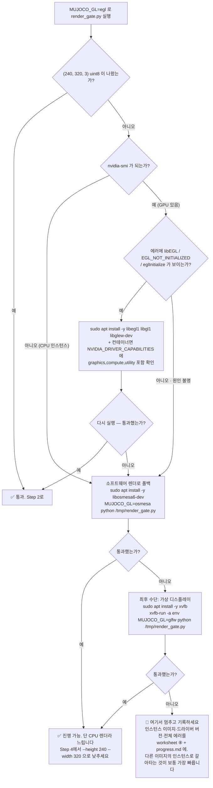

# W1-M2 랩 — 빈 인스턴스에서 "G1이 움직이는 mp4"까지

> **모듈**: W1-M2 · [`../lesson.md`](../lesson.md)
> **6단계 · 1일 (상한 1.5일) · GPU 불필요**
> 이 랩의 제출물은 [`worksheet.md`](worksheet.md)입니다. 시작 전에 사본을 하나 만들어 두세요.

이 랩은 **환경을 만드는 랩**입니다. W1-M1처럼 생각하는 랩이 아니라, 명령을 치고 출력을 확인하고 막히면 뚫는 랩입니다.
여기서 만든 인스턴스 위에서 **W2 LeRobot, W3 보행 학습, W4 DualMap이 전부 돕니다.** 그래서 이 모듈에만 1.5일이 배정돼 있습니다.

> 🔴 **이 모듈의 최우선 원칙 (마스터플랜 §12)**
> **"환경이 안 돌아가는 상태로 다음 주로 넘어가지 않는다."**
> 이론 진도보다 셋업 해결이 우선입니다. Step 1의 렌더링 관문이 안 뚫리면 Step 2로 가지 말고 §에러 표를 끝까지 파세요.
> 어디까지 되면 넘어가도 되는지는 [§0.5 통과 기준](#05-통과-기준--여기까지-되면-w1-m3로-넘어가도-된다)에 6개 체크박스로 못박아 뒀습니다.

---

## 0. 사전 준비 체크리스트

### 0.1 이 랩에 필요한 것 / 필요 없는 것

| 항목 | 필요 여부 | 비고 |
|---|---|---|
| **Ubuntu 22.04 계열 리눅스 인스턴스** | **필요** | SSH 접속 가능해야 함. 본문은 제공자 중립. 제공자별 절차는 [부록 A](#부록-a--제공자별-인스턴스-절차) |
| **퍼시스턴트 볼륨 1개** | **필요** | menagerie 2.3 GB + venv를 여기 둡니다. 인스턴스는 소모품 |
| **디스크 여유 20 GB 이상** | **필요** | 실측: menagerie 2.3 GB · `jaxlib` 339 MB · `mujoco` 74 MB + 나머지 의존성 |
| **Python 3.12 이상** | **필요** | `jax`가 `requires_python >= 3.12` (lesson §6.3) |
| **GPU** | **이 랩에서는 불필요** | Step 1~5 전부 CPU로 완주됩니다. 아래 0.2 참조 |
| NVIDIA 드라이버 | GPU 인스턴스면 있음 | 없어도 이 랩은 진행됨. `MUJOCO_GL` 폴백은 Step 1.4 |
| 디스플레이 / X11 / VNC | **불필요이자 금지** | 뷰어를 쓰지 않습니다. 결과는 전부 mp4/png (lesson §6.1) |
| Unitree G1 실기 | 불필요 | 4주 내내 불필요 |
| Isaac Sim / Isaac Lab | 불필요 | 이번 4주는 개념만 (lesson §2.3) |
| 인터넷 | 필요 | pip · git clone · menagerie 2.3 GB 다운로드 |

### 0.2 GPU가 꼭 필요한 단계는 어디인가 — 없다

시뮬 입문에서 가장 흔한 오해가 "로봇 시뮬레이션은 GPU가 있어야 한다"입니다. **이 모듈에서는 틀린 말입니다.**

| Step | 내용 | GPU 필수? | 근거 |
|---|---|---|---|
| 1 | 인스턴스 · venv · **렌더링 관문** | ❌ | `MUJOCO_GL=egl`은 GPU가 있으면 쓰고, 없으면 `osmesa`로 폴백 (Step 1.4) |
| 2 | `01_mujoco_basics.py` | ❌ | 1 DoF 진자. CPU 1분 이내 |
| 3 | `02_g1_inspect.py` | ❌ | 모델 로드 + 필드 조회. 물리 스텝조차 거의 없음 |
| 4 | `03_g1_sin_wave.py` | ❌ | **실측 27초** (6초 시뮬 + 180프레임 렌더). 물리는 CPU, 렌더만 EGL 경유 — `osmesa`로 폴백하면 렌더가 느려질 뿐 완주는 됩니다 |
| 5 | `04_playground_smoke.py` | ❌ **스모크는** | CPU JAX로 import·레지스트리·`reset`/`step` 전부 통과. 느릴 뿐 |
| — | **PPO 병렬 보행 학습** | ✅ **필수** | **W3-M1.** 이 모듈에서는 하지 않습니다 |

정리하면 이렇습니다.

- **GPU가 본격적으로 필요해지는 건 W3-M1부터**입니다. 부록 A 기준으로 W1~W2는 T4 / A10G / L4 한 장이면 충분하고, W3는 A10G / L4 / L40S급을 권장합니다. **A100 / H100은 이 4주 계획에 불필요합니다.**
- 그렇다고 **GPU 없는 인스턴스를 고르라는 뜻은 아닙니다.** W2·W3에서 같은 인스턴스를 계속 쓸 것이고, `MUJOCO_GL=egl`은 GPU가 있을 때 가장 순탄하기 때문입니다. 다만 "**이 랩이 안 되는 이유가 GPU 때문일 가능성은 거의 0**"이라는 것만 알아두세요. 렌더가 죽으면 GPU가 아니라 백엔드 문제입니다.
- CPU만 있는 저렴한 인스턴스에서 Step 1~4를 먼저 끝내고, Step 5부터 GPU 인스턴스로 갈아타는 것도 완전히 유효한 전략입니다. 퍼시스턴트 볼륨에 코드와 menagerie를 두면 갈아타는 비용이 거의 없습니다.

### 0.3 시간 예산

| Step | 내용 | 예상 소요 | 누적 | 성격 |
|---|---|---|---|---|
| 1 | 인스턴스 · venv · **렌더링 관문** | **60~120분** | 2h | ★ 여기가 본체. 막히면 여기서 막힙니다 |
| 2 | `01` MuJoCo 기초 | **40분** | 2h 40m | 실행 5분 + 출력 읽기 35분 |
| 3 | `02` G1 해부 + 워크시트 | **60분** | 3h 40m | 실행 1분 + **손으로 채우기 50분** |
| 4 | `03` G1 구동 + 영상 내려받기 | **60분** | 4h 40m | 실행 3분 + 그래프 읽기 + 심화 2개 |
| 5 | `04` playground 스모크 | **30분** | 5h 10m | 대부분 JAX 컴파일 대기 |
| 6 | 마무리 기록 (progress · glossary · 질문) | **40분** | **약 6시간** | 손 |

**총 6시간 = 1일치**입니다. lesson 정독(2h)을 합치면 하루가 꽉 찹니다.
Step 1에서 2시간을 넘기면 **1.5일 모드**로 전환하고, 넘어간 이유를 [`worksheet.md`](worksheet.md)에 적으세요. 그게 다음 인스턴스를 띄울 때의 자산이 됩니다.

> ⚠️ 위 소요는 **집필 환경 실측 + 입문자 여유분**입니다. 실행 시간 자체는 훨씬 짧습니다(전체 스크립트 실행 시간 합계 약 90초).
> 시간을 먹는 것은 실행이 아니라 **출력을 읽고 손으로 채우는 부분**입니다. 그게 이 랩의 목적이라 줄이지 마세요.

### 0.4 검증 환경

이 문서의 모든 출력 예시는 아래 환경에서 **직접 실행해 붙인 것**입니다.

| 항목 | 값 |
|---|---|
| 날짜 | **2026-08-01** |
| Python | **3.12.12** |
| `mujoco` | **3.11.0** |
| `numpy` | **2.5.1** |
| `playground` (import명 `mujoco_playground`) | **0.2.0** |
| `jax` | **0.11.0** (CPU 빌드) |
| 렌더 백엔드 | `MUJOCO_GL=egl` ✅ / `glfw` ✅ / `osmesa` ❌ (libOSMesa 미설치) |
| menagerie | `--depth 1` 클론 **2.3 GB** |

버전이 다르면 숫자가 조금 달라질 수 있습니다. **문서와 출력이 어긋나면 출력을 믿고**, 어긋난 지점을 워크시트 ⑧에 적으세요.

### 0.5 통과 기준 — 여기까지 되면 W1-M3로 넘어가도 된다

**이 6개가 전부 `[x]`면 다음 주로 넘어가도 됩니다.** 하나라도 비어 있으면 이론 진도보다 이걸 먼저 뚫으세요.

- [ ] **G1** — `MUJOCO_GL=egl`로 오프스크린 렌더가 되고 png/mp4가 파일로 저장된다 *(Step 1.3)*
- [ ] **G2** — `01_mujoco_basics.py`가 완주하고 `artifacts/W1-M2/`에 png 2장 + mp4 1개가 생겼다 *(Step 2)*
- [ ] **G3** — `02_g1_inspect.py --csv`가 인덱스 검증 29개를 통과하고 `joints_g1.csv`가 생겼다 *(Step 3)*
- [ ] **G4** — `03_g1_sin_wave.py --joints arms`의 mp4를 **내 눈으로 봤다** (로컬로 내려받든 VS Code로 열든) *(Step 4)*
- [ ] **G5** — `04_playground_smoke.py --steps 2`가 `action_size=29`를 찍고 **종료 코드 0**으로 끝났다 *(Step 5)*
- [ ] **G6** — `docs/progress.md`에 실행 로그를 남기고 **인스턴스를 정지했다** *(Step 6)*

> **G4가 이 모듈의 감정적 중심입니다.** 나머지는 전부 그걸 위한 준비입니다.
> mp4를 만들어놓고 못 보면 이 모듈은 절반만 끝난 것입니다 — Step 4.4에서 반드시 내려받으세요.

### 0.6 "붙여넣으면 되는 것" vs "판단이 필요한 것"

시뮬 첫 경험이면 이 구분이 없어서 시간을 태웁니다. 미리 갈라둡니다.

| | 그냥 붙여넣으세요 | 판단이 필요합니다 |
|---|---|---|
| **Step 1** | venv 생성, `pip install -r requirements.txt`, `git clone` | 어느 백엔드를 쓸 것인가(1.4 순서도), 볼륨을 어디에 마운트할 것인가 |
| **Step 2** | `python 01_mujoco_basics.py --smoke` | timestep 스윕 표에서 **어느 dt를 고를 것인가** |
| **Step 3** | `python 02_g1_inspect.py --csv` | 워크시트의 빈칸 — **여기는 손으로 채우는 게 목적** |
| **Step 4** | `--smoke` → `--joints arms` | `--freq`를 어디까지 올릴 것인가(심화 ①), `legs`가 넘어지는 걸 어떻게 해석할 것인가 |
| **Step 5** | `python 04_playground_smoke.py --steps 2` | CPU/GPU 판정 후 **지금 GPU를 붙일 것인가 W3까지 미룰 것인가** |

**판단 칸에서 막히면 그건 정상입니다.** 붙여넣기 칸에서 막히면 [§흔한 에러](#흔한-에러와-대처--10개)를 보세요.

### 0.7 설치와 인자 상세는 practice README에

설치 명령·인자 목록·결과 해석은 **[`../practice/README.md`](../practice/README.md)에 이미 정리돼 있습니다.**
이 랩 문서는 그걸 반복하지 않고 **"어떤 순서로, 어떤 출력이 나와야 정상인지"** 만 다룹니다. 두 문서를 나란히 열어두세요.

---

## Step 1 — 인스턴스와 headless 렌더링 관문 (60~120분) ★

**이 랩에서 가장 중요한 단계입니다.** 여기가 뚫리면 나머지는 명령 붙여넣기이고, 여기서 막히면 전부 막힙니다.
검증하는 lesson 절: [§6 headless 렌더링과 클라우드](../lesson.md).

전제로 잡는 환경은 이것 하나입니다.

> **Ubuntu 22.04 + NVIDIA 드라이버가 설치된 GPU 인스턴스, SSH 접속 가능, 퍼시스턴트 볼륨 1개.**

제공자별 생성 절차(RunPod / Lambda Labs / AWS g5)는 [부록 A](#부록-a--제공자별-인스턴스-절차)에 따로 뒀습니다.
제공자 UI는 자주 바뀌므로 **부록은 지도이고 정본은 각 제공자의 공식 문서**입니다.

### 1.1 접속 직후 확인 3개

```bash
ssh <user>@<instance-ip>

nvidia-smi                 # ① GPU와 드라이버
python3 --version          # ② 파이썬
df -h                      # ③ 디스크와 볼륨 마운트
```

**성공 판정 기준**

| 명령 | 이 출력이면 정상 | 아니면 |
|---|---|---|
| `nvidia-smi` | GPU 이름과 `Driver Version` / `CUDA Version`이 담긴 표가 뜬다 | **이 랩은 그래도 진행됩니다.** `command not found`면 CPU 인스턴스라는 뜻 — 1.4 순서도에서 `osmesa` 경로로 |
| `python3 --version` | **`Python 3.12.x` 이상** | 3.11 이하면 아래 1.2의 `uv` 경로를 쓰세요. `jax`가 3.12+를 요구합니다 |
| `df -h` | 퍼시스턴트 볼륨의 마운트 경로(`/workspace`, `/mnt/persistent` 등)가 보이고 **여유 20 GB 이상** | 마운트가 안 보이면 제공자 콘솔에서 볼륨 연결 확인. 여기서 넘어가면 인스턴스를 지울 때 전부 날아갑니다 |

> 📌 **볼륨 경로를 지금 정하고 적어두세요.** 이 문서는 `$WORK`로 부릅니다.
> RunPod는 보통 `/workspace`, Lambda는 `~` 또는 별도 파일시스템, AWS는 직접 마운트한 경로입니다.
>
> ```bash
> export WORK=/workspace          # ← 본인 볼륨 경로로 바꾸세요
> echo "export WORK=$WORK" >> ~/.bashrc
> ```

### 1.2 리포와 가상환경

```bash
cd $WORK
git clone <이 저장소 URL> physical-ai-study     # 이미 있으면 생략
cd physical-ai-study/course/w1-generative-core/02-simulator-bootcamp/practice

python3 -m venv .venv
source .venv/bin/activate
pip install -U pip
pip install -r requirements.txt
```

`python3`가 3.11 이하라면 `uv`로 3.12를 따로 잡습니다.

```bash
curl -LsSf https://astral.sh/uv/install.sh | sh
uv venv --python 3.12 .venv
source .venv/bin/activate
uv pip install -r requirements.txt
```

**성공 판정 기준**

```bash
which python                    # .../practice/.venv/bin/python 이어야 정상
python -c "import mujoco; print(mujoco.__version__)"
```

```
3.11.0
```

> ⚠️ **`.venv`는 반드시 퍼시스턴트 볼륨 안에** 만드세요. 인스턴스 로컬 디스크에 만들면 인스턴스를 지울 때 3 GB 넘는 설치를 다시 합니다.

### 1.3 ★ 렌더링 관문 — 여기가 통과되기 전에는 Step 2로 가지 마세요

`pip install`이 성공했다고 렌더가 되는 건 아닙니다. **물리 계산과 렌더링은 완전히 다른 경로**이고, 클라우드에서 죽는 쪽은 항상 렌더링입니다.
G1 같은 큰 모델로 확인하면 실패했을 때 원인이 모델인지 백엔드인지 구분이 안 되니, **가장 작은 모델로 먼저** 확인합니다.

```bash
cat > /tmp/render_gate.py <<'PY'
import os
os.environ.setdefault("MUJOCO_GL", "egl")     # 반드시 import mujoco 보다 먼저
import mujoco, imageio

XML = """
<mujoco>
  <worldbody>
    <light pos="0 0 3"/>
    <geom type="plane" size="2 2 .1"/>
    <body pos="0 0 1"><joint type="hinge" axis="0 1 0"/>
      <geom type="capsule" size=".04 .3" rgba=".2 .6 .9 1"/></body>
  </worldbody>
</mujoco>
"""
m = mujoco.MjModel.from_xml_string(XML)
d = mujoco.MjData(m)
mujoco.mj_forward(m, d)

r = mujoco.Renderer(m, 240, 320)              # (height, width) 순서 주의
r.update_scene(d)
px = r.render()
r.close()

print("backend :", os.environ["MUJOCO_GL"])
print("frame   :", px.shape, px.dtype)
imageio.imwrite("/tmp/render_gate.png", px)
print("saved   : /tmp/render_gate.png")
PY

python /tmp/render_gate.py
```

**성공 판정 기준 — 이 세 줄이 정확히 나와야 합니다.**

```
backend : egl
frame   : (240, 320, 3) uint8
saved   : /tmp/render_gate.png
```

그리고 파일이 실제로 생겼는지도 봅니다.

```bash
ls -la /tmp/render_gate.png
```

```
-rw-r--r-- 1 user user 9721 ... /tmp/render_gate.png
```

크기는 환경마다 조금 다르지만 **0 바이트가 아니어야** 합니다. 0이면 렌더는 됐는데 저장이 실패한 것입니다.

> ✅ 여기가 통과하면 **이 랩의 가장 큰 산을 넘은 것**입니다. `(240, 320, 3) uint8`이 lesson §4.1 파이프라인의 ④ Renderer 블록에 적힌 그 배열이고,
> 나머지 스크립트는 전부 이 배열을 프레임으로 모아 mp4로 묶을 뿐입니다.

> ⚠️ 스크립트가 끝난 뒤 `Exception ignored in: <function Renderer.__del__ ...>` + `EGLError`가 따라 나오는 경우가 있습니다.
> **무해합니다.** `saved :` 줄이 찍혔으면 파일은 정상입니다 (에러 표 E1).

### 1.4 실패했다면 — `MUJOCO_GL` 백엔드 결정 순서도



**집필 환경 실측 결과가 이 순서도의 근거입니다.**

| `MUJOCO_GL` | 결과 | 판단 |
|---|---|---|
| `egl` | ✅ 렌더 성공. 종료 시 `Exception ignored in:` EGL traceback만 따라옴 | **클라우드 GPU 인스턴스의 기본값.** 4주 내내 이것 |
| `glfw` | ✅ 성공 — **단 디스플레이가 있는 환경에서만**(집필 환경은 WSLg `DISPLAY=:0`) | 클라우드에서는 해당 없음. `Xvfb`와 함께 쓸 때만 |
| `osmesa` | ❌ `AttributeError: 'NoneType' object has no attribute 'glGetError'` — `libOSMesa` 미설치 | `sudo apt install -y libosmesa6-dev` 후 재시도. 소프트웨어 렌더라 느림 |

세 백엔드의 의미는 [lesson §6.2](../lesson.md)에 정리돼 있습니다. 랩에서 기억할 것은 두 가지입니다.

1. **`MUJOCO_GL`은 `import mujoco` 이전에 설정돼야 합니다.** 백엔드가 import 시점에 결정되므로 나중에 `os.environ`을 바꿔도 소용없습니다 (에러 표 E6).
2. **`osmesa`로 폴백해도 이 랩은 완주됩니다.** 물리 계산은 어차피 CPU이고, 느려지는 건 렌더뿐입니다. `--no-video`로 그래프만 뽑는 경로도 있습니다.

### 1.5 tmux — 장시간 작업 대비

지금은 30초짜리 스크립트만 돌리지만, **W3에서는 몇 시간짜리 학습을 돌립니다.** SSH가 끊기면 학습도 죽습니다. 지금 손에 익혀두세요.

```bash
tmux new -s pai            # ① 세션 만들기 (-s = 이름)
#   Ctrl+b 를 누르고 손을 뗀 뒤 d          ② 떼어내기(detach) — 세션은 계속 돕니다
tmux attach -t pai         # ③ 다시 붙기
```

이 셋이면 충분합니다. **성공 판정**: `tmux attach -t pai` 후 프롬프트 하단에 초록 상태줄이 보이고, SSH를 끊었다 다시 붙어도 아까 돌리던 것이 살아 있습니다.

```bash
tmux ls                    # 살아 있는 세션 목록
```

```
pai: 1 windows (created ...) [80x24]
```

### 1.6 Step 1 통과 판정

- [ ] `python -c "import mujoco; print(mujoco.__version__)"` → `3.11.0`
- [ ] `/tmp/render_gate.py`가 `(240, 320, 3) uint8`을 찍고 png를 저장
- [ ] `df -h`에서 퍼시스턴트 볼륨 여유 20 GB 이상
- [ ] `tmux new -s pai` → detach → attach 왕복 성공
- [ ] 사용한 백엔드를 워크시트에 기록 (`egl` / `osmesa` / `glfw+Xvfb`)

---

## Step 2 — MuJoCo 기초 (40분)

검증하는 lesson 절: [§3 MuJoCo의 계산 모델](../lesson.md) · [§4.1 MJCF→mp4 파이프라인](../lesson.md).

### 2.1 명령

```bash
cd $WORK/physical-ai-study/course/w1-generative-core/02-simulator-bootcamp/practice
source .venv/bin/activate

MUJOCO_GL=egl python 01_mujoco_basics.py --smoke     # 먼저 스모크 (수 초)
MUJOCO_GL=egl python 01_mujoco_basics.py             # 그 다음 전체 (1분 이내)
```

### 2.2 성공 판정 기준

**① `mjModel` / `mjData` 표가 두 개 뜹니다.** 1 DoF 진자이므로 값이 전부 1입니다.

```
=== [mjModel] 상수 — 컴파일 결과, 매 스텝 변하지 않음 ===
        필드         |     값      |             의미
---------------------+-------------+------------------------------
nq  (일반화 좌표 수) |           1 | qpos의 길이
nv  (자유도 수)      |           1 | qvel/qacc/힘 벡터의 길이
nu  (액추에이터 수)  |           0 | ctrl의 길이
```

**② 운동방정식 잔차가 0입니다. 여기가 첫 번째 assert 관문입니다.**

```
=== [3] 운동방정식 잔차 (lesson §3.3 eq.(1)) ===
  ||M*qacc + qfrc_bias - (qfrc_actuator + qfrc_passive + qfrc_applied + qfrc_constraint)||
    t=0.000 : 0.000e+00
    t=0.200 : 0.000e+00
  -> 0에 가까우면 eq.(1)의 각 항을 올바른 필드에 대응시킨 것이다. (assert 통과)
```

**③ timestep 스윕 표.** `--smoke` 실측값입니다(전체 모드는 적분 길이가 6초라 값이 커집니다).

```
적분기 | dt [s] | 스텝 수 | 벽시계 [ms] | |dE|/E0 (끝) | 각도 편차 [deg]
-------+--------+---------+-------------+--------------+----------------
Euler  | 0.0005 |   6,000 |        11.4 |     9.32e-05 |          +0.000
Euler  |  0.002 |   1,500 |         2.9 |     3.61e-04 |          -0.036
Euler  |  0.005 |     600 |         1.3 |     8.43e-04 |          -0.109
Euler  |   0.02 |     150 |         0.3 |     2.21e-03 |          -0.498
RK4    | 0.0005 |   6,000 |        28.5 |     6.55e-13 |          +0.000
...
  경험적 수렴 차수(Euler) = log-log 기울기 0.86
  경험적 수렴 차수(RK4) = log-log 기울기 4.06
```

> ⚠️ **벽시계 [ms]는 머신마다 다릅니다.** 판정할 것은 절대값이 아니라 **경향**입니다 — dt를 10배 키우면 스텝 수와 벽시계가 1/10로 줄고 에너지 오차는 커진다. 수렴 차수는 Euler ≈ 1, RK4 ≈ 3~4가 나오면 정상입니다.

**④ 렌더 경로 확인 + 저장.** 마지막 블록이 이렇게 끝나야 합니다.

```
=== [5] headless 렌더 (lesson §6) ===
  Renderer(m, 240, 320) -> render() shape=(240, 320, 3) dtype=uint8
[저장] /.../artifacts/W1-M2/01_pendulum_t0.png
  프레임 21장 (240x320) 렌더에 0.32s = 프레임당 15 ms
[저장] /.../artifacts/W1-M2/01_pendulum.mp4
```

**⑤ 파일 확인** (전체 모드까지 돌린 뒤)

```bash
ls -la ../../../../artifacts/W1-M2/
```

```
01_pendulum.mp4
01_pendulum_t0.png
01_timestep_study.png
```

**3개가 다 있으면 G2 통과입니다.**

### 2.3 확인 질문 (워크시트 ②에 기록)

1. **`nq = nv = 1`, `nu = 0`인 이유는?** hinge 관절 하나뿐이고 액추에이터가 없기 때문입니다. Step 3에서 G1은 `nq=36 / nv=35 / nu=29`가 됩니다 — **셋이 전부 달라지는 이유**를 지금 미리 예상해 적어보세요.
2. **timestep 스윕 그림 (a) 패널은 무엇을 그린 것인가?** 궤적 자체가 아니라 **가장 작은 dt 대비 각도 편차**입니다. 궤적을 겹쳐 그리면 전부 포개져서 아무것도 안 보이기 때문입니다. 여기서 읽어야 할 것은 **오차가 진폭이 아니라 위상으로 누적된다**는 것 — 봉투가 시간에 따라 커지는 모양입니다.
3. **(b) 패널의 에너지 오차는 어디서 왔는가?** 감쇠 0인 진자는 물리적으로 에너지가 보존되므로 **전부 수치 오차**입니다. 참값을 모를 때 오차를 재는 고전적인 수법이고, 제어 배경이면 익숙할 겁니다.
4. **세로 점선 두 개는 무엇인가?** G1 classic(`0.002`)과 MJX(`0.004`)의 위치입니다. **MJX가 어느 방향으로 이동했는지** 보세요. `timestep`을 줄이는 것이 항상 정답이 아니라는 것이 [lesson 「흔한 오해」](../lesson.md)의 두 번째 오해입니다.

### 2.4 선택 심화 — MuJoCo 공식 튜토리얼

마스터플랜 §5의 W1-M2 실습 2단계는 "공식 튜토리얼 노트북 1개 완주"를 요구합니다.
**`01_mujoco_basics.py`가 그 역할을 대체합니다** — MJCF 구조 / step 루프 / 렌더링이라는 세 요소를 같은 순서로, 다만 클라우드 headless 전제로 다시 쓴 것입니다.

시간이 남고 원본을 보고 싶으면 여기입니다.

| 자료 | URL | 주의 |
|---|---|---|
| MuJoCo 공식 문서 | https://mujoco.readthedocs.io/en/stable/overview.html | 계산 파이프라인·solver의 정본 |
| MJX 문서 | https://mujoco.readthedocs.io/en/stable/mjx.html | Step 5의 배경 |

> 🔴 공식 튜토리얼 노트북은 **Colab 기준이라 뷰어·인터랙티브 렌더 코드가 섞여 있습니다.** 그대로 인스턴스에 복사하면 죽습니다.
> 참고할 것은 API 사용법이지 실행 방식이 아닙니다. 그리고 **구버전 예제는 `data.qM`을 씁니다 — mujoco 3.11에서는 `data.M`입니다** (에러 표 E3).

---

## Step 3 — G1 로드와 해부 (60분)

검증하는 lesson 절: [§5 G1 모델 읽기](../lesson.md) — 특히 §5.2 세 변형 비교, §5.4 관절 인덱스, §5.5 액추에이터.

### 3.1 menagerie 클론 (2.3 GB)

G1 모델은 pip 패키지가 아니라 **git clone**입니다. 반드시 **퍼시스턴트 볼륨**에 두세요.

```bash
cd $WORK
git clone --depth 1 https://github.com/google-deepmind/mujoco_menagerie.git

export MENAGERIE_PATH=$WORK/mujoco_menagerie
echo "export MENAGERIE_PATH=$WORK/mujoco_menagerie" >> ~/.bashrc
```

`--depth 1`이 없으면 히스토리까지 받느라 훨씬 오래 걸립니다.

**성공 판정 기준**

```bash
du -sh $MENAGERIE_PATH
ls $MENAGERIE_PATH/unitree_g1/
```

```
2.3G	/workspace/mujoco_menagerie
```

```
CHANGELOG.md  LICENSE  README.md  assets  g1.png  g1.xml  g1_mjx.xml
g1_mjx_colliders.png  g1_with_hands.png  g1_with_hands.xml
scene.xml  scene_mjx.xml  scene_with_hands.xml
```

**모델 경로 규약** — 스크립트는 이 순서로 찾습니다 ([`../practice/README.md`](../practice/README.md) §1.2와 동일).

| 우선순위 | 방법 |
|---|---|
| 1 | `--menagerie /path/to/mujoco_menagerie` 인자 |
| 2 | 환경변수 `MENAGERIE_PATH` |
| 3 | (기본) 리포 루트 기준 `repos/mujoco_menagerie` |

볼륨에 뒀다면 **2번(`MENAGERIE_PATH`)이 정답**입니다. 인스턴스를 갈아도 그대로 살아남습니다.

### 3.2 실행

```bash
cd $WORK/physical-ai-study/course/w1-generative-core/02-simulator-bootcamp/practice

MUJOCO_GL=egl python 02_g1_inspect.py --smoke     # 먼저 (수 초)
MUJOCO_GL=egl python 02_g1_inspect.py --csv       # 전체 + CSV 저장
```

### 3.3 성공 판정 기준

**① 세 변형 비교 표가 lesson §5.2와 일치합니다.**

```
    항목      |     scene.xml      |   scene_mjx.xml    | scene_with_hands.xml
--------------+--------------------+--------------------+---------------------
nq            |                 36 |                 36 |                   50
nv            |                 35 |                 35 |                   49
nu            |                 29 |                 29 |                   43
...
timestep      |              0.002 |              0.004 |                0.002
iterations    |                100 |                  5 |                  100
키프레임      |              stand |   home, knees_bent |                stand

  ✅ lesson §5.2 표와 전부 일치합니다.
```

**② `nq ≠ nv` 유도가 손계산과 맞습니다.**

```
=== [2] nq != nv 유도 — scene.xml (lesson §3.4) ===
  관절 구성: free 1 · hinge 29 · slide 0 · ball 0  (합계 njnt=30)
  nq = 7*1 + 1*29 = 36   (실측 36)
  nv = 6*1 + 1*29 = 35   (실측 35)
  nu = 29  (자유 관절에는 액추에이터가 없다)        (실측 29)
  nq - nv = 1 = free joint 개수. 쿼터니언(4)이 각속도(3)보다 한 칸 길기 때문.
```

**③ ★ 인덱스 규칙 검증 29개 통과 — 이 줄이 Step 3의 핵심 판정입니다.**

```
  ✅ 구동 관절 29개 전부 규칙을 만족합니다.
```

**④ CSV가 생겼습니다.**

```bash
wc -l ../../../../artifacts/W1-M2/joints_g1.csv
head -3 ../../../../artifacts/W1-M2/joints_g1.csv
```

```
31 .../artifacts/W1-M2/joints_g1.csv
```

**31줄 = 헤더 1 + 관절 30행**(free 1 + hinge 29)입니다. 컬럼은 14개입니다.

```
jnt_id,name,type,qpos_adr,dof_adr,ctrl_id,range_lo,range_hi,kp,kv,m_eff,chain,body,parent_body
```

**⑤ 액추에이터 게인 표.**

```
       액추에이터         | kp  |  kv (실측)  | M_eff = (kv/2ζ)²/kp  [kg·m²]
--------------------------+-----+-------------+-----------------------------
left_hip_pitch_joint      | 500 | 43.01068276 |                       0.9250
left_knee_joint           | 500 | 15.84701068 |                       0.1256
left_shoulder_pitch_joint | 500 | 16.72533692 |                       0.1399
left_elbow_joint          | 500 |  9.42912002 |                       0.0445
  전체 29개: kv ∈ [4.553, 43.011],  M_eff ∈ [0.0104, 0.9250] kg·m²  (최대/최소 비 89배)
```

**⑥ 센서 4개, `sensordata` 길이 12.**

```
  nsensor=4,  sensordata 길이=12 (= 합계 12)
  관절 엔코더 센서는 없다 -> 관절각은 data.qpos[7:], 각속도는 data.qvel[6:]에서 직접 읽는다.
```

### 3.4 ★ 워크시트 — 이 랩의 제출물 중 하나

`joints_g1.csv`가 생겼으면 **[`../practice/g1_kinematic_tree_worksheet.excalidraw`](../practice/g1_kinematic_tree_worksheet.excalidraw)** 를 엽니다.
pelvis(root)에서 뻗어나가는 다섯 체인(왼다리 6 · 오른다리 6 · 허리 3→몸통 · 왼팔 7 · 오른팔 7)의 노드가 전부 **비어 있는 빈칸 워크시트**입니다.

| 방법 | 절차 |
|---|---|
| **excalidraw.com** | 파일을 로컬로 내려받은 뒤 [excalidraw.com](https://excalidraw.com) → 좌상단 햄버거 → `Open` |
| **VS Code Remote-SSH** | `Excalidraw` 확장(`pomdtr.excalidraw-editor`) 설치 후 파일 더블클릭 — 원격에서도 됩니다 (추천) |

```bash
# 로컬 터미널에서 (인스턴스가 아니라)
scp <user>@<instance>:$WORK/physical-ai-study/course/w1-generative-core/02-simulator-bootcamp/practice/g1_kinematic_tree_worksheet.excalidraw ./
scp <user>@<instance>:$WORK/physical-ai-study/artifacts/W1-M2/joints_g1.csv ./
```

**채우는 순서**

1. CSV를 옆에 띄우고, 각 노드에 **관절 이름 · `jnt` id · `qpos` adr · `ctrl` id** 를 손으로 적습니다.
2. 상단의 "확인할 규칙"·"차원 셈" 상자와 하단 확인 문항까지 채웁니다.
3. 다 채운 뒤 [lesson §5.4](../lesson.md) 표와 대조합니다.
4. 모르는 칸은 **물음표로 남기고**, 그 물음표를 [`../../../../notes/questions-for-team.md`](../../../../notes/questions-for-team.md)로 옮깁니다.

> 🔴 **정답이 미리 채워져 있지 않은 것이 의도입니다.** 손으로 한 번 적어보는 게 목적입니다.
> 인덱스를 잘못 짚어 팔 대신 다리가 움직이는 버그는 W3에서 반드시 한 번 만나고, 그때 이 30분이 몇 시간을 아껴줍니다.

**성공 판정 기준**: 다섯 체인 29개 노드가 전부 채워졌거나 `?`로 표시됐다. 빈 노드가 없다.

### 3.5 확인 질문 (워크시트 ③에 기록)

1. **`left_knee_joint`의 네 인덱스는?** `jnt` / `qpos` adr / `qvel` adr / `ctrl` id를 **CSV를 보기 전에 먼저 손으로** 적고 대조하세요.
   <details><summary>정답</summary>

   **jnt 4 / qpos 10 / qvel 9 / ctrl 3** — 네 개가 전부 다릅니다. 자유 관절이 `qpos`를 7칸, `qvel`을 6칸 먹는데 **액추에이터는 하나도 갖지 않기** 때문입니다 (lesson §5.4).
   </details>

2. **`kv`가 관절마다 다른 이유는?** MJCF는 `<position kp="500" dampratio="1"/>` 한 줄뿐인데 실측 `kv`는 43.01 / 15.85 / 16.73 / 9.43으로 제각각입니다.
   <details><summary>정답</summary>

   $k_v = 2\zeta\sqrt{k_p M_{\text{eff}}}$ 이고 $\zeta = 1$(임계감쇠)로 고정돼 있으므로, **관절마다 유효관성 $M_{\text{eff}}$가 다르면 `kv`도 달라집니다.** 실측 최대/최소 비가 **89배**(고관절 0.925 vs 손목 0.010 kg·m²)입니다. 전 관절에 같은 `kv`를 주면 어떤 관절은 과감쇠, 어떤 관절은 부족감쇠가 됩니다.
   </details>

3. **`forcerange = [0. 0.]`이 뜻하는 것은?** 그리고 이게 왜 sim2real 갭의 씨앗인가? (→ lesson §5.6 갭 #1)

4. **classic vs MJX 게인 비교 표에서 무엇이 바뀌었는가?** `kp` 500 → 20~75, `kv` 관절별 → 2 고정. **같은 로봇의 MJCF가 두 벌 존재한다는 것 자체가 sim2sim의 축소판**입니다 (lesson §3.5).

### 3.6 선택 심화 — 산술 규칙이 깨지는 모델

Step 3.3 ③에서 "29개 전부 통과"를 봤습니다. 그래서 `ctrl id + 7 = qpos adr` 산술을 믿고 싶어집니다. **믿으면 안 되는 증거를 직접 보세요.**

```bash
MUJOCO_GL=egl python 02_g1_inspect.py --variant scene_with_hands.xml --smoke
```

```
  ❗ 구동 관절 43개 중 **4개가 규칙을 벗어납니다.**
          관절            | ctrl id | 규칙이 예측하는 jnt/qpos/qvel | 실제 jnt/qpos/qvel
--------------------------+---------+-------------------------------+-------------------
right_hand_middle_0_joint |      41 |                  42 / 48 / 47 |       40 / 46 / 45
right_hand_middle_1_joint |      42 |                  43 / 49 / 48 |       41 / 47 / 46
right_hand_index_0_joint  |      39 |                  40 / 46 / 45 |       42 / 48 / 47
right_hand_index_1_joint  |      40 |                  41 / 47 / 46 |       43 / 49 / 48
  원인: MJCF의 <actuator> 선언 순서와 body 트리의 관절 순서가 다릅니다.
```

**회사 MJCF도 다를 수 있습니다.** 손으로 세지 말고 `mj_name2id` + `actuator_trnid`로 조회하는 습관을 여기서 만드세요.

---

## Step 4 — G1을 움직이기 (60분) ★

검증하는 lesson 절: [§5.4 인덱스](../lesson.md) · [§5.5 PD 위치 서보](../lesson.md) · [§6 headless 렌더](../lesson.md).

**"내가 로봇을 움직였다"는 첫 경험입니다.** 마스터플랜 §5가 이 단계를 그렇게 부릅니다.

### 4.1 순서 — 스모크 먼저

```bash
MUJOCO_GL=egl python 03_g1_sin_wave.py --smoke              # ① 수 초. 경로·렌더·인덱스 확인
MUJOCO_GL=egl python 03_g1_sin_wave.py --joints arms        # ② 본실행 (실측 27초)
MUJOCO_GL=egl python 03_g1_sin_wave.py --joints legs        # ③ 넘어집니다. 그게 핵심입니다 (실측 29초)
```

> ⚠️ `--smoke`는 시뮬 1.5초 / 프레임 23장이라 **위상 지연 값이 신뢰할 수 없습니다.** 스크립트가 직접 경고합니다.
> ```
>   ⚠️ 위상 적합 구간이 0.3주기뿐입니다(2주기 미만).
>      '지연 실측' 값은 신뢰할 수 없습니다 — --smoke를 빼거나 --seconds를 늘리세요.
> ```
> 스모크는 **"돌아가는가"** 만 보는 용도입니다. 숫자를 읽는 것은 ②부터.

### 4.2 성공 판정 기준

**① 설정 블록에서 인덱스가 맞는지 확인합니다.**

```
=== [1] 설정 ===
  키프레임 'stand' (id=0) → 골반 높이 0.790 m
  구동 관절군 'arms': 14개 / 전체 29개
    ctrl id 15~28 : left_shoulder_pitch_joint ... right_wrist_yaw_joint
    (lesson §5.4: ctrl id i ↔ qpos adr i+7 ↔ qvel adr i+6 ↔ jnt id i+1)
  명령: ctrl_i(t) = q_stand_i + 0.2*sin(2π*0.5*t), ctrlrange로 클립  [eq.(2)]
  ⚠️ ctrl은 토크가 아니라 목표 관절각[rad]입니다 (lesson §5.5).
```

**`ctrl id 15~28`이 팔입니다.** 여기가 `0~11`로 나오면 다리를 흔들고 있는 것입니다.

**② ★ PD 서보 식의 assert가 통과합니다.**

```
=== [2] 롤아웃 ===
  eq.(1) 잔차 max|kp(ctrl-q) - kv*qdot - actuator_force| = 1.634e-13
  -> 0이면 'ctrl은 목표 관절각'이 코드 수준에서 확인된 것 (assert 통과).
  ctrlrange 클립 발생: 0회  (--amp를 키우면 늘어납니다)
```

`1e-13` 수준이면 통과입니다. **이 한 줄이 lesson §5.5의 $f = k_p(\texttt{ctrl} - q) - k_v\dot q$ 를 코드로 확인한 것**이고,
그 식은 [W1-M1 §3.3](../../01-physical-ai-landscape/lesson.md)의 L1 계층 PD 서보와 글자 그대로 같은 식입니다.

**③ `--joints arms` — 넘어지지 않습니다.**

```
=== [4] 균형 ===
  골반 높이: 시작 0.790 m → 끝 0.792 m (최저 0.790 m)
  ✅ 넘어지지 않았습니다.
```

```
[저장] /.../artifacts/W1-M2/03_tracking_arms.png
[저장] /.../artifacts/W1-M2/g1_sin_arms.mp4   (180프레임 @ 30fps)
```

**mp4 180프레임 = 6초 × 30 fps**입니다. 프레임 수가 이것보다 훨씬 적으면 `--smoke`로 돌린 것입니다(23프레임 @ 15fps).

**④ `--joints legs` — 넘어집니다. 이것이 정답입니다.**

```
=== [4] 균형 ===
  골반 높이: 시작 0.790 m → 끝 0.062 m (최저 0.045 m)
  ❗ t=0.88s 에 넘어졌습니다 (골반 < 0.4 m).
     당연한 결과입니다. floating base 로봇을 붙잡아주는 것은 아무것도 없고,
     각 관절은 자기 목표각만 지킬 뿐 '넘어지지 않는다'는 목적을 모릅니다.
```

> 🔴 **이건 버그가 아닙니다.** 0.79 m → 0.06 m로 골반이 떨어진 것이 **정상 출력**입니다.
> 성공 판정은 "안 넘어지는 것"이 아니라 **"`legs`는 넘어지고 `arms`는 안 넘어지는 것"** 입니다.

**⑤ 파일 4개 확인**

```bash
ls -la ../../../../artifacts/W1-M2/03_tracking_*.png ../../../../artifacts/W1-M2/g1_sin_*.mp4
```

```
03_tracking_arms.png   03_tracking_legs.png
g1_sin_arms.mp4        g1_sin_legs.mp4
```

### 4.3 결과 해석 — 추종 오차 그래프를 읽는 법

`03_tracking_arms.png`는 4-panel입니다. **(d)가 가장 볼 만합니다.**

`--joints arms` 실측 표(전체 14개 중 유효관성 상하위 4개씩):

```
           관절            | M_eff [kg·m²] | w_n [Hz] | RMS오차 [mrad] | 최대오차 [mrad] | 지연 실측 [ms] | 지연 eq.(4) [ms]
---------------------------+---------------+----------+----------------+-----------------+----------------+-----------------
right_shoulder_pitch_joint |        0.1399 |      9.5 |          14.57 |           22.86 |          +32.7 |            +33.4
left_shoulder_roll_joint   |        0.0910 |     11.8 |          20.57 |           62.59 |          +37.3 |            +27.0
right_wrist_yaw_joint      |        0.0118 |     32.7 |           3.98 |            5.53 |           +8.9 |             +9.7
right_wrist_roll_joint     |        0.0104 |     35.0 |           3.71 |            5.07 |           +8.3 |             +9.1
```

| 보는 것 | 어디서 | 무엇을 판단하는가 |
|---|---|---|
| **(a) 목표(점선) vs 실제(실선)** | 거의 겹칩니다 | **당연합니다.** 명령이 0.5 Hz인데 서보 대역폭 $\omega_n = \sqrt{k_p/M_{\text{eff}}}$ 은 **9.5~35 Hz**입니다. 대역폭의 1/20 이하 명령이라 잘 따라갑니다 |
| **(b) 추종 오차** | **mrad 단위** | 어깨(수십 mrad) vs 손목(수 mrad). **유효관성이 크면 오차가 크다** |
| **(c) 골반 높이** | `arms`는 평평, `legs`는 절벽 | 이 그림 한 장이 "왜 RL 보행 정책이 필요한가"의 답 |
| **(d) 유효관성 vs 위상 지연** | eq.(4) 2차계 예측선을 **대체로** 따라감 | 아래 참조 |

**위상 지연 읽는 법 — 이것이 이 랩에서 가장 제어공학적인 부분입니다.**

1. **지연은 관성에 따라 단조 증가합니다.** 손목(0.0104 kg·m², 8.3 ms) → 어깨(0.1399, 32.7 ms). 관성이 13배면 지연이 약 4배. 2차계에서 $\omega_n \propto 1/\sqrt{M}$ 이므로 지연이 $\sqrt{M}$ 에 비례하는 것과 대체로 맞습니다.
2. **`지연 실측`과 `지연 eq.(4)`가 정확히 같지 않은 것이 정상입니다.** eq.(4)는 관절 하나를 떼어낸 1자유도 근사이고, 실제 $M(q)$는 자세에 따라 변하며 관절끼리 커플링돼 있습니다. **경향이 맞는지**를 보는 것이 목적입니다.
3. **좌우 대칭 관절인데 값이 다른 것도 정상입니다.** `left_shoulder_pitch`(+44.8 ms)와 `right_shoulder_pitch`(+32.7 ms)가 다릅니다 — 좌우 팔이 같은 위상으로 흔들리며 몸통을 통해 커플링되고, `stand` 자세가 완전 대칭이 아니기 때문입니다. **1자유도 근사의 한계를 보여주는 실물 증거**입니다.
4. **kp=500 위치 서보의 대역폭 감각**: $\omega_n = \sqrt{500/M_{\text{eff}}}$ [rad/s]. $M_{\text{eff}} = 0.14$면 약 60 rad/s ≈ **9.5 Hz**. 이게 "명령을 얼마나 빠르게 줘도 되는가"의 상한이고, W3에서 정책이 50 Hz로 명령을 뱉을 때 **왜 50 Hz면 충분한가**의 근거가 됩니다.

**`legs`가 넘어지는 것을 어떻게 읽어야 하는가** — 이것이 Step 4의 핵심 소득입니다.

> PD 서보는 **자기 관절각만** 지킵니다. "넘어지지 않는다"는 목적을 모릅니다.
> 29개 관절이 각각 완벽하게 자기 목표각을 추종해도(실제로 오차가 mrad 수준입니다) 전신은 넘어집니다.
> **전신의 균형을 목적함수에 넣어 푸는 것이 WBC**이고, 그걸 학습으로 얻는 것이 **W3-M1**이며,
> 회사 스택에서 그 자리에 있는 것이 **L2의 GEAR-SONIC / HOMIE** ★ 입니다.
> 즉 이 mp4 두 편(`arms` 성공 / `legs` 실패)이 **W3 전체의 문제 정의**입니다.

### 4.4 ★ mp4를 내 눈으로 보기 — 이 단계를 건너뛰지 마세요

클라우드에는 화면이 없습니다. **파일을 만들어놓고 못 보면 이 단계의 감동이 사라지고, 통과 기준 G4가 미달입니다.**
넷 중 편한 것 하나를 쓰세요.

| 방법 | 명령 / 절차 | 언제 |
|---|---|---|
| **(a) `scp`** | 아래 참조 | 가장 단순. SSH가 되면 항상 됨 |
| **(b) VS Code Remote-SSH** | 탐색기에서 mp4 우클릭 → `Download`. png는 클릭하면 에디터에 바로 뜸 | **추천.** 워크시트 편집도 같이 됨 |
| **(c) 제공자 파일 브라우저** | RunPod는 웹 UI의 파일 매니저, Lambda는 JupyterLab 파일 탭에서 다운로드 | 부록 A 참조 |
| **(d) 간이 HTTP 서버** | 아래 참조 | 포트포워딩이 되는 경우 |

```bash
# (a) 로컬 터미널에서 — 인스턴스가 아니라 본인 PC에서 칩니다
scp -r <user>@<instance>:$WORK/physical-ai-study/artifacts/W1-M2 ./W1-M2
open ./W1-M2/g1_sin_arms.mp4        # macOS. Linux면 xdg-open, Windows면 start
```

```bash
# (d) 인스턴스에서
cd $WORK/physical-ai-study/artifacts/W1-M2 && python -m http.server 8000
#   로컬에서:  ssh -L 8000:localhost:8000 <user>@<instance>
#   브라우저:  http://localhost:8000
```

> ⚠️ **mp4는 gitignore 대상입니다**(`.gitignore`의 `artifacts/**/*.mp4`). 커밋되지 않는 것이 정상입니다.
> 인스턴스를 지우면 사라지니, 남기고 싶으면 로컬로 내려받거나 W&B에 올리세요.

**성공 판정 기준 (G4)**: `g1_sin_arms.mp4`가 재생되고 **팔이 좌우로 흔들리며 로봇은 서 있다.** `g1_sin_legs.mp4`에서는 **로봇이 무너진다.**

### 4.5 심화 변형 과제 2개

#### 심화 ① `--freq`를 올려 추종이 무너지는 지점 찾기 (대역폭 실측)

$\omega_n = \sqrt{k_p/M_{\text{eff}}}$ 이 9.5~35 Hz라고 계산했습니다. **명령 주파수를 거기까지 올리면 실제로 무슨 일이 일어나는지** 직접 보세요.

```bash
MUJOCO_GL=egl python 03_g1_sin_wave.py --freq 1  --seconds 3 --no-video
MUJOCO_GL=egl python 03_g1_sin_wave.py --freq 2  --seconds 3 --no-video
MUJOCO_GL=egl python 03_g1_sin_wave.py --freq 5  --seconds 3 --no-video
MUJOCO_GL=egl python 03_g1_sin_wave.py --freq 10 --seconds 3 --no-video
```

`--no-video`를 붙이면 렌더를 건너뛰어 훨씬 빠릅니다(그래프는 나옵니다).

> ⚠️ `03_tracking_arms.png`가 **매번 덮어써집니다.** 비교하려면 실행 사이에 백업하세요.
> ```bash
> cp ../../../../artifacts/W1-M2/03_tracking_arms.png /tmp/track_f5.png
> ```

**먼저 손으로 예상하고** 워크시트 ⑤에 적은 뒤 돌리세요. `--freq 5` 실측입니다.

```
=== [3] 추종 오차와 위상 지연 (명령 5 Hz) ===
           관절            | M_eff [kg·m²] | w_n [Hz] | RMS오차 [mrad] | 지연 실측 [ms] | 지연 eq.(4) [ms]
---------------------------+---------------+----------+----------------+----------------+-----------------
right_shoulder_pitch_joint |        0.1399 |      9.5 |         202.27 |          +61.5 |            +30.8
right_shoulder_roll_joint  |        0.0910 |     11.8 |         223.84 |          +63.0 |            +25.5
right_wrist_yaw_joint      |        0.0118 |     32.7 |          38.43 |           +8.6 |             +9.7
right_wrist_roll_joint     |        0.0104 |     35.0 |          31.93 |           +7.2 |             +9.0
```

**관찰할 것 3가지**

1. **어깨 RMS 오차가 14.57 → 202.27 mrad로 약 14배** 뛰었습니다. 명령 주파수는 10배(0.5 → 5 Hz)입니다. 진폭이 0.2 rad = 200 mrad인데 오차가 202 mrad면 **거의 못 따라간다**는 뜻입니다 — $\omega_n = 9.5$ Hz에 명령 5 Hz면 대역폭의 절반이라 당연합니다.
2. **손목은 여전히 멀쩡합니다** (3.71 → 31.93 mrad). $\omega_n = 35$ Hz라 5 Hz는 아직 1/7입니다. **같은 로봇 안에서 관절마다 대역폭이 다르다**는 것이 눈에 보입니다.
3. **`지연 실측`이 `eq.(4)` 예측을 크게 넘어갑니다** (어깨 61.5 vs 30.8 ms). 2차계 근사가 대역폭 근처에서 깨지는 것이고, 익숙한 보드 선도 그대로입니다.

**기록할 것**: 어느 `--freq`에서 어깨의 RMS 오차가 **진폭 200 mrad의 절반(100 mrad)을 넘는가.** 그 값이 실측 대역폭의 대용치입니다. → 워크시트 ⑤

#### 심화 ② `--joints waist` — 넘어짐은 이분법이 아니다

`arms`는 안 넘어지고 `legs`는 0.88초 만에 넘어집니다. **그 사이에 무엇이 있는지** 보세요.

```bash
MUJOCO_GL=egl python 03_g1_sin_wave.py --joints waist --no-video
```

허리 3축(`waist_yaw` / `waist_roll` / `waist_pitch`, ctrl id 12~14)만 흔듭니다. 다리는 `stand` 자세로 고정입니다.

> 🔴 **먼저 예상하고 워크시트 ⑤에 적은 뒤 돌리세요.** 넘어질까요, 안 넘어질까요? 왜?

**실측 결과 — `waist`도 넘어집니다. 다만 `legs`보다 훨씬 늦게.**

```
  구동 관절군 'waist': 3개 / 전체 29개
    ctrl id 12~14 : waist_yaw_joint ... waist_pitch_joint

      관절        | M_eff [kg·m²] | w_n [Hz] | RMS오차 [mrad] | 지연 실측 [ms] | 지연 eq.(4) [ms]
waist_roll_joint  |        0.6971 |      4.3 |          33.15 |          +76.3 |            +74.3
waist_pitch_joint |        0.6201 |      4.5 |          33.58 |          +76.1 |            +70.1
waist_yaw_joint   |        0.2711 |      6.8 |          20.13 |          +46.5 |            +46.5

  골반 높이: 시작 0.790 m → 끝 0.062 m (최저 0.039 m)
  ❗ t=2.66s 에 넘어졌습니다 (골반 < 0.4 m).
```

**관찰 3가지 — 여기서 배우는 것이 심화 ①보다 큽니다**

1. **넘어지는 시각의 스펙트럼**: `arms` 안 넘어짐 → **`waist` t=2.66s** → `legs` t=0.88s.
   흔드는 관절이 발에서 멀수록, 그리고 흔들리는 질량이 작을수록 오래 버팁니다.
   **"넘어진다/안 넘어진다"의 이분법이 아니라 여유(margin)의 문제**라는 것이 이 세 실행의 소득입니다.
   제어 용어로는 안정/불안정의 판정이 아니라 **안정 여유가 얼마나 남았는가**의 문제입니다.

2. **허리가 이 모델에서 유효관성이 가장 큰 관절군입니다.** `waist_roll` 0.6971 kg·m² — 어깨(0.1399)의 5배, 손목(0.0104)의 67배.
   당연합니다. 허리를 움직이면 **상체 전체 + 양팔**이 따라 움직이니까요.
   그래서 대역폭도 가장 낮습니다(`w_n` 4.3 Hz vs 손목 35 Hz). **같은 `kp=500`인데 관절군마다 대역폭이 8배 차이**납니다.

3. **`지연 실측`과 `eq.(4)` 예측이 팔보다 훨씬 잘 맞습니다** (76.3 vs 74.3 / 76.1 vs 70.1 / 46.5 vs 46.5).
   허리 3축은 서로 축이 직교하고 아래쪽 체인이 고정돼 있어 **1자유도 근사가 잘 맞는 조건**입니다.
   팔에서 예측이 어긋났던 이유가 근사의 결함이 아니라 **커플링**이었다는 반증입니다.

**워크시트에 답할 것**: 왜 `arms`는 안 넘어지고 `waist`와 `legs`는 넘어지는가?
(힌트: 지지 다각형(support polygon)과 무게중심. 팔은 가볍고 몸통에 매달려 있어 무게중심을 크게 못 옮깁니다.
허리는 상체 전체를 기울여 무게중심을 발 밖으로 밀어냅니다. 다리는 **접촉 자체를 깹니다** — 발이 땅에서 떨어집니다.
셋의 차이는 "무게중심을 얼마나 옮기는가"와 "지지 다각형을 유지하는가"입니다.)

> 이 관찰이 **HOMIE** ★ 의 설계 근거와 이어집니다 — 하체는 RL로 균형을 학습하고 상체는 텔레옵으로 조종하는 분리 구조 (lesson 「회사 스택 연결」, W3-M3).
> 여기서 중요한 것은 **"상체는 흔들어도 안전하다"가 아닙니다.** 실측이 보여주듯 상체를 크게 흔들면 그것만으로도 넘어집니다.
> HOMIE의 요점은 **상체가 무엇을 하든 하체 정책이 그 외란을 흡수하도록 학습시키는 것**입니다.
> 이 실습에서 하체는 그냥 `stand` 자세로 굳어 있었을 뿐, 아무것도 흡수하지 않았습니다 — **그 빈자리가 W3-M1·M3에서 채워집니다.**

---

## Step 5 — playground 스모크 (30분)

검증하는 lesson 절: [§7 mujoco_playground 미리보기](../lesson.md).

> 🔴 **여기서 학습하지 않습니다.** PPO 병렬 보행 학습은 **W3-M1**입니다.
> 이 Step의 목표는 딱 하나 — **"W3에서 쓸 환경이 이 인스턴스에서 에러 없이 도는가."** 그게 확인되면 W1-M2는 끝입니다.

### 5.1 명령

```bash
MUJOCO_GL=egl python 04_playground_smoke.py --no-step     # ① 스펙만 (실측 5초, 캐시 따뜻할 때)
MUJOCO_GL=egl python 04_playground_smoke.py --steps 2     # ② reset/step 포함 (실측 10초, 캐시 따뜻할 때)
echo "EXIT=$?"
```

> ⚠️ **첫 실행은 훨씬 오래 걸립니다.** Warp 커널 캐시(`~/.cache/warp/`)와 JAX 캐시(`~/.cache/jax/`)가 비어 있으면
> `jax.jit(env.reset)` 첫 호출에 **수십 초**가 걸립니다. **멈춘 게 아닙니다.**
> LLM 서빙에서 첫 요청이 느린 것(웜업)과 같은 구조입니다. 스크립트가 대기 전에 안내 문구를 먼저 찍습니다.
>
> 실행 중 `Module ... load on device 'cpu' took ... (cached)` 같은 줄이 쏟아지는 것도 MuJoCo Warp 로그이고 정상입니다.

### 5.2 성공 판정 기준

**① JAX 백엔드 판정 — 여기서 CPU/GPU가 갈립니다.**

CPU라면:

```
An NVIDIA GPU may be present on this machine, but a CUDA-enabled jaxlib is not installed. Falling back to cpu.
...
=== [1] JAX 백엔드 ===
  jax 0.11.0   default_backend=cpu
  devices: [CpuDevice(id=0)]
  ⚠️ CPU JAX입니다. 이 스모크는 통과하지만 **본 학습(W3-M1)은 불가능**합니다.
     GPU 인스턴스에서: pip install -U 'jax[cuda12]'
```

**이 상태로도 Step 5는 통과합니다.** 대처는 5.3에서.

**② 등록된 환경 19개, G1·H1 태스크 4개.**

```
=== [2] 등록된 locomotion 환경 ===
  ALL_ENVS 개수 = 19  (lesson §7.2 기준 19)
  G1·H1 태스크 4개: ['G1JoystickFlatTerrain', 'G1JoystickRoughTerrain', 'H1InplaceGaitTracking', 'H1JoystickGaitTracking']
```

**③ ★ 스펙 표 — `action_size=29`와 `n_substeps=10`이 핵심 판정입니다.**

```
=== [3] G1JoystickFlatTerrain 스펙 (lesson §7.3) ===
           항목             |                      값
----------------------------+----------------------------------------------
observation_size            | {'privileged_state': (216,), 'state': (103,)}
action_size                 |                                            29
ctrl_dt (정책 주기)         |                              0.02 s  =  50 Hz
sim_dt (물리 주기)          |                            0.002 s  =  500 Hz
n_substeps = ctrl_dt/sim_dt |                                            10
episode_length              |                               1,000 정책 스텝
  = 시뮬 시간               |                                          20 s
  = 물리 스텝               |                                        10,000
action_scale                |                                           0.5
  ✅ n_substeps = 0.02 / 0.002 = 10  (정수 확인)
```

**`action_size = 29`가 Step 3에서 본 `nu = 29`와 같은 숫자**라는 것을 확인하세요. 액션 벡터의 각 원소가 어느 관절인지를 이미 알고 있는 상태입니다.

**④ 보상항 24개.**

```
=== [4] 보상항 24개 (lesson §7.5) ===
         그룹          | 개수 |                    항 = 가중치
-----------------------+------+----------------------------------------
추종 (Q의 역할)        |    2 | tracking_lin_vel=1, tracking_ang_vel=0.75
자세·안정              |    8 | orientation=-2, base_height=0, ... termination=-100
접촉·발                |    7 | feet_air_time=2, feet_clearance=0, ... collision=-0.1
정규화·비용 (R의 역할) |    7 | action_rate=0, dof_acc=0, energy=0, torques=0, ...
```

**가중치가 0인 항이 여럿**인 것도 눈여겨보세요 — 튜닝의 흔적입니다. LQR 비용함수 $J = \sum (x-x_{ref})^\top Q(x-x_{ref}) + u^\top R u$ 와 나란히 놓고 보는 것이 [lesson §7.5](../lesson.md)의 요점입니다.

**⑤ lesson 대조 + step 실행.**

```
=== [5] lesson §7.3 대조 ===
  ✅ lesson §7.3의 스펙과 전부 일치합니다.

=== [6] reset / step 타이밍 ===
  jax.jit(env.reset) 첫 호출 — 컴파일 포함. 캐시가 비어 있으면 CPU에서 수십 초. 기다리세요...
    -> 1.6 s
step | 소요 [ms] |  reward  | done | 골반 높이 [m] |    비고
-----+-----------+----------+------+---------------+------------
   1 |   1,559.0 | 0.029234 |    0 |        0.7633 | 컴파일 포함
   2 |   1,681.3 | 0.024857 |    0 |        0.7681 | 실행만
```

> `reward` 첫 스텝 **0.029234**는 lesson §7.3의 `0.02923353761434555`와 일치합니다(시드 고정).
> 값이 다르더라도 **`done = 0`이고 골반 높이가 0.7 m대면 정상**입니다 — GPU/버전에 따라 마지막 자리는 달라질 수 있습니다.

**⑥ ★ 종료 코드 0 — 이것이 W1-M2의 종료선입니다.**

```bash
MUJOCO_GL=egl python 04_playground_smoke.py --steps 2 > /tmp/pg.log 2>&1; echo "EXIT=$?"
```

```
EXIT=0
```

> 🔴 `EXIT=0`이면 **W1-M2 완료입니다.** `--steps` 값은 2든 3이든 상관없습니다(기본 3).
> "학습이 잘 되는가"는 여기서 묻지 않습니다. **"에러 없이 도는가"** 만입니다.

### 5.3 CPU가 나왔는데 GPU 인스턴스라면

`jax.devices()`가 `[CpuDevice(id=0)]`인데 `nvidia-smi`는 GPU를 보여준다면, **CPU jaxlib이 설치된 것**입니다.
`requirements.txt`의 `playground==0.2.0`이 CPU JAX를 함께 끌어오기 때문이고, **정상 동작입니다.**

```bash
pip install -U "jax[cuda12]"
export JAX_DEFAULT_MATMUL_PRECISION=highest      # Ampere 계열 공식 권장 (lesson §7.1)
echo 'export JAX_DEFAULT_MATMUL_PRECISION=highest' >> ~/.bashrc

python -c "import jax; print(jax.devices())"
```

```
[CudaDevice(id=0)]
```

> ⚠️ **미검증(GPU 필요)** — 집필 시점에 GPU JAX 경로는 실행 검증되지 않았습니다.
> 검증된 것은 CPU JAX 기준의 import · 레지스트리 조회 · `reset`/`step` 1회까지입니다.
> 실행 후 결과를 [`../../../../docs/progress.md`](../../../../docs/progress.md)에 기록하고 이 배지를 제거하세요.

**지금 GPU를 붙일 것인가 W3까지 미룰 것인가** — 판단이 필요한 지점입니다.

| 선택 | 근거 |
|---|---|
| **지금 붙인다** | W3에서 셋업 문제를 만나면 학습 시간까지 밀립니다. `jax[cuda12]`는 수 GB 다운로드라 미리 해두면 편합니다 |
| **W3까지 미룬다** | CPU 인스턴스로 W1~W2를 싸게 돌리는 전략이면 지금은 불필요합니다. 어차피 인스턴스를 갈아탈 예정이면 그때 하세요 |

어느 쪽이든 **Step 5의 통과 기준(G5)에는 영향이 없습니다.** CPU 스모크로 충분합니다.

### 5.4 확인 질문 (워크시트 ⑥에 기록)

1. **`n_substeps = 10`이 뜻하는 것은?** 정책이 명령을 갱신하지 않는 10 스텝(20 ms) 동안에도 물리는 계속 돕니다. [W1-M1 §4](../../01-physical-ai-landscape/lesson.md)의 action chunking과 같은 구조 — 느린 상위가 빠른 하위를 어떻게 끊김 없이 먹여 살리는가.
2. **`state (103,)`와 `privileged_state (216,)`는 왜 나뉘어 있는가? 배포되는 것은 어느 쪽인가?**
3. **보상 24개 중 `feet_air_time`·`feet_phase`가 특별한 이유는?** 접촉 이벤트에 걸려 **미분 불가능**합니다. 매끄러운 비용함수라면 MPC로 풀면 되지 그레이디언트 추정에 수백만 샘플을 쓸 이유가 없습니다. **그게 RL을 쓰는 진짜 이유**입니다 (lesson §7.5).

---

## Step 6 — 마무리 체크와 기록 (40분)

### 6.1 통과 기준 재확인

[§0.5](#05-통과-기준--여기까지-되면-w1-m3로-넘어가도-된다)의 6개를 여기서 다시 확인합니다.

```bash
# G1~G5 를 한 번에 확인
cd $WORK/physical-ai-study
ls -la artifacts/W1-M2/
```

기대 목록(mp4는 gitignore 대상이지만 파일은 있어야 합니다):

```
01_pendulum.mp4          01_pendulum_t0.png       01_timestep_study.png
03_tracking_arms.png     03_tracking_legs.png
g1_sin_arms.mp4          g1_sin_legs.mp4          joints_g1.csv
```

- [ ] **G1** — `MUJOCO_GL=egl`(또는 폴백)로 렌더 성공, png 저장 확인
- [ ] **G2** — `01_*` 3개 파일 존재
- [ ] **G3** — `joints_g1.csv` 31줄, 인덱스 검증 29개 통과
- [ ] **G4** — `g1_sin_arms.mp4`를 **눈으로 봤다**
- [ ] **G5** — `04_playground_smoke.py --steps 2`가 `EXIT=0`
- [ ] **G6** — 아래 6.2~6.5 완료 + **인스턴스 정지**

### 6.2 `docs/progress.md`에 실행 로그

[`../../../../docs/progress.md`](../../../../docs/progress.md)에 남길 것 — **여기 쌓인 실측값이 W3 자료의 입력이 됩니다.**

| 항목 | 예시 |
|---|---|
| 날짜 / 모듈 | `2026-08-__ (W1-M2 / simulator-bootcamp)` |
| 돌린 것 | Step 1~5, 스크립트 4종, 심화 ①② |
| 인스턴스 사양 | 제공자 / GPU / vCPU / RAM / 볼륨 크기 |
| 렌더 백엔드 | `egl` / `osmesa` / `glfw+Xvfb` |
| **막힌 지점** | ★ 가장 중요. 에러 표의 E번호와 해결에 걸린 시간 |
| 소요 시간 | Step별 + 합계 (계획 6시간 대비) |
| **GPU 비용** | 인스턴스 가동 시간 × 시간당 요금. **정지 시각도 함께** |
| 다음으로 넘길 미해결 항목 | 예: GPU JAX 미설치 → W3-M1 시작 전에 |

### 6.3 `notes/glossary.md`에 용어 5개

[`../../../../notes/glossary.md`](../../../../notes/glossary.md)의 **W1 섹션**에 `### W1-M2` 하위 절을 만들고 5개를 추가합니다.
**정의 한 줄 + 제어·ML·LLM 대응 비유**를 반드시 같이 적으세요(비유가 없으면 나중에 안 떠오릅니다).

후보(이 랩에서 실제로 만난 것들):

| 용어 | 힌트가 되는 대응 |
|---|---|
| `mjModel` / `mjData` | 상태공간 모델의 $(A,B,C,D)$ vs $x(t)$ |
| MJCF | 로봇의 "소스 코드". 컴파일하면 `mjModel`이 됨 |
| floating base | `nq ≠ nv`를 만드는 장본인. 과잉좌표 다양체 vs 접선공간 |
| `n_substeps` | 상위 루프와 하위 루프의 주기 비. action chunking의 홀드 |
| EGL / 오프스크린 렌더 | 관측 채널의 오프라인화 |
| 임계감쇠 `dampratio` | $k_v = 2\zeta\sqrt{k_p M_{\text{eff}}}$ |
| sim2sim | 학습 시뮬과 검증 시뮬을 분리하는 관문 |
| 비대칭 actor-critic | 관측기가 못 보는 상태를 학습 중에만 "안다고 치는" 것 |

### 6.4 `notes/questions-for-team.md`에 질문

[`../../../../notes/questions-for-team.md`](../../../../notes/questions-for-team.md)의 **W1 섹션**에 `M2-1` 형식으로 추가합니다.

**[lesson 「팀에 물어볼 것」](../lesson.md)의 5개 중 최소 3개를 옮기세요.** 우선순위가 가장 높은 셋:

| # | 질문 | 왜 지금 물어야 하는가 |
|---|---|---|
| 1 | **팀 표준 학습 환경은 무엇인가 — 시뮬레이터 · 클러스터 · 도커 이미지?** | 마스터플랜 §12가 "W1 중에 반드시 확인"이라고 못박은 항목. Isaac Lab + 사내 이미지가 표준이면 W3 실습 경로가 통째로 바뀌고 GPU 요구사항(RT 코어)도 달라집니다 |
| 2 | **회사 G1의 정본 로봇 모델 파일은 무엇인가?** menagerie `g1_29dof_rev_1_0`인가, 실기 구성(23 DoF)에 맞춘 사내 MJCF/URDF가 있는가 | **액션 벡터 차원이 여기서 결정됩니다.** 이 답이 나오기 전까지 이 랩은 "29 DoF 모델로 감각을 익힌 것"이지 "우리 로봇을 시뮬한 것"이 아닙니다 |
| 3 | **SDK 모터 번호 ↔ MJCF 관절 인덱스 매핑표가 사내에 있는가?** | 이 표가 없으면 sim2sim에서 **관절이 뒤바뀐 채 도는** 버그를 각자 다시 발견하게 됩니다. Step 3.6에서 손가락 4개가 규칙을 벗어나는 것을 이미 봤습니다 |

**+ 본인이 이 랩을 돌면서 새로 생긴 질문**을 최소 1개 추가하세요. 워크시트 ⑨에 후보를 모아두었다가 옮깁니다.

### 6.5 `docs/course-plan.md` 체크박스

[`../../../../docs/course-plan.md`](../../../../docs/course-plan.md)의 W1-M2 산출물 체크박스를 갱신합니다.

### 6.6 🔴 인스턴스 정지했는가

**이 랩의 마지막 명령입니다.** 논문 읽는 시간·워크시트 채우는 시간에 GPU를 켜두는 것이 4주 예산에서 가장 큰 낭비 항목입니다 (lesson §6.4).

- [ ] 퍼시스턴트 볼륨에 있어야 할 것이 다 있는가 — `mujoco_menagerie` / 리포 / `.venv`
- [ ] mp4를 로컬로 내려받았는가 (인스턴스와 함께 사라집니다)
- [ ] **인스턴스를 정지(stop)했는가** — 제공자별 방법은 [부록 A](#부록-a--제공자별-인스턴스-절차)
- [ ] 정지 시각을 `docs/progress.md`에 기록했는가

> ⚠️ **"정지(stop)"와 "종료(terminate)"는 다릅니다.**
> 정지는 디스크를 남기고 컴퓨트 요금만 멈춥니다(스토리지 요금은 계속). 종료는 인스턴스 자체를 지웁니다.
> **퍼시스턴트 볼륨이 인스턴스와 분리돼 있는지 확인하고 나서** 종료하세요. 제공자마다 다릅니다 — 부록 A의 "정지/종료" 열을 보세요.

---

## 결과 해석 가이드 — 어떤 출력을 보고 무엇을 판단하는가

| 보는 것 | 어디서 | 무엇을 판단하는가 |
|---|---|---|
| `frame : (240, 320, 3) uint8` | Step 1.3 | **렌더 경로 정상.** 이게 안 되면 나머지 전부 못 함 |
| `운동방정식 잔차 0.000e+00` | `01` 블록 [3] | eq.(1)의 각 항을 올바른 `mjData` 필드에 대응시켰다. **환경·설치 정상의 첫 증거** |
| 수렴 차수 Euler ≈ 1 / RK4 ≈ 3~4 | `01` 블록 [4] | 적분기가 제대로 동작. 벽시계는 머신마다 다르니 **경향만** 볼 것 |
| `✅ lesson §5.2 표와 전부 일치합니다` | `02` 블록 [1] | menagerie 버전이 문서와 같다. **다르면 문서가 아니라 출력을 믿을 것** |
| `✅ 구동 관절 29개 전부 규칙을 만족합니다` | `02` 블록 [4] | 이 모델은 "자유 관절 1 + hinge 나열" 구조. **단 `scene_with_hands.xml`은 4개가 깨짐**(3.6) |
| `M_eff` 최대/최소 비 **89배** | `02` 블록 [5] | `dampratio="1"`이 관절별 `kv`를 만들어내는 이유. 같은 `kv`를 주면 과/부족 감쇠 |
| `forcerange: [0. 0.]` | `02` 블록 [5] | **토크 제한 없음.** sim2real 갭의 첫 번째 씨앗 (lesson §5.6) |
| `잔차 1.634e-13` | `03` 블록 [2] | **`ctrl`이 토크가 아니라 목표 관절각**임을 코드로 확인 |
| `ctrlrange 클립 발생: 0회` | `03` 블록 [2] | 명령이 관절 한계 안에 있다. `--amp 2.0`으로 올리면 늘어남 |
| RMS 오차 [mrad] | `03` 블록 [3] | **유효관성이 크면 오차도 크다.** 어깨 수십 mrad vs 손목 수 mrad |
| `지연 실측` vs `지연 eq.(4)` | `03` 블록 [3] | **경향이 맞는지만** 볼 것. 정확히 맞지 않는 게 정상(1자유도 근사) |
| 골반 높이 0.790 → 0.062 m | `03 --joints legs` 블록 [4] | **버그 아님.** W3에서 RL 보행 정책이 필요한 이유의 실물 |
| `devices: [CpuDevice(id=0)]` | `04` 블록 [1] | CPU JAX. **스모크는 통과, 본 학습은 불가.** 5.3 참조 |
| `action_size = 29` | `04` 블록 [3] | Step 3의 `nu = 29`와 같은 숫자. **정책이 뱉는 액션의 정체를 이미 안다** |
| `n_substeps = 10` | `04` 블록 [3] | 정책 50 Hz / 물리 500 Hz. action chunking의 홀드 |
| 보상항 24개 + **가중치 0인 항** | `04` 블록 [4] | 튜닝의 흔적. W3-M1의 본론 |
| `EXIT=0` | Step 5.2 ⑥ | **W1-M2 종료선.** 여기까지면 다음 주로 넘어가도 됨 |

---

## 흔한 에러와 대처 — 10개

아래 항목의 에러 메시지는 **집필 환경에서 실제로 재현해 그대로 붙인 것**을 우선했습니다(E1·E2·E3·E5·E7·E8).

### E1. 종료할 때 EGL traceback이 뜬다 — **무해합니다**

```
Exception ignored in: <function Renderer.__del__ at 0x...>
Traceback (most recent call last):
  ...
OpenGL.raw.EGL._errors.EGLError: <exception str() failed>
```

| | |
|---|---|
| **원인** | 인터프리터 종료 시점의 EGL 컨텍스트 정리 순서 문제 |
| **대처** | **없습니다. 그대로 진행하세요.** |

`Exception ignored in:` 으로 시작하면 **파이썬이 이미 그 예외를 무시했다**는 뜻입니다. 프레임은 정상 저장돼 있습니다 — **`[저장] ...` 줄이 찍혔는지만 확인**하면 됩니다.
이 저장소의 스크립트는 전부 `renderer.close()`를 명시 호출해 이 경고를 줄여놨지만, 종료 시점에 따라 여전히 나올 수 있습니다 (lesson §6.2).

> 처음 보면 렌더가 실패한 줄 알고 30분을 태우기 좋은 지점입니다. **가장 흔한 시간 낭비 1위**라 맨 위에 뒀습니다.

### E2. `MUJOCO_GL=osmesa` → `glGetError` AttributeError

```
  File ".../OpenGL/raw/GL/_errors.py", line 4, in <module>
    _error_checker = _ErrorChecker( _p, _p.GL.glGetError )
                                        ^^^^^^^^^^^^^^^^
AttributeError: 'NoneType' object has no attribute 'glGetError'
```

| | |
|---|---|
| **원인** | `libOSMesa` 미설치. PyOpenGL이 라이브러리를 못 찾아 `None`을 반환 |
| **대처** | `sudo apt install -y libosmesa6-dev` 후 재시도 |

`sudo`가 없는 컨테이너면 Step 1.4 순서도의 `Xvfb` 경로로 가세요. **집필 환경에서 실제로 관찰된 실패**입니다.

### E3. `AttributeError: 'MjData' object has no attribute 'qM'`

```
AttributeError: 'mujoco._structs.MjData' object has no attribute 'qM'. Did you mean: 'M'?
```

| | |
|---|---|
| **원인** | **mujoco 3.11에서 질량행렬 필드가 `d.qM` → `d.M`으로 바뀌었습니다.** 검색으로 찾은 구버전 예제를 복붙하면 납니다 |
| **대처** | `d.M`을 쓰세요. 희소 저장이라 `d.M.shape == (341,)`(G1 기준)입니다 |

밀집 행렬이 필요하면 `mujoco.mj_fullM(m, d, dst)` — **이 시그니처도 구버전의 `mj_fullM(m, dst, qM)`에서 인자 순서가 바뀌었습니다.**
공식 튜토리얼 노트북·블로그 예제가 안 돌아가면 **가장 먼저 의심할 지점**입니다 (lesson §3.3).

### E4. `pip install mujoco_playground` → 그런 패키지가 없다

```
ERROR: Could not find a version that satisfies the requirement mujoco_playground (from versions: none)
ERROR: No matching distribution found for mujoco_playground
```

| | |
|---|---|
| **원인** | **PyPI 배포명은 `playground`, import 이름이 `mujoco_playground`입니다.** 배포명과 모듈명이 다른 흔치 않은 케이스 |
| **대처** | `pip install "playground==0.2.0"` |

PyPI 조회로도 확인됩니다(2026-08-01): `pypi.org/pypi/mujoco_playground/json` → **404**, `mujoco-playground` → **404**, `playground` → **200**.

반대로 `import playground`도 안 됩니다. `requirements.txt`를 쓰면 애초에 겪지 않지만, 손으로 설치하다 한 번은 밟습니다 (lesson §7.1).

### E5. menagerie 경로를 못 찾는다

```
[에러] mujoco_menagerie를 찾지 못했습니다: /tmp/nonexistent-menagerie
  해결: git clone --depth 1 https://github.com/google-deepmind/mujoco_menagerie.git repos/mujoco_menagerie
  또는: --menagerie <경로> / 환경변수 MENAGERIE_PATH 지정
```

| | |
|---|---|
| **원인** | 클론을 안 했거나, 볼륨에 클론해놓고 `MENAGERIE_PATH`를 안 걸었거나, 새 SSH 세션이라 `~/.bashrc`가 안 읽혔거나 |
| **대처** | `echo $MENAGERIE_PATH`로 먼저 확인 → 비었으면 Step 3.1 재실행 |

```bash
echo $MENAGERIE_PATH
ls $MENAGERIE_PATH/unitree_g1/scene.xml       # 이 파일이 보여야 정상
```

**스크립트가 친절하게 죽는 것이 의도**입니다. 조용히 다른 모델을 로드하는 것보다 낫습니다.

### E6. `MUJOCO_GL`을 `import mujoco` **뒤에** 설정해서 백엔드가 안 바뀐다

```python
import mujoco                          # ← 여기서 이미 백엔드가 결정됨
import os
os.environ["MUJOCO_GL"] = "egl"        # ← 아무 효과 없음
```

| | |
|---|---|
| **원인** | 렌더 백엔드가 **import 시점에** 결정됩니다 |
| **대처** | 환경변수를 먼저 설정하거나, 명령줄에서 `MUJOCO_GL=egl python x.py` |

```python
import os
os.environ["MUJOCO_GL"] = "egl"   # ← 반드시 먼저
import mujoco                      # ← 그 다음
```

**노트북이면 첫 셀에서, 그리고 이미 mujoco를 import한 커널이라면 커널 재시작 후에** 해야 합니다.
이 저장소 스크립트는 전부 `os.environ.setdefault("MUJOCO_GL", "egl")`가 import 위에 있어 명령줄에서 안 줘도 됩니다.

### E7. CPU jaxlib인데 GPU를 기대했다

```
An NVIDIA GPU may be present on this machine, but a CUDA-enabled jaxlib is not installed. Falling back to cpu.
```

```
  jax 0.11.0   default_backend=cpu
  devices: [CpuDevice(id=0)]
```

| | |
|---|---|
| **원인** | `playground==0.2.0`이 CPU JAX를 함께 끌어옵니다. **정상 동작**입니다 |
| **대처** | Step 5는 이대로 통과합니다. GPU가 필요해지는 건 W3-M1 |

```bash
pip install -U "jax[cuda12]"
export JAX_DEFAULT_MATMUL_PRECISION=highest
python -c "import jax; print(jax.devices())"     # [CudaDevice(id=0)] 이면 성공
```

### E8. JAX 첫 컴파일에서 멈춘 것처럼 보인다

```
  jax.jit(env.reset) 첫 호출 — 컴파일 포함. 캐시가 비어 있으면 CPU에서 수십 초. 기다리세요...
```

그리고 그 사이 이런 줄이 쏟아집니다.

```
Module ... load on device 'cpu' took ... (cached)
```

| | |
|---|---|
| **원인** | JAX의 추적 + XLA 컴파일. MuJoCo Warp 커널 로드 |
| **대처** | **기다리세요.** 멈춘 게 아닙니다 |

**캐시가 따뜻하면 1.6초, 비었으면 수십 초**입니다(실측). LLM 서빙의 웜업과 같은 구조입니다.
같은 머신에서 두 번째로 돌리면 `~/.cache/warp/`와 `~/.cache/jax/`가 따뜻해서 **"첫 호출 / 두 번째 호출" 비가 1에 가깝게 나올 수 있습니다 — 정상입니다.**

```
  첫 호출 / 두 번째 호출 = 0.9배
   -> 차이가 거의 없습니다. 커널 캐시가 이미 따뜻하면 컴파일 비용이 드러나지 않습니다.
```

> ⚠️ **캐시를 퍼시스턴트 볼륨에 두면** 인스턴스를 갈아도 웜업이 유지됩니다. 인스턴스를 자주 갈아탈 계획이면 고려하세요.

### E9. 디스크가 꽉 찬다

```
OSError: [Errno 28] No space left on device
```
또는 `pip install` 중간에 조용히 실패합니다.

| | |
|---|---|
| **원인** | menagerie **2.3 GB** + venv(`jaxlib` 339 MB · `mujoco` 74 MB + 나머지). 기본 볼륨이 20 GB면 빠듯합니다 |
| **대처** | 아래 |

```bash
df -h                                   # 어느 파티션이 찼는지 먼저
du -sh $MENAGERIE_PATH ./.venv ~/.cache/*
pip cache purge                         # pip 캐시 정리 (수 GB인 경우 있음)
```

**menagerie와 `.venv`를 퍼시스턴트 볼륨에 두는 것이 근본 대책**입니다. 루트 파티션이 아니라 볼륨 쪽 여유를 보세요.
`--depth 1` 없이 클론했다면 지우고 다시 받는 편이 빠릅니다.

### E10. 그림 라벨이 두부(□)로 깨진다 / 폰트 경고

```
[font] 경고: 한글 글리프를 가진 폰트를 찾지 못해 그림 라벨을 영문으로 폴백합니다.
```

| | |
|---|---|
| **원인** | 한글 글리프를 가진 폰트가 없음. **에러가 아닙니다** |
| **대처** | 그대로 진행해도 랩 완주에 지장 없습니다 |

한글로 뽑고 싶으면:

```bash
sudo apt install -y fonts-nanum
rm -rf ~/.cache/matplotlib      # 폰트 캐시를 지워야 새 폰트를 인식합니다
```

성공하면 경고 대신 이 줄이 뜹니다(집필 환경에서는 `Pretendard`가 잡혔습니다).

```
[font] 한글 폰트 사용: NanumGothic
```

`sudo`가 없는 컨테이너라면 `--ascii-labels`로 명시적 영문 렌더도 됩니다(`01`·`03`에서 지원).

---

## 부록 A — 제공자별 인스턴스 절차

> 🔴 **제공자 UI는 자주 바뀝니다.** 아래는 **지도**이고, 정본은 각 제공자의 공식 문서입니다.
> 화면이 아래와 다르면 문서 쪽을 믿고, 달라진 점을 [`worksheet.md`](worksheet.md) ⑧에 적어두세요.
>
> 🔴 **요금은 적지 않았습니다.** 시간당 단가는 GPU 종류·지역·수요에 따라 수시로 바뀝니다. **각 제공자의 공식 요금표에서 직접 확인하세요.**
> 여기서 말할 수 있는 것은 상대적 등급뿐입니다 — **T4 < L4 ≈ A10G < L40S < A100 < H100** 순으로 비싸고, **이 4주에는 T4~L40S 구간이면 충분합니다.**

**세 제공자 공통 원칙** (lesson §6.4 · 마스터플랜 부록 A)

1. 코드·데이터·체크포인트·menagerie·`.venv`는 **퍼시스턴트 볼륨**에. 인스턴스는 소모품
2. 버전 고정 venv 또는 도커 이미지로 재현성 확보
3. `MUJOCO_GL=egl`, 결과는 mp4/png
4. 장시간 작업은 tmux, 학습 로그는 W&B / TensorBoard
5. **스팟/프리엠티블 + 잦은 체크포인트**, 학습 없는 시간엔 정지, **주간 예산 상한을 먼저 정할 것**

### A.1 RunPod

| 단계 | 내용 |
|---|---|
| **인스턴스** | `Pods` → `Deploy` → GPU 선택(**RTX A4000 / L4 / A10 급이면 W1~W2 충분**) → 템플릿은 **PyTorch 계열 CUDA 이미지** 권장(드라이버·CUDA가 이미 있음) |
| **볼륨** | 배포 화면의 **Volume Disk** 크기를 **40 GB 이상**으로. 마운트 경로는 보통 **`/workspace`** — 여기가 `$WORK` |
| **접속** | Pod 상세의 `Connect` → SSH 명령 복사, 또는 `Connect to Jupyter Lab`(파일 다운로드에 편리) |
| **파일 받기** | JupyterLab 파일 탭에서 mp4 우클릭 → Download (Step 4.4의 (c)) |
| **정지 / 종료** | `Stop`(볼륨 유지, 컴퓨트 과금 중단 — 스토리지 과금은 계속) / `Terminate`(**볼륨까지 삭제될 수 있음 — 반드시 확인**) |
| **과금 단위** | 초 단위 과금. **Community Cloud는 저렴하지만 선점 가능**(스팟 성격) / Secure Cloud는 비싸고 안정적 |
| **공식 문서** | https://docs.runpod.io/ |

> ⚠️ RunPod의 `Terminate`는 볼륨 정책에 따라 데이터가 함께 사라집니다. **Network Volume을 별도로 만들어 붙이면** Pod를 지워도 데이터가 남습니다. 문서에서 "Network Volume"을 확인하세요.

### A.2 Lambda Labs

| 단계 | 내용 |
|---|---|
| **인스턴스** | `GPU Cloud` → `Launch instance` → **A10 / L4 / A100** 중 선택(이 4주는 **A10급이면 충분**). 이미지는 **Lambda Stack**(Ubuntu + 드라이버 + CUDA 사전 설치) |
| **볼륨** | 런치 화면에서 **Filesystem**을 생성해 붙임. 마운트 경로는 보통 **`/home/ubuntu/<fs-name>`** — 여기가 `$WORK` |
| **접속** | SSH 키를 런치 시 등록 → `ssh ubuntu@<ip>`. JupyterLab 링크도 제공 |
| **파일 받기** | `scp` 또는 JupyterLab 다운로드 |
| **정지 / 종료** | **Lambda는 "정지" 개념이 약합니다 — `Terminate`가 기본**입니다. 그래서 **Filesystem(퍼시스턴트)에 모든 것을 두는 것이 필수**입니다. Terminate 후 같은 Filesystem을 새 인스턴스에 붙이면 이어서 작업 가능 |
| **과금 단위** | 시간당(분 단위 프로레이션). **Filesystem은 인스턴스와 별도 과금** |
| **공식 문서** | https://docs.lambda.ai/ |

> ⚠️ **Lambda에서는 "잠깐 멈춰두기"가 사실상 안 됩니다.** 논문 읽는 4시간 동안 인스턴스를 켜두지 말고, **Terminate하고 나중에 새로 띄우는 것**이 정석입니다. 그래서 이 랩이 `MENAGERIE_PATH`와 `.venv`를 볼륨에 두라고 반복하는 것입니다.

### A.3 AWS g5 (EC2)

| 단계 | 내용 |
|---|---|
| **인스턴스** | EC2 → `Launch instance` → **`g5.xlarge`**(A10G 1장, W1~W3에 충분) → AMI는 **Deep Learning AMI (Ubuntu 22.04)** — 드라이버·CUDA 포함 |
| **볼륨** | 루트 EBS를 **100 GB 이상**으로 잡거나, 별도 EBS 볼륨을 만들어 붙이고 마운트. 별도 볼륨이 인스턴스 종료와 분리돼 안전합니다 |
| **접속** | `ssh -i <key>.pem ubuntu@<public-dns>`. 보안 그룹에서 22번 포트 허용 필요 |
| **파일 받기** | `scp -i <key>.pem` 또는 S3 경유 |
| **정지 / 종료** | **`Stop`**(EBS 유지, 컴퓨트 과금 중단 — **EBS 스토리지 과금은 계속**) / **`Terminate`**(인스턴스 삭제. 루트 EBS는 기본적으로 함께 삭제 — **`Delete on termination` 설정을 확인할 것**) |
| **과금 단위** | 초 단위(최소 60초). **스팟 인스턴스로 크게 절약 가능하나 중단 위험** → 잦은 체크포인트 필수 |
| **공식 문서** | https://docs.aws.amazon.com/ec2/ · https://aws.amazon.com/ec2/instance-types/g5/ |

> ⚠️ **`Stop`을 해도 EBS 요금은 계속 나갑니다.** 며칠 안 쓸 거면 볼륨만 스냅샷으로 남기고 지우는 편이 쌉니다.
> 그리고 **회사 클라우드 계정이 있으면 그것을 우선하세요**(마스터플랜 부록 A). 그 경우 사내 승인 절차·태그 정책·예산 알림 설정을 먼저 확인해야 합니다 → lesson 「팀에 물어볼 것」 질문 5.

### A.4 제공자 비교 요약

| | RunPod | Lambda Labs | AWS g5 |
|---|---|---|---|
| 셋업 난도 | **낮음** | 낮음 | 중간(보안 그룹·키·볼륨) |
| "정지"가 되는가 | ✅ Stop | ⚠️ 사실상 Terminate만 | ✅ Stop (EBS 과금 지속) |
| 퍼시스턴트 | Volume Disk / Network Volume | Filesystem (필수) | EBS |
| 선점 위험 | Community Cloud는 있음 | 낮음 | 스팟은 있음 / 온디맨드는 없음 |
| 이 4주에 적합한 등급 | RTX A4000 / L4 / A10 | A10 | `g5.xlarge` |
| 회사 계정 활용 | — | — | **있으면 여기 우선** |

**어느 것을 고르든 이 랩은 동일하게 돕니다.** Step 1.1의 세 확인 명령과 Step 1.3의 렌더링 관문만 통과하면 나머지는 제공자와 무관합니다.

---

## 다음

- 실습 코드 상세: [`../practice/README.md`](../practice/README.md)
- 이론 본문: [`../lesson.md`](../lesson.md)
- 제출물: [`worksheet.md`](worksheet.md)
- 다음 토픽: Diffusion 계보 DDPM → DiT *(예정: `../../03-diffusion-ddpm-dit/lesson.md`)*

> 📌 이 모듈의 진짜 산출물은 mp4 한 편이 아니라 **"내 손으로 로봇을 움직였고, 그 과정에서 무엇이 어긋났는지 안다"는 상태**입니다.
> 인덱스를 잘못 짚어 팔 대신 다리가 움직인 경험, 바닥 없는 `g1.xml`을 로드해 로봇이 낙하한 경험이 W3에서 시간을 아껴줍니다.
> **에러와 소요 시간을 [`../../../../docs/progress.md`](../../../../docs/progress.md)에 남기세요.**
