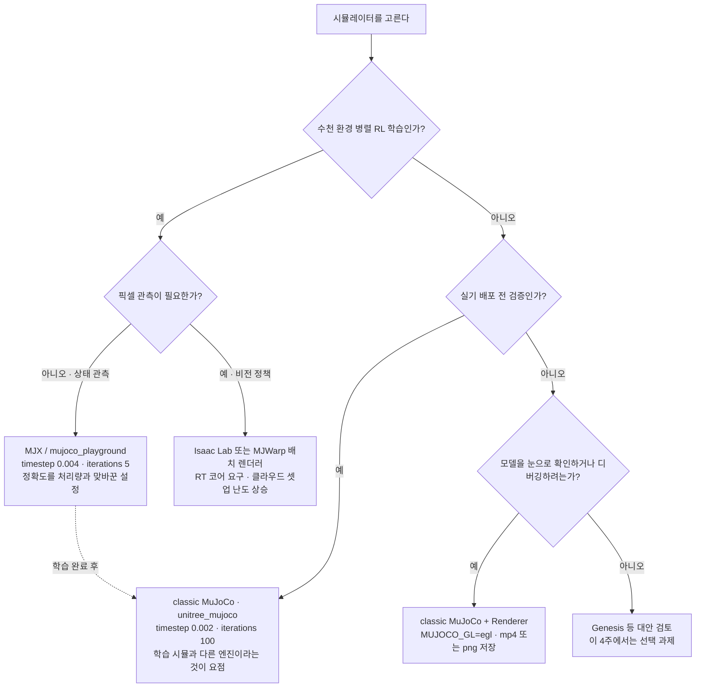
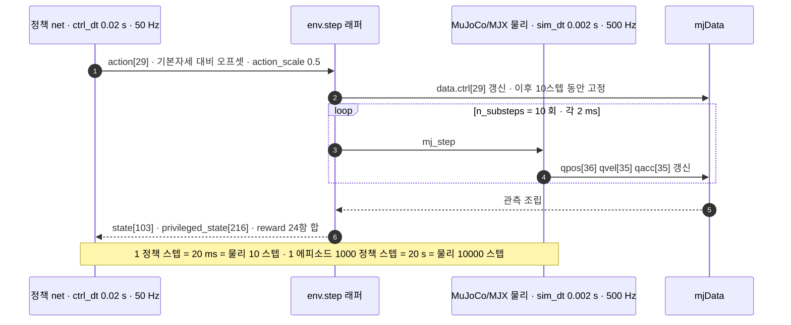
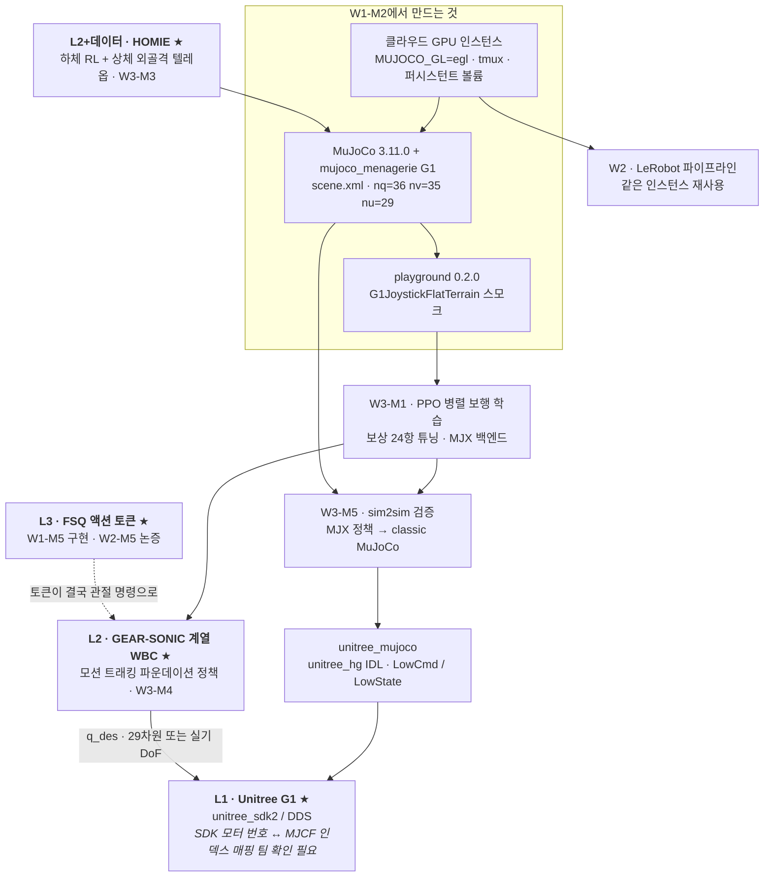

# 시뮬레이터 부트캠프: MuJoCo에서 G1을 움직이기까지

> **한 줄 요약**: 로봇 시뮬레이터가 결국 "발이 땅에 닿는 조건이 붙은 다물체 적분기"임을 확인하고, 휴머노이드 G1의 모델 파일을 관절 인덱스까지 열어본 다음, 화면 없는 컴퓨터에서 로봇이 움직이는 영상을 파일로 뽑아내기까지를 따라갑니다.

---

## 0. 이 모듈 지도

**오늘의 질문** 셋입니다.

- 한 스텝 동안 무슨 계산이 벌어지고, 그중 무엇이 이미 아는 이야기인가?
- 왼쪽 무릎을 움직이려면 어느 배열의 몇 번째 칸을 건드리는가?
- 화면 없는 원격 컴퓨터에서 결과를 어떻게 확인하는가?

| 절 | 무엇을 | 끝나면 할 수 있는 것 | 읽는 시간 |
|---|---|---|---|
| §1 | 왜 이걸 배우나 | 시뮬레이터를 내 배경 위에 얹어 읽기 | 2분 |
| §2 | 시뮬레이터 지형 | 여러 후보 중 무엇을 언제 쓸지 고르기 | 3분 |
| §3 | MuJoCo의 계산 모델 | 한 스텝의 계산을 코드 필드로 지목 | 5분 |
| §4 | MJCF에서 mp4까지 | 파일 하나가 영상이 되는 경로를 그리기 | 1분 |
| §5 | G1 모델 읽기 | 관절 하나를 인덱스로 정확히 짚기 | 6분 |
| §6 | 화면 없이 렌더링하기 | 원격 장비에서 결과를 파일로 남기기 | 4분 |
| §7 | 학습 스위트 미리보기 | 보행 학습 환경의 스펙을 읽기 | 5분 |
| 마무리 | 회사 스택 연결, 오해, 정리, 퀴즈 | 다음 모듈로 넘어갈 준비 확인 | 14분 |


**선수 지식**

| 알아야 할 것 | 어디서 채우나 | 이 문서가 대신 설명하는 것 |
|---|---|---|
| 관절 좌표와 다물체 동역학, 질량행렬 | 보유 배경으로 가정 | 각 항이 어느 코드 필드인지는 §3.3 |
| 위치 제어 서보와 임계감쇠 | 보유 배경으로 가정 | 서보 식은 §5.5에서 한 줄 재진술 |
| 수치적분과 뻣뻣한 시스템 | 보유 배경으로 가정 | 적분기 선택은 §3.5 |
| 계층 구조와 주파수 예산 | [W1-M1](../01-physical-ai-landscape/lesson.md) | §7.4에서 그대로 회수 |
| 시뮬레이터 실무, 모델 파일, 원격 렌더링 | **가정하지 않음** | §2부터 §6까지 처음부터 |

`prereq`가 하나인 것은 앞선 모듈이 하나라는 뜻이지 배경 지식이 필요 없다는 뜻이 아닙니다. 앵커로 쓰는 개념은 그 자리에서 다시 말합니다.

**완료 기준**: 클라우드 인스턴스에서 G1을 로드해 sin파 명령으로 팔다리를 흔든 mp4를 `artifacts/W1-M2/`에 저장하고 `mujoco_playground`의 `G1JoystickFlatTerrain`이 에러 없이 1스텝 도는 것까지 확인한 다음, 그 과정에서 만난 에러와 소요 시간을 `docs/progress.md`에 기록할 수 있다.

**소요**: 이론 2h / 실습 4~6h (시뮬 첫 경험이므로 Day 3 오전까지 허용)

> 📌 **여기까지 정리**
> - 이 모듈은 지식이 아니라 **인프라**다. W2와 W3 실습이 이 환경 위에서 돈다
> - 세 질문에 §3, §5, §6이 답한다
> - 산출물은 mp4와 "무엇이 어긋났는지 안다"는 상태다

---

## 1. 왜 이걸 배우나

| 용어 | 한 줄 정의 | 제어·LLM 비유 |
|---|---|---|
| **시뮬레이터** | 모델과 입력을 받아 수치적분으로 다음 상태를 뽑는 것을 반복하는 프로그램 | 직접 짠 적분 루프와 구조가 같다 |
| **다물체** | 링크 여러 개가 관절로 이어진 계. 질량행렬이 자세에 따라 변한다 | 상수 질량행렬이 상태 의존 행렬로 바뀐 것 |
| **접촉** | 발이 땅에 닿는 순간 생겼다 떨어지면 사라지는 제약 | 차수가 시간에 따라 바뀌는 하이브리드 동역학 |
| **MJCF** | MJCF(MuJoCo XML Format). 로봇과 장면을 기술하는 모델 파일 형식 | 플랜트 모델을 텍스트로 적어둔 것 |
| **sim2sim** | 학습한 시뮬레이터가 아닌 다른 시뮬레이터에서 정책을 다시 검증하는 관문 | 동일 모델로 재시뮬하는 것을 검증이라 부르지 않는 그 규율 |

### 1.1 절반은 이미 아는 이야기다

시뮬레이터 안의 일은 익숙합니다. 모델을 세우고 상태를 초기화하고 입력을 넣고 수치적분으로 다음 상태를 뽑는 것을 반복합니다. 새로 얹히는 것은 **다물체**와 **접촉** 둘뿐이고, 다물체는 질량행렬이 $M(q)$로 자세마다 바뀐다는 규모 문제입니다.

**접촉**이 진짜 새로운 것입니다. 발이 닿는 순간 제약이 생겼다 떼면 사라지고 접촉력은 매 스텝 풀어야 하는 미지수입니다. MuJoCo에서 가장 비싼 계산이고 `solver iterations`가 있는 이유입니다. 나머지는 아는 이야기라 §3은 필드 매핑만 합니다.

### 1.2 진짜 병목은 이론이 아니다

입문자가 하루를 날리는 지점은 동역학이 아닙니다.

- `scene.xml`과 `g1.xml`이 왜 따로 있는지
- 위치가 36칸인데 속도가 35칸인 이유, 모르고 `qpos += qvel*dt`를 썼다가 폭발하는 것
- `data.ctrl[3]`을 건드렸는데 왜 `data.qpos[10]`이 움직이는지
- 클라우드 렌더링이 죽는 것과 `pip install mujoco_playground`가 없는 패키지라는 것

**손에 익는 문제**입니다. 원칙은 하나. **환경이 안 돌아가는 상태로 다음 주로 넘어가지 않는다.**

### 1.3 이 모듈은 인프라다

- 클라우드 인스턴스와 화면 없는 렌더, tmux, 볼륨은 W2와 W3가 재사용합니다
- MuJoCo와 G1 모델 이해는 W3-M1 보상 설계와 W3-M5 검증에서 회수됩니다
- classic과 MJX의 차이는 W3-M5 **sim2sim**의 축소판입니다(§3.5와 §5.6)

> 📌 **여기까지 정리**
> - 새로 얹히는 것은 다물체와 접촉 둘뿐이다
> - 시간을 먹는 것은 동역학이 아니라 파일과 인덱스와 렌더링이다
> - 산출물은 W2와 W3가 딛고 설 환경이다

---

## 2. 시뮬레이터 지형

| 용어 | 한 줄 정의 | 제어·LLM 비유 |
|---|---|---|
| **MJX** | 같은 MuJoCo 물리를 JAX로 다시 쓴 것 | 같은 플랜트 모델의 벡터화 구현 |
| **mujoco_playground** | MJX 위에 환경, 보상, 커리큘럼, 학습 스크립트를 얹은 스위트 | 학습 레시피 모음 |
| **RL** | RL(Reinforcement Learning, 강화학습). 보상을 최대화하는 정책을 시행착오로 학습 | 비용함수 최소화의 부호 반전판 |
| **PPO** | PPO(Proximal Policy Optimization). 정책을 한 번에 크게 바꾸지 않도록 제한한 정책경사 알고리즘 | W3에서 쓰는 학습기 |
| **RT 코어** | 광선추적 전용 하드웨어 유닛 | Isaac Sim의 사실적 렌더링이 요구하는 것 |

### 2.1 무엇이 다른가

| 시뮬레이터 | 설치 | 렌더링 요구 | GPU 병렬 | 이 4주에서의 역할 |
|---|---|---|---|---|
| **MuJoCo (classic)** | `pip install mujoco` 한 줄 | OpenGL. EGL로 화면 없이 가능 | ✗ (CPU 단일 환경) | **주력.** 모델 이해, 디버깅, 검증 |
| **MJX** | mujoco와 함께 pip | 물리 계산에는 불필요 | ◎ (JAX `vmap`) | RL 학습 백엔드 |
| **mujoco_playground** | `pip install "playground==0.2.0"` | 상태 관측이면 불필요 | ◎ | **W3 보행 학습 스위트.** G1 태스크 내장 |
| **Genesis** | pip | — | ○ | 대안. 이번 4주 미사용 |
| **Isaac Sim / Isaac Lab** | Omniverse 스택 또는 컨테이너 | **RT 코어 필수** | ◎ | **[P1] 개념만.** §2.3 경고 참조 |
| PyBullet / Drake | pip / 별도 | 가벼움 | ✗ | 이름과 역할만 |

접촉 모델과 후보별 배경은 [deep-dive.md](deep-dive.md) §1에 있습니다. 셋은 **경쟁 관계가 아니라** 한 줄로 이어집니다.

- MuJoCo가 엔진 본체, MJX가 그 JAX 구현, playground가 그 위의 학습 스위트입니다
- 언어모델 도구로 치면 PyTorch, 그 JAX 포팅, 레시피 모음입니다

### 2.2 어느 것을 쓸 것인가



학습 경로와 검증 경로는 갈라졌다 다시 만나야 하고 점선이 그 지점입니다.

### 2.3 왜 이 4주는 MuJoCo인가

- **설치가 한 줄입니다.** 인스턴스가 소모품일 때 셋업 30분이냐 3분이냐가 학습 속도를 정합니다
- **화면이 없어도 됩니다.** EGL로 화면 밖 렌더가 되고 물리 계산은 렌더링이 필요 없습니다
- **검증의 표준 관문입니다.** 관행이 "Isaac에서 병렬 학습, MuJoCo에서 재검증, 실기"이고, Unitree가 `unitree_mujoco`에 G1을 넣어둔 것이 물증입니다

> ⚠️ **팀 확인 필요, 마스터플랜 §12 경고**
> 마스터플랜은 "회사 학습 인프라가 **Isaac 기반일 가능성이 높으니 첫 주에 팀 표준 학습 환경(시뮬레이터, 클러스터, 도커 이미지)을 반드시 확인**하라"고 명시합니다. MuJoCo 선택은 개인 조건의 **최적해**이지 회사 표준이 아닙니다. 팀 표준이 Isaac Lab이면 W3 경로를 옮기되 MuJoCo 지식은 검증 단계에서 쓰입니다.

SONIC과 HOMIE의 경로는 확인하지 않았습니다. W3-M3와 W3-M4의 항목입니다.


> 📌 **여기까지 정리**
> - 셋은 엔진, 벡터화 구현, 학습 스위트로 이어진 한 줄이다
> - 학습 시뮬과 검증 시뮬은 달라야 한다
> - MuJoCo 선택은 개인 조건의 최적해이지 회사 표준이 아니다


---

## 3. MuJoCo의 계산 모델

| 용어 | 한 줄 정의 | 제어·LLM 비유 |
|---|---|---|
| **`mjModel`** | 모델 파일을 컴파일한 결과인 상수 묶음 | 상태공간 모델의 파라미터 $(A,B,C,D)$ |
| **`mjData`** | 매 스텝 변하는 상태와 중간 계산량 | 상태 벡터 $x(t)$와 그 부산물 |
| **도메인 랜더마이제이션** | 환경마다 질량과 마찰과 지연을 다르게 뿌려 학습시키는 기법 | 강인제어의 불확실성 집합을 샘플링하는 것 |
| **상보성 제약** | "닿으면 밀고 떨어지면 힘이 0"을 곱이 0인 조건으로 쓴 것 | 대수 제약이 붙은 미분대수방정식 |
| **soft constraint** | 하드 제약을 스프링과 댐퍼로 완화해 푸는 방식 | 뻣뻣하지만 미분 가능한 상미분방정식으로 바꾸기 |
| **접선공간** | 회전처럼 곡면 위에 사는 양의 속도가 사는 평평한 공간 | 각속도 벡터가 여기 산다. 위치와 덧셈이 안 통하는 이유 |

### 3.1 `mjModel`과 `mjData`가 나뉜 이유

| | `mjModel` | `mjData` |
|---|---|---|
| 성격 | 상수. 컴파일 결과 | 상태 + 매 스텝 재계산되는 중간량 |
| 언제 변하나 | 안 변함 | 매 `mj_step`마다 |
| 대표 필드 | `nq` `nv` `nu` `body_mass` `jnt_range` `actuator_gainprm` `opt.timestep` | `qpos` `qvel` `qacc` `ctrl` `time` `M` `qfrc_bias` `efc_*` `contact` |
| 제어 대응 | 관성, 링크 길이, 게인 같은 모델 파라미터 | 상태 벡터 $x(t)$와 중간 계산량 |
| 개수 | **1개** | **N개** (환경 개수만큼) |

$(A,B,C,D)$를 한 번 정하고 $x(t)$만 갱신하는 것과 같습니다. 이 분리가 없으면 **GPU 병렬이 성립하지 않습니다.** MJX는 `mjModel` 1개에 `mjData`만 `vmap`해 환경 4096개를 굴립니다(규칙을 일부러 깨는 **도메인 랜더마이제이션**은 [deep-dive.md](deep-dive.md) §2.1).

### 3.2 `mj_step` 안에서 벌어지는 일

한 번의 호출은 순기구학, 질량행렬과 bias, 제약 탐지, solver, 적분 다섯 단계이고 비용의 대부분은 뒤 두 단계입니다([deep-dive.md](deep-dive.md) §2).

### 3.3 운동방정식과 필드 매핑

$$
M(q)\,\ddot q + c(q,\dot q) \;=\; \tau_{\text{act}} + J_c^\top f_c
\qquad \text{(eq. 1)}
$$

| 항 | 의미 | `mjData` 필드 | 차원 (G1 classic) |
|---|---|---|---|
| $M(q)$ | 일반화 관성 행렬 | `M` (희소 저장) | $n_v \times n_v = 35\times35$ 상당 |
| $c(q,\dot q)$ | 코리올리, 원심, 중력 | `qfrc_bias` | `[35]` |
| $\tau_{\text{act}}$ | 액추에이터 일반화력 | `qfrc_actuator` ← `ctrl` | `[35]` ← `[29]` |
| $J_c^\top f_c$ | 제약력(접촉 포함) | `qfrc_constraint` | `[35]` ← `[nefc]` |
| $\ddot q$ | 일반화 가속도 | `qacc` | `[35]` |

모든 벡터가 `nv=35`이지 `nq=36`이 아닙니다(§3.4). 접촉력만 미지수 $f_c$로 남는데 **상보성 제약**이기 때문이고, MuJoCo는 그걸 스프링과 댐퍼로 완화해 풉니다(**soft constraint**). 대가는 미세한 관통, 이득은 **미분 가능성**입니다([deep-dive.md](deep-dive.md) §3).

> ⚠️ 질량행렬 필드는 **`data.M`**(희소, `d.M.shape == (341,)`)입니다. 예전 문서의 `data.qM`은 없습니다([deep-dive.md](deep-dive.md) §10.1).

### 3.4 `nq`와 `nv`가 다른 이유

```
nq = 36 = 7 (free joint: 위치 xyz 3 + 쿼터니언 wxyz 4) + 29 (hinge)
nv = 35 = 6 (free joint: 선속도 3 + 각속도 3)        + 29 (hinge)
nu = 29                                          ← 액추에이터, 자유 관절은 구동 안 됨

qpos[:7] = [0, 0, 0.79, 1, 0, 0, 0]        ← stand 키프레임 실측
             └ xyz ┘  └─ quat wxyz ─┘         골반 높이 0.79 m, 항등 회전(w=1)
```

회전을 쿼터니언 4개 수로 표현해서 위치 벡터만 한 칸 더 깁니다. 그래서 **`qvel`은 `qpos`의 시간미분이 아니고** 둘을 잇는 것은 지수사상 $q_{t+1} = q_t \otimes \exp(\tfrac{1}{2}\omega\Delta t)$입니다. 셋이 따라옵니다.

- **`d.qpos += d.qvel * dt`는 금지.** `mj_integratePos`를 쓰세요
- **두 자세의 차도 뺄셈이 아닙니다.** `mj_differentiatePos`가 `nv=35`로 줍니다
- **`qpos[3:7]`은 쿼터니언.** MuJoCo는 `[w,x,y,z]`, scipy는 `[x,y,z,w]`

### 3.5 classic과 MJX의 설정이 다른 이유

| | classic `g1.xml` / `scene.xml` | MJX `g1_mjx.xml` / `scene_mjx.xml` |
|---|---|---|
| `opt.timestep` | **0.002** s (500 Hz) | **0.004** s (250 Hz) |
| `opt.iterations` | **100** | **5** |
| `opt.ls_iterations` | **50** | **8** |
| solver | 2 = Newton | 2 = Newton |
| 액추에이터 `kp` | **500** (전 관절 동일) | **75**, 발목 4개와 손목 6개는 **20** |
| 액추에이터 `kv` | 관절별 (43.01 / 15.85 / …) | **2** (전 관절 동일) |
| `ngeom` | 72 | **63** (콜리전 지오메트리 단순화) |
| `nkey` / 키프레임 이름 | 1 / `['stand']` | 2 / `['home', 'knees_bent']` |

MJX가 정확도를 낮춘 이유는 처리량입니다. 총 비용이 스텝당 비용 곱하기 스텝 수라 둘을 함께 깎으면 학습이 빨라지고, 모델 오차는 랜더마이제이션이 흡수한다는 전제가 있습니다([deep-dive.md](deep-dive.md) §2.2).

> **여기가 sim2sim의 축소판입니다.** 모델 파일이 두 벌이고 파라미터부터 게인까지 다릅니다. MJX에서 학습한 정책이 classic에서도 서는지가 W3-M5의 과제입니다. 키프레임 이름도 달라 `mj_resetDataKeyframe(m, d, 0)`을 그대로 쓰면 초기 자세가 갈립니다.

> 📌 **여기까지 정리**
> - `mjModel`은 상수, `mjData`는 상태. 모델 1개에 데이터 N개 병렬의 전제다
> - 접촉은 상보성 제약이고 MuJoCo는 완화해 미분 가능하게 만든다
> - 모델 파일 두 벌의 설정 차이가 sim2sim의 축소판이다

---

## 4. MJCF에서 mp4까지

### 4.1 전체 파이프라인

모델 파일 하나가 영상이 되는 경로입니다. **`Renderer`**는 창 없이 프레임버퍼에 그려 배열로 돌려주는 객체이고 그 방식이 **화면 밖 렌더**입니다.

```
┌─────────────────────────────────────────────────────────────────────────────┐
│ ① MJCF (XML)                                                                │
│    mujoco_menagerie/unitree_g1/                                             │
│      scene.xml  ──<include>──> g1.xml ──> assets/*.stl (메시)               │
│      바닥·조명·스카이박스           로봇 본체(model="g1_29dof_rev_1_0")      │
│    구성: <option> <default> <worldbody>(body 트리) <actuator> <sensor>       │
│          <keyframe>                                                         │
└──────────────────────────────┬──────────────────────────────────────────────┘
                               │ mujoco.MjModel.from_xml_path("scene.xml")
                               │   ← 컴파일 1회. 여기서 nq/nv/nu가 확정된다
                               ▼
┌─────────────────────────────────────────────────────────────────────────────┐
│ ② mjModel  — 상수 · 읽기 전용 · 모든 환경이 공유 (GPU에 1개만 올라감)         │
│    nq=36  nv=35  nu=29  nbody=31  njnt=30  ngeom=72  nkey=1                 │
│    body_mass[31]        합계 33.341 kg                                      │
│    jnt_range[30, 2]     관절 가동범위 (rad)                                  │
│    actuator_gainprm[29, 10]   [0]=kp=500                                    │
│    actuator_biasprm[29, 10]   [0,-kp,-kv]                                   │
│    opt.timestep=0.002  opt.iterations=100  opt.integrator=implicitfast      │
└──────────────────────────────┬──────────────────────────────────────────────┘
                               │ mujoco.MjData(m)   ← 환경 개수 N만큼 생성
                               ▼
┌─────────────────────────────────────────────────────────────────────────────┐
│ ③ mjData  — 상태 + 중간량 · 매 스텝 변함                                     │
│    qpos[36]  qvel[35]  qacc[35]  ctrl[29]  time                             │
│    M(희소, nv×nv)   qfrc_bias[35]  qfrc_actuator[35]  qfrc_constraint[35]   │
│    contact[ncon]  efc_J[nefc, 35]  efc_force[nefc]   ← ncon·nefc는 가변      │
│    sensordata[12]  = 4개 센서 × 3차원                                        │
└──────────────────────────────┬──────────────────────────────────────────────┘
                               ▼
┌─── 스텝 루프 (dt = opt.timestep = 0.002 s) ─────────────────────────────────┐
│                                                                             │
│   d.ctrl[29] ← 정책 / sin파 / 텔레옵      ※ 토크가 아니라 목표 관절각[rad]   │
│        │                                                                    │
│        ▼   mujoco.mj_step(m, d)                                             │
│   ① 순기구학    qpos[36] ─────────────> xpos[31,3]  xquat[31,4]             │
│   ② 질량·bias   ───────────────────────> M,   qfrc_bias[35]                 │
│   ③ 제약 탐지   충돌검사 ──────────────> contact[ncon],  efc_J[nefc,35]     │
│   ④ 액추에이터  ctrl[29] ──────────────> qfrc_actuator[35]                  │
│   ⑤ solver      Newton × iterations=100 > efc_force[nefc]                   │
│   ⑥ 적분        qacc[35] → qvel[35] → qpos[36]                              │
│                          ※ 자유관절 쿼터니언은 지수사상으로 갱신             │
│                                                                             │
└──────────────────────────────┬──────────────────────────────────────────────┘
                               │  N 스텝마다 1프레임 (예: 50 Hz 저장이면 10스텝마다)
                               ▼
┌─────────────────────────────────────────────────────────────────────────────┐
│ ④ Renderer  — 오프스크린 · MUJOCO_GL=egl · 뷰어 없음                         │
│    r = mujoco.Renderer(m, 240, 320)      ← (height, width) 순서 주의         │
│    r.update_scene(d, camera=...)          mjData ──> mjvScene                │
│    px = r.render()                        ──> ndarray (240, 320, 3) uint8    │
│         │ 프레임 누적                     frames: (T, 240, 320, 3) uint8     │
│         ▼                                                                   │
│    mediapy.write_video / imageio.mimsave                                    │
│         ──> artifacts/W1-M2/g1_sin.mp4                                      │
└─────────────────────────────────────────────────────────────────────────────┘
```

인자 순서 `(height, width)`는 실측입니다. 반대로 넣으면 세로로 긴 영상이 나옵니다.

> 📌 **여기까지 정리**
> - 경로는 파일, 상수, 상태, 스텝 루프, 렌더러 다섯 칸이다
> - `ctrl`은 토크가 아니라 목표 관절각이고 길이는 29다
> - `Renderer(m, 240, 320)`은 `(240, 320, 3)`을 준다

---

## 5. G1 모델 읽기

| 용어 | 한 줄 정의 | 제어·LLM 비유 |
|---|---|---|
| **DoF** | DoF(Degree of Freedom, 자유도). 독립적으로 움직일 수 있는 방향의 수 | 로봇 스펙에서 관절 개수와 거의 같은 뜻 |
| **floating base** | 땅에 고정되지 않고 떠 있는 몸통. 6자유도를 따로 가진다 | 고정 베이스 로봇과 상태 차원이 갈리는 지점 |
| **키프레임** | 모델 파일에 저장해둔 특정 자세 스냅샷 | 초기 조건 프리셋 |
| **`armature`** | 감속기를 지난 모터 회전자의 반사 관성 | 회전자 관성에 감속비 제곱을 곱한 값 |
| **`frictionloss`** | 관절에 걸리는 쿨롱 마찰 | 부호만 있는 정지 마찰 항 |
| **`condim`** | 접촉 마찰 원뿔의 차원 설정 | 접촉을 몇 방향으로 모델링할지 |

### 5.1 파일 구성

```
g1.xml                 ← 로봇 본체만. classic
g1_mjx.xml             ← MJX용 (콜리전 단순화 + 게인 하향)
g1_with_hands.xml      ← 손 포함 43 DoF
scene.xml              ← g1.xml + 바닥/조명. ★ 시뮬 돌릴 때 이걸 로드
scene_mjx.xml          scene_with_hands.xml
assets/  CHANGELOG.md  LICENSE  README.md  g1.png  g1_mjx_colliders.png
```

- `git clone --depth 1 .../mujoco_menagerie.git`(약 **2.3 GB**)의 `unitree_g1/` 아래, 모델명은 `g1_29dof_rev_1_0`입니다
- **`g1.xml`이 아니라 `scene.xml`을 로드합니다.** `g1.xml`에는 바닥이 없어 로봇이 낙하합니다

### 5.2 세 변형 비교 (실측)

| 항목 | `scene.xml` (classic) | `scene_mjx.xml` (MJX) | `scene_with_hands.xml` |
|---|---|---|---|
| `nq` | 36 | 36 | 50 |
| `nv` | 35 | 35 | 49 |
| `nu` | **29** | 29 | **43** |
| `nbody` | 31 | 31 | 45 |
| `njnt` | 30 | 30 | 44 |
| `ngeom` | 72 | **63** | 101 |

- `nkey` 1 / **2** / 1, 키프레임 `['stand']` / `['home', 'knees_bent']` / `['stand']`
- `opt.timestep` 0.002 / **0.004** / 0.002, `opt.iterations` 100 / **5** / 100
- 29 DoF는 **다리 12(6×2) + 허리 3 + 팔 14(7×2)**입니다

### 5.3 menagerie 29 DoF와 실기 기본형 23 DoF는 다르다

| | menagerie `g1_29dof_rev_1_0` | Unitree G1 실기 (공식 스펙) |
|---|---|---|
| DoF | 29 | 기본형 **23** / EDU **23~43** |
| 허리 | 3축 (yaw · roll · pitch) | 1축 (옵션으로 +2) |
| 팔 | 7×2 (어깨 3 + 팔꿈치 1 + 손목 3) | 5×2 (손목 옵션 +2) |
| 손 | 없음 (`with_hands` 버전은 별도) | 옵션 7 DoF 덱스터러스 핸드 |
| 무릎 최대 토크 | 제한 없음 (§5.6) | 90 N·m(기본) / 120 N·m(EDU) |
| 총질량 | 33.341 kg (단순화 모델) | 약 35 kg (배터리 포함) |

나머지 실기 스펙은 [deep-dive.md](deep-dive.md) §5에 있습니다.

> 📌 **팀 확인 필요**: 회사 G1이 23과 29와 43 중 어느 구성인지에 따라 액션 차원이 달라집니다. 답이 나오기 전까지 이 실습은 "29 DoF 모델로 감각을 익히는 것"입니다.

### 5.4 관절 인덱스의 세 주소 체계

| jnt id | 이름 | type | `qpos` adr | `dof` adr (`qvel`) | `ctrl` id | range (rad) |
|---|---|---|---|---|---|---|
| 0 | `floating_base_joint` | free | 0~6 | 0~5 | 없음 | 없음 |
| 1 | `left_hip_pitch_joint` | hinge | 7 | 6 | 0 | [-2.531, 2.880] |
| 2 | `left_hip_roll_joint` | hinge | 8 | 7 | 1 | [-0.524, 2.967] |
| 3 | `left_hip_yaw_joint` | hinge | 9 | 8 | 2 | [-2.758, 2.758] |
| 4 | `left_knee_joint` | hinge | 10 | 9 | 3 | [-0.087, 2.880] |
| 5 | `left_ankle_pitch_joint` | hinge | 11 | 10 | 4 | [-0.873, 0.524] |
| 6 | `left_ankle_roll_joint` | hinge | 12 | 11 | 5 | [-0.262, 0.262] |

| jnt id | 이름 | `qpos` adr | `dof` adr | `ctrl` id | range (rad) |
|---|---|---|---|---|---|
| 13 | `waist_yaw_joint` | 19 | 18 | 12 | [-2.618, 2.618] |
| 14 | `waist_roll_joint` | 20 | 19 | 13 | [-0.520, 0.520] |
| 15 | `waist_pitch_joint` | 21 | 20 | 14 | [-0.520, 0.520] |

오른다리와 팔은 [deep-dive.md](deep-dive.md) §4에 있고 좌우 대칭 관절은 range 부호가 뒤집힙니다.

```
관절 이름  ──  jnt id = i + 1
                qpos adr = i + 7      (자유 관절이 앞에서 7칸 먹음)
                qvel adr = i + 6      (자유 관절이 앞에서 6칸 먹음)
                ctrl id  = i          (자유 관절은 구동되지 않아 액추에이터가 없음)
```

```python
jid = mujoco.mj_name2id(m, mujoco.mjtObj.mjOBJ_JOINT, "left_knee_joint")
qadr = m.jnt_qposadr[jid]     # 10
vadr = m.jnt_dofadr[jid]      # 9
aid  = mujoco.mj_name2id(m, mujoco.mjtObj.mjOBJ_ACTUATOR, "left_knee_joint")  # 3
```

`left_knee_joint`는 **jnt 4 / qpos 10 / qvel 9 / ctrl 3**입니다. 이름으로 조회하세요.

### 5.5 액추에이터에서 배경이 통하는 지점

`<position kp="500" dampratio="1" inheritrange="1"/>`가 `gainprm[0] = kp`, `biasprm = [0, -kp, -kv]`로 컴파일됩니다.

$$
f \;=\; \underbrace{k_p \cdot \texttt{ctrl}}_{\text{gain}} \;\underbrace{-\,k_p\, q \;-\; k_v\, \dot q}_{\text{bias}}
\;=\; k_p\,(\texttt{ctrl} - q) \;-\; k_v\,\dot q
$$

`data.ctrl[i]`는 토크가 아니라 **목표 관절각[rad]**입니다. 목표각 오차에 비례한 힘에 속도 감쇠를 더하는 그 위치 서보이고, [W1-M1 §3.1](../01-physical-ai-landscape/lesson.md)의 L1 계층 $\tau = K_p(q_{des} - q) - K_d\dot q$와 같은 식입니다. 시뮬레이터가 온보드 서보를 이미 모사하고 있습니다.

`dampratio="1"`은 **임계감쇠**이고 MuJoCo는 $k_v = 2\zeta\sqrt{k_p M_{\text{eff}}}$ (eq. 2)로 `kv`를 관절마다 계산합니다. 아래는 실측과 역산 $M_{\text{eff}} = (k_v/2\zeta)^2 / k_p$입니다.

| 액추에이터 | `kp` | `kv` (실측) | $M_{\text{eff}}$ 역산 [kg·m²] |
|---|---|---|---|
| `left_hip_pitch_joint` | 500 | 43.01068276 | ≈ 0.925 |
| `left_knee_joint` | 500 | 15.84701068 | ≈ 0.126 |
| `left_shoulder_pitch_joint` | 500 | 16.72533692 | ≈ 0.140 |
| `left_elbow_joint` | 500 | 9.42912002 | ≈ 0.044 |

고관절은 팔꿈치보다 유효관성이 20배 이상 큽니다([deep-dive.md](deep-dive.md) §11).

### 5.6 sim2real 갭의 씨앗 다섯 개

| # | MJCF 실측값 | 실기와 무엇이 다른가 | 대응하는 갭 요인 |
|---|---|---|---|
| 1 | `forcerange = [0, 0]` → 토크 제한 없음 | 실기 무릎은 90/120 N·m에서 포화. 시뮬 정책은 무제한 토크로 균형을 잡는다 | 액추에이터 동특성 |
| 2 | `armature = 0.01` (전 관절 동일) | 실제 반사 관성은 관절마다 다름. 이 값은 수치 안정용 근사에 가깝다 | 액추에이터 동특성 |
| 3 | `frictionloss = 0.3` (전 관절 동일) | 감속기 종류, 조립 상태, 온도에 따라 달라짐 | 액추에이터 동특성 |
| 4 | 발 접촉이 `sphere size=0.005`, `friction=0.6`, `condim=3`, `priority=1` | 발바닥이 평면이 아니라 작은 구 몇 개로 근사됨 | 접촉 모델 |
| 5 | 센서 4개뿐. 총질량 33.341 kg 대 실기 약 35 kg | 시뮬은 `data.qpos`로 참값을 공짜로 읽지만 실기에는 그런 것이 없다 | 센서 노이즈와 상태 추정 |

지연은 이 파일에 아예 없습니다. 실기에는 센서 읽기부터 모터 반영까지 지연이 쌓이는데 시뮬은 0이라 랜더마이제이션이 따로 주입합니다([deep-dive.md](deep-dive.md) §6).

### 5.7 센서에 관절 엔코더가 없다

```
imu-torso-angular-velocity      [3]
imu-torso-linear-acceleration   [3]
imu-pelvis-angular-velocity     [3]
imu-pelvis-linear-acceleration  [3]
                          합계 sensordata[12]
```

- `<sensor>`는 넷뿐이고 **관절 엔코더가 없습니다.** 관절각은 `data.qpos[7:]`, 각속도는 `data.qvel[6:]`을 읽습니다
- 시뮬은 골반의 절대 위치까지 참값으로 주지만 **실기는 모릅니다.** 그 추정 오차가 갭의 다섯 번째 요인입니다

> 📌 **여기까지 정리**
> - `scene.xml`을 로드해야 바닥이 있다. 모델은 29 DoF, 실기 기본형은 23 DoF다
> - `left_knee_joint`는 jnt 4, qpos 10, qvel 9, ctrl 3이다
> - 갭의 씨앗 다섯이 파일에 숫자로 적혀 있고 지연은 적혀 있지도 않다

---

## 6. 화면 없이 렌더링하기

| 용어 | 한 줄 정의 | 제어·LLM 비유 |
|---|---|---|
| **headless** | 모니터도 디스플레이 서버도 없는 실행 환경 | 클라우드 인스턴스의 기본 상태 |
| **EGL** | EGL(Embedded-System Graphics Library). 창 없이 GPU 렌더 컨텍스트를 잡는 규격 | 화면 밖 렌더의 표준 진입점 |
| **OSMesa** | GPU 없이 CPU로 그리는 소프트웨어 렌더러 | 가속기가 없을 때의 폴백 |
| **GLFW** | 창과 입력을 다루는 라이브러리. 디스플레이가 있어야 동작 | 뷰어를 띄우는 경로 |
| **tmux** | 접속이 끊겨도 살아 있는 터미널 세션 관리자 | 세션 단절이라는 외란에 대한 대책 |

### 6.1 왜 뷰어를 못 쓰는가

- 클라우드 인스턴스에는 디스플레이 서버가 없어 `mujoco.viewer.launch()`가 실패합니다
- 대안은 화면 밖 렌더입니다. 프레임버퍼에 그린 뒤 배열로 받아 저장합니다
- 뷰어로 본 것은 남지 않지만 mp4는 남습니다

### 6.2 `MUJOCO_GL` 백엔드와 import 순서

- `egl`은 **GPU 인스턴스의 기본값**이고 이 4주 내내 이것입니다
- `glfw`는 디스플레이가, `osmesa`는 `libOSMesa`가 있어야 됩니다([deep-dive.md](deep-dive.md) §10.2)

```bash
MUJOCO_GL=egl python 01_g1_load.py
```

```python
# 노트북이라면 mujoco import보다 위에
import os
os.environ["MUJOCO_GL"] = "egl"
import mujoco
```

백엔드가 import 시점에 정해지므로 환경변수는 **`mujoco` import보다 먼저** 설정합니다. `egl` 종료 시 나오는 `Exception ignored in:` traceback은 **무시해도 됩니다**.

### 6.3 설치와 버전 (2026-08-01 PyPI 확인)

| 패키지 | 버전 | 비고 |
|---|---|---|
| `mujoco` | **3.11.0** | requires_python >= 3.10. 설치와 실행 검증 완료 |
| `mujoco-mjx` | 3.11.0 | playground가 끌어옴 |
| `playground` | **0.2.0** | 배포명 `playground`, import명 `mujoco_playground`. requires_python >= 3.11 |
| `jax` | 0.11.0 | requires_python >= 3.12. GPU는 `jax[cuda12]` 별도 |

- 나머지는 `numpy` 2.5.1, `mediapy` 1.2.7, `imageio` 2.37.4, `jupytext` 1.19.5, `matplotlib` 3.11.1, `pyopengl` 3.1.10. `jax`가 3.12+를 요구합니다

```bash
uv pip install mujoco==3.11.0 mediapy==1.2.7 imageio==2.37.4 imageio-ffmpeg jupytext==1.19.5 matplotlib==3.11.1
uv pip install "playground==0.2.0"          # mujoco_playground + jax(CPU) + mujoco-mjx
uv pip install -U "jax[cuda12]"             # GPU 인스턴스에서만
```

### 6.4 클라우드 운영은 예산 제약 최적화다

부록 A의 네 원칙은 인스턴스를 소모품으로 다루고, 재현성을 버전 고정으로 잡고, 렌더를 화면 없이 돌리고, 원격 관측을 붙이는 것입니다. **비용은 예산 제약 최적화 문제**입니다.

- 체크포인트 없는 스팟 학습은 강인화 없는 개루프 제어입니다
- 논문 읽는 네 시간의 GPU가 4주 예산의 가장 큰 낭비입니다
- 상한 없는 최적화는 최적화가 아닙니다

W1과 W2는 T4나 A10G나 L4, W3는 A10G나 L4나 L40S급이고 **A100과 H100은 불필요합니다**([deep-dive.md](deep-dive.md) §7).

> 📌 **여기까지 정리**
> - 뷰어 대신 화면 밖 렌더를 쓴다. 실행과 관찰이 갈리면 재현 가능해진다
> - `MUJOCO_GL=egl`을 `import mujoco`보다 먼저 설정한다
> - 인스턴스는 소모품, 상태는 볼륨에. 비용은 상한을 먼저 정한다


---

## 7. 학습 스위트 미리보기

| 용어 | 한 줄 정의 | 제어·LLM 비유 |
|---|---|---|
| **레지스트리** | 이름으로 환경을 찾아 만들어주는 목록 | 모델 허브의 이름 조회와 같은 구조 |
| **`n_substeps`** | 정책 한 스텝 동안 물리를 몇 번 돌릴지 | 안쪽 루프를 바깥보다 몇 배 빠르게 돌리는가 |
| **비대칭 actor-critic** | 정책과 가치함수에 서로 다른 관측을 주는 학습 관례 | 관측기가 못 보는 상태를 학습 중에만 아는 것으로 치기 |
| **특권 정보** | 시뮬에서만 알 수 있고 실기에서는 못 얻는 값 | 지형 높이, 마찰계수, 외력 같은 것 |
| **JIT 컴파일** | 첫 호출 때 코드를 기계어로 번역해두고 이후 재사용 | 첫 호출만 느리고 두 번째부터 빨라지는 이유 |

W3-M1의 예고편이고 **"에러 없이 돌아간다"까지만** 확인합니다.

### 7.1 먼저, 이름 함정

```bash
uv pip install "playground==0.2.0"    # ✅ PyPI 배포명
export JAX_DEFAULT_MATMUL_PRECISION=highest   # Ampere 계열 GPU 공식 권장
```
```python
import mujoco_playground                # ✅ import 이름
```

- `pip install mujoco_playground`는 **없는 패키지**이고 `import playground`도 안 됩니다
- 첫 `import` 3.7초, `registry.load()` 2.7초, `jax.jit(env.step)` 첫 호출 CPU 1.4초입니다. 멈춘 것 같으면 대개 **JIT 컴파일**입니다

### 7.2 등록된 환경

`registry.locomotion.ALL_ENVS`는 **19개**이고 그중 G1과 H1 태스크가 **4개**입니다.

- `G1JoystickFlatTerrain`, `G1JoystickRoughTerrain`, `H1InplaceGaitTracking`, `H1JoystickGaitTracking`
- 나머지 15개는 [deep-dive.md](deep-dive.md) §8에

### 7.3 `G1JoystickFlatTerrain` 실측 스펙

| 항목 | 값 |
|---|---|
| `env.observation_size` | `{'state': (103,), 'privileged_state': (216,)}` |
| `env.action_size` | **29** (= G1 관절 수) |
| `ctrl_dt` (정책 주기) | **0.02 s → 50 Hz** |
| `sim_dt` (물리 주기) | **0.002 s → 500 Hz** |
| `n_substeps` | 0.02 / 0.002 = **10** |
| `episode_length` | 1000 스텝 (= 20 초) |
| `action_scale` | 0.5 |
| 첫 `jax.jit(env.step)` | CPU에서 1.4 s, `reward = 0.02923353761434555` |

- 관측이 둘로 나뉜 것이 **비대칭 actor-critic**입니다. 정책은 103차원만, 가치함수는 **특권 정보**(지형 높이, 마찰계수, 외력)를 포함한 216차원을 봅니다
- 배포되는 것은 정책뿐이라 특권 정보는 실기에 필요 없습니다

### 7.4 정책 50 Hz와 물리 500 Hz



[W1-M1 §3.2](../01-physical-ai-landscape/lesson.md)의 **전신제어 50~500 Hz 대역**입니다. 정책이 명령을 갱신하지 않는 10 스텝 동안에도 **물리는 계속 돕니다.** [W1-M1 §4](../01-physical-ai-landscape/lesson.md)의 action chunking 구조입니다.

### 7.5 보상항 24개는 비용함수 설계다

`cfg.reward_config.scales`의 키는 실측 **24개**이고 추종 2, 자세와 안정 8, 접촉과 발 7, 정규화와 비용 7입니다. MPC(Model Predictive Control, 모델 예측 제어) 비용함수와 나란히 놓으면 구조가 보입니다.

$$
J \;=\; \sum_t \Big[ (x_t - x_{\text{ref}})^\top Q (x_t - x_{\text{ref}}) \;+\; u_t^\top R\, u_t \Big]
$$

$Q$는 `tracking_*`과 `orientation`, $R$은 `torques`와 `energy`가 맡습니다(전량은 [deep-dive.md](deep-dive.md) §8.2). 다른 점 셋 중 결정적인 것은 `feet_air_time`처럼 **접촉 이벤트에 걸린 항이 미분 불가능**하다는 것입니다. 매끄러우면 MPC로 풀면 됩니다. **목적함수가 이산 이벤트를 품은 것**이 RL을 쓰는 진짜 이유입니다.

> 📌 **여기까지 정리**
> - 배포명 `playground`, import명 `mujoco_playground`
> - 정책 50 Hz와 물리 500 Hz 사이를 `n_substeps=10`이 메운다
> - 보상 24항은 비용함수 설계이고, 접촉 항의 미분 불가능성이 RL을 쓰는 이유다

---

## 회사 스택 연결 ★



**WBC(Whole-Body Control, 전신 제어)**는 팔다리와 몸통을 함께 제어하는 계층, **SDK(Software Development Kit)**는 제조사 개발 도구, **DDS(Data Distribution Service)**는 그 통신 규격입니다.

| 이 모듈의 산출물 | 연결되는 회사 스택 요소 | 어떻게 이어지는가 | 다루는 모듈 |
|---|---|---|---|
| MuJoCo + G1 모델 이해 | **Unitree G1** ★ (L1) | 인덱스와 액추에이터와 발 접촉을 아는 것이 실기 명령 이해의 최소 조건 | W3-M5 |
| `mujoco_playground` 환경 | **GEAR-SONIC** ★ (L2) | SONIC의 앞 단계인 속도 추종 보행 RL을 여기서 먼저 손에 익힘 | W3-M1 → W3-M4 |
| G1 모델과 상하체 분리 관점 | **HOMIE** ★ (L2+데이터) | 다리 12, 허리 3, 팔 14로 갈라진 §5.4 인덱스가 그 분리의 물리적 실체 | W3-M3 |
| classic MuJoCo 모델 | **unitree_mujoco** | 학습 시뮬 밖에서 정책을 재검증하는 관문 | W3-M5 |
| `data.ctrl[29]` 인터페이스 | **FSQ 기반 계층 모델** ★ (L3) | 상위가 무엇을 뱉든 사슬의 끝에서는 관절 명령으로 환원됨 | W1-M5, W2-M5 |
| 클라우드 인스턴스와 렌더 | 전 계층 공통 인프라 | W2 LeRobot, W3 RL, W4 내비게이션 스택이 전부 이 위에서 돎 | W2~W4 |

- 회사 FSQ 모델의 출력 형태는 **확인되지 않았습니다**(팀 확인 필요)
- 어떤 형태든 사슬의 끝은 관절 명령입니다. `data.ctrl[3] = 0.5`로 왼쪽 무릎이 움직이는 것을 보는 경험이 L3 인터페이스 논의의 바닥입니다

`unitree_mujoco`는 W3-M5의 주역이라 존재만 알아둡니다. 지원 로봇 `a2 b2 b2w g1 go2 go2w h1 h1_2 h2 r1`에 **G1이 포함**되고 **G1은 `unitree_hg` IDL**(Interface Definition Language)을 씁니다([deep-dive.md](deep-dive.md) §9).

> ⚠️ **팀 확인 필요, 인덱스 매핑**
> SDK 모터 번호와 menagerie 관절 인덱스가 **같다는 보장은 없습니다.** 이 표가 없으면 검증 단계에서 팔다리가 뒤바뀐 채로 도는, 원인 찾기 지독하게 어려운 버그가 납니다.

---

## 흔한 오해

### 오해 1 "시뮬에서 되면 실기에서도 된다"

§5.6의 씨앗 다섯이 반박입니다. `forcerange=[0,0]`이면 시뮬 로봇은 무제한 토크로 균형을 잡는데 실기 무릎은 §5.3 표의 상한에서 포화하고, 발은 반지름 5 mm 구 몇 개이며 지연은 없습니다. 그래서 **다른 엔진에서 재검증하는 관문**이 있습니다.

### 오해 2 "`timestep`을 줄이면 항상 정확해진다"

MJX는 오히려 0.002에서 **0.004로 키웠습니다**(대신 `iterations` 100 → 5, `kp` 500 → 75). 정확도는 `timestep`과 solver 반복과 강성의 합작이고, **접촉 모델이 틀리면 틀린 답에 더 정밀하게 수렴할 뿐**입니다.

### 오해 3 "액추에이터 인덱스가 곧 관절 인덱스다"

`left_knee_joint`는 관절 id 4, `qpos` 10, `qvel` 9, `ctrl` 3입니다. 자유 관절이 `qpos` 7칸, `qvel` 6칸을 먹으면서 액추에이터는 갖지 않기 때문이고, 여기에 실기 SDK 모터 번호라는 **네 번째 주소 체계**가 붙습니다.

### 오해 4 "MuJoCo는 장난감이고 Isaac이 진짜다"

역할이 다릅니다. Isaac은 대량 병렬과 사실적 렌더링, MuJoCo는 접촉 정확도와 검증 관문의 중립성입니다. 다만 **회사 인프라가 Isaac 기반일 가능성이 높다는 마스터플랜 §12의 경고**는 유효합니다.

## 한 장 정리

| 절 | 핵심 한 줄 |
|---|---|
| §1 | 시뮬레이터가 새로 얹는 것은 다물체와 접촉 둘뿐이고, 시간을 먹는 것은 이론이 아니라 손이다 |
| §2 | MuJoCo와 MJX와 playground는 한 줄로 이어지고, 학습 시뮬과 검증 시뮬은 달라야 한다 |
| §3 | `mjModel`은 상수, `mjData`는 상태. `nq=36`과 `nv=35`가 다른 이유는 쿼터니언이다 |
| §4 | 모델 파일에서 mp4까지는 다섯 칸이고 `Renderer`는 `(240, 320, 3)` 배열을 준다 |
| §5 | 관절 하나에 주소가 넷 붙고, 갭의 씨앗 다섯이 파일 안에 숫자로 적혀 있다 |
| §6 | `MUJOCO_GL=egl`을 import 전에 설정한다. 인스턴스는 소모품, 상태는 볼륨에 둔다 |
| §7 | 정책 50 Hz와 물리 500 Hz를 `n_substeps=10`이 잇고, 보상 24항은 비용함수 설계다 |
| 스택 | `data.ctrl[29]`가 상위 모델과 하위 제어기를 잇는 인터페이스의 바닥이다 |


**이제 할 수 있게 된 것**

- `mjModel`과 `mjData`의 분리가 모델 1개에 데이터 N개 병렬의 전제임을 설명한다
- `nq=36`, `nv=35`, `nu=29`를 유도하고 네 주소가 왜 어긋나는지 말한다
- `<position kp="500" dampratio="1"/>`을 위치 서보로 읽고 `kv` 차이를 eq. 2로 설명한다
- `MUJOCO_GL` 세 백엔드를 구분하고 화면 밖 렌더로 mp4를 뽑는다
- classic과 MJX의 차이가 sim2sim의 축소판인 이유를 말한다

---

## 셀프 체크 퀴즈

1. `mjModel`과 `mjData`를 나눈 이유를 설명하고 이 분리가 MJX/GPU 병렬 학습의 전제가 되는 이유를 말하라. 도메인 랜더마이제이션은 이 규칙을 어떻게 깨는가?
2. **(계산)** `scene_with_hands.xml`은 `nq=50`, `nv=49`, `nu=43`이다. 자유 관절이 1개일 때 hinge 관절은 몇 개인가? `nq − nv = 1`이 나오는 이유를 설명하라.
3. `data.ctrl[i]`, `data.qpos[?]`, `data.qvel[?]`, 관절 id의 관계식을 쓰고 `left_knee_joint`의 네 인덱스를 각각 답하라. 왜 오프셋이 서로 다른가?
4. **(계산)** `G1JoystickFlatTerrain`의 한 에피소드는 물리 스텝으로 몇 번인가? 실제 시뮬 시간은 몇 초인가? `n_substeps`는 어떻게 나오는가?
5. classic `g1.xml`과 MJX `g1_mjx.xml`이 다르게 튜닝된 항목을 5개 이상 들고 MJX가 정확도를 낮춘 이유를 설명하라. 이것이 왜 "sim2sim의 축소판"인가?
6. MuJoCo `position` 액추에이터가 내는 힘의 식을 쓰고 `data.ctrl`의 물리적 의미를 답하라. 이 식은 W1-M1의 어느 계층 설명과 같은가?
7. **(계산)** `dampratio="1"`인데 `kv`가 관절마다 다른 이유를 식으로 설명하고 `left_elbow_joint`의 `kv = 9.42912002`, `kp = 500`에서 유효관성 $M_{\text{eff}}$를 구하라.
8. `MUJOCO_GL`의 세 백엔드를 들고 클라우드 GPU 인스턴스에서 무엇을 쓰는지 답하라. 환경변수를 `import mujoco`보다 먼저 설정해야 하는 이유는? 종료 시 나오는 EGL traceback은 문제인가?
9. G1 MJCF에서 sim2real 갭의 씨앗이 되는 필드를 3개 이상 들고 각각이 실기와 어떻게 다른지 설명하라. MJCF에 아예 표현되지 않은 갭 요인 하나는 무엇인가?
10. `mujoco_playground`의 PyPI 배포명과 import명은 각각 무엇인가? `observation_size`가 `state (103,)`와 `privileged_state (216,)`로 나뉜 것은 무엇을 뜻하며 배포되는 것은 어느 쪽인가?

<details>
<summary>정답 보기</summary>

1. `mjModel`은 컴파일 결과인 **상수**(관성, 링크, 게인, solver 옵션), `mjData`는 매 스텝 변하는 **상태와 중간량**이다. 상태공간 모델에서 $(A,B,C,D)$와 $x(t)$를 분리하는 것과 같다. MJX는 이 분리 덕분에 **`mjModel` 1개를 GPU에 올리고 `mjData`만 배치 축으로 `vmap`** 한다. 4096 환경이면 `mjData` 4096개 + `mjModel` 1개다. 로봇 형상을 4096번 복사하지 않아도 되므로 메모리가 감당된다. 도메인 랜더마이제이션은 환경마다 질량, 마찰, 지연을 다르게 주기 위해 **`mjModel`의 일부 필드까지 배치화**하므로 이 규칙의 의도적 예외다.

2. hinge = **43개**. `nq = 7 + 43 = 50`, `nv = 6 + 43 = 49`. `nu = 43`도 일치한다(자유 관절은 구동되지 않으므로 hinge 수 = 액추에이터 수). `nq − nv = 1`은 **자유 관절의 회전을 쿼터니언 4개 수로 표현**하는데 실제 회전 자유도는 3이기 때문이다(‖q‖=1 제약). 즉 위치는 과잉좌표 다양체 위에 있고 속도는 그 접선공간(3차원 각속도)에 산다.

3. `ctrl id = i` → `qpos adr = i + 7` → `qvel adr = i + 6` → `jnt id = i + 1`. `left_knee_joint`는 **jnt 4 / qpos 10 / qvel 9 / ctrl 3**. 오프셋이 다른 이유는 자유 관절이 `qpos`를 7칸(xyz 3 + quat 4), `qvel`을 6칸(선속도 3 + 각속도 3) 차지하는 반면 **액추에이터는 하나도 갖지 않기** 때문이다.

4. `episode_length = 1000` 정책 스텝 × `n_substeps = 10` = **물리 10,000 스텝**. 시뮬 시간은 1000 × `ctrl_dt` 0.02 s = **20초** (= 10,000 × `sim_dt` 0.002 s). `n_substeps = ctrl_dt / sim_dt = 0.02 / 0.002 = 10`.

5. `timestep` 0.002 → **0.004**, `iterations` 100 → **5**, `ls_iterations` 50 → **8**, `kp` 500 → **75**(발목과 손목 10개는 **20**), `kv` 관절별(43.01/15.85/…) → **2 고정**, `ngeom` 72 → **63**(콜리전 단순화), 키프레임 `['stand']` → `['home','knees_bent']`. 이유는 **GPU 병렬 처리량**이다. 총 비용 = 스텝당 비용 × 스텝 수이므로 둘 다 깎으면 학습이 크게 빨라지고 모델 오차는 도메인 랜더마이제이션이 흡수한다는 전제가 있다. 뻣뻣한 서보가 큰 `timestep`에서 발산하므로 게인도 함께 낮췄다고 읽는 것이 자연스럽다. **같은 로봇의 MJCF가 두 벌 존재하고 물리 파라미터가 다르다.** 학습 모델에서 된 정책이 검증 모델에서도 되는지 확인하는 것이 sim2sim이고 이 두 파일의 관계가 그 축소판이다.

6. $f = k_p(\texttt{ctrl} - q) - k_v \dot q$ (`gainprm[0]=kp`, `biasprm=[0,-kp,-kv]`에서 나옴). **`ctrl`은 토크가 아니라 목표 관절각[rad]** 이다. 이는 W1-M1 §3.1 블록도의 **L1 하드웨어 계층**, 즉 온보드 위치 서보 $\tau = K_p(q_{des}-q) - K_d\dot q$와 같은 식이다. 시뮬레이터가 실기 온보드 서보를 이미 모사하고 있다.

7. $k_v = 2\zeta\sqrt{k_p M_{\text{eff}}}$이고 $\zeta = 1$(임계감쇠)로 고정돼 있으므로, **관절마다 유효관성 $M_{\text{eff}}$가 다르면 `kv`도 달라진다.** 역산하면 $M_{\text{eff}} = (k_v/2\zeta)^2/k_p = (9.42912002/2)^2/500 = (4.71456)^2/500 = 22.227/500 \approx$ **0.044 kg·m²**. 참고로 `left_hip_pitch_joint`는 ≈0.925로 20배 이상 큰데, 몸 전체를 흔드는 관절과 아래팔만 흔드는 관절의 차이다. (이 값에는 `armature`가 포함돼 있다.)

8. **`egl`**(GPU 화면 밖 렌더) / **`glfw`**(디스플레이 필요) / **`osmesa`**(소프트웨어 렌더, `libosmesa6-dev` 필요). 클라우드 GPU 인스턴스에서는 **`egl`**. 백엔드가 **`import mujoco` 시점에 결정**되므로 그 전에 설정해야 한다(`MUJOCO_GL=egl python x.py` 또는 노트북 첫 셀에서 `os.environ`). 종료 시 나오는 `Exception ignored in:` 접두사의 EGL traceback은 **문제가 아니다.** 파이썬이 이미 무시한 예외이고 프레임은 정상 저장돼 있다.

9. 예를 들면 이렇다. ① `forcerange=[0,0]`이라 **토크 무제한**인데 실기 무릎은 90/120 N·m에서 포화한다 ② `armature=0.01`이 전 관절 동일한데 실제 반사 관성은 관절마다 다르다 ③ `frictionloss=0.3`도 전 관절 동일한데 실제로는 감속기와 조립과 온도에 의존한다 ④ 발이 `sphere size=0.005`, `friction=0.6`인데 실기는 고무 발바닥의 접촉 패치와 바닥 재질별 마찰을 갖는다 ⑤ 총질량 33.341 kg 대 실기 약 35 kg이고, 관절 엔코더 센서가 없어 `data.qpos`를 참값으로 읽는 것이 실기의 상태 추정과 다르다. **MJCF에 아예 표현되지 않은 요인은 지연이다.** 센서 읽기와 추론과 통신과 모터 반영 지연이 시뮬에서는 0이라 도메인 랜더마이제이션으로 따로 주입해야 한다.

10. 배포명 **`playground`**(`pip install "playground==0.2.0"`), import명 **`mujoco_playground`**. `pip install mujoco_playground`는 존재하지 않는다. 관측 분리는 **비대칭 actor-critic** 관례를 뜻한다. actor는 실기에서도 얻을 수 있는 103차원만 보고 critic은 학습 중에만 알 수 있는 특권 정보를 포함한 216차원을 본다. **배포되는 것은 actor뿐**이므로 특권 정보는 실기에 필요 없다. (어느 텐서가 실제로 어디로 들어가는지는 W3-M1에서 코드로 확인한다.)

</details>

---

## 팀에 물어볼 것

> `notes/questions-for-team.md`의 W1 섹션에 복사할 것. 이 모듈에서 새로 생긴 질문 다섯입니다.

1. **팀 표준 학습 환경은 무엇인가?** 시뮬레이터와 클러스터와 도커 이미지입니다. 마스터플랜 §12가 W1 중 확인하라고 못박았고, Isaac Lab이 표준이면 W3 경로와 GPU 요구사항이 바뀝니다.
2. **회사 G1의 정본 모델 파일은?** menagerie `g1_29dof_rev_1_0`인지 사내 모델인지. 실기 기본형이 23 DoF라 여기서 액션 차원이 결정됩니다.
3. **SDK 모터 번호와 MJCF 관절 인덱스의 매핑표가 있는가?** 없으면 관절이 뒤바뀐 채 도는 버그를 다시 발견하게 됩니다.
4. **물리 파라미터를 실측으로 보정한 사내 모델이 있는가?** `forcerange`, `armature`, `frictionloss`, 발 접촉, 총질량이 대상이고 보정이냐 랜더마이제이션이냐에 따라 W3-M1 범위가 달라집니다.
5. **GPU 예산과 운영 규칙은?** 주간 상한, 스팟 사용, 볼륨 정책, 사내 큐.
---

## 실습으로 가기

- [`practice/`](practice/)는 G1 로드, 인덱스 확인, sin파 구동, mp4 저장, playground 스모크입니다
- [`labs/README.md`](labs/README.md)는 셋업부터 단계별 명령과 **성공 판정 기준**입니다. 시뮬 첫 경험이면 여기가 본체입니다

> ⚠️ **미검증(GPU 필요)**. `mujoco_playground`의 GPU 학습 경로는 집필 시점에 검증되지 않았습니다. 검증된 것은 CPU JAX 기준의 import와 레지스트리 조회, `env.reset`과 `env.step` 1회까지입니다. 실행 후 `docs/progress.md`에 기록하고 배지를 제거하세요.

> 📌 진짜 산출물은 **"내 손으로 로봇을 움직였고 무엇이 어긋났는지 안다"는 상태**입니다.
---

## 출처

**공식 문서와 저장소** (전부 확인: 2026-08-01)

- https://mujoco.readthedocs.io/en/stable/overview.html 와 같은 사이트의 `/mjx.html`
- https://github.com/google-deepmind/mujoco_menagerie (§5 실측값 출처)
- https://github.com/google-deepmind/mujoco_playground 와 https://playground.mujoco.org/
- https://github.com/unitreerobotics/unitree_mujoco 와 https://github.com/unitreerobotics/
- https://support.unitree.com/home/en/G1_developer 와 https://www.unitree.com/g1/ (§5.3 실기 스펙)
- https://github.com/Genesis-Embodied-AI/Genesis 와 https://isaac-sim.github.io/IsaacLab/

**보충 교재** (마스터플랜 §5 W1-M2 지정)

- Modern Robotics https://hades.mech.northwestern.edu/index.php/Modern_Robotics. **참조서**로만
- Underactuated Robotics https://underactuated.mit.edu/. §3.3의 이론 배경. [P1]

**실측 데이터 출처**

모든 수치는 **2026-08-01 집필 환경(Python 3.12.12 / mujoco 3.11.0 / playground 0.2.0, CPU JAX)에서 직접 실행해 확인**했습니다.
---

## 더 깊이

- [`deep-dive.md`](deep-dive.md): 시뮬레이터 배경(§1), `mj_step`과 설정 파라미터(§2), 상보성 제약(§3), 관절 전체 표(§4), 실기 스펙(§5), 갭 상세(§6), 클라우드 예산(§7), 환경과 보상 전량(§8), `unitree_mujoco`(§9), API 주석(§10), 유효관성(§11)
---

**이전 토픽** ← [Physical AI 개요와 산업 지형](../01-physical-ai-landscape/lesson.md)
**다음 토픽** → [Diffusion 계보: DDPM → DiT](../03-diffusion-ddpm-dit/lesson.md)
