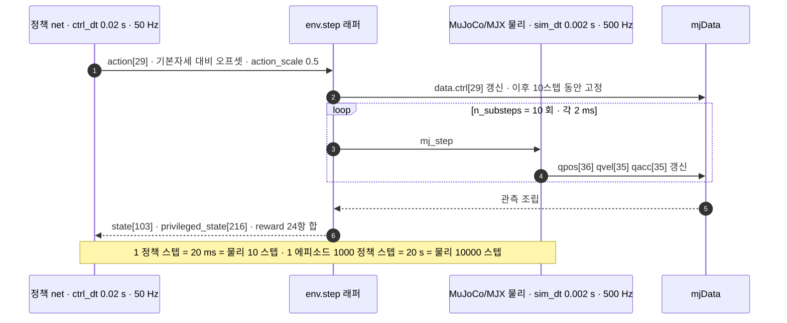
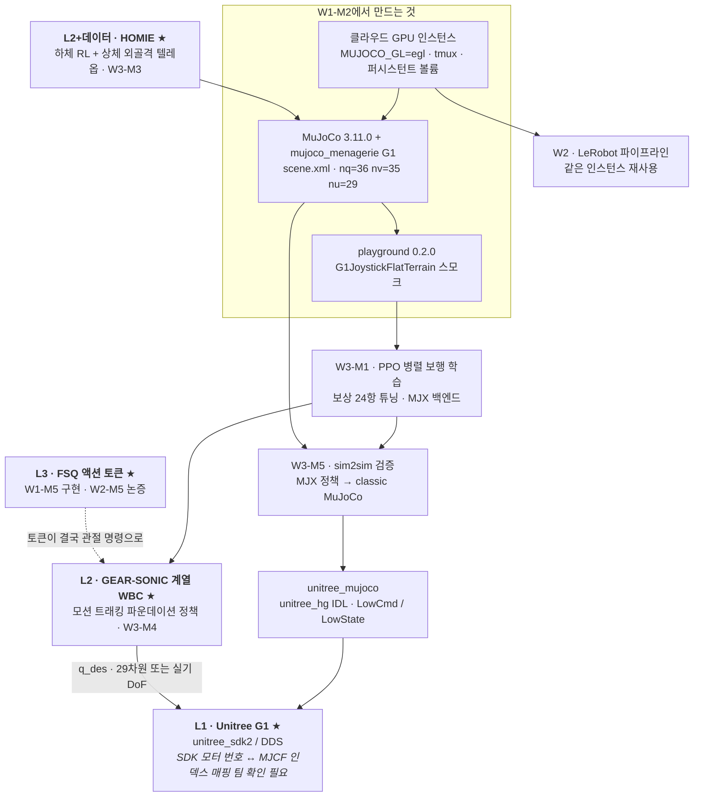

# 시뮬레이터 부트캠프: MuJoCo에서 G1을 움직이기까지

> **한 줄 요약**: MuJoCo를 "접촉이 붙은 다물체 ODE 적분기"로 재정의하고 `mjModel`/`mjData` 분리와 `nq`≠`nv` 같은 시뮬레이터 고유의 함정을 실측값으로 짚은 뒤, mujoco_menagerie의 G1 29-DoF 모델을 관절 인덱스 단위까지 해부한다. 뷰어가 없는 클라우드에서 mp4를 뽑는 렌더링 경로와 mujoco_playground의 G1 보행 태스크 스펙까지 확인한다. W3 보행 학습과 sim2sim의 **선행 인프라**.

## 학습 목표

- [ ] `mjModel`(상수)과 `mjData`(상태)를 나누는 이유를 설명하고 그 분리가 **MJX/GPU 병렬(모델 1개 · 데이터 N개)의 전제**임을 말할 수 있다.
- [ ] G1 `scene.xml`에서 `nq=36` / `nv=35` / `nu=29`를 손으로 유도하고 `data.ctrl[i]` · `data.qpos[7+i]` · `data.qvel[6+i]` · 관절 id `i+1`이 왜 전부 어긋나는지 설명할 수 있다.
- [ ] `<position kp="500" dampratio="1"/>` 액추에이터를 **PD 위치 서보**로 읽고 `kv`가 관절마다 다른 이유를 $k_v = 2\zeta\sqrt{k_p M_{\text{eff}}}$로 설명하며 실측 `kv`에서 유효관성을 역산할 수 있다.
- [ ] `MUJOCO_GL` 세 백엔드를 구분하고 클라우드 GPU 인스턴스에서 뷰어 대신 오프스크린 렌더 → mp4 저장 경로를 설명할 수 있다.
- [ ] classic(`timestep 0.002` / `iterations 100`)과 MJX(`0.004` / `5`)가 왜 다르게 튜닝됐는지 설명하고 이 차이가 **sim2sim의 축소판**인 이유를 말할 수 있다.

**완료 기준**: 클라우드 인스턴스에서 G1을 로드해 sin파 명령으로 팔다리를 흔든 mp4를 `artifacts/W1-M2/`에 저장하고 `mujoco_playground`의 `G1JoystickFlatTerrain`이 에러 없이 1스텝 도는 것까지 확인한 다음, 그 과정에서 만난 에러와 소요 시간을 `docs/progress.md`에 기록할 수 있다.

**선수 지식**: [W1-M1](../01-physical-ai-landscape/lesson.md) · **소요**: 이론 2h / 실습 4~6h (시뮬 첫 경험이므로 Day 3 오전까지 허용)

---

## 1. 왜 이것을 배우는가

### 1.1 당신은 이미 절반을 알고 있다

시뮬레이터를 처음 보면 거대해 보이지만 안에서 벌어지는 일은 당신이 10년 동안 해온 것과 같습니다. 플랜트 모델을 세웁니다. 상태를 초기화하고 입력을 넣습니다. 수치적분으로 다음 상태를 뽑고 그걸 반복합니다. `ode45`로 돌리든 Simulink로 돌리든 직접 짠 RK4로 돌리든 구조는 동일합니다.

로봇 시뮬레이터가 여기에 새로 얹는 것은 다물체와 접촉, **딱 두 가지**입니다.

먼저 다물체(multibody)입니다. 상태가 2차나 4차가 아니라 35차이고 질량행렬 $M$이 상수가 아니라 $M(q)$로 자세에 따라 매 스텝 바뀝니다. 팔을 뻗으면 관성이 커지는 그 효과가 행렬 원소로 계속 재계산됩니다. 새로울 건 없고 손으로 세울 수 없어 코드가 대신 조립해준다는 점만 다릅니다.

접촉(contact)이 진짜입니다. 발이 땅에 닿는 순간 제약 조건이 생겼다가 발을 떼면 사라집니다. 시스템의 차수가 시간에 따라 바뀌는 하이브리드 동역학이고 접촉력은 미리 알 수 없어 매 스텝 풀어야 하는 미지수입니다. MuJoCo에서 가장 비싼 계산이 여기고 `solver iterations` 같은 설정이 존재하는 이유도 여기입니다.

나머지는 전부 아는 이야기입니다. 적분기 선택, 강성 때문에 timestep을 줄여야 하는 상황, 감쇠비 튜닝, 이산화 오차. 그래서 이 모듈의 이론 부분(§3)은 기초를 설명하지 않고 "그 개념이 MuJoCo의 어느 필드인가"만 매핑합니다.

### 1.2 그런데 진짜 병목은 이론이 아니다

시뮬레이터 입문자가 하루를 날리는 지점은 동역학이 아닙니다.

- MJCF가 뭔지, `scene.xml`과 `g1.xml`이 왜 따로 있는지
- `mjModel`과 `mjData` 중 어디에 뭐가 들어 있는지
- `nq=36`인데 `nv=35`인 이유 (그리고 이걸 모르고 `qpos += qvel*dt`를 썼다가 로봇이 폭발하는 것)
- `data.ctrl[3]`을 건드렸는데 왜 `data.qpos[3]`이 아니라 `data.qpos[10]`이 움직이는지
- 클라우드에서 렌더링이 그냥 죽는 것
- `pip install mujoco_playground`가 없는 패키지라는 것

이건 이론이 아니라 **손에 익는 문제**입니다. 그래서 이 모듈은 Tier A이고 마스터플랜이 W1-M2에 1.5일까지 허용한 것도 그래서입니다. 원칙은 하나입니다. **환경이 안 돌아가는 상태로 다음 주로 넘어가지 않는다.**

### 1.3 이 모듈은 인프라다

W1-M2는 그 자체로 완결되는 지식이 아니라 뒤에 오는 세 모듈이 딛고 설 바닥입니다.

| 이 모듈에서 만드는 것 | 어디서 회수되는가 |
|---|---|
| 클라우드 인스턴스 + headless 렌더 + tmux + 퍼시스턴트 볼륨 | W2 전체(LeRobot), W3 전체. 이후 모든 실습이 같은 인스턴스 위에서 돕니다 |
| MuJoCo + G1 모델 이해(인덱스·액추에이터·접촉) | W3-M1 보상 설계, W3-M5 sim2sim 검증 |
| `mujoco_playground` 설치 + G1 태스크 스모크 | W3-M1 본 학습(PPO 병렬 보행) |
| classic vs MJX 모델 차이 관찰 | W3-M5 sim2sim의 축소판. 여기서 미리 봅니다 |

W3-M5에서 할 일은 MJX에서 학습한 정책을 표준 MuJoCo로 옮겨 다시 돌려보는 것입니다. 그 두 모델이 실제로 얼마나 다른지는 §3.5에서 숫자로 미리 확인합니다. sim2real 갭이 **왜** 생기는지도 §5.6에서 G1 MJCF의 필드 다섯 개로 짚습니다. 막연한 경고가 아니라 파일 안의 숫자로요.

---

## 2. 시뮬레이터 지형

### 2.1 무엇이 다른가

| 시뮬레이터 | 설치 | 렌더링 요구 | 접촉 모델 | GPU 병렬 | 클라우드 친화 | 이 4주에서의 역할 |
|---|---|---|---|---|---|---|
| **MuJoCo (classic)** | `pip install mujoco` 한 줄 | OpenGL. EGL로 headless 가능 | soft-constraint solver, 정확도 우선(`iterations=100`) | ✗ (CPU, 단일 환경) | ◎ | **주력.** 모델 이해·디버깅·sim2sim 검증 |
| **MJX** (`mujoco-mjx`) | mujoco와 함께 pip | 물리 계산에는 불필요 | 동일 수식, 처리량 위해 정확도 하향(`iterations=5`) | ◎ (JAX `vmap`) | ◎ | RL 학습 백엔드 |
| **mujoco_playground** | `pip install "playground==0.2.0"` | 상태 관측이면 불필요. 비전 태스크는 MJWarp 배치 렌더러 | MJX 상속 | ◎ | ◎ | **W3 보행 학습 스위트.** G1 태스크 내장 |
| **Genesis** | pip | — | 강체·유체·변형체 다중 물리를 한 엔진에서 다루는 것을 지향 | ○ | ○ | 대안. 이번 4주 미사용 |
| **Isaac Sim / Isaac Lab** | Omniverse 스택 또는 컨테이너 | **RTX(RT 코어) 필수.** A100/V100은 Isaac Sim 렌더링 미지원 | PhysX | ◎ | △ (셋업 난도가 높음) | **[P1] 개념만.** 단 §2.3 경고 참조 |
| PyBullet / Drake | pip / 별도 | 가벼움 | PyBullet은 진입장벽이 낮아 과거 표준이었으나 신규 로봇 RL 프로젝트는 MuJoCo·Isaac로 이동. Drake는 접촉 역학과 제약 최적화의 정밀도·형식 검증을 지향 | ✗ | ○ | 이름과 역할만 |

여기서 헷갈리기 쉬운 것 하나. MuJoCo / MJX / mujoco_playground는 **경쟁 관계가 아닙니다.** 셋은 한 줄로 이어집니다.

- **MuJoCo** = 물리 엔진 본체(C 라이브러리 + Python 바인딩)
- **MJX** = 같은 물리를 JAX로 다시 쓴 것. `jax.vmap`으로 수천 환경을 GPU에서 동시에 굴리기 위해
- **mujoco_playground** = MJX 위에 "환경 + 보상 + 커리큘럼 + 학습 스크립트"를 얹은 RL 스위트

LLM 쪽 비유를 쓰면 MuJoCo가 PyTorch, MJX가 그 JAX 포팅, playground가 그 위의 학습 레시피 모음(HF Trainer 같은 위치)입니다.

### 2.2 결정트리 — 어느 것을 쓸 것인가


학습 경로와 검증 경로는 원래 갈라졌다가 다시 만나야 합니다. 그림의 점선 화살표가 그 지점입니다. 같은 시뮬에서 학습하고 같은 시뮬에서 검증하면 아무것도 검증한 게 아닙니다. 제어에서 동일한 플랜트 모델로 튜닝한 제어기를 그 모델로 다시 시뮬해놓고 "검증했다"고 하지 않는 것과 같습니다.

### 2.3 왜 이 4주는 MuJoCo인가 — 그리고 Isaac 경고

설치가 `pip install mujoco` 한 줄로 끝납니다. 물리 엔진과 렌더러가 다 옵니다. 시뮬 경험이 없고 클라우드 인스턴스가 소모품인 조건에서, 인스턴스를 새로 띄울 때마다 셋업이 30분 걸리느냐 3분 걸리느냐는 학습 속도를 그대로 결정합니다.

headless에도 친화적입니다. EGL 백엔드로 디스플레이 없이 오프스크린 렌더가 되고(§5에서 실측) 물리 계산 자체는 렌더링이 아예 필요 없습니다. Isaac Sim이 RT 코어를 요구하는 것과 대비되는 지점입니다.

sim2sim 검증의 사실상 표준 관문이기도 합니다. 업계 관행은 "Isaac 계열에서 대량 병렬 학습 → MuJoCo에서 다른 엔진으로 재검증 → 실기"입니다(마스터플랜 §7 W3-M5). Unitree가 `unitree_mujoco`를 별도 리포로 유지하고 지원 로봇 목록에 G1을 넣어둔 것이 그 문화의 물증입니다. 학습을 어디서 하든 **MuJoCo는 어차피 지나가야 하는 문**입니다.

> ⚠️ **팀 확인 필요 — 마스터플랜 §12 경고**
> 마스터플랜은 "회사 학습 인프라가 **Isaac 기반일 가능성이 높으니 첫 주에 팀 표준 학습 환경(시뮬레이터·클러스터·도커 이미지)을 반드시 확인**하고, 있으면 그것을 그대로 물려받는 것이 최선"이라고 명시합니다.
> 이 모듈이 MuJoCo를 주력으로 잡은 것은 "클라우드 GPU 전용 + 시뮬 경험 전무"라는 개인 조건에 대한 **최적해**이지, 회사 표준이라는 뜻이 아닙니다. 팀이 Isaac Lab + 사내 도커 이미지를 쓴다면 W3 실습 경로를 그쪽으로 옮기는 편이 낫습니다. 그 경우에도 이 모듈의 MuJoCo 지식은 sim2sim 검증 단계에서 그대로 쓰입니다.

SONIC과 HOMIE가 각각 어떤 학습·검증 경로를 쓰는지는 집필 시점에 코드로 확인하지 않았습니다. W3-M3 / W3-M4 리포 투어에서 직접 확인할 항목입니다.

---

## 3. MuJoCo의 계산 모델

제어 배경이 가장 크게 레버리지되는 구간이라 기초 설명 없이 매핑만 합니다.

### 3.1 `mjModel` vs `mjData` — 왜 나뉘어 있는가

MJCF(XML)를 로드하면 컴파일러가 돌아 두 개의 객체가 만들어집니다.

| | `mjModel` | `mjData` |
|---|---|---|
| 성격 | 상수. 컴파일 결과 | 상태 + 매 스텝 재계산되는 중간량 |
| 언제 변하나 | 안 변함(도메인 랜더마이제이션 때만 의도적으로 건드림) | 매 `mj_step`마다 |
| 대표 필드 | `nq` `nv` `nu` `body_mass` `jnt_range` `actuator_gainprm` `opt.timestep` | `qpos` `qvel` `qacc` `ctrl` `time` `M` `qfrc_bias` `qfrc_actuator` `efc_*` `contact` |
| 제어 대응 | 상태공간 모델의 파라미터(관성·링크 길이·게인) | 상태 벡터 $x(t)$ + 중간 계산량 |
| 개수 | **1개** | **N개** (환경 개수만큼) |

상태공간 모델에서 $(A,B,C,D)$는 한 번 정하고 $x(t)$만 매 스텝 갱신하듯, MuJoCo는 로봇의 불변량과 가변량을 자료구조 수준에서 갈라놨습니다.

이 분리가 없으면 **GPU 병렬이 성립하지 않습니다.** MJX는 `mjModel`을 GPU에 한 번 올려두고 `mjData`만 배치 축으로 `vmap`합니다. 4096개 환경 = `mjModel` 1개 + `mjData` 4096개. 로봇 형상 데이터를 4096번 복사할 필요가 없어야 메모리가 감당됩니다.

> 도메인 랜더마이제이션은 이 규칙을 **일부러 깨는 예외**입니다. 환경마다 질량·마찰·지연을 다르게 주려면 `mjModel`의 일부 필드까지 배치화해야 합니다. 강인제어에서 불확실성 집합 $\Delta$를 잡아놓고 그 집합 전체에 대해 안정한 제어기를 설계하는 것과 같은 발상이며 여기서는 그 집합을 샘플링해서 학습 데이터로 흘려보냅니다. 본격적인 이야기는 W3-M1입니다.

### 3.2 `mj_step` 안에서 벌어지는 일

한 번의 `mujoco.mj_step(m, d)` 호출은 크게 다섯 단계입니다.

1. **순기구학** — `qpos`(관절 좌표)로부터 모든 body의 월드 포즈 `xpos` `xquat`를 계산. 여기서 렌더링에 필요한 정보도 같이 확정됩니다.
2. **질량행렬과 bias** — $M(q)$를 조립(`data.M`)하고 코리올리·원심·중력을 묶은 bias 항을 계산(`qfrc_bias`).
3. **제약 탐지** — 충돌 검사로 접촉점을 찾고 관절 한계·마찰·등식 제약까지 모아 제약 야코비안 `efc_J`를 만듭니다. 이 단계에서 문제의 크기(`nefc`)가 매 스텝 달라집니다.
4. **액추에이터 → solver** — `ctrl`을 일반화력 `qfrc_actuator`로 변환한 뒤 제약을 만족시키는 제약력을 반복 최적화로 풉니다(`opt.iterations`회). G1 classic 모델은 Newton solver 100회입니다.
5. **적분** — 얻어진 `qacc`로 `qvel`을 갱신하고 `qvel`로 `qpos`를 갱신합니다. 자유 관절의 쿼터니언 부분은 단순 덧셈이 아니라 지수사상으로 갱신됩니다(§3.4).

제약 탐지와 solver가 비용의 대부분입니다. 그래서 "접촉이 많은 장면일수록 느리다"가 성립하고 MJX가 처리량을 위해 `iterations`를 가장 먼저 깎은 것도 그래서입니다.

### 3.3 운동방정식과 필드 매핑

$$
M(q)\,\ddot q + c(q,\dot q) \;=\; \tau_{\text{act}} + J_c^\top f_c
$$

유도는 하지 않습니다. 각 항이 코드 어디에 앉아 있는지만 봅니다.

| 항 | 의미 | `mjData` 필드 | 차원 (G1 classic) | 제어 대응 |
|---|---|---|---|---|
| $M(q)$ | 일반화 관성 행렬 | `M` (희소 저장) | $n_v \times n_v = 35\times35$ 상당 | 상태 의존 질량행렬 |
| $c(q,\dot q)$ | 코리올리 · 원심 · 중력 | `qfrc_bias` | `[35]` | 비선형 드리프트 항 |
| $\tau_{\text{act}}$ | 액추에이터 일반화력 | `qfrc_actuator` ← `ctrl` | `[35]` ← `[29]` | 제어입력 $u$가 지나는 액추에이터 모델 |
| $J_c^\top f_c$ | 제약력(접촉 포함) | `qfrc_constraint` = `efc_J`ᵀ`efc_force` | `[35]` ← `[nefc]` | 대수적 제약 → DAE |

> ⚠️ **API 이름 주의 (MuJoCo 3.11 기준)**: 질량행렬 필드는 **`data.M`** 입니다. 예전 문서·블로그·구버전 코드에는 `data.qM`으로 나오지만 현재 바인딩에는 그 이름이 없습니다(`AttributeError`). 희소 저장이라 `d.M.shape == (341,)`이고 밀집 행렬이 필요하면 `mujoco.mj_fullM(m, d, dst)`로 뽑습니다. 이 시그니처도 구버전의 `mj_fullM(m, dst, qM)`에서 바뀌었습니다. 검색으로 찾은 예제가 안 돌아가면 가장 먼저 의심할 지점입니다.
| $\ddot q$ | 일반화 가속도 | `qacc` | `[35]` | $\dot x$의 후반부 |

모든 벡터가 `nv=35`이지 `nq=36`이 아닙니다. 힘·속도·가속도는 접선공간(속도 공간)에 살고 위치만 `nq=36`짜리 다양체에 삽니다. 이 구분이 §3.4의 주제입니다.

**접촉이 왜 $f_c$로 들어오는가**: 접촉력은 상태의 함수로 미리 쓸 수 없습니다. "발이 땅을 뚫지 않는다"는 조건($\phi(q) \ge 0$)과 "접촉력은 밀기만 한다"($f_c \ge 0$), 그리고 "떨어져 있으면 힘이 0"($\phi \cdot f_c = 0$)이 동시에 걸린 상보성(complementarity) 문제이고 이걸 매 스텝 풀어서 $f_c$를 얻습니다.

MuJoCo는 이 하드 제약을 그대로 풀지 않고 **스프링-댐퍼로 완화**해서 풉니다. soft constraint라고 부릅니다. `solref`가 그 스프링-댐퍼의 특성(시상수, 감쇠비), `solimp`가 침투 깊이에 따라 임피던스를 어떻게 바꿀지의 프로파일입니다.

> 하드 제약을 그대로 두면 미분대수방정식(DAE)이라 수치적으로 까다롭습니다. MuJoCo는 그걸 매우 뻣뻣한 ODE로 바꿔서 풉니다. 대가는 미세한 관통(발이 지면을 아주 조금 파고듦), 이득은 **수치 안정성과 미분 가능성**입니다.

이 "미분 가능한 접촉"이 MuJoCo가 RL과 궤적 최적화 쪽에서 오래 사랑받은 이유입니다. 기울기가 존재하니까요. 다만 무한 강성을 흉내 내려고 `solref` 시상수를 지나치게 줄이면 시스템이 뻣뻣해져서 `timestep`을 줄여야 하고 그러면 느려집니다. **정확도-안정성-속도의 3자 트레이드오프**가 여기서 나옵니다. 익숙한 구조일 겁니다.

### 3.4 `nq` ≠ `nv` — 입문자 최대 혼란 지점

G1 `scene.xml`의 실측값입니다.

```
nq = 36 = 7 (free joint: 위치 xyz 3 + 쿼터니언 wxyz 4) + 29 (hinge)
nv = 35 = 6 (free joint: 선속도 3 + 각속도 3)        + 29 (hinge)
nu = 29                                          ← 액추에이터, 자유 관절은 구동 안 됨
```

떠 있는 로봇(floating base)은 자기 몸통을 공중에서 병진 3 + 회전 3 = 6자유도로 움직입니다. 그런데 회전을 쿼터니언 4개 숫자로 표현하기 때문에 위치 벡터만 한 칸 더 깁니다. 쿼터니언은 $\lVert q \rVert = 1$ 제약 아래 3자유도를 4개 수로 표현하는 과잉 좌표계입니다.

정확히 말하면 **`qvel`은 `qpos`의 시간미분이 아닙니다.** `qvel`의 회전 부분은 $SO(3)$의 접선공간(리 대수 $\mathfrak{so}(3)$) 원소, 즉 각속도 벡터이고 `qpos`는 다양체 위의 점입니다. 둘을 잇는 것은 덧셈이 아니라 지수사상입니다.

$$
q_{t+1} = q_t \otimes \exp\!\left(\tfrac{1}{2}\,\omega\,\Delta t\right)
$$

1. **`d.qpos += d.qvel * dt`를 직접 쓰면 안 됩니다.** 쿼터니언 노름이 깨져서 자세가 서서히 망가집니다. MuJoCo에는 `mj_integratePos`가 있습니다.
2. **두 자세의 차를 구할 때도 뺄셈이 아닙니다.** `mj_differentiatePos`가 두 `qpos`의 차를 `nv=35` 차원으로 돌려줍니다. 유한차분으로 야코비안을 잡을 때 반드시 이걸 써야 합니다.
3. **관측 벡터를 만들 때 `qpos[3:7]`은 쿼터니언입니다.** MuJoCo의 순서는 `[w, x, y, z]`이고 scipy `Rotation.as_quat()`의 기본 순서는 `[x, y, z, w]`입니다. 조용히 틀리는 대표 지점입니다.

`stand` 키프레임 실측값이 이걸 그대로 보여줍니다.

```
qpos[:7] = [0, 0, 0.79, 1, 0, 0, 0]
             └ xyz ┘  └─ quat wxyz ─┘
골반 높이 0.79 m, 자세는 항등 회전(w=1)
```

### 3.5 `timestep` · `iterations` · `integrator` — classic vs MJX

| | classic `g1.xml` / `scene.xml` | MJX `g1_mjx.xml` / `scene_mjx.xml` |
|---|---|---|
| `opt.timestep` | **0.002** s (500 Hz) | **0.004** s (250 Hz) |
| `opt.iterations` | **100** | **5** |
| `opt.ls_iterations` | **50** | **8** |
| solver | 2 = Newton | 2 = Newton |
| 액추에이터 `kp` | **500** (전 관절 동일) | **75** — 단 발목 4개·손목 6개는 **20** |
| 액추에이터 `kv` | 관절별 (43.01 / 15.85 / …) | **2** (전 관절 동일) |
| `ngeom` | 72 | **63** (콜리전 지오메트리 단순화) |
| `nkey` / 키프레임 이름 | 1 / `['stand']` | 2 / `['home', 'knees_bent']` |

- **`timestep`** = 이산화 주기 $\Delta t$. 작을수록 정확하고 비용은 선형으로 증가.
- **`iterations`** = 제약 최적화 solver의 반복 횟수. 부족하면 제약이 덜 만족되어 발이 지면을 파고들거나 미끄러집니다.
- **`integrator`** = 적분 스킴. G1은 `implicitfast`입니다. 속도 의존 항(감쇠·마찰)을 암묵적으로 처리해서 뻣뻣한 시스템에서도 큰 `timestep`을 버팁니다. Stiff ODE에 explicit Euler를 쓰면 $\Delta t$를 아주 잘게 줄여야 하지만 implicit 계열이면 여유가 생기는, 그 이야기 그대로입니다.

MJX는 정확도를 일부러 낮췄습니다. `timestep`을 두 배로 키우고 `iterations`를 20분의 1로 줄였습니다. 이유는 처리량입니다. GPU에서 수천 환경을 굴릴 때 총 비용은 (스텝당 비용) × (스텝 수)이고 두 인자를 동시에 깎으면 학습 시간이 크게 줄어듭니다. RL은 어차피 도메인 랜더마이제이션으로 모델 오차를 흡수한다는 전제가 있으니 이 거래가 성립합니다.

`kp`를 500 → 75, `kv`를 관절별 값 → 2로 낮춘 것도 같은 맥락으로 읽는 것이 자연스럽습니다. 뻣뻣한 PD는 큰 `timestep`에서 발산하기 쉽습니다. 이산 시간 PD의 안정 영역이 게인과 $\Delta t$의 곱에 걸려 있다는 것은 익숙한 사실일 겁니다.

> **여기가 sim2sim의 축소판입니다.** 같은 로봇의 MJCF가 두 벌 존재하고 둘은 물리 파라미터부터 액추에이터 게인까지 다릅니다. MJX 모델에서 학습한 정책이 classic 모델에서도 서는지가 W3-M5의 과제이고 그게 통과되지 않으면 실기는 더 말할 것도 없습니다. 모델을 바꾸면 정책의 성능이 바뀌는 것을 눈으로 보는 것이 이 모듈의 숨은 목표입니다.

한 가지 실무 함정: **키프레임 이름이 다릅니다.** classic은 `stand` 하나, MJX는 `home`과 `knees_bent` 둘입니다. `mj_resetDataKeyframe(m, d, 0)`을 두 모델에 그대로 쓰면 초기 자세가 서로 다릅니다. 인덱스가 아니라 이름으로 찾는 습관을 들이세요.

---

## 4. 아키텍처 — MJCF에서 mp4까지

### 4.1 전체 파이프라인 (차원 라벨 포함)

```
┌─────────────────────────────────────────────────────────────────────────────┐
│ ① MJCF (XML)                                                                │
│    mujoco_menagerie/unitree_g1/                                             │
│      scene.xml  ──<include>──> g1.xml ──> assets/*.stl (메시)               │
│      바닥·조명·스카이박스           로봇 본체(model="g1_29dof_rev_1_0")      │
│    구성: <option> <default> <worldbody>(body 트리) <actuator> <sensor>       │
│          <keyframe>                                                         │
└──────────────────────────────┬──────────────────────────────────────────────┘
                               │ mujoco.MjModel.from_xml_path("scene.xml")
                               │   ← 컴파일 1회. 여기서 nq/nv/nu가 확정된다
                               ▼
┌─────────────────────────────────────────────────────────────────────────────┐
│ ② mjModel  — 상수 · 읽기 전용 · 모든 환경이 공유 (GPU에 1개만 올라감)         │
│    nq=36  nv=35  nu=29  nbody=31  njnt=30  ngeom=72  nkey=1                 │
│    body_mass[31]        합계 33.341 kg                                      │
│    jnt_range[30, 2]     관절 가동범위 (rad)                                  │
│    actuator_gainprm[29, 10]   [0]=kp=500                                    │
│    actuator_biasprm[29, 10]   [0,-kp,-kv]                                   │
│    opt.timestep=0.002  opt.iterations=100  opt.integrator=implicitfast      │
└──────────────────────────────┬──────────────────────────────────────────────┘
                               │ mujoco.MjData(m)   ← 환경 개수 N만큼 생성
                               ▼
┌─────────────────────────────────────────────────────────────────────────────┐
│ ③ mjData  — 상태 + 중간량 · 매 스텝 변함                                     │
│    qpos[36]  qvel[35]  qacc[35]  ctrl[29]  time                             │
│    M(희소, nv×nv)   qfrc_bias[35]  qfrc_actuator[35]  qfrc_constraint[35]   │
│    contact[ncon]  efc_J[nefc, 35]  efc_force[nefc]   ← ncon·nefc는 가변      │
│    sensordata[12]  = 4개 센서 × 3차원                                        │
└──────────────────────────────┬──────────────────────────────────────────────┘
                               ▼
┌─── 스텝 루프 (dt = opt.timestep = 0.002 s) ─────────────────────────────────┐
│                                                                             │
│   d.ctrl[29] ← 정책 / sin파 / 텔레옵      ※ 토크가 아니라 목표 관절각[rad]   │
│        │                                                                    │
│        ▼   mujoco.mj_step(m, d)                                             │
│   ① 순기구학    qpos[36] ─────────────> xpos[31,3]  xquat[31,4]             │
│   ② 질량·bias   ───────────────────────> M,   qfrc_bias[35]                 │
│   ③ 제약 탐지   충돌검사 ──────────────> contact[ncon],  efc_J[nefc,35]     │
│   ④ 액추에이터  ctrl[29] ──────────────> qfrc_actuator[35]                  │
│   ⑤ solver      Newton × iterations=100 > efc_force[nefc]                   │
│   ⑥ 적분        qacc[35] → qvel[35] → qpos[36]                              │
│                          ※ 자유관절 쿼터니언은 지수사상으로 갱신             │
│                                                                             │
└──────────────────────────────┬──────────────────────────────────────────────┘
                               │  N 스텝마다 1프레임 (예: 50 Hz 저장이면 10스텝마다)
                               ▼
┌─────────────────────────────────────────────────────────────────────────────┐
│ ④ Renderer  — 오프스크린 · MUJOCO_GL=egl · 뷰어 없음                         │
│    r = mujoco.Renderer(m, 240, 320)      ← (height, width) 순서 주의         │
│    r.update_scene(d, camera=...)          mjData ──> mjvScene                │
│    px = r.render()                        ──> ndarray (240, 320, 3) uint8    │
│         │ 프레임 누적                     frames: (T, 240, 320, 3) uint8     │
│         ▼                                                                   │
│    mediapy.write_video / imageio.mimsave                                    │
│         ──> artifacts/W1-M2/g1_sin.mp4                                      │
└─────────────────────────────────────────────────────────────────────────────┘
```

`Renderer`의 인자 순서가 `(height, width)`인 것은 실측으로 확인된 사항입니다. `Renderer(m, 240, 320)`이 `(240, 320, 3)` 배열을 돌려줍니다. 습관대로 `(width, height)`를 넣으면 세로로 긴 영상이 나옵니다.

---

## 5. G1 모델 읽기

### 5.1 파일 구성

`git clone --depth 1 https://github.com/google-deepmind/mujoco_menagerie.git` (약 **2.3 GB**)를 하면 `unitree_g1/` 아래에 이것들이 있습니다.

```
CHANGELOG.md  LICENSE  README.md  assets/
g1.xml                 ← 로봇 본체만. classic
g1_mjx.xml             ← MJX용 (콜리전 단순화 + 게인 하향)
g1_with_hands.xml      ← 손 포함 43 DoF
scene.xml              ← g1.xml + 바닥/조명. ★ 시뮬 돌릴 때 이걸 로드
scene_mjx.xml          scene_with_hands.xml
g1.png  g1_mjx_colliders.png  g1_with_hands.png
```

`g1.xml`이 아니라 **`scene.xml`을 로드해야 합니다.** `g1.xml`에는 바닥이 없어서 로봇이 무한히 낙하합니다. 첫날 반드시 한 번은 겪는 일입니다.

MJCF 모델명은 `g1_29dof_rev_1_0`이고 Unitree의 `unitree_ros` 저장소에 있는 같은 이름의 XML에서 파생됐습니다.

### 5.2 세 변형 비교 (실측)

| 항목 | `scene.xml` (classic) | `scene_mjx.xml` (MJX) | `scene_with_hands.xml` |
|---|---|---|---|
| `nq` | 36 | 36 | 50 |
| `nv` | 35 | 35 | 49 |
| `nu` | **29** | 29 | **43** |
| `nbody` | 31 | 31 | 45 |
| `njnt` | 30 | 30 | 44 |
| `ngeom` | 72 | **63** | 101 |
| `nkey` | 1 | 2 | 1 |
| 키프레임 | `['stand']` | `['home', 'knees_bent']` | `['stand']` |
| `opt.timestep` | 0.002 | **0.004** | 0.002 |
| `opt.iterations` | 100 | **5** | 100 |

29 DoF 구성: **다리 12 (6×2) + 허리 3 + 팔 14 (7×2) = 29**

### 5.3 ⚠️ menagerie 29 DoF ≠ 실기 기본형 23 DoF

이 대목은 그냥 넘기면 안 됩니다.

| | menagerie `g1_29dof_rev_1_0` | Unitree G1 실기 (공식 스펙) |
|---|---|---|
| DoF | 29 | 기본형 **23** / EDU **23~43** |
| 허리 | 3축 (yaw · roll · pitch) | 1축 (옵션으로 +2) |
| 팔 | 7×2 (어깨 3 + 팔꿈치 1 + 손목 3) | 5×2 (손목 옵션 +2) |
| 손 | 없음 (`with_hands` 버전은 별도) | 옵션 7 DoF 덱스터러스 핸드 |
| 총질량 | 33.341 kg (MJCF 단순화 모델) | 약 35 kg (배터리 포함) |

실기 G1 공식 스펙(2026-08-01 확인)은 기립 시 1320 × 450 × 200 mm, 접힘 690 × 450 × 300 mm, 무릎 최대 토크 90 N·m(기본) / 120 N·m(EDU), 팔 가반하중 약 2 kg(기본) / 약 3 kg(EDU), 13S 리튬 9000 mAh로 가동 약 2시간, 뎁스 카메라 + 3D LiDAR + 4-마이크 어레이, 기본 8-core CPU에 고성능 컴퓨트 모듈 옵션, WiFi 6 / Bluetooth 5.2, 기본형 US $13.5K입니다.

> 📌 **팀 확인 필요**: 회사 G1이 23 / 29 / 43 중 어느 구성인지, 손이 있는지에 따라 액션 벡터 차원부터 달라집니다. menagerie MJCF를 그대로 쓸 수 있는지, 사내 정본 MJCF/URDF가 따로 있는지도 함께 확인할 항목입니다. 이 답이 나오기 전까지 이 모듈의 실습은 "29 DoF 모델로 감각을 익히는 것"이지 "우리 로봇을 시뮬하는 것"이 아닙니다.

### 5.4 관절 인덱스 — 세 개의 주소 체계가 어긋난다

첫 주에 가장 많은 시간을 잡아먹는 지점입니다. 실측 표입니다(다리 12 + 허리 3).

| jnt id | 이름 | type | `qpos` adr | `dof` adr (`qvel`) | `ctrl` id | range (rad) |
|---|---|---|---|---|---|---|
| 0 | `floating_base_joint` | free | 0~6 | 0~5 | — (구동 안 됨) | — |
| 1 | `left_hip_pitch_joint` | hinge | 7 | 6 | 0 | [-2.531, 2.880] |
| 2 | `left_hip_roll_joint` | hinge | 8 | 7 | 1 | [-0.524, 2.967] |
| 3 | `left_hip_yaw_joint` | hinge | 9 | 8 | 2 | [-2.758, 2.758] |
| 4 | `left_knee_joint` | hinge | 10 | 9 | 3 | [-0.087, 2.880] |
| 5 | `left_ankle_pitch_joint` | hinge | 11 | 10 | 4 | [-0.873, 0.524] |
| 6 | `left_ankle_roll_joint` | hinge | 12 | 11 | 5 | [-0.262, 0.262] |
| 7 | `right_hip_pitch_joint` | hinge | 13 | 12 | 6 | [-2.531, 2.880] |
| 8 | `right_hip_roll_joint` | hinge | 14 | 13 | 7 | [-2.967, 0.524] |
| 9 | `right_hip_yaw_joint` | hinge | 15 | 14 | 8 | [-2.758, 2.758] |
| 10 | `right_knee_joint` | hinge | 16 | 15 | 9 | [-0.087, 2.880] |
| 11 | `right_ankle_pitch_joint` | hinge | 17 | 16 | 10 | [-0.873, 0.524] |
| 12 | `right_ankle_roll_joint` | hinge | 18 | 17 | 11 | [-0.262, 0.262] |
| 13 | `waist_yaw_joint` | hinge | 19 | 18 | 12 | [-2.618, 2.618] |
| 14 | `waist_roll_joint` | hinge | 20 | 19 | 13 | [-0.520, 0.520] |
| 15 | `waist_pitch_joint` | hinge | 21 | 20 | 14 | [-0.520, 0.520] |

<details>
<summary>팔 14개 관절 (jnt 16~29) 펼쳐보기</summary>

| jnt id | 이름 | `qpos` adr | `dof` adr | `ctrl` id | range (rad) |
|---|---|---|---|---|---|
| 16 | `left_shoulder_pitch_joint` | 22 | 21 | 15 | [-3.089, 2.670] |
| 17 | `left_shoulder_roll_joint` | 23 | 22 | 16 | [-1.588, 2.252] |
| 18 | `left_shoulder_yaw_joint` | 24 | 23 | 17 | [-2.618, 2.618] |
| 19 | `left_elbow_joint` | 25 | 24 | 18 | [-1.047, 2.094] |
| 20 | `left_wrist_roll_joint` | 26 | 25 | 19 | [-1.972, 1.972] |
| 21 | `left_wrist_pitch_joint` | 27 | 26 | 20 | [-1.614, 1.614] |
| 22 | `left_wrist_yaw_joint` | 28 | 27 | 21 | [-1.614, 1.614] |
| 23 | `right_shoulder_pitch_joint` | 29 | 28 | 22 | [-3.089, 2.670] |
| 24 | `right_shoulder_roll_joint` | 30 | 29 | 23 | [-2.252, 1.588] |
| 25 | `right_shoulder_yaw_joint` | 31 | 30 | 24 | [-2.618, 2.618] |
| 26 | `right_elbow_joint` | 32 | 31 | 25 | [-1.047, 2.094] |
| 27 | `right_wrist_roll_joint` | 33 | 32 | 26 | [-1.972, 1.972] |
| 28 | `right_wrist_pitch_joint` | 34 | 33 | 27 | [-1.614, 1.614] |
| 29 | `right_wrist_yaw_joint` | 35 | 34 | 28 | [-1.614, 1.614] |

좌우 대칭 관절의 range가 부호만 뒤집힌 것(`left_hip_roll` [-0.524, 2.967] vs `right_hip_roll` [-2.967, 0.524])에 주의하세요. 좌우 궤적을 복사할 때 부호를 뒤집어야 합니다.

</details>

규칙은 단순하지만 오프셋이 넷 다 다릅니다.

```
관절 이름  ──  jnt id = i + 1
                qpos adr = i + 7      (자유 관절이 앞에서 7칸 먹음)
                qvel adr = i + 6      (자유 관절이 앞에서 6칸 먹음)
                ctrl id  = i          (자유 관절은 구동되지 않아 액추에이터가 없음)
```

`left_knee_joint` 하나로 확인하면 **jnt 4 / qpos 10 / qvel 9 / ctrl 3**입니다. 네 개가 전부 다른 숫자입니다.

실무에서는 절대 손으로 세지 마세요. 이름으로 조회하는 습관이 정답입니다.

```python
jid = mujoco.mj_name2id(m, mujoco.mjtObj.mjOBJ_JOINT, "left_knee_joint")
qadr = m.jnt_qposadr[jid]     # 10
vadr = m.jnt_dofadr[jid]      # 9
aid  = mujoco.mj_name2id(m, mujoco.mjtObj.mjOBJ_ACTUATOR, "left_knee_joint")  # 3
```

### 5.5 액추에이터 — 여기가 당신 배경이 통하는 지점

MJCF의 `g1` 기본 클래스 정의는 이 한 줄입니다.

```xml
<position kp="500" dampratio="1" inheritrange="1"/>
```

MuJoCo의 `position` 액추에이터는 `gainprm[0] = kp`, `biasprm = [0, -kp, -kv]`로 컴파일됩니다(실측 확인: `gaintype=0(fixed)`, `biastype=1(affine)`). 액추에이터가 내는 힘의 식입니다.

$$
f \;=\; \underbrace{k_p \cdot \texttt{ctrl}}_{\text{gain}} \;\underbrace{-\,k_p\, q \;-\; k_v\, \dot q}_{\text{bias}}
\;=\; k_p\,(\texttt{ctrl} - q) \;-\; k_v\,\dot q
$$

`data.ctrl[i]`는 토크가 아니라 **목표 관절각[rad]**입니다. 이 식은 [W1-M1 §2.3](../01-physical-ai-landscape/lesson.md)의 L1 계층에 적어둔 $\tau = K_p(q_{des} - q) - K_d\dot q$와 글자 그대로 같은 식입니다. 시뮬레이터가 실기 온보드 PD 서보를 이미 모사하고 있는 것이고 그래서 RL 정책이 뱉는 액션이 토크가 아니라 관절 목표각인 경우가 많습니다.

`inheritrange="1"` 덕분에 `ctrlrange`가 관절 `range`와 자동으로 같아집니다. §5.4 표의 range를 그대로 명령 한계로 쓰면 됩니다.

`dampratio="1"`이 만드는 것은 **임계감쇠**입니다. MuJoCo는 이걸 다음 관계로 `kv`를 관절마다 따로 계산합니다.

$$
k_v \;=\; 2\,\zeta\,\sqrt{k_p\, M_{\text{eff}}}
$$

실측 `kv`와 위 식을 뒤집어 얻은 유효관성 $M_{\text{eff}} = (k_v/2\zeta)^2 / k_p$입니다.

| 액추에이터 | `kp` | `kv` (실측) | $M_{\text{eff}}$ 역산 [kg·m²] |
|---|---|---|---|
| `left_hip_pitch_joint` | 500 | 43.01068276 | ≈ 0.925 |
| `left_knee_joint` | 500 | 15.84701068 | ≈ 0.126 |
| `left_shoulder_pitch_joint` | 500 | 16.72533692 | ≈ 0.140 |
| `left_elbow_joint` | 500 | 9.42912002 | ≈ 0.044 |

고관절은 팔꿈치보다 유효관성이 20배 이상 큽니다. 몸 전체를 흔드는 관절과 아래팔만 흔드는 관절의 차이니 당연합니다. 모든 관절에 같은 `kv`를 주면 어떤 관절은 **과감쇠**, 어떤 관절은 **부족감쇠**가 됩니다. `dampratio` 파라미터는 그걸 각 관절이 알아서 맞추게 하는 장치입니다.

이 역산값에는 `armature`(§5.6)도 포함돼 있습니다. 정확한 링크 관성만 뽑으려면 `mj_fullM`으로 $M(q)$를 직접 꺼내 보세요. 그 값은 자세에 따라 변하지만 `kv`는 컴파일 시점에 한 번 정해진 상수라는 점도 같이 확인할 만합니다.

### 5.6 sim2real 갭의 씨앗 다섯 개

MJCF에 적혀 있는 값들을 실기와 나란히 놓으면 W3-M5에서 다룰 sim2real 갭이 이미 여기서 보입니다.

| # | MJCF 실측값 | 실기와 무엇이 다른가 | [W1-M1 §6](../01-physical-ai-landscape/lesson.md)의 5대 요인 |
|---|---|---|---|
| 1 | `forcerange = [0, 0]` → **토크 제한 없음** | 실기 무릎은 90 N·m(기본) / 120 N·m(EDU). 시뮬 정책이 무제한 토크로 균형을 잡아놓고 실기에서 포화(saturation)로 넘어지는 전형적 경로 | 액추에이터 동특성 |
| 2 | `armature = 0.01` (전 관절 동일) | 반사 관성 = 회전자 관성 × 감속비². 실제로는 관절마다 다르고, 이 값은 수치 안정용 대충값에 가까움 | 액추에이터 동특성 |
| 3 | `frictionloss = 0.3` (전 관절 동일) | 관절 쿨롱 마찰. 감속기 종류·조립 상태·온도에 따라 달라짐 | 액추에이터 동특성 |
| 4 | 발 접촉이 `sphere size=0.005`, `friction=0.6`, `condim=3`, `priority=1` | 발바닥이 평면이 아니라 **작은 구 몇 개**로 근사됨. 실기 고무 발바닥의 접촉 패치·변형과 다르고, 마찰 0.6도 바닥 재질마다 다름. `priority=1`이라 접촉 상대 대신 이 값이 채택됨 | 접촉 모델 |
| 5 | 센서가 4개뿐 (§5.7). 총질량 33.341 kg vs 실기 약 35 kg | 시뮬에서는 `data.qpos`로 참값을 공짜로 읽지만 실기에는 그런 것이 없음. 질량 분포도 단순화됨 | 센서 노이즈 · 상태 추정 |

지연(latency)은 이 MJCF에 아예 표현돼 있지 않습니다. 실기에는 센서 읽기 → 정책 추론 → 통신 → 모터 반영까지 지연이 쌓이는데 시뮬은 기본적으로 지연이 0입니다. 도메인 랜더마이제이션에서 지연을 별도로 주입하는 이유가 그것입니다.

이 다섯 개가 "시뮬에서 되면 실기에서도 된다"는 오해에 대한 반박입니다. 막연한 경고가 아니라 파일 안의 다섯 줄입니다.

### 5.7 센서 — 관절 엔코더가 없다

실측 결과, `scene.xml`의 `<sensor>`에는 정확히 네 개만 있고 전부 3차원입니다.

```
imu-torso-angular-velocity      [3]
imu-torso-linear-acceleration   [3]
imu-pelvis-angular-velocity     [3]
imu-pelvis-linear-acceleration  [3]
                          합계 sensordata[12]
```

**관절 엔코더 센서가 정의돼 있지 않습니다.** 관절각을 쓰려면 `data.qpos[7:]`, 관절 각속도는 `data.qvel[6:]`을 직접 읽어야 합니다.

관측 벡터를 조립할 때 "센서에서 읽는 것"과 "상태에서 직접 읽는 것"이 섞이므로 어느 것이 실기에서도 얻을 수 있는 값인지 매번 따져야 합니다. 시뮬은 `qpos`로 골반의 절대 위치·자세까지 참값으로 알려주지만 **실기는 모릅니다.** 실기에서 그건 IMU + 관절 엔코더 + (있으면) LiDAR로 추정해야 하는 값입니다. 그 추정 오차가 sim2real 갭의 다섯 번째 요인입니다. W3-M5와 W4-M4에서 다시 만납니다.

---

## 6. headless 렌더링과 클라우드

### 6.1 왜 뷰어를 못 쓰는가

클라우드 GPU 인스턴스에는 모니터도, 디스플레이 서버도 없습니다. `mujoco.viewer.launch()`는 GLFW 윈도우를 요구하므로 그냥 실패합니다. X11 포워딩으로 억지로 띄워도 프레임이 네트워크를 타고 넘어오느라 쓸 수 없는 수준이 됩니다.

대안은 오프스크린 렌더입니다. GPU에 프레임버퍼만 잡고 그립니다. 결과는 numpy 배열로 받아 파일로 저장합니다. 확인은 파일을 내려받거나 W&B / TensorBoard에 올려서 합니다. 이 저장소의 규칙이 "뷰어 코드 금지, 결과는 `artifacts/`에 mp4/png"인 것이 그래서입니다.

관점을 바꾸면 이건 제약이 아니라 이득입니다. 실행과 관찰이 분리되면 재현 가능해집니다. 뷰어로 본 것은 남지 않습니다. mp4는 남아서 3주 뒤 같은 정책을 다시 굴려 나란히 비교할 수 있습니다. 실험 노트가 저절로 쌓이는 구조입니다.

### 6.2 `MUJOCO_GL` 백엔드 (집필 환경 실측)

| `MUJOCO_GL` | 결과 | 언제 쓰나 |
|---|---|---|
| `egl` | ✅ 렌더 성공. 단, 인터프리터 종료 시 `Renderer.__del__`에서 `OpenGL.raw.EGL._errors.EGLError`가 `Exception ignored in:` 접두사로 출력되는 경우가 있음. **렌더 결과에는 영향 없음** | **GPU 인스턴스의 기본값.** 이 4주 내내 이것 |
| `glfw` | ✅ 정상 (디스플레이가 있는 환경. WSLg `DISPLAY=:0`) | 로컬에 화면이 있을 때만 |
| `osmesa` | ❌ `AttributeError: 'NoneType' object has no attribute 'glGetError'` — `libOSMesa` 미설치. `sudo apt install libosmesa6-dev` 필요 | GPU 없는 CPU 인스턴스의 소프트웨어 폴백 |

환경변수는 **`mujoco`를 import하기 전에** 설정돼야 합니다. 백엔드가 import 시점에 결정되기 때문입니다. 노트북이면 첫 셀에서, 스크립트면 실행 명령에서 설정합니다.

```bash
MUJOCO_GL=egl python 01_g1_load.py
```

```python
# 노트북이라면 mujoco import보다 위에
import os
os.environ["MUJOCO_GL"] = "egl"
import mujoco
```

종료 시 EGL traceback은 **무시해도 됩니다.** `Exception ignored in:` 로 시작하면 파이썬이 이미 "이 예외는 무시했다"고 알려주는 것입니다. 프레임은 정상 저장돼 있습니다. 처음 보면 렌더가 실패한 줄 알고 30분을 태우기 좋은 지점이라 미리 적어둡니다.

### 6.3 설치 — 검증된 명령과 버전 (2026-08-01 PyPI 확인)

| 패키지 | 버전 | 비고 |
|---|---|---|
| `mujoco` | **3.11.0** | requires_python >= 3.10. 설치·실행 검증 완료 |
| `mujoco-mjx` | 3.11.0 | playground가 끌어옴 |
| `playground` | **0.2.0** | **PyPI 배포명이 `playground`, import명은 `mujoco_playground`.** requires_python >= 3.11 |
| `jax` | 0.11.0 | requires_python >= 3.12. GPU는 `jax[cuda12]` 별도 |
| `numpy` | 2.5.1 | mujoco가 함께 설치 |
| `mediapy` | 1.2.7 | mp4 저장 |
| `imageio` / `imageio-ffmpeg` | 2.37.4 | mp4 저장 대안. ffmpeg 바이너리 동봉 |
| `jupytext` | 1.19.5 | W1-M1과 동일 |
| `matplotlib` | 3.11.1 | W1-M1과 동일 |
| `pyopengl` | 3.1.10 | mujoco 의존성(자동) |

`jax`가 Python 3.12 이상을 요구하므로 인터프리터는 3.12+로 잡으세요.

```bash
uv pip install mujoco==3.11.0 mediapy==1.2.7 imageio==2.37.4 imageio-ffmpeg jupytext==1.19.5 matplotlib==3.11.1
uv pip install "playground==0.2.0"          # mujoco_playground + jax(CPU) + mujoco-mjx
uv pip install -U "jax[cuda12]"             # GPU 인스턴스에서만
```

### 6.4 클라우드 운영 — 예산 제약 최적화로 읽기

아래 네 원칙은 마스터플랜 부록 A에서 그대로 옮긴 것입니다.

| 원칙 | 내용 | 제어공학적 번역 |
|---|---|---|
| 인스턴스는 소모품 | 코드·데이터·체크포인트는 **퍼시스턴트 볼륨**에. 인스턴스는 언제든 버릴 수 있어야 함 | 상태를 플랜트가 아니라 관측 가능한 저장소에 둔다 |
| 재현성 | Docker 이미지 또는 버전 고정 uv/conda 환경 | 실험 조건의 파라미터 고정 |
| headless | `MUJOCO_GL=egl`, 결과는 mp4/png | 관측 채널을 오프라인화 |
| 원격 관측 | 학습 로그는 W&B / TensorBoard, 장시간 작업은 **tmux** | 세션 단절이라는 외란에 대한 대책 |

**비용은 예산 제약 최적화 문제입니다.** 목적함수는 "4주 안에 마일스톤 4개(FSQ 구현 · LeRobot 완주 · G1 보행+sim2sim · 캡스톤)를 완주", 제약은 GPU 시간 예산입니다. 여기서 실무 규칙이 셋 나옵니다.

- **스팟/프리엠티블은 제약을 싸게 늘리지만 선점이라는 외란을 도입합니다.** 그 외란에 대한 대책이 잦은 체크포인트입니다. 체크포인트 없는 스팟 학습은 강인화 없는 개루프 제어입니다.
- **학습이 없는 시간에는 인스턴스를 정지합니다.** 논문 읽는 4시간 동안 GPU를 켜두는 것이 4주 예산에서 가장 큰 낭비 항목입니다.
- **주간 예산 상한을 먼저 정합니다.** 상한 없는 최적화는 최적화가 아닙니다.

인스턴스 선택은 부록 A 기준입니다. W1~W2(생성모델 toy, LeRobot PushT)는 T4/A10G/L4 한 장이면 충분하고 W3(playground RL)는 A10G/L4/L40S급을 권장합니다. **A100/H100은 이 플랜에서 불필요합니다.** Isaac Lab을 [P1]으로 시도할 때만 RT 코어가 있는 GPU(L4/L40S/A10G 계열)가 필요하고 A100/V100은 Isaac Sim 렌더링을 지원하지 않습니다.

> 제공자별 구체 절차(인스턴스 생성 → 볼륨 마운트 → 드라이버 확인 → 첫 mp4 저장까지)는 **[`labs/README.md`](labs/README.md)** 로 넘깁니다. 이 lesson은 제공자 중립으로 원칙만 다룹니다.

---

## 7. mujoco_playground 미리보기

W3-M1 본 학습의 예고편입니다. 이 모듈에서는 **"에러 없이 돌아간다"까지만** 확인합니다.

### 7.1 먼저, 이름 함정

```bash
uv pip install "playground==0.2.0"    # ✅ PyPI 배포명
```
```python
import mujoco_playground                # ✅ import 이름
```

`pip install mujoco_playground`는 **없는 패키지**입니다. 반대로 `import playground`도 안 됩니다. 배포명과 모듈명이 다른 흔치 않은 케이스이니 미리 알아두세요.

첫 `import mujoco_playground`에 3.7초, `registry.load()`에 2.7초가 걸립니다. `jax.jit(env.step)`의 첫 호출은 컴파일이 포함돼 CPU에서 1.4초, `jax.jit(env.reset)`의 첫 호출은 수십 초까지 갑니다. 멈춘 것처럼 보이는 구간은 대부분 JAX 컴파일입니다. 두 번째 호출부터는 빨라집니다. CPU JAX로도 import와 레지스트리 조회, 스모크 스텝까지는 정상 동작합니다(본 학습은 GPU에서).

Ampere 계열 GPU에서는 공식 권장 설정이 있습니다.

```bash
export JAX_DEFAULT_MATMUL_PRECISION=highest
```

### 7.2 등록된 환경

`registry.locomotion.ALL_ENVS`의 길이는 19입니다. 전체 목록:

`G1JoystickFlatTerrain`, `G1JoystickRoughTerrain`, `H1InplaceGaitTracking`, `H1JoystickGaitTracking`, `Go1JoystickFlatTerrain`, `Go1JoystickRoughTerrain`, `Go1Getup`, `Go1Handstand`, `Go1Footstand`, `T1JoystickFlatTerrain`, `T1JoystickRoughTerrain`, `ApolloJoystickFlatTerrain`, `BarkourJoystick`, `BerkeleyHumanoidJoystickFlatTerrain`, `BerkeleyHumanoidJoystickRoughTerrain`, `Op3Joystick`, `SpotFlatTerrainJoystick`, `SpotGetup`, `SpotJoystickGaitTracking`

이 중 G1·H1 태스크는 4개입니다: `G1JoystickFlatTerrain`, `G1JoystickRoughTerrain`, `H1InplaceGaitTracking`, `H1JoystickGaitTracking`. 백엔드는 MJX(JAX)와 MuJoCo Warp 양쪽을 지원합니다. 비전 태스크는 MJWarp 배치 렌더러를 씁니다.

### 7.3 `G1JoystickFlatTerrain` 실측 스펙

| 항목 | 값 |
|---|---|
| `env.observation_size` | `{'state': (103,), 'privileged_state': (216,)}` |
| `env.action_size` | **29** (= G1 관절 수) |
| `ctrl_dt` (정책 주기) | **0.02 s → 50 Hz** |
| `sim_dt` (물리 주기) | **0.002 s → 500 Hz** |
| `n_substeps` | 0.02 / 0.002 = **10** |
| `episode_length` | 1000 스텝 (= 20 초) |
| `action_scale` | 0.5 |
| 첫 `jax.jit(env.step)` | CPU에서 1.4 s, `reward = 0.02923353761434555` |

관측이 두 개로 나뉜 것이 눈에 띌 겁니다. `state (103,)`와 `privileged_state (216,)`. legged RL 계열의 관례가 **비대칭 actor-critic**입니다. actor(정책)는 실기에서도 얻을 수 있는 103차원만 봅니다. critic(가치함수)은 학습 중에만 알 수 있는 특권 정보(지형 높이, 마찰계수, 외력 등)를 포함한 216차원을 봅니다. 배포되는 것은 actor뿐입니다.

제어 용어로 옮기면 관측기가 못 보는 상태를 학습 중에는 안다고 치고 가치함수를 더 정확히 학습시키는 셈입니다. 가치함수는 실행 시 필요 없으니 반칙이 아닙니다. 실제로 어느 텐서가 어디로 들어가는지는 W3-M1에서 코드로 확인합니다.

액션 29차원이 무엇인지도 관례상 **기본 자세 대비 관절각 오프셋**(`action_scale`로 스케일된)입니다. §5.5에서 본 `<position>` 액추에이터를 생각하면 자연스러운 설계이고 이 역시 W3-M1에서 코드로 확인할 항목입니다.

### 7.4 50 Hz 정책 / 500 Hz 물리 — 주파수 예산의 확대판

[W1-M1 §2.3](../01-physical-ai-landscape/lesson.md)에서 그린 스택 5계층 중 **L2 전신제어의 50~500 Hz 대역**이 여기에 그대로 나타납니다. 정책 50 Hz, 물리 500 Hz, 그 사이를 `n_substeps=10`이 메웁니다.



여기서 읽어야 할 것은 정책이 명령을 갱신하지 않는 10 스텝 동안에도 **물리는 계속 돈다**는 사실입니다. `ctrl`은 고정된 채로 PD 서보가 그 목표를 향해 계속 힘을 냅니다. 이것이 [W1-M1 §3](../01-physical-ai-landscape/lesson.md)의 action chunking 논의와 정확히 같은 구조입니다. 느린 상위가 빠른 하위를 어떻게 끊김 없이 먹여 살리는가. 다만 여기서는 청크 길이가 1이고 홀드가 10 스텝일 뿐입니다.

계산 확인: `episode_length = 1000` 정책 스텝 × `ctrl_dt = 0.02 s` = 20초. 물리 스텝으로는 1000 × 10 = 10,000 스텝, 또는 20초 × 500 Hz = 10,000. 같은 답이 나오는지 확인하는 것이 이 절의 셀프 체크입니다.

### 7.5 보상항 24개 — "보상 설계 = 비용함수 설계"

`cfg.reward_config.scales`의 키를 실측으로 뽑으면 **24개**입니다.

| 그룹 | 항 (개수) |
|---|---|
| **추종** | `tracking_lin_vel`, `tracking_ang_vel` (2) |
| **자세·안정** | `orientation`, `base_height`, `lin_vel_z`, `ang_vel_xy`, `pose`, `stand_still`, `alive`, `termination` (8) |
| **접촉·발** | `feet_air_time`, `feet_clearance`, `feet_height`, `feet_phase`, `feet_slip`, `contact_force`, `collision` (7) |
| **정규화·비용** | `action_rate`, `dof_acc`, `energy`, `torques`, `dof_pos_limits`, `joint_deviation_hip`, `joint_deviation_knee` (7) |

LQR·MPC 비용함수와 나란히 놓으면 구조가 그대로 보입니다.

$$
J \;=\; \sum_t \Big[ (x_t - x_{\text{ref}})^\top Q (x_t - x_{\text{ref}}) \;+\; u_t^\top R\, u_t \Big]
$$

- $Q$의 역할 → `tracking_lin_vel` / `tracking_ang_vel` / `orientation` / `base_height`
- $R$의 역할 → `torques` / `energy` / `action_rate` / `dof_acc`
- 제약의 소프트 페널티 → `dof_pos_limits` / `collision` / `contact_force`

다른 점은 셋입니다. 우선 부호가 뒤집혀 최대화 문제가 됩니다. 항이 24개나 되고 서로 스케일이 크게 달라 가중치 튜닝이 사실상 별개의 작업이 됩니다. 그리고 `feet_air_time`이나 `feet_phase`처럼 **접촉 이벤트에 걸린 항은 미분 불가능하거나 이산적**입니다.

세 번째가 결정적입니다. 비용함수가 매끄러우면 MPC로 풀면 되지 그레이디언트 추정에 수백만 샘플을 쓸 이유가 없습니다. RL이 필요한 진짜 이유는 **목적함수가 접촉이라는 이산 이벤트를 품고 있기 때문**입니다. 이 24개를 어떻게 조합해야 인간처럼 걷는 정책이 나오는가. 그게 W3-M1의 본론이고 당신의 비용함수 설계 경험이 가장 직접 전이되는 지점입니다.

---

## 8. 회사 스택 연결 ★

### 8.1 이 모듈의 산출물이 어디로 흘러가는가



### 8.2 매핑표

| 이 모듈의 산출물 | 연결되는 회사 스택 요소 | 어떻게 이어지는가 | 다루는 모듈 |
|---|---|---|---|
| MuJoCo + G1 MJCF 이해 | **Unitree G1** ★ (L1) | 관절 인덱스·액추에이터·발 접촉을 아는 것이 실기 명령을 이해하는 최소 조건 | W3-M5 |
| `mujoco_playground` 환경 | **GEAR-SONIC** ★ (L2) | SONIC은 모션 트래킹 WBC. 그 앞 단계인 "속도 추종 보행 RL"을 여기서 먼저 손에 익힘 | W3-M1 → W3-M4 |
| G1 MJCF + 상·하체 분리 관점 | **HOMIE** ★ (L2+데이터) | HOMIE는 하체 RL + 상체 텔레옵. 다리 12 / 허리 3 / 팔 14로 갈라진 §5.4 인덱스가 그 분리의 물리적 실체 | W3-M3 |
| classic MuJoCo 모델 | **unitree_mujoco** (sim2sim → DDS) | 학습 시뮬 밖에서 정책을 재검증하는 관문 | W3-M5 |
| `data.ctrl[29]` 인터페이스 | **FSQ 기반 계층 모델** ★ (L3) | 상위가 무엇을 뱉든 사슬의 끝에서는 관절 명령으로 환원됨 | W1-M5, W2-M5 |
| 클라우드 인스턴스 · headless | 전 계층 공통 인프라 | W2 LeRobot, W3 RL, W4 DualMap이 전부 이 위에서 돎 | W2~W4 |

회사 FSQ 모델의 실제 출력 형태(토큰이 목표 자세인지, 모션 레퍼런스인지, latent 인지)는 **확인되지 않았습니다**(팀 확인 필요). 다만 어떤 형태든 사슬의 맨 끝에서는 관절 명령으로 내려옵니다. 이 모듈에서 `data.ctrl[3] = 0.5`를 넣고 왼쪽 무릎이 실제로 움직이는 것을 보는 경험이 L3 인터페이스 설계 논의의 물리적 바닥입니다. 막연히 "토큰이 하위 제어기를 구동한다"고 말하는 것과, 그 하위 끝단이 29차원 실수 벡터이고 각 원소가 어느 관절의 목표각[rad]인지 아는 것은 다릅니다.

### 8.3 `unitree_mujoco` — 존재만 알아두기

W3-M5의 주역이라 여기서는 소개만 합니다.

- 저장소: `github.com/unitreerobotics/unitree_mujoco` (기본 브랜치 `main`, README 파일명이 소문자 `readme.md`)
- 최상위 구조: `doc/` `example/` `simulate/` `simulate_python/` `terrain_tool/` `unitree_robots/`
- `simulate/`는 C++ (권장), `simulate_python/`은 Python 버전 (`config.py`, `unitree_mujoco.py`, `unitree_sdk2py_bridge.py`, `test/`)
- 지원 로봇: `a2 b2 b2w g1 go2 go2w h1 h1_2 h2 r1` — **G1 포함**
- 지원 메시지: `LowCmd`, `LowState`, `SportModeState`, `IMUState` (G1은 `rt/secondary_imu` 토픽)
- **현재 버전은 low-level 개발만 지원** — 컨트롤러 sim2real 검증 용도
- **G1과 H1-2는 `unitree_hg` IDL**, Go2·B2·H1·B2w·Go2w는 `unitree_go` IDL

> ⚠️ **팀 확인 필요 — 인덱스 매핑**
> `unitree_mujoco`는 "모터 번호가 실기 하드웨어와 대응한다"고만 말합니다. SDK 모터 번호와 menagerie MJCF의 관절 인덱스가 **같다는 보장은 없습니다.** 이 매핑표가 없으면 sim2sim 단계에서 팔다리가 뒤바뀐 채로 도는, 원인 찾기 지독하게 어려운 버그가 납니다. 사내에 검증된 매핑표가 있는지 먼저 물어보세요.

---

## 9. 흔한 오해 4가지

| 오해 | 교정 |
|---|---|
| **"시뮬에서 되면 실기에서도 된다"** | §5.6에서 갭의 씨앗 다섯 개를 파일 안의 숫자로 봤습니다. `forcerange=[0,0]`이면 시뮬 로봇은 **무제한 토크**로 균형을 잡습니다. 실기 무릎은 90 N·m(기본)/120 N·m(EDU)에서 포화합니다. `armature=0.01`과 `frictionloss=0.3`은 전 관절 동일한 근사값이고, 발은 반지름 5 mm 구 몇 개입니다. 지연은 아예 없습니다. 그래서 **학습 시뮬과 다른 엔진에서 한 번 더 확인하는 sim2sim 관문**이 존재합니다. 플랜트 모델 하나로 튜닝한 제어기를 그 모델로 재시뮬해놓고 검증했다고 하지 않는 것과 같은 이야기입니다. |
| **"`timestep`을 줄이면 항상 정확해진다"** | MJX 모델은 `timestep`을 오히려 0.002 → **0.004로 키웠습니다**(대신 `iterations` 100 → 5, `kp` 500 → 75, 발목·손목은 20). 정확도는 `timestep` 단독이 아니라 **`timestep` × solver 반복 × 액추에이터 강성**의 합작이라, `timestep`만 줄이고 `iterations`가 부족하면 접촉은 여전히 틀립니다. 학습 시간을 지배하는 것도 정확도가 아니라 처리량(스텝당 비용 × 스텝 수)입니다. 더 근본적으로는 **접촉 모델 자체가 실기와 다르면 `timestep`을 줄여도 "틀린 답에 더 정밀하게 수렴"할 뿐**입니다. 이산화 오차와 모델링 오차는 다른 문제입니다. |
| **"액추에이터 인덱스 = 관절 인덱스"** | 실측으로 반박됩니다. `left_knee_joint`는 **관절 id 4 / `qpos` 10 / `qvel` 9 / `ctrl` 3** — 네 개가 전부 다릅니다. 원인은 자유 관절(floating base)이 `qpos`를 7칸, `qvel`을 6칸 먹으면서 액추에이터는 하나도 갖지 않기 때문입니다. 손으로 세지 말고 `mj_name2id` + `jnt_qposadr` / `jnt_dofadr`로 조회하세요. 그리고 여기에 실기 SDK 모터 번호라는 **네 번째 주소 체계**가 더 붙습니다(§8.3). |
| **"MuJoCo는 장난감이고 Isaac이 진짜다"** | 역할이 다릅니다. Isaac 계열의 강점은 대량 병렬 + 사실적 렌더링(비전 정책 학습)이고, MuJoCo의 강점은 **접촉 정확도 · 가벼움 · 검증 관문으로서의 중립성**입니다. Unitree가 `unitree_mujoco`를 별도로 유지하며 G1을 지원 목록에 넣어둔 것이 후자의 물증입니다. "어디서 학습하느냐"와 "어디서 검증하느냐"는 다른 질문이고, 학습 시뮬로 검증하면 검증이 아닙니다. 다만 **회사 인프라가 Isaac 기반일 가능성이 높다는 마스터플랜 §12의 경고**는 별개로 유효합니다 — 팀 표준이 있으면 학습 경로는 그쪽을 물려받는 것이 최선이고, 그 경우에도 MuJoCo 지식은 sim2sim 단계에서 쓰입니다. |

---

## 10. 팀에 물어볼 것

> `notes/questions-for-team.md`의 W1 섹션에 복사할 것. 이 모듈에서 새로 생긴 질문입니다.

1. **팀 표준 학습 환경은 무엇인가 — 시뮬레이터 · 클러스터 · 도커 이미지?** 마스터플랜 §12가 "W1 중에 반드시 확인"이라고 못박은 항목입니다. Isaac Lab + 사내 이미지가 표준이라면 이 4주의 W3 실습 경로를 그쪽으로 옮기는 편이 낫고 그렇다면 GPU 요구사항(RT 코어)도 함께 바뀝니다.
2. **회사 G1의 정본 로봇 모델 파일은 무엇인가?** menagerie `g1_29dof_rev_1_0`(허리 3축 + 손목 3축)을 그대로 쓰는지, 실기 구성에 맞춘 사내 MJCF/URDF가 있는지. 실기 기본형은 23 DoF(허리 1축 + 팔 5축)라 모델과 실기의 DoF 구성이 애초에 다릅니다. 여기서 액션 벡터 차원이 결정됩니다. (W1-M1의 M1-3 질문의 확장입니다. DoF 개수뿐 아니라 "어느 XML이 정본인가"까지.)
3. **SDK 모터 번호 ↔ MJCF 관절 인덱스 매핑표가 사내에 있는가?** `unitree_mujoco`는 "모터 번호가 실기와 대응"한다고만 하고 menagerie 인덱스와의 관계는 명시하지 않습니다. 이 표가 없으면 sim2sim에서 관절이 뒤바뀐 채 도는 버그를 각자 다시 발견하게 됩니다.
4. **MJCF의 물리 파라미터를 실기 측정값으로 보정한 사내 모델이 있는가?** 구체적으로 `forcerange`(현재 무제한), 관절별 `armature`·`frictionloss`(현재 전 관절 0.01 / 0.3), 발 접촉 형상과 마찰(현재 sphere r=5 mm, friction 0.6), 총질량(33.341 kg vs 실기 약 35 kg). 보정 모델이 있는지, 아니면 도메인 랜더마이제이션으로 흡수하는 방침인지에 따라 W3-M1의 랜더마이제이션 범위 설정이 달라집니다.
5. **GPU 예산과 운영 규칙은?** 주간 상한, 스팟 인스턴스 사용 여부, 퍼시스턴트 볼륨 정책, 사내 클러스터 큐가 있다면 그 사용법. 부록 A 기준으로는 이 4주에 A100/H100이 불필요하다는 점도 함께 확인할 만합니다.

---

## 11. 실습으로 가기

- 실습 코드: [`practice/`](practice/) — G1 로드 → 인덱스 확인 → sin파 구동 → mp4 저장 → playground 스모크
- 랩 가이드: [`labs/README.md`](labs/README.md) — 클라우드 인스턴스 셋업부터 단계별 명령 + **성공 판정 기준**. 시뮬 첫 경험이면 여기가 본체입니다.

> ⚠️ **미검증(GPU 필요)** — `mujoco_playground`의 GPU 학습 경로(`jax[cuda12]` 설치 + MJX 병렬 롤아웃)는 집필 시점에 실행 검증되지 않았습니다.
> 이 모듈에서 검증된 것은 **CPU JAX 기준의 import · 레지스트리 조회 · `env.reset` / `env.step` 1회**까지입니다. 실행 후 결과를 `docs/progress.md`에 기록하고 이 배지를 제거하세요.

> 📌 이 모듈의 진짜 산출물은 mp4 한 편이 아니라 **"내 손으로 로봇을 움직였고, 그 과정에서 무엇이 어긋났는지 안다"는 상태**입니다. 인덱스를 잘못 짚어 팔 대신 다리가 움직인 경험, 바닥 없는 `g1.xml`을 로드해 로봇이 낙하한 경험이 W3에서 시간을 아껴줍니다. 에러와 소요 시간을 `docs/progress.md`에 남기세요.

---

## 12. 셀프 체크 퀴즈

1. `mjModel`과 `mjData`를 나눈 이유를 설명하고 이 분리가 MJX/GPU 병렬 학습의 전제가 되는 이유를 말하라. 도메인 랜더마이제이션은 이 규칙을 어떻게 깨는가?
2. **(계산)** `scene_with_hands.xml`은 `nq=50`, `nv=49`, `nu=43`이다. 자유 관절이 1개일 때 hinge 관절은 몇 개인가? `nq − nv = 1`이 나오는 이유를 설명하라.
3. `data.ctrl[i]`, `data.qpos[?]`, `data.qvel[?]`, 관절 id의 관계식을 쓰고 `left_knee_joint`의 네 인덱스를 각각 답하라. 왜 오프셋이 서로 다른가?
4. **(계산)** `G1JoystickFlatTerrain`의 한 에피소드는 물리 스텝으로 몇 번인가? 실제 시뮬 시간은 몇 초인가? `n_substeps`는 어떻게 나오는가?
5. classic `g1.xml`과 MJX `g1_mjx.xml`이 다르게 튜닝된 항목을 5개 이상 들고 MJX가 정확도를 낮춘 이유를 설명하라. 이것이 왜 "sim2sim의 축소판"인가?
6. MuJoCo `position` 액추에이터가 내는 힘의 식을 쓰고 `data.ctrl`의 물리적 의미를 답하라. 이 식은 W1-M1의 어느 계층 설명과 같은가?
7. **(계산)** `dampratio="1"`인데 `kv`가 관절마다 다른 이유를 식으로 설명하고 `left_elbow_joint`의 `kv = 9.42912002`, `kp = 500`에서 유효관성 $M_{\text{eff}}$를 구하라.
8. `MUJOCO_GL`의 세 백엔드를 들고 클라우드 GPU 인스턴스에서 무엇을 쓰는지 답하라. 환경변수를 `import mujoco`보다 먼저 설정해야 하는 이유는? 종료 시 나오는 EGL traceback은 문제인가?
9. G1 MJCF에서 sim2real 갭의 씨앗이 되는 필드를 3개 이상 들고 각각이 실기와 어떻게 다른지 설명하라. MJCF에 아예 표현되지 않은 갭 요인 하나는 무엇인가?
10. `mujoco_playground`의 PyPI 배포명과 import명은 각각 무엇인가? `observation_size`가 `state (103,)`와 `privileged_state (216,)`로 나뉜 것은 무엇을 뜻하며 배포되는 것은 어느 쪽인가?

<details>
<summary>정답 보기</summary>

1. `mjModel`은 컴파일 결과인 **상수**(관성·링크·게인·solver 옵션), `mjData`는 매 스텝 변하는 **상태와 중간량**이다. 상태공간 모델에서 $(A,B,C,D)$와 $x(t)$를 분리하는 것과 같다. MJX는 이 분리 덕분에 **`mjModel` 1개를 GPU에 올리고 `mjData`만 배치 축으로 `vmap`** 한다. 4096 환경이면 `mjData` 4096개 + `mjModel` 1개다. 로봇 형상을 4096번 복사하지 않아도 되므로 메모리가 감당된다. 도메인 랜더마이제이션은 환경마다 질량·마찰·지연을 다르게 주기 위해 **`mjModel`의 일부 필드까지 배치화**하므로 이 규칙의 의도적 예외다.

2. hinge = **43개**. `nq = 7 + 43 = 50`, `nv = 6 + 43 = 49`. `nu = 43`도 일치한다(자유 관절은 구동되지 않으므로 hinge 수 = 액추에이터 수). `nq − nv = 1`은 **자유 관절의 회전을 쿼터니언 4개 수로 표현**하는데 실제 회전 자유도는 3이기 때문이다(‖q‖=1 제약). 즉 위치는 과잉좌표 다양체 위에 있고 속도는 그 접선공간(3차원 각속도)에 산다.

3. `ctrl id = i` → `qpos adr = i + 7` → `qvel adr = i + 6` → `jnt id = i + 1`. `left_knee_joint`는 **jnt 4 / qpos 10 / qvel 9 / ctrl 3**. 오프셋이 다른 이유는 자유 관절이 `qpos`를 7칸(xyz 3 + quat 4), `qvel`을 6칸(선속도 3 + 각속도 3) 차지하는 반면 **액추에이터는 하나도 갖지 않기** 때문이다.

4. `episode_length = 1000` 정책 스텝 × `n_substeps = 10` = **물리 10,000 스텝**. 시뮬 시간은 1000 × `ctrl_dt` 0.02 s = **20초** (= 10,000 × `sim_dt` 0.002 s). `n_substeps = ctrl_dt / sim_dt = 0.02 / 0.002 = 10`.

5. `timestep` 0.002 → **0.004**, `iterations` 100 → **5**, `ls_iterations` 50 → **8**, `kp` 500 → **75**(발목·손목 10개는 **20**), `kv` 관절별(43.01/15.85/…) → **2 고정**, `ngeom` 72 → **63**(콜리전 단순화), 키프레임 `['stand']` → `['home','knees_bent']`. 이유는 **GPU 병렬 처리량**이다. 총 비용 = 스텝당 비용 × 스텝 수이므로 둘 다 깎으면 학습이 크게 빨라지고 모델 오차는 도메인 랜더마이제이션이 흡수한다는 전제가 있다. 뻣뻣한 PD가 큰 `timestep`에서 발산하므로 게인도 함께 낮췄다고 읽는 것이 자연스럽다. **같은 로봇의 MJCF가 두 벌 존재하고 물리 파라미터가 다르다** — 학습 모델에서 된 정책이 검증 모델에서도 되는지 확인하는 것이 sim2sim이고 이 두 파일의 관계가 그 축소판이다.

6. $f = k_p(\texttt{ctrl} - q) - k_v \dot q$ (`gainprm[0]=kp`, `biasprm=[0,-kp,-kv]`에서 나옴). **`ctrl`은 토크가 아니라 목표 관절각[rad]** 이다. 이는 W1-M1 §2.3 블록도의 **L1 하드웨어 계층** — 온보드 PD 서보 $\tau = K_p(q_{des}-q) - K_d\dot q$ — 와 같은 식이다. 시뮬레이터가 실기 온보드 서보를 이미 모사하고 있다.

7. $k_v = 2\zeta\sqrt{k_p M_{\text{eff}}}$이고 $\zeta = 1$(임계감쇠)로 고정돼 있으므로, **관절마다 유효관성 $M_{\text{eff}}$가 다르면 `kv`도 달라진다.** 역산하면 $M_{\text{eff}} = (k_v/2\zeta)^2/k_p = (9.42912002/2)^2/500 = (4.71456)^2/500 = 22.227/500 \approx$ **0.044 kg·m²**. 참고로 `left_hip_pitch_joint`는 ≈0.925로 20배 이상 크다 — 몸 전체를 흔드는 관절과 아래팔만 흔드는 관절의 차이다. (이 값에는 `armature`가 포함돼 있다.)

8. **`egl`**(GPU 오프스크린) / **`glfw`**(디스플레이 필요) / **`osmesa`**(소프트웨어 렌더, `libosmesa6-dev` 필요). 클라우드 GPU 인스턴스에서는 **`egl`**. 백엔드가 **`import mujoco` 시점에 결정**되므로 그 전에 설정해야 한다(`MUJOCO_GL=egl python x.py` 또는 노트북 첫 셀에서 `os.environ`). 종료 시 나오는 `Exception ignored in:` 접두사의 EGL traceback은 **문제가 아니다** — 파이썬이 이미 무시한 예외이고 프레임은 정상 저장돼 있다.

9. 예: ① `forcerange=[0,0]` → **토크 무제한** vs 실기 무릎 90/120 N·m ② `armature=0.01` 전 관절 동일 vs 관절마다 다른 실제 반사 관성 ③ `frictionloss=0.3` 전 관절 동일 vs 감속기·조립·온도 의존 ④ 발이 `sphere size=0.005`, `friction=0.6` vs 실기 고무 발바닥의 접촉 패치와 바닥 재질별 마찰 ⑤ 총질량 33.341 kg vs 실기 약 35 kg, 그리고 관절 엔코더 센서가 없어 `data.qpos`를 참값으로 읽는 것 vs 실기의 상태 추정. **MJCF에 아예 표현되지 않은 요인은 지연(latency)** — 센서 읽기·추론·통신·모터 반영 지연이 시뮬에서는 0이라 도메인 랜더마이제이션으로 따로 주입해야 한다.

10. 배포명 **`playground`**(`pip install "playground==0.2.0"`), import명 **`mujoco_playground`**. `pip install mujoco_playground`는 존재하지 않는다. 관측 분리는 **비대칭 actor-critic** 관례를 뜻한다 — actor는 실기에서도 얻을 수 있는 103차원만 보고 critic은 학습 중에만 알 수 있는 특권 정보를 포함한 216차원을 본다. **배포되는 것은 actor뿐**이므로 특권 정보는 실기에 필요 없다. (어느 텐서가 실제로 어디로 들어가는지는 W3-M1에서 코드로 확인한다.)

</details>

---

## 13. 출처

**공식 문서 · 저장소** (전부 확인: 2026-08-01)

- MuJoCo 문서 — https://mujoco.readthedocs.io/en/stable/overview.html · 계산 파이프라인(§3.2)·solver·`solref`/`solimp`의 정본
- MJX — https://mujoco.readthedocs.io/en/stable/mjx.html · 모델 1개/데이터 N개 병렬화와 MJX 제약사항
- mujoco_menagerie — https://github.com/google-deepmind/mujoco_menagerie · G1 모델(`unitree_g1/`) 출처. §5의 모든 실측값은 이 저장소를 클론해 직접 로드한 결과
- mujoco_playground — https://github.com/google-deepmind/mujoco_playground · https://playground.mujoco.org/ · §7의 환경 목록·스펙 출처
- unitree_mujoco — https://github.com/unitreerobotics/unitree_mujoco · §8.3 구조·IDL·지원 로봇
- Unitree 저장소 모음 — https://github.com/unitreerobotics/ (`unitree_sdk2`, `unitree_sdk2_python`, `unitree_ros2`)
- Unitree G1 개발자 문서 — https://support.unitree.com/home/en/G1_developer
- Unitree G1 제품 스펙 — https://www.unitree.com/g1/ · §5.3 실기 스펙(DoF·토크·질량·배터리·가격)
- Genesis — https://github.com/Genesis-Embodied-AI/Genesis
- Isaac Lab — https://isaac-sim.github.io/IsaacLab/

**보충 교재** (마스터플랜 §5 W1-M2 지정)

- **Modern Robotics** (Lynch & Park) — https://hades.mech.northwestern.edu/index.php/Modern_Robotics
  - **2장 Configuration Space**: 자유도를 형식적으로 세는 법. §3.4의 `nq`≠`nv`가 왜 생기는지를 좌표계 선택 문제로 일반화해서 볼 수 있습니다.
  - **3장 Rigid-Body Motions**: $SO(3)$/$SE(3)$, 지수좌표, 회전 표현. MuJoCo가 쿼터니언을 지수사상으로 적분하는 이유와 `qvel`이 접선공간 원소인 이유의 배경입니다. **표기법 통일용 참조서**로 쓰고 통독하지 마세요.
- **Underactuated Robotics** (Tedrake) — https://underactuated.mit.edu/
  - 보행 동역학과 **접촉을 포함한 하이브리드 시스템**을 제어 관점에서 다룹니다. §3.3의 상보성 제약과 soft-constraint 완화가 무엇을 근사하고 있는지의 이론 배경이고 W3-M1의 보상 설계로 넘어가기 전에 접촉 동역학 감각을 잡는 데 가장 좋습니다. [P1].

**실측 데이터 출처**

§3~§7의 모든 수치(`nq`/`nv`/`nu`, 관절 인덱스, `kp`/`kv`, 키프레임, 센서 목록, `MUJOCO_GL` 백엔드 결과, playground 환경 스펙·보상항 24개, 패키지 버전)는 **2026-08-01 집필 환경(Python 3.12.12 / mujoco 3.11.0 / playground 0.2.0, CPU JAX)에서 직접 실행해 확인**한 값입니다. GPU 학습 경로는 검증되지 않았습니다(§11 배지 참조).

---

**이전 토픽** ← [Physical AI 개요와 산업 지형](../01-physical-ai-landscape/lesson.md)
**다음 토픽** → Diffusion 계보: DDPM → DiT *(예정: `../03-diffusion-ddpm-dit/lesson.md`)*
