# 시뮬레이터 부트캠프: MuJoCo에서 G1을 움직이기까지

> **한 줄 요약**: 로봇 시뮬레이터가 안에서 무엇을 계산하는 프로그램인지 확인하고, 사람 모양 로봇의 모델 파일을 관절 번호까지 열어본 다음, 모니터가 없는 컴퓨터에서 로봇이 움직이는 영상을 파일로 뽑아내기까지를 따라갑니다.

> 처음 보는 주제라면 [eli5.md](eli5.md)를 먼저 읽으세요. 그림으로 감을 잡고 오면 이 문서가 훨씬 잘 읽힙니다.

---

## 0. 이 모듈 지도

앞 모듈에서 로봇 지능이 왜 여러 층으로 나뉘는지를 지도로 그렸습니다. 그런데 그 지도는 아직 종이 위에만 있고, 실제로 로봇을 한 밀리미터도 움직여 본 적이 없습니다. 이 모듈은 그 지도의 맨 아래층을 손으로 만지는 자리입니다. 로봇을 흉내 내는 프로그램을 설치하고, 사람 모양 로봇의 모델 파일을 열어보고, 명령을 넣어 팔다리가 움직이는 영상을 얻습니다. 4주 동안 쓸 작업 환경을 만드는 일이기도 해서, 여기가 막히면 뒤가 전부 막힙니다.

**오늘의 질문.** 다 읽고 나면 이 셋에 답할 수 있습니다.

- 로봇을 흉내 내는 프로그램은 한 번의 계산에서 정확히 무엇을 하나요?
- 왼쪽 무릎 하나를 움직이려면 어느 목록의 몇 번째 칸을 건드려야 하나요?
- 모니터가 달려 있지 않은 컴퓨터에서 결과를 어떻게 눈으로 확인하나요?

| 절 | 무엇을 | 끝나면 할 수 있는 것 | 읽는 시간 |
|---|---|---|---|
| §1 | 왜 이걸 배우나 | 시뮬레이터가 반복하는 한 바퀴를 자기 말로 설명하기 | 12분 |
| §2 | 시뮬레이터 지형 | 후보 여럿 중 무엇을 언제 쓸지 고르기 | 14분 |
| §3 | MuJoCo의 계산 모델 | 한 스텝의 계산을 코드 필드로 지목하기 | 26분 |
| §4 | MJCF에서 mp4까지 | 파일 하나가 영상이 되는 경로 그리기 | 9분 |
| §5 | G1 모델 읽기 | 관절 하나를 번호로 정확히 짚기 | 30분 |
| §6 | 화면 없이 렌더링하기 | 원격 장비에서 결과를 파일로 남기기 | 15분 |
| §7 | 학습 스위트 미리보기 | 보행 학습 환경의 스펙 읽기 | 20분 |
| 마무리 | 회사 스택 연결, 오해, 정리, 퀴즈 | 배운 것을 덮고 다시 말해보기 | 24분 |

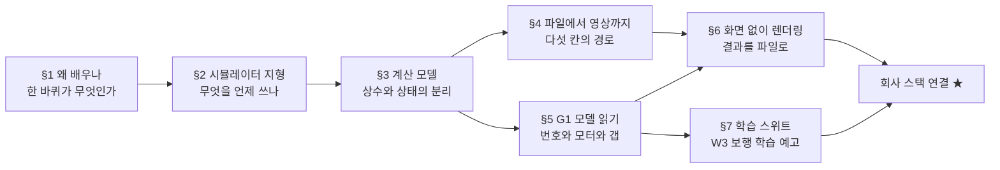

**읽는 법.** 화살표는 읽는 순서가 아니라 논리가 기대는 방향입니다. §3에서 갈라지는 지점을 보세요. 왼쪽 §4와 §6은 결과를 눈으로 보는 길이고, 오른쪽 §5와 §7은 로봇 모델을 깊이 파는 길이며, 둘이 마지막에서 만납니다.

**선수 지식**

| 영역 | 이 문서가 가정하는 것 | 어디서 채우나 |
|---|---|---|
| 머신러닝과 딥러닝 | 학습, 손실, 신경망, 과적합을 안다고 봅니다 | 이 과정의 출발선입니다 |
| 언어 모델 | 프롬프트, 토큰이라는 말, 파인튜닝을 안다고 봅니다 | 이 과정의 출발선입니다 |
| 층 구조와 주파수 | 위층이 느리고 아래층이 빠르다는 그림을 씁니다 | [W1-M1](../01-physical-ai-landscape/lesson.md), §7.4에서 회수합니다 |
| 물리, 제어, 로봇 모델, 원격 렌더링 | 아무것도 가정하지 않습니다 | 필요한 자리마다 이 문서가 처음부터 설명합니다 |

**완료 기준**: 인스턴스에서 G1을 불러 사인파 명령으로 팔다리를 흔든 영상을 `artifacts/W1-M2/`에 저장하고, `mujoco_playground`의 `G1JoystickFlatTerrain`이 오류 없이 한 스텝 도는 것까지 확인한 다음, 그 과정에서 만난 오류와 걸린 시간을 `docs/progress.md`에 기록합니다

**소요**: 이론 150분 / 실습 4~6h (시뮬레이터 첫 경험이므로 Day 3 오전까지 허용합니다)

> 📌 **여기까지 정리**
> - 이 모듈은 지식이 아니라 **작업 환경**입니다. W2와 W3의 실습이 이 위에서 돕니다
> - 세 질문에는 §3과 §5와 §6이 답합니다
> - 산출물은 영상 파일 하나와 무엇이 어긋났는지 안다는 상태입니다

---

## 1. 왜 이걸 배우나

로봇을 실제로 사서 넘어뜨려 가며 배우는 사람은 없습니다. 대신 컴퓨터 안에 로봇과 바닥과 중력을 만들어 놓고 거기서 넘어뜨립니다. 그런데 그 안에서 정확히 무슨 계산이 도는지 모르면 결과를 믿을 수도 의심할 수도 없습니다. 이 절은 시뮬레이터가 반복하는 한 바퀴를 처음부터 설명하고, 그중 무엇이 진짜 어려운 부분인지 가려낸 다음, 정작 시간을 잡아먹는 것은 그 어려운 부분이 아니라는 점을 짚습니다.

### 1.1 시뮬레이터는 무엇을 반복하는 프로그램인가

**시뮬레이터**는 지금 상태를 받아 아주 짧은 시간 뒤의 상태를 계산하는 일을 쉬지 않고 반복하는 프로그램입니다. 로봇에서 상태는 두 묶음입니다. 관절이 얼마나 굽어 있는가 하는 자세와, 그것이 얼마나 빨리 변하고 있는가 하는 속도입니다.

한 바퀴는 세 단계입니다. 먼저 로봇에 걸리는 힘을 전부 모읍니다. 중력이 아래로 당기고, 모터가 관절을 밀고, 바닥이 발을 떠받칩니다. 그다음 그 힘으로 각 부분이 얼마나 빨라질지를 구하고, 마지막으로 아주 짧은 시간을 곱해 속도와 자세를 차례로 갱신합니다. 이렇게 짧은 시간 조각을 이어 붙여 긴 움직임을 만드는 방식이 **수치적분**입니다.

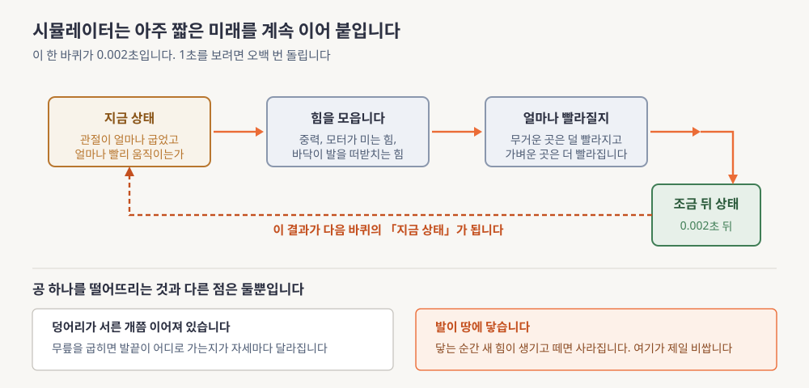

**읽는 법.** 위쪽 네모 넷을 왼쪽에서 오른쪽으로 따라가고, 마지막에서 첫 칸으로 돌아오는 주황 점선을 보세요. 아래 두 칸은 공 하나를 떨어뜨리는 계산과 달라지는 지점 둘입니다.

시간 조각을 얼마나 짧게 잡느냐가 첫 번째 선택입니다. 짧을수록 정확하지만 같은 1초를 보는 데 계산을 더 많이 해야 합니다. MuJoCo에서 이 값이 `timestep`이고 G1 모델은 0.002초라 1초를 보려면 500번 돕니다.

공 하나를 떨어뜨리는 계산과 달라지는 것은 둘뿐입니다.

- **여러 덩어리가 관절로 이어져 있습니다.** 이런 계를 **다물체**라고 부릅니다. 덩어리 하나면 무거운 정도가 숫자 하나지만, 서른 개가 얽히면 무릎을 굽힐 때 어깨가 어디로 가는지가 자세에 따라 달라집니다. 그래서 무거운 정도가 자세마다 달라지는 표 한 장이 되고, 이것이 **질량행렬**입니다
- **발이 땅에 닿습니다.** 이것이 **접촉**입니다. 닿는 순간 바닥이 발을 떠받치는 힘이 생기고 떼면 사라집니다. 매 바퀴 어디가 닿았는지 찾고 닿은 곳마다 힘을 새로 풀어야 합니다

둘 중 어려운 쪽은 접촉입니다. 다물체는 계산이 커질 뿐 매 바퀴 같은 일을 하지만, 접촉은 매 바퀴 미지수의 개수 자체가 달라집니다. MuJoCo에서 가장 비싼 계산이 여기이고 `solver iterations`라는 설정이 존재하는 이유도 이것입니다.

### 1.2 진짜 병목은 이론이 아닙니다

시뮬레이터를 처음 쓰는 사람이 하루를 통째로 날리는 지점은 위의 물리가 아닙니다. 훨씬 시시한 것들입니다.

- `scene.xml`과 `g1.xml` 중 무엇을 불러야 하는지 몰라 로봇이 허공에서 떨어집니다
- 자세는 36칸인데 속도는 35칸이고, 그 차이를 모르고 자세에 속도를 더했다가 숫자가 폭발합니다
- 명령의 3번 칸을 건드렸는데 자세에서는 10번 칸이 움직이는 것을 보고 헤맵니다
- 원격 컴퓨터에서 그림을 그리려다 죽고, `pip install mujoco_playground`가 없는 패키지라는 것을 한참 뒤에 압니다

전부 손에 익어야 사라지는 문제입니다. 그래서 원칙이 하나 붙습니다. **환경이 안 돌아가는 상태로 다음 주로 넘어가지 않습니다.**

### 1.3 이 모듈은 작업 환경입니다

여기서 만드는 것은 지식이 아니라 앞으로 계속 쓸 도구입니다.

- 인스턴스 설정과 화면 없는 렌더링, 세션 관리, 저장 공간 규약은 W2와 W3가 그대로 재사용합니다
- MuJoCo와 G1 모델을 읽을 수 있게 되는 것은 W3-M1의 보상 설계와 W3-M5의 검증에서 회수됩니다
- 학습용 설정과 검증용 설정이 다르다는 감각은 **sim2sim**의 축소판입니다. 학습에 쓴 시뮬레이터가 아닌 다른 시뮬레이터에서 정책을 다시 돌려보는 검증 관문을 그렇게 부르고, 왜 그래야 하는지는 §3.5와 §5.6에서 봅니다

| 용어 | 이 절에서 나온 뜻 |
|---|---|
| **시뮬레이터** | 지금 상태에서 아주 짧은 시간 뒤의 상태를 계산하는 일을 반복하는 프로그램 |
| **수치적분** | 짧은 시간 조각마다 변화량을 더해 긴 시간의 움직임을 만들어내는 계산 방식 |
| **다물체** | 여러 덩어리가 관절로 이어진 계. 무거운 정도가 자세에 따라 달라집니다 |
| **질량행렬** | 그 무거운 정도를 자세마다 담은 표. 기호로는 $M(q)$로 씁니다 |
| **접촉** | 발이 땅에 닿는 순간 생겼다가 떼면 사라지는 힘. 매 스텝 새로 풀어야 합니다 |
| **sim2sim** | 학습에 쓴 시뮬레이터가 아닌 다른 시뮬레이터에서 정책을 다시 검증하는 관문 |

> 📌 **여기까지 정리**
> - 한 바퀴는 힘을 모으고, 가속도를 구하고, 짧은 시간을 곱해 상태를 갱신하는 셋입니다
> - 새로 얹히는 것은 다물체와 접촉 둘이고 어려운 쪽은 접촉입니다
> - 시간을 잡아먹는 것은 물리가 아니라 파일과 번호와 렌더링입니다

---

## 2. 시뮬레이터 지형

§1에서 시뮬레이터가 무엇을 계산하는지 봤지만 어느 프로그램을 쓸지는 아직 정하지 않았습니다. 후보가 여럿이고 이름이 비슷해 처음에는 경쟁 관계처럼 보입니다. 이 절은 셋이 사실 위아래로 쌓인 한 줄이라는 것을 보이고, 상황별 갈래를 그린 다음, 이 4주가 MuJoCo를 고른 이유를 정리합니다.

### 2.1 셋은 위아래로 쌓인 한 줄입니다

먼저 이름부터 풉니다. **MuJoCo**는 물리를 계산하는 엔진 본체입니다. **MJX**는 같은 계산을 JAX로 다시 구현한 것인데, JAX가 같은 계산을 수천 개 데이터에 한꺼번에 적용하는 데 강해서 그래픽카드에서 환경 수천 개를 동시에 굴릴 수 있습니다. **mujoco_playground**는 MJX 위에 학습용 환경과 보상과 학습 스크립트를 얹은 모음집입니다.

여기서 학습이라는 말은 **RL(Reinforcement Learning, 강화학습)**을 가리킵니다. 정답 데이터를 주는 대신 잘한 정도를 점수로 주고, 그 점수를 크게 만드는 행동 규칙을 시행착오로 찾는 방식입니다. 그 행동 규칙을 정책이라고 부릅니다. 정책을 갱신하는 알고리즘 중 이 과정에서 쓸 것이 **PPO(Proximal Policy Optimization, 근접 정책 최적화)**이고, 한 번에 크게 바꾸지 않도록 변화량에 제한을 걸어 학습이 뒤집히는 것을 막습니다.

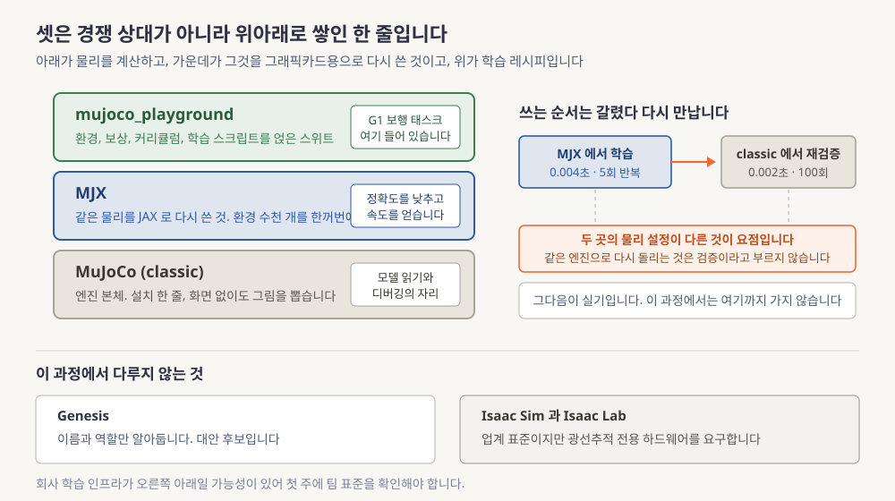

**읽는 법.** 왼쪽 세 층을 아래에서 위로 읽으세요. 아래가 물리를 계산하고 가운데가 그것을 그래픽카드용으로 다시 쓴 것이며 위가 학습 레시피입니다. 그다음 오른쪽 위 흐름에서 학습과 검증이 서로 다른 설정을 쓴다는 점을 확인하세요.

| 이름 | 설치 | 그래픽카드 병렬 | 이 4주에서의 역할 |
|---|---|---|---|
| **MuJoCo (classic)** | `pip install mujoco` 한 줄 | 안 됩니다 | **주력.** 모델 이해, 디버깅, 검증 |
| **MJX** | mujoco와 함께 설치됩니다 | 됩니다 | 학습 백엔드 |
| **mujoco_playground** | `pip install "playground==0.2.0"` | 됩니다 | **W3 보행 학습 스위트.** G1 태스크 내장 |
| **Genesis** | pip | 부분적으로 됩니다 | 대안. 이번 4주에는 쓰지 않습니다 |
| **Isaac Sim / Isaac Lab** | Omniverse 스택 또는 컨테이너 | 됩니다 | **개념만.** §2.3의 경고를 보세요 |
| PyBullet / Drake | pip 또는 별도 설치 | 안 됩니다 | 이름과 역할만 알아둡니다 |

Isaac 계열이 무거운 이유는 렌더링 요구 때문입니다. 사실적인 그림을 그리려고 광선의 경로를 따라 계산하는데, 그 계산을 전담하는 하드웨어 유닛이 그래픽카드에 붙어 있어야 합니다. 이것이 **RT 코어**이고 없으면 화면이 나오지 않습니다. 후보별 접촉 계산 방식의 차이는 [deep-dive.md](deep-dive.md) §1에 있습니다.

### 2.2 어느 것을 쓸 것인가

무엇을 하려는지에 따라 답이 갈립니다.

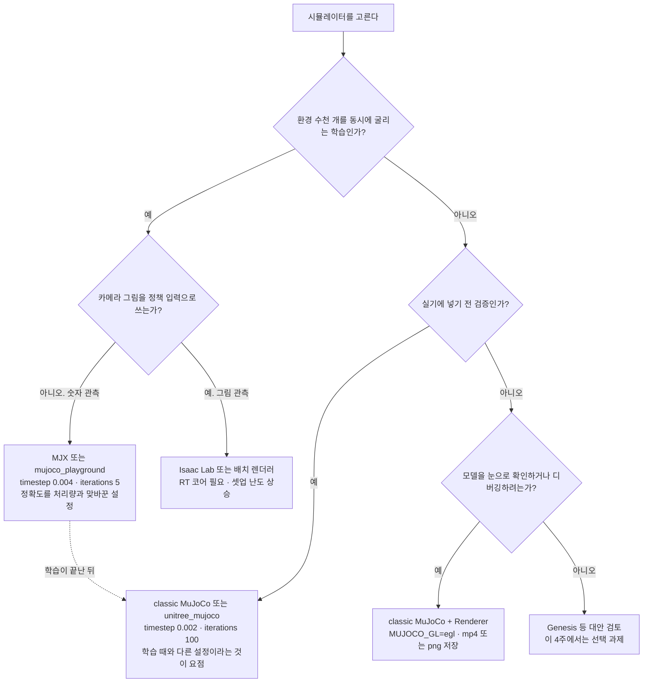

**읽는 법.** 맨 위에서 질문을 따라 내려가면 다섯 갈래 중 하나에 도착합니다. 그중 점선 하나만 다른 성격인데, 학습 경로와 검증 경로가 갈라졌다가 학습이 끝난 뒤 다시 만나는 지점을 표시한 것입니다.

### 2.3 왜 이 4주는 MuJoCo인가

세 가지 이유가 있습니다.

- **설치가 한 줄입니다.** 인스턴스를 만들었다 지웠다 하며 일할 때 셋업이 3분이냐 30분이냐가 학습 속도를 정합니다
- **화면이 없어도 됩니다.** 창 없이 그림만 뽑는 경로가 다져져 있고 물리 계산에는 그림이 아예 필요 없습니다
- **검증의 표준 관문입니다.** 관행이 대량 병렬 학습을 한쪽에서 하고 MuJoCo에서 다시 확인한 뒤 실기로 가는 순서인데, Unitree가 `unitree_mujoco`에 G1을 넣어둔 것이 물증입니다

> ⚠️ **여기서 많이 헷갈립니다**
> 이 세 가지가 MuJoCo가 더 좋은 시뮬레이터라는 뜻처럼 읽힙니다.
> 그렇지 않습니다. 이것은 전부 **개인 학습 조건에서의 최적해**를 말하는 근거이고, 회사에서 쓰는 표준과는 다른 문제입니다. 조건이 바뀌면 답도 바뀝니다.

> ⚠️ **팀 확인 필요, 마스터플랜 §12 경고**
> 마스터플랜은 회사 학습 인프라가 Isaac 기반일 가능성이 높으니 **첫 주에 팀 표준 학습 환경을 반드시 확인하라**고 명시합니다. 시뮬레이터와 클러스터와 도커 이미지 셋입니다. 팀 표준이 Isaac Lab이면 W3의 경로를 그쪽으로 옮기게 되는데, 그때도 MuJoCo 지식은 검증 단계에서 그대로 쓰입니다.

SONIC과 HOMIE가 각각 어느 시뮬레이터를 쓰는지는 이 시점에 확인하지 않았습니다. W3-M3와 W3-M4의 항목입니다.

| 용어 | 이 절에서 나온 뜻 |
|---|---|
| **MuJoCo** | 물리를 계산하는 엔진 본체. 설치가 한 줄이고 화면 없이 돌아갑니다 |
| **MJX** | 같은 물리를 JAX로 다시 구현해 그래픽카드에서 수천 환경을 동시에 굴리는 것 |
| **mujoco_playground** | MJX 위에 환경과 보상과 학습 스크립트를 얹은 모음집 |
| **RL** | 정답 대신 점수를 주고 그 점수를 크게 만드는 행동 규칙을 시행착오로 찾는 학습 |
| **PPO** | 정책을 한 번에 크게 바꾸지 않도록 제한을 건 강화학습 알고리즘 |
| **RT 코어** | 광선의 경로를 따라 그림을 그리는 전용 하드웨어 유닛 |

> 📌 **여기까지 정리**
> - 셋은 엔진과 그 그래픽카드 구현과 학습 스위트로 이어진 한 줄입니다
> - 학습에 쓰는 설정과 검증에 쓰는 설정은 달라야 합니다
> - MuJoCo 선택은 개인 조건의 최적해이고 회사 표준은 따로 확인해야 합니다

---

## 3. MuJoCo의 계산 모델

§2에서 무엇을 쓸지 정했으니 이제 그 안을 열어봅니다. MuJoCo를 쓸 때 코드에서 만나는 것은 딱 두 덩어리인데, 이 둘이 왜 나뉘어 있는지를 알면 그래픽카드로 환경 수천 개를 굴리는 이야기가 저절로 풀립니다. 이 절은 그 분리를 설명하고, 운동방정식의 각 항을 코드의 이름과 짝지은 다음, 자세와 속도의 길이가 왜 다른지와 학습용 설정이 왜 정확도를 낮추는지를 봅니다.

### 3.1 상수 묶음과 상태 묶음이 나뉜 이유

MuJoCo에서 모델 파일을 불러오면 두 개의 물건이 만들어집니다.

**`mjModel`**은 모델 파일을 읽어 만든 상수 묶음입니다. 링크의 질량, 관절 가동범위, 모터 세기, 시간 조각 길이처럼 시뮬레이션이 도는 내내 바뀌지 않는 값들입니다. **`mjData`**는 매 스텝 변하는 것들이라 지금 자세와 속도, 방금 구한 가속도, 넣어준 명령, 이번 스텝의 접촉이 들어 있습니다.

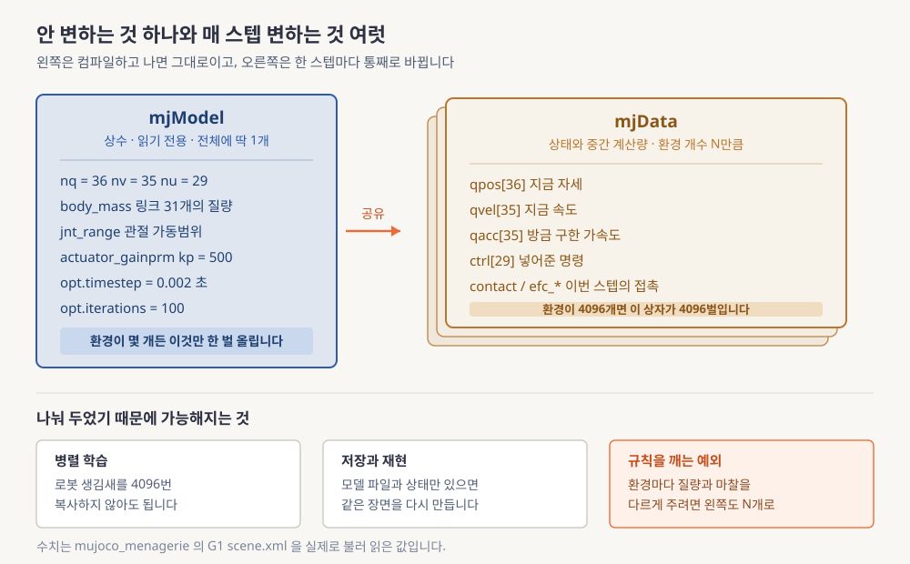

**읽는 법.** 왼쪽 파란 상자와 오른쪽 노란 상자 더미의 개수 차이를 먼저 보세요. 왼쪽은 하나뿐이고 오른쪽은 환경 개수만큼 쌓입니다. 아래 세 칸이 그 분리 덕분에 가능해지는 일들이고, 맨 오른쪽만 그 규칙을 일부러 깨는 예외입니다.

이 분리가 없으면 **그래픽카드 병렬 학습이 성립하지 않습니다.** MJX는 `mjModel` 하나만 그래픽카드에 올려두고 `mjData`만 환경 개수만큼 복제해 굴립니다. 같은 분리 덕분에 상태 쪽만 따로 적어두면 나중에 같은 장면을 그대로 되살릴 수도 있습니다. 모델 파일에 이름을 붙여 저장해 둔 자세가 그런 쓰임이고 §3.5에서 다시 만납니다.

**숫자를 넣어봅니다.** 환경을 4096개 굴린다고 합시다. 무엇이 한 벌뿐이고 무엇이 4096벌인지를 세어봅니다.

- 한 벌뿐인 쪽은 `mjModel` **1개**입니다. 링크 31개의 질량, 관절 30개의 가동범위, 모터 29개의 세기, 시간 조각 0.002초는 모든 환경에서 같은 값이라 복제할 이유가 없습니다
- 4096벌인 쪽은 `mjData`입니다. 자세 36칸, 속도 35칸, 가속도 35칸, 명령 29칸이 환경마다 따로 있어야 하므로 자세만 세어도 $4096 \times 36 = 147{,}456$칸입니다
- 네 배열만 합치면 환경 하나당 $36 + 35 + 35 + 29 = 135$칸이고 4096개면 $4096 \times 135 = 552{,}960$칸이 됩니다. 여기에 접촉 개수만큼 늘었다 줄었다 하는 배열이 더 붙습니다
- `mjModel`까지 복제했다면 메시를 포함한 로봇 생김새 전체가 4096벌이 됩니다. 같은 값을 4096번 저장하는 셈이라 얻는 것이 없습니다

이 규칙을 일부러 깨는 기법이 하나 있습니다. **도메인 랜더마이제이션**은 환경마다 질량과 마찰과 신호 지연을 다르게 뿌려놓고 학습시켜 실기에서도 버티는 정책을 만드는 방법인데, 그러려면 하나여야 할 `mjModel`의 일부 필드까지 환경별로 갈라야 합니다([deep-dive.md](deep-dive.md) §2.1).

### 3.2 한 스텝 안에서 벌어지는 일

`mj_step`이라는 함수를 한 번 부르면 다섯 단계가 순서대로 돕니다. 관절 각도에서 각 링크가 공간의 어디에 있는지를 구하고, 질량행렬과 중력 항을 계산하고, 어디가 어디에 닿았는지를 찾고, 접촉력을 반복 계산으로 풀고, 마지막으로 적분해 다음 상태를 만듭니다. 비용의 대부분은 뒤의 두 단계에 몰려 있습니다. 각 단계의 내부 전개는 [deep-dive.md](deep-dive.md) §2에 있습니다.

### 3.3 운동방정식과 필드 이름 짝짓기

한 스텝의 계산은 결국 아래 식을 가속도에 대해 푸는 일입니다.

$$
M(q)\,\ddot q + c(q,\dot q) \;=\; \tau_{\text{act}} + J_c^\top f_c
\qquad \text{(eq. 1)}
$$

기호를 정의합니다. $q$는 자세를 모아놓은 벡터, $\dot q$는 속도, $\ddot q$는 가속도입니다. $M(q)$는 §1.1의 질량행렬이고 자세에 따라 값이 달라지므로 $q$가 괄호에 붙습니다. $c(q,\dot q)$는 중력과 회전으로 생기는 힘을 모은 항, $\tau_{\text{act}}$는 모터가 내는 힘, $J_c^\top f_c$는 접촉이 내는 힘입니다. 여기서 $f_c$가 접촉력 자체이고 $J_c^\top$가 그것을 관절 쪽 좌표로 옮기는 변환입니다.

| 항 | 의미 | `mjData` 필드 | 차원 (G1 classic) |
|---|---|---|---|
| $M(q)$ | 자세에 따라 달라지는 질량행렬 | `M` (희소 저장) | $35\times35$ 상당 |
| $c(q,\dot q)$ | 중력과 회전으로 생기는 힘 | `qfrc_bias` | `[35]` |
| $\tau_{\text{act}}$ | 모터가 만든 힘 | `qfrc_actuator` ← `ctrl` | `[35]` ← `[29]` |
| $J_c^\top f_c$ | 접촉이 만든 힘 | `qfrc_constraint` | `[35]` ← `[nefc]` |
| $\ddot q$ | 가속도 | `qacc` | `[35]` |

모든 벡터의 길이가 35이지 36이 아닙니다. 왜 그런지는 §3.4에서 봅니다.

**숫자를 넣어봅니다.** 실측값은 총질량 33.341킬로그램, 속도 길이 35, 저장된 질량행렬 원소 341개입니다.

- 질량행렬을 표 전체로 저장하면 $35 \times 35 = 1225$개가 필요한데 실제로는 341개뿐이라 $341 \div 1225 \approx 0.28$, **28퍼센트만 씁니다.** 이어져 있지 않은 관절끼리는 값이 0이라 자리를 만들지 않기 때문이고 이런 방식을 희소 저장이라고 합니다
- 가만히 서 있을 때 중력이 만드는 힘은 $33.341 \times 9.81 = 327.1$뉴턴입니다
- 두 발이 절반씩 받으면 발 하나에 $327.1 \div 2 = 163.6$뉴턴이 걸립니다. 이 값이 $J_c^\top f_c$로 들어와 중력을 상쇄하므로 $\ddot q$가 0에 가까워지고 로봇이 가만히 있게 됩니다

미지수로 남는 것은 접촉력 $f_c$뿐입니다. 접촉은 닿으면 밀고 떨어지면 0이라는 조건인데 이것이 두 값의 곱이 0이라는 형태로 적히고, 이런 조건을 **상보성 제약**이라고 부릅니다. 그냥 풀리지 않아서 MuJoCo는 딱딱한 조건을 아주 뻣뻣한 스프링과 감쇠기로 바꿔 근사합니다. 이 방식이 **soft constraint**이고, 대가는 발이 바닥에 미세하게 파고드는 것이며 이득은 결과가 매끄럽게 변해 학습에서 기울기를 쓸 수 있다는 것입니다([deep-dive.md](deep-dive.md) §3).

> ⚠️ 질량행렬이 담긴 필드는 **`data.M`**입니다. 예전 문서와 예제에 나오는 `data.qM`은 지금 버전에 없습니다([deep-dive.md](deep-dive.md) §10.1).

### 3.4 자세 목록과 속도 목록의 길이가 다른 이유

G1 모델을 불러 길이를 재보면 자세는 36칸이고 속도는 35칸입니다. 한 칸 차이가 나는 이유는 몸통에 있습니다.

로봇의 몸통은 땅에 고정되지 않고 공중에 떠 있어서 어디에 있는지 세 숫자와 어느 쪽을 보는지를 따로 적어야 합니다. 문제는 회전을 적는 방법입니다. 회전은 실제로 세 방향으로만 자유로운데 세 숫자로 적으면 특정 자세에서 계산이 무너지는 지점이 생깁니다. 그래서 숫자 네 개를 쓰되 그 제곱합이 항상 1이 되도록 묶어두는데, 이 표현이 **쿼터니언**입니다.

```
nq = 36 = 7 + 29
nv = 35 = 6 + 29
nu = 29 = 0 + 29

qpos[:7] = [0, 0, 0.79, 1, 0, 0, 0]
```

위 블록의 `nq`가 자세 길이, `nv`가 속도 길이, `nu`가 명령 길이입니다. 몸통이 자세에서는 7칸(위치 3 + 회전 4), 속도에서는 6칸(선속도 3 + 각속도 3)을 차지하고, 명령에서는 모터가 없어 자리를 차지하지 않습니다. 나머지 29는 관절 개수입니다. 아래 줄은 서 있는 자세를 실제로 읽은 값인데, 앞 세 개가 위치라 골반 높이가 0.79미터이고 뒤 네 개가 회전이라 첫 값이 1이면 아무 방향으로도 돌지 않은 상태입니다.

**숫자를 넣어봅니다.** 손이 달린 모델은 자세 50칸, 속도 49칸, 명령 43칸입니다. 관절 개수를 거꾸로 구해봅니다.

- 명령 길이가 곧 모터 개수이고 몸통에는 모터가 없으니 **관절은 43개**입니다
- 검산하면 자세는 $7 + 43 = 50$, 속도는 $6 + 43 = 49$로 실측과 맞습니다
- 차 $50 - 49 = 1$은 언제나 몸통 하나당 1입니다. 회전을 네 숫자로 적는데 실제 자유도는 셋이라 한 칸이 남기 때문입니다

자세와 속도는 칸 수가 다르므로 서로 더할 수 없고, 여기서 결과가 셋 따라옵니다.

- **자세에 속도를 그냥 더하면 안 됩니다.** `mj_integratePos`를 써야 회전 부분이 올바르게 갱신됩니다
- **두 자세의 차이도 뺄셈이 아닙니다.** `mj_differentiatePos`가 길이 35짜리 차이를 돌려줍니다
- **자세의 4번째부터 7번째 칸은 쿼터니언입니다.** MuJoCo는 실수부를 앞에 적고 scipy는 뒤에 적으므로 섞어 쓸 때 순서를 맞춰야 합니다

> ⚠️ **여기서 많이 헷갈립니다**
> 자세 목록과 속도 목록의 번호가 같은 관절을 가리킬 것 같습니다.
> 몸통이 앞자리를 다른 칸 수만큼 먹기 때문에 관절 하나가 두 목록에서 다른 번호를 갖습니다. 여기에 명령 목록까지 더하면 번호가 셋으로 갈리고, §5.4에서 그 셋을 한 줄에 놓고 봅니다.

### 3.5 검증용 설정과 학습용 설정이 다른 이유

같은 G1인데 모델 파일이 두 벌 있고 물리 설정이 서로 다릅니다.

| 설정 | classic `g1.xml` | MJX `g1_mjx.xml` |
|---|---|---|
| `opt.timestep` | **0.002** 초 (초당 500회) | **0.004** 초 (초당 250회) |
| `opt.iterations` | **100** | **5** |
| `opt.ls_iterations` | **50** | **8** |
| 모터 세기 `kp` | **500** (전 관절 동일) | **75**, 발목 4개와 손목 6개는 **20** |
| 모터 감쇠 `kv` | 관절별로 다름 | **2** (전 관절 동일) |
| 충돌 계산용 도형 개수 | 72 | **63** |
| 저장된 자세 개수와 이름 | 1개 `['stand']` | 2개 `['home', 'knees_bent']` |

MJX 쪽이 정확도를 낮춘 이유는 처리량입니다. 총 계산량은 스텝당 비용에 스텝 수를 곱한 값이라 둘을 함께 깎으면 학습이 빨라지고, 그렇게 생긴 오차는 도메인 랜더마이제이션이 흡수한다는 전제가 깔려 있습니다.

**숫자를 넣어봅니다.** 20초짜리 한 판을 돌리는 데 접촉력 풀기가 몇 번 도는지를 두 설정에서 각각 셉니다. 접촉력 풀기는 스텝마다 최대 `iterations`번 반복합니다.

- classic은 $20 \div 0.002 = 10{,}000$스텝을 돌고 스텝마다 최대 100번이니 $10{,}000 \times 100 = 1{,}000{,}000$번입니다
- MJX는 $20 \div 0.004 = 5{,}000$스텝을 돌고 스텝마다 최대 5번이니 $5{,}000 \times 5 = 25{,}000$번입니다
- 비는 $1{,}000{,}000 \div 25{,}000 = 40$이라 **40배 차이**입니다. 학습에 수억 스텝이 드는 것을 생각하면 이 배수가 곧 학습을 며칠에서 몇 시간으로 줄입니다
- 모터 세기를 500에서 75로 낮춘 것도 같은 이유에서 나옵니다. 뻣뻣한 스프링일수록 짧은 시간 조각을 요구하는데 시간 조각을 두 배로 키웠으니 스프링도 함께 물렁하게 만들어야 계산이 발산하지 않습니다

이 두 파일의 관계가 sim2sim의 축소판입니다. 같은 로봇의 모델이 두 벌 있고 물리 파라미터가 다르며, 한쪽에서 학습한 정책이 다른 쪽에서도 서는지 확인하는 것이 W3-M5의 과제입니다. 저장된 자세의 이름까지 달라 같은 코드로 초기 자세를 불러오면 두 파일에서 서로 다른 자세가 나옵니다([deep-dive.md](deep-dive.md) §2.2).

| 용어 | 이 절에서 나온 뜻 |
|---|---|
| **`mjModel`** | 모델 파일을 읽어 만든 상수 묶음. 시뮬레이션 내내 바뀌지 않습니다 |
| **`mjData`** | 매 스텝 변하는 상태와 중간 계산량. 환경 개수만큼 만듭니다 |
| **도메인 랜더마이제이션** | 환경마다 질량과 마찰과 지연을 다르게 뿌려 학습시키는 기법 |
| **상보성 제약** | 닿으면 밀고 떨어지면 0이라는 조건을 두 값의 곱이 0인 형태로 적은 것 |
| **soft constraint** | 그 딱딱한 조건을 뻣뻣한 스프링과 감쇠기로 바꿔 근사하는 방식 |
| **쿼터니언** | 회전을 숫자 네 개로 적는 방법. 제곱합이 항상 1로 묶여 있습니다 |

> 📌 **여기까지 정리**
> - `mjModel`은 하나, `mjData`는 환경 개수만큼입니다. 이 분리가 병렬 학습의 전제입니다
> - 접촉은 상보성 제약이고 MuJoCo는 그것을 물렁하게 바꿔 매끄럽게 만듭니다
> - 학습용 설정과 검증용 설정의 계산량 차이는 40배이고 이것이 sim2sim의 축소판입니다

---

## 4. MJCF에서 mp4까지

§3에서 상수와 상태가 나뉘어 있다는 것을 봤는데, 그 둘이 어디서 나오고 어디로 가는지는 아직 이어 붙이지 않았습니다. 이 절은 텍스트 파일 하나가 영상 파일이 되기까지의 경로를 한 장으로 그립니다. 실습 코드와 랩 문서가 이 그림의 번호를 그대로 부르므로 세부보다 순서와 번호를 기억하는 것이 목적입니다.

### 4.1 파일 하나가 영상이 되는 경로

로봇과 장면을 적어두는 텍스트 파일 형식이 **MJCF(MuJoCo XML Format)**입니다. XML은 태그로 계층 구조를 적는 텍스트 형식이고, MJCF는 그 안에 물체와 관절과 모터와 센서를 적는 규칙입니다. 그리고 창 없이 그림만 그려 숫자 배열로 돌려주는 물건이 **`Renderer`**입니다.

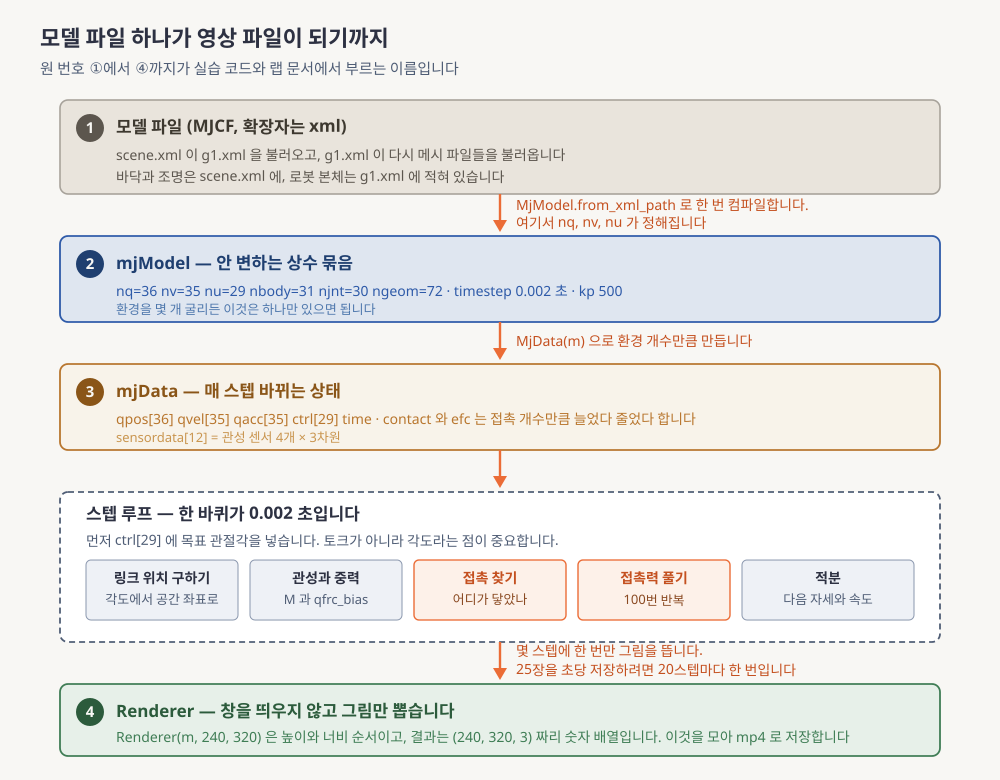

**읽는 법.** 원 번호 ①에서 ④까지를 위에서 아래로 따라가세요. 화살표 옆의 글자가 각 칸 사이에서 실제로 부르는 함수입니다. 가운데 점선 상자가 스텝 루프이고 그 안의 다섯 칸 중 주황색 둘이 접촉 관련 단계라 비용의 대부분을 차지합니다.

번호를 붙여 다시 정리하면 이렇습니다.

- **①** 모델 파일입니다. `scene.xml`이 `g1.xml`을 불러오고 `g1.xml`이 다시 메시 파일을 불러옵니다
- **②** 그 파일을 한 번 컴파일하면 `mjModel`이 나오고, 이 순간에 자세와 속도와 명령의 길이가 확정됩니다
- **③** `mjModel`에서 `mjData`를 환경 개수만큼 만듭니다
- **스텝 루프** 안에서 명령을 넣고 `mj_step`을 반복합니다. **명령이 토크가 아니라 목표 관절각**이라는 점은 §5.5에서 다룹니다
- **④** 몇 스텝에 한 번씩만 `Renderer`로 그림을 뽑아 모았다가 영상 파일로 저장합니다

`Renderer`를 만들 때 크기 순서는 **높이가 먼저이고 너비가 나중**입니다. `Renderer(m, 240, 320)`은 `(240, 320, 3)` 모양의 배열을 주고 마지막 3은 빨강과 초록과 파랑입니다. 반대로 넣으면 세로로 길쭉한 영상이 나오는데 오류가 없어서 알아차리기 어렵습니다.

| 용어 | 이 절에서 나온 뜻 |
|---|---|
| **MJCF** | 로봇과 장면을 적어두는 MuJoCo의 모델 파일 형식. 확장자는 xml입니다 |
| **`Renderer`** | 창을 띄우지 않고 그림을 그려 숫자 배열로 돌려주는 객체 |

> 📌 **여기까지 정리**
> - 경로는 모델 파일, 상수, 상태, 스텝 루프, 렌더러 다섯 칸입니다
> - 명령은 토크가 아니라 목표 관절각이고 길이는 29입니다
> - `Renderer(m, 240, 320)`은 높이 240 너비 320짜리 배열을 돌려줍니다

---

## 5. G1 모델 읽기

§4까지는 어떤 로봇에도 통하는 이야기였습니다. 이제 실제로 다룰 로봇 하나를 열어봅니다. 회사가 쓰는 하드웨어가 Unitree G1이고 그 모델 파일이 공개 저장소에 있어 직접 읽을 수 있습니다. 이 절은 관절 하나를 번호로 정확히 짚는 법을 익히고, 모터가 무슨 계산을 하는지 식으로 확인한 다음, 이 파일과 진짜 로봇이 어디서 갈라지는지를 짚습니다.

### 5.1 파일이 여러 벌인 이유

먼저 용어 하나를 풉니다. **DoF(Degree of Freedom, 자유도)**는 독립적으로 움직일 수 있는 방향의 개수이고, 로봇 스펙에서는 대체로 구동 관절 개수와 같은 뜻으로 씁니다. 팔꿈치처럼 한 방향으로 굽는 관절은 1이고 어깨처럼 세 방향으로 도는 관절은 3입니다.

Google DeepMind가 관리하는 `mujoco_menagerie` 저장소의 `unitree_g1/` 폴더가 G1입니다. 저장소 전체는 약 2.3기가바이트이고 모델 이름은 `g1_29dof_rev_1_0`입니다.

```
g1.xml                 로봇 본체만. classic 설정
g1_mjx.xml             MJX용. 충돌 도형 단순화 + 모터 세기 하향
g1_with_hands.xml      손 포함
scene.xml              g1.xml + 바닥과 조명. 시뮬레이션에는 이것을 불러옵니다
scene_mjx.xml          scene_with_hands.xml
assets/  CHANGELOG.md  LICENSE  README.md  g1.png  g1_mjx_colliders.png
```

**`g1.xml`이 아니라 `scene.xml`을 불러야 합니다.** `g1.xml`에는 바닥이 없어 로봇이 끝없이 떨어집니다. 처음 쓰는 사람이 거의 반드시 한 번은 겪습니다.

### 5.2 세 변형의 실측 비교

같은 로봇의 세 파일을 실제로 불러 읽은 값입니다.

| 항목 | `scene.xml` (classic) | `scene_mjx.xml` (MJX) | `scene_with_hands.xml` |
|---|---|---|---|
| 자세 길이 `nq` | 36 | 36 | 50 |
| 속도 길이 `nv` | 35 | 35 | 49 |
| 명령 길이 `nu` | **29** | 29 | **43** |
| 링크 개수 `nbody` | 31 | 31 | 45 |
| 관절 개수 `njnt` | 30 | 30 | 44 |
| 충돌 도형 `ngeom` | 72 | **63** | 101 |

숫자 몇 개를 덧붙입니다.

- 저장된 자세는 1개와 2개와 1개이고 이름은 `['stand']`, `['home', 'knees_bent']`, `['stand']`입니다
- 시간 조각은 0.002와 0.004와 0.002초, 접촉 반복 횟수는 100과 5와 100입니다
- 29개 관절은 **다리 12개(한쪽 6개씩) + 허리 3개 + 팔 14개(한쪽 7개씩)**입니다

### 5.3 모델의 29개와 실기 기본형의 23개는 다릅니다

공개 모델과 실제로 파는 로봇이 같지 않습니다.

| 항목 | 모델 `g1_29dof_rev_1_0` | Unitree G1 실기 (공식 스펙) |
|---|---|---|
| 구동 관절 수 | 29 | 기본형 **23** / 교육용 **23~43** |
| 허리 | 3축 (좌우 회전, 옆굽힘, 앞뒤굽힘) | 1축 (옵션으로 2축 추가) |
| 팔 | 한쪽 7개 (어깨 3 + 팔꿈치 1 + 손목 3) | 한쪽 5개 (손목 옵션으로 2개 추가) |
| 손 | 없습니다 (손 포함 버전이 따로 있습니다) | 옵션으로 손가락 관절 7개 |
| 무릎 최대 토크 | 제한이 걸려 있지 않습니다 (§5.6) | 90 N·m (기본) / 120 N·m (교육용) |
| 총질량 | 33.341 kg (단순화된 모델) | 약 35 kg (배터리 포함) |

나머지 실기 스펙은 [deep-dive.md](deep-dive.md) §5에 있습니다.

> 📌 **팀 확인 필요**: 회사 G1이 23과 29와 43 중 어느 구성인지에 따라 상위 모델이 내야 하는 숫자의 개수가 달라집니다. 답을 받기 전까지 이 실습은 29개짜리 모델로 감각을 익히는 것입니다.

### 5.4 관절 하나에 붙는 세 개의 번호

여기가 이 절의 핵심입니다. 왼쪽 무릎을 움직이려면 어느 목록의 몇 번째 칸을 건드려야 할까요.

| 관절 번호 | 이름 | 종류 | 자세 칸 | 속도 칸 | 명령 칸 | 가동범위 (rad) |
|---|---|---|---|---|---|---|
| 0 | `floating_base_joint` | free | 0~6 | 0~5 | 없습니다 | 없습니다 |
| 1 | `left_hip_pitch_joint` | hinge | 7 | 6 | 0 | [-2.531, 2.880] |
| 2 | `left_hip_roll_joint` | hinge | 8 | 7 | 1 | [-0.524, 2.967] |
| 3 | `left_hip_yaw_joint` | hinge | 9 | 8 | 2 | [-2.758, 2.758] |
| 4 | `left_knee_joint` | hinge | 10 | 9 | 3 | [-0.087, 2.880] |
| 5 | `left_ankle_pitch_joint` | hinge | 11 | 10 | 4 | [-0.873, 0.524] |
| 6 | `left_ankle_roll_joint` | hinge | 12 | 11 | 5 | [-0.262, 0.262] |

허리 세 관절만 따로 보면 이렇습니다.

| 관절 번호 | 이름 | 자세 칸 | 속도 칸 | 명령 칸 | 가동범위 (rad) |
|---|---|---|---|---|---|
| 13 | `waist_yaw_joint` | 19 | 18 | 12 | [-2.618, 2.618] |
| 14 | `waist_roll_joint` | 20 | 19 | 13 | [-0.520, 0.520] |
| 15 | `waist_pitch_joint` | 21 | 20 | 14 | [-0.520, 0.520] |

오른다리와 팔은 [deep-dive.md](deep-dive.md) §4에 있고, 좌우 대칭인 관절은 가동범위의 부호가 뒤집힙니다.

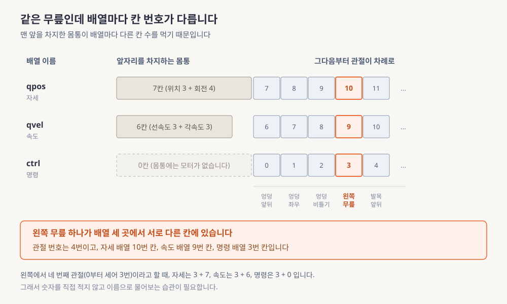

**읽는 법.** 세 줄을 위에서 아래로 읽으면서 왼쪽 회색 상자의 길이가 어떻게 줄어드는지 보세요. 자세는 7칸, 속도는 6칸, 명령은 0칸입니다. 그 길이 차이가 그대로 오른쪽 주황 칸의 번호 차이가 됩니다.

관계식은 아래와 같습니다.

```
관절 이름  →  관절 번호 = i + 1
              자세 칸  = i + 7
              속도 칸  = i + 6
              명령 칸  = i
```

**숫자를 넣어봅니다.** 위 식의 $i$는 명령 목록에서 그 관절이 몇 번째인지를 0부터 센 값입니다. 왼쪽 무릎은 왼다리의 네 번째 관절이므로 $i = 3$입니다.

- 관절 번호는 $3 + 1 = 4$입니다. 몸통 관절이 0번을 차지하므로 1이 더해집니다
- 자세 칸은 $3 + 7 = 10$이고 속도 칸은 $3 + 6 = 9$입니다. 몸통이 각각 7칸과 6칸을 먹기 때문입니다
- 명령 칸은 $3 + 0 = 3$입니다. 몸통에는 모터가 없어 자리를 차지하지 않습니다
- 정리하면 왼쪽 무릎이 **관절 4번, 자세 10번, 속도 9번, 명령 3번**입니다

```python
jid = mujoco.mj_name2id(m, mujoco.mjtObj.mjOBJ_JOINT, "left_knee_joint")
qadr = m.jnt_qposadr[jid]     # 10
vadr = m.jnt_dofadr[jid]      # 9
aid  = mujoco.mj_name2id(m, mujoco.mjtObj.mjOBJ_ACTUATOR, "left_knee_joint")  # 3
```

번호를 코드에 직접 적지 말고 위처럼 이름으로 물어보세요. 모델 버전이 바뀌면 번호가 조용히 밀립니다.

### 5.5 모터가 실제로 하는 계산

모델 파일에서 각 관절의 모터는 이렇게 한 줄로 적혀 있습니다.

```xml
<position kp="500" dampratio="1" inheritrange="1"/>
```

여기 쓰인 방식이 **PD 위치 서보**입니다. 목표 각도와 지금 각도의 차이에 비례해 미는 힘을 만들고, 거기에 지금 속도에 비례한 제동을 더합니다. 이름의 P는 차이에 비례한다는 뜻이고 D는 속도에 반응한다는 뜻입니다.

$$
f \;=\; k_p\,(\texttt{ctrl} - q) \;-\; k_v\,\dot q
\qquad \text{(eq. 2)}
$$

기호를 정의합니다. $f$는 관절에 걸리는 힘이고 단위는 뉴턴미터입니다. $\texttt{ctrl}$은 우리가 넣는 값, $q$는 지금 각도, $\dot q$는 지금 각속도이며, $k_p$는 차이를 힘으로 바꾸는 세기, $k_v$는 제동의 세기입니다.

여기서 결론이 하나 나옵니다. **`ctrl`에 넣는 값은 토크가 아니라 목표 관절각이고 단위는 라디안입니다.** 힘을 직접 지정하는 것이 아니라 어디로 가고 싶은지를 말하면 모터가 알아서 밉니다. 시뮬레이터가 실기 로봇의 관절 제어기를 이미 흉내 내고 있는 셈이고, 이 식은 [W1-M1 §3.1](../01-physical-ai-landscape/lesson.md)에서 본 맨 아래층의 계산과 같습니다.

**숫자를 넣어봅니다.** 왼쪽 무릎에 $k_p = 500$, $k_v = 15.847$이 걸려 있습니다. 지금 무릎이 0.3 라디안 굽어 있고 초당 0.1 라디안으로 펴지는 중인데 목표를 0.5 라디안으로 주었다고 합시다.

- 차이는 $0.5 - 0.3 = 0.2$ 라디안이고 미는 힘은 $500 \times 0.2 = 100$ 뉴턴미터입니다
- 제동은 $15.847 \times 0.1 = 1.585$ 뉴턴미터입니다
- 합치면 $100 - 1.585 = 98.4$ 뉴턴미터라 미는 쪽이 압도적이고 무릎이 목표를 향해 빠르게 접힙니다
- 목표에 거의 닿아 차이가 0.001 라디안까지 줄면 미는 힘은 $500 \times 0.001 = 0.5$ 뉴턴미터로 떨어지고, 이때는 제동 항이 상대적으로 커져 흔들림을 잡습니다

`dampratio="1"`이 뜻하는 것은 **임계감쇠**입니다. 제동이 약하면 목표를 지나쳤다 되돌아오기를 반복하며 흔들리고 세면 도달이 느려지는데, 흔들리지 않으면서 가장 빨리 도달하는 그 경계가 임계감쇠입니다. 그 지점의 제동 세기는 아래 식으로 정해집니다.

$$
k_v \;=\; 2\zeta\sqrt{k_p \, M_{\text{eff}}}
\qquad \text{(eq. 3)}
$$

$\zeta$가 감쇠비이고 임계감쇠는 $\zeta = 1$입니다. $M_{\text{eff}}$는 그 관절이 실제로 움직여야 하는 무게에 해당하는 값으로 **유효관성**이라고 부릅니다. 어깨는 팔 전체를 흔들지만 팔꿈치는 아래팔만 움직이므로 같은 로봇 안에서도 관절마다 크게 다르고, 그래서 `dampratio`는 하나인데 $k_v$는 관절마다 다른 값이 됩니다.

**숫자를 넣어봅니다.** eq. 3을 $M_{\text{eff}}$에 대해 정리하면 $M_{\text{eff}} = (k_v / 2\zeta)^2 / k_p$입니다. 팔꿈치의 실측값 $k_v = 9.42912002$, $k_p = 500$, $\zeta = 1$을 넣으면 $(9.42912002 \div 2)^2 \div 500 \approx$ **0.044 kg·m²**입니다. 네 관절을 같은 방법으로 역산한 것이 아래 표입니다.

| 관절 | $k_p$ | $k_v$ (실측) | $M_{\text{eff}}$ 역산 [kg·m²] |
|---|---|---|---|
| `left_hip_pitch_joint` | 500 | 43.01068276 | 약 0.925 |
| `left_knee_joint` | 500 | 15.84701068 | 약 0.126 |
| `left_shoulder_pitch_joint` | 500 | 16.72533692 | 약 0.140 |
| `left_elbow_joint` | 500 | 9.42912002 | 약 0.044 |

고관절이 팔꿈치보다 20배 넘게 큽니다. 위 모델 파일 한 줄이 컴파일되면 $k_p$와 $k_v$가 각각 어느 배열의 어느 칸에 들어가는지는 [deep-dive.md](deep-dive.md) §11에 적어두었습니다.

<details>
<summary>💡 제어를 아신다면 (몰라도 됩니다)</summary>

위 eq. 2는 비례 이득과 미분 이득을 가진 PD 제어기이고, 관절 하나를 2차 시스템으로 보면 eq. 3은 감쇠비 1에 해당하는 이득 설계식입니다. `dampratio` 인자를 두고 관절별 유효관성으로 $k_v$를 자동 계산하는 것은 이득을 손으로 튜닝하는 대신 감쇠비를 고정해 두는 방식입니다.
</details>

### 5.6 모델과 실기가 갈라지는 다섯 곳

같은 파일 안에 sim2real 갭의 씨앗이 숫자로 적혀 있습니다. sim2real은 시뮬레이션에서 학습한 것을 실기에 옮기는 일이고, 갭은 그 과정에서 성능을 떨어뜨리는 원인들입니다.

| 번호 | 모델 파일의 실측값 | 실기와 무엇이 다른가 |
|---|---|---|
| 1 | `forcerange = [0, 0]`이라 토크에 상한이 없습니다 | 실기 무릎은 §5.3 표의 값에서 힘이 포화합니다 |
| 2 | `armature = 0.01`이 전 관절 동일합니다 | 실제 모터 회전자의 관성은 관절마다 다릅니다 |
| 3 | `frictionloss = 0.3`이 전 관절 동일합니다 | 감속기 종류와 조립 상태와 온도에 따라 달라집니다 |
| 4 | 발 접촉이 반지름 5 mm 구 몇 개입니다 | 실기 발바닥은 평면이고 재질별 마찰이 다릅니다 |
| 5 | 센서 4개뿐이고 총질량이 33.341 kg입니다 | 실기는 약 35 kg이고 자세를 참값으로 알 수 없습니다 |

`armature`는 모터 회전자가 감속기를 지나 관절 쪽에서 얼마나 무겁게 느껴지는지를 나타내는 값이고, `frictionloss`는 관절이 돌 때 방향과 무관하게 일정하게 걸리는 마찰입니다.

여섯 번째가 있는데 이것은 **파일에 아예 적혀 있지 않습니다.** 신호 지연입니다. 실기에서는 센서를 읽고 계산하고 명령을 보내고 모터가 반응하기까지 시간이 쌓이는데 시뮬레이션에서는 0이라, 도메인 랜더마이제이션으로 따로 주입합니다([deep-dive.md](deep-dive.md) §6).

### 5.7 센서에 관절 각도계가 없습니다

모델 파일의 센서 목록을 열어보면 넷뿐입니다.

```
imu-torso-angular-velocity      [3]
imu-torso-linear-acceleration   [3]
imu-pelvis-angular-velocity     [3]
imu-pelvis-linear-acceleration  [3]
                          합계 12
```

전부 **IMU(Inertial Measurement Unit, 관성 측정 장치)**입니다. 회전 속도와 가속도를 재는 센서이고 몸통과 골반에 하나씩 붙어 있습니다. 관절이 몇 도인지 재는 센서는 목록에 없습니다.

그러면 관절 각도는 어디서 읽을까요. 자세 목록의 8번째 칸부터, 각속도는 속도 목록의 7번째 칸부터 그냥 읽습니다. 시뮬레이션이라 참값을 공짜로 주는 것입니다. 문제는 골반이 공간의 어디에 있는지까지 참값으로 준다는 점입니다. **실기는 그것을 모릅니다.** 여러 센서를 조합해 추정해야 하고 그 오차가 §5.6의 다섯 번째 씨앗입니다.

| 용어 | 이 절에서 나온 뜻 |
|---|---|
| **DoF** | 독립적으로 움직일 수 있는 방향의 개수. 대체로 구동 관절 수와 같습니다 |
| **PD 위치 서보** | 목표와의 차이에 비례한 힘에 속도에 비례한 제동을 더하는 제어 방식 |
| **임계감쇠** | 흔들리지 않으면서 가장 빨리 목표에 도달하는 제동 세기의 경계 |
| **유효관성** | 그 관절이 실제로 움직여야 하는 무게에 해당하는 값. 관절마다 다릅니다 |
| **sim2real 갭** | 시뮬레이션에서 학습한 것을 실기에 옮길 때 성능을 떨어뜨리는 원인들 |
| **IMU** | 회전 속도와 가속도를 재는 관성 측정 장치. G1 모델에는 두 개 있습니다 |

> 📌 **여기까지 정리**
> - `scene.xml`을 불러야 바닥이 있습니다. 모델은 29개, 실기 기본형은 23개입니다
> - 왼쪽 무릎은 관절 4번, 자세 10번, 속도 9번, 명령 3번입니다
> - 갭의 씨앗 다섯이 파일에 숫자로 적혀 있고 여섯 번째인 지연은 적혀 있지도 않습니다

---

## 6. 화면 없이 렌더링하기

§5까지 왔으면 로봇에 명령을 넣을 수 있습니다. 그런데 결과를 눈으로 봐야 무엇이 잘못됐는지 알 수 있고, 여기서 처음 쓰는 사람이 가장 자주 막힙니다. 원격 컴퓨터에는 모니터가 없어 창을 띄우는 방식이 통하지 않기 때문입니다. 이 절은 왜 안 되는지와 대신 무엇을 쓰는지를 설명하고, 설치 버전을 고정한 다음, 인스턴스를 쓰는 방식을 정리합니다.

### 6.1 왜 창을 띄우지 못하는가

원격 인스턴스에는 화면을 그려줄 프로그램이 아예 설치되어 있지 않습니다. 이런 상태를 **headless**라고 부릅니다. 이 상태에서 뷰어를 띄우는 함수를 부르면 창을 열 곳이 없어 실패합니다.

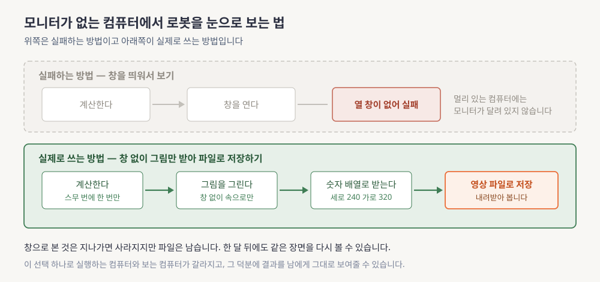

**읽는 법.** 위쪽 회색 점선 상자가 안 되는 길이고 아래쪽 초록 상자가 되는 길입니다. 두 길의 차이는 세 번째 칸에서 갈립니다. 위는 창을 열려다 실패하고 아래는 창 없이 그림을 그려 숫자 배열로 받습니다.

대신 쓰는 것이 §4.1의 `Renderer`입니다. 창 대신 메모리에 그림을 그린 뒤 숫자 배열로 돌려주고 그 배열을 모아 영상 파일로 저장합니다. 얻는 것이 하나 더 있습니다. 창으로 본 것은 지나가면 사라지지만 파일은 남아서 한 달 뒤에도 같은 장면을 볼 수 있고 남에게 그대로 보여줄 수도 있습니다.

### 6.2 백엔드 설정과 넣는 순서

MuJoCo가 그림을 그릴 때 쓸 방식을 `MUJOCO_GL`이라는 환경변수로 고릅니다. 셋 중 하나입니다.

- **`egl`**은 창 없이 그래픽카드에서 직접 그립니다. 정식 이름은 **EGL(Embedded-System Graphics Library)**이고 이 4주 내내 쓸 값입니다
- **`glfw`**는 창을 여는 경로라 화면이 붙어 있는 컴퓨터에서만 됩니다
- **`osmesa`**는 그래픽카드 없이 중앙처리장치로만 그리는 소프트웨어 렌더러입니다. 별도 라이브러리가 필요하고 느립니다

```bash
MUJOCO_GL=egl python 01_g1_load.py
```

```python
# 노트북이라면 mujoco를 import 하기 전에
import os
os.environ["MUJOCO_GL"] = "egl"
import mujoco
```

어떤 방식을 쓸지가 **`mujoco`를 불러오는 순간에 정해집니다.** 그래서 환경변수는 반드시 그보다 먼저 설정해야 하고, 나중에 바꿔도 이미 정해진 것은 바뀌지 않습니다.

> ⚠️ **여기서 많이 헷갈립니다**
> 프로그램이 끝날 때 `Exception ignored in:` 으로 시작하는 오류 메시지가 나옵니다.
> 이것은 **문제가 아닙니다.** 파이썬이 이미 무시하기로 한 예외이고 영상 파일은 정상적으로 저장돼 있습니다. 위에 저장 완료 줄이 찍혔다면 그대로 넘어가면 됩니다([deep-dive.md](deep-dive.md) §10.2).

### 6.3 설치와 버전

2026년 8월 1일에 확인한 버전입니다.

| 패키지 | 버전 | 비고 |
|---|---|---|
| `mujoco` | **3.11.0** | 파이썬 3.10 이상 필요. 설치와 실행 검증 완료 |
| `mujoco-mjx` | 3.11.0 | playground가 함께 끌어옵니다 |
| `playground` | **0.2.0** | 설치 이름과 불러오는 이름이 다릅니다. 파이썬 3.11 이상 |
| `jax` | 0.11.0 | 파이썬 3.12 이상 필요. 그래픽카드용은 따로 설치합니다 |

나머지는 `numpy` 2.5.1, `mediapy` 1.2.7, `imageio` 2.37.4, `jupytext` 1.19.5, `matplotlib` 3.11.1, `pyopengl` 3.1.10입니다. `jax`가 파이썬 3.12 이상을 요구하니 전체를 3.12로 맞추는 것이 안전합니다.

```bash
uv pip install mujoco==3.11.0 mediapy==1.2.7 imageio==2.37.4 imageio-ffmpeg jupytext==1.19.5 matplotlib==3.11.1
uv pip install "playground==0.2.0"          # mujoco_playground + jax(CPU) + mujoco-mjx
uv pip install -U "jax[cuda12]"             # 그래픽카드 인스턴스에서만
```

### 6.4 인스턴스를 쓰는 방식

마스터플랜 부록 A가 정한 원칙이 넷입니다. 인스턴스를 소모품으로 다루고, 재현성을 버전 고정으로 잡고, 렌더링을 화면 없이 돌리고, 원격에서 결과를 볼 수 있게 붙여둡니다. 접속이 끊겨도 실행이 살아 있게 하려면 **tmux** 같은 세션 관리자를 씁니다.

비용은 예산 안에서 최대한 얻어내는 문제로 다룹니다. 상한을 정하지 않은 최적화는 최적화가 아니라서 주간 상한을 먼저 정하고 그 안에서 배분하는데, 판단 기준 셋은 [deep-dive.md](deep-dive.md) §7에 있습니다. W1과 W2에는 T4나 A10G나 L4급이면 충분하고 W3에는 A10G나 L4나 L40S급이 적당합니다. **A100과 H100은 필요하지 않습니다.**

| 용어 | 이 절에서 나온 뜻 |
|---|---|
| **headless** | 모니터도 화면 그리는 프로그램도 없는 실행 환경 |
| **EGL** | 창 없이 그래픽카드에서 그림을 그리는 방식. 이 과정의 기본값입니다 |
| **tmux** | 접속이 끊겨도 살아 있는 터미널 세션 관리자 |

> 📌 **여기까지 정리**
> - 창을 띄우는 대신 그림을 배열로 받아 파일로 저장합니다
> - `MUJOCO_GL=egl`을 `import mujoco`보다 먼저 설정합니다
> - 인스턴스는 소모품이고 상태는 남는 저장 공간에 둡니다. 비용은 상한을 먼저 정합니다

---

## 7. 학습 스위트 미리보기

§6까지로 로봇을 움직이고 결과를 볼 수 있게 됐습니다. 그런데 지금까지 넣은 명령은 손으로 만든 사인파였고, W3에서는 그 자리에 학습된 신경망이 들어갑니다. 이 절은 그 학습 환경을 미리 열어보되 **오류 없이 돌아간다는 것까지만** 확인합니다. 이름 함정 하나와 환경 스펙과 주파수 구조와 보상 설계의 성격을 봅니다.

### 7.1 이름 함정부터

설치할 때 쓰는 이름과 코드에서 불러올 때 쓰는 이름이 다릅니다.

```bash
uv pip install "playground==0.2.0"            # 설치할 때의 이름
export JAX_DEFAULT_MATMUL_PRECISION=highest   # Ampere 계열 그래픽카드 공식 권장
```
```python
import mujoco_playground                      # 코드에서 불러올 때의 이름
```

`pip install mujoco_playground`는 **존재하지 않는 패키지**이고 `import playground`도 되지 않습니다.

또 하나는 처음 실행이 느리다는 점입니다. 불러오는 데 3.7초, 환경을 만드는 데 2.7초, 계산 함수를 처음 부를 때 중앙처리장치 기준 1.4초가 걸립니다. 마지막 것은 **JIT 컴파일** 때문인데, 처음 부를 때 기계어로 번역해두고 두 번째부터 재사용하는 방식입니다. 멈춘 것처럼 보여도 대개 번역 중입니다.

### 7.2 등록된 환경

`registry.locomotion.ALL_ENVS`라는 목록에 보행 환경이 **19개** 등록돼 있습니다. 이름을 넣으면 환경을 만들어주는 조회 목록이라 클래스를 직접 찾을 필요가 없습니다.

그중 G1과 H1 태스크가 **4개**입니다.

- `G1JoystickFlatTerrain`은 G1이 평지에서 속도 명령을 따라 걷는 것입니다
- `G1JoystickRoughTerrain`은 같은 것을 울퉁불퉁한 지형에서 합니다
- `H1InplaceGaitTracking`과 `H1JoystickGaitTracking`은 다른 사람 모양 로봇의 걸음 추종입니다

나머지 15개에는 네발 로봇과 또 다른 사람 모양 로봇들이 섞여 있고, 전체 목록은 [deep-dive.md](deep-dive.md) §8.1에 있습니다.

### 7.3 `G1JoystickFlatTerrain`의 실측 스펙

실제로 환경을 만들어 읽은 값입니다.

| 항목 | 값 |
|---|---|
| 관측 크기 | `{'state': (103,), 'privileged_state': (216,)}` |
| 행동 크기 | **29** (G1 관절 수와 같습니다) |
| 정책 주기 `ctrl_dt` | **0.02 초** (초당 50회) |
| 물리 주기 `sim_dt` | **0.002 초** (초당 500회) |
| 한 정책 스텝당 물리 스텝 `n_substeps` | **10** |
| 한 판의 길이 `episode_length` | 1000 스텝 (20초) |
| 행동 배율 `action_scale` | 0.5 |
| 첫 계산 함수 호출 | 중앙처리장치에서 1.4초, 보상 0.02923353761434555 |

관측이 둘로 나뉜 것이 눈에 띕니다. 이것이 **비대칭 actor-critic**입니다. 강화학습에서는 행동을 고르는 쪽과 그 행동이 얼마나 좋았는지 평가하는 쪽을 따로 두는데, 이 둘에게 서로 다른 정보를 주는 관례입니다.

행동을 고르는 쪽은 실기에서도 얻을 수 있는 103차원만 봅니다. 평가하는 쪽은 216차원을 보는데 여기에는 지형 높이나 바닥 마찰계수나 지금 걸린 외력처럼 **시뮬레이션에서만 알 수 있는 값**이 섞여 있고, 이런 값을 **특권 정보**라고 부릅니다. 실기에 배포되는 것은 행동을 고르는 쪽뿐이라 특권 정보는 학습을 쉽게 만드는 데만 쓰고 버립니다.

### 7.4 정책 50 Hz와 물리 500 Hz 사이

두 주기가 열 배 차이 납니다. 이 사이를 `n_substeps`가 메웁니다.

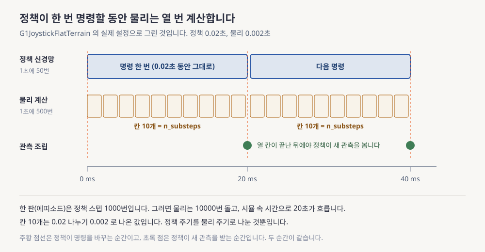

**읽는 법.** 위 파란 띠가 정책이 명령을 한 번 내는 구간이고 그 아래 노란 칸 열 개가 그동안 도는 물리 스텝입니다. 주황 점선이 명령이 바뀌는 순간이고 초록 점이 정책이 새 관측을 받는 순간인데, 두 순간이 같다는 점을 확인하세요.

**숫자를 넣어봅니다.** 실측값 `ctrl_dt = 0.02`초, `sim_dt = 0.002`초, `episode_length = 1000`을 씁니다.

- 한 정책 스텝 동안 도는 물리 스텝 수는 $0.02 \div 0.002 = 10$이고 이 값이 `n_substeps`입니다
- 한 판의 시뮬레이션 시간은 $1000 \times 0.02 = 20$초입니다
- 한 판의 물리 스텝은 $1000 \times 10 = 10{,}000$번이고 검산하면 $10{,}000 \times 0.002 = 20$초로 같습니다
- 그 열 스텝 동안에도 **물리는 계속 돕니다.** 명령은 첫 스텝에 넣은 값 그대로 열 번 쓰입니다

이 구조가 [W1-M1 §3.2](../01-physical-ai-landscape/lesson.md)에서 본 전신 제어의 주파수 대역이고, 위층이 한 번 판단할 동안 아래층이 여러 번 도는 [W1-M1 §4](../01-physical-ai-landscape/lesson.md)의 그 구조입니다. 다만 여기서는 위층이 미래 여러 스텝을 묶어 내려보내지 않고 값 하나를 열 번 재사용합니다.

### 7.5 보상 24개는 목적함수 설계입니다

강화학습에서 잘한 정도를 매기는 값이 보상입니다. `cfg.reward_config.scales`를 열어보면 항이 **24개**이고 추종 2개, 자세와 안정 8개, 접촉과 발 7개, 정규화와 비용 7개로 나뉩니다.

이 구조를 이해하려면 비교 대상이 필요합니다. **MPC(Model Predictive Control, 모델 예측 제어)**는 앞으로 몇 스텝의 명령을 통째로 계산해 맨 앞 하나만 실행하고 다음 순간에 다시 푸는 제어 방식입니다. 무엇을 기준으로 계산할지를 비용함수로 적어두는데 대체로 아래 모양입니다.

$$
J \;=\; \sum_t \Big[ (x_t - x_{\text{ref}})^\top Q (x_t - x_{\text{ref}}) \;+\; u_t^\top R\, u_t \Big]
\qquad \text{(eq. 4)}
$$

기호를 정의합니다. $x_t$는 시각 $t$의 상태, $x_{\text{ref}}$는 그때 있었으면 하는 상태라 앞항은 목표에서 벗어날수록 커집니다. $u_t$는 그때 넣은 명령이라 뒷항은 명령이 클수록 커지고, $Q$와 $R$은 두 항의 상대적 중요도입니다.

24개 항을 이 식 옆에 놓으면 짝이 보입니다. 목표를 따라가라는 항들이 $Q$의 역할이고 힘을 적게 쓰라는 항들이 $R$의 역할입니다([deep-dive.md](deep-dive.md) §8.2).

**숫자를 넣어봅니다.** 24개가 어떻게 나뉘는지 세어보고 가중치를 임의로 정한 예로 합을 구해봅니다.

- 앞 문단의 네 그룹은 **항이 무엇을 재는가**로 나눈 것이고, 지금 세는 $Q$와 $R$은 **비용함수에서 어떤 역할을 하는가**로 다시 나눈 것이라 두 분할은 서로 겹칩니다. 실습 출력이 그룹 이름 옆에 「Q의 역할」과 「R의 역할」을 그룹 통째로 붙여두는 것은 이 대응의 굵은 선만 표시한 것입니다
- $Q$의 역할이 4개인데 추종 2개에 자세와 안정 그룹의 몸통 기울기와 몸통 높이 항을 더한 것입니다. $R$의 역할 4개는 정규화와 비용 7개 중 넷입니다. 제약을 부드럽게 벌하는 항이 3개라 여기까지 합쳐서 11개입니다
- 나머지 $24 - 11 = 13$개는 발이 떠 있던 시간이나 미끄러진 정도처럼 **걷기라서 생기는 항**과, 넘어지지 않고 버티는 것 자체를 매기는 일반적인 항이 섞여 있습니다
- 속도 추종 점수가 0.8에 가중치 1.0, 에너지 소모가 3.0에 가중치 -0.01이라고 합시다. 둘만 더하면 $0.8 \times 1.0 + 3.0 \times (-0.01) = 0.77$입니다
- 이런 곱셈이 24번 일어나므로 **항끼리 크기가 크게 다르면 가중치 정하기 자체가 별개의 작업**이 됩니다. 걷기 학습 논문들이 부록에 가중치 표를 통째로 싣는 이유입니다

그러면 왜 MPC로 풀지 않고 강화학습을 쓸까요. 부호가 뒤집혀 최대화 문제가 되고 항이 24개라 튜닝이 커지는 것도 있지만 결정적인 것은 따로입니다. **발이 떠 있던 시간 같은 항은 접촉 이벤트에 걸려 있어 매끄럽지 않습니다.** 목적함수가 매끄러우면 기울기를 따라 풀면 되지 시행착오에 수백만 샘플을 쓸 이유가 없습니다. 목적함수가 이산적인 사건을 품고 있다는 것이 강화학습을 쓰는 진짜 이유입니다.

| 용어 | 이 절에서 나온 뜻 |
|---|---|
| **JIT 컴파일** | 처음 호출할 때 기계어로 번역해두고 이후 재사용하는 방식 |
| **비대칭 actor-critic** | 행동을 고르는 쪽과 평가하는 쪽에 서로 다른 관측을 주는 학습 관례 |
| **특권 정보** | 시뮬레이션에서만 알 수 있고 실기에서는 얻을 수 없는 값 |
| **`n_substeps`** | 정책이 한 번 명령할 동안 물리를 몇 번 돌릴지 정하는 수 |
| **MPC** | 앞으로 몇 스텝의 명령을 통째로 계산해 앞 하나만 실행하고 다시 푸는 제어 |

> 📌 **여기까지 정리**
> - 설치 이름은 `playground`, 불러오는 이름은 `mujoco_playground`입니다
> - 정책 50 Hz와 물리 500 Hz 사이를 `n_substeps=10`이 메웁니다
> - 보상 24항은 목적함수 설계이고, 접촉 항이 매끄럽지 않은 것이 강화학습을 쓰는 이유입니다

---

## 회사 스택 연결 ★

여기까지가 일반적인 시뮬레이터 이야기였습니다. 그런데 이 모듈에서 만든 것은 회사가 실제로 쓰는 도구들과 바로 이어집니다. 다루는 로봇이 회사가 쓰는 그 하드웨어이고, 여기서 익힌 학습 스위트가 W3에서 회사 정책을 이해하는 발판이 되며, 명령 목록 29칸이 상위 모델과 하위 제어기가 만나는 자리의 실물입니다.

약어 넷을 풀어둡니다. **WBC(Whole-Body Control, 전신 제어)**는 팔다리와 몸통을 함께 제어하는 계층, **SDK(Software Development Kit)**는 제조사 개발 도구 묶음, **DDS(Data Distribution Service)**는 그 도구가 쓰는 통신 규격입니다. **FSQ(Finite Scalar Quantization, 유한 스칼라 양자화)**는 연속적인 값을 유한한 번호로 바꾸는 방식으로, 회사가 상위 모델과 하위 제어기 사이의 인터페이스로 쓰고 W1-M5에서 직접 구현합니다.

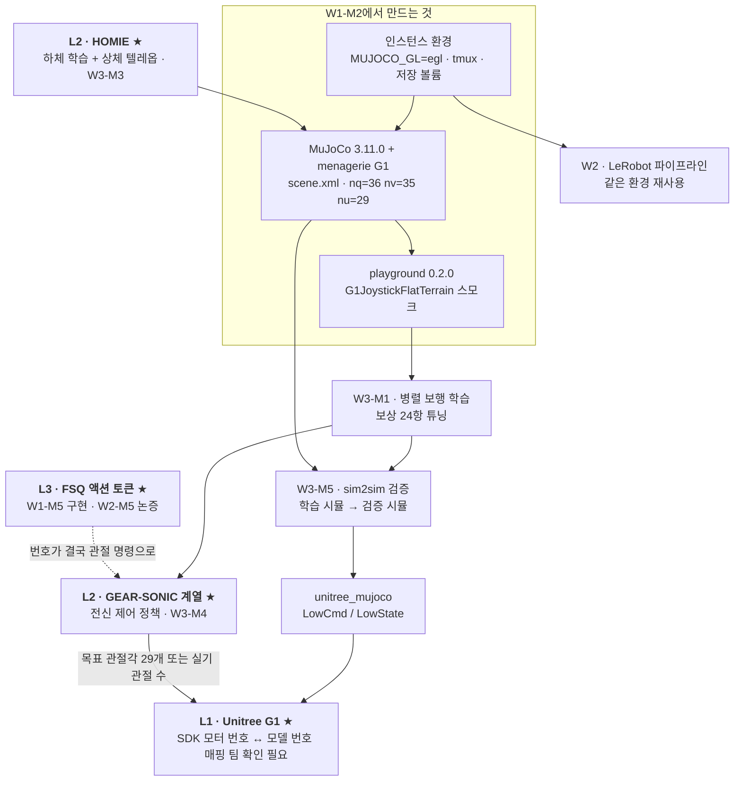

**읽는 법.** 위쪽 점선 상자가 이 모듈에서 실제로 만드는 셋이고, 거기서 나가는 화살표를 따라가면 W2와 W3의 어느 모듈로 이어지는지가 보입니다. 굵은 라벨이 붙은 아래쪽 넷이 회사 스택 구성요소이며, 점선 화살표 하나만 아직 확인되지 않은 연결입니다.

| 이 모듈의 산출물 | 연결되는 회사 스택 요소 | 어떻게 이어지는가 | 다루는 모듈 |
|---|---|---|---|
| MuJoCo와 G1 모델 이해 | **Unitree G1** ★ (L1) | 번호와 모터와 발 접촉을 아는 것이 실기 명령 이해의 최소 조건입니다 | W3-M5 |
| `mujoco_playground` 환경 | **GEAR-SONIC** ★ (L2) | SONIC의 앞 단계인 속도 추종 보행 학습을 여기서 먼저 익힙니다 | W3-M1 → W3-M4 |
| 상하체가 갈린 관절 구성 | **HOMIE** ★ (L2) | 다리 12, 허리 3, 팔 14로 갈린 §5.4의 번호가 그 분리의 실체입니다 | W3-M3 |
| classic MuJoCo 모델 | **unitree_mujoco** | 학습 시뮬레이터 밖에서 정책을 다시 검증하는 관문입니다 | W3-M5 |
| `data.ctrl[29]` 인터페이스 | **FSQ 기반 계층 모델** ★ (L3) | 상위가 무엇을 내든 사슬 끝에서는 관절 명령이 됩니다 | W1-M5, W2-M5 |
| 인스턴스와 렌더링 환경 | 전 계층 공통 | W2와 W3와 W4의 실습이 전부 이 위에서 돕니다 | W2~W4 |

두 가지를 덧붙입니다.

- 회사 FSQ 모델이 어떤 형태의 값을 내놓는지는 **확인되지 않았습니다.** 추측하지 않고 질문으로 남깁니다
- 어떤 형태든 사슬의 끝은 관절 명령입니다. `data.ctrl[3] = 0.5`로 왼쪽 무릎이 움직이는 것을 직접 보는 경험이 인터페이스 논의의 바닥입니다

`unitree_mujoco`는 W3-M5의 주역이라 지금은 존재만 알아둡니다. 지원 로봇 목록에 G1이 있고 G1은 `unitree_hg`라는 **IDL(Interface Definition Language, 인터페이스 정의 언어)** 묶음을 씁니다. 주고받을 메시지의 모양을 미리 적어두는 규약이고 상세는 [deep-dive.md](deep-dive.md) §9에 있습니다.

> ⚠️ **팀 확인 필요, 번호 매핑**
> 실기 SDK의 모터 번호와 공개 모델의 관절 번호가 **같다는 보장이 없습니다.** 대조표가 없으면 검증 단계에서 팔다리가 뒤바뀐 채로 도는 버그가 나는데, 오류 메시지가 나오지 않아 원인을 찾기가 지독하게 어렵습니다.

---

## 흔한 오해

시뮬레이터를 처음 다룰 때 반복해 나오는 오해가 넷 있습니다. 각각이 이 문서의 어느 절과 부딪히는지 짚어둡니다.

### 오해 1. "시뮬에서 되면 실기에서도 됩니다"

§5.6의 다섯 씨앗이 반박입니다. 모델 파일에는 토크 상한이 없어 시뮬 로봇은 무제한의 힘으로 균형을 잡는데 실기 무릎은 90에서 120 뉴턴미터에서 포화합니다. 발은 반지름 5밀리미터 구 몇 개이고 신호 지연은 0입니다. 그래서 다른 시뮬레이터에서 다시 확인하는 관문을 둡니다.

### 오해 2. "시간 조각을 줄이면 항상 정확해집니다"

MJX 설정은 오히려 0.002에서 0.004로 **키웠습니다.** 대신 접촉 반복 횟수를 100에서 5로, 모터 세기를 500에서 75로 낮췄습니다. 정확도는 시간 조각과 반복 횟수와 뻣뻣함의 합작이라 하나만 줄인다고 좋아지지 않고, 접촉 모델 자체가 틀렸다면 틀린 답에 더 정밀하게 수렴할 뿐입니다.

### 오해 3. "모터 번호가 곧 관절 번호입니다"

왼쪽 무릎은 관절 4번, 자세 10번, 속도 9번, 명령 3번입니다. 몸통이 자세에서 7칸, 속도에서 6칸을 먹으면서 모터는 하나도 갖지 않기 때문입니다. 여기에 실기 SDK의 모터 번호라는 체계가 하나 더 붙는데, 그 대조표가 있는지는 아직 모릅니다.

### 오해 4. "MuJoCo는 장난감이고 Isaac이 진짜입니다"

역할이 다릅니다. Isaac 쪽은 대량 병렬과 사실적인 그림에 강하고 MuJoCo는 접촉 정확도와 검증 관문으로서의 중립성에 강합니다. 다만 회사 인프라가 Isaac 기반일 가능성이 높다는 마스터플랜 §12의 경고는 유효하니 팀 표준을 먼저 확인해야 합니다.

---

## 한 장 정리

여기까지가 전부입니다. 아래 표와 그림만으로 전체가 복기되는지 확인해 보세요.

| 절 | 핵심 한 줄 |
|---|---|
| §1 | 한 바퀴는 힘을 모아 가속도를 구하고 짧은 시간을 곱해 상태를 갱신하는 일입니다 |
| §2 | 엔진과 그래픽카드 구현과 학습 스위트는 위아래로 쌓인 한 줄입니다 |
| §3 | 상수 하나와 상태 여럿의 분리가 병렬 학습의 전제입니다 |
| §4 | 모델 파일에서 영상까지는 다섯 칸이고 렌더러는 높이와 너비 순서를 받습니다 |
| §5 | 관절 하나에 번호가 셋 붙고 갭의 씨앗 다섯이 파일에 숫자로 적혀 있습니다 |
| §6 | 창 대신 배열로 받아 파일로 남깁니다. 설정은 불러오기보다 먼저 넣습니다 |
| §7 | 정책 50 Hz와 물리 500 Hz를 열 배가 잇고 보상 24항이 목적함수 설계입니다 |
| 스택 | 명령 목록 29칸이 상위 모델과 하위 제어기를 잇는 인터페이스의 바닥입니다 |

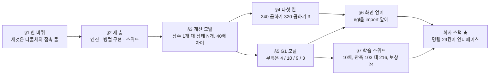

**읽는 법.** §0의 지도와 배치는 같고 두 번째 줄에 그 절의 결론이 숫자로 붙었습니다. 36과 35와 29, 341과 1225, 40배, 4와 10과 9와 3, 240 곱하기 320, 10배, 103과 216, 24가 이 모듈이 남긴 값 전부입니다.

**덮고 말해보세요.** 이 그림을 보지 않고 모델 파일에서 영상 파일까지의 다섯 칸을 순서대로 말해보세요. 그다음 왼쪽 무릎이 자세와 속도와 명령 세 배열에서 각각 몇 번 칸인지와 그 번호가 왜 다른지를 이어 말해보세요. 막히면 §4.1과 §5.4입니다.

**이제 할 수 있게 된 것**

- 상수와 상태의 분리가 왜 병렬 학습의 전제인지 설명합니다
- 자세 36칸과 속도 35칸과 명령 29칸을 각각 유도하고 왜 어긋나는지 말합니다
- 모터 설정 한 줄을 위치 서보 식으로 읽고 관절별 제동 세기 차이를 계산합니다
- 화면 없는 환경에서 결과를 영상 파일로 남깁니다
- 학습용 설정과 검증용 설정의 차이가 왜 sim2sim의 축소판인지 말합니다

---

## 셀프 체크 퀴즈

앞의 넷은 본문을 되짚으면 짧게 답이 나오고, 가운데 넷은 새 숫자를 넣어보는 것이며, 마지막 둘은 여러 절을 엮는 것입니다. 계산 문항은 손으로 풀어본 다음 실습 코드로 검산하세요.

**기억 확인** (한 줄로 답이 나오는 것)

1. `mjModel`과 `mjData`에 각각 무엇이 들어 있고 개수가 왜 다른지 말해보세요. 도메인 랜더마이제이션은 이 규칙을 어떻게 깨나요?
2. `data.ctrl`에 넣는 값의 물리적 의미와 단위는 무엇인가요? 그 값을 힘으로 바꾸는 식은 W1-M1의 어느 계층에서 본 계산과 같은가요?
3. `MUJOCO_GL`의 세 값과 원격 인스턴스에서 쓰는 값은 무엇인가요? 프로그램이 끝날 때 나오는 EGL 오류 메시지는 문제인가요?
4. `mujoco_playground`의 설치 이름과 불러오는 이름은 각각 무엇인가요? 관측이 103과 216으로 나뉜 것은 무엇을 뜻하며 실기에 배포되는 것은 어느 쪽인가요?

**적용** (배운 것을 새 상황에 넣어보는 것)

5. 손이 달린 모델은 자세 50칸, 속도 49칸, 명령 43칸입니다. 관절 개수를 구하고 자세와 속도의 차가 1인 이유를 설명해보세요.
6. 명령 칸 번호를 $i$로 둘 때 관절 번호와 자세 칸과 속도 칸이 각각 얼마인지 관계식으로 먼저 쓰고, `left_ankle_pitch_joint`의 네 번호를 구해보세요.
7. `left_shoulder_pitch_joint`의 $k_v$가 16.72533692이고 $k_p$가 500일 때 유효관성을 구해보세요.
8. 정책 주기가 0.01초이고 물리 주기가 0.002초라면 `n_substeps`는 얼마이고, 1000 정책 스텝은 시뮬 시간으로 몇 초인가요?

**종합** (여러 절을 엮어 논증하는 것)

9. 학습용 설정과 검증용 설정에서 다르게 잡힌 항목을 다섯 개 이상 들고, MJX가 정확도를 낮춘 이유와 이것이 왜 sim2sim의 축소판인지 설명해보세요.
10. 모델 파일에서 sim2real 갭의 씨앗이 되는 값을 셋 이상 들고 각각 실기와 어떻게 다른지, 그리고 파일에 아예 적혀 있지 않은 요인 하나는 무엇인지 말해보세요.

<details>
<summary>정답 보기</summary>

1. `mjModel`은 컴파일 결과인 상수 묶음이라 질량과 관절 범위와 모터 세기가 들어 있고 바뀌지 않습니다. `mjData`는 매 스텝 변하는 자세와 속도와 가속도와 명령과 접촉입니다. 로봇 생김새가 모든 환경에서 같으니 상수는 하나만 두고 상태만 복제하면 되고, 그래서 환경 4096개도 메모리가 감당됩니다. 도메인 랜더마이제이션은 환경마다 질량과 마찰과 지연을 다르게 주려고 `mjModel`의 일부 필드까지 환경별로 가르므로 이 규칙의 의도적인 예외입니다.

2. **목표 관절각이고 단위는 라디안입니다.** 토크가 아닙니다. 모터가 eq. 2로 그 각도를 향해 미는 힘을 스스로 만듭니다. 그 식의 $k_p$와 $k_v$는 모델 파일 한 줄이 `gainprm[0] = kp`와 `biasprm = [0, -kp, -kv]`로 컴파일된 결과입니다. 같은 식이 W1-M1 §3.1 블록도의 맨 아래층인 하드웨어 계층, 즉 실기 온보드 위치 서보의 계산이라 시뮬레이터가 그것을 이미 흉내 내고 있는 셈입니다.

3. `egl`은 창 없이 그래픽카드에서, `glfw`는 창을 열어, `osmesa`는 중앙처리장치로만 그립니다. 원격 인스턴스에서는 `egl`이고, 반드시 `import mujoco`보다 먼저 설정해야 합니다. 종료할 때 `Exception ignored in:`으로 시작하는 EGL 메시지는 **문제가 아닙니다.** 파이썬이 이미 무시하기로 한 예외이고 영상 파일은 정상적으로 저장돼 있습니다.

4. 설치 이름은 `playground`, 불러오는 이름은 `mujoco_playground`입니다. `pip install mujoco_playground`는 존재하지 않습니다. 관측이 둘로 나뉜 것은 **비대칭 actor-critic**을 뜻합니다. 행동을 고르는 쪽은 실기에서도 얻을 수 있는 103차원만 보고 평가하는 쪽은 특권 정보를 포함한 216차원을 보는데, **배포되는 것은 행동을 고르는 쪽뿐**이라 특권 정보는 실기에 필요하지 않습니다.

5. 명령 길이가 곧 모터 개수이고 몸통에는 모터가 없으므로 관절은 **43개**입니다. 검산하면 자세 $7 + 43 = 50$, 속도 $6 + 43 = 49$로 실측과 맞습니다. 차가 1인 이유는 몸통 회전을 숫자 네 개로 적는데 실제 자유도는 셋이라 한 칸이 남기 때문입니다.

6. 관계식은 관절 번호가 $i + 1$, 자세 칸이 $i + 7$, 속도 칸이 $i + 6$이고 명령 칸이 $i$입니다. 오프셋이 서로 다른 이유는 몸통의 자유 관절이 자세를 7칸, 속도를 6칸 차지하면서 모터는 하나도 갖지 않기 때문입니다. `left_ankle_pitch_joint`는 명령 목록에서 다섯 번째라 $i = 4$이고, 관절 $4 + 1 = 5$, 자세 $4 + 7 = 11$, 속도 $4 + 6 = 10$, 명령 4입니다. §5.4 표와 일치합니다.

7. $M_{\text{eff}} = (k_v / 2\zeta)^2 / k_p$이고 $\zeta = 1$입니다. $16.72533692 \div 2 = 8.36267$, 제곱하면 69.934, 500으로 나누면 약 **0.140 kg·m²**입니다. 팔꿈치의 0.044보다 세 배쯤 큰데 어깨가 팔 전체를 흔들기 때문입니다.

8. $0.01 \div 0.002 = 5$이므로 **5**입니다. 시뮬 시간은 $1000 \times 0.01 = 10$초, 물리 스텝은 $1000 \times 5 = 5000$번이고 검산하면 $5000 \times 0.002 = 10$초로 같습니다.

9. 시간 조각 0.002에서 0.004로, 접촉 반복 100에서 5로, 선 탐색 반복 50에서 8로, 모터 세기 500에서 75로(발목 4개와 손목 6개는 20), 제동 세기는 관절별 값에서 2 고정으로, 충돌 도형 72개에서 63개로, 저장된 자세는 `['stand']`에서 `['home', 'knees_bent']`로 바뀝니다. 이유는 처리량입니다. 총 계산량이 스텝당 비용 곱하기 스텝 수라 둘을 함께 깎으면 학습이 빨라지고, 생긴 오차는 도메인 랜더마이제이션이 흡수한다는 전제가 있습니다. 모터 세기까지 낮춘 것은 뻣뻣한 스프링이 큰 시간 조각에서 발산하기 때문입니다. **같은 로봇의 모델이 두 벌 있고 물리 파라미터가 다르다는 점**이 sim2sim의 축소판인 이유입니다.

10. `forcerange = [0, 0]`이라 토크 상한이 없는데 실기 무릎은 90 또는 120 뉴턴미터에서 포화합니다. `armature = 0.01`과 `frictionloss = 0.3`이 전 관절 동일한데 실제로는 관절마다, 그리고 감속기와 조립과 온도에 따라 다릅니다. 발이 반지름 5밀리미터 구인데 실기는 고무 발바닥의 접촉면과 재질별 마찰을 갖습니다. 총질량도 33.341 kg 대 약 35 kg이고, 관절 각도계가 없어 자세를 참값으로 읽습니다. **파일에 적혀 있지 않은 요인은 신호 지연입니다.** 시뮬에서는 0이라 도메인 랜더마이제이션으로 주입해야 합니다.

</details>

---

## 팀에 물어볼 것

혼자 답할 수 없는 질문이 다섯 생겼습니다. 추측으로 채우지 않고 그대로 남깁니다. `notes/questions-for-team.md`의 W1 섹션에 복사하세요.

1. **팀 표준 학습 환경은 무엇인가요?** 시뮬레이터와 클러스터와 도커 이미지 셋입니다. 마스터플랜 §12가 W1 중 확인하라고 못박았고, Isaac Lab이 표준이면 W3의 경로와 그래픽카드 요구사항이 바뀝니다.
2. **회사 G1의 정본 모델 파일은 무엇인가요?** menagerie의 `g1_29dof_rev_1_0`인지 사내 모델인지입니다. 실기 기본형이 23개라 여기서 상위 모델의 출력 개수가 정해집니다.
3. **SDK 모터 번호와 모델 관절 번호의 대조표가 있나요?** 없으면 관절이 뒤바뀐 채 도는 버그를 다시 발견하게 됩니다.
4. **물리 파라미터를 실측으로 보정한 사내 모델이 있나요?** `forcerange`와 `armature`와 `frictionloss`와 발 접촉과 총질량이 대상입니다. 보정으로 가느냐 랜더마이제이션으로 가느냐에 따라 W3-M1의 범위가 달라집니다.
5. **그래픽카드 예산과 운영 규칙은 어떻게 되나요?** 주간 상한, 임시 인스턴스 사용 여부, 저장 볼륨 정책, 사내 대기열입니다.

---

## 실습으로 가기

읽은 것을 손으로 확인할 차례입니다. 실습은 로봇을 불러 번호를 확인하고 명령을 넣어 영상을 뽑는 순서이고, 랩 문서에는 단계마다 무엇이 나와야 정상인지가 적혀 있습니다. 시뮬레이터가 처음이라면 랩 문서가 본체입니다.

- [`practice/`](practice/)는 G1 불러오기, 번호 확인, 사인파 구동, 영상 저장, 학습 스위트 스모크입니다
- [`labs/README.md`](labs/README.md)는 셋업부터 단계별 명령과 **성공 판정 기준**입니다

> ⚠️ **미검증(GPU 필요)**. `mujoco_playground`의 그래픽카드 학습 경로는 집필 시점에 검증되지 않았습니다. 검증된 것은 중앙처리장치 기준의 불러오기와 환경 조회, `env.reset`과 `env.step` 한 번까지입니다. 실행 후 `docs/progress.md`에 기록하고 이 배지를 제거하세요.

> 📌 진짜 산출물은 **내 손으로 로봇을 움직였고 무엇이 어긋났는지 안다는 상태**입니다.

---

## 출처

**공식 문서와 저장소** (전부 확인: 2026-08-01)

- https://mujoco.readthedocs.io/en/stable/overview.html 와 같은 사이트의 `/mjx.html`
- https://github.com/google-deepmind/mujoco_menagerie (§5 실측값 출처)
- https://github.com/google-deepmind/mujoco_playground 와 https://playground.mujoco.org/
- https://github.com/unitreerobotics/unitree_mujoco 와 https://github.com/unitreerobotics/
- https://support.unitree.com/home/en/G1_developer 와 https://www.unitree.com/g1/ (§5.3 실기 스펙)
- https://github.com/Genesis-Embodied-AI/Genesis 와 https://isaac-sim.github.io/IsaacLab/

**보충 교재** (마스터플랜 §5 W1-M2 지정)

- Modern Robotics https://hades.mech.northwestern.edu/index.php/Modern_Robotics. 참조서로만
- Underactuated Robotics https://underactuated.mit.edu/. §3.3의 이론 배경

**실측 데이터 출처**

모든 수치는 2026-08-01 집필 환경(Python 3.12.12 / mujoco 3.11.0 / playground 0.2.0, CPU JAX)에서 직접 실행해 확인했습니다.

---

## 더 깊이

- [`deep-dive.md`](deep-dive.md): 시뮬레이터 배경(§1), `mj_step`과 설정 파라미터(§2), 상보성 제약(§3), 관절 전체 표(§4), 실기 스펙(§5), 갭 상세(§6), 클라우드 예산(§7), 환경과 보상 전량(§8), `unitree_mujoco`(§9), API 주석(§10), 유효관성(§11)

---

**이전 토픽** ← [Physical AI 개요와 산업 지형](../01-physical-ai-landscape/lesson.md)
**다음 토픽** → [Diffusion 계보](../03-diffusion-ddpm-dit/lesson.md)
