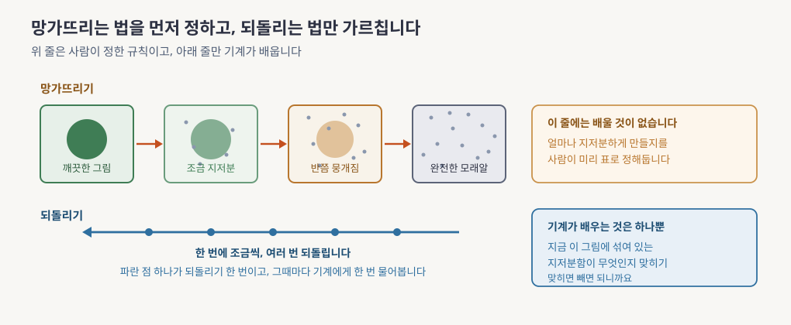
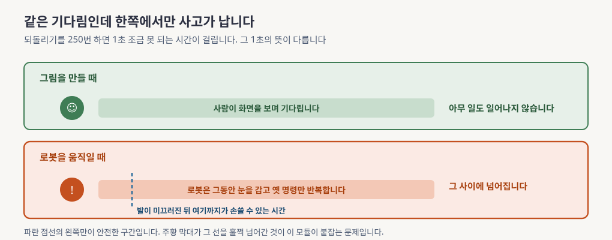
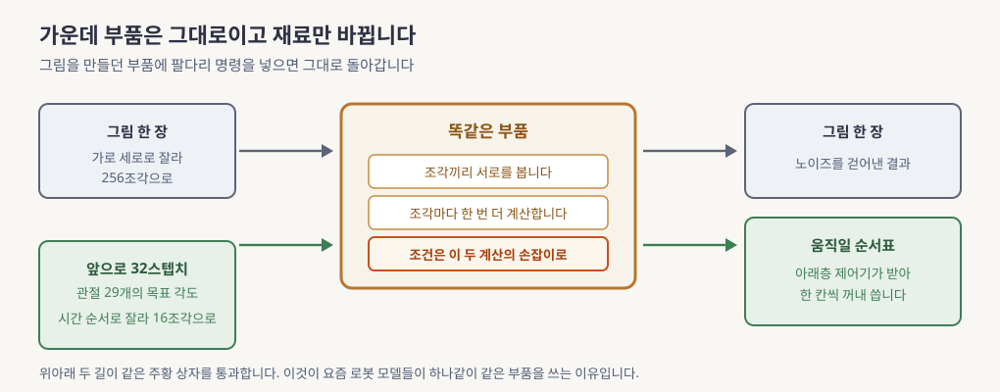

> 본문은 [lesson.md](lesson.md)입니다. 이 문서를 먼저 읽으세요.

# 노이즈를 걷어내며 만드는 모델, 쉽게 먼저

> **한 문장으로**: 그림을 만들어내는 요즘 모델들이 왜 "지저분하게 만들었다가 도로 깨끗하게 만들기"라는 이상한 방식으로 일하는지, 그 방식이 왜 로봇 팔다리를 움직이는 데까지 쓰이는지를 그림으로 봅니다.

---

## 이 모듈이 답하는 질문 하나

기계에게 그림을 그리라고 시키는 일은 오래 잘 안 됐습니다. 사람은 빈 종이를 보면 대충 어디서 시작할지 감이 오는데 기계는 그렇지 않습니다. 붓을 어디에 처음 대야 하는지가 이미 어려운 문제입니다.

그러다 방향을 뒤집은 발상 하나가 자리를 잡았습니다. 그리는 법을 가르치는 대신 **지우는 법을 가르치자**는 생각입니다. 2020년에 나온 논문 하나가 이 발상을 실제로 쓸 만하게 만들었습니다.

> 지우는 연습만 시켰는데 어떻게 그리게 되나요?

다 읽고 나면 이 물음에 그림 세 장으로 답할 수 있습니다. 이 방식이 로봇에 오면 왜 갑자기 시간 문제가 되는지도 알게 됩니다.

---

## 어떤 문제가 있었나

발상은 이렇습니다. 깨끗한 사진 한 장을 놓고 그 위에 모래알 같은 얼룩을 아주 조금 뿌립니다. 거의 티가 안 납니다. 그러고 또 조금 뿌립니다. 이것을 수백 번 반복하면 원래 무슨 사진이었는지 알아볼 수 없는 지저분한 덩어리가 됩니다.

망가뜨리는 순서에는 규칙이 있습니다. **그 규칙은 사람이 정합니다.** 몇 번째에 얼마나 뿌릴지를 표로 미리 적어 둡니다. 그러니 이 방향에는 기계가 배울 것이 하나도 없습니다.

기계에게 시키는 것은 반대 방향입니다. "지금 이 그림에 섞여 있는 얼룩이 무엇인지 맞혀 봐"라고 시킵니다. 맞히면 빼면 되니까요.

**읽는 법.** 위쪽 주황 줄을 왼쪽에서 오른쪽으로 따라가면 그림이 점점 뭉개집니다. 아래쪽 파란 화살표가 그 반대 방향입니다. 화살표 위의 파란 점 하나가 되돌리기 한 번을 뜻합니다. 오른쪽 두 상자에는 각 줄에서 무슨 일이 벌어지는지 적혀 있습니다.

왜 이게 잘 되느냐면 **쪼개진 문제 하나하나가 아주 쉽기** 때문입니다. 빈 종이에서 사진 한 장을 통째로 만들어내기는 어렵습니다. 하지만 거의 다 된 그림에서 옅은 얼룩 하나 걷어내기는 쉽습니다. 어려운 문제 하나를 쉬운 문제 수백 개로 쪼개고 그 쉬운 것 하나만 기계에게 맡겼습니다.

그래서 완전히 지저분한 상태, 곧 아무 의미 없는 모래알 덩어리에서 출발해도 됩니다. 되돌리기를 수백 번 반복하면 없던 그림이 나옵니다. 매번 다른 모래알에서 출발하면 매번 다른 그림이 나옵니다. [lesson.md](lesson.md) §3 「노이즈를 넣는 과정」과 §4 「노이즈를 빼는 과정과 손실 유도」에서 두 방향을 하나씩 짚어 봅니다.

---

## 그래서 무엇을 하나

이 모듈에서 실제로 붙잡는 것은 둘입니다. **횟수 문제**와 **부품 문제**입니다.

### 횟수가 왜 문제가 되나

그림을 만들 때는 되돌리기를 250번쯤 합니다. 한 번에 몇 밀리초씩이니 다 합치면 1초 가까이 걸립니다. 사람이 화면 앞에서 1초 기다리는 것은 아무 일도 아닙니다.

그런데 로봇은 다릅니다. 로봇은 그 1초 동안에도 서 있어야 하는데 서 있으려면 계속 명령이 필요합니다. 새 명령을 만드는 데 1초가 걸리면 그 1초 동안 로봇은 **눈을 감고 옛날 명령만 반복하는 상태**가 됩니다.

**읽는 법.** 위아래 두 상자를 비교하세요. 같은 길이의 기다림인데 위에서는 아무 일도 없고 아래에서는 파란 점선을 넘어갑니다. 그 점선은 발이 미끄러지기 시작해서 자세가 무너질 때까지 남은 시간입니다.

발이 미끄러지고 나서 자세가 무너지기까지 남은 시간이 0.2초 남짓입니다. 로봇은 그 안에 손을 써야 합니다. 그런데 되돌리기를 250번 하면 최악의 경우 1.6초 동안 아무 반응도 못 합니다. 여덟 배 늦습니다.

그래서 이 방식을 로봇에 쓰려면 되돌리기 횟수를 줄여야 합니다. 줄이는 방법이 셋 있는데 그중 가장 근본적인 것이 다음 모듈의 주제입니다. 이 숫자들을 직접 계산해 보는 자리가 [lesson.md](lesson.md) §5 「샘플러와 제어 지연」입니다.

### 부품은 왜 문제가 되나

되돌리기를 실제로 하는 것은 신경망입니다. 그 신경망을 어떤 모양으로 짜느냐가 두 번째 문제입니다.

한동안은 사진 처리에 오래 쓰던 구조를 그대로 썼습니다. 그러다 언어 모델에서 쓰는 부품으로 갈아 끼웠더니 결과가 더 좋았습니다. 지금은 그것이 표준이 됐습니다. 재미있게도 이 갈아 끼운 부품은 **그림이든 로봇 명령이든 그대로 쓰입니다**.

**읽는 법.** 위아래 두 길이 가운데 같은 주황 상자를 통과하는 것을 보세요. 왼쪽 입구만 다릅니다. 위는 그림을 조각내서 넣고 아래는 앞으로 움직일 순서표를 시간 순서로 잘라서 넣습니다.

한 가지만 더 보고 넘어갑니다. 이 부품에는 **조건을 넣는 문**이 여러 개 있습니다. 어느 문으로 넣느냐에 따라 결과 품질이 크게 달라집니다. 같은 크기 같은 데이터인데도 그렇습니다. 네 가지 문을 비교한 실측값은 [lesson.md](lesson.md) §6 「DiT는 조건을 어디에 넣는가」에 나옵니다.

---

## 오늘 만날 개념 5개

본문에서 계속 마주칠 말들입니다. 지금 외울 필요는 없고 한 번 만나두면 읽다가 처음 보는 말이 아니게 됩니다.

**1. 확산 모델**

데이터를 조금씩 망가뜨렸다가 되돌리는 법을 배워서 새 데이터를 만들어내는 방식입니다. 망가뜨리는 쪽은 사람이 정한 규칙이고 되돌리는 쪽만 기계가 배웁니다. 그림, 영상, 로봇 명령에 전부 쓰입니다.

→ 제대로 배우는 곳은 [lesson.md](lesson.md) §1 「왜 이걸 배우나」입니다.

**2. 되돌리기 횟수**

결과 하나를 얻으려고 신경망을 몇 번 부르는지입니다. 그림에서는 보통 수십에서 수백 번입니다. 그런데 로봇에서는 이 숫자가 곧 반응이 늦어지는 시간이 되므로 한 자릿수로 묶어야 합니다.

→ 제대로 배우는 곳은 [lesson.md](lesson.md) §5 「샘플러와 제어 지연」입니다.

**3. 액션 묶음**

로봇에게 명령을 한 개씩 주는 대신 앞으로 몇 초치를 통째로 묶어 내려보내는 방식입니다. 위층이 느려도 아래층이 끊기지 않게 하는 장치입니다. 대신 묶음을 다 쓸 때까지 새로 본 것을 반영하지 못합니다.

→ 자세한 설명은 [lesson.md](lesson.md) §5 「샘플러와 제어 지연」에 있습니다.

**4. 조각내기**

그림이나 명령표를 정해진 크기로 잘라 조각들의 나열로 만드는 작업입니다. 언어 모델이 문장을 단어로 자르는 것과 발상이 같습니다. 자르는 칸이 작을수록 조각이 많아지고 계산이 늘어납니다.

→ [lesson.md](lesson.md) §6 「DiT는 조건을 어디에 넣는가」에서 본격적으로 다룹니다.

**5. 0에서 시작하기**

부품을 처음 켤 때 손잡이를 0에 두는 요령입니다. 아무 일도 안 하는 상태로 두었다가 학습이 진행되면서 필요한 만큼만 열게 합니다. 깊이 쌓인 신경망이 학습 초반에 흔들리는 것을 막습니다.

→ 제대로 배우는 곳은 [lesson.md](lesson.md) §6 「DiT는 조건을 어디에 넣는가」입니다.

---

## 이제 lesson.md로

여기까지가 그림으로 잡는 감입니다. 본문은 같은 이야기를 세 방향으로 더 정확하게 만듭니다.

우선 **숫자를 줍니다.** 망가진 정도가 몇 번째에 얼마인지, 되돌리기 250번이 정확히 몇 밀리초인지, 그래서 묶음이 몇 개여야 하는지를 손으로 계산합니다. 이 문서에서 "1.6초"라고만 한 값이 어디서 나오는지 확인합니다.

그다음 **부품을 열어 봅니다.** 조건을 넣는 문 네 개를 비교한 실제 실험값을 보고 그 부품 하나를 백지에 그릴 수 있을 만큼 뜯어봅니다. 첫째 주 체크포인트 문항이기도 합니다.

마지막은 **회사 스택과 잇는 일입니다.** 이 부품이 우리 시스템 어느 자리에 앉을 수 있는지 세 가지 후보를 그립니다. 각 자리에서 되돌리기를 몇 번까지 할 수 있는지 계산합니다. 아직 확인되지 않은 것 다섯 가지는 팀에 물어볼 질문으로 남깁니다.

읽는 순서는 §0 「이 모듈 지도」부터입니다. 막히면 §5 「샘플러와 제어 지연」으로 먼저 건너뛰어도 됩니다. 이 모듈에서 가장 로봇다운 부분이 거기입니다.
