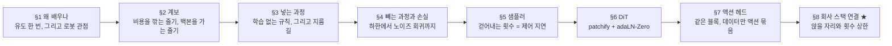
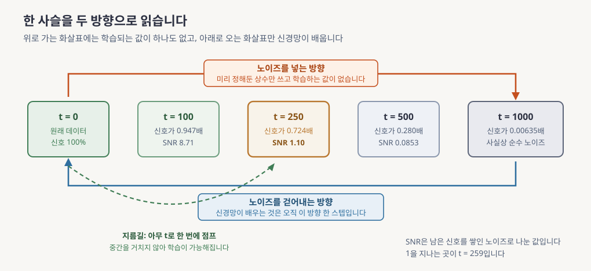
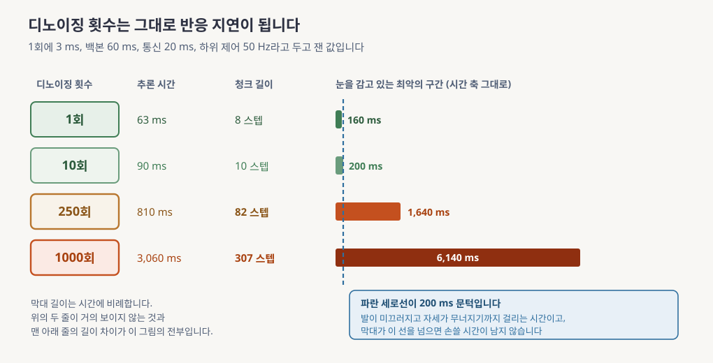
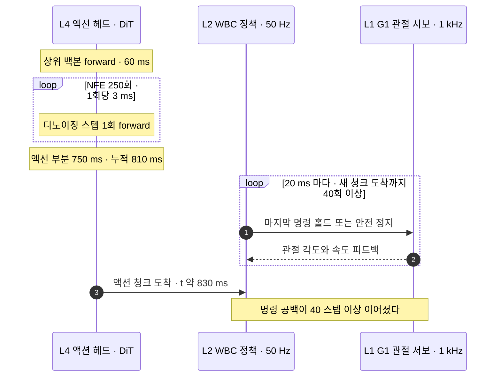
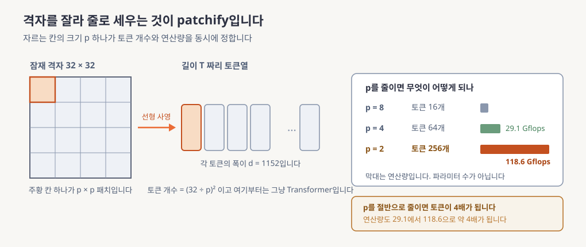
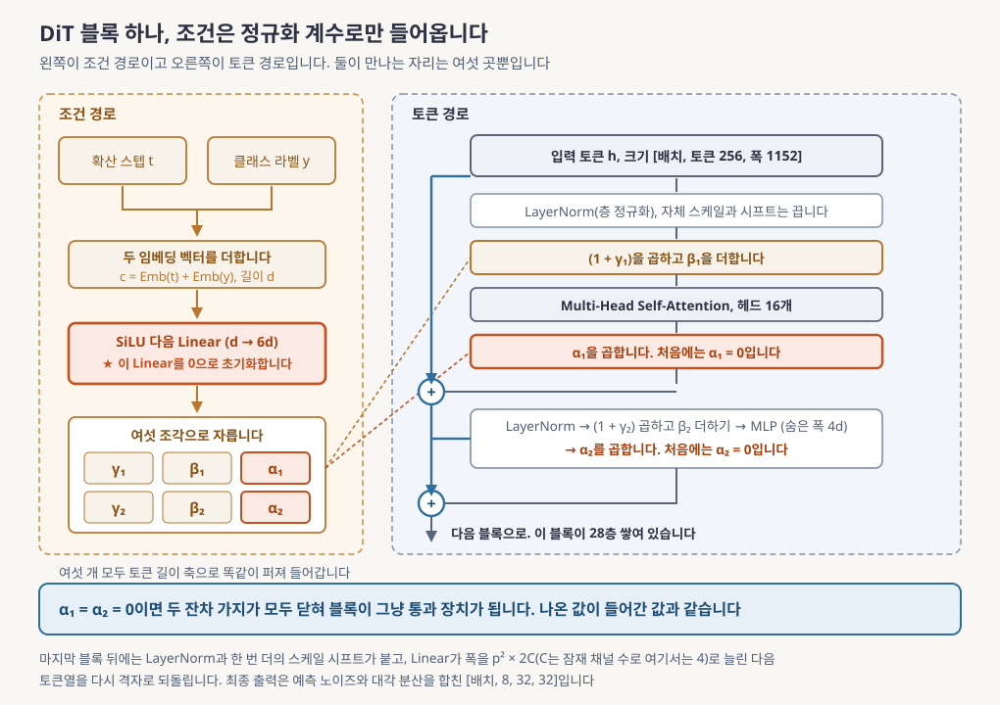
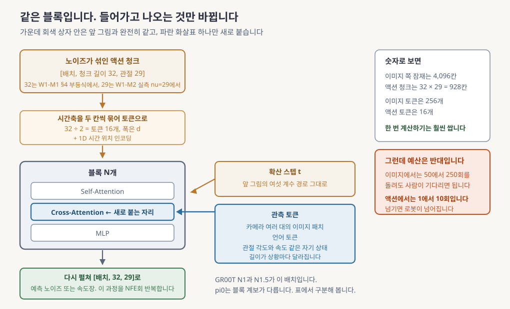
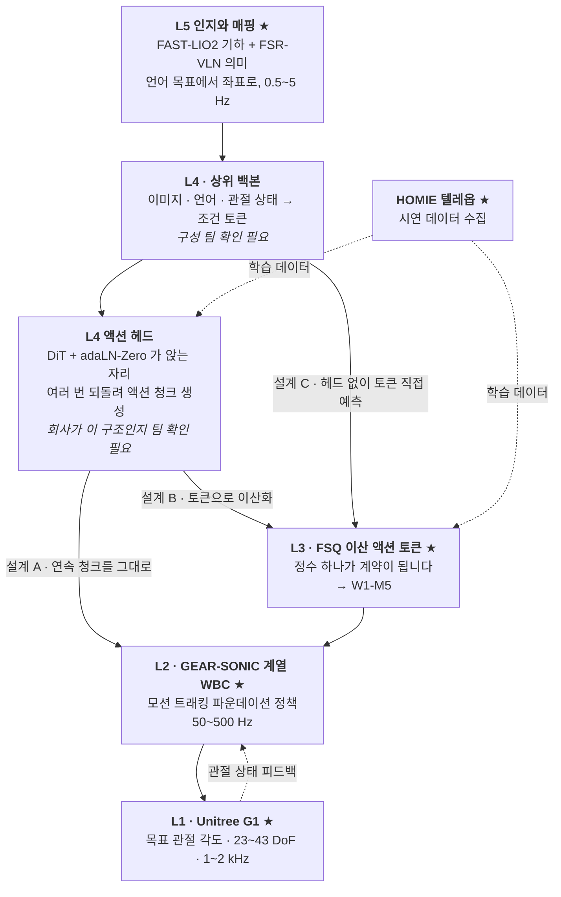
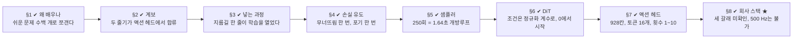

# Diffusion 계보: DDPM에서 DiT(Diffusion Transformer, 확산 트랜스포머)까지

> **한 줄 요약**: 그림을 만들어내는 모델이 왜 노이즈를 잔뜩 섞었다가 조금씩 걷어내는 방식으로 일하는지를 처음부터 따라가고, 그 걷어내는 횟수가 로봇에서는 곧 반응이 늦어지는 시간이 된다는 것을 숫자로 확인한 다음, 로봇 팔다리 명령을 만드는 요즘 모델들이 왜 하나같이 같은 블록 구조를 쓰는지까지 봅니다.

> 처음 보는 주제라면 [eli5.md](eli5.md)를 먼저 읽으세요. 그림으로 감을 잡고 오면 이 문서가 훨씬 잘 읽힙니다.

---

## 0. 이 모듈 지도

앞의 두 모듈에서 로봇 지능이 왜 여러 층으로 나뉘는지를 지도로 그렸고, 그 맨 아래층을 시뮬레이터로 직접 만져 봤습니다. 그런데 맨 위층에서 무엇을 할지 정해 아래로 내려보내는 모델이 어떤 물건인지는 아직 열어보지 않았습니다. 이 모듈은 그 모델의 심장에 해당하는 생성 방식 하나를 처음부터 뜯어봅니다. 그림을 만드는 기술로 태어났지만 지금은 로봇 팔다리 명령을 만드는 데 그대로 쓰이고 있는 방식이고, 이것을 이해하면 다음 두 모듈과 둘째 주 전체가 같은 언어로 읽힙니다.

**오늘의 질문.** 다 읽고 나면 이 셋에 답할 수 있습니다.

- 노이즈를 잔뜩 섞었다가 다시 걷어내는 것만으로 어떻게 새 데이터가 만들어지나요?
- 그 학습 목표가 왜 결국 "섞어 넣은 노이즈를 맞히는 회귀 한 줄"로 내려앉나요?
- 걷어내는 횟수가 왜 로봇이 넘어지느냐 마느냐의 문제가 되나요?

| 절 | 무엇을 | 끝나면 할 수 있는 것 | 읽는 시간 |
|---|---|---|---|
| §1 | 왜 이걸 배우나 | 이 모듈이 앞뒤 모듈과 어디서 만나는지 짚기 | 10분 |
| §2 | 계보 | 두 줄기가 어디서 갈라지고 어디서 합류하는지 그리기 | 8분 |
| §3 | 노이즈를 넣는 과정 | 아무 시점이나 한 줄로 바로 뽑아내는 지름길 쓰기 | 17분 |
| §4 | 노이즈를 빼는 과정과 손실 | 손실이 회귀로 내려앉는 길과 그 대가 말하기 | 20분 |
| §5 | 샘플러와 제어 지연 | 걷어내는 횟수를 지연 예산에 대입해 계산하기 | 19분 |
| §6 | DiT 블록 | 블록도를 그리고 0으로 시작하는 이유를 설명하기 | 22분 |
| §7 | 이미지에서 액션으로 | 같은 블록을 액션 묶음으로 다시 읽기 | 16분 |
| §8과 마무리 | 회사 스택 연결 ★, 흔한 오해, 한 장 정리, 퀴즈 10문항 | 앉을 자리를 지목하고 백지 재구성으로 자기 점검하기 | 38분 |

**읽는 법.** 화살표는 논리가 기대는 방향입니다. 왼쪽 절반(§3과 §4)이 "무엇을 학습하는가"를 세우고 오른쪽 절반(§6과 §7)이 "그것을 어떤 신경망에 태우는가"를 세우며, 가운데 §5가 둘을 로봇의 시간 예산에 묶습니다. 막히면 §5로 먼저 건너뛰어도 됩니다.

**선수 지식**

| 영역 | 이 문서가 가정하는 것 | 어디서 채우나 |
|---|---|---|
| 머신러닝과 딥러닝 | 학습, 손실, 신경망, 과적합, 회귀를 안다고 봅니다 | 이 과정의 출발선입니다 |
| 확률과 통계 | 확률분포와 정규분포와 평균과 분산을 안다고 봅니다 | 이 과정의 출발선입니다 |
| 층 구조와 주파수, 명령 묶음 | 위층이 느리고 아래층이 빠르다는 그림을 씁니다 | [W1-M1](../01-physical-ai-landscape/lesson.md) §3과 §4, §5.2에서 회수합니다 |
| G1 관절 개수 | 명령 목록이 29칸이라는 실측값 하나를 씁니다 | [W1-M2](../02-simulator-bootcamp/lesson.md) §5, §7.2에서 회수합니다 |
| 생성모델 내부, 제어공학, 로봇 정책 | 아무것도 가정하지 않습니다 | 필요한 자리마다 이 문서가 처음부터 설명합니다 |

**완료 기준**: DiT 블록 하나를 여섯 개의 조건 계수까지 백지에 그리고, 그 옆에 "우리 스택에서 이 블록이 앉을 자리"와 "그 자리에서 허용되는 디노이징 횟수 상한"을 숫자로 씁니다.

**소요**: 이론 150분 / 실습 2~3h

> 📌 **여기까지 정리**
> - 목적지는 유도 한 번, 지연 산수 한 번, 블록도 한 장입니다
> - 세 질문에는 §3과 §4와 §5와 §6이 나눠 답합니다
> - 남는 것은 "우리 스택 어디에 앉는가"라는 미결 질문입니다

---

## 1. 왜 이걸 배우나

이 모듈이 다루는 것은 **확산 모델**이라고 부르는 생성 방식입니다. 이름만 들으면 그림 만드는 기술 이야기 같은데, 마스터플랜이 이것을 첫 주 셋째 날에 배치한 이유는 따로 있습니다. 지금 로봇에게 팔다리 명령을 만들어주는 모델들이 거의 예외 없이 이 방식의 후손이기 때문입니다. 이 절이 그 이유를 풉니다.

### 1.1 확산 모델이 무엇인가

**확산 모델(diffusion model)**은 데이터에 노이즈를 조금씩 섞어 아무 정보도 남지 않게 만들어 놓고, 그 과정을 거꾸로 되돌리는 법을 학습해서, 순수한 노이즈에서 새 데이터를 만들어내는 생성 모델입니다. 여기서 노이즈는 아무 규칙 없는 무작위 숫자를 말합니다.

핵심은 이 방식이 **한 사슬을 두 방향으로 읽는다**는 것입니다.

- 노이즈를 넣어 가는 쪽이 **forward 과정**입니다. 얼마나 섞을지를 사람이 미리 표로 정해두고 그대로 따르므로 학습되는 값이 하나도 없습니다
- 노이즈에서 데이터로 되돌아오는 쪽이 **reverse 과정**입니다. 신경망이 배우는 것은 오직 이쪽뿐입니다

왜 굳이 돌아가느냐면, 데이터를 한 번에 만들어내는 것은 어렵지만 **아주 조금 지저분해진 것을 되돌리는 것은 쉽기** 때문입니다. 어려운 문제 하나를 쉬운 문제 수백 개로 쪼개고 그 쉬운 것 하나만 신경망에게 시킵니다. 대신 데이터 하나를 얻으려면 신경망을 수백 번 불러야 하고, **그 횟수가 이 모듈의 로봇 쪽 본론**입니다.

### 1.2 왜 로봇을 하는 사람이 이걸 배우나

로봇에게 "컵을 집어라"라고 말하면 로봇은 앞으로 몇 초 동안 각 관절을 어떤 각도로 두어야 하는지를 숫자로 뽑아내야 합니다. 이미지를 만드는 것과 관절 각도 목록을 만드는 것은 전혀 다른 일 같지만, **둘 다 조건을 받아 숫자 덩어리를 만들어내는 문제**라는 점에서 같습니다. 조건이 클래스 이름이면 그림이 나오고, 조건이 카메라 화면과 사람 말이면 팔다리 명령이 나옵니다.

그래서 이미지 쪽에서 잘 통한 구조가 그대로 로봇 쪽으로 옮겨 왔습니다. **VLA(Vision-Language-Action, 시각언어행동 모델)**는 이미지와 언어를 받아 로봇 액션을 내놓는 상위 모델을 가리키는 말인데, 지금 이름 있는 VLA들의 액션 생성부가 대부분 이 모듈에서 볼 블록 구조를 쓰고 있습니다. 계열별로 무엇이 같고 무엇이 다른지는 §7.4에서 표로 구분합니다.

### 1.3 이 모듈에서 가져갈 것 셋

- **유도 한 번**입니다. 확산 모델의 학습 손실은 결과만 보면 "섞어 넣은 노이즈를 맞히는 평균제곱오차" 한 줄인데, 그 한 줄까지 오는 길에 무너뜨림 한 번과 포기 한 번이 있습니다. 무너뜨린 자리가 §4.2이고 포기한 자리가 §4.4입니다
- **지연 산수 한 번**입니다. 데이터 하나를 얻으려고 신경망을 부르는 횟수를 **NFE(Number of Function Evaluations, 함수 평가 횟수)**라고 부르고, 그 한 번을 디노이징 스텝이라고도 부릅니다. 이미지에서는 사용자가 기다리는 시간이지만 로봇에서는 그대로 반응 지연이 됩니다. §5.2에서 숫자를 넣어 계산합니다
- **블록도 한 장**입니다. 마스터플랜의 첫째 주 체크포인트 첫 문항이 "DiT 블록 다이어그램을 그리고 조건이 들어가는 위치를 설명하라"입니다. §6.3이 그 그림이고 §7.2가 로봇판입니다

첫 항목의 출발점이 **ELBO(Evidence Lower BOund, 증거 하한)**입니다. 우리가 정말 크게 만들고 싶은 값은 "우리 모델이 이 데이터를 만들어냈을 가능성"인데 그 값은 직접 계산할 수가 없습니다. 그래서 그보다 항상 작거나 같다고 보장되는 다른 값을 하나 만들어 대신 최대로 올립니다. 아래에서 밀어 올리면 위에 있는 진짜 값도 따라 올라간다는 발상이고, 그 대신 쓰는 값이 ELBO입니다.

이 모듈이 다루지 않는 것도 정해둡니다. 픽셀이 아니라 압축된 표현 위에서 확산하는 방식은 [W1-M5](../05-latent-discrete-fsq/lesson.md)가 받고, 노이즈에서 데이터로 가는 경로를 직선으로 다시 설계하는 이야기는 W1-M4가 받습니다.

| 용어 | 이 절에서 나온 뜻 |
|---|---|
| **확산 모델** | 데이터에 노이즈를 단계적으로 섞어 없앤 뒤 그 과정을 거꾸로 학습해, 노이즈에서 데이터를 만들어내는 생성 모델 |
| **forward 과정** | 데이터에 노이즈를 섞어 가는 방향. 학습되는 값이 하나도 없습니다 |
| **reverse 과정** | 노이즈에서 데이터로 되돌아오는 방향. 신경망이 배우는 것은 여기뿐입니다 |
| **ELBO** | 직접 계산할 수 없는 값 대신 최대화하는, 그보다 항상 작거나 같은 값 |
| **NFE** | 결과 하나를 얻는 데 신경망을 부르는 횟수. 디노이징 스텝 수와 같습니다 |
| **VLA** | 이미지와 언어를 받아 로봇 액션을 내놓는 상위 모델 |

> 📌 **여기까지 정리**
> - 확산 모델은 어려운 생성 문제 하나를 쉬운 복원 문제 수백 개로 쪼갭니다
> - 넣는 방향에는 학습이 없고 빼는 방향만 신경망이 배웁니다
> - 그 대가인 반복 횟수가 로봇에서는 대기 시간이 아니라 제어 지연입니다

---

## 2. 계보

§1에서 확산 모델이 무엇이고 왜 로봇 이야기가 되는지를 세웠습니다. 그런데 지금 논문에서 만나는 이름들은 하나가 아니라 십여 개이고, 그 이름들이 서로 어떤 관계인지 모르면 어느 것을 읽어야 할지 정할 수가 없습니다. 이 절은 그 이름들을 한 장에 늘어놓고 **두 줄기로 갈라 읽는 법**을 정합니다. 그림 상자 안의 영어 이름들은 지금 하나도 몰라도 됩니다. 각 논문이 자기 기여를 부르던 이름을 그대로 옮겨 적은 것이고, 이 문서에 필요한 것들은 뒤에서 자리마다 풀어 씁니다. 여기서 읽을 것은 화살표가 만드는 두 줄기뿐입니다.

**읽는 법.** 위에서 아래로 읽되 가운데의 DDPM에서 두 갈래로 갈라지는 것을 먼저 보세요. 왼쪽 아래로 내려가는 사슬(DDIM에서 Score SDE를 거쳐 Flow Matching까지)과 오른쪽 아래로 내려가는 사슬(ADM에서 LDM을 거쳐 DiT까지)이 두 줄기이고, 맨 아래 세 상자에서 둘이 다시 만납니다.

두 줄기가 각각 무엇을 고치려 했는지가 이 그림의 전부입니다.

- **왼쪽 줄기는 샘플링 비용을 깎는 역사입니다.** 데이터 하나 뽑는 데 신경망을 천 번 부르는 것이 원래 방식인데, 그 횟수를 줄이려는 시도가 줄줄이 이어집니다. 격자를 건너뛸 수 있게 만들고(DDIM), 연속시간 방정식으로 다시 쓰고(Score SDE), 끝내 경로 자체를 직선으로 설계합니다(Flow Matching과 Rectified Flow)
- **오른쪽 줄기는 신경망 본체를 갈아치우는 역사입니다.** 여기서 본체는 **백본**이라고 부르는데, 노이즈를 예측하는 일을 실제로 맡은 신경망 몸통을 말합니다. 처음에는 이미지 처리에 흔히 쓰던 U자 모양 합성곱 구조(U-Net)였고, 지금은 언어 모델에서 쓰는 Transformer로 바뀌었습니다

로봇 액션을 만드는 모델들은 이 둘이 합류한 지점에 있습니다. **몸통은 오른쪽 줄기의 Transformer 블록을 쓰고 학습 목표는 왼쪽 줄기의 최신형을 씁니다.** 그래서 "요즘 VLA는 다 Flow Matching에 DiT"라는 요약이 돌아다니는데, 이 요약은 두 축을 섞은 것이라 반례가 있습니다. §7.4에서 계열별로 갈라 봅니다.

각 노드가 정확히 무엇을 바꿨는지는 [deep-dive.md](deep-dive.md) §1에 연대기로 있습니다. 이 문서 본문은 그중 DDPM과 DDIM과 DiT 셋만 열어봅니다.

| 용어 | 이 절에서 나온 뜻 |
|---|---|
| **백본** | 노이즈 예측을 실제로 맡는 신경망 몸통. 확산 방식과 독립적으로 갈아끼울 수 있습니다 |
| **DDPM** | 확산 모델의 학습 목표를 한 줄로 정리해 실용권에 올린 2020년 논문 |
| **DDIM** | 학습된 모델을 그대로 두고 샘플링 격자만 건너뛸 수 있게 만든 후속 논문 |
| **DiT** | 확산 모델의 백본을 U자 합성곱 구조 대신 Transformer로 놓은 아키텍처 |

> 📌 **여기까지 정리**
> - 한 줄기는 샘플링 비용을 깎았고 다른 줄기는 백본을 갈았습니다
> - 로봇 액션 헤드는 두 줄기가 합류한 자리에 있습니다
> - 목적함수 계보와 블록 계보를 섞으면 요약이 틀립니다

---

## 3. 노이즈를 넣는 과정

§2에서 이 계보의 출발점이 DDPM이라는 것을 봤습니다. 이제 그 안을 열어봅니다. 두 방향 중 학습이 없는 쪽부터 보는 이유는, 이쪽이 **완전히 사람이 정한 규칙**이라 계산이 전부 손으로 따라가지고 그 계산에서 나온 지름길 하나가 다음 절 전체를 떠받치기 때문입니다.

시작하기 전에 눈금 하나를 정해둡니다. 얼마나 망가졌는지는 남아 있는 신호를 그동안 쌓인 잡음으로 나눈 값으로 재고, 이것을 **SNR(Signal-to-Noise Ratio, 신호 대 잡음비)**이라고 부릅니다. 1보다 크면 아직 신호가 우세하고 1보다 작으면 잡음이 우세하며, 식은 §3.2에서 세웁니다.

**읽는 법.** 가운데 카드 다섯 장은 같은 데이터가 얼마나 망가졌는지를 단계별로 보여줍니다. 가운데 세 장의 맨 아랫줄에 적힌 값이 방금 말한 신호 대 잡음비이고, 양 끝 두 장은 그 값이 극단이라 숫자 대신 말로 적었습니다. 위쪽 주황 화살표가 이 절이 다루는 방향이고 아래쪽 파란 화살표는 §4가 다룹니다. 아래에 점선으로 그린 초록 곡선이 §3.2에서 유도할 지름길입니다.

### 3.1 규칙을 식으로 적으면

한 스텝에 하는 일은 두 가지입니다. 지금 값을 살짝 줄이고, 거기에 새 노이즈를 조금 더합니다.

$$
q(x_t \mid x_{t-1}) = \mathcal{N}\!\left(x_t;\ \sqrt{1-\beta_t}\, x_{t-1},\ \beta_t I\right)
\quad\Longleftrightarrow\quad
x_t = \sqrt{\alpha_t}\, x_{t-1} + \sqrt{1-\alpha_t}\,\epsilon_t,\ \ \epsilon_t \sim \mathcal{N}(0, I)
$$

기호를 하나씩 정합니다. $x_t$는 $t$번 망가뜨린 뒤의 데이터이고 $x_0$이 원본입니다. $\mathcal{N}(\cdot;m,S)$는 평균이 $m$이고 분산이 $S$인 정규분포를 뜻하고, $I$는 모든 축에 같은 크기로 노이즈를 준다는 표시입니다. $\epsilon_t$는 그 정규분포에서 새로 뽑은 노이즈 한 덩어리입니다. **$\beta_t$ 스케줄**은 매 스텝 노이즈를 얼마나 섞을지 미리 정해둔 수열이고 학습 대상이 아닙니다. 편의를 위해 $\alpha_t := 1-\beta_t$로 둡니다. 왼쪽 확률 표기와 오른쪽 대입 표기는 완전히 같은 말이고, 오른쪽이 코드로 옮기기 쉬운 형태입니다.

이 규칙에는 두 가지 설계 의도가 박혀 있습니다.

- $\sqrt{\alpha_t}$가 1보다 작기 때문에 원래 값은 스텝마다 조금씩 줄어들고, 계속 돌리면 평균이 0으로 갑니다
- 줄어든 만큼을 새 노이즈가 정확히 채우도록 계수를 잡아 두어서, 분산은 1로 수렴합니다

그래서 충분히 여러 번 돌리면 무엇을 넣었든 결과가 **평균 0에 분산 1인 정규분포**가 됩니다. 이것은 우연이 아니라 그렇게 되도록 스케줄을 거꾸로 설계한 것입니다. 생성할 때 아무 데서나 출발할 수 있어야 하는데, 그 출발점을 우리가 마음대로 뽑을 수 있는 분포로 맞춰 놓은 것입니다.

### 3.2 지름길

위 규칙을 그대로 쓰면 $t=500$인 데이터를 만들려고 500번을 돌려야 합니다. 학습할 때는 매 배치마다 $t$를 무작위로 골라야 하므로 이대로는 감당이 안 됩니다. 다행히 두 스텝을 손으로 합쳐 보면 규칙이 닫힙니다.

두 스텝을 펼치면 노이즈 항이 두 개 생기는데, 서로 독립인 정규분포의 합은 분산이 그냥 더해집니다. 계산하면 두 항이 하나로 합쳐지고 분산이 $1-\alpha_t\alpha_{t-1}$이 됩니다. 이것을 계속 밀어 나가면 곱이 누적된 형태가 남습니다. $\bar\alpha_t := \prod_{s=1}^{t}\alpha_s$로 두면 이렇습니다.

$$
\boxed{\;q(x_t \mid x_0) = \mathcal{N}\!\left(x_t;\ \sqrt{\bar\alpha_t}\,x_0,\ (1-\bar\alpha_t)I\right), \qquad x_t = \sqrt{\bar\alpha_t}\,x_0 + \sqrt{1-\bar\alpha_t}\,\epsilon\;}
$$

- $\bar\alpha_t$는 $t$까지 살아남은 원신호의 비율입니다
- $\sqrt{\bar\alpha_t}$가 원본에 곱해지는 신호 이득이고 $\sqrt{1-\bar\alpha_t}$가 쌓인 잡음의 표준편차입니다
- $\epsilon$은 중간에 들어간 노이즈들을 합쳐 놓은 것 하나입니다
- 즉 **원본에 계수 하나를 곱하고 노이즈 하나를 더하면 아무 시점이나 바로 나옵니다**

이렇게 재귀를 풀어 시점을 직접 대입할 수 있게 만든 것을 **닫힌 형태**라고 부릅니다. 그리고 앞에서 말한 신호 대 잡음비가 정확히 이 두 계수의 제곱의 비라서 $\mathrm{SNR}(t)=\bar\alpha_t/(1-\bar\alpha_t)$로 적힙니다. 전개 전문은 [deep-dive.md](deep-dive.md) §2에 있습니다.

### 3.3 이 지름길이 왜 결정적인가

숫자로 보면 무슨 일이 벌어지는지 한눈에 들어옵니다. 아래는 DDPM 논문의 기본 설정, 곧 전체 스텝 수 $T=1000$에 $\beta$를 $10^{-4}$에서 $0.02$까지 선형으로 늘린 경우의 값입니다. 마지막 열이 §3.2에서 식을 세운 신호 대 잡음비입니다.

| $t$ | $\beta_t$ | $\bar\alpha_t$ | $\sqrt{\bar\alpha_t}$ | $\sqrt{1-\bar\alpha_t}$ | SNR |
|---|---|---|---|---|---|
| 1 | 0.00010 | 0.99990 | 0.99995 | 0.0100 | 9,999 |
| 100 | 0.00207 | 0.89702 | 0.94711 | 0.3209 | 8.71 |
| 250 | 0.00506 | 0.52409 | 0.72394 | 0.6899 | 1.10 |
| 500 | 0.01004 | 0.07859 | 0.28033 | 0.9599 | 0.0853 |
| 1000 | 0.02000 | $4.04\times10^{-5}$ | 0.00635 | 1.0000 | $4.04\times10^{-5}$ |

**숫자를 넣어봅니다.** 표의 $t=250$ 행을 손으로 다시 만들어 봅니다. 남은 신호의 비율이 $\bar\alpha_{250}=0.52409$이므로, 원본에 곱해지는 계수는 그 제곱근인 $\sqrt{0.52409}=0.72394$입니다. 노이즈 쪽 계수는 남은 것의 나머지에 제곱근을 씌운 값이라 $\sqrt{1-0.52409}=\sqrt{0.47591}=0.6899$입니다. 두 계수를 제곱해서 더하면 $0.52409+0.47591=1$이 되어 전체 크기가 유지된다는 것도 확인됩니다. SNR은 나눗셈 한 번이라 $0.52409 \div 0.47591 = 1.101$입니다. 아직 신호가 아주 살짝 우세한 지점이고, 정확히 1이 되는 곳은 $\bar\alpha_t=0.500$인 $t=259$입니다.

$t=1000$까지 가면 원신호에 곱해지는 계수가 $0.00635$입니다. $1 \div 0.00635 = 157$이므로 **신호가 157배로 줄어든 셈**이고, 사실상 순수 노이즈만 남습니다. 이 값들에는 학습되는 것이 하나도 없어서 시드를 바꾸든 장치를 바꾸든 똑같이 나오고, 실습 [`01_ddpm_toy.py`](practice/01_ddpm_toy.py)가 이 표 다섯 행을 코드로 다시 계산해 대조합니다.

여기까지가 왜 결정적이냐면, **닫힌 형태가 없으면 학습 루프 자체가 성립하지 않기 때문입니다.** 학습은 매 배치마다 $t$를 무작위로 하나 뽑아 그 시점의 데이터를 만들고 노이즈를 맞히게 시키는 식으로 돕니다. 지름길이 없으면 그때마다 사슬을 $t$번 굴려야 하고, $t$가 평균 500이면 배치 하나에 500번의 순차 계산이 붙습니다. 이 한 줄이 확산 모델을 학습 가능하게 만들었습니다.

💡 제어나 신호처리를 아신다면 (몰라도 됩니다)

**상태공간 모델**은 시스템의 현재 상태를 벡터 하나로 적어두고, 다음 시각의 상태를 "행렬을 곱하고 잡음을 더한 것"으로 쓰는 표기법입니다. $x_{t} = A_t x_{t-1} + w_t$ 꼴이고 $A_t$를 천이행렬, $w_t$를 프로세스 잡음이라고 부릅니다. 이 표기에서 상태의 분산이 어떻게 변해 가는지를 계산하는 재귀식을 **공분산 전파**라고 하며 $P_t = A_t P_{t-1} A_t^\top + Q_t$입니다.

위 §3.1의 규칙이 정확히 이 꼴입니다. $A_t = \sqrt{\alpha_t}I$이고 잡음 공분산이 $Q_t = \beta_t I$인 시변 선형계입니다. $\|A_t\|<1$이라 안정하고, 공분산 전파 재귀의 고정점이 1이 되도록 스케줄을 역설계한 것이 §3.1의 두 번째 설계 의도입니다. 그리고 §3.2의 닫힌 형태는 이 재귀를 손으로 푼 결과입니다. $A_t$가 단위행렬의 스칼라배이고 $Q_t$가 등방이라 대수적으로 닫히는 특수한 경우이며, 일반적인 $A$와 $Q$였다면 수치로 돌려야 합니다.

| 용어 | 이 절에서 나온 뜻 |
|---|---|
| **$\beta_t$ 스케줄** | 매 스텝 노이즈를 얼마나 섞을지 미리 정해둔 수열. 학습 대상이 아닌 설계 상수입니다 |
| **$\bar\alpha_t$** | $\alpha_s$들의 누적곱. $t$까지 살아남은 원신호의 비율입니다 |
| **SNR** | 남은 신호를 쌓인 노이즈로 나눈 값. 1을 지나는 지점이 국면 전환점입니다 |
| **닫힌 형태** | 재귀를 풀어 원하는 시점을 바로 대입할 수 있게 만든 식 |

> 📌 **여기까지 정리**
> - 넣는 방향은 결과가 정규분포가 되도록 역설계된 고정 규칙입니다
> - 두 스텝을 합치는 계산이 닫혀서 아무 시점이나 한 줄로 뽑힙니다
> - 그 한 줄이 없으면 학습 루프가 성립하지 않습니다

---

## 4. 노이즈를 빼는 과정과 손실 유도

§3에서 넣는 방향을 완전히 손에 넣었습니다. 이제 반대 방향입니다. 되돌리는 일은 원래 어려운 문제인데, 학습할 때만 쓸 수 있는 정보 하나를 조건에 끼워 넣으면 갑자기 쉬워집니다. 이 절은 그 목적함수가 평범한 회귀 한 줄로 내려앉는 길과 **그 과정에서 무엇을 포기했는지**를 함께 봅니다.

### 4.1 조건 하나가 문제를 닫는다

한 스텝 되돌리는 분포를 $q(x_{t-1}\mid x_t)$라고 쓰면 이것은 다루기 어렵습니다. 지금 지저분한 그림 하나만 보고 한 단계 전이 무엇이었는지 맞히려면 세상의 모든 데이터를 알아야 하기 때문입니다. 그런데 **원본 $x_0$을 조건에 함께 넣으면** 정규분포로 딱 닫힙니다.

$$
q(x_{t-1}\mid x_t, x_0) = \mathcal{N}\!\left(x_{t-1};\ \tilde\mu_t,\ \tilde\beta_t I\right),\quad
\tilde\mu_t = \frac{\sqrt{\alpha_t}(1-\bar\alpha_{t-1})}{1-\bar\alpha_t}x_t + \frac{\sqrt{\bar\alpha_{t-1}}\,\beta_t}{1-\bar\alpha_t}x_0,\quad
\tilde\beta_t = \frac{1-\bar\alpha_{t-1}}{1-\bar\alpha_t}\beta_t
$$

$\tilde\mu_t$는 되돌린 결과의 평균이고 $\tilde\beta_t$는 그 분산입니다. 읽을 것이 둘입니다.

- 평균 식은 **지금 것과 원본을 정해진 비율로 섞은 것**입니다. 노이즈가 적게 낀 초기 $t$에서는 지금 것 쪽 가중치가 크고, 다 망가진 후기 $t$에서는 원본 쪽 가중치가 커집니다
- $\tilde\beta_t$는 $\beta_t$보다 크지 않습니다. 조건에 정보를 하나 더 넣었으므로 남은 불확실성이 줄어든 것입니다

> ⚠️ **여기서 많이 헷갈립니다**
> 생성할 때는 $x_0$을 모릅니다. 알면 만들 이유가 없습니다. 이 식은 **학습할 때만** 쓸 수 있습니다. 학습 중에는 정답 데이터가 손에 있으니 $x_0$을 넣어 "정확히 이렇게 되돌려야 한다"는 목표를 만들 수 있고, 신경망은 그 목표를 $x_0$ 없이 맞히도록 훈련됩니다. 훈련이 끝나면 $x_0$ 없이 혼자 되돌립니다.

### 4.2 하한이 제곱차로 무너진다

§1.3에서 ELBO를 정의했습니다. 확산 모델에 그것을 적용하면 항이 세 덩어리로 갈라지고, 여기에 가정 하나를 더하면 가운데 덩어리가 **제곱 차이**로 무너집니다.

$$
\mathbb{E}\!\left[\underbrace{D_{\mathrm{KL}}\!\left(q(x_T|x_0)\,\|\,p(x_T)\right)}_{L_T}
+ \sum_{t>1}\underbrace{D_{\mathrm{KL}}\!\left(q(x_{t-1}|x_t,x_0)\,\|\,p_\theta(x_{t-1}|x_t)\right)}_{L_{t-1}}
\underbrace{-\log p_\theta(x_0|x_1)}_{L_0}\right]
\;\Longrightarrow\;
L_{t-1} = \frac{\left\|\tilde\mu_t - \mu_\theta\right\|^2}{2\sigma_t^2} + C
$$

기호를 정합니다. $D_{\mathrm{KL}}(A\|B)$는 **KL 발산**이라고 부르는 값으로, 두 확률분포가 얼마나 다른지를 재는 숫자입니다. 0이면 완전히 같고 클수록 다릅니다. $p_\theta$는 학습시키는 모델이 내놓는 분포이고 아래첨자 $\theta$가 학습되는 파라미터입니다. $\mu_\theta$는 그 모델이 예측한 평균, $\sigma_t^2$는 모델 쪽 분산, $C$는 학습과 무관한 상수입니다.

- $L_T$에는 학습되는 파라미터가 없습니다. 넣는 방향도 출발 분포도 고정이라 상수입니다
- $L_0$은 마지막 한 스텝의 재구성 항입니다
- $L_{t-1}$이 학습의 본체입니다

여기서 **가정 하나**가 들어갑니다. 모델이 내놓는 분포의 분산을 학습시키지 않고 $\sigma_t^2 I$로 고정해 버리는 것입니다. 두 정규분포의 KL 발산은 원래 평균 차이 항과 분산 차이 항의 합인데, 분산이 서로 같으면 뒤 항이 통째로 사라지고 **평균 차이의 제곱만 남습니다.** 분포 사이 거리를 재던 문제가 평균 하나를 맞히는 회귀가 된 순간이고, 대가는 분산을 모델링할 자유입니다. 항별 전개는 [deep-dive.md](deep-dive.md) §3에 있습니다.

### 4.3 무엇을 맞히게 할 것인가

평균 $\mu_\theta$를 직접 맞히게 시킬 수도 있지만, DDPM은 대신 **섞어 넣은 노이즈 $\epsilon$을 맞히게** 합니다. 같은 대상을 다른 변수로 바꿔 추정하게 만드는 것을 **재파라미터화**라고 부릅니다.

§3.2의 닫힌 형태를 $x_0$에 대해 풀어 §4.1의 평균 식에 대입하면 $x_0$이 사라지고, 남는 것은 노이즈 하나뿐입니다. 모델 쪽도 같은 꼴로 정의합니다.

$$
\mu_\theta(x_t,t) := \frac{1}{\sqrt{\alpha_t}}\left(x_t - \frac{\beta_t}{\sqrt{1-\bar\alpha_t}}\,\epsilon_\theta(x_t,t)\right)
\qquad\Longrightarrow\qquad
L_{t-1} = \underbrace{\frac{\beta_t^2}{2\sigma_t^2\,\alpha_t(1-\bar\alpha_t)}}_{\lambda_t}\left\|\epsilon - \epsilon_\theta(x_t,t)\right\|^2
$$

$\epsilon_\theta(x_t,t)$가 신경망입니다. 지저분해진 데이터 $x_t$와 몇 번째 스텝인지를 알려주는 $t$를 받아, 거기 섞여 있는 노이즈를 뱉습니다. $\lambda_t$는 스텝마다 다른 가중치입니다.

- $x_t$는 모델이 이미 입력으로 갖고 있는 값이라 두 평균의 차이에서 상쇄되고 **노이즈 예측 오차만 남습니다**
- 이쪽이 유리한 이유는 목표의 크기가 $t$와 무관해지기 때문입니다. 노이즈는 언제나 평균 0에 분산 1이라 신경망이 어느 스텝에서든 같은 스케일의 목표를 봅니다
- 평균 $\mu$를 직접 맞히게 하면 목표 크기가 $t$에 따라 크게 달라집니다

대수 전개는 [deep-dive.md](deep-dive.md) §4에 있습니다.

### 4.4 가중치를 버린 대가

여기서 DDPM이 한 번 더 손을 댑니다. **$\lambda_t$를 그냥 버립니다.** 모든 스텝에 똑같이 1을 주고 평균제곱오차만 취합니다. 그것이 실제로 코드에 들어가는 손실입니다.

$$
\boxed{\;\mathcal{L}_{\text{simple}} = \mathbb{E}_{t,\,x_0,\,\epsilon}\left[\left\|\epsilon - \epsilon_\theta\!\left(\sqrt{\bar\alpha_t}x_0 + \sqrt{1-\bar\alpha_t}\epsilon,\ t\right)\right\|^2\right]\;}
$$

버린 것이 얼마나 큰지 보려면 $\lambda_t$의 실제 값을 봐야 합니다. 모델 분산을 $\sigma_t^2=\beta_t$로 두면 식이 $\lambda_t = \beta_t/\bigl(2\alpha_t(1-\bar\alpha_t)\bigr)$로 줄고, §3.3과 같은 스케줄에서 계산한 값이 아래입니다.

| $t$ | 1 | 2 | 10 | 100 | 500 | 1000 |
|---|---|---|---|---|---|---|
| $\lambda_t$ | 0.500 | 0.273 | 0.0737 | 0.0101 | 0.00550 | 0.0102 |

**숫자를 넣어봅니다.** $t=1$의 값을 손으로 확인해 봅니다. $\beta_1 = 0.00010$이고 $\alpha_1 = 1-\beta_1 = 0.99990$이며 $1-\bar\alpha_1 = 0.00010$입니다. 식에 넣으면 분모가 $2 \times 0.99990 \times 0.00010 = 0.00019998$이고 분자가 $0.00010$이라 $\lambda_1 = 0.500$입니다. 같은 방식으로 $t=1000$에서는 $\beta_{1000}=0.02$, $\alpha_{1000}=0.98$, $1-\bar\alpha_{1000}\approx1.0$이라 분모가 $2 \times 0.98 \times 1.0 = 1.96$이고 $\lambda_{1000} = 0.02 \div 1.96 = 0.0102$입니다.

두 값의 비를 구하면 $0.500 \div 0.0102 = 49$입니다. **하한을 정직하게 따랐다면 작은 $t$에 약 50배의 가중치를 걸어야 했다**는 뜻입니다. 그것을 버렸으니 큰 $t$의 몫이 상대적으로 그만큼 올라갑니다.

이것이 실수가 아니라 의도라는 점이 중요합니다. 작은 $t$는 이미 거의 깨끗한 그림에서 아주 옅은 노이즈를 걷어내는 쉬운 문제이고, 큰 $t$는 뭉개진 것에서 큰 구조를 세우는 어려운 문제입니다. 가중치를 버리면 어려운 쪽에 학습 자원이 더 갑니다. 대가는 명확합니다. **$\mathcal{L}_{\text{simple}}$은 더 이상 하한이 아닙니다.** 원래 최대화하려던 값에 대한 보장을 반납하고 눈에 보이는 품질을 산 거래입니다.

여기서 §2의 두 줄기가 다시 만납니다. 노이즈 예측 $\epsilon_\theta$는 상수배 차이를 빼면 **score**와 같은 것입니다. score는 확률밀도의 로그를 미분한 값으로, 지금 위치에서 더 그럴듯한 쪽이 어느 방향인지를 가리키는 화살표라고 보면 됩니다. 관계식은 $\epsilon_\theta\approx-\sqrt{1-\bar\alpha_t}\,s_\theta$이고, 이 등식 때문에 노이즈 예측 계열과 score 계열이 서로 다른 이름으로 같은 것을 학습해 왔다는 사실이 드러났습니다. 유도는 [deep-dive.md](deep-dive.md) §6에 있습니다.

💡 제어를 아신다면 (몰라도 됩니다)

**칼만 필터**는 잡음 섞인 관측으로부터 시스템의 상태를 추정하는 표준 알고리즘이고, 매 시각 두 단계를 돕니다. 모델로 다음 상태를 미리 밀어 두는 예측 단계와, 새 관측이 오면 그것을 반영해 추정을 고치는 **측정 갱신** 단계입니다. 측정 갱신은 예측값과 관측값을 각자의 확실한 정도에 비례해 섞고, 정보가 하나 늘었으므로 갱신 뒤의 분산은 반드시 줄어듭니다.

§4.1의 $q(x_{t-1}\mid x_t, x_0)$이 정확히 이 측정 갱신의 꼴입니다. $\tilde\mu_t$가 $x_t$와 $x_0$을 정밀도 가중으로 섞은 것이고, $\tilde\beta_t \le \beta_t$가 "정보를 하나 더 넣었으니 분산이 줄었다"에 해당합니다.

§4.4의 거래도 제어 쪽에 대응이 있습니다. 최적성이 증명된 이득을 실기에서 튜닝으로 흐트러뜨리는 일과 같은 성격입니다. 증명서를 반납하고 실측 성능을 삽니다. [W1-M2 §7.5](../02-simulator-bootcamp/lesson.md)의 보행 보상 24항이 같은 종류의 거래입니다.

| 용어 | 이 절에서 나온 뜻 |
|---|---|
| **KL 발산** | 두 확률분포가 얼마나 다른지 재는 값. 0이면 같습니다 |
| **재파라미터화** | 같은 대상을 다른 변수로 바꿔 추정하는 것. 평균 대신 노이즈를 맞힙니다 |
| **$\mathcal{L}_{\text{simple}}$** | 스텝별 가중치를 떼어낸 실제 학습 손실. 노이즈를 맞히는 평균제곱오차입니다 |
| **score** | 지금 위치에서 더 그럴듯한 쪽을 가리키는 화살표. 노이즈 예측과 상수배 차이입니다 |

> 📌 **여기까지 정리**
> - 원본을 조건에 넣으면 되돌리기 분포가 정규분포로 닫힙니다
> - 모델 분산을 고정하면 하한이 평균 차이의 제곱으로 무너집니다
> - 가중치를 버려 어려운 스텝을 승격시켰고 하한 자격을 반납했습니다

---

## 5. 샘플러와 제어 지연

§4까지로 학습은 끝났습니다. 이제 학습된 모델로 실제 데이터를 뽑는 단계인데, 여기가 이 모듈의 로봇 쪽 본론입니다. 되돌리기를 몇 번 하느냐가 품질만이 아니라 **시간**을 정하기 때문입니다. 이 절은 그 횟수를 로봇의 시간 예산에 실제로 대입해 계산합니다.

### 5.1 두 가지 되돌리는 방식

DDPM 원본이 쓰는 방식을 **ancestral sampling**이라고 부릅니다. 사슬을 한 칸씩 거꾸로 내려가되 **매 스텝 새 노이즈를 다시 조금 주입합니다.** 왜 노이즈를 다시 넣느냐면, 되돌리기 자체가 확률적인 과정이라 그 무작위성을 재현해야 원래 분포가 나오기 때문입니다.

**DDIM(Denoising Diffusion Implicit Models)**은 다른 길을 냅니다. 학습된 신경망은 그대로 쓰면서, 넣는 방향의 정의를 살짝 바꿔 **노이즈 재주입을 0으로 만들 수 있게** 했습니다. 두 방식의 갱신식을 나란히 놓으면 이렇습니다.

$$
x_{t-1} = \frac{1}{\sqrt{\alpha_t}}\left(x_t - \frac{\beta_t}{\sqrt{1-\bar\alpha_t}}\epsilon_\theta\right) + \sigma_t z
\qquad\text{vs}\qquad
x_{t-1} = \sqrt{\bar\alpha_{t-1}}\,\underbrace{\frac{x_t - \sqrt{1-\bar\alpha_t}\,\epsilon_\theta}{\sqrt{\bar\alpha_t}}}_{\hat x_0} + \sqrt{1-\bar\alpha_{t-1}}\,\epsilon_\theta
$$

왼쪽이 ancestral이고 오른쪽이 DDIM입니다. $z$는 매 스텝 새로 뽑는 노이즈이고 $\sigma_t$가 그 크기이며, DDIM은 이 항이 아예 없습니다. $\hat x_0$은 지금 상태와 예측된 노이즈로부터 역산한 원본 추정치입니다.

여기서 결정적인 것은 결과가 매번 같아진다는 점이 아니라 **격자를 건너뛸 수 있다는 점**입니다.

- ancestral은 매 스텝 노이즈를 다시 넣으므로 칸을 띄엄띄엄 건너뛰면 그 노이즈가 제대로 상쇄되지 않아 결과가 무너집니다
- DDIM은 스텝 부분집합을 골라 그 위에서만 돌아도 됩니다. 1000칸 중 50칸만 밟고 지나갈 수 있다는 뜻입니다

이 차이의 뿌리는 두 방식이 서로 다른 수학적 대상이라는 데 있습니다. 스텝을 무한히 잘게 쪼개 칸 간격을 0으로 보내면 두 갱신식은 각각 하나의 미분방정식으로 수렴합니다. ancestral 쪽에 남는 것은 무작위 항이 계속 섞여 드는 방정식이고 이런 것을 **확률미분방정식(SDE, Stochastic Differential Equation)**이라고 부릅니다. DDIM 쪽에 남는 것은 무작위 항이 없는 방정식이고 이것이 **상미분방정식(ODE, Ordinary Differential Equation)**입니다. 그중에서도 원래 확산 과정과 매 시점 같은 분포를 흘려보내면서 무작위 항만 걷어낸 ODE에는 **probability flow ODE**라는 고유한 이름이 붙어 있습니다(Score SDE 2011.13456). §2 계보 그림에서 DDIM 아래에 놓였던 상자가 이것입니다.

미분방정식을 컴퓨터로 푸는 절차를 적분기라고 부릅니다. 무작위 항이 있으면 그 항을 칸마다 새로 뽑아야 해서 칸을 촘촘하게 고정해 두고 풀 수밖에 없고, 이 방식의 이름이 Euler-Maruyama입니다. 무작위 항이 없으면 칸을 어디에 몇 개 두든 근사 오차만 관리하면 되고(가장 단순한 것이 Euler 방식입니다), 나아가 한 칸 안에서 여러 번 계산해 오차를 줄이는 정교한 적분기를 붙일 수 있습니다. 이 계열을 고차 solver라고 부르며 확산 모델에서 가장 널리 쓰이는 것이 DPM-Solver 계열입니다.

| 축 | ancestral (DDPM) | DDIM ($\eta=0$) |
|---|---|---|
| 수학적 대상 | 역시간 SDE, 곧 확률미분방정식 | probability flow ODE, 곧 상미분방정식 |
| 적분기 | Euler-Maruyama, 촘촘한 고정 격자 | Euler, 격자 자유 |
| 매 스텝 노이즈 재주입 | 있습니다 | 없앨 수 있습니다 |
| 스텝 부분집합 사용 | 부분 격자에서 열세입니다 | 그대로 쓸 수 있습니다 |
| 같은 출발점에서 같은 결과 | 아니요 | 예. 재현과 보간과 역변환이 됩니다 |
| 더 똑똑한 적분 방식 붙이기 | 어렵습니다 | 가능합니다 (고차 solver, DPM-Solver 계열) |

표 머리의 $\eta$는 재주입하는 노이즈의 크기를 조절하는 손잡이입니다. 이 손잡이 하나를 두면 두 방식이 하나의 일반형으로 묶여 $\eta=1$이 ancestral, $\eta=0$이 DDIM이 됩니다. 그 유도와 비마르코프 재정식화의 의미는 [deep-dive.md](deep-dive.md) §5에 있습니다.

### 5.2 예산 산수

DDPM은 1000 스텝으로 학습하고 결과는 보통 250 스텝으로 냅니다. 이 숫자를 로봇의 시간 예산에 넣어 봅니다. [W1-M1 §4](../01-physical-ai-landscape/lesson.md)가 세워 둔 규칙을 그대로 씁니다. 상위 모델이 한 번 추론해서 **앞으로 여러 스텝치의 액션을 한 묶음으로** 내려보내고 하위 제어기가 그것을 한 칸씩 꺼내 쓰는 방식인데, 이것을 **action chunking**이라고 부르고 그 묶음을 액션 청크라고 합니다. 다음 묶음이 도착하기 전에 앞 묶음이 바닥나면 로봇은 보낼 명령이 없어집니다.

가정 넷을 명시합니다.

- 하위 제어 주파수 $f_2=50$ Hz입니다. 초당 50개의 명령을 소비합니다
- 통신 지연 $\tau_{\text{comm}}=20$ ms입니다
- 조건을 만드는 상위 백본이 60 ms 걸립니다
- 액션을 만드는 부분이 되돌리기 1회당 3 ms 걸립니다

여기에 상위가 추론을 마치자마자 곧바로 다음 계획을 시작한다고 두면, 재계획 주기가 추론 시간과 같아집니다. 필요한 청크 길이 $H_{\text{chunk}}$는 하위 주파수에 "다음 묶음이 올 때까지 버텨야 할 시간"을 곱한 값입니다.

| NFE | 액션 부분 시간 | 총 추론 시간 | 달성 가능한 상위 주파수 | 필요 $H_{\text{chunk}}$ | 최악 반응 지연 |
|---|---|---|---|---|---|
| 1 | 3 ms | 63 ms | 15.9 Hz | 8 | 160 ms |
| 10 | 30 ms | 90 ms | 11.1 Hz | 10 | 200 ms |
| 50 | 150 ms | 210 ms | 4.8 Hz | 22 | 440 ms |
| 100 | 300 ms | 360 ms | 2.8 Hz | 37 | 740 ms |
| **250** | 750 ms | 810 ms | **1.2 Hz** | **82** | **1,640 ms** |
| **1000** | 3,000 ms | 3,060 ms | **0.33 Hz** | **307** | **6,140 ms** |

**숫자를 넣어봅니다.** 250 스텝 행을 손으로 만들어 봅니다.

1. 액션 부분이 250번 도니까 $250 \times 3 = 750$ ms입니다
2. 백본 60 ms를 더하면 한 번의 추론에 $60 + 750 = 810$ ms입니다
3. 재계획 주기가 추론 시간과 같으므로 상위는 $1 \div 0.810 = 1.2$ Hz로밖에 못 돕니다
4. 다음 묶음이 손에 들어오기까지 버텨야 하는 시간은 재계획 주기 하나에 추론 시간과 통신 지연을 더한 $0.810 + 0.810 + 0.020 = 1.640$초입니다
5. 하위가 초당 50개를 쓰므로 $50 \times 1.640 = 82$개의 액션이 필요합니다
6. 그 82개를 다 쓰는 동안 새 관측은 한 번도 반영되지 않으므로, 최악의 경우 **1.64초 동안 눈을 감고 있는 셈**입니다

1000 스텝이면 같은 계산으로 청크가 307개, 곧 6.14초입니다. [W1-M1 §3.2](../01-physical-ai-landscape/lesson.md)가 "발이 미끄러지면 자세가 무너지기까지 200밀리초 남짓"이라고 못박아 두었으니, **6.14초는 그 문턱의 30배가 넘습니다.** 비유가 아니라 위의 나눗셈입니다.

**읽는 법.** 오른쪽 막대의 길이만 보세요. 막대는 시간에 비례해 그렸고, 파란 세로 점선이 200 ms 문턱입니다. 위의 두 줄은 막대가 거의 보이지 않을 만큼 짧고 아래 두 줄은 화면을 가로지릅니다. 그 대비가 이 절의 결론입니다.

**읽는 법.** 가운데 반복 상자 두 개의 높이를 비교하세요. 위 상자가 도는 동안 아래 상자도 계속 돌고 있고, 아래 상자 안에서 하위 제어기는 새 명령 없이 옛 명령을 반복하고 있습니다. 맨 아래 메모가 그 공백의 길이입니다.

> ⚠️ **여기서 많이 헷갈립니다**
> 청크를 길게 잡으면 공백이 안 생기니 무조건 좋아 보입니다. 그런데 청크를 실행하는 동안에는 새 관측을 반영할 수 없습니다. 표의 마지막 열이 바로 그 값이고, 청크를 늘려 공백을 메우면 그만큼 반응이 늦어집니다. 늘려서 해결되는 문제가 아니라 **추론 시간 자체를 줄여야 하는 문제**입니다.

자리별로 허용되는 상한은 §8.3에서 우리 스택 숫자로 다시 계산합니다.

### 5.3 그래서 어디로 가는가

되돌리는 횟수를 줄이는 길은 셋입니다.

- **샘플러를 바꿉니다.** DDIM처럼 격자를 건너뛰거나 더 똑똑한 적분 방식을 붙입니다. 재학습이 필요 없다는 것이 장점이지만 한 자릿수까지는 내려가지 못합니다
- **증류합니다.** 여러 스텝이 하던 일을 한 스텝에 하도록 별도의 학습을 더 겁니다. 학습 비용을 추가로 냅니다
- **경로 자체를 직선으로 설계합니다.** 노이즈에서 데이터로 가는 길을 처음부터 곧게 만들어 두면 크게 건너뛰어도 오차가 작습니다. Flow Matching과 Rectified Flow가 이 길이고 **로봇 정책의 사실상 표준**입니다

DDPM이 만든 경로는 굽어 있어서 크게 자르면 오차가 커집니다. 세 번째 길이 다음 모듈 W1-M4의 본론입니다. 이 절의 결론을 한 줄로 하면 이렇습니다. **되돌리는 횟수는 품질을 조절하는 손잡이가 아니라 지연 예산의 한 항목입니다.**

💡 수치해석을 아신다면 (몰라도 됩니다)

미분방정식을 컴퓨터로 풀 때는 연속인 시간을 잘게 쪼개 한 칸씩 전진합니다. 그 칸의 개수를 격자 수라고 하고, 칸을 크게 잡을수록 계산은 싸지지만 참값에서 벗어나는 절단오차가 커집니다. 잡음 항이 들어간 방정식은 칸을 크게 잡기가 특히 어렵습니다. 잡음이 칸마다 새로 들어오므로 칸을 건너뛰면 그 통계가 틀어지기 때문입니다.

§5.1의 두 방식이 정확히 이 차이입니다. ancestral은 잡음 항이 있는 방정식을 촘촘한 고정 격자로 푸는 것이고, DDIM은 같은 분포를 흘려보내는 잡음 없는 결정론적 방정식으로 바꿔 푸는 것입니다. 후자는 절단오차만 관리하면 되므로 칸을 마음대로 띄울 수 있고, 고차 적분 공식도 붙일 수 있습니다.

| 용어 | 이 절에서 나온 뜻 |
|---|---|
| **ancestral sampling** | 매 스텝 노이즈를 다시 주입하며 사슬을 거꾸로 내려가는 원본 샘플러 |
| **DDIM** | 노이즈 재주입을 없애 스텝 부분집합만으로도 샘플링할 수 있게 한 샘플러 |
| **SDE와 ODE** | 무작위 항이 있는 미분방정식과 없는 미분방정식. ancestral이 앞쪽이고 DDIM이 뒤쪽입니다 |
| **probability flow ODE** | 확산 과정과 같은 분포를 흘려보내면서 무작위 항만 걷어낸 결정론적 등가 방정식 |
| **action chunking** | 상위가 한 번에 여러 스텝치 액션을 내놓고 하위가 그것을 소비하는 방식 |
| **$H_{\text{chunk}}$** | 다음 묶음이 올 때까지 버티는 데 필요한 액션 개수 |

> 📌 **여기까지 정리**
> - ancestral은 격자를 못 건너뛰고 DDIM은 건너뜁니다
> - 250 스텝이면 청크가 82개이고 최악 1.64초 동안 눈을 감습니다
> - 샘플러 교체로는 부족해서 경로를 직선으로 설계하러 갑니다

---

## 6. DiT는 조건을 어디에 넣는가

§4까지가 무엇을 학습할지를 정했고 §5가 그것을 몇 번 돌릴지를 정했습니다. 남은 것은 **그 계산을 실제로 맡을 신경망 몸통**입니다. 이 절은 그 몸통을 Transformer로 바꾼 DiT를 열어, 조건을 어느 경로로 넣느냐가 성능을 얼마나 가르는지까지 봅니다.

DiT(arXiv:2212.09748)는 U자 합성곱 구조를 Transformer로 바꾸고, 픽셀이 아니라 Stable Diffusion에서 쓰는 압축기가 가로세로를 8배로 줄여 놓은 표현 위에서 돕니다. 이 압축 표현을 **잠재**라고 부르고 크기가 32 × 32입니다. 잠재가 왜 필요한지는 [W1-M5](../05-latent-discrete-fsq/lesson.md) 담당이고 여기서는 "가로세로 32칸짜리 격자"로만 씁니다.

### 6.1 격자를 토큰으로 바꾸기

Transformer는 토큰이라고 부르는 벡터들의 나열을 받습니다. 그런데 우리 손에 있는 것은 격자입니다. 그래서 격자를 정해진 크기의 정사각형으로 잘라 각 조각을 벡터 하나로 눌러 펴는데, 이것을 **patchify**라고 부릅니다. 자르는 칸의 한 변 길이를 $p$라고 하면 토큰 개수는 $(32/p)^2$이 됩니다. 토큰이 많아질수록 계산이 늘어나고, 그 계산량은 결과 하나를 내는 데 드는 부동소수점 연산 횟수를 10억 단위로 센 **Gflops**로 잽니다.

**읽는 법.** 왼쪽 격자 안의 주황 칸 하나가 패치이고, 그것이 가운데 줄의 주황 토큰 하나가 됩니다. 오른쪽 상자에서는 세 가지 $p$의 막대 길이를 비교하세요. 막대는 연산량이고 파라미터 수가 아닙니다.

**숫자를 넣어봅니다.** 그림 오른쪽 패널의 $p=4$와 $p=2$를 나눠 봅니다. 토큰은 $256 \div 64 = 4$배가 됐고 연산량은 $118.6 \div 29.1 = 4.08$배가 됐습니다. **$p$를 절반으로 줄이면 토큰과 연산량이 함께 4배가 됩니다.** 참고로 $p=8$이면 한 변이 $32 \div 8 = 4$칸이라 토큰은 $4^2 = 16$개입니다.

여기서 논문이 짚는 것이 있습니다.

- $p$를 줄여도 파라미터 수는 오히려 약간 줄어드는데 결과 품질은 좋아집니다
- 품질을 재는 눈금은 **FID(Fréchet Inception Distance)**입니다. 생성된 것들의 분포와 진짜 데이터 분포가 얼마나 떨어져 있는지를 재는 값이고 낮을수록 좋습니다
- 즉 **품질을 정하는 것은 파라미터 수가 아니라 연산량입니다.** 이 주장이 서려면 관찰이 하나 더 필요하고 그것은 [deep-dive.md](deep-dive.md) §7에 있습니다

토큰열이 준비되면 Transformer 블록이 그것을 받습니다. 블록 안에서 벌어지는 일이 셋이고 이름을 여기서 붙여 둡니다. **attention**은 토큰들이 서로를 참조해 자기 값을 갱신하는 계산입니다. 16번째 토큰이 3번째 토큰을 얼마나 볼지를 스스로 정해 가중합을 만듭니다. **MLP**는 토큰 하나하나가 옆을 보지 않고 독립으로 통과하는 작은 신경망이고 보통 층 두 개짜리입니다. **잔차 연결**은 어떤 계산의 결과를 그 계산의 입력에 도로 더해서 내보내는 배선입니다. 계산이 아무것도 안 하면 입력이 그대로 나가므로 층을 깊게 쌓아도 학습이 무너지지 않습니다. 셋 다 §6.3에서 다시 나옵니다.

### 6.2 조건을 넣는 네 가지 방법

확산 모델의 신경망은 두 가지 조건을 받아야 합니다. 지금이 몇 번째 스텝인지 알려주는 $t$와, 무엇을 만들라는 지시인 라벨 $y$입니다. 논문은 이 둘을 넣는 방법 네 가지를 같은 크기의 모델에서 비교했습니다.

| 방식 | 어떻게 넣는가 | Gflops | Params | FID-50K @400K |
|---|---|---|---|---|
| in-context | 두 조건을 토큰 2개로 만들어 토큰열 앞에 붙이고 최종 레이어 앞에서 다시 뗍니다 | 119.37 | 449M | 35.24 |
| cross-attention | 조건을 별도 시퀀스로 두고 참조하는 층을 추가합니다 | 137.62 | 598M | 26.14 |
| adaLN | 정규화 계층의 스케일과 시프트를 조건에서 만들어 씁니다 | 118.56 | 600M | 25.21 |
| **adaLN-Zero** | adaLN에 잔차 직전 스케일을 하나 더 두고 0으로 시작합니다 | 118.64 | 675M | **19.47** |

표의 수치는 전부 같은 조건에서 잰 것입니다. DiT-XL/2 모델, 학습 40만 스텝, 추론 시 보정 없음입니다. 마지막 것은 생성 결과를 조건 쪽으로 더 세게 밀어주는 추론 시점의 손잡이를 말하고 이름이 **classifier-free guidance**입니다. §2 계보 그림의 CFG 상자가 그것입니다.

여기 나오는 **adaLN(adaptive Layer Normalization, 적응적 층 정규화)**을 풀어 씁니다. 층 정규화는 신경망 중간 값들을 평균 0에 분산 1로 맞춰 주는 흔한 장치이고, 보통 그 뒤에 학습되는 스케일과 시프트를 하나씩 붙여 원하는 크기로 되돌립니다. adaLN은 그 스케일과 시프트를 **고정된 학습 파라미터로 두지 않고 조건에서 매번 만들어 냅니다.** 조건이 바뀌면 계수가 바뀌고, 계수가 바뀌면 그 층의 동작이 바뀝니다.

**숫자를 넣어봅니다.** 표에서 읽어야 할 것은 두 가지입니다. 첫째, 가장 나쁜 방식과 가장 좋은 방식의 FID 차이가 $35.24 - 19.47 = 15.77$입니다. 비로 보면 $19.47 \div 35.24 = 0.552$이므로 **조건을 넣는 자리만 바꿔서 값이 약 45% 낮아졌습니다.** 모델 크기도 데이터도 그대로인데 말입니다. 둘째, 연산량은 거의 그대로입니다. adaLN-Zero는 118.64 Gflops이고 in-context는 119.37 Gflops이라 오히려 조금 적습니다. 유일하게 크게 늘어난 것은 cross-attention으로 $137.62 \div 119.37 = 1.15$배, 곧 약 15%입니다.

**조건을 어디로 넣느냐는 튜닝이 아니라 아키텍처 결정입니다.** 조건이 모든 토큰에 똑같이 걸려야 하는 성질이면 토큰으로 붙이는 것보다 정규화 계수에 태우는 편이 낫습니다. 왜 그런지에 대한 원문 인용은 [deep-dive.md](deep-dive.md) §8에 있습니다.

### 6.3 블록도와 0에서 시작하기

이제 블록 하나를 그립니다. 조건 경로가 여섯 개의 계수를 만들어 내고, 토큰 경로가 그 여섯 개를 여섯 자리에서 받아 씁니다. 논문이 가장 크게 잡은 구성 DiT-XL/2를 기준으로 하면 토큰 폭이 $d=1152$, attention 헤드가 16개, 블록이 28층이고 토큰이 256개입니다.

**읽는 법.** 왼쪽 노란 영역이 조건 경로이고 오른쪽 회색 영역이 토큰 경로입니다. 왼쪽 아래에서 만들어진 여섯 개의 계수 중 주황색 두 개가 오른쪽의 주황 상자 두 곳으로 갑니다. 그 두 자리가 이 그림의 요점이고, 맨 아래 파란 띠가 그 두 자리를 0으로 두었을 때 벌어지는 일입니다.

여섯 계수의 이름과 역할을 정리합니다. 조건 벡터가 활성함수 SiLU 하나와 Linear 하나로 된 작은 신경망을 통과해 폭이 여섯 배인 벡터로 나오고, 그것을 여섯 조각으로 자릅니다.

- $\gamma_1$과 $\beta_1$은 attention 앞의 정규화 뒤에서 스케일과 시프트로 쓰입니다
- $\alpha_1$은 attention 결과를 잔차에 더하기 직전에 곱해집니다
- $\gamma_2$와 $\beta_2$는 MLP 앞의 정규화 뒤에서 같은 일을 합니다
- $\alpha_2$는 MLP 결과를 잔차에 더하기 직전에 곱해집니다

adaLN과 adaLN-Zero를 가르는 것은 **$\alpha$ 두 개의 존재와 그 초기값 하나**입니다. 이 여섯 계수를 만들어 내는 신경망의 마지막 Linear를 0으로 초기화하면 처음에 $\alpha_1 = \alpha_2 = 0$입니다.

$\alpha$가 0이면 attention과 MLP의 결과가 0이 곱해져 사라지고, 잔차 연결로 들어온 입력만 그대로 나갑니다. 넣은 값이 그대로 나오는 함수를 **항등함수**라고 부르는데, 이 상태의 블록이 정확히 그것입니다. 28층을 쌓아도 학습 시작 시점에는 입력이 그대로 출력으로 나오고, 그래서 그래디언트가 층을 지나며 폭주하지도 사라지지도 않습니다. 학습이 진행되면 블록마다 자기에게 필요한 만큼 $\alpha$를 조금씩 엽니다.

> ⚠️ **여기서 많이 헷갈립니다**
> "0으로 초기화한다"는 것이 계수 여섯 개를 전부 0으로 둔다는 뜻은 아닙니다. 0이 되는 것은 그 여섯 개를 **만들어 내는 Linear의 가중치**이고, 그 결과로 처음에 여섯 값이 모두 0이 됩니다. 그런데 $\gamma$는 $(1+\gamma)$의 형태로 곱해지므로 $\gamma=0$은 스케일 1, 곧 아무것도 안 하는 상태입니다. 실제로 블록을 닫는 것은 $\alpha$ 두 개뿐입니다.

실습 [`03_dit_action_head.py`](practice/03_dit_action_head.py)가 이 문장을 코드로 확인합니다. $\alpha$를 0으로 둔 블록에 아무 입력이나 넣고, 나온 값이 넣은 값과 완전히 같은지 검사합니다.

### 6.4 왜 U자 구조를 버렸나

원래 쓰던 몸통은 이미지 처리에서 오래 쓰인 U자 모양 합성곱 구조입니다. 합성곱은 이미지에서 가까운 픽셀끼리 관계가 깊다는 성질을 구조 자체에 내장하고 있어서, 적은 연산으로도 잘 배웁니다. 그런데 DiT는 그것을 버렸습니다.

| 축 | U자 합성곱 구조 | DiT |
|---|---|---|
| 내장된 가정 | 가까운 것끼리 관계가 깊다는 성질이 구조에 들어 있습니다 | 없습니다. 위치 정보를 따로 넣어 줍니다 |
| 크기 키우기 | 채널과 해상도와 층수를 손으로 조합합니다 | 깊이와 폭과 토큰 수를 연산량 하나로 관리합니다 |
| 대표 실측 | LDM-4가 103.6, ADM이 1120, ADM-U가 742 Gflops입니다 | 118.6 Gflops에 675M으로 FID 2.27입니다 |

세 번째 행의 FID 2.27은 조건이 달라 §6.2 표와 같은 축에 못 놓습니다([deep-dive.md](deep-dive.md) §8.2).

로봇에서 결정적인 것은 표에 넣지 않은 네 번째 축입니다. 이미지 생성에서 조건은 클래스 이름 하나면 되지만 액션을 만드는 쪽은 카메라 여러 대의 화면 조각들과 사람이 말한 문장의 토큰들과 **proprioception(고유수용감각)**을 함께 받습니다. 마지막 것은 로봇이 자기 관절의 각도와 속도를 스스로 아는 감각입니다. 이 조건 뭉치는 **개수가 상황마다 달라집니다.** 길이가 들쭉날쭉한 이종 토큰 집합에 조건을 거는 일은 Transformer가 원래 하던 일이고 합성곱 구조에는 남의 일입니다. **FID 소수점이 아니라 이 인터페이스 유연성이 액션 헤드가 DiT로 수렴한 실제 이유입니다.** 축별 전문은 [deep-dive.md](deep-dive.md) §7에 있습니다.

💡 제어를 아신다면 (몰라도 됩니다)

**게인 스케줄링**은 제어기의 본체 구조는 그대로 두고 계수만 운전 조건에 따라 바꾸는 오래된 관행입니다. 비행 고도나 속도처럼 시스템의 성질을 바꾸는 변수를 하나 정해 두고, 그 값에 따라 미리 준비한 이득 표를 꺼내 씁니다. 구조를 여러 벌 만들지 않아도 되고 조건 사이를 부드럽게 오갈 수 있다는 것이 장점입니다.

§6.2의 adaLN이 같은 발상입니다. 블록의 구조는 모든 스텝에서 같고 정규화 계수만 조건에서 만들어 바꿉니다.

**소프트 스타트**는 장치를 켤 때 출력을 0에서 시작해 서서히 올리는 기법입니다. 처음부터 전력을 다 넣으면 과도 응답이 커져 장치가 상하기 때문입니다. §6.3의 $\alpha=0$ 초기화가 같은 성격이고, 다만 언제 얼마나 열지를 사람이 정하지 않고 옵티마이저에게 맡긴다는 점이 다릅니다.

| 용어 | 이 절에서 나온 뜻 |
|---|---|
| **잠재** | 픽셀을 8배로 줄여 놓은 압축 표현. 여기서는 32 × 32 격자입니다 |
| **patchify** | 격자를 $p \times p$ 조각으로 잘라 각 조각을 토큰 벡터로 만드는 것 |
| **attention과 MLP와 잔차 연결** | 토큰들이 서로를 참조해 값을 갱신하는 계산, 토큰마다 독립으로 통과하는 작은 신경망, 결과를 입력에 도로 더하는 배선 |
| **classifier-free guidance** | 생성 결과를 조건 쪽으로 더 세게 밀어주는 추론 시점의 보정 손잡이 |
| **FID** | 생성 분포와 실제 분포의 거리. 낮을수록 좋습니다 |
| **adaLN** | 정규화의 스케일과 시프트를 조건에서 만들어 넣는 조건부 정규화 |
| **adaLN-Zero** | adaLN에 잔차 직전 스케일 두 개를 더하고 0에서 시작하게 한 것 |
| **proprioception** | 로봇이 자기 관절의 각도와 속도를 스스로 아는 감각 |

> 📌 **여기까지 정리**
> - 자르는 칸 크기가 토큰 수를 정하고 품질은 연산량이 정합니다
> - 조건을 넣는 자리만 바꿔 FID가 35.24에서 19.47로 갑니다
> - $\alpha$를 0으로 두면 블록이 통과 장치가 되고 그것이 안정화의 정체입니다

---

## 7. 이미지에서 액션으로

§6에서 블록 하나를 완전히 열어 봤습니다. 이제 그 블록에 그림 대신 로봇 명령을 넣습니다. 놀랍게도 블록 내부는 거의 손댈 것이 없고 바뀌는 것은 들어가고 나오는 데이터와 조건뿐입니다. 이 절은 무엇이 그대로이고 무엇이 달라지는지를 숫자로 대조합니다.

### 7.1 무엇이 그대로이고 무엇이 달라지는가

먼저 데이터와 토큰화입니다. 이미지 쪽은 32 × 32 격자에 채널이 4개였습니다. 액션 쪽은 앞으로 $H$ 스텝치의 명령을 각 스텝마다 관절 개수 $D$만큼 적어 둔 표입니다.

| 요소 | 이미지 DiT | 액션 헤드 DiT |
|---|---|---|
| 데이터 크기 | 잠재 `[B,4,32,32]` | 액션 청크 `[B,H=32,D=29]` |
| 총 칸 수 | 4,096 | **928** |
| 자르는 방향 | 가로세로 두 방향으로 자릅니다 | **시간축 한 방향으로만** 자릅니다 |
| 토큰 수 | 256 | **8~32** |

**숫자를 넣어봅니다.** 두 데이터의 크기를 세어 봅니다. 이미지 쪽은 채널 4개에 격자 32 × 32이므로 $4 \times 32 \times 32 = 4{,}096$칸입니다. 액션 쪽은 32 스텝에 관절 29개이므로 $32 \times 29 = 928$칸입니다. 비로는 $4{,}096 \div 928 = 4.41$배이므로 **액션 쪽이 이미지 쪽의 4분의 1도 안 됩니다.** 토큰 수는 차이가 더 큽니다. 이미지가 256개이고 액션이 16개면 $256 \div 16 = 16$배입니다. 액션 토큰이 32개일 때도 8배 차이가 납니다.

여기서 관절 개수 29는 지어낸 값이 아니라 [W1-M2 §5](../02-simulator-bootcamp/lesson.md)에서 실제로 읽은 G1 모델의 명령 목록 길이입니다. 이렇게 독립적으로 움직일 수 있는 축의 개수를 **DoF(Degrees of Freedom, 자유도)**라고 부르고 G1은 구성에 따라 23에서 43 사이입니다. 청크 길이 32는 실습 설정값이고 논문 값이 아닙니다.

조건과 예산 쪽이 훨씬 크게 갈립니다.

| 요소 | 이미지 DiT | 액션 헤드 DiT |
|---|---|---|
| 조건 | 스텝 번호와 클래스 라벨 | 스텝 번호와 관측 뭉치 |
| 조건 주입 | 둘 다 adaLN-Zero | 스텝 번호는 adaLN, 관측은 cross-attention |
| 출력 | 예측 노이즈와 분산 `[B,8,32,32]` | 예측 노이즈 또는 속도장 `[B,32,29]` |
| 되돌리기 횟수의 의미 | 사용자 대기 시간 | **제어 지연**. 넘기면 로봇이 넘어집니다 |
| 허용되는 횟수 | 50에서 250까지 무방합니다 | **1에서 10 사이**입니다 |

두 표를 겹쳐 읽으면 이 설계의 성격이 한 줄로 나옵니다. **크기는 여유롭고 예산은 빡빡합니다.** 계산 자체는 이미지 쪽보다 훨씬 싸고 모델도 작지만(pi0의 액션 전용부가 3억 파라미터이고 이미지 쪽 DiT-XL이 6억 7500만입니다), 그것을 몇 번 돌릴 수 있느냐가 한 자릿수로 묶여 있습니다.

### 7.2 액션 청크판 블록도

블록 안쪽은 §6.3과 같습니다. 달라지는 것은 입구와 출구, 그리고 관측을 받는 층 하나입니다.

**읽는 법.** 가운데 회색 상자 안의 세 층을 보세요. 위와 아래는 §6.3에서 이미 본 것이고 가운데 파란 층만 새것입니다. 왼쪽 열을 위에서 아래로 따라가면 데이터의 크기가 어떻게 바뀌는지 나오고, 오른쪽 두 상자가 조건이 어느 문으로 들어오는지를 보여줍니다.

그림에서 확인할 것 셋을 짚습니다.

- 입력은 `[B, H=32, D=29]` 크기의 액션 청크입니다. $H=32$는 [W1-M1 §4](../01-physical-ai-landscape/lesson.md)의 부등식에서 오고 $D=29$는 W1-M2 실측 `nu=29`에서 옵니다
- 시간축을 두 칸씩 묶어 토큰으로 만들면 $32 \div 2 = 16$개가 되고, 여기에 몇 번째 시간 토큰인지를 알려주는 위치 인코딩을 더해 줍니다. §6.4에서 DiT에는 위치에 대한 내장된 가정이 없어 따로 넣어 준다고 했던 그것이고, 액션 쪽은 자르는 방향이 시간축 하나뿐이라 1차원짜리입니다
- 스텝 번호는 §6.3의 여섯 계수 경로로 들어오고, 관측은 cross-attention으로 따로 들어옵니다

GR00T N1과 N1.5가 이 배치입니다. 계열별 차이는 §7.4의 표에서 봅니다.

### 7.3 왜 회귀가 아니라 생성인가

여기서 자연스러운 의문이 하나 생깁니다. 관측을 받아 액션을 내놓는 것이 목표라면 그냥 관측에서 액션으로 가는 함수를 회귀로 학습하면 되지 않느냐는 것입니다. 실제로 그 방법도 씁니다. 그런데 시연 데이터에는 회귀가 다루지 못하는 성질이 있습니다.

같은 상황에서 사람이 매번 다르게 시연한다는 것입니다. 탁자 위 컵을 집으라고 하면 어떤 사람은 왼쪽으로 돌아가고 어떤 사람은 오른쪽으로 돌아갑니다. 둘 다 맞습니다. 이렇게 **같은 조건에서 정답이 여럿인 성질**을 다봉성이라고 부릅니다. 봉우리가 여럿이라는 뜻입니다.

- 평균제곱오차로 회귀하면 모델은 조건부 평균을 학습합니다. 왼쪽 경로와 오른쪽 경로의 평균은 **가운데, 곧 컵을 정면으로 밀어버리는 동작**입니다. 평균은 어느 봉우리도 아닙니다
- 확산이나 Flow Matching 헤드는 분포 자체를 학습하므로 봉우리 하나를 골라 뽑아냅니다
- 액션을 정수 토큰으로 바꾸고 그중 하나를 고르게 하는 방식도 같은 문제를 다르게 풉니다([W1-M5 §3](../05-latent-discrete-fsq/lesson.md))

이것이 실제 태스크에서 얼마나 차이를 만드는지에 대한 증거는 W2-M2가 다룹니다. 여기서 챙길 것은 **회귀 대신 생성을 쓰는 이유가 화질이 아니라 다봉성이라는 한 줄**입니다.

### 7.4 지금 나와 있는 액션 헤드들

§2에서 "목적함수 계보와 블록 계보를 섞으면 요약이 틀린다"고 했습니다. 그 구분을 표로 세웁니다.

| 모델 | 액션 헤드 구조 | 학습 목표 | 스텝 조건 주입 | 확인 상태 |
|---|---|---|---|---|
| Diffusion Policy (2303.04137) | 1D 합성곱 U자 구조 또는 Transformer | DDPM/DDIM | 시간 임베딩 | → W2-M2 |
| pi0 (2410.24164) | 3억 파라미터 액션 전문가. **Gemma 블록** | conditional flow matching | 노이즈 액션과 시간 함수를 MLP로 접어 넣습니다. **AdaLN이 아닙니다** | 논문 확인 |
| pi0의 DiT 베이스라인 | DiT 블록 | conditional flow matching | **AdaLN-Zero** | 논문 확인 |
| GR00T N1 (2503.14734) | **DiT**. self-attention과 cross-attention 교대 | action flow matching | **adaptive layer normalization** | 논문 확인 |
| GR00T N1.5 | 같은 DiT 구조. 상위 백본만 Eagle 2.5로 교체 | flow matching | **AdaLN** | 모델카드 확인 |

이 표는 마스터플랜의 "대부분의 VLA 액션 헤드가 DiT 구조"라는 문장의 근거이면서 동시에 단서입니다. GR00T 계열은 그 문장이 정확하지만 **pi0는 의도적으로 언어 모델 블록을 재사용했습니다.** 즉 학습 목표는 두 계열이 같고(Flow Matching) 블록 계보는 다릅니다. 두 축을 뭉쳐 말하면 pi0가 곧바로 반례가 됩니다. 인용 시 주의할 점은 [deep-dive.md](deep-dive.md) §8에 있습니다.

💡 제어를 아신다면 (몰라도 됩니다)

**MPC(Model Predictive Control, 모델 예측 제어)**는 시스템이 어떻게 움직이는지를 적은 수식을 가지고 앞으로 몇 스텝의 명령을 통째로 계산한 뒤, 그중 맨 앞 하나만 실행하고 다음 순간에 처음부터 다시 푸는 제어 방식입니다. 한 번에 내다보는 스텝 수를 예측 지평이라고 부르고, 이것을 길게 잡으면 계산할 시간을 벌지만 새 관측을 반영하는 빈도가 떨어집니다.

§5.2의 액션 청크가 모양으로 보면 이 예측 지평과 같은 물건입니다. 한 번 풀어 여러 스텝치를 내놓는다는 점, 길게 잡으면 반응성을 판다는 점이 그대로 대응합니다. 다른 점은 무엇으로 푸느냐입니다. MPC는 손으로 적은 수식을 최적화로 풀고, 액션 헤드는 시연 데이터로 학습한 신경망에서 표본을 뽑습니다.

| 용어 | 이 절에서 나온 뜻 |
|---|---|
| **액션 청크** | 한 번의 추론으로 내놓는 여러 스텝치 액션 묶음 |
| **DoF(Degrees of Freedom, 자유도)** | 독립적으로 움직일 수 있는 관절 축의 개수. G1은 23에서 43입니다 |
| **액션 전문가** | 상위 백본과 분리된, 액션 생성 전용 파라미터 집합 |
| **다봉성** | 같은 조건에서 정답이 여럿인 성질. 시연 데이터가 대표적입니다 |

> 📌 **여기까지 정리**
> - 블록은 그대로이고 데이터만 `[B,32,29]`로 바뀌며 토큰이 8배에서 16배 줍니다
> - 크기는 여유롭고 지연 예산은 빡빡한 것이 이 설계의 전부입니다
> - 회귀 대신 생성을 쓰는 이유는 화질이 아니라 다봉성입니다

---

## 8. 회사 스택 연결 ★

여기까지가 일반적인 확산 모델 이야기였습니다. 이제 이 블록이 우리 회사 스택 어디에 앉는지를 봅니다. 결론부터 말하면 **앉을 수 있는 자리가 세 갈래이고 어느 것인지는 아직 확인되지 않았습니다.** 이 절은 그 세 갈래를 그림으로 그리고 앞 절의 지연 산수를 우리 스택의 실제 주파수로 다시 계산합니다. 채우지 못한 칸은 마지막에 목록으로 남깁니다.

우리 스택의 계층 구조를 먼저 되짚습니다.

- 맨 아래 L1이 **Unitree G1**이라는 사람 모양 로봇 하드웨어입니다
- 그 위 L2에서 **WBC(Whole-Body Control, 전신 제어)**가 돕니다. 팔다리와 몸통을 따로 제어하지 않고 하나의 목적으로 함께 푸는 층이고, 회사는 여기에 GEAR-SONIC 계열의 모션 트래킹 정책을 씁니다
- L3은 상위와 하위를 잇는 인터페이스이고 여기에 **FSQ(Finite Scalar Quantization)**라는 이산화 방식이 앉아 있습니다. 연속 벡터를 축마다 정해진 눈금으로 반올림해 정수 토큰으로 바꾸는 것이고 [W1-M5](../05-latent-discrete-fsq/lesson.md)가 본체입니다
- L4가 상위 지능이고 그 위 L5가 인지와 매핑입니다. FAST-LIO2가 점군 지도를 만들고 그 위에 FSR-VLN이나 DualMap이 의미를 얹습니다

### 8.1 DiT가 앉을 수 있는 자리

**읽는 법.** 가운데에서 아래로 갈라지는 화살표 세 개에 붙은 라벨을 먼저 보세요. 세 갈래가 이 절의 미결 질문입니다. 왼쪽 아래로 내려가는 것과 오른쪽으로 도는 것의 차이는 FSQ 상자를 지나느냐 마느냐입니다. 점선 두 개는 데이터가 흘러오는 방향이고 실행 경로가 아닙니다.

세 갈래를 풀어 씁니다.

- **설계 A**는 액션 헤드가 연속값 청크를 내고 L2가 그대로 받는 배치입니다. FSQ를 우회합니다
- **설계 B**는 헤드가 낸 연속 청크를 FSQ가 정수 토큰으로 바꾸는 배치입니다
- **설계 C**는 액션 헤드 자체가 없고 상위 백본이 FSQ 토큰을 직접 예측하는 배치입니다

**회사가 셋 중 어느 것인지는 확인되지 않았습니다**(§8.4).

### 8.2 연속 헤드와 이산 토큰의 손익

설계 A와 B는 이 모듈이 다룬 연속 생성 방식이고 설계 C는 정수 토큰을 하나씩 뱉는 방식입니다. 후자에서 쓰는 **AR(autoregressive, 자기회귀)**은 앞서 낸 토큰을 다시 입력으로 받아 다음 토큰을 내는 순차 생성 방식을 말합니다. 두 설계가 같은 자리를 다투므로 축별로 대조합니다.

| 축 | 연속 헤드 (DiT) | 이산 FSQ 토큰과 AR |
|---|---|---|
| 상위 모델 형태 | 상위 백본에 별도 액션 파라미터를 붙입니다 | 상위 백본 그대로 두고 어휘만 늘립니다 |
| 1회 출력 비용 | 되돌리기 횟수 × 헤드 forward | 토큰 수 × forward, 캐시 재사용 가능 |
| 지연 줄이는 방법 | 횟수 축소, 경로 직선화, 증류 | 토큰 수 축소, 캐시, 앞질러 예측 |
| 분해능 | 부동소수점 그대로입니다 | 눈금 격자가 상한을 정합니다 |
| 인터페이스 계약 | 연속 벡터. 스케일과 단위와 순서를 협상해야 합니다 | 정수 하나입니다 |
| 하위 정책 교체 | 액션 규약 자체가 계약이라 재학습 위험이 있습니다 | 토큰 공간만 유지하면 자유롭습니다 |
| 대표 사례 | Diffusion Policy, pi0, GR00T N1 | RT-2, 회사 FSQ 기반 계층 모델 ★ |
| 담당 모듈 | **이 모듈과 W2-M2와 W2-M4** | [W1-M5](../05-latent-discrete-fsq/lesson.md)와 W2-M5 |

이 모듈이 이 표에 보태는 것은 왼쪽 열의 가격표 하나입니다. **연속 헤드는 되돌리기 횟수가 그대로 지연 예산으로 청구됩니다.** §5.2가 그 청구서였습니다. 반대쪽 손익, 곧 이산 토큰이 왜 인터페이스로 좋은지에 대한 논증은 [W1-M5 §1.1과 §3](../05-latent-discrete-fsq/lesson.md)에 있습니다. 그리고 둘이 배타적이지도 않습니다. 여러 토큰을 한 번에 채워 넣는 계열(MaskGIT 계열)이 그 사이에 있습니다.

### 8.3 되돌리기 횟수 상한을 우리 스택 숫자로

[W1-M1 §3.1](../01-physical-ai-landscape/lesson.md)이 정리한 계층별 주파수에 §5.2의 방식을 붙이면 자리마다의 상한이 나옵니다. 계산은 단순합니다. 그 자리의 주기에서 다른 계산에 쓰이는 시간을 뺀 나머지를 되돌리기 1회 시간으로 나눕니다.

| 자리 | 주기 예산 | 헤드에 남는 시간 | 3 ms/회 기준 상한 | 10 ms/회 기준 상한 |
|---|---|---|---|---|
| L2 안에 직접, 50 Hz | 20 ms | 20 ms | 6회 | 2회 |
| L2 안에 직접, 500 Hz | 2 ms | 2 ms | **0회** | **0회** |
| L4 청크 생성, 5 Hz | 200 ms | 140 ms | 46회 | 14회 |
| L4 청크 생성, 10 Hz | 100 ms | 40 ms | 13회 | 4회 |

**숫자를 넣어봅니다.** 첫 행과 둘째 행을 손으로 만들어 봅니다. 50 Hz 자리의 주기는 $1 \div 50 = 0.02$초, 곧 20 ms입니다. 이 자리에서는 상위 백본을 다시 돌리지 않으므로 20 ms가 통째로 남고, 1회에 3 ms면 $20 \div 3 = 6.67$이라 **6회**까지 됩니다. 500 Hz 자리의 주기는 $1 \div 500 = 0.002$초, 곧 2 ms입니다. $2 \div 3 = 0.67$이므로 내림하면 **0회**입니다. 한 번도 못 돕니다.

읽어야 할 결론 셋입니다.

- **연속 확산 헤드는 L2 안에 들어갈 수 없습니다.** 500 Hz 자리는 예산이 2 ms라 신경망 forward 한 번도 못 합니다
- 청킹으로 L4에 올려야 수십 회의 여유가 생깁니다. 반응성을 팔아 계산 시간을 사는 [W1-M1 §4.3](../01-physical-ai-landscape/lesson.md)의 거래입니다
- 3 ms와 10 ms는 가정값입니다. 실측이 없어서 §8.4의 세 번째 항목으로 남겨 두었습니다

### 8.4 확인되지 않은 것

채우지 못한 칸이 다섯입니다. 전부 미확인이고 추측하지 않았습니다. 질문 형태는 아래 「팀에 물어볼 것」에 있습니다.

- 첫째, L4 액션 헤드의 구조입니다. §8.1의 설계 셋 중 어느 것인지 모릅니다
- 둘째, 학습 목표입니다. DDPM 계열인지 Flow Matching 계열인지에 따라 §8.3의 상한이 갈립니다
- 셋째, 실측 되돌리기 횟수와 1회 forward 시간입니다. 없어서 §8.3을 가정값으로 채웠습니다
- 넷째, FSQ 토큰과 헤드의 순서, 곧 L3 계약의 실체입니다
- 다섯째, 조건 주입 방식입니다. §6.2의 네 방식 중 무엇을 쓰는지 모릅니다

| 용어 | 이 절에서 나온 뜻 |
|---|---|
| **WBC** | 팔다리와 몸통을 하나의 목적으로 함께 푸는 하위 제어 계층 |
| **FSQ** | 연속 벡터를 축마다 정해진 눈금으로 반올림해 정수 토큰으로 만드는 이산화 |
| **AR** | 앞서 낸 토큰을 다시 입력으로 받아 다음 토큰을 내는 순차 생성 |
| **GEAR-SONIC과 HOMIE** | 모션 트래킹 WBC 정책, 그리고 시연 데이터를 모으는 텔레옵 시스템 |

> 📌 **여기까지 정리**
> - DiT 헤드가 앉을 자리는 세 갈래이고 어느 것인지 미확인입니다
> - 연속 헤드의 가격표는 되돌리기 횟수, 이산 토큰은 눈금 분해능입니다
> - 500 Hz 자리에는 못 들어가고 청킹으로 L4에 올려야 예산이 생깁니다

---

## 흔한 오해

### 오해 1. 노이즈를 맞히는 모델과 원본을 맞히는 모델은 다른 모델이다

둘은 같은 모델입니다. §3.2의 닫힌 형태가 원본과 노이즈와 현재 상태를 하나의 식으로 묶고 있어서, 현재 상태와 스텝 번호가 주어지면 한쪽에서 다른 쪽으로 되돌릴 수 있는 관계가 됩니다. 노이즈를 맞히면 원본이 자동으로 나오고 그 반대도 마찬가지입니다.

달라지는 것은 예측 대상이 아니라 **손실이 스텝마다 은근히 걸어 두는 가중치**입니다.

- 노이즈를 맞히게 하면 목표 크기가 모든 스텝에서 같습니다
- 원본을 맞히게 하면 노이즈가 많이 낀 스텝에서 목표가 상대적으로 작아집니다
- 두 손실은 §3.3에서 본 SNR의 역수만큼 차이가 나고, 그래서 어느 스텝을 중요하게 볼지가 달라집니다. 속도를 맞히게 하는 세 번째 방식도 같은 계열입니다

### 오해 2. 스텝을 줄이면 그냥 품질만 조금 나빠진다

스텝 수와 샘플러는 따로 고를 수 있는 두 개의 손잡이가 아닙니다. §5.1에서 봤듯 ancestral은 매 스텝 노이즈를 다시 넣기 때문에 격자가 듬성해질수록 오히려 무너집니다. 실습 [`02_samplers_compare.py`](practice/02_samplers_compare.py)의 실측으로 **4회에서 20회 구간에서 DDIM이 1.2배에서 1.8배 우세**하고 50회 이상에서는 차이가 묻힙니다.

경로를 직선으로 설계하면 1회에서 4회도 실용권에 들어옵니다. 즉 스텝 수는 나중에 깎는 값이 아니라 **샘플러와 경로 설계까지 함께 정해서 사는 예산**입니다.

### 오해 3. 확산은 느려서 로봇에 못 쓴다

이미 돌고 있습니다. Diffusion Policy와 pi0가 실물 로봇에서 동작합니다. 병목이 되돌리기 횟수인 것은 맞지만 그 횟수를 예산 안으로 넣는 장치가 셋 있습니다.

- action chunking으로 상위 계층에 올립니다(§8.3)
- 액션 청크가 928칸에 토큰 16개라 forward 한 번이 이미지보다 훨씬 쌉니다(§7.1)
- Flow Matching과 증류로 횟수를 1에서 10까지 내립니다

문제를 "확산은 느리다"가 아니라 "되돌리기 횟수를 예산 항목으로 놓고 설계한다"로 옮겨 적으면 풀립니다. 다만 §8.3에서 계산한 대로 L2의 500 Hz 자리만은 어떤 조합으로도 불가능합니다.

### 번외. DiT는 U자 구조보다 항상 좋다

DiT 논문의 주장은 "FID가 파라미터 수보다 연산량과 더 잘 맞아 떨어진다"이지 합성곱이 열등하다는 것이 아닙니다. §6.4에서 봤듯 합성곱 구조는 가까운 것끼리 관계가 깊다는 가정을 공짜로 갖고 시작하므로, 연산 예산이 작은 상황에서는 그 가정이 유리합니다. 액션 헤드가 DiT로 간 이유도 품질이 아니라 이종 조건 토큰을 받는 유연성이었습니다.

---

## 한 장 정리

이 절만 읽어도 모듈이 복기되도록 만들었습니다.

| 절 | 핵심 한 줄 |
|---|---|
| §1 | 확산 모델은 어려운 생성 문제를 쉬운 복원 문제 수백 개로 쪼갭니다 |
| §2 | 비용을 깎는 줄기와 백본을 가는 줄기가 로봇 액션 헤드에서 합류합니다 |
| §3 | 넣는 방향은 고정 규칙이고 닫힌 형태가 학습을 가능하게 했습니다 |
| §4 | 모델 분산을 고정해 하한을 제곱차로 무너뜨리고 가중치를 버려 어려운 스텝을 승격시켰습니다 |
| §5 | 250회면 청크가 82개이고 1.64초 개방루프입니다. 횟수는 지연 예산입니다 |
| §6 | 품질을 정하는 것은 연산량이고 조건 넣는 자리만으로 FID가 35.24에서 19.47로 갑니다 |
| §7 | 같은 블록에 데이터만 `[B,32,29]`로 바뀝니다. 회귀가 아닌 이유는 다봉성입니다 |
| §8 | 앉을 자리는 세 갈래이고 500 Hz 자리에는 어떤 조합으로도 못 들어갑니다 |

**읽는 법.** §0의 같은 지도에 각 절이 실제로 남긴 결론을 붙인 것입니다. 체크 표시를 따라가며 오른쪽 아래 문장이 떠오르지 않는 칸이 있으면 그 절로 돌아가면 됩니다.

**이제 할 수 있게 된 것**

- $q(x_t|x_0)$의 닫힌 형태를 유도하고 그것이 없으면 학습 루프에서 무엇이 막히는지 말합니다
- 하한에서 $\mathcal{L}_{\text{simple}}$까지를 백지에 재구성하고 버린 가중치의 배수를 답합니다
- DiT 블록을 여섯 계수까지 그리고 그 옆에 자리별 되돌리기 횟수 상한을 씁니다

**덮고 말해보세요.** 이 문서를 보지 않고, 되돌리기 250회라는 숫자 하나에서 출발해 "그래서 로봇이 몇 초 동안 눈을 감는가"까지를 순서대로 말해보세요. 중간에 필요한 값은 하위 50 Hz, 통신 20 ms, 백본 60 ms, 1회 3 ms 넷뿐입니다. 막히는 자리가 있으면 §5.2로 돌아가면 됩니다.

---

## 셀프 체크 퀴즈

**기억 확인** (한 줄로 답이 나오는 것)

1. 넣는 방향과 빼는 방향 중 학습되는 파라미터가 있는 쪽은 어디입니까? 그 이유를 한 줄로 말해보세요.
2. $\bar\alpha_{1000}\approx4.0\times10^{-5}$일 때 $\sqrt{\bar\alpha_{1000}}$을 구하고, SNR이 1을 지나는 $t$가 어디인지 답해보세요.
3. adaLN과 adaLN-Zero를 가르는 차이는 무엇 하나입니까?
4. 조건 주입 네 방식을 FID가 낮은 순서로 정렬해보세요.

**적용** (배운 것을 새 상황에 넣어보기)

5. $q(x_t|x_{t-1})$에서 $q(x_t|x_0)$를 유도해보세요. 두 스텝을 합칠 때 분산이 $1-\alpha_t\alpha_{t-1}$이 되는 계산을 명시하고, 이 닫힌 형태가 없으면 학습 루프에서 무엇이 불가능해지는지 답해보세요.
6. $\lambda_1\approx0.500$과 $\lambda_{1000}\approx0.0102$의 비를 구하고, 이 가중치를 버리면 어느 스텝이 승격되는지와 그 대가가 무엇인지 답해보세요.
7. $f_2=50$ Hz, 통신 20 ms, 상위 백본 60 ms, 1회 3 ms, 재계획 주기가 추론 시간과 같다고 할 때 250회에서 필요한 $H_{\text{chunk}}$와 최악 반응 지연을 구해보세요. 사람 모양 로봇에서 왜 치명적인지도 함께 답해보세요.
8. 어떤 자리의 제어 주기가 20 ms이고 되돌리기 1회에 10 ms가 걸린다면 몇 회까지 가능합니까? 같은 자리를 500 Hz로 올리면 어떻게 됩니까?

**종합** (여러 절을 엮어 논증하기)

9. $\alpha$를 0으로 초기화하면 왜 학습이 안정되는지를 블록 구조에서 출발해 설명해보세요. 그리고 "$\gamma$도 0인데 왜 블록을 닫는 것은 $\alpha$뿐인가"에 답해보세요.
10. DiT 액션 헤드가 앉을 수 있는 자리를 §8.1의 설계 A와 B와 C로 설명하고, 연속 헤드와 이산 FSQ 토큰의 손익을 세 축으로 대조해보세요. 우리가 실제로 어느 배치인지 답할 수 있는지도 함께 말해보세요.

정답 보기

1. 빼는 방향뿐입니다. 넣는 방향은 $\beta_t$ 스케줄이 전부 사람이 미리 정해둔 상수라 학습할 것이 없고, 신경망은 오직 "지금 이 데이터에 섞인 노이즈가 무엇인가"를 맞히는 일만 합니다.

2. $\sqrt{4.04\times10^{-5}}\approx0.00635$입니다. $1 \div 0.00635 = 157$이므로 신호가 약 157배로 줄었습니다. SNR이 1을 지나는 곳은 $\bar\alpha_t=0.500$인 지점이라 $t=259$입니다. 표의 $t=250$은 $\bar\alpha=0.524$에 SNR 1.10으로 그 바로 앞입니다.

3. 잔차에 더하기 직전의 차원별 스케일 $\alpha$를 추가하고 그것을 만드는 Linear를 0으로 초기화한 것 하나입니다. 나머지는 같습니다.

4. in-context(35.24) → cross-attention(26.14) → adaLN(25.21) → **adaLN-Zero(19.47)**입니다. 전부 DiT-XL/2에서 40만 스텝, 보정 없이 잰 값입니다.

5. 한 단계 더 펼치면 $\sqrt{\alpha_t\alpha_{t-1}}x_{t-2}+\sqrt{\alpha_t(1-\alpha_{t-1})}\epsilon_{t-1}+\sqrt{1-\alpha_t}\epsilon_t$입니다. 뒤 두 항은 서로 독립인 정규분포라 분산이 그냥 더해지므로 $\alpha_t(1-\alpha_{t-1})+(1-\alpha_t)=1-\alpha_t\alpha_{t-1}$입니다. 계속 밀면 $\bar\alpha_t$가 나옵니다. 닫힌 형태가 없으면 $t$를 무작위로 뽑아 배치를 만들 때마다 사슬을 $t$번 굴려야 하므로 학습이 사실상 불가능해집니다.

6. $0.500 \div 0.0102 \approx 49$배입니다. 하한이 작은 $t$에 약 50배를 걸고 있었으므로, 가중치를 버리면 상대적으로 큰 $t$가 승격됩니다. 큰 $t$는 뭉개진 것에서 구조를 세우는 어려운 문제라 의도된 효과입니다. 대가는 $\mathcal{L}_{\text{simple}}$이 더 이상 로그가능도의 유효한 하한이 아니게 되는 것입니다. 보장을 반납하고 지각 품질을 삽니다.

7. 액션 부분이 $250 \times 3 = 750$ ms이고 백본을 더해 추론이 810 ms입니다. 버텨야 할 시간이 $0.810+0.810+0.020=1.640$초이므로 $H \ge 50 \times 1.640 = 82$개이고 최악 반응 지연이 1.64초입니다. 그동안 새 관측이 한 번도 반영되지 않는 개방루프입니다. [W1-M1 §3.2](../01-physical-ai-landscape/lesson.md)가 자세가 무너지기까지 200밀리초 남짓이라고 못박았으므로 8배 이상 늦습니다.

8. $20 \div 10 = 2$이므로 2회입니다. 500 Hz로 올리면 주기가 $1 \div 500 = 0.002$초, 곧 2 ms가 되고 $2 \div 10 = 0.2$라 내림하면 0회입니다. 한 번도 못 돕니다. 3 ms 기준으로 계산해도 $2 \div 3 = 0.67$로 역시 0회입니다.

9. $\alpha$는 attention 결과와 MLP 결과가 잔차에 더해지기 직전에 곱해집니다. $\alpha=0$이면 두 가지가 모두 0이 되어 사라지고 잔차로 들어온 입력만 그대로 나가므로, 블록이 통과 장치가 됩니다. 28층을 쌓아도 학습 시작 시점의 출력이 입력과 같으므로 그래디언트가 층을 지나며 폭주하거나 소멸하지 않습니다. 학습이 진행되면 블록마다 필요한 만큼 $\alpha$를 엽니다. $\gamma$가 블록을 닫지 못하는 이유는 곱해지는 형태가 $(1+\gamma)$이기 때문입니다. $\gamma=0$은 스케일 1이라 아무것도 바꾸지 않습니다.

10. **A**는 헤드가 연속 청크를 내고 L2가 그대로 받는 배치입니다. FSQ를 우회합니다. **B**는 헤드가 낸 연속 청크를 FSQ가 이산화하는 배치입니다. **C**는 헤드 없이 상위 백본이 FSQ 토큰을 직접 예측하는 배치입니다. 세 축은 이렇습니다. 첫째, **인터페이스**는 연속 쪽이 스케일과 단위와 차원 순서를 협상해야 하고 이산 쪽은 정수 하나입니다. 둘째, **지연**은 연속 쪽이 되돌리기 횟수를 그대로 청구받고(§5.2) 이산 쪽은 캐시로 완화합니다. 셋째, **표현력**은 연속 쪽이 부동소수점 그대로이고 이산 쪽은 눈금 격자가 상한입니다. 그리고 **우리가 어느 배치인지는 답할 수 없습니다.** §8.4가 다섯 항목 전부 미확인이고 아래 「팀에 물어볼 것」의 1번과 4번으로 적립했습니다.

---

## 팀에 물어볼 것

> `notes/questions-for-team.md`의 W1 섹션에 `M3-1`부터 `M3-6`으로 적립합니다. [W1-M5](../05-latent-discrete-fsq/lesson.md)의 `M5-1`에서 `M5-6`과 겹치지 않습니다.

1. **L4 상위 모델에 액션 헤드가 존재합니까? 있다면 DiT 계열입니까, pi0처럼 언어 모델 블록을 재사용합니까, 헤드 없이 FSQ 토큰을 직접 예측합니까?** §8.1의 설계 A와 B와 C 중 어느 것인지가 W2-M4 읽는 순서와 캡스톤 다이어그램을 바꿉니다.
2. **학습 목표가 DDPM 계열입니까 Flow Matching 계열입니까? 추론 시 되돌리기 횟수는 몇이고 1회 forward는 몇 밀리초입니까?** §8.3 표의 빈칸입니다. 이 세 숫자로 지연 예산을 실측으로 닫습니다.
3. **관측을 헤드에 어떻게 주입합니까? cross-attention입니까, 토큰으로 붙입니까, adaLN입니까?** DiT 실측으로는 이 선택만으로 FID가 35.24에서 19.47까지 갈립니다(§6.2).
4. **FSQ 토큰과 액션 헤드의 순서는 어떻게 됩니까?** 헤드가 연속 청크를 내고 FSQ가 이산화하는지, 상위가 토큰을 직접 예측하고 FSQ 디코더가 연속으로 되돌리는지입니다. L3 계약의 실체이고 `P0 2번`과 `M5-5`의 앞단입니다.
5. **액션 청크 길이 $H$와 하위 소비 주파수 $f_2$의 실제 값은 얼마입니까?** §5.2 표와 [W1-M1 §4](../01-physical-ai-landscape/lesson.md)의 부등식을 실수로 채우는 데 필요합니다(`M1-7`의 `H_chunk` 재확인 겸).
6. **액션 헤드 학습 데이터에 다봉 시연이 실제로 있습니까?** 단일 모드에 가깝다면 §7.3의 "생성 모델이어야 하는 이유"가 우리 데이터에서 약해집니다. 회귀 헤드로 충분한지 판단할 근거가 됩니다.

---

## 실습으로 가기

CPU로 완주됩니다. 순서는 [`practice/README.md`](practice/README.md)에, 단계별 명령과 성공 판정 기준은 [`labs/README.md`](labs/README.md)에 있습니다.

- [`01_ddpm_toy.py`](practice/01_ddpm_toy.py)가 §3.3 표와 §4.4 표를 다시 계산해 대조하고 작은 확산 모델을 학습시킵니다
- [`02_samplers_compare.py`](practice/02_samplers_compare.py)가 두 샘플러를 되돌리기 횟수 $\in\{1,2,4,10,20,50,250,1000\}$에서 비교합니다
- [`03_dit_action_head.py`](practice/03_dit_action_head.py)가 $\alpha=0$일 때의 통과 성질을 검사하고 §7.2의 크기를 확인합니다

> 진짜 산출물은 노트북이 아니라 둘입니다. **백지에 그린 DiT 블록도**와 **§5.2 표를 자기 손으로 다시 계산한 것**입니다.

---

## 출처

확인 2026-08-02.

- **DDPM** arXiv:2006.11239. §3과 §4의 모든 식, $T=1000$과 선형 $\beta$ 스케줄
- **DiT** arXiv:2212.09748. **§6의 모든 수치**(FID와 Gflops, 28층, 폭 1152, 헤드 16개, $p\in\{2,4,8\}$, 8배 압축 잠재, FID 2.27과 3.22와 9.62, 675M). 원문 인용은 [deep-dive.md](deep-dive.md) §8
- **DDIM** arXiv:2010.02502, **classifier-free guidance** arXiv:2207.12598
- **§2 계보** arXiv:1503.03585, 1907.05600, 2102.09672, 2105.05233, 2011.13456, 2112.10752, 2210.02747, 2209.03003
- **§7.4** pi0 arXiv:2410.24164, GR00T N1 arXiv:2503.14734, N1.5는 NVIDIA 모델카드와 `github.com/NVIDIA/Isaac-GR00T`, Diffusion Policy arXiv:2303.04137
- **보충** https://lilianweng.github.io/posts/2021-07-11-diffusion-models/ 와 https://huggingface.co/blog/annotated-diffusion

§8의 배치는 [마스터플랜](../../../docs/physical-ai-4week-master-plan.md) §2.1에서 §2.3까지에 근거한 **추정**이고 검증은 W4-M5 캡스톤입니다. §8.4의 다섯 항목은 **확인되지 않았습니다.**

---

## 더 깊이

[deep-dive.md](deep-dive.md)에 계보 연대기(§1), 닫힌 형태 전개(§2), 하한 항별 전개(§3), 재파라미터화 대수(§4), 샘플러 일반형(§5), score와의 관계(§6), U자 구조 대조 전문(§7), 인용 주의(§8)가 있습니다.

---

**이전 토픽** ← [시뮬레이터 부트캠프](../02-simulator-bootcamp/lesson.md)
**다음 토픽** → [Flow Matching & Rectified Flow](../04-flow-matching/lesson.md). §5.3이 남긴 문제를 받습니다.
**이어지는 논의** → [W1-M5 잠재공간과 이산화](../05-latent-discrete-fsq/lesson.md). §8.2의 이산 토큰 쪽입니다.
