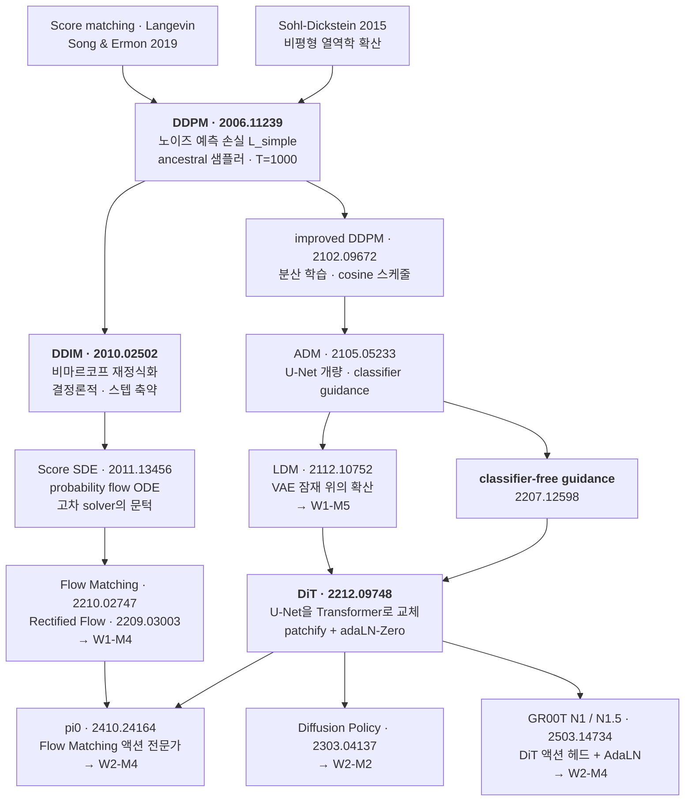
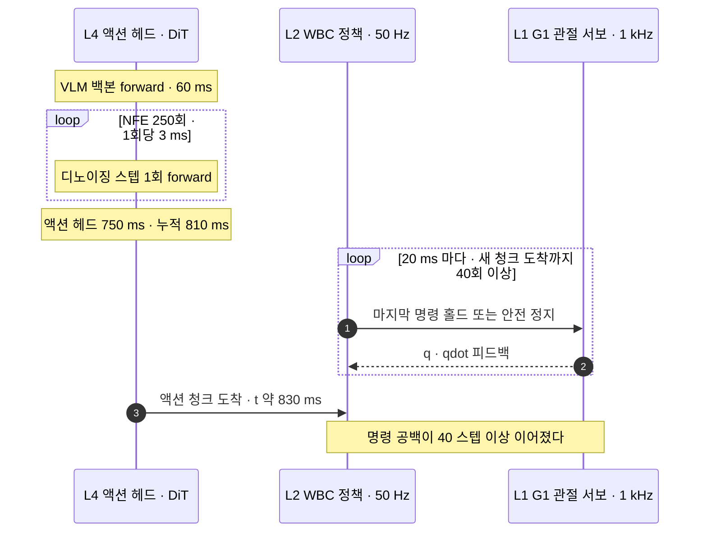
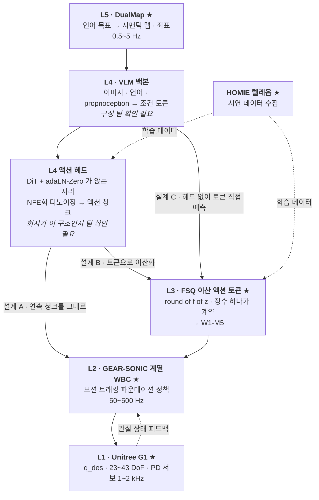

# Diffusion 계보: DDPM → DiT

> **한 줄 요약**: DDPM의 forward를 "정상분포가 $\mathcal{N}(0,I)$가 되도록 역설계된 안정한 이산시간 선형 시스템"으로 다시 읽고 손실을 ELBO에서 $\mathcal{L}_{\text{simple}}$까지 한 번 유도한 뒤, 샘플링 스텝 수가 그대로 제어 지연이 되는 산수와 DiT의 adaLN-Zero가 VLA 액션 헤드의 기본형이 된 이유를 정리한다.

## 학습 목표

- [ ] $q(x_t|x_0)=\mathcal{N}(\sqrt{\bar\alpha_t}x_0,(1-\bar\alpha_t)I)$를 재귀에서 유도하고, 이 닫힌 형태가 "임의의 $t$를 한 번에 뽑아 학습한다"를 가능하게 하는 지점을 지목할 수 있다.
- [ ] ELBO → KL 항 → $\mu_\theta$ 재파라미터화 → $\mathcal{L}_{\text{simple}}$을 백지에 재구성하고, 버려진 $\lambda_t$가 어느 $t$를 몇 배로 밀어주는지 수치로 답할 수 있다.
- [ ] ancestral과 DDIM의 차이를 SDE/ODE 이산화로 설명하고, 50 Hz·5 Hz 예산에 NFE를 대입해 허용 스텝 수를 계산할 수 있다.
- [ ] DiT 블록을 그리고 conditioning 주입 4방식을 비교한 뒤, adaLN-Zero의 zero-init을 $\alpha=0$의 항등함수 논리로 설명할 수 있다.
- [ ] 같은 블록을 액션 청크 `[B,32,29]`로 재해석하고, 회사 스택에서 **연속 diffusion 헤드**와 **이산 FSQ 토큰**이 같은 자리를 다투는 두 설계임을 논증할 수 있다.

**완료 기준**: 백지에 DiT 블록 하나를 $\gamma,\beta,\alpha$가 곱해지는 위치까지 그리고, 그 옆에 "우리 스택에서 이 블록이 앉을 수 있는 자리"와 "NFE 예산 상한"을 숫자로 쓸 수 있다.

**선수 지식**: [W1-M1](../01-physical-ai-landscape/lesson.md)(스택 5계층 · 주파수 예산 · action chunking 부등식), [W1-M2](../02-simulator-bootcamp/lesson.md)(G1 관절 29개 · `nu=29`) · **소요**: 이론 2h / 실습 2~3h

---

## 1. 왜 이것을 배우는가

강점 영역이므로 확률분포·신경망·VAE의 ELBO는 생략하고 세 가지에만 시간을 씁니다. **유도를 한 번은 끝까지** — $\mathcal{L}_{\text{simple}}$은 결과만 보면 "노이즈를 맞히는 MSE"라 기억에 남지 않지만, ELBO에서 그 한 줄까지 내려오는 길에 KL이 제곱차로 붕괴하는 지점과 가중치가 버려지는 지점이 있습니다. **제어 어휘로 다시** — forward는 알려진 확률적 선형 시스템의 순방향 전파, reverse는 그 역문제를 학습된 추정기로 푸는 일이며, $q(x_{t-1}|x_t,x_0)$은 칼만 필터의 측정 갱신, 스텝 수는 이산화 격자 수입니다. **로봇 맥락으로** — 이미지 diffusion에서 스텝 수는 사용자 대기 시간이지만 액션 diffusion에서는 **제어 지연**입니다(§5.2).

[W1-M5](../05-latent-discrete-fsq/lesson.md)가 이 모듈을 `prereq`로 걸고 전제하는 것이 셋입니다. "잠재 위에서 확산한다"의 확산(§3·§4), "액션 헤드에서 DiT가 청크를 생성한다"의 DiT(§6·§7), 연속 헤드와 이산 토큰이 같은 자리를 다툰다는 구도(§8.2). 반대로 **잠재공간·LDM·VQ-VAE·FSQ 내부는 다루지 않습니다.** DiT가 Stable Diffusion VAE 잠재(다운샘플 8배) 위에서 돈다는 사실 한 줄만 쓰고 그 이유는 W1-M5로, Flow Matching objective 유도는 W1-M4(예정)로 넘깁니다.

---

## 2. 계보 — 어디에 서 있는가



왼쪽 줄기(DDPM → DDIM → SDE → Flow Matching)는 **샘플링 비용을 깎아내리는 역사**, 오른쪽 줄기(ADM → LDM → DiT)는 **백본을 갈아치우는 역사**입니다. 로봇 액션 헤드는 둘이 합류한 지점에 있습니다 — 백본은 DiT, objective는 Flow Matching이 현재 표준 조합입니다.

---

## 3. Forward — 알려진 확률적 선형 시스템

### 3.1 정의

$$
q(x_t \mid x_{t-1}) = \mathcal{N}\!\left(x_t;\ \sqrt{1-\beta_t}\, x_{t-1},\ \beta_t I\right)
$$

$\alpha_t := 1-\beta_t$, $\bar\alpha_t := \prod_{s=1}^{t}\alpha_s$로 씁니다. 샘플 형태는 한 줄입니다.

$$
x_t = \sqrt{\alpha_t}\, x_{t-1} + \sqrt{1-\alpha_t}\,\epsilon_t, \qquad \epsilon_t \sim \mathcal{N}(0, I)
$$

**제어 대응**: $x_t = A_tx_{t-1}+w_t$에서 $A_t=\sqrt{\alpha_t}I$, $\mathrm{Cov}(w_t)=\beta_tI$인 시변 이산시간 LTI에 백색잡음을 먹인 것입니다. $\sqrt{\alpha_t}<1$이라 안정하고 평균은 기하급수로 0에 감쇠하며 분산은 $I$로 포화합니다. 즉 **정상분포가 $\mathcal{N}(0,I)$가 되도록 역설계된 시스템**이고, $\beta_t$ 스케줄 전체가 설계 상수라 학습되는 것이 없습니다.

### 3.2 닫힌 형태 — 유도

두 스텝을 펼칩니다.

$$
x_t = \sqrt{\alpha_t}\left(\sqrt{\alpha_{t-1}}x_{t-2} + \sqrt{1-\alpha_{t-1}}\epsilon_{t-1}\right) + \sqrt{1-\alpha_t}\,\epsilon_t
= \sqrt{\alpha_t\alpha_{t-1}}\,x_{t-2} + \underbrace{\sqrt{\alpha_t(1-\alpha_{t-1})}\,\epsilon_{t-1} + \sqrt{1-\alpha_t}\,\epsilon_t}_{\text{독립 가우시안 두 개의 합}}
$$

독립 가우시안의 합은 분산이 더해지므로

$$
\alpha_t(1-\alpha_{t-1}) + (1-\alpha_t) = \alpha_t - \alpha_t\alpha_{t-1} + 1 - \alpha_t = 1 - \alpha_t\alpha_{t-1}
$$

두 항이 하나의 $\mathcal{N}(0,(1-\alpha_t\alpha_{t-1})I)$로 합쳐집니다. 귀납으로 $t$까지 밀면

$$
\boxed{\;q(x_t \mid x_0) = \mathcal{N}\!\left(x_t;\ \sqrt{\bar\alpha_t}\,x_0,\ (1-\bar\alpha_t)I\right), \qquad x_t = \sqrt{\bar\alpha_t}\,x_0 + \sqrt{1-\bar\alpha_t}\,\epsilon\;}
$$

**제어 대응**: 공분산 전파 재귀 $P_t = A_tP_{t-1}A_t^\top + Q_t$를 손으로 푼 것입니다. $A_t$가 $I$의 스칼라배이고 $Q_t$가 등방이라 재귀가 대수적으로 닫히며, 일반적인 $A,Q$라면 수치로 돌려야 합니다. $\sqrt{\bar\alpha_t}$가 신호 전달 이득, $1-\bar\alpha_t$가 누적 잡음 분산이고 $\mathrm{SNR}(t)=\bar\alpha_t/(1-\bar\alpha_t)$입니다.

### 3.3 왜 이것이 결정적인가

DDPM 기본 설정($T=1000$, $\beta$를 $10^{-4}$에서 $0.02$까지 선형)의 실측값입니다.

| $t$ | $\beta_t$ | $\bar\alpha_t$ | $\sqrt{\bar\alpha_t}$ | $\sqrt{1-\bar\alpha_t}$ | SNR |
|---|---|---|---|---|---|
| 1 | 0.00010 | 0.99990 | 0.99995 | 0.0100 | 9,999 |
| 100 | 0.00207 | 0.89702 | 0.94711 | 0.3209 | 8.71 |
| 250 | 0.00506 | 0.52409 | 0.72394 | 0.6899 | 1.10 |
| 500 | 0.01004 | 0.07859 | 0.28033 | 0.9599 | 0.0853 |
| 1000 | 0.02000 | $4.04\times10^{-5}$ | 0.00635 | 1.0000 | $4.04\times10^{-5}$ |

$t\approx250$에서 SNR이 1을 지나고 $t=1000$에서는 신호가 158배 감쇠해 실질적으로 순수 노이즈입니다(재현: [`practice/01_ddpm_toy.py`](practice/01_ddpm_toy.py)).

닫힌 형태가 없으면 학습 시 $x_t$를 얻기 위해 체인을 $t$번 굴려야 합니다. 있으면 $t\sim\mathcal{U}\{1..T\}$와 $\epsilon\sim\mathcal{N}(0,I)$를 뽑아 한 줄로 $x_t$를 만들고 곧바로 손실을 계산합니다. **ODE를 적분하는 대신 해석적 천이행렬로 원하는 시각에 바로 점프하는 것**과 같은 이득이고, 이 한 가지가 diffusion을 학습 가능하게 만들었습니다.

---

## 4. Reverse와 손실 — 유도 한 번

### 4.1 역문제가 다루기 쉬워지는 조건

$q(x_{t-1}|x_t)$는 데이터 분포를 알아야 하므로 어렵습니다. 그런데 $x_0$을 조건에 넣으면 가우시안으로 닫힙니다.

$$
q(x_{t-1}\mid x_t, x_0) = \mathcal{N}\!\left(x_{t-1};\ \tilde\mu_t(x_t,x_0),\ \tilde\beta_t I\right)
$$

$$
\tilde\mu_t = \frac{\sqrt{\alpha_t}(1-\bar\alpha_{t-1})}{1-\bar\alpha_t}x_t + \frac{\sqrt{\bar\alpha_{t-1}}\,\beta_t}{1-\bar\alpha_t}x_0,
\qquad
\tilde\beta_t = \frac{1-\bar\alpha_{t-1}}{1-\bar\alpha_t}\beta_t
$$

**제어 대응**: 정확히 **칼만 필터의 측정 갱신**입니다. "$x_0$에서 내려온 사전분포"와 "$x_t$라는 관측"을 정밀도 가중 평균으로 융합하고, $\tilde\beta_t\le\beta_t$인 것은 조건에 정보를 하나 더 넣었으니 사후 분산이 줄어드는 당연한 결과입니다.

### 4.2 ELBO에서 제곱차로

변분 상한을 항별로 쪼개면 세 덩어리입니다.

$$
\mathbb{E}\!\left[\underbrace{D_{\mathrm{KL}}\!\left(q(x_T|x_0)\,\|\,p(x_T)\right)}_{L_T}
+ \sum_{t>1}\underbrace{D_{\mathrm{KL}}\!\left(q(x_{t-1}|x_t,x_0)\,\|\,p_\theta(x_{t-1}|x_t)\right)}_{L_{t-1}}
\underbrace{-\log p_\theta(x_0|x_1)}_{L_0}\right]
$$

$L_T$에는 파라미터가 없습니다(forward 고정, prior 고정). DDPM은 $p_\theta$의 공분산도 $\sigma_t^2I$로 고정하므로 $L_{t-1}$이 **같은 공분산을 가진 두 가우시안의 KL**이 되어 제곱차 하나로 붕괴합니다.

$$
L_{t-1} = \frac{1}{2\sigma_t^2}\left\|\tilde\mu_t(x_t,x_0) - \mu_\theta(x_t,t)\right\|^2 + C
$$

첫 번째 요점입니다. 분포 사이 거리를 재는 문제가 **평균을 맞히는 회귀 문제**로 내려앉았고, 그 대가로 공분산 자유도를 포기했습니다.

### 4.3 재파라미터화 — $\mu$ 대신 $\epsilon$

닫힌 형태를 뒤집으면 $x_0 = \frac{1}{\sqrt{\bar\alpha_t}}(x_t-\sqrt{1-\bar\alpha_t}\,\epsilon)$입니다. $\tilde\mu_t$에 대입해 정리하면 $x_0$이 사라집니다.

$$
\tilde\mu_t = \frac{1}{\sqrt{\alpha_t}}\left(x_t - \frac{\beta_t}{\sqrt{1-\bar\alpha_t}}\,\epsilon\right)
\qquad\Longrightarrow\qquad
\mu_\theta(x_t,t) := \frac{1}{\sqrt{\alpha_t}}\left(x_t - \frac{\beta_t}{\sqrt{1-\bar\alpha_t}}\,\epsilon_\theta(x_t,t)\right)
$$

$x_t$는 모델도 이미 갖고 있는 입력이라 그대로 빠지고 남는 것은 $\epsilon$과 $\epsilon_\theta$의 차이뿐입니다.

$$
L_{t-1} = \underbrace{\frac{\beta_t^2}{2\sigma_t^2\,\alpha_t(1-\bar\alpha_t)}}_{\lambda_t}\left\|\epsilon - \epsilon_\theta(x_t,t)\right\|^2
$$

**제어 대응**: 좌표 변환입니다. 추정 대상을 상태($\mu$)에서 잡음($\epsilon$)으로 바꿨을 뿐 정보량은 같지만, 새 좌표에서는 타깃 스케일이 $t$와 무관하게 $\mathcal{N}(0,I)$로 정규화되어 신경망이 모든 $t$에서 같은 스케일의 타깃을 봅니다. 플랜트 이득을 정규화한 오차 좌표로 옮겨 잡는 것과 같은 이유입니다.

### 4.4 가중치를 버린다 — 그 대가

$\lambda_t$를 떼면 실제 학습 손실이 나옵니다.

$$
\boxed{\;\mathcal{L}_{\text{simple}} = \mathbb{E}_{t,\,x_0,\,\epsilon}\left[\left\|\epsilon - \epsilon_\theta\!\left(\sqrt{\bar\alpha_t}x_0 + \sqrt{1-\bar\alpha_t}\epsilon,\ t\right)\right\|^2\right]\;}
$$

버린 것을 숫자로 봐야 합니다. $\sigma_t^2=\beta_t$로 두면 $\lambda_t = \beta_t/\bigl(2\alpha_t(1-\bar\alpha_t)\bigr)$입니다.

| $t$ | 1 | 2 | 10 | 100 | 500 | 1000 |
|---|---|---|---|---|---|---|
| $\lambda_t$ | 0.500 | 0.273 | 0.0737 | 0.0101 | 0.00550 | 0.0102 |

$\lambda_1/\lambda_{1000}\approx 49$입니다. ELBO는 작은 $t$(거의 깨끗한 이미지의 마지막 디테일 복원)에 약 50배 가중치를 주므로, 가중치를 버리면 그만큼 **큰 $t$가 상대적으로 승격**됩니다. DDPM 논문도 이를 의도한 효과로 설명합니다. 대가는 명확합니다. $\mathcal{L}_{\text{simple}}$은 더 이상 로그가능도의 유효한 하한이 아닙니다.

**제어 대응**: 비용함수의 주파수별 가중을 다시 튜닝한 것입니다. LQR 최적 이득을 실기에서 일부러 디튠하듯 최적성 증명서를 반납하고 실제로 신경 쓰는 지표를 삽니다([W1-M2 §7.5](../02-simulator-bootcamp/lesson.md)의 보상 24항 튜닝과 같은 성격).

**덧붙임 — $\epsilon_\theta$는 score의 스케일된 추정치입니다.** $q(x_t|x_0)$가 가우시안이므로 $\nabla_{x_t}\log q(x_t|x_0)=-\epsilon/\sqrt{1-\bar\alpha_t}$, 즉 $\epsilon_\theta\approx-\sqrt{1-\bar\alpha_t}\,s_\theta$입니다. DDPM 계열과 score-based 계열이 같은 대상을 다른 이름으로 학습했다는 뜻이고, 그래서 §2에서 두 줄기가 Score SDE에서 합류합니다. $s_\theta$가 "가장 그럴듯한 쪽으로 가는 벡터장"이면 샘플링은 그것을 적분하는 일이 되고, 이 관점이 §5의 ODE 시각으로 이어집니다.

---

## 5. 샘플러 — 스텝 수가 곧 제어 지연

### 5.1 ancestral과 DDIM

**ancestral (DDPM 원본)**은 매 스텝 노이즈를 다시 주입하며 마르코프 체인을 거꾸로 내려갑니다.

$$
x_{t-1} = \frac{1}{\sqrt{\alpha_t}}\left(x_t - \frac{\beta_t}{\sqrt{1-\bar\alpha_t}}\epsilon_\theta(x_t,t)\right) + \sigma_t z,\qquad z\sim\mathcal{N}(0,I)
$$

**DDIM (arXiv:2010.02502)**은 학습된 모델을 그대로 쓰면서 비마르코프 forward 족으로 재정식화하고 확률성 계수를 0으로 두어 결정론적 갱신을 만듭니다.

$$
\hat x_0 = \frac{x_t - \sqrt{1-\bar\alpha_t}\,\epsilon_\theta(x_t,t)}{\sqrt{\bar\alpha_t}},
\qquad
x_{t-1} = \sqrt{\bar\alpha_{t-1}}\,\hat x_0 + \sqrt{1-\bar\alpha_{t-1}}\,\epsilon_\theta(x_t,t)
$$

차이의 핵심은 결정론성 자체가 아니라 **격자를 건너뛸 수 있는가**입니다.

| | ancestral (DDPM) | DDIM ($\eta=0$) |
|---|---|---|
| 수학적 대상 | 역시간 SDE | probability flow ODE |
| 적분기 | Euler-Maruyama, 촘촘한 고정 격자 | Euler, 격자 자유 |
| 스텝 부분집합 사용 | 분산 정합이 깨져 품질 급락 | 부분수열 $\{\tau_1<\dots<\tau_S\}$ 그대로 사용 |
| 같은 노이즈 → 같은 결과 | 아니오 | 예 (재현·보간·역변환 가능) |
| 고차 solver | 어렵다 | 가능 (DPM-Solver 계열) |

**제어 대응**: 스텝 수는 **이산화 격자 수**이고 함수 평가 횟수(NFE)와 같습니다. 확률적 시스템은 노이즈 항 때문에 격자를 마음대로 늘릴 수 없지만 결정론적 ODE로 바꿔놓으면 절단오차만 관리하면 되고 고차 적분기를 붙일 수 있습니다.

### 5.2 예산 산수 — 이 절의 목적

DDPM 논문은 $T=1000$으로 학습하고 주요 결과는 250 스텝 샘플링으로 냅니다. 이 숫자를 [W1-M1 §4](../01-physical-ai-landscape/lesson.md)의 부등식에 넣습니다. 가정은 $f_2=50$ Hz, $\tau_{\text{comm}}=20$ ms, VLM 백본 60 ms, 헤드 1 NFE당 3 ms, L4는 추론이 끝나면 곧바로 다음 계획을 시작($T_{\text{replan}}=\tau_{\text{infer}}$).

| NFE | 헤드 시간 | $\tau_{\text{infer}}$ | 달성 가능 $f_4$ | 필요 $H_{\text{chunk}}$ | 최악 반응 지연 |
|---|---|---|---|---|---|
| 1 | 3 ms | 63 ms | 15.9 Hz | 8 | 160 ms |
| 10 | 30 ms | 90 ms | 11.1 Hz | 10 | 200 ms |
| 50 | 150 ms | 210 ms | 4.8 Hz | 22 | 440 ms |
| 100 | 300 ms | 360 ms | 2.8 Hz | 37 | 740 ms |
| **250** | 750 ms | 810 ms | **1.2 Hz** | **82** | **1,640 ms** |
| **1000** | 3,000 ms | 3,060 ms | **0.33 Hz** | **307** | **6,140 ms** |

마지막 두 줄이 이 모듈의 핵심 숫자입니다. 1000 스텝 체인을 그대로 물리면 청크 하나가 307 스텝, 즉 **6.14초 분량의 눈 감은 개방루프 동작**이 됩니다. [W1-M1 §3.3](../01-physical-ai-landscape/lesson.md)이 "발이 미끄러지기 시작해서 자세가 무너지기까지 200 ms가 안 걸린다"고 못박았으니 그 시간의 30배입니다. "1000스텝은 50 Hz 제어 루프에 물릴 수 없다"는 비유가 아니라 이 나눗셈이고, 자리별 상한은 §8.3에서 우리 스택 숫자로 다시 계산합니다.



### 5.3 그래서 어디로 가는가

NFE를 줄이는 길은 샘플러 교체(DDIM·고차 solver), 증류(consistency 계열), 그리고 **경로 자체를 직선으로 설계하는 것** 셋입니다. 세 번째가 Flow Matching과 Rectified Flow이고 현재 로봇 정책의 표준 선택입니다. DDPM의 확률 경로는 노이즈 스케줄이 그린 곡선이라 큰 스텝으로 자르면 절단오차가 크지만, 노이즈와 데이터를 직선으로 잇도록 설계하면 큰 스텝이 곧 오차가 되지 않습니다. objective 유도는 W1-M4(예정) 담당이고, 여기서 가져갈 것은 위 표 하나입니다. **NFE는 품질 노브가 아니라 지연 예산 항목입니다.**

---

## 6. DiT — conditioning을 어디에 넣는가

DiT(arXiv:2212.09748, Peebles & Xie)는 U-Net을 Transformer로 교체합니다. 사전학습된 Stable Diffusion VAE 잠재(다운샘플 8배) 위에서 도므로 $256\times256\times3$ 이미지가 $32\times32\times4$ 잠재가 됩니다(그 이유는 [W1-M5](../05-latent-discrete-fsq/lesson.md) 담당).

### 6.1 patchify

잠재 $z\in\mathbb{R}^{[B,4,32,32]}$를 $p\times p$ 패치로 잘라 선형 사영해 토큰으로 만듭니다. 토큰 수는 $T=(I/p)^2$입니다.

| $p$ | 토큰 수 | DiT-XL Gflops | 성격 |
|---|---|---|---|
| 8 | 16 | 낮음 | 시퀀스가 짧아 싸지만 품질 하한 |
| 4 | 64 | 29.1 | 중간 |
| 2 | **256** | **118.6** | 논문 최고 성능 구성 |

$p$를 줄이면 파라미터는 오히려 약간 줄고 토큰 수가 제곱으로 늘어 Gflops만 증가하는데 FID는 개선됩니다. 이것이 DiT의 중심 주장입니다. **품질을 결정하는 것은 파라미터 수가 아니라 Gflops입니다.** 논문은 Gflops가 비슷한 서로 다른 구성(DiT-S/2와 DiT-B/4)이 비슷한 FID를 얻는다는 관찰로 뒷받침합니다.

### 6.2 conditioning 주입 4방식

조건은 diffusion 스텝 $t$와 클래스 라벨 $y$ 둘입니다. 논문은 이 둘을 넣는 방식 네 가지를 DiT-XL/2 동일 조건에서 비교했습니다.

| 방식 | 어떻게 넣는가 | Gflops | Params | FID-50K @400K |
|---|---|---|---|---|
| in-context | $t,y$ 임베딩을 토큰 2개로 append. 최종 레이어 전 제거 | 119.37 | 449M | 35.24 |
| cross-attention | $t,y$를 길이 2 시퀀스로 두고 self-attn 뒤에 cross-attn 추가 | 137.62 | 598M | 26.14 |
| adaLN | LayerNorm의 학습 스케일·시프트를 $t+y$에서 회귀한 $\gamma,\beta$로 대체 | 118.56 | 600M | 25.21 |
| **adaLN-Zero** | adaLN + 잔차 직전 차원별 스케일 $\alpha$ 추가, 그 MLP를 0으로 초기화 | 118.64 | 675M | **19.47** |

**conditioning 방식만 바꿔 FID가 35.24에서 19.47로 절반 가까이 떨어집니다** — 조건을 어디에 넣느냐는 하이퍼파라미터가 아니라 아키텍처 결정입니다. cross-attention은 Gflops를 가장 많이 늘리고(논문 표현으로 약 15% 오버헤드) adaLN 계열은 추가 Gflops가 무시할 수준입니다.

**LLM 대응**: adaLN은 FiLM 계열의 조건부 정규화로 "본체를 건드리지 않고 정규화 계수만 조건에 따라 바꾸는" 개입이고, in-context는 조건을 프롬프트 토큰으로 붙이는 것입니다. 정규화 계수 경로가 프롬프트 경로를 크게 이겼습니다. 조건이 시퀀스 전체에 균일하게 작용해야 할 때는 토큰보다 정규화에 태우는 것이 낫다는 뜻입니다.

### 6.3 블록도 — $\gamma,\beta,\alpha$가 곱해지는 위치

```
■ DiT 블록 1개 · adaLN-Zero
──────────────────────────────────────────────
 조건 경로                          토큰 경로
 t diffusion 스텝 ─┐                h ∈ R^[B, T=256, d=1152]
 y 클래스 라벨   ─┤                  T = (I/p)² = (32/2)²
                   ▼                 d = 1152, heads 16, 블록 28개
   c = Emb(t) + Emb(y) ∈ R^[B, d]   ← 두 임베딩 벡터의 합
                   │
        ┌──────────▼─────────┐
        │  SiLU → Linear     │ d → 6d  ★ 이 Linear를 0으로 초기화
        └──────────┬─────────┘           = adaLN-Zero의 Zero
                   │ chunk 6
   γ₁ β₁ α₁ γ₂ β₂ α₂  각각 ∈ R^[B, 1, d]  ← T축으로 broadcast
──────────────────────────────────────────────
  h ──┬───────────────────────────────────────────────────┐
      ▼                                                   │
  LayerNorm (affine 없음)        [B,T,d] → [B,T,d]         │
      ▼                                                   │
  ⊙ (1+γ₁) ⊕ β₁      ← adaLN 변조. 정규화 직후 scale·shift │
      ▼                                                   │
  Multi-Head Self-Attention      [B,T,d] → [B,T,d]         │
      ▼                                                   │
  ⊙ α₁               ← 잔차 게이트. init 시 α₁ = 0         │
      ⊕ ◄─────────────────────────────────────────────────┘
      │
      ├───────────────────────────────────────────────────┐
      ▼                                                   │
  LayerNorm → ⊙(1+γ₂) ⊕ β₂ → MLP(hidden 4d) → ⊙ α₂        │
      ⊕ ◄─────────────────────────────────────────────────┘
      ▼  [B, T, d]  → 다음 블록
──────────────────────────────────────────────
 최종: LayerNorm → ⊙(1+γ) ⊕ β → Linear(d → p²·2C) → unpatchify
       출력 [B, 2C=8, 32, 32] = 노이즈 ε̂ [4,32,32] + 대각 분산 Σ̂

 α₁ = α₂ = 0 ⟹ 두 잔차 가지가 닫혀 블록이 항등함수: h_out = h_in
──────────────────────────────────────────────
```

**zero-init이 왜 안정화하는가.** $\alpha$를 내놓는 MLP를 0으로 초기화하면 학습 시작 시 모든 블록의 잔차 가지가 닫혀 네트워크 전체가 항등 사상입니다. 28개 블록을 통과해도 신호가 변형되지 않으니 초기 그래디언트가 깊이에 따라 증폭·소멸하지 않고, 학습이 진행되며 각 블록이 필요한 만큼만 $\alpha$를 열어 유효 깊이를 키웁니다.

**제어 대응**: 게인을 0에서 출발시키는 소프트 스타트입니다. 다단 캐스케이드를 전 이득으로 한꺼번에 닫으면 초기 과도응답이 발산할 수 있어 안쪽부터 순차적으로 닫는데, adaLN-Zero는 그 절차를 옵티마이저에 위임한 것입니다.

### 6.4 U-Net을 왜 버렸나

| 축 | U-Net (ADM, LDM) | DiT |
|---|---|---|
| 귀납 편향 | 다중해상도 conv + skip. 공간 국소성 내장 | 없음. 위치 인코딩으로만 전달 |
| 스케일링 | 채널·해상도·블록 수를 손으로 조합 | depth·width·토큰 수 세 노브, Gflops로 예산 관리 |
| 조건 주입 | 시간 임베딩 + attention 블록 삽입 | adaLN-Zero 기본, 이종 토큰은 cross-attn |
| 연산량·성능 | LDM-4 103.6 / ADM 1120 / ADM-U 742 Gflops | DiT-XL/2 **118.6 Gflops · 675M** · FID **2.27**(cfg 1.50) / 3.22(cfg 1.25) / 9.62(무보정) |
| 로봇 쪽 실익 | 이종 조건 토큰 붙이기가 번거롭다 | 멀티뷰 이미지·언어·proprioception을 토큰으로 그냥 붙인다 |

마지막 줄이 로봇에서 결정적입니다. 이미지 생성은 조건이 클래스 라벨 하나지만 액션 헤드는 카메라 $V$대의 패치 토큰, 언어 토큰 $L$개, proprioception을 동시에 받습니다. **길이가 가변인 이종 토큰 집합에 조건을 거는 일은 Transformer가 원래 하던 일이고 conv U-Net에는 남의 일입니다.** FID 소수점이 아니라 이 인터페이스 유연성이 액션 헤드가 DiT로 수렴한 실제 이유입니다.

---

## 7. 이미지에서 액션으로

### 7.1 무엇이 그대로이고 무엇이 달라지는가

| 요소 | 이미지 DiT | 액션 헤드 DiT |
|---|---|---|
| 데이터 텐서 | VAE 잠재 `[B,4,32,32]` | 액션 청크 `[B,H=32,D=29]` |
| 총 차원 | 4,096 | **928** |
| 토큰화 | 2D 공간 패치 $p=2$ → 256 토큰 | **시간축 패치** $p_t$ → $H/p_t$ 토큰 |
| 토큰 수 | 256 | **8~32** |
| 조건 | $t$ + 클래스 라벨 $y$ | $t$ + 관측(멀티뷰 이미지·언어·proprioception) |
| 조건 주입 | $t,y$ 모두 adaLN-Zero | $t$는 adaLN, 관측은 cross-attention |
| 출력 | $\hat\epsilon,\hat\Sigma$ `[B,8,32,32]` | $\hat\epsilon$ 또는 속도장 $\hat v$ `[B,32,29]` |
| 스텝 수의 의미 | 사용자 대기 시간 | **제어 지연**. 초과 시 로봇이 넘어진다 |
| 허용 NFE | 50~250 무방 | **1~10** (§5.2) |

블록 구조 전체가 그대로 옮겨갑니다. 액션 청크는 928차원으로 이미지 잠재 4,096차원보다 작고 토큰 수는 8~16배 짧아 헤드가 훨씬 작아도 됩니다(pi0의 액션 전문가 300M vs DiT-XL 675M). **모델 크기는 여유롭고 지연 예산은 세 자릿수 빡빡합니다** — 로봇 액션 헤드 설계의 제약이 전부 여기 있습니다.

### 7.2 블록도 — 액션 청크판

§6.3의 블록 내부는 그대로 두고, 입력·조건·출력 경로만 바뀝니다.

```
■ 같은 블록, 데이터만 액션 청크로 · G1 29 DoF 시나리오
──────────────────────────────────────────────
 a_t ∈ R^[B, H=32, D=29]     노이즈 섞인 액션 청크
   H = 청크 길이 ← W1-M1 §4 부등식 / D = 29 ← W1-M2 실측 nu=29
        │
        ▼   Linear(p_t·D → d),  p_t = 2      ← 시간축 patchify
   [B, 16, d]  + 1D 시간 위치 인코딩
        │
        │  조건: c = Emb(t) [+ Emb(state)] ∈ R^[B,d] → §6.3의 6d 경로
        ▼
 ┌────────────────────────────────────────────────┐
 │ Self-Attention   [B,16,d] → [B,16,d]   ← t는 adaLN-Zero로  │
 │       ↕                                                    │
 │ Cross-Attention ──→ 관측 토큰 [B, V·N_img + L, d]          │
 │       ↕             멀티뷰 이미지 패치 + 언어 토큰         │
 │ MLP (adaLN-Zero)                                           │
 └───────────────────────────┬────────────────────────────────┘
            × N 블록         │ [B, 16, d]
                             ▼
   Linear(d → p_t·D) → unpatchify → ε̂ 또는 v̂ ∈ R^[B, 32, 29]
                             │
                             ▼  NFE회 반복 후 최종 청크 → L2 WBC로
──────────────────────────────────────────────
 GR00T N1/N1.5가 이 배치입니다 — 계열별 차이는 §7.4 표.
──────────────────────────────────────────────
```

> $H=32$, $p_t=2$, $D=29$는 이 모듈 실습([`practice/03_dit_action_head.py`](practice/03_dit_action_head.py)) 설정이고 특정 논문의 실제 값이 아닙니다.

### 7.3 왜 회귀가 아니라 생성인가

같은 관측에서 사람이 매번 다르게 시연합니다. 컵을 왼쪽으로 돌아가도 되고 오른쪽으로 돌아가도 됩니다. 이때 $\ell_2$ 회귀는 조건부 평균을 학습하므로 두 모드의 중간, 즉 컵을 정면으로 밀어버리는 액션을 냅니다. **평균은 어느 모드도 아닙니다.** diffusion·Flow Matching 헤드는 조건부 분포 전체를 학습해 한 모드를 골라 뽑고, 이산 토큰의 softmax도 같은 문제를 다르게 해결합니다([W1-M5 §3](../05-latent-discrete-fsq/lesson.md)). 본체와 실험 증거는 W2-M2 담당이라 여기서는 "생성 모델을 쓰는 이유가 화질이 아니라 다봉성"이라는 한 줄만 챙깁니다.

### 7.4 현재 VLA 액션 헤드 계보

| 모델 | 액션 헤드 구조 | objective | 스텝 조건 주입 | 확인 상태 |
|---|---|---|---|---|
| Diffusion Policy (2303.04137) | 1D conv U-Net 또는 Transformer | DDPM/DDIM | 시간 임베딩 | → W2-M2 |
| pi0 (2410.24164) | 300M 액션 전문가. **Gemma 블록** | conditional flow matching | 노이즈 액션 + $\phi(\tau)$를 MLP로 접어 넣음. **AdaLN 아님** | 논문 확인 |
| pi0의 DiT 베이스라인 | DiT 블록 | conditional flow matching | **AdaLN-Zero** | 논문 확인 |
| GR00T N1 (2503.14734) | **DiT**. self-attn ↔ cross-attn 교대 | action flow matching | **adaptive layer normalization** | 논문 확인 |
| GR00T N1.5 | 같은 DiT 구조. VLM을 Eagle 2.5로 교체 | flow matching | **AdaLN** | 모델카드 확인 |

마스터플랜은 "현재 대부분의 VLA 액션 헤드가 DiT 구조"라고 적었습니다. 위 표가 그 근거이면서 단서를 붙입니다. GR00T 계열은 DiT + AdaLN을 그대로 물려받았지만 **pi0는 본 모델에서 의도적으로 그렇게 하지 않고** Gemma 블록을 재사용해 VLM과 액션 전문가의 구조를 통일했습니다. "DiT 구조"라는 요약은 objective(대부분 Flow Matching)와 블록 계보(DiT 또는 언어모델 블록)를 구분해 읽어야 정확합니다. 상세는 W2-M4 담당입니다.

---

## 8. 회사 스택 연결 ★

### 8.1 DiT가 앉을 수 있는 자리



화살표가 세 갈래인 것이 요점입니다. **회사가 A·B·C 중 어느 배치인지는 확인되지 않았습니다**(§8.4).

### 8.2 연속 diffusion 헤드 vs 이산 토큰 AR

같은 자리(L4 출력 ↔ L2 입력)를 놓고 경쟁하는 두 설계입니다.

| 축 | 연속 diffusion/FM 헤드 (DiT) | 이산 FSQ 토큰 + AR |
|---|---|---|
| 상위 모델 형태 | VLM + 별도 액션 전문가 파라미터 | VLM 그대로, vocabulary만 확장 |
| 1회 출력 비용 | **NFE × 헤드 forward** | 토큰 수 × AR forward, KV 캐시 재사용 |
| 지연 줄이는 방법 | NFE 축소, 경로 직선화, 증류 | 토큰 수 축소, 캐시, speculative decoding |
| 분해능 | 부동소수점 | $\prod L_i$ 격자가 상한 |
| 인터페이스 계약 | 연속 벡터 — 스케일·단위·차원 순서 협상 | 정수 하나 |
| 하위 정책 교체 | 액션 규약 자체가 계약이라 재학습 위험 | 토큰 공간 유지하면 자유 |
| 대표 사례 | Diffusion Policy · pi0 · GR00T N1 | RT-2 · 회사 FSQ 기반 계층 모델 ★ |
| 담당 모듈 | **이 모듈 · W2-M2 · W2-M4** | [W1-M5](../05-latent-discrete-fsq/lesson.md) · W2-M5 |

회사 선택의 손익 논증은 [W1-M5 §1.1과 §3](../05-latent-discrete-fsq/lesson.md)에 있습니다. 이 모듈이 보태는 것은 반대쪽 가격표입니다. **연속 헤드를 쓰면 NFE가 그대로 지연 예산으로 청구됩니다**(§5.2가 그 청구서). 다만 두 설계가 논리적으로 배타적이지는 않습니다 — 이산 토큰 위의 생성 모델도 존재하고(MaskGIT 계열), 회사가 실제로 어떤 조합인지는 모릅니다.

### 8.3 NFE 예산 — 우리 스택 숫자로

[W1-M1 §3.1](../01-physical-ai-landscape/lesson.md)의 계층별 주파수에 §5.2의 산수를 붙이면 상한이 나옵니다.

| 자리 | 주기 예산 | 헤드에 남는 시간 | 3 ms/NFE 상한 | 10 ms/NFE 상한 |
|---|---|---|---|---|
| L2 안에 직접 · 50 Hz | 20 ms | 20 ms | 6 NFE | 2 NFE |
| L2 안에 직접 · 500 Hz | 2 ms | 2 ms | **0 NFE** | **0 NFE** |
| L4 청크 생성 · 5 Hz | 200 ms | 140 ms | 46 NFE | 14 NFE |
| L4 청크 생성 · 10 Hz | 100 ms | 40 ms | 13 NFE | 4 NFE |

**diffusion 헤드는 L2 안에 들어갈 수 없습니다.** 500 Hz면 예산이 2 ms라 forward 한 번도 못 하고, 청킹으로 L4에 올려놓아야 수십 NFE의 여유가 생깁니다. 즉 action chunking은 반응성을 희생해 NFE 예산을 사오는 거래이고, [W1-M1 §4.4](../01-physical-ai-landscape/lesson.md)의 MPC 지평 트레이드오프가 여기서 다시 쓰입니다. 단 3 ms·10 ms는 가정값입니다 — 실측은 §8.4 ③.

### 8.4 확인되지 않은 것

이 절에서 숫자로 채우지 못한 칸이 다섯입니다. 전부 🔴 미확인이며 추측하지 않았습니다. 질문 문장은 §10에 있습니다.

**① L4 액션 헤드 구조**(§8.1의 A·B·C 결정) · **② objective**(NFE 상한과 학습 코드가 갈림) · **③ 실측 NFE와 forward 시간**(§8.3 표를 실수로 채우는 데 필요) · **④ FSQ 토큰과 헤드의 순서**(L3 계약의 실체) · **⑤ 조건 주입 방식**(§6.2 실측 근거가 우리 설계에 적용되는지)

---

## 9. 흔한 오해 3가지

| 오해 | 교정 |
|---|---|
| **"$\epsilon$-prediction과 $x_0$-prediction은 다른 모델이다"** | $x_t$와 $t$가 주어지면 둘은 가역 아핀 변환으로 서로 옮겨지므로($x_0=(x_t-\sqrt{1-\bar\alpha_t}\epsilon)/\sqrt{\bar\alpha_t}$) 한쪽을 완벽히 맞히면 다른 쪽도 완벽히 맞힙니다. 실제로 달라지는 것은 **손실의 암묵적 $t$-가중치**입니다. $\|x_0-\hat x_0\|^2$과 $\|\epsilon-\hat\epsilon\|^2$은 $1/\mathrm{SNR}(t)$배 차이라 어느 $t$를 중시하는지가 바뀝니다($v$-prediction도 같은 계열의 또 다른 좌표). 상태공간 실현이 유사변환으로 무한히 많지만 전달함수는 하나인 것과 같습니다 — 갈리는 것은 수치 조건수와 손실 가중이지 표현력이 아닙니다. |
| **"스텝을 줄이면 그냥 품질만 나빠진다"** | 스텝 수와 샘플러 종류는 **독립 축이 아닙니다.** ancestral에서 격자를 듬성하게 하면 절단오차만 늘지 않고 노이즈 스케줄의 분산 정합이 깨져 품질이 급락합니다. DDIM처럼 결정론적 ODE로 바꾸면 같은 NFE에서 훨씬 낫고 고차 solver도 붙으며, Rectified Flow처럼 경로를 직선으로 설계하면 1~4 스텝이 실용권에 들어옵니다. 스텝 수는 **경로·솔버·모델을 함께 설계해 사오는 예산**이고, 그래서 W1-M4가 존재합니다. |
| **"diffusion은 느려서 로봇에 못 쓴다"** | Diffusion Policy와 pi0가 실제로 돌고 있습니다. 병목은 diffusion 자체가 아니라 NFE이고 세 장치로 예산에 들어갑니다 — ① action chunking(§8.3) ② 액션 청크가 928차원·16토큰이라 forward가 싸다(§7.1) ③ Flow Matching·증류로 NFE를 1~10까지. **NFE를 예산 항목으로 놓고 설계하는 문제**일 뿐입니다. 다만 L2 자리(500 Hz)에 직접 넣는 것은 여전히 불가능합니다. |

**번외**: "DiT는 U-Net보다 항상 좋다"도 흔합니다. DiT의 주장은 "FID가 파라미터 수보다 Gflops와 상관한다"이지 conv가 열등하다는 것이 아닙니다. 데이터·연산 예산이 작으면 conv의 국소성 편향이 여전히 유리할 수 있습니다.

---

## 10. 팀에 물어볼 것

> `notes/questions-for-team.md`의 W1 섹션에 적립할 것. [W1-M5](../05-latent-discrete-fsq/lesson.md)의 M5-1~6과 겹치지 않는 새 질문입니다.

1. **L4 상위 모델에 액션 헤드가 존재하는가? 있다면 DiT 계열인가, pi0처럼 언어모델 블록을 재사용하는가, 헤드 없이 FSQ 토큰을 직접 예측하는가?** — §8.1의 설계 A·B·C 중 어느 것인지가 W2-M4 읽기 순서와 캡스톤 다이어그램을 바꿉니다.
2. **objective가 DDPM 계열인가 Flow Matching 계열인가? 추론 시 NFE는 몇이고 1회 forward는 몇 ms인가?** — §8.3 표의 빈칸이며, 이 세 숫자로 지연 예산을 실측으로 닫습니다.
3. **조건(관측)을 헤드에 어떻게 주입하는가 — cross-attention인가, in-context 토큰인가, adaLN인가?** DiT 실측으로는 이 선택만으로 FID가 35.24에서 19.47까지 갈립니다(§6.2).
4. **FSQ 토큰과 액션 헤드의 순서는?** 헤드가 연속 청크를 내고 FSQ가 이산화하는가, 상위가 토큰을 직접 예측하고 FSQ 디코더가 연속으로 되돌리는가 — L3 계약의 실체이고 P0 2번·M5-5의 앞단입니다.
5. **액션 청크 길이 $H$와 하위 소비 주파수 $f_2$의 실제 값은?** — §5.2 표와 [W1-M1 §4](../01-physical-ai-landscape/lesson.md) 부등식을 실수로 채우는 데 필요합니다(M1-7의 `H_chunk` 재확인 겸).
6. **액션 헤드 학습 데이터에 다봉 시연이 실제로 있는가?** 단일 모드에 가깝다면 §7.3의 "생성 모델이어야 하는 이유"가 우리 데이터에서 약해지고, 회귀 헤드로 충분한지 판단할 근거가 됩니다.

---

## 11. 셀프 체크 퀴즈

1. **(유도)** $q(x_t|x_{t-1})$에서 $q(x_t|x_0)$를 유도하라. 두 스텝을 합칠 때 분산이 $1-\alpha_t\alpha_{t-1}$이 되는 계산을 명시할 것. 이 닫힌 형태가 없으면 학습 루프에서 무엇이 불가능해지는가?
2. **(계산)** $\bar\alpha_{1000}\approx4.0\times10^{-5}$일 때 $\sqrt{\bar\alpha_{1000}}$과 $\mathrm{SNR}(1000)$을 구하고, SNR이 1을 지나는 $t$가 어디인지 답하라.
3. forward를 이산시간 상태공간 모델로 쓰면 $A_t$와 $Q_t$는 무엇인가? 이 시스템의 안정성과 정상분포 $\mathcal{N}(0,I)$가 어떻게 연결되는가?
4. $q(x_{t-1}|x_t,x_0)$은 칼만 필터의 어느 단계인가? $\tilde\beta_t\le\beta_t$인 이유를 정보 관점에서 한 줄로 설명하라.
5. ELBO의 $L_{t-1}$이 제곱차로 붕괴하는 데 필요한 가정은? 그 가정을 얻기 위해 무엇을 포기했는가?
6. **(계산)** $\lambda_1\approx0.500$, $\lambda_{1000}\approx0.0102$의 비를 구하고 $\mathcal{L}_{\text{simple}}$이 어느 $t$를 승격시키는지, 그 대가는 무엇인지 답하라.
7. $\epsilon_\theta$와 score $s_\theta$의 관계식을 쓰고, 이 등식이 §2에서 어느 합류를 설명하는지 말하라.
8. **(계산)** $f_2=50$ Hz, $\tau_{\text{comm}}=20$ ms, VLM 60 ms, 1 NFE = 3 ms, $T_{\text{replan}}=\tau_{\text{infer}}$일 때 NFE 250에서 필요한 $H_{\text{chunk}}$와 최악 반응 지연을 구하라. 휴머노이드에서 왜 치명적인가?
9. conditioning 주입 4방식을 FID 순으로 정렬하라. adaLN과 adaLN-Zero의 차이는 무엇 하나이며 왜 학습을 안정화하는가? 제어의 어떤 관행에 대응하는가?
10. **(회사 스택)** DiT 액션 헤드가 앉을 수 있는 자리를 §8.1의 A·B·C로 설명하고, 연속 헤드와 이산 FSQ 토큰의 손익을 세 축으로 대조하라. 우리가 실제로 어느 배치인지 답할 수 있는가?

<details>
<summary>정답 보기</summary>

1. 한 단계 더 펼치면 $\sqrt{\alpha_t\alpha_{t-1}}x_{t-2}+\sqrt{\alpha_t(1-\alpha_{t-1})}\epsilon_{t-1}+\sqrt{1-\alpha_t}\epsilon_t$이고, 뒤 두 항은 독립 가우시안이라 분산이 더해져 $\alpha_t(1-\alpha_{t-1})+(1-\alpha_t)=1-\alpha_t\alpha_{t-1}$입니다. 귀납하면 $\bar\alpha_t$가 나옵니다. 닫힌 형태가 없으면 체인을 $t$번 굴려야 하므로 $t\sim\mathcal{U}\{1..T\}$로 배치를 만드는 학습이 사실상 불가능해집니다.

2. $\sqrt{4.04\times10^{-5}}\approx0.00635$(신호 약 158배 감쇠), $\mathrm{SNR}(1000)\approx4.04\times10^{-5}$. SNR이 1을 지나는 곳은 $\bar\alpha_t=0.5$이므로 $t\approx250$($\bar\alpha=0.524$, SNR 1.10)입니다.

3. $A_t=\sqrt{1-\beta_t}\,I$, $Q_t=\beta_tI$. $\beta_t>0$이므로 $\|A_t\|<1$이라 안정합니다. 공분산 재귀 $P_t=\alpha_tP_{t-1}+\beta_t$가 고정점 $P^\star=1$로 수렴하고 평균은 0으로 감쇠하므로, 스케줄이 $\mathcal{N}(0,I)$를 정상분포로 갖도록 역설계된 것입니다.

4. 측정 갱신 단계로, "$x_0$에서 온 사전분포"와 "$x_t$라는 관측"을 정밀도 가중으로 융합합니다. $\tilde\beta_t\le\beta_t$는 조건에 정보를 하나 더 넣었기 때문입니다 — 정보가 늘면 사후 분산이 줄어듭니다.

5. $p_\theta$의 공분산을 $\sigma_t^2I$로 고정하는 것입니다. 같은 공분산을 가진 두 가우시안의 KL은 평균 차이의 제곱항으로 붕괴합니다. 포기한 것은 분산 모델링의 자유도이며, improved DDPM(2102.09672)이 나중에 이를 학습 대상으로 되돌립니다.

6. $0.500/0.0102\approx49$배. ELBO가 작은 $t$에 약 50배 가중치를 주므로 가중치를 버리면 **큰 $t$가 상대적으로 승격**됩니다. 대가는 $\mathcal{L}_{\text{simple}}$이 로그가능도의 유효한 하한이 아니게 되는 것 — 가능도를 포기하고 지각 품질을 삽니다.

7. $\nabla_{x_t}\log q(x_t|x_0)=-\epsilon/\sqrt{1-\bar\alpha_t}$이므로 $\epsilon_\theta\approx-\sqrt{1-\bar\alpha_t}\,s_\theta$로 상수배 차이입니다. 노이즈 예측과 score matching이 같은 대상을 학습했다는 뜻이고, 그래서 두 줄기가 Score SDE(2011.13456)의 probability flow ODE에서 합류합니다.

8. $\tau_{\text{infer}}=60+250\times3=810$ ms이므로 $H\ge50\times(0.810+0.810+0.020)=82$ 스텝, 최악 반응 지연 $=1.64$초. 그동안 새 관측을 반영하지 못하는 개방루프인데, 자세가 무너지는 시간은 200 ms 미만이라([W1-M1 §3.3](../01-physical-ai-landscape/lesson.md)) 8배 이상 늦습니다.

9. in-context(35.24) → cross-attention(26.14) → adaLN(25.21) → **adaLN-Zero(19.47)**. FID-50K, DiT-XL/2, 400K 스텝 기준. 차이는 **잔차 직전의 차원별 스케일 $\alpha$를 추가하고 그 MLP를 0으로 초기화한 것 하나**입니다. $\alpha=0$이면 블록이 항등함수라 28층을 통과해도 초기 그래디언트가 폭주·소멸하지 않고, 학습이 진행되며 각 블록이 필요한 만큼 $\alpha$를 엽니다. 제어 대응은 소프트 스타트이며, adaLN-Zero는 그 순서를 옵티마이저에 위임한 것입니다.

10. **A** = 헤드가 연속 청크를 내고 L2가 그대로 받음(FSQ 우회). **B** = 헤드가 연속 청크를 내고 FSQ가 이산화. **C** = 헤드 없이 VLM이 FSQ 토큰을 직접 AR 예측. 세 축 — ① **인터페이스**: 연속은 스케일·단위·차원 순서 협상, 이산은 정수 하나. ② **지연**: 연속은 NFE가 그대로 청구되고(§5.2) 이산은 KV 캐시로 완화. ③ **표현력**: 연속은 부동소수점, 이산은 $\prod L_i$ 격자가 상한. 그리고 **우리가 어느 배치인지는 답할 수 없습니다** — §8.4 전부 미확인이고 §10의 1·4번으로 적립했습니다.

</details>

---

## 12. 출처

모든 항목 확인: 2026-08-02.

- **DDPM** — arXiv:2006.11239. §3~§4의 닫힌 형태·$q(x_{t-1}|x_t,x_0)$·$\mathcal{L}_{\text{simple}}$·$T=1000$ 선형 $\beta$ 스케줄 출처.
- **DiT** — arXiv:2212.09748. **§6의 모든 수치가 이 논문에서 왔습니다** — conditioning 4방식 FID·Gflops, DiT-XL 28층·$d$=1152·16헤드, $p\in\{2,4,8\}$, SD VAE 8배, FID 2.27/3.22/9.62, 675M. adaLN-Zero의 항등 초기화 근거는 원문 §3 "we initialize the MLP to output the zero-vector for all $\alpha$; this initializes the full DiT block as the identity function".
- **DDIM** — arXiv:2010.02502 · **classifier-free guidance** — arXiv:2207.12598
- **§2 계보** — Sohl-Dickstein arXiv:1503.03585 · Song & Ermon arXiv:1907.05600 · improved DDPM arXiv:2102.09672 · ADM arXiv:2105.05233 · Score SDE arXiv:2011.13456 · LDM arXiv:2112.10752 · Flow Matching arXiv:2210.02747 · Rectified Flow arXiv:2209.03003
- **§7.4 액션 헤드** — **pi0** arXiv:2410.24164 (PaliGemma 3B + 300M 액션 전문가, conditional flow matching) · **GR00T N1** arXiv:2503.14734 (액션 모듈이 Diffusion Transformer, action flow matching, 스텝 조건 adaptive layer normalization) · **N1.5** NVIDIA 모델카드 및 `github.com/NVIDIA/Isaac-GR00T` · **Diffusion Policy** arXiv:2303.04137
- **보충** (마스터플랜 §5 지정) — Lilian Weng "What are Diffusion Models?" https://lilianweng.github.io/posts/2021-07-11-diffusion-models/ · HuggingFace "The Annotated Diffusion Model" https://huggingface.co/blog/annotated-diffusion

**회사 스택** — §8의 계층 배치는 [마스터플랜](../../../docs/physical-ai-4week-master-plan.md) §2.1~2.3의 **추정** 파이프라인 기반이며 검증은 W4-M5 캡스톤 과제입니다. §8.4의 5개 항목은 **집필 시점에 확인되지 않았고 추측하지 않았습니다.**

---

## 13. 실습으로 가기

2D toy 분포와 G1 액션 청크만 쓰므로 CPU로 완주되고 로컬 RTX 3080이면 몇 분입니다. 실행 순서는 [`practice/README.md`](practice/README.md), 랩 가이드는 [`labs/README.md`](labs/README.md)와 [`labs/worksheet.md`](labs/worksheet.md).

- [`01_ddpm_toy.py`](practice/01_ddpm_toy.py) — §3.3의 $\bar\alpha_t$·SNR 표를 재계산하고 2D toy 분포에 미니 DDPM을 학습합니다. `# eq.(N)` 주석이 §3.2·§4.4의 수식과 코드를 잇습니다.
- [`02_samplers_compare.py`](practice/02_samplers_compare.py) — 같은 모델로 ancestral과 DDIM을 NFE $\in\{1,2,4,10,20,50,250,1000\}$에서 비교합니다. **NFE를 줄일 때 두 샘플러가 갈리는 지점을 눈으로 보는 것이 목적입니다.**
- [`03_dit_action_head.py`](practice/03_dit_action_head.py) — §6.3 블록도를 코드로 옮겨 $\alpha=0$에서 블록이 항등함수임을 assert로 확인하고, §7.2대로 입력을 액션 청크 `[B,32,29]`로 바꿔 shape이 끝까지 통하는지 검증합니다.

> 📌 진짜 산출물은 노트북이 아니라 둘입니다. **백지에 그린 DiT 블록도**(W1 체크포인트 1번 문항)와 **§5.2 표를 자기 손으로 다시 계산한 것.**

---

**이전 토픽** ← [시뮬레이터 부트캠프: MuJoCo에서 G1을 움직이기까지](../02-simulator-bootcamp/lesson.md)
**다음 토픽** → W1-M4 Flow Matching & Rectified Flow *(집필 예정)* — §5.3에서 남긴 문제 제기를 objective 수준에서 받습니다. 확률 경로를 직선으로 설계하면 NFE 상한이 어떻게 바뀌는가.
**이어지는 논의** → [W1-M5 잠재공간과 이산화](../05-latent-discrete-fsq/lesson.md) — DiT가 왜 VAE 잠재 위에서 도는지, 그리고 §8.2에서 대조한 이산 토큰 쪽 설계의 본체.
