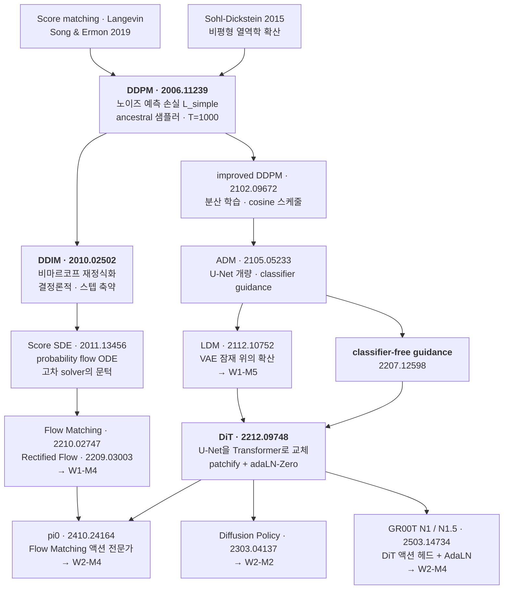
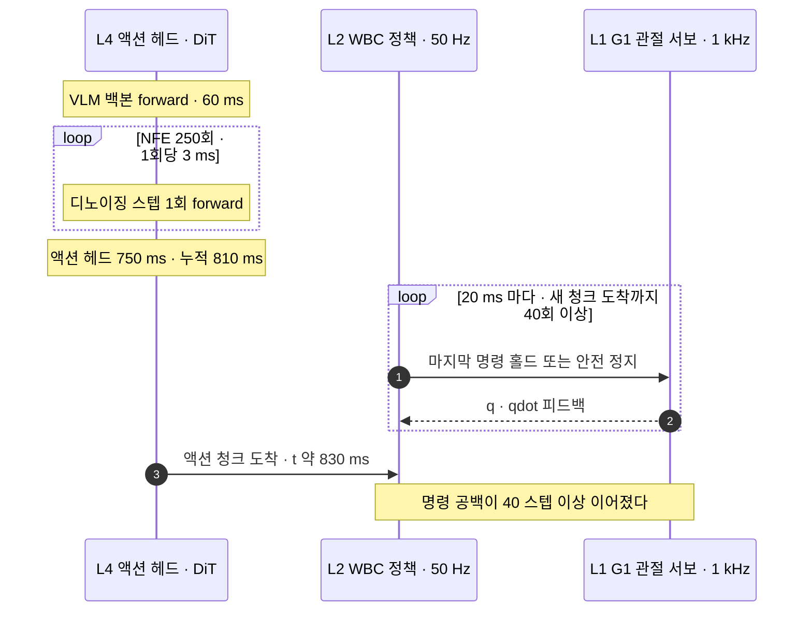
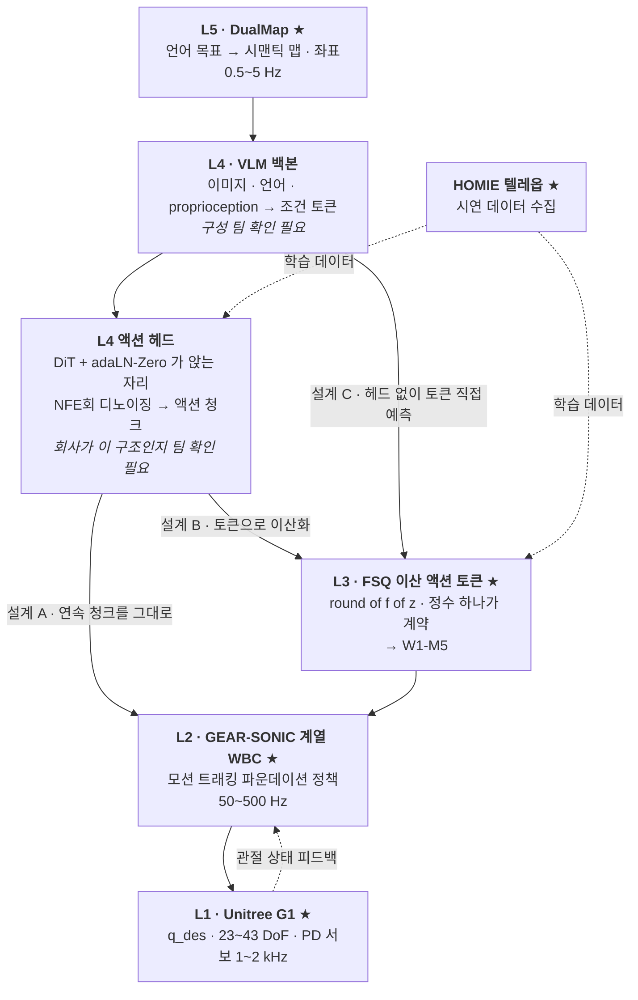

# Diffusion 계보: DDPM → DiT

> **한 줄 요약**: 그림 생성 모델이 노이즈를 조금씩 걷어내며 그림을 만드는 과정을 제어공학의 언어로 다시 읽고, 그 걷어내는 횟수가 로봇에서는 곧 반응이 늦어지는 시간이 된다는 것을 숫자로 확인한 다음, 로봇 팔다리 명령을 만드는 요즘 모델들이 왜 하나같이 같은 블록 구조를 쓰는지까지 따라갑니다.

---

## 0. 이 모듈 지도

**오늘의 질문** 셋입니다.

- 노이즈를 넣었다 빼는 과정은 제어공학의 어떤 시스템인가?
- 손실이 회귀 한 줄로 내려앉는 동안 무엇을 포기했는가?
- 걷어내는 횟수가 왜 넘어지느냐의 문제가 되는가?

| 절 | 무엇을 | 끝나면 할 수 있는 것 | 읽는 시간 |
|---|---|---|---|
| §1 | 왜 이걸 배우나 | 이 모듈이 앞뒤 모듈과 어디서 만나는지 짚기 | 1분 |
| §2 | 계보 | 두 줄기가 어디서 합류하는지 그리기 | 1분 |
| §3 | 노이즈를 넣는 쪽 | 닫힌 형태 한 줄로 임의 시각을 바로 뽑기 | 3분 |
| §4 | 노이즈를 빼는 쪽과 손실 | 손실이 회귀로 내려앉는 길과 그 대가 말하기 | 3분 |
| §5 | 샘플러와 제어 지연 | 스텝 수를 지연 예산에 대입해 계산하기 | 3분 |
| §6 | DiT 블록 | 블록도를 그리고 0 초기화의 논리를 설명하기 | 4분 |
| §7 | 이미지에서 액션으로 | 같은 블록을 액션 청크로 다시 읽기 | 3분 |
| §8과 마무리 | 회사 스택, 오해, 한 장 정리, 퀴즈 10문항 | 앉을 자리를 지목하고 백지 재구성으로 자기 점검 | 20분 |


**선수 지식**

| 알아야 할 것 | 어디서 채우나 | 이 문서가 대신 설명하는 것 |
|---|---|---|
| 확률분포, 가우시안, 신경망 학습 | 보유 배경으로 가정 | 생성모델 전용 어휘는 절마다 용어표로 |
| 상태공간 모델과 공분산 전파, 칼만 필터 | 보유 배경으로 가정 | 앵커로 쓸 때 그 자리에서 한 줄 재진술 |
| 변분추론과 증거 하한 | **가정하지 않음** | §1 용어표에서 정의하고 §4에서 씀 |
| 계층 구조, 주파수 예산, action chunking | [W1-M1](../01-physical-ai-landscape/lesson.md) §3, §4 | §5.2와 §8.3에서 그대로 회수 |
| G1 관절 개수와 `nu=29` | [W1-M2](../02-simulator-bootcamp/lesson.md) §5 | §7.2 블록도가 이 숫자를 씀 |

**완료 기준**: DiT 블록을 $\gamma,\beta,\alpha$까지 백지에 그리고 그 옆에 "앉을 자리"와 "NFE 상한"을 숫자로 쓴다. **소요** 이론 2h, 실습 2~3h

> 📌 **여기까지 정리**
> - 목적지는 유도 한 번, 지연 산수 한 번, 블록도 한 장이다
> - 세 질문에 §3, §4, §5, §6이 답한다
> - 남는 것은 "우리 스택 어디에 앉는가"라는 미결 질문이다

---

## 1. 왜 이걸 배우나

| 용어 | 한 줄 정의 | 제어·LLM 비유 |
|---|---|---|
| **확산 모델(diffusion model)** | 데이터에 노이즈를 단계적으로 섞어 없앤 뒤 그 과정을 거꾸로 학습해, 노이즈에서 데이터를 만들어내는 생성 모델 | 알려진 플랜트를 정방향으로 돌려 데이터를 만들고 역문제를 학습된 추정기로 푸는 구조 |
| **forward 과정** | 데이터에 노이즈를 섞어 가는 정방향 사슬. 학습되는 파라미터가 하나도 없다 | 잡음이 들어가는 이산시간 선형 시스템의 순방향 전파 |
| **reverse 과정** | 노이즈에서 데이터로 되돌아오는 역방향 사슬. 신경망이 학습하는 것은 여기뿐이다 | 역문제. 한 스텝의 갱신이 칼만 필터의 측정 갱신과 같은 꼴 |
| **ELBO(Evidence Lower BOund, 증거 하한)** | 직접 계산할 수 없는 로그가능도 $\log p_\theta(x_0)$ 대신 올려서 최대화하는 하한. 변분추론의 표준 목적함수 | 원 문제를 못 풀 때 풀 수 있는 완화 문제를 대신 푸는 자리 |
| **NFE(Number of Function Evaluations, 함수 평가 횟수)** | 샘플 하나를 얻는 데 신경망을 forward하는 횟수. 디노이징 스텝 수와 같다 | 수치적분의 격자 수. 로봇에서는 그대로 지연 예산 항목 |

$\mathcal{L}_{\text{simple}}$은 결과만 보면 노이즈를 맞히는 평균제곱오차입니다. ELBO에서 그 한 줄까지 오는 길에 붕괴 한 번과 포기 한 번이 있고 그 둘이 본체입니다. 제어 어휘로도 읽습니다.

- forward는 계수가 전부 설계 상수인 확률적 선형계의 순방향 전파
- reverse는 그 역문제이고 $q(x_{t-1}|x_t,x_0)$은 **칼만 필터의 측정 갱신**
- 스텝 수는 이산화 격자 수이고 액션에서는 **제어 지연**(§5.2)

LDM(Latent Diffusion Model) 내부는 [W1-M5](../05-latent-discrete-fsq/lesson.md), Flow Matching은 W1-M4가 받습니다.

> 📌 **여기까지 정리**
> - 결과는 평균제곱오차 한 줄이지만 오는 길에 붕괴와 포기가 있다
> - forward는 알려진 플랜트, reverse는 학습된 역문제, 스텝 수는 격자다
> - 로봇에서 스텝 수의 단위는 대기 시간이 아니라 제어 지연이다

---

## 2. 계보

| 용어 | 한 줄 정의 | 제어·LLM 비유 |
|---|---|---|
| **score** | 로그 확률밀도의 기울기 $\nabla_x\log p(x)$. 더 그럴듯한 쪽을 가리키는 벡터장 | 포텐셜의 기울기. 샘플링은 이 벡터장을 따르는 적분이 된다 |
| **SDE(Stochastic Differential Equation, 확률미분방정식)** | 잡음 항이 들어간 미분방정식. 확산 과정의 연속시간 표현 | 연속시간 확률 시스템. 이산화하면 forward 사슬이 된다 |
| **ODE(Ordinary Differential Equation, 상미분방정식)** | 잡음 항이 없는 결정론적 미분방정식 | 같은 분포를 흘려보내는 결정론적 등가계. §5.1의 DDIM이 여기 산다 |
| **guidance** | 생성 결과를 조건 쪽으로 더 밀어주는 추론 시점 보정 | 기준신호 추종을 강하게 거는 것과 같은 성격의 노브 |



두 줄기로 읽습니다.

- 왼쪽(DDPM → DDIM → Score SDE → Flow Matching)은 **샘플링 비용을 깎는 역사**
- 오른쪽(ADM → LDM → DiT)은 **백본을 갈아치우는 역사**

액션 헤드는 둘이 합류한 지점, 곧 백본 DiT에 목적함수 Flow Matching인 조합입니다([deep-dive.md](deep-dive.md) §1).

> 📌 **여기까지 정리**
> - 한 줄기는 샘플링 비용을 깎았고 다른 줄기는 백본을 갈았다
> - 둘은 Score SDE에서 한 번, 액션 헤드에서 다시 만난다
> - 왼쪽 줄기의 나머지는 W1-M4가 받는다

---

## 3. Forward는 알려진 확률적 선형 시스템이다

| 용어 | 한 줄 정의 | 제어·LLM 비유 |
|---|---|---|
| **$\beta_t$ 스케줄** | 매 스텝 얼마나 노이즈를 섞을지 미리 정해둔 수열. 학습 대상이 아닌 설계 상수 | 플랜트의 시변 계수를 설계자가 표로 박아둔 것 |
| **$\bar\alpha_t$ (누적 신호 이득)** | $\prod_{s\le t}(1-\beta_s)$. $t$까지 살아남은 원신호의 비율 | 공분산 전파 재귀를 손으로 푼 결과. 천이행렬의 누적 |
| **SNR(Signal-to-Noise Ratio, 신호 대 잡음비)** | $\bar\alpha_t/(1-\bar\alpha_t)$. 남은 신호와 쌓인 잡음의 비 | 같은 이름 같은 뜻. 1을 지나는 시점이 국면 전환점 |
| **닫힌 형태(closed form)** | 재귀를 풀어 $t$를 직접 대입할 수 있게 만든 식 | 적분 없이 해석적 천이행렬로 원하는 시각에 점프하는 것 |

### 3.1 정의

$$
q(x_t \mid x_{t-1}) = \mathcal{N}\!\left(x_t;\ \sqrt{1-\beta_t}\, x_{t-1},\ \beta_t I\right)
\quad\Longleftrightarrow\quad
x_t = \sqrt{\alpha_t}\, x_{t-1} + \sqrt{1-\alpha_t}\,\epsilon_t,\ \ \epsilon_t \sim \mathcal{N}(0, I)
$$

$\alpha_t := 1-\beta_t$, $\bar\alpha_t := \prod_{s=1}^{t}\alpha_s$입니다. **제어 대응**은 $A_t=\sqrt{\alpha_t}I$, $\mathrm{Cov}(w_t)=\beta_tI$인 시변 선형계입니다.

- $\sqrt{\alpha_t}<1$이라 안정하고 평균은 0으로, 분산은 $I$로 갑니다
- 정상분포가 $\mathcal{N}(0,I)$이도록 **역설계**됐고 학습 대상이 없습니다

### 3.2 닫힌 형태

두 스텝을 펼치면 노이즈 항의 분산이 $1-\alpha_t\alpha_{t-1}$로 더해지고, 귀납하면 이렇습니다.

$$
\boxed{\;q(x_t \mid x_0) = \mathcal{N}\!\left(x_t;\ \sqrt{\bar\alpha_t}\,x_0,\ (1-\bar\alpha_t)I\right), \qquad x_t = \sqrt{\bar\alpha_t}\,x_0 + \sqrt{1-\bar\alpha_t}\,\epsilon\;}
$$

**제어 대응**은 공분산 전파 재귀를 손으로 푼 것입니다([deep-dive.md](deep-dive.md) §2).

### 3.3 왜 이것이 결정적인가

DDPM 기본 설정($T=1000$, $\beta$ 선형 $10^{-4}\to0.02$)의 실측값입니다.

| $t$ | $\beta_t$ | $\bar\alpha_t$ | $\sqrt{\bar\alpha_t}$ | $\sqrt{1-\bar\alpha_t}$ | SNR |
|---|---|---|---|---|---|
| 1 | 0.00010 | 0.99990 | 0.99995 | 0.0100 | 9,999 |
| 100 | 0.00207 | 0.89702 | 0.94711 | 0.3209 | 8.71 |
| 250 | 0.00506 | 0.52409 | 0.72394 | 0.6899 | 1.10 |
| 500 | 0.01004 | 0.07859 | 0.28033 | 0.9599 | 0.0853 |
| 1000 | 0.02000 | $4.04\times10^{-5}$ | 0.00635 | 1.0000 | $4.04\times10^{-5}$ |

- SNR 교차점은 $t=259$($\bar\alpha=0.500$)이고 표의 $t=250$이 그 앞
- $t=1000$에서는 신호가 157배 감쇠해 사실상 순수 노이즈
- 학습되는 값이 없어 시드와 장치에 무관하게 재현됩니다([`01_ddpm_toy.py`](practice/01_ddpm_toy.py))

닫힌 형태가 없으면 체인을 $t$번 굴려야 합니다. **이 하나가 확산 모델을 학습 가능하게 만들었습니다.**

> 📌 **여기까지 정리**
> - forward는 정상분포가 $\mathcal{N}(0,I)$이도록 역설계된 선형계다
> - 공분산 전파가 닫혀 $q(x_t|x_0)$이 한 줄이 된다
> - 그래서 임의의 $t$를 뽑아 바로 학습할 수 있다

---

## 4. Reverse와 손실 유도 한 번

| 용어 | 한 줄 정의 | 제어·LLM 비유 |
|---|---|---|
| **사후분포 $q(x_{t-1}\mid x_t,x_0)$** | 시작점 $x_0$를 알 때 한 스텝 되돌린 분포. 가우시안으로 닫힌다 | 칼만 필터의 측정 갱신. 사전분포와 관측을 정밀도 가중으로 융합 |
| **KL 발산(Kullback-Leibler divergence)** | 두 분포가 얼마나 다른지 재는 비대칭 거리 | 분포 사이 비용항. 공분산이 같으면 평균 차의 제곱으로 내려앉는다 |
| **재파라미터화** | 같은 대상을 다른 변수로 바꿔 추정하는 것. 평균 $\mu$ 대신 노이즈 $\epsilon$을 맞힌다 | 좌표 변환. 정보량은 같고 수치 조건과 손실 가중만 달라진다 |
| **$\mathcal{L}_{\text{simple}}$** | ELBO의 $t$별 가중치를 떼어낸 실제 학습 손실. 노이즈를 맞히는 평균제곱오차 | 최적 이득을 실기에서 디튠한 비용함수. 증명서를 반납하고 실측 지표를 산다 |

### 4.1 역문제가 다루기 쉬워지는 조건

$q(x_{t-1}|x_t)$는 어렵지만 $x_0$을 조건에 넣으면 가우시안으로 닫힙니다.

$$
q(x_{t-1}\mid x_t, x_0) = \mathcal{N}\!\left(x_{t-1};\ \tilde\mu_t,\ \tilde\beta_t I\right),\quad
\tilde\mu_t = \frac{\sqrt{\alpha_t}(1-\bar\alpha_{t-1})}{1-\bar\alpha_t}x_t + \frac{\sqrt{\bar\alpha_{t-1}}\,\beta_t}{1-\bar\alpha_t}x_0,\quad
\tilde\beta_t = \frac{1-\bar\alpha_{t-1}}{1-\bar\alpha_t}\beta_t
$$

- **칼만 측정 갱신**이고 $\tilde\beta_t\le\beta_t$는 정보를 더 넣어 사후 분산이 준 결과입니다

### 4.2 ELBO에서 제곱차로

변분 상한은 세 덩어리이고 공분산을 $\sigma_t^2I$로 **고정**하면 $L_{t-1}$이 제곱차로 붕괴합니다.

$$
\mathbb{E}\!\left[\underbrace{D_{\mathrm{KL}}\!\left(q(x_T|x_0)\,\|\,p(x_T)\right)}_{L_T}
+ \sum_{t>1}\underbrace{D_{\mathrm{KL}}\!\left(q(x_{t-1}|x_t,x_0)\,\|\,p_\theta(x_{t-1}|x_t)\right)}_{L_{t-1}}
\underbrace{-\log p_\theta(x_0|x_1)}_{L_0}\right]
\;\Longrightarrow\;
L_{t-1} = \frac{\left\|\tilde\mu_t - \mu_\theta\right\|^2}{2\sigma_t^2} + C
$$

- $L_T$에는 파라미터가 없고 $L_0$은 마지막 스텝의 재구성 항입니다
- 거리 문제가 **평균을 맞히는 회귀**가 됐고 대가는 공분산 자유도입니다([deep-dive.md](deep-dive.md) §3)

### 4.3 $\mu$ 대신 $\epsilon$으로 재파라미터화

닫힌 형태를 뒤집어 대입하면 $x_0$과 $x_t$가 빠지고 노이즈 차이만 남습니다.

$$
\mu_\theta(x_t,t) := \frac{1}{\sqrt{\alpha_t}}\left(x_t - \frac{\beta_t}{\sqrt{1-\bar\alpha_t}}\,\epsilon_\theta(x_t,t)\right)
\qquad\Longrightarrow\qquad
L_{t-1} = \underbrace{\frac{\beta_t^2}{2\sigma_t^2\,\alpha_t(1-\bar\alpha_t)}}_{\lambda_t}\left\|\epsilon - \epsilon_\theta(x_t,t)\right\|^2
$$

**제어 대응**은 좌표 변환입니다. 타깃 스케일만 $t$와 무관해집니다([deep-dive.md](deep-dive.md) §4).

### 4.4 가중치를 버린 대가

$\lambda_t$를 떼면 실제 학습 손실입니다. $\sigma_t^2=\beta_t$면 $\lambda_t = \beta_t/\bigl(2\alpha_t(1-\bar\alpha_t)\bigr)$이고 표가 그 값입니다.

$$
\boxed{\;\mathcal{L}_{\text{simple}} = \mathbb{E}_{t,\,x_0,\,\epsilon}\left[\left\|\epsilon - \epsilon_\theta\!\left(\sqrt{\bar\alpha_t}x_0 + \sqrt{1-\bar\alpha_t}\epsilon,\ t\right)\right\|^2\right]\;}
$$

| $t$ | 1 | 2 | 10 | 100 | 500 | 1000 |
|---|---|---|---|---|---|---|
| $\lambda_t$ | 0.500 | 0.273 | 0.0737 | 0.0101 | 0.00550 | 0.0102 |

$\lambda_1/\lambda_{1000}\approx 49$이고 여기서 둘이 갈립니다.

- ELBO는 작은 $t$에 약 50배를 겁니다. 버리면 **큰 $t$가 승격**되고 논문도 이를 의도한 효과로 봅니다
- 대가로 $\mathcal{L}_{\text{simple}}$은 로그가능도의 유효한 하한이 아닙니다

**제어 대응**은 최적 이득을 실기에서 디튠하는 거래입니다([W1-M2 §7.5](../02-simulator-bootcamp/lesson.md)의 보상 24항과 같은 성격). 덧붙여 $\epsilon_\theta\approx-\sqrt{1-\bar\alpha_t}\,s_\theta$라 노이즈 예측이 곧 score 추정이고 §2의 두 줄기가 여기서 합류합니다([deep-dive.md](deep-dive.md) §6).

> 📌 **여기까지 정리**
> - $x_0$을 조건에 넣으면 역문제가 닫히고 칼만 측정 갱신이 된다
> - 공분산을 고정하면 KL이 붕괴해 손실이 회귀가 된다
> - $\lambda_t$를 버려 큰 $t$를 승격시켰고 하한 자격을 반납했다

---

## 5. 샘플러와 제어 지연

| 용어 | 한 줄 정의 | 제어·LLM 비유 |
|---|---|---|
| **ancestral sampling** | 매 스텝 노이즈를 다시 주입하며 마르코프 사슬을 거꾸로 내려가는 원본 샘플러 | Euler-Maruyama 적분에 촘촘한 고정 격자 |
| **DDIM(Denoising Diffusion Implicit Models)** | 학습된 모델을 그대로 쓰면서 forward를 비마르코프로 재정식화해 확률성을 0으로 둔 샘플러 | 결정론적 ODE의 Euler 적분. 격자를 건너뛸 수 있다 |
| **probability flow ODE** | 확산 과정과 같은 분포를 흘려보내는 결정론적 등가 미분방정식 | 고차 적분기를 붙일 수 있게 되는 문턱 |
| **action chunking** | 상위가 한 번에 여러 스텝 분량의 액션을 내놓고 하위가 그것을 소비하는 방식 | MPC(Model Predictive Control, 모델 예측 제어)의 예측 지평. 길게 잡으면 계산 여유를 사고 반응성을 판다 |

### 5.1 ancestral과 DDIM

용어표의 두 샘플러를 갱신식으로 놓습니다(**DDIM** arXiv:2010.02502).

$$
x_{t-1} = \frac{1}{\sqrt{\alpha_t}}\left(x_t - \frac{\beta_t}{\sqrt{1-\bar\alpha_t}}\epsilon_\theta\right) + \sigma_t z
\qquad\text{vs}\qquad
x_{t-1} = \sqrt{\bar\alpha_{t-1}}\,\underbrace{\frac{x_t - \sqrt{1-\bar\alpha_t}\,\epsilon_\theta}{\sqrt{\bar\alpha_t}}}_{\hat x_0} + \sqrt{1-\bar\alpha_{t-1}}\,\epsilon_\theta
$$

핵심은 결정론성이 아니라 **격자를 건너뛸 수 있는가**입니다.

| | ancestral (DDPM) | DDIM ($\eta=0$) |
|---|---|---|
| 수학적 대상 | 역시간 SDE | probability flow ODE |
| 적분기 | Euler-Maruyama, 촘촘한 고정 격자 | Euler, 격자 자유 |
| 스텝 부분집합 사용 | 노이즈 재주입 때문에 부분 격자에서 열세 | 부분수열 $\{\tau_1<\dots<\tau_S\}$ 그대로 사용 |
| 같은 노이즈 → 같은 결과 | 아니오 | 예 (재현·보간·역변환 가능) |
| 고차 solver | 어렵다 | 가능 (DPM-Solver 계열) |

확률적 계와 달리 결정론적 ODE는 절단오차만 관리하면 됩니다([deep-dive.md](deep-dive.md) §5).

### 5.2 예산 산수

DDPM은 $T=1000$으로 학습하고 결과는 250 스텝으로 냅니다. [W1-M1 §4](../01-physical-ai-landscape/lesson.md) 부등식에 넣습니다. 가정은 넷.

- 하위 주파수 $f_2=50$ Hz, 통신 지연 $\tau_{\text{comm}}=20$ ms
- VLM(Vision-Language Model, 시각언어모델) 백본 60 ms

헤드와 재계획 쪽입니다.

- 액션 헤드 1 NFE당 3 ms
- 상위는 추론이 끝나면 바로 다음 계획 시작($T_{\text{replan}}=\tau_{\text{infer}}$)

| NFE | 헤드 시간 | $\tau_{\text{infer}}$ | 달성 가능 $f_4$ | 필요 $H_{\text{chunk}}$ | 최악 반응 지연 |
|---|---|---|---|---|---|
| 1 | 3 ms | 63 ms | 15.9 Hz | 8 | 160 ms |
| 10 | 30 ms | 90 ms | 11.1 Hz | 10 | 200 ms |
| 50 | 150 ms | 210 ms | 4.8 Hz | 22 | 440 ms |
| 100 | 300 ms | 360 ms | 2.8 Hz | 37 | 740 ms |
| **250** | 750 ms | 810 ms | **1.2 Hz** | **82** | **1,640 ms** |
| **1000** | 3,000 ms | 3,060 ms | **0.33 Hz** | **307** | **6,140 ms** |

마지막 두 줄이 핵심입니다. 1000 스텝이면 청크가 307 스텝, 곧 **6.14초짜리 눈 감은 개방루프**입니다. [W1-M1 §3.2](../01-physical-ai-landscape/lesson.md) "200 ms"의 30배이고 비유가 아니라 위 나눗셈입니다.



자리별 상한은 §8.3입니다.

### 5.3 그래서 어디로 가는가

NFE를 줄이는 길은 셋입니다.

- 샘플러 교체(DDIM, 고차 solver). 재학습은 없지만 한 자릿수 NFE는 못 간다
- 증류(consistency 계열). 학습 비용을 추가로 낸다
- **경로를 직선으로 설계.** Flow Matching과 Rectified Flow이고 로봇 정책의 표준이다

DDPM의 경로는 곡선이라 크게 자르면 절단오차가 큽니다. **NFE는 품질 노브가 아니라 지연 예산 항목입니다.**

> 📌 **여기까지 정리**
> - ancestral은 SDE 이산화, DDIM은 ODE 이산화이고 후자만 격자를 건너뛴다
> - 250 스텝이면 청크가 82 스텝, 1.64초 개방루프다
> - 샘플러 교체로는 부족해 경로를 직선으로 설계한다

---

## 6. DiT는 conditioning을 어디에 넣는가

| 용어 | 한 줄 정의 | 제어·LLM 비유 |
|---|---|---|
| **DiT(Diffusion Transformer)** | 확산 모델의 백본을 U-Net 대신 Transformer로 놓은 아키텍처 | 플랜트 모델의 구조를 갈아끼운 것. 인터페이스는 그대로 |
| **patchify** | 텐서를 정해진 크기 패치로 잘라 선형 사영해 토큰열로 만드는 것 | 연속 신호를 일정 간격으로 잘라 샘플열로 만드는 발상 |
| **conditioning** | 결과를 조건(스텝 번호, 라벨, 관측)에 맞추도록 정보를 주입하는 것 | 기준신호와 스케줄링 변수를 어느 경로로 넣을지의 문제 |
| **adaLN(adaptive Layer Normalization, 적응적 층 정규화)** | 층 정규화의 스케일과 시프트를 조건 임베딩에서 회귀해 넣는 조건부 정규화 | 게인 스케줄링. 본체는 두고 계수만 조건에 따라 바꾼다 |
| **FID(Fréchet Inception Distance)** | 생성 분포와 실제 분포의 거리. 낮을수록 좋다 | 설계 선택을 가르는 눈금으로만 씀 |

DiT(arXiv:2212.09748)는 U-Net을 Transformer로 바꾸고 Stable Diffusion VAE 잠재(8배 다운샘플) 위에서 돕니다.

### 6.1 patchify

잠재를 $p\times p$ 패치로 잘라 사영하면 토큰 수가 $T=(I/p)^2$입니다.

- $p=8$은 16개, $p=4$는 64개에 29.1 Gflops, $p=2$는 **256개**에 **118.6 Gflops**
- $p$를 줄이면 파라미터는 약간 줄고 Gflops만 제곱으로 느는데 FID는 개선됩니다

**품질을 정하는 것은 Gflops입니다. 파라미터 수가 아닙니다**([deep-dive.md](deep-dive.md) §7이 근거).

### 6.2 conditioning 주입 4방식

조건은 확산 스텝 $t$와 라벨 $y$ 둘이고 논문은 넷을 DiT-XL/2에서 비교했습니다.

| 방식 | 어떻게 넣는가 | Gflops | Params | FID-50K @400K |
|---|---|---|---|---|
| in-context | $t,y$ 임베딩을 토큰 2개로 append. 최종 레이어 전 제거 | 119.37 | 449M | 35.24 |
| cross-attention | $t,y$를 길이 2 시퀀스로 두고 self-attn 뒤에 cross-attn 추가 | 137.62 | 598M | 26.14 |
| adaLN | LayerNorm의 학습 스케일·시프트를 $t+y$에서 회귀한 $\gamma,\beta$로 대체 | 118.56 | 600M | 25.21 |
| **adaLN-Zero** | adaLN + 잔차 직전 차원별 스케일 $\alpha$ 추가, 그 MLP를 0으로 초기화 | 118.64 | 675M | **19.47** |

- **방식만 바꿔 FID가 35.24에서 19.47로 떨어집니다.** 조건을 넣는 자리는 아키텍처 결정입니다
- cross-attention만 Gflops를 크게 늘리고(약 15%) adaLN 계열은 추가분이 없다시피 합니다

조건이 시퀀스 전체에 균일하면 프롬프트 토큰보다 정규화 계수에 태우는 편이 낫습니다([deep-dive.md](deep-dive.md) §8).

### 6.3 블록도와 zero-init

```
■ DiT 블록 1개 · adaLN-Zero
──────────────────────────────────────────────
 조건 경로                          토큰 경로
 t diffusion 스텝 ─┐                h ∈ R^[B, T=256, d=1152]
 y 클래스 라벨   ─┤                  T = (I/p)² = (32/2)²
                   ▼                 d = 1152, heads 16, 블록 28개
   c = Emb(t) + Emb(y) ∈ R^[B, d]   ← 두 임베딩 벡터의 합
                   │
        ┌──────────▼─────────┐
        │  SiLU → Linear     │ d → 6d  ★ 이 Linear를 0으로 초기화
        └──────────┬─────────┘           = adaLN-Zero의 Zero
                   │ chunk 6
   γ₁ β₁ α₁ γ₂ β₂ α₂  각각 ∈ R^[B, 1, d]  ← T축으로 broadcast
──────────────────────────────────────────────
  h ──┬───────────────────────────────────────────────────┐
      ▼                                                   │
  LayerNorm (affine 없음)        [B,T,d] → [B,T,d]         │
      ▼                                                   │
  ⊙ (1+γ₁) ⊕ β₁      ← adaLN 변조. 정규화 직후 scale·shift │
      ▼                                                   │
  Multi-Head Self-Attention      [B,T,d] → [B,T,d]         │
      ▼                                                   │
  ⊙ α₁               ← 잔차 게이트. init 시 α₁ = 0         │
      ⊕ ◄─────────────────────────────────────────────────┘
      │
      ├───────────────────────────────────────────────────┐
      ▼                                                   │
  LayerNorm → ⊙(1+γ₂) ⊕ β₂ → MLP(hidden 4d) → ⊙ α₂        │
      ⊕ ◄─────────────────────────────────────────────────┘
      ▼  [B, T, d]  → 다음 블록
──────────────────────────────────────────────
 최종: LayerNorm → ⊙(1+γ) ⊕ β → Linear(d → p²·2C) → unpatchify
       출력 [B, 2C=8, 32, 32] = 노이즈 ε̂ [4,32,32] + 대각 분산 Σ̂

 α₁ = α₂ = 0 ⟹ 두 잔차 가지가 닫혀 블록이 항등함수: h_out = h_in
──────────────────────────────────────────────
```

눈여겨볼 자리는 둘입니다.

- 정규화 직후의 $\odot(1+\gamma)\oplus\beta$가 adaLN 변조
- 잔차 직전의 $\odot\alpha$가 Zero라는 이름이 붙은 자리

**zero-init이 왜 안정화하는가.** $\alpha$의 MLP를 0으로 두면 28층이 통째로 항등 사상이라 초기 그래디언트가 폭주하지도 소멸하지도 않고, 학습 중에 블록마다 필요한 만큼 $\alpha$를 엽니다. **캐스케이드를 안쪽부터 닫는 소프트 스타트**입니다.

### 6.4 U-Net을 왜 버렸나

| 축 | U-Net (ADM, LDM) | DiT |
|---|---|---|
| 귀납 편향 | conv와 skip으로 공간 국소성 내장 | 없음. 위치 인코딩으로만 전달 |
| 스케일링 | 채널·해상도·블록 수를 손으로 조합 | depth·width·토큰 수를 Gflops 하나로 예산 관리 |
| 연산량과 성능 | LDM-4 103.6 / ADM 1120 / ADM-U 742 Gflops | **118.6 Gflops · 675M** · FID **2.27**(cfg 1.50) |

결정적인 것은 넷째 축입니다. 액션 헤드는 카메라 $V$대의 패치 토큰, 언어 토큰 $L$개, proprioception(고유수용감각, 관절 각도와 속도 같은 자기 상태)을 함께 받습니다. **길이가 가변인 이종 토큰 집합에 조건을 거는 일은 Transformer가 원래 하던 일이고 conv U-Net에는 남의 일입니다.** 이것이 DiT로 수렴한 실제 이유입니다([deep-dive.md](deep-dive.md) §7).

> 📌 **여기까지 정리**
> - $p$가 토큰 수를 정하고 품질은 파라미터가 아니라 Gflops가 정한다
> - 조건을 넣는 자리만으로 FID가 35.24에서 19.47까지 갈린다
> - $\alpha$를 0으로 두면 블록이 항등함수가 되고 이것이 소프트 스타트다

---

## 7. 이미지에서 액션으로

| 용어 | 한 줄 정의 | 제어·LLM 비유 |
|---|---|---|
| **액션 청크(action chunk)** | 한 번의 추론으로 내놓는 여러 스텝 분량의 액션 묶음 | MPC가 한 번 풀고 내놓는 입력 시퀀스와 같은 모양 |
| **DoF(Degrees of Freedom, 자유도)** | 독립적으로 움직일 수 있는 관절 축의 개수 | 상태공간 차원을 정하는 물리 파라미터. G1은 23~43 |
| **VLA(Vision-Language-Action, 시각언어행동 모델)** | 이미지와 언어를 받아 로봇 액션을 내놓는 상위 모델 | 목표를 행동 의도로 바꾸는 바깥 루프 |
| **액션 전문가(action expert)** | 백본과 분리된, 액션 생성 전용 파라미터 집합 | 바깥 루프 안에서 명령 생성만 전담하는 별도 블록 |
| **다봉성(multimodality)** | 같은 조건에서 정답이 여럿인 성질. 시연 데이터가 대표적이다 | 최적해가 여럿인 비볼록 문제. 평균은 어느 해도 아니다 |

### 7.1 무엇이 그대로이고 무엇이 달라지는가

데이터와 토큰화입니다.

| 요소 | 이미지 DiT | 액션 헤드 DiT |
|---|---|---|
| 데이터 텐서 | VAE 잠재 `[B,4,32,32]` | 액션 청크 `[B,H=32,D=29]` |
| 총 차원 | 4,096 | **928** |
| 토큰화 | 2D 공간 패치 $p=2$ → 256 토큰 | **시간축 패치** $p_t$ → $H/p_t$ 토큰 |
| 토큰 수 | 256 | **8~32** |

조건과 예산 쪽이 더 갈립니다.

| 요소 | 이미지 DiT | 액션 헤드 DiT |
|---|---|---|
| 조건 | $t$ + 클래스 라벨 $y$ | $t$ + 관측(멀티뷰 이미지, 언어, proprioception) |
| 조건 주입 | $t,y$ 모두 adaLN-Zero | $t$는 adaLN, 관측은 cross-attention |
| 출력 | $\hat\epsilon,\hat\Sigma$ `[B,8,32,32]` | $\hat\epsilon$ 또는 속도장 $\hat v$ `[B,32,29]` |
| 스텝 수의 의미 | 사용자 대기 시간 | **제어 지연**. 초과 시 로봇이 넘어진다 |
| 허용 NFE | 50~250 무방 | **1~10** (§5.2) |

액션 청크는 928차원으로 잠재 4,096차원보다 작고 토큰도 8~16배 짧습니다(pi0 300M 대 675M). **크기는 여유롭고 예산은 빡빡합니다.**

### 7.2 액션 청크판 블록도

내부는 §6.3 그대로이고 입출력만 바뀝니다.

```
■ 같은 블록, 데이터만 액션 청크로 · G1 29 DoF 시나리오
──────────────────────────────────────────────
 a_t ∈ R^[B, H=32, D=29]     노이즈 섞인 액션 청크
   H = 청크 길이 ← W1-M1 §4 부등식 / D = 29 ← W1-M2 실측 nu=29
        │
        ▼   Linear(p_t·D → d),  p_t = 2      ← 시간축 patchify
   [B, 16, d]  + 1D 시간 위치 인코딩
        │
        │  조건: c = Emb(t) [+ Emb(state)] ∈ R^[B,d] → §6.3의 6d 경로
        ▼
 ┌────────────────────────────────────────────────┐
 │ Self-Attention   [B,16,d] → [B,16,d]   ← t는 adaLN-Zero로  │
 │       ↕                                                    │
 │ Cross-Attention ──→ 관측 토큰 [B, V·N_img + L, d]          │
 │       ↕             멀티뷰 이미지 패치 + 언어 토큰         │
 │ MLP (adaLN-Zero)                                           │
 └───────────────────────────┬────────────────────────────────┘
            × N 블록         │ [B, 16, d]
                             ▼
   Linear(d → p_t·D) → unpatchify → ε̂ 또는 v̂ ∈ R^[B, 32, 29]
                             │
                             ▼  NFE회 반복 후 최종 청크 → L2 WBC로
──────────────────────────────────────────────
 GR00T N1/N1.5가 이 배치입니다. 계열별 차이는 §7.4 표.
──────────────────────────────────────────────
```

> $H=32$, $p_t=2$, $D=29$는 실습([`03_dit_action_head.py`](practice/03_dit_action_head.py)) 설정이고 논문 값이 아닙니다.

### 7.3 왜 회귀가 아니라 생성인가

같은 관측에서 사람이 매번 다르게 시연합니다. 컵을 왼쪽으로 돌아도 오른쪽으로 돌아도 됩니다.

- $\ell_2$ 회귀는 조건부 평균을 학습해 컵을 정면으로 밉니다. **평균은 어느 모드도 아닙니다**
- 확산과 Flow Matching 헤드는 조건부 분포를 학습해 한 모드를 골라 뽑습니다
- 이산 토큰의 softmax도 같은 문제를 다르게 풉니다([W1-M5 §3](../05-latent-discrete-fsq/lesson.md))

증거는 W2-M2 담당이고, 챙길 것은 다봉성이라는 한 줄입니다.

### 7.4 현재 VLA 액션 헤드 계보

| 모델 | 액션 헤드 구조 | objective | 스텝 조건 주입 | 확인 상태 |
|---|---|---|---|---|
| Diffusion Policy (2303.04137) | 1D conv U-Net 또는 Transformer | DDPM/DDIM | 시간 임베딩 | → W2-M2 |
| pi0 (2410.24164) | 300M 액션 전문가. **Gemma 블록** | conditional flow matching | 노이즈 액션 + $\phi(\tau)$를 MLP로 접어 넣음. **AdaLN 아님** | 논문 확인 |
| pi0의 DiT 베이스라인 | DiT 블록 | conditional flow matching | **AdaLN-Zero** | 논문 확인 |
| GR00T N1 (2503.14734) | **DiT**. self-attn ↔ cross-attn 교대 | action flow matching | **adaptive layer normalization** | 논문 확인 |
| GR00T N1.5 | 같은 DiT 구조. VLM을 Eagle 2.5로 교체 | flow matching | **AdaLN** | 모델카드 확인 |

위 표는 마스터플랜의 "대부분의 VLA 액션 헤드가 DiT 구조"에 근거이면서 단서입니다. GR00T와 달리 **pi0는 의도적으로 Gemma 블록을 재사용**했으므로 objective와 블록 계보를 구분해야 정확합니다([deep-dive.md](deep-dive.md) §8).

> 📌 **여기까지 정리**
> - 블록은 그대로이고 데이터만 `[B,32,29]`로 바뀌며 토큰이 8~16배 준다
> - 크기는 여유롭고 지연 예산은 빡빡한 것이 설계의 전부다
> - 회귀 대신 생성을 쓰는 이유는 화질이 아니라 다봉성이다

---

## 8. 회사 스택 연결 ★

| 용어 | 한 줄 정의 | 제어·LLM 비유 |
|---|---|---|
| **WBC(Whole-Body Control, 전신 제어)** | 팔다리와 몸통을 하나의 목적으로 함께 푸는 하위 제어 계층 | 다입력 다출력 플랜트를 통째로 다루는 안쪽 루프 |
| **FSQ(Finite Scalar Quantization)** | 연속 벡터를 축마다 정해진 눈금으로 반올림해 정수 토큰으로 만드는 이산화 | 액션의 토크나이저. 인터페이스 계약이 정수 하나가 된다 |
| **AR(autoregressive, 자기회귀)** | 앞서 낸 토큰을 다시 입력으로 받아 다음 토큰을 내는 순차 생성 | 출력을 상태에 되먹이는 루프. KV 캐시가 그 재계산을 줄인다 |
| **DualMap** | 자연어 목표를 시맨틱 맵에 연결하는 온라인 매핑 계층 | 목표 좌표를 만들어 바깥 루프에 넘기는 인지 단계 |
| **GEAR-SONIC과 HOMIE** | 모션 트래킹 WBC 파운데이션 정책, 그리고 외골격 텔레옵 데이터 수집 시스템 | 안쪽 루프 본체와 그 학습 데이터를 만드는 계측 장비 |

### 8.1 DiT가 앉을 수 있는 자리



화살표가 세 갈래로 갈립니다.

- **설계 A**는 헤드가 연속 청크를 내고 L2가 받습니다(FSQ 우회)
- **설계 B**는 헤드의 연속 청크를 FSQ가 이산화합니다
- **설계 C**는 헤드 없이 백본이 FSQ 토큰을 직접 예측합니다

**회사가 셋 중 어느 배치인지는 미확인입니다**(§8.4).

### 8.2 연속 diffusion 헤드와 이산 토큰 자기회귀

같은 자리를 다투는 두 설계입니다.

| 축 | 연속 diffusion/FM 헤드 (DiT) | 이산 FSQ 토큰 + AR |
|---|---|---|
| 상위 모델 형태 | VLM + 별도 액션 전문가 파라미터 | VLM 그대로, vocabulary만 확장 |
| 1회 출력 비용 | **NFE × 헤드 forward** | 토큰 수 × AR forward, KV 캐시 재사용 |
| 지연 줄이는 방법 | NFE 축소, 경로 직선화, 증류 | 토큰 수 축소, 캐시, speculative decoding |
| 분해능 | 부동소수점 | $\prod L_i$ 격자가 상한 |
| 인터페이스 계약 | 연속 벡터. 스케일·단위·차원 순서 협상 | 정수 하나 |
| 하위 정책 교체 | 액션 규약 자체가 계약이라 재학습 위험 | 토큰 공간 유지하면 자유 |
| 대표 사례 | Diffusion Policy · pi0 · GR00T N1 | RT-2 · 회사 FSQ 기반 계층 모델 ★ |
| 담당 모듈 | **이 모듈 · W2-M2 · W2-M4** | [W1-M5](../05-latent-discrete-fsq/lesson.md) · W2-M5 |

이 모듈이 보태는 것은 반대쪽 가격표, 곧 **연속 헤드는 NFE가 그대로 지연 예산으로 청구된다**는 것입니다(§5.2가 청구서). 손익 논증은 [W1-M5 §1.1과 §3](../05-latent-discrete-fsq/lesson.md)에 있고, 둘이 배타적이지도 않습니다(MaskGIT 계열).

### 8.3 NFE 예산을 우리 스택 숫자로

[W1-M1 §3.1](../01-physical-ai-landscape/lesson.md)의 주파수에 §5.2를 붙이면 상한이 나옵니다.

| 자리 | 주기 예산 | 헤드에 남는 시간 | 3 ms/NFE 상한 | 10 ms/NFE 상한 |
|---|---|---|---|---|
| L2 안에 직접 · 50 Hz | 20 ms | 20 ms | 6 NFE | 2 NFE |
| L2 안에 직접 · 500 Hz | 2 ms | 2 ms | **0 NFE** | **0 NFE** |
| L4 청크 생성 · 5 Hz | 200 ms | 140 ms | 46 NFE | 14 NFE |
| L4 청크 생성 · 10 Hz | 100 ms | 40 ms | 13 NFE | 4 NFE |

- **diffusion 헤드는 L2 안에 못 들어갑니다.** 500 Hz면 예산이 2 ms라 forward 한 번도 못 합니다
- 청킹으로 L4에 올려야 수십 NFE가 생깁니다. 반응성을 팔아 예산을 사는 [W1-M1 §4.3](../01-physical-ai-landscape/lesson.md)의 MPC 지평 거래
- 3 ms와 10 ms는 가정값입니다(실측은 §8.4 ③)

### 8.4 확인되지 않은 것

채우지 못한 칸이 다섯입니다. 전부 🔴 미확인이고 추측하지 않았습니다(질문은 「팀에 물어볼 것」).

- ① L4 액션 헤드 구조. §8.1의 설계 셋 중 어느 것인가
- ② objective. DDPM 계열인가 Flow Matching 계열인가(NFE 상한이 갈림)
- ③ 실측 NFE와 forward 시간. 없어서 §8.3을 못 채웁니다
- ④ FSQ 토큰과 헤드의 순서, 곧 L3 계약의 실체
- ⑤ 조건 주입 방식. §6.2가 우리 설계에 적용되는가

> 📌 **여기까지 정리**
> - DiT 헤드가 앉을 자리는 세 갈래이고 어느 것인지 미확인이다
> - 연속 헤드의 가격표는 NFE, 이산 토큰은 격자 분해능이다
> - 500 Hz 자리에는 못 들어가고 청킹으로 L4에 올려야 예산이 생긴다

---

## 흔한 오해

### 오해 1 "$\epsilon$-prediction과 $x_0$-prediction은 다른 모델이다"

둘은 $x_t$와 $t$가 주어지면 가역 아핀 변환으로 옮겨져 한쪽을 맞히면 다른 쪽도 맞힙니다. 달라지는 것은 **손실의 암묵적 $t$-가중치**뿐이고, 두 손실이 $1/\mathrm{SNR}(t)$배 차이라 중시하는 $t$가 바뀝니다($v$-prediction도 같은 계열). 상태공간 실현이 무한히 많아도 전달함수는 하나인 것과 같습니다.

### 오해 2 "스텝을 줄이면 그냥 품질만 나빠진다"

스텝 수와 샘플러는 **독립 축이 아닙니다.** ancestral은 노이즈를 재주입해 격자가 듬성할수록 뒤집니다. [`02_samplers_compare.py`](practice/02_samplers_compare.py) 실측으로 **NFE 4~20에서 DDIM이 1.2~1.8배 우세**하고 50 이상은 차이가 묻힙니다. 직선 경로면 1~4 스텝도 실용권이라 스텝 수는 **함께 설계해 사는 예산**입니다.

### 오해 3 "diffusion은 느려서 로봇에 못 쓴다"

Diffusion Policy와 pi0가 돌고 있습니다. 병목은 NFE이고 세 장치로 예산에 듭니다.

- action chunking으로 상위에 올린다(§8.3)
- 청크가 928차원, 16토큰이라 forward가 싸다(§7.1)
- Flow Matching과 증류로 NFE를 1~10까지 내린다

**NFE를 예산 항목으로 놓고 설계하는 문제**입니다. 다만 L2 자리(500 Hz)는 불가능합니다.

### 번외 "DiT는 U-Net보다 항상 좋다"

DiT의 주장은 "FID가 파라미터 수보다 Gflops와 상관한다"이지 conv가 열등하다는 뜻이 아닙니다. 예산이 작으면 국소성 편향이 유리합니다.

---

## 한 장 정리

| 절 | 핵심 한 줄 |
|---|---|
| §1 | 결과는 평균제곱오차 한 줄이지만 거기까지 오는 길에 붕괴와 포기가 한 번씩 있다 |
| §2 | 비용을 깎는 줄기와 백본을 가는 줄기가 로봇 액션 헤드에서 합류한다 |
| §3 | forward는 정상분포가 $\mathcal{N}(0,I)$이도록 역설계된 선형계이고, 닫힌 형태가 학습을 가능하게 했다 |
| §4 | 공분산을 고정해 KL을 제곱차로 붕괴시키고 $\lambda_t$를 버려 큰 $t$를 승격시켰다 |
| §5 | 250 스텝이면 청크가 82 스텝, 1.64초 개방루프다. NFE는 품질 노브가 아니라 지연 예산이다 |
| §6 | 품질을 정하는 것은 Gflops이고, 조건을 넣는 자리만으로 FID가 35.24에서 19.47로 간다 |
| §7 | 같은 블록에 데이터만 `[B,32,29]`로 바뀐다. 회귀가 아닌 이유는 다봉성이다 |
| §8 | DiT가 앉을 자리는 세 갈래이고, 500 Hz 자리에는 어떤 조합으로도 못 들어간다 |


**이제 할 수 있게 된 것**

- $q(x_t|x_0)$의 닫힌 형태를 유도하고 없으면 무엇이 막히는지 말한다
- ELBO에서 $\mathcal{L}_{\text{simple}}$까지를 백지에 재구성하고 $\lambda_t$의 배수를 답한다
- DiT 블록을 $\gamma,\beta,\alpha$까지 그리고 그 옆에 NFE 상한을 쓴다

---

## 셀프 체크 퀴즈

1. **(유도)** $q(x_t|x_{t-1})$에서 $q(x_t|x_0)$를 유도하라. 두 스텝을 합칠 때 분산이 $1-\alpha_t\alpha_{t-1}$이 되는 계산을 명시할 것. 이 닫힌 형태가 없으면 학습 루프에서 무엇이 불가능해지는가?
2. **(계산)** $\bar\alpha_{1000}\approx4.0\times10^{-5}$일 때 $\sqrt{\bar\alpha_{1000}}$과 $\mathrm{SNR}(1000)$을 구하고 SNR이 1을 지나는 $t$가 어디인지 답하라.
3. forward를 이산시간 상태공간 모델로 쓰면 $A_t$와 $Q_t$는 무엇인가? 이 시스템의 안정성과 정상분포 $\mathcal{N}(0,I)$가 어떻게 연결되는가?
4. $q(x_{t-1}|x_t,x_0)$은 칼만 필터의 어느 단계인가? $\tilde\beta_t\le\beta_t$인 이유를 정보 관점에서 한 줄로 설명하라.
5. ELBO의 $L_{t-1}$이 제곱차로 붕괴하는 데 필요한 가정은? 그 가정을 얻기 위해 무엇을 포기했는가?
6. **(계산)** $\lambda_1\approx0.500$, $\lambda_{1000}\approx0.0102$의 비를 구하고 $\mathcal{L}_{\text{simple}}$이 어느 $t$를 승격시키는지, 그 대가는 무엇인지 답하라.
7. $\epsilon_\theta$와 score $s_\theta$의 관계식을 쓰고, 이 등식이 §2에서 어느 합류를 설명하는지 말하라.
8. **(계산)** $f_2=50$ Hz, $\tau_{\text{comm}}=20$ ms, VLM 60 ms, 1 NFE = 3 ms, $T_{\text{replan}}=\tau_{\text{infer}}$일 때 NFE 250에서 필요한 $H_{\text{chunk}}$와 최악 반응 지연을 구하라. 휴머노이드에서 왜 치명적인가?
9. conditioning 주입 4방식을 FID 순으로 정렬하라. adaLN과 adaLN-Zero의 차이는 무엇 하나이며 왜 학습을 안정화하는가? 제어의 어떤 관행에 대응하는가?
10. **(회사 스택)** DiT 액션 헤드가 앉을 수 있는 자리를 §8.1의 설계 A와 B와 C로 설명하고 연속 헤드와 이산 FSQ 토큰의 손익을 세 축으로 대조하라. 우리가 실제로 어느 배치인지 답할 수 있는가?

<details>
<summary>정답 보기</summary>

1. 한 단계 더 펼치면 $\sqrt{\alpha_t\alpha_{t-1}}x_{t-2}+\sqrt{\alpha_t(1-\alpha_{t-1})}\epsilon_{t-1}+\sqrt{1-\alpha_t}\epsilon_t$이고 뒤 두 항은 독립 가우시안이라 분산이 더해져 $\alpha_t(1-\alpha_{t-1})+(1-\alpha_t)=1-\alpha_t\alpha_{t-1}$입니다. 귀납하면 $\bar\alpha_t$가 나옵니다. 닫힌 형태가 없으면 체인을 $t$번 굴려야 하므로 $t\sim\mathcal{U}\{1..T\}$로 배치를 만드는 학습이 사실상 불가능해집니다.

2. $\sqrt{4.04\times10^{-5}}\approx0.00635$(신호 약 157배 감쇠), $\mathrm{SNR}(1000)\approx4.04\times10^{-5}$. SNR이 1을 지나는 곳은 $\bar\alpha_t=0.5$인 지점이므로 $t=259$입니다($t=250$은 $\bar\alpha=0.524$, SNR 1.10으로 그 바로 앞).

3. $A_t=\sqrt{1-\beta_t}\,I$, $Q_t=\beta_tI$. $\beta_t>0$이므로 $\|A_t\|<1$이라 안정합니다. 공분산 재귀 $P_t=\alpha_tP_{t-1}+\beta_t$가 고정점 $P^\star=1$로 수렴하고 평균은 0으로 감쇠하므로 스케줄이 $\mathcal{N}(0,I)$를 정상분포로 갖도록 역설계됐습니다.

4. 측정 갱신 단계로, $x_0$에서 온 사전분포와 $x_t$라는 관측을 정밀도 가중으로 융합합니다. $\tilde\beta_t\le\beta_t$는 조건에 정보를 하나 더 넣었기 때문입니다. 정보가 늘면 사후 분산이 줄어듭니다.

5. $p_\theta$의 공분산을 $\sigma_t^2I$로 고정하는 가정입니다. 같은 공분산을 가진 두 가우시안의 KL은 평균 차이의 제곱항으로 붕괴합니다. 포기한 것은 분산 모델링의 자유도이며 improved DDPM(2102.09672)이 나중에 이를 학습 대상으로 되돌립니다.

6. $0.500/0.0102\approx49$배. ELBO가 작은 $t$에 약 50배 가중치를 주므로 가중치를 버리면 큰 $t$가 상대적으로 승격됩니다. 대가는 $\mathcal{L}_{\text{simple}}$이 로그가능도의 유효한 하한이 아니게 되는 것입니다. 가능도를 포기하고 지각 품질을 삽니다.

7. $\nabla_{x_t}\log q(x_t|x_0)=-\epsilon/\sqrt{1-\bar\alpha_t}$이므로 $\epsilon_\theta\approx-\sqrt{1-\bar\alpha_t}\,s_\theta$로 상수배 차이입니다. 노이즈 예측과 score matching은 같은 대상을 학습했습니다. 그래서 두 줄기가 Score SDE(2011.13456)의 probability flow ODE에서 합류합니다.

8. $\tau_{\text{infer}}=60+250\times3=810$ ms이므로 $H\ge50\times(0.810+0.810+0.020)=82$ 스텝, 최악 반응 지연 $=1.64$초. 그동안 새 관측을 반영하지 못하는 개방루프입니다. 자세가 무너지는 시간은 200 ms 미만이라([W1-M1 §3.2](../01-physical-ai-landscape/lesson.md)) 8배 이상 늦습니다.

9. in-context(35.24) → cross-attention(26.14) → adaLN(25.21) → **adaLN-Zero(19.47)**. FID-50K, DiT-XL/2, 400K 스텝 기준. 차이는 **잔차 직전의 차원별 스케일 $\alpha$를 추가하고 그 MLP를 0으로 초기화한 것 하나**입니다. $\alpha=0$이면 블록이 항등함수라 28층을 통과해도 초기 그래디언트가 폭주하거나 소멸하지 않습니다. 학습이 진행되며 각 블록이 필요한 만큼 $\alpha$를 엽니다. 제어 대응은 소프트 스타트이며 adaLN-Zero는 그 순서를 옵티마이저에 위임합니다.

10. **A** = 헤드가 연속 청크를 내고 L2가 그대로 받음(FSQ 우회). **B** = 헤드가 연속 청크를 내고 FSQ가 이산화. **C** = 헤드 없이 VLM이 FSQ 토큰을 직접 AR 예측. 세 축은 이렇습니다. ① **인터페이스**는 연속이 스케일과 단위와 차원 순서 협상, 이산이 정수 하나. ② **지연**은 연속이 NFE를 그대로 청구받고(§5.2) 이산은 KV 캐시로 완화. ③ **표현력**은 연속이 부동소수점, 이산은 $\prod L_i$ 격자가 상한. 그리고 **우리가 어느 배치인지는 답할 수 없습니다.** §8.4 전부 미확인이고 「팀에 물어볼 것」의 1번과 4번으로 적립했습니다.

</details>

---

## 팀에 물어볼 것

> `notes/questions-for-team.md` W1 섹션에 적립할 것. [W1-M5](../05-latent-discrete-fsq/lesson.md)의 M5-1~6과 겹치지 않습니다.

1. **L4 상위 모델에 액션 헤드가 존재하는가? 있다면 DiT 계열인가, pi0처럼 언어모델 블록을 재사용하는가, 헤드 없이 FSQ 토큰을 직접 예측하는가?** §8.1의 설계 A와 B와 C 중 어느 것인지가 W2-M4 읽기 순서와 캡스톤 다이어그램을 바꿉니다.
2. **objective가 DDPM 계열인가 Flow Matching 계열인가? 추론 시 NFE는 몇이고 1회 forward는 몇 ms인가?** §8.3 표의 빈칸입니다. 이 세 숫자로 지연 예산을 실측으로 닫습니다.
3. **조건(관측)을 헤드에 어떻게 주입하는가? cross-attention인가, in-context 토큰인가, adaLN인가?** DiT 실측으로는 이 선택만으로 FID가 35.24에서 19.47까지 갈립니다(§6.2).
4. **FSQ 토큰과 액션 헤드의 순서는?** 헤드가 연속 청크를 내고 FSQ가 이산화하는가, 상위가 토큰을 직접 예측하고 FSQ 디코더가 연속으로 되돌리는가. L3 계약의 실체이고 P0 2번과 M5-5의 앞단입니다.
5. **액션 청크 길이 $H$와 하위 소비 주파수 $f_2$의 실제 값은?** §5.2 표와 [W1-M1 §4](../01-physical-ai-landscape/lesson.md) 부등식을 실수로 채우는 데 필요합니다(M1-7의 `H_chunk` 재확인 겸).
6. **액션 헤드 학습 데이터에 다봉 시연이 실제로 있는가?** 단일 모드에 가깝다면 §7.3의 생성 모델이어야 하는 이유가 우리 데이터에서 약해집니다. 회귀 헤드로 충분한지 판단할 근거가 됩니다.

---

## 실습으로 가기

CPU로 완주됩니다. 순서는 [`practice/README.md`](practice/README.md), 랩은 [`labs/README.md`](labs/README.md)입니다.

- [`01_ddpm_toy.py`](practice/01_ddpm_toy.py)는 §3.3 표를 재계산하고 미니 DDPM을 학습
- [`02_samplers_compare.py`](practice/02_samplers_compare.py)는 두 샘플러를 NFE $\in\{1,2,4,10,20,50,250,1000\}$에서 비교
- [`03_dit_action_head.py`](practice/03_dit_action_head.py)는 $\alpha=0$ 항등 assert와 §7.2 shape 검증

> 진짜 산출물은 노트북이 아니라 **백지에 그린 DiT 블록도**(W1 체크포인트 1번)와 **§5.2 표를 손으로 다시 계산한 것** 둘입니다.

---

## 출처

확인 2026-08-02.

- **DDPM** arXiv:2006.11239. §3과 §4의 모든 식과 $T=1000$ 선형 $\beta$ 스케줄
- **DiT** arXiv:2212.09748. **§6의 모든 수치**(FID와 Gflops, 28층, $d$=1152, 16헤드, $p\in\{2,4,8\}$, SD VAE 8배, FID 2.27/3.22/9.62, 675M). 원문 인용은 [deep-dive.md](deep-dive.md) §8
- **DDIM** arXiv:2010.02502, **classifier-free guidance** arXiv:2207.12598
- **§2 계보** arXiv:1503.03585, 1907.05600, 2102.09672, 2105.05233, 2011.13456, 2112.10752, 2210.02747, 2209.03003
- **§7.4** pi0 arXiv:2410.24164, GR00T N1 arXiv:2503.14734, N1.5 NVIDIA 모델카드와 `github.com/NVIDIA/Isaac-GR00T`, Diffusion Policy 2303.04137
- **보충** https://lilianweng.github.io/posts/2021-07-11-diffusion-models/ 와 https://huggingface.co/blog/annotated-diffusion

§8 배치는 [마스터플랜](../../../docs/physical-ai-4week-master-plan.md) §2.1~2.3의 **추정**이고 검증은 W4-M5 캡스톤입니다. §8.4의 5개 항목은 **확인되지 않았습니다.**

---

## 더 깊이

[deep-dive.md](deep-dive.md)에 계보 연대기(§1), 닫힌 형태(§2), ELBO 전개(§3), 재파라미터화(§4), 샘플러 일반형(§5), score 관계(§6), U-Net(§7), 인용 주의(§8).

---

**이전 토픽** ← [시뮬레이터 부트캠프](../02-simulator-bootcamp/lesson.md)
**다음 토픽** → [Flow Matching & Rectified Flow](../04-flow-matching/lesson.md). §5.3을 받습니다.
**이어지는 논의** → [W1-M5 잠재공간과 이산화](../05-latent-discrete-fsq/lesson.md). §8.2 이산 토큰 쪽.
