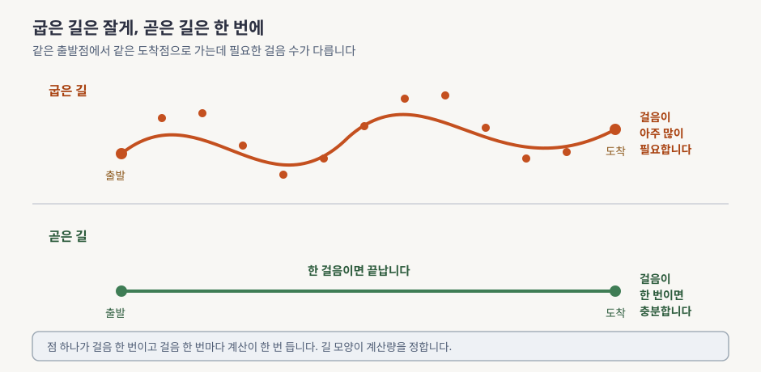
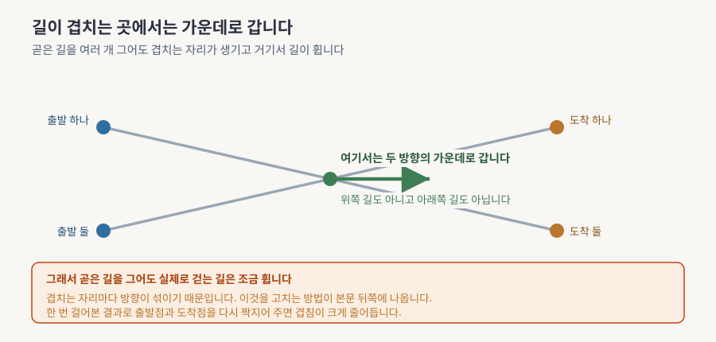
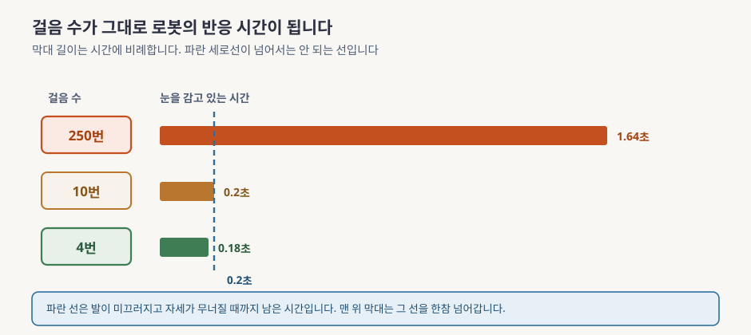

> 본문은 [lesson.md](lesson.md)입니다. 이 문서를 먼저 읽으세요.

# 굽은 길을 곧게 펴는 이야기, 쉽게 먼저

> **한 문장으로**: 무언가를 만들어내는 기계가 왜 같은 계산을 수백 번 반복해야 했는지, 또 가는 길을 곧게 다시 그으면 그 횟수가 왜 몇 번으로 줄어드는지를 그림으로 봅니다.

---

## 이 모듈이 답하는 질문 하나

앞 모듈에서 우리는 지저분한 얼룩 덩어리에서 시작해 조금씩 얼룩을 걷어내며 그림을 만드는 방식을 봤습니다. 잘 되는 방식이었지만 걷어내기를 250번쯤 반복해야 했습니다. 그림 한 장에 1초 가까이 걸린다는 말입니다.

사람이 화면 앞에서 1초를 기다리는 것은 아무 일도 아닙니다. 그런데 로봇은 그 1초 동안에도 서 있어야 하고, 서 있으려면 계속 다음 명령이 필요합니다. 새 명령을 만드는 데 1초가 걸리면 그 1초 동안 로봇은 눈을 감은 채 옛 명령만 반복하는 셈입니다.

앞 모듈에서는 걷어내는 방법을 더 똑똑한 쪽으로 바꿔봤습니다. 몇 배 나아졌지만 한 자릿수까지는 못 내려갔습니다.

> 방법을 바꿔서 안 되면 무엇을 바꿔야 하나요?

다 읽고 나면 이 물음에 그림 세 장으로 답할 수 있습니다. 그 답이 지금 로봇 분야의 표준이 된 이유도 함께 알게 됩니다.

---

## 어떤 문제가 있었나

그림을 만드는 일을 길 걷기로 바꿔 생각해봅시다. 출발점은 아무 의미 없는 얼룩이고 도착점은 우리가 원하는 결과입니다. 기계는 이 둘 사이를 걸어갑니다. 걸음 한 번마다 계산이 한 번 듭니다.

여기서 아무도 묻지 않은 질문이 하나 있습니다. **그 길이 어떻게 생겼는가**입니다.

앞 모듈이 쓰던 길은 굽어 있었습니다. 굽었다는 것을 알아채기 어려웠던 이유는 아무도 길을 직접 그리지 않았기 때문입니다. 얼룩을 넣는 규칙을 먼저 정하고 그 반대로 걷게 했더니 결과적으로 굽은 길이 나왔습니다.

굽은 길에서는 걸음을 크게 뗄 수가 없습니다. 지금 서 있는 자리에서 보이는 방향으로 성큼 걸어가면 길이 꺾이는 지점을 지나쳐 엉뚱한 곳에 도착하기 때문입니다. 그래서 잘게 여러 번 나눠 걸어야 합니다. 그것이 250번이었습니다.

**읽는 법.** 위아래 두 길을 비교하세요. 길 위의 점 하나가 걸음 한 번이고 걸음마다 계산이 한 번 듭니다. 위쪽 굽은 길에는 점이 촘촘하고 아래쪽 곧은 길에는 양 끝에만 있습니다. 두 길 모두 같은 자리에서 출발해 같은 자리에 도착합니다.

이 모듈의 발상은 여기서 나옵니다. **걷는 방법을 고치지 말고 길을 다시 긋자.** 길이 곧으면 지금 보이는 방향이 도착점까지 그대로 맞으니 한 걸음에 갈 수 있습니다. 그리고 길을 어떻게 그을지는 우리가 정합니다. 누가 정해준 것이 아닙니다. 정확히는 [lesson.md](lesson.md) §5 「가우시안 조건부 경로와 직선 특수화」에서 그 길을 실제로 긋습니다.

---

## 그래서 무엇을 하나

이 모듈에서 실제로 붙잡을 것이 셋 있습니다. **어떻게 배우는가**, **왜 생각만큼 안 줄어드는가**, **로봇에서 얼마나 이득인가**입니다.

### 배우는 방법이 이상하게 단순합니다

기계에게 가르칠 것은 "지금 이 자리에서 어느 쪽으로 가야 하는가"뿐입니다. 그런데 우리는 정답을 모릅니다. 도착점이 될 수 있는 후보가 수만 개인데 그중 어디로 가야 하는지 알 수가 없습니다.

정답을 모르니 **틀린 답을 가르칩니다.** 후보 중 하나를 아무거나 골라 "저기로 가라"고 알려줍니다. 다음번에는 다른 후보를 골라 "이번에는 저기로 가라"고 합니다. 매번 다른 곳을 가리키니 지시가 서로 모순됩니다.

이렇게 모순된 지시를 잔뜩 주고 나면 기계는 그 지시들의 **평균**을 배웁니다. 우리가 원했던 정답이 애초에 그 평균이었습니다. 개별 지시는 전부 틀렸는데 평균은 정확합니다. 이것의 증명은 [lesson.md](lesson.md) §4 「Conditional Flow Matching 정리」에 있습니다.

덕분에 앞 모듈에서 바뀌는 코드가 **세 줄**입니다. 신경망도 그대로이고 학습 도구도 그대로입니다.

### 그런데 한 걸음으로는 안 됩니다

곧은 길을 그었으니 한 걸음이면 되겠다 싶지만 실제로는 안 됩니다.

우리가 곧게 그은 것은 출발점 하나와 도착점 하나를 잇는 선입니다. 그런 선이 수만 개 있고 그 선들이 공중에서 서로를 가로지릅니다. 두 선이 겹치는 자리에 서 있으면 기계는 어느 쪽으로 가야 할지 모르니 앞에서 말한 대로 평균을 냅니다. 그래서 겹치는 자리마다 방향이 섞이고 결국 걷는 길이 조금 휩니다.

**읽는 법.** 왼쪽 두 점이 출발점이고 오른쪽 두 점이 도착점입니다. 회색 선 두 개는 각각을 곧게 이은 길입니다. 가운데에서 만납니다. 초록 화살표가 그 자리에서 기계가 실제로 배우는 방향인데 회색 선 어느 쪽과도 다릅니다.

고치는 방법이 있습니다. 일단 한 번 걸어본 뒤, 그 결과 어디에 도착했는지를 봅니다. 그러고는 **출발점과 실제 도착점을 다시 짝지어** 처음부터 다시 가르칩니다. 이렇게 하면 짝이 헝클어지지 않아 선들이 서로를 덜 가로지릅니다. 다만 공짜는 아니고 다시 가르치는 비용을 냅니다. 그 대가는 [lesson.md](lesson.md) §6 「왜 스텝이 줄어드는가」에서 셉니다.

### 로봇에서는 이것이 밀리초로 돌아옵니다

이 모듈의 성과는 예뻐진 그림이 아니라 줄어든 시간입니다. 로봇에서는 그 시간이 곧 안전입니다.

**읽는 법.** 막대 길이만 보세요. 막대는 로봇이 새로 본 것을 반영하지 못하고 지나가는 시간입니다. 파란 세로 점선은 발이 미끄러진 뒤 자세가 무너질 때까지 남은 시간입니다. 맨 위 막대만 그 선을 한참 넘어갑니다.

걸음 수를 250번에서 4번으로 줄이면 눈 감는 시간이 1.64초에서 0.18초가 됩니다. 넘으면 안 되는 선 안쪽으로 들어옵니다. 신경망을 더 크게 만들거나 더 좋은 장비를 사서 얻은 결과가 아닙니다. **가르치는 방식 한 줄을 바꿔서** 얻었습니다. 이 숫자들을 손으로 계산하는 부분이 [lesson.md](lesson.md) §8 「NFE 예산 재계산」입니다.

---

## 오늘 만날 개념 5개

본문에서 계속 마주칠 말들입니다. 지금 외울 필요는 없고 한 번 만나두면 읽다가 처음 보는 말이 아닙니다.

**1. 길과 방향**

출발점인 얼룩에서 도착점인 결과까지 이어지는 길을 우리가 직접 설계합니다. 그 길 위 어디에 서 있든 "여기서는 이쪽으로"라고 알려주는 화살표 다발이 함께 붙어 다닙니다. 기계가 배우는 것은 길이 아닙니다. 이 화살표입니다.

→ 이 얘기는 [lesson.md](lesson.md) §3 「무엇을 학습하려는 것인가」에서 제대로 합니다.

**2. 틀린 정답의 평균**

정답을 모르니 후보 하나를 골라 틀린 정답을 줍니다. 여러 번 반복하면 기계는 그 틀린 정답들의 평균을 배우는데 그것이 우리가 원하던 값입니다. 이 모듈에서 가장 반직관적인 대목입니다.

→ 제대로 배우는 곳은 [lesson.md](lesson.md) §4 「Conditional Flow Matching 정리」입니다.

**3. 곧은 길**

출발점과 도착점을 자로 대고 그은 것처럼 곧게 잇는 설계입니다. 이렇게 두면 배우는 규칙이 한 줄로 줄어들고 미리 만들어 두던 계산표도 통째로 사라집니다.

→ 배우는 곳은 [lesson.md](lesson.md) §5 「가우시안 조건부 경로와 직선 특수화」입니다.

**4. 다시 짝짓기**

한 번 배운 결과로 실제로 걸어보고 나서, 출발점과 실제 도착점을 새로 짝지어 다시 배우는 절차입니다. 길이 훨씬 곧아지지만 다시 가르치는 비용과 원래 모델의 실수를 물려받는 위험을 함께 냅니다.

→ [lesson.md](lesson.md) §6 「왜 스텝이 줄어드는가」에서 제대로 다룹니다.

**5. 명령 묶음**

위층이 느려도 아래층이 끊기지 않게, 앞으로 몇 초치 명령을 통째로 묶어 내려보내는 방식입니다. 묶음이 길수록 안 끊기지만 그만큼 새로 본 것을 늦게 반영합니다.

→ 배우는 곳은 [lesson.md](lesson.md) §8 「NFE 예산 재계산」입니다.

---

## 이제 lesson.md로

여기까지가 그림으로 잡는 감입니다. 본문은 같은 이야기를 세 방향에서 더 정확하게 다룹니다.

우선 **숫자를 줍니다.** 길이 얼마나 굽었는지를 재는 값이 실제로 얼마인지, 다시 짝짓기를 한 번 하면 그것이 몇 분의 일이 되는지, 걸음 4번이 왜 0.18초인지를 손으로 계산합니다. 이 문서에서 그냥 "줄어듭니다"라고만 한 자리마다 숫자가 붙습니다.

그다음 **앞 모듈과 나란히 놓습니다.** 이 방식이 앞 모듈과 다른 종류가 아니라 같은 틀의 다른 설정이라는 것을 확인합니다. 바뀌는 코드가 정말 세 줄인지도 세어봅니다.

마지막은 **회사 스택과 잇는 일입니다.** 이 방식이 우리 시스템 어느 자리에 앉을 수 있는지 세 가지 후보를 그린 다음, 각 자리에서 걸음을 몇 번까지 할 수 있는지 계산합니다. 아직 확인되지 않은 것 일곱 가지는 팀에 물어볼 질문으로 남깁니다.

읽는 순서는 §0 「이 모듈 지도」부터입니다. 막히면 §5 「가우시안 조건부 경로와 직선 특수화」로 먼저 건너뛰어도 됩니다. 이 모듈의 학습 규칙 한 줄이 거기에 있습니다.
