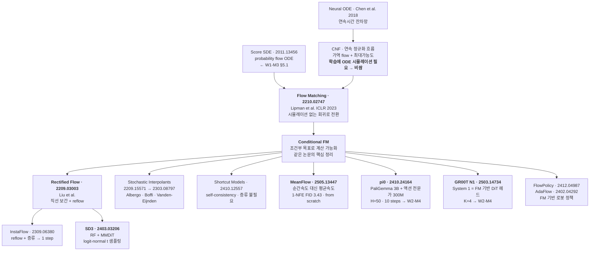
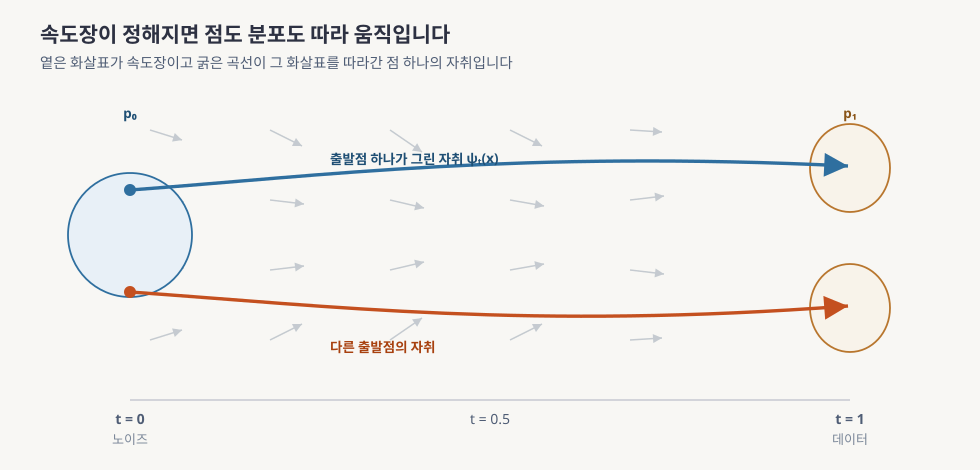
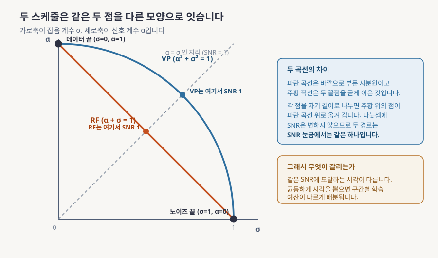
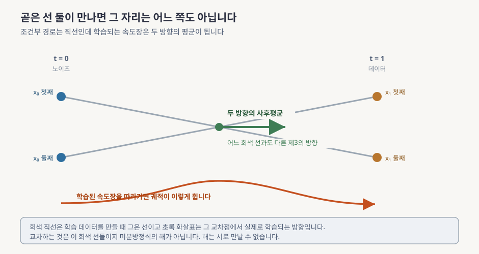
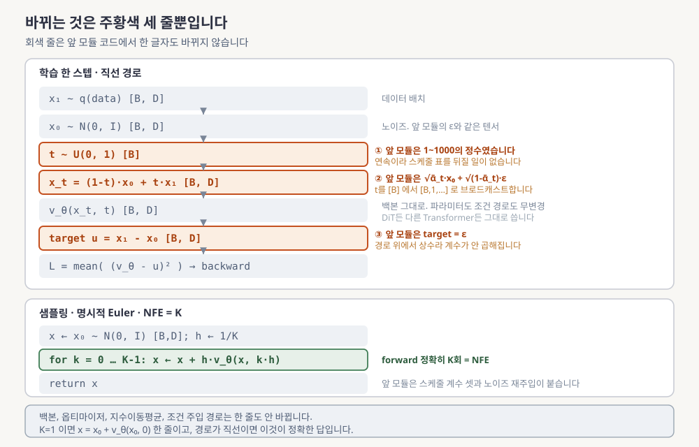
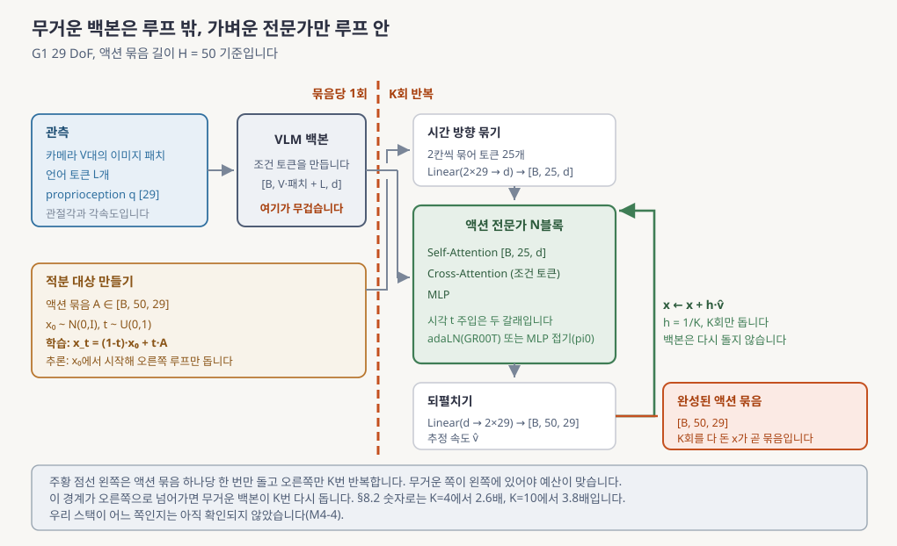
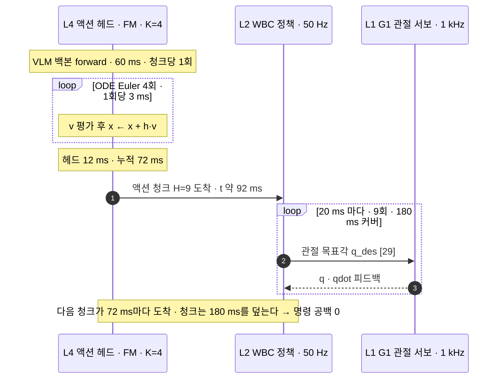
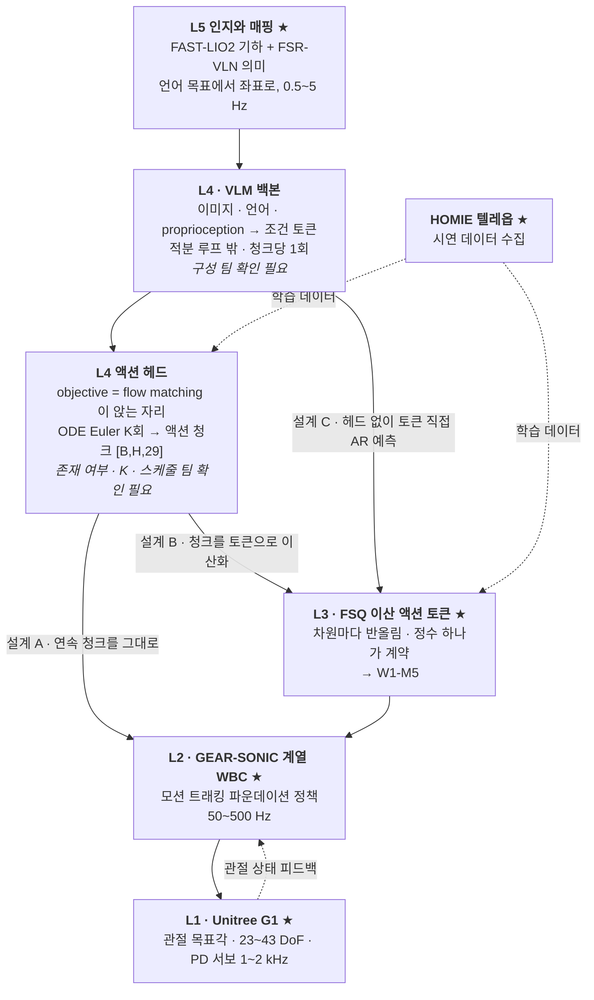
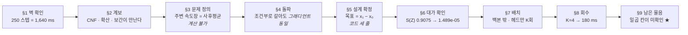

# Flow Matching & Rectified Flow

> **한 줄 요약**: 노이즈에서 데이터로 가는 길을 굽은 곡선이 아니라 직선으로 미리 설계합니다. 그러면 그 길을 따라가는 데 필요한 신경망 호출이 수백 번에서 몇 번으로 줄어듭니다. 앞 모듈이 막아둔 자리를 길 자체를 다시 그어 뚫고, 줄어든 호출 횟수가 로봇의 반응 지연에서 어떤 숫자가 되는지 계산합니다.

---

## 0. 이 모듈 지도

이 모듈은 아홉 개의 절로 되어 있고 앞의 여섯이 방법을 세우면 뒤의 셋이 그것을 로봇의 숫자로 바꿉니다. 무게가 실린 자리는 §4와 §5 둘이고 §4가 내주는 허가로 §5가 학습 규칙을 세 줄까지 줄입니다. 나머지 절은 그 세 줄이 어디까지 데려가는지를 재는 과정입니다. 아래 목차의 「읽는 시간」은 산문만이 아니라 그림과 표와 수식과 퀴즈 풀이를 모두 포함한 초독 기준입니다.

**오늘의 질문** 셋입니다.

- 계산할 수 없는 목표를 대신 맞히게 시켰는데 왜 같은 답에 도달하는가?
- 앞 모듈의 방법과 이 모듈의 방법은 다른 종류인가, 같은 것의 다른 설정인가?
- 신경망 호출이 수백 번에서 몇 번으로 줄면 로봇의 반응 지연은 어떤 숫자가 되는가?

| 절 | 무엇을 | 끝나면 할 수 있는 것 | 읽는 시간 |
|---|---|---|---|
| §1, §2 | 왜 배우나와 계보 | 앞 모듈이 막힌 자리와 이 모듈이 뚫는 방향 짚기 | 14분 |
| §3 | 무엇을 학습하려는 것인가 | 생성 문제를 속도 회귀로 다시 쓰고 막히는 지점 지목하기 | 20분 |
| §4 | 대리 목표로 바꿔도 되는 이유 | 정리의 진술과 열쇠를 한 문장으로 말하기 | 12분 |
| §5 | 직선 경로와 같은 가족 | 손실이 한 줄로 붕괴하는 것을 앞 모듈과 대조하기 | 28분 |
| §6 | 왜 호출 횟수가 줄어드는가 | 직선인데도 1회로 안 되는 이유와 그 해법의 대가 말하기 | 21분 |
| §7 | 아키텍처 | 바뀌는 세 줄을 짚고 액션 묶음을 만드는 경로를 그리기 | 13분 |
| §8 | 지연 예산 재계산 | 호출 횟수를 제어 주기에 대입해 자리별 상한 구하기 | 18분 |
| §9와 마무리 | 회사 스택, 오해, 한 장 정리, 퀴즈 10문항 | 앉을 자리를 지목하고 백지 재구성으로 자기 점검 | 54분 |

**읽는 법.** 왼쪽에서 오른쪽으로 한 줄로 읽으면 됩니다. 중간에 길을 잃으면 §5로 돌아오세요. 이 모듈의 학습 규칙 한 줄이 거기에 있습니다.

**선수 지식**

| 알아야 할 것 | 어디서 채우나 | 이 문서가 대신 설명하는 것 |
|---|---|---|
| 확률분포, 가우시안, 신경망 학습, 손실 | 보유 배경(ML/DL 기본)으로 가정 | 생성모델 전용 어휘는 첫 등장 자리에서 풀어 씁니다 |
| 미분방정식, 수치적분, 흐름과 속도장 | **이 문서 §3이 처음부터 설명합니다** | 필요한 만큼만, 제어 배경 없이 |
| 앞 모듈의 학습 규칙과 스케줄 표, 블록 구조 | [W1-M3](../03-diffusion-ddpm-dit/lesson.md) §3, §4, §6 | §5.3과 §5.4에서 대조 대상으로 회수합니다 |
| 액션 묶음 길이와 지연 예산 부등식 | [W1-M1 §4](../01-physical-ai-landscape/lesson.md) | §8에서 숫자만 갈아끼워 씁니다 |
| G1 관절 개수와 `nu`=29 | [W1-M2 §5](../02-simulator-bootcamp/lesson.md) | §7.2 그림이 이 숫자를 씁니다 |

**완료 기준**: 백지에 학습 루프 세 줄(`t~U(0,1)`, `x_t=(1-t)x₀+tx₁`, `평균제곱오차(v_θ, x₁−x₀)`)을 쓰고 그 옆에 "앞 모듈에서 바뀐 곳"과 "상위 계층의 호출 횟수 상한"을 숫자로 적습니다.

**소요**: 이론 3h, 실습 1~2h

| 용어 | 이 절에서 나온 뜻 |
|---|---|
| **액션 묶음** | 상위 모델이 한 번에 내놓는 연속된 명령 여러 개입니다. 정확한 이름과 정의는 §8에 있습니다 |
| **지연 예산** | 새로 본 것이 명령에 반영되기까지 허용되는 시간의 총량입니다 |

> 📌 **여기까지 정리**
> - 목적지는 정리 하나, 대조표 하나, 지연 산수 하나입니다
> - 세 질문에 §4와 §5와 §8이 각각 답합니다
> - 마지막에 남는 물음은 "우리 모델이 어느 설정인가"입니다

---

## 1. 왜 이걸 배우나

앞 모듈은 노이즈를 조금씩 걷어내며 데이터를 만드는 모델을 다뤘고, 그 걷어내기를 250번 반복해야 그림 한 장이 나온다는 사실을 숫자로 확인한 채 끝났습니다. 걷어내는 절차를 더 똑똑한 것으로 갈아 끼워봤지만 한 자릿수까지는 내려가지 않았습니다. 이 절은 그 벽이 정확히 어디에 있는지 다시 재고, 왜 절차가 아니라 **다른 것**을 바꿔야 하는지를 말합니다.

먼저 셈의 단위를 정합니다. 샘플 하나를 얻는 데 신경망을 앞으로 통과시키는 횟수를 **NFE(Number of Function Evaluations, 함수 평가 횟수)**라고 부릅니다. 이름은 거창하지만 뜻은 단순합니다. 신경망을 몇 번 부르느냐입니다. 이 숫자가 중요한 이유는 신경망 호출 한 번이 곧 시간이기 때문이고, 로봇에서는 그 시간이 그대로 반응이 늦어지는 시간이 됩니다. 학습된 모델로 노이즈에서 데이터를 만들어내는 절차 전체를 **샘플러(sampler)**라고 부르며, NFE는 샘플러가 무엇이냐에 따라 달라집니다.

W1-M3는 문제를 열어놓고 끝났습니다. 250 스텝 샘플링을 50 Hz 제어 루프에 물리면 명령 묶음 하나가 82 스텝 분량이 되고, 곧 **1.64초짜리 눈 감은 구간**이 생깁니다. 새 관측을 반영하지 않고 미리 정한 명령을 그대로 실행하는 이런 구간을 **개방루프(open loop)**라고 부릅니다. 이 구간이 길수록 로봇은 예상 못한 일에 대응하지 못합니다. 자세가 무너지는 데 200 ms가 안 걸리는 휴머노이드에서 1.64초는 8배 늦습니다.

**숫자를 넣어봅니다.** 그 1.64초가 어디서 나오는지 직접 셈해봅니다. 되돌리기 1회에 3 ms가 들고 조건을 만드는 앞단 계산에 60 ms, 명령을 내려보내는 통신에 20 ms가 들며, 하위 제어기가 초당 50개의 명령을 소비한다고 둡니다.

1. 되돌리기가 250번이니 그 부분만 $250 \times 3 = 750$ ms입니다
2. 앞단 60 ms를 더하면 한 번의 추론에 $60 + 750 = 810$ ms가 듭니다
3. 상위가 추론을 마치자마자 다음 계획을 시작한다고 두면 계획을 다시 세우는 주기도 810 ms입니다
4. 그래서 다음 묶음이 손에 들어오기까지 버텨야 하는 시간은 $0.810 + 0.810 + 0.020 = 1.640$초입니다
5. 하위가 초당 50개를 쓰므로 그 사이에 $50 \times 1.640 = 82$개의 명령이 필요합니다

82개를 다 쓰는 동안 새 관측은 한 번도 반영되지 않습니다. 그것이 1.64초짜리 개방루프입니다.

샘플러를 갈아 끼우는 것으로는 어디까지 되는지도 이미 재봤습니다. 앞 모듈에는 샘플러가 둘 있었습니다. 매 스텝 노이즈를 조금씩 다시 주입하는 원래 방식을 **ancestral**이라고 부르고, 그 재주입을 없애 격자를 띄엄띄엄 건너뛸 수 있게 만든 방식을 **DDIM**이라고 부릅니다([W1-M3 §5.1](../03-diffusion-ddpm-dit/lesson.md)). [`02_samplers_compare.py`](../03-diffusion-ddpm-dit/practice/02_samplers_compare.py) 실측으로 DDIM이 ancestral을 이기는 구간은 NFE 4~20이고 최대 격차가 1.76배인데 **NFE 1과 2에서는 둘 다 실패합니다.** 이유는 단순합니다. 지나가야 할 궤적이 휘어 있으면 아무리 좋은 적분 방식이라도 한 번에 큰 걸음을 내디딜 때 큰 오차가 납니다.

그래서 이 모듈은 대상을 바꿉니다. **적분 방식을 고치지 말고 궤적을 펴자.** 이것이 가능한 이유는 궤적이 자연법칙이 아니라 **우리가 설계하는 대상**이기 때문입니다. 노이즈에서 데이터로 가는 길을 어떻게 그을지는 아무도 정해주지 않았습니다. 굽은 길로 그어놓고 그 길을 잘 따라가는 방법을 찾는 대신, 처음부터 곧은 길을 긋습니다.

이 모듈이 그 뒤로 하는 일은 이렇습니다.

- **§4**는 계산할 수 없는 목표를 계산 가능한 대리 목표로 바꿔도 되는 이유를 증명합니다
- **§5**는 이 방법이 앞 모듈의 확산 모델과 같은 가족이라는 것을 보입니다
- **§8**은 줄어든 호출 횟수를 로봇의 시간 예산에 대입해 다시 계산합니다

이미지와 언어를 받아 로봇 액션을 직접 내놓는 상위 모델을 **VLA(Vision-Language-Action, 시각 언어 행동 모델)**라고 부릅니다. 이 모듈에서 배우는 학습 규칙이 실제로 앉는 자리가 거기이고, VLA 자체의 계보는 W2에서 따로 다룹니다.

| 용어 | 이 절에서 나온 뜻 |
|---|---|
| **NFE** | 샘플 하나를 얻는 데 신경망을 앞으로 통과시키는 횟수입니다 |
| **샘플러** | 학습된 모델로 노이즈에서 데이터를 만들어내는 추론 절차입니다 |
| **개방루프** | 새 관측을 반영하지 않고 미리 정한 명령을 그대로 실행하는 구간입니다 |
| **VLA** | 이미지와 언어를 받아 로봇 액션을 직접 내놓는 상위 모델입니다 |
| **ancestral** | 매 스텝 노이즈를 조금씩 다시 주입하는 앞 모듈의 원래 샘플러입니다 |
| **DDIM** | 노이즈 재주입을 없애 격자를 건너뛸 수 있게 만든 샘플러입니다 |

> 📌 **여기까지 정리**
> - 앞 모듈은 적분 방식을 갈았고 이 모듈은 궤적 자체를 폅니다
> - 펼 수 있는 이유는 궤적이 우리 설계 대상이기 때문입니다
> - 성과는 그림 품질이 아니라 지연 예산에서 회수합니다

---

## 2. 계보

§1이 "궤적을 펴자"는 방향을 세웠습니다. 그런데 이 발상은 이번에 새로 나온 것이 아니고, 서로 다른 세 무리가 각자의 이유로 같은 자리에 도착한 결과입니다. 그 세 갈래가 어디서 시작해 어디서 만나는지를 한 장으로 봅니다. 계보를 먼저 보는 이유는 이 모듈이 다루는 것이 여러 방법 중 하나가 아니라 **현재 표준**이라는 근거가 거기에 있기 때문입니다.

먼저 용어 넷을 풀어둡니다. 시간에 따라 값이 변하는 규칙을 "지금 값이 이러면 다음 순간 이만큼 변한다"는 형태로 적은 식을 미분방정식이라고 합니다. 그중 무작위 항이 섞이지 않은 것을 **ODE(Ordinary Differential Equation, 상미분방정식)**, 매 순간 새 무작위 항이 더해지는 것을 **SDE(Stochastic Differential Equation, 확률미분방정식)**라고 부릅니다. 앞 모듈의 두 샘플러가 정확히 이 둘로 갈렸습니다([W1-M3 §5.1](../03-diffusion-ddpm-dit/lesson.md)).

나머지 둘은 이 모듈의 주인공입니다. 데이터를 만들어내는 일을 "ODE를 한 번 푸는 일"로 정의한 모델 계열을 **CNF(Continuous Normalizing Flow, 연속 정규화 흐름)**라고 부릅니다. 그 ODE의 우변, 곧 매 지점에서 어느 방향으로 얼마나 움직일지를 신경망으로 그냥 회귀해서 맞히는 학습법이 **FM(Flow Matching, 흐름 정합)**입니다. 회귀라는 말 그대로 정답 벡터를 주고 제곱오차를 줄이는 평범한 학습입니다.

아래 그림에는 뒤에서 다시 쓰는 이름 둘이 미리 적혀 있어 여기서 뜻만 정해둡니다. **DiT(Diffusion Transformer, 확산 트랜스포머)**는 앞 모듈이 백본으로 쓴 블록이고 구조는 §7.1에서 열어봅니다. **FID(Fréchet Inception Distance)**는 생성 분포와 실제 분포의 거리를 재는 이미지 품질 지표이며 낮을수록 좋습니다.

**읽는 법.** 위쪽 두 갈래가 각각 어디서 내려오는지를 먼저 보세요. 왼쪽 위는 연속 흐름 모델 쪽이고 오른쪽 위는 앞 모듈의 확산 쪽입니다. 둘이 가운데 굵은 상자에서 만납니다. 가운데 상자 아래로 굵게 표시된 여섯 갈래가 이 모듈 뒤쪽에서 다시 나오는 이름입니다. 상자 안의 영문은 대부분 논문 제목이나 모델 이름이고, 그중 뒤에서 다시 쓰는 것은 그 자리에서 풀어 씁니다. 노드별 연대기는 [deep-dive.md](deep-dive.md) §1에 있습니다.

그림에서 가져갈 것을 적습니다.

- **CNF는 개념이 먼저였지만 학습이 비쌌습니다.** 매 그래디언트 스텝마다 ODE를 끝까지 풀어야 했는데, Flow Matching이 그것을 한 번의 회귀로 바꾸자 학습 비용이 확산 모델과 같아졌습니다. 그래서 백본과 데이터 파이프라인과 학습 인프라가 그대로 재사용됩니다
- **세 갈래가 같은 곳에 도착했습니다.** Flow Matching과 Rectified Flow와 Stochastic Interpolants입니다. 직선 보간이라는 특수한 설정에서 사실상 같은 학습 규칙을 씁니다(§5.2). 이미지 쪽 SD3와 로봇 쪽 pi0와 GR00T가 동시에 여기로 수렴한 것이 이 모듈을 표준으로 다루는 근거입니다

가지 중 둘은 이름만 미리 알아둡니다. **CFM(Conditional Flow Matching, 조건부 흐름 정합)**은 계산할 수 없는 목표를 계산 가능한 것으로 갈아 끼운 실전 형태이고 §4가 그 정리입니다. **RF(Rectified Flow, 정류 흐름)**는 노이즈와 데이터를 곧은 선으로 잇는 특수화이며 §5.2와 §6.3이 그 본체입니다.

| 용어 | 이 절에서 나온 뜻 |
|---|---|
| **ODE** | 무작위 항이 없는 미분방정식입니다. 샘플링이 이것을 푸는 일이 됩니다 |
| **SDE** | 매 순간 새 무작위 항이 더해지는 미분방정식입니다 |
| **CNF** | 데이터 생성을 ODE 한 번 푸는 일로 정의한 모델 계열입니다 |
| **FM** | ODE의 우변을 신경망으로 회귀해서 맞히는 학습법입니다 |
| **CFM** | 계산 가능한 조건부 목표로 갈아끼운 FM의 실전 형태입니다 |
| **RF** | 노이즈와 데이터를 곧은 선으로 잇는 특수화와 그 재학습 절차입니다 |
| **DiT** | 앞 모듈이 백본으로 쓴 블록입니다. 구조는 §7.1에서 봅니다 |
| **FID** | 생성 분포와 실제 분포의 거리를 재는 이미지 품질 지표입니다. 낮을수록 좋습니다 |

> 📌 **여기까지 정리**
> - 연속 흐름 모델은 원래 있었고 막혀 있던 것은 학습 비용이었습니다
> - Flow Matching이 그것을 회귀로 바꿔 확산 모델과 같은 인프라에 올렸습니다
> - 세 갈래가 직선 보간에서 같은 학습 규칙으로 만납니다

---

## 3. 무엇을 학습하려는 것인가

§2가 "ODE의 우변을 회귀로 맞힌다"는 문장으로 이 방법을 요약했습니다. 그런데 그 우변이 정확히 무엇이고 정답을 어디서 가져오는지는 아직 말하지 않았습니다. 이 절이 그 둘을 정의하고 정의하자마자 곧바로 벽에 부딪히는 지점까지 갑니다. 그 벽을 넘는 것이 §4의 정리입니다.

### 3.1 흐름과 속도장

목표부터 적습니다. 우리가 가진 것은 아무 정보도 없는 노이즈이고 만들고 싶은 것은 데이터입니다. 노이즈 쪽 분포를 $p_0=\mathcal{N}(0,I)$, 곧 평균이 0이고 각 차원이 서로 독립인 표준 가우시안으로 두고, 데이터 쪽 분포를 $p_1=q$로 둡니다. 아래첨자 0과 1은 시각이고 시간은 0에서 1까지 흐릅니다. **노이즈가 $t=0$이고 데이터가 $t=1$입니다.** 앞 모듈은 반대 방향으로 시간을 셌으니 이 규약 하나가 첫 번째 혼동 지점입니다.

이제 점 하나를 노이즈 쪽에서 뽑아 데이터 쪽으로 옮기는 일을 생각합니다. 옮기는 방법을 "매 순간 어느 방향으로 얼마나 밀지"를 공간 전체에 지정하는 것으로 정합니다. 공간의 각 점 $x$와 각 시각 $t$마다 화살표 하나를 그려둔 것이고, 이것을 **속도장(velocity field)** $u_t$라고 부릅니다.

속도장이 정해지면 점 하나의 운명은 자동으로 정해집니다. 지금 있는 자리의 화살표를 읽고 그 방향으로 조금 가고, 새 자리에서 다시 읽고 또 가면 됩니다. 시각 0의 점을 시각 $t$의 점으로 옮기는 이 대응을 **흐름(flow)** $\psi_t$라고 부릅니다. 식으로 적으면 이렇습니다.

$$
\frac{d}{dt}\psi_t(x) = u_t\bigl(\psi_t(x)\bigr), \qquad \psi_0(x)=x
$$

왼쪽은 "옮겨간 점이 시간에 따라 변하는 속도"이고 오른쪽은 "그 점이 지금 있는 자리에 적힌 화살표"입니다. 둘이 같다는 것이 이 식의 전부이고 $\psi_0(x)=x$는 시작할 때는 아직 아무 데도 안 갔다는 뜻입니다.

**읽는 법.** 왼쪽에서 오른쪽으로 시간이 흐릅니다. 배경의 옅은 화살표들이 그 시각의 속도장입니다. 굵은 곡선 두 개가 서로 다른 출발점에서 시작한 점이 화살표를 따라간 자취입니다. 양 끝의 구름 모양은 그 시각에 점들이 흩어져 있는 모양, 곧 분포입니다. 왼쪽 끝의 둥근 구름이 노이즈이고 오른쪽 끝의 두 덩어리가 데이터입니다.

점 하나가 아니라 분포 전체가 어떻게 흘러가는지를 보면 시각마다 하나씩 분포가 생깁니다. $t=0$에서 $p_0$였다가 $t=1$에서 $p_1$이 되는 분포의 줄, 곧 $\{p_t\}_{0\le t\le1}$을 **확률 경로(probability path)**라고 부릅니다. 점의 궤적이 아니라 **분포의 궤적**이라는 것이 요점입니다.

속도장과 확률 경로 사이에는 보존 법칙 하나가 성립합니다. 어느 좁은 영역 안에 있는 확률의 양은 저절로 생기거나 사라지지 않고 오직 흘러들어오거나 흘러나가서만 변한다는 것이고, 이것을 **연속방정식(continuity equation)**이라고 부릅니다.

$$
\frac{\partial p_t}{\partial t} + \nabla\cdot\bigl(p_t\,u_t\bigr) = 0
$$

첫 항은 그 자리의 확률 밀도가 시간에 따라 변하는 정도이고, 둘째 항의 $\nabla\cdot$는 발산이라고 읽으며 그 자리에서 밖으로 빠져나가는 양을 뜻합니다. 둘을 더해 0이라는 것이 "생기지도 사라지지도 않는다"는 말입니다.

**숫자를 넣어봅니다.** 화살표를 따라가는 일이 실제로 어떤 계산인지 1차원에서 확인합니다. 속도장이 어디서나 $u_t(x)=1.5$인 아주 단순한 경우를 잡고, 출발점을 $x=0.5$로 둡니다. 시간을 4등분해 걸음 크기를 $h=0.25$로 두면 걸음마다 $x \leftarrow x + h\,u$입니다.

1. 첫 걸음: $0.5 + 0.25\times1.5 = 0.875$
2. 둘째 걸음: $0.875 + 0.375 = 1.25$
3. 셋째 걸음: $1.25 + 0.375 = 1.625$
4. 넷째 걸음: $1.625 + 0.375 = 2.0$

도착점이 2.0입니다. 화살표가 어디서나 같았으므로 걸음을 4번 나눠 걷든 한 번에 $0.5 + 1\times1.5 = 2.0$으로 걷든 결과가 같습니다. **화살표가 자리에 따라 달라질 때만 걸음을 잘게 쪼갤 이유가 생깁니다.** 이 관찰 하나가 §6 전체의 씨앗입니다.

여기까지가 이 절의 첫 결론입니다. 쓸 것은 **"속도장이 있으면 확률 경로가 정해진다"**는 사실 하나이고, 그러면 우리가 할 일은 좋은 속도장 $u_t$를 신경망 $v_\theta$로 맞히는 것뿐입니다. 목표와 예측의 차이를 제곱해서 평균하는 평범한 회귀로 적으면 이렇습니다.

$$
\mathcal{L}_{\text{FM}}(\theta) = \mathbb{E}_{t\sim\mathcal{U}[0,1],\;x\sim p_t}\bigl\|v_\theta(x,t)-u_t(x)\bigr\|^2
$$

$\theta$는 신경망의 파라미터이고, $\mathbb{E}$ 아래의 $t\sim\mathcal{U}[0,1]$은 시각을 0과 1 사이에서 균등하게 뽑는다는 뜻이며 $x\sim p_t$는 그 시각의 분포에서 점을 뽑는다는 뜻입니다.

💡 제어나 물리를 아신다면 (몰라도 됩니다)

**상태방정식**은 시스템의 현재 상태를 벡터 하나로 적고 그 변화율을 현재 상태의 함수로 쓴 표기법입니다. 입력이 없고 계수가 시간에 따라 변하는 경우 $\dot x = f(x,t)$ 꼴이며, 초기 상태를 시각 $t$의 상태로 옮기는 사상을 천이사상이라고 부르고 선형계에서는 $\Phi(t,0)$으로 씁니다.

위 흐름 정의가 정확히 이 꼴입니다. $u_t$가 $f$이고 $\psi_t$가 천이사상입니다. 연속방정식은 확산 항이 없는 Fokker-Planck 방정식, 곧 Liouville 방정식과 같습니다. 확률 경로는 상태 하나의 궤적이 아니라 상태 분포의 궤적이므로, 공분산 전파를 2차 통계량이 아니라 분포 전체로 넓힌 대상이라고 읽으면 맞습니다.

### 3.2 그런데 목표를 모른다

문제가 있습니다. 데이터 분포 $q$가 무엇인지 우리는 모릅니다. 아는 것은 그 분포에서 뽑힌 표본 몇 만 개뿐입니다. 분포를 모르는데 그 분포를 향해 가는 화살표를 알 리가 없습니다. **위 손실은 정의는 되지만 계산은 안 됩니다.** 정답 $u_t(x)$를 적어 넣을 수가 없기 때문입니다.

우회로는 문제를 잘게 쪼개는 것입니다. 분포 전체를 향하는 길은 모르지만 **데이터 한 점 $x_1$을 향하는 길**은 우리가 마음대로 그을 수 있습니다. 노이즈에서 그 점 하나까지 어떻게 갈지는 설계의 자유이고, 이렇게 목표점 하나를 고정하고 설계한 경로를 **조건부 경로(conditional path)**라고 부릅니다. 그러면 그 경로를 미는 조건부 속도장 $u_t(x\mid x_1)$은 우리가 손으로 적을 수 있습니다(§5가 그 식입니다).

남는 것은 조건부와 원래 목표를 잇는 다리입니다. 데이터 점 하나하나가 만드는 경로를 데이터 분포로 평균하면 원래의 확률 경로가 나오고, 속도장 쪽에서도 대응하는 관계가 성립합니다.

$$
p_t(x)=\int p_t(x\mid x_1)\,q(x_1)\,dx_1,
\qquad
\boxed{\;u_t(x)=\int u_t(x\mid x_1)\,\frac{p_t(x\mid x_1)q(x_1)}{p_t(x)}\,dx_1 = \mathbb{E}_{x_1\sim p(x_1\mid x)}\bigl[u_t(x\mid x_1)\bigr]\;}
$$

박스 안의 오른쪽 끝이 이 모듈의 축입니다. 관측이 주어졌을 때 어떤 대상의 조건부 기댓값을 **사후평균(posterior mean)**이라고 부르는데, 위 식은 **주변 속도장이 조건부 속도장의 사후평균**이라고 말합니다. 지금 점 $x$에 서 있을 때 "이 점을 만들어냈을 법한 데이터 점들"에 각각 확률을 매기고, 그 확률로 조건부 화살표들을 가중평균한 것이 진짜 화살표라는 뜻입니다.

$\frac{p_t(x\mid x_1)q(x_1)}{p_t(x)}$가 그 가중치이고 형태 그대로 베이즈 정리입니다. 분자는 "그 데이터 점이 뽑힐 확률 곱하기 거기서 지금 자리로 왔을 확률"이고 분모는 전체를 1로 맞추는 정규화입니다.

**숫자를 넣어봅니다.** 사후평균이 실제로 무엇을 하는지 아주 작은 예로 봅니다. 데이터가 세 점뿐인 가상의 데이터셋을 상상하고, 지금 서 있는 점 $x$에서 세 점 각각을 향하는 조건부 화살표가 1차원 값으로 $+3.0$, $-1.0$, $+0.5$라고 둡니다. 베이즈 가중치를 계산해보니 $0.6$, $0.3$, $0.1$이 나왔다고 하겠습니다.

1. 첫 항은 $0.6 \times 3.0 = 1.8$입니다
2. 둘째 항은 $0.3 \times (-1.0) = -0.3$입니다
3. 셋째 항은 $0.1 \times 0.5 = 0.05$입니다
4. 다 더하면 $1.8 - 0.3 + 0.05 = 1.55$입니다

**주목할 것은 1.55가 $+3.0$도 $-1.0$도 $+0.5$도 아니라는 점입니다.** 진짜 화살표는 어느 개별 화살표와도 다른 제3의 방향입니다. 이 계산을 실제 데이터셋에서 하려면 점 $x$ 하나마다 데이터 전체를 훑어 가중치를 다시 매겨야 합니다. 데이터가 수만 개이고 점이 무한히 많으니 **정의는 되지만 계산은 안 됩니다.**

이 한 식은 두 가지를 동시에 말합니다.

- 연속방정식에 대입하면 이 $u_t$가 실제로 $p_t$를 만들어낸다는 보장이 확인됩니다. 다리가 성립한다는 뜻입니다
- 그럼에도 점마다 데이터셋 전체의 적분이 필요해 손실에 직접 쓸 수는 없습니다

다음 절이 이 벽을 넘습니다. 결론만 미리 말하면, **계산할 수 없는 목표를 계산 가능한 조건부 목표로 갈아 끼워도 학습이 같은 곳에 도달합니다.**

| 용어 | 이 절에서 나온 뜻 |
|---|---|
| **속도장** | 공간의 각 점과 각 시각마다 지정해둔 이동 방향과 세기입니다 |
| **흐름** | 시각 0의 점을 시각 $t$의 점으로 옮기는 대응입니다 |
| **확률 경로** | 노이즈 분포에서 데이터 분포까지 이어지는 분포의 줄입니다 |
| **연속방정식** | 속도장이 정해지면 확률 경로도 정해진다는 보존식입니다 |
| **조건부 경로** | 데이터 한 점을 고정하고 거기까지 가는 길만 직접 설계한 경로입니다 |
| **사후평균** | 관측이 주어졌을 때 대상의 조건부 기댓값입니다 |

> 📌 **여기까지 정리**
> - 생성 문제가 "속도장을 설계하고 회귀한다"로 다시 쓰입니다
> - 그 속도장은 조건부 속도장의 사후평균으로 정의됩니다
> - 정의는 되지만 데이터셋 전체 적분이라 계산은 안 됩니다

---

## 4. Conditional Flow Matching 정리

§3이 정답 화살표를 정의해놓고 계산할 수 없다는 데서 멈췄습니다. 그 자리를 넘는 정리가 하나 있습니다. 결론은 "계산 가능한 쪽을 그냥 회귀해도 된다"인데, 언뜻 들으면 틀린 것을 맞히게 시키는 것처럼 들립니다. 왜 그래도 되는지가 이 절의 전부입니다. 이 모듈에서 가장 반직관적인 대목입니다.

### 4.1 진술

계산 가능한 쪽이란 조건부 목표입니다. 목표점 $x_1$을 데이터에서 하나 뽑고, 그 점을 향하는 조건부 경로 위에서 점 $x$를 하나 뽑고, 그 자리의 조건부 화살표 $u_t(x\mid x_1)$을 정답으로 줍니다. 셋 다 배치 하나 안에서 즉시 만들어집니다.

$$
\mathcal{L}_{\text{CFM}}(\theta)=\mathbb{E}_{t\sim\mathcal{U}[0,1],\;x_1\sim q,\;x\sim p_t(\cdot\mid x_1)}\bigl\|v_\theta(x,t)-u_t(x\mid x_1)\bigr\|^2
$$

$\mathcal{L}_{\text{FM}}$과 비교하면 다른 것은 정답 자리 하나뿐입니다. 계산할 수 없는 $u_t(x)$ 대신 손으로 적을 수 있는 $u_t(x\mid x_1)$이 들어갔고, 이렇게 진짜 목표 대신 회귀시키는 계산 가능한 값을 **대리 목표(surrogate target)**라고 부릅니다.

> **정리.** $p_t(x)>0$인 곳에서 $\mathcal{L}_{\text{FM}}(\theta)=\mathcal{L}_{\text{CFM}}(\theta)+C$이고 $C$는 $\theta$와 무관합니다. 따라서 $\nabla_\theta\mathcal{L}_{\text{FM}}=\nabla_\theta\mathcal{L}_{\text{CFM}}$입니다.

두 손실은 값이 같지 않습니다. 상수 하나만큼 늘 어긋나 있습니다. 그런데 학습이 보는 것은 값이 아니라 기울기이고, 상수는 미분하면 사라집니다. **그래서 계산할 수 없는 손실을 계산 가능한 손실로 갈아 끼워도 학습 궤적이 완전히 같습니다.**

조건 하나를 눈여겨둡니다. $p_t(x)>0$, 곧 그 자리에 확률이 조금이라도 있어야 합니다. 데이터가 전혀 지나가지 않는 구석에서는 정리가 아무것도 보장하지 않고, 실습이 그 구석에서 실제로 오차가 커지는 것을 그림으로 확인합니다([`practice/README.md`](practice/README.md)의 `01_targets.png` 해설).

### 4.2 증명의 뼈대

제곱을 전개하는 데서 시작합니다. $\|v_\theta-u\|^2=\|v_\theta\|^2-2\langle v_\theta,u\rangle+\|u\|^2$이고 세 항을 하나씩 봅니다. $\langle\cdot,\cdot\rangle$은 내적입니다.

- **셋째 항 $\|u\|^2$**는 신경망이 안 들어 있으므로 $\theta$와 무관합니다. 두 손실에서 값은 다르지만 둘 다 상수라 $C$로 흡수됩니다
- **첫째 항 $\|v_\theta\|^2$**는 $p_t$의 정의를 그대로 대입하면 통과합니다. $v_\theta$가 $x_1$을 인자로 받지 않기 때문에 적분 밖으로 나옵니다
- **둘째 항 $\langle v_\theta,u\rangle$**가 심장입니다. §3.2 박스의 양변에 $p_t(x)$를 곱한 형태를 넣고 내적이 두 번째 인자에 선형이라는 성질로 적분을 밖으로 빼면 양쪽이 정확히 같아집니다

**열쇠는 주변 속도장을 사후평균으로 정의했다는 것 하나입니다.** 그렇게 정의했기 때문에 $p_t u_t$가 조건부들의 적분으로 인수분해되고, 그 덕에 교차항이 통과합니다. 다른 정의였다면 정리가 성립하지 않습니다. 전개 전문은 [deep-dive.md](deep-dive.md) §2에 있습니다.

### 4.3 무엇을 얻었는가

이제 학습이 실제로 어디에 도달하는지를 봅니다. 제곱오차 회귀에는 잘 알려진 성질이 하나 있습니다. **제곱오차를 최소로 만드는 예측은 목표의 조건부 기댓값입니다.** 입력이 같은데 정답이 여러 개로 흩어져 있으면 모델은 그 평균을 내놓게 된다는 뜻입니다.

여기에 §3.2의 정의를 겹치면 결론이 나옵니다. 대리 목표들의 조건부 기댓값이 바로 사후평균, 곧 주변 속도장 $u_t(x)$입니다. 그래서 최적해는 $v^\star=u_t(x)$입니다.

배치마다 모델이 받는 지시는 서로 모순됩니다. 같은 자리에서 어떤 배치는 "왼쪽으로 가라"고 하고 다른 배치는 "오른쪽으로 가라"고 합니다. **개별 목표는 전부 틀렸지만 그 모순들의 평균이 정답입니다.**

> ⚠️ **여기서 많이 헷갈립니다**
> "틀린 정답을 주는데 맞는 답이 나온다"가 마술처럼 들립니다. 마술이 아니라 제곱오차의 성질입니다. 같은 입력에 정답 100개가 흩어져 오면 제곱오차를 가장 작게 만드는 단 하나의 값은 그 100개의 평균입니다. 모델은 어느 개별 정답도 못 맞히지만 평균은 정확히 맞힙니다. 그리고 우리가 원했던 값이 애초에 그 평균이었습니다.

**숫자를 넣어봅니다.** 실습 [`01_cfm_two_moons.py`](practice/01_cfm_two_moons.py)가 이것을 격자점 하나에서 직접 잽니다. 집필 환경 실측으로 시각 $t^\star=0.50$의 한 점을 골라 그 점을 지나는 400개 쌍의 개별 목표를 모았을 때, 흩어진 정도(표준편차)가 **2.333**이었습니다.

1. 400개의 평균이 얼마나 믿을 만한지는 표준편차를 표본 수의 제곱근으로 나눈 값입니다. $2.333 \div \sqrt{400} = 2.333 \div 20 = 0.117$입니다
2. 학습된 $v_\theta$와 그 400개의 평균 사이 거리가 **0.063**으로 측정됐습니다. 방금 구한 0.117과 같은 자릿수이니 이 차이의 대부분은 표본 400개로 낸 평균 자체가 흔들린 몫입니다
3. 반면 닫힌 형태로 계산한 진짜 정답 $u_t$와의 거리는 더 작아서 **0.037**이었습니다
4. 그 오차를 개별 목표의 산포로 나누면 $0.037 \div 2.333 = 0.0159$, 곧 약 1.6%입니다

**개별 지시가 2.333만큼 흩어져 있는데 학습 결과는 정답에서 그 1.6%밖에 안 벗어났습니다.** 이것이 §4의 정리가 데이터에서 성립한다는 증거이고, 실습 README가 찍는 값은 반올림 전 수치로 1.58%입니다.

이 구조는 앞 모듈과 같습니다.

- 앞 모듈의 노이즈 예측 모델도 사후평균을 맞히고 있었고, 그 값은 데이터가 몰려 있는 쪽을 가리키는 방향(score)을 상수배 한 것이었습니다([W1-M3 §4.4](../03-diffusion-ddpm-dit/lesson.md))
- 목적함수의 모양만 다르고 "여러 개의 모순된 정답을 주고 평균을 뽑아낸다"는 뼈대는 동일합니다

💡 확률적 경사하강을 아신다면 (몰라도 됩니다)

신경망을 학습시킬 때 우리는 전체 데이터의 참 그래디언트를 계산하지 않고 배치 하나로 잰 값을 대신 씁니다. 배치마다 값이 다른데도 학습이 옳은 곳으로 가는 이유는, 배치 그래디언트의 기댓값이 참 그래디언트와 같기 때문입니다. 이렇게 참 값을 편향 없는 추정치로 갈아 끼워도 같은 곳에 수렴한다는 성질을 확률근사(Robbins-Monro)라고 부릅니다.

§4의 정리가 같은 논리입니다. 다른 점은 갈아 끼우는 대상이 그래디언트가 아니라 **회귀의 정답 자리**라는 것뿐입니다.

| 용어 | 이 절에서 나온 뜻 |
|---|---|
| **대리 목표** | 계산할 수 없는 진짜 목표 대신 회귀시키는 계산 가능한 값입니다 |
| **제곱오차 회귀의 최적해** | 입력이 같을 때 흩어진 정답들의 조건부 기댓값입니다 |
| **CFM 손실** | 조건부 목표를 그대로 회귀하는, 배치 하나로 계산되는 손실입니다 |

> 📌 **여기까지 정리**
> - 두 손실이 상수 하나 차이라 그래디언트가 같습니다
> - 열쇠는 주변 속도장을 사후평균으로 정의한 것 하나입니다
> - 개별 목표는 틀렸지만 회귀가 평균을 내 정답에 닿습니다

---

## 5. 가우시안 조건부 경로와 직선 특수화

§4가 "조건부 목표를 회귀해도 된다"는 허가를 냈습니다. 그런데 그 조건부 목표를 실제로 손에 쥐려면 조건부 경로를 구체적으로 정해야 하고, 아직 아무것도 정하지 않았습니다. 가우시안으로 잡으면 모든 것이 닫힌 형태로 나오고, 그중 가장 단순한 선택 하나에서 학습 규칙이 한 줄로 무너집니다. 그리고 그 자리에서 앞 모듈과 이 모듈이 같은 가족이라는 것이 드러납니다.

### 5.1 일반형과 목표 속도

조건부 경로를 이렇게 잡습니다. 시각 $t$의 점을 "데이터 점을 $\alpha_t$배 한 것에 노이즈를 $\sigma_t$배 해서 더한 것"으로 둡니다.

$$
p_t(x\mid x_1)=\mathcal{N}\bigl(x;\ \alpha_tx_1,\ \sigma_t^2I\bigr)
\quad\Longleftrightarrow\quad
x_t=\alpha_tx_1+\sigma_tx_0,\quad x_0\sim\mathcal{N}(0,I)
$$

왼쪽은 분포로 적은 것이고 오른쪽은 그 분포에서 표본을 만드는 방법으로 적은 것이며 둘은 같은 말입니다. $\alpha_t$와 $\sigma_t$는 시각에 따라 정해지는 두 개의 숫자이고, 학습되지 않는 설계 상수입니다. 이 한 쌍을 **스케줄 $(\alpha_t,\sigma_t)$**라고 부릅니다. 남은 신호의 양과 섞인 잡음의 양을 시각마다 지정한 표라고 보면 됩니다.

양 끝은 고정입니다. $t=0$에서 순수 노이즈여야 하므로 $\alpha_0=0,\ \sigma_0=1$이고, $t=1$에서 데이터여야 하므로 $\alpha_1=1,\ \sigma_1=0$입니다.

이제 목표 속도가 나옵니다. 경로 하나를 따라갈 때 뽑아둔 노이즈 $x_0$과 목표점 $x_1$은 고정이고 $t$만 흐릅니다. 그러니 위 식을 $t$로 미분하면 그것이 그대로 그 경로의 속도입니다.

$$
u_t\bigl(x_t\mid x_1,x_0\bigr)=\dot\alpha_tx_1+\dot\sigma_tx_0
$$

점 표시 $\dot\alpha_t$는 $\alpha_t$를 시각으로 미분한 값입니다. 코드에 들어가는 것이 이 형태입니다. $x_t$만으로 다시 쓴 꼴과 그 대수적 구조는 [deep-dive.md](deep-dive.md) §3에 있습니다.

**숫자를 넣어봅니다.** 스케줄을 하나 잡아 목표 속도가 시각에 따라 어떻게 변하는지 봅니다. $\alpha_t=\sin(\tfrac{\pi t}{2})$, $\sigma_t=\cos(\tfrac{\pi t}{2})$로 두면 양 끝 조건을 만족하고 $\alpha_t^2+\sigma_t^2=1$도 늘 성립합니다. 미분하면 $\dot\alpha_t=\tfrac{\pi}{2}\cos(\tfrac{\pi t}{2})$이고 $\dot\sigma_t=-\tfrac{\pi}{2}\sin(\tfrac{\pi t}{2})$입니다. 1차원에서 노이즈를 $x_0=0.5$, 데이터를 $x_1=2$로 잡습니다.

1. $t=0.25$에서 $\alpha=0.3827$, $\sigma=0.9239$이므로 점은 $0.3827\times2+0.9239\times0.5=1.2273$에 있습니다
2. 같은 시각의 계수 변화율은 $\dot\alpha=1.5708\times0.9239=1.4512$, $\dot\sigma=-1.5708\times0.3827=-0.6011$입니다
3. 목표 속도는 $1.4512\times2-0.6011\times0.5=2.9024-0.3006=2.602$입니다
4. $t=0.5$로 옮기면 $\alpha=\sigma=0.7071$이라 점은 $1.7678$에 있고, $\dot\alpha=1.1107$, $\dot\sigma=-1.1107$이라 목표 속도는 $1.1107\times(2-0.5)=1.666$입니다

**같은 경로 위인데 목표가 2.602에서 1.666으로 바뀝니다.** 시각마다 다른 값을 맞혀야 하고, 계수들도 시각마다 표에서 꺼내 써야 합니다. 다음 절이 이 번거로움을 통째로 없앱니다.

### 5.2 직선 경로에서 손실이 한 줄로 붕괴한다

가장 단순한 스케줄을 넣어봅니다. $\alpha_t=t$, $\sigma_t=1-t$입니다. 노이즈와 데이터를 그냥 곧은 선으로 이은 것이고, Rectified Flow가 고정한 스케줄이자 Flow Matching 논문이 CondOT 경로라고 부른 것이 이것입니다.

$$
x_t=(1-t)\,x_0+t\,x_1,
\qquad
u_t=\dot\alpha_tx_1+\dot\sigma_tx_0=x_1-x_0
$$

$\dot\alpha_t=1$이고 $\dot\sigma_t=-1$이라 목표가 $x_1-x_0$ 하나로 굳습니다. **시각이 사라졌습니다.** 앞 절의 예제에서 같은 두 점을 쓰면 $t=0.25$에서도 $t=0.5$에서도 목표가 똑같이 $2-0.5=1.5$입니다. 점의 위치는 각각 $0.875$와 $1.25$로 다른데 맞혀야 할 값은 같습니다.

이것을 §4.1의 손실에 그대로 꽂으면 이 모듈의 학습 규칙이 완성됩니다.

$$
\boxed{\;\mathcal{L}_{\text{RF}}(\theta)=\mathbb{E}_{t\sim\mathcal{U}[0,1],\;x_0\sim\mathcal{N}(0,I),\;x_1\sim q}\Bigl\|v_\theta\bigl((1-t)x_0+tx_1,\ t\bigr)-\bigl(x_1-x_0\bigr)\Bigr\|^2\;}
$$

코드에서 무엇이 사라지는지 봅니다.

- 스케줄 값을 미리 계산해 담아두는 버퍼. 앞 모듈은 $\bar\alpha_t$ 같은 표를 통째로 들고 다녔습니다
- 그 표에서 값을 꺼내는 인덱싱. 계수가 $t$와 $1-t$ 그 자체라 꺼낼 것이 없습니다

실습이 이 감소를 숫자로 찍습니다. 앞 모듈 코드가 들고 있던 사전계산 버퍼 원소가 **7,000개에서 0개**가 됩니다(길이 1,000짜리 표 일곱 개).

### 5.3 앞 모듈의 손실과 나란히

두 방법이 무엇이 같고 무엇이 다른지 축별로 놓습니다. 표의 왼쪽 열 머리에 있는 **DDPM(Denoising Diffusion Probabilistic Models)**은 앞 모듈이 다룬 확산 모델의 원전이고, 그 논문이 실제로 학습에 쓴 단순화된 손실을 $\mathcal{L}_{\text{simple}}$이라고 씁니다. 먼저 경로를 정의하는 쪽입니다.

| 축 | DDPM ($\mathcal{L}_{\text{simple}}$) | Rectified Flow / FM |
|---|---|---|
| 시간 규약 | 이산 $t\in\{1,\dots,1000\}$, **데이터가 $t{=}0$** | 연속 $t\in[0,1]$, **데이터가 $t{=}1$** |
| 보간식 | $x_t=\sqrt{\bar\alpha_t}\,x_{\text{data}}+\sqrt{1-\bar\alpha_t}\,\epsilon$ | $x_t=(1-t)x_0+tx_1$ |
| 스케줄 제약 | $\alpha_t^2+\sigma_t^2=1$ (variance preserving) | $\alpha_t+\sigma_t=1$ (선형) |
| 스케줄 의존성 | $\beta_t$ 테이블 + $\bar\alpha_t$ 누적곱 사전계산 | **없음.** 계수가 $t$와 $1-t$ |

$\alpha_t^2+\sigma_t^2=1$을 유지하는 스케줄 족을 **VP(Variance Preserving, 분산 보존)**라고 부릅니다. 신호와 잡음을 합친 크기가 시각에 관계없이 1로 유지된다는 뜻이고, 앞 모듈의 확산 모델이 이 족에 삽니다.

다음은 학습과 샘플링 쪽입니다.

| 축 | DDPM ($\mathcal{L}_{\text{simple}}$) | Rectified Flow / FM |
|---|---|---|
| 예측 대상 | 노이즈 $\epsilon$ | 속도 $u=x_1-x_0$ |
| 목표의 $t$ 의존 | $\epsilon$ 자체는 무관하지만 스케줄이 손실 가중으로 들어갑니다 | **완전 무관.** 경로 위에서 상수 |
| 경계 조건 | $\bar\alpha_{1000}=4.04\times10^{-5}\neq0$ → 시작점 불일치 잔여 | $t{=}0$에서 **정확히** $\mathcal{N}(0,I)$ |
| 샘플링과 실용 NFE | ancestral(SDE) 또는 DDIM(ODE), 50~250 | ODE Euler, **1~10** |
| 코드 변경량 | (기준) | **세 줄**(시간 샘플링, 보간식, target) |

두 행만 따로 짚습니다.

- **코드 변경량**이 실무의 승부처입니다. 실습 [`03_fm_action_head.py`](practice/03_fm_action_head.py)가 앞 모듈의 액션 헤드를 그대로 가져와 목적함수만 갈아끼우는 근거가 이 행이고, 무엇이 안 바뀌는지는 §7.1이 그림으로 보여줍니다
- **경계 조건**의 $\bar\alpha_{1000}=4.04\times10^{-5}$는 앞 모듈의 스케줄이 끝까지 가도 신호를 완전히 0으로 못 만든다는 뜻입니다. 학습에서 본 마지막 상태와 샘플링을 시작하는 순수 노이즈가 미세하게 어긋난 채 남습니다. 직선 경로에는 이 틈이 없습니다

### 5.4 같은 가족의 다른 스케줄

여기가 이 절의 결론입니다. **FM은 확산 모델의 대체재가 아니라 일반화입니다.** 위 표의 두 열은 서로 다른 모델이 아니라 같은 틀의 서로 다른 설정입니다.

이유는 자유도를 세어보면 나옵니다. $x_t=\alpha_tx_1+\sigma_tx_0$ 꼴의 가우시안 경로에서 시각마다 정할 수 있는 것은 두 계수뿐인데, 그중 전체 크기는 입력을 상수배 하는 것과 같아 신경망이 알아서 흡수합니다. 남는 본질적 자유도는 신호와 잡음의 **비율** 하나뿐입니다. 이 비율 $\alpha_t^2/\sigma_t^2$을 **SNR(Signal-to-Noise Ratio, 신호 대 잡음비)**이라고 부릅니다.

**읽는 법.** 가로축이 잡음 계수 $\sigma$, 세로축이 신호 계수 $\alpha$입니다. 두 경로 모두 왼쪽 위의 $(0,1)$과 오른쪽 아래의 $(1,0)$을 잇지만 지나는 길이 다릅니다. 바깥으로 부푼 곡선이 VP이고 두 점을 곧게 잇는 직선이 RF입니다. 점선 대각선 위가 SNR이 1인 자리입니다. 두 경로가 그 선을 지나는 위치가 이 그림의 핵심입니다.

그래서 두 스케줄은 **전체 크기를 다시 맞추고 시각을 다시 매기는 것**만으로 서로 옮겨집니다. 시각을 다시 매긴다는 것은 같은 궤적을 다른 눈금으로 읽는다는 뜻이고 이것을 시간 재매개화라고 부릅니다. 변환식 자체는 [deep-dive.md](deep-dive.md) §4에 있습니다.

SNR을 맞춰 두 시간 눈금을 나란히 놓은 표입니다. DDPM 열은 [W1-M3 §3.3](../03-diffusion-ddpm-dit/lesson.md)의 값이고 RF 열은 $t/(1-t)=\sqrt{\text{SNR}}$을 푼 것입니다.

| DDPM $t$ | $\bar\alpha_t$ | SNR $=\bar\alpha_t/(1-\bar\alpha_t)$ | $\sqrt{\text{SNR}}$ | 같은 SNR의 RF $t$ |
|---|---|---|---|---|
| 1 | 0.99990 | 9,999 | 100.00 | 0.9901 |
| 100 | 0.89702 | 8.711 | 2.9514 | 0.7469 |
| 250 | 0.52409 | 1.101 | 1.0493 | 0.5120 |
| **259** | **0.50000** | **1.000** | **1.0000** | **0.5000** |
| 500 | 0.07859 | 0.08529 | 0.29204 | 0.2260 |
| 1000 | $4.04\times10^{-5}$ | $4.04\times10^{-5}$ | 0.006356 | 0.006316 |

**숫자를 넣어봅니다.** $t=250$ 행을 손으로 만들어봅니다. 앞 모듈이 이 시각에 남겨두는 신호 비율이 $\bar\alpha_{250}=0.52409$입니다.

1. 잡음 쪽 비율은 나머지이므로 $1-0.52409=0.47591$입니다
2. SNR은 나눗셈 한 번이라 $0.52409 \div 0.47591 = 1.101$입니다
3. RF 쪽에서 SNR은 $t^2/(1-t)^2$이므로 제곱근을 씌우면 $t/(1-t)=\sqrt{1.101}=1.0493$입니다
4. 이 식을 $t$에 대해 풀면 $t=1.0493 \div (1+1.0493)=1.0493 \div 2.0493=0.5120$입니다

표를 세로로 읽으면 균등 샘플링의 숨은 편향이 보입니다.

- **DDPM 격자의 앞 25%인 $t{=}1$부터 250까지가 RF 시간으로는 0.9901에서 0.5120, 곧 48%를 덮습니다**
- 반대로 뒤 절반인 $t{=}500$부터 1000까지는 RF 시간으로 0.2260에서 0.0063, 곧 22%만 덮습니다

두 눈금에서 각각 균등하게 시각을 뽑으면 SNR 구간별로 학습 예산이 다르게 배분된다는 뜻입니다. **즉 바뀌는 것은 암묵적인 손실 가중이고**, FM에서는 그 자유도가 **$t$를 어떤 분포에서 뽑을 것인가**라는 눈에 보이는 손잡이로 올라옵니다. SD3(2403.03206)가 균등 대신 logit-normal 분포($t=\text{sigmoid}(z),\ z\sim\mathcal{N}(m,s^2)$)를 쓰는 것이 그 손잡이를 돌린 예입니다.

> ⚠️ **여기서 많이 헷갈립니다**
> "같은 가족"이 "같은 모델"이라는 뜻은 아닙니다. 변환으로 서로 옮겨진다는 것은 표현의 문제이고 실제로 학습되는 결과는 $t$를 어디에 많이 뽑았느냐에 따라 달라집니다. FM으로 갈아탄 뒤 결과가 달라졌다면 목적함수가 아니라 이 가중이 바뀐 것일 수 있습니다.

💡 좌표 변환에 익숙하시다면 (몰라도 됩니다)

같은 곡선을 서로 다른 매개변수로 적을 수 있다는 것은 곡선의 모양과 그 곡선을 훑는 속도가 별개라는 뜻입니다. 매개변수를 단조증가 함수로 바꿔치기하면 지나는 자취는 그대로이고 언제 어디를 지나는지만 달라집니다.

$(\sigma,\alpha)$ 평면에서 VP는 단위원 위의 사분원 호이고 RF는 그 두 끝점을 잇는 현입니다. 좌표를 각 점의 $\ell_2$ 노름으로 나누면 현 위의 점이 호 위로 사영되고, 비율인 SNR은 나눗셈에 불변이라 그대로 보존됩니다. 그래서 두 경로는 자취가 다른 두 곡선이지만 SNR을 눈금으로 삼으면 같은 하나의 경로가 됩니다.

| 용어 | 이 절에서 나온 뜻 |
|---|---|
| **스케줄 $(\alpha_t,\sigma_t)$** | 시각마다 신호와 잡음을 얼마나 섞을지 정해둔 설계 상수입니다 |
| **VP** | 신호와 잡음의 제곱합이 1로 유지되는 스케줄 족입니다 |
| **SNR** | 남은 신호를 쌓인 잡음으로 나눈 비율이고, 경로의 본질적 자유도가 이것 하나입니다 |
| **시간 재매개화** | 같은 궤적을 다른 시간 눈금으로 다시 읽는 것입니다 |
| **직선 경로** | 노이즈와 데이터를 곧게 이은 스케줄입니다. 목표가 $x_1-x_0$으로 굳습니다 |
| **DDPM** | 앞 모듈이 다룬 확산 모델의 원전이고 그 학습 손실이 $\mathcal{L}_{\text{simple}}$입니다 |

> 📌 **여기까지 정리**
> - 직선 스케줄에서 목표가 $x_1-x_0$이 되고 학습 규칙이 한 줄로 무너집니다
> - 확산 모델과의 차이는 코드 세 줄이고 백본은 그대로입니다
> - 같은 가족이지만 암묵적 $t$ 가중이 달라 같은 모델은 아닙니다

---

## 6. 왜 스텝이 줄어드는가

§5가 학습 규칙을 한 줄로 만들었습니다. 그런데 이 모듈의 목적은 학습이 간단해지는 것이 아니라 **추론이 빨라지는 것**이었습니다. 직선 경로가 왜 신경망 호출을 줄여주는지는 아직 설명하지 않았습니다. 이 절이 그 이유를 대고 곧바로 "그런데 실제로는 생각만큼 안 준다"는 반전을 붙입니다. 반전을 뚫는 절차와 그 대가까지가 이 절의 범위입니다.

### 6.1 직선이면 한 걸음이 정확하다

먼저 적분 방식을 하나 정합니다. 지금 자리의 화살표를 읽고 걸음 크기만큼 곧장 나아가는 가장 단순한 방법을 **명시적 Euler**라고 부릅니다. §3.1의 워크드 예제에서 이미 써본 그 계산입니다. 걸음 하나에 신경망 호출 하나가 드니 걸음 수가 곧 NFE입니다.

궤적이 직선이면 어떤 일이 벌어지는지 봅니다. 출발점 $x_0$에서 시작한 궤적이 $\psi_t(x_0)=x_0+t\,c(x_0)$ 꼴이라는 뜻이고, 여기서 $c(x_0)$은 그 궤적의 방향과 길이를 담은 벡터입니다. 이 궤적 위에서 속도는 시각에 관계없이 늘 $c(x_0)$이므로 출발점에서 읽은 값 $v_0(x_0)$이 곧 $c(x_0)$입니다. 그러면 도착점은 이렇게 나옵니다.

$$
\psi_1(x_0)=x_0+v_0(x_0)
$$

**한 걸음이 근사가 아니라 정확한 답입니다.** NFE 1입니다. §3.1에서 걸음을 4번 나눠 걸어도 한 번에 걸어도 결과가 2.0으로 같았던 것이 바로 이 성질이었습니다.

거꾸로 말하면 걸음을 잘게 쪼개야 하는 이유는 궤적이 휘어 있을 때뿐입니다. **NFE 예산을 정하는 것은 적분 방식이 아니라 경로가 얼마나 굽었느냐입니다.** §1이 "샘플러를 갈아도 안 뚫린다"고 한 것의 이유가 여기 있습니다.

💡 수치해석이나 제어를 아신다면 (몰라도 됩니다)

명시적 Euler로 걸음 크기 $h$만큼 나아갈 때 생기는 한 걸음짜리 오차를 국소 절단오차라고 부르고, 그 크기는 $O(h^2\|\ddot x\|)$입니다. 궤적의 2계 도함수, 곧 궤적이 휘는 정도에 비례한다는 뜻입니다.

궤적이 직선이면 2계 도함수가 0이므로 걸음 크기와 무관하게 오차도 0입니다. 고차 적분 공식을 붙여 오차를 줄이는 대신 궤적 자체를 펴서 오차의 원인을 없애는 것이 이 모듈의 접근입니다.

### 6.2 그런데 실제로는 1스텝이 안 된다

여기서 반전이 옵니다. 조건부 경로를 직선으로 잡았는데도 **학습된 주변 속도장이 만드는 궤적은 휩니다.** 이유는 §3.2의 사후평균 정의에 이미 들어 있습니다.

서로 다른 노이즈와 데이터 쌍이 각자 곧은 선을 긋는데, 그 선들이 공간 위에서 서로를 가로지릅니다. 두 선이 같은 자리 같은 시각에서 만나면 그 자리의 속도장은 어느 한쪽 선의 방향이 아니라 두 방향의 사후평균이 됩니다. §3.2 워크드 예제에서 1.55가 $+3.0$도 $-1.0$도 아니었던 것과 같은 일입니다.

**읽는 법.** 왼쪽 두 점이 노이즈이고 오른쪽 두 점이 데이터입니다. 회색 직선 두 개가 각 쌍을 잇는 보간선이고 가운데에서 교차합니다. 교차점의 굵은 화살표가 그 자리에서 실제로 학습되는 방향인데, 두 회색 선 어느 쪽과도 다릅니다. 아래쪽 곡선이 그 결과로 휘어버린 실제 궤적입니다.

**교차하는 것은 보간선이지 ODE의 해가 아닙니다.** ODE의 해는 유일성 때문에 서로 만날 수 없고, 만나는 것은 우리가 학습 데이터로 그어놓은 직선들입니다.

이 굽음을 재는 지표가 Rectified Flow 논문에 있습니다. 궤적이 양 끝을 잇는 직선에서 얼마나 벗어났는지를 시간에 대해 적분한 값이고, 0이면 완전한 직선입니다.

$$
S(Z)=\int_0^1\mathbb{E}\Bigl\|\bigl(Z_1-Z_0\bigr)-\dot Z_t\Bigr\|^2dt
$$

$Z_t$는 궤적이고 $Z_0$과 $Z_1$이 그 양 끝이며 $\dot Z_t$가 매 순간의 실제 속도입니다. $Z_1-Z_0$은 양 끝을 곧게 이었을 때의 속도이므로 두 값의 차이가 곧 굽음입니다. 학습 직후의 모델은 $S>0$입니다.

**숫자를 넣어봅니다.** 실습 [`02_rectified_flow_reflow.py`](practice/02_rectified_flow_reflow.py)가 2차원 초승달 두 개에서 이 값을 직접 잽니다. 아래는 집필 환경 실측입니다.

1. 직선 경로로 한 번 학습한 모델의 $S(Z)$가 **0.9075**입니다. 0이 아니므로 궤적이 휘어 있습니다
2. 굽어 있으니 한 걸음으로는 도착하지 못합니다. NFE 1로 뽑은 샘플의 표준편차가 두 축에서 **0.018과 0.021**인데 원래 데이터의 표준편차는 **1.015와 0.991**입니다
3. 두 값을 비교하면 약 50배 차이입니다. 분포가 아니라 거의 한 점으로 뭉쳤다는 뜻입니다

> ⚠️ **여기서 많이 헷갈립니다**
> "Rectified Flow는 직선 경로니까 1스텝이면 된다"는 문장을 자주 봅니다. 직선인 것은 **조건부 경로**, 곧 우리가 학습 데이터를 만들 때 그은 선입니다. 모델이 배우는 것은 그 선들의 평균이고 평균은 직선이 아닙니다. 1스텝을 얻으려면 §6.3의 추가 작업이 필요합니다.

### 6.3 reflow는 짝짓기를 다시 한다

문제의 뿌리를 다시 짚으면 선들이 교차하기 때문이고, 교차하는 이유는 노이즈와 데이터를 **아무렇게나 짝지었기** 때문입니다. 학습할 때 우리는 노이즈를 하나 뽑고 데이터를 하나 뽑아 아무 상관 없이 이어붙였습니다. 노이즈 $x_0$과 데이터 $x_1$을 어떤 규칙으로 묶어 학습에 쓰는가를 **짝짓기(coupling)**라고 부르고, 무작위 짝짓기가 교차를 만듭니다.

해법은 짝짓기를 다시 하는 것입니다. 이 절차를 **reflow**라고 부르며 세 단계입니다.

- 학습된 $v_\theta$로 ODE를 충분히 많은 걸음으로 정확히 풉니다. 결과를 $\hat x_1=\text{ODESolve}(x_0)$라고 씁니다
- $(x_0,\hat x_1)$ 쌍을 **새 데이터셋**으로 삼아 §5.2의 손실로 다시 학습합니다
- 필요하면 반복합니다. 한 번 거친 것을 2-rectified, 두 번 거친 것을 3-rectified라고 부릅니다

새 짝짓기가 좋은 이유는 그것이 **결정론적 함수**이기 때문입니다. 각 $x_0$에는 정확히 하나의 $\hat x_1$만 대응하고 그 짝은 ODE가 이미 가까운 것끼리 이어놓은 결과입니다. 선들이 서로를 가로지를 일이 크게 줄어듭니다.

**숫자를 넣어봅니다.** 같은 실습이 reflow 전후를 나란히 찍습니다.

1. reflow 전 $S(Z)$가 0.9075였는데 한 번 거치면 **1.489e-05**가 됩니다
2. 비율로 보면 $1.489\times10^{-5} \div 0.9075 = 1.64\times10^{-5}$, 곧 6만분의 1 수준입니다
3. 궤적이 거의 완전한 직선이 되니 NFE 1 샘플의 표준편차가 0.018에서 **0.988**로 돌아옵니다. 데이터의 1.015에 거의 닿았습니다
4. NFE 1에서 앞 모듈의 최선 대비 품질이 **22.4배** 개선됩니다

논문 쪽 성과로는 CIFAR-10에서 **1-step FID 4.85, recall 0.51**이 보고돼 있습니다.

**공짜가 아닙니다.**

> **① 오차 상속.** 새 정답이 모델 자신의 출력이라 원래 모델의 오차를 그대로 물려받고 회차마다 누적됩니다.
>
> **② 재학습 비용.** reflow를 두 번 돌린 실습 실측으로 누적 학습 스텝이 12,000에서 28,000이 되고 생성한 쌍이 32,768개 듭니다. 한 번만 돌린 기준은 팀 질문 M4-2가 20,000과 16,384로 적어두었습니다.
>
> **③ 큰 NFE에서의 품질.** 걸음을 많이 쓸 수 있는 상황이라면 원래 모델이 더 나을 수 있습니다.

셋째 항목은 실습에서 판정이 보류됐습니다. NFE 50에서는 reflow 쪽이 오히려 0.90배로 나아졌고, NFE 250과 1000에서만 1.03~1.04배 나빴는데 **그 두 값이 지표의 잡음 바닥 아래**였습니다. 2차원 초승달 두 개가 그 대가를 드러낼 만큼 어려운 분포가 아니라는 뜻이지 대가가 없다는 뜻이 아닙니다.

**큰 NFE의 품질을 팔아 작은 NFE의 품질을 삽니다.** reflow의 수렴 근거는 [deep-dive.md](deep-dive.md) §5에 있습니다.

### 6.4 스텝 축소 기법 지형

NFE를 줄이는 방법이 reflow만은 아닙니다. 무엇을 바꾸는지와 무엇을 지불하는지로 갈라 정리합니다. 큰 교사 모델의 출력을 작은 학생 모델이 흉내내게 학습시키는 것을 **증류(distillation)**라고 부르며, 표의 아래쪽에 그 계열이 모여 있습니다.

| 접근 | 무엇을 바꾸는가 | 추가 학습 | 실용 NFE | 대표 |
|---|---|---|---|---|
| 샘플러 교체 | 적분 방식만 | 없음 | 10~50 | DDIM, DPM-Solver 계열 (→ W1-M3 §5.1) |
| **경로 설계** | 조건부 경로를 직선으로 | 처음부터 그렇게 학습 | 4~20 | **Flow Matching, Rectified Flow** |
| **reflow** | 짝짓기를 결정론적으로 | 샘플 생성 + 재학습 1회 이상 | 1~4 | Rectified Flow의 $k$-rectified |
| 증류 | 교사에서 학생으로 압축 | 교사 모델 필요 | 1~2 | **InstaFlow · 2309.06380** (ICLR 2024) |
| self-consistency | 걸음 크기를 조건으로 받는 단일 모델 | **증류 불필요** | 1~4 | **Shortcut Models · 2410.12557** (ICLR 2025) |
| 평균속도 학습 | 순간속도 대신 구간 평균속도 | from scratch | **1** | **MeanFlow · 2505.13447** (NeurIPS 2025 oral) |
| 적응형 solver | 분산에 따라 걸음 수를 가변 | — | 1~N 자동 | **AdaFlow · 2402.04292** (NeurIPS 2024) |

**표에서 위 두 줄만 품질 손실 없이 얻는 이득입니다.** 나머지는 전부 무언가를 내주고 삽니다. 어디까지 내려갈지는 태스크가 정합니다.

- 같은 상황에서 정답이 여러 개인 조작 태스크라면 1-step 증류가 그 여러 개를 하나로 뭉갤 위험이 있습니다([W1-M3 §7.3](../03-diffusion-ddpm-dit/lesson.md))
- 정답이 사실상 하나인 보행 트래킹이라면 AdaFlow처럼 자동으로 1스텝에 수렴할 수 있습니다

줄별 대가의 상세는 [deep-dive.md](deep-dive.md) §5에 있습니다.

| 용어 | 이 절에서 나온 뜻 |
|---|---|
| **명시적 Euler** | 지금 자리의 화살표로 걸음 크기만큼 곧장 나아가는 적분 방식입니다 |
| **직선성 지표 $S(Z)$** | 궤적이 양 끝 직선에서 벗어난 정도를 적분한 값입니다. 0이면 직선입니다 |
| **짝짓기** | 노이즈와 데이터를 어떤 규칙으로 묶어 학습에 쓰는가입니다 |
| **reflow** | 학습된 흐름으로 푼 결과를 새 짝으로 삼아 다시 학습하는 절차입니다 |
| **증류** | 큰 교사 모델의 출력을 작은 학생 모델이 흉내내게 학습하는 것입니다 |

> 📌 **여기까지 정리**
> - 걸음 수를 정하는 것은 적분 방식이 아니라 경로가 굽은 정도입니다
> - 조건부 경로가 직선이어도 보간선이 교차하면 궤적은 휩니다
> - reflow와 증류가 펴주지만 큰 NFE의 품질을 대가로 냅니다

---

## 7. 아키텍처

§5와 §6이 학습 규칙과 그 성질을 다 만들었습니다. 남은 것은 이것을 실제 코드와 실제 모델 구조에 어떻게 앉히느냐입니다. 앞 모듈의 학습 루프에서 정확히 무엇이 바뀌는지가 첫 장면입니다. 그 학습 규칙이 로봇 액션을 내놓는 모델 안에서 어디에 앉는지가 둘째 장면입니다.

### 7.1 학습 루프에서 바뀐 곳만

§2 그림에서 이름만 스친 DiT를 여기서 열어봅니다. 이미지 격자를 정해진 크기로 잘라 토큰으로 만들고 그 토큰들을 Transformer에 태우되, 시각이나 클래스 같은 조건은 정규화 계수로 주입하는 구조입니다([W1-M3 §6](../03-diffusion-ddpm-dit/lesson.md)). 그 구조에서 조건을 넣는 방식, 곧 조건 벡터로부터 정규화 층의 배율과 이동량을 만들어내는 장치를 **adaLN**이라고 부릅니다. 시각이라는 숫자 하나를 여러 주파수의 사인과 코사인 값으로 펼쳐 벡터로 만드는 흔한 방법을 **sinusoidal 임베딩**이라고 부릅니다. 시각을 그냥 스칼라로 넣는 것보다 신경망이 구분하기 쉬워지기 때문에 씁니다.

**읽는 법.** 위쪽 상자가 학습 한 스텝이고 아래쪽이 샘플링입니다. 주황색으로 표시된 세 줄이 앞 모듈에서 바뀌는 전부이고 회색으로 남은 것은 한 글자도 안 바뀝니다. 각 줄 오른쪽에 앞 모듈의 대응이 적혀 있습니다. 대괄호 표기는 텐서의 모양이고 `B`가 배치 크기, `D`가 데이터 차원입니다.

바뀌는 세 줄을 말로 다시 적으면 이렇습니다. 시각을 1부터 1000까지의 정수에서 뽑던 것을 0과 1 사이 실수에서 뽑고, 보간식의 계수를 표에서 꺼내오던 것을 $t$와 $1-t$로 직접 쓰고, 정답으로 주던 노이즈를 $x_1-x_0$으로 바꿉니다. 백본과 옵티마이저와 지수이동평균과 조건 주입 경로는 그대로입니다.

> **실측 각주.** 실습 [`03_fm_action_head.py`](practice/03_fm_action_head.py)가 `difflib`로 두 학습 스텝 함수를 비교해 정확히 3줄임을 확인합니다. 다만 앞 모듈 코드를 재사용하면 **시간 임베딩의 대역을 맞추는 한 줄이 추가로 듭니다.** 앞 모듈은 $t\in\{1,\dots,1000\}$ 정수를 sinusoidal 임베딩에 넣는데, FM의 $t\in[0,1]$을 그대로 태우면 모든 주파수 성분이 거의 상수가 되어 시간 조건이 사라집니다. 실습은 $t\times1000$으로 맞춥니다. "세 줄만 바꾸면 된다"를 곧이곧대로 옮겼을 때 실제로 막히는 자리입니다.

### 7.2 액션 헤드판, pi0식 배치의 축소판

로봇 쪽으로 옮깁니다. 이미지와 언어를 함께 처리해 표현을 내놓는 백본을 **VLM(Vision-Language Model, 시각 언어 모델)**이라고 부릅니다. 관절각과 각속도처럼 로봇이 자기 몸에서 직접 읽어내는 상태는 **proprioception(고유수용감각)**이라고 부릅니다. 독립적으로 움직일 수 있는 축의 개수는 **DoF(Degrees of Freedom, 자유도)**라고 하며 G1은 23에서 43 사이이고 실습이 쓰는 구성은 29입니다([W1-M2 §5](../02-simulator-bootcamp/lesson.md)). 아래 그림은 카메라 대수를 $V$, 언어 토큰 개수를 $L$, 모델의 내부 차원을 $d$로 적습니다.

**읽는 법.** 왼쪽이 입력이고 오른쪽이 출력입니다. 굵은 세로 점선이 적분 루프의 경계인데 그 **왼쪽에 있는 VLM 백본은 액션 묶음 하나당 한 번만 돕니다.** 오른쪽의 액션 전문가만 K번 반복합니다. 이 경계의 위치가 §8.2의 NFE 상한 표를 한 자릿수 가르는 지점입니다.

**숫자를 넣어봅니다.** 액션 묶음이 실제로 몇 개의 토큰이 되는지 세어봅니다. 묶음 길이를 pi0의 실수 그대로 $H=50$으로, 관절 수를 실습 구성인 $D=29$로 둡니다.

1. 액션 묶음 하나는 $[50, 29]$ 모양의 표입니다. 시간 방향 50칸, 관절 방향 29칸입니다
2. 시간 방향을 2칸씩 묶어 토큰 하나로 만듭니다. 이 묶는 크기를 $p_t=2$라고 씁니다
3. 토큰 개수는 $50 \div 2 = 25$개입니다
4. 토큰 하나가 담는 원소는 $2 \times 29 = 58$개이므로 첫 선형층이 58차원을 모델 차원 $d$로 올립니다
5. 마지막에 반대로 $d$를 58로 내리고 25개를 다시 펼치면 $[50,29]$가 돌아옵니다

**적분 루프가 도는 것은 이 25개 토큰짜리 블록뿐입니다.** 이미지 패치와 언어 토큰을 다 합친 조건 쪽은 루프 밖에 한 번만 있습니다.

두 논문의 실제 수치를 옆에 놓습니다.

- **pi0**(2410.24164)는 PaliGemma 3B를 백본으로 두고 액션 전문가를 300M으로 붙여 전체가 3.3B입니다. 액션 묶음 $H=50$에 하위 제어가 최대 50 Hz(dexterous)이고 추론은 **10 steps, $\delta=0.1$**입니다
- **GR00T N1**(2503.14734)은 빠르게 도는 쪽을 System 1이라 부르고 그 System 1이 FM 기반 DiT 헤드입니다. 적분 스텝은 **$K=4$**입니다. System 1이라는 이름과 그 역할 규정까지 포함해 이 줄 전체가 2차 출처를 따른 것이고 원문을 직접 확인한 것이 아닙니다(§9.3의 마지막 열)

명칭에 주의할 것이 하나 있습니다. **pi0의 액션 전문가는 DiT가 아닙니다.** PaliGemma와 가중치를 나눠 갖는 별도 트랜스포머이고, 입력에 따라 서로 다른 파라미터 묶음을 태우는 **MoE(Mixture of Experts, 전문가 혼합)** 형태입니다. DiT가 정확한 쪽은 GR00T N1의 System 1입니다([deep-dive.md](deep-dive.md) §6.2, [용어집](../../../notes/glossary.md)).

지연 예산이 갈리는 자리도 미리 말해둡니다. 백본이 적분 루프 밖이면 한 번의 추론 비용이 $\tau_{\text{VLM}}+K\tau_{\text{head}}$이고 안이면 $K(\tau_{\text{VLM}}+\tau_{\text{head}})$입니다. $\tau$는 걸리는 시간이고 아래첨자가 어느 부분인지를 가리킵니다. §8.2가 쓰는 값(백본 60 ms 가정, 헤드 13.2 ms/NFE 실측)을 넣으면 후자가 전자의 $K=4$에서 2.6배, $K=10$에서 3.8배입니다. 우리 스택이 어느 쪽인지는 확인되지 않았고 **M4-4**로 적립돼 있습니다.

그림에 다 담지 못한 세부가 셋 있습니다. 조건 토큰을 전문가에 넣는 길은 cross-attention 하나가 아니고, 백본이 계산해둔 키와 값을 전문가가 그대로 가져다 쓰는 **KV 공유**도 있습니다. 방금 말한 pi0의 MoE형 구조가 그 방식입니다. 시간 방향으로 묶은 토큰 25개에는 몇 번째 토큰인지를 알려주는 **1D 시간 위치 인코딩**을 더합니다. 그리고 루프를 다 돈 액션 묶음은 하위 전신 제어 계층이 50 Hz로 그대로 받아 씁니다.

| 용어 | 이 절에서 나온 뜻 |
|---|---|
| **DiT** | 이미지를 토큰으로 잘라 Transformer에 태우고 조건을 정규화 계수로 주입하는 백본입니다 |
| **adaLN** | 조건 벡터로부터 정규화 층의 배율과 이동량을 만들어내는 조건 주입 장치입니다 |
| **sinusoidal 임베딩** | 시각 하나를 여러 주파수의 사인과 코사인으로 펼쳐 벡터로 만드는 방법입니다 |
| **VLM** | 이미지와 언어를 함께 처리해 표현을 내놓는 백본입니다 |
| **proprioception** | 관절각과 각속도처럼 로봇이 자기 몸에서 직접 읽는 상태입니다 |
| **DoF** | 독립적으로 움직일 수 있는 축의 개수입니다. G1은 23~43이고 실습은 29를 씁니다 |
| **MoE** | 입력에 따라 서로 다른 파라미터 묶음을 태우는 구조입니다 |

> 📌 **여기까지 정리**
> - 바뀌는 것은 시간 샘플링과 보간식과 목표, 셋뿐입니다
> - 옮길 때 실제로 막히는 자리는 시간 임베딩의 대역입니다
> - 무거운 백본이 적분 루프 밖에 있는지가 예산을 가릅니다

---

## 8. NFE 예산 재계산

§6이 NFE를 4에서 10까지 내렸고 §7이 그 구조를 그렸습니다. 이제 그 숫자가 로봇에서 얼마짜리인지 계산할 차례입니다. 앞 모듈이 같은 계산을 250 스텝으로 해서 1.64초라는 답을 얻었으니 이 절은 그 표의 숫자만 갈아끼웁니다. 계산이 끝나면 이 모듈이 만든 성과가 밀리초로 보입니다.

상위 모델이 한 번에 내놓는 연속된 액션 $H$개를 **액션 청크(action chunk)**라고 부릅니다. 상위가 청크를 다시 만드는 간격을 **재계획 주기 $T_{\text{replan}}$**이라고 하고, 새 관측이 명령에 반영되기까지 걸릴 수 있는 최댓값을 **최악 반응 지연**이라고 부릅니다. 청크를 끝까지 다 쓰고 나서야 새 것이 오면 최악 반응 지연은 청크 하나의 길이와 같아집니다.

청크를 실제로 소비하는 아래 계층에도 이름을 붙여둡니다. 모든 관절을 한꺼번에 묶어 자세와 접촉을 함께 다루는 하위 제어 계층을 **WBC(Whole-Body Control, 전신 제어)**라고 부르고 우리 스택에서는 50에서 500 Hz로 돕니다.

이 문서는 스택의 계층을 아래에서부터 **L1**부터 **L5**까지로 부릅니다. L1이 하드웨어인 G1 본체, L2가 방금 말한 전신 제어, L3이 상위와 하위를 잇는 액션 토큰 인터페이스, L4가 액션을 만들어내는 상위 지능, L5가 인지와 매핑입니다. 이 이름과 층별 주파수는 [W1-M1 §3](../01-physical-ai-landscape/lesson.md)이 세워둔 것이고 아래 표와 그림이 그대로 씁니다.

### 8.1 W1-M3 §5.2 표를 이어받는다

가정은 앞 모듈과 똑같이 둡니다.

- 하위 제어 주파수 $f_2=50$ Hz이고 통신 지연 $\tau_{\text{comm}}=20$ ms입니다
- VLM 백본이 60 ms, 헤드가 NFE 1회당 3 ms 걸립니다
- 상위가 추론을 마치자마자 다음 계획을 시작한다고 두어 $T_{\text{replan}}=\tau_{\text{infer}}$입니다

필요한 청크 길이는 [W1-M1 §4.1](../01-physical-ai-landscape/lesson.md)의 $H_{\text{chunk}}\ge f_2(T_{\text{replan}}+\tau_{\text{infer}}+\tau_{\text{comm}})$입니다.

| NFE | 계열 | 헤드 시간 | $\tau_{\text{infer}}$ | 달성 $f_4$ | 필요 $H_{\text{chunk}}$ | 최악 반응 지연 |
|---|---|---|---|---|---|---|
| **1** | MeanFlow · InstaFlow · 2-reflow | 3 ms | 63 ms | 15.9 Hz | 8 | **160 ms** |
| **2** | Shortcut · 증류 | 6 ms | 66 ms | 15.2 Hz | 8 | **160 ms** |
| **4** | **GR00T N1 (K=4)** | 12 ms | 72 ms | 13.9 Hz | 9 | **180 ms** |
| **10** | **pi0 (10 steps)** | 30 ms | 90 ms | 11.1 Hz | 10 | **200 ms** |
| 20 | FM 무증류 하단 | 60 ms | 120 ms | 8.3 Hz | 13 | 260 ms |
| 50 | DDIM 실용권 | 150 ms | 210 ms | 4.8 Hz | 22 | 440 ms |
| 250 | DDPM 논문 설정 | 750 ms | 810 ms | 1.2 Hz | 82 | 1,640 ms |
| 1000 | DDPM 학습 $T$ | 3,000 ms | 3,060 ms | 0.33 Hz | 307 | 6,140 ms |

**숫자를 넣어봅니다.** GR00T N1이 앉는 $K=4$ 행을 손으로 만들어봅니다.

1. 헤드가 4번 도니 그 부분이 $4 \times 3 = 12$ ms입니다
2. 백본 60 ms를 더하면 한 번의 추론이 $60 + 12 = 72$ ms입니다
3. 상위가 낼 수 있는 주파수는 그 역수라 $1 \div 0.072 = 13.9$ Hz입니다
4. 다음 청크가 올 때까지 버텨야 하는 시간은 $0.072 + 0.072 + 0.020 = 0.164$초입니다
5. 하위가 초당 50개를 쓰므로 $50 \times 0.164 = 8.2$개가 필요하고 정수로 올려 **9개**입니다
6. 그 9개를 다 쓰는 데 걸리는 시간이 $9 \div 50 = 0.18$초, 곧 **180 ms**입니다

§1의 NFE 250과 비교하면 1,640 ms에서 180 ms로 **9.1배** 줄었습니다. [W1-M1 §3.2](../01-physical-ai-landscape/lesson.md)가 못박은 200 ms 문턱 안쪽에 표의 위 네 줄이 전부 들어옵니다. 백본을 바꾸지 않고 목적함수만 갈아 얻은 결과입니다.

**읽는 법.** 위에서 아래로 시간이 흐릅니다. 첫 두 상자가 상위의 추론이고 그 아래 반복 상자가 하위의 소비입니다. 마지막 메모의 두 숫자를 비교하세요. 청크가 도착하는 간격 72 ms가 청크가 덮는 길이 180 ms보다 짧으므로 명령이 끊기지 않습니다. 앞 모듈의 같은 다이어그램은 명령 공백 40 스텝 이상으로 끝났습니다.

### 8.2 자리별 상한, 실측 ms를 넣으면

3 ms/NFE는 가정값입니다. 실제 숫자를 넣으면 그림이 달라집니다. 앞 모듈 실습이 **RTX 3080에서 673.7M 파라미터(DiT-XL 구성) 헤드가 배치 1, 토큰 16개에서 13.2~14.8 ms**를 실측했습니다. 두 값을 나란히 놓습니다. 헤드에 남는 시간은 주기 예산에서 백본 60 ms를 뺀 값입니다.

| 자리 | 주기 예산 | 헤드에 남는 시간 | 3 ms/NFE 상한 | **13.2 ms/NFE 상한** | pi0 K=10 | GR00T K=4 |
|---|---|---|---|---|---|---|
| L2 안에 직접 · 500 Hz | 2 ms | 2 ms | **0** | **0** | ✗ | ✗ |
| L2 안에 직접 · 50 Hz | 20 ms | 20 ms | 6 | 1 | ✗ | ✗ |
| L4 청크 생성 · 10 Hz | 100 ms | 40 ms | 13 | **3** | ✗ | **✗**(52.8 ms 필요) |
| L4 청크 생성 · 5 Hz | 200 ms | 140 ms | 46 | **10** | **✓**(132 ms) | ✓ |

**숫자를 넣어봅니다.** 마지막 두 행을 손으로 만들어봅니다.

1. 5 Hz 자리의 주기 예산은 $1 \div 5 = 0.2$초, 곧 200 ms입니다. 백본 60 ms를 빼면 헤드에 140 ms가 남습니다
2. $140 \div 13.2 = 10.6$이므로 내림해서 **10 NFE**까지 들어갑니다
3. pi0의 10 steps는 $10 \times 13.2 = 132$ ms라 140 ms 안에 들어갑니다
4. 10 Hz 자리는 예산이 100 ms이고 헤드에 40 ms가 남습니다. $40 \div 13.2 = 3.03$이므로 **3 NFE**입니다
5. GR00T의 $K=4$는 $4 \times 13.2 = 52.8$ ms가 필요해 40 ms를 넘습니다. 들어가지 못합니다

표를 이렇게 읽습니다.

- **L2 자리는 여전히 불가능합니다.** 500 Hz면 예산이 2 ms라 신경망을 한 번도 못 돌립니다. FM이 바꾼 것은 상위 계층의 상한이지 계층 구조가 아닙니다
- **헤드 크기가 NFE만큼 지배적입니다.** 두 상한 열의 격차가 그것이고, pi0의 액션 전문가가 3B가 아니라 300M인 것은 이 산수의 귀결로 보입니다. 큰 것은 루프 밖의 백본입니다

> ⚠️ **여기서 많이 헷갈립니다**
> NFE를 10분의 1로 줄이면 지연도 10분의 1이 될 것 같지만 아닙니다. 추론 시간은 $\tau_{\text{VLM}}+K\tau_{\text{head}}$이고 FM이 줄이는 것은 $K$ 하나뿐입니다. 위 표의 5 Hz 자리에서 $K$를 10에서 1로 줄여도 백본 60 ms는 그대로 남습니다.

### 8.3 pi0의 "50 Hz"를 오해하지 않기

pi0에 대해 검증된 숫자가 셋인데 축이 서로 다릅니다. 하나로 뭉쳐 읽으면 틀립니다.

- **$H=50$**은 한 번의 추론이 내놓는 액션 개수, 곧 청크 길이입니다
- **최대 50 Hz**는 그 청크를 소비하는 하위 주파수 $f_2$이지 재계획 주파수 $f_4$가 아닙니다
- **10 integration steps**($\delta=0.1$)가 NFE입니다

**숫자를 넣어봅니다.** 이 셋을 §8.1의 부등식에 넣으면 설계 의도가 보입니다.

1. 청크 하나가 덮는 시간은 $H \div f_2 = 50 \div 50 = 1$초입니다
2. 부등식이 $H_{\text{chunk}}\ge f_2(T_{\text{replan}}+\tau_{\text{infer}}+\tau_{\text{comm}})$이므로 괄호 안이 1초까지 허용됩니다
3. 곧 재계획 주기와 추론 시간과 통신 지연을 다 합쳐 1초를 써도 명령이 끊기지 않습니다

**청크 하나가 1초를 덮는 설계이고 그만큼 상위 추론에 여유를 준 것입니다.** 대신 청크를 끝까지 실행하면 최악 반응 지연도 1초가 됩니다. 앞 청크를 다 쓰기 전에 새로 계획하는 방식이 일반적이지만([W1-M1 §4.3](../01-physical-ai-landscape/lesson.md)) pi0가 실제로 몇 개를 쓰고 다시 계획하는지는 확인하지 않았습니다(**M4-5**).

💡 예측 제어를 아신다면 (몰라도 됩니다)

MPC(Model Predictive Control, 모델 예측 제어)는 미래 몇 스텝까지의 입력 열을 한 번에 최적화해 구한 다음, 그중 앞의 몇 개만 실행하고 나머지는 버린 뒤 새 관측으로 다시 푸는 제어 방식입니다. 한 번에 내다보는 구간의 길이를 예측 지평이라고 부르고, 앞부분만 쓰고 다시 푸는 관행을 receding horizon이라고 부릅니다.

액션 청크가 그 예측 지평과 같은 자리에 있습니다. 청크를 끝까지 쓸 것인지 앞부분만 쓸 것인지가 receding horizon을 쓸 것인지와 같은 선택입니다. 위 M4-5가 묻는 것이 정확히 그것입니다.

| 용어 | 이 절에서 나온 뜻 |
|---|---|
| **액션 청크** | 상위 모델이 한 번에 내놓는 연속된 액션 $H$개입니다 |
| **재계획 주기 $T_{\text{replan}}$** | 상위 모델이 청크를 다시 만드는 간격입니다 |
| **WBC** | 모든 관절을 묶어 자세와 접촉을 함께 다루는 하위 제어 계층입니다 |
| **최악 반응 지연** | 새 관측이 명령에 반영되기까지 걸릴 수 있는 최댓값입니다 |

> 📌 **여기까지 정리**
> - 최악 반응 지연이 1,640 ms에서 180~200 ms로 내려와 문턱 안쪽에 듭니다
> - 그래도 500 Hz 자리는 못 들어가므로 청킹으로 상위에 올려야 합니다
> - 예산은 NFE만이 아니라 헤드 크기와 백본 위치도 정합니다

---

## 9. 회사 스택 연결 ★

§8까지가 일반 지식이었다면 이 절은 그것을 우리 시스템 위에 올려놓습니다. 앞 모듈이 이미 같은 그림을 그렸고 세 개의 배치 후보를 세워뒀는데, 이 모듈이 바꾼 것은 그 그림이 아니라 **후보 하나의 가격표**입니다. 무엇이 얼마나 싸졌는지, 그래서 어떤 논거가 약해졌는지, 그리고 아직 무엇을 모르는지를 순서대로 봅니다.

쓸 이름부터 정합니다. 연속된 실수 벡터의 각 차원을 미리 정한 몇 개의 레벨 중 가장 가까운 것으로 반올림해 정수 토큰으로 바꾸는 방식을 **FSQ(Finite Scalar Quantization, 유한 스칼라 양자화)**라고 부릅니다. $i$번째 차원에 레벨을 몇 개 둘지를 $L_i$로 적으면 표현할 수 있는 값의 가짓수가 그 곱 $\prod L_i$이고, 이것이 이 인터페이스의 분해능 상한입니다. 우리 회사가 상위 모델과 하위 제어기를 잇는 계약으로 쓰는 것이 이 토큰이고, 본체는 [W1-M5](../05-latent-discrete-fsq/lesson.md)가 다룹니다. 앞 토큰을 조건으로 다음 토큰을 하나씩 예측하는 생성 방식은 **AR(AutoRegressive, 자기회귀)**라고 부르며 언어모델이 문장을 만드는 그 방식입니다. 그 방식에서 앞 토큰의 계산 결과를 저장해 재계산을 피하는 장치를 **KV 캐시**라고 합니다.

### 9.1 FM 헤드가 앉을 수 있는 자리

**읽는 법.** 위에서 아래로 계층이 내려갑니다. 가운데 두 상자에서 갈라지는 화살표 세 개에 각각 설계 A와 B와 C가 적혀 있는데, 그 셋이 서로 다른 배치안입니다. 기울임체로 "팀 확인 필요"라고 적힌 두 상자가 우리가 아직 모르는 부분입니다. 점선 화살표는 데이터와 피드백이고 실선이 실행 경로입니다.

세 배치안이 갈리는 지점은 헤드가 내놓은 연속 청크를 누가 어떻게 받느냐입니다.

- **설계 A**는 헤드가 낸 연속 청크를 L2가 그대로 받습니다. 중간 변환이 없는 대신 액션의 단위와 차원 순서가 곧 계약이 됩니다
- **설계 B**는 그 청크를 FSQ가 정수 토큰으로 바꿔 L2에 넘깁니다. 계약이 정수 하나로 단순해지는 대신 반올림 오차가 생깁니다
- **설계 C**는 헤드 자체를 두지 않고 VLM이 토큰을 직접 자기회귀로 예측합니다. 별도 전문가가 없어 구조가 가장 단순합니다

배치도 자체는 [W1-M3 §8.1](../03-diffusion-ddpm-dit/lesson.md)과 같습니다. 바뀌는 것은 **설계 A와 B의 가격표**입니다. 헤드의 목적함수가 앞 모듈의 것이면 §8.1 표의 아래쪽 줄에 앉고 이 모듈의 것이면 위쪽 줄에 앉습니다. **같은 자리 같은 백본인데 지연 예산이 한 자릿수 달라집니다.**

### 9.2 연속 FM 헤드와 이산 FSQ 토큰 AR

[W1-M3 §8.2](../03-diffusion-ddpm-dit/lesson.md)가 연속 쪽과 이산 쪽을 나란히 놓고 손익을 셌습니다. 그 표의 연속 열을 이 모듈 기준으로 다시 채웁니다.

| 축 | 연속 FM 헤드 | 이산 FSQ 토큰 + AR |
|---|---|---|
| 상위 모델 형태 | VLM + 별도 액션 전문가 | VLM 그대로, vocabulary만 확장 |
| 1회 출력 비용 | $\tau_{\text{VLM}}+K\tau_{\text{head}}$, **$K$ 4~10이 실증권** | 토큰 수 × AR forward, KV 캐시 재사용 |
| **W1-M3 대비 변화** | **NFE 50~250 → 4~10.** 순위가 뒤집힐 크기 | 변화 없음 |
| 지연을 더 줄이는 수단 | reflow, 증류, Shortcut, MeanFlow (§6.4) | 토큰 수 축소, speculative decoding |
| 분해능과 계약 | 부동소수점. 스케일과 단위와 차원 순서 협상 | $\prod L_i$ 격자가 상한. 계약은 정수 하나 |
| 하위 정책 교체 | 액션 규약이 계약이라 재학습 위험 | 토큰 공간 유지하면 자유 |
| 대표 사례 | **pi0, GR00T N1, FlowPolicy** | RT-2, 회사 FSQ 계층 모델 ★ |

**새로 채운 칸은 "W1-M3 대비 변화" 한 줄뿐입니다.** 나머지 여섯 줄은 그대로입니다.

**숫자를 넣어봅니다.** 그 한 줄이 얼마짜리인지 §8.2의 실측값으로 재봅니다. 헤드가 673.7M이고 1회 forward가 13.2 ms, 백본이 60 ms라고 둡니다.

1. 앞 모듈 설정인 NFE 250이면 헤드 시간이 $250 \times 13.2 = 3{,}300$ ms이고 백본을 더해 **3,360 ms**입니다
2. 이 모듈 설정인 $K=4$면 $4 \times 13.2 = 52.8$ ms이고 백본을 더해 **112.8 ms**입니다
3. 비율은 $3{,}360 \div 112.8 = 29.8$배입니다
4. 이산 토큰 쪽은 이 모듈이 아무것도 바꾸지 않았으므로 비교 상대의 값은 그대로입니다

앞 모듈이 이산 토큰 쪽에 유리하게 남긴 청구서를 FM이 한 자릿수 이상 깎았습니다. **"연속은 느려서 안 된다"는 논거만큼은 약해졌습니다.** 다만 분해능과 계약 단순성 쪽 논거는 그대로이고, 설계 B에서는 새 질문이 하나 붙습니다. **헤드가 FSQ 격자를 알고 학습되는가**입니다(**M4-6**). 반올림이 뒤에 붙는다는 것까지 포함해 학습하는 방식을 양자화 인지 학습이라고 부르는데, 그렇게 하지 않으면 양자화 오차가 그대로 인터페이스 오차가 됩니다. 이산 쪽 본체는 [W1-M5](../05-latent-discrete-fsq/lesson.md)가 받습니다.

### 9.3 FM 기반 로봇 정책 지형

지금 나와 있는 것들이 어디에 FM을 썼는지 정리합니다. 출처의 강도가 제각각이라 마지막 열에 그것도 적었습니다.

| 모델 | 자리 | FM을 어디에 썼나 | 추론 스텝 | 출처 강도 |
|---|---|---|---|---|
| **pi0** (2410.24164) | L4 VLA | 300M 액션 전문가. PaliGemma 3B와 가중치 분리(**DiT 아님**) | **10 steps, $\delta$=0.1** | 논문 원문 직접 확인 |
| **GR00T N1** (2503.14734) | L4 System 1 | flow matching 기반 **DiT** action head | **K = 4** | 2차 출처 |
| **FlowPolicy** (2412.04987) | 정책 전체 | Consistency FM 기반 3D 정책 | 추론 **7배 가속** 보고 | AAAI 2025 |
| **AdaFlow** (2402.04292) | 정책 전체 | variance-adaptive ODE solver | **단봉이면 자동 1-step** | NeurIPS 2024 |
| Diffusion Policy (2303.04137) | 정책 전체 | 해당 없음 (DDPM/DDIM) | 비교 기준선 | → W2-M2 |

우리 스택에서 특히 눈여겨볼 것은 AdaFlow입니다. 보행에 조작이 섞인 휴머노이드라면 걸음 수를 고정해두는 것이 낭비일 수 있다는 뜻이기 때문입니다. 다만 우리 데이터에서 그 관찰이 성립하는지는 별개이고, 앞단 질문이 [M3-6](../../../notes/questions-for-team.md)입니다.

### 9.4 확인되지 않은 것

숫자로 채우지 못한 칸이 일곱입니다. 전부 미확인이며 추측하지 않았습니다. 각 칸이 무엇을 막는지는 아래 「팀에 물어볼 것」 여섯 항목에 적었고, ①과 ②는 한 번에 물어야 답이 쓸모 있어 M4-1 하나로 묶었습니다.

- ① 경로 스케줄과 ② $t$ 샘플링 분포
- ③ reflow와 증류 적용 여부
- ④ ODE 적분 방식
- ⑤ VLM이 적분 루프 밖인지
- ⑥ 청크 실행 전략
- ⑦ 설계 B에서 헤드가 FSQ 격자를 아는지

| 용어 | 이 절에서 나온 뜻 |
|---|---|
| **FSQ** | 각 차원을 정해진 레벨로 반올림해 연속 벡터를 정수 토큰으로 바꾸는 방식입니다 |
| **AR** | 앞 토큰을 조건으로 다음 토큰을 하나씩 예측하는 생성 방식입니다 |
| **KV 캐시** | 자기회귀 생성에서 앞 토큰의 계산 결과를 저장해 재계산을 피하는 장치입니다 |
| **양자화 인지 학습** | 반올림이 뒤에 붙는다는 것까지 포함해 학습하는 방식입니다 |

> 📌 **여기까지 정리**
> - 배치도는 앞 모듈과 같고 바뀐 것은 가격표 한 줄입니다
> - "연속은 느려서 안 된다"는 논거가 약해졌고 분해능 논거는 그대로입니다
> - 어느 배치인지는 일곱 칸이 미확인이라 답할 수 없습니다

---

## 흔한 오해

같은 지점에서 반복해서 어긋나는 것 셋을 모았습니다. 절 안에 둔 「여기서 많이 헷갈립니다」 박스가 그 자리의 즉석 교정이었다면, 여기는 문서를 다 읽고 나서 정리할 때 쓰는 자리입니다.

### 오해 1. FM은 diffusion과 다른 종류의 모델이다

**§5.4 박스를 한 줄로 줄이면 같은 가족의 다른 스케줄이고 갈리는 것은 암묵적 $t$ 가중 하나입니다.** 학습 대상도 서로 되돌릴 수 있는 관계라 노이즈 예측과 원본 예측과 속도 예측이 같은 회귀를 다른 좌표로 적은 것입니다([W1-M3 「흔한 오해」](../03-diffusion-ddpm-dit/lesson.md)의 첫 오해와 같은 논리입니다). 그래서 "FM으로 바꾼다"는 백본 교체가 아니라 **세 줄 교체**입니다(§7.1).

### 오해 2. Rectified Flow면 1스텝이 공짜다

**§6.2 박스를 한 줄로 줄이면 직선인 것은 조건부 경로뿐이고 학습되는 궤적은 여전히 휩니다.** 1스텝이나 2스텝은 reflow나 증류로 사는 것이고, 값은 오차 상속과 재학습 비용과 큰 NFE에서의 품질입니다. 논문 headline인 CIFAR-10 1-step FID 4.85와 recall 0.51도 재학습을 거친 결과이고, 재학습 없는 FM의 실용권은 NFE 4에서 20입니다.

### 오해 3. 스텝이 적으니 무조건 로봇에 유리하다

**§8.2 박스를 한 줄로 줄이면 FM이 줄이는 것은 $\tau_{\text{VLM}}+K\tau_{\text{head}}$ 가운데 $K$ 하나뿐입니다.** 673.7M 헤드는 5 Hz 자리에 10 NFE뿐이고, 백본이 적분 루프 안에 들어가면 같은 $K$에서도 추론 시간이 2.6배에서 3.8배가 됩니다(§7.2). 더 중요한 것은 [W1-M1 §4](../01-physical-ai-landscape/lesson.md)의 부등식이 청크 길이와 실행 전략에 더 민감하다는 점입니다.

- [W1-M1 §4.1](../01-physical-ai-landscape/lesson.md)의 설정에서는 $\tau_{\text{infer}}$를 100 ms에서 200 ms로 늘려도 $H$는 16에서 21로만 갑니다
- 반면 청크를 길게 잡으면 최악 반응 지연이 $H/f_2$까지 늘어납니다
- 1스텝 증류가 여러 개의 정답을 하나로 뭉갤 수 있다는 점도 함께 재야 합니다([W1-M3 §7.3](../03-diffusion-ddpm-dit/lesson.md))

**NFE는 예산 항목 하나일 뿐 예산 전체가 아닙니다.**

---

## 한 장 정리

절마다의 📌 박스를 모으면 이 모듈의 줄거리가 됩니다. 아래 표를 위에서 아래로 한 번 읽고 막히는 줄이 있으면 그 절로 돌아가면 됩니다.

| 절 | 핵심 한 줄 |
|---|---|
| §1, §2 | 적분 방식을 갈아도 안 뚫리면 적분 대상인 궤적을 폅니다. 세 갈래가 각자의 이유로 같은 학습 규칙에 도착했습니다 |
| §3 | 생성 문제가 속도장 회귀로 바뀌지만 그 목표는 데이터셋 전체 적분이라 계산이 안 됩니다 |
| §4 | 조건부 목표를 회귀해도 그래디언트가 같습니다. 개별 목표는 틀렸지만 평균이 정답입니다 |
| §5 | 직선 스케줄에서 목표가 $x_1-x_0$이 되고, 확산 모델과는 코드 세 줄 차이의 같은 가족입니다 |
| §6 | NFE를 정하는 것은 경로의 곡률이고, 보간선 교차 탓에 1스텝은 재학습을 사야 얻습니다 |
| §7 | 바뀌는 것은 세 줄이며 실제로 막히는 자리는 시간 임베딩의 대역입니다 |
| §8 | 최악 반응 지연이 1,640 ms에서 180~200 ms로 내려와 200 ms 문턱 안쪽에 들어옵니다 |
| §9 | 헤드가 앉을 자리는 셋이고 FM이 바꾼 것은 연속 쪽 가격표 한 줄입니다 |

**읽는 법.** §0의 지도와 같은 순서이지만 각 칸에 그 절이 실제로 만들어낸 숫자나 결론이 들어 있습니다. 기울임체로 표시된 세 칸이 이 모듈의 전환점입니다. 계산 불가에서 그래디언트 동일로, 그리고 코드 세 줄로 이어지는 흐름이 이 문서의 척추입니다.

**이제 할 수 있게 된 것**

- 주변 속도장의 정의를 쓰고 왜 계산 불가능한지, 그럼에도 왜 회귀가 되는지 답합니다
- 학습 루프 세 줄을 백지에 쓰고 확산 모델의 루프와 나란히 놓아 대조합니다
- 자기 기기의 ms/NFE를 넣어 자리별 NFE 상한을 다시 계산합니다

**덮고 말해보세요.** 문서를 덮고 학습 루프 세 줄을 순서대로 말해보세요. 시각을 어디서 뽑는지, 그 시각의 점을 어떻게 만드는지, 무엇을 정답으로 주는지 셋입니다. 그다음 "그런데 그 정답은 틀린 값인데 왜 학습이 되는가"에 두 문장으로 답해보세요. 막히면 §5.2와 §4.3으로 돌아가면 됩니다.

---

## 셀프 체크 퀴즈

**기억 확인** (한 줄로 답이 나오는 것)

1. NFE가 무엇의 약자이고 무엇을 세는 값인지 말해보세요. §8.1 표에서 NFE 250일 때의 최악 반응 지연은 몇 ms인가요?
2. $x_t=\alpha_tx_1+\sigma_tx_0$의 목표 속도를 쓰고 $\alpha_t=t,\ \sigma_t=1-t$를 대입해보세요. 결과가 $t$에 의존하나요? 코드에서 무엇이 사라지나요?
3. pi0의 "$H=50$"과 "최대 50 Hz"와 "10 integration steps"가 각각 무엇인지 구분해보세요.
4. 앞 모듈의 학습 루프에서 FM으로 갈 때 바뀌는 세 줄이 무엇인지 말해보세요. 그리고 실제로 한 줄이 더 드는 자리는 어디인가요?

**적용** (배운 것을 새 상황에 넣어보는 것)

5. $u_t(x)$의 정의식을 쓰고 왜 계산 불가능한지 짚어보세요. 그럼에도 $\mathcal{L}_{\text{CFM}}$의 최소해가 $u_t$가 되는 이유는 무엇인가요?
6. RF에서 SNR $=\alpha_t^2/\sigma_t^2$가 1이 되는 $t$를 구해보세요. DDPM 선형 스케줄의 같은 지점은 어디인가요? 두 스케줄이 같은 가족인 이유를 $(\sigma,\alpha)$ 평면의 도형으로 설명해보세요.
7. $f_2=50$ Hz, $\tau_{\text{comm}}=20$ ms, VLM 60 ms, 헤드 13.2 ms/NFE일 때 L4 5 Hz와 10 Hz 자리에 각각 몇 NFE가 들어가는지 계산해보세요. pi0의 10 steps와 GR00T의 $K=4$는 어디에 앉나요?
8. 조건부 경로가 직선인데 주변 궤적은 왜 휘는지 설명해보세요. reflow가 무엇을 바꾸며, 공짜가 아닌 이유 두 가지는 무엇인가요?

**종합** (여러 절을 엮어 논증하는 것)

9. **(W1 체크포인트 2번)** $\nabla_\theta\mathcal{L}_{\text{FM}}=\nabla_\theta\mathcal{L}_{\text{CFM}}$의 증명에서 이차항과 교차항이 어떻게 일치하는지 밟아보세요. 열쇠가 되는 $u_t$의 성질은 무엇인가요? 이어서 DDPM과 Flow Matching의 학습 objective 차이를 **수식 수준으로** 설명하고, 로봇 제어에서 FM이 선호되는 실용적 이유를 지연 예산 숫자로 답해보세요.
10. **(회사 스택)** FM 헤드가 앉을 수 있는 자리를 설계 A와 B와 C로 설명하고, 이산 FSQ 토큰 AR과의 경쟁 구도에서 이 모듈이 바꾼 항목을 지목해보세요. 우리가 어느 배치인지 지금 답할 수 있나요?

정답 보기

1. Number of Function Evaluations, 곧 샘플 하나를 얻는 데 신경망을 앞으로 통과시키는 횟수입니다. NFE 250의 최악 반응 지연은 **1,640 ms**입니다.

2. $u_t=\dot\alpha_tx_1+\dot\sigma_tx_0$이고, 직선을 대입하면 $\dot\alpha=1,\ \dot\sigma=-1$이라 $u_t=x_1-x_0$입니다. **$t$에 전혀 의존하지 않습니다.** $\beta_t$와 $\bar\alpha_t$ 테이블과 그 인덱싱이 사라집니다. 실습 실측으로 사전계산 버퍼 원소가 7,000개에서 0개가 됩니다.

3. **$H=50$**은 한 번의 추론이 내놓는 액션 개수, 곧 청크 길이입니다. **최대 50 Hz**는 그 청크를 소비하는 하위 주파수 $f_2$입니다. **10 steps**는 NFE입니다. 셋을 부등식에 넣으면 $H/f_2=1$초라 상위 추론에 1초까지 허용됩니다.

4. ① 시각 샘플링을 이산에서 연속으로, ② 보간식을 $\sqrt{\bar\alpha_t}x_0+\sqrt{1-\bar\alpha_t}\epsilon$에서 $(1-t)x_0+tx_1$로, ③ 목표를 $\epsilon$에서 $x_1-x_0$으로 바꿉니다. 한 줄이 더 드는 자리는 **시간 임베딩의 대역**입니다. $t\in[0,1]$을 정수용 sinusoidal 임베딩에 그대로 넣으면 주파수 성분이 뭉개져 학습이 안 되므로 $t\times1000$으로 맞춥니다.

5. $u_t(x)=\mathbb{E}_{x_1\sim p(x_1|x)}[u_t(x|x_1)]$입니다. 점 $x$마다 데이터셋 전체의 사후분포 적분이 필요해 계산할 수 없습니다. 그럼에도 제곱오차 회귀의 최소해가 조건부 기댓값이므로 $v^\star=u_t(x)$가 됩니다. **개별 목표는 전부 틀렸지만 그 평균이 정답입니다.**

6. RF는 **$t=0.5$**이고, DDPM 선형 스케줄은 $\bar\alpha_t=0.5$인 **$t=259$**입니다. 두 경로 모두 $(1,0)$에서 $(0,1)$로 가는데 **VP는 단위원 위의 사분원 호이고 RF는 그 두 점을 잇는 현**입니다. 노름으로 나누는 크기 재조정과 SNR을 맞추는 시간 재매개화로 서로 옮겨집니다.

7. 5 Hz는 $200-60=140$ ms이고 $140 \div 13.2 = 10.6$이라 **10 NFE**입니다. 10 Hz는 $100-60=40$ ms이고 $40 \div 13.2 = 3.03$이라 **3 NFE**입니다. **pi0의 10 steps는 5 Hz에 딱 맞고(132 ≤ 140 ms) 10 Hz에는 못 들어갑니다.** GR00T의 $K=4$도 10 Hz에는 52.8 ms가 필요해 들어가지 못합니다.

8. 직선인 것은 조건부 경로뿐이고 서로 다른 쌍의 **보간선이 교차**하기 때문입니다. 교차점에서 속도장이 사후평균이라 어느 직선의 방향도 아닌 값이 됩니다. reflow는 $\hat x_1=\text{ODESolve}(x_0)$로 **짝짓기를 결정론적 함수로 바꿔** 재학습합니다. 대가는 둘입니다. 정답이 모델 자신의 출력이라 오차가 상속되고 누적됩니다. 그리고 샘플 생성과 재학습 비용이 들며 큰 NFE에서의 품질을 내줍니다.

9. 증명은 제곱을 전개해 세 항으로 가릅니다. $\|u\|^2$는 $\theta$와 무관해 상수 $C$로 흡수됩니다. 이차항은 $p_t(x)=\int p_t(x|x_1)q(x_1)dx_1$을 대입할 때 $v_\theta$가 $x_1$에 무관해 그대로 넘어갑니다. 교차항은 $p_tu_t=\int u_t(x|x_1)p_t(x|x_1)q(x_1)dx_1$을 넣고 내적의 선형성으로 적분을 빼면 양쪽이 같아집니다. **열쇠는 $u_t$를 사후평균으로 정의한 것이고**, 그 덕에 $p_tu_t$가 인수분해됩니다.
   objective 차이는 이렇습니다. DDPM은 $\mathcal{L}_{\text{simple}}=\mathbb{E}\|\epsilon-\epsilon_\theta(\sqrt{\bar\alpha_t}x_0+\sqrt{1-\bar\alpha_t}\epsilon,t)\|^2$로 이산 $t$와 VP 스케줄과 노이즈 예측입니다. FM은 $\mathcal{L}_{\text{RF}}=\mathbb{E}\|v_\theta((1-t)x_0+tx_1,t)-(x_1-x_0)\|^2$로 연속 $t$와 선형 스케줄과 속도 예측이며 목표가 $t$에 무관합니다. **실용적 이유는 NFE입니다.** 곡률이 작아 NFE 4에서 10이 실용권이고, §8.1에서 최악 반응 지연이 1,640 ms(NFE 250)에서 **180~200 ms**($K$ 4~10)로 내려와 200 ms 문턱 안쪽에 들어옵니다.

10. **A**는 헤드가 연속 청크를 내고 L2가 그대로 받는 배치입니다. **B**에서는 헤드가 낸 청크를 FSQ가 이산화합니다. **C**는 헤드 없이 VLM이 토큰을 직접 자기회귀로 예측하는 배치입니다. 바뀐 항목은 **연속 헤드의 1회 출력 비용 한 줄**입니다. NFE가 50에서 250이던 것이 4에서 10으로 내려와 "연속은 느려서 안 된다"는 논거가 약해졌고, 이산 토큰의 계약 단순성과 분해능 상한은 그대로입니다. **어느 배치인지는 답할 수 없습니다.** §9.4의 일곱 칸이 전부 미확인이고 「팀에 물어볼 것」의 M4-1과 M4-6, 그리고 [M3-1과 M3-4](../../../notes/questions-for-team.md)로 적립돼 있습니다.

---

## 팀에 물어볼 것

> [`notes/questions-for-team.md`](../../../notes/questions-for-team.md)의 W1 섹션에 적립합니다. **M3-2**(objective가 DDPM인가 FM인가, NFE와 forward ms)가 이미 있으므로 **"FM이라고 답이 왔을 때 바로 이어서 물어볼 것"**만 모았고 M5 계열(FSQ 내부)과도 겹치지 않습니다.

1. **`M4-1` 경로 스케줄과 $t$ 샘플링 분포는?** 직선(RF/CondOT)인가 VP 계열인가, $t$가 uniform인가 SD3식 logit-normal인가. §5.4대로 $t$ 분포가 곧 암묵적 손실 가중이라 **재현과 파인튜닝에서 가장 먼저 맞춰야 할 하이퍼파라미터**입니다.
2. **`M4-2` reflow나 증류를 적용했거나 검토했는가?** 몇 회이고 품질 손실을 무엇으로 측정했는가(성공률, 궤적 매끄러움, 다봉성 보존, 곧 같은 상황에서 정답이 여럿일 때 그 여럿이 그대로 남는가). §6.3의 대가를 이미 지불했는지 확인합니다.
3. **`M4-3` ODE 적분 방식이 무엇이고 걸음 수는 고정인가 가변인가?** 고정 Euler인가 고차 Heun인가 AdaFlow식 적응형인가. 같은 NFE에서 품질이 갈리고, 가변이면 §8.2 상한을 최악값으로 다시 잡아야 합니다.
4. **`M4-4` VLM 백본이 적분 루프 밖에 있는가?** 조건 토큰을 청크당 1회만 계산하는가, 매 스텝 다시 계산하는가. **백본이 루프 안이면 §8.2 표의 NFE 상한이 3 ms/NFE 기준으로 한 자릿수 줄어듭니다.** 고정된 $K$ 하나에서의 지연비는 그것과 다른 양이고 §7.2의 2.6배에서 3.8배입니다.
5. **`M4-5` 청크를 끝까지 실행하는가, 앞 몇 개만 쓰고 재계획하는가?** 겹치는 구간을 앙상블하는가(ACT(Action Chunking with Transformers, 트랜스포머 기반 액션 청킹)식 temporal ensembling). M3-5가 $H$와 $f_2$의 값이라면 이쪽은 **실행 정책**이고 §8.1 "최악 반응 지연" 열의 값이 정해집니다.
6. **`M4-6` 설계 B라면 헤드가 FSQ 격자를 알고 학습되는가?** 양자화 인지 학습인가, 학습 후 반올림인가. 후자면 **양자화 오차가 그대로 인터페이스 오차**가 되고 $\prod L_i$ 격자 밖 정밀도는 버려집니다. M3-4의 다음 단계입니다.

---

## 실습으로 가기

**GPU가 필요 없습니다.** 세 스크립트 다 CPU에서 완주합니다. 순서는 [`practice/README.md`](practice/README.md), 랩은 [`labs/README.md`](labs/README.md), 산출물은 `artifacts/W1-M4/`에 쌓입니다.

- [`01_cfm_two_moons.py`](practice/01_cfm_two_moons.py) 손실 세 줄 확인과 §6.2 보간선 교차
- [`02_rectified_flow_reflow.py`](practice/02_rectified_flow_reflow.py) reflow 1~2회를 앞 모듈 곡선과 겹쳐 그리기
- [`03_fm_action_head.py`](practice/03_fm_action_head.py) 목적함수만 교체하고 diff 세기

> **진짜 산출물은 노트북이 아니라 셋입니다.** **CFM 정리를 백지에 다시 증명한 것**(W1 체크포인트 2번의 뼈대), **§8.1 표를 자기 기기의 ms/NFE로 다시 계산한 것**, **`03`의 diff가 정말 세 줄인지 세어본 것.**

---

## 출처

모든 항목 확인 **2026-08-04**. 저자와 학회 정보는 [deep-dive.md](deep-dive.md) §6에 있습니다.

| 자료 | ID · 출처 |
|---|---|
| **Flow Matching** (§3~§5) · **Rectified Flow** (§6) | arXiv:2210.02747 (ICLR 2023) · arXiv:2209.03003 |
| **Stochastic Interpolants** (§2) | arXiv:2209.15571 / arXiv:2303.08797. 저자 수와 범위가 달라 구분 인용 |
| **SD3** (§5.4) · **Score SDE** (§2) | arXiv:2403.03206 · arXiv:2011.13456 |
| **few-step** (§6.4) | InstaFlow 2309.06380 · Shortcut 2410.12557 · MeanFlow 2505.13447 (1-NFE FID 3.43) |
| **pi0** (§7.2·§8·§9.3) | arXiv:2410.24164. action expert **300M**/전체 3.3B · **H=50** · **최대 50 Hz**(dexterous) · **10 steps, $\delta$=0.1** |
| **GR00T N1** (§7.2·§8·§9.3) | arXiv:2503.14734. System 1 = FM 기반 **DiT** head, **K=4**. 2차 출처라 "논문/기술보고서 기준" |
| **기타 로봇 정책** (§9.3) | FlowPolicy 2412.04987 · AdaFlow 2402.04292 · Diffusion Policy 2303.04137 |
| **보충** (마스터플랜 §5 지정) | arXiv:2412.06264 + `github.com/facebookresearch/flow_matching` · **MIT 6.S184** diffusion.csail.mit.edu |

저장소 안에서 재사용한 것도 둘입니다.

- [W1-M3 §3.3, §5.2](../03-diffusion-ddpm-dit/lesson.md)가 §5.4 SNR 열과 §8.1 산수의 출처
- [`03_dit_action_head.py`](../03-diffusion-ddpm-dit/practice/03_dit_action_head.py)의 RTX 3080 실측이 §8.2의 13.2 ms/NFE

**⚠️ 미검증으로 남긴 것 셋입니다**(상세는 [deep-dive.md](deep-dive.md) §6).

- Rectified Flow의 $k$별 1-step FID 표는 2차 출처끼리 충돌해 정성 서술로만 처리했습니다
- GR00T N1.5 이후는 arXiv 논문이 없고 모델 카드와 `github.com/NVIDIA/Isaac-GR00T`만 있습니다
- Neural ODE(Chen et al., NeurIPS 2018)와 CNF/FFJORD는 arXiv ID를 재확인하지 않아 표기하지 않았습니다

§9의 계층 배치는 [마스터플랜](../../../docs/physical-ai-4week-master-plan.md) §2.1~2.3의 **추정** 기반이고 검증은 W4-M5 캡스톤입니다.

실습 실측값(§4.3의 산포 2.333과 오차 0.037, §6.2와 §6.3의 $S(Z)$와 표준편차, §5.2의 버퍼 7,000개)은 전부 [`practice/README.md`](practice/README.md)에 기록된 집필 환경 측정치입니다. §3.2와 §5.1의 워크드 예제는 계산 절차를 보이기 위한 가상의 숫자입니다.

---

## 더 깊이

[deep-dive.md](deep-dive.md)에 계보 연대기(§1), 증명 전문(§2), 아핀 구조(§3), 변환 대수(§4), 트레이드오프(§5), 검증 메모(§6)가 있습니다.

---

**이전 토픽** ← [Diffusion 계보: DDPM → DiT](../03-diffusion-ddpm-dit/lesson.md). "샘플러로는 NFE 1~2가 안 뚫린다"를 받았습니다.
**다음 토픽** → [잠재공간과 이산화: VAE/LDM → VQ-VAE → FSQ ★](../05-latent-discrete-fsq/lesson.md). VQ-VAE(Vector Quantized Variational AutoEncoder, 벡터 양자화 변분 오토인코더)에서 FSQ로 이어지는 계보이고, §9.2에서 대조한 이산 토큰 설계의 본체입니다.
**이어지는 논의** → W2-M2와 W2-M4 *(집필 예정)*. §8과 §9의 숫자를 논문 설정으로 채웁니다.
