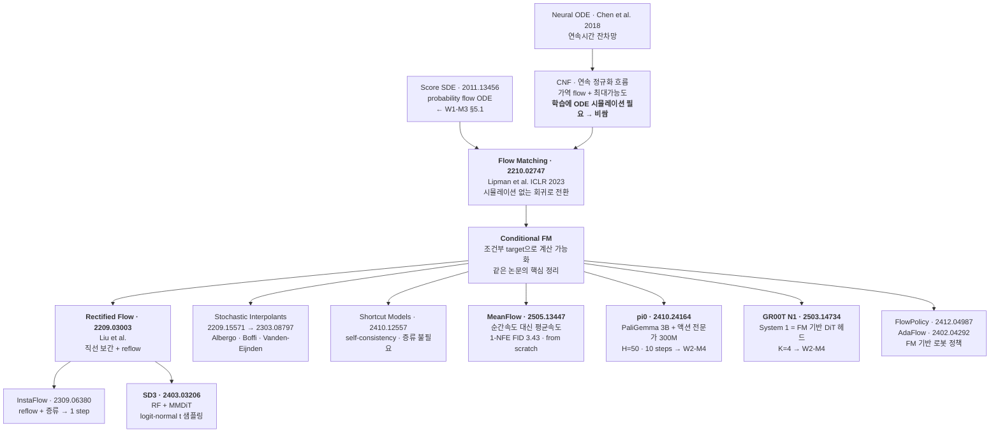
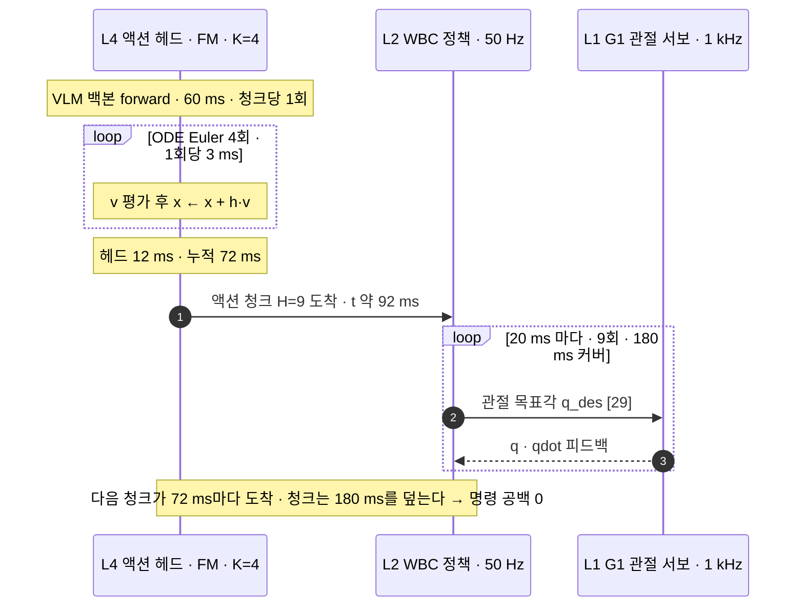
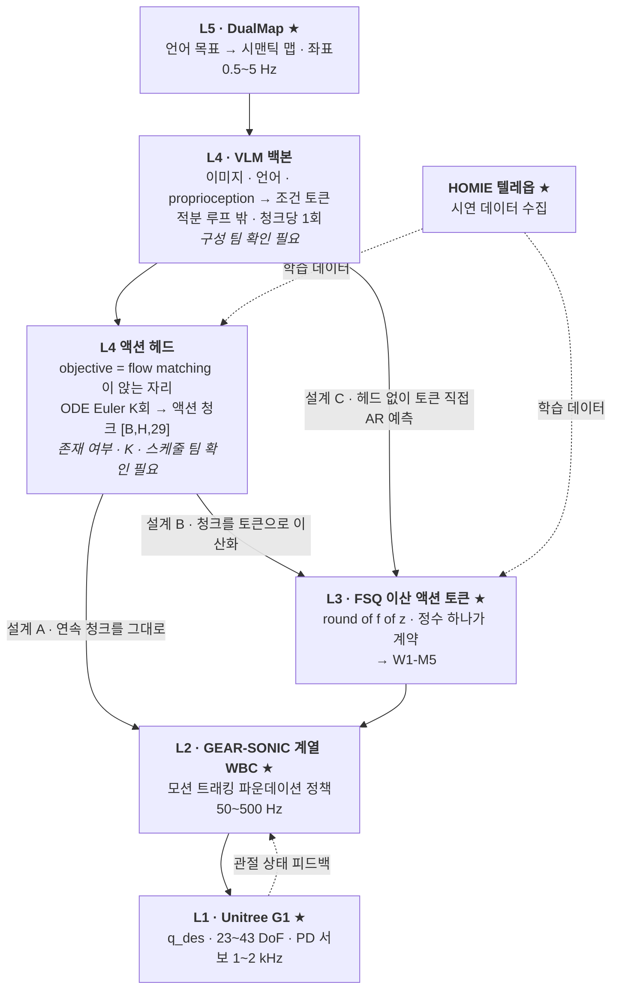

# Flow Matching & Rectified Flow

> **한 줄 요약**: [W1-M3 §5.3](../03-diffusion-ddpm-dit/lesson.md)이 "샘플러를 아무리 갈아도 NFE 1~2는 안 나온다"로 막아둔 길을 **경로 자체를 직선으로 설계한다**로 뚫습니다. conditional flow matching 정리를 한 번 증명해 손실이 `MSE(v_θ, x₁−x₀)` 한 줄로 붕괴하는 데까지 내려간 뒤, DDPM이 같은 가족의 다른 스케줄일 뿐임을 변환식으로 확인하고 NFE가 250에서 4~10으로 바뀌면 로봇 지연 산수가 어떻게 달라지는지 계산합니다.

## 학습 목표

- [ ] 확률 경로 $p_t$·속도장 $u_t$·continuity equation으로 생성 문제를 다시 쓰고 **주변 속도장이 왜 계산 불가능한지** 적분식으로 지목할 수 있다.
- [ ] $\nabla_\theta\mathcal{L}_{\text{FM}}=\nabla_\theta\mathcal{L}_{\text{CFM}}$을 이차항·교차항으로 증명하고 열쇠가 $u_t$의 사후평균 정의임을 설명할 수 있다.
- [ ] $x_t=\alpha_tx_1+\sigma_tx_0$에서 target 속도를 유도하고 직선 특수화에서 손실이 한 줄로 붕괴하는 것을 $\mathcal{L}_{\text{simple}}$과 대조할 수 있다.
- [ ] **DDPM(VP)과 Rectified Flow가 같은 가족의 다른 스케줄**임을 스케일·시간 재매개화로 보이고 그럼에도 학습 결과가 갈리는 이유(암묵적 $t$ 가중)를 답할 수 있다.
- [ ] 조건부 경로가 직선인데도 주변 궤적이 휘는 이유와 reflow의 대가를 설명하고 **pi0의 10 steps와 GR00T N1의 K=4가 지연 예산 어디에 앉는지** 계산할 수 있다.

**완료 기준**: 백지에 FM 학습 루프 세 줄(`t~U(0,1)` · `x_t=(1-t)x₀+tx₁` · `MSE(v_θ, x₁−x₀)`)을 쓰고 그 옆에 "W1-M3의 DDPM 루프에서 바뀐 곳"과 "L4 자리의 NFE 상한"을 숫자로 적을 수 있다.

**선수 지식**: [W1-M3](../03-diffusion-ddpm-dit/lesson.md)(DDPM 유도 · $\bar\alpha_t$ 표 · NFE↔지연 · DiT 블록), [W1-M1 §4](../01-physical-ai-landscape/lesson.md)(chunking 부등식), [W1-M2](../02-simulator-bootcamp/lesson.md)(G1 `nu`=29) · **소요**: 이론 2~2.5h / 실습 1~2h

---

## 1. 왜 이것을 배우는가

W1-M3는 문제를 열어놓고 끝났습니다. 250 스텝 샘플링을 50 Hz 제어 루프에 물리면 청크 하나가 82 스텝, 즉 **1.64초짜리 눈 감은 개방루프**가 됩니다. 자세가 무너지는 데 200 ms가 안 걸리는 휴머노이드에서 8배 늦습니다.

샘플러 교체로 어디까지 가는지는 실습에서 이미 재봤습니다. [`02_samplers_compare.py`](../03-diffusion-ddpm-dit/practice/02_samplers_compare.py)의 실측으로 DDIM이 ancestral을 이기는 구간은 NFE 4~20이고 최대 격차가 1.76배인데, **NFE 1과 2에서는 둘 다 실패합니다.** 샘플러는 적분기를 바꾸는 일이고 적분 대상인 궤적이 휘어 있으면 좋은 적분기도 큰 스텝에서 큰 오차를 냅니다.

이 모듈은 대상을 바꿉니다. **적분기를 고치지 말고 궤적을 펴자.** W1-M3가 주어진 플랜트에 더 좋은 적분기를 붙이는 이야기였다면, 여기서는 $\dot x=f(x,t)$의 $f$가 **우리 설계 대상**이라는 것을 이용합니다. 궤적이 직선이면 Euler 한 스텝이 정확합니다.

강점 영역이므로 확률·ODE·신경망 기초는 생략하고 셋만 끝까지 밟습니다. 먼저 CFM 정리를 증명합니다. 계산 불가능한 target을 대리 target으로 바꿔도 되는 이유입니다. 다음은 **DDPM과의 변환 관계**, 곧 FM은 diffusion의 대체재가 아니라 일반화라는 것입니다. 마지막이 **NFE 예산 재계산**입니다. 이 모듈이 존재하는 실용적 이유가 여기 있고 W2-M2(Diffusion Policy)와 W2-M4(pi0·GR00T)가 이 자리에서 갈립니다.

---

## 2. 계보 — 세 갈래가 같은 곳에서 만난다



**CNF는 개념이 먼저였지만 학습이 비쌌습니다.** 최대가능도 학습이 매 그래디언트 스텝마다 ODE를 풀어야 해 스케일이 안 났고, Flow Matching이 **그 시뮬레이션을 없애고 회귀 문제로 바꾸자** 학습 비용이 diffusion과 같아져 백본·데이터·인프라가 그대로 재사용됐습니다.

**세 갈래가 거의 같은 시기에 같은 곳에 도착했습니다.** Flow Matching·Rectified Flow·Stochastic Interpolants는 출발점이 다르지만 직선 보간 특수화에서 사실상 같은 손실을 씁니다(§5.2). 이미지 쪽 표준(SD3)과 로봇 쪽 표준(pi0·GR00T)이 동시에 이 objective로 수렴했습니다.

---

## 3. 무엇을 학습하려는 것인가

### 3.1 속도장 = 상태방정식

노이즈 $p_0=\mathcal{N}(0,I)$를 데이터 $p_1=q$로 옮기는 것이 목표입니다. 시간 의존 벡터장 $u_t:\mathbb{R}^D\to\mathbb{R}^D$를 하나 잡고 ODE를 정의합니다.

$$
\frac{d}{dt}\psi_t(x) = u_t\bigl(\psi_t(x)\bigr), \qquad \psi_0(x)=x
$$

**제어 대응**: 입력 없는 시변 비선형 상태방정식 $\dot x=f(x,t)$ 그 자체이고 $u_t$가 $f$, $\psi_t$가 천이사상(선형계의 $\Phi(t,0)$)입니다. 이 흐름이 미는 밀도 $p_t=[\psi_t]_\#p_0$는 연속방정식을 만족합니다.

$$
\frac{\partial p_t}{\partial t} + \nabla\cdot\bigl(p_t\,u_t\bigr) = 0
$$

확산항이 없는 Fokker-Planck, 즉 Liouville 방정식입니다. 필요한 것은 이걸 푸는 게 아니라 **"$u_t$가 있으면 $p_t$가 정해진다"**는 사실 하나이고 그러면 $u_t$를 신경망 $v_\theta$로 회귀하면 끝입니다.

$$
\mathcal{L}_{\text{FM}}(\theta) = \mathbb{E}_{t\sim\mathcal{U}[0,1],\;x\sim p_t}\bigl\|v_\theta(x,t)-u_t(x)\bigr\|^2
$$

### 3.2 그런데 target을 모른다

$u_t$도 $p_t$도 모릅니다. 데이터 분포 $q$를 모르니 그것을 향하는 벡터장을 알 리가 없습니다. **위 손실은 정의는 되지만 계산은 안 됩니다.**

우회로는 표준입니다. 데이터 한 점 $x_1$에 대해서만 **조건부 경로** $p_t(x|x_1)$을 직접 설계합니다($p_0(\cdot|x_1)=\mathcal{N}(0,I)$, $p_1(\cdot|x_1)\approx\delta_{x_1}$). $x_1$이 정해지면 거기까지 어떻게 갈지는 맘대로 정할 수 있고 조건부 속도장 $u_t(x|x_1)$도 닫힌 형태로 나옵니다(§5). 주변 쪽과의 연결은 이렇습니다.

$$
p_t(x)=\int p_t(x\mid x_1)\,q(x_1)\,dx_1,
\qquad
\boxed{\;u_t(x)=\int u_t(x\mid x_1)\,\frac{p_t(x\mid x_1)q(x_1)}{p_t(x)}\,dx_1 = \mathbb{E}_{x_1\sim p(x_1\mid x)}\bigl[u_t(x\mid x_1)\bigr]\;}
$$

**주변 속도장은 조건부 속도장의 사후평균**입니다. 이 모듈 전체의 축이 여기입니다. 이 식이 $u_t$가 실제로 $p_t$를 생성함을 보장하면서(연속방정식에 대입하면 확인됩니다) 동시에 계산 불가능한 이유도 보여줍니다. 점 $x$ 하나마다 데이터셋 전체에 대한 사후분포 적분이 필요하기 때문입니다.

**제어 대응**: 추종하고 싶은 기준신호가 전 데이터에 대한 적분으로만 정의됩니다. 실시간에 만들 수 없는 기준신호이고 다음 절은 이것을 **계산 가능한 대리 기준으로 바꿔도 최적해가 같다**는 것을 보입니다.

---

## 4. Conditional Flow Matching 정리

### 4.1 진술

계산 가능한 쪽 손실은 조건부 target을 그냥 회귀합니다.

$$
\mathcal{L}_{\text{CFM}}(\theta)=\mathbb{E}_{t\sim\mathcal{U}[0,1],\;x_1\sim q,\;x\sim p_t(\cdot\mid x_1)}\bigl\|v_\theta(x,t)-u_t(x\mid x_1)\bigr\|^2
$$

$x_1$을 데이터에서 뽑고 그 조건부 경로에서 $x$를 뽑아 닫힌 형태로 아는 $u_t(x|x_1)$을 맞히면 됩니다. 배치 하나로 계산됩니다.

> **정리.** $p_t(x)>0$인 곳에서 $\mathcal{L}_{\text{FM}}(\theta)=\mathcal{L}_{\text{CFM}}(\theta)+C$이고 $C$는 $\theta$와 무관하다. 따라서 $\nabla_\theta\mathcal{L}_{\text{FM}}=\nabla_\theta\mathcal{L}_{\text{CFM}}$이다.

### 4.2 증명 — 이차항과 교차항

제곱을 전개하면 $\|v_\theta-u\|^2=\|v_\theta\|^2-2\langle v_\theta,u\rangle+\|u\|^2$입니다. 세 번째는 양쪽 다 $\theta$ 무관이라 $C$로 흡수되므로 앞의 둘만 보면 됩니다.

**이차항** — $p_t$의 정의를 그대로 대입하고 $v_\theta$가 $x_1$에 무관하다는 것만 쓰면 됩니다.

$$
\int\|v_\theta(x,t)\|^2p_t(x)\,dx
=\iint\|v_\theta(x,t)\|^2\,p_t(x\mid x_1)q(x_1)\,dx_1dx
=\mathbb{E}_{q(x_1)p_t(x\mid x_1)}\|v_\theta\|^2
$$

**교차항** — 여기가 심장입니다. §3.2의 박스에 $p_t(x)$를 곱한 형태 $p_t(x)u_t(x)=\int u_t(x|x_1)p_t(x|x_1)q(x_1)dx_1$을 그대로 넣고, 내적이 두 번째 인자에 선형이므로 적분을 밖으로 뺍니다.

$$
\int\bigl\langle v_\theta,\,u_t(x)\bigr\rangle p_t(x)\,dx
=\int\Bigl\langle v_\theta,\,\int u_t(x\mid x_1)p_t(x\mid x_1)q(x_1)dx_1\Bigr\rangle dx
=\mathbb{E}_{q(x_1)p_t(x\mid x_1)}\bigl\langle v_\theta,\,u_t(x\mid x_1)\bigr\rangle
$$

양쪽이 같습니다. $\blacksquare$

**성립의 열쇠는 $u_t$의 정의 그 자체입니다.** 사후평균으로 정의했기 때문에 $p_tu_t$가 조건부의 적분으로 인수분해되고 그 덕에 교차항이 통과합니다. 다른 정의였다면 정리가 무너집니다.

### 4.3 무엇을 얻었는가

같은 사실을 회귀 쪽에서 한 번 더 읽으면 감각이 붙습니다. $\ell_2$ 회귀의 최소해는 조건부 기댓값이므로 $v^\star(x,t)=\mathbb{E}[u_t(x|x_1)\mid x_t=x]=u_t(x)$입니다. **개별 target은 전부 틀렸지만 그 평균이 정답입니다.** 배치마다 주는 $u_t(x|x_1)$은 "이 특정 점을 향해 가라"는 지시라 다른 점을 향한 지시와 모순되는데, MSE의 최소해가 그 모순들의 평균이고 그것이 우리가 원했던 주변 속도장입니다.

**W1-M3와 완전히 같은 구조입니다.** $\mathcal{L}_{\text{simple}}$도 개별 $\epsilon$을 맞히라고 시키지만 $x_t$가 주어졌을 때 진짜 $\epsilon$은 알 수 없고 학습된 $\epsilon_\theta$는 사후평균, 곧 score의 스케일된 추정치가 됩니다([W1-M3 §4.4 덧붙임](../03-diffusion-ddpm-dit/lesson.md)). 두 방법 모두 **"계산 불가능한 기준을 편향 없는 대리 기준으로 바꾸고 회귀가 평균을 내게 한다"**는 하나의 트릭 위에 있습니다. 확률근사(Robbins-Monro)에서 참 그래디언트를 편향 없는 추정치로 대체해도 같은 곳에 수렴하는 것과 논리가 같습니다. 대체되는 대상이 그래디언트에서 기준신호로 바뀔 뿐입니다.

---

## 5. 가우시안 조건부 경로와 직선 특수화

### 5.1 일반형과 target 속도

조건부 경로를 가우시안으로 잡으면 전부 닫힌 형태입니다.

$$
p_t(x\mid x_1)=\mathcal{N}\bigl(x;\ \alpha_tx_1,\ \sigma_t^2I\bigr)
\quad\Longleftrightarrow\quad
x_t=\alpha_tx_1+\sigma_tx_0,\quad x_0\sim\mathcal{N}(0,I)
$$

경계 조건은 $\alpha_0=0,\sigma_0=1$(순수 노이즈)과 $\alpha_1=1,\sigma_1=0$(데이터)입니다. $(\alpha_t,\sigma_t)$가 **스케줄**이고 W1-M3의 $\beta_t$와 같은 지위의 설계 상수라 학습되지 않습니다.

조건부 경로 위에서 $x_0$은 고정된 채 $t$만 흐르므로 그대로 미분하면 target이 나옵니다. 코드에 들어가는 것은 왼쪽 형태이고($x_1,x_0$을 이미 뽑아뒀으니 그냥 계산됩니다), $x_0=(x_t-\alpha_tx_1)/\sigma_t$를 대입해 $x_t$만으로 쓰면 오른쪽입니다.

$$
u_t\bigl(x_t\mid x_1,x_0\bigr)=\dot\alpha_tx_1+\dot\sigma_tx_0
\qquad\Longrightarrow\qquad
u_t(x\mid x_1)=\frac{\dot\sigma_t}{\sigma_t}\,x+\Bigl(\dot\alpha_t-\frac{\dot\sigma_t}{\sigma_t}\alpha_t\Bigr)x_1
$$

**제어 대응**: 상태 $x$에 대한 아핀 벡터장입니다. $\dot\sigma_t/\sigma_t$가 시스템 행렬(스칼라배), 나머지가 $x_1$을 입력으로 받는 입력 행렬인 시변 1차 선형계라 해가 닫힙니다.

### 5.2 직선 경로 — 손실이 한 줄로 붕괴한다

가장 단순한 스케줄을 넣습니다. $\alpha_t=t$, $\sigma_t=1-t$. Rectified Flow와 FM 논문의 CondOT 경로가 이것이고 노이즈와 데이터를 **직선으로 잇습니다.**

$$
x_t=(1-t)\,x_0+t\,x_1,
\qquad
u_t=\dot\alpha_tx_1+\dot\sigma_tx_0=x_1-x_0
$$

$\dot\alpha=1,\dot\sigma=-1$이라 target이 $t$에 전혀 의존하지 않습니다. 손실 전체가 한 줄입니다.

$$
\boxed{\;\mathcal{L}_{\text{RF}}(\theta)=\mathbb{E}_{t\sim\mathcal{U}[0,1],\;x_0\sim\mathcal{N}(0,I),\;x_1\sim q}\Bigl\|v_\theta\bigl((1-t)x_0+tx_1,\ t\bigr)-\bigl(x_1-x_0\bigr)\Bigr\|^2\;}
$$

스케줄 테이블이 없습니다. $\bar\alpha_t$를 사전 계산해 버퍼에 담을 일도, $\sqrt{\bar\alpha_t}$를 인덱싱할 일도 없습니다. 계수가 $t$ 그 자체입니다.

### 5.3 $\mathcal{L}_{\text{simple}}$과 나란히

| 축 | DDPM ($\mathcal{L}_{\text{simple}}$) | Rectified Flow / FM |
|---|---|---|
| 시간 규약 | 이산 $t\in\{1,\dots,1000\}$, **데이터가 $t{=}0$** | 연속 $t\in[0,1]$, **데이터가 $t{=}1$** |
| 보간식 | $x_t=\sqrt{\bar\alpha_t}\,x_{\text{data}}+\sqrt{1-\bar\alpha_t}\,\epsilon$ | $x_t=(1-t)x_0+tx_1$ |
| 스케줄 제약 | $\alpha_t^2+\sigma_t^2=1$ (variance preserving) | $\alpha_t+\sigma_t=1$ (선형) |
| 스케줄 의존성 | $\beta_t$ 테이블 + $\bar\alpha_t$ 누적곱 사전계산 | **없음.** 계수가 $t$와 $1-t$ |
| 예측 대상 | 노이즈 $\epsilon$ | 속도 $u=x_1-x_0$ |
| target의 $t$ 의존 | $\epsilon$ 자체는 무관하나 스케줄이 손실 가중에 들어옴 | **완전 무관.** 경로 위에서 상수 |
| 경계 조건 | $\bar\alpha_{1000}=4.04\times10^{-5}\neq0$ → 시작점 불일치 잔여 | $t{=}0$에서 **정확히** $\mathcal{N}(0,I)$ |
| 샘플링 · 실용 NFE | ancestral(SDE) 또는 DDIM(ODE) · 50~250 | ODE Euler · **1~10** |
| 코드 변경량 | — | **세 줄**(시간 샘플링·보간식·target) |

실무에서 가장 중요한 것은 코드 변경량입니다. 백본·옵티마이저·조건 주입 경로는 한 줄도 안 바뀝니다. 실습 [`03_fm_action_head.py`](practice/03_fm_action_head.py)가 W1-M3의 [`03_dit_action_head.py`](../03-diffusion-ddpm-dit/practice/03_dit_action_head.py)를 통째로 가져와 objective만 갈아끼우는 이유입니다. 경계 조건 줄도 짚어둘 만합니다. W1-M3 §3.3 표에서 $\bar\alpha_{1000}=4.04\times10^{-5}$로 0이 아니라 학습에서 본 $x_T$와 샘플링 시작점 $\mathcal{N}(0,I)$가 미세하게 어긋난 채 남습니다. 직선 경로는 $t=0$이 정의상 $\mathcal{N}(0,I)$라 이 틈이 없습니다.

### 5.4 같은 가족의 다른 스케줄

여기가 이 절의 결론입니다. **FM은 diffusion의 대체재가 아니라 일반화입니다.**

$x_t=\alpha_tx_1+\sigma_tx_0$ 꼴의 가우시안 경로는 각 시각에서 **스케일과 SNR 두 값**으로 완전히 결정됩니다. 그런데 스케일은 입력을 상수배 한 것과 같아 신경망이 흡수하는 자유도이므로 본질적 자유도는 SNR 궤적 하나뿐입니다. 그래서 두 스케줄은 **스케일 재조정 + 시간 재매개화**로 서로 옮겨집니다.

$$
\underbrace{x^{\text{VP}}_{s}}_{\text{DDPM 계열}}=\frac{x^{\text{RF}}_{t(s)}}{\sqrt{t(s)^2+\bigl(1-t(s)\bigr)^2}},
\qquad
t(s)\ \text{는}\ \frac{\alpha^{\text{VP}}_s}{\sigma^{\text{VP}}_s}=\frac{t(s)}{1-t(s)}\ \text{의 해}
$$

확인은 한 줄입니다. $(t,1-t)$를 그 $\ell_2$ 노름으로 나누면 $\alpha^2+\sigma^2=1$이 되고 이것이 정확히 VP 조건이며 비율 $\alpha/\sigma$는 나눗셈에 불변이라 SNR이 보존됩니다. 반대로 VP 경로를 $\alpha+\sigma$로 나누면 선형 경로가 됩니다.

> **$(\sigma,\alpha)$ 평면으로 보면 한눈에 들어옵니다.** 두 경로 모두 $(1,0)$에서 $(0,1)$로 갑니다. **VP는 단위원 위의 사분원 호**($\ell_2$ 정규화), **RF는 그 두 점을 잇는 현**($\ell_1$ 정규화)입니다.

SNR을 맞춰 대응시키면 이렇습니다. DDPM 열은 [W1-M3 §3.3](../03-diffusion-ddpm-dit/lesson.md)의 값이고 RF 열은 $t/(1-t)=\sqrt{\text{SNR}}$을 푼 것입니다.

| DDPM $t$ | $\bar\alpha_t$ | SNR $=\bar\alpha_t/(1-\bar\alpha_t)$ | $\sqrt{\text{SNR}}$ | 같은 SNR의 RF $t$ |
|---|---|---|---|---|
| 1 | 0.99990 | 9,999 | 100.00 | 0.9901 |
| 100 | 0.89702 | 8.711 | 2.9514 | 0.7469 |
| 250 | 0.52409 | 1.101 | 1.0493 | 0.5120 |
| **259** | **0.50000** | **1.000** | **1.0000** | **0.5000** |
| 500 | 0.07859 | 0.08529 | 0.29204 | 0.2260 |
| 1000 | $4.04\times10^{-5}$ | $4.04\times10^{-5}$ | 0.006356 | 0.006316 |

표를 세로로 읽으면 재미있는 것이 나옵니다. **DDPM 격자의 앞 25%($t{=}1{\sim}250$)가 RF 시간의 48%를 덮고 뒤 50%($t{=}500{\sim}1000$)가 RF 시간의 22%만 덮습니다.** $t$를 똑같이 균등 샘플링해도 **스케줄에 따라 SNR 구간별 학습 예산 배분이 완전히 달라집니다.**

그래서 같은 가족이라고 해서 같은 모델이 나오지는 않습니다. **바뀌는 것은 암묵적 손실 가중입니다.** W1-M3 「흔한 오해」의 첫 오해($\epsilon$-pred vs $x_0$-pred)가 같은 논리였고 FM에서는 이 자유도가 **$t$ 샘플링 분포**라는 눈에 보이는 노브로 올라옵니다. SD3(2403.03206)가 $t\sim\mathcal{U}[0,1]$ 대신 **logit-normal**($t=\text{sigmoid}(z),\ z\sim\mathcal{N}(m,s^2)$)을 쓴 것이 그 예이고 근거는 지각적으로 유의미한 노이즈 스케일 쪽으로 학습을 편향시키는 것입니다. **DDPM이 ELBO의 $\lambda_t$를 버린 자리에 FM은 $t$ 분포를 놓았습니다.**

---

## 6. 왜 스텝이 줄어드는가

### 6.1 직선이면 Euler 한 스텝이 정확하다

궤적이 직선이면 $\psi_t(x_0)=x_0+t\,c(x_0)$ 꼴이고 속도가 궤적 위에서 상수이므로 $v_0(x_0)=c(x_0)$입니다. 따라서

$$
\psi_1(x_0)=x_0+v_0(x_0)
$$

**Euler 한 스텝이 근사가 아니라 정확한 해입니다.** NFE 1입니다.

**제어 대응**: 명시적 Euler의 국소 절단오차는 $O(h^2\|\ddot x\|)$로 잡힙니다. 궤적의 2계 도함수가 0이면 스텝 크기와 무관하게 오차도 0이 됩니다. **NFE 예산은 결국 경로의 곡률이 정합니다.** 적분기를 고차로 올리는 것은 곡률이 있을 때 그 대가를 줄이는 일이고 곡률을 없애면 애초에 낼 대가가 없습니다.

### 6.2 그런데 실제로는 1스텝이 안 된다

조건부 경로를 직선으로 잡았는데도 **학습된 주변 속도장의 궤적은 휩니다.** 이유는 한 줄입니다. **서로 다른 (노이즈, 데이터) 쌍의 보간선이 교차하기 때문입니다.**

```
  t=0                                        t=1
   x₀⁽¹⁾ ●─────────╲    ╱─────────────────● x₁⁽¹⁾
                    ╲  ╱
                     ╳  ← 두 보간선이 같은 (x, t)에서 만난다
                    ╱  ╲
   x₀⁽²⁾ ●─────────╱    ╲─────────────────● x₁⁽²⁾

   교차점에서 u_t(x) = E[x₁−x₀ | x_t = x] = 두 방향의 평균
   → 어느 쪽 직선도 아닌 제3의 방향 → 실제 궤적은 여기서 휜다
```

ODE 해 자체는 유일성 때문에 서로 교차하지 않습니다. **교차하는 것은 보간선이고 그 교차가 해를 휘게 만듭니다.** 이 직관을 정량화한 것이 Rectified Flow 논문의 직선성 지표입니다.

$$
S(Z)=\int_0^1\mathbb{E}\Bigl\|\bigl(Z_1-Z_0\bigr)-\dot Z_t\Bigr\|^2dt
$$

$S=0$이면 완전한 직선이고 1스텝이 정확합니다. 학습 직후의 flow는 $S>0$입니다.

### 6.3 reflow — 짝짓기를 다시 한다

해법은 **짝짓기(coupling)를 바꾸는 것**입니다.

1. 학습된 $v_\theta$로 노이즈 $x_0$에서 출발해 충분한 스텝으로 ODE를 정확히 풉니다. $\hat x_1=\text{ODESolve}(x_0)$.
2. $(x_0,\hat x_1)$ 쌍을 **새 데이터셋**으로 삼아 §5.2의 손실로 다시 학습합니다.
3. 필요하면 반복합니다(2-rectified, 3-rectified, …).

핵심은 새 짝짓기가 **결정론적 함수**라는 것입니다. 원래 학습에서 $x_0$과 $x_1$은 독립으로 뽑혀 임의의 조합이 다 나타났고 보간선이 마구 교차했습니다. reflow 후에는 각 $x_0$에 정확히 하나의 $\hat x_1$이 대응하고 그 대응은 이미 ODE가 가까운 것끼리 이어놓은 짝이라 교차가 크게 줄고 $S$가 내려갑니다. 논문의 이론적 뒷받침은 rectify 연산이 볼록 수송비용을 증가시키지 않는다는 것이고 실용적 성과는 **CIFAR-10 1-step FID 4.85, recall 0.51**입니다.

**제어 대응**: 궤적 재계획과 경로 평활화입니다. 초기 계획이 장애물을 피하느라 꺾여 있으면 그 계획이 만든 시작점-끝점 쌍만 남기고 다시 최단 경로를 풀어 매끄럽게 만듭니다. "재계획의 재계획"이 수렴한다는 것이 논문의 정리입니다.

> **공짜가 아닙니다.** reflow의 학습 target은 모델 자신의 출력이라 원 모델의 오차를 그대로 상속하고 누적합니다. reflow를 한 번 돌릴 때마다 대규모 샘플 생성 + 재학습이 추가로 듭니다. 게다가 NFE를 크게 잡았을 때의 품질이 원 모델보다 나빠지는 경우가 보고됩니다. **큰 NFE의 품질을 팔아 작은 NFE의 품질을 삽니다.**

### 6.4 스텝 축소 기법 지형

| 접근 | 무엇을 바꾸는가 | 추가 학습 | 실용 NFE | 대표 |
|---|---|---|---|---|
| 샘플러 교체 | 적분기만 | 없음 | 10~50 | DDIM · DPM-Solver 계열 (→ W1-M3 §5.1) |
| **경로 설계** | 조건부 경로를 직선으로 | 처음부터 그렇게 학습 | 4~20 | **Flow Matching · Rectified Flow** |
| **reflow** | 짝짓기를 결정론적으로 | 샘플 생성 + 재학습 1회 이상 | 1~4 | Rectified Flow의 $k$-rectified |
| 증류 | 교사→학생 압축 | 교사 모델 필요 | 1~2 | **InstaFlow · 2309.06380** (reflow 후 증류, ICLR 2024) |
| self-consistency | 스텝 크기를 조건으로 받는 단일 모델 | **증류 불필요** | 1~4 | **Shortcut Models · 2410.12557** (ICLR 2025) |
| 평균속도 학습 | 순간속도 대신 구간 평균속도 | from scratch | **1** | **MeanFlow · 2505.13447** (NeurIPS 2025 oral, ImageNet256 1-NFE FID 3.43) |
| 적응형 solver | 분산에 따라 스텝 수를 가변 | — | 1~N 자동 | **AdaFlow · 2402.04292** (NeurIPS 2024, 단봉이면 자동 1-step) |

위 두 줄은 품질 손실 없이 얻는 이득이고 세 번째 줄부터는 무언가를 지불합니다. 로봇에서 어디까지 갈지는 태스크가 정합니다. 다봉성이 중요한 조작이라면 1-step 증류가 모드를 뭉갤 위험이 있고([W1-M3 §7.3](../03-diffusion-ddpm-dit/lesson.md)), 단봉에 가까운 보행 트래킹이라면 AdaFlow의 관찰처럼 자동으로 1스텝에 수렴할 수 있습니다.

---

## 7. 아키텍처

### 7.1 학습 루프 — W1-M3에서 바뀐 곳만

```
■ Flow Matching 학습 1 스텝 · 직선 경로
────────────────────────────────────────────────────────────────────
  x₁ ~ q(data)          [B, D]     ← 데이터 배치
  x₀ ~ N(0, I)          [B, D]     ← 노이즈. DDPM의 ε와 같은 텐서
  t  ~ U(0, 1)          [B]        ◀ 변경 ①  DDPM: t ~ U{1..1000} 이산
        │                             연속이라 스케줄 테이블 인덱싱이 없다
        ▼
  x_t = (1-t)·x₀ + t·x₁ [B, D]     ◀ 변경 ②  DDPM: √ᾱ_t·x₀ + √(1-ᾱ_t)·ε
        │                             t는 [B] → [B,1,…] 로 broadcast
        ▼
  v_θ(x_t, t)           [B, D]     ← 백본 그대로. DiT · U-Net · Transformer
        │                             파라미터 · 조건 주입 경로 무변경
        ▼
  target u = x₁ - x₀    [B, D]     ◀ 변경 ③  DDPM: target = ε
        │                             t에 상수 — 스케줄 계수가 안 곱해진다
        ▼
  L = mean( (v_θ - u)² )  → backward
────────────────────────────────────────────────────────────────────
■ 샘플링 · 명시적 Euler · NFE = K
  x ← x₀ ~ N(0, I) [B,D];   h ← 1/K
  for k = 0 … K-1:  x ← x + h · v_θ(x, k·h)     ← forward 정확히 K회 = NFE
  return x                     ◀ DDPM: 스케줄 계수 3개 + 노이즈 재주입
────────────────────────────────────────────────────────────────────
 바뀐 것은 세 줄. 백본 · 옵티마이저 · EMA · 조건 경로는 한 줄도 안 바뀐다.
 K=1 이면 x = x₀ + v_θ(x₀, 0) 한 줄이고, 경로가 직선이면 이것이 정확해(§6.1)
────────────────────────────────────────────────────────────────────
```

> **실측 각주 — 옮길 때 하나가 더 필요합니다.** 위 세 줄은 objective의 diff 그대로입니다(실습 [`03_fm_action_head.py`](practice/03_fm_action_head.py)가 `difflib`로 두 학습 스텝을 대조해 정확히 3줄임을 확인합니다). 다만 W1-M3 코드를 그대로 재사용하면 **시간 임베딩의 대역을 맞추는 한 줄이 추가로 듭니다.** DDPM은 $t\in\{1,\dots,1000\}$ 정수를 sinusoidal 임베딩에 넣는데 FM의 $t\in[0,1]$을 같은 임베딩에 그대로 태우면 주파수 성분이 뭉개져 학습이 진행되지 않습니다. 실습은 $t\times1000$으로 스케일을 맞춥니다. 손실 유도와는 무관한 구현 세부지만, "세 줄만 바꾸면 된다"를 곧이곧대로 옮겼을 때 실제로 막히는 자리라 적어둡니다.

### 7.2 액션 헤드판 — pi0식 배치의 축소판

```
■ FM 액션 헤드 · G1 29 DoF · pi0 실수를 옆에 붙임
──────────────────────────────────────────────────────────────────────────
 관측 o_t                                  액션 청크 A ∈ R^[B, H=50, D=29]
   이미지 V대 × N_img 패치                   H=50 ← pi0 실수
   언어 토큰 L개                              D=29 ← W1-M2 실측 nu
   proprioception q ∈ R^[29]                        │
        │                                           ▼  x₀~N(0,I) · t~U(0,1)
        ▼  VLM 백본 forward                x_t = (1-t)·x₀ + t·A  [B,50,29]
   조건 토큰 [B, V·N_img + L, d]                     │
   ★ 청크당 1회 — 적분 루프 밖         Linear(p_t·D → d), p_t=2 → [B,25,d]
        │                                    + 1D 시간 위치 인코딩
        │        ┌───────────────────────────────▼──────────────────┐
        └───────►│ 액션 전문가 N블록                                 │
        cross-   │   Self-Attn [B,25,d] → Cross-Attn(조건) → MLP     │
        attention│   t 주입: adaLN(GR00T) 또는 MLP 접기(pi0)         │
        (또는 KV └───────────────────────┬──────────────────────────┘
         공유)                           │ [B, 25, d]
                        Linear(d → p_t·D) → unpatchify
                                         ▼   v̂ ∈ R^[B, 50, 29]
        ┌────────────────────────────────┘
        ▼   x ← x + h·v̂,  h = 1/K      ← 이 루프만 K회. VLM 재실행 없음
     K회 반복 → 액션 청크 A [B,50,29] → L2 WBC가 50 Hz로 소비
──────────────────────────────────────────────────────────────────────────
 pi0 (2410.24164)  PaliGemma 3B VLM + 액션 전문가 300M (전체 3.3B)
                   청크 H=50 · 제어 최대 50 Hz(dexterous)
                   flow matching 추론 10 integration steps, δ = 0.1
 GR00T N1 (2503.14734)  System 1 = FM 기반 DiT action head · K = 4
                        (논문/기술보고서 기준)
──────────────────────────────────────────────────────────────────────────
```

> **지연 예산은 ★ 줄에서 갈립니다.** 백본이 루프 밖이면 $\tau_{\text{VLM}}+K\tau_{\text{head}}$, 안이면 $K(\tau_{\text{VLM}}+\tau_{\text{head}})$. 300M 헤드와 3B 백본의 차이라 후자면 예산이 10배로 뜁니다(§11 **M4-4**).

> **명칭 주의.** **pi0의 액션 전문가는 DiT가 아닙니다.** PaliGemma와 가중치를 나눠 갖는 mixture-of-experts형 별도 트랜스포머이고 조건 주입도 AdaLN이 아닙니다. **DiT가 정확한 쪽은 GR00T N1의 System 1**입니다. "요즘 VLA는 다 FM + DiT"는 objective와 블록 계보를 분리해 읽어야 정확합니다([W1-M3 §7.4](../03-diffusion-ddpm-dit/lesson.md)·[용어집](../../../notes/glossary.md)의 구분).

---

## 8. NFE 예산 재계산

### 8.1 W1-M3 §5.2 표를 이어받는다

가정은 그대로입니다. $f_2=50$ Hz, $\tau_{\text{comm}}=20$ ms, VLM 60 ms, 헤드 3 ms/NFE, $T_{\text{replan}}=\tau_{\text{infer}}$, 부등식은 [W1-M1 §4.1](../01-physical-ai-landscape/lesson.md)의 $H_{\text{chunk}}\ge f_2(T_{\text{replan}}+\tau_{\text{infer}}+\tau_{\text{comm}})$.

| NFE | 계열 | 헤드 시간 | $\tau_{\text{infer}}$ | 달성 $f_4$ | 필요 $H_{\text{chunk}}$ | 최악 반응 지연 |
|---|---|---|---|---|---|---|
| **1** | MeanFlow · InstaFlow · 2-reflow | 3 ms | 63 ms | 15.9 Hz | 8 | **160 ms** |
| **2** | Shortcut · 증류 | 6 ms | 66 ms | 15.2 Hz | 8 | **160 ms** |
| **4** | **GR00T N1 (K=4)** | 12 ms | 72 ms | 13.9 Hz | 9 | **180 ms** |
| **10** | **pi0 (10 steps)** | 30 ms | 90 ms | 11.1 Hz | 10 | **200 ms** |
| 20 | FM 무증류 하단 | 60 ms | 120 ms | 8.3 Hz | 13 | 260 ms |
| 50 | DDIM 실용권 | 150 ms | 210 ms | 4.8 Hz | 22 | 440 ms |
| 250 | DDPM 논문 설정 | 750 ms | 810 ms | 1.2 Hz | 82 | 1,640 ms |
| 1000 | DDPM 학습 $T$ | 3,000 ms | 3,060 ms | 0.33 Hz | 307 | 6,140 ms |

**이 모듈의 성과는 표 위 네 줄에 있습니다.** [W1-M1 §3.3](../01-physical-ai-landscape/lesson.md)이 "자세가 무너지기까지 200 ms가 안 걸린다"고 못박았는데, NFE 1~10의 최악 반응 지연 **160~200 ms**가 그 문턱 안쪽입니다(NFE 250은 1.64초로 8배 밖). 같은 백본, 같은 하드웨어, objective만 바꿔 얻은 결과입니다.



W1-M3의 같은 다이어그램은 "명령 공백이 40 스텝 이상 이어졌다"로 끝났습니다. 여기서는 공백이 없습니다.

### 8.2 자리별 상한 — 실측 ms를 넣으면

3 ms/NFE는 가정값이고 W1-M3 실습이 **RTX 3080에서 673.7M(DiT-XL 구성) 헤드가 배치 1·토큰 16개에서 13.2~14.8 ms**를 실측했습니다. 두 값을 함께 놓습니다(헤드에 남는 시간 = 주기 예산 − VLM 60 ms).

| 자리 | 주기 예산 | 헤드에 남는 시간 | 3 ms/NFE 상한 | **13.2 ms/NFE 상한**(673.7M 실측) | pi0 K=10 | GR00T K=4 |
|---|---|---|---|---|---|---|
| L2 안에 직접 · 500 Hz | 2 ms | 2 ms | **0** | **0** | ✗ | ✗ |
| L2 안에 직접 · 50 Hz | 20 ms | 20 ms | 6 | 1 | ✗ | ✗ |
| L4 청크 생성 · 10 Hz | 100 ms | 40 ms | 13 | **3** | ✗ | **✗**(52.8 ms 필요) |
| L4 청크 생성 · 5 Hz | 200 ms | 140 ms | 46 | **10** | **✓**(132 ms, 딱 맞음) | ✓ |

**L2 자리는 여전히 불가능합니다.** 500 Hz면 예산이 2 ms라 forward 한 번도 못 합니다. FM이 바꾼 것은 L4의 NFE 상한이지 계층 구조가 아닙니다.

**헤드 크기는 NFE만큼 지배적입니다.** 3 ms 가정에서 5 Hz 자리에 46 NFE가 들어가지만 673.7M 헤드에서는 10입니다. **pi0의 액션 전문가가 3B가 아니라 300M인 것은 이 산수의 귀결로 보입니다.** 큰 것은 백본이고 백본은 루프 밖에 있습니다. GR00T의 K=4가 왜 더 공격적인지도 같은 표에서 읽힙니다.

### 8.3 pi0의 "50 Hz"를 오해하지 않기

검증된 pi0 숫자 셋은 축이 서로 다릅니다. **H = 50**은 한 추론이 내놓는 액션 개수(청크 길이), **최대 50 Hz**는 그 청크를 소비하는 하위 주파수 $f_2$이지 재계획 주파수 $f_4$가 아니며 **10 integration steps($\delta=0.1$)**는 NFE입니다.

부등식에 넣으면 $H/f_2=50/50=1$초이므로 $T_{\text{replan}}+\tau_{\text{infer}}+\tau_{\text{comm}}\le1$초까지 허용됩니다. **청크 하나가 1초를 덮는 설계이고 그만큼 상위 추론에 여유를 준 것입니다.** 대신 끝까지 개방루프면 최악 반응 지연도 1초입니다. receding horizon이 일반적이지만([W1-M1 §4.4](../01-physical-ai-landscape/lesson.md)) pi0가 어느 비율로 쓰는지는 확인하지 않았습니다(§11 **M4-5**). 지연 전체에서 FM이 줄이는 것은 $K$ 하나뿐이라는 점은 §10의 세 번째 오해에서 이어받습니다.

---

## 9. 회사 스택 연결 ★

### 9.1 FM 헤드가 앉을 수 있는 자리



배치도는 [W1-M3 §8.1](../03-diffusion-ddpm-dit/lesson.md)과 같고 여기서 바뀌는 것은 **설계 A·B의 가격표**입니다. 헤드 objective가 DDPM이면 §8.1 표의 아래쪽 줄(NFE 50~250)에, FM이면 위쪽 줄(NFE 1~10)에 앉습니다. **같은 자리, 같은 백본인데 지연 예산이 한 자릿수 달라집니다.** A·B·C 중 어느 배치인지도 헤드가 실재하는지도 미확인입니다(§9.4).

### 9.2 연속 FM 헤드 vs 이산 FSQ 토큰 AR — W1-M3 §8.2 갱신

같은 자리(L4 출력 ↔ L2 입력)를 다투는 두 설계이고 W1-M3 표의 연속 쪽 열을 FM 기준으로 다시 채운 것입니다.

| 축 | 연속 FM 헤드 | 이산 FSQ 토큰 + AR |
|---|---|---|
| 상위 모델 형태 | VLM + 별도 액션 전문가 | VLM 그대로, vocabulary만 확장 |
| 1회 출력 비용 | $\tau_{\text{VLM}}+K\times\tau_{\text{head}}$, **$K$ 4~10이 실증권** | 토큰 수 × AR forward, KV 캐시 재사용 |
| **W1-M3 대비 변화** | **NFE 50~250 → 4~10.** 순위가 뒤집힐 크기 | 변화 없음 |
| 지연을 더 줄이는 수단 | reflow · 증류 · Shortcut · MeanFlow (§6.4) — **품질 손실 동반** | 토큰 수 축소 · speculative decoding |
| 분해능 · 인터페이스 계약 | 부동소수점. 스케일·단위·차원 순서 협상 | $\prod L_i$ 격자가 상한. 계약은 정수 하나 |
| 하위 정책 교체 | 액션 규약이 계약이라 재학습 위험 | 토큰 공간 유지하면 자유 |
| 대표 사례 · 담당 모듈 | **pi0 · GR00T N1 · FlowPolicy** — 이 모듈 · W2-M2 · W2-M4 | RT-2 · 회사 FSQ 계층 모델 ★ — [W1-M5](../05-latent-discrete-fsq/lesson.md) · W2-M5 |

**표에서 새로 채운 칸은 "W1-M3 대비 변화" 한 줄뿐입니다.** W1-M3가 "연속 헤드를 쓰면 NFE가 그대로 지연 예산으로 청구된다"로 이산 토큰 쪽에 유리한 청구서를 남겼는데 FM이 그것을 한 자릿수 깎았습니다. **"연속은 느려서 안 된다"는 논거만큼은 약해진 것**이고 설계 B에서는 **FM 헤드가 FSQ 격자를 알고 학습되는가**라는 새 질문이 붙습니다(§11 **M4-6**).

### 9.3 FM 기반 로봇 정책 지형

| 모델 | 자리 | FM을 어디에 썼나 | 추론 스텝 | 출처 강도 |
|---|---|---|---|---|
| **pi0** (2410.24164) | L4 VLA | 300M 액션 전문가. PaliGemma 3B와 가중치 분리(**DiT 아님**) | **10 steps, $\delta$=0.1** | 논문 원문 직접 확인 |
| **GR00T N1** (2503.14734) | L4 System 1 | flow matching 기반 **DiT** action head | **K = 4** | 2차 출처 — 논문/기술보고서 기준 |
| **FlowPolicy** (2412.04987) | 정책 전체 | Consistency FM 기반 3D 정책 | 추론 **7배 가속** 보고 | AAAI 2025 |
| **AdaFlow** (2402.04292) | 정책 전체 | variance-adaptive ODE solver | **단봉이면 자동 1-step** | NeurIPS 2024 |
| Diffusion Policy (2303.04137) | 정책 전체 | — (DDPM/DDIM) | 비교 기준선 | → W2-M2 |

우리 스택에서는 AdaFlow가 흥미롭습니다. **단봉이면 자동으로 1스텝**이라는 것은 태스크에 따라 NFE 예산이 동적으로 남는다는 뜻이고 단봉에 가까운 보행·모션 트래킹과 다봉인 조작이 섞인 휴머노이드에서는 고정 NFE가 낭비일 수 있습니다. 다만 논문의 관찰이라 우리 데이터에서 성립하는지는 별개입니다. [M3-6](../../../notes/questions-for-team.md)("학습 데이터에 다봉 시연이 실제로 있는가")이 앞단 질문입니다. **N1.5 인용 주의**는 §13에 있습니다.

### 9.4 확인되지 않은 것

숫자로 채우지 못한 칸이 일곱입니다. 전부 🔴 미확인이며 추측하지 않았습니다. 질문 문장은 §11에 1:1로 있습니다. ① 경로 스케줄과 ② $t$ 샘플링 분포를 모르면 §5.4의 암묵적 가중을 재현할 수 없습니다. ③ reflow·증류 적용 여부는 §6.3의 대가를 지불했는지의 문제이고 ④ ODE 적분기는 같은 NFE에서 품질을 가릅니다. ⑤ VLM이 루프 밖인지는 §8.2 표를 10배 틀리게 만들 수 있고 ⑥ 청크 실행 전략은 §8.1 "최악 반응 지연" 열의 값을 정하며 ⑦ 설계 B에서 헤드가 FSQ 격자를 아는지가 양자화 오차의 귀속처를 바꿉니다.

---

## 10. 흔한 오해 3가지

| 오해 | 교정 |
|---|---|
| **"FM은 diffusion과 다른 종류의 모델이다"** | 같은 가족의 다른 스케줄입니다(§5.4). $x_t=\alpha_tx_1+\sigma_tx_0$ 꼴에서 DDPM은 $\alpha^2+\sigma^2=1$($\ell_2$ 정규화, 사분원 호), RF는 $\alpha+\sigma=1$($\ell_1$ 정규화, 현)일 뿐이고 스케일 재조정 + 시간 재매개화로 옮겨집니다. 학습 대상도 가역 아핀 변환 관계라 $\epsilon$-pred·$x_0$-pred·$v$-pred·속도 예측이 같은 회귀의 좌표계이고, 갈리는 것은 **암묵적 $t$-가중**입니다([W1-M3 「흔한 오해」](../03-diffusion-ddpm-dit/lesson.md)의 첫 오해와 같은 논리). 그래서 "FM으로 바꾼다"는 백본 교체가 아니라 **세 줄 교체**입니다(§7.1). 다만 가중이 달라지면 결과도 달라지므로 "같은 가족"이 "같은 모델"은 아닙니다. |
| **"Rectified Flow면 1스텝이 공짜다"** | 직선인 것은 **조건부 경로**이고 학습되는 **주변 속도장의 궤적은 여전히 휩니다**(§6.2). 1~2 스텝을 실제로 얻으려면 **reflow 또는 증류**가 필요한데, reflow는 모델 자신의 출력을 target으로 삼아 오차를 상속하고 샘플 생성 + 재학습 비용이 들며 큰 NFE의 품질을 내줍니다. 논문 headline(CIFAR-10 1-step FID 4.85 / recall 0.51)도 재학습을 거친 결과이고, 무증류 FM의 실용권은 NFE 4~20입니다. |
| **"스텝이 적으니 무조건 로봇에 유리하다"** | 지연은 $\tau_{\text{VLM}}+K\times\tau_{\text{head}}$이고 FM이 줄이는 것은 $K$ 하나입니다. §8.2에서 673.7M 헤드는 13.2 ms/NFE라 5 Hz 자리에 10 NFE뿐이고, 백본이 루프 안으로 들어가면 예산이 10배로 뜁니다. 더 중요한 것은 [W1-M1 §4](../01-physical-ai-landscape/lesson.md)의 부등식이 **$H_{\text{chunk}}$와 홀드 전략에 더 민감**하다는 점입니다 — $\tau_{\text{infer}}$를 100 ms에서 200 ms로 늘려도 $H$는 16에서 21로만 가는 반면, 청크를 길게 잡으면 **최악 반응 지연이 $H/f_2$까지 늘어납니다.** 1스텝 증류가 다봉 분포를 뭉갤 수 있다는 점도([W1-M3 §7.3](../03-diffusion-ddpm-dit/lesson.md)) 함께 재야 합니다. **NFE는 예산 항목 하나일 뿐 예산 전체가 아닙니다.** |

---

## 11. 팀에 물어볼 것

> [`notes/questions-for-team.md`](../../../notes/questions-for-team.md)의 W1 섹션에 적립합니다. **M3-2**(objective가 DDPM인가 FM인가, NFE와 forward ms)가 이미 있으므로 **"FM이라고 답이 왔을 때 바로 이어서 물어볼 것"**만 모았고 M5-*(FSQ 내부)와도 겹치지 않습니다.

1. **`M4-1` 경로 스케줄과 $t$ 샘플링 분포는?** 직선(RF/CondOT)인가 VP 계열인가, $t$가 uniform인가 SD3식 logit-normal인가. §5.4대로 $t$ 분포가 곧 암묵적 손실 가중이라 **재현·파인튜닝에서 가장 먼저 맞춰야 할 하이퍼파라미터**입니다.
2. **`M4-2` reflow나 증류를 적용했거나 검토했는가?** 몇 회이고 품질 손실을 무엇으로 측정했는가(성공률? 궤적 매끄러움? 다봉성 보존?). §6.3의 대가를 이미 지불했는지 확인합니다.
3. **`M4-3` ODE 적분기가 무엇이고 스텝 수는 고정인가 가변인가?** 고정 Euler·고차 Heun·AdaFlow식 적응형 중 무엇인가. 같은 NFE에서 품질이 갈리고 가변이면 §8.2 상한을 최악값으로 다시 잡아야 합니다.
4. **`M4-4` VLM 백본이 적분 루프 밖에 있는가?** 조건 토큰을 청크당 1회만 계산하는가, 매 스텝 다시 계산하는가. **§8.2 표가 10배 틀릴 수 있는 항목**입니다.
5. **`M4-5` 청크를 끝까지 실행하는가, 앞 몇 개만 쓰고 재계획하는가?** 겹치는 구간을 앙상블하는가(ACT식 temporal ensembling). M3-5가 $H$·$f_2$의 값이라면 이쪽은 **실행 정책**이고 §8.1 "최악 반응 지연" 열의 값이 정해집니다.
6. **`M4-6` 설계 B라면 헤드가 FSQ 격자를 알고 학습되는가?** 양자화-인지 학습인가, 학습 후 반올림인가. 후자면 **양자화 오차가 그대로 인터페이스 오차**가 되고 $\prod L_i$ 격자 밖 정밀도는 버려집니다. M3-4의 다음 단계입니다.

---

## 12. 셀프 체크 퀴즈

1. **(유도)** $u_t(x)$의 정의식을 쓰고 왜 계산 불가능한지 지목하라. 그럼에도 $\mathcal{L}_{\text{CFM}}$의 최소해가 $u_t$인 이유는?
2. **(유도)** $\nabla_\theta\mathcal{L}_{\text{FM}}=\nabla_\theta\mathcal{L}_{\text{CFM}}$의 증명에서 이차항·교차항이 어떻게 일치하는지 밟아라. 열쇠가 되는 $u_t$의 성질은?
3. **(계산)** $x_t=\alpha_tx_1+\sigma_tx_0$의 target 속도를 쓰고 $\alpha_t=t,\sigma_t=1-t$를 대입하라. $t$에 의존하는가? 코드에서 무엇이 사라지는가?
4. **(W1 체크포인트 2번)** DDPM과 Flow Matching의 학습 objective 차이를 **수식 수준으로** 설명하라. 로봇 제어에서 FM이 선호되는 실용적 이유를 지연 예산 숫자로 답하라.
5. **(계산)** RF에서 SNR $=\alpha_t^2/\sigma_t^2$가 1이 되는 $t$는? DDPM 선형 스케줄의 같은 지점은? 두 스케줄이 같은 가족인 이유를 $(\sigma,\alpha)$ 평면의 도형으로 설명하라.
6. 조건부 경로가 직선인데 주변 궤적은 왜 휘는가? reflow가 무엇을 바꾸며 공짜가 아닌 이유 두 가지를 대라.
7. **(계산)** $f_2=50$ Hz, $\tau_{\text{comm}}=20$ ms, VLM 60 ms, 헤드 13.2 ms/NFE일 때 L4 5 Hz·10 Hz 자리에 각각 몇 NFE가 들어가는가? pi0의 10 steps와 GR00T의 K=4는 어디에 앉는가?
8. pi0의 "H=50", "최대 50 Hz", "10 integration steps"는 각각 무엇인가? W1-M1 부등식에 넣으면 상위 추론에 몇 초의 예산이 나오는가?
9. "FM으로 바꾸려면 백본을 다시 설계해야 한다"가 틀린 이유를 §7.1 블록도로 답하라. 바뀌는 세 줄은?
10. **(회사 스택)** FM 헤드가 앉을 수 있는 자리를 설계 A·B·C로 설명하고 이산 FSQ 토큰 AR과의 경쟁 구도에서 이 모듈이 바꾼 항목을 지목하라. 우리가 어느 배치인지 답할 수 있는가?

<details>
<summary>정답 보기</summary>

1. $u_t(x)=\mathbb{E}_{x_1\sim p(x_1|x)}[u_t(x|x_1)]$. 점 $x$마다 데이터셋 전체의 사후분포 적분이 필요해 계산 불가능합니다. 그럼에도 $\ell_2$ 회귀의 최소해가 조건부 기댓값이라 $v^\star=u_t(x)$입니다. **개별 target은 전부 틀렸지만 그 평균이 정답입니다.**

2. 이차항은 $p_t(x)=\int p_t(x|x_1)q(x_1)dx_1$ 대입 시 $v_\theta$가 $x_1$에 무관해 그대로 넘어갑니다. 교차항은 $p_tu_t=\int u_t(x|x_1)p_t(x|x_1)q(x_1)dx_1$ 대입 후 내적의 선형성으로 적분을 빼면 일치하고 $\|u\|^2$는 $\theta$ 무관이라 $C$로 흡수됩니다. **열쇠는 $u_t$의 사후평균 정의입니다.** 그 덕에 $p_tu_t$가 인수분해됩니다.

3. $u_t=\dot\alpha_tx_1+\dot\sigma_tx_0$, 직선 대입 시 $\dot\alpha=1,\dot\sigma=-1$이라 $u_t=x_1-x_0$으로 **$t$에 전혀 의존하지 않습니다.** $\beta_t$·$\bar\alpha_t$ 테이블과 인덱싱이 사라집니다.

4. DDPM은 $\mathcal{L}_{\text{simple}}=\mathbb{E}\|\epsilon-\epsilon_\theta(\sqrt{\bar\alpha_t}x_0+\sqrt{1-\bar\alpha_t}\epsilon,t)\|^2$입니다. 이산 $t$, VP($\alpha^2+\sigma^2=1$), 노이즈 예측. FM(직선)은 $\mathcal{L}_{\text{RF}}=\mathbb{E}\|v_\theta((1-t)x_0+tx_1,t)-(x_1-x_0)\|^2$입니다. 연속 $t$, 선형($\alpha+\sigma=1$), 속도 예측이며 target이 $t$에 무관. **실용적 이유는 NFE입니다.** 곡률이 작아 NFE 4~10이 실용권이고 §8.1에서 최악 반응 지연이 1,640 ms(NFE 250) → **180~200 ms**(K=4~10)로 200 ms 문턱 안쪽에 들어옵니다.

5. RF는 **$t=0.5$**, DDPM 선형 스케줄은 $\bar\alpha_t=0.5$인 **$t=259$**. 둘 다 $(1,0)\to(0,1)$로 가는데 **VP는 사분원 호, RF는 그 두 점을 잇는 현**이고 노름으로 나누는 스케일 재조정 + SNR을 맞추는 시간 재매개화로 옮겨집니다.

6. 직선인 것은 조건부 경로뿐이고 **보간선이 교차**하기 때문입니다. 교차점에서 속도장이 사후평균이라 어느 직선도 아닌 방향이 됩니다. reflow는 $\hat x_1=\text{ODESolve}(x_0)$로 **짝짓기를 결정론적 함수로 바꿔** 재학습합니다. 대가는 두 가지입니다. target이 모델 자신의 출력이라 오차가 상속·누적됩니다. 샘플 생성과 재학습 비용도 들고 큰 NFE의 품질을 내줍니다.

7. 5 Hz는 200−60=140 ms, $140/13.2=10.6$ → **10 NFE**. 10 Hz는 100−60=40 ms, $40/13.2=3.03$ → **3 NFE**. **pi0의 10 steps는 5 Hz에 딱 맞고(132 ≤ 140 ms) 10 Hz에는 못 들어갑니다.** GR00T의 K=4도 10 Hz에는 52.8 ms가 필요해 안 들어갑니다.

8. **H=50**은 한 추론이 내는 액션 개수, **50 Hz**는 청크를 소비하는 $f_2$, **10 steps**는 NFE입니다. $H/f_2=1$초라 $T_{\text{replan}}+\tau_{\text{infer}}+\tau_{\text{comm}}\le1$초까지 허용되고 끝까지 개방루프면 최악 반응 지연도 1초입니다.

9. 백본·옵티마이저·EMA·조건 주입 경로가 한 줄도 안 바뀌기 때문입니다. 세 줄은 ① $t$ 샘플링(이산 → 연속), ② 보간식($\sqrt{\bar\alpha_t}x_0+\sqrt{1-\bar\alpha_t}\epsilon$ → $(1-t)x_0+tx_1$), ③ target($\epsilon$ → $x_1-x_0$).

10. **A** = 헤드가 연속 청크를 내고 L2가 받음. **B** = 헤드가 청크를 내고 FSQ가 이산화. **C** = 헤드 없이 VLM이 토큰을 직접 AR 예측. 바뀐 항목은 **연속 헤드의 1회 출력 비용 한 줄**입니다. NFE 50~250 → 4~10으로 "연속은 느려서 안 된다"는 논거가 약해졌고 이산 토큰의 이점과 분해능 상한은 그대로입니다. **어느 배치인지는 답할 수 없습니다.** §9.4 전부 미확인이고 §11의 M4-1·M4-6, [M3-1·M3-4](../../../notes/questions-for-team.md)로 적립돼 있습니다.

</details>

---

## 13. 출처

모든 항목 확인: **2026-08-04**.

| 자료 | ID · 출처 |
|---|---|
| **Flow Matching** (§3~§5) | arXiv:2210.02747 — Lipman, Chen, Ben-Hamu, Nickel, Le. ICLR 2023 |
| **Rectified Flow** (§6) | arXiv:2209.03003 — Liu, Gong, Liu. "Flow Straight and Fast: Learning to Generate and Transfer Data with Rectified Flow" |
| **Stochastic Interpolants** (§2) | arXiv:2209.15571 (Albergo & Vanden-Eijnden, 2인, ICLR 2023) / arXiv:2303.08797 (Albergo, Boffi, Vanden-Eijnden, 3인, JMLR 본편). **저자 수와 범위가 달라 구분 인용** |
| **SD3** (§5.4) | arXiv:2403.03206 |
| **few-step** (§6.4) | InstaFlow arXiv:2309.06380 (ICLR 2024) · Shortcut arXiv:2410.12557 (ICLR 2025) · MeanFlow arXiv:2505.13447 (NeurIPS 2025 oral, 1-NFE FID 3.43) |
| **pi0** (§7.2·§8·§9.3) | arXiv:2410.24164 — PaliGemma 3B + action expert **300M**/전체 3.3B · **H=50** · **최대 50 Hz**(dexterous) · **10 integration steps, $\delta$=0.1**. 원문 직접 인용 확보 |
| **GR00T N1** (§7.2·§8·§9.3) | arXiv:2503.14734 — System 1 = FM 기반 **DiT** head, **K=4**. 2차 출처라 "논문/기술보고서 기준" 표기 |
| **기타 로봇 정책** (§9.3) | FlowPolicy arXiv:2412.04987 (AAAI 2025) · AdaFlow arXiv:2402.04292 (NeurIPS 2024) · Diffusion Policy arXiv:2303.04137 |
| **보충** (마스터플랜 §5 지정) | "Flow Matching Guide and Code" arXiv:2412.06264 + `github.com/facebookresearch/flow_matching`(실존·활성) · **MIT 6.S184** diffusion.csail.mit.edu ("2026 Version" 갱신 중, `/docs/lecture-notes.pdf` + 랩 3개 + 유튜브) |
| **저장소 내부 재사용** | [W1-M3 §3.3·§5.2·「출처」](../03-diffusion-ddpm-dit/lesson.md) → §5.4 SNR 열·§8.1 산수 · 실습 [`03_dit_action_head.py`](../03-diffusion-ddpm-dit/practice/03_dit_action_head.py) RTX 3080 실측 → §8.2의 13.2 ms/NFE · Score SDE arXiv:2011.13456 |

**⚠️ 미검증으로 남긴 것 셋.** 하나는 Rectified Flow의 $k$별 1-step FID 표(6.18 / 12.21 / 8.15 등)입니다. 2차 출처 간 값이 충돌해 **정성 서술로만 처리**했고 쓸 수 있는 수치는 "CIFAR-10 1-step FID 4.85 / recall 0.51" 하나뿐입니다. 또 **GR00T N1.5 이후는 arXiv 논문이 없고** 모델 카드와 `github.com/NVIDIA/Isaac-GR00T`만 있습니다. 마지막으로 Neural ODE(Chen et al., NeurIPS 2018)·CNF/FFJORD는 **arXiv ID를 재확인하지 않아 표기하지 않았습니다.**

**회사 스택** — §9의 계층 배치는 [마스터플랜](../../../docs/physical-ai-4week-master-plan.md) §2.1~2.3의 **추정** 기반이고 검증은 W4-M5 캡스톤입니다. §9.4의 7개 항목은 **확인되지 않았고 추측하지 않았습니다.**

---

## 14. 실습으로 가기

2D toy 분포와 G1 액션 청크만 쓰므로 **GPU가 필요 없습니다.** 실행 순서는 [`practice/README.md`](practice/README.md), 랩 가이드는 [`labs/README.md`](labs/README.md), 산출물은 `artifacts/W1-M4/`입니다.

- [`01_cfm_two_moons.py`](practice/01_cfm_two_moons.py) — two moons에 CFM 직접 구현. §5.2의 손실이 코드 세 줄임을 확인하고 §6.2의 보간선 교차를 그려 **조건부는 직선인데 주변 궤적은 휘는 것**을 봅니다.
- [`02_rectified_flow_reflow.py`](practice/02_rectified_flow_reflow.py) — RF 학습 후 reflow 1~2회로 NFE 1~2를 노립니다. 핵심은 **[W1-M3의 `02_samplers_compare.py`](../03-diffusion-ddpm-dit/practice/02_samplers_compare.py)가 낸 DDPM/DDIM 곡선과 같은 축에 겹쳐 그리는 것**이고 §6.3의 "공짜가 아니다"도 같은 그림에 나옵니다.
- [`03_fm_action_head.py`](practice/03_fm_action_head.py) — **W1-M3의 [`03_dit_action_head.py`](../03-diffusion-ddpm-dit/practice/03_dit_action_head.py)를 그대로 가져와 objective만 FM으로 교체**(= pi0식 action expert의 축소판). §7.1의 세 줄만 바뀐다는 것을 diff로 확인합니다.

> **진짜 산출물은 노트북이 아니라 다음 셋입니다.** **CFM 정리를 백지에 다시 증명한 것**(W1 체크포인트 2번의 뼈대), **§8.1 표를 자기 기기의 ms/NFE로 다시 계산한 것**, **`03`의 diff가 정말 세 줄인지 세어본 것.**

---

**이전 토픽** ← [Diffusion 계보: DDPM → DiT](../03-diffusion-ddpm-dit/lesson.md) — §5.3이 남긴 "샘플러로는 NFE 1~2가 안 뚫린다"를 이 모듈이 받았습니다.
**다음 토픽** → [잠재공간과 이산화: VAE/LDM → VQ-VAE → FSQ ★](../05-latent-discrete-fsq/lesson.md) — §9.2에서 대조한 이산 토큰 쪽 설계의 본체. 이번 주 가장 중요한 실습입니다.
**이어지는 논의** → W2-M2 Diffusion Policy · W2-M4 pi0 / GR00T N1 *(집필 예정)* — §8·§9의 숫자를 실제 논문 설정으로 채웁니다.
