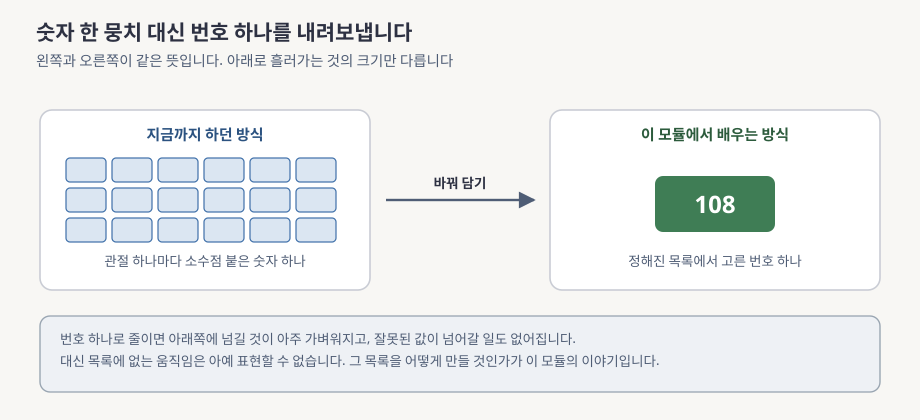
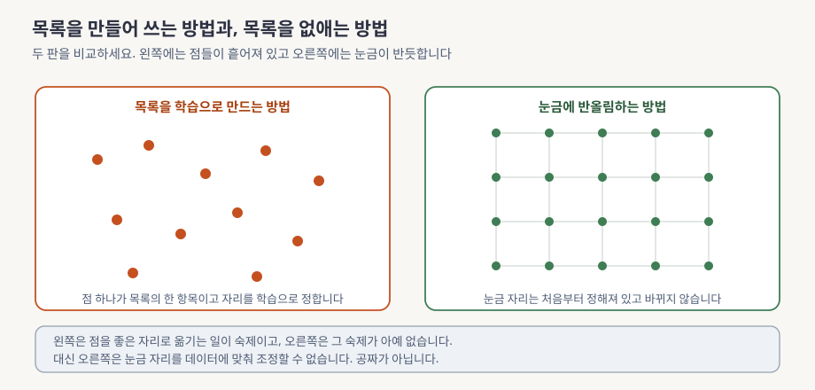
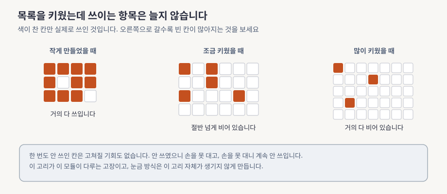

> 본문은 [lesson.md](lesson.md)입니다. 이 문서를 먼저 읽으세요.

# 숫자 뭉치를 번호 하나로 바꾸는 이야기, 쉽게 먼저

> **한 문장으로**: 로봇의 윗머리가 생각한 것을 아랫몸에 넘겨줄 때, 숫자를 한 뭉치 넘기는 대신 번호 하나만 넘기면 무엇이 좋아지고 대신 무엇을 잃는지 그림으로 봅니다.

---

## 이 모듈이 답하는 질문 하나

로봇 하나 안에는 서로 성격이 다른 프로그램이 여럿 들어 있습니다. 주변을 보고 무엇을 할지 정하는 쪽은 생각이 깊은 대신 느립니다. 팔다리를 실제로 움직이는 쪽은 반대로, 생각이 얕은 대신 아주 빠릅니다. 지금까지의 네 모듈에서 우리는 이 둘을 각각 따로 들여다봤습니다.

아직 한 번도 열어보지 않은 자리가 남아 있습니다. **느린 쪽이 정한 것을 빠른 쪽에 무엇에 담아서 건네주는가**, 그것입니다. 이 자리가 비어 있으면 아무리 좋은 부품을 붙여놔도 시스템이 굴러가지 않습니다.

> 위층이 정한 것을 아래층에 어떤 모양으로 넘겨야 서로 갈아 끼울 수 있을까요?

다 읽고 나면 이 물음에 그림 세 장으로 답할 수 있습니다. 회사가 그 자리에 실제로 무엇을 놓아두었는지, 왜 그것을 골랐는지도 같이 보게 됩니다.

---

## 어떤 문제가 있었나

가장 자연스러운 방법부터 생각해봅시다. 위층이 관절마다 「이만큼 굽혀라」라는 숫자를 하나씩 만들어 아래층에 그대로 넘기면 됩니다. 관절이 스물아홉 개면 숫자 스물아홉 개를 넘깁니다. 간단해 보입니다.

이 방법에는 잔고장이 많습니다. 숫자를 넘기려면 양쪽이 미리 합의할 것이 잔뜩 생깁니다. 각도를 어떤 단위로 쓰는지부터 맞아야 합니다. 값의 범위를 어떻게 줄여 담았는지, 관절 순서를 어느 쪽부터 세는지도 전부 맞아야 합니다. 하나라도 어긋나면 프로그램은 아무 불평도 하지 않고 그냥 로봇을 이상하게 움직입니다. 어디가 틀렸는지 찾기도 어렵습니다.

더 성가신 것은 갈아 끼우기입니다. 아래층 프로그램을 더 좋은 것으로 바꾸고 싶어도 위층이 그 숫자 규약에 맞춰 짜여 있으면 위층까지 손을 봐야 합니다. 반대도 마찬가지입니다.

그래서 나온 발상이 이것입니다. **쓸 수 있는 움직임을 미리 목록으로 만들어 두고 위층은 목록의 몇 번째인지만 알려주자.** 그러면 넘기는 값이 번호 하나가 됩니다. 합의할 것도 「번호가 목록 안에 있는가」 하나로 줄어듭니다. 아래층을 바꿔도 번호의 뜻만 유지하면 위층은 그대로입니다. 이 이유 셋은 [lesson.md](lesson.md) §1 「왜 이걸 배우나」에서 하나씩 셉니다.

**읽는 법.** 왼쪽 상자와 오른쪽 상자가 같은 뜻입니다. 왼쪽에는 작은 네모가 잔뜩 있고 오른쪽에는 큰 네모가 하나뿐입니다. 가운데 화살표를 지나면서 넘겨야 할 양이 확 줄어드는 것을 보세요. 맨 아래 회색 띠에 대가가 적혀 있습니다.

---

## 그래서 무엇을 하나

목록으로 바꾸자는 발상이 정해지면 곧바로 이렇게 묻게 됩니다. **그 목록을 누가 어떻게 만드는가**. 답은 둘입니다. 이 모듈은 앞의 답이 어디서 고장 나는지를 보인 다음 뒤의 답으로 넘어갑니다.

### 목록을 만드는 방법 두 가지

오래된 답은 「데이터를 보고 학습으로 만들자」입니다. 자주 쓰이는 움직임들을 대표하는 항목 천 개쯤을 정해둡니다. 그런 다음 학습을 돌리면서 그 항목들이 좋은 자리로 옮겨가게 합니다. 자연스러운 생각이고 오래 쓰였습니다.

나중에 나온 답은 훨씬 심심합니다. 「목록을 만들지 말고 그냥 눈금을 긋자」입니다. 자를 하나 대놓고 눈금을 다섯 개 찍은 다음 어떤 값이 들어오든 가장 가까운 눈금으로 반올림합니다. 눈금은 학습되지 않고 처음부터 그 자리에 있습니다.

**읽는 법.** 두 판을 나란히 보세요. 왼쪽 판의 점들은 아무렇게나 흩어져 있고 그 자리가 학습으로 정해집니다. 오른쪽 판의 점들은 격자 위에 반듯하게 놓여 있고 자리가 고정입니다. 맨 아래 띠에 각각의 숙제와 대가가 한 줄씩 적혀 있습니다.

처음 보면 왼쪽이 당연히 나아 보입니다. 데이터에 맞춰 항목을 옮길 수 있으니 더 잘 맞출 듯합니다. 이 모듈은 **왼쪽 방법에 잘 알려진 고장이 하나 있다는 것**을 보입니다.

### 왼쪽 방법의 고장

고장은 이런 모양입니다. 학습이 돌아가는 동안, 각 항목이 좋은 자리로 옮겨가려면 그 항목이 실제로 한 번이라도 「이게 제일 가깝다」로 뽑혀야 합니다. 뽑히지 않은 항목에는 고칠 근거가 없어서 손을 댈 수가 없습니다.

함정은 여기서 시작합니다. 한 번도 안 뽑힌 항목은 자리가 그대로이고 자리가 그대로이니, 다음에도 안 뽑힙니다. **한 번 여기 빠지면 나올 길이 없습니다.** 목록을 크게 만들수록 실제로 쓰이는 항목의 비율이 오히려 떨어집니다. 늘리려고 늘렸는데 늘린 만큼 놀고 있습니다.

**읽는 법.** 왼쪽에서 오른쪽으로 목록이 커집니다. 색이 찬 칸이 실제로 쓰인 항목이고 흰 칸이 한 번도 안 쓰인 항목입니다. 칸의 총 개수는 늘어나는데 색이 찬 칸의 개수는 거의 그대로인 것을 보세요.

이 고장을 고쳐보려는 시도가 여러 갈래로 나왔습니다. 안 쓰이는 항목을 주기적으로 다른 데로 옮겨 심기도 합니다. 뽑는 방식을 좀 흐릿하게 만들어 안 뽑히던 항목도 조금씩 손이 가게 하기도 합니다. 다만, **손질법이 여러 개 나왔다는 사실이 곧 진단입니다.** 손잡이만 잘 돌리면 되는 문제였다면 이렇게 여러 방법이 따로따로 제안될 이유가 없습니다.

### 그래서 눈금으로 갑니다

오른쪽 방법을 다시 보세요. 눈금은 학습되지 않으니 「좋은 자리로 못 옮겨져서 죽는다」는 일이 애초에 성립하지 않습니다. 고칠 대상이 아닌 것은 고장 날 수도 없습니다.

눈금을 골고루 쓰이게 만드는 쪽은 누구일까요. 답은 「원래 목표가 알아서 시킨다」입니다. 눌러 담는 쪽이 값을 한구석에만 몰아넣으면 서로 다른 입력이 같은 눈금에 겹쳐 붙어버립니다. 그러면 되살리는 쪽이 그 둘을 구분할 수 없어 결과가 나빠집니다. 결과를 좋게 하려면 눌러 담는 쪽이 스스로 눈금 전체에 값을 퍼뜨릴 수밖에 없습니다. 여기서는 그림으로만 말했습니다. 정확히는 [lesson.md](lesson.md) §5.2 「왜 collapse가 원천 차단되는가」에서 다룹니다.

---

## 오늘 만날 개념 5개

본문에서 계속 마주칠 말들입니다. 지금 외울 필요는 없고 한 번 만나두면 읽다가 처음 보는 말이 아닙니다.

**1. 눌러 담기**

숫자 여럿을 몇 개의 숫자로 줄여 담습니다. 신경망 두 개를 마주 보게 붙입니다. 앞쪽은 줄여 담고 뒤쪽은 그것만 보고 원본을 되살리도록 학습시킵니다. 되살리기를 잘하려면 앞쪽이 꼭 필요한 것만 골라 담아야 하므로 결과적으로 압축을 배웁니다.

→ 제대로 배우는 곳은 [lesson.md](lesson.md) §2 「잠재공간과 잠재 확산 모델」입니다.

**2. 번호 하나로 만들기**

줄여 담은 숫자들을 정해진 눈금이나 목록에 붙여 결국 정수 하나로 바꿉니다. 위층과 아래층 사이에 오가는 값이 번호 하나가 되면 합의할 것이 거의 없어집니다. 대신 목록에 없는 움직임은 아예 표현할 수 없습니다.

→ 자세한 이야기는 [lesson.md](lesson.md) §3 「연속에서 이산으로, 무엇을 얻고 무엇을 잃는가」에 있습니다.

**3. 학습되는 목록**

대표 항목들을 모아 놓고 그 자리를 학습으로 정하는 방식입니다. 데이터에 맞춰 항목을 옮길 수 있는 것이 장점입니다. 단점은 안 뽑힌 항목이 영영 안 뽑히는 고장입니다. 이 고장이 목록을 키울수록 심해집니다.

→ 이어지는 곳은 [lesson.md](lesson.md) §4 「VQ-VAE의 학습되는 코드북과 그 대가」입니다.

**4. 고정 눈금**

목록을 만들지 않고 각 축에 눈금을 미리 그어두고 반올림하는 방식입니다. 눈금이 학습 대상이 아니라 죽을 수가 없고 딸려 오던 손질 장치들이 통째로 사라집니다. 이 모듈의 주인공이고 회사가 실제로 쓰는 방식이기도 합니다.

→ 본문에서는 [lesson.md](lesson.md) §5 「코드북을 없앤 FSQ」에서 다룹니다.

**5. 인터페이스**

위층과 아래층이 주고받기로 약속한 형식입니다. 이 약속이 단순할수록 양쪽을 따로 개발하고 따로 교체하기 쉬워집니다. 이 모듈이 내놓는 것은 더 좋은 성능이 아닙니다. 더 단순한 약속입니다.

→ 이 약속 이야기는 [lesson.md](lesson.md) §7 「회사 스택 연결」로 이어집니다.

---

## 이제 lesson.md로

여기까지가 그림으로 잡는 감입니다. 본문에서는 같은 이야기를 세 방향에서 더 정확하게 봅니다.

**숫자를 줍니다.** 눈금 하나의 간격이 로봇 관절에서 몇 도가 되는지 손으로 계산합니다. 목록을 키웠을 때 실제로 몇 퍼센트가 놀고 있었는지, 묶음 하나를 번호 하나로 줄이면 몇 배가 줄어드는지도 전부 마찬가지입니다. 이 문서에서 「줄어듭니다」라고만 한 자리마다 숫자가 붙습니다.

**두 방법을 그림 한 장에 나란히 놓습니다.** 같은 입력이 들어가고 같은 출력이 나오는데 가운데만 다르다는 것을 텐서 모양까지 채워 확인합니다. 그 차이 하나에서 얼마나 많은 것이 파생되는지 세어봅니다.

마지막은 **회사 스택과 잇는 일입니다.** 이 장치가 우리 로봇의 어느 자리에 앉는지, 왜 하필 그 자리인지를 시간 계산으로 확인합니다. 그러고 나서 아직 확인되지 않은 여섯 가지를 팀에 물어볼 질문으로 남깁니다. **모르는 것을 모른다고 적어두는 부분이 이 모듈에서 실제로 가장 쓸모 있는 자리입니다.**

읽는 순서는 §0 「이 모듈 지도」부터입니다. 막히면 §6 「차원까지 채운 아키텍처」로 먼저 건너뛰어도 됩니다. 두 방법의 차이가 그림 한 장에 다 들어 있습니다.
