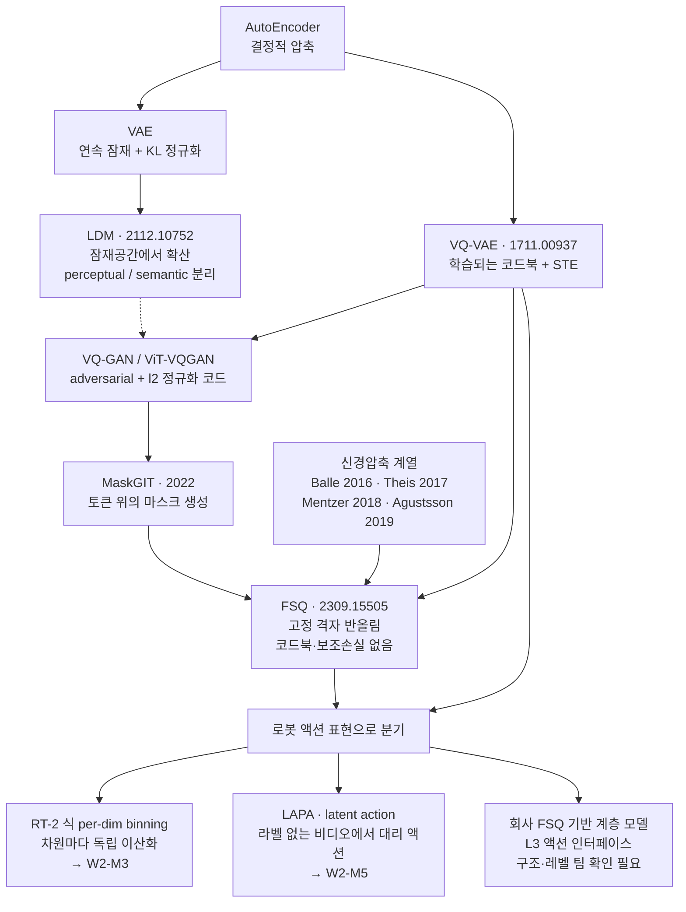
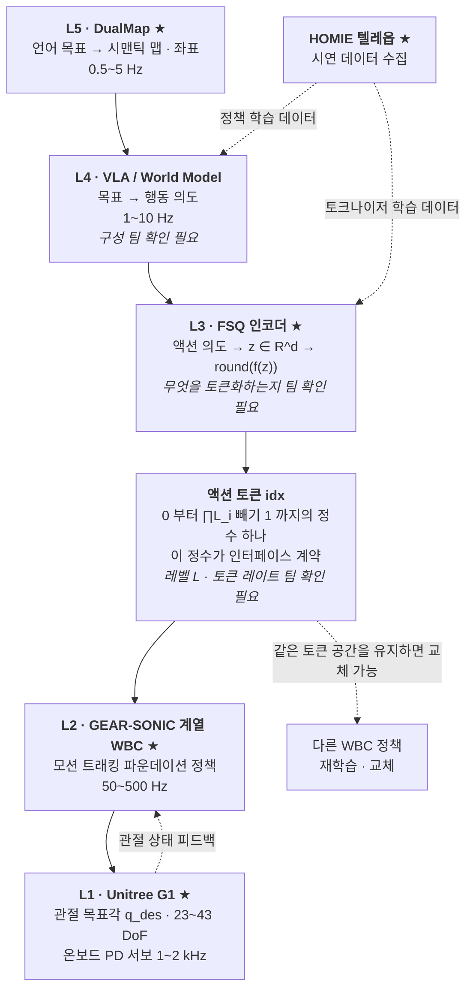
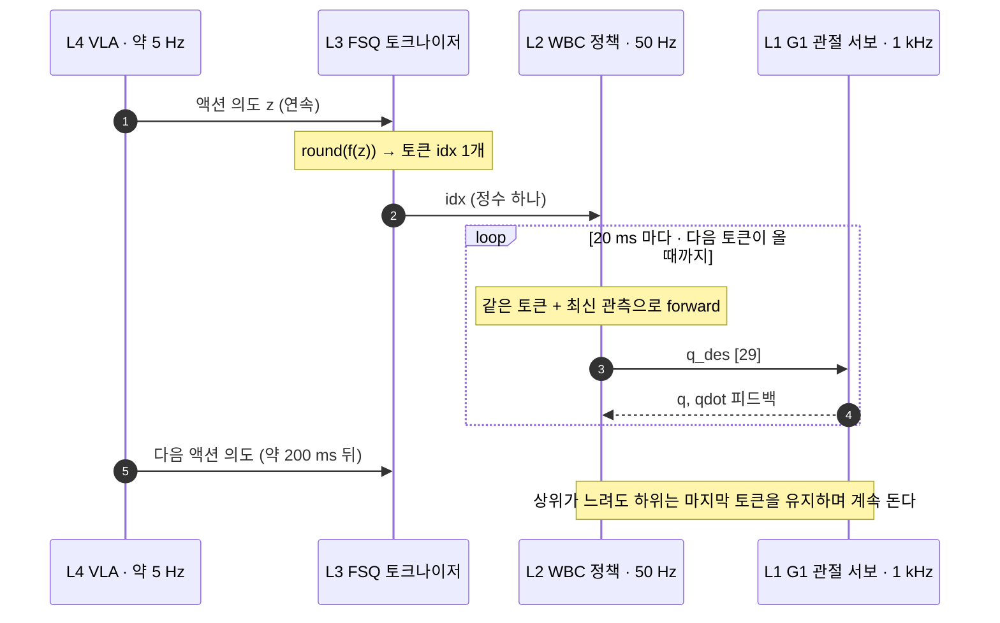

# 잠재공간과 이산화: VAE/LDM → VQ-VAE → FSQ

> **한 줄 요약**: 생성모델이 잠재공간으로 내려간 이유(LDM)에서 출발해, 그 잠재를 이산 토큰으로 바꾸는 두 가지 방식(VQ-VAE의 학습되는 코드북 vs FSQ의 고정 격자)을 수식 수준에서 비교하고 회사가 L3 액션 인터페이스에 왜 FSQ를 골랐는가를 시스템 설계 문제로 답한다.

## 학습 목표

- [ ] LDM이 픽셀 대신 잠재공간에서 확산하는 이유를 perceptual/semantic compression 분리로 설명하고 이 구조가 비디오 월드모델 백본과 VLA 액션 헤드에서 반복되는 이유를 말할 수 있다.
- [ ] 연속 액션 회귀와 이산 액션 토큰의 트레이드오프를 표로 그리고, 이산화의 이득 3가지·손실 3가지를 각각 시스템 관점에서 논증할 수 있다.
- [ ] VQ-VAE의 손실 3항(reconstruction · codebook · commitment)이 각각 무엇을 잡아당기는지 설명하고 codebook collapse가 왜 구조적으로 발생하는지 말할 수 있다.
- [ ] FSQ의 $\hat z = \mathrm{round}(f(z))$를 손으로 쓰고, 코드북이 **학습되지 않기 때문에** collapse가 원천 차단된다는 논리를 재구성 손실 하나로 설명할 수 있다. Table 1의 레벨 구성과 $L_i \ge 5$ 휴리스틱을 근거와 함께 말할 수 있다.
- [ ] FSQ 토큰이 회사 스택 L4↔L2 경계에 앉는 이유를 주파수 예산·디커플링 관점에서 설명하고 **아직 확인되지 않은 것**(무엇을 토큰화하는가·$\mathcal{L}$·토큰 레이트·시간축 처리)을 팀 확인 질문으로 분리해낼 수 있다.

**완료 기준**: 백지에 FSQ와 VQ-VAE의 데이터 흐름을 차원 라벨과 함께 나란히 그리고, "회사가 이 자리에 FSQ를 쓰는 이유"와 "그 선택이 치르는 대가"를 각각 세 문장으로 쓸 수 있다.

**선수 지식**: [W1-M1](../01-physical-ai-landscape/lesson.md)(스택 5계층·주파수 예산·action chunking), [W1-M2](../02-simulator-bootcamp/lesson.md)(G1 관절 29개·`nu=29`), W1-M3(DDPM·DiT) · **소요**: 이론 3h / 실습 3h

---

## 1. 왜 이것을 배우는가

이 모듈은 생성모델 복습이 아닙니다. 회사 스택 L3 그 자체입니다.

[W1-M1 §2.3](../01-physical-ai-landscape/lesson.md)에서 "승부처는 L3"라고 못박았습니다. L4 상위 지능과 L2 전신 제어를 각각 잘 만드는 것보다 둘을 잇는 인터페이스 설계가 시스템 성능과 교체 가능성을 결정한다는 이야기였습니다. 회사는 그 자리에 FSQ 이산 액션 토큰을 놓았습니다. 이 모듈이 끝나면 그 결정을 알고리즘 수준에서 재현할 수 있어야 합니다. 마스터플랜이 이 모듈을 "이번 주 가장 중요한 실습"으로, 시간 부족 시 컷 목록에서 "끝까지 지킬 것"으로 지정한 이유입니다.

### 1.1 왜 하필 이산 토큰인가

연속 setpoint를 넘겨도 되는데 굳이 정수 하나로 바꾸는 이유가 있습니다.

**① 상위 모델이 LLM 그대로여도 된다.** 액션이 유한한 vocabulary의 토큰이면 상위 지능은 next-token prediction을 그대로 씁니다. cross-entropy 손실, teacher forcing, beam/temperature 샘플링, KV 캐시까지 LLM 인프라가 통째로 재사용됩니다. RT-2가 "VLM에 액션 토큰 출력을 붙이면 웹 지식이 전이된다"를 보인 것도 이 트릭이었습니다. FSQ = 액션의 BPE라는 비유는 은유가 아니라 구현 수준의 동형입니다: 연속 신호 → 유한 vocab → 정수 ID 열 → AR 모델.

**② 인터페이스가 정수 하나다.** 연속 인터페이스는 스케일·정규화 규약·차원 순서·단위(rad vs deg)를 상하위가 합의해야 합니다. 그 합의가 어긋나면 로봇이 조용히 잘못 움직입니다([W1-M2 §5.4](../02-simulator-bootcamp/lesson.md)에서 본 인덱스 어긋남 문제의 확대판입니다). 토큰 ID는 그런 협상이 없습니다. 계약이 "0~999 중 하나"로 끝납니다.

**③ 하위 정책을 갈아끼울 수 있다.** 토큰의 의미를 디코더가 쥐고 있으니 같은 토큰 공간을 유지한 채 하위 WBC를 SONIC 계열에서 다른 정책으로 바꾸거나 재학습할 수 있습니다. 상위 모델을 다시 학습시키지 않아도 됩니다.

이것은 setpoint 인터페이스를 표준화하는 일입니다. 상위 감독제어기가 하위 루프에 "밸브 개도 47.3%"를 넘기는 대신 미리 정의된 운전 모드 번호를 넘기는 구조와 같습니다. 표현력은 줄어듭니다. 대신 인터페이스가 검증 가능해지고 하위 루프 구현을 바꿔도 상위가 무사합니다.

---

## 2. 잠재공간과 LDM

AE·VAE·ELBO·재파라미터화는 이미 아는 것으로 전제하고 건너뜁니다. 여기서 필요한 것은 LDM(arXiv:2112.10752)이 무엇을 분리했는가 하나입니다.

픽셀 공간에서 확산 모델을 학습하면 대부분의 연산이 사람 눈에 보이지도 않는 고주파 디테일(텍스처, 센서 노이즈)을 복원하는 데 낭비됩니다. LDM은 이 작업을 두 단계로 쪼갭니다. 먼저 VAE(또는 VQ-GAN) 오토인코더가 perceptual compression을 맡습니다. 지각적으로 무의미한 고주파를 버리고 이미지를 저해상도 잠재 $z$로 내리는 일입니다. 그 다음 확산 모델이 그 잠재공간에서만 semantic compression, 즉 의미 있는 구조의 분포를 학습합니다. 확산 모델은 자기가 잘하는 일에만 파라미터와 FLOPs를 씁니다.

로봇 쪽에서 이 구조가 중요한 이유는 이렇습니다.

- **비디오 월드모델의 백본이 이 구조입니다.** 프레임을 통째로 픽셀 확산하는 것은 비용이 감당되지 않습니다. 그래서 비디오 토크나이저(공간+시간 압축) 위에서 생성 모델을 돌립니다. → W4-M2(Cosmos/WFM)에서 다시 만납니다.
- **VLA의 액션 헤드도 같은 발상입니다.** 관측 전체를 다루는 대신 압축된 잠재 위에서 DiT나 Flow Matching이 액션 청크를 생성합니다(W1-M3, W1-M4).

이 오토인코더의 잠재를 연속으로 둘 것인가 이산으로 만들 것인가가 이 모듈의 갈림길입니다. LDM 논문 자체가 KL 정규화 버전과 VQ 정규화 버전을 둘 다 실험했습니다.

### 2.1 계보



---

## 3. 연속 → 이산, 무엇을 얻고 무엇을 잃는가

액션 표현의 선택지는 크게 셋입니다. 연속 회귀(Diffusion Policy·π0의 Flow Matching 헤드), 차원별 독립 binning(RT-2·OpenVLA), 벡터 양자화 토큰(VQ·FSQ).

| 축 | 연속 회귀 (DP · π0 FM 헤드) | per-dim binning (RT-2 · OpenVLA) | 벡터 양자화 토큰 (VQ · FSQ) |
|---|---|---|---|
| 표현 | $a \in \mathbb{R}^{H \times D}$ 직접 생성 | 차원마다 독립 이산화, 토큰 $D$개/스텝 | 벡터 전체를 코드 1개(또는 소수)로 |
| 상위 모델 | 확산/FM 헤드 필요 | AR LM 그대로 | AR LM 그대로 |
| 분해능 | 부동소수점 | bin 폭이 상한 | 코드북 크기가 상한 |
| 차원 간 상관 | 헤드가 공동 모델링 | **독립 가정 — 관절 간 상관을 잃음** | 코드가 조합을 통째로 담음 |
| 토큰 길이 | — | $H \times D$개 (G1이면 스텝당 29개) | 훨씬 짧음 |
| 다봉 분포 | 확산/FM으로 표현 가능 | 가능(softmax) | 가능(softmax) |
| 대표 약점 | AR 인프라와 겉돎, 샘플링 스텝 비용 | 시퀀스 폭발 + 차원 독립 가정 | 양자화 오차, 토크나이저 학습 필요 |

**이산화가 주는 것**: 우선 AR LM 인프라를 그대로 재사용합니다. 다봉 분포도 softmax로 명시해 표현합니다(회귀는 평균으로 뭉갭니다). 인터페이스가 단순해집니다. 마지막은 압축입니다. 상위→하위 대역폭이 크게 줄어듭니다.

**이산화가 가져가는 것**: ① 양자화 오차. 유한 코드북에 없는 액션은 표현할 수 없습니다. ② 분해능 상한. 코드북 크기가 곧 표현 가능한 액션 수입니다. ③ 시간축 처리 부담. 프레임마다 토큰을 뽑으면 시퀀스가 길어지고 청크로 묶으면 청크 내부 해상도를 잃습니다.

제어 배경이면 익숙한 구도입니다. DAC 분해능과 같습니다. 12비트 DAC로 액추에이터를 구동하면 명령은 $2^{12}$개 격자 위에만 존재합니다. 격자 간격보다 작은 보정은 낼 수 없습니다. 격자 간격이 너무 크면 제어기가 두 격자 사이에서 진동하거나(리미트 사이클) 아예 반응하지 않는 데드밴드가 생깁니다. 이산 액션 토큰이 정확히 같은 문제를 갖습니다. 다만 로봇에서는 하위 WBC가 토큰 사이를 시간적으로 보간·추종하기 때문에 최종 관절 명령까지 계단이 되지는 않습니다(§7의 오해 3번).

RT-2식 per-dim binning의 한계는 위 표의 두 줄에 압축돼 있습니다: 차원 독립 가정과 시퀀스 폭발. G1 29관절에 스텝당 29토큰, 청크 16스텝이면 464토큰입니다. 이 문제와 대안(FAST의 DCT, VQ/FSQ 토큰, latent action)은 W2-M3와 W2-M5에서 다룹니다.

---

## 4. VQ-VAE의 학습되는 코드북과 그 대가

VQ-VAE(arXiv:1711.00937)는 인코더 출력 $z \in \mathbb{R}^d$를 학습 가능한 코드북 $\mathcal{C} = \{c_1, \dots, c_{|\mathcal{C}|}\}$, $c_j \in \mathbb{R}^d$의 최근접 원소로 스냅합니다.

$$
k = \arg\min_{j} \| z - c_j \|_2, \qquad z_q = c_k
$$

$\arg\min$은 미분 불가능합니다. 여기서 straight-through estimator(STE, Bengio 2013)가 들어갑니다. 순전파는 양자화된 값을 쓰고, 역전파는 양자화가 없었던 것처럼 그래디언트를 그대로 통과시킵니다. 제어 용어로 옮기면 비선형 요소를 루프 해석을 위해 국소 선형화하는 것과 같은 발상입니다. 실제 플랜트에는 백래시·포화가 있지만 설계 단계에서는 이득 1의 선형 요소로 놓고 루프를 닫습니다. 그 익숙한 트릭입니다.

손실은 세 항입니다.

$$
\mathcal{L} = \underbrace{\|x - \hat x\|^2}_{\text{reconstruction}} + \underbrace{\|\,\mathrm{sg}[z] - c_k\|^2}_{\text{codebook}} + \beta \underbrace{\|z - \mathrm{sg}[c_k]\|^2}_{\text{commitment}}
$$

- **reconstruction**: 인코더·디코더를 학습시킵니다. 정보를 잃지 말라는 압력.
- **codebook**: 코드워드를 자기에게 할당된 인코더 출력들의 중심으로 끌어당깁니다(사실상 온라인 k-means). EMA 업데이트로 대체하기도 합니다.
- **commitment**: 반대 방향입니다. 인코더 출력이 코드워드에서 너무 멀리 도망가지 않게 붙잡습니다. $\beta$로 세기를 조절합니다.

### 4.1 codebook collapse — 왜 구조적인가

문제는 두 번째 항입니다. 코드워드 $c_j$는 자기에게 할당된 샘플이 있을 때만 그래디언트를 받습니다. 초기화가 나빠 어떤 코드워드가 한 번도 최근접으로 뽑히지 않으면 그 코드워드는 영원히 업데이트되지 않습니다. 업데이트되지 않으니 앞으로도 뽑히지 않습니다. 뽑히지 않아서 학습이 안 되고 학습이 안 돼서 뽑히지 않는 닭-달걀 구조입니다. 그래서 코드북을 키우면 오히려 실사용 코드워드 비율(usage)이 떨어집니다. FSQ 논문이 지목한 VQ의 1번 문제가 under-utilized codebooks입니다.

이건 상태공간에서 한 번도 방문되지 않는 영역의 문제입니다. 식별 실험에서 여자(勵磁, excitation)가 부족해 특정 모드가 관측되지 않으면 그 모드의 파라미터는 끝내 수렴하지 않습니다. persistent excitation 조건이 깨진 상태와 같습니다.

대응 트릭은 문헌에 이렇게 쌓였습니다.

| 트릭 | 출처 | 발상 |
|---|---|---|
| 코드북 재초기화 | Łańcucki 2020 | 죽은 코드워드를 데이터로 다시 심기 |
| random restarts | Dhariwal 2020 | 안 쓰이는 코드워드를 랜덤 샘플로 교체 |
| 확률적 양자화 | Takida 2022 | 결정적 $\arg\min$ 대신 확률적 할당 |
| $\ell_2$ 정규화 + 저차원 코드 매핑 | Yu 2021 (ViT-VQGAN) | 코드 공간을 구면 저차원으로 |
| 재파라미터화 · 교대 최적화 | Huh 2023 | 최적화 문제 자체를 다시 세우기 |
| entropy loss | 다수 | 코드 사용 분포의 엔트로피를 직접 최대화 |

우회로가 6가지나 나왔다는 것 자체가, 문제가 하이퍼파라미터 튜닝의 영역이 아니라 설계에서 온다는 신호입니다. FSQ의 출발점이 정확히 여기입니다.

### 4.2 코드북의 비용

코드북은 파라미터입니다. $|\mathcal{C}| = 2^{12} = 4096$, $d = 512$면 코드북만 $4096 \times 512 = $ 약 2M 파라미터입니다. 여기에 EMA 버퍼, 사용량 카운터, 재초기화 로직이 따라붙습니다. 인터페이스 관점에서 더 불편한 것은 이 텐서가 상위와 하위의 공유 상태라는 점입니다. 토크나이저를 재학습하면 코드북이 바뀌고, 같은 토큰 ID가 다른 것을 의미하게 됩니다.

---

## 5. 코드북을 없앤 FSQ

**Finite Scalar Quantization: VQ-VAE Made Simple** (arXiv:2309.15505v2, Mentzer·Minnen·Agustsson·Tschannen, Google Research/DeepMind). 아이디어는 한 문장입니다: 잠재를 아주 낮은 차원으로 내린 뒤, 각 채널을 고정된 정수 격자에 반올림한다.

### 5.1 수식

$d$차원 표현 $z \in \mathbb{R}^d$에 바운딩 함수 $f$를 적용하고 정수로 반올림합니다.

$$
\hat z = \mathrm{round}(f(z)), \qquad f: z_i \mapsto \left\lfloor L/2 \right\rfloor \tanh(z_i)
$$

$\tanh$가 값을 $(-1, 1)$로 누르고 $\lfloor L/2 \rfloor$가 그것을 $L$개 정수 격자의 폭으로 늘립니다. 그 다음 반올림하면 각 채널이 $L$개 값 중 하나를 취하므로 implied codebook이 $|\mathcal{C}| = L^d$가 됩니다. 채널마다 레벨을 다르게 두면 $\mathcal{L} = [L_1, \dots, L_d]$이고 $|\mathcal{C}| = \prod_{i=1}^{d} L_i$입니다.

- 원문 Fig 1 예시: $d = 3$, $L = 3$이면 $\mathcal{C} = \{(-1,-1,-1), (-1,-1,0), \dots, (1,1,1)\}$, $|\mathcal{C}| = 27$.
- $\mathcal{C}$의 원소는 $\{1, \dots, L^d\}$ 정수와 전단사(bijection)로 열거됩니다. 그래서 LLM식 토큰 ID로 바로 쓸 수 있습니다. 이 성질이 §1.1의 이유 ①·②를 직접 뒷받침합니다.
- 그래디언트는 VQ와 똑같이 STE입니다: `round_ste: x ↦ x + sg(round(x) - x)`. 순전파는 반올림 값, 역전파는 항등 함수의 그래디언트 1.
- 짝수 $L$을 지원하려면 비대칭 $f$가 필요합니다(양자화가 정수로 반올림되므로 격자 중심이 어긋납니다). 일반형 $f$는 원문 부록 A.1에 코드로 제시돼 있습니다.

격자는 $\mathcal{L}$이라는 하이퍼파라미터로 고정돼 있을 뿐 학습되지 않습니다. 코드북이 없습니다.

### 5.2 왜 collapse가 원천 차단되는가

코드북이 학습되지 않으므로 §4.1의 닭-달걀 고리가 성립하지 않습니다. 격자점은 인코더가 그쪽으로 출력을 보내든 말든 그 자리에 있고 파라미터가 아니므로 죽을 수가 없습니다.

그러면 사용률은 무엇이 강제하는가? 재구성 손실 하나입니다. 인코더가 출력을 격자의 좁은 영역에만 몰아넣으면 서로 다른 입력이 같은 격자점으로 붕괴합니다. 디코더는 그것들을 구분할 수 없어 복원이 나빠집니다. 재구성 손실을 낮추려면 인코더는 스스로 표현을 격자 전체에 퍼뜨릴 수밖에 없습니다. 보조 손실도 재초기화도 EMA도 필요 없습니다. 논문이 §2 말미에 밝힌 설계 목표도 같습니다. 보조 손실을 없애고, 설계상(by design) 코드북 사용률을 높게 가져가고, VQ의 drop-in replacement가 되도록 기능적 셋업을 유지한다는 것입니다.

### 5.3 권장 레벨 구성 — 원문 Table 1

| Target Size $\|\mathcal{C}\|$ | $2^8$ | $2^{10}$ | $2^{12}$ | $2^{14}$ | $2^{16}$ |
|---|---|---|---|---|---|
| Proposed $\mathcal{L}$ | `[8, 6, 5]` | `[8, 5, 5, 5]` | `[7, 5, 5, 5, 5]` | `[8, 8, 8, 6, 5]` | `[8, 8, 8, 5, 5, 5]` |

직접 검산하면 곱이 target과 정확히 같지 않습니다. $8 \cdot 6 \cdot 5 = 240 \approx 256$, $8 \cdot 5^3 = 1000 \approx 1024$, $7 \cdot 5^4 = 4375 \approx 4096$, $8^3 \cdot 6 \cdot 5 = 15360 \approx 16384$, $8^3 \cdot 5^3 = 64000 \approx 65536$. 논문 표현도 "approximately match"입니다. 코드북 크기가 2의 거듭제곱이어야 할 이유가 없기 때문입니다. 관행일 뿐입니다.

**휴리스틱: 모든 $i$에 대해 $L_i \ge 5$** (원문 §3.2). 논문은 모든 $\mathcal{L}$ 선택이 최적은 아니며 이 규칙이 실험 전반에서 잘 동작했다고만 서술합니다. 직관적으로는 레벨이 2~3인 채널은 정보를 거의 못 담으면서 차원만 늘려 인코더 부담을 키웁니다.

### 5.4 차원의 역전

| | VQ | FSQ |
|---|---|---|
| Quantization | $\arg\min_{c \in \mathcal{C}} \|z - c\|$ | $\mathrm{round}(f(z))$ |
| Gradients | STE | STE |
| Aux. Losses | Commitment, codebook, entropy loss | **-** |
| Tricks | EMA on codebook, codebook splitting, projections, … | **-** |
| Parameters | Codebook | **-** |

*(원문 Fig 2 왼쪽 표)*

여기에 차원 규모가 붙습니다. FSQ는 $d < 10$이 보통, VQ는 $d \ge 512$가 보통입니다. 처음 보면 역설처럼 느껴집니다. 512차원 벡터로 하던 일을 4차원으로 한다고?

조합 폭발 때문입니다. VQ의 코드북은 $d$차원 공간에 흩뿌려진 $|\mathcal{C}|$개의 점입니다. 그 점들을 학습으로 좋은 위치에 놓아야 하니 표현력을 내려면 $d$가 커야 합니다. FSQ는 반대로 각 채널을 독립적으로 $L_i$등분해 격자의 곱으로 코드를 만듭니다. $\mathcal{L} = [8,5,5,5]$면 $d = 4$인데 코드는 1000개입니다. 채널을 하나 더 붙일 때마다 코드 수가 $L$배로 뜁니다. 저차원 + 곱 구조가 고차원 + 학습 구조를 대신하는 셈입니다.

부수 효과로 파라미터가 줄어듭니다. 코드북 2M이 사라집니다. 인코더 최종 레이어도 출력 차원이 $d$로 작아 함께 줄어듭니다. 논문은 이 격차를 메우려고 dense 레이어를 더 붙여봤지만 추가 이득이 없었다고 보고합니다. 결론: 같은 코드북 크기에서 FSQ가 파라미터가 더 적습니다.

### 5.5 실험 결과를 공정하게 읽기

적용처는 MaskGIT(이미지 생성)와 UViM(depth estimation·colorization·panoptic segmentation)입니다. 성능 저하는 0.5~3% 수준입니다. 코드북 사용률은 대부분의 모델에서 약 100%를 보조 손실 없이 달성했습니다.

MaskGIT ImageNet 256 결과 (원문 Fig 4 상단):

| Model | Source | CFG | Sampling FID↓ | Precision↑ | Recall↑ | Usage↑ |
|---|---|---|---|---|---|---|
| MaskGIT (VQ) | Ours | 0.1 | 4.509 | 0.860 | 0.465 | **81%** |
| MaskGIT (FSQ) | Ours | 0.2 | 4.534 | 0.864 | 0.453 | **100%** |
| MaskGIT (VQ) | GitHub | - | 4.916 | 0.836 | 0.489 | — |
| ADM (Dhariwal & Nichol 2021) | — | 1.5 | 4.59 | 0.83 | 0.52 | — |

여기서 FSQ는 $\mathcal{L} = [8,5,5,5]$(Table 1의 $2^{10}$ 행), VQ는 코드북 1024(10 bits) + entropy loss입니다. 학습은 Stage I 1M steps(batch 512), Stage II 2.5M steps(batch 256), 추론 12 스텝. FSQ는 보정 전 recall이 높고 precision이 낮은 지점에 착지합니다. 그래서 CFG를 VQ보다 강하게(0.2 vs 0.1) 걸어 보정한 결과가 위 표입니다.

FID는 사실상 동률(4.509 vs 4.534)입니다. 갈리는 것은 "코드북을 얼마나 쓰는가"와 "그 결과를 얻기 위해 얼마나 많은 장치가 필요한가"입니다. 이 모듈의 대표 숫자는 FID가 아니라 코드북 사용률 81% vs 100%입니다.

> ⚠️ **"FSQ가 항상 낫다"는 틀린 요약입니다.** 원문 Fig 3의 내용은 이렇습니다. 코드북 크기가 $2^{10}$을 **넘어서면** FSQ가 Sampling FID와 코드북 사용률에서 VQ를 앞서고 VQ는 오히려 지표가 악화되지만 **그 이하의 작은 코드북에서는 VQ가 더 낫습니다.** 논문의 주장은 "대형 코드북에서 더 단순한 방법으로 더 잘 쓴다"이지 "우월하다"가 아닙니다. Reconstruction FID는 코드북 크기와 상관되며 FSQ는 코드북을 키울수록 개선됩니다.

논문 스스로 밝히듯 FSQ의 뿌리는 신경압축 계열(Ballé 2016, Theis 2017, Mentzer 2018은 $d{=}16, L{=}5$, Agustsson 2019는 $d{=}5, L{=}5$)입니다. "FSQ has not been used for vision tasks outside of compression"이라는 문장이 이 논문의 기여를 요약합니다. 새 알고리즘이 아니라 압축 분야의 오래된 도구를 생성모델 토크나이저 자리에 앉힌 것입니다.

---

## 6. 아키텍처 — 차원까지 채워서

아래는 G1 관절 궤적을 토큰화한다면 어떤 모양이 되는지를 예시 시나리오로 채운 것입니다. 회사 구현이 아니라 이 모듈 실습(W1-M5 practice)의 설계입니다. 차원 감각을 잡기 위한 것입니다.

```
■ FSQ 경로 ─ 코드북 텐서가 없다
════════════════════════════════════════════════════════════════════════════════
  입력                      인코더            바운딩                반올림
  x ∈ R^[T=16, 29]  ───>  z ∈ R^[d=4]  ───>  f(z) ∈ R^[4]  ───>  ẑ ∈ Z^[4]
   T  = 청크 길이           Enc_θ          f: z_i ↦ ⌊L_i/2⌋·tanh(z_i)   round_ste
   29 = G1 관절 수                          채널 i를 L_i 레벨 안으로 압착
        (W1-M2 실측 nu=29)
                                          L = [8, 5, 5, 5]
                                          ẑ_1 ∈ {0..7},  ẑ_2..4 ∈ {0..4}
                                                  │
                          전단사 열거              ▼
                          idx = ẑ_1 + 8·(ẑ_2 + 5·(ẑ_3 + 5·ẑ_4))
                          토큰 ID  idx ∈ {0, ..., 999}
                                   |C| = ∏ L_i = 8·5·5·5 = 1000  →  log2(1000) = 9.97 bits
                                                  │
                                                  ▼
                          디코더   Dec_φ(ẑ) ───> x̂ ∈ R^[16, 29]
  학습 파라미터: Enc_θ + Dec_φ.  보조 손실: 없음.  코드북: 없음.
  손실:  L = ||x - x̂||²                        ← 이 한 항이 사용률까지 강제한다
════════════════════════════════════════════════════════════════════════════════

■ VQ-VAE 경로 ─ 같은 입력, 코드북 텐서가 추가된다
════════════════════════════════════════════════════════════════════════════════
  x ∈ R^[16, 29] ───> Enc_θ ───> z ∈ R^[d=512]
                                       │
                                       │  k = argmin_j || z − C_j ||₂
              코드북 C ∈ R^[|C|=1024, 512]      ← 학습되는 파라미터 524,288개
              (논문 예시 |C|=2^12, d=512 면 약 2M)  + EMA 버퍼 + 사용량 카운터
                                       │
                                       ▼
                         z_q = C_k ∈ R^[512] ───> Dec_φ ───> x̂ ∈ R^[16, 29]
                         토큰 ID = k ∈ {0..1023}
  손실:  L = ||x − x̂||²  +  ||sg[z] − C_k||²  +  β·||z − sg[C_k]||²
              재구성           코드북             commitment
  + 필요시: 재초기화 / random restart / entropy loss / l2 정규화 …
════════════════════════════════════════════════════════════════════════════════
```

두 그림의 유일한 구조적 차이는 가운데 코드북 텐서의 유무입니다. 그 하나에서 보조 손실·트릭·파라미터·재학습 시 토큰 의미 변화가 전부 따라옵니다.

압축률 감각도 여기서 잡아두면 좋습니다. G1 한 프레임은 float32 29개 = 928 bits입니다. 청크 16프레임이면 14,848 bits. 이것을 토큰 하나(9.97 bits)로 보내면 압축률 약 1,489배입니다. 압축률이 크다는 것은 그만큼 버린다는 뜻입니다. 무엇을 버려도 되는지를 결정하는 것이 토크나이저 설계입니다.

---

## 7. 회사 스택 연결 ★

### 7.1 FSQ가 앉는 자리



### 7.2 왜 하필 이 경계인가

[W1-M1 §3](../01-physical-ai-landscape/lesson.md)에서 세운 부등식이 여기서 다시 쓰입니다. L4는 1~10 Hz, L2는 50~500 Hz입니다. 상위가 한 번 생각하는 동안 하위는 수십 번 돌아야 합니다. 그 사이 하위에게 먹일 명령이 끊기면 로봇은 명령 공백에 빠집니다.

인터페이스가 토큰이면 이 문제가 자연스럽게 완화됩니다. 하위 정책은 마지막으로 받은 토큰을 자기 관측과 함께 계속 소비하면서 50~500 Hz로 돌 수 있습니다. 상위가 늦어도 "지금 무엇을 하라는 것인가"는 유지됩니다. 연속 궤적 청크를 넘기는 경우 청크가 소진되면 끝이지만 토큰은 모드/의도의 라벨에 가까워 홀드가 의미를 갖습니다.



> ⚠️ 위 타이밍 다이어그램은 일반적 계층 구조의 논리를 그린 것이며 회사 구현의 실제 토큰 레이트·홀드 정책이 아닙니다. §7.4의 확인 대상입니다.

세 번째 이점인 디커플링도 같은 그림에서 읽힙니다. 토큰의 의미를 하위가 해석하는 한, 하위 정책을 다시 학습하거나 다른 정책으로 갈아끼워도 상위는 그대로입니다. 반대로 **토크나이저를 재학습하면 토큰 ID의 의미가 바뀌므로 상하위를 동시에 갱신해야 합니다.** 인터페이스 버전 관리 문제가 생깁니다. FSQ가 여기서 유리한 점이 하나 있습니다. 격자가 고정이라 코드 자체는 학습 대상이 아닙니다. 바뀌는 것은 인코더·디코더의 매핑뿐입니다.

### 7.3 SONIC의 "universal token space"와의 관계

마스터플랜 §2.2는 SONIC(arXiv:2511.07820)의 핵심을 "universal token space"로 정리합니다. 그것이 VLA·VR 텔레옵·게임패드 kinematic planner를 하나의 정책에 물리는 장치라고 봅니다. 이 해석대로면 SONIC의 토큰 공간과 회사의 FSQ 토큰이 만나는 지점이 곧 L3↔L2 접점입니다.

> 📌 **이것은 마스터플랜의 해석이고 SONIC 논문을 직접 확인하는 것은 W3-M4입니다.** 이 모듈에서는 "그런 접점이 있을 것"이라는 가설까지만 세워두고, 실제 SONIC 정책의 입력이 무엇인지는 W3-M4에서 논문으로 검증합니다.

### 7.4 확인되지 않은 것

| 항목 | 무엇이 궁금한가 | 왜 중요한가 | 상태 |
|---|---|---|---|
| 토큰화 대상 | 관절 각도? 관절 속도? 궤적 청크? latent motion? | 인코더 입력 차원과 실습 설계가 여기서 갈림 | 🔴 미확인 |
| 레벨 $\mathcal{L}$과 $d$ | Table 1 계열인가, 자체 튜닝인가 | 코드북 크기 = 표현 가능한 의도의 수 | 🔴 미확인 |
| 토큰 레이트 | 초당 몇 토큰인가. L4 호출당 1개? N개? | §7.2 부등식을 실수로 채우는 데 필요 | 🔴 미확인 |
| 시간축 처리 | 프레임당 1토큰인가, 청크당 N토큰인가 | 청크 내부 해상도와 반응성의 트레이드오프 | 🔴 미확인 |
| 학습 데이터 | 텔레옵(HOMIE)? 모캡 리타게팅? 시뮬 롤아웃? | 토큰 공간이 무엇의 분포를 덮는지 결정 | 🔴 미확인 |
| SONIC 접점 | 토큰이 WBC 입력의 어느 자리로 들어가는가 | L3↔L2 계약의 실체 | 🔴 미확인 |

---

## 8. 흔한 오해 4가지

| 오해 | 교정 |
|---|---|
| **"FSQ는 VQ의 상위호환이다"** | 원문 Fig 3이 반박합니다. 코드북 $2^{10}$ **이하**에서는 VQ가 더 낫고, FSQ의 우위는 그보다 **큰 코드북**에서 나타납니다. 그리고 FSQ 적용 시 성능 저하는 0.5~3% 수준으로 보고됐습니다 — 공짜가 아닙니다. 논문의 주장은 "대형 코드북에서 훨씬 단순한 장치로 코드북을 더 잘 쓴다"입니다. 시스템 관점의 진짜 이득은 FID 소수점이 아니라 **보조 손실·트릭·코드북 파라미터가 통째로 사라지는 것**입니다. |
| **"코드북 사용률 100%면 표현력이 최대다"** | 사용률은 **필요조건이지 충분조건이 아닙니다.** 모든 코드가 쓰이더라도 그것이 데이터의 중요한 변동 방향을 담고 있는지는 별개 문제이고, 그래서 논문도 usage와 별도로 Reconstruction FID·Sampling FID를 함께 봅니다. 제어로 옮기면 "모든 DAC 코드를 쓰고 있다"와 "그 코드 배치가 제어에 필요한 분해능을 주고 있다"는 다른 질문입니다. |
| **"이산 토큰이면 정보가 손실되니 정밀 제어가 불가능하다"** | 계층을 혼동한 오해입니다. 토큰은 **의도의 해상도**이지 관절 명령의 해상도가 아닙니다. 하위 WBC가 50~500 Hz로 돌면서 관측 피드백을 받아 연속적인 $q_{des}$를 만들고, 그 아래 온보드 PD 서보가 1~2 kHz로 추종합니다([W1-M1 §2.3](../01-physical-ai-landscape/lesson.md)). 상위가 "이 모드로 가라"를 이산으로 주고 하위가 연속으로 실현하는 구조입니다. **단, 이것이 회사 구현에서 실제로 어떻게 되는지는 §7.4대로 미확인입니다.** 양자화 오차가 사라지는 것도 아닙니다 — 토큰 공간이 표현하지 못하는 의도는 애초에 상위가 보낼 수 없습니다. |
| **"$\|\mathcal{C}\| = \prod L_i$ 니까 레벨을 크게 하면 그냥 좋다"** | 두 가지가 걸립니다. 첫째, $L_i \ge 5$ 휴리스틱은 하한이지 "클수록 좋다"가 아닙니다 — Table 1의 권장 구성은 $L_i$를 무한정 키우는 대신 **채널 수를 늘려** 목표 크기에 도달합니다($2^{16}$ 행이 $[8,8,8,5,5,5]$인 것을 보세요). 둘째, 코드북을 키우면 그만큼 상위 모델의 출력 vocabulary가 커지고 학습 데이터가 더 필요해집니다. 표현력과 학습 가능성의 트레이드오프입니다. |

---

## 9. 팀에 물어볼 것

> `notes/questions-for-team.md`의 W1 섹션에 복사할 것. P0 3번("FSQ 모델의 실제 구조는?")을 실행 가능한 수준으로 쪼갠 후속 질문입니다.

1. **FSQ 토크나이저의 입력은 정확히 무엇인가?** 관절 각도 벡터인가, 각속도를 포함한 상태인가, $T$ 스텝짜리 궤적 청크인가, 아니면 상위 모델이 만든 latent motion인가? 정규화 규약(관절 range 기준? 표준화?)은 무엇인가? 이 답이 W1-M5 실습과 W2-M5 설계 논증의 입력 차원을 결정합니다.
2. **시간축을 어떻게 다루는가: 프레임당 1토큰인가, 청크당 N토큰인가?** 그리고 **토큰 레이트는 초당 몇 개인가?** 상위 L4가 몇 Hz로 새 토큰을 내고, 하위가 그 사이를 어떻게 메우는가(마지막 토큰 홀드? 보간? 토큰 큐?) — [W1-M1 §3](../01-physical-ai-landscape/lesson.md)의 지연 예산 부등식을 실수로 채우려면 이 값들이 필요합니다.
3. **레벨 구성 $\mathcal{L}$과 차원 $d$는 무엇인가?** FSQ 원논문 Table 1의 권장값($[8,5,5,5]$ 등)을 그대로 쓰는가, 액션 도메인에 맞춰 재탐색했는가? 코드북 크기를 정한 근거는 무엇인가?
4. **토크나이저 학습 데이터는 무엇인가?** HOMIE 텔레옵 수집분인가, 모캡 리타게팅 궤적인가, 시뮬 롤아웃인가, 혼합인가? 토큰 공간이 덮지 못하는 동작 영역(예: 고속 동작, 접촉 풍부 조작)이 알려져 있는가?
5. **토큰이 SONIC 계열 WBC 정책의 입력 어느 자리로 들어가는가?** 관측 벡터에 concat되는가, 별도 조건 입력인가, 아니면 토큰을 먼저 연속 레퍼런스로 디코딩해서 넣는가? (P0 2번의 구체화. W3-M4 SONIC 정독 전에 답을 받아두면 논문 읽는 속도가 달라집니다.)
6. **토크나이저를 재학습하면 상위 모델도 함께 재학습하는가?** 토큰 ID의 의미가 바뀌는 문제를 어떻게 관리하는가? 인터페이스 버전이 있는가?

---

## 10. 셀프 체크 퀴즈

1. LDM이 픽셀 공간 대신 잠재공간에서 확산하는 이유를 perceptual/semantic compression으로 설명하라. 이 구조가 비디오 월드모델에서 반복되는 이유는?
2. 이산 액션 토큰이 인터페이스로서 갖는 시스템적 이점 3가지를 들고 각각을 제어의 setpoint 인터페이스 표준화에 대응시켜라.
3. VQ-VAE 손실 3항을 쓰고 각 항이 무엇을 어느 방향으로 끌어당기는지 설명하라. `sg[·]`가 각 항에 걸린 위치가 왜 다른가?
4. codebook collapse가 왜 하이퍼파라미터 문제가 아니라 구조적 문제인지 닭-달걀 논리로 설명하라. 이 현상의 제어 쪽 대응 개념은?
5. FSQ의 $\hat z = \mathrm{round}(f(z))$에서 $f$의 역할을 두 가지로 나눠 설명하라. STE가 없으면 무엇이 안 되는가?
6. FSQ에서 codebook collapse가 원천 차단되는 이유를 **보조 손실을 언급하지 않고** 재구성 손실만으로 설명하라.
7. **(계산)** Table 1의 $2^{12}$ 행은 $\mathcal{L} = [7,5,5,5,5]$다. $|\mathcal{C}|$를 계산하고 target $2^{12}$와 비교하라. 왜 정확히 일치시키지 않는가?
8. **(계산)** VQ-VAE에서 $|\mathcal{C}| = 2^{12}$, $d = 512$일 때 코드북 파라미터 수는? 같은 코드북 크기의 FSQ는 몇 개인가?
9. **(계산)** G1 관절 29개짜리 프레임 16개(float32)를 $\mathcal{L} = [8,5,5,5]$ FSQ 토큰 1개로 압축했다. 원본 비트 수, 토큰 비트 수, 압축률을 구하라. 이 숫자가 좋은 소식인가 나쁜 소식인가?
10. "FSQ가 VQ보다 항상 낫다"가 왜 틀린 요약인지 원문 Fig 3의 내용으로 반박하고 그럼에도 회사가 L3에 FSQ를 쓸 만한 이유를 시스템 관점에서 세 가지 대라.

<details>
<summary>정답 보기</summary>

1. 픽셀 확산은 연산의 대부분을 지각적으로 무의미한 고주파 디테일 복원에 씁니다. LDM은 오토인코더가 perceptual compression(고주파 제거)을 맡고, 확산 모델은 잠재공간에서 semantic compression(의미 구조의 분포)만 학습하게 분리합니다. 비디오는 프레임 × 시간이라 픽셀 공간 비용이 더 감당 안 되므로 같은 분리가 필수가 됩니다. 비디오 토크나이저 위에서 생성 모델을 돌립니다(W4-M2).

2. ① AR LM 인프라 재사용. cross-entropy·샘플링·KV 캐시가 그대로 (RT-2 레시피). ② 인터페이스 단순성. 스케일·단위·차원 순서 협상이 사라지고 계약이 0~999 중 하나가 됨. ③ 디커플링. 하위 정책을 재학습·교체해도 상위 불변. 제어로 옮기면 감독제어기가 아날로그 setpoint 대신 정의된 운전 모드 번호를 하위 루프에 넘기는 구조입니다. 표현력은 줄지만 인터페이스가 검증 가능해지고 하위 구현 교체가 자유로워집니다.

3. $\mathcal{L} = \|x-\hat x\|^2 + \|\mathrm{sg}[z]-c_k\|^2 + \beta\|z-\mathrm{sg}[c_k]\|^2$. 재구성 항은 인코더·디코더를 학습(정보 보존 압력). 코드북 항은 `sg`가 $z$에 걸려 **코드워드만** 움직이며 할당된 샘플들의 중심으로 끌려감(온라인 k-means). commitment 항은 `sg`가 $c_k$에 걸려 **인코더만** 움직이며 출력이 코드워드에서 멀어지지 않게 붙잡음. `sg` 위치가 다른 이유는 두 항이 서로 반대 방향의 당김을 **각각 한쪽에만** 적용하기 위해서입니다.

4. 코드워드는 최근접으로 선택될 때만 그래디언트를 받습니다. 한 번도 안 뽑히면 → 업데이트 안 됨 → 계속 안 뽑힘. 초기화·데이터 분포에 따라 결정되는 고리라 학습률 조정으로 풀리지 않습니다. 코드북을 키울수록 심해집니다. 제어에서는 persistent excitation 부족에 해당합니다. 여자가 부족해 방문되지 않는 상태공간 영역의 파라미터는 끝내 식별되지 않습니다.

5. $f$는 ① $\tanh$로 값을 유계로 만들고(반올림 격자 밖으로 나가지 않게) ② $\lfloor L/2 \rfloor$ 스케일링으로 $L$개 정수 격자 폭에 맞춥니다. STE(`x + sg(round(x)-x)`)가 없으면 `round`의 그래디언트가 거의 모든 곳에서 0이라 인코더로 학습 신호가 흐르지 않습니다.

6. 격자가 고정이므로 인코더가 출력을 좁은 영역에 몰면 서로 다른 입력이 같은 격자점으로 붕괴합니다. 디코더가 구분할 수 없어 재구성 손실이 커집니다. 손실을 낮추려면 인코더가 스스로 표현을 격자 전체에 퍼뜨려야 합니다. 즉 사용률이 목적함수의 결과로 강제됩니다.

7. $7 \times 5^4 = 7 \times 625 = 4375$. target $2^{12} = 4096$보다 279 큽니다(약 6.8% 초과). 논문 표현은 "approximately match"입니다. 코드북 크기가 2의 거듭제곱이어야 할 이유는 없고(비트 정렬 관행일 뿐), $L_i \ge 5$ 휴리스틱과 채널 수 조합에서 정확한 2의 거듭제곱이 나오지 않기 때문입니다.

8. VQ: $2^{12} \times 512 = 4096 \times 512 = 2{,}097{,}152$ ≈ **2M 파라미터**. FSQ: **0개**입니다. 코드북이 없습니다($\mathcal{L}$은 하이퍼파라미터). 덤으로 인코더 최종 레이어도 출력이 $d < 10$이라 더 작습니다. 논문은 dense 레이어를 더 붙여 파라미터를 맞춰봤지만 추가 이득이 없었다고 보고했습니다.

9. 원본 $= 16 \times 29 \times 32 = 14{,}848$ bits. 토큰 $= \log_2(1000) = 9.97$ bits(저장은 10 bits). 압축률 $\approx 14{,}848 / 9.97 \approx$ **1,489배**. 좋은 소식이자 나쁜 소식입니다. 상위→하위 대역폭이 사실상 공짜가 되지만 그만큼 버렸다는 뜻이므로 청크 내부의 시간적 디테일은 디코더가 복원하는 사전지식에 의존합니다. 무엇을 버려도 되는지를 정하는 것이 토크나이저 설계입니다. 그래서 학습 데이터 분포가 결정적입니다.

10. Fig 3에 따르면 코드북 $2^{10}$ **이하**에서는 VQ가 낫고, FSQ의 우위(Sampling FID·usage)는 그보다 큰 코드북에서 나타납니다. MaskGIT 실험에서도 FID는 4.509(VQ) vs 4.534(FSQ)로 사실상 동률이며 FSQ 적용 시 0.5~3%의 성능 저하가 보고됐습니다. 그럼에도 L3에 쓸 이유: ① 운영 단순성. 보조 손실·EMA·재초기화·entropy loss가 전부 사라져 재현과 디버깅이 쉬움. ② 사용률이 설계상 보장. 액션 토큰 공간을 키워도 죽은 코드가 안 생겨 표현 예산이 실제로 쓰임. ③ 인터페이스 안정성. 코드북 텐서라는 공유 상태가 없어 상하위 계약이 정수 하나로 닫힘. 단, 회사가 실제로 이 이유들로 선택했는지는 §7.4대로 미확인입니다.

</details>

---

## 11. 출처

**핵심 논문** (전부 확인: 2026-08-02)

- **FSQ**: Finite Scalar Quantization: VQ-VAE Made Simple — arXiv:2309.15505 (v2, 2023-10-12). Fabian Mentzer, David Minnen, Eirikur Agustsson (Google Research), Michael Tschannen (Google DeepMind). https://arxiv.org/abs/2309.15505 — 본문의 수식(§3.1), Table 1(§3.2), Fig 2 비교표, Fig 3, Fig 4 MaskGIT 결과가 모두 이 논문에서 왔습니다.
- **VQ-VAE**: Neural Discrete Representation Learning — Van Den Oord et al., 2017, arXiv:1711.00937. https://arxiv.org/abs/1711.00937
- **LDM**: High-Resolution Image Synthesis with Latent Diffusion Models — arXiv:2112.10752. https://arxiv.org/abs/2112.10752

**계보·배경** (FSQ 논문이 인용한 범위)

- VQ-GAN — Esser et al. 2020 / ViT-VQGAN — Yu et al. 2021($\ell_2$ 정규화 + 저차원 코드 매핑)
- MaskGIT — Chang et al. 2022 (FSQ 실험 대상) / UViM — Kolesnikov et al. 2022 (동일)
- STE 원류 — Bengio et al. 2013
- 신경압축 계열(FSQ의 뿌리) — Ballé 2016, Theis 2017, Mentzer 2018($d{=}16, L{=}5$), Agustsson 2019($d{=}5, L{=}5$)
- codebook collapse 대응 트릭 — Łańcucki 2020(재초기화), Dhariwal 2020(random restarts), Takida 2022(확률적 양자화), Huh 2023(재파라미터화·교대 최적화)

**회사 스택 연결**

- GEAR-SONIC — arXiv:2511.07820. "universal token space"가 L3 설계 문제라는 해석은 [마스터플랜](../../../docs/physical-ai-4week-master-plan.md) §2.1~2.2의 것이며 **논문 직접 확인은 W3-M4**입니다.
- 회사 파이프라인 배치는 마스터플랜 §2.3의 **추정** 파이프라인 기반입니다. 검증은 W4-M5 캡스톤 과제입니다.

**미확인 항목** — §7.4의 6개 행 전부. 회사 FSQ 모델의 구조·레벨·차원·토큰 레이트·학습 데이터·SONIC 접점은 **집필 시점에 확인되지 않았고 추측하지 않았습니다.** `notes/questions-for-team.md`에 적립합니다.

---

## 12. 실습으로 가기

이 모듈의 실습은 로컬 GPU(RTX 3080)로 완결됩니다. 클라우드가 필요 없습니다.

- 실습 코드: [`practice/`](practice/) — FSQ를 수십 줄로 직접 구현 → 이미지 또는 G1 관절 궤적 토큰화·복원 → VQ-VAE와 코드북 사용률 비교
- 랩 가이드: [`labs/`](labs/) — 단계별 명령과 성공 판정 기준

> 📌 이 모듈의 진짜 산출물은 노트북 하나가 아니라 "코드북 사용률 곡선을 내 눈으로 봤다"는 상태입니다. VQ에서 죽은 코드가 늘어나는 것과 FSQ에서 그것이 일어나지 않는 것을 직접 확인하고 나면 W2-M5의 "우리는 왜 FSQ 계층 구조인가" 논증을 남의 말이 아니라 자기 관측으로 쓸 수 있습니다.

---

**이전 토픽** ← [Flow Matching & Rectified Flow](../04-flow-matching/lesson.md) *(집필 예정)*
**다음 토픽** → [모방학습 기초 + ACT](../../w2-policy-vla/01-imitation-learning-act/lesson.md) *(집필 예정)*
**이어지는 논의** → W2-M5 액션 표현 심화 — 여기서 만든 FSQ 토큰을 액션 표현 스펙트럼(연속 회귀 / per-dim binning / FAST DCT / VQ·FSQ / latent action) 전체 위에 놓고, "우리 회사는 왜 FSQ 기반 계층 구조를 선택했는가"를 1페이지로 논증합니다.
