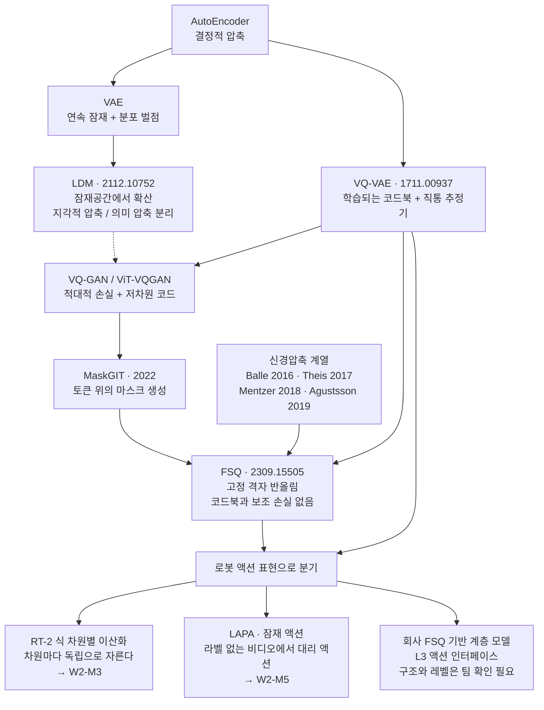
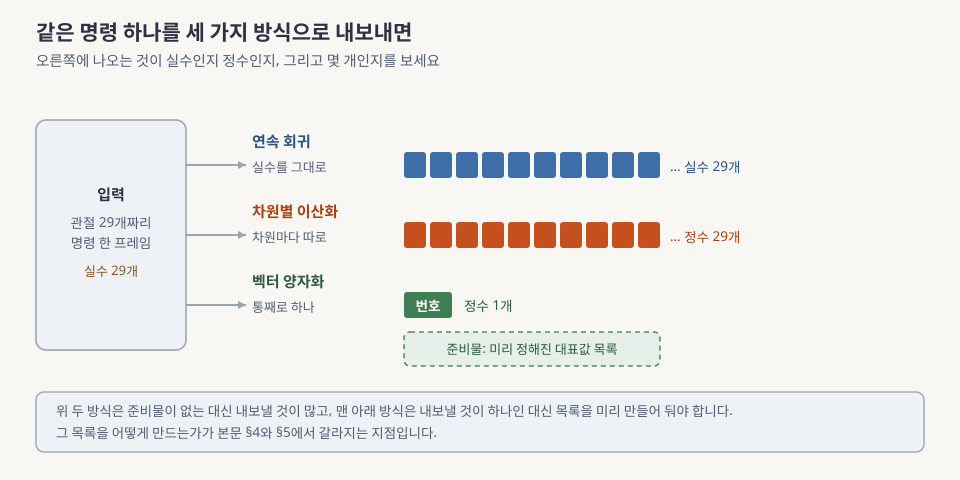
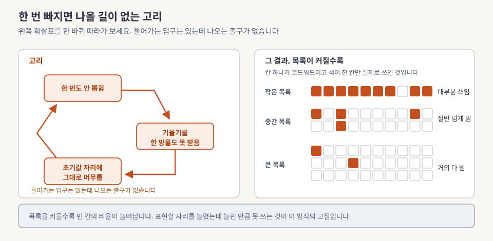
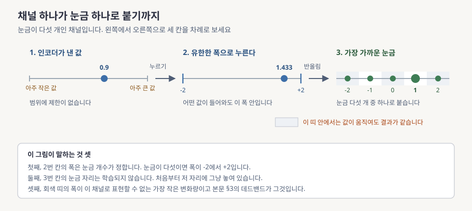
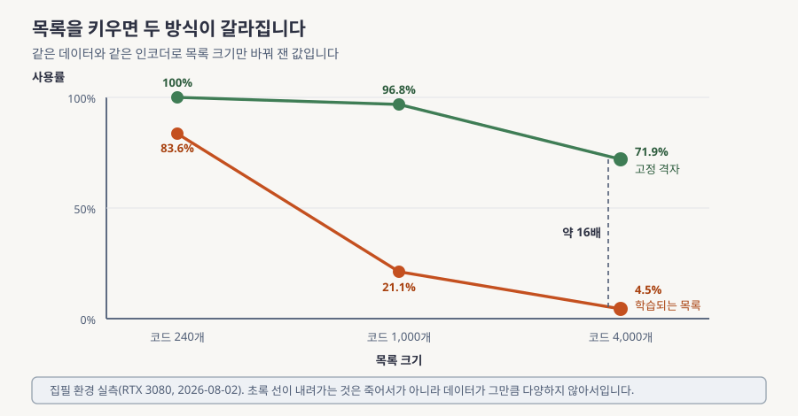
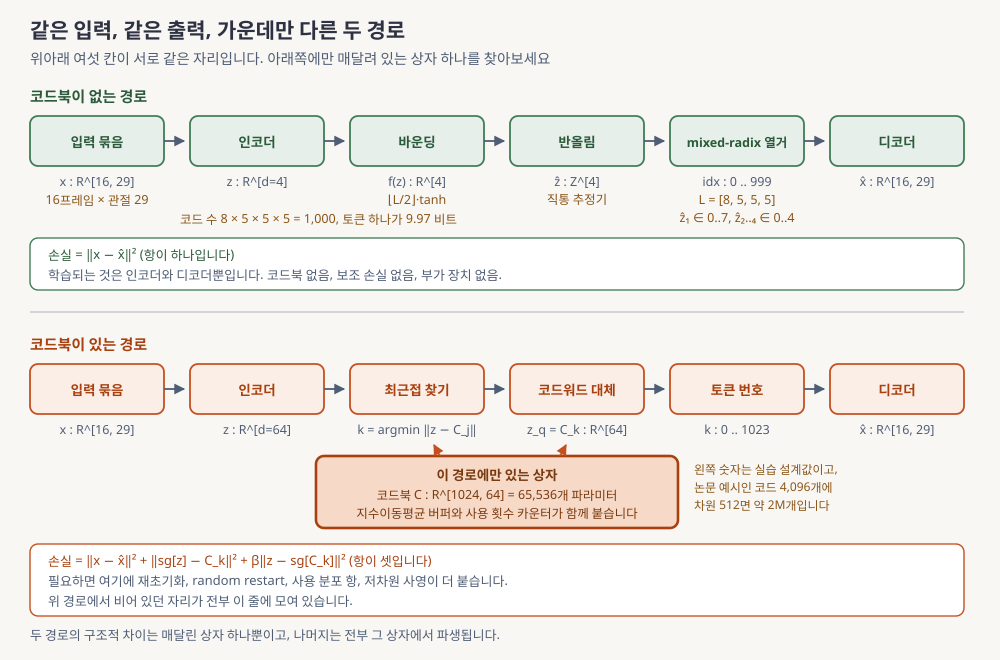
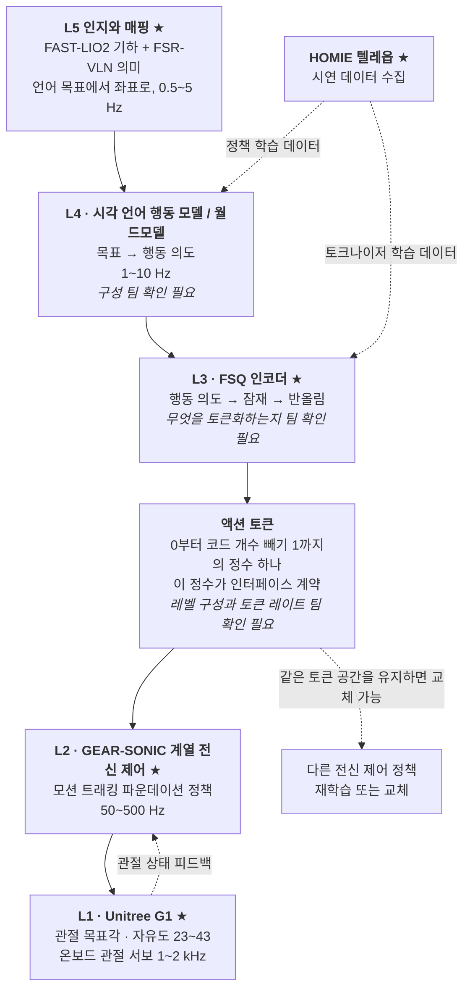
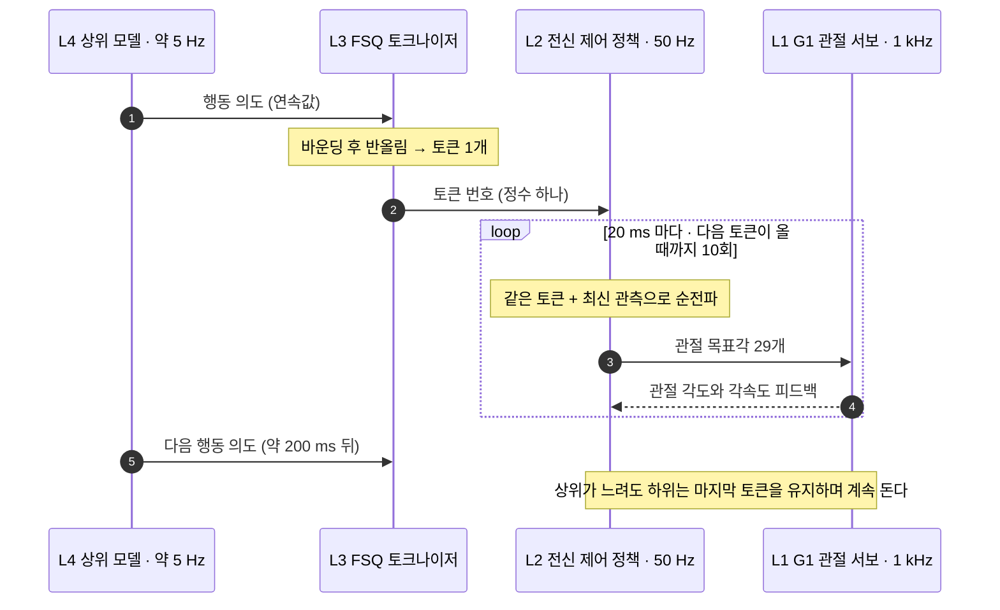

# 잠재공간과 이산화: VQ-VAE(Vector Quantized Variational AutoEncoder, 벡터 양자화 변분 오토인코더)에서 FSQ(Finite Scalar Quantization, 유한 스칼라 양자화)까지

> **한 줄 요약**: 로봇의 연속적인 움직임 명령을 정수 하나로 바꾸는 두 가지 방법을 비교합니다. 하나는 쓸 수 있는 명령의 사전을 학습으로 만드는 방법이고 다른 하나는 사전 없이 눈금에 반올림하는 방법인데, 회사가 상위 지능과 하위 제어기 사이에 후자를 놓은 이유를 시스템 설계 문제로 답합니다.

> 처음 보는 주제라면 [eli5.md](eli5.md)를 먼저 읽으세요. 그림으로 감을 잡고 오면 이 문서가 훨씬 잘 읽힙니다.

---

## 0. 이 모듈 지도

앞의 네 모듈에서 로봇 지능이 왜 여러 층으로 나뉘는지를 그렸고, 맨 아래층을 시뮬레이터로 만져 봤고, 맨 위층이 무언가를 만들어내는 방식 두 가지를 배웠습니다. 그런데 위층이 만든 것을 아래층에 무엇으로 담아 넘기는지는 아직 한 번도 열어보지 않았습니다. 이 모듈이 그 그릇을 만듭니다. 위층의 판단을 정수 하나로 압축해 아래층에 넘기는 장치이고, 회사가 상위 모델과 하위 제어기 사이에 실제로 놓아둔 물건이기도 합니다. 아래 목차의 「읽는 시간」은 산문만이 아니라 그림과 표와 수식과 퀴즈 풀이를 모두 포함한 초독 기준입니다.

**오늘의 질문.** 다 읽고 나면 이 셋에 답할 수 있습니다.

- 관절을 움직이라는 연속적인 명령을 정수 하나로 바꾸면 무엇을 얻고 무엇을 잃나요?
- 쓸 수 있는 명령의 사전을 학습으로 만들면 왜 그 절반이 죽고, 사전을 아예 없애면 왜 그 문제가 사라지나요?
- 회사가 위층과 아래층 사이에 이 장치를 놓은 이유는 무엇이고, 아직 답할 수 없는 것은 무엇인가요?

| 절 | 무엇을 | 끝나면 할 수 있는 것 | 읽는 시간 |
|---|---|---|---|
| §1 | 왜 배우나와 정수 하나로 넘기는 세 이유 | 이 모듈이 회사 스택의 어느 자리인지 지목하기 | 12분 |
| §2 | 잠재공간과 잠재확산 | 압축을 두 단계로 쪼갠 이유 말하기 | 14분 |
| §3 | 이산화의 손익 | 액션 표현 세 선택지를 축으로 비교하기 | 18분 |
| §4 | 학습되는 사전과 그 대가 | 사전이 죽는 현상이 왜 구조적인지 논증하기 | 22분 |
| §5 | 사전을 없앤 방식 | 반올림 수식과 권장 눈금 구성을 손으로 쓰기 | 32분 |
| §6 | 차원까지 채운 아키텍처 | 두 방식을 차원 라벨과 함께 나란히 그리기 | 12분 |
| §7 | 회사 스택 연결 ★ | 앉을 자리와 미확인 항목을 갈라내기 | 20분 |
| 마무리 | 오해, 한 장 정리, 퀴즈 10문항, 팀 질문 | 백지 재구성으로 자기 점검하기 | 20분 |

**읽는 법.** 왼쪽에서 오른쪽으로 한 줄로 읽으면 됩니다. §4와 §5가 짝입니다. §4가 문제를 세우고 §5가 그 문제를 없애는 방법을 냅니다. 중간에 길을 잃으면 §5로 돌아오세요. 이 모듈의 수식 한 줄이 거기에 있습니다.

**선수 지식**

| 알아야 할 것 | 어디서 채우나 | 이 문서가 대신 설명하는 것 |
|---|---|---|
| 계층 스택 다섯 층과 층 사이 속도 차이 | [W1-M1 §3.4, §4.1](../01-physical-ai-landscape/lesson.md) | §1과 §7이 숫자만 갈아끼워 씁니다 |
| G1 관절 개수와 구동기 수 29 | [W1-M2 §5](../02-simulator-bootcamp/lesson.md) | §6 그림이 이 숫자를 씁니다 |
| 확산 모델이 무엇을 학습하는가 | [W1-M3](../03-diffusion-ddpm-dit/lesson.md) | §2에서 「잠재 위에서 돌린다」만 씁니다 |
| 오토인코더, 코드북, 반올림의 미분 | **이 문서가 처음부터 설명합니다** | §2와 §4와 §5의 본문 |
| 확률분포, 신경망 학습, 손실 함수 | 보유 배경(ML/DL 기본)으로 가정 | 생성모델 전용 어휘는 첫 등장 자리에서 |

[W1-M4](../04-flow-matching/lesson.md)의 흐름 정합 유도는 전제가 아닙니다. §3 비교표에 연속 회귀 쪽 대표로 이름만 나옵니다. 필요한 만큼은 그 절이 다시 설명합니다.

**완료 기준**: 백지에 두 방식의 데이터 흐름을 차원 라벨과 함께 그리고, 정해진 눈금을 쓰는 이유와 그 대가를 각각 세 문장으로 씁니다.

**소요**: 이론 2.5h, 실습 4h

| 용어 | 이 절에서 나온 뜻 |
|---|---|
| **계층 스택** | 로봇 지능을 느린 위층부터 빠른 아래층까지 다섯 개로 나눈 구조이고, 정확한 정의는 [W1-M1](../01-physical-ai-landscape/lesson.md)에 있습니다 |
| **위층과 아래층** | 이 문서에서 무엇을 할지 정하는 쪽과 실제로 관절을 움직이는 쪽을 각각 가리키는 말입니다 |

> 📌 **여기까지 정리**
> - 목적지는 반올림 수식 하나, 사전이 죽는다는 논증 하나, 배치도 하나입니다
> - 세 질문에 §3과 §4와 §7이 각각 답합니다
> - 마지막에 남는 물음은 「우리는 무엇을 토큰화하는가」이고 §7.4가 그것을 미확인으로 적어둡니다

---

## 1. 왜 이걸 배우나

앞 모듈까지 우리는 무언가를 만들어내는 모델 두 가지를 배웠습니다. 노이즈를 걷어내는 방식과 길을 곧게 펴는 방식이었고, 둘 다 결과로 실수 여러 개를 뱉습니다. 그런데 그 실수 뭉치를 로봇의 다리를 움직이는 프로그램에 어떻게 건네줄 것인지는 아무도 정하지 않았습니다. 그 건네주는 자리가 왜 시스템 전체의 승부처인지, 그리고 왜 그 자리에 실수 뭉치가 아니라 정수 하나를 놓는 선택지가 등장하는지를 차례로 봅니다.

먼저 자리부터 짚습니다. [W1-M1 §3.4](../01-physical-ai-landscape/lesson.md)가 로봇 지능을 다섯 층으로 나눴습니다. 맨 위 L5가 카메라와 거리 센서로 주변을 읽어 지도를 만들고, L4가 그 위에서 무엇을 할지 정하고, L2가 그 판단을 받아 온몸의 관절을 조율하고, L1이 실제 모터를 돌립니다. **L3는 L4와 L2 사이에 끼어 있는 층이고 하는 일이 오직 하나입니다. 위층의 판단을 아래층이 먹을 수 있는 형태로 바꿔 넘기는 것입니다.**

여기서 두 층의 이름을 풀어둡니다. **WBC(Whole-Body Control, 전신 제어)**는 다관절 로봇이 넘어지지 않으면서 원하는 자세와 움직임을 내도록 온몸의 관절을 한꺼번에 푸는 하위 제어 계층입니다. 팔 하나만 따로 움직이면 무게중심이 흔들려 넘어지므로, 팔과 다리와 허리를 같은 계산 안에서 함께 다뤄야 합니다. 이 계층이 L2이고 회사는 여기에 GEAR-SONIC 계열 정책을 씁니다. 그 위의 **VLA(Vision-Language-Action, 시각 언어 행동 모델)**는 이미지와 사람의 말을 입력으로 받아 로봇이 할 행동을 직접 내놓는 상위 모델이고 L4에 앉습니다. 자세한 것은 둘째 주에 다룹니다.

W1-M1이 「승부처는 L3」라고 못박은 이유는 이렇습니다. L4를 잘 만드는 일과 L2를 잘 만드는 일은 각각 별개의 연구 주제이고 이미 잘하는 팀들이 있습니다. 그런데 **둘을 무엇으로 이을지는 각 팀이 정해주지 않습니다.** 이 계약을 잘못 정하면 위층을 바꿀 때마다 아래층을 다시 학습시켜야 하고, 아래층을 교체하면 위층이 못 쓰게 됩니다. 회사는 그 자리에 FSQ 기반 이산 액션 토큰을 놓았습니다. FSQ가 정확히 무엇인지는 §5가 본체로 다룹니다. 지금은 「연속값을 채널마다 정해진 눈금에 반올림해 정수로 만드는 방식」 정도로만 알아두면 됩니다. **이 모듈이 끝나면 그 결정을 알고리즘 수준에서 재현할 수 있어야 합니다.**

**액션 토큰**이라는 말을 정의하고 갑니다. 로봇의 행동 의도를 나타내는, 유한한 개수의 정수 중 하나입니다. 예를 들어 쓸 수 있는 의도가 1,000가지로 정해져 있으면 위층은 0부터 999 사이의 정수 하나만 내려보내고 아래층이 그 정수를 받아 실제 관절 명령으로 풀어냅니다. 실수 29개를 넘기는 대신 정수 1개를 넘기는 것이라 인터페이스가 극단적으로 단순해집니다. 연속적인 값을 이런 토큰으로 바꿔주는 장치를 **토크나이저**라고 부릅니다. 언어모델 앞단에서 글자열을 정수 열로 바꾸는 그 장치와 같은 이름이고 하는 일도 같습니다. 다른 점은 자르는 대상이 글자가 아니라 로봇의 움직임이라는 것뿐입니다. 두 장치가 왜 이름만 같은 것이 아니라 구현 수준에서 같은 구조인지는 [deep-dive.md](deep-dive.md) §1에 적어뒀습니다.

### 1.1 왜 하필 이산 토큰인가

연속적인 목표값을 그대로 넘겨도 되는데 굳이 정수 하나로 바꾸는 이유가 셋입니다. 셋 다 알고리즘이 좋아진다는 이야기가 아니라 **시스템이 다루기 쉬워진다**는 이야기입니다.

**① 상위 모델이 언어모델 그대로여도 됩니다.** 모델이 낼 수 있는 토큰의 전체 목록을 **vocabulary(어휘 집합)**라고 부릅니다. 언어모델은 이 목록에서 다음 토큰 하나를 고르는 일만 반복하는 기계이고, 그 방식을 **자기회귀(autoregressive) 예측**이라고 합니다. 지금까지 나온 토큰들을 조건으로 다음 토큰 하나를 예측하고, 그 예측을 다시 조건에 넣어 그다음을 예측하는 식으로 이어붙입니다. 액션이 유한한 vocabulary의 토큰이면 언어모델이 이미 갖고 있는 장치가 통째로 재사용됩니다. 예측 확률과 정답 토큰의 차이를 재는 손실 함수인 **cross-entropy(교차 엔트로피)**도 그대로이고, 학습할 때 모델의 예측 대신 정답 토큰을 다음 입력으로 넣어 궤적이 엉뚱한 데로 새지 않게 막는 **teacher forcing**도 그대로입니다. 뽑을 때 확률분포를 얼마나 뾰족하게 볼지 조절하는 **샘플링 온도**도, 앞 토큰들의 중간 계산 결과를 저장해 두고 다시 쓰는 **KV 캐시**도 손댈 것이 없습니다. RT-2가 「시각 언어 모델에 액션 토큰 출력을 붙이면 웹에서 배운 지식이 로봇으로 옮겨간다」를 보인 것이 정확히 이 재사용 덕분입니다.

**② 인터페이스가 정수 하나입니다.** 연속값을 넘기는 인터페이스는 합의할 것이 많습니다. 값의 범위를 어떻게 정규화했는지, 단위가 라디안인지 도인지, 관절 순서가 어느 쪽인지를 위층과 아래층이 똑같이 알고 있어야 하고, 하나라도 어긋나면 로봇이 에러 없이 조용히 잘못 움직입니다([W1-M2 §5.4](../02-simulator-bootcamp/lesson.md)에서 본 인덱스 어긋남의 확대판입니다). 토큰 ID로 넘기면 계약이 「0에서 999 중 하나」로 끝납니다. 범위를 벗어난 값은 애초에 표현할 수 없으므로 검증이 자동입니다.

**③ 하위 정책을 갈아끼울 수 있습니다.** 토큰 번호가 실제로 어떤 움직임인지는 아래층이 쥐고 있습니다. 그래서 같은 토큰 공간을 유지한 채로 아래층 전신 제어기를 다시 학습시키거나 아예 다른 것으로 바꿔도 위층은 손댈 필요가 없습니다. 반대 방향도 성립합니다. 위층 모델을 더 좋은 것으로 교체해도 아래층은 그대로입니다.

💡 산업 제어의 운전 모드 인터페이스를 아신다면 (몰라도 됩니다)

공장 설비에서는 위쪽의 감독 제어기가 아래쪽 루프에 명령을 내립니다. 이때 명령을 두 가지 방식으로 줄 수 있습니다. 하나는 「밸브 개도를 47.3%로」처럼 연속적인 목표값을 그대로 주는 방식이고, 다른 하나는 미리 정의해 둔 운전 모드 목록(가열, 유지, 냉각, 정지 같은 것)에 번호를 붙여 그 번호만 주는 방식입니다. 뒤쪽을 고르면 표현할 수 있는 명령의 가짓수가 줄어드는 대신 인터페이스가 검증 가능해집니다. 번호가 목록 안에 있는지만 보면 되고 각 번호가 실제로 무엇을 하는지는 아래쪽 루프가 알아서 정합니다.

위에서 본 이산 액션 토큰이 정확히 같은 구조입니다. 사람이 손으로 정의하던 운전 모드 목록을 여기서는 **데이터에서 학습으로 만듭니다**.

| 용어 | 이 절에서 나온 뜻 |
|---|---|
| **WBC(전신 제어)** | 넘어지지 않으면서 원하는 움직임을 내도록 온몸의 관절을 한꺼번에 푸는 하위 제어 계층입니다 |
| **VLA(시각 언어 행동 모델)** | 이미지와 말을 받아 로봇의 행동을 직접 내놓는 상위 모델입니다 |
| **액션 토큰** | 로봇의 행동 의도를 나타내는, 유한한 개수의 정수 중 하나입니다 |
| **토크나이저** | 연속적인 값을 유한한 토큰으로 바꿔주는 장치이고, 언어모델 앞단의 그것과 하는 일이 같습니다 |
| **FSQ(유한 스칼라 양자화)** | 채널마다 정해진 눈금에 반올림해 연속 벡터를 정수로 바꾸는 이산화 방식이고 §5가 본체입니다 |
| **vocabulary(어휘 집합)** | 모델이 낼 수 있는 토큰의 전체 목록이고 그 크기가 표현력의 상한입니다 |
| **자기회귀 예측** | 앞 토큰들을 조건으로 다음 토큰 하나를 예측해 이어붙이는 생성 방식입니다 |
| **teacher forcing과 KV 캐시** | 앞의 것은 학습 중에 정답 토큰을 다음 입력으로 넣는 방식, 뒤의 것은 앞 토큰의 중간 계산을 저장해 재계산을 피하는 장치입니다 |

> 📌 **여기까지 정리**
> - 이 모듈이 다루는 자리는 위층과 아래층을 잇는 L3 그 자체입니다
> - 정수 하나로 넘기는 이유는 인프라 재사용, 계약 단순화, 하위 교체 셋입니다
> - 셋 다 알고리즘이 좋아진다는 이야기가 아니라 시스템이 다루기 쉬워진다는 이야기입니다

---

## 2. 잠재공간과 LDM(Latent Diffusion Model, 잠재 확산 모델)

§1에서 위층의 판단을 정수 하나로 담아 넘긴다는 목표를 세웠습니다. 관절 29개짜리 명령을 16프레임어치 모아 놓은 덩어리는 곧바로 정수 하나에 밀어 넣을 수 없습니다. 중간에 그 덩어리를 몇 개의 숫자로 눌러 담는 단계가 필요합니다. 그 눌러 담기가 어떻게 작동하는지, 무엇을 어느 단계에서 버리도록 설계하는 것이 좋은지는 이미지 생성 쪽에서 먼저 답이 나왔습니다. 그 답을 여기서 그대로 배웁니다.

가장 기본이 되는 장치가 **AE(AutoEncoder, 오토인코더)**입니다. 신경망 두 개를 마주 보게 붙여놓은 구조이고 앞쪽 인코더가 입력을 작은 숫자 뭉치로 눌러 담으면, 뒤쪽 디코더가 그 뭉치만 보고 원본을 다시 만들어냅니다. 학습 목표는 「되살린 것이 원본과 같아지게」 하나뿐입니다. 이 목표를 잘 달성하려면 인코더는 원본을 되살리는 데 꼭 필요한 정보만 골라 담아야 하므로, 결과적으로 압축을 배우게 됩니다. 인코더가 눌러 담는 그 작은 공간을 **잠재공간(latent space)**이라고 부르고, 거기 담긴 숫자 뭉치 하나를 잠재 벡터라고 부릅니다.

오토인코더에는 한 가지가 빠져 있습니다. 잠재공간의 아무 자리나 찍어서 디코더에 넣으면 대개 쓰레기가 나옵니다. 그 자리가 학습 데이터가 실제로 앉았던 자리인지 아닌지를 아무도 관리하지 않았기 때문입니다. **VAE(Variational AutoEncoder, 변분 오토인코더)**는 잠재에 확률분포를 얹어 이 문제를 다룹니다. 인코더가 점 하나를 내는 대신 「이 근방」이라는 분포를 내게 하고, 그 분포가 표준정규분포에서 너무 멀어지지 않도록 손실에 벌점을 겁니다. 그러면 잠재공간이 촘촘히 메워져 아무 데나 찍어도 그럴듯한 것이 나옵니다. 이때 최대화하려는 값은 원래 데이터의 로그가능도인데 직접 계산할 수 없어서 **ELBO(Evidence Lower BOund, 증거 하한)**라는 아래쪽 근사값을 대신 최대화하고, 확률적으로 뽑는 과정에 미분이 통과하도록 「결정적 함수 더하기 외부 잡음」 꼴로 다시 쓰는 재파라미터화 기법을 씁니다. 증거 하한이 무엇이고 왜 그것을 대신 최대화하는지는 [W1-M3 §1.3](../03-diffusion-ddpm-dit/lesson.md)이 처음부터 설명합니다. 이 장치들이 어떤 순서로 등장했는지는 [deep-dive.md](deep-dive.md) §1에 있습니다.

여기까지가 준비물이고 본론은 **LDM**, 곧 잠재 확산 모델입니다(arXiv:2112.10752). 확산 모델을 픽셀 위에서 직접 학습시키면 연산의 대부분이 눈에 잘 보이지도 않는 고주파 디테일을 복원하는 데 쓰입니다. 그림의 구도나 물체의 정체 같은 큰 정보는 전체 계산량의 아주 작은 부분입니다. LDM은 이 일을 둘로 쪼갭니다. 앞 단계인 **perceptual compression(지각적 압축)**은 오토인코더가 맡아 사람 눈이 알아채지 못하는 세부를 버리고, 뒤 단계인 **semantic compression(의미 압축)**은 확산 모델이 그 잠재공간 위에서 의미 있는 구조의 분포를 학습합니다. **확산 모델이 자기가 잘하는 일에만 파라미터와 계산을 씁니다.**

**숫자를 넣어봅니다.** 이 쪼개기가 계산량에서 무엇을 바꾸는지 이 모듈의 데이터로 세어봅니다. G1의 관절 명령 한 프레임은 실수 29개이고 그것을 16프레임 묶어 한꺼번에 다룬다고 합시다. 이렇게 연속된 여러 프레임을 하나로 묶어 다루는 단위를 이 문서에서는 **묶음**이라고 부릅니다. 영어 문헌에서는 청크라고 씁니다.

1. 묶음 하나가 가진 실수의 개수는 $16 \times 29 = 464$개입니다
2. 이 464개 위에서 곧바로 확산 모델을 돌리면 모델이 매 스텝 다뤄야 할 원소가 464개입니다
3. 오토인코더가 이것을 잠재 4개로 눌러 담으면 확산 모델이 다룰 원소는 4개가 됩니다
4. 원소 수 기준으로 $464 / 4 = 116$배가 줄어듭니다

사라진 460개의 원소는 없어진 것이 아니라 **디코더가 대신 채워 넣기로 한 것**입니다. 어떤 정보를 디코더에게 맡길 것인지를 정하는 일이 곧 앞 단계 압축의 설계입니다.

같은 2단 구조가 로봇 쪽에서 두 번 반복됩니다.

- **비디오 월드모델의 백본**이 이것입니다. 픽셀 위에서 비디오를 확산으로 만드는 비용은 감당이 안 되므로 비디오를 먼저 토큰으로 눌러 담고 그 위에서 돌립니다(W4-M2)
- **액션 헤드**도 같습니다. 압축된 잠재 위에서 명령 묶음을 생성합니다([W1-M3](../03-diffusion-ddpm-dit/lesson.md), [W1-M4](../04-flow-matching/lesson.md))

**이 잠재를 연속으로 둘 것인가 이산으로 만들 것인가가 이 모듈의 갈림길입니다.** LDM 논문도 두 버전을 다 실험했습니다. 잠재에 확률분포 벌점을 거는 연속 버전과 잠재를 정수 격자에 붙이는 이산 버전입니다. 즉 이 선택은 나중에 누가 덧붙인 것이 아니라 계보 안에 처음부터 갈래로 들어 있었습니다(자세한 것은 [deep-dive.md](deep-dive.md) §1).

> ⚠️ **여기서 많이 헷갈립니다**
> 「잠재공간에서 확산한다」는 말을 「확산 모델이 저해상도로 일한다」로 읽기 쉽습니다. 그런데 잠재는 저해상도 그림이 아닙니다. 인코더가 원본을 되살리는 데 필요한 축만 골라 만든 **다른 좌표계**이고, 그 축들은 픽셀도 관절 각도도 아닌 학습으로 정해진 무엇입니다. 그래서 잠재 벡터 하나를 사람이 눈으로 읽어도 의미를 알 수 없습니다.

### 2.1 계보

앞에서 오토인코더에서 VAE로, 다시 LDM으로 이어지는 줄기를 봤습니다. 그 줄기에서 갈라져 나온 이산 쪽 가지가 이 모듈의 §4와 §5입니다. 아래 그림이 두 줄기를 한 화면에 놓은 것입니다.

**읽는 법.** 위에서 아래로 두 줄기가 갈라집니다. 왼쪽 줄기가 잠재를 연속으로 두는 쪽이고 오른쪽 줄기가 정수로 만드는 쪽입니다. 두 줄기가 갈라지는 지점이 맨 위 오토인코더입니다. 맨 아래 네모 셋은 그 이산 줄기가 로봇에 들어와서 다시 세 갈래가 된 것이고, 오른쪽 끝이 회사가 서 있는 자리입니다. 왼쪽 아래 신경압축 계열이 FSQ로 들어가는 화살표에 주목하세요. §5에서 「새 알고리즘이 아니다」라고 말할 근거가 그 화살표입니다.

| 용어 | 이 절에서 나온 뜻 |
|---|---|
| **AE(오토인코더)** | 입력을 작은 숫자 뭉치로 눌렀다가 되살리도록 학습하는 인코더와 디코더 한 쌍입니다 |
| **잠재공간** | 인코더가 입력을 눌러 담는 저차원 표현 공간이고 이후 연산이 전부 여기서 일어납니다 |
| **VAE(변분 오토인코더)** | 잠재에 확률분포를 얹어 그 공간의 아무 자리에서나 새 샘플을 뽑을 수 있게 만든 오토인코더입니다 |
| **ELBO(증거 하한)** | 직접 계산할 수 없는 로그가능도 대신 최대화하는 아래쪽 근사값입니다 |
| **LDM(잠재 확산 모델)** | 픽셀이 아니라 오토인코더의 잠재공간에서 확산 과정을 학습하는 모델입니다 |
| **지각적 압축** | 사람 눈이 알아채지 못하는 고주파 세부를 버리는 앞 단계입니다 |
| **의미 압축** | 남은 신호에서 의미 있는 구조의 분포를 학습하는 뒤 단계입니다 |
| **묶음(청크)** | 연속된 여러 프레임의 관절 명령을 하나로 묶어 한꺼번에 다루는 단위입니다 |

> 📌 **여기까지 정리**
> - 잠재확산은 압축을 지각 단계와 의미 단계로 쪼개 계산을 의미 쪽에 몰아줍니다
> - 같은 2단 구조가 비디오 월드모델과 액션 헤드에서 반복됩니다
> - 그 잠재를 연속으로 둘지 정수로 만들지가 이 모듈의 갈림길이고 계보 안에 처음부터 있던 갈래입니다

---

## 3. 연속에서 이산으로, 무엇을 얻고 무엇을 잃는가

§2에서 묶음을 몇 개의 숫자로 눌러 담는 단계를 봤고, 그 숫자를 연속으로 둘지 정수로 만들지가 갈림길이라는 것까지 왔습니다. 정수로 만들면 무엇이 좋아지고 무엇이 나빠지는지는 손익으로 아직 정리하지 않았습니다. 로봇의 액션을 표현하는 방식이 실제로 몇 가지나 쓰이고 있는지부터 늘어놓고, 그중 정수 쪽을 골랐을 때 치르는 대가를 숫자로 재서 손익표를 만듭니다.

현장에서 쓰이는 방식은 이렇게 갈립니다.

- **연속 회귀.** 액션 값을 실수 그대로 생성합니다. 확산 모델이나 흐름 정합 헤드를 붙이는 방식이고 Diffusion Policy와 pi0가 여기 있습니다. **흐름 정합(flow matching)**은 잡음에서 데이터로 가는 길의 방향과 빠르기를 좌표마다 정해 주는 속도장을 회귀로 학습하는 연속 생성 방식이고, 연속 회귀 헤드 쪽의 현재 표준입니다([W1-M4](../04-flow-matching/lesson.md)가 본체입니다). 이 절에서는 확산 모델과 나란히 「실수를 직접 뱉는 헤드」의 대표로만 쓰입니다
- **차원별 독립 이산화(per-dim binning).** 액션 벡터의 각 차원을 따로 여러 개의 구간으로 자르고, 차원마다 「몇 번째 구간인가」를 토큰 하나로 내보냅니다. RT-2와 OpenVLA가 이 방식입니다
- **벡터 양자화 토큰.** 액션 벡터 전체를 하나로 묶어 미리 정해진 대표값 중 하나로 대체합니다. 벡터를 통째로 다루므로 차원 사이의 관계가 보존됩니다. **VQ(Vector Quantization, 벡터 양자화)**라고 부르고 이 모듈의 §4와 §5가 여기에 속합니다

**읽는 법.** 같은 입력(관절 29개짜리 명령 한 프레임)이 왼쪽에 있고, 세 방식이 각각 무엇을 내놓는지가 오른쪽에 있습니다. 오른쪽에 나온 것이 실수인지 정수인지, 그리고 몇 개인지를 보세요. 위 두 줄은 스물아홉 개씩 나오고 종류만 다릅니다. 맨 아래 벡터 양자화만 하나로 끝나는 대신 「미리 정해진 목록」이라는 준비물이 하나 붙어 있습니다.

표에서 $H$는 위층이 한 번에 내놓는 스텝의 개수이고 $D$는 액션 벡터의 차원 수입니다. G1이면 $D$가 29입니다.

| 축 | 연속 회귀 | 차원별 독립 이산화 | 벡터 양자화 토큰 |
|---|---|---|---|
| 표현 | 실수 배열 $a \in \mathbb{R}^{H \times D}$를 직접 생성 | 차원마다 따로 잘라 스텝당 토큰 $D$개 | 벡터 전체를 코드 1개(또는 소수)로 |
| 상위 모델 | 확산이나 흐름 정합 헤드가 따로 필요 | 자기회귀 언어모델 그대로 | 자기회귀 언어모델 그대로 |
| 분해능 | 부동소수점 정밀도까지 | 구간 폭이 상한 | 목록 크기가 상한 |
| 차원 사이 관계 | 헤드가 함께 모델링합니다 | **독립 가정이라 관절 사이 관계를 잃습니다** | 코드 하나가 조합을 통째로 담습니다 |
| 토큰 길이 | 해당 없음 | $H \times D$개 (G1이면 스텝당 29개) | 훨씬 짧음 |
| 정답이 여럿인 상황 | 확산이나 흐름 정합으로 표현 가능 | 표현 가능 | 표현 가능 |
| 대표 약점 | 자기회귀 인프라와의 부조화, 샘플링 비용 | 시퀀스 폭발과 차원 독립 가정 | 양자화 오차와 토크나이저 학습 부담 |

표의 여섯째 줄에 나온 「정답이 여럿인 상황」을 풀어둡니다. 로봇이 장애물을 만났을 때 왼쪽으로 돌아가도 되고 오른쪽으로 돌아가도 되는 경우처럼, 같은 관측에 대해 옳은 행동이 여러 개인 상황이 있습니다. 이런 분포를 **다봉 분포(multimodal distribution)**라고 부릅니다. 봉우리가 여러 개라는 뜻입니다. 여기서 평균을 내는 방식으로 학습하면 왼쪽과 오른쪽의 평균인 「직진」이 나오고, 로봇은 장애물에 정면으로 부딪힙니다. 정수 토큰 방식은 각 토큰에 확률을 매기는 방식(softmax)이라 「왼쪽 60%, 오른쪽 40%」를 그대로 표현할 수 있고, 뽑을 때 둘 중 하나를 고르므로 평균으로 뭉개지지 않습니다.

**이산화가 주는 것부터 봅니다.**

- 자기회귀 언어모델의 학습과 추론 인프라를 그대로 재사용합니다(§1.1의 이유 ①)
- 정답이 여럿인 상황을 확률로 명시합니다. 연속 회귀는 평균으로 뭉갤 위험이 있습니다
- 인터페이스가 정수 하나로 단순해집니다(§1.1의 이유 ②)
- 위층에서 아래층으로 흘려보내는 데이터의 양이 크게 줄어듭니다(§6에서 숫자로 잽니다)

**대신 이산화가 가져가는 것도 있습니다.**

- **양자화 오차.** 목록에 없는 액션은 표현할 방법이 없고 가장 가까운 목록 항목으로 대체되면서, 차이만큼 오차가 남습니다
- **분해능 상한.** 목록의 크기가 곧 표현 가능한 액션의 가짓수입니다. 아무리 미세한 조정을 하고 싶어도 목록에 없으면 낼 수 없습니다
- **시간축 처리 부담.** 매 프레임 토큰을 뽑으면 시퀀스가 길어지고 여러 프레임을 묶어 토큰 하나로 만들면, 묶음 안쪽의 시간 해상도를 잃습니다

**숫자를 넣어봅니다.** 잃는 쪽 셋 가운데 앞의 둘이 얼마나 큰지 차원별 독립 이산화로 재봅니다. G1의 구동기가 29개이고 명령 묶음이 16스텝이며, 각 관절의 값을 256개 구간으로 자른다고 합시다. 그리고 어떤 관절의 가동범위가 3.0 rad(약 172도)라고 둡니다.

1. 차원마다 토큰 하나씩 나오므로 한 스텝에 토큰이 29개입니다
2. 묶음이 16스텝이므로 묶음 하나에 $16 \times 29 = 464$개의 토큰이 필요합니다
3. 구간 하나의 폭은 가동범위를 구간 수로 나눈 값이므로 $3.0 / 256 = 0.0117$ rad입니다
4. 도로 바꾸면 $0.0117 \times 180 / \pi = 0.67$도입니다
5. 그러므로 이 표현으로는 **0.67도보다 작은 보정을 아예 낼 수 없습니다**

5번이 말하는, 입력이 조금 변해도 출력이 전혀 반응하지 않는 구간을 **데드밴드(deadband)**라고 부릅니다. 목표를 0.3도만큼 옮기고 싶어도 같은 구간 안이라 토큰 번호가 바뀌지 않고, 따라서 아래층에 내려가는 명령도 그대로입니다. 반대로 로봇이 두 구간의 경계 근처에 있으면 작은 흔들림에도 토큰 번호가 왔다 갔다 해서 명령이 두 값 사이를 진동합니다. **분해능을 정하는 일은 이 두 증상 사이에서 자리를 고르는 일입니다.**

2번의 464라는 숫자도 그냥 넘길 수 없습니다. 위층이 묶음 하나를 내놓을 때마다 토큰 464개를 자기회귀로 한 개씩 뽑아야 한다는 뜻이고, 그만큼 추론이 느려집니다. 벡터 양자화 쪽은 같은 묶음을 토큰 몇 개로 끝냅니다. 이 차이가 §6에서 압축률로 다시 나오고 차원별 이산화를 쓰는 모델들이 이 폭발을 어떻게 다루는지는 W2-M3과 W2-M5가 받습니다.

💡 아날로그 신호를 디지털로 바꾸는 회로를 아신다면 (몰라도 됩니다)

전자 회로에서 디지털 값을 아날로그 전압으로 바꿔 내보내는 소자를 디지털 아날로그 변환기라고 부릅니다. 이 소자는 임의의 전압을 낼 수 없고 미리 정해진 개수의 레벨 중 하나만 낼 수 있습니다. 12비트짜리라면 $2^{12} = 4096$개의 레벨이 있고, 출력 범위를 그 개수로 나눈 값이 낼 수 있는 가장 작은 변화량입니다. 그보다 작은 보정은 물리적으로 불가능하므로 그 근처에서는 출력이 반응하지 않거나, 두 레벨 사이를 왔다 갔다 하며 떨립니다.

위 워크드 예제의 0.67도가 정확히 같은 성질의 값입니다. 레벨 개수를 회로 설계가 정하느냐, 토크나이저 설계가 정하느냐만 다릅니다.

다만 **이 계단이 최종 관절 명령까지 그대로 내려가지는 않습니다.** 토큰을 받는 아래층 전신 제어기는 자기 관측을 함께 보면서 초당 수십에서 수백 번 연속적인 관절 목표를 다시 만들어내고, 그 아래 관절 서보가 다시 초당 수천 번 그것을 추종합니다. 토큰의 계단은 「의도」의 계단이지 「관절 명령」의 계단이 아닙니다. 이 구분이 이 모듈에서 가장 자주 틀리는 지점이라 「흔한 오해」 3번에서 다시 다룹니다.

| 용어 | 이 절에서 나온 뜻 |
|---|---|
| **차원별 독립 이산화** | 액션 벡터의 각 차원을 따로 구간으로 잘라 차원마다 토큰 하나씩 내는 방식입니다 |
| **VQ(벡터 양자화)** | 벡터 전체를 미리 정해둔 대표값 하나로 대체하는 이산화입니다 |
| **다봉 분포** | 같은 상황에서 옳은 답이 여럿이라 봉우리가 여러 개인 분포입니다 |
| **흐름 정합** | 잡음에서 데이터로 가는 속도장을 회귀로 학습하는 연속 생성 방식이고 본체는 [W1-M4](../04-flow-matching/lesson.md)입니다 |
| **양자화 오차** | 목록에 없는 값이 가장 가까운 항목으로 대체되면서 남는 차이입니다 |
| **데드밴드** | 입력이 변해도 출력이 반응하지 않는 구간이고, 구간 폭보다 작은 보정을 못 내서 생깁니다 |

> 📌 **여기까지 정리**
> - 액션 표현은 연속 회귀, 차원별 이산화, 벡터 양자화 셋으로 갈립니다
> - 이산화는 인프라와 계약과 대역폭을 얻고 정밀도와 시간 해상도를 내줍니다
> - 분해능을 정하는 일은 데드밴드와 경계 진동 사이에서 자리를 고르는 일입니다

---

## 4. VQ-VAE의 학습되는 코드북과 그 대가

§3에서 벡터 양자화가 「미리 정해진 목록」을 준비물로 요구한다는 것을 봤습니다. 그 목록을 누가 어떻게 만드는지는 아직 말하지 않았습니다. 목록을 데이터에서 학습으로 만드는 방식이 먼저 나왔고 그것이 VQ-VAE인데, 이 선택이 하나의 고질적인 고장을 함께 데려옵니다. 그 고장이 왜 튜닝으로는 안 고쳐지는 종류인지가 이 절의 본론이고, §5가 그 고장을 없애는 방법입니다.

VQ-VAE(arXiv:1711.00937)의 구조는 오토인코더에 한 단계를 끼워 넣은 것입니다. 인코더가 잠재 벡터 $z$를 내면, 그것을 그대로 디코더에 주지 않고 **코드북(codebook)**에서 가장 가까운 항목으로 바꿔치기한 다음 디코더에 줍니다. 코드북은 대표 벡터들을 모아 놓은 목록이고 항목 하나하나를 코드워드라고 부릅니다. **결정적으로 이 목록은 학습되는 파라미터입니다.** 고정된 상수가 아닙니다. 신경망의 가중치와 똑같이 그래디언트를 받아 조금씩 움직입니다.

바꿔치기는 이렇게 씁니다.

$$
k = \arg\min_{j} \| z - c_j \|_2, \qquad z_q = c_k
$$

- **직관**: 인코더가 낸 점에서 가장 가까운 목록 항목을 찾아 그 항목으로 갈아탑니다
- **기호**: $z$는 인코더가 낸 잠재 벡터, $c_j$는 코드북의 $j$번째 코드워드, $\|\cdot\|_2$는 두 벡터 사이의 직선 거리, $k$는 그 거리를 가장 작게 만드는 항목의 번호, $z_q$는 바꿔치기한 결과입니다. 아래층에 넘어가는 토큰 ID가 바로 이 $k$입니다

여기서 곧바로 문제가 하나 생깁니다. $\arg\min$은 「가장 작은 것의 번호」를 고르는 연산이라 미분할 수 없습니다. 값이 조금 변해도 번호는 그대로이거나 통째로 바뀌므로 기울기가 0이거나 정의되지 않습니다. 그러면 디코더 쪽에서 흘러오던 학습 신호가 이 지점에서 완전히 끊겨 인코더가 아무것도 배우지 못합니다.

해결책이 **STE(Straight-Through Estimator, 직통 추정기)**입니다(Bengio 2013). 순전파에서는 바꿔치기한 값을 그대로 쓰고, 역전파에서는 바꿔치기가 없었던 것처럼 기울기를 그냥 통과시킵니다. 계단을 기울기 1의 직선으로 갈아 끼우는 셈입니다. 진짜 도함수는 거의 모든 곳에서 0이지만 양자화 오차가 작으면, 이 거짓말이 크게 틀리지 않습니다. 대수는 [deep-dive.md](deep-dive.md) §3에 있습니다.

손실은 세 항입니다.

$$
\mathcal{L} = \underbrace{\|x - \hat x\|^2}_{\text{재구성}} + \underbrace{\|\,\mathrm{sg}[z] - c_k\|^2}_{\text{코드북}} + \beta \underbrace{\|z - \mathrm{sg}[c_k]\|^2}_{\text{commitment}}
$$

$\mathrm{sg}$는 **stop-gradient**입니다. 순전파에서는 아무 일도 하지 않고 값을 그대로 통과시키지만 역전파에서는 그 지점의 기울기를 0으로 끊습니다. 그래서 $\mathrm{sg}$가 걸린 쪽은 그 항에서 상수처럼 취급되고, 걸리지 않은 쪽만 움직입니다. 나머지 기호는 $x$가 원본, $\hat x$가 디코더가 되살린 것, $\beta$가 셋째 항의 세기를 정하는 계수입니다.

- **재구성** 항은 인코더와 디코더를 학습시킵니다. 정보를 잃지 말라는 압력입니다
- **코드북** 항은 $\mathrm{sg}$가 $z$ 쪽에 걸려 있어 코드워드만 움직입니다. 자기에게 배정된 인코더 출력들의 한가운데로 코드워드가 끌려가므로 **사실상 온라인 k-means 갱신**이고, 실전 구현에서는 이 갱신을 그래디언트 대신 최근 배정값들의 이동평균으로 대체하기도 합니다. 그 방식을 **지수이동평균(EMA, Exponential Moving Average)** 갱신이라고 부르고 실습 코드와 랩이 쓰는 표기가 `EMA`입니다
- **commitment** 항은 $\mathrm{sg}$가 $c_k$ 쪽에 걸려 있어 인코더만 움직입니다. 인코더 출력이 자기가 붙을 코드워드에서 너무 멀어지지 않게 붙잡습니다

뒤의 두 항처럼 원래 목표인 재구성에 곁들여 붙는 항을 **보조 손실**이라고 부릅니다. 이것이 있으면 세기 계수를 하나 더 튜닝해야 하고 학습이 불안정할 때 원인 후보가 그만큼 늘어납니다. §5가 파는 물건이 정확히 이 두 항을 없애는 것입니다.

**숫자를 넣어봅니다.** 두 항이 정말 반대 방향으로 당기는지 2차원 벡터로 직접 계산해봅니다. 인코더 출력이 $z = (0.8,\ 0.2)$이고 가장 가까운 코드워드가 $c_k = (1.0,\ 0.0)$이며 $\beta = 0.25$, 학습률 $\eta = 0.1$이라고 합시다.

1. 둘의 차이는 $z - c_k = (-0.2,\ 0.2)$이고 그 제곱합은 $0.04 + 0.04 = 0.08$입니다
2. 코드북 항의 값은 $0.08$이고 commitment 항의 값은 $0.25 \times 0.08 = 0.02$입니다
3. 코드북 항을 $c_k$로 미분하면 $-2(z - c_k) = (0.4,\ -0.4)$이므로, 갱신은 $c_k \leftarrow c_k - \eta \cdot (0.4,\ -0.4) = (0.96,\ 0.04)$입니다
4. commitment 항을 $z$로 미분하면 $2\beta(z - c_k) = (-0.1,\ 0.1)$이므로, 갱신은 $z \leftarrow z - \eta \cdot (-0.1,\ 0.1) = (0.81,\ 0.19)$입니다
5. 3번에서 코드워드가 $(1.0, 0.0)$에서 $(0.96, 0.04)$로 인코더 출력 쪽으로 갔고, 4번에서 인코더 출력이 $(0.8, 0.2)$에서 $(0.81, 0.19)$로 코드워드 쪽으로 갔습니다. **둘이 서로에게 다가갑니다**

같은 제곱식을 두 번 쓰면서 $\mathrm{sg}$ 위치만 바꾼 이유가 5번입니다. 한 항으로 합쳐두면 두 방향의 당김이 같은 세기로 묶여 따로 조절할 수 없는데, 나눠 놓았기 때문에 $\beta$로 균형을 잡을 수 있습니다. 각 항의 편미분 전개는 [deep-dive.md](deep-dive.md) §2에 있습니다.

### 4.1 codebook collapse가 구조적인 이유

문제는 두 번째 항입니다. 코드워드 $c_j$가 그래디언트를 받는 조건을 다시 보세요. **자기가 가장 가까운 항목으로 뽑혔을 때만** 받습니다. 한 번도 뽑히지 않은 코드워드는 손실에 아예 등장하지 않으므로 갱신되지 않고, 갱신되지 않으니 초기값 자리에 그대로 머물러 다음에도 뽑히지 않습니다. **뽑히지 않아서 학습이 안 되고 학습이 안 돼서 뽑히지 않는 닭과 달걀 구조입니다.** 그래서 코드북을 키울수록 실제로 쓰이는 비율이 오히려 떨어집니다. 이 현상을 **codebook collapse**라고 부릅니다. 그리고 검증 데이터를 인코딩할 때 최소 한 번이라도 쓰인 코드의 비율을 **코드북 사용률**이라고 부르는데, FSQ 논문이 VQ의 첫 번째 문제로 지목한 것이 바로 이 사용률이 낮다는 것입니다.

**읽는 법.** 왼쪽이 고리입니다. 화살표를 따라 한 바퀴 돌아보세요. 「한 번도 안 뽑힘」에서 출발해 「기울기를 한 방울도 못 받음」과 「초기값 자리에 그대로 머무름」을 지나 다시 처음 상자로 돌아옵니다. 이 고리에 들어가는 입구는 있는데 나오는 출구가 그려져 있지 않은 것이 요점입니다. 오른쪽은 그 결과입니다. 코드북 목록에서 색이 칠해진 칸이 실제로 쓰인 코드워드이고 빈 칸이 죽은 코드워드입니다. 세 판에서 색이 칠해진 칸의 개수를 세어보세요. 목록을 키워도 그 개수는 거의 그대로이고 늘어나는 것은 빈 칸뿐입니다.

**숫자를 넣어봅니다.** 고리가 왜 저절로 안 풀리는지 갱신 기회를 세어봅니다. 코드북이 4,096개이고 학습 배치 하나에 데이터 묶음 256개가 들어가며 묶음 하나가 코드 하나를 고른다고 합시다.

1. 한 번의 갱신 스텝에서 뽑히는 코드는 많아야 256개입니다
2. 코드북 전체가 4,096개이므로 한 스텝에 움직일 수 있는 비율은 $256 / 4096 = 6.25\%$입니다
3. 나머지 $93.75\%$는 그 스텝에서 기울기를 한 방울도 못 받습니다
4. 매 스텝 다른 256개가 골고루 뽑힌다면 문제가 없는데, 인코더가 잠재공간의 좁은 영역만 쓰면 뽑히는 256개가 늘 비슷한 코드들입니다
5. 그러면 나머지는 **학습이 끝날 때까지 한 번도 갱신되지 않습니다**

이것이 하이퍼파라미터 문제가 아닌 이유가 4번과 5번입니다. 학습률을 올리면 뽑힌 코드가 더 크게 움직일 뿐이고, 안 뽑힌 코드는 학습률과 무관하게 0을 곱한 것과 같습니다.

> ⚠️ **여기서 많이 헷갈립니다**
> 「초기화를 잘하면 되는 것 아닌가」가 여기서 가장 자연스럽게 나오는 반문입니다. 실제로 코드북을 데이터로 초기화하는 트릭이 있고 이 모듈 실습에서도 켜볼 수 있습니다. 그런데 [labs Step 3](labs/README.md)의 집필 환경 실측에서 코드북 1,024개 기준 사용률이 바닐라 21.1%, 데이터 초기화 19.5%, 지수이동평균 18.8%, 둘 다 켜면 18.3%였습니다. 소규모 실험에서 트릭이 큰 차이를 못 내는 것이 「쓸모없다」는 뜻은 아닙니다. 논문 규모의 코드북에서 효과가 나타나기 때문입니다. 다만 **켜고 끄는 것으로 성질이 바뀌지는 않는다**는 것이 이 숫자들이 말하는 바입니다.

대응 트릭은 문헌에 여섯 가지가 쌓였고 세 갈래로 묶입니다(출처는 [deep-dive.md](deep-dive.md) §4).

- **죽은 코드를 되살리는 쪽.** 코드북 재초기화와 random restarts처럼 안 쓰이는 코드워드를 주기적으로 교체합니다
- **선택을 부드럽게 만드는 쪽.** 결정적 최근접 선택 대신 확률적으로 배정하거나, 코드 벡터의 길이를 1로 맞추는 $\ell_2$ 정규화로 코드 공간을 저차원 구면으로 옮겨 거리를 다시 잽니다
- **목적함수를 바꾸는 쪽.** 코드 사용 분포의 고른 정도를 손실에 직접 적어 넣거나(문헌에서 entropy loss라고 부릅니다), 최적화 문제 자체를 다시 세워 코드 선택을 재파라미터화하고 교대로 최적화합니다

**우회로가 여섯 가지나 독립적으로 제안됐다는 사실 자체가 진단입니다.** 튜닝으로 풀리는 문제였다면 이렇게 여러 갈래가 나올 이유가 없습니다. FSQ의 출발점이 여기입니다.

💡 제어 대상의 모드가 관측되지 않는 상황을 아신다면 (몰라도 됩니다)

어떤 시스템의 파라미터를 데이터로 추정하려면 그 파라미터가 결과에 영향을 미치는 상황이 데이터 안에 실제로 나타나야 합니다. 예를 들어 어떤 진동 모드의 특성을 알아내려면 그 모드를 흔드는 입력이 들어와야 하고, 그런 입력이 한 번도 없으면 그 모드의 파라미터는 아무리 오래 데이터를 모아도 값이 정해지지 않습니다. 이 조건을 시스템 식별 분야에서는 입력이 「충분히 풍부해야 한다」고 표현하고, 조건이 깨진 상태에서는 추정기가 그 방향으로 전혀 수렴하지 않습니다.

codebook collapse가 정확히 그 상태입니다. 뽑히지 않은 코드워드는 손실에 나타나지 않으므로 그 파라미터를 흔드는 입력이 데이터 안에 없는 것과 같고, 그래서 값이 초기값에 그대로 묶입니다.

### 4.2 코드북의 비용

collapse 말고도 코드북이 데려오는 것이 둘 더 있습니다. 하나는 눈에 보이는 파라미터 비용이고 다른 하나는 눈에 잘 안 띄는 인터페이스 비용인데, 회사 스택 관점에서는 뒤쪽이 더 중요합니다.

**숫자를 넣어봅니다.** 코드북이 차지하는 자리를 세어봅니다. 논문에서 흔히 쓰는 설정인 코드북 크기 $|\mathcal{C}| = 2^{12} = 4096$, 잠재 차원 $d = 512$를 넣습니다.

1. 코드북은 $4096 \times 512$짜리 표 하나이므로 원소가 $2{,}097{,}152$개, 곧 약 2M개입니다
2. 32비트 실수로 저장하면 $2{,}097{,}152 \times 4 = 8{,}388{,}608$ 바이트, 곧 약 8 MB입니다
3. 여기에 지수이동평균으로 갱신하는 구현이면 누적값을 담는 같은 크기의 버퍼가 하나 더 붙습니다
4. 코드별 사용 횟수 카운터와 죽은 코드 재초기화 로직도 함께 유지해야 합니다

**더 불편한 것은 이 표가 위층과 아래층이 공유하는 상태라는 점입니다.** 토큰 ID 217번이 무엇을 뜻하는지는 코드북 217번 줄에 적혀 있고, 토크나이저를 다시 학습시키면 그 줄의 내용이 바뀝니다. 같은 217번이 어제와 다른 것을 뜻하게 되므로 위층 모델도 함께 다시 학습시켜야 합니다. **인터페이스라고 불렀던 것이 실은 양쪽이 같이 들고 있어야 하는 커다란 텐서 하나였던 셈입니다.**

| 용어 | 이 절에서 나온 뜻 |
|---|---|
| **코드북** | 잠재를 대체할 대표 벡터들의 목록이고 VQ 계열에서는 학습되는 파라미터입니다 |
| **STE(직통 추정기)** | 미분 불가능한 바꿔치기의 기울기를 1로 대체해 통과시키는 기법입니다 |
| **stop-gradient** | 순전파는 그대로 두고 역전파만 끊는 연산자입니다 |
| **commitment 항** | 인코더 출력이 자기 코드워드에서 멀어지지 않게 붙잡는 손실 항입니다 |
| **codebook collapse** | 코드북을 키울수록 실제로 쓰이는 코드워드 비율이 떨어지는 현상입니다 |
| **코드북 사용률** | 검증 데이터를 인코딩할 때 최소 한 번은 쓰인 코드의 비율입니다 |
| **지수이동평균(EMA)** | 코드북 갱신을 그래디언트 대신 최근 배정값들의 이동평균으로 하는 실전 구현이고 실습과 랩의 표기가 `EMA`입니다 |

> 📌 **여기까지 정리**
> - 코드북은 학습되는 파라미터이고 손실 세 항 중 둘이 그것을 움직입니다
> - 안 뽑힌 코드워드는 기울기를 받지 못하므로 collapse는 튜닝이 아니라 설계의 문제입니다
> - 코드북은 파라미터 비용이면서 동시에 위층과 아래층이 공유해야 하는 상태입니다

---

## 5. 코드북을 없앤 FSQ

§4가 세운 고장은 이런 모양이었습니다. 목록이 학습되는 파라미터이기 때문에, 뽑히지 않은 항목은 영원히 뽑히지 않습니다. 그렇다면 고치는 방향도 정해집니다. **목록을 학습시키지 않으면 됩니다.** 그 발상을 실제 수식으로 만든 방법이 아래에 있습니다. 그 방법이 정말로 고리를 끊는지, 무엇을 대가로 내는지는 원논문의 실험으로 확인합니다.

방법의 이름은 **FSQ**이고 논문 제목이 「Finite Scalar Quantization: VQ-VAE Made Simple」입니다(arXiv:2309.15505 v2). 제목의 「made simple」이 과장이 아니라는 것이 이 절의 요지이고, 아이디어는 한 문장으로 끝납니다. **잠재를 아주 낮은 차원으로 내린 뒤 각 채널을 고정된 정수 격자에 반올림합니다.**

### 5.1 수식

핵심은 두 줄입니다. 먼저 인코더가 낸 값을 반올림 격자가 덮는 범위 안으로 밀어 넣고, 그다음 반올림합니다. 범위 안으로 밀어 넣는 함수를 **바운딩 함수** $f$라고 부르고, 채널마다 몇 개의 눈금을 둘지 정한 벡터를 **레벨 구성** $\mathcal{L} = [L_1, \dots, L_d]$라고 부릅니다.

$$
\hat z = \mathrm{round}(f(z)), \qquad f: z_i \mapsto \left\lfloor L/2 \right\rfloor \tanh(z_i)
$$

- **직관**: $\tanh$가 어떤 값이 들어오든 결과를 $-1$과 $1$ 사이로 눌러 담고, 거기에 $\lfloor L/2 \rfloor$를 곱해 $L$개의 정수 눈금이 놓인 폭까지 다시 늘립니다. 그러고 나서 가장 가까운 정수로 반올림하면 격자 위의 한 점이 됩니다
- **기호**: $z_i$는 인코더가 낸 잠재의 $i$번째 채널 값, $L$은 그 채널의 눈금 개수, $\lfloor \cdot \rfloor$는 소수점 아래를 버리는 내림 연산, $\hat z$는 반올림된 격자 좌표, $d$는 잠재의 차원 수입니다

각 채널이 $L$개 값 중 하나를 취하므로 만들어지는 코드의 총 개수는 채널마다의 눈금 수를 전부 곱한 값입니다. 채널마다 눈금 수를 다르게 둘 수 있으므로 일반형은 $|\mathcal{C}| = \prod_{i=1}^{d} L_i$이고, 모든 채널이 같으면 $L^d$입니다. 원논문 Fig 1의 예시가 $d = 3$, $L = 3$이라 코드가 27개입니다. **이 목록은 저장되지 않습니다.** 어디에도 표로 적혀 있지 않고 레벨 구성이라는 하이퍼파라미터로부터 계산될 뿐이어서 **implied codebook**, 곧 암묵적으로 정의되는 코드북이라고 부릅니다.

**읽는 법.** 채널 하나만 떼어내 가로축에 놓은 그림입니다. 왼쪽 끝에서 오른쪽으로 세 단계를 따라가세요. 첫 칸은 인코더가 낸 값이 아무 범위나 가질 수 있다는 것, 둘째 칸은 $\tanh$가 그것을 유한한 폭으로 눌러 담은 것, 셋째 칸은 그 폭 위에 놓인 눈금 다섯 개 중 가장 가까운 것으로 붙은 것입니다. 눈금 하나를 가운데 두고 감싼 회색 띠가 §3에서 본 데드밴드입니다. 그 띠 안에서 값이 아무리 움직여도 결과는 같은 눈금입니다.

번호를 매기는 규칙은 이렇게 씁니다.

$$
\mathrm{idx} \;=\; \sum_{i=1}^{d} n_i \, b_i, \qquad b_1 = 1,\; b_i = \prod_{j<i} L_j
$$

- **직관**: 자릿수 $n_i$에 그 자리의 가중치 $b_i$를 곱해 전부 더합니다. 십진수에서 자리마다 1, 10, 100을 곱해 더하는 것과 같습니다. 다만, 자리마다 진법이 다릅니다
- **기호**: $n_i$는 $i$번째 채널의 격자 좌표를 0부터 시작하도록 옮긴 자릿수이고 $\{0, \dots, L_i - 1\}$의 값을 가집니다. $b_i$는 그 자리의 가중치이고 앞선 채널들의 눈금 수를 전부 곱한 값입니다
- 괄호를 접으면 $\mathrm{idx} = n_1 + L_1\bigl(n_2 + L_2(n_3 + \cdots)\bigr)$ 꼴이 되고 실습 코드가 이 형태를 씁니다

세 가지를 덧붙입니다.

- 격자점들은 $|\mathcal{C}|$개의 정수와 일대일로 짝지어 번호를 매길 수 있습니다. 자릿수마다 진법이 다른 수 체계를 쓰는 것이고 이것을 **mixed-radix 열거**라고 부릅니다. **그래서 토큰 ID로 바로 쓸 수 있고** 이 성질이 §1.1의 이유 ①과 ②를 실제로 성립시킵니다. 번호는 이 문서와 실습 코드 모두 0부터 셉니다
- 반올림의 기울기 문제는 VQ와 똑같이 직통 추정기로 넘깁니다. 구현은 `round_ste: x ↦ x + sg(round(x) - x)` 한 줄입니다
- 눈금 개수가 짝수이면 $f$에 비대칭 보정이 필요합니다. 반올림이 정수로 가는데 격자 중심이 반 칸 어긋나기 때문이고, 일반형은 원문 부록 A.1에 있으며 대수는 [deep-dive.md](deep-dive.md) §8에 적어뒀습니다

**숫자를 넣어봅니다.** 채널 셋짜리 격자에서 값 하나를 실제로 토큰 번호까지 바꿔봅니다. 레벨 구성이 $\mathcal{L} = [5, 5, 5]$이고 인코더가 $z = (0.9,\ -0.4,\ 1.5)$를 냈다고 합시다.

1. 눈금이 5개이므로 스케일은 $\lfloor 5/2 \rfloor = 2$입니다
2. 채널 1은 $\tanh(0.9) = 0.716$, $2 \times 0.716 = 1.433$, 반올림해서 $1$입니다
3. 채널 2는 $\tanh(-0.4) = -0.380$, $2 \times (-0.380) = -0.760$, 반올림해서 $-1$입니다
4. 채널 3은 $\tanh(1.5) = 0.905$, $2 \times 0.905 = 1.810$, 반올림해서 $2$입니다
5. 격자 좌표는 $\hat z = (1,\ -1,\ 2)$이고, 각 채널이 취할 수 있는 값은 $\{-2, -1, 0, 1, 2\}$ 다섯 가지입니다
6. 번호를 매기려면 좌표를 0부터 시작하도록 옮깁니다. 각 채널에 2를 더해 자릿수 $(3,\ 1,\ 4)$를 얻습니다
7. 자릿수마다의 가중치는 $[1,\ 5,\ 25]$이므로 $\mathrm{idx} = 3 \times 1 + 1 \times 5 + 4 \times 25 = 108$입니다
8. 코드 총 개수가 $5^3 = 125$이므로 $108$은 $0$부터 $124$ 사이에 들어옵니다

되돌리는 것도 같은 방식입니다. $108$을 5로 나눈 나머지가 3이라 첫 자릿수가 3, 몫 21을 다시 5로 나눈 나머지가 1이라 둘째가 1, 그 몫 4가 셋째입니다. **이 왕복이 정확히 성립하기 때문에 아래층이 정수 하나만 받고도 원래 격자 좌표를 복원할 수 있습니다.** 이 모듈 실습 [`01_fsq_minimal.py`](practice/01_fsq_minimal.py)가 이 왕복 오차가 정확히 0인지를 자체 검증으로 확인합니다.

### 5.2 왜 collapse가 원천 차단되는가

앞 절의 격자점들을 다시 보세요. 그 점들은 레벨 구성이 정한 자리에 그냥 놓여 있습니다. 학습되지 않습니다. 그러면 §4.1의 고리가 성립할 자리가 없습니다. 고리는 「갱신되지 않아서 자리가 나빠지고, 자리가 나빠서 안 뽑힌다」였는데 여기서는 자리가 처음부터 나쁠 수도 좋을 수도 없습니다. **파라미터가 아닌 것은 죽을 수가 없습니다.**

그렇다면 사용률은 무엇이 강제하는가 하는 질문이 남습니다. **재구성 손실 하나입니다.** 인코더가 출력을 격자의 좁은 구석에만 몰아넣으면 서로 다른 입력이 같은 격자점으로 붕괴하고, 디코더는 그 둘을 구분할 방법이 없어 복원이 나빠집니다. 손실을 낮추려면 인코더가 스스로 표현을 격자 전체에 퍼뜨리는 수밖에 없습니다. **사용률은 별도의 손실 항 없이 원래 목표의 부산물로 따라옵니다.**

논문이 밝힌 설계 목표도 같습니다.

- 보조 손실을 없앱니다
- 설계 자체로 코드북 사용률이 높게 나오도록 합니다
- VQ 자리에 그대로 끼워 넣을 수 있도록 기능적 구성을 유지합니다

### 5.3 원문 Table 1의 권장 레벨 구성

레벨 구성은 학습되지 않는 하이퍼파라미터이므로 사람이 정해야 합니다. 목표 코드 개수를 정했을 때 채널을 몇 개 두고 각 채널에 눈금을 몇 개 둘지는 무한히 많은 조합이 있는데, 논문이 실험으로 잘 동작한 구성을 표 하나로 정리해뒀습니다.

| 목표 코드 수 $\|\mathcal{C}\|$ | $2^8$ | $2^{10}$ | $2^{12}$ | $2^{14}$ | $2^{16}$ |
|---|---|---|---|---|---|
| 권장 $\mathcal{L}$ | `[8, 6, 5]` | `[8, 5, 5, 5]` | `[7, 5, 5, 5, 5]` | `[8, 8, 8, 6, 5]` | `[8, 8, 8, 5, 5, 5]` |

**숫자를 넣어봅니다.** 표의 가운데 열을 검산해봅니다. 목표가 $2^{12} = 4096$이고 권장 구성이 $[7, 5, 5, 5, 5]$입니다.

1. 실제 코드 개수는 눈금 수의 곱이므로 $7 \times 5 \times 5 \times 5 \times 5 = 7 \times 625 = 4375$입니다
2. 목표는 4,096이므로 $4375 - 4096 = 279$개가 더 많습니다
3. 비율로는 $279 / 4096 = 6.8\%$ 초과입니다
4. 즉 **목표와 정확히 일치하지 않습니다.** 논문의 표현도 「approximately match」입니다

바로 옆 열도 같습니다. $2^{10}$ 행은 $8 \times 5^3 = 1{,}000$이라 목표 1,024보다 24가 **작습니다.** 어떤 행은 넘치고 어떤 행은 모자랍니다.

정확히 맞추지 않는 이유는 단순합니다. 코드북 크기가 2의 거듭제곱이어야 할 이유가 없기 때문입니다. 비트 단위로 딱 떨어지면 저장이 편하다는 관행이 있을 뿐이고, 여기서는 눈금 수의 곱이 그 관행을 만족시킬 수 없습니다. 다섯 구성 전부의 검산은 [deep-dive.md](deep-dive.md) §5에 있습니다.

**표에서 읽어야 할 휴리스틱은 모든 $i$에 대해 $L_i \ge 5$입니다**(원문 §3.2). 논문은 모든 레벨 구성이 최적은 아니며 이 규칙이 실험 전반에서 잘 동작했다고만 서술합니다. 정리도 아니고 최적성 주장도 아닙니다. 눈금이 2개나 3개뿐인 채널은 담을 수 있는 정보가 1비트에서 1.6비트뿐인데 인코더와 디코더가 다뤄야 할 축은 그대로 하나 늘어나므로, 얻는 것에 비해 부담만 커집니다.

> ⚠️ **여기서 많이 헷갈립니다**
> 목표 코드 수를 키우고 싶으면 눈금 수를 키우면 될 것 같습니다. 그런데 표를 가로로 훑어보면 $2^8$에서 $2^{16}$까지 가는 동안 $L_i$는 계속 5와 8 사이에 머물고 대신 **채널 수가 3개에서 6개로 늘어납니다.** 코드 수를 키우는 손잡이는 눈금이 아니라 채널입니다. 이유는 곱셈이기 때문입니다. 채널을 하나 더하면 코드 수가 그 채널의 눈금 수만큼 곱해지지만, 눈금을 하나 더하면 그 비율만큼만 늘어납니다.

### 5.4 차원의 역전

여기까지 오면 VQ와 FSQ의 차이를 항목별로 늘어놓을 수 있습니다. 논문 Fig 2 왼쪽의 대조표가 그것이고 오른쪽 열이 대부분 비어 있는 것이 이 방법의 요지입니다.

| 항목 | VQ | FSQ |
|---|---|---|
| 양자화 방식 | 코드북에서 최근접 항목 찾기 | 바운딩 후 반올림 |
| 기울기 처리 | 직통 추정기 | 직통 추정기 |
| 보조 손실 | commitment, 코드북, 사용 분포 항 | **없음** |
| 부가 장치 | 코드북 지수이동평균 갱신, 코드 쪼개기, 사영 등 | **없음** |
| 파라미터 | 코드북 | **없음** |

여기에 차원 규모가 붙습니다. **FSQ는 $d$가 10보다 작은 것이 보통이고 VQ는 $d$가 512 이상인 것이 보통입니다.** 512차원으로 하던 일을 4차원으로 한다는 말이라 처음 보면 앞뒤가 안 맞아 보입니다.

곱셈이라서 그렇습니다. VQ의 코드북은 $d$차원 공간에 흩뿌려진 점들이고, 그 점들이 데이터를 잘 덮으려면 공간이 넓어야 하므로 $d$가 커야 합니다. FSQ는 각 채널을 $L_i$등분해 격자를 만들고 그 격자를 곱해서 코드를 얻으므로, 채널 하나를 더할 때마다 코드 수가 배수로 뜁니다. $\mathcal{L} = [8,5,5,5]$면 $d$가 4뿐인데 코드가 1,000개입니다. **저차원과 곱 구조가 고차원과 학습 구조를 대신합니다.**

- 코드북 2M개가 사라지고, 인코더의 마지막 층도 출력 차원이 $d$로 작아져 함께 줄어듭니다
- 논문은 파라미터 수를 맞춰보려고 조밀 연결 층을 덧붙여 실험했지만 추가 이득이 없었다고 보고합니다
- 결론은 **같은 코드북 크기에서 FSQ의 파라미터가 더 적다**는 것입니다

### 5.5 실험 결과를 공정하게 읽기

여기까지가 「단순해진다」는 이야기이고 남은 질문은 「그래서 성능은 어떤가」입니다. 논문의 적용처는 둘입니다. 이미지 생성 쪽이 MaskGIT이고 조밀 예측 쪽이 UViM(깊이 추정, 채색, 파놉틱 분할)입니다. **양쪽 모두에서 성능 저하는 0.5%에서 3% 수준이었고 코드북 사용률은 대부분의 모델에서 약 100%를 보조 손실 없이 달성했습니다.**

MaskGIT의 ImageNet 256 결과입니다(원문 Fig 4 상단). 표의 지표 셋을 먼저 풀어둡니다. **FID(Fréchet Inception Distance)**는 생성한 이미지들의 특징 분포가 실제 이미지들의 분포와 얼마나 떨어져 있는지를 재는 값이고 낮을수록 좋습니다. precision은 만들어낸 것이 얼마나 그럴듯한지, recall은 실제 데이터의 다양성을 얼마나 덮는지를 재고 둘 다 높을수록 좋습니다. **CFG(Classifier-Free Guidance)**는 조건을 준 예측과 조건 없이 한 예측을 섞는 비율을 키워 조건 충실도를 올리는 추론 시점의 손잡이입니다.

| 모델 | 출처 | CFG | Sampling FID↓ | precision↑ | recall↑ | 사용률↑ |
|---|---|---|---|---|---|---|
| MaskGIT (VQ) | 저자 재현 | 0.1 | 4.509 | 0.860 | 0.465 | **81%** |
| MaskGIT (FSQ) | 저자 재현 | 0.2 | 4.534 | 0.864 | 0.453 | **100%** |
| MaskGIT (VQ) | 공개 구현(GitHub) | - | 4.916 | 0.836 | 0.489 | — |
| ADM (Dhariwal & Nichol 2021) | — | 1.5 | 4.59 | 0.83 | 0.52 | — |

- FSQ 쪽은 $\mathcal{L} = [8,5,5,5]$로 Table 1의 $2^{10}$ 행이고, VQ 쪽은 코드북 1,024개에 사용 분포 항을 붙인 구성입니다
- FSQ는 보정 전에 recall이 높고 precision이 낮은 자리에 착지해서 CFG를 더 강하게(0.2 대 0.1) 걸었습니다. 설정 전량은 [deep-dive.md](deep-dive.md) §6

표의 Sampling FID는 모델이 새로 만들어낸 이미지로 잰 값이고, 뒤에 나오는 재구성 FID는 실제 이미지를 인코딩했다가 되살린 것으로 잰 값입니다. 앞의 것은 생성 품질을 보고 뒤의 것은 토크나이저가 정보를 얼마나 지켰는지를 봅니다.

**FID는 사실상 동률입니다**(4.509 대 4.534). 갈리는 것은 코드북을 얼마나 쓰는가와 그 결과를 내는 데 장치가 얼마나 필요한가입니다. **대표 숫자는 FID가 아니라 사용률 81% 대 100%입니다.**

**읽는 법.** 가로축이 코드북 크기이고 세로축이 사용률입니다. 두 선의 출발점은 비슷한데 오른쪽으로 갈수록 벌어지는 것을 보세요. 아래로 급하게 꺼지는 선이 VQ이고 완만하게 내려가는 선이 FSQ입니다. 오른쪽 끝의 두 점 사이 간격이 이 절의 결론입니다. 점 옆에 붙은 숫자는 이 모듈 실습에서 실제로 측정한 값입니다.

그림의 숫자는 이 모듈 실습 [`02_fsq_vs_vq_g1.py`](practice/02_fsq_vs_vq_g1.py)를 G1 관절 궤적에 돌려 나온 집필 환경 실측입니다([labs Step 3](labs/README.md)). 같은 데이터와 같은 인코더로 코드북 크기만 바꿔 잰 값이라 두 방식을 나란히 놓고 볼 수 있습니다.

- 가장 작은 구성에서 FSQ는 코드 240개에 100%, VQ는 코드 256개에 83.6%입니다
- 가운데 구성에서 FSQ는 1,000개에 96.8%, VQ는 1,024개에 21.1%입니다
- 가장 큰 구성에서 FSQ는 4,375개에 71.9%, VQ는 4,096개에 4.5%로 **약 16배 차이**입니다

세 쌍이 코드 개수가 정확히 같지는 않습니다. FSQ는 눈금 수의 곱이라 2의 거듭제곱을 낼 수 없기 때문이고(§5.3), 그래서 각 쌍을 「거의 같은 크기」로 짝지어 비교합니다.

**직접 돌리면 소수점은 달라집니다.** 위의 96.8%나 4.5% 같은 값은 집필 환경에서 한 번 돌린 결과이고, 초기화 난수와 GPU와 라이브러리 판이 바뀌면 소수점 자리가 흔들립니다. 그래서 [labs Step 3](labs/README.md)은 자기 결과를 이 숫자와 자릿수까지 맞춰보라고 하지 않고 부등식으로 판정합니다. FSQ는 1,000개에서 90%를 넘고 4,375개에서 60%를 넘는가, VQ는 1,024개에서 30%를 밑돌고 4,096개에서 10%를 밑도는가, 그리고 VQ가 실제로 쓴 코드의 절대 개수가 세 구성에서 200개 안팎으로 거의 같은가입니다. **재현해야 하는 것은 소수점이 아니라 이 부등호의 방향입니다.**

> ⚠️ **여기서 많이 헷갈립니다**
> FSQ의 71.9%를 보고 「FSQ도 collapse했다」고 읽기 쉽습니다. 그렇지 않습니다. collapse는 코드워드가 학습되지 않아 죽는 현상인데 FSQ에는 학습되는 코드워드가 없습니다. 여기서 안 쓰인 격자점은 죽은 것이 아닙니다. **갈 필요가 없었던 자리**입니다. 이 장난감 궤적 데이터가 4,375가지나 되는 다양성을 애초에 갖고 있지 않았을 뿐입니다. 요약하면 **FSQ의 사용률은 데이터가 정하고 VQ의 사용률은 최적화가 정합니다.**

사용률을 잴 때 조심할 것이 하나 더 있습니다. 검증 데이터에서 나오는 토큰의 총 개수가 코드북 크기보다 작으면 사용률은 100%가 될 수 없습니다. 코드가 4,096개인데 토큰을 1,000개만 뽑았다면 아무리 잘해도 24.4%가 상한입니다. 이미지 토크나이저는 이미지 한 장이 토큰 수백 개를 만들어 이 문제를 겪지 않지만, **묶음 하나가 토큰 하나인 액션 토크나이저는 평가 설계에서 이것부터 걸립니다.** 상한을 함께 보고하는 이유이고 자세한 것은 [deep-dive.md](deep-dive.md) §9에 있습니다.

> ⚠️ **「FSQ가 항상 낫다」는 틀린 요약입니다.** 원문 Fig 3에서 코드북 크기가 $2^{10}$을 **넘어서면** FSQ가 Sampling FID와 사용률에서 VQ를 앞서고 VQ는 오히려 지표가 나빠지지만, **그 아래의 작은 코드북에서는 VQ가 더 낫습니다.** 재구성 FID는 코드북 크기와 상관되며 FSQ는 코드북을 키울수록 개선됩니다.

뿌리는 §2.1 계보에서 왼쪽 아래로 들어오던 신경압축 줄기입니다. 논문 스스로 「FSQ has not been used for vision tasks outside of compression」이라고 씁니다. **새 알고리즘이 아니라 압축 분야에서 오래 쓰던 도구를 생성모델 토크나이저 자리에 앉힌 것입니다**(구성값은 [deep-dive.md](deep-dive.md) §1).

| 용어 | 이 절에서 나온 뜻 |
|---|---|
| **바운딩 함수 $f$** | 인코더 출력을 반올림 격자가 덮는 범위 안으로 눌러 넣는 함수입니다 |
| **레벨 구성 $\mathcal{L}$** | 채널마다 눈금을 몇 개 둘지 정한 벡터이고 학습되지 않는 하이퍼파라미터입니다 |
| **implied codebook** | 저장하지 않고 레벨 구성의 곱으로 암묵 정의되는 코드 목록입니다 |
| **mixed-radix 열거** | 채널별 격자 좌표를 정수 하나로 바꾸는 일대일 대응이고 토큰 ID로 바로 쓰입니다 |
| **FID** | 생성한 이미지의 특징 분포가 실제 분포와 떨어진 정도이고 낮을수록 좋습니다 |
| **CFG** | 조건부와 무조건 예측을 섞는 비율을 키워 조건 충실도를 올리는 추론 시점 손잡이입니다 |

> 📌 **여기까지 정리**
> - 잠재를 저차원으로 내리고 채널마다 고정 격자에 반올림하는 것이 방법의 전부입니다
> - 격자가 파라미터가 아니므로 사용률을 재구성 손실 하나가 강제합니다
> - 성능은 사실상 동률이고 갈리는 것은 사용률 81% 대 100%와 사라진 장치의 목록입니다

---

## 6. 차원까지 채운 아키텍처

§4와 §5가 두 방법을 각각 세웠습니다. 그런데 둘을 나란히 놓고 「어디가 다른가」를 그림 한 장으로 짚어본 적은 아직 없습니다. 이 절이 그 그림입니다. 텐서의 모양까지 채워 넣어 두 경로를 나란히 그리고, 그 그림에서 읽히는 차이가 정확히 몇 개인지 셉니다. 여기 나오는 숫자는 회사 구현이 아니라 이 모듈 실습([`practice/`](practice/))의 설계값입니다. 그림 안에 딱 하나 예외가 있는데 오른쪽 아래에 따로 떼어 적어둔 「논문 예시」이고, §4.2에서 센 2M개짜리 코드북이 실습 규모에서는 어디까지 줄어드는지 나란히 보라고 둔 것입니다.

**읽는 법.** 위아래 두 줄이 각각 하나의 경로입니다. 왼쪽 끝의 입력이 둘 다 같고 오른쪽 끝의 출력도 둘 다 같습니다. 가운데를 보세요. 아래쪽 VQ 경로에만 색이 다른 상자가 하나 더 있습니다. 그 상자가 코드북이고 안에 적힌 것이 그 크기입니다. 각 상자 아래 작은 글씨가 그 자리를 지나는 텐서의 모양입니다. 맨 아래 두 줄이 각 경로의 손실이고 위쪽에는 항이 하나, 아래쪽에는 셋입니다.

**두 그림의 구조적 차이는 가운데 코드북 텐서의 유무 하나뿐입니다.** 보조 손실도, 부가 장치도, 파라미터 비용도, 재학습할 때 토큰 의미가 바뀌는 문제도 전부 그 상자 하나에서 파생됩니다. §5.4 대조표의 오른쪽 열이 비어 있던 이유가 이 그림입니다.

**숫자를 넣어봅니다.** 이 경로가 위층에서 아래층으로 흘려보내는 데이터를 얼마나 줄이는지 세어봅니다. 묶음 하나가 16프레임이고 프레임마다 관절 값이 29개이며 각 값이 32비트 실수라고 합시다. 레벨 구성은 $\mathcal{L} = [8, 5, 5, 5]$입니다.

1. 프레임 하나는 실수 29개이고 각각 32비트이므로 $29 \times 32 = 928$ 비트입니다
2. 묶음이 16프레임이므로 원본 묶음의 크기는 $16 \times 928 = 14{,}848$ 비트입니다
3. 코드 총 개수는 $8 \times 5 \times 5 \times 5 = 1{,}000$개입니다
4. 코드 하나를 가리키는 데 필요한 정보량은 $\log_2 1000 = 9.97$ 비트입니다
5. 압축률은 $14{,}848 / 9.97 \approx 1{,}489$배입니다(반올림하지 않은 $9.9658$로 나누면 1,489.9배이고 실습 코드가 찍는 값이 그것입니다)
6. 실제 저장은 비트를 쪼개 쓰지 않으므로 10비트로 잡으면 $14{,}848 / 10 = 1{,}484.8$배이고, 실습 코드가 「저장 기준」이라는 이름으로 찍는 값이 그것입니다

이 모듈 실습 [`03_g1_action_tokenizer.py`](practice/03_g1_action_tokenizer.py)가 같은 계산을 코드로 재현하고 값이 맞는지 확인합니다.

> ⚠️ **여기서 많이 헷갈립니다**
> 1,489배라는 숫자를 성능 자랑으로 읽기 쉽습니다. 이것은 자랑이 아니라 청구서입니다. 크게 압축했다는 말은 그만큼 버렸다는 말이고 버린 것은 묶음 안쪽의 시간적 디테일입니다. 되살리는 일은 전적으로 디코더가 학습한 사전지식에 맡겨집니다. 그래서 **학습 데이터가 덮지 않은 종류의 움직임은 토큰으로 표현되지도, 복원되지도 않습니다.** 무엇을 버려도 되는지를 정하는 일이 곧 토크나이저 설계이고, 그 판단의 근거가 학습 데이터의 분포입니다.

| 용어 | 이 절에서 나온 뜻 |
|---|---|
| **압축률** | 원본을 담는 데 필요한 비트 수를 토큰 하나의 비트 수로 나눈 값입니다 |

> 📌 **여기까지 정리**
> - 두 경로의 구조적 차이는 가운데 코드북 텐서 하나뿐입니다
> - 거기서 보조 손실과 부가 장치와 파라미터와 인터페이스 불안정이 전부 파생됩니다
> - 묶음 하나를 토큰 하나로 보내면 약 1,489배 압축이고 그만큼을 디코더에게 맡깁니다

---

## 7. 회사 스택 연결 ★

여기까지 두 가지 이산화 방법과 그 손익을 봤습니다. 이제 그것을 회사의 실제 배치 위에 올려놓을 차례입니다. FSQ 인코더가 다섯 층 가운데 정확히 어디에 앉는지부터 봅니다. 왜 하필 그 경계인지, 그리고 이 문서가 답할 수 있는 것과 없는 것의 경계가 어디인지까지 갈라놓습니다. **마지막 항목이 이 절에서 가장 중요합니다.** 회사 내부 구현은 추측하지 않고 미확인으로 적어 팀 질문으로 넘깁니다.

먼저 아래층 하드웨어의 이름과 규모를 짚어둡니다. L1의 Unitree G1은 휴머노이드 로봇이고 **DoF(Degree of Freedom, 자유도)**가 23에서 43 사이입니다. 자유도는 로봇이 독립적으로 움직일 수 있는 축의 개수이고, 구성에 따라 손과 손목이 붙느냐로 달라집니다. [W1-M2](../02-simulator-bootcamp/lesson.md)에서 시뮬레이터로 열어본 구성이 구동기 29개짜리였고, §6의 그림이 쓴 29가 그 숫자입니다.

### 7.1 FSQ가 앉는 자리

다섯 층을 세로로 세우고 그 사이에 이 모듈의 장치를 끼워 넣은 그림입니다. 그림에 나오는 이름 둘을 미리 짚어둡니다.

맨 위 L5에 서 있는 **FAST-LIO2**는 라이다와 관성 센서를 함께 써서 3차원 점군 지도를 만들고 로봇의 현재 위치를 추정하는 도구이고, 그 옆의 **FSR-VLN**은 그 지도 위에 의미를 얹어 「소파 옆으로 가라」 같은 말을 좌표로 바꾸는 도구입니다. 둘 다 이 모듈의 대상이 아니고 W4-M3이 본체로 다룹니다. 그리고 그림 왼쪽 아래에 따로 떨어져 있는 **HOMIE**는 사람이 외골격을 입고 로봇을 원격으로 조종해 시연 데이터를 모으는 장치입니다. 명령을 흘려보내는 계통이 아니라 학습 데이터를 공급하는 계통이라 점선으로 그렸습니다.

**읽는 법.** 위에서 아래로 한 줄기로 내려가는 것이 명령의 흐름입니다. 각 상자의 오른쪽 아래에 적힌 주파수를 위에서 아래로 훑어보세요. 0.5 Hz에서 시작해 2 kHz까지 약 4,000배가 벌어집니다. 이 문서가 다루는 것은 가운데 두 상자, 곧 FSQ 인코더와 그 아래 액션 토큰입니다. 점선 화살표 셋은 명령이 아니라 데이터와 교체 가능성을 나타냅니다. 오른쪽 아래 점선이 §1.1의 이유 ③이 그림으로 나타난 자리입니다. 기울임체로 적힌 「팀 확인 필요」 넷이 §7.4의 목록과 짝을 이룹니다.

| 계층 | 이 모듈이 닿는 지점 | 확인 필요 여부 |
|---|---|---|
| L4 상위 지능 | 토큰을 내는 쪽이고 자기회귀로 예측한다면 §1.1 이유 ①이 그대로 성립합니다 | 팀 확인 필요 |
| L3 액션 인터페이스 | **이 모듈 전체.** 반올림과 열거와 레벨 구성이 여기에 있습니다 | 알고리즘은 공개 자료, 회사 설정값은 §7.4 |
| L2 전신 제어 | 토큰을 받아 관절 목표로 푸는 쪽이고 토큰의 의미를 쥐고 있습니다 | 팀 확인 필요 |
| L1 하드웨어 | 구동기 29개짜리 구성이 §6 그림의 차원 라벨입니다 | 공개 자료로 확인 완료 |

### 7.2 왜 하필 이 경계인가

위 그림에서 주파수가 약 4,000배 벌어진다고 했습니다. 그 벌어짐이 인터페이스 설계에 어떤 제약을 거는지를 여기서 셈으로 확인합니다. [W1-M1 §4.1](../01-physical-ai-landscape/lesson.md)이 세운 조건이 다시 쓰입니다. L4는 1에서 10 Hz로 돌고 L2는 50에서 500 Hz로 도니까, 위층이 한 번 생각하는 동안 아래층은 수십 번 돌아야 합니다. 그 사이에 아래층에게 먹일 것이 떨어지면 로봇은 명령 없이 서 있게 되고, 이 구간을 **명령 공백**이라고 부릅니다.

**숫자를 넣어봅니다.** 위층이 5 Hz, 아래층이 50 Hz라고 두고 아래층이 몇 번을 버텨야 하는지 셉니다.

1. 위층의 재계획 주기는 주파수의 역수이므로 $1 / 5 = 0.2$초, 곧 200 ms입니다
2. 아래층의 한 주기는 $1 / 50 = 0.02$초, 곧 20 ms입니다
3. 그러므로 새 명령이 오기까지 아래층은 $200 / 20 = 10$번을 돌아야 합니다
4. 연속 궤적을 묶음으로 내려보내는 방식이라면 그 10번을 채울 액션 10개가 묶음 안에 들어 있어야 하고, 하나라도 모자라면 그 순간이 명령 공백입니다
5. 토큰을 내려보내는 방식이라면 아래층이 **같은 토큰 하나를 10번 다시 읽으면 됩니다.** 매번 최신 관측과 함께 넣으므로 출력은 매번 달라집니다

4번과 5번의 차이가 이 경계를 토큰으로 만드는 이유입니다. 연속 궤적 묶음은 「앞으로 10스텝 동안 이렇게 움직여라」라는 낱개 명령의 목록이라 소진되면 끝입니다. 토큰은 「지금 하려는 것이 이것이다」라는 의도의 이름표에 가까워서, 같은 이름표를 계속 쥐고 있어도 의미가 유지됩니다. **홀드가 의미를 갖는가 아닌가**가 두 표현의 실질적 차이입니다.

**읽는 법.** 위에서 아래로 시간이 흐릅니다. 가운데 네모난 반복 구간을 보세요. 그 안에서는 위쪽 두 참가자가 아무것도 하지 않는데 아래쪽 둘은 계속 주고받습니다. 워크드 예제의 10회가 그 반복 횟수입니다. 반복이 끝나고 맨 아래에서 위층이 다시 등장하는 것이 새 토큰이 도착하는 순간입니다.

> ⚠️ 위 타이밍 다이어그램은 일반적인 계층 구조의 논리를 그린 것이며 회사 구현의 실제 토큰 레이트와 홀드 정책이 아닙니다. §7.4의 확인 대상입니다.

교체 가능성도 같은 그림에서 읽힙니다. 한쪽을 바꿔도 다른 쪽을 안 건드려도 되게 만드는 설계를 **디커플링(decoupling)**이라고 부릅니다. 토큰의 의미를 아래층이 해석하는 한 아래층 정책을 갈아끼워도 위층은 그대로이므로 이 경계가 디커플링된 상태입니다. 반대로 **토크나이저를 다시 학습시키면 토큰 번호의 의미가 바뀌므로 위층과 아래층을 동시에 갱신해야 하고**, 여기서 인터페이스 버전 관리 문제가 생깁니다. 격자가 고정된 FSQ에서는 바뀌는 것이 인코더와 디코더의 매핑뿐이라 §4.2에서 본 「공유하는 큰 텐서」가 없습니다.

### 7.3 SONIC의 universal token space와의 관계

앞 절이 세운 것은 「이 경계에 토큰을 놓으면 좋다」는 일반 논증이었습니다. 회사가 쓰는 아래층 정책이 실제로 그런 토큰 입구를 갖고 있는지는 별개 문제이고, 여기서 한 번 짚고 넘어갑니다.

마스터플랜 §2.2는 SONIC(arXiv:2511.07820)의 핵심을 universal token space로 정리하고, 그것이 시각 언어 행동 모델과 가상현실 텔레옵과 게임패드로 조종하는 **kinematic planner(기구학 계획기)**를 하나의 정책에 물리기 위한 공통 토큰 공간이라고 봅니다. 기구학 계획기는 힘이나 토크를 계산하지 않고 발 위치와 관절 각도 같은 기하만으로 다음 자세를 짜 주는 장치이고, 마스터플랜은 그것이 스타일 보행과 내비게이션 쪽을 맡는다고 적습니다. 이 해석대로면 그 토큰 공간과 회사 FSQ 토큰이 만나는 자리가 L3와 L2의 접점입니다.

> 📌 **이것은 마스터플랜의 해석이고 논문 직접 확인은 W3-M4입니다.** 여기서는 「그런 접점이 있을 것」이라는 가설까지만 세웁니다.

### 7.4 확인되지 않은 것

앞의 세 절이 세운 것은 전부 공개 자료와 일반 논증입니다. 회사 구현의 구체값은 이 문서를 쓰는 시점에 확인되지 않았고, 추측해서 채우면 이 문서를 읽고 설계를 판단하는 사람이 틀린 전제 위에 서게 됩니다. 그래서 모르는 것은 모른다고 적고 질문으로 넘깁니다.

| 항목 | 무엇이 궁금한가 | 왜 중요한가 | 상태 |
|---|---|---|---|
| 토큰화 대상 | 관절 각도인가, 각속도인가, 궤적 묶음인가, 상위 모델이 만든 압축 표현인가 | 인코더 입력 차원과 실습 설계가 여기서 갈립니다 | 🔴 미확인 |
| 레벨 구성과 차원 | Table 1 계열인가, 자체 탐색값인가 | 코드 개수가 곧 표현 가능한 의도의 가짓수입니다 | 🔴 미확인 |
| 토큰 레이트 | 초당 몇 토큰인가. 위층 호출당 1개인가 여러 개인가 | §7.2의 셈을 실수로 채우는 데 필요합니다 | 🔴 미확인 |
| 시간축 처리 | 프레임당 1토큰인가, 묶음당 여러 개인가 | 묶음 안쪽 해상도와 반응성의 교환입니다 | 🔴 미확인 |
| 학습 데이터 | 사람이 조종해 모은 것인가, 사람 동작을 로봇 골격으로 옮긴 것인가, 시뮬레이터 롤아웃인가 | 토큰 공간이 무엇의 분포를 덮는지 결정합니다 | 🔴 미확인 |
| SONIC 접점 | 토큰이 전신 제어 입력의 어느 자리로 들어가는가 | L3와 L2 계약의 실체입니다 | 🔴 미확인 |

**여섯 항목 전부 팀 확인이 필요하고 추측하지 않았습니다.** 질문 문장은 아래 「팀에 물어볼 것」에 1대1로 있습니다.

| 용어 | 이 절에서 나온 뜻 |
|---|---|
| **DoF(자유도)** | 로봇이 독립적으로 움직일 수 있는 축의 개수이고 G1은 23에서 43 사이입니다 |
| **명령 공백** | 위층이 다음 명령을 못 낸 사이 아래층에게 먹일 것이 없어지는 구간입니다 |
| **디커플링** | 한쪽을 바꿔도 다른 쪽을 안 건드려도 되게 만드는 설계입니다 |
| **universal token space** | 여러 상위 입력원을 하나의 정책에 물리기 위한 공통 토큰 공간입니다 |
| **kinematic planner(기구학 계획기)** | 힘이나 토크가 아니라 기하만으로 다음 자세를 짜 주는 장치이고 마스터플랜은 스타일 보행과 내비게이션을 맡는다고 적습니다 |

> 📌 **여기까지 정리**
> - 토큰은 느린 위층과 빠른 아래층 사이에 앉고 홀드가 의미를 갖는다는 점이 연속 묶음과 다릅니다
> - 토크나이저를 다시 학습시키면 토큰 의미가 바뀌므로 버전 관리 문제가 남습니다
> - 우리 구현이 무엇을 토큰화하는지는 여섯 항목 모두 미확인이고 팀 질문으로 넘깁니다

---

## 흔한 오해

여기까지 읽고 나면 정리가 한쪽으로 기울기 쉬운 자리가 넷 있습니다. 넷 다 문장으로는 그럴듯한데 실제로는 반쪽이거나 계층을 혼동한 것입니다. 각각 어디까지가 맞고 어디부터 틀리는지를 갈라놓습니다.

### 오해 1. "FSQ는 VQ의 상위호환이다"

§5.5의 경고 상자가 이것을 반박합니다. 코드북이 $2^{10}$ **이하**인 구간에서는 VQ가 더 낫고, 논문이 보고한 성능 저하도 0.5%에서 3% 수준이라 공짜가 아닙니다. 논문의 주장은 「대형 코드북에서 훨씬 단순한 장치로 코드북을 더 잘 쓴다」이지 「우월하다」가 아닙니다.

**시스템 관점의 진짜 이득은 보조 손실과 부가 장치와 코드북 파라미터가 통째로 사라지는 것입니다. FID 소수점이 아닙니다.** §5.4 대조표의 오른쪽 열이 전부 빈칸인 것을 보세요. 운영과 디버깅에서 사라지는 항목의 목록이 그 빈칸입니다. 재현할 것이 줄고 실패할 자리가 줄어드는 것이 이 방법이 파는 물건입니다.

### 오해 2. "코드북 사용률 100%면 표현력이 최대다"

사용률은 **필요조건이지 충분조건이 아닙니다.** 모든 코드가 쓰이더라도 그 코드들이 데이터의 중요한 변동 방향을 담고 있는지는 별개 문제입니다. 그래서 논문도 사용률과 별개로 재구성 FID와 Sampling FID를 함께 봅니다.

두 질문을 갈라 물어야 합니다. 하나는 「표현 예산이 실제로 쓰이고 있는가」이고 다른 하나는 「그 예산의 배치가 이 작업에 필요한 분해능을 주고 있는가」입니다. 앞의 것은 사용률이 답하고 뒤의 것은 재구성 오차가 답합니다. 실습에서 사용률과 재구성 오차를 항상 같이 보라고 하는 이유입니다.

### 오해 3. "이산 토큰이면 정보가 손실되니 정밀 제어가 불가능하다"

계층을 혼동한 오해입니다. **토큰은 의도의 해상도이지 관절 명령의 해상도가 아닙니다.** 아래층 전신 제어기가 50에서 500 Hz로 관측 피드백을 받아 연속적인 관절 목표를 만들고, 그 아래 온보드 관절 서보가 1에서 2 kHz로 그것을 추종합니다([W1-M1 §3.1](../01-physical-ai-landscape/lesson.md)). §3에서 차원별 독립 이산화를 가정하고 계산한 0.67도짜리 계단은 위층이 표현할 수 있는 의도의 눈금이지, 관절이 실제로 움직이는 눈금이 아닙니다.

단서가 둘 있습니다. 회사 구현에서 실제로 어떻게 되는지는 §7.4대로 미확인이고 양자화 오차가 사라지는 것도 아닙니다. **토큰 공간이 표현하지 못하는 의도는 애초에 위층이 보낼 수 없습니다.** 아래층이 메우는 것은 토큰과 토큰 사이의 시간이지 표현되지 않은 의도가 아닙니다.

### 오해 4. "코드 수가 눈금 수의 곱이니까 레벨을 크게 하면 그냥 좋다"

두 가지가 걸립니다.

- $L_i \ge 5$는 **하한이지 「클수록 좋다」가 아닙니다.** Table 1의 권장 구성은 눈금을 키우는 대신 **채널을 늘려** 목표 크기에 도달합니다. $2^{16}$ 행이 $[8,8,8,5,5,5]$로 채널 6개인 것을 보세요
- 코드 수를 키우면 위층 모델의 출력 어휘 집합이 커지고 그만큼 학습 데이터가 더 필요합니다. **표현력과 학습 가능성의 교환이고**, 넓게 깔아도 데이터가 덮지 못하는 영역은 쓰이지 않은 채로 남습니다. §5.5에서 본 71.9%가 그 상태였습니다

---

## 한 장 정리

이 절만 읽어도 모듈 전체가 복기되도록 만든 자리입니다. 각 절의 정리 박스를 한 줄씩으로 줄인 표와, §0에서 봤던 지도에 각 절이 답한 것을 라벨로 붙인 그림, 그리고 읽은 것을 덮고 말해보는 장치가 있습니다.

| 절 | 핵심 한 줄 |
|---|---|
| §1 | 승부처는 위층과 아래층을 잇는 자리이고 정수 하나로 넘기는 이유는 인프라와 계약과 교체 가능성 셋입니다 |
| §2 | 잠재확산이 압축을 지각 단계와 의미 단계로 쪼갰고 그 잠재를 정수로 둘지가 갈림길입니다 |
| §3 | 이산화는 넷을 얻고 셋을 잃으며 분해능을 정하는 일은 데드밴드와 경계 진동 사이의 자리 고르기입니다 |
| §4 | 코드북이 학습 파라미터라서 안 뽑힌 코드는 영원히 안 뽑히고, 그래서 우회로가 여섯 가지 쌓였습니다 |
| §5 | 격자를 고정하면 그 고리가 성립할 수 없고 사용률을 재구성 손실 하나가 강제합니다 |
| §6 | 두 경로의 구조적 차이는 가운데 코드북 텐서 하나이고 나머지는 전부 그 파생입니다 |
| §7 | 토큰은 느린 위층과 빠른 아래층 사이에 앉고 우리 구현의 여섯 항목은 미확인입니다 |

**읽는 법.** §0의 지도와 같은 순서인데 각 상자의 아랫줄이 바뀌었습니다. §0에서는 「무엇을 할 것인가」였고 여기서는 「무엇을 셈했는가」입니다. 체크 표시 옆의 숫자를 보고 그 계산이 떠오르지 않는 절이 있으면 그 절로 돌아가면 됩니다.

**덮고 말해보세요.** 이 그림을 가리고, 코드북이 있는 경로와 없는 경로를 종이에 나란히 그린 다음 두 경로가 갈라지는 지점 하나를 손가락으로 짚어보세요. 그다음 그 지점 때문에 따라오는 결과 셋을 말해보세요. 막히면 §6의 그림으로 돌아가면 됩니다.

**이제 할 수 있게 된 것**

- 반올림 수식과 자릿수 열거를 손으로 쓰고 왜 그 결과가 토큰 번호가 되는지 설명합니다
- 사전이 죽는 현상을 닭과 달걀 논리로 논증하고 격자 고정이 그 고리를 어디서 끊는지 지목합니다
- 회사가 이 자리에 이 방식을 쓸 만한 이유와 아직 답할 수 없는 것을 갈라서 말합니다

---

## 셀프 체크 퀴즈

난이도를 셋으로 나눴습니다. 앞의 넷은 읽었으면 한 줄로 답이 나오는 것이고, 가운데 넷은 배운 것을 새 상황이나 숫자에 넣어보는 것이며, 마지막 둘은 여러 절을 엮어 논증하는 것입니다. 정답을 열기 전에 종이에 먼저 써보세요.

**기억 확인** (한 줄로 답이 나오는 것)

1. LDM이 압축을 두 단계로 쪼갰습니다. 앞 단계와 뒤 단계를 각각 무엇이 맡고 무엇을 버리거나 배우는지 한 줄씩 말해보세요. 같은 구조가 비디오 월드모델에서 반복되는 이유도 한 줄로 말해보세요.
2. VQ-VAE 손실 세 항의 이름을 쓰고, `sg`가 걸린 위치 때문에 각 항에서 무엇만 움직이는지 말해보세요.
3. codebook collapse를 한 문장으로 정의하고, 코드북을 키울 때 이 현상이 왜 심해지는지 한 줄로 말해보세요.
4. FSQ의 바운딩 함수 $f$가 하는 일 두 가지를 나눠 적어보세요. 그리고 직통 추정기가 없으면 무엇이 안 되는지도 한 줄로 답해보세요.

**적용** (배운 것을 새 상황에 넣어보는 것)

5. 이산 액션 토큰이 인터페이스로서 갖는 시스템적 이점 셋을 들고, 각각이 위층이나 아래층 중 어느 쪽의 무엇을 자유롭게 만드는지 짝지어보세요.
6. FSQ에서 codebook collapse가 원천 차단되는 이유를 **보조 손실을 한 번도 언급하지 않고** 재구성 손실만으로 설명해보세요.
7. **(계산)** Table 1의 $2^{12}$ 행은 $\mathcal{L} = [7,5,5,5,5]$입니다. 실제 코드 개수를 계산하고 목표 $2^{12}$와 비교해보세요. 왜 정확히 일치시키지 않는지도 말해보세요.
8. **(계산)** VQ-VAE에서 코드북 크기가 $2^{12}$이고 잠재 차원이 512일 때 코드북 파라미터 수를 구해보세요. 같은 코드북 크기의 FSQ는 몇 개인가요?

**종합** (여러 절을 엮어 논증하는 것)

9. **(계산)** 관절 29개짜리 프레임 16개를 32비트 실수로 담은 묶음을 $\mathcal{L} = [8,5,5,5]$ FSQ 토큰 하나로 압축했습니다. 원본 비트 수와 토큰 비트 수와 압축률을 구하고, 이 숫자가 좋은 소식인지 나쁜 소식인지를 §3의 손익과 §7의 인터페이스 논증을 엮어 답해보세요.
10. "FSQ가 VQ보다 항상 낫다"가 왜 틀린 요약인지 원문 Fig 3의 내용으로 반박하고, 그럼에도 회사가 L3에 FSQ를 쓸 만한 이유를 시스템 관점에서 셋 대보세요.

정답 보기

1. 앞 단계는 오토인코더가 맡는 지각적 압축이고 사람 눈이 알아채지 못하는 고주파 세부를 버립니다. 뒤 단계는 확산 모델이 맡는 의미 압축이고 남은 신호에서 의미 있는 구조의 분포를 학습합니다. 비디오는 프레임 수까지 곱해져 픽셀 공간 비용이 더 감당되지 않으므로 같은 분리가 사실상 필수가 됩니다.

2. 재구성 항, 코드북 항, commitment 항입니다. 재구성 항은 인코더와 디코더를 함께 학습시킵니다. 코드북 항은 `sg`가 $z$에 걸려 코드워드만 움직입니다. commitment 항은 `sg`가 $c_k$에 걸려 인코더만 움직입니다.

3. 코드북을 키울수록 실제로 쓰이는 코드워드의 비율이 떨어지는 현상입니다. 코드워드는 최근접으로 뽑혔을 때만 기울기를 받는데 목록이 커질수록 한 번의 갱신 스텝에서 뽑히는 비율이 작아져, 안 뽑힌 코드가 그대로 남을 확률이 커집니다.

4. 하나는 $\tanh$로 값을 유계로 만드는 것이고(반올림 격자 밖으로 나가지 않게 합니다), 다른 하나는 $\lfloor L/2 \rfloor$를 곱해 $L$개 정수 격자가 놓인 폭에 맞추는 것입니다. 직통 추정기가 없으면 반올림의 도함수가 거의 모든 곳에서 0이라 인코더로 학습 신호가 한 방울도 흐르지 않습니다.

5. ① 자기회귀 인프라 재사용은 **위층**을 자유롭게 합니다. 언어모델을 그대로 쓸 수 있으므로 손실과 샘플링과 캐시를 새로 만들지 않습니다. ② 인터페이스 단순성이 자유롭게 하는 쪽은 **경계**입니다. 정규화와 단위와 순서 협상이 사라지고 계약이 정수 하나로 닫힙니다. ③ 디커플링은 **아래층**을 자유롭게 합니다. 같은 토큰 공간을 유지하면 전신 제어 정책을 다시 학습시키거나 교체해도 위층이 그대로입니다.

6. 격자가 고정이므로 인코더가 출력을 좁은 영역에 몰면 서로 다른 입력이 같은 격자점으로 붕괴합니다. 디코더가 그 둘을 구분할 수 없으니 재구성 손실이 커집니다. 손실을 낮추려면 인코더가 스스로 표현을 격자 전체에 퍼뜨려야 하고, 그래서 사용률이 목적함수의 결과로 따라옵니다.

7. $7 \times 5^4 = 7 \times 625 = 4{,}375$입니다. 목표 $2^{12} = 4{,}096$보다 279 크고 비율로는 약 6.8% 초과입니다. 논문의 표현도 "approximately match"입니다. 코드북 크기가 2의 거듭제곱이어야 할 이유가 없고(비트 정렬 관행일 뿐입니다), $L_i \ge 5$ 휴리스틱과 채널 수의 조합에서 정확한 2의 거듭제곱이 나오지 않습니다.

8. VQ는 $2^{12} \times 512 = 4{,}096 \times 512 = 2{,}097{,}152$이므로 약 2M개입니다. FSQ는 **0개**입니다. 코드북이 없고 레벨 구성은 학습되지 않는 하이퍼파라미터입니다. 덤으로 인코더 마지막 층도 출력 차원이 10 미만이라 더 작아집니다. 논문은 조밀 연결 층을 덧붙여 파라미터를 맞춰봤지만 추가 이득이 없었다고 보고했습니다.

9. 원본은 $16 \times 29 \times 32 = 14{,}848$ 비트입니다. 코드가 $8 \times 5^3 = 1{,}000$개이므로 토큰 하나는 $\log_2 1000 = 9.97$ 비트이고, 압축률은 $14{,}848 / 9.97 \approx 1{,}489$배입니다. 실제 저장은 비트를 쪼개 쓰지 않으므로 10비트로 잡고, 그러면 $14{,}848 / 10 = 1{,}484.8$배가 됩니다. 앞의 것이 이론값이고 뒤의 것이 저장 기준값입니다. 좋은 소식이자 나쁜 소식입니다. §7 쪽으로 보면 위층에서 아래층으로 가는 대역폭이 사실상 공짜가 되어 명령 공백을 걱정할 이유가 줄어듭니다. §3 쪽으로 보면 그만큼 버렸다는 뜻이라 묶음 안쪽의 시간적 디테일은 디코더가 학습한 사전지식에 의존합니다. 그래서 학습 데이터의 분포가 표현 가능한 동작의 범위를 그대로 결정합니다.

10. Fig 3에 따르면 코드북 $2^{10}$ **이하**에서는 VQ가 낫고, FSQ의 우위는 그보다 큰 코드북에서 Sampling FID와 사용률로 나타납니다. MaskGIT 실험에서도 FID는 4.509와 4.534로 사실상 동률이고 성능 저하 0.5%에서 3%가 보고됐습니다. 그럼에도 L3에 쓸 이유는 셋입니다. ① 운영 단순성입니다. 보조 손실과 지수이동평균과 재초기화와 사용 분포 항이 전부 사라져 재현과 디버깅이 쉬워집니다. ② 사용률이 설계로 보장됩니다. 액션 토큰 공간을 키워도 죽은 코드가 안 생겨 표현 예산이 실제로 쓰입니다. ③ 인터페이스가 안정적입니다. 코드북 텐서라는 공유 상태가 없어 위층과 아래층의 계약이 정수 하나로 닫힙니다. 다만 회사가 실제로 이 이유들로 선택했는지는 §7.4대로 미확인입니다.

---

## 팀에 물어볼 것

> [`notes/questions-for-team.md`](../../../notes/questions-for-team.md)의 W1 섹션에 복사할 것. P0 3번("FSQ 모델의 실제 구조는?")을 실행 가능한 수준으로 쪼갠 후속 질문입니다.

1. **`M5-1` FSQ 토크나이저의 입력은 정확히 무엇인가?** 관절 각도 벡터인가, 각속도를 포함한 상태인가, 여러 스텝짜리 궤적 묶음인가, 상위 모델이 만든 잠재 모션인가? 정규화 규약(관절 가동범위 기준인가 표준화인가)은? 실습과 W2-M5 논증의 입력 차원이 여기서 정해집니다.
2. **`M5-2` 시간축을 어떻게 다루는가. 프레임당 1토큰인가, 묶음당 여러 개인가?** 그리고 **토큰 레이트는 초당 몇 개인가?** 상위가 몇 Hz로 새 토큰을 내고 하위가 그 사이를 어떻게 메우는가(홀드인가, 보간인가, 토큰 큐인가)? [W1-M1 §4.1](../01-physical-ai-landscape/lesson.md)의 조건을 실수로 채우려면 필요합니다.
3. **`M5-3` 레벨 구성과 차원은 무엇인가?** 원논문 Table 1의 권장값($[8,5,5,5]$ 등)을 그대로 쓰는가, 액션 도메인에 맞춰 다시 탐색했는가? 코드 개수를 정한 근거는?
4. **`M5-4` 토크나이저 학습 데이터는 무엇인가?** HOMIE 텔레옵 수집분인가, 모캡 리타게팅 궤적인가, 시뮬 롤아웃인가, 혼합인가? 토큰 공간이 덮지 못하는 동작 영역(고속 동작, 접촉이 많은 조작)이 알려져 있는가?
5. **`M5-5` 토큰이 SONIC 계열 전신 제어 정책의 입력 어느 자리로 들어가는가?** 관측 벡터에 이어 붙이는가, 별도 조건 입력인가, 먼저 연속 레퍼런스로 디코딩해서 넣는가? P0 2번의 구체화이고 W3-M4 정독 전에 받아두면 좋습니다.
6. **`M5-6` 토크나이저를 다시 학습시키면 상위 모델도 함께 다시 학습시키는가?** 토큰 번호의 의미가 바뀌는 문제를 어떻게 관리하는가? 인터페이스 버전이 있는가?

---

## 실습으로 가기

**로컬 GPU(RTX 3080)로 완결되고 클라우드가 필요 없습니다.** 순서는 [`practice/README.md`](practice/README.md), 랩은 [`labs/README.md`](labs/README.md), 산출물은 `artifacts/W1-M5/`.

- [`01_fsq_minimal.py`](practice/01_fsq_minimal.py) 반올림 수식과 Table 1 검산을 수십 줄로 구현합니다
- [`02_fsq_vs_vq_g1.py`](practice/02_fsq_vs_vq_g1.py) G1 관절 궤적에서 코드북 사용률을 정면으로 비교합니다
- [`03_g1_action_tokenizer.py`](practice/03_g1_action_tokenizer.py) 궤적을 토큰화하고 복원해 오차를 라디안으로 환산합니다

> **진짜 산출물은 노트북이 아니라 「코드북 사용률 곡선을 내 눈으로 봤다」는 상태입니다.** VQ에서 죽은 코드가 늘고 FSQ에서 그것이 일어나지 않는 것을 확인하고 나면 W2-M5의 논증을 자기 관측으로 쓸 수 있습니다.

---

## 출처

모든 항목 확인 **2026-08-02**. 저자와 학회 정보, 배경 문헌은 [deep-dive.md](deep-dive.md) §7.

| 자료 | ID와 확인 범위 |
|---|---|
| **FSQ** (§5 전체, §6) | arXiv:2309.15505 v2. 수식은 원문 §3.1, Table 1은 §3.2, 대조표는 Fig 2, 교차점은 Fig 3, MaskGIT 결과는 Fig 4 |
| **VQ-VAE** (§4) | arXiv:1711.00937. Van Den Oord et al. 2017 |
| **LDM** (§2) | arXiv:2112.10752. KL 항으로 정규화한 연속 버전과 벡터 양자화 버전을 모두 실험 |
| **계보와 배경** (§2.1, §4.1) | VQ-GAN, ViT-VQGAN, MaskGIT, UViM, 직통 추정기(Bengio 2013), 신경압축 4편, collapse 대응 4편 → deep-dive §7.1 |
| **회사 스택** (§7) | GEAR-SONIC arXiv:2511.07820. 해석의 출처와 검증 시점은 아래 참조 |
| **집필 환경 실측** (§4.1, §5.5) | 이 모듈 [`labs/README.md`](labs/README.md) Step 3. RTX 3080 12GB, torch 2.13.0, 2026-08-02 |

- universal token space 해석은 [마스터플랜](../../../docs/physical-ai-4week-master-plan.md) §2.2의 것이고 **논문 직접 확인은 W3-M4**입니다
- 회사 파이프라인 배치는 마스터플랜 §2.3의 **추정** 기반이고 검증은 W4-M5 캡스톤입니다
- **미확인으로 남긴 것은 §7.4의 여섯 행 전부이고 추측하지 않았습니다.** [`notes/questions-for-team.md`](../../../notes/questions-for-team.md)에 M5-1부터 M5-6까지로 적립합니다

---

## 더 깊이

[deep-dive.md](deep-dive.md)에 계보 연대기(§1), 손실 3항의 대수(§2), 직통 추정기의 대수(§3), collapse 대응 트릭 여섯(§4), Table 1 검산 전량(§5), MaskGIT 실험 설정(§6), 출처 검증 메모(§7), 짝수 레벨의 비대칭 보정(§8), 사용률의 상한과 평가 설계(§9).

---

**이전 토픽** ← [Flow Matching & Rectified Flow](../04-flow-matching/lesson.md). 연속 헤드 쪽의 가격표를 받았습니다.
**다음 토픽** → [모방학습 기초와 ACT](../../w2-policy-vla/01-imitation-learning-act/lesson.md) *(집필 예정)*. ACT(Action Chunking with Transformers, 액션 청킹 트랜스포머)가 명령을 묶어 내놓는 방식의 원전입니다.
**이어지는 논의** → W2-M5 액션 표현 심화 *(집필 예정)*. 이 토큰을 표현 스펙트럼 전체 위에 놓고 논증합니다.
