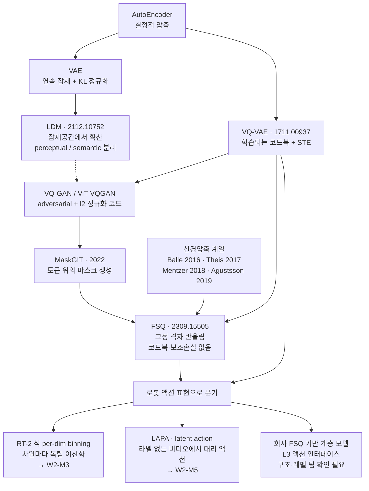
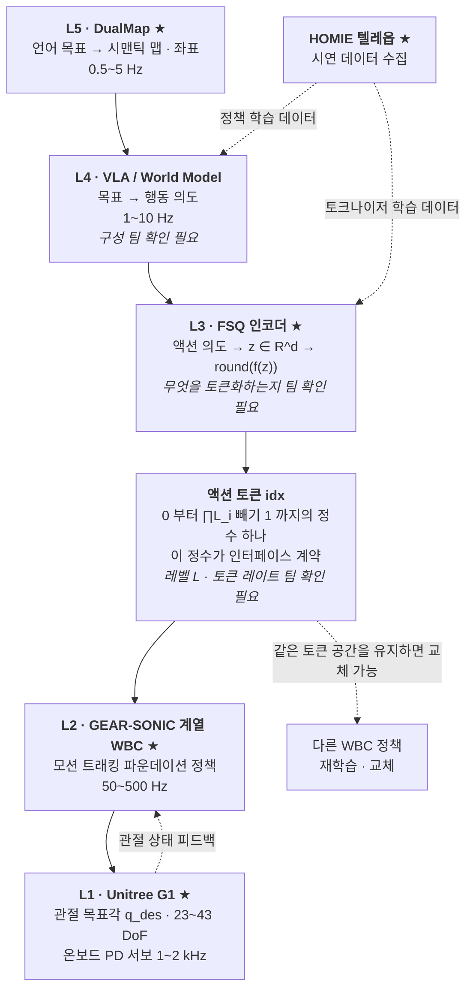
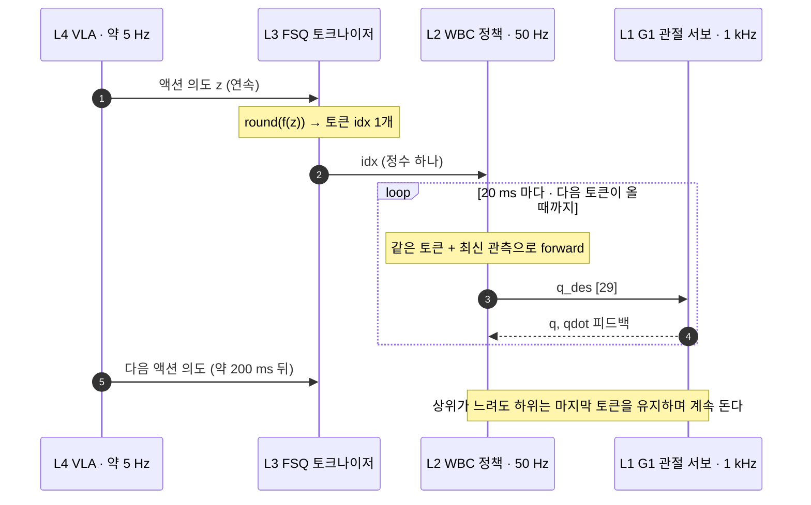

# 잠재공간과 이산화: VAE/LDM → VQ-VAE → FSQ

> **한 줄 요약**: 로봇의 연속적인 움직임 명령을 정수 하나로 바꾸는 두 가지 방법을 비교합니다. 하나는 쓸 수 있는 명령의 사전을 학습으로 만드는 방법이고 다른 하나는 사전 없이 눈금에 반올림하는 방법인데, 회사가 상위 지능과 하위 제어기 사이에 후자를 놓은 이유를 시스템 설계 문제로 답합니다.

---

## 0. 이 모듈 지도

**오늘의 질문** 셋입니다.

- 연속적인 관절 명령을 정수 하나로 바꾸면 무엇을 얻고 무엇을 잃는가?
- 사전을 학습시키면 왜 그 절반이 죽고, 사전을 없애면 왜 그 문제가 사라지는가?
- 회사가 상위와 하위 사이에 이 장치를 놓은 이유는 무엇이고 아직 답할 수 없는 것은?

| 절 | 무엇을 | 끝나면 할 수 있는 것 | 읽는 시간 |
|---|---|---|---|
| §1 | 왜 배우나와 이산 토큰의 세 이유 | 이 모듈이 회사 스택의 어느 자리인지 지목하기 | 3분 |
| §2 | 잠재공간과 잠재확산 | 압축을 두 단계로 쪼갠 이유 말하기 | 2분 |
| §3 | 이산화의 손익 | 액션 표현 세 선택지를 축으로 비교하기 | 2분 |
| §4 | 학습되는 사전과 그 대가 | 사전이 죽는 현상이 왜 구조적인지 논증하기 | 4분 |
| §5 | 사전을 없앤 방식 | 반올림 수식과 권장 격자 구성을 손으로 쓰기 | 7분 |
| §6 | 차원까지 채운 아키텍처 | 두 방식을 차원 라벨과 함께 나란히 그리기 | 1분 |
| §7 | 회사 스택 연결 ★ | 앉을 자리와 미확인 항목을 갈라내기 | 3분 |
| 마무리 | 오해, 한 장 정리, 퀴즈 10문항, 팀 질문 | 백지 재구성으로 자기 점검하기 | 18분 |


**선수 지식**

| 알아야 할 것 | 어디서 채우나 | 이 문서가 대신 설명하는 것 |
|---|---|---|
| 계층 스택 다섯 층과 주파수 예산 | [W1-M1 §3.4, §4.1](../01-physical-ai-landscape/lesson.md) | §7이 숫자만 갈아끼워 씀 |
| G1 관절 개수와 `nu`=29 | [W1-M2 §5](../02-simulator-bootcamp/lesson.md) | §6 블록도가 이 숫자를 씀 |
| 확산 모델이 무엇을 학습하는가 | [W1-M3](../03-diffusion-ddpm-dit/lesson.md) | §2에서 "잠재 위에서 돌린다"만 씀 |
| 오토인코더, 증거 하한, 재파라미터화 | 이 문서 §2 용어표 | 갭 영역이므로 정의부터 줌 |
| 확률분포, 신경망 학습, 최적화 | 보유 배경으로 가정 | 생성모델 전용 어휘는 절마다 용어표로 |

[W1-M4](../04-flow-matching/lesson.md)의 흐름 정합 유도는 전제가 아닙니다. §3 비교표에 이름만 나오고 그 절 용어표가 대신합니다.

**완료 기준**: 백지에 두 방식의 데이터 흐름을 차원 라벨과 함께 그리고, 고정 격자를 쓰는 이유와 그 대가를 각각 세 문장으로 쓴다. **소요** 이론 3h, 실습 3h

> 📌 **여기까지 정리**
> - 목적지는 반올림 수식, 사전이 죽는 논증, 배치도 셋이다
> - 세 질문에 §3과 §4와 §7이 답한다
> - 남는 것은 "우리는 무엇을 토큰화하는가"이고 §7.4가 미확인이다

---

## 1. 왜 이걸 배우나

| 용어 | 한 줄 정의 | 제어·LLM 비유 |
|---|---|---|
| **FSQ(Finite Scalar Quantization, 유한 스칼라 양자화)** | 각 채널을 정해진 개수의 눈금에 반올림해 연속 벡터를 정수로 바꾸는 이산화 | 이 모듈의 본체. 액션의 토크나이저 |
| **액션 토큰** | 로봇의 행동 의도를 나타내는 유한 집합의 정수 하나 | 감독제어기가 하위에 넘기는 운전 모드 번호 |
| **vocabulary(어휘 집합)** | 모델이 낼 수 있는 토큰의 전체 목록 | 유한한 명령 집합. 크기가 표현력의 상한 |
| **AR(AutoRegressive, 자기회귀) 예측** | 앞 토큰들을 조건으로 다음 토큰 하나를 예측해 이어붙이는 생성 방식 | 언어모델의 그 생성 방식. 이산 토큰이어야 그대로 쓴다 |
| **teacher forcing** | 학습 중에 모델의 예측 대신 정답 토큰을 다음 입력으로 넣는 방식 | 학습할 때 궤적 발산을 막는 장치 |
| **KV 캐시** | 자기회귀 생성에서 앞 토큰의 키와 값을 저장해 재계산을 피하는 장치 | 이전 계산 결과를 남겨 반복 연산을 줄이는 것 |
| **BPE(Byte Pair Encoding)** | 자주 붙어 나오는 글자 쌍을 하나로 병합해가며 유한한 토큰 목록을 만드는 절차 | 언어모델이 글자열을 정수 열로 바꾸는 그 앞단 |

이 모듈은 생성모델 복습이 아니라 회사 스택 L3 그 자체입니다.

[W1-M1 §3.4](../01-physical-ai-landscape/lesson.md)가 "승부처는 L3"라고 못박았습니다. L4와 L2를 각각 잘 만드는 것보다 둘을 잇는 인터페이스 설계가 시스템 성능과 교체 가능성을 결정한다는 이야기였습니다. 회사는 그 자리에 FSQ 이산 액션 토큰을 놓았고, **이 모듈이 끝나면 그 결정을 알고리즘 수준에서 재현할 수 있어야 합니다.**

### 1.1 왜 하필 이산 토큰인가

연속 setpoint를 넘겨도 되는데 굳이 정수 하나로 바꾸는 이유가 셋입니다.

- **① 상위 모델이 언어모델 그대로여도 된다.** 액션이 유한한 vocabulary의 토큰이면 cross-entropy 손실, teacher forcing, 샘플링 온도, KV 캐시가 통째로 재사용됩니다. RT-2가 "시각 언어 모델에 액션 토큰을 붙이면 웹 지식이 전이된다"를 보인 것이 이 트릭입니다
- **② 인터페이스가 정수 하나다.** 연속 인터페이스는 스케일과 정규화 규약과 차원 순서와 단위를 합의해야 하고 어긋나면 로봇이 조용히 잘못 움직입니다([W1-M2 §5.4](../02-simulator-bootcamp/lesson.md) 인덱스 어긋남의 확대판). 토큰 ID는 계약이 "0에서 999 중 하나"로 끝납니다
- **③ 하위 정책을 갈아끼울 수 있다.** 토큰의 의미를 디코더가 쥐고 있으니 같은 토큰 공간을 유지한 채 하위 전신 제어기를 재학습하거나 교체해도 상위는 그대로입니다

**FSQ가 액션의 BPE라는 비유는 은유가 아니라 구현 수준의 동형입니다.** 양쪽 다 연속 신호를 유한 vocabulary로 자르고 정수 ID 열로 바꿔 자기회귀 모델에 먹입니다.

**제어 대응**은 setpoint 인터페이스 표준화입니다. 감독제어기가 "밸브 개도 47.3%" 대신 정의된 운전 모드 번호를 넘기는 구조이고, 표현력은 줄지만 인터페이스가 검증 가능해집니다.

> 📌 **여기까지 정리**
> - 이 모듈은 상하위를 잇는 자리 그 자체다
> - 이산 토큰의 이유는 인프라 재사용, 계약 단순화, 하위 교체 셋이다
> - 셋 다 알고리즘 이점이 아니라 시스템 설계 이점이다

---

## 2. 잠재공간과 LDM

| 용어 | 한 줄 정의 | 제어·LLM 비유 |
|---|---|---|
| **AE(AutoEncoder, 오토인코더)** | 입력을 낮은 차원으로 눌렀다가 되살리도록 학습하는 인코더와 디코더 한 쌍 | 차원 축소를 신경망으로 하는 것. 모델 차수 축소와 같은 목적 |
| **잠재공간(latent space)** | 인코더가 입력을 눌러 넣는 저차원 표현 공간 | 축약된 상태 표현. 이후 모든 연산이 여기서 일어난다 |
| **VAE(Variational AutoEncoder, 변분 오토인코더)** | 잠재에 확률분포를 두고 그것을 학습해 새 샘플을 뽑을 수 있게 만든 오토인코더 | 결정적 압축에 확률 모델을 얹은 것 |
| **ELBO(Evidence Lower BOund, 증거 하한)** | 직접 계산할 수 없는 로그가능도 대신 최대화하는 그 하한 | 원 문제를 못 풀 때 풀 수 있는 완화 문제로 바꿔 푸는 자리 |
| **재파라미터화(reparameterization)** | 확률 샘플링을 "결정적 함수 + 외부 잡음"으로 다시 써서 미분이 통과하게 만드는 기법 | 잡음원을 루프 밖으로 빼 나머지를 결정계로 다루는 것 |
| **LDM(Latent Diffusion Model, 잠재 확산 모델)** | 픽셀이 아니라 오토인코더의 잠재공간에서 확산 과정을 학습하는 모델 | 확산을 원신호가 아니라 축약 좌표계에서 도는 것 |
| **perceptual compression(지각적 압축)** | 사람 눈에 안 보이는 고주파 디테일을 버리는 앞 단계 | 대역 제한 필터. 관측 잡음을 미리 잘라내는 전처리 |
| **semantic compression(의미 압축)** | 의미 있는 구조의 분포를 학습하는 뒤 단계 | 모델링 본체. 남은 신호의 동역학을 배우는 곳 |

필요한 것은 LDM(arXiv:2112.10752)이 무엇을 분리했는가 하나입니다. 증거 하한의 유도는 [W1-M3](../03-diffusion-ddpm-dit/lesson.md)이 그 자리입니다.

픽셀 공간에서 확산 모델을 학습하면 연산의 대부분이 눈에 보이지도 않는 고주파 디테일 복원에 갑니다. LDM은 이것을 둘로 쪼개, 오토인코더가 앞 단계를 맡아 이미지를 저해상도 잠재 $z$로 내리고 확산 모델이 그 잠재공간에서 뒤 단계만 학습합니다. **확산 모델이 자기가 잘하는 일에만 파라미터를 씁니다.**

같은 2단 구조가 로봇 쪽에서 두 번 반복됩니다.

- **비디오 월드모델의 백본**이 이것입니다. 픽셀 확산 비용이 감당되지 않아 비디오 토크나이저 위에서 돌립니다(W4-M2)
- **액션 헤드**도 같습니다. 압축된 잠재 위에서 청크를 생성합니다([W1-M3](../03-diffusion-ddpm-dit/lesson.md), [W1-M4](../04-flow-matching/lesson.md))

**이 잠재를 연속으로 둘 것인가 이산으로 만들 것인가가 갈림길입니다.** LDM 논문도 두 버전을 다 실험했습니다(계보는 [deep-dive.md](deep-dive.md) §1).

### 2.1 계보



> 📌 **여기까지 정리**
> - 잠재확산은 압축을 지각 단계와 의미 단계로 쪼갰다
> - 같은 2단 구조가 비디오 월드모델과 액션 헤드에서 반복된다
> - 그 잠재를 이산으로 만들 것인가가 갈림길이다

---

## 3. 연속에서 이산으로, 무엇을 얻고 무엇을 잃는가

| 용어 | 한 줄 정의 | 제어·LLM 비유 |
|---|---|---|
| **per-dim binning(차원별 독립 이산화)** | 액션 벡터의 각 차원을 따로 구간으로 잘라 차원마다 토큰 하나씩 내는 방식 | 채널마다 별도 양자화기를 다는 것. 채널 간 상관을 못 담는다 |
| **VQ(Vector Quantization, 벡터 양자화)** | 벡터 전체를 미리 정해둔 대표 벡터 하나로 대체하는 이산화 | 벡터를 코드 하나로 보내므로 차원 간 조합이 보존된다 |
| **다봉 분포(multimodal distribution)** | 정답이 여럿이라 봉우리가 여러 개인 분포 | 좌우 어느 쪽으로 돌아가도 되는 상황. 평균을 내면 가운데 벽으로 간다 |
| **FM(Flow Matching, 흐름 정합)** | 노이즈에서 데이터로 가는 속도장을 회귀로 학습하는 연속 생성 방식 | 연속 회귀 헤드 쪽의 현재 표준. 본체는 [W1-M4](../04-flow-matching/lesson.md) |
| **DAC(Digital-to-Analog Converter, 디지털 아날로그 변환기)** | 디지털 값을 유한 개수의 아날로그 레벨로 내보내는 소자 | 이 절의 앵커. 연속값을 정해진 눈금 개수로 잘라 표현하는 그 제약 |
| **데드밴드(deadband)** | 입력이 변해도 출력이 반응하지 않는 구간 | 격자 간격보다 작은 보정을 낼 수 없어 생기는 무반응 영역 |

선택지는 셋입니다. 연속 회귀(Diffusion Policy, pi0의 흐름 정합 헤드), 차원별 독립 이산화(RT-2, OpenVLA), 벡터 양자화 토큰(VQ, FSQ).

| 축 | 연속 회귀 | per-dim binning | 벡터 양자화 토큰 |
|---|---|---|---|
| 표현 | $a \in \mathbb{R}^{H \times D}$ 직접 생성 | 차원마다 독립 이산화, 토큰 $D$개/스텝 | 벡터 전체를 코드 1개(또는 소수)로 |
| 상위 모델 | 확산/FM 헤드 필요 | 자기회귀 언어모델 그대로 | 자기회귀 언어모델 그대로 |
| 분해능 | 부동소수점 | bin 폭이 상한 | 코드북 크기가 상한 |
| 차원 간 상관 | 헤드가 공동 모델링 | **독립 가정, 관절 간 상관을 잃음** | 코드가 조합을 통째로 담음 |
| 토큰 길이 | 해당 없음 | $H \times D$개 (G1이면 스텝당 29개) | 훨씬 짧음 |
| 다봉 분포 | 확산/FM으로 표현 가능 | 가능(softmax) | 가능(softmax) |
| 대표 약점 | 자기회귀 인프라와 겉돎, 샘플링 스텝 비용 | 시퀀스 폭발 + 차원 독립 가정 | 양자화 오차, 토크나이저 학습 필요 |

**이산화가 주는 것 넷.**

- 자기회귀 언어모델 인프라를 그대로 재사용합니다
- 다봉 분포를 softmax로 명시합니다. 연속 회귀는 평균으로 뭉갭니다
- 인터페이스가 단순해집니다(§1.1 ②)
- 상위에서 하위로 가는 대역폭이 크게 줄어듭니다

**이산화가 가져가는 것 셋.**

- **양자화 오차.** 유한 코드북에 없는 액션은 표현할 수 없습니다
- **분해능 상한.** 코드북 크기가 곧 표현 가능한 액션 수입니다
- **시간축 처리 부담.** 프레임마다 토큰을 뽑으면 시퀀스가 길어지고, 청크로 묶으면 청크 내부 해상도를 잃습니다

**제어 대응**은 DAC 분해능입니다. 12비트 변환기면 명령이 $2^{12}$개 격자 위에만 존재하고 간격보다 작은 보정을 낼 수 없습니다. 간격이 크면 두 격자 사이에서 진동하거나(리미트 사이클) 데드밴드가 생깁니다. **이산 액션 토큰이 같은 문제를 갖습니다.** 다만 하위 전신 제어기가 토큰 사이를 보간하므로 최종 관절 명령까지 계단이 되지는 않습니다(「흔한 오해」 세 번째).

per-dim binning의 한계는 위 표의 두 줄, 차원 독립 가정과 시퀀스 폭발입니다. **G1 29관절에 스텝당 29토큰, 청크 16스텝이면 464토큰입니다.** 대안은 W2-M3와 W2-M5가 다룹니다.

> 📌 **여기까지 정리**
> - 액션 표현은 연속 회귀, 차원별 이산화, 벡터 양자화 셋으로 갈린다
> - 이산화는 인프라와 계약과 대역폭을 얻고 정밀도와 시간 해상도를 내준다
> - 구도가 변환기 분해능 문제와 같고 하위 루프가 계단을 메운다

---

## 4. VQ-VAE의 학습되는 코드북과 그 대가

| 용어 | 한 줄 정의 | 제어·LLM 비유 |
|---|---|---|
| **코드북(codebook)** | 잠재를 대체할 대표 벡터들의 목록. VQ 계열에서는 학습 파라미터다 | 운전 모드 목록인데 그 내용까지 학습으로 정해지는 것 |
| **STE(Straight-Through Estimator, 직통 추정기)** | 미분 불가능한 반올림의 그래디언트를 1로 대체해 통과시키는 기법 | 비선형 요소를 이득 1로 국소 선형화해 루프를 닫는 관행 |
| **stop-gradient(`sg`)** | 순전파는 그대로 두고 역전파만 끊는 연산자 | 특정 경로의 피드백을 의도적으로 차단하는 것 |
| **commitment 손실** | 인코더 출력이 자기 코드워드에서 멀어지지 않게 붙잡는 항 | 반대 방향으로 건 두 번째 적분기 |
| **codebook collapse** | 코드북을 키울수록 실제로 쓰이는 코드워드 비율이 떨어지는 현상 | 도달하지 않는 상태공간 영역. 이 절의 본론 |
| **persistent excitation(지속 여자)** | 파라미터가 식별되려면 입력이 충분히 풍부해야 한다는 조건 | 이 절의 앵커. 여자가 부족하면 그 모드는 끝내 수렴하지 않는다 |
| **EMA(Exponential Moving Average, 지수이동평균)** | 갱신을 그래디언트 대신 이동평균으로 하는 방식 | 코드북 갱신의 실전 구현. 수식이 아니라 구현의 차이 |

VQ-VAE(arXiv:1711.00937)는 인코더 출력 $z \in \mathbb{R}^d$를 학습 가능한 코드북 $\mathcal{C} = \{c_1, \dots, c_{|\mathcal{C}|}\}$의 최근접 원소로 스냅합니다.

$$
k = \arg\min_{j} \| z - c_j \|_2, \qquad z_q = c_k
$$

$\arg\min$이 미분 불가능하므로 straight-through estimator(Bengio 2013)가 들어갑니다(대수는 [deep-dive.md](deep-dive.md) §3). 손실은 세 항입니다.

$$
\mathcal{L} = \underbrace{\|x - \hat x\|^2}_{\text{reconstruction}} + \underbrace{\|\,\mathrm{sg}[z] - c_k\|^2}_{\text{codebook}} + \beta \underbrace{\|z - \mathrm{sg}[c_k]\|^2}_{\text{commitment}}
$$

- **reconstruction**은 인코더와 디코더를 학습시킵니다. 정보를 잃지 말라는 압력입니다
- **codebook**은 코드워드를 자기에게 할당된 출력들의 중심으로 끌어당깁니다. 사실상 온라인 k-means이고 지수이동평균으로 대체하기도 합니다
- **commitment**는 반대 방향으로 인코더 출력을 붙잡고 $\beta$가 그 세기입니다

`sg` 위치가 다른 이유와 각 항의 편미분은 [deep-dive.md](deep-dive.md) §2에 있습니다.

### 4.1 codebook collapse가 구조적인 이유

문제는 두 번째 항입니다. 코드워드 $c_j$는 자기에게 할당된 샘플이 있을 때만 그래디언트를 받으므로, 한 번도 최근접으로 뽑히지 않은 코드워드는 영원히 업데이트되지 않습니다. **뽑히지 않아서 학습이 안 되고 학습이 안 돼서 뽑히지 않는 닭과 달걀 구조입니다.** 그래서 코드북을 키우면 오히려 실사용 비율이 떨어지고, FSQ 논문이 지목한 VQ의 1번 문제가 under-utilized codebooks입니다.

**제어 대응**은 상태공간에서 한 번도 방문되지 않는 영역의 문제입니다. 여자(勵磁, excitation)가 부족해 특정 모드가 관측되지 않으면 그 파라미터는 끝내 수렴하지 않습니다. persistent excitation 조건이 깨진 상태와 같습니다.

대응 트릭은 문헌에 **여섯 가지**가 쌓였고 세 갈래로 묶입니다(출처는 [deep-dive.md](deep-dive.md) §4).

- 죽은 코드를 되살리기: 재초기화, random restarts
- 선택을 부드럽게: 확률적 양자화, $\ell_2$ 정규화와 저차원 코드 매핑
- 목적함수를 바꾸기: entropy loss, 재파라미터화와 교대 최적화

**우회로가 여섯 가지나 나왔다는 것 자체가 문제가 튜닝이 아니라 설계에서 온다는 신호입니다.** FSQ의 출발점이 여기입니다.

### 4.2 코드북의 비용

코드북은 파라미터입니다. $|\mathcal{C}| = 2^{12} = 4096$, $d = 512$면 코드북만 약 2M 파라미터이고 지수이동평균 버퍼와 사용량 카운터와 재초기화 로직이 따라붙습니다.

**더 불편한 것은 이 텐서가 상위와 하위의 공유 상태라는 점입니다.** 재학습하면 코드북이 바뀌고 같은 토큰 ID가 다른 것을 의미하게 됩니다.

> 📌 **여기까지 정리**
> - 코드북은 학습 파라미터이고 세 항 중 둘이 그것을 움직인다
> - 안 뽑힌 코드워드는 영원히 안 뽑히므로 collapse는 설계 문제다
> - 코드북은 파라미터 비용이자 상하위가 공유하는 상태다

---

## 5. 코드북을 없앤 FSQ

| 용어 | 한 줄 정의 | 제어·LLM 비유 |
|---|---|---|
| **바운딩 함수 $f$** | 인코더 출력을 반올림 격자 범위 안으로 눌러 넣는 함수 | 액추에이터 포화를 모델에 미리 넣는 것 |
| **레벨 구성 $\mathcal{L}$** | 채널별 격자 눈금 개수를 모은 벡터 $[L_1, \dots, L_d]$ | 채널마다 분해능을 따로 정한 것. 학습되지 않는 하이퍼파라미터 |
| **implied codebook** | 코드북을 저장하지 않고 레벨 조합의 곱으로 암묵 정의되는 격자 | 회로 설계 시점에 고정되는 변환기의 양자화 레벨 |
| **mixed-radix 열거** | 채널별 이산 좌표를 정수 인덱스 하나로 바꾸는 전단사 매핑 | 자릿수마다 진법이 다른 수 체계. 토큰 ID로 바로 쓰는 이유 |
| **코드북 사용률(usage)** | 검증 데이터를 인코딩할 때 최소 한 번은 쓰인 코드의 비율 | 이 논문의 대표 지표. 표현 예산이 실제로 쓰이는가 |
| **FID(Fréchet Inception Distance)** | 생성 이미지와 실제 이미지의 특징 분포 거리. 낮을수록 좋다 | 이미지 생성 품질의 관례 지표 |
| **CFG(Classifier-Free Guidance)** | 조건부와 무조건 예측을 섞는 비율을 키워 조건 충실도를 올리는 손잡이 | 추론 시점의 이득 조절 노브 |

**Finite Scalar Quantization: VQ-VAE Made Simple**(arXiv:2309.15505 v2). 아이디어는 한 문장입니다. **잠재를 아주 낮은 차원으로 내린 뒤 각 채널을 고정된 정수 격자에 반올림한다.**

### 5.1 수식

$d$차원 표현 $z \in \mathbb{R}^d$에 바운딩 함수 $f$를 적용하고 정수로 반올림합니다.

$$
\hat z = \mathrm{round}(f(z)), \qquad f: z_i \mapsto \left\lfloor L/2 \right\rfloor \tanh(z_i)
$$

$\tanh$가 값을 $(-1, 1)$로 누르고 $\lfloor L/2 \rfloor$가 그것을 $L$개 정수 격자의 폭으로 늘립니다. 각 채널이 $L$개 값 중 하나를 취하므로 implied codebook이 $|\mathcal{C}| = L^d$이고, 채널마다 레벨을 다르게 두면 $\mathcal{L} = [L_1, \dots, L_d]$에 $|\mathcal{C}| = \prod_{i=1}^{d} L_i$입니다(Fig 1 예시는 $d = 3$, $L = 3$, $|\mathcal{C}| = 27$).

- $\mathcal{C}$의 원소는 $\{1, \dots, L^d\}$ 정수와 전단사(bijection)로 열거됩니다. **그래서 토큰 ID로 바로 쓸 수 있고** 이 성질이 §1.1의 이유 ①과 ②를 뒷받침합니다
- 그래디언트는 VQ와 똑같이 `round_ste: x ↦ x + sg(round(x) - x)`입니다
- 짝수 $L$에는 비대칭 $f$가 필요합니다. 반올림이 정수로 가서 격자 중심이 어긋나기 때문이고 일반형은 원문 부록 A.1에 있습니다

**격자는 $\mathcal{L}$이라는 하이퍼파라미터로 고정돼 있을 뿐 학습되지 않습니다. 코드북이 없습니다.**

### 5.2 왜 collapse가 원천 차단되는가

코드북이 학습되지 않으므로 §4.1의 고리가 성립하지 않습니다. 격자점은 파라미터가 아니므로 죽을 수가 없습니다.

그러면 사용률은 무엇이 강제하는가? **재구성 손실 하나입니다.** 인코더가 출력을 좁은 영역에 몰면 서로 다른 입력이 같은 격자점으로 붕괴하고 디코더가 구분할 수 없어 복원이 나빠집니다. 손실을 낮추려면 인코더는 표현을 격자 전체에 퍼뜨릴 수밖에 없습니다.

논문이 §2 말미에 밝힌 설계 목표도 셋으로 같습니다.

- 보조 손실을 없앤다
- 설계상(by design) 코드북 사용률을 높게 가져간다
- VQ의 drop-in replacement가 되도록 기능적 셋업을 유지한다

### 5.3 원문 Table 1의 권장 레벨 구성

| Target Size $\|\mathcal{C}\|$ | $2^8$ | $2^{10}$ | $2^{12}$ | $2^{14}$ | $2^{16}$ |
|---|---|---|---|---|---|
| Proposed $\mathcal{L}$ | `[8, 6, 5]` | `[8, 5, 5, 5]` | `[7, 5, 5, 5, 5]` | `[8, 8, 8, 6, 5]` | `[8, 8, 8, 5, 5, 5]` |

검산하면 곱이 target과 정확히 같지 않습니다. $8 \cdot 5^3 = 1000 \approx 1024$이고 $7 \cdot 5^4 = 4375 \approx 4096$입니다. **논문 표현도 "approximately match"이고** 2의 거듭제곱이어야 할 이유는 없습니다(검산 전량은 [deep-dive.md](deep-dive.md) §5).

**휴리스틱은 모든 $i$에 대해 $L_i \ge 5$입니다**(원문 §3.2). 논문은 모든 $\mathcal{L}$ 선택이 최적은 아니며 이 규칙이 실험 전반에서 잘 동작했다고만 서술합니다. 레벨이 2에서 3인 채널은 정보를 거의 못 담으면서 차원만 늘립니다.

### 5.4 차원의 역전

| | VQ | FSQ |
|---|---|---|
| Quantization | $\arg\min_{c \in \mathcal{C}} \|z - c\|$ | $\mathrm{round}(f(z))$ |
| Gradients | STE | STE |
| Aux. Losses | Commitment, codebook, entropy loss | **-** |
| Tricks | EMA on codebook, codebook splitting, projections, … | **-** |
| Parameters | Codebook | **-** |

*(원문 Fig 2 왼쪽 표)*

여기에 차원 규모가 붙습니다. **FSQ는 $d < 10$이 보통이고 VQ는 $d \ge 512$가 보통입니다.** 512차원으로 하던 일을 4차원으로 한다는 말이라 처음 보면 역설 같습니다.

조합 폭발 때문입니다. VQ의 코드북은 $d$차원 공간에 흩뿌려진 점들이고 학습으로 좋은 위치에 놓아야 하니 $d$가 커야 합니다. FSQ는 각 채널을 $L_i$등분해 격자의 곱으로 코드를 만들므로 $\mathcal{L} = [8,5,5,5]$면 $d = 4$인데 코드는 1000개이고 채널 하나마다 $L$배로 뜁니다. **저차원과 곱 구조가 고차원과 학습 구조를 대신합니다.**

- 코드북 2M이 사라지고 인코더 최종 레이어도 출력 차원이 $d$로 작아 함께 줄어듭니다. 논문은 격차를 메우려 dense 레이어를 붙여봤지만 추가 이득이 없었다고 보고합니다
- 결론은 **같은 코드북 크기에서 FSQ가 파라미터가 더 적다**는 것입니다

### 5.5 실험 결과를 공정하게 읽기

적용처는 MaskGIT(이미지 생성)와 UViM(depth estimation, colorization, panoptic segmentation)입니다. **성능 저하는 0.5~3% 수준이고 코드북 사용률은 대부분의 모델에서 약 100%를 보조 손실 없이 달성했습니다.**

MaskGIT ImageNet 256 결과입니다(원문 Fig 4 상단).

| Model | Source | CFG | Sampling FID↓ | Precision↑ | Recall↑ | Usage↑ |
|---|---|---|---|---|---|---|
| MaskGIT (VQ) | Ours | 0.1 | 4.509 | 0.860 | 0.465 | **81%** |
| MaskGIT (FSQ) | Ours | 0.2 | 4.534 | 0.864 | 0.453 | **100%** |
| MaskGIT (VQ) | GitHub | - | 4.916 | 0.836 | 0.489 | — |
| ADM (Dhariwal & Nichol 2021) | — | 1.5 | 4.59 | 0.83 | 0.52 | — |

- FSQ는 $\mathcal{L} = [8,5,5,5]$로 Table 1의 $2^{10}$ 행이고 VQ는 코드북 1024에 entropy loss입니다
- FSQ가 보정 전 recall이 높고 precision이 낮은 곳에 착지해 CFG를 강하게(0.2 대 0.1) 걸었습니다. 설정 전량은 [deep-dive.md](deep-dive.md) §6

**FID는 사실상 동률(4.509 대 4.534)입니다.** 갈리는 것은 코드북을 얼마나 쓰는가와 그 결과에 장치가 얼마나 필요한가입니다. **대표 숫자는 FID가 아니라 사용률 81% 대 100%입니다.**

> ⚠️ **"FSQ가 항상 낫다"는 틀린 요약입니다.** 원문 Fig 3에서 코드북 크기가 $2^{10}$을 **넘어서면** FSQ가 Sampling FID와 사용률에서 VQ를 앞서고 VQ는 오히려 지표가 악화되지만, **그 이하의 작은 코드북에서는 VQ가 더 낫습니다.** Reconstruction FID는 코드북 크기와 상관되며 FSQ는 코드북을 키울수록 개선됩니다.

뿌리는 §2.1 계보의 신경압축 줄기이고, 논문 스스로 "FSQ has not been used for vision tasks outside of compression"이라고 씁니다. **새 알고리즘이 아니라 압축 분야의 오래된 도구를 생성모델 토크나이저 자리에 앉힌 것입니다**(구성값은 [deep-dive.md](deep-dive.md) §1).

> 📌 **여기까지 정리**
> - 잠재를 저차원으로 내리고 채널마다 고정 격자에 반올림하는 것이 전부다
> - 격자가 파라미터가 아니므로 사용률은 재구성 손실이 강제한다
> - 성능은 동률이고 갈리는 것은 사용률 81% 대 100%다

---

## 6. 차원까지 채운 아키텍처

G1 관절 궤적을 토큰화하면 어떤 모양이 되는지를 예시로 채운 것입니다. 회사 구현이 아니라 이 모듈 실습([`practice/`](practice/))의 설계입니다.

```
■ FSQ 경로 ─ 코드북 텐서가 없다
════════════════════════════════════════════════════════════════════════════════
  입력                      인코더            바운딩                반올림
  x ∈ R^[T=16, 29]  ───>  z ∈ R^[d=4]  ───>  f(z) ∈ R^[4]  ───>  ẑ ∈ Z^[4]
   T  = 청크 길이           Enc_θ          f: z_i ↦ ⌊L_i/2⌋·tanh(z_i)   round_ste
   29 = G1 관절 수                          채널 i를 L_i 레벨 안으로 압착
        (W1-M2 실측 nu=29)
                                          L = [8, 5, 5, 5]
                                          ẑ_1 ∈ {0..7},  ẑ_2..4 ∈ {0..4}
                                                  │
                          전단사 열거              ▼
                          idx = ẑ_1 + 8·(ẑ_2 + 5·(ẑ_3 + 5·ẑ_4))
                          토큰 ID  idx ∈ {0, ..., 999}
                                   |C| = ∏ L_i = 8·5·5·5 = 1000  →  log2(1000) = 9.97 bits
                                                  │
                                                  ▼
                          디코더   Dec_φ(ẑ) ───> x̂ ∈ R^[16, 29]
  학습 파라미터: Enc_θ + Dec_φ.  보조 손실: 없음.  코드북: 없음.
  손실:  L = ||x - x̂||²                        ← 이 한 항이 사용률까지 강제한다
════════════════════════════════════════════════════════════════════════════════

■ VQ-VAE 경로 ─ 같은 입력, 코드북 텐서가 추가된다
════════════════════════════════════════════════════════════════════════════════
  x ∈ R^[16, 29] ───> Enc_θ ───> z ∈ R^[d=512]
                                       │
                                       │  k = argmin_j || z − C_j ||₂
              코드북 C ∈ R^[|C|=1024, 512]      ← 학습되는 파라미터 524,288개
              (논문 예시 |C|=2^12, d=512 면 약 2M)  + EMA 버퍼 + 사용량 카운터
                                       │
                                       ▼
                         z_q = C_k ∈ R^[512] ───> Dec_φ ───> x̂ ∈ R^[16, 29]
                         토큰 ID = k ∈ {0..1023}
  손실:  L = ||x − x̂||²  +  ||sg[z] − C_k||²  +  β·||z − sg[C_k]||²
              재구성           코드북             commitment
  + 필요시: 재초기화 / random restart / entropy loss / l2 정규화 …
════════════════════════════════════════════════════════════════════════════════
```

**두 그림의 유일한 구조적 차이는 가운데 코드북 텐서의 유무입니다.** 거기서 보조 손실, 트릭, 파라미터, 재학습 시 토큰 의미 변화가 전부 따라옵니다.

압축률 감각도 잡아둡니다.

- G1 한 프레임은 float32 29개, 곧 928 bits이고 청크 16프레임이면 14,848 bits입니다
- 토큰 하나(9.97 bits)로 보내면 **압축률이 약 1,489배**입니다
- 크게 압축한다는 것은 그만큼 버린다는 뜻이고 **무엇을 버려도 되는지를 정하는 것이 토크나이저 설계입니다**

> 📌 **여기까지 정리**
> - 두 경로의 구조적 차이는 가운데 코드북 텐서 하나뿐이다
> - 거기서 보조 손실과 트릭과 파라미터와 인터페이스 불안정이 파생된다
> - 청크 하나를 토큰 하나로 보내면 약 1,489배 압축이고 그만큼 버린다

---

## 7. 회사 스택 연결 ★

| 용어 | 한 줄 정의 | 제어·LLM 비유 |
|---|---|---|
| **WBC(Whole-Body Control, 전신 제어)** | 다관절 로봇의 전신 자세와 균형을 함께 잡는 하위 제어 계층 | 이 스택의 L2. 빠르고 반사적인 안쪽 루프 |
| **VLA(Vision-Language-Action, 시각 언어 행동 모델)** | 이미지와 언어를 받아 로봇 액션을 직접 내놓는 상위 모델 | 이 스택의 L4. 느리고 똑똑한 바깥 루프. 상세는 W2 |
| **DoF(Degree of Freedom, 자유도)** | 로봇이 독립적으로 움직일 수 있는 축의 개수 | G1은 23에서 43 사이 |
| **명령 공백** | 상위가 다음 명령을 못 낸 사이 하위에게 먹일 것이 없어지는 구간 | 캐스케이드 구조에서 바깥 루프가 늦을 때 생기는 문제 |
| **디커플링(decoupling)** | 한쪽을 바꿔도 다른 쪽을 안 건드려도 되게 만드는 설계 | 계약만 고정하면 구현을 갈아끼울 수 있는 상태 |
| **universal token space** | 여러 상위 입력원을 하나의 정책에 물리기 위한 공통 토큰 공간 | 마스터플랜이 정리한 SONIC의 핵심 장치 |

### 7.1 FSQ가 앉는 자리



### 7.2 왜 하필 이 경계인가

[W1-M1 §4.1](../01-physical-ai-landscape/lesson.md)의 부등식이 다시 쓰입니다. L4는 1에서 10 Hz, L2는 50에서 500 Hz라 상위가 한 번 생각하는 동안 하위는 수십 번 돌아야 하고, 그 사이 먹일 명령이 끊기면 명령 공백에 빠집니다.

**인터페이스가 토큰이면 이 문제가 완화됩니다.** 하위 정책은 마지막 토큰을 자기 관측과 함께 계속 소비하면서 50에서 500 Hz로 돌 수 있습니다. 연속 궤적 청크는 소진되면 끝이지만 토큰은 모드나 의도의 라벨에 가까워 홀드가 의미를 갖습니다.



> ⚠️ 위 타이밍 다이어그램은 일반적 계층 구조의 논리이며 회사 구현의 실제 토큰 레이트와 홀드 정책이 아닙니다. §7.4의 확인 대상입니다.

디커플링도 같은 그림에서 읽힙니다. 토큰의 의미를 하위가 해석하는 한 하위 정책을 갈아끼워도 상위는 그대로입니다. 반대로 **토크나이저를 재학습하면 토큰 ID의 의미가 바뀌므로 상하위를 동시에 갱신해야 하고** 인터페이스 버전 관리 문제가 생깁니다. FSQ는 격자가 고정이라 바뀌는 것이 인코더와 디코더의 매핑뿐입니다.

### 7.3 SONIC의 "universal token space"와의 관계

마스터플랜 §2.2는 SONIC(arXiv:2511.07820)의 핵심을 universal token space로 정리하고, 그것이 시각 언어 행동 모델과 가상현실 텔레옵과 게임패드 기반 kinematic planner를 하나의 정책에 물리는 장치라고 봅니다. 이 해석대로면 그 토큰 공간과 회사 FSQ 토큰이 만나는 곳이 L3와 L2의 접점입니다.

> 📌 **이것은 마스터플랜의 해석이고 논문 직접 확인은 W3-M4입니다.** 여기서는 "그런 접점이 있을 것"이라는 가설까지만 세웁니다.

### 7.4 확인되지 않은 것

| 항목 | 무엇이 궁금한가 | 왜 중요한가 | 상태 |
|---|---|---|---|
| 토큰화 대상 | 관절 각도? 관절 속도? 궤적 청크? latent motion? | 인코더 입력 차원과 실습 설계가 여기서 갈림 | 🔴 미확인 |
| 레벨 $\mathcal{L}$과 $d$ | Table 1 계열인가, 자체 튜닝인가 | 코드북 크기 = 표현 가능한 의도의 수 | 🔴 미확인 |
| 토큰 레이트 | 초당 몇 토큰인가. L4 호출당 1개? N개? | §7.2 부등식을 실수로 채우는 데 필요 | 🔴 미확인 |
| 시간축 처리 | 프레임당 1토큰인가, 청크당 N토큰인가 | 청크 내부 해상도와 반응성의 트레이드오프 | 🔴 미확인 |
| 학습 데이터 | 텔레옵(HOMIE)? 모캡 리타게팅? 시뮬 롤아웃? | 토큰 공간이 무엇의 분포를 덮는지 결정 | 🔴 미확인 |
| SONIC 접점 | 토큰이 WBC 입력의 어느 자리로 들어가는가 | L3와 L2 계약의 실체 | 🔴 미확인 |

**여섯 항목 전부 팀 확인 필요이고 추측하지 않았습니다.** 질문 문장은 「팀에 물어볼 것」에 1:1로 있습니다.

> 📌 **여기까지 정리**
> - 토큰은 느린 상위와 빠른 하위 사이에 앉고 홀드가 의미를 갖는다
> - 토크나이저 재학습은 토큰 의미를 바꿔 버전 관리 문제를 남긴다
> - 우리 구현이 무엇을 토큰화하는지는 여섯 항목 모두 미확인이다

---

## 흔한 오해

### 오해 1 "FSQ는 VQ의 상위호환이다"

§5.5의 경고 상자가 반박합니다. 코드북 $2^{10}$ **이하**에서는 VQ가 더 낫고 성능 저하도 0.5~3%로 보고됐으니 공짜가 아닙니다. 주장은 "대형 코드북에서 훨씬 단순한 장치로 코드북을 더 잘 쓴다"입니다.

**시스템 관점의 진짜 이득은 FID 소수점이 아니라 보조 손실과 트릭과 코드북 파라미터가 통째로 사라지는 것입니다.** §5.4 표의 오른쪽 열이 전부 빈칸인 것을 보세요. 운영과 디버깅에서 사라지는 항목의 목록이 그 빈칸입니다.

### 오해 2 "코드북 사용률 100%면 표현력이 최대다"

사용률은 **필요조건이지 충분조건이 아닙니다.** 모든 코드가 쓰이더라도 그것이 데이터의 중요한 변동 방향을 담는지는 별개 문제이고, 그래서 논문도 usage와 별도로 Reconstruction FID와 Sampling FID를 함께 봅니다.

**제어로 옮기면** "모든 변환기 코드를 쓰고 있다"와 "그 배치가 제어에 필요한 분해능을 주고 있다"는 다른 질문입니다. 전자는 계측기가, 후자는 사양이 답합니다. 실습에서 사용률과 재구성 오차를 같이 보라고 하는 이유입니다.

### 오해 3 "이산 토큰이면 정보가 손실되니 정밀 제어가 불가능하다"

계층을 혼동한 오해입니다. **토큰은 의도의 해상도이지 관절 명령의 해상도가 아닙니다.** 하위 전신 제어기가 50에서 500 Hz로 관측 피드백을 받아 연속적인 $q_{des}$를 만들고 그 아래 온보드 PD 서보가 1에서 2 kHz로 추종합니다([W1-M1 §3.1](../01-physical-ai-landscape/lesson.md)).

단서가 둘입니다. 회사 구현에서 실제로 어떻게 되는지는 §7.4대로 미확인이고, 양자화 오차가 사라지지도 않습니다. **토큰 공간이 표현하지 못하는 의도는 애초에 상위가 보낼 수 없습니다.**

### 오해 4 "$|\mathcal{C}| = \prod L_i$ 니까 레벨을 크게 하면 그냥 좋다"

두 가지가 걸립니다.

- $L_i \ge 5$는 **하한이지 "클수록 좋다"가 아닙니다.** Table 1의 권장 구성은 $L_i$를 키우는 대신 **채널 수를 늘려** 목표 크기에 도달합니다. $2^{16}$ 행이 $[8,8,8,5,5,5]$로 $d=6$인 것을 보세요
- 코드북을 키우면 상위 모델의 출력 vocabulary가 커지고 학습 데이터가 더 필요합니다. **표현력과 학습 가능성의 트레이드오프이고**, 넓게 깔아도 데이터가 덮지 못하는 영역은 죽은 채로 남습니다

---

## 한 장 정리

| 절 | 핵심 한 줄 |
|---|---|
| §1 | 승부처는 상위와 하위를 잇는 자리이고 이산 토큰의 이유는 인프라와 계약과 교체 가능성 셋이다 |
| §2 | 잠재확산이 압축을 지각 단계와 의미 단계로 쪼갰고 그 잠재를 이산으로 둘지가 갈림길이다 |
| §3 | 이산화는 넷을 얻고 셋을 잃으며 그 구도가 변환기 분해능 문제와 같다 |
| §4 | 코드북이 학습 파라미터라서 안 뽑힌 코드는 영원히 안 뽑힌다. 우회로가 여섯 가지 쌓였다 |
| §5 | 격자를 고정하면 collapse가 성립할 수 없고 사용률을 재구성 손실 하나가 강제한다 |
| §6 | 두 경로의 구조적 차이는 가운데 코드북 텐서 하나이고 나머지는 전부 그 파생이다 |
| §7 | 토큰은 느린 상위와 빠른 하위 사이에 앉고 우리 구현의 여섯 항목은 미확인이다 |


**이제 할 수 있게 된 것**

- 반올림 수식과 전단사 열거를 손으로 쓰고 왜 그것이 토큰 ID가 되는지 설명한다
- 사전이 죽는 현상을 닭과 달걀 논리로 논증하고 격자 고정이 그 고리를 어디서 끊는지 지목한다
- 회사가 이 자리에 이 방식을 쓸 만한 이유와 아직 답할 수 없는 것을 갈라서 말한다

---

## 셀프 체크 퀴즈

1. LDM이 픽셀 공간 대신 잠재공간에서 확산하는 이유를 perceptual compression과 semantic compression으로 설명하라. 이 구조가 비디오 월드모델에서 반복되는 이유는?
2. 이산 액션 토큰이 인터페이스로서 갖는 시스템적 이점 3가지를 들고 각각을 제어의 setpoint 인터페이스 표준화에 대응시켜라.
3. VQ-VAE 손실 3항을 쓰고 각 항이 무엇을 어느 방향으로 끌어당기는지 설명하라. `sg`가 각 항에 걸린 위치가 왜 다른가?
4. codebook collapse가 왜 하이퍼파라미터 문제가 아니라 구조적 문제인지 닭과 달걀 논리로 설명하라. 이 현상의 제어 쪽 대응 개념은?
5. FSQ의 $\hat z = \mathrm{round}(f(z))$에서 $f$의 역할을 두 가지로 나눠 설명하라. STE가 없으면 무엇이 안 되는가?
6. FSQ에서 codebook collapse가 원천 차단되는 이유를 **보조 손실을 언급하지 않고** 재구성 손실만으로 설명하라.
7. **(계산)** Table 1의 $2^{12}$ 행은 $\mathcal{L} = [7,5,5,5,5]$다. $|\mathcal{C}|$를 계산하고 target $2^{12}$와 비교하라. 왜 정확히 일치시키지 않는가?
8. **(계산)** VQ-VAE에서 $|\mathcal{C}| = 2^{12}$, $d = 512$일 때 코드북 파라미터 수는? 같은 코드북 크기의 FSQ는 몇 개인가?
9. **(계산)** G1 관절 29개짜리 프레임 16개(float32)를 $\mathcal{L} = [8,5,5,5]$ FSQ 토큰 1개로 압축했다. 원본 비트 수, 토큰 비트 수, 압축률을 구하라. 이 숫자가 좋은 소식인가 나쁜 소식인가?
10. "FSQ가 VQ보다 항상 낫다"가 왜 틀린 요약인지 원문 Fig 3의 내용으로 반박하고 그럼에도 회사가 L3에 FSQ를 쓸 만한 이유를 시스템 관점에서 세 가지 대라.

<details>
<summary>정답 보기</summary>

1. 픽셀 확산은 연산의 대부분을 지각적으로 무의미한 고주파 디테일 복원에 씁니다. LDM은 오토인코더가 perceptual compression(고주파 제거)을 맡고, 확산 모델은 잠재공간에서 semantic compression(의미 구조의 분포)만 학습하게 분리합니다. 비디오는 프레임과 시간이 곱해져 픽셀 공간 비용이 더 감당 안 되므로 같은 분리가 필수가 됩니다. 비디오 토크나이저 위에서 생성 모델을 돌립니다(W4-M2).

2. ① 자기회귀 언어모델 인프라 재사용. cross-entropy와 샘플링과 KV 캐시가 그대로입니다(RT-2 레시피). ② 인터페이스 단순성. 스케일과 단위와 차원 순서 협상이 사라지고 계약이 0에서 999 중 하나가 됩니다. ③ 디커플링. 하위 정책을 재학습하거나 교체해도 상위는 불변입니다. 제어로 옮기면 감독제어기가 아날로그 setpoint 대신 정의된 운전 모드 번호를 하위 루프에 넘기는 구조입니다. 표현력은 줄지만 인터페이스가 검증 가능해지고 하위 구현 교체가 자유로워집니다.

3. $\mathcal{L} = \|x-\hat x\|^2 + \|\mathrm{sg}[z]-c_k\|^2 + \beta\|z-\mathrm{sg}[c_k]\|^2$. 재구성 항은 인코더와 디코더를 학습시킵니다(정보 보존 압력). 코드북 항은 `sg`가 $z$에 걸려 **코드워드만** 움직이며 할당된 샘플들의 중심으로 끌려갑니다(온라인 k-means). commitment 항은 `sg`가 $c_k$에 걸려 **인코더만** 움직이며 출력이 코드워드에서 멀어지지 않게 붙잡습니다. `sg` 위치가 다른 이유는 두 항이 서로 반대 방향의 당김을 **각각 한쪽에만** 적용하기 위해서입니다.

4. 코드워드는 최근접으로 선택될 때만 그래디언트를 받습니다. 한 번도 안 뽑히면 업데이트가 안 되고, 그러면 계속 안 뽑힙니다. 초기화와 데이터 분포에 따라 결정되는 고리라 학습률 조정으로 풀리지 않습니다. 코드북을 키울수록 심해집니다. 제어에서는 persistent excitation 부족에 해당합니다. 여자가 부족해 방문되지 않는 상태공간 영역의 파라미터는 끝내 식별되지 않습니다.

5. $f$는 ① $\tanh$로 값을 유계로 만들고(반올림 격자 밖으로 나가지 않게) ② $\lfloor L/2 \rfloor$ 스케일링으로 $L$개 정수 격자 폭에 맞춥니다. STE(`x + sg(round(x)-x)`)가 없으면 `round`의 그래디언트가 거의 모든 곳에서 0이라 인코더로 학습 신호가 흐르지 않습니다.

6. 격자가 고정이므로 인코더가 출력을 좁은 영역에 몰면 서로 다른 입력이 같은 격자점으로 붕괴합니다. 디코더가 구분할 수 없어 재구성 손실이 커집니다. 손실을 낮추려면 인코더가 스스로 표현을 격자 전체에 퍼뜨려야 합니다. 즉 사용률이 목적함수의 결과로 강제됩니다.

7. $7 \times 5^4 = 7 \times 625 = 4375$. target $2^{12} = 4096$보다 279 큽니다(약 6.8% 초과). 논문 표현은 "approximately match"입니다. 코드북 크기가 2의 거듭제곱이어야 할 이유는 없고(비트 정렬 관행일 뿐), $L_i \ge 5$ 휴리스틱과 채널 수 조합에서 정확한 2의 거듭제곱이 나오지 않기 때문입니다.

8. VQ는 $2^{12} \times 512 = 4096 \times 512 = 2{,}097{,}152$이므로 약 **2M 파라미터**입니다. FSQ는 **0개**입니다. 코드북이 없습니다($\mathcal{L}$은 하이퍼파라미터). 덤으로 인코더 최종 레이어도 출력이 $d < 10$이라 더 작습니다. 논문은 dense 레이어를 더 붙여 파라미터를 맞춰봤지만 추가 이득이 없었다고 보고했습니다.

9. 원본은 $16 \times 29 \times 32 = 14{,}848$ bits입니다. 토큰은 $\log_2(1000) = 9.97$ bits이고 저장은 10 bits입니다. 압축률은 $14{,}848 / 9.97 \approx$ **1,489배**입니다. 좋은 소식이자 나쁜 소식입니다. 상위에서 하위로 가는 대역폭이 사실상 공짜가 되지만 그만큼 버렸다는 뜻이므로, 청크 내부의 시간적 디테일은 디코더가 복원하는 사전지식에 의존합니다. 무엇을 버려도 되는지를 정하는 것이 토크나이저 설계이고 그래서 학습 데이터 분포가 결정적입니다.

10. Fig 3에 따르면 코드북 $2^{10}$ **이하**에서는 VQ가 낫고, FSQ의 우위(Sampling FID와 usage)는 그보다 큰 코드북에서 나타납니다. MaskGIT 실험에서도 FID는 4.509(VQ)와 4.534(FSQ)로 사실상 동률이며 FSQ 적용 시 0.5~3%의 성능 저하가 보고됐습니다. 그럼에도 L3에 쓸 이유는 셋입니다. ① 운영 단순성. 보조 손실과 EMA와 재초기화와 entropy loss가 전부 사라져 재현과 디버깅이 쉽습니다. ② 사용률이 설계상 보장. 액션 토큰 공간을 키워도 죽은 코드가 안 생겨 표현 예산이 실제로 쓰입니다. ③ 인터페이스 안정성. 코드북 텐서라는 공유 상태가 없어 상하위 계약이 정수 하나로 닫힙니다. 단, 회사가 실제로 이 이유들로 선택했는지는 §7.4대로 미확인입니다.

</details>

---

## 팀에 물어볼 것

> [`notes/questions-for-team.md`](../../../notes/questions-for-team.md)의 W1 섹션에 복사할 것. P0 3번("FSQ 모델의 실제 구조는?")을 실행 가능한 수준으로 쪼갠 후속 질문입니다.

1. **`M5-1` FSQ 토크나이저의 입력은 정확히 무엇인가?** 관절 각도 벡터인가, 각속도를 포함한 상태인가, $T$ 스텝짜리 궤적 청크인가, 상위 모델이 만든 latent motion인가? 정규화 규약(관절 range 기준인가 표준화인가)은? 실습과 W2-M5 논증의 입력 차원이 여기서 정해집니다.
2. **`M5-2` 시간축을 어떻게 다루는가. 프레임당 1토큰인가, 청크당 N토큰인가?** 그리고 **토큰 레이트는 초당 몇 개인가?** 상위 L4가 몇 Hz로 새 토큰을 내고 하위가 그 사이를 어떻게 메우는가(홀드인가, 보간인가, 토큰 큐인가)? [W1-M1 §4.1](../01-physical-ai-landscape/lesson.md) 부등식을 실수로 채우려면 필요합니다.
3. **`M5-3` 레벨 구성 $\mathcal{L}$과 차원 $d$는 무엇인가?** 원논문 Table 1의 권장값($[8,5,5,5]$ 등)을 그대로 쓰는가, 액션 도메인에 맞춰 재탐색했는가? 코드북 크기를 정한 근거는?
4. **`M5-4` 토크나이저 학습 데이터는 무엇인가?** HOMIE 텔레옵 수집분인가, 모캡 리타게팅 궤적인가, 시뮬 롤아웃인가, 혼합인가? 토큰 공간이 덮지 못하는 동작 영역(고속 동작, 접촉이 풍부한 조작)이 알려져 있는가?
5. **`M5-5` 토큰이 SONIC 계열 WBC 정책의 입력 어느 자리로 들어가는가?** 관측 벡터에 concat되는가, 별도 조건 입력인가, 먼저 연속 레퍼런스로 디코딩해서 넣는가? P0 2번의 구체화이고 W3-M4 정독 전에 받아두면 좋습니다.
6. **`M5-6` 토크나이저를 재학습하면 상위 모델도 함께 재학습하는가?** 토큰 ID의 의미가 바뀌는 문제를 어떻게 관리하는가? 인터페이스 버전이 있는가?

---

## 실습으로 가기

**로컬 GPU(RTX 3080)로 완결되고 클라우드가 필요 없습니다.** 순서는 [`practice/README.md`](practice/README.md), 랩은 [`labs/README.md`](labs/README.md), 산출물은 `artifacts/W1-M5/`.

- [`01_fsq_minimal.py`](practice/01_fsq_minimal.py) 반올림 수식과 Table 1 검산을 수십 줄로 구현
- [`02_fsq_vs_vq_g1.py`](practice/02_fsq_vs_vq_g1.py) G1 관절 궤적에서 코드북 사용률 정면 비교
- [`03_g1_action_tokenizer.py`](practice/03_g1_action_tokenizer.py) 궤적을 토큰화하고 복원해 오차를 라디안으로 환산

> **진짜 산출물은 노트북이 아니라 "코드북 사용률 곡선을 내 눈으로 봤다"는 상태입니다.** VQ에서 죽은 코드가 늘고 FSQ에서 그것이 일어나지 않는 것을 확인하고 나면 W2-M5의 논증을 자기 관측으로 쓸 수 있습니다.

---

## 출처

모든 항목 확인 **2026-08-02**. 저자와 학회 정보, 배경 문헌은 [deep-dive.md](deep-dive.md) §7.

| 자료 | ID와 확인 범위 |
|---|---|
| **FSQ** (§5 전체, §6) | arXiv:2309.15505 v2. 수식은 원문 §3.1, Table 1은 §3.2, 비교표는 Fig 2, 교차점은 Fig 3, MaskGIT 결과는 Fig 4 |
| **VQ-VAE** (§4) | arXiv:1711.00937. Van Den Oord et al. 2017 |
| **LDM** (§2) | arXiv:2112.10752. KL 정규화 버전과 VQ 정규화 버전을 모두 실험 |
| **계보와 배경** (§2.1, §4.1) | VQ-GAN, ViT-VQGAN, MaskGIT, UViM, STE(Bengio 2013), 신경압축 4편, collapse 대응 4편 → deep-dive §7.1 |
| **회사 스택** (§7) | GEAR-SONIC arXiv:2511.07820. 해석의 출처와 검증 시점은 아래 참조 |

- universal token space 해석은 [마스터플랜](../../../docs/physical-ai-4week-master-plan.md) §2.2의 것이고 **논문 직접 확인은 W3-M4**입니다
- 회사 파이프라인 배치는 마스터플랜 §2.3의 **추정** 기반이고 검증은 W4-M5 캡스톤입니다
- **미확인으로 남긴 것은 §7.4의 여섯 행 전부이고 추측하지 않았습니다.** [`notes/questions-for-team.md`](../../../notes/questions-for-team.md)에 M5-1부터 M5-6까지로 적립합니다

---

## 더 깊이

[deep-dive.md](deep-dive.md)에 계보 연대기(§1), 손실 3항의 대수(§2), STE의 대수(§3), collapse 대응 트릭 여섯(§4), Table 1 검산 전량(§5), MaskGIT 실험 설정(§6), 출처 검증 메모(§7).

---

**이전 토픽** ← [Flow Matching & Rectified Flow](../04-flow-matching/lesson.md). 연속 헤드 쪽 가격표를 받았습니다.
**다음 토픽** → [모방학습 기초 + ACT](../../w2-policy-vla/01-imitation-learning-act/lesson.md) *(집필 예정)*
**이어지는 논의** → W2-M5 액션 표현 심화 *(집필 예정)*. 이 토큰을 표현 스펙트럼 전체 위에 놓고 논증합니다.
