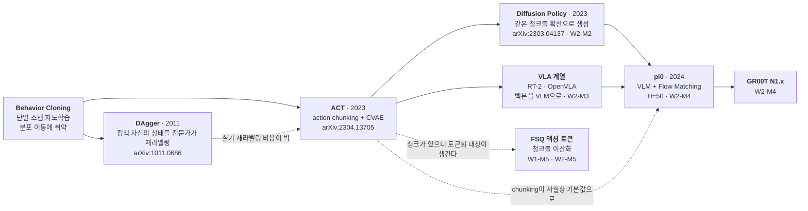
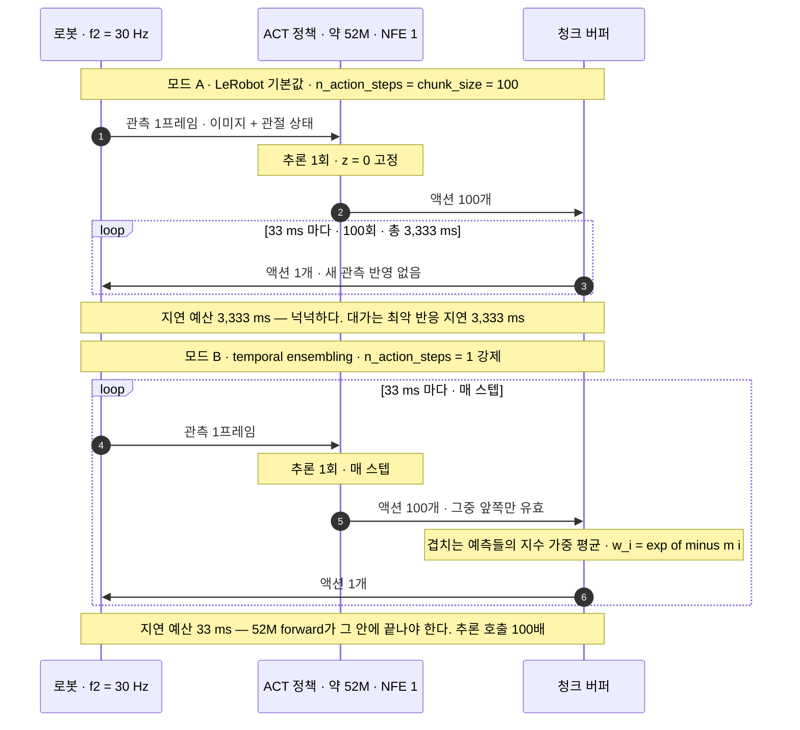
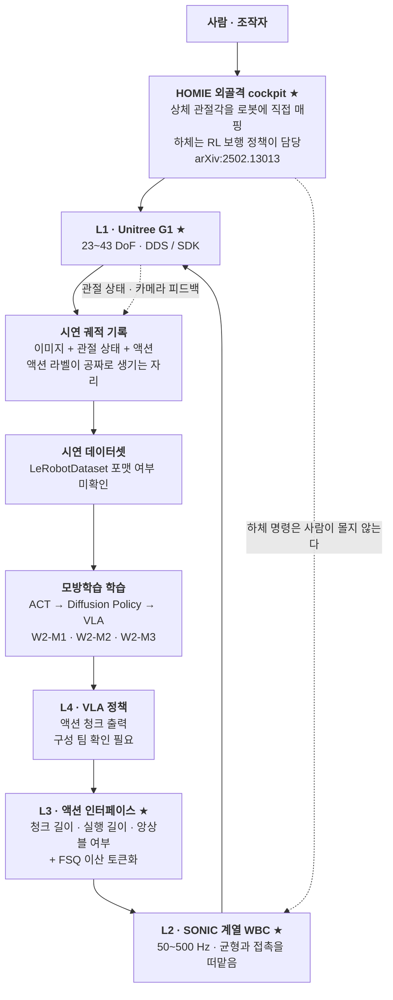

# 모방학습 기초 + ACT

> **한 줄 요약**: 사람의 시연을 그대로 흉내 내도록 학습시킨 로봇이 왜 혼자 돌리면 무너지는지 진단하고, 그 대응으로 나온 정책 하나를 설정값 세 개까지 내려가 읽습니다.

---

## 0. 이 모듈 지도

**오늘의 질문.** 다 읽고 나면 이 셋에 답할 수 있습니다.

1. 사람이 잘한 시범을 그대로 따라 하도록 학습시켰는데, 왜 로봇 혼자 돌리면 무너지는가?
2. 그 무너짐을 줄이려고 나온 방법이 왜 공짜가 아닌가?
3. 남이 쓰던 설정값을 우리 로봇에 옮겨도 되는가? 안 된다면 무엇을 보고 다시 정하는가?

| 절 | 무엇을 | 끝나면 할 수 있는 것 | 읽는 시간 |
|---|---|---|---|
| §1 | 이 갭의 입구와 계보 | ACT가 어느 자리에서 나왔는지 그린다 | 4분 |
| §2 | 오차가 쌓이는 구조와 두 가지 답 | 실패를 성능이 아니라 분포 문제로 읽는다 | 9분 |
| §3 | 세 숫자를 정하는 수식 | 지연 예산과 반응 지연을 직접 계산한다 | 8분 |
| §4 | 학습 경로와 추론 경로의 텐서 | 백지에 구조를 그리고 차원을 채운다 | 4분 |
| §5 | 데이터가 오는 곳 | 수집 방식이 청크 설계를 어떻게 묶는지 말한다 | 4분 |
| §6 | 설정값 대조 | 기본값 21개가 무엇을 정하는지 짚는다 | 4분 |
| §7 | 회사 스택 연결 | 우리 스택의 L3에 무엇이 걸리는지 지목한다 | 4분 |
| 나머지 | 오해, 요약, 퀴즈, 실습 | 스스로 점검하고 실습으로 넘어간다 | 9분 |


**선수 지식.** 앞 모듈에서 채우고 오는 것이 셋입니다.

- [W1-M1 §4](../../w1-generative-core/01-physical-ai-landscape/lesson.md)의 지연 예산 부등식. 이 문서가 거기에 실제 숫자를 넣습니다.
- [W1-M1 §3.3](../../w1-generative-core/01-physical-ai-landscape/lesson.md)의 200 ms 문턱. §3.6에서 다시 씁니다.
- [W1-M5](../../w1-generative-core/05-latent-discrete-fsq/lesson.md)의 이산화 동기. 이 모듈은 연속 청크까지만 다룹니다.

지도학습과 트랜스포머는 아는 것으로 놓고 갑니다. 변분 오토인코더의 목적함수는 갭이라 §3.4가 정의부터 시작합니다.

**완료 기준**: `chunk_size=100`, `n_action_steps=100`, `temporal_ensemble_coeff=None`을 놓고 (a) 이 조합이 예측한 것을 끝까지 실행한다는 뜻임을 지적하고 (b) 30 Hz 기준 3.33초의 최악 반응 지연을 계산하고 (c) 그 값이 200 ms 문턱과 왜 충돌하지 않는지를 한 문단으로 쓰면 됩니다. **소요**는 이론 2h, 실습 2~3h입니다.

> 📌 **여기까지 정리**
> - 시연으로 정책을 학습시키는 파이프라인의 첫 문이고 학습자에게 처음인 영역이다
> - 무게중심은 알고리즘이 아니라 설정값 세 개가 만드는 시스템 성질이다
> - W1-M1이 부등식으로 세워둔 자리에 이 문서가 실제 숫자를 넣는다

---

## 1. 왜 이걸 배우나

마스터플랜 §3의 갭 목록에 "모방학습과 VLA 학습 파이프라인"이 있고 W2 전체가 그 갭을 겨냥합니다. 그래서 이 문서는 **로봇 학습 파이프라인을 한 번도 돌려본 적 없다는 전제**로 씁니다. 데이터셋이 어떤 모양인지, 정책이 무엇을 받아 무엇을 뱉는지를 생략하지 않습니다.

제어 배경이 여기서 크게 유리한데 함정도 같은 자리에 있습니다. 시스템 동정은 **플랜트**를 맞추는 일이었지만 모방학습은 **제어기**를 맞춥니다. 학습 데이터는 사람이 잘 몰았을 때 지나간 상태에서만 나오는데, 배포하면 로봇은 학습된 정책 자신이 지나가는 상태를 밟습니다. 그 상태에서 모델은 검증된 적이 없습니다. **학습 분포와 실행 분포가 다르고, 그 차이를 만드는 원인이 학습된 모델 자신입니다.** 이 한 문장이 모듈 전체를 지배합니다.

유리한 지점도 분명합니다. 뒤에 나올 세 가지가 제어 쪽에 그대로 대응합니다. 오차 누적은 피드백 없는 개루프 적분이고, 액션을 묶어 내보내는 것은 MPC(Model Predictive Control, 모델 예측 제어)의 예측 지평 선택이며, 겹치는 예측을 섞는 것은 관측기 블렌딩입니다. 새로 배울 것은 개념이 아니라 **그 개념들이 코드에서 어떤 이름의 설정값으로 나타나는가**입니다.

계보에서 ACT(Action Chunking with Transformers, arXiv:2304.13705)의 자리는 이렇습니다.



점선 화살표 셋이 이 그림의 요지입니다.

- DAgger는 이론적으로 더 나은 답이었는데 실기 비용 때문에 주류가 되지 못했습니다.
- 액션을 묶어 내보내는 방식은 ACT 이후 거의 모든 후속 논문의 기본값이 됐습니다.
- 청크라는 단위가 생긴 덕분에 그것을 이산화하는 FSQ 같은 설계가 성립합니다. 회사 스택에 액션 인터페이스 계층이 존재하는 전제가 이 그림 안에 있습니다.

[W1-M1 §4.4](../../w1-generative-core/01-physical-ai-landscape/lesson.md)는 액션을 묶는 것을 **지연 흡수 장치**로 소개하고 "W2-M1에서 실제 하이퍼파라미터로 다시 만난다"는 약속으로 끝납니다. 그 약속을 갚으면서 절반을 정정하게 됩니다. **ACT의 원 논거는 지연이 아니라 오차 누적을 줄이는 것**이고 지연 흡수는 부수 효과입니다. 그 차이는 §3.6의 숫자가 보여줍니다.

> 📌 **여기까지 정리**
> - 모방학습은 플랜트가 아니라 제어기를 맞추는 일이라 데이터가 나온 곳과 모델이 쓰이는 곳이 어긋난다
> - 그 어긋남을 만드는 원인이 외부 요인이 아니라 학습된 모델 자신이다
> - ACT는 계보의 원점이고, 그 원 논거는 지연 흡수가 아니라 오차 누적 축소다

---

## 2. 오차가 쌓이는 구조와 두 가지 답

| 용어 | 한 줄 정의 | 제어·LLM 비유 |
|---|---|---|
| **Behavior Cloning** | 시연에서 관측을 넣으면 액션이 나오는 함수를 지도학습으로 맞추는 것 | 동정과 방향이 반대다. 플랜트가 아니라 제어기를 맞춘다 |
| **proprioception** | 로봇이 자기 관절의 각도와 속도를 스스로 재서 아는 것 | 상태 피드백 센서 |
| **covariate shift** | 학습 때 본 입력 분포와 실행 때 만나는 입력 분포가 어긋나는 현상 | 동정한 작동점 밖에서 그 모델의 제어기를 쓰는 상황 |
| **compounding error** | 작은 오차가 다음 관측을 오염시켜 스스로 커지는 누적 | 개루프 dead-reckoning의 적분 오차 |
| **DAgger** | 정책이 방문한 상태를 전문가가 다시 라벨링해 데이터에 합치는 절차 | 폐루프로 데이터를 다시 모으는 재동정 |
| **action chunking** | 한 번의 추론으로 미래 여러 스텝의 액션을 한꺼번에 뱉는 것 | MPC의 예측 지평 |
| **temporal ensembling** | 같은 시각을 겨냥한 여러 예측을 지수 가중으로 평균하는 것 | 지수 가중 이동평균 필터 |
| **CVAE** | Conditional Variational Autoencoder. 잠재변수가 설명되지 않는 변동을 떠맡는 조건부 오토인코더 | 관측 안 되는 외생 변수를 별도 축으로 뽑는 것 |

### 2.1 Behavior Cloning

전문가 정책 $\pi^*$가 로봇을 조작하는 동안 관측과 액션을 짝지어 기록한 것이 시연 데이터셋입니다. $i$는 에피소드, $t$는 타임스텝, $o_t$는 카메라 이미지 몇 장과 관절 상태, $a_t$는 그 시점에 로봇에 실제로 들어간 명령입니다.

$$\mathcal{D} = \bigl\{(o_t^{(i)},\, a_t^{(i)})\bigr\}_{t=1..T_i,\; i=1..N}$$

**액션 라벨은 사람이 나중에 붙이는 것이 아닙니다.** 텔레옵으로 수집하면 사람이 조종 장치를 움직인 결과로 로봇에 내려간 관절 명령이 그대로 $a_t$가 됩니다. 이것이 [W1-M1 §5](../../w1-generative-core/01-physical-ai-landscape/lesson.md) 데이터 피라미드에서 텔레옵 층만 액션 라벨이 정확한 이유입니다. Behavior Cloning은 이 데이터로 지도학습을 합니다.

$$\theta^\star = \arg\min_\theta\; \mathbb{E}_{(o,a)\sim\mathcal{D}}\bigl[\,\ell\bigl(\pi_\theta(o),\, a\bigr)\bigr]$$

보상 함수도 환경 상호작용도 필요 없어서 로봇 학습의 기본 baseline입니다. 문제는 이 식에 **시간이 없다**는 것입니다. $(o, a)$ 쌍을 독립 표본으로 취급하는데, 배포하면 $o_{t+1}$은 $a_t$의 결과로 생기고 $a_t$는 내 모델이 뱉은 것입니다.

### 2.2 compounding error

전문가 시연들은 상태공간에 관(tube)을 만듭니다. 열 번 시연하면 열 개의 궤적이 비슷한 영역을 지나가고 그것이 학습 데이터가 덮은 구역입니다. 정책은 관 안에서 잘 동작하고 관 밖에서는 검증된 적이 없습니다.

이제 배포합니다. 정책이 관절 하나를 0.5도쯤 틀리면 로봇은 관에서 살짝 벗어나고, 다음 관측은 학습 데이터에서 본 것보다 낯설어집니다. 낯선 입력에서 모델은 조금 더 틀리고, 더 벗어나고, 더 낯설어집니다. 속도 추정의 작은 편향이 적분되어 궤적까지 밀어내는 개루프 dead-reckoning과 같은 구조인데, 로봇에서 특별한 점은 분포를 어긋나게 만드는 원인이 모델 자신이라는 것입니다.

BC 정책에는 관 안으로 되돌리는 피드백 항이 없습니다. 목적함수에도 없고 시연 데이터에도 복귀 궤적이 없습니다. 전문가는 실수를 안 했으니까요. 두 가지가 따라나옵니다.

- **모델을 키우고 데이터를 늘려도 이 문제는 원리적으로 사라지지 않습니다.** 스텝당 오차율을 줄일 수는 있지만 그것이 0이 아닌 한 누적 구조는 그대로입니다.
- 실패가 알아보기 쉽습니다. 로봇이 초반은 잘하다가 중반에 **어정쩡한 자세로 멈추거나 같은 동작을 미세하게 반복**합니다. 성능 문제가 아니라 분포 문제로 읽어야 합니다.

### 2.3 DAgger

진단이 "학습 분포와 실행 분포가 다르다"이면 처방은 **실행 분포에서 학습하는 것**입니다. 지금 정책을 굴려 상태들을 방문하고, 그 상태마다 전문가가 정답 액션을 라벨로 달고, 새 데이터를 합쳐 다시 학습하고 반복합니다. 그러면 최악 비용의 지평 의존성이 제곱에서 선형으로 내려갑니다(§3.2).

로봇에서 벽에 부딪히는 곳은 라벨링 단계입니다. 전문가가 **사람**이라 노동이 시연 수집보다 크고, 라벨을 붙일 상태에 로봇을 **실제로 데려다 놓아야** 하며, 초기의 형편없는 정책이 실패 근처를 방문하므로 하드웨어가 상합니다(상세는 [deep-dive.md](deep-dive.md) §1.3). 그래서 주류는 **BC를 그대로 쓰되 오차 누적을 다른 방식으로 줄이는 노선**이 됐습니다. LeRobot 롤아웃 커맨드에 지금도 `--strategy.type=dagger` 옵션이 있기는 합니다.

### 2.4 action chunking

ACT의 첫 번째 답입니다. 정책이 한 스텝의 액션을 뱉는 대신 **미래 $k$스텝을 한꺼번에** 뱉습니다.

$$\pi_\theta:\; o_t \;\longmapsto\; \hat a_{t:t+k-1} \in \mathbb{R}^{k \times D_{\text{action}}}$$

LeRobot에서 이 $k$가 `chunk_size`이고 기본값이 100입니다. 왜 도움이 되는지는 두 층위로 읽어야 합니다.

- **결정 횟수가 줄어듭니다.** 스텝마다 판단하면 결정이 $T$번이고 각 결정이 새로 오차를 주입할 기회입니다. 청크로 하면 $\lceil T/k \rceil$번이라 그 기회가 $k$분의 1이 됩니다.
- **시연의 비마르코프성을 흡수합니다.** 사람이 시연하면 손이 목표를 재확인하는 동안 액션이 0에 가까운 프레임이 생깁니다. 단일 스텝 정책의 눈에는 거의 똑같은 관측에 움직이라는 라벨과 멈추라는 라벨이 함께 붙은 것으로 보이고, 회귀는 그 평균인 "아주 조금 움직임"을 뱉습니다. 로봇이 목표 앞에서 굼실거리는 실패가 이렇게 나옵니다.

청크로 예측하면 "지금 멈추고 다음에 움직인다"는 시간 구조를 출력에 담을 수 있어 이 모호성이 줄어듭니다. 두 번째 이유가 실무에서 더 자주 결정적입니다. 첫 번째는 이론적 상한이지만 두 번째는 사람이 만든 시연이 반드시 갖는 성질이기 때문입니다.

### 2.5 chunk_size와 n_action_steps

LeRobot ACT 설정에 비슷하게 생긴 두 필드가 있습니다. 이것을 헷갈리면 이 모듈의 핵심을 놓칩니다.

- **`chunk_size`**는 한 번의 추론으로 **예측하는** 스텝 수입니다. 기본값 100.
- **`n_action_steps`**는 그중 실제로 **환경에서 실행하는** 스텝 수입니다. 기본값 100.

`n_action_steps` docstring에는 이렇게 적혀 있습니다.

> "The number of action steps to run in the environment for one invocation of the policy. This should be no greater than the chunk size. For example, if the chunk size size 100, you may set this to 50."  ← `size size`는 LeRobot 원문의 오타이며 축자 인용을 위해 그대로 둡니다

**기본 설정은 두 값이 모두 100이라 예측한 청크를 끝까지 실행합니다.** 100스텝 동안 새 관측을 전혀 보지 않습니다. 다시 말해 **receding horizon은 ACT의 기본값이 아니라 옵션**입니다. MPC 배경이면 지평 전체를 개방루프로 실행한다는 데 위화감을 느껴야 정상인데, 왜 성립하는지는 §3.6이 태스크 성질로 설명합니다. 이 축이 그대로 회사 스택의 액션 인터페이스 설계 질문이고 `notes/questions-for-team.md`의 **M4-5**가 이 관계를 묻습니다.

### 2.6 temporal ensembling

`n_action_steps`를 1로 줄이면 매 스텝 새로 추론하게 되고, 시각 $t$에 실행할 액션의 예측이 최대 `chunk_size`개까지 쌓입니다. $t$에서 만든 청크의 0번째 원소, $t-1$의 1번째 원소, $t-2$의 2번째 원소가 모두 같은 시각을 겨냥하죠. 그것들을 평균하는 것이 앙상블입니다. 가중식은 §3.5, 권장값 0.01이 무엇을 하는지는 §6.4에 있습니다.

대가도 docstring에 적혀 있습니다(원문은 「흔한 오해」 셋째). `n_action_steps > 1`인 채로 켜면 설정 검증에서 거부되는데, 앙상블을 만들려면 매 스텝 추론해야 하니 논리적으로 강제되는 제약입니다. 기본 설정은 청크당 추론 1회인데 앙상블은 **스텝당 추론 1회**라, 30 Hz면 33 ms 안에 약 52M 파라미터 forward를 끝내야 합니다(§3.6).

### 2.7 latent가 흡수하는 것

ACT의 두 번째 답입니다. 사람 시연은 같은 상황에서 매번 조금씩 다른데, 이 변동을 회귀 모델에 그대로 먹이면 모델은 평균을 학습합니다. 평균 궤적은 어느 시연도 아닌 궤적일 수 있습니다.

처방은 **그 변동을 설명하는 잠재변수를 하나 두는 것**입니다. 학습할 때는 정답 청크를 볼 수 있으니 인코더 $q_\phi(z \mid a_{t:t+k}, o_t)$가 이 시연의 스타일을 $z$에 담고, 디코더는 $o_t$와 $z$를 함께 받아 청크를 복원합니다. **관측되지 않는 외생 변수를 잠재변수로 명시해 회귀 잔차에서 빼내는 것**입니다.

반드시 알아야 할 구현 사실이 하나 있습니다. **추론할 때는 정답 액션이 없으니 인코더를 쓸 수 없고, LeRobot은 $z$를 0 벡터로 고정합니다.**

```python
latent_sample = torch.zeros([batch_size, self.config.latent_dim],
                            dtype=torch.float32).to(batch[OBS_STATE].device)
```

두 가지가 따라나옵니다.

- **배포 시 ACT는 결정론적 정책입니다.** 관측이 같으면 출력이 항상 같습니다.
- 따라서 **$z$는 실행 시 여러 행동 모드 중 하나를 골라주는 장치가 아니라** 학습 시 시연자 변동을 흡수하는 정규화 장치입니다. 실행 시점의 다봉성은 W2-M2의 Diffusion Policy가 맡습니다.

다만 $z$가 얼마나 붕괴하는지는 데이터에 달린 경험적 문제라, 확인된 두 사실만 두고 그 이상을 단언하지 않습니다.

> 📌 **여기까지 정리**
> - BC의 목적함수에는 시간이 없어서 자기 오차가 자기 입력을 오염시키는 되먹임을 못 본다
> - DAgger는 정답이지만 실기에서 라벨링 비용과 안전 때문에 주류가 되지 못했다
> - ACT의 답은 둘이다. 결정 횟수를 줄이는 청크와, 시연자 변동을 떠맡는 잠재변수다

---

## 3. 세 숫자를 정하는 수식

| 용어 | 한 줄 정의 | 제어·LLM 비유 |
|---|---|---|
| **ELBO(Evidence Lower Bound)** | 직접 못 구하는 로그 가능도를 아래에서 받치는 값. 이것을 올리면 가능도도 올라간다 | 어려운 목적함수를 쉬운 하한으로 바꿔 푸는 것 |
| **KL 발산** | 두 확률분포가 얼마나 다른지 재는 양. 같으면 0이고 방향을 바꾸면 값이 달라진다 | 분포판 오차 지표 |
| **재매개화** | $z$를 직접 뽑는 대신 $\mu + \sigma\varepsilon$으로 써서 잡음을 외부 입력으로 밀어내는 기법 | 확률항을 외생 입력으로 분리하는 것 |
| **$\beta$-VAE** | KL 항에 가중을 곱해 잠재변수가 담는 정보량을 조절하는 변형 | LQR의 입력 가중을 키워 자유도를 누르는 것 |
| **Laplace 분포** | 가우시안보다 꼬리가 두꺼운 분포. 음의 로그가능도가 절댓값 손실이 된다 | 이상치에 관대한 잔차 모형 |
| **허용 지연 예산** | 새 관측이 반영되기까지 시스템이 버틸 수 있는 최대 시간 | 제어 주기의 여유분 |
| **최악 반응 지연** | 외란이 생긴 순간부터 그것이 명령에 반영되기까지 걸리는 최대 시간 | 폐루프의 순수 시간지연 |

### 3.1 두 분포가 어긋난다

$$\theta^\star = \arg\min_\theta\; \mathbb{E}_{o \sim d_{\pi^*}}\Bigl[\ \mathbb{E}_{a\sim\pi^*(\cdot\mid o)}\bigl[\ell(\pi_\theta(o), a)\bigr]\ \Bigr]$$

- **직관**: 기대값의 바깥 첨자 $d_{\pi^*}$는 전문가 정책의 상태 방문 분포인데, 배포하면 상태는 $d_{\pi_\theta}$에서 나옵니다. 최적화한 대상과 평가받는 대상이 다릅니다.
- **제어 대응**: 어느 작동점에서 동정한 모델로 만든 제어기가 로봇을 다른 작동점으로 데려가는 상황입니다.

### 3.2 상한이 왜 제곱인가

스텝당 오차율을 전문가 분포에서 정의합니다. 첫 실수가 스텝 $t$에서 일어날 확률이 대략 이 값이고, 실수한 뒤에는 학습 분포 밖이라 남은 $T-t$ 스텝에 보장이 없으니 최악으로 스텝당 비용 1을 다 물립니다.

$$\epsilon \;=\; \mathbb{E}_{o\sim d_{\pi^*}}\bigl[\mathbb{1}\{\pi_\theta(o) \ne \pi^*(o)\}\bigr]$$

둘을 곱해 더합니다.

$$J(\pi_\theta) - J(\pi^*) \;\lesssim\; \sum_{t=1}^{T} \epsilon\,(T-t) \;\approx\; \frac{\epsilon T^2}{2} \;=\; O(\epsilon T^2)$$

- **직관**: 제곱의 출처는 "실수 확률 곱하기 실수 이후 남은 시간"이라 실수가 이를수록 대가가 큽니다. DAgger처럼 정책 자신의 분포에서 학습하면 실수 이후 상태의 오차율도 $\epsilon$으로 눌려 상한이 $O(\epsilon T)$로 내려갑니다. 편향 있는 신호를 두 번 적분한 것과 한 번 적분한 것의 차이입니다.
- **읽는 법**: 최악 상한이라 성능 예측치가 아니고 쓸모는 스케일링 감각입니다. 태스크 길이를 두 배로 늘리면 데이터를 두 배로 늘려서는 부족합니다. (유도는 [deep-dive.md](deep-dive.md) §1)

### 3.3 청크가 상한을 바꾸는 방식

청크 $k$로 가면 결정이 $T/k$번입니다. 청크 단위 오차율을 $\epsilon_k$라 하고 같은 스케치를 반복하면, 결정 $j$에서 틀렸을 때 남은 환경 스텝이 $k(T/k-j)$개입니다.

$$J(\pi_\theta) - J(\pi^*) \;\lesssim\; \sum_{j=1}^{T/k} \epsilon_k \cdot k\Bigl(\frac{T}{k}-j\Bigr) \;\approx\; \frac{\epsilon_k\,T^2}{2k}$$

$$\underbrace{\frac{\epsilon\,T^2}{2}}_{k=1\ (\text{단일 스텝 BC})} \;\longrightarrow\; \underbrace{\frac{\epsilon_k\,T^2}{2k}}_{\text{청크 }k}$$

- **직관**: 분모에 $k$가 붙었습니다. 단, $\epsilon_k$가 $k$에 무관하다면입니다. 실제로는 100스텝을 한꺼번에 맞히는 것이 1스텝보다 어려워 $\epsilon_k$가 $k$와 함께 커지니 **최적 $k$가 중간에 있습니다.** MPC 예측 지평 선택과 같은 구조로, "모델 오차" 자리에 "청크 회귀의 난이도"가 들어갑니다.
- **덧붙임**: 상한식만 보면 반응성 비용이 안 보입니다. 청크를 끝까지 실행하면 최악 반응 지연이 $k/f_2$까지 늘어나는데 그 항은 이 부등식에 없습니다. §3.6이 따로 잡습니다.

### 3.4 ELBO에서 ACT loss로

조건부 VAE의 ELBO입니다. 조건이 $o_t$, 데이터가 액션 청크 $a_{t:t+k}$입니다.

$$\log p_\theta(a_{t:t+k}\mid o_t) \;\ge\; \mathbb{E}_{q_\phi}\bigl[\log p_\theta(a_{t:t+k}\mid z,\, o_t)\bigr] \;-\; D_{\mathrm{KL}}\bigl(q_\phi(z\mid a_{t:t+k}, o_t)\,\|\,p(z)\bigr)$$

세 단계면 코드의 loss가 됩니다. prior를 표준정규로 고정하면 KL이 닫힌 형태로 떨어지고(합의 상한 32가 `latent_dim=32`), 재구성 항을 **Laplace**로 잡으면 $\ell_1$ 손실이 나오며(가우시안이면 $\ell_2$), 마지막으로 부호를 뒤집고 KL에 가중 $\beta$를 붙입니다.

$$\boxed{\;\mathcal{L}_{\text{ACT}} \;=\; \underbrace{\bigl\|\hat a_{t:t+k} - a_{t:t+k}\bigr\|_1}_{\texttt{l1\_loss}} \;+\; \beta \cdot \underbrace{D_{\mathrm{KL}}\bigl(q_\phi \,\|\, \mathcal{N}(0,I)\bigr)}_{\texttt{kld\_loss}}, \qquad \beta = \texttt{kl\_weight} = 10.0\;}$$

```python
loss = l1_loss + mean_kld * self.config.kl_weight
```

- **Laplace를 고른 이유**: 꼬리가 두꺼워 **이상치에 관대**합니다. 텔레옵 라벨에는 손떨림과 통신 지터가 섞여 튀는 값이 반드시 들어가는데, $\ell_2$는 그 값 하나에 회귀선이 끌려가고 $\ell_1$은 덜 끌려갑니다.
- **직관**: `kl_weight`가 곧 $\beta$-VAE의 $\beta$입니다. 크게 잡으면 $z$가 정보를 덜 담고, 작게 잡으면 재구성이 쉬워지지만 추론 시 $z=0$과의 괴리가 커집니다. **$\beta=10.0$은 그 괴리를 줄이려는 방향으로 읽힙니다.**
- **읽는 순서 주의**: 두 항은 스케일이 전혀 달라 `kl_weight=10.0`만 보고 "KL이 10배 중요하다"로 읽으면 안 됩니다. (세 단계 전개는 [deep-dive.md](deep-dive.md) §2)

### 3.5 지수 가중의 대수

$$a_t^{\text{exec}} = \frac{\sum_{i=0}^{n-1} w_i\,\hat a_t^{(i)}}{\sum_{i=0}^{n-1} w_i}, \qquad w_i = \exp(-m\,i), \qquad m = \texttt{temporal\_ensemble\_coeff}$$

$\hat a_t^{(i)}$는 시각 $t$에 대한 $i$번째 예측이고 규약상 $i=0$이 **가장 오래된** 예측입니다. $n$은 쌓인 예측 수로 최대 `chunk_size`까지 자랍니다. 가중 총합 $S$는 등비급수로 닫히고, **유효 기여 수**는 그 합을 최대 가중으로 나눈 값입니다. §6.4 표의 마지막 열이 이 값입니다.

$$S=\sum_{i=0}^{n-1} e^{-mi} = \frac{1-e^{-mn}}{1-e^{-m}}, \qquad n_{\text{eff}} = \frac{S}{\max_i w_i}$$

$m>0$이면 최대 가중이 $w_0=1$이라 두 값이 같지만, $m<0$이면 최대가 $w_{n-1}$ 쪽이라 갈립니다($m=-0.01$에서 $S=171.0$인데 $n_{\text{eff}}=63.5$). 정의의 근거는 [deep-dive.md](deep-dive.md) §4입니다.

- **직관**: $m$의 부호가 반응성 노브입니다. 양수는 과거를 믿고 음수는 현재를 믿으며, 크기는 얼마나 빨리 잊을지를 정합니다.
- **제어 대응**: 여러 예측기의 신뢰도 가중 융합이자 저역통과라, 궤적이 매끄러워지고 그 대가로 위상 지연이 생깁니다.

### 3.6 부등식에 기본값을 넣는다

[W1-M1 §4.1](../../w1-generative-core/01-physical-ai-landscape/lesson.md)의 부등식을 그대로 씁니다.

$$H_{\text{chunk}} \;\ge\; f_2\bigl(T_{\text{replan}} + \tau_{\text{infer}} + \tau_{\text{comm}}\bigr)$$

좌변의 $H_{\text{chunk}}$ 자리에는 **실제로 실행하는 길이인 `n_action_steps`**가 들어갑니다. `chunk_size`가 아닙니다. 예측만 하고 버리는 뒷부분은 지연을 버텨주지 않으니까요.

$$T_{\text{replan}} + \tau_{\text{infer}} + \tau_{\text{comm}} \;\le\; \frac{\texttt{n\_action\_steps}}{f_2}$$

**ACT와 ALOHA 공개 데이터의 기록 FPS는 50 Hz로 확인됐습니다**(2026-08-09 실측). 그 열은 ALOHA 자신의 개방루프 창이고, 30 Hz 열은 우리 로봇의 $f_2$를 30 Hz로 가정했을 때입니다. 200 ms 문턱과 맞대는 것은 뒤쪽이라 아래 결론은 30 Hz 열로 읽습니다.

| 설정 | `chunk_size` | `n_action_steps` | 허용 지연 예산 @30 Hz | @50 Hz | 추론 호출 빈도 @30 Hz | 최악 반응 지연 @30 Hz |
|---|---|---|---|---|---|---|
| **LeRobot 기본값** | 100 | 100 | **3,333 ms** | 2,000 ms | 0.3 Hz (3.33초당 1회) | **3,333 ms** |
| docstring 예시 receding horizon | 100 | 50 | 1,667 ms | 1,000 ms | 0.6 Hz | 1,667 ms |
| 짧은 receding horizon | 100 | 10 | 333 ms | 200 ms | 3 Hz | 333 ms |
| **temporal ensembling(강제)** | 100 | **1** | **33 ms** | 20 ms | **30 Hz** | **33 ms** |

세 가지가 한 번에 보입니다.

- **지연은 제약이 아닙니다.** 3.3초의 예산은 약 52M 파라미터 모델의 단일 forward에 터무니없이 넉넉합니다. RTX 3080에서 청크 1회 생성이 한 자릿수에서 십수 ms, 데스크톱 CPU에서도 100 ms 언저리입니다. **그러므로 `chunk_size=100`은 지연 논거로 정해진 값이 아닙니다.**
- **최악 반응 지연이 3.3초입니다.** [W1-M1 §3.3](../../w1-generative-core/01-physical-ai-landscape/lesson.md)의 200 ms 문턱의 **16배 밖**이고, 이 대비가 이 모듈에서 가장 중요한 숫자입니다.
- **앙상블은 예산을 100분의 1로 조입니다.** 매끄러움의 값이 추론 비용 100배입니다.

추론 시간의 절대값은 GPU 클럭 상태와 부하에 따라 크게 흔들리므로(집필 중 6.5~66 ms) **자기 기기에서 직접 재는 것**이 [`labs/`](labs/) Step 6입니다.

두 번째 항목이 ACT의 결함은 아닙니다. **ALOHA식 양팔 조작에는 낙상 모드가 없습니다.** 테이블에 고정된 팔이라 3.3초 동안 낡은 명령을 실행해서 생기는 최악은 잡기 실패이고 다시 시도하면 됩니다. 반면 휴머노이드 전신 제어에서 3.3초 개방루프는 넘어져 하드웨어가 상하는 결과입니다. **따라서 청크 길이는 태스크의 외란 시간상수에 종속된 값이고, 다른 로봇으로 설정을 그대로 옮기면 안 됩니다.**

두 실행 모드의 타이밍입니다.



> 📌 **여기까지 정리**
> - 청크는 오차 누적 상한의 분모에 들어가지만 분자의 회귀 난이도를 키우므로 최적 길이가 중간에 있다
> - 손실은 ELBO에서 세 단계로 유도되고 `kl_weight`가 그 유도의 $\beta$다
> - 기본 설정에서 지연은 남아돌고 대신 최악 반응 지연이 3.3초라 200 ms 문턱의 16배 밖이다

---

## 4. ACT 아키텍처

| 용어 | 한 줄 정의 | 제어·LLM 비유 |
|---|---|---|
| **토큰** | 트랜스포머가 한 자리로 다루는 벡터 하나 | 표본 하나 |
| **DETR식 쿼리** | 디코더가 들고 있는 학습된 슬롯 벡터. 슬롯 하나가 출력 하나를 담당한다 | 출력 자리마다 전용 슬롯을 미리 파둔 것 |
| **autoregressive** | 앞서 만든 출력을 다시 입력에 넣어 다음 것을 만드는 순차 생성 | 이산시간 재귀식 |
| **마르코프** | 다음이 현재만으로 정해지고 과거 이력이 필요 없는 성질 | 상태공간 표현의 전제 |

### 4.1 학습 경로

트랜스포머 스택이 셋입니다. VAE 인코더, 메인 인코더, 디코더이고 층수가 각각 `n_vae_encoder_layers=4`, `n_encoder_layers=4`, `n_decoder_layers=1`입니다.

```
━━━━━━━━━━━━━━ 학습 경로 (use_vae=True) ━━━━━━━━━━━━━━

입력 3종
  이미지          I  [B, n_cam, 3, H, W]     n_obs_steps = 1 (현재 프레임만)
  관절 상태       q  [B, D_state]
  액션 청크 정답  a  [B, 100, D_action]      ★ 학습 시에만 존재

┌─ ① VAE 인코더 (posterior q_phi) ─────────────────────────────┐
│  [CLS] 토큰                     [B, 1,   512]                │
│  q  → Linear(D_state → 512)     [B, 1,   512]                │
│  a  → Linear(D_action → 512)    [B, 100, 512]                │
│         concat → [B, 102, 512]                               │
│         Transformer 인코더 4층 (d=512, heads=8, ff=3200)      │
│         [CLS] 위치 출력 [B, 512] → Linear → [B, 64]           │
│                          split → mu [B,32], log sigma^2 [B,32]│
│         재매개화  z = mu + sigma * eps        z [B, 32]        │
└──────────────────────────────────────────────────────────────┘
                                    │  z [B, 32]
                                    ▼
┌─ ② 메인 트랜스포머 인코더 ────────────────────────────────────┐
│  I → ResNet-18 (ImageNet 사전학습)                            │
│        → 특징맵 [B*n_cam, 512, H/32, W/32]                    │
│        → 1x1 Conv(→ dim_model=512) → flatten                  │
│        → 이미지 토큰 [B, n_cam * (H/32)*(W/32), 512]          │
│           예: 480x640, n_cam=2 → 2 * 15*20 = 600 토큰         │
│  q → Linear → 상태 토큰   [B, 1, 512]                         │
│  z → Linear → latent 토큰 [B, 1, 512]                         │
│           concat → [B, N_tok, 512]   (예: 602)               │
│           + 위치 임베딩                                        │
│  Transformer 인코더 4층 (d=512, heads=8, ff=3200, dropout=0.1)│
│           출력 메모리 [B, N_tok, 512]                          │
└──────────────────────────────────────────────────────────────┘
                                    │  메모리 [B, N_tok, 512]
                                    ▼
┌─ ③ 트랜스포머 디코더 ────────────────────────────────────────┐
│  학습된 쿼리 임베딩 [100, 512] → [B, 100, 512]                │
│     ★ 쿼리 개수 = chunk_size = 100. 각 쿼리가 한 타임스텝 담당 │
│  self-attn + cross-attn(메모리) x n_decoder_layers = 1        │
│           [B, 100, 512]                                       │
│  Linear(512 → D_action)                                       │
└──────────────────────────────────────────────────────────────┘
                                    │
                                    ▼
출력  â  [B, 100, D_action]

손실  L = || â - a ||_1  +  10.0 * KL( N(mu, sigma^2) || N(0, I) )
             l1_loss              kld_loss * kl_weight
```

블록도에서 눈여겨볼 지점 둘입니다.

- **디코더 쿼리 100개가 청크 길이 그 자체입니다.** 각 쿼리가 한 타임스텝을 담당하는 학습된 슬롯이라 autoregressive가 아니라 **한 번의 forward로 100스텝이 병렬로** 나옵니다.
- **이미지 토큰이 압도적으로 많습니다.** 카메라 2대 480×640이면 이미지 토큰 600개에 상태 토큰과 잠재 토큰이 각 1개라, 배포 지연을 줄일 첫 손잡이는 카메라 수와 해상도입니다.

관측이 단일 프레임인 것과 언어 입력이 없는 것의 함의는 [deep-dive.md](deep-dive.md) §3에 있습니다.

### 4.2 추론 경로

```
━━━━━━━━━━━━━━ 추론 경로 ━━━━━━━━━━━━━━

  이미지 I [B, n_cam, 3, H, W]        액션 정답 a → ✗ 없음
  관절 상태 q [B, D_state]            ① VAE 인코더 → ✗ 사용 안 함

                z = 0  [B, 32]     ← torch.zeros(...). prior 평균으로 고정
                   │
                   ▼
        ② 메인 인코더 4층  →  ③ 디코더 1층  →  â [B, 100, D_action]
                   │
                   ▼
        ┌──────────────────────────────────────────────┐
        │  실행 정책 — 여기가 L3 설계 지점               │
        │                                              │
        │  기본값: n_action_steps=100                   │
        │    â[0..99]를 순서대로 전부 실행 → 재추론      │
        │    새 관측 반영 주기 = 100 / f2                │
        │                                              │
        │  receding horizon: n_action_steps=k < 100     │
        │    â[0..k-1]만 실행하고 나머지 폐기 → 재추론   │
        │                                              │
        │  temporal ensembling: n_action_steps=1 강제    │
        │    매 스텝 재추론, 겹치는 예측을 지수 가중 평균 │
        │    w_i = exp(-m i),  w_0 = 가장 오래된 예측    │
        └──────────────────────────────────────────────┘
                   │
                   ▼
        관절 명령 → 로봇 (f2 Hz로 소비)
```

추론에서 VAE 인코더가 통째로 빠지고 $z=0$이 들어갑니다. 그래서 배포 모델이 결정론적입니다(§2.7).

아래쪽 박스가 이 모듈의 무게중심입니다. 같은 가중치를 놓고도 실행 정책 세 갈래에 따라 지연 예산과 반응성과 추론 비용이 전부 달라집니다. **인터페이스 설정**이 시스템 성질을 정하는 자리이고, [W1-M1 §3.5](../../w1-generative-core/01-physical-ai-landscape/lesson.md)가 "승부처는 L3"라고 주장한 것의 가장 구체적인 실례입니다.

> 📌 **여기까지 정리**
> - 학습에는 스택이 셋이고 추론에서는 VAE 인코더 하나가 통째로 빠진다
> - 디코더 쿼리 개수가 곧 청크 길이이고 100스텝이 한 번의 forward로 병렬로 나온다
> - 시스템 성질을 정하는 것은 학습된 가중치가 아니라 실행 정책 세 갈래다

---

## 5. 데이터는 어디서 오는가

| 용어 | 한 줄 정의 | 제어·LLM 비유 |
|---|---|---|
| **텔레옵** | teleoperation. 사람이 원격으로 로봇을 직접 조종하는 것 | 수동 조작 모드 |
| **리더-팔로워 매핑** | 사람이 잡는 축소 팔의 관절각을 로봇 팔에 그대로 복사하는 방식 | 관절 공간 직결이라 역기구학이 필요 없다 |
| **외골격 cockpit** | 사람이 착용하는 링크 구조로 관절각을 재서 로봇에 넘기는 장치 | 리더-팔로워의 착용형 변형 |
| **loco-manipulation** | 이동하면서 물체를 다루는 과제 | 자세 안정과 조작이 한 루프에 얽히는 상황 |
| **DoF(Degree of Freedom)** | 자유도. 독립적으로 움직일 수 있는 관절 축의 개수 | 형상 변수의 개수 |

§2.1이 "액션 라벨은 공짜로 생긴다"고 했는데, 그 말이 성립하려면 **사람이 로봇을 직접 몰아야** 합니다. 여기서 수집 하드웨어가 정책 구조를 제약하기 시작합니다.

ALOHA는 ACT가 쓴 수집 플랫폼이고 리더-팔로워 매핑을 씁니다. 역기구학을 풀 필요가 없고 저가 부품으로 만들 수 있어서 ACT 초록이 앞세운 "low-cost hardware"가 여기서 나옵니다. HOMIE의 외골격 cockpit은 같은 발상의 착용형 변형인데 대상이 이족 휴머노이드입니다. **결정적인 차이는 하체입니다.** HOMIE는 하체를 강화학습으로 만든 보행 정책에 넘기고, 사람은 상체 조작만 몹니다.

| 축 | ALOHA | HOMIE 외골격 cockpit ★ |
|---|---|---|
| 매핑 방식 | 리더-팔로워 관절 공간 매핑 | 외골격 관절각을 로봇 상체로 |
| 대상 형태 | 고정 베이스 양팔 | 이족 휴머노이드 전신(Unitree G1) |
| 하체 | 없음 | **보행 정책이 담당. 사람이 몰지 않음** |
| 사람이 담당하는 자유도 | 양팔 전부 | 상체 조작만 |
| 청크 채널의 최악 실패 | 잡기 실패, 복구 가능 | 상체 조작 실패. **낙상은 청크 채널 밖** |
| 청크 길이 제약 | 느슨함(초 단위 허용) | 상체는 느슨, 하체는 별도 예산 |
| 이 4주에서 다루는 곳 | W2-M1(이 모듈) | W3-M3 딥다이브 |

이 결정에서 두 가지가 따라나옵니다.

- **청크에서 낙상 모드가 제거됩니다.** 청크로 다뤄지는 채널은 상체 조작이고 200 ms 문턱이 걸린 균형은 별도 루프에 있어서 §3.6의 결론이 청크 채널에 걸리지 않습니다. [W1-M1 §3.4](../../w1-generative-core/01-physical-ai-landscape/lesson.md)의 대역폭 분리, 곧 안쪽 루프를 바깥보다 한 자릿수 이상 빠르게 돌리는 그 관행을 수집 하드웨어 수준에서 구현한 셈입니다.
- **학습되는 액션 벡터의 정체도 달라집니다.** $a_t$가 상체 관절만인지, 하체 정책의 출력까지인지에 따라 $D_{\text{action}}$이 갈리는데 **이 부분은 확인되지 않았습니다**(팀 질문 `W2M1-1`과 `W2M1-3`).

> 📌 **여기까지 정리**
> - 두 플랫폼 모두 사람이 로봇을 직접 몰고 그때 내려간 관절 명령을 액션 라벨로 쓴다
> - HOMIE는 하체를 보행 정책에 넘겨 낙상이라는 200 ms급 실패 모드를 청크 채널에서 뺐다
> - 그래서 수집 하드웨어의 구성이 청크 길이의 상한을 실제로 바꾼다

---

## 6. 설정값 대조

| 용어 | 한 줄 정의 | 제어·LLM 비유 |
|---|---|---|
| **NFE(Number of Function Evaluations)** | 샘플 하나를 만드는 데 신경망을 몇 번 통과시키는가 | 명령 하나를 만드는 데 드는 연산 횟수 |
| **receding horizon** | 지평만큼 계획하고 앞부분만 실행한 뒤 다시 계획하는 방식 | MPC의 기본 실행 규약 |
| **개방루프 완주** | 새 관측을 보지 않고 계획한 것을 끝까지 실행하는 것 | 피드백을 끊고 도는 구간 |

### 6.1 단일 스텝 BC와 ACT

| 축 | 단일 스텝 BC | ACT |
|---|---|---|
| 출력 | 액션 1개 $[B, D_a]$ | 액션 청크 $[B, 100, D_a]$ |
| 결정 횟수 (길이 $T$) | $T$ | $\lceil T/k \rceil$ |
| 오차 누적 상한 | $O(\epsilon T^2)$ | $O(\epsilon_k T^2 / k)$, 단 $\epsilon_k$는 증가 |
| 시연 멈춤 구간 | 상반된 라벨의 평균이라 굼실거림 | 시간 구조를 출력에 담아 모호성 완화 |
| 시연자 변동 | 회귀 잔차에 섞임 | 잠재변수가 학습 시 흡수 |
| 관측 이력 | 보통 프레임 스택 | 단일 프레임(`n_obs_steps=1` 강제) |
| 반응성 | 매 스텝 새 관측 | 실행 정책에 따라 33 ms에서 3,333 ms |
| 추론 비용 | 스텝당 1회 | 청크당 1회 또는 스텝당 1회(앙상블) |

배포 시 확률성은 둘 다 없습니다. ACT도 $z=0$으로 고정되니 관측이 같으면 출력이 같습니다.

### 6.2 청크 길이에 걸린 힘들

| 축 | 청크를 길게 | 청크를 짧게 | 어느 논거인가 |
|---|---|---|---|
| 오차 누적 상한 | 유리, 분모 $k$가 커짐 | 불리 | ACT의 원 논거 |
| 청크 회귀 난이도 $\epsilon_k$ | 불리, 먼 미래가 어려움 | 유리 | 상한의 분자 |
| 지연 예산 | 유리, 상위 추론에 여유 | 불리, 명령 공백 위험 | W1-M1 §4의 논거 |
| 최악 반응 지연 | **불리, $k/f_2$까지 늘어남** | 유리 | 안전과 외란 대응 |
| 추론 호출 비용 | 유리, 호출이 드묾 | 불리 | 온보드 연산 예산 |
| 궤적 매끄러움 | 내부는 매끄럽고 **경계에서 불연속** | 매 스텝 흔들릴 수 있음 | 앙상블이 겨냥하는 지점 |

### 6.3 태스크가 허용하는 개방루프 창

| 태스크 | 가장 빠른 실패 모드의 시간상수 | 허용 개방루프 창 | 기본값 100 @30 Hz = 3,333 ms |
|---|---|---|---|
| ALOHA식 고정 베이스 양팔 조작 | 잡기 실패, 초 단위이고 재시도 가능 | 초 단위 | 문제 없음 |
| 이동 중 조작(loco-manipulation) | 물체 이탈과 충돌, 수백 ms | 수백 ms | 재검토 필요 |
| 휴머노이드 전신 균형 | **낙상, 200 ms 미만** | 200 ms 미만 | **16배 초과** |

마지막 행이 이 모듈의 핵심 대비입니다. 같은 설정값이 한 태스크에서는 합리적이고 다른 태스크에서는 위험합니다. **HOMIE가 하체를 보행 정책에 넘긴 것은 마지막 행을 지워버리는 조치**입니다(§5).

### 6.4 LeRobot `configuration_act.py` 기본값

청크와 관측을 정하는 값입니다.

| 필드 | 기본값 | 무엇을 정하는가 | 읽는 법 |
|---|---|---|---|
| `chunk_size` | 100 | 한 번에 **예측**하는 스텝 수 = 디코더 쿼리 개수 | MPC 예측 지평 |
| `n_action_steps` | 100 | 한 번에 **실행**하는 스텝 수 | 같으면 개방루프 완주 |
| `n_obs_steps` | 1 | 관측 프레임 수. 다른 값은 검증에서 거부 | 입력은 마르코프, 출력은 비마르코프 |
| `temporal_ensemble_coeff` | `None` | 앙상블 지수 계수. `None`이면 미사용 | 켜려면 `n_action_steps=1` 필수 |

모델 구조를 정하는 값입니다.

| 필드 | 기본값 | 무엇을 정하는가 | 읽는 법 |
|---|---|---|---|
| `vision_backbone` | `"resnet18"` | 시각 백본 | 가중치 `ResNet18_Weights.IMAGENET1K_V1` |
| `dim_model` | 512 | 트랜스포머 은닉 차원 | 세 스택 공통 |
| `n_heads` | 8 | 멀티헤드 수 | 헤드당 64차원 |
| `n_encoder_layers` | 4 | 메인 인코더 층수 | |
| `n_decoder_layers` | **1** | 디코더 층수 | **원 구현은 7이지만 버그로 1층만 동작** |
| `n_vae_encoder_layers` | 4 | VAE posterior 인코더 층수 | 추론에서는 사용 안 함 |
| `latent_dim` | 32 | $z$ 차원 | KL 합의 상한 |
| `dim_feedforward` | 3200 | FFN 확장 차원 | $512 \times 6.25$ |

학습과 손실을 정하는 값입니다.

| 필드 | 기본값 | 무엇을 정하는가 | 읽는 법 |
|---|---|---|---|
| `use_vae` | True | CVAE 목적함수 사용 여부 | False면 순수 $\ell_1$ 회귀 |
| `kl_weight` | 10.0 | KL 항 가중 | **$\beta$-VAE의 $\beta$** (§3.4) |
| `optimizer_lr` | 1e-5 | 학습률 | 백본도 같은 값 |
| `optimizer_weight_decay` | 1e-4 | weight decay | |

나머지 다섯은 기본값 그대로 두면 됩니다. 21개를 채우는 값이라 대조 대상에는 들어갑니다.

- `dropout` 0.1, `pre_norm` False, `feedforward_activation` `"relu"`, `optimizer_lr_backbone` 1e-5
- `replace_final_stride_with_dilation` False. True면 특징맵 해상도가 올라가 토큰이 늘어납니다

앙상블 계수는 숫자로 봐야 합니다. $n=100$개가 쌓이고 $w_0$가 가장 오래된 예측일 때입니다.

| $m$ | $w_0$ (최고령) | $w_{99}$ (최신) | 비 $w_0 / w_{99}$ | 유효 기여 수 $n_{\text{eff}}$ | 성격 |
|---|---|---|---|---|---|
| $-0.1$ | 1 | $1.99\times10^{4}$ | $5.0\times10^{-5}$ | 최신 쪽 약 10.5개 | 최신 예측 단독에 근접 |
| $-0.01$ | 1 | 2.69 | 0.372 | 63.5 | 최신 쪽으로 살짝 기울인 평균 |
| $0$ | 1 | 1 | 1 | 100 | 균등 평균 |
| $\mathbf{0.01}$ (권장) | 1 | 0.372 | **2.69** | **63.5** | 과거 쪽으로 기울인 거의 균등 평균 |
| $0.1$ | 1 | $5.0\times10^{-5}$ | $1.99\times10^{4}$ | 최고령 쪽 약 10.5개 | **새 관측이 거의 반영되지 않음** |

권장값 0.01은 거의 균등 평균이고 가중비 2.69배는 감쇠라기보다 완만한 기울기입니다. 반대로 0.1은 겉보기에 작은데 실제로는 최초 예측만 쓰는 것에 가까워져 반응성이 무너집니다. **계수는 $m \times n$의 곱으로 읽어야 자릿수를 안 틀립니다.**

### 6.5 ACT와 Diffusion Policy

| 축 | ACT (이 모듈) | Diffusion Policy (W2-M2) |
|---|---|---|
| 청크 생성 방식 | CVAE 디코더 1회 forward | 확산 역과정 반복 샘플링 |
| NFE | 1 | 수십에서 수백([W1-M3](../../w1-generative-core/03-diffusion-ddpm-dit/lesson.md)) |
| 배포 시 확률성 | 없음($z=0$) | 있음, 매번 다른 모드를 뽑을 수 있음 |
| 다봉 행동 분포 | 학습 시 $z$가 변동 흡수 | **추론 시 모드 선택** |
| 실행 정책 | 기본이 개방루프 완주 | receding horizon이 전면에 나옴 |
| 지연 부담 | 낮음 | NFE에 비례. Flow Matching이 줄인다([W1-M4](../../w1-generative-core/04-flow-matching/lesson.md)) |

같은 청크를 만드는 두 방식이고, W1-M3과 W1-M4가 깔아둔 생성모델 기반이 여기서 로봇 정책으로 회수됩니다.

> 📌 **여기까지 정리**
> - 단일 스텝 회귀와 청크의 차이는 출력 모양이 아니라 결정 횟수와 시간 구조 표현력이다
> - 청크 길이 하나에 서로 반대로 당기는 힘이 여럿 걸려 있다
> - 앙상블 계수는 $m$이 아니라 $m \times n$으로 읽어야 자릿수를 안 틀린다

---

## 7. 회사 스택 연결 ★

| 용어 | 한 줄 정의 | 제어·LLM 비유 |
|---|---|---|
| **WBC(Whole-Body Control)** | 전신 제어. 다관절 로봇의 균형과 접촉을 한꺼번에 푸는 계층 | 다입력 다출력 통합 제어기 |
| **VLA(Vision-Language-Action)** | 시각과 언어를 함께 받아 액션을 내는 상위 정책 계열 | 감독 계층 |
| **FSQ(Finite Scalar Quantization)** | 코드북 없이 각 차원을 유한 격자로 반올림해 이산화하는 방식 | 액션의 양자화기 |
| **DDS(Data Distribution Service)** | 로봇 내부 노드가 실시간으로 메시지를 주고받는 통신 미들웨어 | 필드버스 |

### 7.1 이 모듈이 닿는 두 지점

이 lesson은 회사 스택의 두 곳에 직접 닿습니다. 하나는 데이터가 어디서 오는가이고 다른 하나는 청크를 어떻게 실행하는가입니다.



이 그림은 닫힌 고리입니다. 사람이 cockpit으로 G1을 몰아 데이터를 만들고 그 데이터로 정책을 학습해 같은 G1에 배포합니다. **파이프라인이 하드웨어를 수집기와 실행기로 두 번 쓰기 때문에** 수집 방식이 정책 구조를 제약합니다(§5).

### 7.2 청크가 곧 L3 설계 문제다

§4.2 블록도 아래쪽 박스가 그대로 L3이고, 세 설정값이 L3 설계 변수의 최소 집합입니다. 회사 스택의 L3는 여기에 두 가지를 더 얹습니다.

- **이산화.** FSQ가 연속 청크를 유한 격자의 토큰으로 바꿉니다([W1-M5](../../w1-generative-core/05-latent-discrete-fsq/lesson.md)에서 구현했고 W2-M5에서 다시 다룹니다). **청크라는 단위가 있어야 토큰화할 대상이 생긴다**는 순서 관계만 기억하면 됩니다.
- **연산 하드웨어.** 앙상블을 켜면 예산이 33 ms로 조여지고 그때부터는 하드웨어가 네 번째 설계 변수가 됩니다. 알고리즘 선택이 하드웨어 선택을 강제하는 자리입니다.

### 7.3 계층 매핑과 확인 상태

| 계층 | 이 모듈이 닿는 지점 | 확인 상태 |
|---|---|---|
| **L1** Unitree G1 ★ | 시연의 액션 라벨이 곧 이 로봇의 관절 명령. $D_{\text{action}}$이 출력 차원을 정한다 | 스펙 확정, **보유 구성 미확인**(`M1-3`) |
| **L1+데이터** HOMIE cockpit ★ | 학습 데이터의 공급원. 하체 분리가 청크 길이 상한을 풀어준다 | 논문 확정, **회사 파이프라인 미확인**(`W2M1-1`) |
| **L2** SONIC 계열 WBC ★ | 청크를 소비하는 쪽. 소비 주파수 $f_2$가 §3.6 환산의 분모다 | 논문 확정, **FPS 일치 여부 미확인**(`W2M1-2`) |
| **L3** 액션 인터페이스 ★ | 세 설정값이 L3 설계 변수. FSQ가 이산화를 추가 | 알고리즘 확정, **실행 정책 미확인. `M4-5`** |
| **L4** VLA / World Model | ACT가 이 계층의 조상. 백본을 VLM으로 갈면 계보가 이어진다 | **미확인**(`M1-5`) |
| **L5** DualMap | 범위 밖. ACT 입력에 언어 토큰이 없어 태스크당 정책 하나다 | 해당 없음 |

> ⚠️ 표의 미확인 항목은 추측하지 않았습니다. 회사가 어떤 텔레옵으로 데이터를 모으는지, 청크를 어떻게 실행하는지는 전부 팀 확인 대상입니다. `M4-5`는 이미 적립된 질문이라 새로 만들지 않고 그대로 참조합니다.

> 📌 **여기까지 정리**
> - 파이프라인은 같은 하드웨어를 수집기와 실행기로 두 번 쓰는 닫힌 고리다
> - 세 설정값이 L3 설계 변수의 최소 집합이고 회사 스택은 여기에 이산화를 더한다
> - 앙상블을 켜는 순간 연산 하드웨어가 네 번째 설계 변수로 들어온다

---

## 흔한 오해

### 오해 1. "논문에 적힌 하이퍼파라미터가 곧 돌아간 코드다"

LeRobot `configuration_act.py`의 `n_decoder_layers` 주석이 이렇습니다.

> "Although the original ACT implementation has 7 for `n_decoder_layers`, there is a bug in the code that means only the first layer is used. Here we match the original implementation by setting this to 1."

`configuration_act.py:108-109`, LeRobot 0.6.1 실물 대조입니다. 선언값은 디코더 7층인데 코드가 첫 층만 쓰고 있었고, LeRobot은 **재현성을 위해 그 버그를 의도적으로 따라가** 1층으로 맞췄습니다. 그래서 보고된 성능은 1층 모델의 것이고, 7층으로 "고치면" 재현이 깨질 수 있습니다. 리포 투어 규약이 파일 경로와 라인을 인용하라고 요구하는 이유의 실물 사례입니다.

### 오해 2. "청크는 느린 모델을 감추는 지연 대응 트릭이다"

순서가 거꾸로입니다. ACT의 원 논거는 **오차 누적 축소**이고 지연 흡수는 부수 효과입니다(§3.3). 근거는 숫자에 있습니다. 기본값의 허용 지연 예산이 30 Hz에서 3,333 ms인데, 약 52M 파라미터에 신경망 통과 1회인 모델에 그런 예산이 필요할 이유가 없습니다(§3.6). 실무 함의도 붙습니다. 상위 모델을 빠르게 만들어도 청크를 그만큼 짧게 줄일 수 있는 것은 아닙니다. 두 논거가 서로 다른 하한을 주기 때문입니다.

### 오해 3. "앙상블을 켜면 공짜로 매끄러워진다"

docstring이 대가를 명시합니다.

> "`n_action_steps` must be 1 when using this feature, as inference needs to happen at every step to form an ensemble."

추론 호출이 100배가 되고 30 Hz면 예산이 33 ms로 조여집니다(§3.6). **여기서 하드웨어가 답을 가릅니다.** RTX 3080은 스텝당 십수 ms라 통과하지만 여유가 2~3배뿐이라 부하가 걸리면 넘어가고(같은 기기에서 66 ms를 관측했습니다) 데스크톱 CPU는 아예 초과합니다. 계수도 함정이라, $m=0.1$은 작아 보이지만 가중비가 $2\times10^4$이라 새 관측이 거의 반영되지 않습니다(§6.4).

### 번외. "latent가 실행 시 행동 모드를 골라준다"

추론에서 $z$가 `torch.zeros(...)`로 고정되므로(§2.7) 배포 모델은 결정론적이고 같은 관측에는 항상 같은 청크가 나옵니다. 다봉 행동 분포를 실행 시점에 고르는 문제는 Diffusion Policy가 맡습니다(W2-M2). 이 구분을 놓치면 "ACT도 생성모델이니 다봉성이 해결됐다"는 잘못된 결론에 도달합니다.

> 📌 **여기까지 정리**
> - 논문 표가 아니라 돌아간 코드가 정본이다. 디코더 층수 7 대 1이 그 사례다
> - 청크의 원 논거는 지연이 아니라 오차 누적이고, 숫자가 그것을 보여준다
> - 앙상블의 대가는 추론 100배이고 그 순간 하드웨어가 설계 변수가 된다

---

## 한 장 정리

| 절 | 핵심 한 줄 |
|---|---|
| §1 | 모방학습은 제어기를 맞추는 일이라 데이터가 나온 곳과 모델이 쓰이는 곳이 어긋난다 |
| §2 | 오차가 자기 입력을 오염시키고, ACT의 답은 청크와 잠재변수 둘이다 |
| §3 | 청크는 상한의 분모를 키우지만 분자와 반응 지연을 키운다. 기본값의 반응 지연은 3.3초다 |
| §4 | 학습 스택 셋 중 하나가 추론에서 빠지고, 시스템 성질은 실행 정책이 정한다 |
| §5 | 수집 하드웨어가 청크 길이의 상한을 실제로 바꾼다 |
| §6 | 설정값 21개 중 셋이 인터페이스를 정하고 나머지는 모델을 정한다 |
| §7 | 그 셋이 회사 스택 L3의 최소 설계 변수이고 FSQ가 여기에 이산화를 더한다 |


**이제 할 수 있게 된 것**

- 로봇이 중반에 멈추는 실패를 분포 문제로 진단하고, 데이터를 더 모으는 것만으로는 왜 안 되는지 설명한다
- 예측 길이와 실행 길이와 앙상블 계수를 구분하고, 세 값에서 허용 지연 예산과 최악 반응 지연을 계산한다
- 남이 쓰던 청크 길이를 우리 로봇에 옮겨도 되는지를 태스크의 가장 빠른 실패 모드로 판정한다

---

## 셀프 체크 퀴즈

1. Behavior Cloning의 목적함수를 쓰고, 기대값의 첨자에 있는 분포와 배포 시 마주치는 분포가 어떻게 다른지, 차이를 만드는 원인이 무엇인지 설명하라.
2. 오차 누적의 최악 비용이 왜 지평 $T$에 제곱으로 자라는지 세 줄로 스케치하라. DAgger는 무엇으로 내리는가?
3. DAgger가 이론적으로 더 나은 답인데도 로봇에서 주류가 되지 못한 이유를 세 가지 대라.
4. 청크가 오차 누적 상한을 어떻게 바꾸는지 식으로 쓰고, **그 이득이 무조건적이지 않은 이유**를 말하라. MPC의 어떤 설계 문제와 같은 구조인가?
5. `chunk_size`와 `n_action_steps`의 차이를 말하라. 기본값에서 둘 다 100인 것은 실행 방식에 대해 무엇을 뜻하는가?
6. ELBO에서 ACT의 손실로 가는 세 단계를 쓰고, 재구성 항이 왜 $\ell_1$인지 확률모형으로 설명하라. `kl_weight=10.0`은 수식의 어느 기호인가?
7. ACT 추론 시 잠재변수 $z$는 어떻게 정해지는가? 그 사실에서 따라나오는 결론 두 가지를 말하라.
8. $f_2 = 30$ Hz, `n_action_steps=100`일 때 허용 지연 예산과 최악 반응 지연을 계산하고 200 ms 문턱과 비교하라. **그런데도 ACT가 문제없이 동작하는 이유**는?
9. `temporal_ensemble_coeff=0.1`일 때 $n=100$에서 최고령과 최신 예측의 가중비는 얼마이고 그것이 거동에 무엇을 뜻하는가? 이 기능이 강제하는 제약과 대가는?
10. ALOHA식 텔레옵과 HOMIE 외골격 cockpit의 공통점과 결정적 차이를 말하라. HOMIE가 하체를 보행 정책에 넘긴 것이 **청크 길이 설계에** 무엇을 바꾸는가?

<details>
<summary>정답 보기</summary>

1. $\theta^\star = \arg\min_\theta \mathbb{E}_{o\sim d_{\pi^*}}[\mathbb{E}_{a\sim\pi^*}[\ell(\pi_\theta(o), a)]]$. 첨자는 전문가의 상태 방문 분포 $d_{\pi^*}$인데 배포 시 상태는 $d_{\pi_\theta}$에서 나온다. 최적화 대상과 평가 대상이 다르고 원인은 **학습된 모델 자신**이라, 정적인 covariate shift와 달리 동적 되먹임이다.

2. 첫 실수가 스텝 $t$에서 일어날 확률이 대략 $\epsilon$이고, 실수 후에는 학습 분포 밖이라 남은 $T-t$ 스텝에 보장이 없어 최악으로 스텝당 비용 1을 문다. 곱해서 더하면 $\epsilon T^2/2$다. DAgger는 정책 자신의 방문 분포를 학습 데이터에 넣어 실수 이후의 오차율도 $\epsilon$으로 누르므로 $O(\epsilon T)$로 내려간다.

3. 전문가가 사람이라 노동이 시연 수집보다 크다. 라벨을 붙일 상태에 로봇을 실제로 데려다 놓아야 하고 균형이 걸린 자세는 재현이 위험하다. 초기의 형편없는 정책으로 실패 근처를 방문하므로 하드웨어가 상한다.

4. 결정이 $T/k$번이 되므로 상한이 $\epsilon_k T^2/(2k)$가 되어 분모에 $k$가 붙는다. **무조건적이지 않은 이유는 $\epsilon_k$가 $k$와 함께 커지기 때문**이라 최적 $k$가 중간에 있다. **MPC 예측 지평 선택**과 같은 구조이고, 상한식에 반응성 비용 $k/f_2$가 없다는 점도 봐야 한다.

5. `chunk_size`는 예측하는 스텝 수(디코더 쿼리 개수)이고 `n_action_steps`는 그중 실행하는 스텝 수다. 둘 다 100이므로 **청크를 끝까지 개방루프로 실행하고 100스텝 동안 새 관측을 보지 않는다**는 뜻이다. receding horizon은 옵션이고, 이 축이 **M4-5**와 같은 질문이다.

6. prior를 $p(z)=\mathcal{N}(0,I)$로 고정하면 KL이 닫힌 형태 $-\frac12\sum_{j=1}^{32}(1+\log\sigma_j^2-\mu_j^2-\sigma_j^2)$가 된다. 재구성 항을 **Laplace**로 잡으면 $-\log p \propto |a-\hat a|$이므로 $\ell_1$이 나온다(가우시안이면 $\ell_2$). 부호를 뒤집고 KL에 $\beta$를 붙이면 $\mathcal{L} = \|\hat a - a\|_1 + \beta\,D_{KL}$이고 **`kl_weight=10.0`이 그 $\beta$**다.

7. `latent_sample = torch.zeros([batch_size, latent_dim])`으로 prior 평균인 0에 고정한다. 결론 ① **배포 시 ACT는 결정론적 정책**이라 관측이 같으면 출력이 항상 같다. 결론 ② 따라서 **$z$는 실행 시 모드를 골라주는 장치가 아니라** 학습 시 시연자 변동을 흡수하는 정규화 장치다.

8. 허용 지연 예산 $= 100/30 = 3{,}333$ ms이고 최악 반응 지연도 같아 200 ms 문턱의 약 16배 밖이다. **그런데도 문제가 없는 이유는 ALOHA식 고정 베이스 양팔 조작에 낙상 모드가 없기 때문이다.** 낡은 명령의 최악 결과가 잡기 실패라 재시도할 수 있다. 따라서 청크 길이는 태스크의 외란 시간상수에 종속되고 다른 로봇으로 그대로 옮기면 안 된다.

9. $w_0 = 1$, $w_{99} = e^{-9.9} \approx 5.0\times10^{-5}$이라 비가 약 $2\times10^{4}$다. **최고령 예측이 사실상 단독으로 실행 액션을 정하고** 유효 기여 수가 약 10.5라 새 관측이 거의 반영되지 않는다($m$이 아니라 $m\times n$으로 읽어야 한다). 제약은 **`n_action_steps=1` 강제**이고 대가는 추론 100배와 예산 33 ms다.

10. 공통점은 둘 다 **사람이 로봇을 직접 몰아 시연을 만들고 그때 내려간 관절 명령을 액션 라벨로 쓴다**는 것이고 매핑도 둘 다 관절 공간 직결이다. 결정적 차이는 **HOMIE가 하체를 보행 정책에 넘긴다**는 점이다. 그래서 **낙상이라는 200 ms급 실패 모드가 청크 채널에서 제거되어** 청크를 길게 잡을 여지가 생긴다.

</details>

---

## 팀에 물어볼 것

> `notes/questions-for-team.md`의 `### W2` 섹션에 적립했습니다. W1-M1의 `M1-x`와 겹치지 않게 `W2M1-x` 접두사를 씁니다. **이미 적립된 질문은 새로 만들지 않았습니다.** 청크 실행 정책은 `M4-5`, 청크 길이와 소비 주파수 값은 `M3-5`, G1 구성은 `M1-3`, L4 정체는 `M1-5`가 담당합니다.

1. **`W2M1-1` 시연 데이터를 실제로 무엇으로 수집하는가?** HOMIE 외골격 cockpit인가, 다른 텔레옵 리그인가, 모캡 리타게팅인가, 아직 수집 전인가? 확보된 규모가 ACT의 10분 분량과 50 시연 스케일인지에 따라 W2 실습의 방향이 갈립니다.
2. **`W2M1-2` 시연 기록 FPS와 배포 시 하위 소비 주파수 $f_2$가 같은가?** 다르면 리샘플링하는가, 청크 길이를 환산하는가? §3.6의 시간 환산이 전부 이 분모에 걸려 있습니다.
3. **`W2M1-3` 시연 데이터의 액션 벡터에 하체가 들어가는가?** $a_t$가 상체 관절만인가, 하체 정책의 출력까지인가, 보행 속도 명령인가? $D_{\text{action}}$이 여기서 결정됩니다.
4. **`W2M1-4` 카메라 구성은 어떻게 되는가?** 대수와 해상도, 손목 카메라 유무, 시각 백본이 ResNet-18급인가 사전학습 VLM인가? 배포 지연을 줄일 첫 손잡이가 여기입니다.
5. **`W2M1-5` 타깃 태스크의 가장 빠른 실패 모드는 무엇이고 그 시간상수는 얼마인가?** §6.3 표의 두 번째 열을 채우는 값이자 청크 길이의 상한을 정하는 물리량입니다.
6. **`W2M1-6` ACT 또는 그에 준하는 BC baseline을 돌려본 적이 있는가?** 특히 §2.2의 "중반에 어정쩡한 자세로 멈추는" 이탈 패턴이 관측됐는가? 있으면 W2 전체가 재현에서 개선으로 성격이 바뀝니다.

---

## 실습으로 가기

마스터플랜 §6이 이 모듈의 실습을 "LeRobot 설치, 예제 데이터셋 시각화, ACT 학습 스크립트 실행 시작"까지로 정했습니다. **PushT 학습과 평가와 롤아웃 완주는 W2-M2의 몫**이라 여기서는 **파이프라인이 돌기 시작하는 것까지만** 확인하고 멈춥니다.

환경은 Python 3.12와 PyTorch 2.10 이상이 필요하고, 버전이 빠르게 움직이니 착수 시점에 [공식 설치 문서](https://huggingface.co/docs/lerobot/installation)를 다시 확인하세요.

```bash
# 데이터셋 시각화 — extras 'dataset_viz' 필요
lerobot-dataset-viz --repo-id lerobot/aloha_mobile_cabinet

# ACT 학습 시작
lerobot-train \
  --dataset.repo_id=lerobot/aloha_mobile_cabinet \
  --policy.type=act \
  --output_dir=outputs/train/act_w2m1 \
  --job_name=act_w2m1 \
  --policy.device=cuda \
  --policy.push_to_hub=false
```

ACT는 50 시연으로도 높은 성공률이 보고되는 입문 1순위 정책입니다. **LeRobot 0.6.1이 실제로 만드는 모델은 51,613,582개, 곧 약 52M 파라미터**이고 카메라 대수와 무관합니다(백본 공유, `modeling_act.py:334`와 `475`).

> ✅ **실행 검증됨 (2026-08-09, WSL2 + RTX 3080 12GB, lerobot 0.6.1, torch 2.11.0+cu130)**
> 설치 **42초**, `dataset-viz` **8.8초**, **학습 스모크 200스텝 31초**(손실 24.43 → 3.76), 재개 정상. 100k 외삽은 약 2.1시간이고 체크포인트가 1개당 592 MB니 `--save_freq`를 크게 잡으세요. CPU도 같은 스모크가 약 10분이라 **GPU는 강권이지 필수가 아닙니다.**

- [`practice/`](practice/README.md) 4종. `01`과 `02`가 §3.6과 §6.4 표를 **자동 대조해 PASS/FAIL을 찍습니다**(16/16, 20/20).
- [`labs/`](labs/README.md) 설치에서 학습 개시까지. `verify_act_install.py`가 §6.4 기본값 21개와 영문 축자 인용 3건을 설치본과 대조합니다.

---

## 출처

| 무엇 | 어디 | 쓰인 곳 |
|---|---|---|
| **ACT** 「Learning Fine-Grained Bimanual Manipulation with Low-Cost Hardware」 | arXiv:2304.13705 | §1, §2.4, §5 |
| **DAgger** 「A Reduction of Imitation Learning to No-Regret Online Learning」 | arXiv:1011.0686 | §2.3, §3.2 |
| **Diffusion Policy** / **pi0** | arXiv:2303.04137 / arXiv:2410.24164 | §6.5 / W2-M4 |
| **HOMIE** 「Humanoid Loco-Manipulation with Isomorphic Exoskeleton Cockpit」 | arXiv:2502.13013 | §5, §7 |
| **FSQ** / **GEAR-SONIC** | arXiv:2309.15505 / arXiv:2511.07820 | §7.2 / §7.3 |
| LeRobot 코드 `src/lerobot/policies/act/` | `github.com/huggingface/lerobot` | §2.5, §2.6, §2.7, §3.4, §6.4 |
| LeRobot 문서 `act`, `installation`, `il_robots` | `huggingface.co/docs/lerobot/` | 「실습으로 가기」 |

전부 2026-08-05 확인, LeRobot은 0.6.1 설치본으로 2026-08-09 재검증했습니다. 절차와 원시 출력은 [`labs/`](labs/), 검증 메모는 [deep-dive.md](deep-dive.md) §5입니다.

- ✅ §6.4 하이퍼파라미터 21개가 설치본과 전부 일치합니다. 다만 **LeRobot 구현 기본값이지 ACT 논문 원본 설정이 아닙니다.**
- ✅ 기록 FPS 50 Hz, PushT `repo_id`는 `lerobot/pusht`, 앙상블 오설정 시 `NotImplementedError` 발생을 확인했습니다. 예외 메시지는 「흔한 오해」가 인용한 docstring과 **다른 문장**입니다.
- 🔴 **파라미터 수가 어긋납니다.** HF 문서는 약 80M인데 실측은 51,613,582개이고 `use_vae=False`면 34,232,142개입니다. **왜 다른지는 확인하지 못했습니다.**
- 📎 §7의 회사 파이프라인은 미확인 추정이고, Jetson급 온보드 지연은 측정하지 않았습니다.

---

## 더 깊이

- [`deep-dive.md`](deep-dive.md): 상한의 전체 유도, ELBO 세 단계 전개, 단일 프레임 관측과 언어 입력 부재의 함의, 유효 기여 수의 정의 근거, 1차 출처 검증 메모.

---

**이전 토픽** ← [잠재공간과 이산화](../../w1-generative-core/05-latent-discrete-fsq/lesson.md)
**다음 토픽** → [Diffusion Policy](../02-diffusion-policy/lesson.md). ACT가 CVAE로 청크를 만든 자리에 확산 모델을 놓습니다. 대비는 §6.5에 있습니다.
