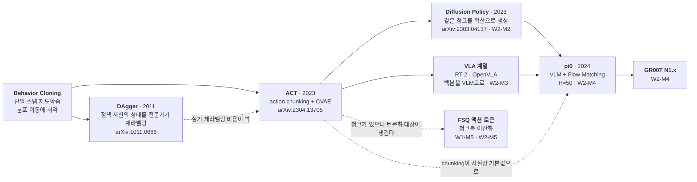
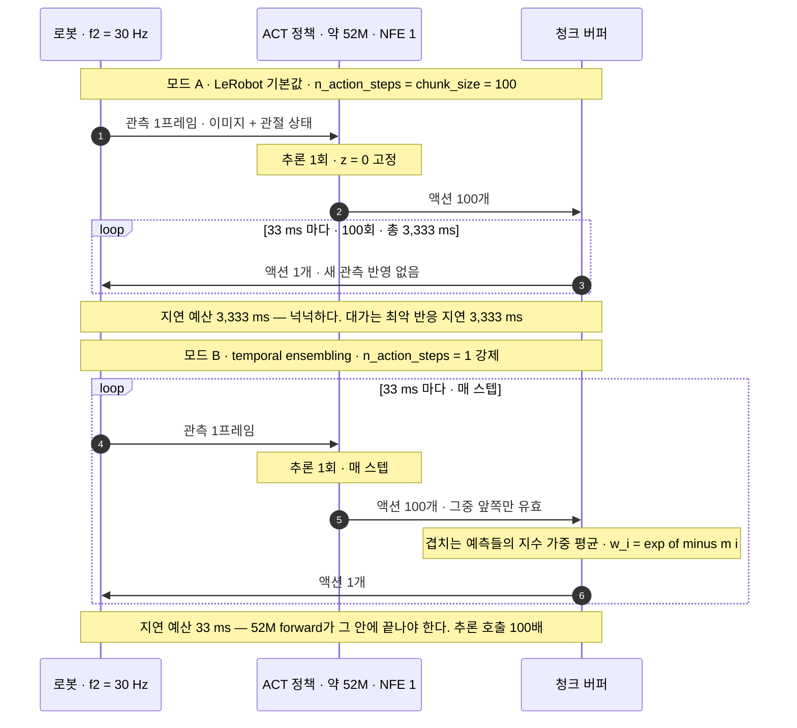
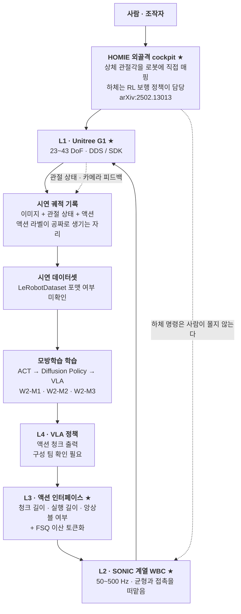

# 모방학습 기초 + ACT

> **한 줄 요약**: Behavior Cloning이 왜 혼자서는 무너지는지를 compounding error로 진단하고, ACT(arXiv:2304.13705)가 내놓은 답 두 가지 — action chunking과 CVAE latent — 를 LeRobot 구현의 실제 하이퍼파라미터까지 내려가 읽는다. [W1-M1 §4](../../w1-generative-core/01-physical-ai-landscape/lesson.md)가 부등식으로 세워둔 청크 설계를 `chunk_size` · `n_action_steps` · `temporal_ensemble_coeff` 세 숫자로 채운다.

## 학습 목표

- [ ] Behavior Cloning의 objective를 쓰고, 학습 분포가 모델 자신 때문에 이동한다는 점을 개루프 적분 오차 누적에 대응시켜 설명하며 최악 비용이 지평에 제곱으로 커지는 이유를 스케치할 수 있다.
- [ ] DAgger가 그 제곱을 무엇으로 내리고 로봇에서 왜 비싼지, action chunking은 같은 상한을 어떻게 바꾸며 그 이득이 왜 공짜가 아닌지(MPC 예측 지평 선택과 같은 구조)를 말할 수 있다.
- [ ] ACT의 CVAE loss를 ELBO에서 유도해 `kl_weight=10.0`이 그 $\beta$임을 지목하고, 추론 시 $z=0$의 함의를 말할 수 있다.
- [ ] ACT 아키텍처를 백지에 그리면서 입출력 텐서 shape을 채울 수 있다 — 이미지 `[B, n_cam, 3, H, W]`부터 액션 청크 `[B, 100, D_action]`까지.
- [ ] `chunk_size` · `n_action_steps` · `temporal_ensemble_coeff`가 각각 무엇을 정하는지 구분하고, 세 값의 조합이 [W1-M1 §4](../../w1-generative-core/01-physical-ai-landscape/lesson.md)의 지연 예산 부등식에서 어느 자리에 들어가는지 지목할 수 있다.
- [ ] ALOHA 양팔 텔레옵과 HOMIE 외골격 cockpit이 같은 발상의 두 변형이고, HOMIE가 하체를 RL에 넘긴 것이 청크 설계에 무엇을 바꾸는지 말할 수 있다.

**완료 기준**: LeRobot ACT 기본값 `chunk_size=100`, `n_action_steps=100`, `temporal_ensemble_coeff=None`을 놓고 (a) 이 설정이 청크를 끝까지 개방루프로 실행한다는 뜻임을 지적하고 (b) 30 Hz 기준 3.33초의 최악 반응 지연을 계산하고 (c) 그 값이 [W1-M1 §3.3](../../w1-generative-core/01-physical-ai-landscape/lesson.md)의 "자세가 무너지기까지 200 ms" 문턱과 왜 충돌하지 않는지(ALOHA는 고정 베이스라 낙상 모드가 없다)를 한 문단으로 쓸 수 있다.

**선수 지식**: [W1-M1 §4](../../w1-generative-core/01-physical-ai-landscape/lesson.md) — 지연 예산 부등식 $H_{\text{chunk}} \ge f_2(T_{\text{replan}} + \tau_{\text{infer}} + \tau_{\text{comm}})$과 action chunking ≈ MPC 예측 지평. **이 모듈은 그 부등식을 되풀이하지 않고 ACT의 실제 하이퍼파라미터로 채우는 역할입니다.** [W1-M1 §3.3](../../w1-generative-core/01-physical-ai-landscape/lesson.md)의 200 ms 문턱도 §3.6에서 다시 씁니다. 참고로 [W1-M3](../../w1-generative-core/03-diffusion-ddpm-dit/lesson.md)·[W1-M4](../../w1-generative-core/04-flow-matching/lesson.md)가 깔아둔 생성모델 기반은 §6.5에서 "ACT의 CVAE vs Diffusion Policy의 확산"으로 대조합니다. · **소요**: 이론 2~2.5h / 실습 2~3h(LeRobot 설치 포함)

---

## 1. 왜 이것을 배우는가

### 1.1 여기가 갭 영역의 입구다

마스터플랜 §3의 갭 목록에 "모방학습/VLA 학습 파이프라인"이 있습니다. W2 전체가 그 갭을 겨냥하고, 이 모듈이 입구입니다.

그래서 이 문서는 **당신이 로봇 학습 파이프라인을 한 번도 돌려본 적 없다는 전제**로 씁니다. 데이터셋이 어떤 모양인지, 정책이 무엇을 입력받고 무엇을 뱉는지, 학습 스크립트가 어떤 인자를 먹는지를 생략하지 않습니다. W1-M3에서 DDPM 유도를 "복습"으로 처리했던 것과는 반대 방향입니다. 반대로 이미 아는 것 — 지도학습, 트랜스포머 인코더-디코더, VAE의 ELBO — 은 설명하지 않고 그것들이 **로봇 시연 데이터 위에서 어떻게 어긋나는가**만 다룹니다.

### 1.2 제어 배경이 유리한 지점과 함정

Behavior Cloning은 이름이 무섭게 생겼지만 하는 일은 회귀입니다. 관측을 넣으면 액션이 나오는 함수를 데이터로 맞춥니다.

제어 배경이면 즉시 한 가지가 걸립니다. 시스템 동정(system identification)은 **플랜트**를 맞추는 일이었는데 BC는 **제어기**를 맞춥니다. 방향이 반대이고, 그 차이가 문제를 만듭니다. BC의 데이터는 **전문가 정책이 방문한 상태**에서만 나오는데 루프를 닫으면 로봇은 **내 정책**이 방문하는 상태를 지나갑니다. 그 상태에서 모델은 검증된 적이 없습니다.

이것이 이 모듈 전체를 지배하는 한 문장입니다. **학습 데이터의 분포와 실행 시 마주치는 분포가 다르고, 그 차이를 만드는 원인이 학습된 모델 자신이다.** §2.2가 이 이야기이고 제어 쪽 대응은 §3.1에 붙였습니다.

유리한 지점도 분명합니다. compounding error는 **피드백 없는 개루프 적분 오차 누적**과 구조가 같고, action chunking은 MPC의 예측 지평 선택 문제 그 자체이며, temporal ensembling은 관측기 블렌딩과 같은 형태입니다. 새로 배울 것은 개념이 아니라 **그 개념들이 로봇 학습 코드에서 어떤 이름의 하이퍼파라미터로 나타나는가**입니다.

### 1.3 ACT가 계보의 원점인 이유 — W1-M1이 남긴 약속

[W1-M1 §4.4](../../w1-generative-core/01-physical-ai-landscape/lesson.md)가 "→ W2-M1(ACT)에서 이 트레이드오프를 실제 하이퍼파라미터로 다시 만납니다"로 끝납니다. 이 모듈이 그 약속을 갚습니다.

W1-M1은 action chunking을 **지연 흡수 장치**로 소개했습니다. 상위 모델이 느리니 미래 여러 스텝을 미리 뱉어 버퍼로 쓴다는 논리였는데, 옳지만 절반입니다. **ACT의 원 논거는 지연이 아니라 compounding error 축소입니다.** 결정 횟수를 $T$에서 $T/k$로 줄이면 오차를 새로 주입할 기회 자체가 $k$분의 1이 되고, 지연 흡수는 거기서 따라오는 부수 효과입니다. 그래서 `chunk_size=100`은 지연 논거로 정해진 값이 아닙니다 — §3.6이 그 계산이고, 청크 길이에 걸린 힘들의 대비는 §6.2, 오해의 형태는 §7의 두 번째 항목입니다.

계보로 보면 ACT의 위치는 이렇습니다.



점선 화살표 셋이 요점입니다. DAgger는 이론적으로 더 나은 답이었는데 실기 비용 때문에 주류가 되지 못했고, chunking은 ACT 이후 거의 모든 후속 논문의 기본값이 됐으며, 청크라는 단위가 생긴 덕분에 그것을 이산화하는 FSQ 같은 L3 설계가 성립합니다. 회사 스택의 L3가 존재하는 전제가 이 그림 안에 있습니다.

---

## 2. 개념

### 2.1 Behavior Cloning — 정책을 회귀한다

전문가 정책 $\pi^*$가 로봇을 조작하는 동안 관측과 액션을 짝지어 기록합니다. 이것이 시연 데이터셋입니다.

$$\mathcal{D} = \bigl\{(o_t^{(i)},\, a_t^{(i)})\bigr\}_{t=1..T_i,\; i=1..N}$$

$i$는 에피소드(한 번의 시연), $t$는 그 안의 타임스텝입니다. $o_t$는 관측 — 카메라 이미지 몇 장과 로봇 자신의 관절 상태(proprioception)입니다. $a_t$는 그 시점에 로봇에 실제로 들어간 명령입니다.

여기서 첫 번째로 헷갈리는 지점을 짚고 갑니다. **액션 라벨은 사람이 나중에 붙이는 것이 아닙니다.** 텔레옵으로 시연을 수집하면, 사람이 리더 팔을 움직인 결과로 팔로워 로봇에 내려간 관절 명령이 그대로 $a_t$가 됩니다. 라벨링 작업이 따로 없습니다. 이것이 텔레옵이 로봇 데이터 수집의 주력인 이유이고, [W1-M1 §5](../../w1-generative-core/01-physical-ai-landscape/lesson.md) 데이터 피라미드에서 ③층(텔레옵)만 "액션 라벨 정확"인 이유입니다. 웹 비디오에는 이 명령 신호가 없습니다.

BC는 이 데이터로 지도학습을 합니다.

$$\theta^\star = \arg\min_\theta\; \mathbb{E}_{(o,a)\sim\mathcal{D}}\bigl[\,\ell\bigl(\pi_\theta(o),\, a\bigr)\bigr]$$

끝입니다. 손실 $\ell$은 보통 $\ell_1$이나 $\ell_2$이고, 보상 함수도 환경 상호작용도 필요하지 않습니다. RL과 비교하면 어이없을 정도로 단순하고, 그래서 로봇 학습의 기본 baseline입니다.

문제는 이 식에 **시간이 없다**는 것입니다. $(o, a)$ 쌍을 i.i.d.로 취급합니다. 하지만 배포하면 $o_{t+1}$은 $a_t$의 결과로 생기고, $a_t$는 내 모델이 뱉은 것입니다. 학습 objective에는 이 인과 사슬이 어디에도 들어 있지 않습니다.

### 2.2 compounding error — 개루프 적분 오차 누적

무슨 일이 일어나는지 하나의 그림으로 잡아두겠습니다. 전문가 시연들은 상태공간에 **관(tube)**을 만듭니다. 열 번 시연하면 열 개의 궤적이 비슷한 영역을 지나가고, 그 영역이 학습 데이터가 덮은 구역입니다. 학습된 정책은 그 관 안에서는 잘 동작합니다. 관 밖에서는 검증된 적이 없습니다.

이제 배포합니다. 정책이 스텝 하나에서 아주 조금 틀립니다. 관절 하나가 0.5도 어긋난 정도로요. 로봇은 관에서 살짝 벗어난 상태로 갑니다. 다음 스텝의 관측은 학습 데이터에서 본 것보다 조금 낯섭니다. 낯선 입력에서 모델은 조금 더 틀립니다. 더 벗어납니다. 더 낯설어집니다.

**오차가 자기 입력을 오염시키는 양의 피드백 루프**입니다. 이것이 covariate shift(분포 이동)이고, 로봇에서 특별한 이유는 그 shift를 만드는 원인이 외부 요인이 아니라 모델 자신이라는 점입니다. 일반적인 covariate shift는 데이터 수집 환경과 배포 환경이 다르다는 정적인 문제인데, 여기서는 동적인 되먹임입니다.

제어 대응이 정확히 있습니다. **개루프 dead-reckoning.** 속도 추정에 작은 편향이 있는 상태로 적분해 위치를 추정하면 위치 오차가 시간에 비례해 자랍니다. 그 위치 추정을 다시 제어에 쓰면 오차가 제어 입력을 오염시켜 실제 궤적까지 밀어냅니다. BC 정책에는 관 안으로 되돌리는 피드백 항이 없습니다. 목적함수에 그런 항이 아예 없으니까요. 시연 데이터에는 "관 밖에서 관 안으로 복귀하는" 궤적이 거의 들어 있지 않습니다. 전문가는 실수를 안 했으니 복구 데이터도 없습니다.

여기서 초심자가 흔히 놓치는 결론 하나. **모델을 키우고 데이터를 늘려도 이 문제는 원리적으로 사라지지 않습니다.** 스텝당 오차율 $\epsilon$을 줄일 수는 있지만 $\epsilon>0$인 한 누적 구조는 그대로입니다. 상한이 지평에 대해 제곱으로 자란다는 것이 §3.2의 계산입니다.

실무에서 이 실패는 아주 알아보기 쉬운 모습으로 나타납니다. 로봇이 태스크 초반은 잘하다가 중반에 **어정쩡한 자세로 멈추거나 같은 동작을 미세하게 반복**합니다. 학습 분포 밖으로 나가서 모델이 의미 있는 출력을 못 내는 상태입니다. 실습에서 이 그림을 보게 되면 성능 문제가 아니라 분포 문제로 읽어야 합니다.

### 2.3 DAgger — 정답이지만 로봇에서 비싸다

진단이 "학습 분포와 실행 분포가 다르다"이면 처방은 자연스럽습니다. **실행 분포에서 학습하면 됩니다.**

DAgger(Dataset Aggregation, arXiv:1011.0686)가 그 처방입니다. 절차는 이렇습니다.

1. 지금 정책 $\pi_\theta$를 실제로 굴려 상태들을 방문한다.
2. 그 상태 각각에 대해 **전문가에게 "여기서는 뭘 했어야 하나"를 물어 라벨을 받는다.**
3. 그 새 데이터를 기존 데이터셋에 합친다.
4. 다시 학습한다. 1로 돌아간다.

이렇게 하면 학습 데이터가 정책 자신의 방문 분포를 덮게 됩니다. 관 밖으로 나간 상태에 대해서도 "이럴 때 이렇게 복귀하라"는 라벨이 붙습니다. 이론적으로 최악 비용의 지평 의존성이 제곱에서 선형으로 내려갑니다(§3.2).

로봇에서 벽에 부딪히는 곳은 2번입니다.

- 전문가가 **사람**입니다. 상태 하나마다 사람이 정답 액션을 지정해야 합니다. 궤적 하나가 수백~수천 스텝이니 라벨링 노동이 시연 수집보다 훨씬 큽니다.
- 라벨을 붙일 상태에 로봇을 **실제로 데려다 놓아야** 합니다. 시뮬레이터라면 상태를 직접 세팅할 수 있지만 실기에서는 그 자세를 재현해야 하고, 균형이 걸린 자세면 재현 자체가 위험합니다.
- 실패 근처 상태를 일부러 방문합니다. 학습 초기의 정책은 형편없으므로 로봇을 위험한 상태로 자주 밀어 넣습니다. 하드웨어가 상합니다.

그래서 로봇 모방학습의 주류는 DAgger가 아니라 **"BC를 그대로 쓰되 compounding error를 다른 방식으로 줄이는" 노선**이 됐고, ACT의 chunking이 그 대표입니다. 다만 완전히 사라진 것은 아닙니다 — LeRobot 실물 롤아웃 커맨드에 `--strategy.type=dagger` 옵션이 있습니다(§8).

### 2.4 action chunking — 결정 횟수를 줄인다

ACT의 첫 번째 아이디어입니다. 정책이 한 스텝의 액션을 뱉는 대신 **미래 $k$스텝의 액션을 한꺼번에** 뱉습니다.

$$\pi_\theta:\; o_t \;\longmapsto\; \hat a_{t:t+k-1} \in \mathbb{R}^{k \times D_{\text{action}}}$$

LeRobot에서 이 $k$가 `chunk_size`이고 기본값이 **100**입니다.

왜 도움이 되는지는 두 층위로 읽어야 합니다.

**첫째, 결정 횟수가 줄어듭니다.** 길이 $T$의 태스크를 스텝마다 판단하면 결정이 $T$번이고, 각 결정이 새로 오차를 주입할 기회입니다. 청크로 하면 결정이 $\lceil T/k \rceil$번입니다. 오차 주입 기회가 $k$분의 1로 줄어듭니다. §3.3에서 상한이 $k$로 나뉘는 것을 봅니다.

**둘째, 시연 데이터의 비마르코프성을 흡수합니다.** 사람이 텔레옵으로 시연하면 중간에 잠깐 멈춥니다. 손이 목표를 재확인하는 동안 액션이 0에 가까운 프레임들이 생기죠. 단일 스텝 정책의 눈에는 **거의 똑같은 관측에 대해 어떤 때는 움직이라는 라벨, 어떤 때는 멈추라는 라벨**이 붙어 있는 것으로 보입니다. $\ell_2$ 회귀는 그 둘의 평균을 뱉고, 평균은 "아주 조금 움직임"입니다. 실제로 로봇이 목표 앞에서 굼실거리다 멈추는 실패가 이렇게 나옵니다. 청크로 예측하면 "지금 멈추고 다음에 움직인다"는 시간 구조를 출력 안에 담을 수 있어 이 모호성이 크게 줄어듭니다.

이 두 번째 이유가 실무에서 더 자주 결정적입니다. 첫 번째는 이론적 상한 이야기지만 두 번째는 데이터의 성질 이야기이고, 사람이 만든 시연은 반드시 이 성질을 가집니다.

MPC 대응(청크 = 예측 지평 $N$, 재계획 = receding horizon)은 [W1-M1 §4.4](../../w1-generative-core/01-physical-ai-landscape/lesson.md)가 이미 세웠습니다. 여기서 새로 추가되는 것은 **"앞부분 몇 개를 쓰는가"가 별도 하이퍼파라미터로 존재한다**는 사실입니다.

### 2.5 chunk_size와 n_action_steps — 두 숫자를 구분하라

LeRobot ACT 설정에 비슷하게 생긴 두 필드가 있습니다. 이것을 헷갈리면 이 모듈의 핵심을 놓칩니다.

- **`chunk_size`** — 정책이 한 번의 추론으로 **예측하는** 스텝 수. 기본값 100.
- **`n_action_steps`** — 그 예측 중 실제로 **환경에서 실행하는** 스텝 수. 기본값 100.

`n_action_steps` docstring이 이렇게 말합니다.

> "The number of action steps to run in the environment for one invocation of the policy. This should be no greater than the chunk size. For example, if the chunk size size 100, you may set this to 50."  ← `size size`는 LeRobot 원문의 오타이며 축자 인용을 위해 그대로 둡니다

**LeRobot 기본 설정은 두 값이 모두 100이라 예측한 청크를 끝까지 실행합니다.** 100스텝 동안 새 관측을 전혀 보지 않습니다. 즉 **receding horizon은 ACT의 기본값이 아니라 옵션이고**, docstring이 예시로 든 `n_action_steps=50`이 그 옵션입니다(검증은 `n_action_steps ≤ chunk_size`만 강제). MPC 배경이면 지평 전체를 개방루프로 실행한다는 데 위화감을 느껴야 정상인데, 그것이 왜 성립하는지는 §3.6이 태스크 성질로 설명합니다.

이 축이 곧 회사 스택의 L3 설계 질문 그 자체입니다. `notes/questions-for-team.md`의 **M4-5**("액션 청크를 끝까지 실행하는가, 앞 몇 개만 쓰고 재계획하는가")가 이 두 숫자의 관계를 묻는 질문으로 이미 적립돼 있습니다.

### 2.6 temporal ensembling — 겹치는 예측을 융합한다

`n_action_steps`를 1로 줄이면 매 스텝 새로 추론하게 되고, 시각 $t$에 실행할 액션의 예측이 최대 `chunk_size`개까지 쌓입니다 — $t$에서 만든 청크의 0번째 원소, $t-1$에서 만든 청크의 1번째 원소, $t-2$의 2번째 원소… 이것들을 버리지 않고 지수 감쇠 가중으로 평균하는 것이 temporal ensembling입니다. 가중식과 계수 $m$ 부호의 의미는 §3.5, 권장값 0.01이 실제로 무엇을 하는지는 §6.4의 표에 있습니다.

문제는 비용입니다. docstring이 명시합니다.

> "Coefficient for the exponential weighting scheme to apply for temporal ensembling. Defaults to None which means temporal ensembling is not used. `n_action_steps` must be 1 when using this feature, as inference needs to happen at every step to form an ensemble."

`n_action_steps > 1`인 채로 켜면 설정 검증에서 거부됩니다. 앙상블을 만들려면 매 스텝 추론해야 하니 논리적으로 강제되는 제약이고, 그것이 지연 예산과 정면으로 부딪힙니다. 기본 설정은 청크당 추론 1회인데 앙상블은 **스텝당 추론 1회** — 30 Hz면 추론 호출이 100배가 되고 33 ms 안에 약 52M 파라미터 forward를 끝내야 합니다. §3.6이 이 계산이고 §7의 세 번째 오해가 이 지점입니다.

### 2.7 ACT의 CVAE — latent $z$가 흡수하는 것

ACT의 두 번째 아이디어입니다. 정책을 조건부 VAE로 만듭니다.

먼저 무엇을 고치려는 것인지부터. §2.4에서 본 것처럼 사람 시연은 **같은 상황에서 매번 조금씩 다릅니다.** 접근 각도도, 속도도, 중간에 멈추는 위치도 시연마다 다릅니다. 이 변동을 회귀 모델에 그대로 먹이면 모델은 그 평균을 학습하고, 평균 궤적은 어느 시연도 아닌 궤적일 수 있습니다.

CVAE의 처방은 **그 변동을 설명하는 잠재변수를 하나 두는 것**입니다. 학습할 때는 정답 액션 청크를 볼 수 있으니 인코더 $q_\phi(z \mid a_{t:t+k}, o_t)$가 "이 시연이 어떤 스타일이었는지"를 $z$에 담고, 디코더는 $o_t$와 $z$를 함께 받아 청크를 복원합니다. $z$가 스타일 변동을 떠맡아주면 평균으로 뭉개지는 압력이 줄어듭니다. **관측되지 않는 외생 변수를 latent로 명시적으로 모델링해 회귀 잔차에서 빼내는 것** — 시연자의 그날 컨디션을 잔차에 섞지 않고 별도 축으로 뽑아냅니다.

여기서 반드시 알아야 할 구현 사실이 있습니다. **추론할 때는 정답 액션이 없으니 인코더를 쓸 수 없고, LeRobot은 $z$를 0 벡터로 고정합니다.** 코드가 이렇습니다.

```python
latent_sample = torch.zeros([batch_size, self.config.latent_dim],
                            dtype=torch.float32).to(batch[OBS_STATE].device)
```

여기서 두 가지가 따라나옵니다.

첫째, **배포 시 ACT는 결정론적 정책입니다.** 관측이 같으면 출력이 항상 같습니다. 확률적 샘플링이 없습니다.

둘째, 따라서 **$z$는 실행 시 여러 행동 모드 중 하나를 골라주는 장치가 아닙니다.** 학습 시 시연자 변동을 흡수해 회귀가 뭉개지는 것을 막는 정규화 장치입니다(§7 번외). 다봉 행동 분포를 **실행 시점에** 다루는 문제는 추론 자체가 샘플링이라 매번 다른 모드를 뽑을 수 있는 W2-M2의 Diffusion Policy가 맡습니다.

$\beta$($=$`kl_weight`$=10.0$)가 큰 값이라는 사실도 같은 방향을 가리킵니다(해석은 §3.4). 다만 $z$가 실제로 얼마나 붕괴하는지는 데이터에 달린 경험적 문제라 이 문서는 확인된 두 사실만 두고 그 이상을 단언하지 않습니다. `use_vae=False`로 껐을 때와의 비교는 실습에서 직접 볼 대상입니다.

---

## 3. 핵심 수식

### 3.1 BC objective와 두 분포

$$\theta^\star = \arg\min_\theta\; \mathbb{E}_{o \sim d_{\pi^*}}\Bigl[\ \mathbb{E}_{a\sim\pi^*(\cdot\mid o)}\bigl[\ell(\pi_\theta(o), a)\bigr]\ \Bigr]$$

- **직관**: 기대값의 바깥 첨자를 보세요. $d_{\pi^*}$ — **전문가 정책의 상태 방문 분포**입니다. 그런데 배포하면 상태는 $d_{\pi_\theta}$에서 나옵니다. 최적화한 대상과 평가받는 대상이 다릅니다.
- **제어 대응**: 특정 작동점 근방에서 동정한 선형 모델로 제어기를 설계했는데, 그 제어기가 로봇을 다른 작동점으로 데려가는 상황입니다. 모델 유효 영역과 실제 운용 영역이 어긋나 있고, 어긋나게 만든 것이 그 모델로 만든 제어기입니다.

### 3.2 compounding error 상한 — 왜 제곱인가

스텝당 오차율을 전문가 분포에서 정의합니다.

$$\epsilon \;=\; \mathbb{E}_{o\sim d_{\pi^*}}\bigl[\mathbb{1}\{\pi_\theta(o) \ne \pi^*(o)\}\bigr]$$

스케치는 세 줄입니다.

1. 첫 실수가 스텝 $t$에서 일어날 확률은 대략 $\epsilon$ 수준입니다.
2. 실수한 뒤 로봇은 학습 분포 밖에 있습니다. 그 뒤 남은 $T-t$ 스텝에 대해서는 **아무 보장이 없습니다.** 최악을 잡으면 스텝당 비용 1을 다 물립니다.
3. 두 개를 곱해 더합니다.

$$J(\pi_\theta) - J(\pi^*) \;\lesssim\; \sum_{t=1}^{T} \epsilon\,(T-t) \;\approx\; \frac{\epsilon T^2}{2} \;=\; O(\epsilon T^2)$$

- **직관**: 제곱의 출처는 "실수 확률 $\times$ 실수 이후 남은 시간"입니다. 실수가 이를수록 대가가 큽니다. 반면 DAgger처럼 정책 자신의 분포에서 학습하면 실수 이후의 상태도 학습 데이터에 있으므로 그 상태에서의 오차율도 $\epsilon$으로 눌립니다. 그러면 상한이 $O(\epsilon T)$로 내려갑니다. 이 $T$ vs $T^2$ 대비가 Ross·Bagnell 계열 모방학습 이론의 표준 결과입니다.
- **제어 대응**: $O(\epsilon T)$는 편향이 있는 신호를 한 번 적분한 것, $O(\epsilon T^2)$는 두 번 적분한 것과 같은 스케일입니다. 오차가 상태를 밀고 밀린 상태가 오차를 키우는 두 겹 누적입니다.
- **읽는 법**: 이 부등식은 최악 상한이라 실제 성능 예측치가 아닙니다. 쓸모는 **스케일링 감각**입니다. 태스크 길이를 두 배로 늘리면 데이터를 두 배로 늘려서는 부족합니다.

### 3.3 chunking이 상한을 어떻게 바꾸는가

청크 $k$로 가면 결정이 $T/k$번입니다. 청크 단위 오차율을 $\epsilon_k$라 하고 같은 스케치를 반복합니다.

결정 $j$에서 틀리면 남은 결정이 $(T/k - j)$개, 환경 스텝으로는 $k(T/k-j)$개입니다.

$$J(\pi_\theta) - J(\pi^*) \;\lesssim\; \sum_{j=1}^{T/k} \epsilon_k \cdot k\Bigl(\frac{T}{k}-j\Bigr) \;\approx\; \frac{\epsilon_k\,T^2}{2k}$$

$$\underbrace{\frac{\epsilon\,T^2}{2}}_{k=1\ (\text{단일 스텝 BC})} \;\longrightarrow\; \underbrace{\frac{\epsilon_k\,T^2}{2k}}_{\text{청크 }k}$$

- **직관**: 분모에 $k$가 붙었습니다. **단, $\epsilon_k$가 $k$에 무관하다면**입니다. 실제로는 100스텝을 한꺼번에 맞히는 것이 1스텝 맞히기보다 어려우므로 $\epsilon_k$는 $k$와 함께 커집니다. 이득은 $1/k$로 줄고 대가는 $\epsilon_k$로 늘어나니 **최적 $k$가 중간에 있습니다.**
- **제어 대응**: MPC 예측 지평 $N$ 선택과 같은 구조입니다. $N$을 늘리면 제약을 미리 보고 성능이 좋아지지만, 먼 미래는 모델 오차가 커서 그 예측이 신뢰할 수 없습니다. 여기서는 "모델 오차"의 자리에 "$k$스텝 청크 회귀의 난이도"가 들어갑니다.
- **덧붙임**: 상한식만 보면 반응성 비용이 안 보입니다. 청크를 끝까지 실행하는 설정에서는 최악 반응 지연이 $k/f_2$까지 늘어나는데, 그 항은 이 부등식에 아예 없습니다. §3.6이 그 항을 따로 잡습니다.

### 3.4 CVAE ELBO에서 ACT loss로

조건부 VAE의 ELBO입니다. 조건이 $o_t$, 데이터가 액션 청크 $a_{t:t+k}$입니다.

$$\log p_\theta(a_{t:t+k}\mid o_t) \;\ge\; \mathbb{E}_{q_\phi}\bigl[\log p_\theta(a_{t:t+k}\mid z,\, o_t)\bigr] \;-\; D_{\mathrm{KL}}\bigl(q_\phi(z\mid a_{t:t+k}, o_t)\,\|\,p(z)\bigr)$$

세 단계만 거치면 코드의 loss가 됩니다.

**① prior를 관측 무관 표준정규로 고정합니다.** $p(z) = \mathcal{N}(0, I)$. 관측 조건부 prior를 학습하지 않으므로 KL이 닫힌 형태로 떨어집니다.

$$D_{\mathrm{KL}}\bigl(\mathcal{N}(\mu,\sigma^2)\,\|\,\mathcal{N}(0,I)\bigr) = -\frac{1}{2}\sum_{j=1}^{32}\bigl(1 + \log\sigma_j^2 - \mu_j^2 - \sigma_j^2\bigr)$$

합의 상한이 32인 것은 `latent_dim=32`입니다. 이 식이 코드의 `mean_kld` 한 줄과 문자 그대로 대응합니다.

**② 재구성 항의 확률모형을 Laplace로 잡습니다.** $p_\theta(a \mid z, o) \propto \exp(-|a - \hat a|/b)$이면 $-\log p_\theta = |a-\hat a|/b + \text{const}$이므로 **$\ell_1$ 손실**이 나옵니다. 가우시안으로 잡으면 $\ell_2$가 나오죠.

이 선택이 중요합니다. Laplace는 가우시안보다 꼬리가 두꺼워 **이상치에 관대**합니다. 텔레옵 액션 라벨에는 사람 손떨림과 통신 지터가 섞여 있어 튀는 값이 반드시 들어갑니다. $\ell_2$는 그 튀는 값 하나에 회귀선이 끌려가지만 $\ell_1$은 덜 끌려갑니다. 또 $\ell_2$가 다봉 타깃에서 평균으로 뭉개는 성질(중간을 예측)이 $\ell_1$에서는 중앙값 쪽으로 바뀌어 조금 완화됩니다.

**③ 부호를 뒤집고 KL에 가중 $\beta$를 붙입니다.**

$$\boxed{\;\mathcal{L}_{\text{ACT}} \;=\; \underbrace{\bigl\|\hat a_{t:t+k} - a_{t:t+k}\bigr\|_1}_{\texttt{l1\_loss}} \;+\; \beta \cdot \underbrace{D_{\mathrm{KL}}\bigl(q_\phi \,\|\, \mathcal{N}(0,I)\bigr)}_{\texttt{kld\_loss}}, \qquad \beta = \texttt{kl\_weight} = 10.0\;}$$

코드의 조립도 정확히 이 모양입니다.

```python
loss = l1_loss + mean_kld * self.config.kl_weight
```

- **직관**: `kl_weight`가 곧 $\beta$-VAE의 $\beta$입니다. 크게 잡으면 $z$를 prior에 붙여 정보를 덜 담게 하고, 작게 잡으면 $z$가 많은 정보를 담아 재구성이 쉬워지지만 추론 시 $z=0$과의 괴리가 커집니다. 학습 때 $z$에 의존해 복원하다가 배포에서 $z=0$을 받으면, 의존이 컸을수록 손해가 큽니다. **$\beta=10.0$이라는 큰 값은 그 괴리를 줄이려는 방향의 선택으로 읽힙니다.**
- **제어 대응**: 정규화 가중을 키워 자유도를 억제하는 것과 같습니다. LQR의 입력 가중 $R$을 키워 제어 입력의 자유도를 눌러 강인성을 사는 것과 형태가 같습니다. 여기서는 재구성 정확도를 팔아 학습·배포 일관성을 삽니다.
- **읽는 순서 주의**: $\ell_1$과 KL은 스케일이 전혀 다른 양입니다. `kl_weight=10.0`이라는 숫자만 보고 "KL이 10배 중요하다"로 읽으면 안 됩니다. 두 항의 실제 크기를 학습 로그에서 따로 봐야 합니다(실습 항목).

### 3.5 temporal ensembling의 지수 가중

$$a_t^{\text{exec}} = \frac{\sum_{i=0}^{n-1} w_i\,\hat a_t^{(i)}}{\sum_{i=0}^{n-1} w_i}, \qquad w_i = \exp(-m\,i), \qquad m = \texttt{temporal\_ensemble\_coeff}$$

$\hat a_t^{(i)}$는 시각 $t$에 대한 $i$번째 예측이고, 규약상 $i=0$이 **가장 오래된** 예측입니다. $n$은 지금까지 쌓인 예측 수로 최대 `chunk_size`까지 자랍니다.

가중 총합 $S$는 등비급수로 닫힙니다. **유효 기여 수**는 그 합을 최대 가중으로 나눈 값으로 정의합니다 — "실질적으로 몇 개의 예측이 기여하는가"이고, §6.4 표의 마지막 열이 이 값입니다.

$$S=\sum_{i=0}^{n-1} e^{-mi} = \frac{1-e^{-mn}}{1-e^{-m}}, \qquad n_{\text{eff}} = \frac{S}{\max_i w_i}$$

$m>0$이면 최대 가중이 $w_0=1$이라 $S$와 $n_{\text{eff}}$가 같지만, $m<0$이면 최대가 $w_{n-1}$ 쪽이라 갈립니다($m=-0.01$에서 $S=171.0$인데 $n_{\text{eff}}=63.5$).

- **직관**: $m$의 부호가 반응성 노브입니다. 양수는 과거를 믿고, 음수는 현재를 믿습니다. 크기는 얼마나 빠르게 잊을지를 정합니다. §6.4에서 $n=100$일 때의 실제 숫자를 냈습니다 — $m=0.1$이면 유효 기여 예측이 10.5개뿐이고 그것도 **가장 오래된 쪽** 10개입니다. 새 관측이 거의 반영되지 않는 설정이라는 뜻입니다.
- **제어 대응**: 지수 가중 이동평균(EWMA) 필터이자 여러 예측기의 신뢰도 가중 융합입니다. 평균은 저역통과이므로 궤적이 매끄러워지고, 그 대가로 위상 지연이 생깁니다. 익숙한 트레이드오프입니다.

### 3.6 W1-M1 부등식에 ACT 기본값을 넣는다

[W1-M1 §4.1](../../w1-generative-core/01-physical-ai-landscape/lesson.md)의 부등식을 그대로 씁니다.

$$H_{\text{chunk}} \;\ge\; f_2\bigl(T_{\text{replan}} + \tau_{\text{infer}} + \tau_{\text{comm}}\bigr)$$

ACT에서는 좌변의 $H_{\text{chunk}}$ 자리에 **실제로 실행하는 길이인 `n_action_steps`**가 들어갑니다. `chunk_size`가 아닙니다. 예측만 하고 버리는 뒷부분은 지연을 버텨주지 않으니까요. 부등식을 지연 예산 쪽으로 정리하면 이렇게 읽힙니다.

$$T_{\text{replan}} + \tau_{\text{infer}} + \tau_{\text{comm}} \;\le\; \frac{\texttt{n\_action\_steps}}{f_2}$$

이제 숫자를 넣습니다. **ACT/ALOHA 공개 데이터의 기록 FPS는 50 Hz로 확인됐습니다**(2026-08-09 실측). 그래도 두 열을 병기하는 이유가 있습니다 — 50 Hz 열은 *ALOHA 자신*의 개방루프 창이고, 30 Hz 열은 *우리 로봇의 $f_2$를 30 Hz로 가정*했을 때입니다. 200 ms 문턱과 맞대는 것은 뒤쪽이라 아래 결론은 30 Hz 열로 읽습니다.

| 설정 | `chunk_size` | `n_action_steps` | 허용 지연 예산 @30 Hz | @50 Hz | 추론 호출 빈도 @30 Hz | 최악 반응 지연 @30 Hz |
|---|---|---|---|---|---|---|
| **LeRobot 기본값** | 100 | 100 | **3,333 ms** | 2,000 ms | 0.3 Hz (3.33초당 1회) | **3,333 ms** |
| docstring 예시 receding horizon | 100 | 50 | 1,667 ms | 1,000 ms | 0.6 Hz | 1,667 ms |
| 짧은 receding horizon | 100 | 10 | 333 ms | 200 ms | 3 Hz | 333 ms |
| **temporal ensembling(강제)** | 100 | **1** | **33 ms** | 20 ms | **30 Hz** | **33 ms** |

세 가지가 한 번에 보입니다.

**첫째, ACT 기본 설정에서 지연은 제약이 아닙니다.** 3.3초의 예산은 약 52M 파라미터 모델의 단일 forward에 터무니없이 넉넉합니다. 실제로 재보면 그렇습니다 — RTX 3080에서 청크 1회 생성이 **한 자릿수~십수 ms**라 예산의 **수백 분의 1**입니다. CPU(데스크톱 x86)에서도 **100 ms 언저리**라 여전히 30배 이상 여유입니다. 절대값은 GPU 클럭 상태와 부하에 따라 크게 흔들리므로(집필 중 6.5~66 ms) **자기 기기에서 직접 재는 것**이 [`labs/`](labs/) Step 6입니다. ACT는 확산 모델처럼 반복 샘플링을 하지 않아 NFE가 1이니 더 그렇습니다([W1-M4 §8](../../w1-generative-core/04-flow-matching/lesson.md)의 NFE 예산 표와 대조하면 차이가 분명합니다). **그러므로 `chunk_size=100`은 지연 논거로 정해진 값이 아닙니다.** §1.3에서 예고한 결론이 여기서 수치로 확인됩니다.

**둘째, 기본 설정의 최악 반응 지연이 3.3초입니다.** [W1-M1 §3.3](../../w1-generative-core/01-physical-ai-landscape/lesson.md)이 잡아둔 "발이 미끄러져 자세가 무너지기까지 200 ms" 문턱과 비교하면 **16배 밖**입니다. 이 대비가 이 모듈에서 가장 중요한 숫자 하나입니다.

그런데 이것이 ACT의 결함은 아닙니다. **ALOHA식 양팔 조작에는 낙상 모드가 없습니다.** 테이블에 고정된 팔이라 3.3초 동안 낡은 명령을 실행해서 생기는 최악은 잡기 실패이고, 실패해도 다시 시도하면 됩니다. 반면 휴머노이드 전신 제어에서 3.3초 개방루프는 넘어져 하드웨어가 상하는 결과입니다.

**따라서 청크 길이는 태스크의 외란 시간상수에 종속된 값이고, 그 시간상수가 다른 로봇으로 하이퍼파라미터를 그대로 옮기면 안 됩니다.** 조작과 전신 균형은 요구가 다릅니다. 이 결론이 §5의 회사 스택 논의로 곧장 이어집니다.

**셋째, temporal ensembling은 지연 예산을 100분의 1로 조입니다.** 예산이 3,333 ms에서 33 ms로 줄고 추론 빈도가 0.3 Hz에서 30 Hz로 오릅니다. 매끄러움을 사는 대가가 추론 비용 100배입니다.

두 실행 모드의 타이밍을 나란히 보면 이렇습니다.



---

## 4. 아키텍처

### 4.1 학습 경로 — CVAE 세 스택

ACT에는 트랜스포머 스택이 **셋** 있습니다. VAE 인코더(posterior), 메인 인코더, 디코더입니다. 층수 필드가 각각 `n_vae_encoder_layers=4`, `n_encoder_layers=4`, `n_decoder_layers=1`입니다.

```
━━━━━━━━━━━━━━ 학습 경로 (use_vae=True) ━━━━━━━━━━━━━━

입력 3종
  이미지          I  [B, n_cam, 3, H, W]     n_obs_steps = 1 (현재 프레임만)
  관절 상태       q  [B, D_state]
  액션 청크 정답  a  [B, 100, D_action]      ★ 학습 시에만 존재

┌─ ① VAE 인코더 (posterior q_phi) ─────────────────────────────┐
│  [CLS] 토큰                     [B, 1,   512]                │
│  q  → Linear(D_state → 512)     [B, 1,   512]                │
│  a  → Linear(D_action → 512)    [B, 100, 512]                │
│         concat → [B, 102, 512]                               │
│         Transformer 인코더 4층 (d=512, heads=8, ff=3200)      │
│         [CLS] 위치 출력 [B, 512] → Linear → [B, 64]           │
│                          split → mu [B,32], log sigma^2 [B,32]│
│         재매개화  z = mu + sigma * eps        z [B, 32]        │
└──────────────────────────────────────────────────────────────┘
                                    │  z [B, 32]
                                    ▼
┌─ ② 메인 트랜스포머 인코더 ────────────────────────────────────┐
│  I → ResNet-18 (ImageNet 사전학습)                            │
│        → 특징맵 [B*n_cam, 512, H/32, W/32]                    │
│        → 1x1 Conv(→ dim_model=512) → flatten                  │
│        → 이미지 토큰 [B, n_cam * (H/32)*(W/32), 512]          │
│           예: 480x640, n_cam=2 → 2 * 15*20 = 600 토큰         │
│  q → Linear → 상태 토큰   [B, 1, 512]                         │
│  z → Linear → latent 토큰 [B, 1, 512]                         │
│           concat → [B, N_tok, 512]   (예: 602)               │
│           + 위치 임베딩                                        │
│  Transformer 인코더 4층 (d=512, heads=8, ff=3200, dropout=0.1)│
│           출력 메모리 [B, N_tok, 512]                          │
└──────────────────────────────────────────────────────────────┘
                                    │  메모리 [B, N_tok, 512]
                                    ▼
┌─ ③ 트랜스포머 디코더 ────────────────────────────────────────┐
│  학습된 쿼리 임베딩 [100, 512] → [B, 100, 512]                │
│     ★ 쿼리 개수 = chunk_size = 100. 각 쿼리가 한 타임스텝 담당 │
│  self-attn + cross-attn(메모리) x n_decoder_layers = 1        │
│           [B, 100, 512]                                       │
│  Linear(512 → D_action)                                       │
└──────────────────────────────────────────────────────────────┘
                                    │
                                    ▼
출력  â  [B, 100, D_action]

손실  L = || â - a ||_1  +  10.0 * KL( N(mu, sigma^2) || N(0, I) )
             l1_loss              kld_loss * kl_weight
```

블록도에서 눈여겨볼 지점 넷입니다.

**디코더 쿼리 100개가 청크 길이 그 자체입니다.** DETR식 구조로, 각 쿼리가 청크의 한 타임스텝을 담당하는 학습된 위치 슬롯입니다. 자기회귀가 아니라 **한 번의 forward로 100스텝이 병렬로** 나옵니다. LLM에서 오는 사람이 자주 헷갈리는 지점입니다 — 청크는 토큰을 순차 생성하는 것이 아닙니다.

**관측은 단일 프레임입니다.** `n_obs_steps=1`이고 설정 검증이 다른 값을 거부합니다("Multiple observation steps not handled yet"). 즉 ACT는 **입력은 마르코프, 출력은 비마르코프**인 구조입니다. 과거 관측을 쌓지 않고 미래 액션만 묶습니다. [W1-M1 §3.1](../../w1-generative-core/01-physical-ai-landscape/lesson.md)의 L2 WBC가 `[T_hist, D_obs]`로 관측 이력을 쌓는 것과 방향이 반대라는 점을 비교해두면 좋습니다.

**이미지 토큰이 압도적으로 많습니다.** 카메라 2대 480×640이면 이미지 토큰 600개에 상태·latent 토큰이 각 1개입니다. 어텐션 비용의 거의 전부가 시각 특징이고, 카메라를 늘리면 토큰 수가 선형으로 늘어납니다. 배포 지연을 줄일 첫 손잡이는 카메라 수와 해상도입니다.

**언어 입력이 없습니다.** 이 문서가 확인한 LeRobot ACT의 입력은 이미지와 관절 상태뿐입니다. 즉 **태스크당 정책 하나**이고, 자연어로 태스크를 지정하는 능력은 백본을 VLM으로 갈아끼운 VLA 계열에서 생깁니다(W2-M3). §5의 계층 표에서 L5가 "해당 없음"인 이유입니다.

### 4.2 추론 경로 — 스택 하나가 사라진다

```
━━━━━━━━━━━━━━ 추론 경로 ━━━━━━━━━━━━━━

  이미지 I [B, n_cam, 3, H, W]        액션 정답 a → ✗ 없음
  관절 상태 q [B, D_state]            ① VAE 인코더 → ✗ 사용 안 함

                z = 0  [B, 32]     ← torch.zeros(...). prior 평균으로 고정
                   │
                   ▼
        ② 메인 인코더 4층  →  ③ 디코더 1층  →  â [B, 100, D_action]
                   │
                   ▼
        ┌──────────────────────────────────────────────┐
        │  실행 정책 — 여기가 L3 설계 지점               │
        │                                              │
        │  기본값: n_action_steps=100                   │
        │    â[0..99]를 순서대로 전부 실행 → 재추론      │
        │    새 관측 반영 주기 = 100 / f2                │
        │                                              │
        │  receding horizon: n_action_steps=k < 100     │
        │    â[0..k-1]만 실행하고 나머지 폐기 → 재추론   │
        │                                              │
        │  temporal ensembling: n_action_steps=1 강제    │
        │    매 스텝 재추론, 겹치는 예측을 지수 가중 평균 │
        │    w_i = exp(-m i),  w_0 = 가장 오래된 예측    │
        └──────────────────────────────────────────────┘
                   │
                   ▼
        관절 명령 → 로봇 (f2 Hz로 소비)
```

추론에서 VAE 인코더가 통째로 빠지고 $z=0$이 들어갑니다. **그래서 배포 모델은 결정론적입니다**(§2.7).

아래쪽 박스가 이 모듈의 무게중심입니다. 같은 학습된 가중치를 놓고도 실행 정책 세 갈래에 따라 지연 예산·반응성·추론 비용이 전부 달라집니다. 가중치가 아니라 **인터페이스 설정**이 시스템 성질을 정하는 자리이고, [W1-M1 §3.4](../../w1-generative-core/01-physical-ai-landscape/lesson.md)가 "승부처는 L3"라고 주장한 것의 가장 구체적인 실례입니다.

---

## 5. 회사 스택 연결 ★

### 5.1 이 모듈이 닿는 두 지점

이 lesson은 회사 스택의 두 곳에 직접 닿습니다. 하나는 **데이터가 어디서 오는가**이고 다른 하나는 **청크를 어떻게 실행하는가**입니다.



그림이 닫힌 고리인 것이 요점입니다. 사람이 cockpit으로 G1을 몰아 데이터를 만들고, 그 데이터로 정책을 학습해, 같은 G1에 배포합니다. **모방학습 파이프라인은 하드웨어를 두 번 씁니다** — 수집기로 한 번, 실행기로 한 번. 그래서 데이터 수집 방식이 정책 구조를 제약합니다.

### 5.2 HOMIE cockpit = 이 lesson의 데이터 공급원

ALOHA와 HOMIE는 같은 발상의 두 변형입니다. **사람이 로봇을 직접 몰아 시연을 만들고, 그때 로봇에 내려간 관절 명령을 그대로 액션 라벨로 쓴다**는 것입니다. 둘 다 관절 공간 직결 매핑이라 역기구학이 필요 없고 저가 하드웨어로 구현됩니다(ACT 초록이 강조하는 "low-cost hardware"가 이 지점입니다). 나머지 대비는 §6.3 표가 11행으로 갖고 있습니다.

**결정적인 차이는 하체입니다.** HOMIE는 하체를 사람에게 맡기지 않고 RL 보행 정책에 넘깁니다. 사람은 상체 조작만 몰고, 걷기·균형·접촉은 별도 정책이 고주파로 처리합니다. 이 결정이 이 모듈에 두 가지를 함의합니다.

**첫째, 청크에서 낙상 모드가 제거됩니다.** HOMIE에서는 청크로 다뤄지는 채널이 상체 조작이고 200 ms 문턱이 걸린 균형은 청크를 거치지 않는 별도 루프에 있으니, §3.6의 결론("전신 균형에서는 3.3초 개방루프가 안 된다")이 청크 채널에 걸리지 않습니다. [W1-M1 §3.3](../../w1-generative-core/01-physical-ai-landscape/lesson.md)의 대역폭 분리를 데이터 수집 하드웨어 수준에서 구현한 셈입니다.

**둘째, 학습되는 액션 벡터의 정체가 달라집니다.** 상체만 사람이 몰았다면 $a_t$가 상체 관절만인지, 하체 RL 정책의 출력까지 함께인지, 보행 속도 명령 같은 상위 명령인지가 정해져야 합니다. $D_{\text{action}}$의 값이 여기서 갈리는데 **이 부분은 확인되지 않았습니다**(팀 질문 `W2M1-1` · `W2M1-3`).

### 5.3 action chunking = L3 인터페이스 설계 문제 그 자체

§4.2 블록도 아래쪽 박스가 곧 L3입니다. `chunk_size` · `n_action_steps` · `temporal_ensemble_coeff` 세 값이 L3 설계 변수의 최소 집합입니다.

회사 스택의 L3는 여기에 **이산화**를 하나 더 얹습니다. FSQ가 연속 청크를 유한 격자의 토큰으로 바꿉니다([W1-M5](../../w1-generative-core/05-latent-discrete-fsq/lesson.md)에서 구현했고 W2-M5에서 다시 다룹니다). **청크라는 단위가 있어야 토큰화할 대상이 생긴다**는 순서 관계만 기억하면 됩니다.

### 5.4 계층 매핑과 확인 상태

| 계층 | 이 모듈이 닿는 지점 | 확인 상태 |
|---|---|---|
| **L1** Unitree G1 ★ | 시연의 액션 라벨이 곧 이 로봇의 관절 명령이다. $D_{\text{action}}$이 23 / 29 / 43 중 무엇이냐가 ACT 출력 Linear의 차원을 정한다 | 스펙 확정 / **보유 구성 미확인**(기존 `M1-3`) |
| **L1+데이터** HOMIE cockpit ★ | 이 lesson이 학습할 데이터의 공급원. 하체 RL 분리가 청크 길이 상한을 풀어준다 | 논문·코드 확정 / **회사 수집 파이프라인 미확인**(`W2M1-1`) |
| **L2** SONIC 계열 WBC ★ | 청크를 소비하는 쪽. 소비 주파수 $f_2$가 §3.6 시간 환산의 분모다 | 논문 확정 / **학습 FPS와 배포 $f_2$의 일치 여부 미확인**(`W2M1-2`) |
| **L3** 액션 인터페이스 ★ | `chunk_size` / `n_action_steps` / 앙상블 여부가 L3 설계 3변수. FSQ는 여기에 이산화를 추가 | 알고리즘 확정 / **실행 정책 미확인 — 기존 `M4-5`가 정확히 이 질문** |
| **L4** VLA / World Model | ACT가 이 계층의 조상. 백본을 VLM으로 갈아끼우면 계보가 이어진다(W2-M3) | **미확인**(기존 `M1-5`) |
| **L5** DualMap | 이 모듈 범위 밖. 확인된 LeRobot ACT 입력에 언어 토큰이 없어 태스크당 정책 하나다 | 해당 없음 |

> ⚠️ 표의 "확인 상태" 열에 있는 미확인 항목은 추측하지 않았습니다. 회사가 실제로 어떤 텔레옵으로 데이터를 모으는지, 청크를 어떻게 실행하는지는 전부 팀 확인 대상입니다. **특히 `M4-5`는 이미 적립된 질문이므로 새로 만들지 않고 그대로 참조합니다.**

---

## 6. 비교표

### 6.1 단일 스텝 BC vs ACT

| 축 | 단일 스텝 BC | ACT |
|---|---|---|
| 출력 | 액션 1개 $[B, D_a]$ | 액션 청크 $[B, 100, D_a]$ |
| 결정 횟수 (길이 $T$) | $T$ | $\lceil T/k \rceil$ |
| compounding error 상한 | $O(\epsilon T^2)$ | $O(\epsilon_k T^2 / k)$ — 단 $\epsilon_k$는 $k$와 함께 증가 |
| 시연 멈춤 구간 처리 | 같은 관측에 상반된 라벨 → 평균으로 굼실거림 | 시간 구조를 출력에 담아 모호성 완화 |
| 시연자 변동 처리 | 회귀 잔차에 섞임 | CVAE latent $z$가 학습 시 흡수 |
| 관측 이력 | 보통 프레임 스택 | 단일 프레임(`n_obs_steps=1` 강제) |
| 생성 방식 | 회귀 1회 | 회귀 1회 · 디코더 쿼리 100개 병렬 |
| 배포 시 확률성 | 없음 | 없음($z=0$ 고정) |
| 반응성 | 매 스텝 새 관측 | 실행 정책에 따라 33 ms ~ 3,333 ms |
| 추론 비용 | 스텝당 1회 | 청크당 1회(기본) / 스텝당 1회(앙상블) |

### 6.2 청크 길이 트레이드오프 — 세 힘이 한 숫자에 걸린다

| 축 | 청크를 길게 | 청크를 짧게 | 어느 논거인가 |
|---|---|---|---|
| compounding error 상한 | 유리 — 분모 $k$가 커짐 | 불리 | ACT의 원 논거 |
| 청크 단위 회귀 난이도 $\epsilon_k$ | 불리 — 먼 미래 예측이 어려움 | 유리 | 상한의 분자 |
| 지연 예산 | 유리 — 상위 추론에 여유 | 불리 — 명령 공백 위험 | W1-M1 §4의 논거 |
| 최악 반응 지연 | **불리 — $k/f_2$까지 늘어남** | 유리 | 안전·외란 대응 |
| 추론 호출 비용 | 유리 — 호출이 드묾 | 불리 | 온보드 연산 예산 |
| 궤적 매끄러움 | 청크 내부는 매끄럽고 **경계에서 불연속** | 매 스텝 흔들릴 수 있음 | temporal ensembling이 겨냥하는 지점 |

낙상 모드가 있는 태스크와 없는 태스크의 요구가 다른 것을 숫자로 두면 이렇습니다.

| 태스크 | 가장 빠른 실패 모드의 시간상수 | 허용 개방루프 창 | ACT 기본값 100 @30 Hz = 3,333 ms |
|---|---|---|---|
| ALOHA식 고정 베이스 양팔 조작 | 잡기 실패 — 초 단위, 재시도 가능 | 초 단위 | 문제 없음 |
| 이동 중 조작(loco-manipulation) | 물체 이탈·충돌 — 수백 ms | 수백 ms | 재검토 필요 |
| 휴머노이드 전신 균형 | **낙상 — 200 ms 미만**([W1-M1 §3.3](../../w1-generative-core/01-physical-ai-landscape/lesson.md)) | 200 ms 미만 | **16배 초과** |

> 마지막 행이 이 모듈의 핵심 대비입니다. 같은 하이퍼파라미터가 한 태스크에서는 합리적이고 다른 태스크에서는 위험합니다. **HOMIE가 하체를 RL에 넘긴 것은 세 번째 행을 두 번째 열에서 지워버리는 조치**입니다(§5.2).

### 6.3 ALOHA vs HOMIE — 같은 발상의 두 변형

| 축 | ALOHA(ACT의 수집 플랫폼) | HOMIE 외골격 cockpit ★ |
|---|---|---|
| 발상 | 사람이 로봇을 직접 몰아 시연을 만든다 | 동일 |
| 매핑 방식 | 리더-팔로워 관절 공간 매핑. 역기구학 불필요 | 외골격 관절각 → 로봇 상체. 관절 공간 매핑 |
| 대상 형태 | 고정 베이스 양팔 | 이족 휴머노이드 전신(Unitree G1) |
| 하체 | 없음 | **RL 보행 정책이 담당 — 사람이 몰지 않음** |
| 사람이 담당하는 자유도 | 양팔 전부 | 상체 조작만 |
| 균형·접촉 책임 | 해당 없음 | 별도 고주파 RL 루프 |
| 청크 채널의 최악 실패 | 잡기 실패 — 복구 가능 | 상체 조작 실패. **낙상은 청크 채널 밖** |
| 청크 길이 제약 | 느슨함(초 단위 허용) | 상체 채널은 느슨, 하체 채널은 별도 예산 |
| 하드웨어 비용 | 저가 지향 | 외골격 부분이 저가 지향 |
| 회사 스택 위치 | 해당 없음(참조 플랫폼) | **L1 + 데이터 수집** |
| 이 4주에서 다루는 곳 | W2-M1(이 모듈) | W3-M3 딥다이브 |

### 6.4 하이퍼파라미터 — LeRobot `configuration_act.py` 기본값

| 필드 | 기본값 | 무엇을 정하는가 | 읽는 법 |
|---|---|---|---|
| `chunk_size` | 100 | 한 번에 **예측**하는 스텝 수 = 디코더 쿼리 개수 | MPC 예측 지평 $N$ |
| `n_action_steps` | 100 | 한 번에 **실행**하는 스텝 수 | `chunk_size`와 같으면 개방루프 완주. receding horizon은 옵션 |
| `n_obs_steps` | 1 | 관측 프레임 수. 다른 값은 검증에서 거부 | 입력은 마르코프, 출력은 비마르코프 |
| `vision_backbone` | `"resnet18"` | 시각 백본 | 사전학습 가중치 `ResNet18_Weights.IMAGENET1K_V1` |
| `dim_model` | 512 | 트랜스포머 은닉 차원 | 세 스택 공통 |
| `n_heads` | 8 | 멀티헤드 수 | 헤드당 64차원 |
| `n_encoder_layers` | 4 | 메인 인코더 층수 | |
| `n_decoder_layers` | **1** | 디코더 층수 | **원 구현은 7이지만 버그로 1층만 동작 → 재현성을 위해 1로 맞춤. §7 참조** |
| `n_vae_encoder_layers` | 4 | VAE posterior 인코더 층수 | 추론에서는 사용 안 함 |
| `latent_dim` | 32 | $z$ 차원 | KL 합의 상한 |
| `use_vae` | True | CVAE objective 사용 여부 | False면 순수 $\ell_1$ 회귀 |
| `kl_weight` | 10.0 | KL 항 가중 | **$\beta$-VAE의 $\beta$** (§3.4) |
| `dim_feedforward` | 3200 | FFN 확장 차원 | $512 \times 6.25$ |
| `dropout` | 0.1 | 트랜스포머 dropout | |
| `pre_norm` | False | pre-norm 사용 여부 | post-norm 기본 |
| `feedforward_activation` | `"relu"` | FFN 활성함수 | |
| `replace_final_stride_with_dilation` | False | ResNet 마지막 stride를 dilation으로 교체 | True면 특징맵 해상도가 올라가 토큰 수 증가 |
| `optimizer_lr` | 1e-5 | 학습률 | |
| `optimizer_lr_backbone` | 1e-5 | 백본 학습률 | 본체와 동일 |
| `optimizer_weight_decay` | 1e-4 | weight decay | |
| `temporal_ensemble_coeff` | `None` | 앙상블 지수 계수. `None`이면 미사용 | 켜려면 `n_action_steps=1` 필수. 권장값 0.01 |

`temporal_ensemble_coeff`의 값이 실제로 무엇을 하는지는 숫자로 봐야 합니다. $n=100$개 예측이 쌓인 상태에서 $w_i = \exp(-mi)$, $w_0$가 가장 오래된 예측일 때입니다.

| $m$ | $w_0$ (최고령) | $w_{99}$ (최신) | 비 $w_0 / w_{99}$ | 유효 기여 수 $n_{\text{eff}}$ | 성격 |
|---|---|---|---|---|---|
| $-0.1$ | 1 | $1.99\times10^{4}$ | $5.0\times10^{-5}$ | 최신 쪽 약 10.5개 | 최신 예측 단독에 근접 → 순수 재계획과 거의 같음 |
| $-0.01$ | 1 | 2.69 | 0.372 | 63.5 | 최신 쪽으로 살짝 기울인 평균 |
| $0$ | 1 | 1 | 1 | 100 | 균등 평균 |
| $\mathbf{0.01}$ (권장) | 1 | 0.372 | **2.69** | **63.5** | 과거 쪽으로 살짝 기울인 거의 균등 평균 |
| $0.1$ | 1 | $5.0\times10^{-5}$ | $1.99\times10^{4}$ | 최고령 쪽 약 10.5개 | 최초 예측 단독에 근접 → **새 관측이 거의 반영되지 않음** |

권장값 0.01이 "거의 균등 평균"이라는 것이 표의 요점입니다. 가중비 2.69배는 감쇠라기보다 완만한 기울기입니다. 반대로 0.1은 겉보기에 작은 값인데 실제로는 최초 예측만 쓰는 것에 가까워져 반응성이 무너집니다. **지수 감쇠 계수는 $m \times n$의 곱으로 읽어야 하고, 여기서 $n$이 100까지 자란다는 점을 놓치면 자릿수를 틀립니다.**

### 6.5 ACT vs Diffusion Policy — W2-M2 예고

| 축 | ACT (이 모듈) | Diffusion Policy (W2-M2) |
|---|---|---|
| 청크 생성 방식 | CVAE 디코더 1회 forward | 확산 역과정 반복 샘플링 |
| NFE | 1 | 수십~수백([W1-M3](../../w1-generative-core/03-diffusion-ddpm-dit/lesson.md)) |
| 배포 시 확률성 | 없음($z=0$) | 있음 — 매번 다른 모드를 뽑을 수 있음 |
| 다봉 행동 분포 | 학습 시 $z$가 변동 흡수 | **추론 시 모드 선택** |
| 실행 정책 | 기본이 개방루프 완주 | receding horizon이 전면에 나옴 |
| 지연 부담 | 낮음 | NFE에 비례 → Flow Matching이 이걸 줄인다([W1-M4](../../w1-generative-core/04-flow-matching/lesson.md)) |

같은 청크를 만드는 두 방식이고, W1-M3·W1-M4가 깔아둔 생성모델 기반이 여기서 로봇 정책으로 회수됩니다.

---

## 7. 흔한 오해 3가지

| 오해 | 교정 |
|---|---|
| **"논문에 적힌 하이퍼파라미터가 곧 돌아간 코드다"** | LeRobot `configuration_act.py`의 `n_decoder_layers` 주석이 이렇습니다 — *"Although the original ACT implementation has 7 for `n_decoder_layers`, there is a bug in the code that means only the first layer is used. Here we match the original implementation by setting this to 1."*(`configuration_act.py:108-109`, LeRobot 0.6.1 실물 대조) 논문·원 구현의 선언값은 디코더 7층인데 코드가 첫 층만 쓰고 있었고, LeRobot은 **재현성을 위해 그 버그를 의도적으로 따라가** 1층으로 맞췄습니다. 세 가지가 따라나옵니다. ① 보고된 성능은 7층이 아니라 **1층 모델의 성능**입니다. ② 7층으로 "고치면" 논문 결과 재현이 깨질 수 있습니다. ③ 하이퍼파라미터를 논문 표에서 베끼면 실제로 돌아간 것과 다른 모델을 만들 수 있습니다. **리포 투어 규약이 "파일 경로:라인을 인용할 것"을 요구하는 이유의 실물 사례**입니다(CLAUDE.md `repos/` 항목). 정독 6편도 같은 태도로 읽어야 합니다. |
| **"action chunking은 느린 모델을 감추는 지연 대응 트릭이다"** | 순서가 거꾸로입니다. ACT의 원 논거는 **compounding error 축소**로, 결정 횟수를 $T$에서 $T/k$로 줄여 상한을 $O(\epsilon T^2)$에서 $O(\epsilon_k T^2/k)$로 내리는 것입니다(§3.3). 지연 흡수는 따라오는 부수 효과입니다. 근거는 숫자에 있습니다 — LeRobot 기본값의 허용 지연 예산이 30 Hz에서 **3,333 ms**인데, 약 52M 파라미터·NFE 1 모델에 그런 예산이 필요할 이유가 없습니다(§3.6). **즉 `chunk_size=100`은 지연 때문에 정해진 값이 아닙니다.** [W1-M1 §4](../../w1-generative-core/01-physical-ai-landscape/lesson.md)는 지연 관점만 다뤘고 이 모듈이 나머지 절반을 채웁니다. 실무 함의: 상위 모델을 빠르게 만들어도 청크를 짧게 줄일 수 있는 것은 아닙니다. 두 논거가 다른 하한을 주기 때문입니다. |
| **"temporal ensembling을 켜면 공짜로 매끄러워진다"** | docstring이 대가를 명시합니다 — *"`n_action_steps` must be 1 when using this feature, as inference needs to happen at every step to form an ensemble."* `n_action_steps > 1`인 채로 켜면 설정 검증에서 거부됩니다. 즉 **추론 호출이 청크당 1회에서 스텝당 1회로 100배**가 되고, 30 Hz면 허용 지연 예산이 3,333 ms에서 **33 ms**로 조여집니다(§3.6). 온보드 추론이면 이 33 ms 안에 약 52M forward가 끝나야 합니다. **여기서 하드웨어가 답을 가릅니다** — RTX 3080은 앙상블 모드에서 스텝당 **십수 ms**라 통과하지만 **여유가 2~3배뿐이라 부하가 걸리면 넘어갑니다**(같은 기기에서 66 ms를 관측했습니다). **CPU는 100 ms 언저리라 아예 초과**합니다(실측은 [`labs/`](labs/)). 즉 `chunk_size`·`n_action_steps`·앙상블 계수라는 L3 설계 3변수(§5.3)에 **연산 하드웨어가 네 번째 변수로 결합**됩니다. 다만 Jetson급 온보드 장치는 측정하지 않았습니다. 계수 자체도 함정입니다 — $m=0.1$은 작아 보이지만 $n=100$에서 최고령 대 최신 가중비가 $2\times10^4$이라 **새 관측이 거의 반영되지 않습니다**(§6.4). 권장값 0.01이어야 비로소 거의 균등 평균입니다. 매끄러움의 값은 추론 비용 100배와 계수 오설정 위험입니다. |

**번외**: "ACT의 latent $z$가 실행 시 여러 행동 모드 중 하나를 골라준다"도 흔한 오해입니다. 추론에서 LeRobot은 $z$를 `torch.zeros(...)`로 고정하므로(§2.7) **배포 모델은 결정론적이고, 같은 관측에는 항상 같은 청크가 나옵니다.** $z$는 학습 시 시연자 변동을 흡수해 $\ell_1$ 회귀가 평균으로 뭉개지는 것을 막는 정규화 장치이며, $\beta=10.0$이라는 큰 KL 가중도 $z$의 정보량을 눌러 학습·배포 괴리를 줄이는 방향입니다. 다봉 행동 분포를 **실행 시점에** 고르는 문제는 추론 자체가 샘플링인 Diffusion Policy가 맡습니다(W2-M2). 이 구분을 놓치면 "ACT도 생성모델이니 다봉성이 해결됐다"는 잘못된 결론에 도달합니다.

---

## 8. 실습으로 가기

### 8.1 이 모듈의 범위 경계

마스터플랜 §6이 이 모듈의 실습을 **"LeRobot 설치, 예제 데이터셋 시각화, ACT 학습 스크립트 실행 시작"**까지로 정했습니다. 경계를 명시해둡니다.

| 이 모듈에서 하는 것 | 이 모듈에서 하지 않는 것 |
|---|---|
| Python 3.12 환경 + LeRobot 설치, extras 선택 | 학습 100k 스텝 완주 |
| 공개 데이터셋 다운로드와 구조 확인 | 정책 평가(성공률 측정) |
| `lerobot-dataset-viz`로 에피소드 시각화 | 시뮬 환경 롤아웃 영상 생성 |
| `lerobot-train --policy.type=act` 실행 개시 · 손실 곡선 확인 | 실물 로봇 `lerobot-rollout` |
| `l1_loss`와 `kld_loss`의 상대 크기 관찰(§3.4) | 하이퍼파라미터 스윕 |
| `chunk_size` / `n_action_steps` 조합으로 §3.6 표 재계산 | — |

**PushT 학습 → 평가 → 롤아웃 완주는 W2-M2(Diffusion Policy)의 몫입니다.** course-plan §5와 마스터플랜 §12가 LeRobot 완주를 W2-M2에 걸어뒀고, 여기서 완주하려 들면 다음 모듈의 무게중심을 먼저 소모합니다. **파이프라인이 돌기 시작하는 것까지 확인하고 멈추는 것이 설계된 종료 지점입니다.**

### 8.2 환경과 커맨드 (2026-08-05 공식 문서 확인)

버전이 빠르게 움직이는 항목이라 착수 시점에 [공식 설치 문서](https://huggingface.co/docs/lerobot/installation)를 다시 확인하세요.

- **Python 3.12** 필요, PyTorch **2.10 이상**. conda 또는 uv.
- 코어만: `pip install lerobot` / 소스 개발: `pip install -e ".[training]"`
- extras: `dataset` · `training`(= dataset + accelerate + wandb) · `hardware` · `viz`(rerun-sdk). 합성 extras는 `core_scripts`(dataset + hardware + viz) · `dataset_viz`(dataset + viz) · `evaluation`.
- 시뮬 환경: `".[pusht]"`(gym-pusht) · `".[aloha]"`(gym-aloha)

```bash
# 데이터셋 시각화 — extras 'dataset_viz' 필요
lerobot-dataset-viz --repo-id lerobot/aloha_mobile_cabinet

# 로컬 캐시 위치
#   ~/.cache/huggingface/lerobot/hub/datasets--lerobot--{name}   (HF Hub 표준 캐시 레이아웃)

# ACT 학습 시작
lerobot-train \
  --dataset.repo_id=lerobot/aloha_mobile_cabinet \
  --policy.type=act \
  --output_dir=outputs/train/act_w2m1 \
  --job_name=act_w2m1 \
  --policy.device=cuda \
  --policy.repo_id=<본인 HF 네임스페이스>/act_w2m1

# 중단된 학습 재개
lerobot-train \
  --config_path=outputs/train/act_w2m1/checkpoints/last/pretrained_model/train_config.json \
  --resume=true
```

- `--policy.device`는 `cuda` / `cpu` / `mps` 중 하나입니다. 로컬 RTX 3080이면 `cuda`.
- 공개 데이터셋 3종을 받아 확인했습니다(2026-08-09) — `aloha_mobile_cabinet` 1.74 GB, **`aloha_sim_transfer_cube_human` 69.9 MB · 50 에피소드 · 6.7분**, **`lerobot/pusht`** 7.7 MB(W2-M2가 쓸 것, 이제 `repo_id` 확정). 두 번째가 **ACT 초록의 "10분 분량·50 시연"과 같은 자릿수**라 이 모듈에 가장 맞습니다. 스펙 표는 [`labs/`](labs/)에.
- 실물 로봇 롤아웃은 `lerobot-rollout --strategy.type=base|sentry|highlight|dagger|episodic --policy.path=...`입니다. **`dagger` 전략이 목록에 있는 것에 주목하세요**(§2.3). 이 4주에는 실기 접근이 없으니 개념 확인만 합니다.
- ACT는 **50 시연**으로도 높은 성공률이 보고되는 **입문 1순위 정책**입니다. 파라미터 수는 HF 문서가 약 80M로 적지만 **LeRobot 0.6.1이 실제로 만드는 모델은 51,613,582개(약 52M)** 이고 카메라 대수와 무관합니다(백본 공유, `modeling_act.py:334`·`475`). 이 문서는 실측값을 씁니다. **두 값이 왜 다른지는 확인하지 못했습니다**(§10 각주). 로봇 학습에서 "적은 데이터"가 어느 정도인지의 기준점을 잡아두세요(수치 출처는 §10).

> ✅ **실행 검증됨 (2026-08-09 · WSL2 + RTX 3080 12GB · lerobot 0.6.1 · torch 2.11.0+cu130)**
> 설치 **42초**, `dataset-viz` **8.8초**, **학습 스모크 200스텝 31초**(손실 24.43 → 3.76), 재개 정상. 100k 외삽은 **약 2.1시간**이라 공식 문서의 "단일 GPU 수 시간"과 맞습니다.
> `--policy.repo_id` 대신 **`--policy.push_to_hub=false`** 면 HF 계정 없이 돕니다. 체크포인트가 **1개당 592 MB**니 `--save_freq`를 크게 잡으세요.
> **GPU는 강권이지 필수가 아닙니다** — CPU도 같은 스모크가 약 10분입니다(1스텝 39배 느림). 100k 본학습만 GPU 전용입니다. **완주가 목표가 아니니** 손실이 내려가는 것까지만 보고 멈추세요. 판정 기준과 흔한 에러는 [`labs/`](labs/).

- 실습 코드: [`practice/`](practice/README.md) — 4종. `01`·`02`가 이 문서 §3.6·§6.4 표를 **자동 대조해 PASS/FAIL을 찍습니다**(16/16 · 20/20).
- 랩 가이드: [`labs/`](labs/README.md) — LeRobot 설치 → 데이터셋 → `lerobot-train` 개시. `labs/verify_act_install.py`가 §6.4 기본값 21개를 설치본과 대조합니다.

---

## 9. 셀프 체크 퀴즈

1. Behavior Cloning의 학습 objective를 쓰고, 그 기대값의 첨자에 있는 분포와 배포 시 실제로 마주치는 분포가 어떻게 다른지 설명하라. 이 차이를 만드는 원인은 무엇인가?
2. compounding error의 최악 비용이 왜 지평 $T$에 대해 제곱으로 자라는지 세 줄로 스케치하라. DAgger는 이것을 무엇으로 내리는가?
3. DAgger가 이론적으로 더 나은 답인데도 로봇 모방학습의 주류가 되지 못한 이유를 세 가지 대라.
4. action chunking이 compounding error 상한을 어떻게 바꾸는지 식으로 쓰고, **그 이득이 무조건적이지 않은 이유**를 말하라. MPC의 어떤 설계 문제와 같은 구조인가?
5. `chunk_size`와 `n_action_steps`의 차이를 말하라. LeRobot 기본값에서 두 값이 각각 100인 것은 실행 방식에 대해 무엇을 뜻하는가?
6. CVAE ELBO에서 ACT의 loss로 가는 세 단계를 쓰고, 재구성 항이 왜 $\ell_2$가 아니라 $\ell_1$인지 확률모형으로 설명하라. `kl_weight=10.0`은 수식의 어느 기호인가?
7. ACT 추론 시 latent $z$는 어떻게 정해지는가? 그 사실에서 따라나오는 결론 두 가지를 말하라.
8. $f_2 = 30$ Hz, `n_action_steps=100`일 때 허용 지연 예산과 최악 반응 지연을 계산하라. 이 값을 [W1-M1 §3.3](../../w1-generative-core/01-physical-ai-landscape/lesson.md)의 200 ms 문턱과 비교하고, **그런데도 ACT가 문제없이 동작하는 이유**를 설명하라.
9. `temporal_ensemble_coeff=0.1`로 설정했다. $n=100$개 예측이 쌓인 상태에서 최고령 예측과 최신 예측의 가중비는 얼마이고, 그것이 시스템 거동에 무엇을 뜻하는가? 이 기능을 켜면 `n_action_steps`에 어떤 제약이 강제되며 그 대가는 무엇인가?
10. ALOHA식 텔레옵과 HOMIE 외골격 cockpit의 공통점과 결정적 차이를 말하라. HOMIE가 하체를 RL 정책에 넘긴 것이 **청크 길이 설계에** 무엇을 바꾸는가?

<details>
<summary>정답 보기</summary>

1. $\theta^\star = \arg\min_\theta \mathbb{E}_{o\sim d_{\pi^*}}[\mathbb{E}_{a\sim\pi^*}[\ell(\pi_\theta(o), a)]]$. 첨자는 **전문가 정책의 상태 방문 분포** $d_{\pi^*}$인데 배포 시 상태는 **학습된 정책의 방문 분포** $d_{\pi_\theta}$에서 나온다. 최적화 대상과 평가 대상이 다르다. 차이를 만드는 원인은 **학습된 모델 자신**이다 — 모델의 작은 오차가 상태를 학습 분포 밖으로 밀고, 밀린 상태에서 오차가 더 커지는 양의 피드백이다. 일반적인 정적 covariate shift와 달리 동적 되먹임이라는 점이 로봇에서 특별하다.

2. ① 첫 실수가 스텝 $t$에서 일어날 확률이 대략 $\epsilon$. ② 실수 후에는 학습 분포 밖이라 남은 $T-t$ 스텝에 보장이 없어 최악으로 스텝당 비용 1을 다 물린다. ③ 곱해서 더하면 $\sum_t \epsilon(T-t) \approx \epsilon T^2/2 = O(\epsilon T^2)$. DAgger는 정책 자신의 방문 분포를 학습 데이터에 포함시켜 실수 이후 상태에서도 오차율을 $\epsilon$으로 누르므로 상한이 **$O(\epsilon T)$**로 내려간다. 제어로는 두 번 적분 대 한 번 적분의 차이다.

3. ① 전문가가 사람이라 상태마다 정답 액션을 지정하는 라벨링 노동이 시연 수집보다 크다. ② 라벨을 붙일 상태에 로봇을 실제로 데려다 놓아야 하고, 균형이 걸린 자세는 재현 자체가 위험하다. ③ 학습 초기의 형편없는 정책으로 실패 근처 상태를 일부러 방문하므로 하드웨어가 상한다. 그래서 주류는 ACT의 chunking 노선이 됐지만, 개입 기반 수집은 지금도 쓰인다(LeRobot `--strategy.type=dagger`).

4. 결정이 $T/k$번이 되므로 $J(\pi_\theta)-J(\pi^*) \lesssim \sum_{j}\epsilon_k \cdot k(T/k - j) \approx \epsilon_k T^2/(2k)$. 즉 $O(\epsilon T^2) \to O(\epsilon_k T^2/k)$로 분모에 $k$가 붙는다. **무조건적이지 않은 이유는 $\epsilon_k$가 $k$와 함께 커지기 때문이다** — 100스텝을 한꺼번에 맞히는 것이 1스텝보다 어렵다. 이득은 $1/k$, 대가는 $\epsilon_k$이므로 최적 $k$가 중간에 있다. **MPC 예측 지평 $N$ 선택**과 같은 구조다($N$을 늘리면 제약을 미리 보지만 먼 미래는 모델 오차가 커진다). 상한식에는 반응성 비용($k/f_2$)이 아예 없다는 점도 함께 봐야 한다.

5. `chunk_size`는 한 번의 추론으로 **예측하는** 스텝 수(= 디코더 쿼리 개수), `n_action_steps`는 그중 실제로 **실행하는** 스텝 수다(검증상 `n_action_steps ≤ chunk_size`). 기본값이 둘 다 100이므로 **청크를 끝까지 개방루프로 실행하고 100스텝 동안 새 관측을 보지 않는다**는 뜻이다. 즉 **receding horizon은 기본값이 아니라 옵션**이다(docstring 예시가 `n_action_steps=50`). 이 축이 `notes/questions-for-team.md`의 **M4-5**와 같은 질문이다.

6. ① prior를 $p(z)=\mathcal{N}(0,I)$로 고정 → KL이 닫힌 형태 $-\frac12\sum_{j=1}^{32}(1+\log\sigma_j^2-\mu_j^2-\sigma_j^2)$. ② 재구성 항의 확률모형을 **Laplace**로 잡으면 $-\log p \propto |a-\hat a|$이므로 **$\ell_1$**이 나온다(가우시안이면 $\ell_2$). Laplace는 꼬리가 두꺼워 텔레옵 라벨의 손떨림·지터 같은 이상치에 관대하고, $\ell_2$의 평균 뭉개기가 중앙값 쪽으로 완화된다. ③ 부호를 뒤집고 KL에 $\beta$를 붙여 $\mathcal{L} = \|\hat a - a\|_1 + \beta\,D_{KL}$. **`kl_weight=10.0`이 그 $\beta$**이고 코드는 `loss = l1_loss + mean_kld * kl_weight`다.

7. `latent_sample = torch.zeros([batch_size, latent_dim])` — **prior 평균인 0으로 고정**한다(정답 액션이 없어 posterior 인코더를 쓸 수 없다). 결론 ① **배포 시 ACT는 결정론적 정책**이다 — 관측이 같으면 출력이 항상 같고 확률적 샘플링이 없다. 결론 ② 따라서 **$z$는 실행 시 모드를 골라주는 장치가 아니라** 학습 시 시연자 변동을 흡수해 회귀가 평균으로 뭉개지는 것을 막는 정규화 장치다. $\beta=10.0$이라는 큰 KL 가중도 $z$의 정보량을 눌러 학습·배포 괴리를 줄이는 방향이다. 실행 시점의 다봉성은 W2-M2의 Diffusion Policy가 맡는다.

8. 허용 지연 예산 $= \texttt{n\_action\_steps}/f_2 = 100/30 = 3.333$초 $= 3{,}333$ ms. 최악 반응 지연도 같은 3,333 ms(청크를 끝까지 실행하므로 새 관측 반영까지 그만큼 걸린다). 200 ms 문턱과 비교하면 **약 16배 밖**이다. **그런데도 문제가 없는 이유는 ALOHA식 고정 베이스 양팔 조작에 낙상 모드가 없기 때문이다** — 3.3초 낡은 명령의 최악 결과는 잡기 실패이고 재시도할 수 있다. 200 ms는 이족 균형 문제의 시간상수라 이 태스크에 애초에 존재하지 않는다. **따라서 청크 길이는 태스크의 외란 시간상수에 종속된 값이고 다른 로봇으로 그대로 옮기면 안 된다.**

9. $w_i = \exp(-0.1 i)$, $w_0$가 최고령이므로 $w_0 = 1$, $w_{99} = e^{-9.9} \approx 5.0\times10^{-5}$. 비는 약 $2\times10^{4}$로 **최고령 예측이 사실상 단독으로 실행 액션을 정한다.** 유효 기여 수가 약 10.5라 최고령 쪽 10개 정도만 기여하며, 결과적으로 **새 관측이 거의 반영되지 않는다**(0.1은 작아 보이지만 $n$이 100까지 자라므로 $m\times n$으로 읽어야 한다. 권장값 0.01이어야 가중비 2.69의 거의 균등 평균이다). 제약은 **`n_action_steps=1` 강제**이며 위반하면 설정 검증에서 거부된다. 대가는 **추론 호출 100배**와 허용 지연 예산이 3,333 ms → 33 ms로 조여지는 것이다.

10. 공통점: 둘 다 **사람이 로봇을 직접 몰아 시연을 만들고, 그때 로봇에 내려간 관절 명령을 그대로 액션 라벨로 쓴다.** 매핑도 둘 다 관절 공간 직결이라 역기구학이 필요 없고 저가 하드웨어로 구현된다. 결정적 차이: **HOMIE는 하체를 사람에게 맡기지 않고 RL 보행 정책에 넘긴다.** 사람은 상체 조작만 몰고 걷기·균형·접촉은 별도 고주파 루프가 처리한다. 청크 설계에 바뀌는 것은 **낙상이라는 200 ms급 실패 모드가 청크 채널에서 제거되어** 청크를 길게 잡을 여지가 생긴다는 점이다. W1-M1 §3.3의 대역폭 분리를 데이터 수집 하드웨어 수준에서 구현한 것으로 읽을 수 있다.

</details>

---

## 10. 출처

**논문 (arXiv)**

- **ACT** — 「Learning Fine-Grained Bimanual Manipulation with Low-Cost Hardware」 arXiv:2304.13705. Tony Z. Zhao · Vikash Kumar · Sergey Levine · Chelsea Finn. **초록에서 확인된 수치는 실세계 6개 태스크 80~90% 성공률과 10분 분량 시연뿐입니다.** (확인: 2026-08-05)
- **DAgger** — 「A Reduction of Imitation Learning and Structured Prediction to No-Regret Online Learning」 arXiv:1011.0686. Ross · Gordon · Bagnell. $O(\epsilon T^2)$ vs $O(\epsilon T)$ 대비는 이 계열의 표준 결과입니다.
- **Diffusion Policy** — arXiv:2303.04137 (W2-M2, 3-pass 정독 대상)
- **HOMIE** — 「Humanoid Loco-Manipulation with Isomorphic Exoskeleton Cockpit」 arXiv:2502.13013 (W3-M3, 3-pass 정독 대상)
- **GEAR-SONIC** — arXiv:2511.07820 (W3-M4)
- **FSQ** — 「Finite Scalar Quantization: VQ-VAE Made Simple」 arXiv:2309.15505 ([W1-M5](../../w1-generative-core/05-latent-discrete-fsq/lesson.md))
- **pi0** — arXiv:2410.24164 (W2-M4)

**LeRobot 코드·문서** (전부 확인: 2026-08-05, main 브랜치)

- `github.com/huggingface/lerobot` — `src/lerobot/policies/act/configuration_act.py` (§6.4 하이퍼파라미터 표 전부, `n_decoder_layers` 주석, `n_action_steps`·`temporal_ensemble_coeff` docstring), `src/lerobot/policies/act/modeling_act.py` (`loss = l1_loss + mean_kld * kl_weight`, 추론 시 `latent_sample = torch.zeros(...)`, `ACTTemporalEnsembler`의 지수 가중 규약, 1×1 conv 특징 투영)
- ACT 정책 문서 — `huggingface.co/docs/lerobot/act` (약 80M 파라미터, 50 시연, 입문 1순위 추천). **파라미터 수는 2026-08-09 실측(51.6M)과 어긋납니다** — 아래 각주.
- 설치 — `huggingface.co/docs/lerobot/installation` (Python 3.12, PyTorch ≥ 2.10, extras 구성)
- 실기 모방학습 — `huggingface.co/docs/lerobot/il_robots` (`lerobot-train` / `lerobot-rollout` 커맨드, 100k 스텝 소요, 권장 batch size)

**신뢰도 각주** (2026-08-05 기준)

> 📌 **2026-08-09 갱신** — LeRobot **0.6.1**을 실제로 설치해(WSL2 + RTX 3080) 아래 각주를 다시 검증했습니다. 절차와 원시 출력은 [`labs/`](labs/), 자동 대조는 `labs/verify_act_install.py`입니다.

- ✅ **§6.4 하이퍼파라미터 21개가 설치본과 전부 일치합니다**(21/21). 다만 **이 값들은 여전히 LeRobot 구현 기본값이지 ACT 논문 원본 설정이 아닙니다** — §7 첫 오해가 실제로 다른 사례입니다(디코더 층수 7 vs 1). chunk size와 앙상블 계수는 **초록에서 확인되지 않았습니다.**
- ✅ **ACT/ALOHA 공개 데이터의 기록 FPS = 50 Hz**(`aloha_sim_transfer_cube_human`·`aloha_mobile_cabinet` 둘 다). §3.6이 30 Hz를 병기하는 것은 이제 미확인 때문이 아니라 **우리 로봇의 $f_2$ 가정**이기 때문입니다.
- ✅ **PushT `repo_id` = `lerobot/pusht`** (7.7 MB · fps 10 · 206 에피소드 · action 차원 2). W2-M2가 이것을 씁니다.
- ✅ `temporal_ensemble_coeff`를 `n_action_steps > 1`과 함께 쓰면 **`NotImplementedError`** 가 납니다. 메시지는 "`n_action_steps` must be 1 when using temporal ensembling. This is because the policy needs to be queried every step to compute the ensembled action." — **§7이 인용한 docstring 문장과 다른 문장**이니 둘을 섞지 마세요.
- 🔴 **파라미터 수가 어긋납니다.** HF 문서는 약 80M인데 **`ACTPolicy`가 실제로 만드는 것은 51,613,582개(약 52M)** 이고 카메라를 1→4대로 늘려도 불변입니다(백본 공유, `modeling_act.py:334`·`475`). `use_vae=False`면 34,232,142개라 VAE posterior 인코더가 약 17.4M입니다. **왜 다른지는 확인하지 못했습니다** — 원 ACT 구현을 읽어야 알 수 있고 이번에 읽지 않았습니다. 추측 없이 확인 대상으로 남깁니다.
- 📎 **§5의 회사 데이터 수집 파이프라인은 전부 미확인 추정입니다.** HOMIE 논문 구조에 근거한 설명이며 회사 실제 구성이 아닙니다. 이 항목은 실행검증으로 닫을 수 없습니다.
- 📎 **Jetson급 온보드 장치의 추론 지연은 측정하지 않았습니다.** §7 세 번째 오해의 실측은 데스크톱 GPU와 데스크톱 CPU 두 경우뿐입니다.

---

## 팀에 물어볼 것

> `notes/questions-for-team.md`의 `### W2` 섹션에 적립했습니다. **W1-M1의 `M1-x`와 번호가 겹치지 않게 `W2M1-x` 접두사를 씁니다.**
> **이미 적립된 질문은 새로 만들지 않았습니다** — 청크 실행 정책(끝까지 vs 재계획 vs 앙상블)은 `M4-5`, 청크 길이 $H$와 소비 주파수 $f_2$의 값은 `M3-5`, G1 DoF 구성은 `M1-3`, L4 정체는 `M1-5`가 이미 담당합니다.

1. **`W2M1-1` 시연 데이터를 실제로 무엇으로 수집하는가?** HOMIE 외골격 cockpit인가, 다른 텔레옵 리그인가, 모캡 리타게팅인가, 아직 수집 전인가? 확보된 에피소드 수와 시간 규모는? — ACT가 보고하는 10분 분량·50 시연 스케일인지 자릿수가 다른지에 따라 W2 실습을 "적은 데이터에서 되게 하는" 방향으로 잡을지가 갈립니다.
2. **`W2M1-2` 시연 기록 FPS와 배포 시 하위 소비 주파수 $f_2$가 같은가?** 다르면 액션을 리샘플링하는가, 청크 길이를 환산하는가? — §3.6의 시간 환산이 전부 이 분모에 걸려 있습니다. `M3-5`가 값을 묻는 질문이라면 이쪽은 **두 값의 일치 여부**를 묻는 별개 항목입니다.
3. **`W2M1-3` 시연 데이터의 액션 벡터에 하체가 들어가는가?** 기록되는 $a_t$가 상체 관절만인가, 하체 RL 정책의 출력까지 함께인가, 보행 속도 명령 같은 상위 명령인가? — $D_{\text{action}}$의 정체가 여기서 결정되고 §4.1 블록도의 출력 Linear 차원이 바뀝니다. `M1-3`이 하드웨어 쪽 상한이라면 이쪽은 **학습 타깃의 실제 구성**입니다.
4. **`W2M1-4` 카메라 구성은 어떻게 되는가?** 대수·해상도·손목 카메라 유무, 시각 백본은 ResNet-18급인가 사전학습 VLM인가? — §4.1에서 봤듯 어텐션 비용의 거의 전부가 이미지 토큰이라 **배포 지연을 줄일 첫 손잡이가 여기**입니다. 온보드 추론 여부(`M1-6`)와 곱해서 읽어야 합니다.
5. **`W2M1-5` 우리 타깃 태스크의 가장 빠른 실패 모드는 무엇이고 그 시간상수는 얼마인가?** 고정 자세 조작인가, 이동 중 조작인가, 전신 균형이 걸린 동작인가? — §6.2 표의 세 번째 열을 채우는 값이자 **청크 길이의 상한을 정하는 물리량**입니다. `M4-5`가 실행 정책을 묻는다면 이쪽은 그 정책이 만족해야 하는 제약을 묻습니다.
6. **`W2M1-6` ACT 또는 그에 준하는 BC baseline을 돌려본 적이 있는가?** 있다면 성공률과 실패 모드는? 특히 §2.2의 "중반에 어정쩡한 자세로 멈추는" 분포 이탈 패턴이 관측됐는가? — **있으면 W2 전체가 재현에서 개선으로 성격이 바뀌고**, 실패 모드가 분포 이탈인지 다봉성인지에 따라 W2-M2를 읽는 목적도 달라집니다.

---

**다음 토픽** → [Diffusion Policy](../02-diffusion-policy/lesson.md) — ACT가 CVAE로 청크를 만든 자리에 **확산 모델**을 놓습니다([W1-M3](../../w1-generative-core/03-diffusion-ddpm-dit/lesson.md)·[W1-M4](../../w1-generative-core/04-flow-matching/lesson.md)가 그 기반). 대비는 §6.5 표에 있고, LeRobot PushT 완주도 그쪽 몫입니다.
