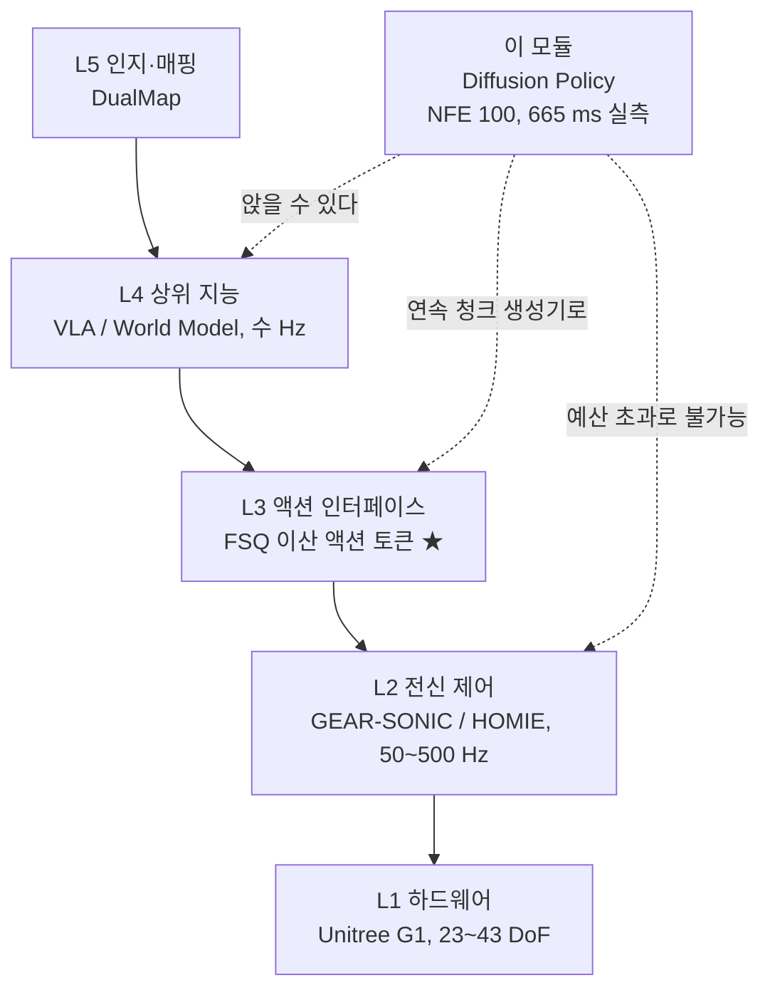

# Diffusion Policy

> **한 줄 요약**: 같은 화면 앞에서 사람이 매번 다르게 움직였을 때 그 답들의 평균을 맞히는 학습이 왜 무너지는지 보고, 평균 대신 여러 답 중 하나를 뽑아내도록 정책을 다시 세운 다음, 그 방식이 로봇에서 얼마나 느린지를 직접 잰 값으로 확인합니다.

---

## 0. 이 모듈 지도

**오늘의 질문** 셋입니다.

- 같은 상황에서 사람이 왼쪽으로도 오른쪽으로도 밀었다면, 그 둘의 평균을 맞히는 학습은 무엇을 만들어내는가?
- 미래 여러 스텝의 움직임을 한 번에 만들어두고 앞부분만 실행하는 방식은 무엇을 사고 무엇을 파는가?
- 공개 라이브러리의 기본 설정으로 돌리면 원 논문과 같은 실험이 되는가?

| 절 | 무엇을 | 끝나면 할 수 있는 것 | 읽는 시간 |
|---|---|---|---|
| §1 | 앞 모듈이 남긴 숙제 | 이 모듈이 왜 필요한지 실측 근거로 말하기 | 2분 |
| §2 | 평균을 맞히면 지는 상황 | 회귀가 무너지는 조건을 수식으로 짚기 | 4분 |
| §3 | 뽑아내는 방식으로 다시 쓰기 | 정책을 조건부 생성 문제로 다시 적기 | 4분 |
| §4 | 앞부분만 실행하기 | 세 숫자로 재계획 주기와 반응 지연 계산하기 | 5분 |
| §5 | 화면에서 움직임까지의 구조 | 블록도를 텐서 크기까지 그리기 | 5분 |
| §6 | 설정값 대조와 추론 비용 | 재현 가능한 실험 설정을 명시하기 | 6분 |
| §7 | 회사 스택 연결 | 이 정책이 앉을 수 있는 자리 지목하기 | 3분 |
| 마무리 | 오해, 한 장 정리, 퀴즈 10문항, 실습 안내 | 백지 재구성으로 자기 점검하기 | 14분 |


**선수 지식**

| 알아야 할 것 | 어디서 채우나 | 이 문서가 대신 설명하는 것 |
|---|---|---|
| 모방학습의 기본, 오차 누적, 액션 청크 | [W2-M1](../01-imitation-learning-act/lesson.md) §2 | 이 모듈에 필요한 부분만 §1에서 되짚음 |
| 확산 모델의 학습과 샘플링 | [W1-M3](../../w1-generative-core/03-diffusion-ddpm-dit/lesson.md) §3~§5 | 유도는 링크로, 결과는 §3에서 한 줄로 재진술 |
| 계층 구조와 지연 예산 부등식 | [W1-M1](../../w1-generative-core/01-physical-ai-landscape/lesson.md) §3, §4 | §4에서 이 모듈의 숫자로 다시 계산 |
| 상태공간, 예측 제어의 재계획 관행 | 보유 배경으로 가정 | 앵커로 쓰는 §4에서 그 자리에 한 줄 재진술 |
| 로봇 학습 파이프라인 실행 경험 | 가정하지 않음 | 명령과 판정 기준은 [`labs/`](labs/)가 클릭 단위로 |

**완료 기준**: 관측 구간과 예측 구간과 실행 구간의 세 숫자를 백지에 그리고, 그 옆에 실측 추론 시간을 넣어 재계획 주기가 성립하는지 계산한다. **소요** 이론 2h, 실습 3~4h

> 📌 **여기까지 정리**
> - 목적지는 회귀가 지는 이유 하나, 실행 구간 산수 하나, 설정 대조표 하나다
> - 세 질문에 §2, §4, §6이 각각 답한다
> - 남는 것은 이 정책이 우리 로봇의 어느 층에 앉을 수 있느냐는 미결 질문이다

---

## 1. 왜 이걸 배우나

| 용어 | 한 줄 정의 | 제어·LLM 비유 |
|---|---|---|
| **BC(Behavior Cloning, 행동 복제)** | 시연 데이터의 관측을 입력, 액션을 출력으로 놓고 지도학습으로 정책을 맞추는 방법 | 시스템 식별과 같은 자리인데 대상이 플랜트가 아니라 조종자다 |
| **다봉 행동 분포(multimodal action distribution)** | 같은 관측에 대해 정답 액션이 여러 갈래로 나뉘어 있는 상태 | 최적해가 여럿인 비볼록 최적화 문제의 해집합 |
| **점추정(point estimate)** | 분포를 대표하는 값 하나만 내놓는 것 | 추정기가 평균만 주고 공분산은 버리는 상황 |

바로 앞 모듈에서 ACT(Action Chunking with Transformers)를 봤습니다. 미래 여러 스텝의 액션을 한꺼번에 내놓고, 시연자의 변동을 흡수하라고 잠재변수 $z$를 둔 조건부 오토인코더였습니다. 그 모듈은 두 사실을 확인하고 끝났습니다. 배포할 때 LeRobot 구현이 $z$를 0 벡터로 고정한다는 것([W2-M1 §2.7](../01-imitation-learning-act/lesson.md))과, 같은 모듈 실습에서 다봉 타깃의 진폭 보존율이 조건부 오토인코더 44.4%, 순수 $\ell_1$ 회귀 44.7%로 사실상 같았다는 것입니다.

둘을 합치면 결론이 하나로 모입니다. **$z$가 있어도 배포 경로는 결국 점추정입니다.** 관측이 같으면 출력이 항상 같고 그 출력은 여러 정답의 중간 어딘가입니다. 학습 시점의 정규화 장치였을 뿐 실행 시점에 모드를 고르는 장치가 아니었습니다.

그래서 필요한 것이 **추론 자체가 샘플링인 정책**이고 Diffusion Policy(2303.04137)가 그 자리에 놓입니다. 원 논문은 4개 벤치마크 12개 태스크에서 평균 46.9% 개선을 보고했고, 그 뒤로 액션 생성 계열 논문 대부분이 이 모델을 비교 기준으로 씁니다. 마스터플랜이 "실험 설정까지 체화할 것"을 요구한 이유가 여기 있습니다. 기준을 잘못 세우면 그 위에 쌓는 비교가 전부 무의미해집니다.

회사 스택 쪽으로는 상위 지능이 행동 의도를 내놓는 L4 자리와 그 의도를 하위 제어기가 먹을 형태로 바꾸는 L3 자리, 두 지점에 걸립니다. 어느 쪽이 가능하고 어느 쪽이 산술적으로 불가능한지를 §7에서 실측 지연으로 가릅니다.

> 📌 **여기까지 정리**
> - 앞 모듈의 정책은 배포 시점에 결정론적이라 여러 정답 중 하나를 고를 수 없었다
> - 실측이 그것을 뒷받침했고 그래서 추론이 곧 샘플링인 모델이 필요해졌다
> - 이 모델은 거의 모든 후속 논문의 비교 기준이라 설정값까지 정확히 알아야 한다

---

## 2. 평균을 맞히면 지는 상황

| 용어 | 한 줄 정의 | 제어·LLM 비유 |
|---|---|---|
| **조건부 기댓값 $\mathbb{E}[a\mid o]$** | 관측 $o$가 주어졌을 때 액션의 평균값 | 최소분산 추정기가 내놓는 바로 그 값 |
| **암묵 정책(implicit policy)** | 액션을 직접 출력하지 않고 에너지 함수를 최소화해 액션을 찾는 정책 | 비용함수를 정의해두고 매번 최적화를 푸는 방식 |
| **에너지 기반 모델(EBM, Energy-Based Model)** | 관측과 액션의 쌍에 스칼라 점수를 매기고 그 점수가 낮은 쪽을 정답으로 보는 모델 | 라그랑지안을 학습해두고 최소점을 찾는 것 |

### 2.1 최소해가 평균이라는 사실

이 모듈의 실습 태스크인 PushT를 예로 듭니다. T자 블록을 목표 위치로 미는 평면 태스크이고 화면은 96×96 픽셀입니다. 함께 들어오는 2차원 상태 `agent_pos`는 관절각이 아니라 **화면 픽셀 좌표계 위의 밀대 위치**이며, 액션도 같은 좌표계의 2차원 목표 위치라 논문 §IV-B가 말하는 위치 명령에 해당합니다.

블록 왼쪽을 밀어 시계 방향으로 돌려도 되고 오른쪽을 밀어 반시계 방향으로 돌려도 됩니다. 사람이 시연하면 회차마다 갈리므로 데이터에는 거의 같은 관측에 정반대 액션이 함께 들어 있습니다. 여기에 제곱오차 회귀를 걸면 결과가 계산으로 정해집니다. 함수 공간에 제약이 없을 때 아래 최소화 문제의 해는 유일합니다.

$$
\arg\min_{f}\; \mathbb{E}_{(o,a)\sim\mathcal{D}}\bigl\|a - f(o)\bigr\|_2^2 \;=\; \mathbb{E}[a \mid o]
$$

- **직관**: 빗나간 정도의 제곱을 줄이는 것이 목표면 답은 언제나 무게중심입니다. 두 모드가 좌우 대칭이면 무게중심은 정확히 가운데입니다.
- **제어 대응**: 최소분산 추정기가 조건부 평균을 내놓는 것과 같은 구조입니다. 추정에서는 평균이 좋은 답이지만 제어에서는 **평균 궤적이 어느 시연도 아닌 궤적일 수 있습니다.** 가운데는 블록 정중앙이고 거기를 밀면 회전이 걸리지 않습니다.
- **손실 종류를 바꿔도 같습니다**: $\ell_1$이면 해가 조건부 중앙값으로 바뀔 뿐 여전히 값 하나이고, 두 모드가 대칭이면 중앙값도 가운데입니다.

ACT가 $\ell_1$을 쓰는데도 앞 모듈 실습의 진폭 보존율이 순수 회귀와 같게 나온 것이 이 지점의 실측 증거입니다. 문제는 손실 함수의 종류가 아니라 **출력이 값 하나라는 사실**입니다.

### 2.2 세 갈래의 처방

원 논문 Fig 1이 정책을 세 부류로 나눕니다.

- **명시 정책(explicit policy)**은 관측을 넣으면 액션이 바로 나오는 회귀이고 위 함정에 걸립니다. 출력을 가우시안 혼합으로 바꾸는 변형이 있지만 모드 개수를 미리 정해야 합니다.
- **암묵 정책**은 관측과 액션 쌍에 에너지 $E_\theta(o,a)$를 매기고 실행할 때 $\arg\min_a E_\theta(o,a)$를 풉니다. 골짜기가 여럿이면 다봉성이 표현되지만 정규화 상수를 다뤄야 합니다.
- **확산 정책**은 학습된 기울기장을 따라 노이즈를 액션으로 정제합니다. 암묵 정책의 표현력을 가지면서 정규화 상수를 피합니다.

세 번째가 비교 기준이 된 실질적 이유는 성능이 아니라 운용 예측 가능성입니다. 암묵 정책 계열은 **학습 손실이 매끄럽게 내려가는데도 액션 복원 정확도가 오르지 않고 평가 성공률이 회차마다 진동합니다.** 그러면 체크포인트를 고를 근거가 사라지는데, 확산 정책에는 이 문제가 없습니다. 계열별 내부와 실패 양상은 [deep-dive.md](deep-dive.md) §1에 있습니다.

> 📌 **여기까지 정리**
> - 제곱오차의 최소해는 조건부 기댓값이고 두 모드가 대칭이면 그 값은 정확히 가운데다
> - 손실을 바꿔도 출력이 값 하나인 한 함정은 같다
> - 대안 셋 중 확산 정책이 표현력과 학습 안정성을 동시에 만족해 비교 기준이 됐다

---

## 3. 뽑아내는 방식으로 다시 쓰기

| 용어 | 한 줄 정의 | 제어·LLM 비유 |
|---|---|---|
| **조건부 생성(conditional generation)** | 조건을 받아 분포에서 표본 하나를 만들어내는 문제 설정 | 참조 신호를 받아 실행 가능한 궤적을 하나 합성하는 것 |
| **관측 구간 $\mathbf{O}_t$** | 시각 $t$까지 최근 몇 프레임의 관측 묶음 | 추정기가 참조하는 과거 측정 윈도 |
| **액션 궤적 $\mathbf{A}_t$** | 한 번에 생성되는 연속된 액션 묶음 | 예측 제어가 한 번 풀 때 나오는 입력열 |
| **기울기장(gradient field)** | 어느 방향으로 조금 움직이면 더 그럴듯해지는지를 알려주는 벡터장 | 비용 지형의 음의 기울기, 경사 하강의 방향장 |

### 3.1 무엇을 조건으로 두고 무엇을 생성하는가

정책을 이렇게 다시 적습니다. 회귀는 $o \mapsto a$ 함수를 학습했지만, 이제는 분포 $p(\mathbf{A}_t \mid \mathbf{O}_t)$를 학습하고 실행할 때 거기서 표본을 뽑습니다.

여기서 붙잡아야 할 구분이 있습니다. **관측은 생성 대상이 아니라 조건입니다.** 원 논문 §III-B가 이 선택을 명시합니다. 관측과 액션을 결합 궤적으로 묶어 함께 생성할 수도 있었지만, 카메라 이미지를 매번 만들어낼 이유가 없고 그 계산을 액션 쪽에 몰아주는 편이 낫습니다. 그래서 노이즈가 실리는 대상은 이미지가 아니라 액션 궤적입니다. [W1-M3 §7](../../w1-generative-core/03-diffusion-ddpm-dit/lesson.md)이 "이미지에서 액션으로"를 이미 다뤘고 이 모듈은 그 자리에 실물 구현과 실측값을 채워 넣습니다.

### 3.2 학습 목표와 샘플링 갱신식

학습은 노이즈를 맞히는 회귀 한 줄입니다. $\epsilon$-예측은 평균 대신 주입된 노이즈를 맞히도록 목표를 바꿔 쓴 재파라미터화이고, 유도는 [W1-M3 §4.3](../../w1-generative-core/03-diffusion-ddpm-dit/lesson.md)에 있습니다. 표기를 액션 궤적으로 갈아 끼우는 대응은 [deep-dive.md](deep-dive.md) §2에 표로 정리했습니다.

$$
\mathcal{L}(\theta) \;=\; \mathbb{E}_{k,\;\epsilon\sim\mathcal{N}(0,I)}\Bigl\|\, \epsilon \;-\; \epsilon_\theta\bigl(\mathbf{O}_t,\; \mathbf{A}_t^{0} + \sigma_k \epsilon,\; k\bigr) \Bigr\|_2^2
$$

LeRobot 0.6.1의 `compute_loss`가 이 식을 그대로 씁니다. 표준정규에서 $\epsilon$을, $\{0,\dots,99\}$에서 균등하게 $k$를 뽑고, `add_noise`로 노이즈를 실은 뒤 신경망 출력과 $\epsilon$ 사이의 제곱오차를 잽니다.

실행은 역방향 반복입니다. 표준정규에서 궤적 하나를 뽑아 시작하고, 매 스텝 신경망을 한 번 평가해 그만큼 노이즈를 걷어냅니다.

$$
\mathbf{A}_t^{k-1} \;=\; \alpha_k\Bigl(\mathbf{A}_t^{k} - \gamma_k\,\epsilon_\theta(\mathbf{O}_t, \mathbf{A}_t^{k}, k)\Bigr) \;+\; \sigma_k z,\qquad z\sim\mathcal{N}(0,I)
$$

- **직관**: 학습된 기울기장이 "이 궤적을 어느 방향으로 밀면 더 사람 시연 같아지는가"를 알려주고, 그 방향으로 정해진 횟수만큼 내려갑니다.
- **제어 대응**: 초기 추측에서 시작해 반복으로 해를 다듬는 최적화와 형태가 같습니다. 다른 점은 목적함수를 사람이 쓴 것이 아니라 데이터에서 학습했다는 것입니다.

### 3.3 다봉성이 어디서 나오는가

원 논문은 다봉 행동의 원천을 둘로 적습니다. **확률적 샘플링 절차**, 곧 위 갱신식의 $\sigma_k z$ 항과, **확률적 초기화**, 곧 매번 표준정규에서 다시 뽑는 $\mathbf{A}_t^{K}$입니다. 후자가 서로 다른 수렴 골짜기를 지정한다는 것이 논문의 설명이고, 실무에서는 이쪽이 더 중요합니다. 결정론적 샘플러로 $\sigma_k z$를 0으로 만들어도 초기값이 매번 다르면 결과는 여전히 갈리기 때문입니다.

여기서 §1이 짚은 대비가 완성됩니다. 앞 모듈의 정책은 배포 시 잠재변수를 0으로 고정해 결정론이 됐지만, 이 정책은 배포 경로 자체가 표본 추출입니다.

> 📌 **여기까지 정리**
> - 정책을 관측 조건부 액션 궤적 생성 문제로 다시 적었고 관측은 조건일 뿐 생성 대상이 아니다
> - 학습은 노이즈를 맞히는 회귀 한 줄이고 실행은 노이즈에서 궤적으로 내려가는 반복이다
> - 다봉성은 샘플링 잡음보다 매번 다시 뽑는 초기값에서 더 크게 온다

---

## 4. 앞부분만 실행하기

| 용어 | 한 줄 정의 | 제어·LLM 비유 |
|---|---|---|
| **관측 horizon $T_o$** | 한 번 추론할 때 정책이 보는 과거 관측 프레임 수 | 상태 추정에 쓰는 측정 윈도의 길이 |
| **예측 horizon $T_p$** | 한 번 추론이 만들어내는 액션 스텝 수 | 예측 제어의 예측 지평 $N$ |
| **실행 horizon $T_a$** | 그중 실제로 로봇에 내보내는 스텝 수 | 예측 제어에서 실제 인가하는 앞부분 입력 |
| **receding horizon** | 앞부분만 쓰고 나머지는 버린 뒤 다음 시점에 다시 계획하는 실행 방식 | 매 스텝 미래 구간 입력열을 풀어놓고 앞부분만 인가한 뒤 다음 스텝에서 다시 푸는 그 관행 |
| **최악 반응 지연** | 새 관측이 명령에 반영되기까지 걸릴 수 있는 최댓값 | 개방루프 구간의 길이가 곧 이 값이 된다 |

### 4.1 세 숫자와 그 겹침

원 논문 §III-A가 정식화한 실행 방식입니다. 시각 $t$에 최근 $T_o$ 스텝의 관측을 받아 $T_p$ 스텝의 액션을 예측하고, 그중 앞의 $T_a$ 스텝만 재계획 없이 실행한 뒤 새 관측으로 처음부터 다시 합니다.

MPC(Model Predictive Control, 모델 예측 제어)를 해본 사람에게 익숙한 구조입니다. 매 스텝 미래 구간의 입력열을 통째로 풀어놓고 앞부분만 인가한 뒤 다음 스텝에서 새 상태로 다시 푸는 그 방식입니다. 다른 점은 모델과 비용함수로 푸는 것이 아니라 시연 분포에서 표본을 뽑는다는 것이고, 그래서 **상태 제약이나 입력 제약을 명시적으로 걸 자리가 없습니다.** 제약은 데이터에 암묵적으로만 들어 있습니다.

LeRobot 기본 설정은 $T_o=2$, $T_p=64$, $T_a=32$이고 논문의 PushT 레시피는 $T_o=2$, $T_p=16$, $T_a=8$입니다. 아래 타임라인은 후자 기준입니다.

```
                 t-1   t   t+1  t+2  ...  t+7  t+8  t+9  ...  t+14  t+15
관측 (T_o = 2)    [o]  [o]
1회차 예측 궤적    |<-------------- T_p = 16 스텝 --------------->|
1회차 실행 구간         [a]  [a]  [a]  ...  [a]                        <- T_a = 8
                       └── 인덱스 1..8, 궤적의 0번은 과거라 버림 ──┘
2회차 관측                                       [o]  [o]
2회차 예측 궤적                                  |<---- T_p = 16 ----> ...
2회차 실행 구간                                       [a]  [a]  ...    <- T_a = 8

재계획 주기 = T_a 스텝 = 8 / 10 Hz = 800 ms
```

구현 쪽 사실을 붙여둡니다. 액션 인덱스가 기본 설정에서 $[-1, 0, 1, \dots, 62]$라 **궤적의 맨 앞 한 칸은 과거 시점이라 버려지고**, `generate_actions`의 슬라이스가 `actions[:, 1:33]`입니다. 실행 시점에는 `select_action`이 청크를 큐에 넣고 한 스텝씩 꺼내 쓰므로 **큐가 비는 순간이 곧 재계획 시점**입니다.

### 4.2 실측 지연을 부등식에 넣는다

[W1-M1 §4.1](../../w1-generative-core/01-physical-ai-landscape/lesson.md)의 부등식을 씁니다. 실행 구간이 덮는 시간이 재계획 주기와 추론 시간과 통신 지연의 합보다 길어야 명령 공백이 없습니다.

$$
T_{\text{replan}} + \tau_{\text{infer}} + \tau_{\text{comm}} \;\le\; \frac{T_a}{f_2}
$$

PushT는 10 Hz라 한 스텝이 100 ms입니다. 추론 시간은 RTX 3080에서 직접 쟀습니다(배치 1, 카메라 1대, 96×96, 워밍업 2회 후 10회 반복의 중앙값). 아래 표에서 **DDPM(Denoising Diffusion Probabilistic Models)**은 매 스텝 노이즈를 다시 주입하는 원본 샘플러이고, **DDIM(Denoising Diffusion Implicit Models)**은 격자를 건너뛸 수 있는 결정론적 샘플러입니다. 둘의 차이는 [W1-M3 §5.1](../../w1-generative-core/03-diffusion-ddpm-dit/lesson.md)에 있고, 여기서는 **NFE(Number of Function Evaluations, 함수 평가 횟수)**만 다르게 준 결과로 읽으면 됩니다.

| 설정 | NFE | 중앙값 | 최소 | 최대 |
|---|---|---|---|---|
| DDPM 100, 라이브러리 기본값 | 100 | **665.2 ms** | 659.5 ms | 672.1 ms |
| DDPM 100, 논문 PushT 설정 | 100 | **705.2 ms** | 698.8 ms | 727.5 ms |
| DDIM 16, 논문 부록 실기 설정 | 16 | **107.1 ms** | 105.7 ms | 112.5 ms |
| DDIM 10, 논문 §III-D | 10 | **68.0 ms** | 67.0 ms | 69.4 ms |
| DDIM 1, 바닥 | 1 | **9.4 ms** | 8.9 ms | 15.5 ms |

산수를 그대로 노출합니다. **스텝마다 재계획한다면 예산이 100 ms인데 기본 설정의 추론이 665 ms입니다. 6.65배 초과라 태스크가 아예 돌지 않습니다.** 그런데 $T_a=32$면 재계획 주기가 3.2초이므로 665 ms가 그 안에 들어갑니다. 곧 **receding horizon은 편의 기능이 아니라 이 모델을 실시간 루프에 얹기 위한 전제 조건**입니다. §3에서 정의한 생성 방식의 비용을 §4의 실행 방식이 갚아주는 구조입니다.

| 실행 방식 | $T_a$ | 재계획 주기 @10 Hz | 추론 실측 | 예산 안에 드는가 | 최악 반응 지연 |
|---|---|---|---|---|---|
| 스텝마다 재계획 | 1 | 100 ms | 665 ms (DDPM 100) | 아니오, 6.65배 초과 | 100 ms |
| 논문 레시피 | 8 | 800 ms | 705 ms (DDPM 100) | 예, 여유 95 ms | 800 ms |
| 논문 실기 설정 | 8 | 800 ms | 107 ms (DDIM 16) | 예, 여유 693 ms | 800 ms |
| 라이브러리 기본값 | 32 | 3,200 ms | 665 ms (DDPM 100) | 예, 여유 2,535 ms | 3,200 ms |

두 번째 행이 아슬아슬합니다. 논문 설정으로 100 스텝을 다 밟으면 705 ms인데 예산이 800 ms라 여유가 95 ms뿐이고, 환경 렌더링과 통신이 얹히면 넘어갑니다. **시뮬레이션 평가는 실시간 제약이 없어 문제되지 않지만 실기에서는 같은 설정이 성립하지 않습니다.** 논문이 실기 실험에서 DDIM으로 갈아탄 이유가 이 산수입니다.

마지막 열도 함께 읽습니다. 라이브러리 기본값의 최악 반응 지연 3,200 ms는 앞 모듈 ACT 기본값의 3,333 ms와 같은 자릿수입니다. [W1-M1 §3.3](../../w1-generative-core/01-physical-ai-landscape/lesson.md)의 "자세가 무너지기까지 200 ms" 문턱에 대면 **16배 밖**이고 논문 레시피의 800 ms도 **4배 밖**입니다. 평면 밀기에는 낙상 모드가 없어 문제가 되지 않지만 전신 균형이 걸린 로봇에 그대로 옮길 수는 없습니다.

### 4.3 실행 구간 길이의 트레이드오프

원 논문 §IV-C가 실행 구간 길이를 바꿔가며 실험했고 결론이 U자입니다.

- $T_a$를 1보다 크게 잡으면 궤적의 시간적 일관성이 좋아지고, 시연에 섞인 정지 구간을 흉내 내다 굳는 문제가 줄어듭니다.
- 너무 길면 새 관측이 반영되지 않아 반응이 느려지고 성능이 떨어집니다.
- 대부분의 태스크에서 **8 스텝이 최적**이었습니다.

§IV-B의 관찰도 붙습니다. 이 정책은 속도 명령보다 **위치 명령에서 일관되게 더 좋았습니다.** 저자들이 든 두 이유와 같은 절의 지연 강건성 실험은 [deep-dive.md](deep-dive.md) §6에 있습니다.

> 📌 **여기까지 정리**
> - 관측 구간과 예측 구간과 실행 구간 세 숫자가 실행 방식을 결정하고 기본값은 2, 64, 32다
> - 기본 설정의 추론 665 ms는 10 Hz 스텝 예산 100 ms를 6.65배 넘으므로 receding horizon이 전제 조건이다
> - 실행 구간은 일관성과 반응성이 맞서는 U자이고 논문 결론은 8 스텝이다

---

## 5. 화면에서 움직임까지의 구조

| 용어 | 한 줄 정의 | 제어·LLM 비유 |
|---|---|---|
| **FiLM(Feature-wise Linear Modulation, 특징별 선형 변조)** | 조건 벡터로 만든 스케일과 시프트를 중간 특징에 곱하고 더해 조건을 주입하는 방식 | 게인 스케줄링, 동작점에 따라 게인을 바꿔 끼우는 그 방식 |
| **공간 소프트맥스(spatial softmax)** | 특징 지도 각 채널에서 활성이 몰린 위치의 좌표를 뽑아내는 풀링 | 영상에서 특징점 좌표를 뽑는 검출기와 같은 출력 형태 |
| **GroupNorm(Group Normalization, 그룹 정규화)** | 채널을 몇 묶음으로 나눠 묶음 안에서 정규화하는 방식, 배치 크기에 의존하지 않음 | 배치 통계를 쓰지 않아 온라인 추론에서 통계가 흔들리지 않는다 |
| **EMA(Exponential Moving Average, 지수이동평균)** | 학습 중 가중치의 지수 가중 평균을 따로 유지해 평가에 쓰는 기법 | 파라미터 추정에 저역통과 필터를 물린 것 |
| **1D temporal CNN(Convolutional Neural Network)** | 시간축을 합성곱 축으로 삼는 1차원 합성곱 신경망 | 유한 임펄스 응답 필터를 층으로 쌓은 구조 |

### 5.1 관측을 조건 벡터로 접는 길

시각 백본은 ResNet-18인데 원 논문이 두 곳을 고쳤습니다.

- **전역 평균 풀링을 공간 소프트맥스로 교체**했습니다. 평균을 내면 "어디에 있는지"가 지워지는데 조작 태스크에서는 그 위치가 정보의 본체입니다.
- **BatchNorm(Batch Normalization, 배치 정규화)을 GroupNorm으로 교체**했습니다. 논문은 이것이 **가중치의 지수이동평균과 함께 쓸 때 중요하다**고 명시합니다.

공간 소프트맥스의 출력 형태가 성질 하나를 만듭니다. 특징 지도를 채널별로 소프트맥스한 뒤 좌표 격자와 내적하면 출력이 $(B, K, 2)$이고 $K=32$면 64차원이라, **입력 해상도가 바뀌어도 조건 벡터의 차원은 그대로입니다.** 그다음 상태 벡터와 이미지 특징을 이어 붙이고 `flatten(start_dim=1)`으로 펴므로 조건 차원이 관측 프레임 수만큼 곱해집니다. 논문 레시피에서 프레임당 $64 + 2 = 66$이고 $T_o=2$이므로 132차원입니다.

### 5.2 액션 궤적을 다루는 몸통

몸통은 액션 궤적을 시간축 신호로 보고 1차원 합성곱으로 처리하는 U-Net입니다. 조건은 FiLM으로 들어가는데, 조건 벡터에서 스케일 $\gamma$와 시프트 $\beta$를 만들어 중간 특징에 $\gamma \odot h + \beta$로 적용하는 방식이고 [W1-M3 §6.2](../../w1-generative-core/03-diffusion-ddpm-dit/lesson.md)의 조건 주입 4방식 중 하나입니다. 관측 조건과 디노이징 스텝 번호 $k$가 같은 경로로 들어갑니다. 원 논문이 버린 설계도 있습니다. 궤적 일부를 고정하고 나머지를 채우는 인페인팅으로 목표를 조건화할 수 있었지만 **receding horizon 실행과 맞지 않아 제거하고 FiLM으로 갔습니다.**

```
[관측 이미지]  (B, T_o=2, 3, 96, 96)
      │  RandomCrop 84x84  (학습은 무작위 위치, 평가는 중앙)
      ▼
[ResNet-18, 전역평균풀링 제거] → (B*T_o, 512, 3, 3)   # 84를 32배 다운샘플하면 3
      │
      ▼
[SpatialSoftmax, K=32]     →  (B*T_o, 32, 2)  →  flatten  (B*T_o, 64)
      │
      │        [관측 상태]  (B, T_o=2, 2)
      │              │
      └──── concat ──┴───────────────→  (B, T_o, 66)
                                            │ flatten(start_dim=1)
                                            ▼
                                   [global_cond]  (B, 132)
                                            │
[노이즈 실린 액션 궤적]  (B, T_p=16, 2) ──┐   │   [스텝 번호 k]  (B,)
                                          │   │        │ sinusoidal + MLP
                                          ▼   ▼        ▼  (B, 128)
                              ┌──────────────────────────────┐
                              │  1D temporal CNN U-Net       │
                              │  down_dims = (512,1024,2048) │
                              │  kernel 5, GroupNorm(8)      │
                              │  조건 주입: FiLM (γ, β)      │
                              └──────────────────────────────┘
                                            │
                                            ▼
                          [예측된 노이즈 ε]  (B, 16, 2)
                                            │  위 갱신식을 NFE회 반복
                                            ▼
                          [액션 궤적 A_t]    (B, 16, 2)
                                            │  actions[:, 1:9]
                                            ▼
                          [실행할 청크]      (B, T_a=8, 2)
```

시간축 길이 $T_p$가 합성곱의 채널 수를 바꾸지 않는다는 점이 뒤에서 결과를 만듭니다. 설정에 `horizon % 2**len(down_dims) == 0` 제약이 있고 다운샘플 단계가 3개라 8의 배수여야 하는데, 기본값 64와 논문 레시피 16 모두 통과합니다.

### 5.3 크기와 무게, 그리고 느린 원인

집필자가 두 설정을 각각 인스턴스화해 파라미터를 셌습니다.

- 총 **262,709,026개**이고 학습 로그의 `num_learnable_params=262709026 (263M)`와 일치합니다.
- 그중 U-Net이 **251,511,938개로 95.7%**이고 나머지 **11,197,088개**가 시각 인코더와 부속입니다.
- **`horizon`을 16에서 64로 바꿔도 총 개수가 변하지 않습니다.** 시간축 합성곱이라 길이에 무관하고 공간 소프트맥스 출력도 해상도에 무관해서입니다.
- 앞 모듈 ACT의 실측 51,613,582개와 비교하면 약 **5.1배**이고 저장 용량도 같은 비로 늘어납니다. 가중치 파일이 **1,002 MB 대 197 MB**, 옵티마이저 상태까지 담은 체크포인트 디렉터리 전체가 **3,007 MB 대 592 MB**입니다. 두 축 모두 5.08배라 파라미터 비와 맞습니다.

그런데 파라미터가 5.1배라고 그만큼 느린 것이 아닙니다. §4.2 표의 맨 아랫줄에서 **함수 평가를 1회로 내리면 9.4 ms이고, 이것은 파라미터가 5분의 1인 ACT의 대역인 한 자릿수에서 십수 ms 안에 그대로 들어옵니다.** 두 값 모두 같은 RTX 3080에서 잰 것입니다. 곧 **이 정책을 느리게 만드는 것은 모델 크기가 아니라 반복 횟수**이고, [W2-M1 §6.5](../01-imitation-learning-act/lesson.md)가 예고한 "NFE 1 대 수십에서 수백"이 여기서 실측으로 갚아집니다.

단서 둘을 답니다. **1스텝은 지연만 해결하지 품질까지 보존한다는 뜻이 아닙니다.** 왜 실제로 1스텝이 안 되는지는 [W1-M4 §6.2](../../w1-generative-core/04-flow-matching/lesson.md)가 다룹니다. 또 ACT 쪽 값은 클럭 상태에 따라 흔들린 범위이고 이 모듈 값은 워밍업 뒤 중앙값이라 측정 조건이 다릅니다. **소수점까지 비교하지 말고 자릿수로 읽으세요.**

> 📌 **여기까지 정리**
> - 시각 백본은 전역 평균 풀링을 공간 소프트맥스로, 배치 정규화를 그룹 정규화로 바꿨다
> - 조건은 프레임별 특징을 펴서 만든 벡터이고 FiLM으로 몸통에 주입된다
> - 파라미터는 ACT의 5.1배지만 느린 원인은 크기가 아니라 반복 횟수다

---

## 6. 설정값 대조와 추론 비용

| 용어 | 한 줄 정의 | 제어·LLM 비유 |
|---|---|---|
| **`num_inference_steps`** | 실행할 때 밟는 디노이징 스텝 수, 곧 함수 평가 횟수 | 적분기의 스텝 수, 줄이면 빨라지고 절단오차가 는다 |
| **`drop_n_last_frames`** | 학습용 샘플을 만들 때 각 에피소드 끝에서 잘라내는 프레임 수 | 유효한 예측 창이 확보되지 않는 꼬리 구간을 버리는 처리 |
| **설정 드리프트(configuration drift)** | 라이브러리 기본값이 원 논문 설정에서 시간이 지나며 벌어진 상태 | 공칭 모델과 현장 튜닝값이 문서 없이 갈라진 상황 |

### 6.1 기본값으로 돌리면 논문 재현이 아니다

이 모듈에서 가장 실무적인 내용입니다. LeRobot 0.6.1의 `DiffusionConfig` 기본값과 허브의 사전학습 체크포인트 `lerobot/diffusion_pusht` 설정을 대조하면 정책 설정에서 여섯 항목이 다르고, **후자가 논문의 PushT 레시피입니다.** 표는 첫 행에 두 항목을 묶었습니다.

| 항목 | 라이브러리 기본값 | 사전학습 체크포인트, 곧 논문 레시피 |
|---|---|---|
| `horizon` / `n_action_steps` | 64 / 32 | 16 / 8 |
| `crop_shape` | `None`, 자르지 않음 | `[84, 84]` |
| `use_group_norm` | `false` | `true` |
| `pretrained_backbone_weights` | ImageNet 사전학습 가중치 | `null`, 무작위 초기화 |
| `use_separate_rgb_encoder_per_camera` | `true` | `false` |

여기에 정책 설정이 아니라 **학습 설정** 쪽에서 일곱 번째 항목이 붙습니다. `TrainPipelineConfig`의 `batch_size` 기본값이 **8**인데 논문은 이미지 기반 실험에 **64**를 썼습니다. 파일이 달라 놓치기 쉬운 자리입니다. 셋째 행도 조심해야 합니다. §5.1에서 본 대로 논문은 그룹 정규화가 가중치 지수이동평균과 함께 쓸 때 중요하다고 했는데 기본값은 그것을 꺼뒀습니다.

그래서 **아무 오버라이드 없이 `lerobot-train --policy.type=diffusion --dataset.repo_id=lerobot/pusht`를 돌리면 논문 재현이 아니라 다른 모델을 학습하는 것입니다.** 아래 명령이 집필자의 실행 검증을 통과했습니다.

```bash
lerobot-train --dataset.repo_id=lerobot/pusht --policy.type=diffusion \
  --policy.horizon=16 --policy.n_action_steps=8 --policy.crop_shape="[84,84]" \
  --policy.use_group_norm=true --policy.pretrained_backbone_weights=null \
  --policy.use_separate_rgb_encoder_per_camera=false \
  --policy.device=cuda --policy.push_to_hub=false --batch_size=64
```

학습 시작 로그에 일곱 항목이 전부 반영된 것을 확인했고 20스텝을 정상 완주했습니다(손실 1.130에서 1.032, 메모리 4.97~5.54 GB). `num_learnable_params`는 262709026으로 기본 설정과 같았습니다. **`--policy.crop_shape="[84,84]"`의 따옴표는 생략하면 안 됩니다.** 셸이 대괄호를 파일명 확장으로 먹습니다.

얻어야 할 것은 명령 하나가 아닙니다. **비교 기준으로 모델을 인용할 때는 라이브러리 버전과 오버라이드한 설정을 함께 적어야 그 비교가 재현 가능해집니다.**

### 6.2 주석과 값이 어긋난 자리

`drop_n_last_frames`의 기본값은 7이고, 코드 주석에 계산식이 적혀 있습니다.

$$
\texttt{drop\_n\_last\_frames} \;=\; T_p - T_a - T_o + 1
$$

논문 PushT 설정 $(16, 8, 2)$를 넣으면 $16 - 8 - 2 + 1 = 7$로 맞습니다. 그런데 라이브러리 기본값 $(64, 32, 2)$를 넣으면 $64 - 32 - 2 + 1 = 31$인데 값은 여전히 7입니다. **곧 기본값이 자기 주석과 어긋난 상태입니다.** 원인은 확인되지 않았습니다. 세 숫자를 키우면서 파생값을 갱신하지 않은 흔적으로 보이지만 단정할 근거가 없고, 확인된 것은 기본값에서 어긋나고 논문 레시피에서는 맞는다는 것뿐입니다. 학습 샘플 구성에 미치는 영향은 [`labs/`](labs/)에서 확인할 대상입니다.

반면 어긋난 것처럼 보였다가 닫힌 항목도 있습니다. `PushtEnv` 설정의 `observation_height`와 `observation_width`가 384라 96×96 데이터셋과 충돌해 보이는데, 환경을 실제로 만들어 보면 **이 두 필드는 환경에 전달되지 않습니다.** `reset()`이 돌려주는 픽셀 관측이 **(96, 96, 3)으로 데이터셋과 같고** 384는 롤아웃 mp4의 해상도일 뿐이라, **학습 해상도와 평가 해상도는 어긋나지 않습니다.** 전처리 뒤의 형태는 [deep-dive.md](deep-dive.md) §8에 있습니다.

### 6.3 스텝 수와 지연, 그리고 원문의 두 숫자

`num_inference_steps`의 기본값은 `None`이고 그러면 학습 스텝 수인 100으로 해소됩니다. 곧 **정책 한 번 호출에 몸통 forward가 100회**이고, 앞 모듈 ACT는 이 수가 1이었습니다. 이 값이 지연 예산에서 어느 자리인지는 [W1-M3 §5.2](../../w1-generative-core/03-diffusion-ddpm-dit/lesson.md)와 [W1-M4 §8.1](../../w1-generative-core/04-flow-matching/lesson.md)의 표에서 이미 봤습니다.

원문에는 스텝 수가 두 군데 나오는데 값이 다릅니다. §III-D는 추론 10회의 DDIM으로 3080에서 0.1초라고 적고, 부록은 시뮬레이션이 100회, 실기가 DDIM 16회라고 적습니다. 둘 다 원문에 있으므로 단정하지 않고 병기합니다(위치는 [deep-dive.md](deep-dive.md) §7). 다만 §4.2의 실측이 하나를 시사합니다. **같은 GPU 기종에서 DDIM 16이 107 ms로 0.1초에 거의 맞고 DDIM 10은 68 ms로 더 빠릅니다.** 곧 원문의 0.1초는 16회 쪽과 잘 맞는데, 이것은 측정에서 나온 관측이지 논문이 명시한 대응은 아닙니다.

여기서 다음 모듈로 가는 길이 열립니다. 스텝 수를 줄이는 세 갈래 중 경로를 직선으로 설계하는 쪽이 [W1-M4](../../w1-generative-core/04-flow-matching/lesson.md)의 Flow Matching이고, W2-M4에서 볼 pi0가 확산 대신 그것을 고른 이유가 §4.2의 665 ms입니다.

> 📌 **여기까지 정리**
> - 라이브러리 기본값은 논문 레시피에서 일곱 항목이 벌어져 있고 그냥 돌리면 재현이 아니다
> - `drop_n_last_frames`는 주석 공식과 기본값이 어긋나 있으며 원인은 확인되지 않았다
> - 함수 평가 100회가 기본이고 그 비용이 다음 모듈들의 출발점이 된다

---

## 7. 회사 스택 연결 ★

| 용어 | 한 줄 정의 | 제어·LLM 비유 |
|---|---|---|
| **WBC(Whole-Body Control, 전신 제어)** | 모든 관절을 묶어 자세와 접촉을 함께 다루는 하위 제어 계층 | 이 스택의 L2이고 50~500 Hz로 돈다 |
| **VLA(Vision-Language-Action, 시각언어행동 모델)** | 이미지와 언어 지시를 받아 액션을 내놓는 상위 정책 | 이 스택의 L4, 수 Hz로 도는 느린 두뇌 |
| **DoF(Degree of Freedom, 자유도)** | 독립적으로 움직일 수 있는 관절 축의 수 | 액션 벡터의 차원을 결정하는 하드웨어 상수 |



### 7.1 앉을 수 있는 자리와 불가능한 자리

이 정책은 화면을 보고 바로 액션을 만드는 통짜 정책이라 계층으로 치면 L4와 L3을 함께 덮습니다. 그런데 실측 지연이 자리를 갈라줍니다.

- **L2 안에는 들어갈 수 없습니다.** 전신 제어는 50~500 Hz라 스텝 예산이 2~20 ms인데 함수 평가를 한 번만 해도 9.4 ms이고 100회면 665 ms입니다. [W1-M4 §8.2](../../w1-generative-core/04-flow-matching/lesson.md)의 자리별 상한 표가 낸 결론을 이 모듈이 실측으로 확인합니다.
- **L4 자리는 가능합니다.** 수 Hz로 도는 계층이라 665 ms가 들어갑니다. 대신 실행 구간을 그만큼 길게 잡아야 하고 그 길이가 곧 최악 반응 지연이 됩니다.
- **L3 자리는 액션의 형태가 문제입니다.** 회사 스택의 L3은 이산 액션 토큰인데 이 정책의 출력은 연속 벡터입니다. 연속 청크를 만든 뒤 **FSQ(Finite Scalar Quantization, 유한 스칼라 양자화)**로 이산화할지는 [W1-M5 §7](../../w1-generative-core/05-latent-discrete-fsq/lesson.md)이 세운 설계 질문 그대로입니다.

### 7.2 데이터와 태스크의 거리

PushT는 평면에서 2차원 액션을 내고 G1은 23~43 DoF 전신입니다. 이 간격에서 차이가 셋 나옵니다.

- **액션 차원**이 2에서 수십으로 늘어납니다. 시간축 합성곱은 채널 수만 바뀌므로 구조는 그대로 확장됩니다.
- **낙상 모드**가 생깁니다. 밀기 실패는 다시 시도하면 되지만 넘어짐은 하드웨어 손상이라 §4.2의 3,200 ms 같은 값을 옮길 수 없습니다.
- **데이터 출처**가 텔레옵입니다. HOMIE의 외골격 조종석은 상체를 사람이 몰고 하체는 강화학습 보행 정책이 맡으므로, 기록되는 액션 벡터의 구성이 곧 생성 대상 차원을 정합니다(`W2M1-3`).

### 7.3 확인되지 않은 것

아래는 공개 자료로 확인되지 않았고 추측하지 않습니다. 전부 팀 확인 대상입니다.

- **L4**: 상위 정책의 액션 생성 방식이 확산 계열인지 흐름 계열인지
- **L3**: 연속 청크를 만든 뒤 이산화하는지, 처음부터 이산 토큰을 예측하는지(`M4-6`과 겹침)
- **L2**: 하위 제어기가 받는 명령이 위치인지 속도인지(§4.3의 논의와 직결)
- **데이터**: 우리 시연에 실제로 다봉성이 있는지. 없으면 이 모델을 쓸 근거가 약해집니다

> 📌 **여기까지 정리**
> - 실측 지연이 자리를 가른다. L2는 산술적으로 불가능하고 L4는 가능하다
> - L3에 앉히려면 연속 출력과 이산 토큰 인터페이스 사이를 메워야 한다
> - 우리 데이터에 다봉성이 실제로 있는지가 이 모델 채택의 전제이고 아직 확인되지 않았다

---

## 흔한 오해

### 오해 1. "액션에 노이즈를 섞어 탐험하게 만드는 방법이다"

방향이 반대입니다. 노이즈는 학습할 때 정답 궤적에 일부러 실어 넣는 것이고 신경망이 맞히는 대상이 그 노이즈입니다. 실행할 때는 순수한 노이즈에서 출발해 학습된 기울기장을 따라 걷어냅니다. 곧 노이즈는 출력에 더해지는 교란이 아니라 **출발점이자 학습 신호**이고, 강화학습의 탐험 잡음과는 목적도 위치도 다릅니다. 이 구분을 놓치면 "노이즈를 줄이면 더 정확해진다"는 결론으로 갑니다. 실제로 정확도를 깎는 것은 스텝 수를 줄이는 쪽이고 노이즈 규모는 스케줄이 정합니다.

### 오해 2. "결정론적 샘플러로 바꾸면 다봉성이 사라진다"

원 논문이 다봉성의 원천을 샘플링 절차의 확률성과 초기값의 확률성 둘로 적는데, 결정론적 샘플러는 앞쪽만 없앱니다. 매번 새로 뽑는 초기 궤적이 남아 서로 다른 수렴 골짜기를 지정하므로 같은 관측에서 다른 모드가 나옵니다. 실무 함의가 큽니다. **스텝 수를 줄이려고 결정론적 샘플러로 갈아타는 것이 다봉성을 포기하는 거래가 아니라는 뜻**이고, 두 축은 분리돼 있습니다.

### 오해 3. "라이브러리 기본값으로 돌리면 논문 baseline이다"

§6.1의 일곱 항목이 답입니다. 예측 구간과 실행 구간이 논문의 네 배로 커져 있고, 이미지 자르기와 그룹 정규화가 꺼져 있고, 시각 백본이 무작위 초기화가 아니라 사전학습 가중치이고, 카메라별 인코더 분리가 반대이고, 학습 배치가 8인데 논문은 64입니다. 이 상태로 얻은 성공률을 논문 수치와 나란히 놓으면 비교가 성립하지 않습니다. **비교 기준을 인용할 때 라이브러리 버전과 오버라이드 목록을 함께 적는 것이 이 모듈이 남기는 실무 습관입니다.**

논문 안에도 비슷한 함정이 있습니다. Table II의 PushT 열에서 합성곱 기반 수치는 FiLM이 아니라 인페인팅으로 조건화한 결과이므로, 표의 숫자를 인용할 때 어느 열인지 확인해야 합니다.

### 오해 4. "함수 평가가 100회니 로봇에는 못 쓴다"

절반만 맞습니다. 전신 제어 루프 안에 못 들어가는 것은 §7.1의 산수가 확정합니다. 그러나 상위 계층은 다릅니다. 실행 구간이 재계획 주기를 벌어주므로 665 ms짜리 추론도 3.2초 주기 안에서는 성립하고, 실기 설정인 DDIM 16이면 107 ms입니다. 정확한 진술은 이렇습니다. **함수 평가 횟수는 품질 노브가 아니라 지연 예산 항목이고, 그 예산을 실행 구간 길이로 살 수 있으며, 대가가 최악 반응 지연입니다.** 200 ms 문턱이 걸린 태스크라면 살 여지가 없으니 스텝 수 자체를 줄여야 하고, 그 길이 W1-M4가 다룬 계열입니다.

---

## 한 장 정리

| 절 | 핵심 한 줄 |
|---|---|
| §1 | 앞 모듈의 정책은 배포 시 결정론이라 여러 정답 중 하나를 고를 수 없었다 |
| §2 | 제곱오차의 최소해가 조건부 기댓값이라, 대칭인 두 모드의 정답은 가운데가 된다 |
| §3 | 정책을 관측 조건부 액션 궤적 생성으로 다시 적고 실행을 표본 추출로 바꿨다 |
| §4 | 세 숫자가 실행을 정하고, 665 ms 추론은 재계획 주기를 늘려야만 성립한다 |
| §5 | 파라미터는 ACT의 5.1배지만 느린 원인은 크기가 아니라 반복 횟수다 |
| §6 | 라이브러리 기본값은 논문 레시피에서 일곱 항목이 벌어져 있다 |
| §7 | 전신 제어 층은 산술적으로 불가능하고 상위 층은 가능하다 |


**이제 할 수 있게 된 것**

- 다봉 행동 분포에서 회귀가 무너지는 이유를 수식 한 줄과 실측 한 쌍으로 설명한다
- 관측 구간과 예측 구간과 실행 구간에 숫자를 넣어 재계획 주기와 최악 반응 지연을 계산한다
- 비교 기준으로 이 모델을 인용할 때 무엇을 함께 명시해야 재현 가능한지 안다

---

## 셀프 체크 퀴즈

1. 좌우 대칭인 두 정답 액션이 있을 때 제곱오차 회귀의 최적해는 무엇인가? $\ell_1$으로 바꾸면 무엇이 달라지는가?
2. 앞 모듈의 잠재변수 $z$가 다봉성을 해결하지 못한 이유를 배포 경로 관점에서 쓰라.
3. 관측이 생성 대상이 아니라 조건이라는 설계 선택은 무엇을 아끼는가?
4. $T_o$, $T_p$, $T_a$가 각각 무엇이고 라이브러리 기본값과 논문 레시피에서 몇인가?
5. 10 Hz에서 스텝마다 재계획하려면 예산이 몇 ms인가? 실측 665 ms는 그 몇 배인가?
6. `n_action_steps=32`일 때 재계획 주기와 최악 반응 지연은 얼마이고, [W1-M1](../../w1-generative-core/01-physical-ai-landscape/lesson.md)의 200 ms 문턱의 몇 배인가?
7. 시각 백본에서 풀링과 정규화를 각각 왜 바꿨는가?
8. `horizon`을 16에서 64로 바꿔도 파라미터 수가 그대로인 이유는?
9. `drop_n_last_frames` 공식에 $(16, 8, 2)$와 $(64, 32, 2)$를 넣으면 각각 얼마이고 실제 기본값은 얼마인가?
10. 결정론적 샘플러로 바꾸면 다봉성이 사라지는가? 두 원천으로 설명하라.

<details>
<summary>정답 보기</summary>

1. 조건부 기댓값 $\mathbb{E}[a\mid o]$, 곧 무게중심입니다. $\ell_1$이면 해가 조건부 중앙값으로 바뀌지만 여전히 값 하나이고, 대칭이면 중앙값도 가운데라 결과가 같습니다.
2. 학습에서는 $z$가 시연자 변동을 흡수하지만 배포에서는 0으로 고정되므로 같은 관측에 항상 같은 출력이 나옵니다.
3. 카메라 이미지를 생성하는 계산을 아끼고 그 용량을 액션 궤적에 몰아줍니다. 원 논문 §III-B의 선택입니다.
4. 순서대로 관측 프레임 수, 한 번에 예측하는 스텝 수, 실제로 실행하는 스텝 수입니다. 기본값 2, 64, 32이고 논문 레시피 2, 16, 8입니다.
5. 100 ms입니다. 665 ms는 그 6.65배라 스텝마다 재계획하는 실행은 성립하지 않습니다.
6. 둘 다 3.2초이고 200 ms 문턱의 16배입니다. 논문 레시피의 800 ms는 4배입니다.
7. 평균 풀링은 위치 정보를 지우는데 조작에서는 그 위치가 핵심이라 좌표를 뽑습니다. 배치 정규화는 배치 통계에 의존해 가중치 지수이동평균과 어긋나기 쉬워 바꿨고 논문이 그 중요성을 명시합니다.
8. 시간축 1차원 합성곱이라 시퀀스 길이가 채널 수를 바꾸지 않고 공간 소프트맥스 출력도 해상도에 무관하기 때문입니다. 두 설정 모두 262,709,026개로 실측됐습니다.
9. 각각 $16-8-2+1=7$과 $64-32-2+1=31$입니다. 실제 기본값은 둘 다 7이라 후자에서 어긋나고 원인은 확인되지 않았습니다.
10. 사라지지 않습니다. 두 원천 중 결정론적 샘플러는 샘플링 절차 쪽만 제거하고, 매번 새로 뽑는 초기 궤적이 서로 다른 수렴 골짜기를 지정합니다.

</details>

---

## 팀에 물어볼 것

앞 모듈까지 적립된 질문과 축이 겹치지 않는 것만 골랐습니다. 청크 실행 정책은 `M4-5`, 함수 평가 횟수와 forward 시간은 `M3-2`, 액션 벡터 구성은 `W2M1-3`이 이미 담당합니다.

1. **`W2M2-1` 우리 시연 데이터에서 다봉성을 측정해본 적이 있는가?** 같은 초기 상태를 반복 시연하는 프로토콜이 있어야 측정이 되는데 그것이 있는가. 다봉성이 없다면 이 계열을 쓸 근거가 약해집니다.
2. **`W2M2-2` 하위 제어기가 받는 명령이 위치인가 속도인가?** §IV-B가 위치 명령에서 일관되게 더 좋았다고 보고했습니다. HOMIE식 구성이면 상체와 하체의 명령 종류가 달라 축이 섞입니다.
3. **`W2M2-3` 베이스라인 재현 레시피가 팀에 고정돼 있는가?** §6.1의 일곱 항목 같은 드리프트가 실재하는데, 팀이 어떤 설정을 기준으로 성능을 비교하는지 문서화돼 있는가.
4. **`W2M2-4` 관측 프레임 2장이 우리 태스크에 충분한가?** 이동 중 조작이면 속도 추정에 더 필요할 수 있습니다. 관측 구간 길이를 정한 근거가 있는가.
5. **`W2M2-5` 체크포인트 선택 기준과 평가 프로토콜은 무엇인가?** 성공률의 정의, 시드 수, 보고 대상 체크포인트. §2.2가 짚은 학습 손실과 성능의 상관을 우리 쪽에서도 확인했는가.
6. **`W2M2-6` 학습과 배포의 카메라 해상도가 같은가?** 공개 데이터셋은 §6.2대로 둘 다 96×96이었습니다. 우리 쪽이 다르다면 리사이즈를 어디서 하고 그 통계가 정규화에 반영되는가.

---

## 실습으로 가기

- [`practice/`](practice/): 회귀가 다봉 타깃에서 무너지는 것과 확산 샘플링이 모드를 살리는 것을 같은 토이 데이터에서 나란히 확인하고, 설정 대조표의 숫자를 코드로 재검증합니다.
- [`labs/`](labs/): LeRobot으로 PushT 학습, 평가, 롤아웃 mp4 저장까지 완주합니다. 마스터플랜이 끝까지 지키라고 명시한 실습입니다.

집필 시점에 실행으로 확인한 값과 막힌 지점입니다.

- 설치는 `uv pip install "lerobot[pusht,diffusion,evaluation]"`입니다. **`diffusion` extra가 없으면 정책 생성 시점에 `diffusers` 부재로 죽습니다.**
- 데이터셋 `lerobot/pusht`는 206 에피소드, 25,650 프레임, 10 fps, 96×96이고 평균 에피소드가 약 124.5 프레임, 곧 12.5초입니다.
- 학습 스모크 300스텝이 **64초**였고 배치 64 기준 초당 6.3~7.0 스텝입니다. 손실은 50스텝 0.883에서 300스텝 0.064, 메모리는 약 5.0 GB였고 10만 스텝 외삽이 **약 4.4시간**입니다.
- **체크포인트 디렉터리 하나가 3,007 MB입니다.** 가중치 1,002 MB에 Adam 모멘트 두 벌이 든 옵티마이저 상태 2,004 MB가 얹힙니다. `--save_freq`를 기본값 20,000보다 줄이면 디스크가 빠르게 찹니다.
- 롤아웃 mp4 2개 생성을 확인했습니다. 384×384, 300 프레임, 10 fps라 한 편이 30초이고, 스모크라 `pc_success 0.0`, `avg_max_reward 0.008472`, `eval_s 13.08`로 바닥입니다.
- 평가를 기본 배치로 돌리면 `gymnasium.error.NamespaceNotFound`로 죽습니다. 병렬 환경 워커가 부모의 임포트를 못 물려받아서이고 `--eval.use_async_envs=false`로 넘어갑니다.
- 허브의 사전학습 체크포인트는 전처리기 파일이 없어 마이그레이션이 필요한데 동봉 스크립트가 `crop_shape` 인코딩에서 중단됩니다. **그래서 정공법은 직접 학습한 체크포인트를 평가하는 것입니다.**

> ⚠️ **미검증(GPU 필요).** 본 학습 10만 스텝과 그 결과의 성공률은 집필 시점에 실행 검증되지 않았습니다.
> 예상 소요: RTX 3080 12GB 기준 약 4.4시간(300스텝 실측에서 외삽). 실행 후 결과를 `docs/progress.md`에 기록하고 이 배지를 제거하세요.

---

## 출처

| 자료 | 위치 | 이 문서에서 쓴 곳 |
|---|---|---|
| Diffusion Policy 논문 | arXiv:2303.04137 (ar5iv HTML) | §2.2, §3.1, §3.3, §4.1, §4.3, §5.1, §5.2, §6.3, 오해 2~4 |
| DDIM | arXiv:2010.02502 | §4.2, §6.3 |
| FiLM | arXiv:1709.07871 | §5.2 |
| LeRobot 소스 | `src/lerobot/policies/diffusion/` 0.6.1 설치본 | §3.2, §4.1, §5, §6.1, §6.2 |
| 사전학습 체크포인트 설정 | `huggingface.co/lerobot/diffusion_pusht` `config.json` | §6.1 |
| 데이터셋과 환경 설정 | `lerobot/pusht`, `lerobot.envs.configs.PushtEnv` | §6.2, 「실습으로 가기」 |
| ACT 대비 수치 | [W2-M1](../01-imitation-learning-act/lesson.md) §6.4와 그 실습 실측 | §1, §4.2, §5.3 |

전부 2026-08-11에 확인했습니다. 추론 지연 5종, 파라미터 수, 학습 스모크, 재현 명령의 설정 반영, 평가 롤아웃은 로컬 RTX 3080 12GB, torch 2.11.0+cu130, lerobot 0.6.1에서 직접 측정한 값입니다. 확인하지 못한 것은 `drop_n_last_frames` 기본값이 주석과 어긋난 원인 하나이고 본문에 그렇게 표시했습니다.

---

## 더 깊이

- [`deep-dive.md`](deep-dive.md): 베이스라인 계열의 계보와 각 실패 양상, 논문 부록 하이퍼파라미터 표 전량, 확산 손실 유도의 이 모듈판 재현, 실측 지연 측정 절차와 원시 출력.

---

**이전 토픽** ← [모방학습 기초와 ACT](../01-imitation-learning-act/lesson.md)
**다음 토픽** → [VLA 계보](../03-vla-lineage/lesson.md) *(집필 예정)*. 여기까지는 태스크마다 정책을 따로 학습했습니다. 다음은 언어를 조건으로 받는 거대 백본이 그 자리를 대신하는 계보이고, 액션을 이산 토큰으로 쪼개는 방식이 처음 등장합니다.
